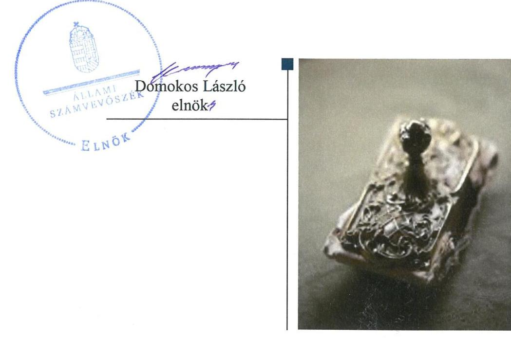
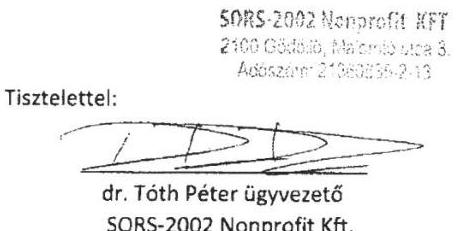
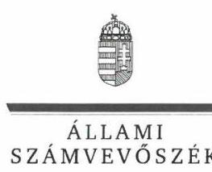
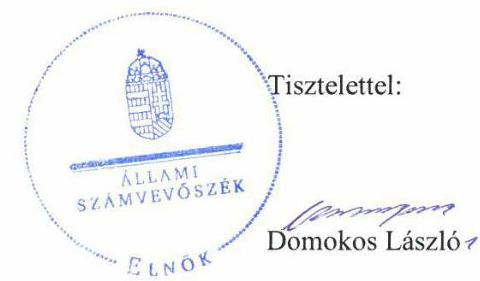

# Jelenetés 

## Nem állami humánszolgáltatók ellenőrzése

A humánszolgáltatást nyújtó államháztartáson kívüli szociális intézmények, szolgáltatók fenntartói központi költségvetésből kapott támogatásai felhasználásának ellenőrzése -SORS-2002 Egészségügyi Szolgáltató Nonprofit Kft.
2019.

---

# Jelentés 

## Nem állami humánszolgáltatók ellenőrzése

A humánszolgáltatást nyújtó államháztartáson kívüli szociális intézmények, szolgáltatók fenntartói központi költségvetésből kapott támogatásai felhasználásának ellenőrzése -SORS-2002 Egészségügyi Szolgáltató Nonprofit Kft.
2019. 11. hó 28. nap

---

# AZ ELLENŐRZÉST FELÜGYELTE:

- KAKAS SÁNDOR felügyeleti vezető
- AZ ELLENŐRZÉST VEZETTE ÉS A VÉGREHAJTÁSÁÉRT FELELŐS:
  - PETRŐ KATALIN ellenőrzésvezető
  - A PROGRAM ÖSSZEÁLLÍTÁSÁÉRT FELELŐS:
    - TÓTPÁL SZABOLCS osztályvezető

**IKTATÓSZÁM:** EL-2162-001/2019.

**TÉMASZÁM:** 2491

**ELLENŐRZÉS-AZONOSÍTÓ SZÁM:** V083509

Jelentéseink az Országgyűlés számítógépes hálózatán és az Interneta a www.asz.hu címen is olvashatóak.

---

# TARTALOMJEGYZÉK 

■ ÖSSZEGZÉS ..... 5
■ AZ ELLENŐRZÉS CÉLJA ..... 6
■ AZ ELLENŐRZÉS TERÜLETE ..... 7
■ AZ ELLENŐRZÉS HÁTTERE, INDOKOLTSÁGA ..... 8
■ A JELENTÉS LÉNYEGES KÉRDÉSKÖRE ..... 9
■ AZ ELLENŐRZÉS HATÓKÖRE ÉS MÓDSZEREI ..... 10
■ MEGÁLLAPÍTÁSOK ..... 12
■ JAVASLATOK ..... 13
■ MELLÉKLETEK ..... 15
I. sz. melléklet: Értelmező szótár ..... 15
■ FÜGGELÉK: ÉSZREVÉTELEK ..... 17
■ RÖVIDÍTÉSEK JEGYZÉKE ..... 25

---

.

---

# ÖSSZEGZÉS 

A SORS-2002 Egészségügyi Szolgáltató Nonprofit Kft. nem alakította ki a szabályszerű müködési és gazdálkodási környezetet, ezáltal a közfeladatot ellátó intézményei müködtetéséhez felhasznált közpénzekre vonatkozó gazdálkodása nem volt átlátható, elszámoltatható.

## Az ellenőrzés társadalmi indokoltsága

Az Állami Számvevőszék stratégiájában hangsúlyos szerepet szán annak, hogy szilárd szakmai alapon álló, értékteremtő ellenőrzéseivel előmozdítsa a közpénzügyek átláthatóságát, rendezettségét és javaslataival a közpénzek és a közvagyon szabályos, gazdaságos, hatékony és eredményes felhasználását segítse. Az Állami Számvevőszék a stratégiájában célul tűzte ki, hogy az államháztartáson kívülre nyújtott költségvetési támogatások ellenőrzésével hozzájáruljon ahhoz, hogy a közpénzeket az államháztartáson kívüli szervezetek is átlátható módon használják fel a közfeladatok szerződésben vállalt ellátása érdekében. Az Állami Számvevőszék e stratégiai céljaival összhangban - az Állami Számvevőszékről szóló 2011. évi LXVI. törvény felhatalmazása alapján - végzi a központi költségvetésből származó források, nyújtott támogatások - kedvezményezett szervezetek közfeladat ellátásához való - felhasználásának az ellenőrzését. Az Állami Számvevőszék hozzájárul ezzel ahhoz is, hogy a nyilvánosság és az igénybevevők megfelelő tájékoztatást kapjanak az államháztartáson kívüli közfeladatot ellátók működéséről.

A SORS-2002 Egészségügyi Szolgáltató Nonprofit Kft.-nél lefolytatott ellenőrzést indokolta az is, hogy a szociális közfeladatok ellátására 623,5 millió Ft központi költségvetési támogatásban részesült az ellenőrzött időszakban.

## Főbb megállapítások, következtetések

A SORS-2002 Egészségügyi Szolgáltató Nonprofit Kft. nem rendelkezett számviteli politikával és az annak keretében elkészítendő eszközök és a források leltárkészítési és leltározási szabályzatával, az eszközök és a források értékelési szabályzatával és pénzkezelési szabályzattal. Számviteli szabályozás hiányában nem alakította ki a szabályszerű működési és gazdálkodási környezetet, a költségvetési támogatások átlátható és elszámoltatható felhasználásának feltételeit.

A szabályzatok hiánya miatt a számviteli elszámolások szabályszerűsége, illetve a közpénzekkel való rendeltetésszerű és felelős gazdálkodás nem volt biztosított. A jogszabályokban előírt beszámoló készítési kötelezettségének nem tett eleget.

Az Állami Számvevőszék a jelentésben foglalt megállapítások alapján a SORS-2002 Egészségügyi Szolgáltató Nonprofit Kft. ügyvezetőjének két javaslatot fogalmazott meg. A javaslatokat megalapozó megállapításokra az érintettnek 30 napon belül intézkedési tervet kell készítenie.

---

# AZ ELLENŐRZÉS CÉLJA 

AZ ELLENŐRZÉS CÉLJA annak értékelése, hogy a SORS-2002 Egészségügyi Szolgáltató Nonprofit Kft., mint Fenntartó ${ }^{1}$ központi költségvetésből kapott támogatásainak felhasználása szabályszerű volt-e, a támogatások igénylése, évközi módosítása és év végi elszámolása megfelelt-e a jogszabályi előírásoknak.

---

# AZ ELLENŐRZÉS TERÜLETE 

## SORS-2002 Egészségügyi Szolgáltató Nonprofit Kft.

A Fenntartó 2009. május 25-én alakult szociális közszolgáltatások biztosítására. Az alapításkori 3 M Ft törzstőke az ellenőrzött időszak végéig nem változott.

A Fenntartó egyszemélyes társaságként múködik, tevékenységét ügyvezető irányítja és három tagú felügyelő bizottság felügyeli. A Fenntartó könyvvizsgálatra kötelezett, az ellenőrzött években megválasztott könyvvizsgálója volt. Az ellenőrzött időszakban az ügyvezető, a felügyelő bizottság tagjai és a könyvvizsgáló személyében nem volt változás.

A Fenntartó közhasznú jogállású szervezet, tevékenysége idősek, fogyatékosok bentlakásos ellátása, valamint a Szoc. tv. szerinti étkeztetés, házi segítségnyújtás, jelzőrendszeres házi segítségnyújtásra, és nappali ellátás volt. A négy Heves megyei nem önálló jogi személyiséggel rendelkező intézményében² az idősek otthona szolgáltatást összesen 209 férőhellyel, a fogyatékos személyek otthona szolgáltatást 40 férőhellyel, az időskorúak nappali ellátása szolgáltatást 45 férőhellyel látta el, illetve a szociális étkeztetés, szociális konyha, házi segítségnyújtás szolgáltatás 72 fővel került bejegyzésre. A szociális ellátás biztosítását, mint közfeladatot a szociális ellátás biztosításáért felelős önkormányzatokkal kötött ellátási szerződések alapján nyújtotta.

A Fenntartó összes bevétele a 2015. évi 453,7 millió Ft-ról 2017. évre 3,6 \%-kal, 470,0 millió Ft-ra nőtt. A Fenntartó tevékenysége ellátására a 2015. évben 196,4 millió, a 2016. évben 199,3 millió és a 2017. évben 227,8 millió Ft támogatást kapott a költségvetésből.

---

# AZ ELLENŐRZÉS HÁTTERE, INDOKOLTSÁGA 

A szociális feladatokat ellátó nem állami intézményfenntartók részére közfeladataik ellátására évente jelentős összegű pénzügyi támogatást biztosítottak a mindenkori költségvetési törvények a bennük megfogalmazott feltételek mellett. A felhasználható állami támogatások a költségvetési törvényekben (a 2014. évi C. törvény Magyarország 2015. évi központi költségvetéséről, 2015. évi C. törvény Magyarország 2016. évi központi költségvetéséről, 2016. évi XC. törvény Magyarország 2017. évi központi költségvetéséről) a 2015-2017. években a szociális ágazatra vonatkozóan 273 Mrd Ft előirányzatot határoztak meg. Módosították a szociális igazgatásról és szociális ellátásokról szóló 1993. évi III. törvényt, amely - többek között 2012. január 1-jei hatállyal megfogalmazta a finanszírozási rendszerbe történő befogadással összefüggő szabályokat.

Az ÁSZ ${ }^{3}$ a stratégiájában célul tűzte ki, hogy az államháztartáson kívülre nyújtott költségvetési támogatások ellenőrzésével hozzájárul ahhoz, hogy a közpénzeket az államháztartáson kívüli szervezetek is átlátható módon használják fel a közfeladatok ellátására kötött szerződésekben vállalt ellátása érdekében. Az ÁSZ stratégiájában foglaltak alapján is indokolt az ellenőrzés, amely a társadalom számára jelzi, hogy a közpénzek államháztartáson kívüli felhasználása sem maradhat ellenőrizhetetlenül. Az államháztartáson kívülre nyújtott költségvetési támogatások ellenőrzésével az ÁSZ hozzájárul ahhoz, hogy a közpénzeket a nem állami humán fenntartók átlátható módon használják fel a közfeladatok ellátására kötött szerződésben vállalt kötelezettségek teljesítése érdekében. Az ellenőrzés javaslataival hozzájárul az említett rendszerek szabályszerű támogatás felhasználásához, javítja a társadalmi-gazdasági döntések megalapozottságát, ami a „jól irányított állam" feltétele.

---

# A JELENTÉS LÉNYEGES KÉRDÉSKÖRE 

A szociális humánszolgáltató közfeladatot ellátó fenntartó meg-teremtette-e a költségvetési támogatások átlátható, elszámoltatható igénybevételének, felhasználásának feltételeit, a költségvetési támogatásokat szabályszerűen fordította-e intézményei müködtetésére, a közpénzekre vonatkozó gazdálkodásával elszá-molt-e?

---

# AZ ELLENŐRZÉS HATÓKÖRE ÉS MÓDSZEREI 

## Az ellenőrzés típusa

Megfelelőségi ellenőrzés.

## Az ellenőrzött időszak

A 2015. január 1-je és 2017. december 31-e közötti időszak.

## Az ellenőrzés tárgya

Az ellenőrzés a szociális humánszolgáltatási közfeladatokat ellátó Fenntartó humánszolgáltatási közfeladatai ellátásához a költségvetési törvényekben biztosított központi költségvetési támogatások igénylése, évközi módosítása és év végi elszámolása fenntartói feladatellátása, illetve e központi költségvetésből kapott támogatásaik humánszolgáltatási közfeladatokra való fenntartó általi felhasználása szabályszerűségének értékelésére terjedt ki.

## Az ellenőrzött szervezet

SORS-2002 Egészségügyi Szolgáltató Nonprofit Kft.

## Az ellenőrzés jogalapja

Az ellenőrzés jogszabályi alapját az ÁSZ tv. ${ }^{4}$ 1. § (3) bekezdése, 5. § (3) bekezdésében foglalt előírások adták.

## Az ellenőrzés módszerei

Az ÁSZ az ellenőrzést az ellenőrzési program szempontjai, kérdései, az ellenőrzött időszakban hatályos jogszabályok, a nemzetközi standardokat irányadónak tekintve, az ellenőrzés szakmai szabályok és módszertanok figyelembe vételével végezte. A közpénzekkel való felelős gazdálkodás segítésére irányuló javaslatok kidolgozásakor a hatályos jogszabályok voltak az irányadóak.

Az ellenőrzés ideje alatt az ellenőrzött szervezettel történő kapcsolattartást az ÁSZ SZMSZ5-ének vonatkozó előírásai alapján biztosította az ÁSZ.

---

Az ellenőrzési kérdések megválaszolásához szükséges bizonyítékok megszerzése az ellenőrzött által rendelkezésre bocsátott dokumentumokra, adatokra alapozva elemző eljárással történt.

Az ellenőrzési bizonyítékként felhasználható adatforrások közé tartoztak egyrészt a szakmai program részletes szempontjainál felsorolt adatforrások, másrészt minden - az ellenőrzés folyamán feltárt, az ellenőrzés szempontjából információt tartalmazó - dokumentum.

Az ellenőrzés lefolytatásához az ellenőrzött szervezet a kitöltött tanúsítványok, valamint az ÁSZ által kért dokumentumok elektronikus úton való megküldésével szolgáltatott adatokat, információkat. Az így rendelkezésre bocsátott adatok, információk és a tanúsítványok adatai valódiságának kontrollja az ellenőrzés keretében történt.

A szociális humánszolgáltatások központi költségvetési támogatásai igénylésével, módosításával, elszámolásával kapcsolatos, államháztartáson kívüli fenntartó jogszabályokban előírt feladatai betartását, továbbá a központi költségvetési támogatások szabályszerű kezelését, nyilvántartását ellenőrizte az ÁSZ a Fenntartónál határozatok, nyilvántartások, beszámolók és egyéb dokumentumok alapján. Az ellenőrzés nem terjedt ki a szociális humánszolgáltatások központi költségvetési támogatásai igénylése, módosítása, elszámolása valódiságának, megalapozottságának, helyességének - sem a Fenntartónál, sem a székhely intézménynél való - értékelésére. Továbbá nem terjedt ki az ellenőrzés e források szociális intézmény általi szabályszerű felhasználásának értékelésére.

---

# MEGÁLLAPÍTÁSOK 

## A szociális humánszolgáltató közfeladatot ellátó fenntartó megteremtette-e a költségvetési támogatások átlátható, elszámoltatható igénybevételének, felhasználásának feltételeit, a költségvetési támogatásokat szabályszerűen fordította-e intézményei múködtetésére, a közpénzekre vonatkozó gazdálkodásával elszámolt-e?

Összegző megállapítás

A Fenntartó nem teremtette meg a költségvetési támogatások elszámoltatható, átlátható igénybevételének és felhasználásának feltételeit. A Fenntartó nem igazolta, hogy a költségvetési támogatásokat intézményei múködtetésére fordította. Intézményei múködtetéséhez felhasznált közpénzekre vonatkozó gazdálkodásával nem számolt el.

A Fenntartó múködésének szabályozottsága, ennek keretében gazdálkodására vonatkozó belső szabályozás az ellenőrzött időszakban nem felelt meg a jogszabályban előírtaknak, mivel a 2015-2017. években nem rendelkezett a Számv. tv. ${ }^{6}$ 14. § (3) bekezdésében előírt számviteli politikával és a Számv. tv. 14. § (5) bekezdés a), b) és d) pontjában előírt, a számviteli politika keretében elkészítendő eszközök és a források leltárkészítési és leltározási szabályzatával, az eszközök és a források értékelési szabályzatával és pénzkezelési szabályzattal.

A Fenntartó a számviteli szabályzatok hiánya miatt nem biztosította a szociális közfeladat ellátására igénybevett közpénzek átlátható felhasználásának feltételeit, melynek hiányában nem volt igazolt, hogy a költségvetési támogatásokat intézményei múködtetésére fordította, illetve a jóváhagyott célra használta fel.

A Fenntartó a beszámoló készítési kötelezettségének a 2015-2017. években a Számv. tv. 4. § (1) bekezdésében foglaltak ellenére nem tett eleget.

---

# JAVASLATOK 

Az ÁSZ tv. 33. § (1) bekezdésében foglaltak értelmében az ellenőrzött szervezet vezetője köteles a jelentésben foglalt megállapításokhoz kapcsolódó intézkedési tervet összeállítani és azt a jelentés kézhezvételétől számított 30 napon belül az ÁSZ részére megküldeni. Amennyiben az ellenőrzött szervezet vezetője nem küldi meg határidőben az intézkedési tervet, vagy továbbra sem elfogadható intézkedési tervet küld, az Állami Számvevőszék elnöke az ÁSZ tv. 33. § (3) bekezdése a) és b) pontjaiban foglaltakat érvényesítheti.

## a SORS-2002 Egészségügyi Szolgáltató Nonprofit Kft. ügyvezetőjének

1. Gondoskodjon a számviteli politika kialakításáról és írásba foglalásáról és annak keretében
a) az eszközök és a források leltárkészítési és leltározási szabályzata;
b) az eszközök és a források értékelési szabályzata;
c) valamint a pénzkezelési szabályzat
elkészítéséről a Számv. tv. előírásai szerint.
(1 sz. megállapítás 1. bekezdése alapján)
2. Gondoskodjon a beszámoló készítési kötelezettségének teljesítéséről a jogszabályi előírás szerint.
(1 sz. megállapítás 3. bekezdése alapján)

---

.

---

# MELLÉKLETEK 

- I. SZ. MELLÉKLET: ÉRTELMEZŐ SZÓTÁR
civil szervezet
ellátási terület
feladatfinanszírozás
humánszolgáltatás
költségvetési támogatás
nem állami, nem önkormányzati (államháztartáson kívüli) intézmény fenntartó
székhely intézmény
telephely

A Civil tv. 2. § 6. pontja szerint civil szervezet a civil társaság, a Magyarországon nyilvántartásba vett egyesület (a párt, a szakszervezet és a kölcsönös biztosító egyesület kivételével), a közalapítvány és a pártalapítvány kivételével az alapítvány.
Az a terület, ahonnan az engedélyes gyermekeket, illetve más ellátottakat fogad.
A közfeladat államháztartáson kívüli szervezet által történő ellátásához közvetlenül kapcsolódó, arányos müködési költségeket finanszírozó költségvetési támogatás.
Külön törvényben meghatározott szociális, gyermekjóléti, gyermekvédelmi, közoktatási, felsőoktatási, kulturális közfeladatok (2014. évi Kvtv. ${ }^{7}$ 34. § (1), (4) bekezdés, 1. számú melléklet XX/20/2. alcím, 19. alcím, 2015. évi Kvtv. ${ }^{8}$ 43. § (1), (4) bekezdés, 1. számú melléklet XX/20/2/3. jogcím csoport, 19. alcím, 2016. évi Kvtv. 41. § (1), (4) bekezdés, 1. számú melléklet XX/20/2/3. jogcím csoport, 19. alcím).
a társadalombiztosítás pénzügyi alapjai kivételével az államháztartás központi alrendszeréből ellenérték nélkül, pénzben nyújtott támogatások (Áht. ${ }^{9}$ 1. § 14. pont)
A költségvetési törvényekben (2013. évi CCXXX. törvény 33-34. §, 2014. évi C. törvény 42-43. §, 2015. évi C. törvény 40-41. §) megállapított támogatás. Például a 2015. évi C. törvény 40-41. § szerint többek között: Az Országgyűlés a szociális, gyermekjóléti, gyermekvédelmi közfeladatot ellátó intézményt, szolgáltatást fenntartó egyházi jogi személy, civil szervezet, közalapítvány, országos nemzetiségi önkormányzat, települési vagy területi nemzetiségi önkormányzat, gazdasági társaság, és a humánszolgáltatást alaptevékenységként végző, az Szja tv. hatálya alá tartozó egyéni vállalkozó (a továbbiakban együtt: nem állami szociális fenntartó) részére támogatást állapít meg a következők szerint: a támogatás a nem állami szociális fenntartót a települési önkormányzatok 2. melléklet III. pont 3. alpont c)-k) pontjában és III. pont 5. alpont a) pontjában meghatározott támogatásaival azonos jogcímeken, összegben és feltételek mellett illeti meg.
A szociális, gyermekjóléti és gyermekvédelmi közfeladatokat/humánszolgáltatásokat ellátó intézményt fenntartó egyházi jogi személy, társadalmi szervezet, alapítvány, közalapítvány, civil szervezet, országos nemzetiségi önkormányzat, nonprofit gazdasági társaság, gazdasági társaság és a humánszolgáltatást alaptevékenységként végző, Szja tv. hatálya alá tartozó egyéni vállalkozó. (2013. évi Kvtv. ${ }^{10}$ 35. § (1), (3) bekezdés, 2014. évi Kvtv. 33. §, 34. § (1), (4) bekezdés, 2015. évi Kvtv. 42. §, 43. § (1), (4) bekezdés, 2016. évi Kvtv. ${ }^{11} 40 . \S, 41 . \S$ (1), (4) bekezdés, 2017. évi Kvtv. ${ }^{12} 41 . \S$ (1), (4))
a szolgáltató székhelye, azaz a szolgáltató központi ügyintézésének helye, függetlenül attól, hogy használják-e szolgáltatás nyújtására (Sznyvhr ${ }^{13}$. 1.§ k) pont) (hatályos: 2013. december 1-től)
a szolgáltató székhelyétől különböző, szolgáltató/intézmény használatában álló hely, a szociális humánszolgáltatáshoz használt, bejegyzett hely. (Sznyvhr. 1.§ l) pont) (hatályos: 2015. január 1-től)

---

.

---

# FÜGGELÉK: ÉSZREVÉTELEK 

A jelentéstervezetet a Számvevőszék 15 napos észrevételezésre megküldte az ellenőrzött szervezet vezetőjének az ÁSZ tv. 29. §* (1) bekezdése előírásának megfelelően.

Az ÁSZ a jelentéstervezetet észrevételezésre megküldte a SORS-2002 Egészségügyi Szolgáltató Nonprofit Kft. ügyvezetője részére.
A SORS-2002 Egészségügyi Szolgáltató Nonprofit Kft. ügyvezetője élt az ÁSZ tv. 29. § (2) bekezdésében foglalt észrevételezési jogával, a jelentéstervezet megállapításaira a törvényes határidőn belül észrevételt tett.
A SORS-2002 Egészségügyi Szolgáltató Nonprofit Kft. ügyvezetőjének észrevételeit és az arra adott választ a függelék tartalmazza.

[^0]
[^0]:    * 29. § (1) Az Állami Számvevőszék az ellenőrzési megállapításait megküldi az ellenőrzött szervezet vezetőjének vagy az általa megbízott személynek, és annak, akinek személyes felelősségét állapította meg.
    (2) Az ellenőrzött szervezet vezetője és a felelősként megjelölt személy az ellenőrzés megállapításaira tizenöt napon belül írásban észrevételt tehet.
    (3) Az Állami Számvevőszék az észrevételre a beérkezésétől számított harminc napon belül írásban válaszol. A figyelembe nem vett észrevételeket köteles a jelentésben feltüntetni, és megindokolni, hogy azokat miért nem fogadta el.

---

# Állami Számvevőszék 

Budapest,
Apáczai Csere János utca 10.
1052

Tárgy: Észrevételek jelentéstervezetre és felhívásnak való megfelelés
Iktatószám: $\quad$ EL-1111-042/2019
EL-1111-046/2019

## Tisztelt Állami Számvevőszék!

Alulírott, dr. Tóth Péter mint a vizsgálattal érintett SORS-2002 Nonprofit Kft. (székhely: 2100 Gödöllő, Malomtó utca 8.) ügyvezetője a fenti iktatószámú levelekre az alábbiakban kívánunk reagálni.

## Ad EL-1111-042/2019. Iktatószámú levél és jelentéstervezet

A megküldött jelentéstervezetre a törvényes határidőn belül az alábbi észrevételeket kívánjuk tenni:
Álláspontunk szerint a jelentéstervezetben tett főbb megállapítások nem pontosak Társaságunkra nézve, ugyanis a megállapítások között tényként rögzíti a jelentéstervezet, hogy számviteli politikával nem rendelkezett Társaságunk. Ezzel szemben Társaságunk számviteli politikával rendelkezett, hiszen az az eljárás kezdetén becsatolásra is került a Tisztelt Számvevőszék részére.

Amennyiben a számviteli politika részét képező leltározási és értékelési szabályzatok nem voltak megtalálhatók a benyújtott számviteli politikában, úgy ezen körülmény álláspontunk szerint a számviteli politika hiányosságát jelentheti, de nem szolgálhat alapul a számviteli politika egészre hiányaként mint megállapításnak, hiszen a szabályzat becsatolásra került, melyről visszaigazolás is érkezett.

Szintén észrevételezni kívánjuk, hogy a jelentéstervezet a számviteli politika keretében pénzkezelési és leltározási szabályzat hiányát is megjelöli. Társaságunk minden intézményére kiterjedően rendelkezik pénzkezelési és leltározási szabályzattal, melyek az eljárás kezdetén a Tisztelt Számvevőszék felhívása szerint becsatolásra kerültek. Ugyan ezen szabályzatok nem a számviteli politika mellékleteként kerültek becsatolásra, de önmagában a feltöltés körülményei és a szabályzatoknak a dokumentáción belüli elhelyezkedése nem alapozhatja meg annak mellőzését, ha egyébként azzal rendelkezik Társaságunk.

A jelentéstervezet továbbá abban a közben is megállapítást tesz, hogy a vizsgált időszakban Társaságunk nem tett eleget beszámoló-készítési kötelezettségének. Ezen megállapítást a Tisztelt Számvevőszék abból a körülményből vezeti le, hogy Társaságunk nem csatolta a beszámolók mellékleteként a közhasznúsági jelentést. Társaságunk a beszámolók becsatolása iránti felhívást szűken értelmezte, így a közhasznúsági jelentés a beszámolók mellékleteként nem került csatolásra,

---

de természetesen azzal minden tekintetben és minden évre vonatkozóan rendelkezik Társaságunk, melyet jelen levelünkhöz csatolunk is. Ennek hiányában Társaságunk müködése nem lenne lehetséges, hiszen az állandó hatósági ellenőrzések minden esetben kitérnek ezen dokumentumok meglétének és megfelelőségének ellenőrzésére is. Jelen esetben kizárólag értelmezési félreértés miatt nem kerültek csatolásra ezen dokumentumok. Ugyanakkor önmagában, amennyiben a Tisztelt Számvevőszék nem veszi figyelembe a becsatolt közhasznúsági jelentéseket, a megállapítások akkor is pontosításra szorulnak, hiszen a beszámoló-készítési kötelezettségének a Társaságunk eleget tett, csak azok az Önök részére hiányosan kerültek megküldésre, mely körülmény önmagában nem jelentheti azt, hogy nem tettünk eleget kötelezettségünknek.

Kérem, hogy a fenti körben szíveskedjenek a korábban megküldött anyagokat ismételten megvizsgálni és a jelentéstervezet megállapításait módosítani, pontosítani.

# Ad EL-1111-046/2019. Iktatószámú levél 

Tájékoztatom a Tisztelt Számvevőszéket, hogy jelen levelemhez mellékelem a kért, jelenleg hatályos szabályzatokat és egyidejűleg kérem Önöket a vagyonmegóvási intézkedés mellőzésére.

Gödöllő, 2019. szeptember 19.

---

ELNÖK

Ikt. szám: EL-1111-048/2019.

# Dr. Tóth Péter úr 

ügyvezető
SORS-2002 Egészségügyi Szolgáltató Nonprofit Kft.

## Gödölló

## Tisztelt Ügyvezető Úr!

A „Nem állami humánszolgáltatók ellenőrzése - A humánszolgáltatást nyújtó államháztartáson kívüli szociális intézmények, szolgáltatók fenntartói központi költségvetésböl kapott támogatásai felhasználásának ellenőrzése - SORS-2002 Egészségügyi Szolgáltató Nonprofit Kft. " címmel készített számvevőszéki jelentéstervezetre tett észrevételét megkaptam.
Az Állami Számvevőszék észrevételekre vonatkozó álláspontjáról a felügyeleti vezető által készített részletes tájékoztatást csatoltan megküldőm.
Tájékoztatom Ügyvezető urat, hogy a számvevőszéki jelentésben - az Állami Számvevőszékről szóló 2011. évi LXVI. törvény 29. § (3) bekezdése alapján - a figyelembe nem vett észrevételeket szerepeltetjük az elutasítás indokának feltüntetésével.

Budapest, 2019. 16 hó 4 nap

Melléklet: Tájékoztatás az észrevételek kezeléséről

---

# Tájékoztatás az észrevételek kezeléséről 

A „Nem állami humánszolgáltatók ellenőrzése - A humánszolgáltatást nyújtó államháztartáson kívüli szociális intézmények, szolgáltatók fenntartói központi költségvetésböl kapott támogatásai felhasználásának ellenőrzése - SORS-2002 Egészségügyi Szolgáltató Nonprofit Kft." című jelentéstervezetre (továbbiakban: jelentéstervezet) a SORS-2002 Egészségügyi Szolgáltató Nonprofit Kft. (továbbiakban: Társaság) ügyvezetőjének 2019. szeptember 19-én kelt levélben megküldött észrevételeit áttekintettem. Az észrevételek kezeléséről az alábbi tájékoztatást adom.

## 1. A számviteli politikával kapcsolatban tett észrevételre vonatkozóan

A Társaság ügyvezetője észrevételében vitatta a jelentéstervezetben a Társaság számviteli politikájának hiánya kapcsán tett megállapítást.
Az Állami Számvevőszék EL-1111-001/2018. iktatószámú, 2018. szeptember 12-én kelt adatbekérő levélében kérte be - többek között - a Társaság számviteli politikáját. A Társaság ezen adatbekérésre vonatkozó adatszolgáltatása során az Állami Számvevőszék rendelkezésre bocsátotta a SORS-2002 KHT 2008. március 1-én kelt számviteli politikáját. A Társaság minderről a 2018. szeptember 20-án kelt teljességi és hitelességi nyilatkozatát is megküldte az Állami Számvevőszék részére.
A cégnyilvántartás adatai szerint azonban a SORS-2002 Egészségügyi Szolgáltató Közhasznú Társaság a cégnyilvántartásból 2009. július 16-i hatállyal törlésre került, ennek okán a Társaság részéről megküldött számviteli politika egy korábban megszűnt gazdálkodó számviteli szabályozásának részét képezi.
A Társaság megalakulásának időpontja a cégnyilvántartás adatai szerint 2009. május 25., míg annak bejegyzésének dátuma 2009. július 16. A számvitelről szóló 2000. évi C. törvény (továbbiakban: Számv. tv.) 14. § (11) bekezdésében foglaltak szerint az újonnan alakuló gazdálkodó a számviteli politikát, a megalakulás időpontjától számított 90 napon belül köteles elkészíteni.
Mindezekre tekintettel a Társaság ügyvezetőjének a számviteli politikára vonatkozó észrevételét nem fogadjuk el, a jelentéstervezet észrevétellel érintett megállapítása helytálló, annak módosítása nem indokolt.

---

# 2. A pénzkezelési szabályzattal, valamint az eszközök és a források leltárkészitési és leltározási szabályzatával kapcsolatban tett észrevételre vonatkozóan 

A Társaság ügyvezetője észrevételében vitatta a jelentéstervezetben a Társaság pénzkezelési szabályzat, valamint az eszközök és a források leltárkészitési és leltározási szabályzata hiánya kapcsán tett megállapítást.
Az Állami Számvevőszék EL-1111-001/2018. iktatószámú, 2018. szeptember 12-én kelt adatbekérő levélében kérte be - többek között - a Társaság pénzkezelési szabályzatát, valamint az eszközök és a források leltárkészitési és leltározási szabályzatát. A Társaság ezen adatbekérésre vonatkozó adatszolgáltatása során az Állami Számvevőszék rendelkezésre bocsátotta négy Heves megyei nem önálló jogi személyiséggel rendelkező intézménye pénzkezelési szabályzatait, valamint az eszközök és források leltárkészitési és leltározási szabályzatait. A Társaság minderről a 2018. szeptember 20-án kelt teljességi és hitelességi nyilatkozatát is megküldte az Állami Számvevőszék részére.
A Társaság adatszolgáltatása során - a Társaság 2018. szeptember 20-án kelt teljességi és hitelességi nyilatkozatának megfelelően - nem került sor a Társaság pénzkezelési szabályzatának, valamint az eszközök és a források leltárkészitési és leltározási szabályzatának az Állami Számvevőszék részére történő átadására.
A Számv. tv. 14. § (3) és (5) bekezdéseiben rögzítettek alapján a számviteli politikát és a keretében kötelezően elkészítendő szabályzatokat a gazdálkodóra, jelen esetben a Társaságra vonatkozóan szükséges kialakítani és írásba foglalni.
Mindezekre tekintettel a Társaság ügyvezetőjének a pénzkezelési szabályzatra, valamint az eszközök és a források leltárkészitési és leltározási szabályzatára vonatkozó észrevételét nem fogadjuk el, a jelentéstervezet észrevétellel érintett megállapítása helytálló, annak módosítása nem indokolt.

## 3. A beszámolóval kapcsolatban tett észrevételre vonatkozóan

A Társaság ügyvezetője észrevételében vitatta a jelentéstervezetben a Társaság beszámolókészitési kötelezettségének teljesítésére vonatkozó megállapítást.
Az Állami Számvevőszék EL-1111-001/2018. iktatószámú, 2018. szeptember 12-én kelt adatbekérő levélében kérte be - többek között - a Társaság 2015-2017. évi számviteli beszámolóit. A Társaság ezen adatbekérésre vonatkozó adatszolgáltatása során az Állami Számvevőszék rendelkezésre bocsátotta a 2015-2017. évekre vonatkozó „számviteli beszámoló" elnevezésű dokumentumokat. A Társaság minderről a 2018. szeptember 20-án kelt teljességi és hitelességi nyilatkozatát is megküldte az Állami Számvevőszék részére.
A Társaság a Számv. tv. 9. § (2) bekezdésének megfelelően olyan gazdálkodó, amely vagyoni, pénzügyi, jövedelmi helyzetéről egyszerűsített éves beszámolót készíthet. A Számv. tv. 96. § (1) bekezdésében foglaltak alapján mérlegből, eredménykimutatásból és kiegészítő mellékletből áll.

---

A megküldött dokumentumok áttekintését követően megállapítottam, hogy azok valamennyi év vonatkozásában mérlegből és eredménykimutatásból álló dokumentumok, a kiegészítő melléklet egyik ellenőrzött év vonatkozásában sem került megküldésre, így azok nem tesznek eleget a Számv. tv. 96. § (1) bekezdésében foglalt előírásnak, így nem tekinthetők egyszerűsített éves beszámolóknak.
Mindezekre tekintettel a Társaság ügyvezetőjének a beszámolóval kapcsolatban tett észrevételét nem fogadjuk el, a jelentéstervezet észrevétellel érintett megállapítása helytálló, annak módosítása nem indokolt.

Budapest, 2019. 10 hó 16 . nap

Kakas Sándor felügyeleti vezető

---

.

---

# RÖVIDÍTÉSEK JEGYZÉKE 

${ }^{1}$ Fenntartó
${ }^{2}$ intézmény
${ }^{3}$ ÁSZ
${ }^{4}$ ÁSZ tv.
${ }^{5}$ ÁSZ SZMSZ
${ }^{6}$ Számv.tv.
${ }^{7}$ 2014. évi Kvtv.
${ }^{8}$ 2015. évi Kvtv.
${ }^{9}$ Áht.
${ }^{10}$ 2013. évi Kvtv.
${ }^{11}$ 2016. évi Kvtv.
${ }^{12}$ 2017. évi Kvtv.
${ }^{13}$ Sznyvhr.

SORS-2002 Egészségügyi Szolgáltató Nonprofit Kft.
Fehér Hárs Idősek Otthona (Heves, Kolozsvári út 10/A.), Dr. Szegő Imre Idősek és Mozgásfogyatékosak Otthona (Heves, Fő út 63.), Gesztenyés Idősek Otthona (Recsk, Ércbányatelep u. 3.), Heves Városi Gondozási Központ (Heves, Fő út 63.) útján látta el.
Állami Számvevőszék
az Állami Számvevőszékről szóló 2011. évi LXVI. törvény (hatályos: 2011. július 1-től)
az Állami Számvevőszék Szervezeti és Müködési Szabályzata
2000. évi C. törvény - a számvitelről
2013. évi CCXXX. törvény Magyarország 2014. évi központi költségvetéséről
2014. évi C. törvény Magyarország 2015. évi központi költségvetéséről
2011. évi CXCV. törvény az államháztartásról
2012. évi CCIV. törvény Magyarország 2013. évi központi költségvetéséről
2015. évi C. törvény Magyarország 2016. évi központi költségvetéséről
2016. évi XC. törvény Magyarország 2017. évi központi költségvetéséről 369/2013. (X. 24.) Korm. rendelet a szociális, gyermekjóléti és gyermekvédelmi szolgáltatók, intézmények és hálózatok hatósági nyilvántartásáról és ellenőrzéséről

---

# ÁLLAMI SZÁMVEVŐSZÉK 

1052 Budapest, Apáczai Csere János utca 10.
Levélcím: 1364 Budapest 4. Pf. 54
Telefon: +36 14849100 Telefax: +36 14849200
www.asz.hu