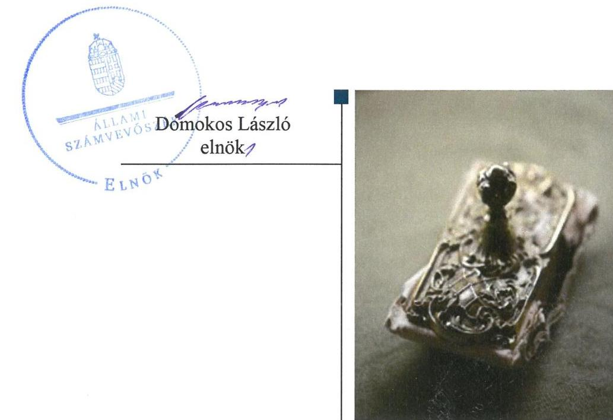
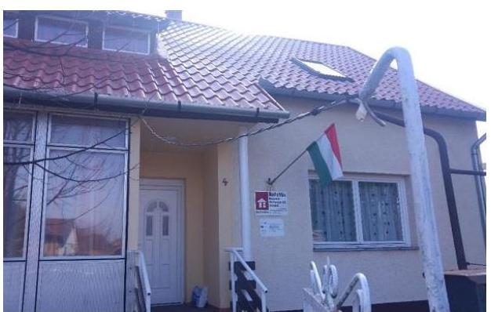
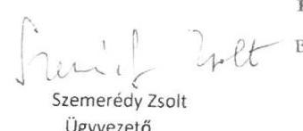
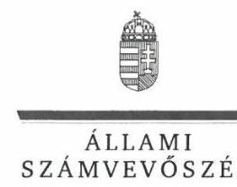
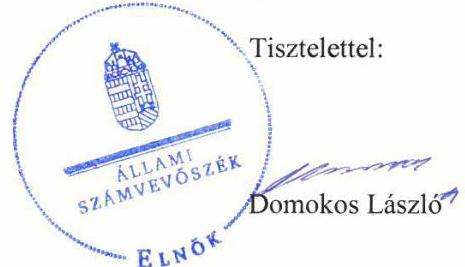

# Jelenetés 

## Nem állami humánszolgáltatók ellenőrzése

A humánszolgáltatást nyújtó államháztartáson kívüli szociális intézmények, szolgáltatók fenntartói központi költségvetésből kapott támogatásai felhasználásának ellenőrzése ReFoMix Nonprofit Közhasznú Kft.
2019.

---

# Jelentés 

## Nem állami humánszolgáltatók ellenőrzése

A humánszolgáltatást nyújtó államháztartáson kívüli szociális intézmények, szolgáltatók fenntartói központi költségvetésből kapott támogatásai felhasználásának ellenőrzése ReFoMix Nonprofit Közhasznú Kft.
2019. 11. hó 28. nap

---

# AZ ELLENŐRZÉST FELÜGYELTE:

- KAKAS SÁNDOR felügyeleti vezető
- AZ ELLENŐRZÉST VEZETTE ÉS A VÉGREHAJTÁSÁÉRT FELELŐS:
  - PETRŐ KATALIN ellenőrzésvezető
  - A PROGRAM ÖSSZEÁLLÍTÁSÁÉRT FELELŐS:
    - TÓTPÁL SZABOLCS osztályvezető

**IKTATÓSZÁM:** EL-2165-001/2019

**TÉMASZÁM:** 2491

**ELLENŐRZÉS-AZONOSÍTÓ SZÁM:** V083511

Jelentéseink az Országgyűlés számítógépes hálózatán és az Interneten a www.asz.hu címen is olvashatóak.

---

# TARTALOMJEGYZÉK 

■ ÖSSZEGZÉS ..... 5
■ AZ ELLENŐRZÉS CÉLJA ..... 6
■ AZ ELLENŐRZÉS TERÜLETE ..... 7
■ AZ ELLENŐRZÉS HÁTTERE, INDOKOLTSÁGA ..... 8
■ A JELENTÉS LÉNYEGES KÉRDÉSKÖREI ..... 9
■ AZ ELLENŐRZÉS HATÓKÖRE ÉS MÓDSZEREI ..... 10
■ MEGÁLLAPÍTÁSOK ..... 12
■ JAVASLATOK ..... 14
■ MELLÉKLETEK ..... 15
I. sz. melléklet: Értelmező szótár ..... 15
■ FÜGGELÉK: ÉSZREVÉTELEK ..... 17
■ RÖVIDÍTÉSEK JEGYZÉKE ..... 27

---

.

---

# ÖSSZEGZÉS 

A ReFoMix Rehabilitációs Foglalkoztatási és Szociális Szolgáltató Nonprofit Közhasznú Kft. működési és gazdálkodási környezetét szabályszerűen alakította ki. A közfeladatot ellátó intézményei működtetéséhez felhasznált közpénzekre vonatkozó gazdálkodása nem volt átlátható, elszámoltatható.

## Az ellenőrzés társadalmi indokoltsága

Az Állami Számvevőszék stratégiájában hangsúlyos szerepet szán annak, hogy szilárd szakmai alapon álló, értékteremtő ellenőrzéseivel előmozdítsa a közpénzügyek átláthatóságát, rendezettségét és javaslataival a közpénzek és a közvagyon szabályos, gazdaságos, hatékony és eredményes felhasználását segítse. Az Állami Számvevőszék a stratégiájában célul tűzte ki, hogy az államháztartáson kívülre nyújtott költségvetési támogatások ellenőrzésével hozzájáruljon ahhoz, hogy a közpénzeket az államháztartáson kívüli szervezetek is átlátható módon használják fel a közfeladatok szerződésben vállalt ellátása érdekében. Az Állami Számvevőszék e stratégiai céljaival összhangban - az Állami Számvevőszékről szóló 2011. évi LXVI. törvény felhatalmazása alapján - végzi a központi költségvetésből származó források, nyújtott támogatások - kedvezményezett szervezetek közfeladat ellátásához való - felhasználásának az ellenőrzését. Az Állami Számvevőszék hozzájárul ezzel ahhoz is, hogy a nyilvánosság és az igénybevevők megfelelő tájékoztatást kapjanak az államháztartáson kívüli közfeladatot ellátók működéséről.

A ReFoMix Rehabilitációs Foglalkoztatási és Szociális Szolgáltató Nonprofit Közhasznú Kft.-nél lefolytatott ellenőrzést indokolta az is, hogy a szociális közfeladatok ellátására 588,3 millió Ft központi költségvetési támogatásban részesült az ellenőrzött időszakban.

## Főbb megállapítások, következtetések

A ReFoMix Rehabilitációs Foglalkoztatási és Szociális Szolgáltató Nonprofit Közhasznú Kft. a jogszabályi előírások szerint kialakította a szociális humánszolgáltatási közfeladat ellátásának szervezeti és szabályozási kereteit, valamint intézményei működésének feltételeit.

A ReFoMix Rehabilitációs Foglalkoztatási és Szociális Szolgáltató Nonprofit Közhasznú Kft. nem igazolta, hogy a támogatásokat intézményei működtetésére fordította. Beszámolóit szabályszerű könyvvezetéssel nem támasztotta alá.

Az Állami Számvevőszék a ReFoMix Rehabilitációs Foglalkoztatási és Szociális Szolgáltató Nonprofit Közhasznú Kft. ügyvezetőjének 3 javaslatot fogalmazott meg. A javaslatokat megalapozó megállapításokra az érintettnek 30 napon belül intézkedési tervet kell készítenie.

---

# AZ ELLENŐRZÉS CÉLJA 

AZ ELLENŐRZÉS CÉLJA annak értékelése, hogy a ReFoMix Rehabilitációs Foglalkoztatási és Szociális Szolgáltató Nonprofit Közhasznú Kft., mint Fenntartó ${ }^{1}$ központi költségvetésből kapott támogatásainak felhasználása szabályszerű volt-e, a támogatások igénylése, évközi módosítása és év végi elszámolása megfelelt-e a jogszabályi előírásoknak.

---

# **AZ ELLENŐRZÉS TERÜLETE**

## **ReFoMix Rehabilitációs Foglalkoztatási és Szociális Szolgáltató Nonprofit Közhasznú Kft.**

A Fenntartó 2008. február 29-én a debreceni jogelőd ReFoMix Rehabilitációs Foglalkoztatási és Szociális Szolgáltató Közhasznú Társaságból átalakulással jött létre. Tagjai a Debrecen Menhely Egyesület és a Debrecen Menhely Alapítvány szervezetek voltak, a tulajdonosi szerkezetben változás nem történt.

A Fenntartó közhasznú jogállású szervezet, azzal a céllal hozták létre, hogy segítséget nyújtson a Debrecenben élő mentális-szociális okokból hajlékkal nem rendelkezőknek. Feladatai a nappali ellátás (nappali melegedő), utcai szociális munka, éjjeli menedékhely, hajléktalan személyek átmeneti szállása, családok átmeneti otthona működtetése, valamint egészségügyi ellátások.

A Fenntartó legfőbb döntéshozó szerve a taggyűlés, tevékenységét ügyvezető irányítja, akinek személyében az ellenőrzött időszakban nem volt változás.

A Fenntartó hét szociális intézményt² működtetett összesen 325 (nem időszakos) férőhellyel, amelyek szociális alapszolgáltatást és szakosított ellátást, valamint gyermekjóléti alapellátást nyújtottak. A fenntartott intézmények nem voltak önálló jogi személyek, önállóan nem gazdálkodtak. A Fenntartó az ellenőrzött években a humánszolgáltatás feladatellátására tekintettel Magyarország központi költségvetéséből kapott támogatást.

A Fenntartó intézményei rendelkeztek a Sznyvhr.3-ben meghatározott szerinti tanúsítvánnyal, valamint az általa és intézményein keresztül végzett szociális közfeladatok ellátására vonatkozó működési engedéllyel és a Fenntartó által jóváhagyott SZMSZ-szel.

A Fenntartó összes bevétele a 2015. évi 516,2 millió Ft-ról 2017. évre 28,7 %-kal 664,2 millió Ft-ra nőtt. A szociális közfeladat ellátására biztosított költségvetési támogatás összege a 2015. évi 183,2 millió Ft-ról 2016-ban 188 millió Ft-ra, 2017-ben pedig 217,1 millió Ft-ra növekedett.

---

# AZ ELLENŐRZÉS HÁTTERE, INDOKOLTSÁGA 

A szociális feladatokat ellátó nem állami intézményfenntartók részére közfeladataik ellátására évente jelentős összegű pénzügyi támogatást biztosítottak a mindenkori költségvetési törvények a bennük megfogalmazott feltételek mellett. A felhasználható állami támogatások a költségvetési törvényekben (a 2014. évi C. törvény Magyarország 2015. évi központi költségvetéséről, 2015. évi C. törvény Magyarország 2016. évi központi költségvetéséről, 2016. évi XC. törvény Magyarország 2017. évi központi költségvetéséről) a 2015-2017. években a szociális ágazatra vonatkozóan 273 Mrd Ft előirányzatot határoztak meg. Módosították a szociális igazgatásról és szociális ellátásokról szóló 1993. évi III. törvényt, amely - többek között 2012. január 1-jei hatállyal - megfogalmazta a finanszírozási rendszerbe történő befogadással összefüggő szabályokat.

Az ÁSZ ${ }^{4}$ a stratégiájában célul tűzte ki, hogy az államháztartáson kívülre nyújtott költségvetési támogatások ellenőrzésével hozzájárul ahhoz, hogy a közpénzeket az államháztartáson kívüli szervezetek is átlátható módon használják fel a közfeladatok ellátására kötött szerződésekben vállalt ellátása érdekében. Az ÁSZ stratégiájában foglaltak alapján is indokolt az ellenőrzés, amely a társadalom számára jelzi, hogy a közpénzek államháztartáson kívüli felhasználása sem maradhat ellenőrizhetetlenül. Az államháztartáson kívülre nyújtott költségvetési támogatások ellenőrzésével az ÁSZ hozzájárul ahhoz, hogy a közpénzeket a nem állami humán fenntartók átlátható módon használják fel a közfeladatok ellátására kötött szerződésben vállalt kötelezettségek teljesítése érdekében. Az ellenőrzés javaslataival hozzájárul az említett rendszerek szabályszerű támogatás felhasználásához, javítja a társadalmi-gazdasági döntések megalapozottságát, ami a „jól irányított állam" feltétele.

---

# A JELENTÉS LÉNYEGES KÉRDÉSKÖREI 

1. A Fenntartó szabályszerű működési- és gazdálkodási környezet kialakításával megteremtette-e a költségvetési támogatások átlátható, elszámoltatható igénybevételének, felhasználásának feltételeit?
2. A Fenntartó az átvállalt szociális humánszolgáltatási közfeladathoz biztosított költségvetési támogatásokat szabályszerűen fordította-e a humánszolgáltató intézményei működtetésére, intézményei működtetéséhez felhasznált közpénzekre vonatkozó gazdálkodásával elszámolt-e?

---

# AZ ELLENŐRZÉS HATÓKÖRE ÉS MÓDSZEREI 

## Az ellenőrzés típusa

Megfelelőségi ellenőrzés.

## Az ellenőrzött időszak

A 2015. január 1-je és 2017. december 31-e közötti időszak. A helyszíni szemle tekintetében 2018. január 1-jétől az utolsó helyszíni szemle időpontjáig 2019. február 13-ig tartó időszak.

## Az ellenőrzés tárgya

Az ellenőrzés a szociális humánszolgáltatási közfeladatokat ellátó Fenntartó humánszolgáltatási közfeladatai ellátásához a költségvetési törvényekben biztosított központi költségvetési támogatások igénylése, évközi módosítása és év végi elszámolása fenntartói feladatellátása, illetve e központi költségvetésből kapott támogatásaik humánszolgáltatási közfeladatokra való fenntartó általi felhasználása szabályszerűségének értékelésére terjedt ki.

## Az ellenőrzött szervezet

ReFoMix Rehabilitációs Foglalkoztatási és Szociális Szolgáltató Nonprofit Közhasznú Kft.

## Az ellenőrzés jogalapja

Az ellenőrzés jogszabályi alapját az ÁSZ tv. ${ }^{5} 1 . \S$ (3) bekezdése, 5. § (3) bekezdésében foglalt előírások adták.

## Az ellenőrzés módszerei

Az ÁSZ az ellenőrzést az ellenőrzési program szempontjai, kérdései, az ellenőrzött időszakban hatályos jogszabályok, a nemzetközi standardokat irányadónak tekintve, az ellenőrzés szakmai szabályok és módszertanok figyelembe vételével végezte. A közpénzekkel való felelős gazdálkodás segítésére irányuló javaslatok kidolgozásakor a hatályos jogszabályok voltak az irányadóak.

---

Az ellenőrzés ideje alatt az ellenőrzött szervezettel történő kapcsolattartást az ÁSZ SZMSZ ${ }^{6}$-ének vonatkozó előírásai alapján biztosította az ÁSZ.

Az ellenőrzési kérdések megválaszolásához szükséges bizonyítékok megszerzése az ellenőrzött által rendelkezésre bocsátott dokumentumokra, adatokra alapozva elemző eljárással történt.

Az ellenőrzési bizonyítékként felhasználható adatforrások közé tartoztak egyrészt a szakmai program részletes szempontjainál felsorolt adatforrások, másrészt minden - az ellenőrzés folyamán feltárt, az ellenőrzés szempontjából információt tartalmazó - dokumentum.

Az ellenőrzés lefolytatásához az ellenőrzött szervezet a kitöltött tanúsítványok, valamint az ÁSZ által kért dokumentumok elektronikus úton való megküldésével szolgáltatott adatokat, információkat. Az így rendelkezésre bocsátott adatok, információk és a tanúsítványok adatai valódiságának kontrollja az ellenőrzés keretében történt.

A fenntartott szociális intézményeknél helyszíni szemle keretében győződött meg az ÁSZ a tényleges feladatellátásról (verifikáció).

A szociális humánszolgáltatások központi költségvetési támogatásai igénylésével, módosításával, elszámolásával kapcsolatos, államháztartáson kívüli fenntartó jogszabályokban előírt feladatai betartását, továbbá a központi költségvetési támogatások szabályszerű kezelését, nyilvántartását ellenőrizte az ÁSZ a Fenntartónál határozatok, nyilvántartások, beszámolók és egyéb dokumentumok alapján. Az ellenőrzés nem terjedt ki a szociális humánszolgáltatások központi költségvetési támogatásai igénylése, módosítása, elszámolása valódiságának, megalapozottságának, helyességének - sem a Fenntartónál, sem a székhely intézménynél való - értékelésére. Továbbá nem terjedt ki az ellenőrzés e források szociális intézmény általi szabályszerű felhasználásának értékelésére.

---

# MEGÁLLAPÍTÁSOK 

## 1. A Fenntartó szabályszerű működési- és gazdálkodási környezet kialakításával megteremtette-e a költségvetési támogatások átlátható, elszámoltatható igénybevételének, felhasználásának feltételeit?

Összegző megállapítás A Fenntartó kialakította a szabályszerű működési és gazdálkodási környezetet.

A Fenntartó a Ptk. ${ }^{7}$ előírásaival összhangban rendelkezett társasági szerződéssel, melyben szabályozta szervezeti felépítését, működési rendjét, a felelősségi-és hatásköröket és azok gyakorlásának módját.

A szociális humánszolgáltatást a Fenntartó a Szoc.tv. ${ }^{8}$ rendelkezései szerint az Önkormányzattal ${ }^{9}$ kötött ellátási szerződés ${ }^{10}$ alapján nyújtotta.

A Fenntartó rendelkezett a Számv.tv. ${ }^{11}$ előírása szerint számviteli politikával ${ }^{12}$, az annak keretében elkészítendő eszközök és a források leltárkészítési és leltározási szabályzatával, az eszközök és a források értékelési szabályzatával és pénzkezelési szabályzattal, valamint elkészítette a számlarendet.

A költségvetési támogatások igénylése, módosítása és a Kincstár ${ }^{13}$ felé történő elszámolása az Atr. ${ }^{14}$-ben meghatározottak alapján történt.

## 2. A Fenntartó az átvállalt szociális humánszolgáltatási közfeladathoz biztosított költségvetési támogatásokat szabályszerűen fordította-e a humánszolgáltató intézményei működtetésére, intézményei működtetéséhez felhasznált közpénzekre vonatkozó gazdálkodásával elszámolt-e?

Összegző megállapítás A Fenntartó nem igazolta, hogy a szociális humánszolgáltatási közfeladat ellátására biztosított költségvetési támogatásokat humánszolgáltató intézményei működtetésére fordította, gazdálkodásával nem számolt el.

A Fenntartó a Számv. tv. 165. § (2) bekezdés előírásaival ellentétesen a nem önálló jogi személyiséggel rendelkező humánszolgáltatást nyújtó intézményei működéséhez biztosított támogatásokat számviteli bizonylatok hiányában rögzítette számviteli nyilvántartásába.

A Fenntartó az Atr. 16. § (1) bekezdésében foglaltak ellenére a támogatások felhasználását, a fenntartó és egyes intézményei gazdálkodását

---

számviteli rendjében feladatonkénti bontásban, elkülönítetten nem mutatta be, ezzel nem igazolt, hogy a költségvetési támogatások a jóváhagyott célnak megfelelően kerültek felhasználásra.

A Fenntartó a Számv. tv. 20. § (1) bekezdésében foglaltak ellenére a 2015-2017. évi beszámolóit nem bizonylatokkal alátámasztott, szabályszerűen vezetett kettős könyvvitel adatai alapján készítette el.

---

# JAVASLATOK 

Az ÁSZ tv. 33. § (1) bekezdésében foglaltak értelmében az ellenőrzött szervezet vezetője köteles a
 jelentésben foglalt megállapításokhoz kapcsolódó intézkedési tervet összeállítani és azt a jelentés kézhezvételétől számított 30 napon belül az ÁSZ részére megküldeni. Amennyiben az ellenőrzött szervezet vezetője nem küldi meg határidőben az intézkedési tervet, vagy továbbra sem elfogadható intézkedési tervet küld, az Állami Számvevőszék elnöke az ÁSZ tv. 33. § (3) bekezdése a) és b) pontjaiban foglaltakat érvényesítheti.

## a ReFoMix Rehabilitációs Foglalkoztatási és Szociális Szolgáltató Nonprofit Közhasznú Kft. ügyvezetőjének

1. Intézkedjen arra vonatkozóan, hogy a Számv. tv. előírásai szerint a számviteli (könyvviteli) nyilvántartásokba csak szabályszerűen kiállított bizonylat alapján jegyezzenek be adatokat.
(2. megállapítás 1. bekezdése alapján)
2. Gondoskodjon a támogatások felhasználásának, valamint a Fenntartó és az intézmények gazdálkodásának a számviteli rendben történő feladatonkénti elkülönített kezeléséről a jogszabályi előírás szerint.
(2. megállapítás 2. bekezdése alapján)
3. Gondoskodjon arról, hogy a beszámolók bizonylatokkal alátámasztott, szabályszerűen vezetett kettős könyvvitel adatai alapján készüljenek el a jogszabályi előírás szerint.
(2. megállapítás 3. bekezdése alapján)

---

# MELLÉKLETEK 

- I. SZ. MELLÉKLET: ÉRTELMEZŐ SZÓTÁR
civil szervezet
ellátási terület
feladatfinanszírozás
humánszolgáltatás
költségvetési támogatás
nem állami, nem önkormányzati (államháztartáson kívüli) intézmény fenntartó
székhely intézmény
telephely

A Civil tv. 2. § 6. pontja szerint civil szervezet a civil társaság, a Magyarországon nyilvántartásba vett egyesület (a párt, a szakszervezet és a kölcsönös biztosító egyesület kivételével), a közalapítvány és a pártalapítvány kivételével az alapítvány.
Az a terület, ahonnan az engedélyes gyermekeket, illetve más ellátottakat fogad.
A közfeladat államháztartáson kívüli szervezet által történő ellátásához közvetlenül kapcsolódó, arányos működési költségeket finanszírozó költségvetési támogatás.
Külön törvényben meghatározott szociális, gyermekjóléti, gyermekvédelmi, közoktatási, felsőoktatási, kulturális közfeladatok (2014. évi Kvtv. ${ }^{15}$ 34. § (1), (4) bekezdés, 1. számú melléklet XX/20/2. alcím, 19. alcím, 2015. évi Kvtv. ${ }^{16}$ 43. § (1), (4) bekezdés, 1. számú melléklet XX/20/2/3. jogcím csoport, 19. alcím, 2016. évi Kvtv. 41. § (1), (4) bekezdés, 1. számú melléklet XX/20/2/3. jogcím csoport, 19. alcím).
a társadalombiztosítás pénzügyi alapjai kivételével az államháztartás központi alrendszeréből ellenérték nélkül, pénzben nyújtott támogatások (Áht. ${ }^{17}$ 1. § 14. pont)
A költségvetési törvényekben (2013. évi CCXXX. törvény 33-34. §, 2014. évi C. törvény 42-43. §, 2015. évi C. törvény 40-41. §) megállapított támogatás. Például a 2015. évi C. törvény 40-41. § szerint többek között: Az Országgyűlés a szociális, gyermekjóléti, gyermekvédelmi közfeladatot ellátó intézményt, szolgáltatást fenntartó egyházi jogi személy, civil szervezet, közalapítvány, országos nemzetiségi önkormányzat, települési vagy területi nemzetiségi önkormányzat, gazdasági társaság, és a humánszolgáltatást alaptevékenységként végző, az Szja tv. hatálya alá tartozó egyéni vállalkozó (a továbbiakban együtt: nem állami szociális fenntartó) részére támogatást állapít meg a következők szerint: a támogatás a nem állami szociális fenntartót a települési önkormányzatok 2. melléklet III. pont 3. alpont c)-k) pontjában és III. pont 5. alpont a) pontjában meghatározott támogatásaival azonos jogcímeken, összegben és feltételek mellett illeti meg.
A szociális, gyermekjóléti és gyermekvédelmi közfeladatokat/humánszolgáltatásokat ellátó intézményt fenntartó egyházi jogi személy, társadalmi szervezet, alapítvány, közalapítvány, civil szervezet, országos nemzetiségi önkormányzat, nonprofit gazdasági társaság, gazdasági társaság és a humánszolgáltatást alaptevékenységként végző, Szja tv. hatálya alá tartozó egyéni vállalkozó. (2013. évi Kvtv. ${ }^{18}$ 35. § (1), (3) bekezdés, 2014. évi Kvtv. 33. §, 34. § (1), (4) bekezdés, 2015. évi Kvtv. 42. §, 43. § (1), (4) bekezdés, 2016. évi Kvtv. ${ }^{19}$ 40. §, 41. § (1), (4) bekezdés, 2017. évi Kvtv. ${ }^{20}$ 41. § (1), (4))
a szolgáltató székhelye, azaz a szolgáltató központi ügyintézésének helye, függetlenül attól, hogy használják-e szolgáltatás nyújtására (Sznyvhr. 1.§ k) pont) (hatályos: 2013. december 1-től)
a szolgáltató székhelyétől különböző, szolgáltató/intézmény használatában álló hely, a szociális humánszolgáltatáshoz használt, bejegyzett hely. (Sznyvhr. 1.§ l) pont) (hatályos: 2015. január 1-től)

---

.

---

# FÜGGELÉK: ÉSZREVÉTELEK 

A jelentéstervezetet a Számvevőszék 15 napos észrevételezésre megküldte az ellenőrzött szervezet vezetőjének az ÁSZ tv. 29. § (1) bekezdése előírásának megfelelően.

A ReFoMix Rehabilitációs Foglalkoztatási és Szociális Szolgáltató Nonprofit Közhasznú Kft. ügyvezetője a jelentéstervezet megállapításaira írásban észrevételt tett.
Az ÁSZ tv. 29. § (3) bekezdésével összhangban az ÁSZ a Függelékben feltünteti az ellenőrzés megállapításaival kapcsolatban tett, figyelembe nem vett észrevételeket, és megindokolja, hogy azokat miért nem fogadta el.

[^0]
[^0]:    * 29. § (1) Az Állami Számvevőszék az ellenőrzési megállapításait megküldi az ellenőrzött szervezet vezetőjének vagy az általa megbízott személynek, és annak, akinek személyes felelősségét állapította meg.
    (2) Az ellenőrzött szervezet vezetője és a felelősként megjelölt személy az ellenőrzés megállapításaira tizenöt napon belül írásban észrevételt tehet.
    (3) Az Állami Számvevőszék az észrevételre a beérkezésétől számított harminc napon belül írásban válaszol. A figyelembe nem vett észrevételeket köteles a jelentésben feltüntetni, és megindokolni, hogy azokat miért nem fogadta el.

---

# Refomix 

Fedel, támasz, kiút

Refomix Nonprofit Közhasznú Kft. 4030 Debrecen, Bégány u. 4. Telefon: (52) 530-817 Fax: (52) 530-818 www.refomix.hu

## Domokos László Úr

az Állami Számvevőszék elnöke részére

Állami Számvevőszék
1052 Budapest, Apáczai Csere János utca 10.
Tárgy: észrevétel az EL-1113-062/2019. iktatószámú jelentéstervezetre

## Tisztelt Elnök Úr!

Alulírott Szemerédy Zsolt ügyvezető, a ReFoMix Rehabilitációs Foglalkoztatási és Szociális Szolgáltató Nonprofit Korlátolt Felelősségű Társaság (továbbiakban: fenntartó) képviseletében az Állami Számvevőszék 2019. augusztus 30. napján kelt EL-1113-062/2019. iktatószámú „Nem állami humánszolgáltatók ellenőrzése- A humánszolgáltatást nyújtó államháztartáson kívüli szociális intézmények, szolgáltatók fenntartói központi költségvetésből kapott támogatásai felhasználásának ellenőrzése- ReFoMix Nonprofit Közhasznú Kft." című jelentéstervezetében foglaltakra nézve az alábbi észrevételeket teszem.

Elsődlegesen rögzítem, hogy a fenntartó az ellenőrzésben foglaltakkal részben egyetért, ugyanakkor a tervezet 2. pontjában foglaltakat vitatja a következő indokolás alapján:

## 1) Megállapítás:

„A Fenntartó nem igazolta, hogy a szociális humánszolgáltatási közfeladat ellátására biztosított költségvetési támogatásokat humánszolgáltató intézményei működtetésére fordította, gazdálkodásával nem számolt el." (jelentéstervezet 12. oldal 2. Összegző megállapítás)
„A Fenntartó a Számv. tv. 165. § (2) bekezdés előírásaival ellentétesen a nem önálló jogi személyiséggel rendelkező humánszolgáltatást nyújtó intézményei működéséhez biztosított támogatásokat számviteli bizonylatok hiányában rögzítette nyilvántartásába." (jelentéstervezet 12. oldal 2. Összegző megállapítás 1. bekezdés)

## Észrevétel:

A fenntartó az észrevétel ezen megállapítását vitatja.
A Tisztelt Állami Számvevőszék számviteli bizonylatokat, vagy azok rögzítését alátámasztó dokumentumokat nem kért, ugyanakkor a fenntartó által feltöltött főkönyvi kivonatból és kartonból egyértelműen bizonyított, hogy a fenntartó a bizonylatolási rend szabályait megtartva használta fel a támogatásokat. A fenntartó minden jogszabályi előírást betartva a nem önálló jogi személyiséggel rendelkező humánszolgáltatást nyújtó intézményei működéséhez biztosított támogatásokat számviteli bizonylatok alapján, azok birtokában rögzítette nyilvántartásába. A ReFoMix Nonprofit Közhasznú Kft. számviteli nyilvántartásait a Tisztelt Állami Számvevőszék rendelkezésére is bocsátott számviteli politika és a számlarend előírásai szerint vezette. Az egyes gazdasági eseményeket a számviteli politika - „1.5 Bizonylati elv és a bizonylati fegyelem" (5.oldal) - rendelkező pontja előírásai szerint rögzítette a kettős könyvvitel előírásai szerint vezetett nyilvántartásaiba. A ReFoMix Nonprofit Közhasznú Kft. a számviteli politika rendelkezései szerint minden olyan gazdasági eseményt, mely az eszközök és források állományára vagy összetételére hatással volt, nyilvántartásaiban rögzítette. A számviteli nyilvántartások vezetése során a Számviteli törvény 165.-169 § előírásait, melyek a bizonylatok formai, tartalmi előírásaira, feldolgozási rendjére vonatkoznak, betartotta.

---

Ennek alátámasztására szolgál -többek között- az Egyszerűsített éves beszámolókhoz csatolt, és a Tisztelt Állami Számvevőszék részére is feltöltött könyvvizsgálói jelentések, valamint a Magyar Államkincstár előzőleg már feltöltött vizsgálati jelentése, mely kifejezetten rögzíti azt, hogy a Magyar Államkincstár ellenőrei által személyesen helyszínen elvégzett bizonylati szintű ellenőrzése megtörtént, és annak eredménye szerint a fenntartó a költségvetési támogatásokat jogszerűen fordította intézményei működésére.

- Magyar Államkincstár 2016 évre vonatkozó hatósági ellenőrzési jegyzőkönyv 1. oldal:
„Az ellenőrzés célja annak megállapítása volt, hogy:
- a támogatás jogszerű felhasználási követelményei biztosítottak-e,
- a támogatás elszámolása megfelel-e a jogszabályi előírásoknak.
- Magyar Államkincstár 2016 évre vonatkozó hatósági ellenőrzési jegyzőkönyv 6. oldal:
„A helyszíni ellenőrzés során a támogatás felhasználásának vizsgálata a számviteli nyilvántartások alapján történt."
„A támogatás felhasználásának vizsgálata alapján megállapítást nyert, hogy a fenntartó a támogatást
o alapfeladatainak ellátására fordította,
o működési és fenntartási célokra használta."

A Tisztelt Állami Számvevőszék részére feltöltött könyvvizsgálói jelentésekkel a fenntartó cáfolja azon megállapítást, miszerint a beszámoló ne lenne bizonylatokkal kellően alátámasztott. Ezzel szemben megállapítható az, hogy a könyvvizsgálatért felelős személy a könyvvizsgálói jelentést megelőzően a szükséges mértékű vizsgálatokat elvégezte, és ennek fényében adta ki a jelentését.

- 2016. május 12-én kelt független könyvvizsgálói jelentés záradéka:
„A könyvvizsgálat során a ReFoMix Nonprofit Közhasznú Kft. Egyszerűsített éves beszámolóját, annak részeit és tételeit, azok könyvelési és bizonylati alátámasztását az érvényes nemzeti könyvvizsgálati standardokban foglaltak szerint felülvizsgáltam, és ennek alapján elegendő és megfelelő bizonyosságot szereztem arról, hogy az Egyszerűsített éves beszámolót a számviteli törvényben foglaltak és az általános számviteli elvek szerint készítették el. „

A jelentéstervezet 12. oldal 2. Összegző megállapításának 1. bekezdését észrevételünk alapján kérjük akként módosítani, hogy: A fenntartó a nem önálló jogi személyiséggel rendelkező humánszolgáltatást nyújtó intézményei működéséhez biztosított támogatásokat szabályosan, számviteli bizonylatok alapján/birtokában, rögzítette számviteli nyilvántartásába.

# 2) Megállapítás: 

„A Fenntartó az Art. 16.§ (1) bekezdésében foglaltak ellenére a támogatások felhasználását, a fenntartó és egyes intézményei gazdálkodását számviteli rendjében feladatonkénti bontásban, elkülönítetten nem mutatta be, ezzel nem igazolt, hogy a költségvetési támogatások a jóváhagyott célnak megfelelően kerültek felhasználásra." (jelentéstervezet 12. oldal 2. Összegző megállapítás 2. bekezdés)

## Észrevétel:

A fenntartó vitatja a jelentéstervezet intézményi elszámolással kapcsolatos megállapításait.
Tényként rögzíthető, hogy a fenntartó az egyes nem önálló jogi személy intézmények tekintetében a költségvetési forrásból kapott összegeket saját rendszerén belül elkülönített munkaszámok alapján kezeli, és az egyes kiadásokat az adott munkaszámhoz rendeli. A fenntartó ennek rendjét a Tisztelt Állami Számvevőszék rendelkezésére bocsátott számviteli politikájában és a számlarendjében megfelelően transzparens módon kialakította, és valós időben nyilvántartja. A munkaszámmal ilyen módon történő elkülönítés biztosítja azt, hogy

---

az egyes feladatokkal kapcsolatos gazdasági eseményekről különálló főkönyvi kivonatok, kartonok készülhessenek, melyek hitelesen mutatják be a feladatra felhasznált közpénz összegét. Ennek alátámasztására a fenntartó korábban feltöltötte a hivatkozott szabályzatokat, illetve mellékelte az egyes évekhez tartozó főkönyvi kartonokat, kivonatokat, amikből egyértelműen kiderül az, hogy az állami támogatásokat elkülönítetten, feladatonkénti lebontásban tartja nyilván. A Tisztelt Állami Számvevőszék által hivatkozott álláspont sem hív fel olyan jogszabályi hivatkozást, amely a fent leírt módszert jogellenességét cáfolná, így a fenntartó kifejezetten állítja, hogy az általa alkalmazott rend megfelel a jogszabályi előírásoknak. Ennek alátámasztásaként korábban már csatoltuk, a vizsgált tárgyidőszakra vonatkozó Magyar Államkincstári jelentéseket, amelyek célzottan az állami támogatások felhasználásának jogszerűségét vizsgálták. Ezen eljárások során a hatóság megállapította azt, hogy a fenntartó a jogszabályi kötelezettségeinek mindenben eleget tett.

- Magyar Államkincstár 2016 évre vonatkozó hatósági ellenőrzési jegyzőkönyv megállapítása 1. oldal:
„Az ellenőrzés célja annak megállapítása volt, hogy:
- a támogatás jogszerű felhasználási követelményei biztosítottak-e,
- a támogatás elszámolása megfelel-e a jogszabályi előírásoknak.
- Magyar Államkincstár 2016 évre vonatkozó
 hatósági ellenőrzési jegyzőkönyv megállapítása 6. oldal:
„A helyszíni ellenőrzés során a támogatás felhasználásának vizsgálata a számviteli nyilvántartások alapján történt. Az engedélyeseket megillető támogatás felhasználásának kimutatása külön munkaszámokon történt, melyből megállapítható, hogy a fenntartó a támogatás, valamint a térítési díj felhasználását a számviteli rendjében feladatonkénti bontásban elkülönítetten kezeli."
„A támogatás felhasználásának vizsgálata alapján megállapítást nyert, hogy a fenntartó a támogatást
- alapfeladatainak ellátására fordította,
- működési és fenntartási célokra használta."

A jelentéstervezet 12. oldal 2. Összegző megállapításának 2. bekezdését észrevételünk alapján kérjük akként módosítani, hogy: A Fenntartó az Átr. előírásaival összhangban a költségvetési támogatásokat a számviteli rendjében feladatonkénti bontásban, elkülönítetten kezelte, ezzel a humánszolgáltatási közfeladathoz biztosított költségvetési támogatásokat szabályszerűen fordította a humánszolgáltatást végző intézményei működtetésére.

# 3) Megállapítás: 

„A Fenntartó a Számv. tv. 20.§ (1) bekezdésében foglaltak ellenére a 2015-2017. évi beszámolóit nem bizonylatokkal alátámasztott, szabályszerűen vezetett kettős könyvvitel adatai alapján készítette el." (jelentéstervezet 13. oldal 1. bekezdés)

## Észrevétel:

A fenntartó a jelentéstervezet ezen megállapítását vitatja.
A fenntartó a Számv. tv. 20.§ (1) bekezdésében foglaltaknak megfelelően a 2015-2017. évi beszámolóit bizonylatokkal alátámasztott, szabályszerűen vezetett kettős könyvvitel adatai alapján készítette el. A ReFoMix Nonprofit Közhasznú Kft. az egyes gazdasági eseményeket a Tisztelt Állami Számvevőszék részére feltöltésre került számviteli politika 1.5 Bizonylati elv és a bizonylati fegyelem rendelkező pontjának megfelelően rögzítette a kettős könyvvitel előírásai szerint vezetett nyilvántartásaiba, melyben szabályozásra került, hogy: „Minden gazdasági műveletről, eseményről, amely az eszközök és források állományát vagy összetételét megváltoztatja, bizonylatot kell kiállítani, illetve készíteni. A gazdasági műveletek (események) folyamatot tükröző összes bizonylat adatait a nyilvántartásokban (főkönyvi illetve analitikus) rögzíteni kell. A bizonylatok alaki és tartalmi követelményeit, a szigorú számadási kötelezettségre, valamint a bizonylatok megőrzésére vonatkozó szabályokat az Sztv. 165-169. §-ai tartalmazzák, azok betartása kötelező."

---

A fenntartó a Számviteli törvény előírásainak megfelelően minden olyan gazdasági eseményt, mely az eszközök és források állományára vagy összetételére hatással volt, nyilvántartásaiban rögzítette. A számviteli nyilvántartások vezetése során betartotta a Számviteli törvény 165.-169. § előírásait melyek a bizonylatok formai, tartalmi előírásaira, feldolgozási rendjére vonatkoznak. A fenntartó az olyan gazdasági eseményeket, amelyek az átvállalt szociális humánszolgáltatási feladatok során kapott támogatásokkal összefüggésben merültek fel, a fentieknek megfelelően rögzítette a számviteli nyilvántartásba.

A fent leírtak alátámasztására szolgálnak -többek között- a beszámolóhoz csatolt és a Tisztelt Állami Számvevőszék részére is feltöltött könyvvizsgálói jelentések, melyek kifejezetten rögzítik azt, hogy a fenntartó az Egyszerűsített éves beszámolót a számviteli törvényben foglaltak és az általános számviteli elvek szerint készítette el. A könyvvizsgálatért felelős személy a könyvvizsgálói jelentést megelőzően a szükséges mértékű vizsgálatokat elvégezte, és ennek fényében adta ki a jelentését.
2016. május 12-én kelt független könyvvizsgálói jelentés záradéka:
„A könyvvizsgálat során a ReFoMix Nonprofit Közhasznú Kft. Egyszerűsített éves beszámolóját, annak részeit és tételeit, azok könyvelési és bizonylati alátámasztását az érvényes nemzeti könyvvizsgálati standardokban foglaltak szerint felülvizsgáltam, és ennek alapján elegendő és megfelelő bizonyosságot szereztem arról, hogy az Egyszerűsített éves beszámolót a számviteli törvényben foglaltak és az általános számviteli elvek szerint készítették el.,,

A jelentéstervezet 13. oldal 1. bekezdését észrevételünk alapján kérjük akként módosítani, hogy: A fenntartó a 2015-2017. évi beszámolót a Számv. tv. 20.§ (1) bekezdésében foglaltaknak megfelelően bizonylatokkal alátámasztott, szabályszerűen vezetett kettős könyvvitel adatai alapján készítette el.

A jelentéstervezet 5. oldal főbb megállapítások, következtetések 2. bekezdését kérjük akként módosítani, hogy: A ReFoMix Rehabilitációs Foglalkoztatási és Szociális Szolgáltató Nonprofit Kft. a szociális közfeladatokhoz rendelt költségvetési támogatásokat intézményei működtetésére fordította, beszámolót szabályszerű könyvvezetéssel támasztotta alá.

A hajléktalan emberek ellátása Debrecen Megyei Jogú Város kötelező feladata, melyet ellátási szerződéssel 17 éve a ReFoMix Nonprofit Közhasznú Kft. lát el. Ezen időszak alatt Debrecen Megyei Jogú Város Önkormányzat Ellenőrzési Osztálya, a Magyar Államkincstár, a Hajdú-Bihar Megyei Kormányhivatal, és a különböző szakhatóságok rendszeresen ellenőrizték működésünket, 2006 évben az Állami Számvevőszék is vizsgálta gazdálkodásunkat. Az ellenőrzések mindegyike megállapította, hogy a ReFoMix Nonprofit Kft. a törvényességi előírásokat betartva végzi tevékenységét.

Az észrevételeket összegezve megállapítható, hogy a fenntartó a költségvetési támogatások dokumentálása, felhasználása és kezelése során a mindenkori jogszabályi előírásoknak megfelelően járt el. Mindezekre tekintettel kérem fenti észrevételek szíves figyelembe vételét, és az itt kifejtettek alapján a végleges jelentés észrevételekkel egyező módon történő elkészítését.

Debrecen, 2019. szeptember 17.

Tisztelettel:

ReFoMix Nonprofit Közhasznú Kft.
4030 Debrecen, Bégány u. 4.
Bankszámla szám: 60600084-10031281
Adószám: 20644066-2-09
Cégjegyzékszám: 09-09-014661
Tel.: (52) 530-817

---

ELNÖK

Ikt. szám: EL-1113-068/2019.

# Szemerédy Zsolt László úr 

ügyvezető
ReFoMix Nonprofit Közhasznú Kft.

## Debrecen

## Tisztelt Ügyvezető Úr!

A „Nem állami humánszolgáltatók ellenőrzése - A humánszolgáltatást nyújtó államháztartáson kívüli szociális intézmények, szolgáltatók fenntartói központi költségvetésből kapott támogatásai felhasználásának ellenőrzése - ReFoMix Nonprofit Közhasznú Kft." címmel készített számvevőszéki jelentéstervezetre tett észrevételét megkaptam.
Az Állami Számvevőszék észrevételekre vonatkozó álláspontjáról a felügyeleti vezető által készített részletes tájékoztatást csatoltan megküldöm.
Tájékoztatom Ügyvezető urat, hogy a számvevőszéki jelentésben - az Állami Számvevőszékről szóló 2011. évi LXVI. törvény 29. § (3) bekezdése alapján - a figyelembe nem vett észrevételeket szerepeltetjük az elutasítás indokának feltüntetésével.

Budapest, 2019. 14. hó ๑ nap

Melléklet: Tájékoztatás az észrevételek kezeléséről

---

# Tájékoztatás az észrevételek kezeléséről 

A „Nem állami humánszolgáltatók ellenőrzése - A humánszolgáltatást nyújtó államháztartáson kívüli szociális intézmények, szolgáltatók fenntartói központi költségvetésből kapott támogatásai felhasználásának ellenőrzése - ReFoMix Nonprofit Közhasznú Kft." című jelentéstervezetre (továbbiakban: jelentéstervezet) a ReFoMix Nonprofit Közhasznú Kft. (továbbiakban: Társaság) ügyvezetőjének 2019. szeptember 17-én kelt levélben megküldött észrevételeit áttekintettem. Az észrevételek kezeléséről az alábbi tájékoztatást adom.

## I. Észrevétel a 2. számú összegző megállapításra és annak 1. bekezdésére vonatkozóan

A Társaság ügyvezetője észrevételében vitatta a jelentéstervezet hivatkozott megállapításait. Az észrevétele szerint az Állami Számvevőszék (továbbiakban: ÁSZ) számviteli bizonylatokat, vagy azok rögzítését alátámasztó dokumentumokat nem kért, ugyanakkor a fenntartó által feltöltött főkönyvi kivonatból és kartonból egyértelműen bizonyított, hogy a fenntartó a bizonylatolási rend szabályait megtartva használta fel a támogatásokat. A támogatásokat és a többi gazdasági eseményt számviteli bizonylatok alapján, azok birtokában rögzítette nyilvántartásába az ÁSZ rendelkezésére bocsátott számviteli politika és a számlarend előírásai szerint. A számviteli nyilvántartások vezetése során a Társaság a számvitelről szóló 2000. évi C. törvény (továbbiakban: Számv. tv.) 165.-169. § előírásait betartotta. Észrevételének alátámasztására az egyszerűsített beszámolóról készített könyvvizsgálói jelentés és a Magyar Államkincstár (továbbiakban: MÁK) 2016. évre vonatkozó hatósági ellenőrzési jegyzőkönyv tartalmára hivatkozik.
Az észrevétel a jelentéstervezet I. sz. függelék I. pontjában rögzített megállapításokat is érinti. Az ÁSZ a jelentéstervezet 2. számú összegző megállapítását az azt követő három bekezdésben foglalt megállapítások alapján alakította ki. A jelentéstervezet 2. számú összegző megállapítás 1. bekezdése szerint a Társaság, mint fenntartó a Számv. tv. 165. § (2) bekezdés előírásaival ellentétesen a nem önálló jogi személyiséggel rendelkező humánszolgáltatást nyújtó intézményei működéséhez biztosított támogatásokat számviteli bizonylatok hiányában rögzítette számviteli nyilvántartásába.
Az ÁSZ az EL-1113-008/2018. iktatószámú levele 2. számú mellékletének 33. pontjában kérte a Társaságtól „a megítélt támogatás Kincstár általi folyósítását igazoló dokumentumokat". Az ÁSZ részére az adatbekérési időszak alatt megküldött dokumentumok ismételt felülvizsgálatát követően megállapítottuk, hogy a Társaság a támogatások folyósítását igazoló dokumentumokként a MÁK támogatások megállapítására vonatkozó határozatait bocsátotta az ÁSZ rendelkezésére. A MÁK támogatások megállapítására vonatkozó határozatai nem támasztják alá a támogatások folyósításához,

---

átutalásához kapcsolódó gazdasági eseményeket. Ellenőrzési dokumentumként csak az ÁSZ felhívására az ÁSZ által - az Állami Számvevőszékről szóló 2011. évi LXVI. törvény (továbbiakban: ÁSZ tv.) 28. § (2) bekezdésben - meghatározott adatszolgáltatási időszakon belül megküldött és a teljességi és hitelességi nyilatkozatban szereplő dokumentumok vehetők figyelembe. Fentiek miatt a támogatások folyósításához kapcsolódó gazdasági eseményeket a Társaság a Számv. tv. 165. § (2) bekezdés előírásai ellenére számviteli bizonylatok hiányában rögzítette számviteli nyilvántartásába.
Az ellenőrzés rendelkezésére bocsátott és az észrevételben hivatkozott főkönyvi kivonatok, munkaszámos főkönyvi kartonok, a független könyvvizsgálói jelentések, illetve a MÁK hatósági ellenőrzési jegyzőkönyvei a támogatások folyósítására vonatkozó gazdasági eseményeket nem támasztják alá.
A Társaság ügyvezetőjének a 2. számú összegző megállapítás 1. bekezdésére vonatkozó észrevételét nem fogadjuk el, a jelentéstervezet észrevétellel érintett megállapítása helytálló, annak módosítása nem indokolt.

# II. Észrevétel a jelentéstervezet 2. számú összegző megállapítás 2. bekezdésére vonatkozóan 

A Társaság ügyvezetője észrevételében vitatta a jelentéstervezet hivatkozott megállapításait. Az észrevétele szerint a Társaság az egyes nem önálló jogi személy intézmények tekintetében a költségvetési forrásból kapott összegeket saját rendszerén belül elkülönített munkaszámok alapján kezeli, és az egyes kiadásokat az adott munkaszámhoz rendeli. A fenntartó ennek rendjét a számviteli politikájában és a számlarendjében kialakította. Ennek alátámasztására az ellenőrzés rendelkezésére bocsátották a hivatkozott szabályzatokat, az egyes évekhez tartozó főkönyvi kartonokat, kivonatokat, amikből egyértelműen kiderül az, hogy az állami támogatásokat elkülönítetten, feladatonkénti lebontásban tartja nyilván. Észrevételének alátámasztására a MÁK 2016. évre vonatkozó hatósági ellenőrzési jegyzőkönyv tartalmára hivatkozik, amelyben megállapításra került az, hogy azt, hogy a Társaság a jogszabályi kötelezettségeinek mindenben eleget tett.
Az észrevétel a jelentéstervezet I. sz. függelék II. pontjában rögzített megállapítást is érinti. A jelentéstervezet észrevétellel érintett része megállapította, hogy a Társaság az egyházi és nem állami fenntartású szociális, gyermekjóléti és gyermekvédelmi szolgáltatók, intézmények és hálózatok állami támogatásáról szóló 489/2013. (XII. 18.) Korm. rendelet (továbbiakban: Átr.) 16. § (1) bekezdésében foglaltak ellenére a támogatások felhasználását, a fenntartó és egyes intézményei gazdálkodását számviteli rendjében feladatonkénti bontásban, elkülönítetten nem mutatta be, ezzel nem igazolt, hogy a költségvetési támogatások a jóváhagyott célnak megfelelően kerültek felhasználásra.
A 2015-2017. évekre vonatkozó projektszámos főkönyvi kartonok és a Társaság ügyvezetőjének 2018. október 15-én kelt nyilatkozata szerint 2015. évben az ágazati és kiegészítő pótlék, 2016. évben az ágazati, kiegészítő és a szociális ágazati pótlék, továbbá 2017. évben a bérminimum támogatás és a szociális ágazati pótlék vonatkozásában is külön

---

projektszámokat alkalmazott a Társaság, ezeket a pótlékokat nem allokálta az intézményeihez kapcsolódó projektszámokra. Előbbiekből következik, hogy a Társaság a támogatások felhasználását, a fenntartó és egyes intézményei gazdálkodását feladatonkénti bontásban elkülönítetten nem mutatta be teljes körűen, ezért az Átr. 16. § (1) bekezdés előírásának nem tett eleget.
Az észrevétel az abban hivatkozott (HAJ-ÁHI/437-12/2017. iktatószámú) 2016. évre vonatkozó MÁK hatósági ellenőrzésről készült összefoglaló jegyzőkönyvét ismételten áttekintettem és megállapítottam, hogy abban a MÁK nem tesz megállapítást az Átr. 16. § (1) bekezdésének való megfelelőség vonatkozásában. Az észrevétel a hivatkozott jegyzőkönyv 6. oldal 8. francia bekezdését hiányosan idézi. A francia bekezdés így hangzik: „A helyszíni ellenőrzés során a támogatás felhasználásának vizsgálata a számviteli nyilvántartások alapján történt. Az engedélyesek gazdálkodása nem különül el a fenntartóétól, önálló bankszámlával nem rendelkeznek. Az engedélyeseket megillető támogatás felhasználásának kimutatása külön munkaszámokon történt, melyből megállapítható, hogy a fenntartó a támogatás, valamint a térítési díj felhasználását a számviteli rendjében feladatonkénti bontásban elkülönítetten kezeli.„.
Az ellenőrzés rendelkezésére bocsátott
 főkönyvi kivonatok ismételt áttekintését követően megállapítottam, hogy azok projektszámos, illetve munkaszámos bontásban nem tartalmaznak információkat a Társaság gazdálkodásáról.
Fentiek miatt a Társaság ügyvezetőjének a jelentéstervezet 2. számú összegző megállapítás 2. bekezdésére vonatkozó észrevételét nem fogadjuk el, a jelentéstervezet észrevétellel érintett része helytálló, annak módosítása nem indokolt.

# III. Észrevétel a jelentéstervezet 2. számú összegző megállapítás 3. bekezdésére vonatkozóan 

A Társaság ügyvezetője észrevételében vitatta a jelentéstervezet hivatkozott megállapítását. Az észrevétele szerint a Társaság a Számv. tv. 20. § (1) bekezdésében foglaltaknak megfelelően a 2015-2017. évi beszámolóit bizonylatokkal alátámasztott, szabályszerűen vezetett kettős könyvvitel adatai alapján készítette el. A Társaság a gazdasági eseményeket a Számv. tv. előírásainak és számviteli politikája 1.5 Bizonylati elv és a bizonylati fegyelem rendelkező pontjának megfelelő bizonylatokkal támasztotta alá és rögzítette nyilvántartásaiban. A fent leírtak alátámasztására szolgálnak a beszámolóhoz csatolt és az ÁSZ rendelkezésére bocsátott könyvvizsgálói jelentések, melyek kifejezetten rögzítik azt, hogy a Társaság az egyszerűsített éves beszámolóit a számviteli törvényben foglaltak és az általános számviteli elvek szerint készítette el. A könyvvizsgálatért felelős személy a könyvvizsgálói jelentést megelőzően a szükséges mértékű vizsgálatokat elvégezte, és ennek fényében adta ki a jelentését.
Az észrevétel a jelentéstervezet I. sz. függelék I. pontjában rögzített megállapításokat is érinti. A jelentéstervezet észrevétellel érintett része megállapította, hogy a Társaság a Számv. tv. 20. § (1) bekezdésében foglaltak ellenére a 2015-2017. évi beszámolóit nem

---

bizonylatokkal alátámasztott, szabályszerűen vezetett kettős könyvvitel adatai alapján készítette el.
Tájékoztatásom I. pontjában részletezettek szerint a Társaság a támogatások folyósítását igazoló dokumentumokként a MÁK támogatások megállapítására vonatkozó határozatait bocsátotta az ÁSZ rendelkezésére. A MÁK támogatások megállapítására vonatkozó határozatai nem támasztják alá a támogatások folyósításához, átutalásához kapcsolódó gazdasági eseményeket. A támogatások folyósításához kapcsolódó gazdasági eseményeket a Társaság a Számv. tv. 165. § (2) bekezdés előírásai ellenére számviteli bizonylatok hiányában rögzítette számviteli nyilvántartásába, ezért a Számv. tv. 20. § (1) bekezdés előírása ellenére egyszerűsített éves beszámolóit bizonylatokkal nem alátámasztott módon vezetett kettős könyvvitel adatai alapján készítette el.
Ellenőrzési dokumentumként csak az ÁSZ felhívására az ÁSZ által - az ÁSZ tv. 28. § (2) bekezdésben - meghatározott adatszolgáltatási időszakon belül megküldött és a teljességi és hitelességi nyilatkozattal alátámasztott dokumentumokat vesszük figyelembe. A Társaság ügyvezetője az ÁSZ által bekért adatokra vonatkozó teljességi és hitelességi nyilatkozatában büntetőjogi felelőssége tudatában kijelentette, hogy az EL-1113-008/2018. iktatószámú adatbekérő levélben kért adatok kapcsán az ÁSZ részére átadott, nyilatkozatában részletezett dokumentumok, adatok megbízhatóak és a bekért adatokra, dokumentumokra vonatkozóan teljes körű információt tartalmaznak.
Észrevételét nem fogadjuk el, a jelentéstervezet észrevétellel érintett része, illetve tájékoztatásom I-III. részében rögzítettek szerint a jelentéstervezet 2. számú összegző megállapítása, valamint I. sz. függelék I. pontjának megállapítása helytálló, azok módosítása nem indokolt.

# IV. Észrevétel a jelentéstervezet „Főbb megállapítások, következtetések" része 2. bekezdésének módosítására vonatkozóan 

A Társaság ügyvezetője észrevételében kérte a „Főbb megállapítások, következtetések" része 2. bekezdésének módosítását. Az ÁSZ a jelentéstervezet észrevételben módosítani kért részének megállapítását a 2. számú összegző megállapítás 1-3. bekezdéseinek szintetizálásával fogalmazta meg. A Társaság ügyvezetője észrevételére vonatkozó tájékoztatásom I-III. pontjai alapján a jelentéstervezet 2. számú összegző megállapítás 1-3. bekezdései helytállóak, ezért azok összefoglalásaként tett, a jelentéstervezet „Főbb megállapítások, következtetések" rész 2. bekezdésében szereplő megállapításai helytállóak, azok módosítása nem indokolt, az észrevételét nem fogadjuk el.

Budapest, 2019. 16. hó 0.1 nap

Kakas Sándor felügyeleti vezető

---

# RÖVIDÍTÉSEK JEGYZÉKE 

${ }^{1}$ Fenntartó
${ }^{2}$ intézmény
${ }^{3}$ Sznyvhr.
${ }^{4}$ ÁSZ
${ }^{5}$ ÁSZ tv.
${ }^{6}$ ÁSZ SZMSZ
${ }^{7}$ Ptk.
${ }^{8}$ Szoc.tv.
${ }^{9}$ Önkormányzat
${ }^{10}$ ellátási szerződés
${ }^{11}$ Számv.tv
${ }^{12}$ Számviteli politika
${ }^{13}$ Kincstár
${ }^{14}$ Atr.
${ }^{15}$ 2014. évi Kvtv.
${ }^{16}$ 2015. évi Kvtv.
${ }^{17}$ Áht.
${ }^{18}$ 2013. évi Kvtv.
${ }^{19}$ 2016. évi Kvtv.
${ }^{20}$ 2017. évi Kvtv.

ReFoMix Nonprofit Közhasznú Kft.
Belvárosi Utcai Szociális Szolgálat (4030 Debrecen, Bégány u. 4.), Szociális és Egészségügyi Központ (4029 Debrecen, Dobozi u. 2/D), "Fecske" Családok Átmeneti Otthona (4031 Debrecen, Derék u. 22. 8. emelet), Derék Szálló Hajléktalanok Átmeneti Szállása (Telephely: TÁMASZ Szálló) (4031 Debrecen, Derék u. 22. 9. emelet 138-151., 153., 4030 Debrecen, Szávay Gy. u. 89..), "Fészek" Családok Átmeneti Otthona (4031 Debrecen, Derék u. 22. 10. emelet), Rehabilitációs Tanya (4002 Debrecen, Kádár dűlő 10. sz.), Sziget Szálló (4024 Debrecen, Wesselényi u. 55.)
369/2013. (X. 24.) Korm. rendelet a szociális, gyermekjóléti és gyermekvédelmi szolgáltatók, intézmények és hálózatok hatósági nyilvántartásáról és ellenőrzéséről
Állami Számvevőszék
az Állami Számvevőszékről szóló 2011. évi LXVI. törvény
az Állami Számvevőszék Szervezeti és Működési Szabályzata
a Polgári Törvénykönyvről szóló 2013. évi V. törvény
(hatályos: 2014. március 15-től)
a szociális igazgatásról és szociális ellátásokról szóló 1993. évi III. törvény (hatályos: 1993. február 26-tól)
Debrecen Megyei Jogú Város Önkormányzata
2002. január 1-jén a Debrecen Megyei Jogú Város Önkormányzata és a jogelőd ReFoMix Rehabilitációs Foglalkoztatási és Szociális Szolgáltató Közhasznú Társaság között létrejött ellátási szerződés
2000. évi C. törvény - a számvitelről

ReFoMix Nonprofit Közhasznú Kft. Számviteli politikája
(hatályos: 2015. január 1-től)
Magyar Államkincstár
az egyházi és nem állami fenntartású szociális, gyermekjóléti és gyermekvédelmi szolgáltatók, intézmények és hálózatok állami támogatásáról szóló 489/2013. (XII. 18.) Korm. rendelet (hatályos: 2014. január 1-jétől)
2013. évi CCXXX. törvény Magyarország 2014. évi központi költségvetéséről 2014. évi C. törvény Magyarország 2015. évi központi költségvetéséről 2011. évi CXCV. törvény az államháztartásról
2012. évi CCIV. törvény Magyarország 2013. évi központi költségvetéséről 2015. évi C. törvény Magyarország 2016. évi központi költségvetéséről 2016. évi XC. törvény Magyarország 2017. évi központi költségvetéséről

---

# ÁLLAMI SZÁMVEVŐSZÉK 

1052 Budapest, Apáczai Csere János utca 10.
Levélcím: 1364 Budapest 4. Pf. 54
Telefon: +36 14849100 Telefax: +36 14849200
www.asz.hu
