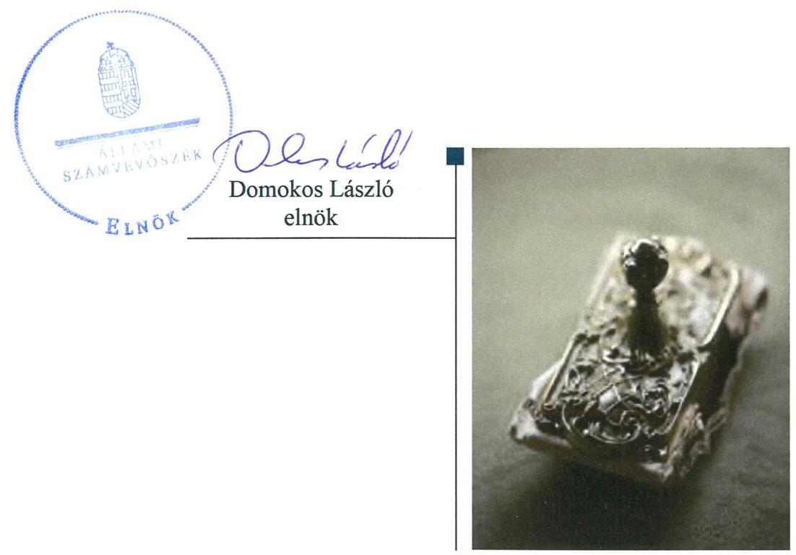
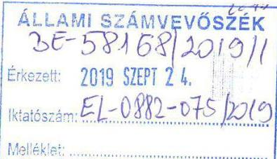
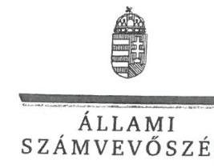
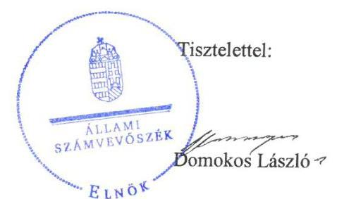

# Jelentés 

## Nemzeti tulajdonú gazdasági társaságok ellenőrzése

Sashalmi Piac Ingatlanfejlesztő, Beruházó és Üzemeltető Kft.
2019. 14. hó 26. nap

---

# AZ ELLENŐRZÉST FELÜGYELTE:

DR. PULAY GYULA felügyeleti vezető

# AZ ELLENŐRZÉST VEZETTE ÉS A VÉGREHAJTÁSÁÉRT FELELŐS:

VALASTYÁNNÉ DR. VÍZHÁNYÓ JÚLIA ellenőrzésvezető

SALAMIN VIKTOR ellenőrzésvezető

A PROGRAM ÖSSZEÁLLÍTÁSÁÉRT FELELŐS:

TÓTPÁL SZABOLCS osztályvezető

IKTATÓSZÁM: EL-2164-001/2019.

|  Jelentéseink az Országgyűlés számítógépes hálózatán és az Interneten a www.asz.hu címen is olvashatóak. | TÉMASZÁM: 2478  |
| --- | --- |
|   | ELLENŐRZÉS-AZONOSÍTÓ SZÁM: V082226  |

---

# TARTALOMJEGYZÉK 

■ ÖSSZEGZÉS ..... 5
■ AZ ELLENŐRZÉS CÉLJA ..... 6
■ AZ ELLENŐRZÉS TERÜLETE ..... 7
■ AZ ELLENŐRZÉS HÁTTERE, INDOKOLTSÁGA ..... 8
■ A JELENTÉS LÉNYEGES KÉRDÉSKÖREI ..... 9
■ AZ ELLENŐRZÉS HATÓKÖRE ÉS MÓDSZEREI ..... 10
■ MEGÁLLAPÍTÁSOK ..... 12
■ JAVASLATOK ..... 14
■ MELLÉKLETEK ..... 15
I. sz. melléklet: Értelmező szótár ..... 15
■ FÜGGELÉKEK ..... 17
I. sz. függelék a jelentéshez ..... 17
II. sz. függelék: Észrevételek ..... 18
■ RÖVIDÍTÉSEK JEGYZÉKE ..... 23

---

.

---

# ÖSSZEGZÉS 

A Sashalmi Piac Ingatlanfejlesztő, Beruházó és Üzemeltető Kft. felett tulajdonosi jogokat gyakorló Budapest Főváros XVI. Kerületi Önkormányzat tulajdonosi joggyakorlása nem volt szabályszerű. A Sashalmi Piac Ingatlanfejlesztő, Beruházó és Üzemeltető Kft. vagyongazdálkodása nem volt szabályszerű, ezért működésének átláthatósága és elszámoltathatósága nem volt biztosított.

## Az ellenőrzés társadalmi indokoltsága

Az Állami Számvevőszék kiemelt célja, hogy a helyi önkormányzatok gazdálkodásában rejlő pénzügyi kockázatok feltárásával, az államháztartáson kívülre nyújtott költségvetési támogatások és ingyenes vagyonjuttatások, valamint az államháztartáson kívül működő feladat-ellátó rendszerek ellenőrzéseivel hozzájáruljon ahhoz, hogy a közpénzeket az államháztartáson kívül működő szervezetek is átlátható, rendezett módon használják fel.

Magyarországon az önkormányzatok kötelező és önként vállalt feladataik vonatkozásában is egyre szélesebb körben alkalmazzák a költségvetésen kívüli feladatellátást, ezáltal - a nonprofit szervezetek mellett - az önkormányzati tulajdonú gazdasági társaságok is kiemelt fontosságú szerephez jutottak.

## Főbb megállapítások, következtetések, javaslatok

Budapest Főváros XVI. Kerületi Önkormányzat tulajdonosi joggyakorlása nem volt szabályszerű, mert a Felügyelő bizottság a Képviselő-testület által jóváhagyott ügyrenddel nem rendelkezett.

A Sashalmi Piac Ingatlanfejlesztő, Beruházó és Üzemeltető Kft. vagyongazdálkodási tevékenysége nem volt szabályszerű, 2015-2017. években mérlege alátámasztásához nem készített leltárt, ezért az éves beszámolói nem voltak megalapozottak.

Az Állami Számvevőszék a jelentésben foglalt megállapítások alapján Budapest Főváros XVI. Kerületi Önkormányzat polgármesterének és a Sashalmi Piac Ingatlanfejlesztő, Beruházó és Üzemeltető Kft. ügyvezetőjének egy-egy javaslatot fogalmazott meg. A javaslatokat megalapozó megállapításokra az érintetteknek 30 napon belül intézkedési tervet kell készíteniük.

---

# AZ ELLENŐRZÉS CÉLJA 

AZ ELLENŐRZÉS CÉLJA annak megítélése volt, hogy a tulajdonosi joggyakorló a gazdasági társaságai feletti tulajdonosi joggyakorlás kereteit kialakította-e, tulajdonosi jogait megfelelően gyakorolta-e és kötelezettségeit teljesítette-e. A gazdasági társaság biztosította-e a vagyon védelmét a nyilvántartások szabályszerű vezetése és a mérleg tételeinek leltárral történő alátámasztása útján, valamint szabályszerűen gondoskodott-e a társaság használatában, kezelésében lévő nemzeti vagyon értékének megőrzéséről, gyarapításáról, hasznosításáról.

---

# AZ ELLENŐRZÉS TERÜLETE

## Budapest Főváros XVI. Kerületi Önkormányzat, Sashalmi Piac Ingatlanfejlesztő, Beruházó és Üzemeltető Kft.

Az Önkormányzat¹ a Társaságot² 2009. március 12-én alapította 10 M Ft jegyzett tőkével, mely 2013. májusában 10,5 M Ft-ra emelkedett. A társaság az Önkormányzat kizárólagos tulajdonában volt.

Az ellenőrzött időszakban a Társaság fő tevékenysége az ingatlankezelés volt. A Társaság az Önkormányzat Képviselő-testületének rendelete, valamint az Önkormányzat Képviselő-testületének döntése alapján végezte a Sashalmi Piac üzemeltetését. A 2015-2017. években a Sashalmi Piacon 35 üzlethelyiség, valamint 95 termelői asztal biztosította az árusítási lehetőséget a környékbeli vállalkozások és az őstermelők számára. A Társaság feladata volt a Sashalmi sétányon található információs pavilon, valamint a Havashalom parkban található szociális blokk működtetése is. A Társaság részére az Önkormányzat a tulajdonában álló ingatlanokat üzemeltetésre adta át.

Az ellenőrzött időszakban a polgármester³, a jegyző⁴, valamint a Társaság ügyvezetőjének személyében nem történt változás. A Társaság az ellenőrzött időszakban nem rendelkezett vagyonkezelésbe vett vagyonnal, továbbá nem tartozott kormányzati szektorba sorolt gazdasági társaságok közé.

---

# AZ ELLENŐRZÉS HÁTTERE, INDOKOLTSÁGA 

Az Alaptörvény 38. cikke alapján az állam és a helyi önkormányzatok tulajdona nemzeti vagyon. A nemzeti vagyon megőrzése, megóvása érdekében kiemelten fontos ezen nemzeti tulajdonú gazdasági társaságok ellenőrzése. Gazdálkodásuk jellemzően a közérdeklődés és a média figyelmének középpontjában áll, amihez hozzájárul a gazdálkodásuk körébe tartozó - a nemzeti vagyon részét képező - vagyon nagysága, illetve az általuk ellátott közszolgáltatások minősége és hatékonysága. Ellenőrzéseink feltárhatják, hogy a tulajdonosi felügyelet hozzájárult-e a szabályszerű gazdálkodáshoz és feladatellátáshoz.

Az ellenőrzés eredményeként meghatározhatóvá válnak a szervezet vagyongazdálkodást érintő kockázatai, ezzel lehetővé téve a kockázatok csökkentését. A megállapítások alapján megfogalmazott számvevőszéki javaslatok hasznosítása elősegítheti a meglévő hibák megszüntetését. A jó gyakorlatok bemutatásával az ÁSZ hozzájárulhat a követendő megoldások megismertetéséhez, terjesztéséhez.

---

# A JELENTÉS LÉNYEGES KÉRDÉSKÖREI 

1. A Társaság feletti tulajdonosi joggyakorlás megfelelt-e a jogszabályi és belső előírásoknak?
2. A Társaság vagyongazdálkodási tevékenysége szabályszerű volt-e?

---

# AZ ELLENŐRZÉS HATÓKÖRE ÉS MÓDSZEREI 

## Az ellenőrzés típusa

Megfelelőségi ellenőrzés.

## Az ellenőrzött időszak

A tulajdonosi joggyakorlás vonatkozásában az ellenőrzött időszak 2017. január 1-től az ellenőrzés megkezdésének napjáig terjedt ki az éves beszámolók elfogadása és a vagyonkezelésbe adott vagyonnal való gazdálkodás tulajdonosi ellenőrzése kivételével, amelyeknél az ellenőrzött időszak 2015. január 1-től az ellenőrzés megkezdésének napjáig - 2018. szeptember 28-ig - tartott.

A Társaság vagyongazdálkodása vonatkozásában az ellenőrzött időszak 2015-2017. évek.

## Az ellenőrzés tárgya

Az önkormányzati tulajdonban lévő gazdasági társaság feletti tulajdonosi joggyakorlás kialakítása és működtetése.

Önkormányzati tulajdonban lévő gazdasági társaság vagyongazdálkodása keretében a társaság használatában, kezelésében lévő nemzeti vagyon, illetve a saját vagyon tekintetében a vagyonnyilvántartások vezetése, leltára. A társaság használatában, vagyonkezelésében lévő nemzeti vagyon tekintetében a vagyon értékének megőrzése, gyarapítása, hasznosítása.

## Az ellenőrzött szervezet

Budapest Főváros XVI. Kerületi Önkormányzat, valamint a Sashalmi Piac Ingatlanfejlesztő, Beruházó és Üzemeltető Kft.

## Az ellenőrzés jogalapja

Az ellenőrzés jogalapját az ÁSZ tv. ${ }^{5} 1 . \S$ (3) bekezdése és 5. § (3)-(5) bekezdései képezték.

---

# Az ellenőrzés módszerei 

Az ellenőrzést az ellenőrzési program ellenőrzési kérdései, az ellenőrzött időszakban hatályos jogszabályok, az ellenőrzés szakmai szabályok és módszertanok alapján, a nemzetközi standardok figyelembe vételével végeztük.

Az ellenőrzés ideje alatt az ellenőrzött szervezettel történő kapcsolattartást az ÁSZ Szervezeti és Működési Szabályzatának vonatkozó előírásai alapján biztosítottuk.
2017. január 1-től az ellenőrzés megkezdésének napjáig ellenőriztük a tulajdonosi joggyakorlás kereteinek kialakítását, a tulajdonosi joggyakorló tevékenységét a felügyelő bizottság és a független könyvvizsgáló működéséhez kapcsolódóan, valamint azt, hogy a tulajdonosi joggyakorló - amennyiben a gazdasági társaság feladatellátásához és vagyonkezeléséhez kapcsolódóan határozott meg követelményeket, elvárásokat - a nemzeti vagyon értékének megőrzése érdekében monitorozta-e azok teljesülését. 2015. január 1-től az ellenőrzés megkezdésének napjáig ellenőriztük a tulajdonosi joggyakorló részvételét az éves beszámoló elfogadására vonatkozó döntéshozatalban, valamint amennyiben adott a társaságainak vagyonkezelésbe nemzeti vagyont, akkor azt, hogy az azzal történő gazdálkodást a tulajdonosi joggyakorló ellenőrizte-e.

Az ellenőrzési kérdések megválaszolásához szükséges bizonyítékok megszerzése a Társaság vagyongazdálkodása vonatkozásában a következő ellenőrzési eljárások alkalmazásával történt: megfigyelés, információkérés, összehasonlítás, elemző eljárás. Az ellenőrzési bizonyítékként felhasználható adatforrások közé tartoznak az ellenőrzési programban felsorolt adatforrások, továbbá minden - az ellenőrzés folyamán - feltárt, az ellenőrzés szempontjából információkat tartalmazó dokumentum.

Az ellenőrzést a kérdésekre adott válaszok kiértékelésével, valamint a megjelölt adatforrások, a csatolt tanúsítványok felhasználásával, továbbá az adott időszakban hatályos jogszabályok figyelembe vételével folytattuk le.

A vagyonnyilvántartások és a leltár szabályszerűsége esetében az ellenőrzés azokra a legnagyobb értékű tételekre - a lényeges sokaságra - terjedt ki, melyek összértéke eléri a teljes sokaság összértékének 50%-át. A lényeges sokaságot tételesen ellenőriztük. A 2015-2017. évekre történt meg a lényeges dokumentumok, ennek keretében a leltározáshoz kapcsolódó dokumentumok, valamint a mérleg tételeit alátámasztó leltár értékelése.

---

# 1. A Társaság feletti tulajdonosi joggyakorlás megfelelt-e a jogszabályi és belső előírásoknak? 

Összegző megállapítás

Az Önkormányzat tulajdonosi joggyakorlása nem volt szabályszerű.

### 1.1. számú megállapítás

Az Önkormányzat a tulajdonosi joggyakorlás kereteit a jogszabályi előírások szerint alakította ki.

## A TULAJDONOSI JOGOK GYAKORLÁSÁNAK

RENDJÉT az Önkormányzat a Vagyonrendelet ${ }^{7}$-ben, valamint a Társasági Alapító Okirat ${ }_{1,2}{ }^{8}$-ban a jogszabályi előírásokkal összhangban kialakította. A Társaság feladatellátásának követelményeit, beszámolási, adatszolgáltatási kötelezettségét az Önkormányzat a Társasággal kötött Üzemeltetési szerződés ${ }^{9}$-ben meghatározta.

Az Önkormányzat Képviselő-testülete, mint a Társaság alapítója a Taktv. ${ }^{10}$ 5. § (3) bekezdésének előírása szerint megalkotta a vezető tisztségviselők, a felügyelőbizottsági tagok, az Mt. ${ }^{11}$ 208. §-ának hatálya alá eső munkavállalók javadalmazásáról, valamint a jogviszony megszűnése esetére biztosított juttatások módjának, mértékének elveiről, annak rendszeréről szóló szabályzatot.

### 1.2. számú megállapítás

A Társaság feletti tulajdonosi joggyakorlás nem volt szabályszerű.

A SZÁMVITELI BESZÁMOLÓ ELFOGADÁSÁRA, az eredmény felosztására vonatkozó döntéshozatalban a tulajdonosi joggyakorló a jogszabályi előírásoknak megfelelően részt vett. A döntéshez a Felügyelő bizottság és a Könyvvizsgáló jelentése rendelkezésre állt.

A FELÜGYELŐ BIZOTTSÁG a Képviselő-testület, mint a Társaság alapítói jogainak gyakorlására jogosult szerve által jóváhagyott ügyrenddel a Ptk. ${ }^{12}$ 3:122. § (3) bekezdésének előírása ellenére nem rendelkezett, működése nem volt szabályszerű. A könyvvizsgáló megválasztása megfelelt a Ptk. és a Számv. tv. ${ }^{13}$ előírásainak.

Az Önkormányzat a Társaság Üzemeltetési szerződésben rögzített, üzemeltetett eszközök állapotának változásáról szóló adatszolgáltatást nem kérte számon.

---

# 2. A Társaság vagyongazdálkodási tevékenysége szabályszerű volt-e? 

Összegző megállapítás

A Társaság vagyongazdálkodási tevékenysége nem volt szabályszerű.

## LELTÁRKÉSZÍTÉSI ÉS LELTÁROZÁSI SZABÁLY-

ZATTAL a Társaság rendelkezett az ellenőrzött időszakban a Számv. tv. előírásainak megfelelően.

A MÉRLEG TÉTELEINEK ALÁTÁMASZTÁSÁHOZ a Társaság a Számv. tv. 69. § (1) bekezdésének előírása ellenére 2015-2017. évekre vonatkozóan nem állított össze leltárt, tételesen, ellenőrizhető módon nem mutatta ki a mérleg fordulónapján meglévő eszközöket és forrásokat mennyiségben és értékben. Leltár hiányában a mérleg nem volt alátámasztott, a 2015-2017. évi beszámolók nem voltak megalapozottak. A Társaság könyvvizsgálója a 2015-2017. évi beszámolókról korlátozás nélküli véleményt adott.

---

# JAVASLATOK 

Az ÁSZ tv. 33. § (1) bekezdésében foglaltak értelmében az ellenőrzött szervezet vezetője köteles a jelentésben foglalt megállapításokhoz kapcsolódó intézkedési tervet összeállítani és azt a jelentés kézhezvételétől számított 30 napon belül az ÁSZ részére megküldeni. Amennyiben az ellenőrzött szervezet vezetője nem küldi meg határidőben az intézkedési tervet, vagy továbbra sem elfogadható intézkedési tervet küld, az Állami Számvevőszék elnöke az ÁSZ tv. 33. § (3) bekezdés a) és b) pontjaiban foglaltakat érvényesítheti.

## Budapest Főváros XVI. Kerületi Önkormányzat polgármesterének

1. Gondoskodjon a Felügyelő Bizottság ügyrendjének a Ptk. szerinti jóváhagyásáról.
(1.2. sz. megállapítás 2. bekezdés első mondata alapján)

## Sashalmi Piac Ingatlanfejlesztő, Beruházó és Üzemeltető Kft. ügyvezetőjének

1. Intézkedjen a Számv.tv. előírása szerinti leltár összeállításáról és megőrzéséről.
(2. sz. megállapítás 2. bekezdés első mondata alapján)

---

# MELLÉKLETEK 

- I. SZ. MELLÉKLET: ÉRTELMEZŐ SZÓTÁR
gazdasági társaság
közszolgáltatás
közfeladat
nemzeti vagyon
nemzeti vagyon hasznosítása
nemzeti vagyon használója
vagyonkezelő

Ptk. 3:88. § (1) bekezdése szerint „a gazdasági társaságok üzletszerű közös gazdasági tevékenység folytatására, a tagok
 vagyoni hozzájárulásával létrehozott, jogi személyiséggel rendelkező vállalkozások, amelyekben a tagok a nyereségből közösen részesednek, és a veszteséget közösen viselik".
Az Ebktv. ${ }^{14}$ 3. § d) pontja a következőképpen határozza meg a közszolgáltatást: „szerződéskötési kötelezettség alapján a lakosság alapvető szükségleteinek ellátására irányuló szolgáltatás, így különösen a villamos energia-, gáz-, hő-, víz-, szennyvíz- és hulladékkezelési, köztisztasági, postai és távközlési szolgáltatás, továbbá a menetrend alapján közlekedő járművekkel végzett közforgalmú személyszállítás".
Az Áht. ${ }^{15}$ 3/A. § (1) bekezdése alapján közfeladat a jogszabályban meghatározott állami vagy önkormányzati feladat
Nvtv. ${ }^{16}$ 1. § (2) bekezdése szerint nemzeti vagyonba tartozik többek között:
„az állam vagy a helyi önkormányzat kizárólagos tulajdonában álló dolgok,
az a) pont hatálya alá nem tartozó, állam vagy a helyi önkormányzat tulajdonában lévő dolog,
az állam vagy a helyi önkormányzat tulajdonában lévő pénzügyi eszközök, továbbá az államot vagy a helyi önkormányzatot megillető társasági részesedések,
az államot vagy a helyi önkormányzatot megillető bármely vagyoni értékkel rendelkező jogosultság, amelyet jogszabály vagyoni értékű jogként nevesít
A tulajdonosi joggyakorló vagy a nemzeti vagyon használója által a nemzeti vagyon birtoklásának, használatának, hasznok szedése jogának bármely - a tulajdonjog átruházását nem eredményező - jogcímen történő átengedése, ide nem értve a vagyonkezelésbe adást, valamint a haszonélvezeti jog alapítását.
Forrás: Nvtv. 3. § (1) bekezdés 4. pont
Azon természetes személy, jogi személy vagy jogi személyiséggel nem rendelkező szervezet, aki vagy amely állami vagyon tekintetében törvény vagy szerződés alapján, a helyi önkormányzat vagyona tekintetében törvény, a helyi önkormányzat rendelete vagy szerződés alapján bármely jogcímen nemzeti vagyont birtokol, használ, szedi annak hasznait, kivéve a tulajdonosi joggyakorlót.
Forrás: Nvtv. 3. § (1) bekezdés 11. pont
Aki a nemzeti vagyon felett az államot vagy a helyi önkormányzatot megillető tulajdonosi jogok és kötelezettségek összességének gyakorlására jogosult. (Forrás: Nvtv. 3. § (1) bekezdés 17. pontja)
az állam tulajdonában álló nemzeti vagyon tekintetében:
aa) költségvetési szerv,
ab) helyi önkormányzat, nemzetiségi önkormányzat, valamint ezek társulásai,
ac) az ab) alpontban felsoroltak fenntartása vagy irányítása alá tartozó intézmény,
ad) köztestület,
ae) az állam, az aa)-ac) alpontban meghatározott személyek együtt vagy külön-külön 100%-os tulajdonában álló gazdálkodó szervezet,
af) az ae) alpont szerinti gazdálkodó szervezet 100%-os tulajdonában álló gazdálkodó szervezet,
ag) a törvény által kijelölt egyedileg meghatározott jogi személy.
b) a helyi önkormányzat tulajdonában álló nemzeti vagyon tekintetében:
ba) nemzetiségi önkormányzat, helyi vagy nemzetiségi önkormányzati társulás, valamint ezek fenntartása vagy irányítása alá tartozó intézmény,
bb) költségvetési szerv,
bc) köztestület,

---

b
b
b
) az állam, a helyi önkormányzat, a ba) alpontban meghatározott személyek együtt vagy külön-külön 100%-os tulajdonában álló gazdálkodó szervezet,
be) a bd) alpont szerinti gazdálkodó szervezet 100%-os tulajdonában álló gazdálkodó szervezet.
Forrás: Nvtv. 3. § (1) bekezdés 19. pont
vagyongazdálkodás
A nemzeti vagyongazdálkodás feladata a nemzeti vagyon rendeltetésének megfelelő, az állam, az önkormányzat mindenkori teherbíró képességéhez igazodó, elsődlegesen a közfeladatok ellátásához és a mindenkori társadalmi szükségletek kielégítéséhez szükséges, egységes elveken alapuló, átlátható, hatékony és költségtakarékos működtetése, értékének megőrzése, állagának védelme, értéknövelő használata, hasznosítása, gyarapítása, továbbá az állam vagy a helyi önkormányzat feladatának ellátása szempontjából feleslegessé váló vagyontárgyak elidegenítése. (Forrás: Nvtv. 7. § (2) bekezdése).

---

# FÜGGELÉKEK 

- I. SZ. FÜGGELÉK A JELENTÉSHEZ

Az Állami Számvevőszék az ellenőrzések során feltárt tényekhez kapcsolódó további körülmények tisztázására eszközrendszerrel nem rendelkezik. Amennyiben az ellenőrzésen túlmutatóan indokoltnak látszik az ellenőrzés során feltárt körülmények további vizsgálata, az Állami Számvevőszék törvényi felhatalmazás alapján az ellenőrzés által feltárt körülményeket továbbítja a hatáskörrel rendelkező szervnek a szükséges intézkedések megtétele, eljárások lefolytatása érdekében.

A Társaság 2015., 2016. és 2017. évi beszámolók mérlegtételeit nem támasztotta alá leltárral, ezzel megsértette a Számv. tv. 69. § (1) bekezdése előírását. Leltár hiányában a mérleg nem volt alátámasztott, a 2015., 2016. és 2017. évi beszámolók nem voltak megalapozottak.
A mérleget alátámasztó leltár hiányában nem igazolt, hogy a Társaság 2015., 2016. és 2017. évi beszámolói megbízható és valós összképet mutatnak.
Az eset konkrét körülményeinek feltárására a Nemzeti Adó- és Vámhivatal rendelkezik hatáskörrel.

---

A jelentéstervezetet a Számvevőszék 15 napos észrevételezésre megküldte az ellenőrzött szervezetek vezetőinek az ÁSZ tv. 29. § (1) bekezdése előírásának megfelelően.

A Sashalmi Piac Ingatlanfejlesztő, Beruházó és Üzemeltető Kft. ügyvezetője a jelentéstervezet megállapításaira írásban észrevételt tett.
Az ÁSZ tv. 29. § (3) bekezdésével összhangban az ÁSZ a Függelékben feltünteti az ellenőrzés megállapításaival kapcsolatban tett, figyelembe nem vett észrevételeket, és megindokolja, hogy azokat miért nem fogadta el.

[^0]
[^0]:    * 29. § (1) Az Állami Számvevőszék az ellenőrzési megállapításait megküldi az ellenőrzött szervezet vezetőjének vagy az általa megbízott személynek, és annak, akinek személyes felelősségét állapította meg.
    (2) Az ellenőrzött szervezet vezetője és a felelősként megjelölt személy az ellenőrzés megállapításaira tizenöt napon belül írásban észrevételt tehet.
    (3) Az Állami Számvevőszék az észrevételre a beérkezésétől számított harminc napon belül írásban válaszol. A figyelembe nem vett észrevételeket köteles a jelentésben feltüntetni, és megindokolni, hogy azokat miért nem fogadta el.

---

#  

Tárgy: Észrevétel a jelentéstervezetre
Domokos László elnök
Állami Számvevőszék
Budapest
Apáczai Csere János utca 10. 1052

Tisztelt Elnök úr!

Alulírott Kozma Viktor Károly, mint a Sashalmi Piac Ingatlanfejlesztő, Beruházó és
Üzemeltető Kft. ügyvezetője, az EL-0882-072/2019 iktatószámmal ellátott jelentéstervezetre az alábbi
észrevételeket
teszem:
Jelentéstervezet 13. oldal, 2. megállapítás:
„2. A Társaság vagyongazdálkodási tevékenysége szabályszerű volt-e?
Leltárkészítési és leltározási szabályzattal a Társaság rendelkezett az ellenőrzött időszakban a Számv. tv. előírásainak megfelelően.

A mérleg tételeinek alátámasztásához a Társaság a Számv. tv. 69. § (1) bekezdésének előírása ellenére 2015-2017. évekre vonatkozóan nem állított össze leltárt, tételesen, ellenőrizhető módon nem mutatta ki a mérleg fordulónapján meglévő eszközöket és forrásokat mennyiségben és értékben. Leltár hiányában a mérleg nem volt alátámasztott, a 2015-2017. évi beszámolók nem voltak megalapozottak. A Társaság könyvvizsgálója a 2015-2017. évi beszámolókról korlátozás nélküli véleményt adott."

## Észrevétel a megállapításra:

Társaságunk a 2015-2017. években is tételesen, ellenőrizhető módon állított össze kimutatást a mérleg fordulónapján meglévő eszközökről és forrásokról mennyiségben és értékben történő egyeztetésről. Társaságunk a főkönyvi könyvelés és az analitikus nyilvántartások adatai közötti egyeztetést minden üzleti év fordulónapjára vonatkozóan elkészítette, ahogy azt a Számv. tv. 69. § (2) bekezdése előírja.

A beszámoló készítésekor minden évben elkészült a mérlegsorok kimutatása, a főkönyvi könyvelés valamint a tételes analitikus nyilvántartás adatbázisának, a mérleg fordulónapján meglévő eszközök és források mennyiségben és értékben történő egyeztetése, melyek folyamatos egyezőséget mutattak. Mindezt aláírt, hitelesített mérlegsori adatokat kimutató jegyzőkönyvben rögzítettük, mely bizonylaton érthetően szerepelnek a szabályzatunkban szereplő releváns tartalmak, a fellelt eszközök és források pontos megnevezésével, mennyiségével és értékével, leltárkülönbözet megállapítása nélkül, a készítésért és az ellenőrzésért felelős személyek megjelölésével, aláírva. A fenti dokumentumokat pedig a törvény előírásai szerint megőriztük.

---

# 5. sashalmi   piac 

SASHALMI PIAC INGATLANFEJLESZTŐ, BERUHÁZÓ ÉS ÜZEMELTETŐ KFT. 1163 BUDAPEST, SASHALMI TÉR 1. TEL: 950-1785 EMAIL: INFO@SASHALMIPIAC.HU WWW.SASHALMIPIAC.HU

Tájékoztatásul megjelölném, hogy az EL-0882-003/2018 ikt. sz. adatbekérő levélben kért adatok között az Állami Számvevőszék részére az alábbi dokumentumokat küldtük meg, melyek a főkönyvi könyvelés és az analitikus nyilvántartások adatai közötti egyeztetést szolgálták, aláírt, hiteles az egyezőséget kimutató összesített jegyzőkönyvvel:

| Sorszám | A kért dokumentum tartalom szerinti megnevezése | Az Állami Számvevőszék részére megküldött dokumentum |
| :--: | :--: | :--: |
| 2 | Mérleg tételeit alátámasztó leltár, összesített 2015,2016,2017 | 2015_2016_2017_Sashalmi_Piac_Kft_mérlegsorok_leltára_összesitett.pdf |
| 3 | Mérleg tételeit alátámasztó leltár, tételes, kartonokkal 2015 | 2015_Sashalmi_Piac_Kft_mérlegsorok_leltára_tételes_kartonok.xls |
| 5 | Mérleg tételeit alátámasztó leltár, tételes, kartonokkal 2016 | 2016_Sashalmi_Piac_Kft_mérlegsorok_leltára_tételes_kartonok.xls |
| 7 | Mérleg tételeit alátámasztó leltár, tételes, kartonokkal 2017 | 2017_Sashalmi_Piac_Kft_mérlegsorok_leltára_tételes_kartonok.xls |

Csatolom továbbá az ide vonatkozó teljességi és hitelességi nyilatkozatot is.
Kérem a Tisztelt Elnök urat, hogy amennyiben az általunk alkalmazott mérleg alátámasztásához szükséges leltár elkészítése alakilag nem megfelelő, úgy azt a módosított megállapításban szerepeltetni szíveskedjék.

Budapest, 2019. szeptember 20.
Tisztelettel:

Kozma Viktor ügyvezető igazgató
"SASHALMI PIAC" KFT
1163 Bp., Sashalmi tér 1.
Adószám: 14712230-2-43
CIR: 10702201-4501250-5110201

---

ELNÖK

Ikt.szám: EL-0882-077/2019
Kozma Viktor úr
ügyvezető igazgató

Sashalmi Piac Ingatlanfejlesztő, Beruházó és Üzemeltető Kft

# Budapest 

## Tisztelt Ügyvezető Igazgató Úr!

A „Nemzeti tulajdonú gazdasági társaságok ellenőrzése - Sashalmi Piac Ingatlanfejlesztő, Beruházó és Üzemeltető Kft" - címmel készített számvevőszéki jelentéstervezetre a 2019. szeptember 20-án kelt levelében megküldött észrevételét köszönettel megkaptam.
Az Állami Számvevőszék észrevételre vonatkozó álláspontjáról a felügyeleti vezető által készített részletes tájékoztatást csatoltan megküldöm.
Tájékoztatom Ügyvezető urat, hogy a számvevőszéki jelentésben - az Állami Számvevőszékről szóló 2011. évi LXVI. törvény 29. § (3) bekezdése alapján - a figyelembe nem vett észrevételeket szerepeltetjük az elutasítás indokának feltüntetésével.

Budapest, 2019. 116 hó 19 nap

Melléklet: Tájékoztatás az észrevételek kezeléséről

---

# Tájékoztatás az észrevételek kezeléséről 

„Nemzeti tulajdonú gazdasági társaságok ellenőrzése - Sashalmi Piac Ingatlanfejlesztő, Beruházó és Üzemeltető Kft" címû jelentéstervezetre a 2019. szeptember 20-án kelt levelében megküldött észrevételét áttekintettem. Az észrevétel kezeléséről az alábbi tájékoztatást adom.

## 1.) A 2. számú megállapításhoz megfogalmazott észrevételre adott válasz

A Sashalmi Piac Ingatlanfejlesztő, Beruházó és Üzemeltető Kft.-t (továbbiakban: a Társaság) illetően megfogalmazott 2. számú megállapításra, és az azt alátámasztó szövegre tett észrevételét nem fogadtuk el.

Az Ön levelében is hivatkozott és részben beidézett teljességi-hitelességi nyilatkozatból is megállapítható, hogy a 2015-2017. évi mérlegek tételeit alátámasztó leltár tételes kartonjait xls (excel) dokumentum formájában küldte meg a Társaság az Állami Számvevőszéknek, amelyet nem tudtunk hiteles dokumentumként elfogadni. Aláírt formában csak a leltárak összesítőjét kaptuk meg. Így az ellenőrzés során figyelembe vehető hiteles dokumentumok nem teljesítették a Számv. tv. 69. § (1) bekezdésének előírását.

Budapest, 2019. 10. hó 17. nap

Dr. Pulay Gyula felügyeleti vezető

---

# RÖVIDÍTÉSEK JEGYZÉKE 

${ }^{1}$ Önkormányzat
${ }^{2}$ Társaság
${ }^{3}$ Polgármester
${ }^{4}$ Jegyző
${ }^{5}$ ÁSZ tv.
${ }^{6}$ ÁSZ
${ }^{7}$ Vagyonrendelet
${ }^{8}$ Társasági Alapító Okirat ${ }_{1}$

Társasági Alapító Okirat ${ }_{2}$
${ }^{9}$ Üzemeltetési szerződés
${ }^{10}$ Taktv.
${ }^{11}$ Mt.
${ }^{12}$ Ptk.
${ }^{13}$ Számv. tv.
${ }^{14}$ Ebktv.
${ }^{15}$ Áht.
${ }^{16}$ Nvtv.

Budapest Főváros XVI. Kerületi Önkormányzat
Sashalmi Piac Ingatlanfejlesztő, Beruházó és Üzemeltető Kft.
Budapest Főváros XVI. Kerületi Önkormányzat Polgármestere
Budapest Főváros XVI. Kerületi Önkormányzat Jegyzője
az Állami Számvevőszékről szóló 2011. évi LXVI. törvény
Állami Számvevőszék
Budapest Főváros XVI. kerületi Önkormányzat többször módosított, 24/2009. (VI. 25.) önkormányzati rendelete az Önkormányzat vagyonáról és a vagyontárgyak feletti tulajdonosi jogok gyakorlásáról
Sashalmi Piac Ingatlanfejlesztő, Beruházó és Üzemeltető Korlátolt Felelősségű Társaság alapító okiratának módosítása (hatályos: 2015. május 13-tól)
Sashalmi Piac Ingatlanfejlesztő, Beruházó és Üzemeltető Korlátolt Felelősségű Társaság alapító okiratának módosítása (hatályos: 2018. április 25-től)
Budapest Főváros XVI. kerületi Önkormányzata és a Sashalmi Piac Ingatlanfejlesztő, Beruházó és Üzemeltető Korlátolt Felelősségű Társaság között létrejött üzemeltetési szerződés (hatályos: 2014. július 15-től 2019. július 14-ig) 2009. évi CXXII. törvény a köztulajdonban álló gazdasági társaságok takarékosabb működéséről (hatályos: 2009. december 4-től)
2012. évi I. törvény a munka törvénykönyvéről (hatályos: 2012. július 1-jétől)
a Polgári Törvénykönyvről szóló 2013. évi V. törvény
(hatályos: 2013. február 26-ától)
2000. évi C. törvény a számvitelről (hatályos:
 2001. január 1-jétől)
egyenlő bánásmódról és az esélyegyenlőség előmozdításáról szóló 2003. évi CXXV. törvény (hatályos: 2004. január 27-étől)
az államháztartásról szóló 2011. évi CXCV. törvény
(hatályos: 2011. december 31-étől)
a nemzeti vagyonról szóló 2011. évi CXCVI. törvény
(hatályos: 2012. január 1-jétől)

---

# ÁLLAMI SZÁMVEVŐSZÉK 

1052 Budapest, Apáczai Csere János utca 10.
Levélcím: 1364 Budapest Pf. 54
Telefon: +36 1 4849100 Telefax: +36 1 4849200
www.asz.hu
