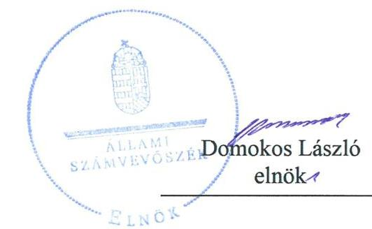
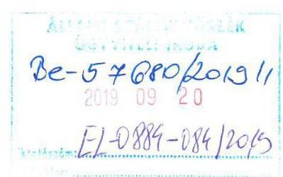
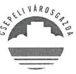
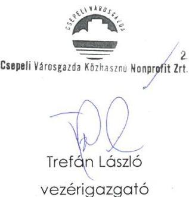
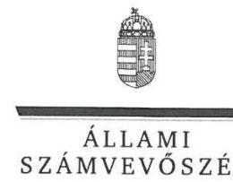
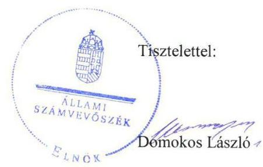

# Jelentés 

## Nemzeti tulajdonú gazdasági társaságok ellenőrzése

Csepeli Városgazda Közhasznú Nonprofit Zrt.
2019. 14. hó 26. nap

---

# AZ ELLENŐRZÉST FELÜGYELTE:

- DR. HORVÁTH MARGIT felügyeleti vezető
- DR. PULAY GYULA felügyeleti vezető

# AZ ELLENŐRZÉST VEZETTE ÉS A VÉGREHAJTÁSÁÉRT FELELŐS:

- DR. MAJOR LÁSZLÓ ellenőrzésvezető
- ÓDOR ZOLTÁN TAMÁS ellenőrzésvezető
- DORMÁN ISTVÁN ellenőrzésvezető

# A PROGRAM ÖSSZEÁLLÍTÁSÁÉRT FELELŐS:

- TÓTPÁL SZABOLCS osztályvezető

Jelentéseink az Országgyűlés számítógépes hálózatán és az Interneten a www.asz.hu címen is olvashatóak.

|  IKTATÓSZÁM: EL-2167-001/2019. | |
| --- | --- |
|  TÉMASZÁM: 2478 | |
|  ELLENŐRZÉS-AZONOSÍTÓ SZÁM: V082228 | |

---

# TARTALOMJEGYZÉK 

■ ÖSSZEGZÉS ..... 5
■ AZ ELLENŐRZÉS CÉLJA ..... 6
■ AZ ELLENŐRZÉS TERÜLETE ..... 7
■ AZ ELLENŐRZÉS HÁTTERE, INDOKOLTSÁGA ..... 8
■ A JELENTÉS LÉNYEGES KÉRDÉSKÖREI ..... 9
■ AZ ELLENŐRZÉS HATÓKÖRE ÉS MÓDSZEREI ..... 10
■ MEGÁLLAPÍTÁSOK ..... 12
■ JAVASLATOK ..... 14
■ MELLÉKLETEK ..... 15
I. sz. melléklet: Értelmező szótár ..... 15
■ FÜGGELÉK: ÉSZREVÉTELEK ..... 17
■ RÖVIDÍTÉSEK JEGYZÉKE ..... 23

---

.

---

# ÖSSZEGZÉS 

A Csepeli Városgazda Közhasznú Nonprofit Zártkörűen Működő Részvénytársaság vagyongazdálkodása nem volt szabályszerű, ezért működésének átláthatósága és elszámoltathatósága nem volt biztosított.

## Az ellenőrzés társadalmi indokoltsága

Az Állami Számvevőszék kiemelt célja, hogy a helyi önkormányzatok gazdálkodásában rejlő pénzügyi kockázatok feltárásával, az államháztartáson kívülre nyújtott költségvetési támogatások és ingyenes vagyonjuttatások, valamint az államháztartáson kívül működő feladat-ellátó rendszerek ellenőrzéseivel hozzájáruljon ahhoz, hogy a közpénzeket az államháztartáson kívül működő szervezetek is átlátható, rendezett módon használják fel.

Magyarországon az önkormányzatok kötelező és önként vállalt feladataik vonatkozásában is egyre szélesebb körben alkalmazzák a költségvetésen kívüli feladatellátást, ezáltal - a nonprofit szervezetek mellett - az önkormányzati tulajdonú gazdasági társaságok is kiemelt fontosságú szerephez jutottak.

## Főbb megállapítások, következtetések, javaslatok

Budapest XXI. kerület Csepel Önkormányzata a tulajdonosi joggyakorlás kereteit a jogszabályi előírásokat követve alakította ki, a tulajdonosi jogait szabályszerűen gyakorolta.

A Csepeli Városgazda Közhasznú Nonprofit Zártkörűen Működő Részvénytársaság vagyongazdálkodási tevékenysége nem volt szabályszerű, 2015-2017. években mérlege alátámasztásához nem készített a jogszabályi előírásoknak megfelelő leltárt, ezért az éves beszámolói nem voltak megalapozottak.

A Csepeli Városgazda Közhasznú Nonprofit Zártkörűen Működő Részvénytársaságnak kormányzati szektor hiányára befolyással bíró eleme, adósságot keletkeztető ügylete nem volt, a Társaság a kapcsolódó adatszolgáltatási kötelezettségének nem tett eleget.

Az Állami Számvevőszék a jelentésében foglalt megállapítások alapján a Csepeli Városgazda Közhasznú Nonprofit Zártkörűen Működő Részvénytársaság vezérigazgatójának két javaslatot fogalmazott meg. A javaslatokat megalapozó megállapításokra az érintettnek 30 napon belül intézkedési tervet kell készítenie.

---

# AZ ELLENŐRZÉS CÉLJA 

AZ ELLENŐRZÉS CÉLJA annak megítélése volt, hogy a tulajdonosi joggyakorló a gazdasági társaságai feletti tulajdonosi joggyakorlás kereteit kialakította-e, tulajdonosi jogait megfelelően gyakorolta-e és kötelezettségeit teljesítette-e. A gazdasági társaság biztosította-e a vagyon védelmét a nyilvántartások szabályszerű vezetése és a mérleg tételeinek leltárral történő alátámasztása útján, valamint szabályszerűen gondoskodott-e a társaság használatában, kezelésében lévő nemzeti vagyon értékének megőrzéséről, gyarapításáról, hasznosításáról. Az ellenőrzés célja továbbá annak megítélése, hogy a kormányzati szektorba sorolt nemzeti tulajdonban lévő gazdasági társaság gazdálkodásának a kormányzati szektor hiányára és az államadósságra befolyással bíró elemei a jogszabályi előírásoknak megfeleltek-e és a gazdasági társaság az adatszolgáltatási kötelezettségének eleget tett-e.

---

# AZ ELLENŐRZÉS TERÜLETE 

## Csepeli Városgazda Közhasznú Nonprofit Zártkörűen Működő Részvénytársaság és a tulajdonosi jogokat gyakorló Budapest XXI. kerület Csepel Önkormányzata

Budapest XXI. kerület Csepel Önkormányzata¹ által a 2007-ben alapított Budapest-Csepel Önkormányzat Képviselő Testülete Vagyonkezelő és Vagyonhasznosító Korlátolt Felelősségű Társaság jogutódja a Csepeli Városgazda Közhasznú Nonprofit Zártkörűen Működő Részvénytársaság², amely 2013. január 15-tól az Önkormányzat kizárólagos tulajdonában áll.

A Társaság jegyzett tőkéje 2015. január 1-én 552,4 M Ft volt, amely 2016. április 20-án 752,4 M Ft-ra emelkedett és ez az ellenőrzött időszak végéig nem változott.

A Társaság Alapító okirat ${ }_{1-2}{ }^{3}$-ban meghatározott főtevékenysége ingatlankezelés, közútépítés és fenntartása volt, amelyeket közfeladatként látott el. Ennek keretében ellátta a Szoctv. ${ }^{4}$ rendelkezései alapján a bérlakás állomány, valamint a nyugdíjasház helyiséggazdálkodását. A Társaság a Kvt. ${ }^{5}$ rendelkezései alapján gondoskodott a közterületekkel kapcsolatos feladatok végrehajtásáról.

A Társaság az ellenőrzött időszakban saját vagyonával gazdálkodott, valamint Feladatellátási szerződés ${ }_{1-2}{ }^{6}$ alapján az Önkormányzat vagyonát üzemeltette. Vagyonkezelésbe vett vagyonnal nem rendelkezett, konceszsziós szerződést nem kötött. A Társaságnak más gazdasági társaságban tulajdoni részesedése nem volt. A Társaság a Számv. tv. ${ }^{7}$ előírása alapján könyvvizsgálatra kötelezett volt.

Az ellenőrzött időszakban a polgármester és a jegyző személyében nem történt változás. A Társaságot képviselő vezérigazgató személye az ellenőrzés időszaka alatt egyszer változott, a jelenlegi vezérigazgató tisztségét 2016. október 5-től látta el.

A Társaság 2017. június 15-ét követően tartozott a kormányzati szektorba sorolt egyéb szervezetek közé.

---

# AZ ELLENŐRZÉS HÁTTERE, INDOKOLTSÁGA 

Az Alaptörvény ${ }^{8}$ 38. cikke alapján az állam és a helyi önkormányzatok tulajdona nemzeti vagyon. A nemzeti vagyon megőrzése, megóvása érdekében kiemelten fontos ezen nemzeti tulajdonú gazdasági társaságok ellenőrzése. Gazdálkodásuk jellemzően a közérdeklődés és a média figyelmének középpontjában áll, amihez hozzájárul a gazdálkodásuk körébe tartozó - a nemzeti vagyon részét képező - vagyon nagysága, illetve az általuk ellátott közszolgáltatások minősége és hatékonysága. Ellenőrzéseink feltárhatják, hogy a tulajdonosi felügyelet hozzájárult-e a szabályszerű gazdálkodáshoz és feladatellátáshoz.

Az ellenőrzés eredményeként meghatározhatóvá válnak a szervezet vagyongazdálkodást érintő kockázatai, ezzel lehetővé téve a kockázatok csökkentését. A megállapítások alapján megfogalmazott számvevőszéki javaslatok hasznosítása elősegítheti a meglévő hibák megszüntetését. A jó gyakorlatok bemutatásával az ÁSZ ${ }^{9}$ hozzájárulhat a követendő megoldások megismertetéséhez, terjesztéséhez.

---

# A JELENTÉS LÉNYEGES KÉRDÉSKÖREI 

1. A Társaság feletti tulajdonosi joggyakorlás megfelelt-e a jogszabályi és belső előírásoknak?
2. A Társaság vagyongazdálkodási tevékenysége szabályszerű volt-e?
3. A Társaság gazdálkodásának a kormányzati szektor hiányára és az államadósságra befolyással bíró elemei megfeleltek-e a jogszabályi előírásoknak, az adatszolgáltatási kötelezettségének eleget tett-e?

---

# AZ ELLENŐRZÉS HATÓKÖRE ÉS MÓDSZEREI 

## Az ellenőrzés típusa

Megfelelőségi ellenőrzés.

## Az ellenőrzött időszak

A tulajdonosi joggyakorlás vonatkozásában az ellenőrzött időszak 2017. január 1-től az ellenőrzés megkezdésének napjáig terjedt ki az éves beszámolók elfogadására vonatkozó döntéshozatal és a vagyonkezelésbe adott vagyonnal való gazdálkodás tulajdonosi ellenőrzése kivételével, amelyeknél az ellenőrzött időszak 2015. január 1-től az ellenőrzés megkezdésének napjáig tartott.

A Társaság vagyongazdálkodása vonatkozásában az ellenőrzött időszak 2015-2017. évek, a 2017. évi beszámoló jóváhagyása tekintetében 2018. június 1-jéig tartó időszak.

A Társaság gazdálkodásának a kormányzati szektor hiányára és az államadósságra befolyással bíró elemei, és a kapcsolódó adatszolgáltatása tekintetében az ellenőrzött időszak 2017. június 15-étől 2017. december 31-éig, a 2017. évi beszámoló jóváhagyása és közzététele tekintetében a 2018. június 1-jéig tartó időszak.

## Az ellenőrzés tárgya

Az önkormányzati tulajdonban lévő gazdasági társaság feletti tulajdonosi joggyakorlás kialakítása és működtetése.

Önkormányzati tulajdonban lévő gazdasági társaság vagyongazdálkodása keretében a társaság használatában, kezelésében lévő saját vagyon tekintetében a vagyonnyilvántartások vezetése, leltára.

A kormányzati szektorba sorolt önkormányzati tulajdonban lévő gazdasági társaság gazdálkodásának a kormányzati szektor hiányára és az államadósságra befolyással bíró elemei és a jogszabályi előírásoknak megfelelő adatszolgáltatási kötelezettség teljesítése.

## Az ellenőrzött szervezet

Budapest XXI. kerület Csepel Önkormányzata, valamint a Csepeli Városgazda Közhasznú Nonprofit Zártkörűen Működő Részvénytársaság.

---

# Az ellenőrzés jogalapja 

Az ellenőrzés jogalapját az ÁSZ tv. 1. § (3) bekezdése és 5. § (3)-(5) bekezdései képezték.

## Az ellenőrzés módszerei

Az ellenőrzést az ellenőrzési program ellenőrzési kérdései, az ellenőrzött időszakban hatályos jogszabályok, az ellenőrzés szakmai szabályok és módszertanok alapján, a nemzetközi standardok figyelembe vételével végeztük.

Az ellenőrzés ideje alatt az ellenőrzött szervezettel történő kapcsolattartást az ÁSZ SZMSZ-ének ${ }^{10}$ vonatkozó előírásai alapján biztosítottuk.

A gazdasági társaság vagyonhoz kapcsolódó nyilvántartásai vezetésének megfelelősége, a mérleg tételeinek leltárral való alátámasztottsága, valamint a nemzeti vagyon értékmegőrzésének, hasznosításának szabályszerűsége a 2015-2017. évek tekintetében került ellenőrzésre.

A vagyonnyilvántartások és a leltár szabályszerűsége esetében az ellenőrzés azokra a legnagyobb értékű tételekre - a lényeges sokaságra terjedt ki, melyek összértéke eléri a teljes sokaság összértékének 50\%-át. A lényeges sokaságot 2015. év tekintetében tételesen ellenőriztük.

A kormányzati szektorba sorolt gazdasági társaság gazdálkodásának a kormányzati szektor hiányára befolyással bíró gazdasági eseményei elszámolásának megfelelősége 2017. év tekintetében került ellenőrzésre, a kormányzati szektorba sorolt gazdasági társaság adatszolgáltatási kötelezettségére vonatkozó jogszabályi előírások betartását az e területre vonatkozó teljes ellenőrzött időszakra értékeltük.

Az ellenőrzési kérdések megválaszolásához szükséges bizonyítékok megszerzése a következő ellenőrzési eljárások alkalmazásával történt: megfigyelés, információkérés, összehasonlítás, elemző eljárás. Az ellenőrzési bizonyítékként felhasználható adatforrások közé tartoznak az ellenőrzési programban felsorolt adatforrások, továbbá minden - az ellenőrzés folyamán - feltárt, az ellenőrzés szempontjából információkat tartalmazó dokumentum.

Az ellenőrzést a kérdésekre adott válaszok kiértékelésével, valamint a megjelölt adatforrások, a csatolt tanúsítványok felhasználásával, továbbá az adott időszakban hatályos jogszabályok figyelembe vételével folytattuk le.

Amennyiben a Társaság működését és gazdálkodását alapvetően meghatározó dokumentum hiánya miatt, valamely lényeges kérdéskörre vonatkozóan az ÁSZ megállapítást tett, további ellenőrzési tevékenységek az adott kérdéskörrel és az azzal szoros logikai kapcsolatban lévő kérdéskörökkel - ráépülő jelleggel - nem kerültek végrehajtásra.

---

# 1. A Társaság feletti tulajdonosi joggyakorlás megfelelt-e a jogszabályi és belső előírásoknak? 

Összegző megállapítás Az Önkormányzat tulajdonosi joggyakorlása szabályszerű volt.

A TÁRSASÁG FELETTI TULAJDONOSI JOGGYAKORLÁS RENDJÉT az Önkormányzat az Alapító okirat ${ }_{1-2}$-ban az Önkormányzat SzMSz ${ }^{11}$-ben a Mötv. ${ }^{12}$, az Nvtv. ${ }^{13}$ és a Ptk. ${ }^{14}$ előírásai szerint alakította ki. A tulajdonosi joggyakorló Vagyonrendeletet ${ }^{15}$ alkotott, mely tartalmazta a feladatellátást szolgáló vagyon körét, szabályozta a használt vagyonnal történő gazdálkodás kereteit.

A tulajdonosi joggyakorló a Társaság vagyongazdálkodással kapcsolatos feladatait és hatásköreit, vagyonnal való gazdálkodás részletes szabályait, felelősségi viszonyokat a közfeladatok ellátása tekintetében a Feladatellátási szerződésben ${ }_{1-2}$ rögzítette.

A tulajdonosi joggyakorló a Taktv. ${ }^{16}$ előírásainak eleget téve Javadalmazási Szabályzatban ${ }_{1-2}{ }^{17}$ rögzítette a vezető tisztségviselők, Felügyelőbizottság ${ }^{18}$ tagok, vezető állású munkavállalók javadalmazását, jogviszony megszűnése esetén biztosított juttatások módját, mértékét, elveit, annak rendszerét.

A TULAJDONOSI JOGGYAKORLÁS szabályszerű volt a tulajdonosi joggyakorló a Felügyelőbizottság tagjait az Alapító okirat ${ }_{1-2}$ szerint kijelölte a Ptk. és a Taktv. előírásainak eleget téve meghatározta a Felügyelőbizottság feladatait, hatáskörét. A Felügyelőbizottság ügyrendjét az Önkormányzat Képviselő-testülete ${ }^{19}$ a Ptk. rendelkezései szerint jóváhagyta.

A Társaság éves beszámolóit a Felügyelőbizottság jelentése és a könyvvizsgáló véleménye ismeretében a Ptk.-ban rögzítettek szerint elfogadta.

A Társaság a 2016. évtől kezdődően éves üzleti terveit jóváhagyásra az Önkormányzat elé terjesztette, amelyet a Képviselő-testület határozatok ${ }^{20}$-kal jóváhagyott.

## 2. A Társaság vagyongazdálkodási tevékenysége szabályszerű volt-e?

Összegző megállapítás

A Társaság vagyongazdálkodási tevékenysége nem volt szabályszerű.

A VAGYONGAZDÁLKODÁSI TEVÉKENYSÉG FELTÉTELEIT a Társaság szabályszerűen alakította ki az ellenőrzött időszakban. Leltározási szabályzattal ${ }^{21}$ a Társaság a Számv. tv. előírásának

---

megfelelően rendelkezett, amely tartalmazta a leltározásra és a leltárkészítésre vonatkozó általános szabályokat, előírásokat.

# A TÁRSASÁG VAGYONGAZDÁLKODÁSA NEM 

VOLT SZABÁLYSZERŰ, mert a mérleg tételeinek alátámasztásához a Társaság a
 Számv. tv. 69. § (1) bekezdésének előírása ellenére 2015-2017. évekre vonatkozóan nem állított össze leltárt, amely tételesen, ellenőrizhető módon tartalmazta a mérleg fordulónapján meglévő eszközöket és forrásokat mennyiségben és értékben.

A Társaság a tárgyi eszközök esetében a Számv. tv. 69. § (3) bekezdésének előírása ellenére az ellenőrzött években nem végezte el a mennyiségi felvétellel történő leltározást.

## 3. A Társaság gazdálkodásának a kormányzati szektor hiányára és az államadósságra befolyással bíró elemei megfeleltek-e a jogszabályi előírásoknak, az adatszolgáltatási kötelezettségének eleget tett-e?

## Összegző megállapítás

A Társaság nem tartotta be az adatszolgáltatási kötelezettségére vonatkozó jogszabályi előírásokat.

A TÁRSASÁGNAK a kormányzati szektor hiányára befolyással bíró eleme, az államadósságra befolyással bíró gazdasági eseménye, adósságot keletkeztető ügylete az ellenőrzött időszakban nem volt.

A Társaság a 2017. évi beszámolóját nem küldte meg az államháztartásért felelős miniszter részére, adatszolgáltatási kötelezettségének nem tett eleget, ezzel megsértette az Áht. ${ }^{22}$ 107. § (1) bekezdését az Ávr. ${ }^{23}$ 167/M. § (1) bekezdését, valamint 5. mellékletének 23. pontját.

---

# JAVASLATOK 

Az ÁSZ tv. 33. § (1) bekezdésében foglaltak értelmében az ellenőrzött szervezet vezetője köteles a jelentésben foglalt megállapításokhoz kapcsolódó intézkedési tervet összeállítani és azt a jelentés kézhezvételétől számított 30 napon belül az ÁSZ részére megküldeni. Amennyiben az ellenőrzött szervezet vezetője nem küldi meg határidőben az intézkedési tervet, vagy továbbra sem elfogadható intézkedési tervet küld, az Állami Számvevőszék elnöke az ÁSZ tv. 33. § (3) bekezdése a) és b) pontjaiban foglaltakat érvényesítheti.

## Csepeli Városgazda Közhasznú Nonprofit Zártkörűen Működő Részvénytársaság vezérigazgatójának

1. Intézkedjen a Számv.tv. előírása szerinti leltár összeállításáról és megőrzéséről.
(2. sz. megállapítás 2. bekezdése alapján)
2. Intézkedjen az Áht. és az Ávr. előírásainak megfelelően az adatszolgáltatási kötelezettség teljesítése érdekében.
(3. sz. megállapítás 2. bekezdése alapján)

---

# MELLÉKLETEK 

- I. SZ. MELLÉKLET: ÉRTELMEZŐ SZÓTÁR
gazdasági társaság
koncessziós szerződés
közszolgáltatás
közfeladat
nemzeti vagyon
nemzeti vagyon használója
tulajdonosi jogok gyakorlója
vagyonkezelő

Ptk. 3:88. § (1) bekezdése szerint „a gazdasági társaságok üzletszerű közös gazdasági tevékenység folytatására, a tagok vagyoni hozzájárulásával létrehozott, jogi személyiséggel rendelkező vállalkozások, amelyekben a tagok a nyereségből közösen részesednek, és a veszteséget közösen viselik".
Az 1991. évi XVI. tv. alapján a kizárólagos állami, önkormányzati vagy önkormányzati társulási tulajdon hatékony működtetésének, valamint a kizárólagosan az állam vagy az önkormányzat hatáskörébe utalt tevékenységek gyakorlásának egyik lehetséges útja mindezek koncessziós szerződés alapján való átengedése.
Az Ebktv. ${ }^{24}$ 3. § d) pontja a következőképpen határozza meg a közszolgáltatást: „szerződéskötési kötelezettség alapján a lakosság alapvető szükségleteinek ellátására irányuló szolgáltatás, így különösen a villamosenergia-, gáz-, hő-, víz-, szenny-víz- és hulladékkezelési, köztisztasági, postai és távközlési szolgáltatás, továbbá a menetrend alapján közlekedő járművekkel végzett közforgalmú személyszállítás".
Az Áht. 3/A. § (1) bekezdése alapján közfeladat a jogszabályban meghatározott állami vagy önkormányzati feladat.
Nvtv. 1. § (2) bekezdése szerint nemzeti vagyonba tartozik többek között: „az állam vagy a helyi önkormányzat kizárólagos tulajdonában álló dolgok, az a) pont hatálya alá nem tartozó, állam vagy a helyi önkormányzat tulajdonában lévő dolog,
az állam vagy a helyi önkormányzat tulajdonában lévő pénzügyi eszközök, továbbá az államot vagy a helyi önkormányzatot megillető társasági részesedések, az államot vagy a helyi önkormányzatot megillető bármely vagyoni értékkel rendelkező jogosultság, amelyet jogszabály vagyoni értékű jogként nevesít".
A tulajdonosi joggyakorló vagy a nemzeti vagyon használója által a nemzeti vagyon birtoklásának, használatának, hasznok szedése jogának bármely - a tulajdonjog átruházását nem eredményező - jogcímen történő átengedése, ide nem értve a vagyonkezelésbe adást, valamint a haszonélvezeti jog alapítását.
Forrás: Nvtv. 3. § (1) bekezdés 4. pont
Azon természetes személy, jogi személy vagy jogi személyiséggel nem rendelkező szervezet, aki vagy amely állami vagyon tekintetében törvény vagy szerződés alapján, a helyi önkormányzat vagyona tekintetében törvény, a helyi önkormányzat rendelete vagy szerződés alapján bármely jogcímen nemzeti vagyont birtokol, használ, szedi annak használt, kivéve a tulajdonosi joggyakorló.
Forrás: Nvtv. 3. § (1) bekezdés 11. pont
Aki a nemzeti vagyon felett az államot vagy a helyi önkormányzatot megillető tulajdonosi jogok és kötelezettségek összességének gyakorlására jogosult. (Forrás: Nvtv. 3. § (1) bekezdés 17. pontja)
az állam tulajdonában álló nemzeti vagyon tekintetében:
aa) költségvetési szerv,
ab) helyi önkormányzat, nemzetiségi önkormányzat, valamint ezek társulásai,
ac) az ab) alpontban felsoroltak fenntartása vagy irányítása alá tartozó intézmény, ad) köztestület,
ae) az állam, az aa)-ac) alpontban meghatározott személyek együtt vagy külön-külön 100\%-os tulajdonában álló gazdálkodó szervezet,

---

af) az ae) alpont szerinti gazdálkodó szervezet 100\%-os tulajdonában álló gazdálkodó szervezet,
ag) a törvény által kijelölt egyedileg meghatározott jogi személy.
b) a helyi önkormányzat tulajdonában álló nemzeti vagyon tekintetében:
ba) nemzetiségi önkormányzat, helyi vagy nemzetiségi önkormányzati társulás, valamint ezek fenntartása vagy irányítása alá tartozó intézmény,
bb) költségvetési szerv,
bc) köztestület,
bd) az állam, a helyi önkormányzat, a ba) alpontban meghatározott személyek együtt vagy külön-külön 100\%-os tulajdonában álló gazdálkodó szervezet,
be) a bd) alpont szerinti gazdálkodó szervezet 100\%-os tulajdonában álló gazdálkodó szervezet.
Forrás: Nvtv. 3. § (1) bekezdés 19. pont
vagyonkezelői jog
A vagyonkezelő köteles a vagyontárgy állagának megóvásáról, jó karbantartásáról, működtetéséről gondoskodni, jogszabályban és szerződésben előírt más kötelezettségét teljesíteni, valamint a vagyontárgyat jogszabályban vagy szerződésben meghatározott célnak megfelelően használni. A vagyonkezelő - a központi költségvetési szervek és a kizárólag közfeladatot ellátó nem központi költségvetési szerv vagyonkezelők kivételével - köteles díjat fizetni, jogszabályban és szerződésben előírt más kötelezettségét teljesíteni, valamint a vagyontárgyat jogszabályban vagy szerződésben meghatározott célnak megfelelően használni. Amennyiben a vagyonkezelő ezen kötelezettségeinek nem tesz eleget, a tulajdonosi joggyakorló jogosult a szerződést azonnali hatállyal felmondani.
Forrás: Vtv. 27. § (2), (2a)
vagyongazdálkodás
A nemzeti vagyongazdálkodás feladata a nemzeti vagyon rendeltetésének megfelelő, az állam, az önkormányzat mindenkori teherbíró képességéhez igazodó, elsődlegesen a közfeladatok ellátásához és a mindenkori társadalmi szükségletek kielégítéséhez szükséges, egységes elveken alapuló, átlátható, hatékony és költségtakarékos működtetése, értékének megőrzése, állagának védelme, értéknövelő használata, hasznosítása, gyarapítása, továbbá az állam vagy a helyi önkormányzat feladatának ellátása szempontjából feleslegessé váló vagyontárgyak elidegenítése. (Forrás: Nvtv. 7. § (2) bekezdése).

---

# FÜGGELÉK: ÉSZREVÉTELEK 

A jelentéstervezetet a Számvevőszék 15 napos észrevételezésre megküldte az ellenőrzött szervezetek vezetőinek az ÁSZ tv. 29. § (1) bekezdése előírásának megfelelően.

A Csepeli Városgazda Közhasznú Nonprofit Zrt. vezérigazgatója a jelentéstervezet megállapításaira írásban észrevételt tett. Budapest XXI. Kerület Csepel Önkormányzata polgármestere az ÁSZ tv. 29. § (2) bekezdésében foglalt észrevételezési jogával nem élt, a törvényes határidőn belül írásban észrevételt nem tett.
Az ÁSZ tv. 29. § (3) bekezdésével összhangban az ÁSZ a Függelékben feltünteti az ellenőrzés megállapításaival kapcsolatban tett, figyelembe nem vett észrevételeket, és megindokolja, hogy azokat miért nem fogadta el.

[^0]
[^0]:    * 29. § (1) Az Állami Számvevőszék az ellenőrzési megállapításait megküldi az ellenőrzött szervezet vezetőjének vagy az általa megbízott személynek, és annak, akinek személyes felelősségét állapította meg.
    (2) Az ellenőrzött szervezet vezetője és a felelősként megjelölt személy az ellenőrzés megállapításaira tizenöt napon belül írásban észrevételt tehet.
    (3) Az Állami Számvevőszék az észrevételre a beérkezésétől számított harminc napon belül írásban válaszol. A figyelembe nem vett észrevételeket köteles a jelentésben feltüntetni, és megindokolni, hogy azokat miért nem fogadta el.

---

Iktató szám: 4/439/1+12049/74
Tárgy: Észrevétel ellenőrzés megállapításaira

Állami Számvevőszék
Budapest
Apáczai Csere János utca 10.
1052

Domokos László
Elnök
részére

Tisztelt Elnök Úr!

A Csepeli Városgazda Közhasznú Nonprofit Zrt. (továbbiakban: Társaság), az Állami
Számvevőszék „Nemzeti tulajdonú gazdasági társaságok ellenőrzése Csepeli
Városgazda közhasznú Nonprofit Zrt." címmel elkészített EL-0884-080/2019.
iktatószámú és EL-0884-082/2019, iktatószámú kísérőlevéllel érkezett Számvevőszéki
jelentéstervezetet 2019. szeptember 12-én kézhez kapta.

Az Állami Számvevőszékről szóló 2011. évi LXVI. törvény (a továbbiakban ÁSZ tv.) 29. §
(2) bekezdése szerint az ellenőrzés megállapításaira, arra nyitva álló határidőn belül
az alábbi észrevételt kívánom tenni:

Megállapítások 2 pont:

Társaságunk vagyongazdálkodási tevékenységére vonatkozóan az ellenőrzés
megállapította, hogy az nem volt szabályszerű, mert a mérlegtételek
alátámasztásához a 2015-2017. évekre nem állított össze leltárt, amely
tételesen és ellenőrizhető módon tartalmazta a mérleg fordulónapján
meglévő eszközöket és forrásokat mennyiségben és értékben.

Társaságunk a Számvitelről szóló 2000. évi C. törvény (a továbbiakban Sztv.)
rendelkezései szerint elkészítette és évente aktualizálta a leltározási
szabályzatát a vizsgálat alá vont 2015-2017. évekre, amely az ellenőrzés szerint
a Sztv. előírásainak megfelel.

A Sztv. 69.§ (1) bekezdésében foglaltak alapján, Társaságunk leltározási
szabályzatának megfelelően a vizsgálat alá vont valamennyi évben:
- előkészítette a leltározást,
- elkészítette a leltározás ütemtervét,
- végrehajtotta a leltározást valamennyi eszközén és forrásán,
- megállapította és rendezte a leltározási különbözeteket,

oldal 1/3

---

- végrehajtotta a leltárellenőrzést és ezt követően elkészítette a mérlegeket alátámasztó leltározás záró jegyzőkönyvét.

Az adatszolgáltatás során az EL-0884-001/2018. iktatószámú adatbekérő levélben előírtak szerint „Mérleg tételeit alátámasztó leltár” címszó alatt 2015., 2016. és 2017. évre is feltöltésre kerültek a leltárak.

Az EL-0884-010/2018 iktatószámú adatbekérő levélben foglaltaknak megfelelően (20/d pont) „Főkönyvi könyvelés és analitikus nyilvántartások adatai közötti egyeztetés dokumentumai” megnevezés alatt 2015., 2016., 2017. évekre szintén feltöltésre kerültek a kért dokumentumok.

A feltöltés során a mérlegbeszámolót összeállító pénzügyi és számviteli osztályvezető által aláírt a mérleg sorokat alátámasztó összesített leltár került dokumentumként csatolva.

Társaságunk rendelkezik mind a három vizsgált évre szabályszerűen összeállított, törvényes képviselő aláírásával hitelesített „Beszámolót Alátámasztó Leltározási Záró Jegyzőkönyv”-vel a leltározási szabályzatunkban foglaltak szerint. Észrevételem mellékleteként, 2015., 2016. és 2017. évre megküldöm az Ön részére a leltározási záró jegyzőkönyveket.

Kifogásolta az ellenőrzés, hogy társaságunk tárgyi eszközei esetében a Sztv. 69. § (3) bekezdésének előírásai ellenére az ellenőrzött években nem végezte el a mennyiségi felvétellel történő leltározást.

Nyilatkozom arról, hogy Társaságunknál megtörtént 2015., 2016. és 2017. évre vonatkozóan a tárgyi eszközök esetében a mennyiségi leltár felvétele. Az EL-0884-010/2018 iktató számú adatbekérőn szereplő 20/b pont „Leltáregyezhető, leltár-kiértékelés a leltáreltérésekről” megnevezés alatt feltöltésre kerültek az erről szóló jegyzőkönyvek 2015., 2016., 2017. évekre, amelyek tartalmazzák a leltározási bizonylatok oldal számát és a leltározással kapcsolatos ténymegállapítást. A leltár felvételi ívek feltöltése nem volt kivitelezhető az adatszolgáltatási felületre annak befogadó kapacitása korlátai miatt, mivel az adathalmaz nagysága meghaladta (2015. évben 378 oldal 5.743 darab, 2016. évben 422 oldal 6.569 darab, 2017. évben 462 oldal 7.379 darab), ezért Társaságunk a feltöltött Jegyzőkönyvek alapján kívánta igazolni a tárgyi eszközök mennyiségi felvétellel történő leltározását. Az Ön által megküldött jegyzőkönyv tervezet szerint ez azonban nem volt elégséges és elfogadható annak dokumentálásra, hogy a mennyiségi leltár felvétel megtörtént, ezért jelen észrevételem mellékleteként DVD-R lemezre kiírva küldöm a 2015., 2016. és 2017. évre készült leltár bizonylatokat a Tisztelt Állami Számvevőszék részére.

Megállapítások 3 pont. „A Társaság gazdálkodásának a kormányzati szektor hiányára és az államadósságra befolyással bíró elemei megfeleltek-e a jogszabályi előírásoknak, az adatszolgáltatási kötelezettségnek eleget tett-e?”

---

Csepeli Városgazda Közhasznú Nonprofit Zrt.
1215 Budapest, Katona József u. 62-64. 1751 Budapest, Pf.: 73.
Telefon: + 36 1 278-5848 Fax: +36 1 276-6934
E-mail: info@varosgazda.eu Internet: www.varosgazda.eu
Cégjegyzékszám: 01-10-045701 Adószám: 14010411-2-43

Az adatszolgáltatást 2017. évre vonatkozóan utólagosan megküldésre került a Nemzetgazdasági Minisztérium Államháztartásért Felelős Államtitkárság által megadott
 avtinfo@ngm.gov.hu" e-mail címre.

Kérem Tisztelt Elnök Urat, hogy szíveskedjék az észrevételben foglaltakat az Állami Számvevőszék vizsgálatáról készülő jegyzőkönyv véglegesítésénél figyelembe venni.

Budapest, 2019. szeptember 17.

Tisztelettel:

Melléklet:
2015, 2016 és 2017. évre Beszámolót Alátámasztó Leltározási Záró Jegyzőkönyv
DVD-R lemez 2015, 2016. és 2017. évre vonatkozó leltár analitika
2015, 2016 és 2017. évre Tárgyi eszköz Jegyzőkönyv

oldal 3 / 3

---

# Trefán László úr 

vezérigazgató

## Csepeli Városgazda Közhasznú Nonprofit Zrt.

## Budapest

## Tisztelt Vezérigazgató Úr!

A „Nemzeti tulajdonú gazdasági társaságok ellenőrzése - Csepeli Városgazda Közhasznú Nonprofit Zrt." - címmel készített számvevőszéki jelentéstervezetre a 1/1139/4/2019/P1 iktatószámú levelében megküldött észrevételét köszönettel megkaptam.
Az Állami Számvevőszék észrevételre vonatkozó álláspontjáról a felügyeleti vezető által készített részletes tájékoztatást csatoltan megküldöm.
Tájékoztatom Vezérigazgató urat, hogy a számvevőszéki jelentésben - az Állami Számvevőszékről szóló 2011. évi LXVI. törvény 29. § (3) bekezdése alapján - a figyelembe nem vett észrevételeket szerepeltetjük az elutasítás indokának feltüntetésével.

Budapest, 2019. október ...

Melléklet: Tájékoztatás az észrevételek kezeléséről

---

# Tájékoztatás az észrevételek kezeléséről 

„Nemzeti tulajdonú gazdasági társaságok ellenőrzése - Csepeli Városgazda Közhasznú Nonprofit Zrt. " címû jelentéstervezetre a 1/1139/4/2019/P1 iktatószámú levelében megküldött észrevételét áttekintettem. Az észrevétel kezeléséről az alábbi tájékoztatást adom.
A jelentéstervezet Megállapítások 2 pont: cím alatt - a leltározással kapcsolatos észrevételekre adott válasz
A Csepeli Városgazda Közhasznú Nonprofit Zrt. (továbbiakban: a Társaság) ellenőrzése tekintetében elkészített jelentéstervezet „ÖSSZEGZÉS" részben megfogalmazott megállapítására, valamint az azt alátámasztó, 2. számú, a Társaság vagyongazdálkodási tevékenysége szabályszerűségére vonatkozó megállapítására tett észrevételeit nem fogadtuk el. A Társaság az adatbekérés időszakában nem bocsátott az ellenőrzés rendelkezésére olyan dokumentumokat (pl. a 7. számú tanúsítvány megjegyzés rovatában megnevezett leltáríveket), amelyek a tárgyi eszközök tényleges mennyiségi felvétellel történő leltározását alátámasztotta volna, továbbá a Társaság a tárgyi eszközök esetében nem rendelkezett a Számv. tv. 69. § (1) bekezdésének megfelelő, a tárgyi eszközök mennyiségét és értékét tételesen tartalmazó leltárakkal sem. A mennyiségi leltározást alátámasztó dokumentumok hiányában az volt megállapítható, hogy a Társaság a Számv. tv. 69. § (3) bekezdése ellenére az ellenőrzött időszakban nem végezte el a legalább három évente kötelező mennyiségi felvételt. Az Állami Számvevőszék megállapításait a határidőben rendelkezésre bocsátott dokumentumokra alapozva teszi meg, ezért az utólag megküldött dokumentumokat ellenőrzési bizonyítékként nem tudjuk figyelembe venni.

## A jelentéstervezet Megállapítások 3 pont: - kormányzati szektorba sorolt társaság adatszolgáltatási kötelezettség hiányosságára vonatkozó észrevételre adott válasz

A „Megállapítások 3 pont:" cím alatt Vezérigazgató úr észrevételében nem vitatta a jelentéstervezet kormányzati szektor hiányára és az államadósságra befolyással bíró elemekkel összefüggő adatszolgáltatási kötelezettség elmaradására vonatkozó megállapítását. Arról adott tájékoztatást, hogy a 2017. évre vonatkozó adatszolgáltatást utólagosan teljesítették.
A tájékoztatást tudomásul vettük. Mivel az észrevétel a jelentéstervezet megállapítását nem érintette, a jelentéstervezet módosítására nem került sor.

Budapest, 2019. október ...
Dr. Pulay Gyula

---

# RÖVIDÍTÉSEK JEGYZÉKE 

${ }^{1}$ Önkormányzat
${ }^{2}$ Társaság
${ }^{3}$ Alapító okirat ${ }_{1}$

Alapító okirat ${ }_{2}$
${ }^{4}$ Szoctv.
${ }^{5} \mathrm{Kvt}$
${ }^{6}$ Feladatellátási szerződés:

Feladatellátási szerződés ${ }_{2}$
${ }^{7}$ Számv. tv.
${ }^{8}$ Alaptörvény
${ }^{9}$ ÁSZ
${ }^{10}$ ÁSZ SZMSZ
${ }^{11}$ Önkormányzat SzMSz-e
${ }^{12}$ Mötv.
${ }^{13} \mathrm{Nvtv}$.
${ }^{14} \mathrm{Ptk}$.
${ }^{15}$ Vagyonrendelet
${ }^{16}$ Taktv
${ }^{17}$ Javadalmazási Szabályzat ${ }_{1-2}$
${ }^{18}$ Felügyelőbizottság
${ }^{19}$ a Képviselő testület
${ }^{20}$ határozatok
${ }^{21}$ leltározási szabályzat
${ }^{22}$ Áht.
${ }^{23}$ Ávr.
${ }^{24}$ Ebktv.

Budapest XXI. kerület Csepel Önkormányzata
Csepeli Városgazda Közhasznú Nonprofit Zártkörűen Működő Részvénytársaság
Csepeli Városgazda Közhasznú Nonprofit Zártkörűen Működő Részvénytársaság
Alapító okirata Budapest XXI. kerület Csepel Önkormányzata KT 325/2016 (X.4)
és 327/2016 (X.4) határozatában rögzített módosításokkal. A Ptk. 3:94 §-a
szerinti alapszabálynak felel meg.
Csepeli Városgazda Közhasznú Nonprofit Zártkörűen Működő Részvénytársaság
Alapító okirata Budapest XXI. kerület Csepel Önkormányzata KT 375/2017 (X.26)
határozatában rögzített módosításokkal. A Ptk. 3:94 §-a szerinti alapszabálynak
felel meg.
1993. évi III. törvény a szociális igazgatásról és a szociális ellátásról
1995. évi LIII. törvény a környezet védelmének általános szabályairól

Az Önkormányzat és a Társaság között 2014. november 12-én aláírt feladatellátási szerződés
A feladatellátási szerződés 2017. február 2-án aláírt módosítása
2000. évi C. törvény a számvitelről

Magyarország Alaptörvénye (hatályos: 2012. január 1-jétől)
Állami Számvevőszék
Állami Számvevőszék Szervezeti és Működési Szabályzata
2014. november 23-ától hatályos SzMSz egységes szerkezetben, 2017. október 4-i SzMSz módosítás, 2017. május 24-étől hatályos SzMSz módosítás
2011. évi CLXXXIX. törvény Magyarország helyi önkormányzatairól
2011. évi CXCVI. törvény a nemzeti vagyonról
2013. évi V. törvény a Polgári Törvénykönyvről
Budapest XXI. kerület Csepel Önkormányzata 11/2012. (V. 03.) rendelete az Önkormányzat vagyonáról és a vagyona feletti tulajdonosi jogok gyakorlásáról
2009. évi CXXII. törvény a köztulajdonban álló gazdasági társaságok takarékosabb működéséről.
Csepeli Városgazda Közhasznú Nonprofit Zártkörűen Működő Részvénytársaság Javadalmazási Szabályzata (hatályos: 2013. május 1-től, hatályos: 2016. április 11-től)
Csepeli Városgazda Közhasznú Nonprofit Zártkörűen Működő Részvénytársaság Felügyelőbizottsága
Budapest XXI. kerület Csepel Önkormányzata Képviselő Testülete
2016. évi 135/2016. (V. 6.) Kt határozat, 2017. évi 166/2017. (IV. 27) Kt határozat, 2018. évi 124/2018 (IV. 26.) Kt határozat
Csepeli Városgazda Közhasznú Nonprofit Zrt. Leltározási És Leltárkészítési Szabályzat (hatályos: 2015. május 1-jétől)
2011. évi CXCV. törvény az államháztartásról (hatályos: 2011. december 31-től) 368/2011. (XII. 31.) Korm. rendelet az államháztartásról szóló törvény végrehajtásáról (hatályos: 2012. január 1-jétől)
egyenlő bánásmódról és az esélyegyenlőség előmozdításáról szóló 2003. évi
CXXV. törvény

---

# ÁLLAMI SZÁMVEVŐSZÉK 

1052 Budapest, Apáczai Csere János utca 10.
Levélcím: 1364 Budapest 4. Pf. 54
Telefon: +36 14849100 Telefax: +36 14849200
www.asz.hu
