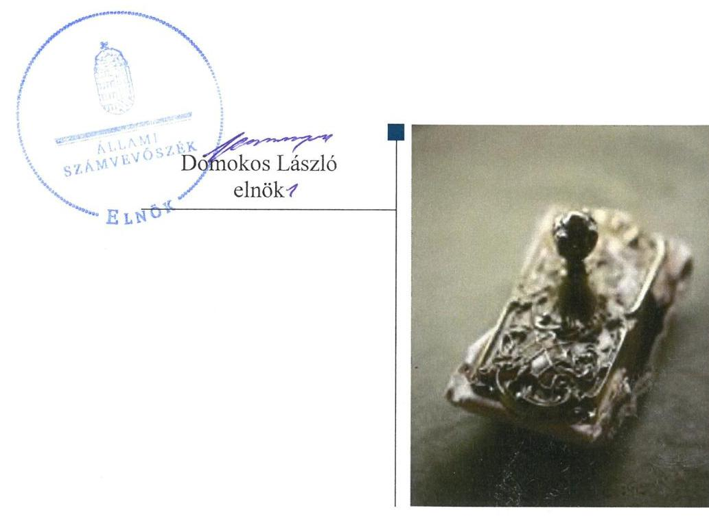
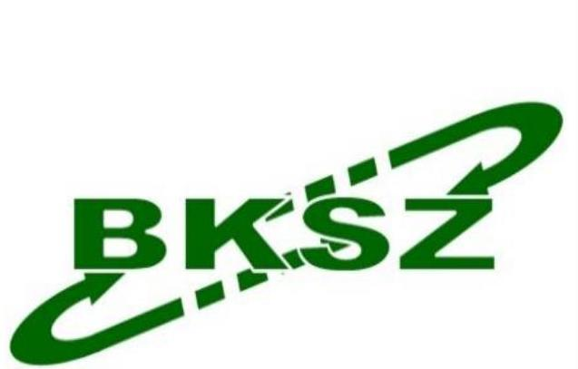

# Jelentés 

## Nemzeti tulajdonú gazdasági társaságok ellenőrzése

BKSZ Békési Kommunális és Szolgáltató Korlátolt Felelősségű Társaság 2019.

19216
www.asz.hu

---

# Jelentés 

## Nemzeti tulajdonú gazdasági társaságok ellenőrzése

BKSZ Békési Kommunális és Szolgáltató Korlátolt Felelősségű Társaság
2019. 11. hó 26. nap

---

# AZ ELLENŐRZÉST FELÜGYELTE:

## MAKKAI MÁRIA felügyeleti vezető

## AZ ELLENŐRZÉST VEZETTE ÉS A VÉGREHAJTÁSÁÉRT FELELŐS:

### ÁRPÁSI TIBOR ellenőrzésvezető

## A PROGRAM ÖSSZEÁLLÍTÁSÁÉRT FELELŐS:

### TÓTPÁL SZABOLCS osztályvezető

IKTATÓSZÁM: EL-2172-001/2019.

TÉMASZÁM: 2478

ELLENŐRZÉS-AZONOSÍTÓ SZÁM: V082211

Jelentéseink az Országgyűlés számítógépes hálózatán és az Interneten a www.asz.hu címen is olvashatóak.

---

# TARTALOMJEGYZÉK 

■ ÖSSZEGZÉS ..... 5
■ AZ ELLENŐRZÉS CÉLJA ..... 6
■ AZ ELLENŐRZÉS TERÜLETE ..... 7
■ AZ ELLENŐRZÉS HÁTTERE, INDOKOLTSÁGA ..... 8
■ A JELENTÉS LÉNYEGES KÉRDÉSKÖREI ..... 9
■ AZ ELLENŐRZÉS HATÓKÖRE ÉS MÓDSZEREI ..... 10
■ MEGÁLLAPÍTÁSOK ..... 12
■ JAVASLATOK ..... 14
■ MELLÉKLETEK ..... 15
I. sz. melléklet: Fogalomtár ..... 15
■ FÜGGELÉK: ÉSZREVÉTELEK ..... 17
■ RÖVIDÍTÉSEK JEGYZÉKE ..... 19

---

.

---

# ÖSSZEGZÉS 

Békés Város Önkormányzata a BKSZ Békési Kommunális és Szolgáltató Korlátolt Felelősségű Társaság feletti tulajdonosi jogait nem szabályszerűen gyakorolta. A Társaság vagyongazdálkodása nem volt szabályszerű, így a vagyonnal való gazdálkodás során a nemzeti vagyon megőrzése, elszámoltathatósága nem volt biztosított.

## Az ellenőrzés társadalmi indokoltsága

Az Állami Számvevőszék stratégiájában megfogalmazta, hogy az államháztartáson kívül működő feladatellátó rendszerek ellenőrzéseivel hozzájárul ahhoz, hogy a közpénzeket, illetve az ingyenesen juttatott közvagyont az államháztartáson kívül működő szervezetek is átlátható, rendezett módon használják fel.

Az állam és a helyi önkormányzatok tulajdona nemzeti vagyon. A nemzeti vagyon megőrzése, megóvása érdekében kiemelten fontos a nemzeti tulajdonú gazdasági társaságok ellenőrzése.

Az Állami Számvevőszék céljaival és a társadalmi igénnyel összhangban, a gazdasági társaságok kiemelt fontosságú szerepe miatt került sor a Békés Város Önkormányzata kizárólagos tulajdonában álló BKSZ Békési Kommunális és Szolgáltató Korlátolt Felelősségű Társaság vagyongazdálkodásának, illetve az Önkormányzat tulajdonosi joggyakorlásának ellenőrzésére.

## Főbb megállapítások, következtetések, javaslatok

A BKSZ Békési Kommunális és Szolgáltató Korlátolt Felelősségű Társaság feletti tulajdonosi joggyakorlás nem volt szabályszerű, mert az Alapító a Társaság javadalmazási szabályzatát nem alkotta meg.

A BKSZ Békési Kommunális és Szolgáltató Korlátolt Felelősségű Társaság vagyongazdálkodása nem volt szabályszerű, nem gondoskodott a nemzeti vagyon védelméről, mert az egyszerűsített éves beszámolók mérlegtételeit nem támasztotta alá leltárral.

Az Állami Számvevőszék a jelentésben foglalt megállapítások alapján Békés Város Önkormányzata polgármesterének egy, a BKSZ Békési Kommunális és Szolgáltató Korlátolt Felelősségű Társaság ügyvezetőjének négy javaslatot fogalmazott meg.

---

# AZ ELLENŐRZÉS CÉLJA 

AZ ELLENŐRZÉS CÉLJA annak megállapítása volt, hogy a tulajdonosi joggyakorló a gazdasági társasága feletti tulajdonosi joggyakorlás kereteit kialakította-e, tulajdonosi jogait megfelelően gyakorolta-e és kötelezettségeit teljesítette-e. Továbbá annak megállapítása, hogy a gazdasági társaság biztosította-e a vagyon védelmét a nyilvántartások szabályszerű vezetése és a mérleg tételeinek leltárral történő alátámasztása útján, valamint szabályszerűen gondoskodott-e a társaság használatában lévő nemzeti vagyon értékének megőrzéséről, gyarapításáról, hasznosításáról.

---

# AZ ELLENŐRZÉS TERÜLETE 

## Békés Város Önkormányzata és a BKSZ Békési Kommunális és Szolgáltató Korlátolt Felelősségű Társaság

Békés Város Önkormányzata 2013-tól kizárólagos tulajdonosa a BKSZ Békési Kommunális és Szolgáltató Korlátolt Felelősségű Társaságnak, amelynek törzstőkéje 2014-től 30 millió Ft volt.

A Társaság az ellenőrzött időszakban az Önkormányzattal kötött Vállalkozási szerződés ${ }^{1}$ alapján településüzemeltetési közfeladatokat, Vagyonhasznosítási szerződés ${ }_{1,2}{ }^{2}$ alapján lakás- és helyiséggazdálkodási közfeladatot látott el. A Társaság tevékenységébe tartozott köztisztasági, zöldterület fenntartási munkák, hó- és síkosság mentesítési feladatok ellátása, közúthálózat üzemeltetése, csapadékcsatorna hálózat fenntartása, továbbá ingatlanok bérbeadása és üzemeltetése, szennyvíz gyűjtése, kezelése, veszélyes és nem veszélyes hulladék gyűjtése, kezelése.

A Társaságnak az ellenőrzött időszakban nem volt vagyonkezelésbe vett eszköze, tevékenységét saját, illetve Bérleti szerződés ${ }_{1-3}{ }^{3}$ és Használati szerződés ${ }^{4}$ alapján önkormányzati tulajdonú eszközökkel végezte. A Társaság más gazdasági társaságban nem rendelkezett részesedéssel és nem tartozott a kormányzati szektorba sorolt egyéb szervezetek közé.
Az ellenőrzött időszakban az ügyvezető ${ }^{5}$ személye 2017. január 27-től változott. A három tagú felügyelőbizottság összetétele nem változott. A Társaság a Számv. tv. ${ }^{6}$ szerint könyvvizsgálatra volt kötelezett, a könyvvizsgáló ${ }^{7}$ személye nem változott.

Békés város polgármesterének ${ }^{8}$ és a jegyző ${ }^{9}$ személyében az ellenőrzött időszakban nem következett be változás. Az Önkormányzat 2017. végén a Társaságon kívül további három gazdasági társaságban kizárólagos, négy gazdasági társaságban pedig kisebbségi tulajdoni részesedéssel rendelkezett.

---

# AZ ELLENŐRZÉS HÁTTERE, INDOKOLTSÁGA 

Az Alaptörvény 38. cikke alapján az állam és a helyi önkormányzatok tulajdona nemzeti vagyon. A nemzeti vagyon megőrzése, megóvása érdekében kiemelten fontos ezen nemzeti tulajdonú gazdasági társaságok ellenőrzése. Gazdálkodásuk jellemzően a közérdeklődés és a média figyelmének középpontjában áll, amihez hozzájárul a gazdálkodásuk körébe tartozó - a nemzeti vagyon részét képező - vagyon nagysága, illetve az általuk ellátott közszolgáltatások minősége és hatékonysága.

Ellenőrzéseink feltárhatják, hogy a tulajdonosi felügyelet hozzájárult-e a szabályszerű gazdálkodáshoz és feladatellátáshoz. Az ellenőrzés eredményeként meghatározhatóvá válnak a gazdasági társaság vagyongazdálkodást érintő kockázatai, ezzel lehetővé téve a kockázatok csökkentését. A megállapítások alapján megfogalmazott számvevőszéki javaslatok hasznosítása elősegítheti a meglévő hibák megszüntetését. A jó gyakorlatok bemutatásával az ÁSZ ${ }^{10}$ hozzájárulhat a követendő megoldások megismertetéséhez, terjesztéséhez.

---

# A JELENTÉS LÉNYEGES KÉRDÉSKÖREI 

1. A Társaság feletti tulajdonosi joggyakorlás megfelelt-e az előírásoknak?
2. A Társaság vagyongazdálkodása szabályszerű volt-e?

---

# AZ ELLENŐRZÉS HATÓKÖRE ÉS MÓDSZEREI 

## Az ellenőrzés típusa

Megfelelőségi ellenőrzés.

## Az ellenőrzött időszak

A tulajdonosi joggyakorlás tekintetében az ellenőrzött időszak a 2017. év az éves beszámolók elfogadása kivételével, amelynél az ellenőrzött időszak a 2015-2017. évek.

A társaság vagyongazdálkodási tevékenységét illetően az ellenőrzött időszak a 2015 - 2017. évek.

## Az ellenőrzés tárgya

A BKSZ Békési Kommunális és Szolgáltató Korlátolt Felelősségű Társaság feletti tulajdonosi joggyakorlás kialakítása és működtetése.

A BKSZ Békési Kommunális és Szolgáltató Korlátolt Felelősségű Társaság vagyongazdálkodási tevékenysége, a társaság használatában lévő nemzeti vagyon, illetve a saját vagyona tekintetében a vagyonnyilvántartások vezetése, leltára, a nemzeti vagyon értékének megőrzése, gyarapítása, hasznosítása.

## Az ellenőrzött szervezet

Békés Város Önkormányzata
BKSZ Békési Kommunális és Szolgáltató Korlátolt Felelősségű Társaság

## Az ellenőrzés jogalapja

Az ellenőrzés jogszabályi alapját az ÁSZ tv. ${ }^{11}$ 1. § (3) bekezdése és 5. § (3) - (5) bekezdései képezték.

## Az ellenőrzés módszerei

Az ÁSZ az ellenőrzést az ellenőrzési program ellenőrzési kérdései, az ellenőrzött időszakban hatályos jogszabályok, az ellenőrzés szakmai szabályok és módszertanok alapján, a nemzetközi standardok figyelembe vételével végezte.

---

Az ellenőrzés ideje alatt az ellenőrzött szervezettel történő kapcsolattartást az ÁSZ Szervezeti és Működési Szabályzatának vonatkozó előírásai alapján biztosította az ÁSZ.

Az ÁSZ 2017. január 1-től az ellenőrzés megkezdésének napjáig - 2019. február 26-ig - ellenőrizte a tulajdonosi joggyakorlás kereteinek kialakítását, a tulajdonosi joggyakorló tevékenységét a felügyelő bizottság és a független könyvvizsgáló működéséhez kapcsolódóan, valamint azt, hogy a tulajdonosi joggyakorló - amennyiben a gazdasági társaság feladatellátásához kapcsolódóan határozott meg követelményeket, elvárásokat - a nemzeti vagyon értékének megőrzése érdekében monitorozta-e azok teljesülését. Az ÁSZ a 2015. január 1-től 2019. február 26-ig terjedő teljes ellenőrzött időszakra ellenőrizte a tulajdonosi joggyakorló részvételét az éves beszámoló elfogadására vonatkozó döntéshozatalban.

A gazdasági társaság vagyonhoz kapcsolódó nyilvántartásai vezetésének megfelelősége, valamint a nemzeti vagyon értéke megőrzésének, gyarapításának, hasznosításának szabályszerűsége 2015. és 2017. évek tekintetében került ellenőrzésre. A 2015-2017. éveket érintően történt meg a lényeges dokumentumok értékelése, kiemelten a mérleg tételeinek leltárral való alátámasztottsága.

Az ellenőrzési kérdések megválaszolásához szükséges bizonyítékok megszerzése a következő ellenőrzési eljárások alkalmazásával történt: megfigyelés, információkérés, összehasonlítás, lényeges sokaságból mintavétel, valamint elemző eljárás. Az ellenőrzési bizonyítékként felhasználható adatforrások közé tartoztak az ellenőrzési programban felsorolt adatforrások, továbbá minden - az ellenőrzés folyamán - feltárt, az ellenőrzés szempontjából információkat tartalmazó dokumentum. Az ellenőrzést a kérdésekre adott válaszok kiértékelésével, valamint a megjelölt adatforrások, a csatolt tanúsítványok felhasználásával, továbbá az adott időszakban hatályos jogszabályok figyelembe vételével folytatta le az ÁSZ.

A vagyonnyilvántartások és a leltár szabályszerűsége esetében az ellenőrzés azokra a legnagyobb értékű tételekre - a lényeges sokaságra - terjedt ki, melyek összértéke elérte a teljes sokaság összértékének 50%-át. A 2015. és 2017. évek esetében a lényeges sokaságot tételesen ellenőriztük.

---

# 1. A Társaság feletti tulajdonosi joggyakorlás megfelelt-e az előírásoknak? 

Összegző megállapítás

Az Önkormányzat tulajdonosi joggyakorlása nem volt szabályszerű, mert annak kereteit nem a jogszabályi előírások szerint alakították ki.

A kizárólagos önkormányzati tulajdonban lévő gazdasági társaság legfőbb szerve nem alkotta meg a Taktv. ${ }^{12}$ 5. § (3) bekezdésében előírt, a vezető tisztségviselők, a felügyelőbizottsági tagok és az Mt. ${ }^{13}$ 208. §-ának hatálya alá eső munkavállalók javadalmazása, valamint a jogviszony megszűnése esetére biztosított juttatások módjának, mértékének elveiről, annak rendszeréről szóló szabályzatot.

Az Önkormányzat Képviselő-testülete a Társaság 2015-2017. évi éves egyszerűsített beszámolóit a Ptk. ${ }^{14}$ előírásaival összhangban a felügyelőbizottság és a könyvvizsgáló írásbeli jelentésének birtokában hagyta jóvá.

## 2. A Társaság vagyongazdálkodása szabályszerű volt-e?

## Összegző megállapítás

A Társaság vagyongazdálkodása a 2015-2017. években nem volt szabályszerű.

A Társaság 2017. július 1-től hatályos Leltározási szabályzata; ${ }^{15}$ a Számv. tv. 69. § (4) bekezdés előírása ellenére a pénzkészlet egyeztetéssel történő leltározását írta elő.

A Társaság 2015-ben a Számv. tv. 52. § (2) bekezdésében foglaltakat megsértve a beszerzett tárgyi eszköz üzembe helyezését nem dokumentálta, ezáltal az értékcsökkenés elszámolása nem volt megalapozott. 2017-ben meglévő tárgyi eszköz bővítése során a Társaság nem tartotta be a Számv. tv. 52. § (2) bekezdésében foglaltakat, mert nem az üzembe helyezés időpontjától számolta el az értékcsökkenést.

A Társaság 2015-2017-ben a Számv. tv. 69. § (4) bekezdésben előírt kötelezettséget figyelmen kívül hagyva a készpénz és a készletek mennyiségi felvétellel történő leltározását nem végezte el, annak ellenére, hogy azokról nem vezetett a számviteli alapelveknek megfelelő mennyiségi nyilvántartást, továbbá a Számv. tv. 69. § (3)-(4) bekezdéseiben foglaltak ellenére nem tett eleget egyeztetéssel történő leltározási kötelezettségének. A Társaság a 2015-2017. évi egyszerűsített éves beszámolók mérlegtételeit a Számv. tv. 69. § (1) bekezdésében foglaltak ellenére - a mérleg fordulónapján meglévő eszközöket és forrásokat mennyiségben és értékben tételesen, ellenőrizhető módon tartalmazó - leltárral nem támasztotta alá.

---

A Számv. tv. szerinti leltár hiánya ellenére a könyvvizsgáló a 2015-2017. évi egyszerűsített éves beszámolókat korlátozás nélküli hitelesítő záradékkal látta el.

A Társaság ingatlanhasznosítási tevékenysége nem volt szabályszerű, mert a Vagyonhasznosítási szerződés; V.B.2.) pontjában, illetve a Vagyonhasznosítási szerződés; V.4.) pontjában foglaltak ellenére bérleti szerződés megkötéséhez a Társaság nem szerezte be előzetesen a tulajdonos írásbeli hozzájárulását.

---

# JAVASLATOK 

Az ÁSZ tv. 33. § (1) bekezdésében foglaltak értelmében az ellenőrzött szervezet vezetője köteles a jelentésben foglalt megállapításokhoz kapcsolódó intézkedési tervet összeállítani és azt a jelentés kézhezvételétől számított 30 napon belül az ÁSZ részére megküldeni. Amennyiben az ellenőrzött szervezet vezetője nem küldi meg határidőben az intézkedési tervet, vagy továbbra sem elfogadható intézkedési tervet küld, az Állami Számvevőszék elnöke az ÁSZ tv. 33. § (3) bekezdése a) és b) pontjaiban foglaltakat érvényesítheti.

## Békés

 Város polgármesterének

1. Kezdeményezze a jogszabályi előírás betartásának érdekében a vezető tisztségviselők, felügyelőbizottsági tagok, valamint az Mt. 208. §-ának hatálya alá eső munkavállalók javadalmazása, valamint a jogviszony megszünése esetére biztosított juttatások módjának, mértékének elveire, annak rendszerére vonatkozó szabályzat megalkotását.
(1. sz. megállapítás 1. bekezdése alapján)

## a BKSZ Békési Kommunális és Szolgáltató Korlátolt Felelősségű Társaság ügyvezetőjének

1. Intézkedjen, hogy a leltározási szabályzat feleljen meg a jogszabályi előírásoknak.
(2. sz. megállapítás 1. bekezdése alapján)
2. Intézkedjen a tárgyi eszközök értékcsökkenésének jogszabályi előírásnak megfelelő elszámolásáról.
(2. sz. megállapítás 2. bekezdés második mondata alapján)
3. Intézkedjen a Számv. tv. előírásának megfelelően a leltározás végrehajtásáról.
(2. sz. megállapítás 3. bekezdés első mondata alapján)
4. Intézkedjen a jogszabályi előírásoknak megfelelően a mérleg tételeit alátámasztó leltár elkészítéséről, amely tételesen, ellenőrizhető módon tartalmazza a mérleg fordulónapján meglévő eszközöket és forrásokat mennyiségben és értékben.
(2. sz. megállapítás 3. bekezdés második mondata alapján)

---

# MELLÉKLETEK 

- I. SZ. MELLÉKLET: FOGALOMTÁR
gazdasági társaság
kormányzati szektorba sorolt egyéb szervezet
közszolgáltatás
közfeladat
nemzeti vagyon
nemzeti vagyon hasznosítása
tulajdonosi jogok gyakorlója
vagyonkezelői jog

A gazdasági társaságok üzletszerű közös gazdasági tevékenység folytatására, a tagok vagyoni hozzájárulásával létrehozott, jogi személyiséggel rendelkező vállalkozások, amelyekben a tagok a nyereségből közösen részesednek, és a veszteséget közösen viselik. (Forrás: Ptk. 3:88. § (1) bekezdése)
Az a szervezet, amely az Áht. ${ }^{16}$ alapján nem része az államháztartásnak, azonban az Európai Közösséget létrehozó szerződéshez csatolt, a túlzott hiány esetén követendő eljárásról szóló jegyzőkönyv alkalmazásáról szóló 2009. május 25-i 479/2009/EK rendelet ${ }^{17}$ szerint a kormányzati szektorba tartozik.
Az Ebktv. ${ }^{18}$ 3. § d) pontja a következőképpen határozza meg a közszolgáltatást: „szerződéskötési kötelezettség alapján a lakosság alapvető szükségleteinek ellátására irányuló szolgáltatás, így különösen a villamos energia-, gáz-, hő-, víz-, szenny-víz- és hulladékkezelési, köztisztasági, postai és távközlési szolgáltatás, továbbá a menetrend alapján közlekedő járművekkel végzett közforgalmú személyszállítás".
Az Áht. 3/A. § (1) bekezdése alapján közfeladat a jogszabályban meghatározott állami vagy önkormányzati feladat.
Nvtv. ${ }^{19}$ 1. § (2) bekezdése szerint nemzeti vagyonba tartozik többek között:
„az állam vagy a helyi önkormányzat kizárólagos tulajdonában álló dolgok,
az a) pont hatálya alá nem tartozó, állam vagy a helyi önkormányzat tulajdonában lévő dolog,
az állam vagy a helyi önkormányzat tulajdonában lévő pénzügyi eszközök, továbbá az államot vagy a helyi önkormányzatot megillető társasági részesedések,
az államot vagy a helyi önkormányzatot megillető bármely vagyoni értékkel rendelkező jogosultság, amelyet jogszabály vagyoni értékű jogként nevesít."
A tulajdonosi joggyakorló vagy a nemzeti vagyon használója által a nemzeti vagyon birtoklásának, használatának, hasznok szedése jogának bármely - a tulajdonjog átruházását nem eredményező - jogcímen történő átengedése, ide nem értve a vagyonkezelésbe adást, valamint a haszonélvezeti jog alapítását.
Forrás: Nvtv. 3. § (1) bekezdés 4. pont
Aki a nemzeti vagyon felett az államot vagy a helyi önkormányzatot megillető tulajdonosi jogok és kötelezettségek összességének gyakorlására jogosult. (Forrás: Nvtv. 3. § (1) bekezdés 17. pontja)
A vagyonkezelő köteles a vagyontárgy állagának megóvásáról, jó karbantartásáról, működtetéséről gondoskodni, jogszabályban és szerződésben előírt más kötelezettségét teljesíteni, valamint a vagyontárgyat jogszabályban vagy szerződésben meghatározott célnak megfelelően használni. A vagyonkezelő - a központi költségvetési szervek és a kizárólag közfeladatot ellátó nem központi költségvetési szerv vagyonkezelők kivételével - köteles díjat fizetni, jogszabályban és szerződésben előírt más kötelezettségét teljesíteni, valamint a vagyontárgyat jogszabályban vagy szerződésben meghatározott célnak megfelelően használni. Amennyiben a vagyonkezelő ezen kötelezettségeinek nem tesz eleget, a tulajdonosi joggyakorló jogosult a szerződést azonnali hatállyal felmondani. (Forrás: Vtv. ${ }^{20}$ 27. § (2), (2a) bekezdések)

---

.

---

# FÜGGELÉK: ÉSZREVÉTELEK 

A jelentéstervezetet a Számvevőszék 15 napos észrevételezésre megküldte az ellenőrzött szervezetek vezetőinek az ÁSZ tv. 29. § (1) bekezdése előírásának megfelelően.

Az ÁSZ a jelentéstervezetet észrevételezésre megküldte a BKSZ Békési Kommunális és Szolgáltató Korlátolt Felelősségű Társaság ügyvezetőjének és Békés Város Önkormányzata polgármesterének.
Békés Város polgármestere az ÁSZ tv. 29. § (2) bekezdésében foglalt észrevételezési jogával nem élt, a BKSZ Békési Kommunális és Szolgáltató Korlátolt Felelősségű Társaság ügyvezetője nemleges észrevételt tett.

[^0]
[^0]:    * 29. § (1) Az Állami Számvevőszék az ellenőrzési megállapításait megküldi az ellenőrzött szervezet vezetőjének vagy az általa megbízott személynek, és annak, akinek személyes felelősségét állapította meg.
    (2) Az ellenőrzött szervezet vezetője és a felelősként megjelölt személy az ellenőrzés megállapításaira tizenöt napon belül írásban észrevételt tehet.
    (3) Az Állami Számvevőszék az észrevételre a beérkezésétől számított harminc napon belül írásban válaszol. A figyelembe nem vett észrevételeket köteles a jelentésben feltüntetni, és megindokolni, hogy azokat miért nem fogadta el.

---

.

---

# RÖVIDÍTÉSEK JEGYZÉKE 

${ }^{1}$ Vállalkozási szerződés
${ }^{2}$ Vagyonhasznosítási szerződés ${ }_{1,2}$
${ }^{3}$ Bérleti szerződés ${ }_{3-3}$
${ }^{4}$ Használati szerződés
${ }^{5}$ ügyvezető
${ }^{6}$ Számv. tv.
${ }^{7}$ könyvvizsgáló
${ }^{8}$ polgármester
${ }^{9}$ jegyző
${ }^{10}$ ÁSZ
${ }^{11}$ ÁSZ tv.
${ }^{12}$ Taktv.
${ }^{13}$ Mt.
${ }^{14}$ Ptk.
${ }^{15}$ Leltározási szabályzat ${ }_{1,2}$
${ }^{16}$ Áht.
${ }^{17}$ 479/2009/EK rendelet
${ }^{18}$ Ebktv.
${ }^{19}$ Nvtv.
${ }^{20}$ Vtv.
az Önkormányzat és a Társaság között 2015. április 1-jén létrejött többször módosított vállalkozási szerződés városüzemeltetési, közterület-fenntartási munkák feladatok ellátására (hatályos: 2015. április 1-től 2020. március 31-ig)
az Önkormányzat és a Társaság között létrejött szerződés önkormányzati tulajdonú ingatlanok hasznosítására
szerződés: 2017. május 29-én létrejött vagyonhasznosítási szerződés önkormányzati tulajdonú lakások, nem lakás céljára szolgáló helyiségek és egyéb ingatlanok hasznosítására (hatályos: 2017. június 1-től 2027. május 31-ig)
szerződés: 2017. május 29-én létrejött vagyonhasznosítási szerződés az önkormányzati tulajdonú Inkubátorház megnevezésű ingatlan hasznosítására (hatályos: 2017. június 1-től 2022. május 31-ig)
az Önkormányzat és a Társaság között létrejött bérleti szerződés az önkormányzati tulajdonú Békés, Csabai utca 81. szám alatti ingatlanra vonatkozóan szerződés: hatályos: 2015. március 16-tól 2015. május 31-ig szerződés: hatályos: 2015. június 1-től 2016. december 31-ig szerződés: hatályos: 2018. január 1-től 2018. december 31-ig
a Képviselő-testület 60/2018. (II. 28.) sz. határozata alapján az Önkormányzat és a Társaság között 2018. március 1-jén létrejött szerződés önkormányzati tulajdonú gépjárművek használatáról (hatályos: 2018. március 1-től)
a Társaság ügyvezetője
2000. évi. C. törvény a számvitelről (hatályos: 2001. január 1-től)
a Társaság könyvvizsgálója (KOVERO Könyvvizsgáló és Pénzügyi Szolgáltató Kft.) Békés Város Önkormányzat polgármestere
Békési Polgármesteri Hivatal jegyzője
Állami Számvevőszék
2011. évi LXVI. törvény az Állami Számvevőszékről (hatályos: 2011. július 1-től)
2009. évi CXXII. törvény a köztulajdonban álló gazdasági társaságok takarékosabb működéséről (hatályos: 2009. december 4-től)
2012. évi I. törvény a munka törvénykönyvéről (hatályos: 2012. július 1-től) 2013. évi V. törvény a Polgári Törvénykönyvről (hatályos: 2014. március 15-től)
a Társaság eszközök és források leltárkészítési és leltározási szabályzata szabályzat: hatályos: 2012. június 6-tól 2017. június 30-ig
szabályzat: hatályos: 2017. július 1-től
az államháztartásról szóló 2011. évi CXCV. törvény
(hatályos: 2011. december 31-étől)
a Tanács 479/2009/EK rendelete az Európai Közösséget létrehozó szerződéshez csatolt, a túlzott hiány esetén követendő eljárásról szóló jegyzőkönyv alkalmazásáról 2003. évi CXXV. törvény az egyenlő bánásmódról és az esélyegyenlőség előmozdításáról (hatályos: 2004. január 27-től)
2011. évi CXCVI. törvény a nemzeti vagyonról (hatályos: 2011. december 31-től) 2007. évi CVI. törvény az állami vagyonról (hatályos: 2007. szeptember 25-től)

---

# ÁLLAMI SZÁMVEVŐSZÉK 

1052 Budapest, Apáczai Csere János utca 10.
Levélcím: 1364 Budapest 4. Pf. 54
Telefon: +36 14849100 Telefax: +36 14849200
www.asz.hu
