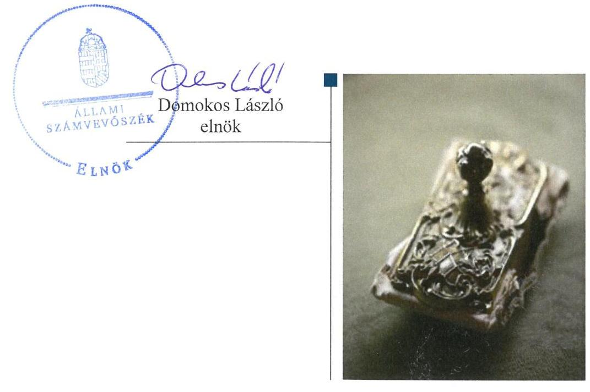
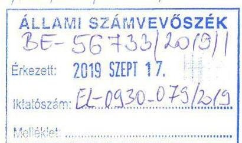
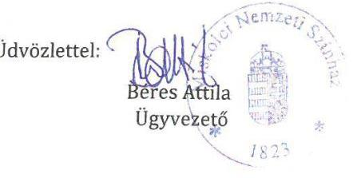
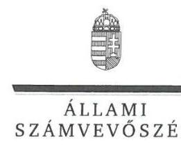
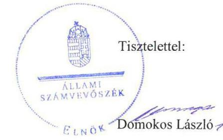

# Jelenetés 

## Nemzeti tulajdonú gazdasági társaságok ellenőrzése

Miskolci Nemzeti Színház Nonprofit Kft. 2019.

---

# Jelenetés 

## Nemzeti tulajdonú gazdasági társaságok ellenőrzése

Miskolci Nemzeti Színház Nonprofit Kft. 2019. H. hó 2A. nap

---

# AZ ELLENŐRZÉST FELÜGYELTE:

- KAKAS SÁNDOR felügyeleti vezető
- AZ ELLENŐRZÉST VEZETTE ÉS A VÉGREHAJTÁSÁÉRT FELELŐS:
  - **ÓDOR ZOLTÁN TAMÁS** ellenőrzésvezető
  - **A PROGRAM ÖSSZEÁLLÍTÁSÁÉRT FELELŐS:**
    - **TÓTPÁL SZABOLCS** osztályvezető

**IKTATÓSZÁM:** EL-2173-001/2019.

**TÉMASZÁM:** 2478

**ELLENŐRZÉS-AZONOSÍTÓ SZÁM:** V082243

Jelentéseink az Országgyűlés számítógépes hálózatán és az Interneta a www.asz.hu címen is olvashatóak.

---

# TARTALOMJEGYZÉK 

■ ÖSSZEGZÉS ..... 5
■ AZ ELLENŐRZÉS CÉLJA ..... 6
■ AZ ELLENŐRZÉS TERÜLETE ..... 7
■ AZ ELLENŐRZÉS HÁTTERE, INDOKOLTSÁGA ..... 8
■ A JELENTÉS LÉNYEGES KÉRDÉSKÖREI ..... 9
■ AZ ELLENŐRZÉS HATÓKÖRE ÉS MÓDSZEREI ..... 10
■ MEGÁLLAPÍTÁSOK ..... 12
■ JAVASLATOK ..... 14
■ MELLÉKLETEK ..... 15
I. sz. melléklet: Értelmező szótár ..... 15
■ FÜGGELÉK: ÉSZREVÉTELEK ..... 17
■ RÖVIDÍTÉSEK JEGYZÉKE ..... 25

---

.

---

# ÖSSZEGZÉS 

Miskolc Megyei Jogú Város Önkormányzata a tulajdonosi jogait nem szabályszerűen gyakorolta a Miskolci Nemzeti Színház Nonprofit Kft. vonatkozásában.
A Miskolci Nemzeti Színház Nonprofit Kft. vagyongazdálkodása nem volt szabályszerű. Számviteli beszámolóit 2015-2017. években nem támasztotta alá leltárral, így az elszámoltathatóság, a nemzeti vagyon megóvása nem volt biztosított.

## Az ellenőrzés társadalmi indokoltsága

Az Állami Számvevőszék kiemelt célja, hogy a helyi önkormányzatok gazdálkodásában rejlő pénzügyi kockázatok feltárásával, az államháztartáson kívülre nyújtott költségvetési támogatások és ingyenes vagyonjuttatások, valamint az államháztartáson kívül múködő feladatellátó rendszerek ellenőrzéseivel hozzájáruljon ahhoz, hogy a közpénzeket az államháztartáson kívül múködő szervezetek is átlátható, rendezett módon használják fel.

Magyarországon az önkormányzatok kötelező és önként vállalt feladataik vonatkozásában is egyre szélesebb körben alkalmazzák a költségvetésen kívüli feladatellátást, ezáltal - a nonprofit szervezetek mellett - az önkormányzati tulajdonú gazdasági társaságok is kiemelt fontosságú szerephez jutottak.

Az önkormányzati többségi tulajdonban álló gazdaságok ellenőrzése kiemelt jelentőségű, mivel múködésük hatással van a tulajdonos önkormányzat gazdálkodására.

Miskolcon 2015-2017 között a Miskolci Nemzeti Színház Nonprofit Kft. közfeladatokat látott el, Miskolc Megyei Jogú Város Önkormányzatával kötött megállapodás keretében, tevékenységén keresztül a lakosság széles köre kerülhet kapcsolatba a Társasággal és az általa nyújtott szolgáltatásokkal, ezért is indokolt az Állami Számvevőszék által folytatott ellenőrzés.

## Főbb megállapítások, következtetések, javaslatok

Miskolc Megyei Jogú Város Önkormányzata a tulajdonosi joggyakorlás kereteit nem a jogszabályi előírásokat követve alakította ki, a javadalmazással összefüggő szabályzatát nem alkotta meg. A tulajdonosi jogok gyakorlása nem volt szabályszerű.

A Miskolci Nemzeti Színház Nonprofit Kft. vagyongazdálkodási tevékenysége nem volt szabályszerű, 2015-2017. években a számviteli beszámolók mérlegtételeit nem támasztotta alá a Számv. tv. előírásai szerinti leltárral, ezért az egyszerűsített éves beszámolói nem voltak megalapozottak.

Az ellenőrzött időszakban a Társaság kormányzati szektorba sorolt szervezet volt, de államadósságot keletkeztető ügyletet nem kötött. A kormányzati szektor hiányára befolyást gyakorló gazdasági eseménye nem volt, adatszolgáltatási kötelezettségeit nem teljesítette.

Az Állami Számvevőszék Miskolc Megyei Jogú Város Önkormányzata polgármesterének két, a Miskolci Nemzeti Színház Nonprofit Kft. ügyvezetőjének szintén két javaslatot fogalmazott meg. A javaslatokat megalapozó megállapításokra az érintetteknek 30 napon belül intézkedési tervet kell készíteniük.

---

# AZ ELLENŐRZÉS CÉLJA 

Az ellenőrzés célja annak megállapítása volt, hogy a tulajdonosi joggyakorló a gazdasági társaságai feletti tulajdonosi joggyakorlás kereteit kialakította-e, tulajdonosi jogait megfelelően gyakorolta-e és kötelezettségeit teljesítettee, továbbá annak megállapítása, hogy a gazdasági társaság biztosította-e a vagyon védelmét a nyilvántartások szabályszerű vezetése és a mérleg tételeinek leltárral történő alátámasztása útján, valamint szabályszerűen gon-doskodott-e a társaság használatában, kezelésében lévő nemzeti vagyon értékének megőrzéséről, gyarapításáról, hasznosításáról. További cél volt annak megítélése, hogy a gazdasági társaság gazdálkodásának a kormányzati szektor hiányára és az államadósságra befolyással bíró elemei megfeleltek-e a jogszabályi előírásoknak.

---

# AZ ELLENŐRZÉS TERÜLETE 

## Miskolci Nemzeti Színház Nonprofit Kft. és a kizárólagos tulajdonosi jogokat gyakorló Miskolc Megyei Jogú Város Önkormányzata

## MISKOLCi nEmZeti színház

Miskolc Megyei Jogú Város Önkormányzata 2012. február 16án alapította a Miskolci Nemzeti Színház Nonprofit Kft.-t a megszüntetett Miskolci Nemzeti Színház, mint önálló költségvetési szerv utódszervezeteként. A Társaság ${ }^{1}$ az ellenőrzött időszakban az Önkormányzat² kizárólagos tulajdonában állt.

A Társaság jegyzett tőkéje 2015. január 1-én 76,07 M Ft volt, amely az Önkormányzat közgyűlésének 2015. május 27-i döntése alapján tőkeleszállítást követően 25 M Ft-ra csökkent, és ezt követően az ellenőrzött időszak végéig nem változott.

A Társaság Alapító okirat ${ }_{1-2}$-ban meghatározott főtevékenysége előadó-művészet, mint közhasznú tevékenység volt, amelyeket közfeladatként látott el.

A Társaság az ellenőrzött időszakban saját vagyonával gazdálkodott, vagyonkezelt vagyonnal nem rendelkezett, koncessziós szerződést nem kötött. A Társaságnak nem volt másik gazdasági társaságban tulajdoni részesedése.

A Társaság a 2013. december 16-án kiadott NGM közlemény ${ }^{3}$ és az Áht. ${ }^{4}$ 109. §. (8) bekezdés alapján kormányzati szektorba sorolt egyéb szervezetek közé tartozott.

A Társaság a Számv. tv. ${ }^{5}$ előírása alapján könyvvizsgálatra kötelezett volt.

A Társaság ügyvezetőjének személye az ellenőrzés időszaka alatt kétszer változott, a jelenlegi ügyvezető tisztségét 2015. június 19-től látja el, a polgármester személye az ellenőrzött időszak alatt nem változott.

A Társaságnál három tagú Felügyelő Bizottság működött. 2017. július 15. napján a Felügyelő Bizottságból egy tag visszahívásra került, és helyette új tag került megválasztásra.

A Társaság által foglalkoztatottak száma 2015. évben 293 fő volt, 2017. évben 260 főre csökkent.

---

# AZ ELLENŐRZÉS HÁTTERE, INDOKOLTSÁGA 

Az Alaptörvény 38. cikke alapján az állam és a helyi önkormányzatok tulajdona nemzeti vagyon. A nemzeti vagyon megőrzése, megóvása érdekében kiemelten fontos ezen nemzeti tulajdonú gazdasági társaságok ellenőrzése. Gazdálkodásuk jellemzően a közérdeklődés és a médiafigyelmének középpontjában áll, amihez hozzájárul a gazdálkodásuk körébe tartozó vagyon nagysága is.

A nemzeti tulajdonú gazdasági társaságok ellenőrzése kiemelten fontos a nemzeti vagyon megőrzése érdekében. Gazdálkodásuk jellemzően a közérdeklődés és a média figyelmének középpontjában áll, amihez hozzájárul a gazdálkodásuk körébe tartozó - a nemzeti vagyon részét képező - vagyon nagysága, illetve az általuk ellátott közszolgáltatások minősége és hatékonysága. Ellenőrzéseink feltárhatják, hogy a tulajdonosi felügyelet hozzájárult-e a szabályszerű gazdálkodáshoz és feladatellátáshoz.

Az ellenőrzés eredményeként meghatározhatóvá válnak a szervezet vagyongazdálkodást érintő kockázatai, ezzel lehetővé téve a kockázatok csökkentését. A megállapítások alapján megfogalmazott számvevőszéki javaslatok hasznosítása elősegítheti a meglévő hibák megszüntetését. A jó gyakorlatok bemutatásával az ÁSZ hozzájárulhat a követendő megoldások megismertetéséhez, terjesztéséhez.

---

# A JELENTÉS LÉNYEGES KÉRDÉSKÖREI 

1. A gazdasági társaság feletti tulajdonosi joggyakorlás megfelel-e a jogszabályi és belső előírásoknak?
2. A Társaság vagyongazdálkodási tevékenysége szabályszerü volt-e?
3. A Társaság gazdálkodásának a kormányzati szektor hiányára és az államadósságra befolyással bíró elemei megfeleltek-e a jogszabályi előírásoknak?

---

# AZ ELLENŐRZÉS HATÓKÖRE ÉS MÓDSZEREI 

## Az ellenőrzés típusa

Megfelelőségi ellenőrzés.

## Az ellenőrzött időszak

A tulajdonosi joggyakorlás vonatkozásában az ellenőrzött időszak 2017. január 1-től az ellenőrzés megkezdésének napjáig, 2019. február 27-ig terjedt ki az éves beszámolók elfogadása és tulajdonosi ellenőrzése kivételével, amelyeknél az ellenőrzött időszak 2015. január 1-től az ellenőrzés megkezdésének napjáig tartott.

A Társaság vagyongazdálkodása és a kormányzati szektor hiányára és az államadósságra befolyással bíró elemei vonatkozásában az ellenőrzött időszak 2015-2017. évek, a 2017. évi beszámoló jóváhagyása tekintetében 2018. június elsejéig tartó időszak.

## Az ellenőrzés tárgya

Az önkormányzat 100\%-os tulajdonában lévő gazdasági társaság feletti tulajdonosi joggyakorlás kialakítása és múködtetése.

Önkormányzati tulajdonban lévő gazdasági társaság vagyongazdálkodása, saját vagyona tekintetében a vagyonnyilvántartások vezetése, leltára, továbbá a kormányzati szektorba sorolt nemzeti tulajdonban lévő gazdasági társaság gazdálkodásának a kormányzati szektor hiányára és az államadósságra befolyással bíró elemei és a jogszabályi előírásoknak megfelelő adatszolgáltatási kötelezettségük teljesítése.

## Az ellenőrzött szervezet

Miskolc Megyei Jogú Város Önkormányzata, Miskolci Nemzeti Színház Nonprofit Kft.

## Az ellenőrzés jogalapja

Az ellenőrzés jogalapját az ÁSZ tv. ${ }^{6} 1 . \S$ (3) bekezdése és 5. § (3)-(5) bekezdései képezték.

---

# Az ellenőrzés módszerei 

Az ellenőrzést az ellenőrzési program ellenőrzési kérdései, az ellenőrzött időszakban hatályos jogszabályok, az ellenőrzés szakmai szabályok és módszertanok alapján, a nemzetközi standardok figyelembe vételével végezte az ÁSZ.

Az ellenőrzés ideje alatt az ellenőrzött szervezettel történő kapcsolattartást az ÁSZ Szervezeti és Múködési Szabályzatának vonatkozó előírásai alapján biztosította az ÁSZ.
2017. január 1-től 2019. február 27-ig, az ellenőrzés megkezdésének napjáig ellenőriztük a tulajdonosi joggyakorlás kereteinek kialakítását, a tulajdonosi joggyakorló tevékenységét a felügyelő bizottság és a független könyvvizsgáló múködéséhez kapcsolódóan, valamint azt, hogy a tulajdonosi joggyakorló - amennyiben a gazdasági társaság feladatellátásához kapcsolódóan határozott meg követelményeket, elvárásokat - a nemzeti vagyon értékének megőrzése érdekében monitorozta-e azok teljesülését. 2015. január 1-től az ellenőrzés megkezdésének napjáig ellenőrizte az ÁSZ a tulajdonosi joggyakorló részvételét az éves beszámoló elfogadására vonatkozó döntéshozatalban.

A gazdasági társaság vagyonhoz kapcsolódó nyilvántartásai vezetésének megfelelősége, valamint a nemzeti vagyon értéke megőrzésének, gyarapításának, hasznosításának szabályszerűsége 2015. és 2017. évek tekintetében került ellenőrzésre. A 2015-2017. éveket érintően történt meg a lényeges dokumentumok értékelése.

Az ellenőrzési kérdések megválaszolásához szükséges bizonyítékok megszerzése a Társaság vonatkozásában a következő ellenőrzési eljárások alkalmazásával történt: megfigyelés, információkérés, összehasonlítás, elemző eljárás. Az ellenőrzési bizonyítékként felhasználható adatforrások közé tartoznak az ellenőrzési programban felsorolt adatforrások, továbbá minden - az ellenőrzés folyamán - feltárt, az ellenőrzés szempontjából információkat tartalmazó dokumentum. Az ÁSZ az ellenőrzést a kérdésekre adott válaszok kiértékelésével, valamint a megjelölt adatforrások, a csatolt tanúsítványok felhasználásával, továbbá az adott időszakban hatályos jogszabályok figyelembe vételével folytatta le.

A vagyonnyilvántartások és a leltár szabályszerűségét mintavétellel ellenőrizte az ÁSZ. A vagyonnyilvántartások és a leltár esetében az ellenőrzés azokra a legnagyobb értékű tételekre - a lényeges sokaságra - terjedt ki, melyek összértéke eléri a teljes sokaság összértékének 50\%-át. A 2017. év esetében a lényeges sokaság tételes ellenőrzésére került sor. A 2015. év esetében a lényeges sokaságból véletlen mintavételi eljárással kiválasztott tételek kerültek ellenőrzésre. "Szabályszerű" értékelés kapott egy ellenőrzött területet, amennyiben 95\%-os bizonyossággal az ellenőrzött sokaságban az átlagos hibaarány legfeljebb 10\%, "nem szabályszerű", amennyiben 10\%-nál magasabb arányt képviselt.

---

# 1. A gazdasági társaság feletti tulajdonosi joggyakorlás megfelel-e a jogszabályi és belső előírásoknak? 

Összegző megállapítás Az Önkormányzat tulajdonosi joggyakorlása nem volt szabályszerű.

A TÁRSASÁG FELETTI TULAJ DONOSI JOGGYAKORLÁS KERETEIT az Alapító ${ }^{7}$ nem szabályszerűen alakította ki. A Közgyűlés ${ }^{8}$ a Taktv. ${ }^{9}$ 5. § (3) bekezdés előírása ellenére a 2015-2017. években nem alkotta meg a vezető tisztségviselők, felügyelő bizottsági tagok, az Mt. ${ }^{10} 208$. §-ának hatálya alá eső munkavállalók javadalmazása, valamint a jogviszony megszűnése esetére biztosított juttatások módjának, mértékének elveiről, annak rendszeréről szóló szabályzatot.

## A TULAJ DONOSI JOGGYAKORLÁSSAL KAPCSOLATBAN az Alapító az Alapító okirat rendelkezései szerint kijelölte a Társaság vezető tisztségviselőjét, a Felügyelőbizottság tagjait, valamint a könyvvizsgálót ${ }^{11}$, a Ptk. ${ }^{12}$ és a Taktv. előírásainak eleget téve meghatározta a Felügyelőbizottság feladatait, hatáskörét, azonban a Felügyelőbizottság ügyrendjét az Alapító a Ptk. 3:122. § (3) bekezdésének előírása ellenére nem hagyta jóvá.

Az Alapító a Társaság 2015-2017. évi egyszerűsített éves beszámolóit, a Ptk., a Számv. tv. és az Alapító okirat előírásai alapján a Felügyelőbizottság írásbeli jelentése birtokában fogadta el.

Az Alapító kialakította belső ellenőrzési rendszerét, ennek részeként elkészítették az Önkormányzat Belső ellenőrzési kézikönyvét ${ }^{13}$, valamint megalkotta Az önkormányzati intézmények és gazdasági társaságok beszámolási, monitoring rendszerét ${ }^{14}$, mely előírta a Társaságra vonatkozó adatszolgáltatási feladatokat. A Társaság vezető tisztségviselője az Alapító okirat előírása szerint félévente, írásbeli jelentés formájában beszámolt a Társaság munkájáról és pénzügyi helyzetéről.

## 2. A Társaság vagyongazdálkodási tevékenysége szabályszerű volt-e?

Összegző megállapítás

A Társaság vagyongazdálkodási tevékenysége nem volt szabályszerű.

## LELTÁRKÉSZÍTÉSI ÉS LELTÁROZÁSI SZABÁLY-

ZATTAL ${ }^{15}$ a Társaság rendelkezett az ellenőrzött időszakban a Számv. tv. előírásainak megfelelően.

---

VAGYONNYILVÁNTARTÁSÁT saját vagyon tekintetében, jogszabályi előírásokkal összhangban, a Számviteli politika ${ }^{16}$, a Számlarend ${ }^{17}$ és az Értékelési szabályzat ${ }^{18}$ előírásai szerint vezette.

A VAGYONGAZDÁLKODÁSA 2015-2017. években nem volt szabályszerű.

A Társaság mérlegtételeinek alátámasztásához a Számv. tv. 69. § (1) bekezdésének előírása ellenére 2015-2017. évekre vonatkozóan nem állított össze leltárt, amely tételesen, ellenőrizhető módon tartalmazta volna a mérleg fordulónapján meglévő eszközöket és forrásokat mennyiségben és értékben. A Társaság az ellenőrzött években folyamatos mennyiségi nyilvántartás vezetése mellett a Számv. tv. 69. § (3) bekezdés és a Leltározási szabályzat 2.3.A.) pontja előírása ellenére nem végezte el a készletek mennyiségi felvétellel történő leltározását.

Leltár hiányában a mérleg nem volt alátámasztott, a 2015-2017. évi beszámoló nem volt megalapozott. A könyvvizsgáló az ellenőrzött időszak minden évében korlátozás nélküli véleményt adott a beszámolókról.

# 3. A Társaság gazdálkodásának a kormányzati szektor hiányára és az államadósságra befolyással bíró elemei megfeleltek-e a jogszabályi előírásoknak? 

Összegző megállapítás

A Társaság nem tartotta be az adatszolgáltatási kötelezettségére vonatkozó jogszabályi előírásokat.

AZ ÁLLAMADÓSSÁGRA befolyással bíró, a Stabilitási tv ${ }^{19}$. 3. §. (1) bekezdésben meghatározott, adósságot keletkeztető ügyletet a Társaság az ellenőrzött időszakban nem kötött, továbbá a kormányzati szektor hiányára befolyást gyakorló gazdasági eseménye nem volt.

A Társaság éves beszámolóját nem küldte meg az államháztartásért felelős miniszter részére, ezzel nem tett eleget adatszolgáltatási kötelezettségének, figyelmen kívül hagyva az Áht. 107. § (1) bekezdésre tekintettel az Ávr. ${ }^{20} 5$. mellékletének 23. pontjában foglaltakat.

---

# JAVASLATOK 

Az ÁSZ tv. 33. § (1) bekezdésében foglaltak értelmében az ellenőrzött szervezet vezetője köteles a jelentésben foglalt megállapításokhoz kapcsolódó intézkedési tervet összeállítani és azt a jelentés kézhezvételétől számított 30 napon belül az ÁSZ részére megküldeni. Amennyiben az ellenőrzött szervezet vezetője nem küldi meg határidőben az intézkedési tervet, vagy továbbra sem elfogadható intézkedési tervet küld, az Állami Számvevőszék elnöke az ÁSZ tv. 33. § (3) bekezdése a) és b) pontjaiban foglaltakat érvényesítheti.

## Miskolci Nemzeti Színház Nonprofit Kft. ügyvezetőjének

1. Gondoskodjon a mérleg tételeinek alátámasztásához a jogszabályban elöirt leltár összeállításáról.
(2. megállapítás 4. bekezdésének 1. mondata alapján)
2. Tegyen eleget a jogszabályi elöirások szerinti adatszolgáltatási kötelezettségének.
(3. megállapítás 2. bekezdése alapján)

## Miskolc Megyei Jogú Város Önkormányzata polgármesterének

1. Kezdeményezze a Közgyülésnél a vezető tisztségviselők, a felügyelő bizottsági tagok, az Mt. 208. §-ának hatálya alá eső munkavállalók javadalmazása, valamint a jogviszony megszünése esetére biztosított juttatások módjának, mértékének elveire, annak rendszerére vonatkozó szabályzat megalkotását a Taktv.-ben elöirtaknak megfelelően.
(1. megállapítás 1. bekezdése alapján)
2. Kezdeményezze a felügyelőbizottság ügyrendjének jóváhagyását a jogszabályi elöirás szerint.
(1. megállapítás 2. bekezdés 1. mondatának 3. tagmondata alapján)

---

# MELLÉKLETEK 

- I. SZ. MELLÉKLET: ÉRTELMEZŐ SZÓTÁR
gazdasági társaság
koncessziós szerződés
közszolgáltatás
közfeladat
nemzeti vagyon
nemzeti vagyon használója
nemzeti vagyon használója
vagyonkezelő

Ptk. 3:88. § (1) bekezdése szerint „a gazdasági társaságok üzletszerű közös gazdasági tevékenység folytatására, a tagok vagyoni hozzájárulásával létrehozott, jogi személyiséggel rendelkező vállalkozások, amelyekben a tagok a nyereségből közösen részesednek, és a veszteséget közösen viselik".
Az 1991. évi XVI. tv. alapján a kizárólagos állami, önkormányzati vagy önkormányzati társulási tulajdon hatékony működtetésének, valamint a kizárólagosan az állam vagy az önkormányzat hatáskörébe utalt tevékenységek gyakorlásának egyik lehetséges útja mindezek koncessziós szerződés alapján való átengedése
Az Ebktv. ${ }^{21}$ 3. § d) pontja a következőképpen határozza meg a közszolgáltatást: „szerződéskötési kötelezettség alapján a lakosság alapvető szükségleteinek ellátására irányuló szolgáltatás, így különösen a villamosenergia-, gáz-, hő-, víz-, szenny-víz- és hulladékkezelési, köztisztasági, postai és távközlési szolgáltatás, továbbá a menetrend alapján közlekedő járművekkel végzett közforgalmú személyszállítás".
Az Áht. 3/A. § (1) bekezdése alapján közfeladat a jogszabályban meghatározott állami vagy önkormányzati feladat
Nvtv. 1. § (2) bekezdése szerint nemzeti vagyonba tartozik többek között: „az állam vagy a helyi önkormányzat kizárólagos tulajdonában álló dolgok, az a) pont hatálya alá nem tartozó, állam vagy a helyi önkormányzat tulajdonában lévő dolog,
az állam vagy a helyi önkormányzat tulajdonában lévő pénzügyi eszközök, továbbá az államot vagy a helyi önkormányzatot megillető társasági részesedések, az államot vagy a helyi önkormányzatot megillető bármely vagyoni értékkel rendelkező jogosultság, amelyet jogszabály vagyoni értékű jogként nevesít
A tulajdonosi joggyakorló vagy a nemzeti vagyon használója által a nemzeti vagyon birtoklásának, használatának, hasznok szedése jogának bármely - a tulajdonjog átruházását nem eredményező - jogcímen történő átengedése, ide nem értve a vagyonkezelésbe adást, valamint a haszonélvezeti jog alapítását.
Forrás: Nvtv. 3. § (1) bekezdés 4. pont
Azon természetes személy, jogi személy vagy jogi személyiséggel nem rendelkező szervezet, aki vagy amely állami vagyon tekintetében törvény vagy szerződés alapján, a helyi önkormányzat vagyona tekintetében törvény, a helyi önkormányzat rendelete vagy szerződés alapján bármely jogcímen nemzeti vagyont birtokol, használ, szedi annak hasznait, kivéve a tulajdonosi joggyakorló.
Forrás: Nvtv. 3. § (1) bekezdés 11. pont
Aki a nemzeti vagyon felett az államot vagy a helyi önkormányzatot megillető tulajdonosi jogok és kötelezettségek összességének gyakorlására jogosult. (Forrás: Nvtv. 3. § (1) bekezdés 17. pontja)
az állam tulajdonában álló nemzeti vagyon tekintetében:
aa) költségvetési szerv,
ab) helyi önkormányzat, nemzetiségi önkormányzat, valamint ezek társulásai,
ac) az ab) alpontban felsoroltak fenntartása vagy irányítása alá tartozó intézmény, ad) köztestület,
ae) az állam, az aa)-ac) alpontban meghatározott személyek együtt vagy külön-külön 100\%-os tulajdonában álló gazdálkodó szervezet,

---

af) az ae) alpont szerinti gazdálkodó szervezet 100\%-os tulajdonában álló gazdálkodó szervezet,
ag) a törvény által kijelölt egyedileg meghatározott jogi személy.
b) a helyi önkormányzat tulajdonában álló nemzeti vagyon tekintetében:
ba) nemzetiségi önkormányzat, helyi vagy nemzetiségi önkormányzati társulás, valamint ezek fenntartása vagy irányítása alá tartozó intézmény,
bb) költségvetési szerv,
bc) köztestület,
bd) az állam, a helyi önkormányzat, a ba) alpontban meghatározott személyek együtt vagy külön-külön 100\%-os tulajdonában álló gazdálkodó szervezet,
be) a bd) alpont szerinti gazdálkodó szervezet 100\%-os tulajdonában álló gazdálkodó szervezet.
Forrás: Nvtv. 3. § (1) bekezdés 19. pont
vagyonkezelői jog
A vagyonkezelő köteles a vagyontárgy állagának megóvásáról, jó karbantartásáról, működtetéséről gondoskodni, jogszabályban és szerződésben előírt más kötelezettségét teljesíteni, valamint a vagyontárgyat jogszabályban vagy szerződésben meghatározott célnak megfelelően használni. A vagyonkezelő - a központi költségvetési szervek és a kizárólag közfeladatot ellátó nem központi költségvetési szerv vagyonkezelők kivételével - köteles díjat fizetni, jogszabályban és szerződésben előírt más kötelezettségét teljesíteni, valamint a vagyontárgyat jogszabályban vagy szerződésben meghatározott célnak megfelelően használni. Amennyiben a vagyonkezelő ezen kötelezettségeinek nem tesz eleget, a tulajdonosi joggyakorló jogosult a szerződést azonnali hatállyal felmondani.
Forrás: Vtv. 27. § (2), (2a
vagyongazdálkodás
A nemzeti vagyongazdálkodás feladata a nemzeti vagyon rendeltetésének megfelelő, az állam, az önkormányzat mindenkori teherbíró képességéhez igazodó, elsődlegesen a közfeladatok ellátásához és a mindenkori társadalmi szükségletek kielégítéséhez szükséges, egységes elveken alapuló, átlátható, hatékony és költségtakarékos működtetése, értékének megőrzése, állagának védelme, értéknövelő használata, hasznosítása, gyarapítása, továbbá az állam vagy a helyi önkormányzat feladatának ellátása szempontjából feleslegessé váló vagyontárgyak elidegenítése. (Forrás: Nvtv. 7. § (2) bekezdése).

---

# FÜGGELÉK: ÉSZREVÉTELEK 

A jelentéstervezetet a Számvevőszék 15 napos észrevételezésre megküldte az ellenőrzött szervezetek vezetőinek az ÁSZ tv. 29. §* (1) bekezdése előírásának megfelelően.

A Miskolci Nemzeti Színház Nonprofit Kft. ügyvezetője élt az ÁSZ tv. 29. § (2) bekezdésében foglalt észrevételezési jogával, a törvényes határidőn belül észrevételt tett. Miskolc Megyei Jogú Város Önkormányzatának polgármestere nem tett észrevételt a jelentéstervezet megállapításaira.
A függelék tartalmazza az ellenőrzött észrevételeit, illetve az el nem fogadott észrevételek elutasításának indoklását.

[^0]
[^0]:    * 29. § (1) Az Állami Számvevőszék az ellenőrzési megállapításait megküldi az ellenőrzött szervezet vezetőjének vagy az általa megbízott személynek, és annak, akinek személyes felelősségét állapította meg.
    (2) Az ellenőrzött szervezet vezetője és a felelősként megjelölt személy az ellenőrzés megállapításaira tizenöt napon belül írásban észrevételt tehet.
    (3) Az Állami Számvevőszék az észrevételre a beérkezésétől számított harminc napon belül írásban válaszol. A figyelembe nem vett észrevételeket köteles a jelentésben feltüntetni, és megindokolni, hogy azokat miért nem fogadta el.

---

# (11) 

## Állami Számvevőszék

Domokos László
elnök

## Budapest,

Apáczai Csere János u. 10.
1052
Levelezési cím: 1364 Budapest, Pf.: 54.

Miskolc, 2019. szeptember 09.
A. 2019/10/10/030303/031

Tárgy: észrevételek az EL-0930-076/2019. iktatószámú ellenőrzés jelentéstervezetéhez

## Tisztelt Elnök Úr!

Köszönettel megkaptuk az Állami Számvevőszék „Nemzeti tulajdonú gazdasági társaságok ellenőrzése" -ről szóló jelentés tervezetüket.

## A Számvevőszékú jelentéstervezet megállapításaihoz az alábbi észrevételeket füzzük:

A jelentéstervezet összegzése szerint (5. oldal)
„ A Miskolci Nemzeti Színház Nonprofit Kft vagyongazdálkodása nem volt szabályszerű. Számviteli beszámolóit 2015-2017. években nem támasztotta alá leltárral, így az elszámolhatóság, a nemzeti vagyon megóvása nem volt biztosított."

- A társaság a leltározást a Leltárkészítési és leltározási szabályzatának 2.3. A és B, valamint a 2.4. és 2.5. pontjának megfelelően készítette el a vizsgált időszakban.
A tárgyi eszközök tekintetében a Társaság szabályzatban foglaltaknak megfelelően három évente végez mennyiségi felvétel alapján történő leltározást, így a vizsgált időszakban 2015 évben végzett leltározás dokumentumait az adatszolgáltatás során az ÁSZ részére feltöltöttük, annak adatait elfogadta. 2016-2017-es években mennyiségi felvétel alapján nem volt leltározás.

A készletekre vonatkozóan mennyiségi felvétel alapján leltározást minden évben a színházi évad végén június 30 -án végzünk.

A mérleg tételeinek alátámasztására nyilvántartások alapján, egyeztető leltárt végzünk.
..."Az egyeztetést oly módon kell elvégezni, hogy az egyes összevont értéket mutató fökönyvi számlákhoz tartozó eszközöknek, illetve forrásoknak az analitikus nyilvántartás szerint tételesen kimutatott mérleg-fordulónapi értékeit összesíteni kell, és az így kapott értékösszeget kell összevetni a fökönyvi számla szerinti záró értékkel."

Az analitikus nyilvántartások összesített értékeit tartalmazó dokumentumokat, valamint a főkönyvi számla szerinti záró értékeket tartalmazó „főkönyvi kivonatot" az adatszolgáltatás során megküldtük.

Miskolci Nemzeti Színház Nonprofit Kft
3525 Miskolc, Déryné u. 1.
Tel.: 36-46/516-701; Fax: 36-46/516-711; E-mail: titkarsag@mnsz.hu
MISKOLC - A Miskolci Nemzeti Színház a Miskolc Csoport tagja

---

A társaság a Forrás könyvelőrendszer Készlet és Eszköz moduljainak használatával végzi könyvelését. Ezekből - a rendszer által generált dátummal - nyerjük az év zárásakor a nyilvántartások listáját.

A részletes analitikát - amely összesítésre került - az adatmennyiség nagyságára tekintettel nem küldtük meg, azok a mérleg készítésének időpontjában rendelkezésre álltak, a könyvvizsgáló ellenőrizte, egyeztette és ezek vizsgálata után készítette el jelentését, így valós a „korlátozás nélküli vélemény" a könyvvizsgáló részéről.

Sajnos a több száz oldalas nyilvántartást a rendelkezésre álló rövid határidő miatt nem lehetett elektronikusan feltölteni az Önök adatbekérésekor. Az adatszolgáltatásra nyitva álló 5 munkanapos határidő betartásával az iratok nagy mennyisége miatt ez a feladat - a társaság napi müködésének biztosítása mellett - a munkaügyi jogszabályok betartásával nem végezhető el, a rendelkezésünkre álló idő kevés volt arra, hogy három év anyagát teljeskörűen digitalizáljuk és feltöltsük.
„ a Társaság éves beszámolóját nem küldte meg az államháztartásért felelős miniszter részére, ezzel nem tett eleget adatszolgáltatási kötelezettségének, figyelmen kivül hagyva az Áht. 107. § (1.) bekezdésre tekintettel az Avr. 5. mellékletének 23. pontjában foglaltakat."

- 2018 júliusáig nem volt tudomásunk arról, hogy társaságunk kormányzati szektorba sorolt állami tulajdonú társaság lenne. Az Önök által a jelentéstervezetben hivatkozott NGM közleményre fenti dátummal a Társaság Könyvvizsgálója hívta fel figyelmünket. Tekintettel arra, hogy a kormányzati szektorba történő besorolás nem jogszabályban, hanem egy sem fenntartónak, sem szakmai irányítónak nem minősülő minisztérium tárcaközleményében jelent meg, annak nem ismerete nem tekinthető mulasztásnak a részünkről. Az elmúlt öt évben sem a nyilvántartásba vételről, sem a vonatkozó Ávr.-ben meghatározott adatszolgáltatási kötelezettség elmulasztásáról nem kaptunk, értesítést, felszólítást az adatszolgáltatás címzettjétől, azaz a besorolást tartalmazó közleményt kiadó NGM-től. Társaságunk a jövőben ennek a kötelezettségének eleget fog tenni.

Tudomásul vesszük az Állami Számvevőszék ellenőrzési módszertanát, de - amennyiben a „megfigyelés" (jelentéstervezet 11. oldal) módszer alkalmazása megtörtént volna, a dokumentumokat papír alapon módunkban állt volna bemutatni. Ezek meglétéről helyszíni ellenőrzés során nem győződtek meg, vagy hiánypótlásként nem írták elő a dokumentumoknak a pótlólagos bemutatását.
Az elmarasztaló megállapításokkal - így a 17. oldalon található függelék megállapításával sem - értünk egyet, ugyanis a Miskolci Nemzeti Színház Nonprofit Kft. minden mérlegsort leltárral alátámasztott, igazolt, ezért minden év beszámolói megbízható és valós összképet mutatnak, azok megalapozottak voltak és biztosították a vagyon védelmét.

A fenti észrevételeink pozitív elbírálásában bízva megköszönjük Önnek és munkatársainak az ellenőrzés során tanúsított segítő, előremutató munkáját. Javaslataik alapján elkészítjük intézkedési tervünket, melyet az előírt határidőben megküldünk Önöknek.

Miskolci Nemzeti Színház Nonprofit Kft
3525 Miskolc, Déryné u. 1.
Tel.: 36-46/516-701; Fax: 36-46/516-711; E-mail: titkarsag@mnsz.hu
MISKOLC - A Miskolci Nemzeti Színház a Miskolc Csoport tagja

---

ELNÖK

Ikt. szám: EL-0930-080/2019.

# Béres Attila úr 

ügyvezető
Miskolci Nemzeti Színház Nonprofit Kft.

## Miskolc

## Tisztelt Ügyvezető Úr!

A „Nemzeti tulajdonú gazdasági társaságok ellenőrzése - Miskolci Nemzeti Színház Nonprofit Kft." címmel készített számvevőszéki jelentéstervezetre tett észrevételét megkaptam.
Az Állami Számvevőszék észrevételekre vonatkozó álláspontjáról a felügyeleti vezető által készített részletes tájékoztatást csatoltan megküldőm.
Tájékoztatom Ügyvezető urat, hogy a számvevőszéki jelentésben - az Állami Számvevőszékről szóló 2011. évi LXVI. törvény 29. § (3) bekezdése alapján - a figyelembe nem vett észrevételeket szerepeltetjük az elutasítás indokának feltüntetésével.

Budapest, 2019. 10 hó 06 nap

Melléklet: Tájékoztatás az észrevételek kezeléséről

---

# Tájékoztatás az észrevételek kezeléséről 

A „Nemzeti tulajdonú gazdasági társaságok ellenörzése - Miskolci Nemzeti Szinház Nonprofit Kft. " című jelentéstervezetre (továbbiakban: jelentéstervezet) a Miskolci Nemzeti Színház Nonprofit Kft. (továbbiakban: Társaság) ügyvezetőjének 2019. szeptember 9-én kelt levélben megküldött észrevételeit áttekintettem. Az észrevételek kezeléséről az alábbi tájékoztatást adom.

## I. Észrevétel a Társaság 2015-2017. évi számviteli beszámolóinak leltárral való alátámasztottságára vonatkozóan

Az észrevétel a jelentéstervezet összegzésének 2. mondatában, a „Főbb megállapítások, következtetések, javaslatok" rész 2. bekezdésében, a 2. számú összegző megállapítás 4. bekezdésében, valamint az I. sz. függelék 2-3. bekezdéseiben rögzített megállapításokat érinti.

A Társaság ügyvezetője észrevételében jelezte, hogy a Társaság a leltározást az ellenőrzött időszakban szabályszerűen végezte. A tárgyi eszközöket a Társaság három évente (az ellenőrzött időszakban 2015. évben), míg a készleteket évente mennyiségi felvétellel leltározza. A mérleg tételeit leltárral alátámasztják, az analitikus nyilvántartások összesített értékeit tartalmazó dokumentumokat, valamint a fökönyvi számla szerinti záró értékeket tartalmazó főkönyvi kivonatokat az adatszolgáltatás során megküldték. A részletes analitikákat - amelyek összegzése beküldésre került - az adatmennyiség nagyságára tekintettel nem küldték meg, azok a mérleg készítésének időpontjában rendelkezésre álltak, a könyvvizsgáló ellenőrizte, egyeztette és ezek vizsgálata után készítette el jelentését, így valós a „korlátozás nélküli vélemény" a könyvvizsgáló részéről. Az adatszolgáltatásra nyitva álló 5 munkanapos határidő kevés volt arra, hogy három év anyagát teljes körűen digitalizálják és feltöltsék.
A jelentéstervezet összegzésének 2. mondatát, a „Főbb megállapítások, következtetések, javaslatok" rész 2. bekezdését, valamint az I. sz. függelék 2-3. bekezdéseit a jelentéstervezet 2. számú összegző megállapítás 4. bekezdése alapozza meg. A jelentéstervezet 2. számú összegző megállapítás 4. bekezdése szerint a Társaság mérlegtételeinek alátámasztásához a számvitelről szóló 2000 . évi C. törvény (továbbiakban: Számv. tv.) 69. § (1) bekezdésének előírása ellenére 2015-2017. évekre vonatkozóan nem állított össze leltárt, amely tételesen, ellenőrizhető módon tartalmazta volna a mérleg fordulónapján meglévő eszközöket és forrásokat mennyiségben és értékben. A Társaság az ellenőrzött években folyamatos mennyiségi nyilvántartás vezetése mellett a Számv. tv. 69. § (3) bekezdés és a Leltározási szabályzat 2.3.A.) pontja előírása ellenére nem végezte el a készletek mennyiségi felvétellel történő leltározását.

---

A Társaság által az Állami Számvevőszék (továbbiakban: ÁSZ) rendelkezésére bocsátott dokumentumok ismételt felülvizsgálatát követően megállapítottuk, hogy a 2015-2017. évek egyikére vonatkozóan sem küldték meg a készletek mennyiségi felvétellel történő leltározásának elvégzését igazoló dokumentumokat. A készletek leltározását alátámasztó dokumentumok hiányában nem igazolt, hogy sor került a Társaság készleteinek leltározására a Számv. tv. 69. § (3) bekezdésében előírtak szerint.
A Társaság által az ÁSZ rendelkezésére bocsátott dokumentumok ismételt felülvizsgálatát követően megállapítottuk, hogy 2015. évre vonatkozóan az értékpapírok és a befejezetlen beruházások, továbbá 2016-2017. évekre vonatkozóan az immateriális javak, tárgyi eszközök és értékpapírok esetében a fökönyvi könyvelés és az analitikus nyilvántartások adatai közötti - Számv. tv. 69. § (2) bekezdése szerinti - egyeztetés megtörténtét igazoló dokumentumok átadására nem került sor. A Számv. tv. 69. § (2) bekezdése szerinti egyeztetés elmaradása miatt a Társaság a Számv. tv. 69. § (1) bekezdésének előírása ellenére 2015-2017. évekre vonatkozóan nem állított össze leltárt, amely tételesen, ellenőrizhető módon tartalmazta volna a mérleg fordulónapján meglévő eszközöket és forrásokat mennyiségben és értékben.
Ellenőrzési dokumentumként csak az ÁSZ felhívására az ÁSZ által - az Állami Számvevőszékről szóló 2011. évi LXVI. törvény (továbbiakban: ÁSZ tv.) 28. § (2) bekezdésben - meghatározott adatszolgáltatási időszakon belül megküldött és a teljességi és hitelességi nyilatkozatban szereplő dokumentumok vehetők figyelembe. A Társaság gazdasági vezetője a Társaság ügyvezetőjének meghatalmazottjaként az ÁSZ által bekért adatokra vonatkozó teljességi és hitelességi nyilatkozatában büntetőjogi felelőssége tudatában kijelentette, hogy az EL-0930-003/2018. iktatószámú adatbekérő levélben kért adatok kapcsán az ÁSZ részére átadott, nyilatkozatában részletezett dokumentumok, adatok megbízhatóak és a bekért adatokra, dokumentumokra vonatkozóan teljes körű információt tartalmaznak.
A Társaság ügyvezetőjének a 2015-2017. évi számviteli beszámoló leltárral való alátámasztottságára vonatkozó észrevételét nem fogadjuk el, a jelentéstervezet észrevétellel érintett megállapításai helytállóak, azok módosítása nem indokolt.

# II. Észrevétel a jelentéstervezet 3. számú összegző megállapítás 2. bekezdésére vonatkozóan 

A Társaság ügyvezetője észrevételében jelezte, hogy 2018 júliusáig nem volt tudomásuk arról, hogy a Társaság kormányzati szektorba sorolt társaság, ezért az államháztartásról szóló 2011. évi CXCV. törvény (továbbiakban: Áht.) 107. § (1) bekezdése és az államháztartásról szóló törvény végrehajtásáról szóló 368/2011. (XII. 31.) Korm. rendelet (továbbiakban: Ávr.) 5. számú mellékletének 23. pontja szerinti adatszolgáltatási kötelezettség terhelné. Tekintettel arra, hogy a kormányzati szektorba történő besorolás nem jogszabályban, hanem egy sem fenntartónak, sem szakmai irányítónak nem minősülő minisztérium tárcaközleményében jelent meg, annak nem ismerete nem tekinthető mulasztásnak a

---

Társaság részéről. Az elmúlt öt évben sem a nyilvántartásba vételről, sem a vonatkozó Ávr.ben meghatározott adatszolgáltatási kötelezettség elmulasztásáról nem kaptak értesítést, felszólítást.
Az Áht. 107. § (1) bekezdése rögzíti, hogy az Áht. 109. § (8) bekezdése alapján kiadott közleményben megjelölt kormányzati szektorba sorolt egyéb szervezetek és besorolás szempontjából statisztikai módszertani vizsgálat alá vett jogi személyek az Áht.-ben és a Kormány rendeletében (Ávr.) meghatározott adatszolgáltatásokat teljesítenek. Az Áht. 109. § (8) bekezdése szerint a kormányzati szektorba sorolt egyéb szervezetek és a besorolás szempontjából statisztikai módszertani vizsgálat alá vett jogi személyek megnevezését az államháztartásért felelős miniszter a Hivatalos Értesítöben és a Kormány honlapján közzéteszi. Fentiekből megállapítható, hogy az adatszolgáltatási kötelezettséget, az adatszolgáltatásra kötelezettek körének közzétételéért felelős személyt és a közzététel módját törvény (Áht.) határozza meg. A Hivatalos Értesítő 2013. évi 60. számában található nemzetgazdasági miniszteri közlemény alapján a Társaság kormányzati szektorba sorolt egyéb szervezetnek minősül. Kormányzati szektorba sorolt egyéb szervezetként a Társaságot az Áht. 107. § (1) bekezdésre tekintettel az Ávr. 5. mellékletének 23. pontjában meghatározott adatszolgáltatási kötelezettség terheli, függetlenül attól, hogy a jogszabályon alapuló kötelezettségéről értesítés, vagy annak teljesítésére vonatkozó felszólítást kapna.
A Társaság ügyvezetőjének a Társaság kormányzati szektorba sorolt egyéb szervezetek adatszolgáltatási kötelezettségére vonatkozó észrevételét nem fogadjuk el, a jelentéstervezet észrevétellel érintett része helytálló, annak módosítása nem indokolt.

# III. Észrevétel a dokumentum beküldésre vonatkozóan 

A Társaság ügyvezetője észrevételében jelzi, hogy ha az ÁSZ ellenőrzése során alkalmazta volna a jelentéstervezet 11. oldalán leírt „megfigyelés" módszerét, akkor a dokumentumokat papír alapon módjukban állt volna bemutatni. A dokumentumok meglétéről helyszíni ellenőrzés során az ÁSZ nem győződött meg, hiánypótlásként nem írta elő a dokumentumoknak a pótlólagos bemutatását.
Az ÁSZ tv. 28. § (2) bekezdése szerint a közreműködésre felhívott szervezet az ÁSZ részére - annak kérésére soron kívül, de legkésőbb öt munkanapon belül - az ellenőrzés tervezhetősége, meghatározása, illetve lefolytatása érdekében szükséges adatokat és dokumentumokat rendelkezésre bocsátja, illetve a kapcsolódó tájékoztatást köteles megadni.
Ellenőrzési dokumentumként csak az ÁSZ felhívására az ÁSZ által - az ÁSZ tv. 28. § (2) bekezdésben - meghatározott adatszolgáltatási időszakon belül megküldött és a teljességi és hitelességi nyilatkozattal alátámasztott dokumentumokat vesszük figyelembe. A Társaság gazdasági vezetője a Társaság ügyvezetőjének meghatalmazottjaként az ÁSZ által bekért adatokra vonatkozó teljességi és hitelességi nyilatkozatában büntetőjogi felelőssége tudatában kijelentette, hogy az EL-0930-003/2018. iktatószámú adatbekérő levélben kért adatok kapcsán az ÁSZ részére átadott, nyilatkozatában részletezett dokumentumok, adatok

---

megbízhatóak és a bekért adatokra, dokumentumokra vonatkozóan teljes körű információt tartalmaznak.
Észrevételét nem fogadjuk el, a jelentéstervezet észrevétellel érintett része helytálló, annak módosítása nem indokolt.

Budapest, 2019. 40 hó 08 nap

Kakas Sándor
felügyeleti vezető

---

# RÖVIDÍTÉSEK JEGYZÉKE 

${ }^{1}$ Társaság
${ }^{2}$ Önkormányzat
${ }^{3}$ NGM közlemény
${ }^{4}$ Áht.
${ }^{5}$ Számv. tv.
${ }^{6}$ ÁSZ tv.
${ }^{7}$ Alapító
${ }^{8}$ Közgyűlés
${ }^{9}$ Taktv.
${ }^{10} \mathrm{Mt}$.
${ }^{11}$ könyvvizsgáló
${ }^{12}$ Ptk.
${ }^{13}$ Belső ellenőrzési kézikönyv
${ }^{14}$ Az önkormányzati intézmények és gazdasági társaságok beszámolási, monitoring rendszere
${ }^{15}$ Leltározási szabályzat
${ }^{16}$ Számviteli politika
${ }^{17}$ Számlarend
${ }^{18}$ Értékelési szabályzat
${ }^{19}$ Stabilitási tv.
${ }^{20}$ Ávr.
${ }^{21}$ Ebktv.

Miskolci Nemzeti Színház Nonprofit Korlátolt Felelősségű Társaság
Miskolc Megyei Jogú Város Önkormányzata
2013. december 16-án kiadott NGM Közlemény a kormányzati szektorba sorolt egyéb szervezetekről
2011. évi CXCV. törvény az államháztartásról (hatályos: 2012. január 1-jétől)

A számvitelről szóló 2000. évi C. törvény
Állami Számvevőszékről szóló 2011. évi LXVI. törvény
(hatályos: 2011. július 1-jétől
Miskolc Megyei Jogú Város Önkormányzata
Miskolc Megyei Jogú Város Közgyűlése
2009. évi CXXII. törvény a köztulajdonban álló gazdasági társaságok takarékosabb müködéséről (hatályos: 2009. december 4-től)
2012. évi I. törvény a munka törvénykönyvéről (hatályos: 2016. január 6-tól)

A Társaság könyvvizsgálója: Conto \& Control Kft, Budapest Sodrás u. 2., azon.:0-01-033
2013. évi V. törvény a polgári törvénykönyvről (hatályos: 2014. március 15-től)

Miskolc Megyei Jogú Város Polgármesteri hivatalának belső ellenőrzési kézikönyve (hatályos: 2016. július 1-től)
Miskolc Megyei Jogú Város Önkormányzata által elkészített beszámolási rend Az önkormányzati intézmények és gazdasági társaságok beszámolási, monitoring rendszerét bemutató dokumentum
Leltárkészítési és leltározási szabályzat (hatályos: 2012. október 1-től, módosítva: 2014. január 1-től
Társaság Számviteli politikája (hatályos: 2012. október 1-től, módosítva: 2015. július 1-től, 2016. április 1-től
Számlarend (hatályos: 2015. július 1-től, módosítva: 2016. április 1-től)
Eszközök és források értékelési szabályzata (hatályos: 2012. október 1-től
2011. évi CXCIV. törvény Magyarország gazdasági stabilitásáról 368/2011. (XII. 31.) Korm. rendelet az államháztartásról szóló törvény végrehajtásáról (hatályos: 2012. január 1-jétől)
egyenlő bánásmódról és az esélyegyenlőség előmozdításáról szóló 2003. évi
CXXV. törvény

---

# ÁLLAMI SZÁMVEVŐSZÉK 

1052 Budapest, Apáczai Csere János utca 10.
Levélcím: 1364 Budapest 4. Pf. 54
Telefon: +36 14849100 Telefax: +36 14849200
www.asz.hu