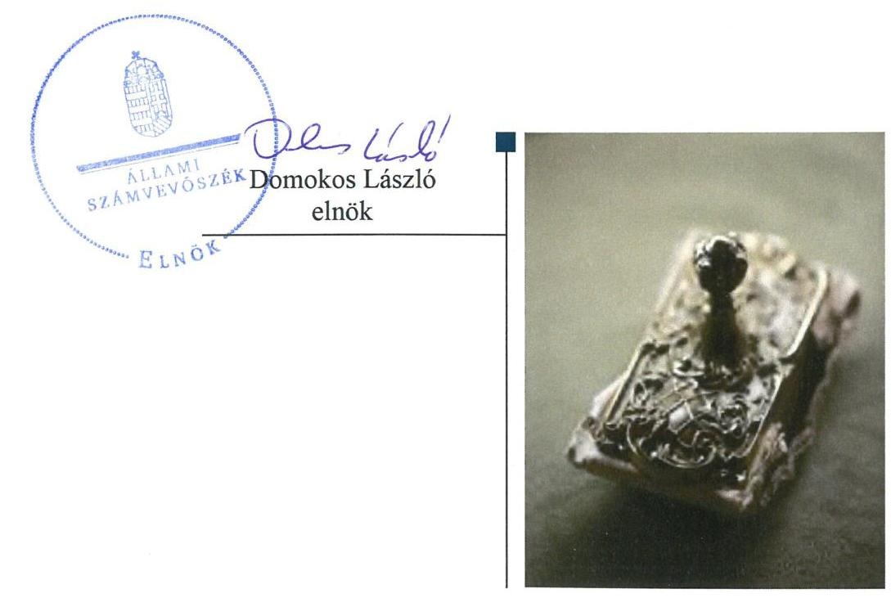
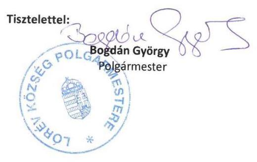
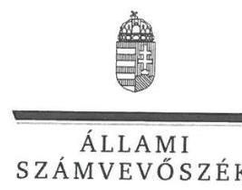
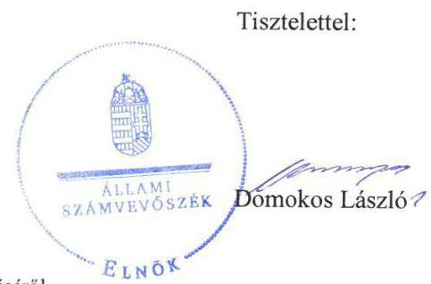
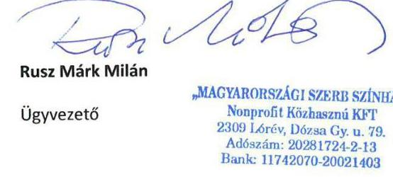
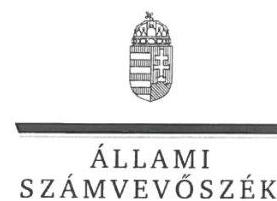
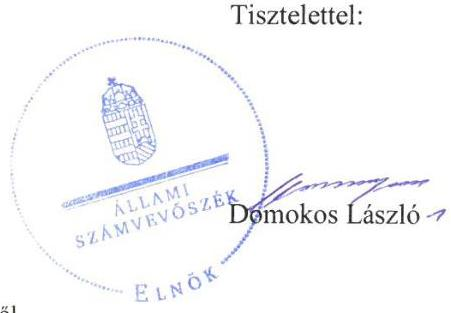
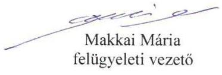

# Jelentés 

## Nemzeti tulajdonú gazdasági társaságok ellenőrzése

„Magyarországi Szerb Színház" Nonprofit Közhasznú Korlátolt Felelősségű Társaság 2019. 11. hó 21. nap

---

# AZ ELLENŐRZÉST FELÜGYELTE:

## MAKKAI MÁRIA felügyeleti vezető

## AZ ELLENŐRZÉST VEZETTE ÉS A VÉGREHAJTÁSÁÉRT FELELŐS:

### VALASTYÁNNÉ DR. VÍZHÁNYÓ JÚLIA ellenőrzésvezető

### ÁRPÁSI TIBOR ellenőrzésvezető

## A PROGRAM ÖSSZEÁLLÍTÁSÁÉRT FELELŐS:

### TÓTPÁL SZABOLCS osztályvezető

IKTATÓSZÁM: EL-2232-001/2019.

|  Jelentéseink az Országgyűlés számítógépes hálózatán és az Interneten a www.asz.hu címen is olvashatóak. | TÉMASZÁM: 2478  |
| --- | --- |
|   | ELLENŐRZÉS-AZONOSÍTÓ SZÁM: V082242  |

---

# TARTALOMJEGYZÉK 

■ ÖSSZEGZÉS ..... 5
■ AZ ELLENŐRZÉS CÉLJA ..... 6
■ AZ ELLENŐRZÉS TERÜLETE ..... 7
■ AZ ELLENŐRZÉS HÁTTERE, INDOKOLTSÁGA ..... 8
■ A JELENTÉS LÉNYEGES KÉRDÉSKÖREI ..... 9
■ AZ ELLENŐRZÉS HATÓKÖRE ÉS MÓDSZEREI ..... 10
■ MEGÁLLAPÍTÁSOK ..... 12
■ JAVASLATOK ..... 13
■ MELLÉKLETEK ..... 15
I. sz. melléklet: Fogalomtár ..... 15
■ FÜGGELÉKEK ..... 17
I. sz. függelék a jelentéshez ..... 17
II. sz. függelék: Észrevételek ..... 18
■ RÖVIDÍTÉSEK JEGYZÉKE ..... 29

---

.

---

# ÖSSZEGZÉS 

A „Magyarországi Szerb Színház" Nonprofit Közhasznú Korlátolt Felelősségű Társaság feletti tulajdonosi jogok gyakorlása nem volt szabályszerű. A Társaság vagyongazdálkodása nem volt szabályszerű, így a vagyonnal való felelős gazdálkodás nem érvényesült.

## Az ellenőrzés társadalmi indokoltsága

Az Állami Számvevőszék stratégiájában megfogalmazta, hogy az államháztartáson kívül működő feladatellátó rendszerek ellenőrzéseivel hozzájárul ahhoz, hogy a közpénzeket, illetve az ingyenesen juttatott közvagyont az államháztartáson kívül működő szervezetek is átlátható, rendezett módon használják fel.

Az állam és a helyi önkormányzatok tulajdona nemzeti vagyon. A nemzeti vagyon megőrzése, megóvása érdekében kiemelten fontos a nemzeti tulajdonú gazdasági társaságok ellenőrzése.

Az Állami Számvevőszék céljaival és a társadalmi igénnyel összhangban, a gazdasági társaságok kiemelt fontosságú szerepe miatt került sor a Lórév Község Önkormányzata többségi tulajdonában álló „Magyarországi Szerb Színház" Nonprofit Közhasznú Korlátolt Felelősségű Társaság vagyongazdálkodásának, illetve az Önkormányzat tulajdonosi joggyakorlásának ellenőrzésére.

## Főbb megállapítások, következtetések, javaslatok

A „Magyarországi Szerb Színház" Nonprofit Közhasznú Korlátolt Felelősségű Társaság feletti tulajdonosi joggyakorlás kereteinek kialakítása nem volt szabályszerű, a taggyűlés által megalkotott javadalmazási szabályzattal a jogszabályi előírás ellenére a Társaság nem rendelkezett. A Társaságban minősített többségű befolyással rendelkező Lórév Község Önkormányzata nem gyakorolta tulajdonosi jogkörét, a Társaság 2015-2017. évi számviteli beszámolóinak megtárgyalása és jóváhagyása érdekében.

A „Magyarországi Szerb Színház" Nonprofit Közhasznú Korlátolt Felelősségű Társaság vagyongazdálkodása nem volt szabályszerű, mert az ellenőrzött években eszközeiről és forrásairól leltárt nem állított össze, leltározási kötelezettségének nem tett eleget, a vagyon védelme nem volt biztosított.

Az Állami Számvevőszék a jelentésben foglalt megállapítások alapján Lórév Község Önkormányzata polgármesterének négy, a „Magyarországi Szerb Színház" Nonprofit Közhasznú Korlátolt Felelősségű Társaság ügyvezetőjének négy javaslatot fogalmazott meg.

---

# AZ ELLENŐRZÉS CÉLJA 

AZ ELLENŐRZÉS CÉLJA annak megállapítása volt, hogy a tulajdonosi joggyakorló a gazdasági társasága feletti tulajdonosi joggyakorlás kereteit kialakította-e, tulajdonosi jogait megfelelően gyakorolta-e és kötelezettségeit teljesítette-e. Továbbá annak megállapítása, hogy a gazdasági társaság biztosította-e a vagyon védelmét a nyilvántartások szabályszerű vezetése és a mérleg tételeinek leltárral történő alátámasztása útján, valamint szabályszerűen gondoskodott-e a társaság használatában lévő nemzeti vagyon értékének megőrzéséről, gyarapításáról, hasznosításáról.

---

# AZ ELLENŐRZÉS TERÜLETE 

## Lórév Község Önkormányzata és a „Magyarországi Szerb Színház" Nonprofit Közhasznú Korlátolt Felelősségű Társaság

Lórév Község Önkormányzata és Lórév Község Szerb Kisebbségi Önkormányzat 1999-ben 3000 E Ft jegyzett tőkével alapította a „Magyarországi Szerb Színház" Közhasznú Társaságot, aminek átalakulásából jött létre 2009-ben a „Magyarországi Szerb Színház" Nonprofit Közhasznú Korlátolt Felelősségű Társaság. A Társaság¹ jegyzett tőkéje, az Önkormányzat² - minősített többségű befolyást biztosító - 96,7%-os és a Szerb Kisebbségi Önkormányzat³ 3,3%-os tulajdoni részaránya az ellenőrzött időszakban nem változott.

Lórév község lakossága Magyarország 2017. évi közigazgatási helynévkönyve alapján 294 fő volt. Az Önkormányzat hivatali feladatait a Szigetbecsei Közös Önkormányzati Hivatal⁴ látta el. A Polgármester⁵ és a Jegyző⁶ személyében az ellenőrzött időszakban nem következett be változás. Az Önkormányzat a Társaságon kívül további három gazdasági társaságban rendelkezett tulajdoni részesedéssel.

Az Önkormányzat az Mötv.⁷ szerinti kulturális szolgáltatás közfeladatellátását részben a Társaság révén teljesítette. A Társaság előadó-művészeti tevékenysége magába foglalta a szerb nemzetiségi kultúra, nyelv és nemzetiségi előadó művészet folytatását, a magyarországi szerbség anyanyelvi színházi igényeinek fejlesztését, a magyarországi szerb írók színpadi művek írására való ösztönzését, műveinek bemutatását, a szerb kultúra propagálását, a szerb és magyar színházi kapcsolatok bővítését, fejlesztését. A közfeladat ellátására az Önkormányzat 2018. szeptember 18-án öt év határozott idejű Közszolgáltatási szerződést⁸ kötött Társasággal.

A Társaság nyilvántartása szerint 2015-ben 9911 E Ft, 2017-ben 9002 E Ft éves nettó árbevételt ért el, míg egyéb bevételei - elsősorban az elnyert pályázati támogatásoknak köszönhetően - 2015-ben 27397 E Ft-ot, 2017-ben 39734 E Ft-ot tettek ki.

A Társaság a feladatait saját eszközeivel látta el, vagyonkezelésbe vett eszköze nem volt. 2013-tól Budapesten is rendelkezett játszóhellyel.

A Társaság más gazdasági társaságban nem rendelkezett részesedéssel és nem tartozott a kormányzati szektorba sorolt egyéb szervezetek közé.

Az ellenőrzött időszakban a Társaság ügyeinek intézését és képviseletét Ügyvezető₁⁹ mellett 2015. október 12. és 2017. december 31. között Ügyvezető₂ is ellátta. A Társaság ügyvezetésének ellenőrzését végző három tagú felügyelőbizottság összetétele nem változott az ellenőrzött időszakban. A Társaság a Számv. tv.¹⁰ szerint nem volt könyvvizsgálatra kötelezett.

---

# AZ ELLENŐRZÉS HÁTTERE, INDOKOLTSÁGA 

Az Alaptörvény 38. cikke alapján az állam és a helyi önkormányzatok tulajdona nemzeti vagyon. A nemzeti vagyon megőrzése, megóvása érdekében kiemelten fontos ezen nemzeti tulajdonú gazdasági társaságok ellenőrzése. Gazdálkodásuk jellemzően a közérdeklődés és a média figyelmének középpontjában áll, amihez hozzájárul a gazdálkodásuk körébe tartozó - a nemzeti vagyon részét képező - vagyon nagysága, illetve az általuk ellátott közszolgáltatások minősége és hatékonysága.

Ellenőrzéseink feltárhatják, hogy a tulajdonosi felügyelet hozzájárult-e a szabályszerű gazdálkodáshoz és feladatellátáshoz. Az ellenőrzés eredményeként meghatározhatóvá válnak a gazdasági társaság vagyongazdálkodást érintő kockázatai, ezzel lehetővé téve a kockázatok csökkentését. A megállapítások alapján megfogalmazott számvevőszéki javaslatok hasznosítása elősegítheti a meglévő hibák megszüntetését. A jó gyakorlatok bemutatásával az ÁSZ¹¹ hozzájárulhat a követendő megoldások megismertetéséhez, terjesztéséhez.

---

# A JELENTÉS LÉNYEGES KÉRDÉSKÖREI 

1. A „Magyarországi Szerb Színház" Nonprofit Közhasznú Korlátolt Felelősségű Társaság feletti tulajdonosi joggyakorlás megfelelt-e az előírásoknak?
2. A „Magyarországi Szerb Színház" Nonprofit Közhasznú Korlátolt Felelősségű Társaság vagyongazdálkodása szabályszerű volt-e?

---

# AZ ELLENŐRZÉS HATÓKÖRE ÉS MÓDSZEREI 

## Az ellenőrzés típusa

Megfelelőségi ellenőrzés.

## Az ellenőrzött időszak

A tulajdonosi joggyakorlás tekintetében az ellenőrzött időszak a 2017. év az éves beszámolók elfogadása kivételével, amelynél az ellenőrzött időszak a 2015-2017. évek.

A társaság vagyongazdálkodási tevékenységét illetően az ellenőrzött időszak a 2015 - 2017. évek.

## Az ellenőrzés tárgya

A „Magyarországi Szerb Színház" Nonprofit Közhasznú Korlátolt Felelősségű Társaság feletti tulajdonosi joggyakorlás kialakítása és működtetése.

A „Magyarországi Szerb Színház" Nonprofit Közhasznú Korlátolt Felelősségű Társaság vagyongazdálkodási tevékenysége, a társaság használatában lévő nemzeti vagyon, illetve a saját vagyona tekintetében a vagyonnyilvántartások vezetése, leltára, a nemzeti vagyon értékének megőrzése, gyarapítása, hasznosítása.

## Az ellenőrzött szervezet

$\longrightarrow$ Lórév Község Önkormányzata
$\longrightarrow$ „Magyarországi Szerb Színház" Nonprofit Közhasznú Korlátolt Felelősségű Társaság

## Az ellenőrzés jogalapja

Az ellenőrzés jogszabályi alapját az ÁSZ tv.¹² 1. § (3) bekezdése és 5. § (3) - (5) bekezdései képezték.

## Az ellenőrzés módszerei

Az ellenőrzést az ellenőrzési program ellenőrzési kérdései, az ellenőrzött időszakban hatályos jogszabályok, az ellenőrzés szakmai szabályok és módszertanok alapján, a nemzetközi standardok figyelembe vételével végeztük.

---

Az ellenőrzés ideje alatt az ellenőrzött szervezettel történő kapcsolattartást az ÁSZ Szervezeti és Működési Szabályzatának vonatkozó előírásai alapján biztosítottuk.
2017. január 1-től az ellenőrzés megkezdésének napjáig - 2019. február 27-ig - ellenőriztük a tulajdonosi joggyakorlás kereteinek kialakítását, a tulajdonosi joggyakorló tevékenységét a felügyelő bizottság és a független könyvvizsgáló működéséhez kapcsolódóan, valamint azt, hogy a tulajdonosi joggyakorló - amennyiben a gazdasági társaság feladatellátásához kapcsolódóan határozott meg követelményeket, elvárásokat - a nemzeti vagyon értékének megőrzése érdekében monitorozta-e azok teljesülését. A 2015. január 1-től 2019. február 27-ig terjedő teljes ellenőrzött időszakra ellenőriztük a tulajdonosi joggyakorló részvételét az éves beszámoló elfogadására vonatkozó döntéshozatalban.

A gazdasági társaság vagyonhoz kapcsolódó nyilvántartásai vezetésének megfelelősége, valamint a nemzeti vagyon értéke megőrzésének, gyarapításának, hasznosításának szabályszerűsége 2015. és 2017. évek tekintetében került ellenőrzésre. A 2015-2017. éveket érintően történt meg a lényeges dokumentumok értékelése, kiemelten a mérleg tételeinek leltárral való alátámasztottsága.

Az ellenőrzési kérdések megválaszolásához szükséges bizonyítékok megszerzése a következő ellenőrzési eljárások alkalmazásával történt: megfigyelés, információkérés, összehasonlítás, lényeges sokaságból mintavétel, valamint elemző eljárás. Az ellenőrzési bizonyítékként felhasználható adatforrások közé tartoztak az ellenőrzési programban felsorolt adatforrások, továbbá minden - az ellenőrzés folyamán - feltárt, az ellenőrzés szempontjából információkat tartalmazó dokumentum. Az ellenőrzést a kérdésekre adott válaszok kiértékelésével, valamint a megjelölt adatforrások, a csatolt tanúsítványok felhasználásával, továbbá az adott időszakban hatályos jogszabályok figyelembe vételével folytattuk le.

A 2017. évi vagyonnyilvántartások és a leltár szabályszerűsége esetében az ellenőrzés azokra a legnagyobb értékű tételekre - a lényeges sokaságra - terjedt ki, melyek összértéke elérte a teljes sokaság összértékének 50%-át. A lényeges sokaságot tételesen ellenőriztük.

---

# MEGÁLLAPÍTÁSOK 

## 1. A „Magyarországi Szerb Színház" Nonprofit Közhasznú Korlátolt Felelősségű Társaság feletti tulajdonosi joggyakorlás megfelelt-e az előírásoknak?

Összegző megállapítás A Társaság feletti tulajdonosi joggyakorlás nem volt szabályszerű.

A taggyűlés nem alkotta meg a Taktv.¹³ 5. § (3) bekezdésében előírt, a vezető tisztségviselők, a felügyelőbizottsági tagok és az Mt.¹⁴ 208. §-ának hatálya alá eső munkavállalók javadalmazása, valamint a jogviszony megszűnése esetére biztosított juttatások módjának, mértékének elveiről, annak rendszeréről szóló szabályzatot.

A felügyelőbizottság¹⁵ működése az ellenőrzött időszakban nem volt szabályszerű, a felügyelőbizottság a Ptk.¹⁶ 3:122. § (3) bekezdésében és a Társasági szerződés¹⁷ 2.3.4. pontjában foglaltak ellenére nem rendelkezett ügyrenddel. A felügyelőbizottság a Ptk. 3:120. § (2) bekezdésében és a Társasági szerződés 2.3.5. pont 3. bekezdésében foglaltak ellenére nem készített írásbeli jelentést a Társaság 2015-2017. évekre összeállított egyszerűsített éves beszámolóiról és közhasznúsági mellékleteiről.

A Társaság a 2015-2017. évek tekintetében nem rendelkezett jóváhagyott számviteli beszámolókkal, mert egyszerűsített éves beszámolót és közhasznúsági mellékleteit a Ptk. 3:109. § (2) bekezdésében és a Társasági szerződés 2.1.1. a) pontjában foglaltak ellenére a taggyűlés¹⁸ nem tárgyalta meg és nem hagyta jóvá.

## 2. A „Magyarországi Szerb Színház" Nonprofit Közhasznú Korlátolt Felelősségű Társaság vagyongazdálkodása szabályszerű volt-e?

## Összegző megállapítás A Társaság vagyongazdálkodása a 2015-2017. években nem volt szabályszerű.

A Társaság vagyonnyilvántartása nem volt szabályszerű. A Társaság nem rendelkezett a Számv. tv. 14. § (5) bekezdés b) pontjában meghatározott eszközök és források értékelési szabályzatával, valamint a Számv. tv. 161. § (1) pontban foglalt
 kötelezettség ellenére számlarenddel.

A Társaság 2017-ben a Számv. tv. 52. § (2) bekezdésében foglaltakat megsértve a tárgyi eszközök üzembe helyezését nem dokumentálta.

A Társaság a Számv. tv. 69. § (1) bekezdésében foglaltak ellenére a mérleg fordulónapján meglévő eszközöket és forrásokat mennyiségben és értékben tartalmazó leltárt nem állított össze, a Számv. tv. 69. § (3)(4) bekezdéseiben előírt leltározási kötelezettségének nem tett eleget.

---

# JAVASLATOK 

Az ÁSZ tv. 33. § (1) bekezdésében foglaltak értelmében az ellenőrzött szervezet vezetője köteles a jelentésben foglalt megállapításokhoz kapcsolódó intézkedési tervet összeállítani és azt a jelentés kézhezvételétől számított 30 napon belül az ÁSZ részére megküldeni. Amennyiben az ellenőrzött szervezet vezetője nem küldi meg határidőben az intézkedési tervet, vagy továbbra sem elfogadható intézkedési tervet küld, az Állami Számvevőszék elnöke az ÁSZ tv. 33. § (3) bekezdése a) és b) pontjaiban foglaltakat érvényesítheti.

## Lórév Község polgármesterének

1. Kezdeményezze a Társaság legfőbb szervénél a vezető tisztségviselők, felügyelőbizottsági tagok, valamint az Mt. 208. §-ának hatálya alá eső munkavállalók javadalmazása, valamint a jogviszony megszünése esetére biztosított juttatások módjának, mértékének elveire, annak rendszerére vonatkozó szabályzat megalkotását
(1. sz. megállapítás 1. bekezdése alapján)
2. Kezdeményezze a Társaság felügyelő bizottságánál az ügyrend elkészítését és a Társaság legfőbb szerve általi jóváhagyását.
(1. sz. megállapítás 2. bekezdés első mondata alapján)
3. Kezdeményezze a felügyelőbizottságnál, hogy a Társaság éves beszámolójáról készítsen írásbeli jelentést a Ptk.-ban előírtaknak megfelelően.
(1. sz. megállapítás 2. bekezdés második mondata alapján)
4. Kezdeményezze, hogy a Társaság legfőbb szerve a jogszabályban előírtak szerint döntsön az éves számviteli beszámoló jóváhagyásáról.
(1. sz. megállapítás 3. bekezdése alapján)

## a „Magyarországi Szerb Színház" Nonprofit Közhasznú Korlátolt Felelősségű Társaság ügyvezetőjének

1. Intézkedjen a Számv. tv. előírásainak megfelelő eszközök és források értékelési szabályzata, valamint a számlarend elkészítéséről
(2. sz. megállapítás 1. bekezdés 2. mondata alapján)

---

2. Intézkedjen a tárgyi eszközök üzembe helyezésének Számv. tv. előírásának megfelelő dokumentálásáról.
(2. sz. megállapítás 2. bekezdése alapján)
3. Intézkedjen a mérleg fordulónapján meglévő eszközeit és forrásait tartalmazó leltár jogszabályi előírásnak megfelelő összeállításáról.
(2. sz. megállapítás 3. bekezdés első mondatrésze alapján)
4. Intézkedjen a Számv. tv. előírásának megfelelően a leltározás végrehajtásáról.
(2. sz. megállapítás 3. bekezdés második mondatrésze alapján)

---

# MELLÉKLETEK 

- I. SZ. MELLÉKLET: FOGALOMTÁR
gazdasági társaság
kormányzati szektorba sorolt egyéb szervezet
közszolgáltatás
közfeladat
nemzeti vagyon
nonprofit gazdasági társaság
tulajdonosi jogok gyakorlója
vagyonkezelői jog

A gazdasági társaságok üzletszerű közös gazdasági tevékenység folytatására, a tagok vagyoni hozzájárulásával létrehozott, jogi személyiséggel rendelkező vállalkozások, amelyekben a tagok a nyereségből közösen részesednek, és a veszteséget közösen viselik. (Forrás: Ptk. 3:88. § (1) bekezdése)
Az a szervezet, amely az Áht. alapján nem része az államháztartásnak, azonban az Európai Közösséget létrehozó szerződéshez csatolt, a túlzott hiány esetén követendő eljárásról szóló jegyzőkönyv alkalmazásáról szóló 2009. május 25-i 479/2009/EK rendelet $^{19}$ szerint a kormányzati szektorba tartozik.
Az Ebktv. $^{20}$ 3. § d) pontja a következőképpen határozza meg a közszolgáltatást: „szerződéskötési kötelezettség alapján a lakosság alapvető szükségleteinek ellátására irányuló szolgáltatás, így különösen a villamos energia-, gáz-, hő-, víz-, szenny-víz- és hulladékkezelési, köztisztasági, postai és távközlési szolgáltatás, továbbá a menetrend alapján közlekedő járművekkel végzett közforgalmú személyszállítás".
Az Áht. $^{21}$ 3/A. § (1) bekezdése alapján közfeladat a jogszabályban meghatározott állami vagy önkormányzati feladat.
Nvtv. $^{22}$ 1. § (2) bekezdése szerint nemzeti vagyonba tartozik többek között:
„az állam vagy a helyi önkormányzat kizárólagos tulajdonában álló dolgok,
az a) pont hatálya alá nem tartozó, állam vagy a helyi önkormányzat tulajdonában lévő dolog,
az állam vagy a helyi önkormányzat tulajdonában lévő pénzügyi eszközök, továbbá az államot vagy a helyi önkormányzatot megillető társasági részesedések,
az államot vagy a helyi önkormányzatot megillető bármely vagyoni értékkel rendelkező jogosultság, amelyet jogszabály vagyoni értékű jogként nevesít."
Az a gazdasági társaság minősül nonprofit gazdasági társaságnak és cégnevében az a gazdasági társaság tüntetheti fel a nonprofit jelleget, amelynek létesítő okirata tartalmazza, hogy a gazdasági társaság tevékenységéből származó nyereség a tagok között nem osztható fel, hanem az a gazdasági társaság vagyonát gyarapítja
Aki a nemzeti vagyon felett az államot vagy a helyi önkormányzatot megillető tulajdonosi jogok és kötelezettségek összességének gyakorlására jogosult. (Forrás: Nvtv. 3. § (1) bekezdés 17. pontja)
A vagyonkezelő köteles a vagyontárgy állagának megóvásáról, jó karbantartásáról, működtetéséről gondoskodni, jogszabályban és szerződésben előírt más kötelezettségét teljesíteni, valamint a vagyontárgyat jogszabályban vagy szerződésben meghatározott célnak megfelelően használni. A vagyonkezelő - a központi költségvetési szervek és a kizárólag közfeladatot ellátó nem központi költségvetési szerv vagyonkezelők kivételével - köteles díjat fizetni, jogszabályban és szerződésben előírt más kötelezettségét teljesíteni, valamint a vagyontárgyat jogszabályban vagy szerződésben meghatározott célnak megfelelően használni. Amennyiben a vagyonkezelő ezen kötelezettségeinek nem tesz eleget, a tulajdonosi joggyakorló jogosult a szerződést azonnali hatállyal felmondani. (Forrás: Vtv. 27. § (2), (2a) bekezdések)

---

.

---

# FÜGGELÉKEK 

- I. SZ. FÜGGELÉK A JELENTÉSHEZ

Az Állami Számvevőszék az ellenőrzések során feltárt tényekhez kapcsolódó további körülmények tisztázására eszközrendszerrel nem rendelkezik. Amennyiben az ellenőrzésen túlmutatóan indokoltnak látszik az ellenőrzés során feltárt körülmények további vizsgálata, az Állami Számvevőszék törvényi felhatalmazás alapján az ellenőrzés által feltárt körülményeket továbbítja a hatáskörrel rendelkező szervnek a szükséges intézkedések megtétele, eljárások lefolytatása érdekében.

1. A „Magyarországi Szerb Színház" Nonprofit Közhasznú Korlátolt Felelősségű Társaság a 2015., 2016., 2017. években nem állított össze leltárt. A Társaság ezzel a 2015-2017. évekre vonatkozóan megsértette a Számv. tv. 69. § (1) bekezdésében előírtakat.
2. A Társaság 2015., 2016., 2017. évi egyszerűsített beszámolóit a Ptk. 3:109. § (2) bekezdésében foglaltak ellenére a taggyülés nem hagyta jóvá, azok letétbe helyezése és közzététele nem felelt meg a Számv. tv. 153. § (1) és a 154. § (1) bekezdése előírásainak.
3. A Társaság 2017-ben a Számv. tv. 52. § (2) bekezdésében foglalt előírást megsértve a tárgyi eszközök üzembe helyezését nem dokumentálta.
4. A Társaság 2015-2017. években nem rendelkezett a Számv. tv. 14. § (5) bekezdés b) pontjában meghatározott eszközök és források értékelési szabályzatával, valamint a Számv. tv. 161. § (1) pontban foglalt kötelezettség ellenére számlarenddel.
A feltárt szabálytalanságok a közvagyonnal való gazdálkodás terén elvárt elemi szabályok megsértését vetik fel. A beszámolás megbízhatóságának kétsége, a beszámoló jóváhagyásának hiánya, a belső szabályzatok hiánya és azok esetleges összefüggései a konkrét körülmények tisztázását indokolják. Ezek feltárására az ügyészség rendelkezik hatáskörrel.

---

A jelentéstervezetet a Számvevőszék 15 napos észrevételezésre megküldte az ellenőrzött szervezetek vezetőinek az ÁSZ tv. 29. § (1) bekezdése előírásának megfelelően.

Az ÁSZ a jelentéstervezetet észrevételezésre megküldte Lórév Község Önkormányzata polgármesterének és a „Magyarországi Szerb Színház" Nonprofit Közhasznú Korlátolt Felelősségű Társaság ügyvezetőjének.
Lórév Község Önkormányzata polgármesterének és a „Magyarországi Szerb Színház" Nonprofit Közhasznú Korlátolt Felelősségű Társaság ügyvezetőjének észrevételeit és az azokra adott választ a függelék alább tartalmazza.

[^0]
[^0]:    * 29. § (1) Az Állami Számvevőszék az ellenőrzési megállapításait megküldi az ellenőrzött szervezet vezetőjének vagy az általa megbízott személynek, és annak, akinek személyes felelősségét állapította meg.
    (2) Az ellenőrzött szervezet vezetője és a felelősként megjelölt személy az ellenőrzés megállapításaira tizenöt napon belül írásban észrevételt tehet.
    (3) Az Állami Számvevőszék az észrevételre a beérkezésétől számított harminc napon belül írásban válaszol. A figyelembe nem vett észrevételeket köteles a jelentésben feltüntetni, és megindokolni, hogy azokat miért nem fogadta el.

---

# LÓRÉV KÖZSÉG ÖNKORMÁNYZATA 

2309 Lórév, Dundity Alexa u. 43.
Telefon / Fax szám: 06-24-482-544
E-mail: info@lorev.hu
Szám: III/68-6/2019.
Hiv.szám: EL-0926-075/2019

## ÁLLAMI SZÁMVEVŐSZÉK

$3 E-61542101911$
Érkezett: 2019. OKT. 08.
Iktatószám: E1-0926-075/2019
Mellékletek:
Tárgy: Észrevétel, tájékoztatás a
Számvevőszék jelentéstervezetére

## Állami Számvevőszék   Budapest 4

Pf: 54. 1364

## Domokos László

Elnök
részére

## Tisztelt Domokos László Elnök Úr!

A Lórév Község Önkormányzat részére megküldött Számvevőszéki jelentéstervezetet 2019.09.19-én megkaptuk, és a törvényi előírásoknak megfelelően a tett megállapításokra 15 napon belül észrevételt teszünk.

Jelentéstervezet lényeges megállapításai - röviden- az Önkormányzat, mint a többségi tulajdonos vonatkozásában és azokra való észrevételünk, kérésünk:

1. A „Magyarországi Szerb Színház" Nonprofit Közhasznú Korlátolt Felelősségű Társaság feletti tulajdonosi joggyakorlás megfelel-e az előírásoknak?
a.) A taggyülés nem alkotta meg a tisztségviselők és a felügyelő bizottsági tagok javadalmazása, jogviszony megszűnésére biztosított juttatások módjának, mértékének elveiről, annak rendszeréről szóló szabályzatot.

Észrevétel, tájékoztatás, kérés az a.) pontban leírt megállapításra:
A megállapításuk jogos, ezen szabályzatot az intézkedési terv keretén belül el fogjuk készíteni, de ahogy Önök is látták az ellenőrzés során, a felügyelő bizottsági tagok részére juttatás kifizetésére nem került sor, és az ügyvezető sem vett fel munkabért minden évben.

---

Kérem a Tisztelt Ellenőrző szervet, tegye lehetővé ezen szabályzat pótlólagos bemutatását.
b.) A felügyelő bizottság működése nem volt szabályszerű, nem rendelkezett ügyrenddel, nem készített írásbeli tájékoztatást a Társaság 2015-2017. évekre összeállított egyszerűsített éves beszámolóiról és közhasznú mellékletéről

Észrevétel, tájékoztatás, kérés a b.) pontban leírt megállapításra:
A Társaság a felügyelő bizottság 2015-2017. évekre összeállított egyszerűsített éves beszámolóiról és közhasznú melléklet elfogadásáról szóló bizottsági ülésekről szóló jegyzőkönyveket elektronikus úton feltöltöttük az Önök részére, a másodszorra megnyitott felületre. Az elektronikus felület feltöltésekor - többszöri hibajelzések miatt - került sor az ismételt megnyitásra.

Az ügyrendet nem csatoltuk be, mivel ezen kérést nem jól értelmeztük. Természetesen a Felügyelő bizottság rendelkezik ügyrenddel.

Kérem a Tisztelt Ellenőrző szervet, hogy az ellenőrzési jelentés megírásánál vegye figyelemmel, hogy a Társaság és az Önkormányzat is rendelkezik a Felügyelő bizottsági ülések jegyzőkönyveivel, melyekben részükről elfogadásra kerültek a beszámolók és a közhasznú jelentések, azokat elektronikusan is feltöltöttük, mely igazolást jelen levelünkkel mellékeljük. A Felügyelő bizottság ügyrendjét az intézkedési terv keretén belül szintén el fogjuk Önöknek küldeni, vagy amennyiben lehetőséget adnak, még most a jelentésük megírása előtt is elküldjük.
c.) A Társaság 2015-2017. évek tekintetében nem rendelkezett jóváhagyott számviteli beszámolókkal, azokat a taggyülés nem tárgyalta meg

Észrevétel, tájékoztatás, kérés a c.) pontban leírt megállapításra:
Az Önkormányzat képviselő-testülete, mint a többségi tulajdonos a Kft. beszámolójának elfogadására feljogosító szervezet, nem a törvény által előírt határidőben, hanem azt követően - az ellenőrzések időszakában - fogadta el a 2016, 2017. évi beszámolókat, melyből a 2017. évi beszámoló elfogadásának képviselő-testületi határozatát elektronikusan feltöltöttük. A 2015, 2016., 2017. évi mérlegbeszámolót pótlólag 2019. szeptember 11-én elfogadtuk, melynek határozat-kivonatát mellékletként csatoljuk.

Kérjük, hogy a beszámolók, közhasznú jelentések utólagos elfogadását elfogadni szíveskedjenek.

Mellékeltek:

- Igazolás az elektronikus átvételről
- 2015, 2016, 2017. évi mérlegbeszámoló elfogadás kivonata

Lórév, 2019. október 3.

---

ELNÖK

Ikt.szám: EL-0926-081/2019.

# Bogdán György úr 

polgármester

## Lórév Község Önkormányzata

## Lórév

## Tisztelt Polgármester Úr!

A „Nemzeti tulajdonú gazdasági társaságok ellenőrzése - „Magyarországi Szerb Színház" Nonprofit Közhasznú Korlátolt Felelősségű Társaság" címmel készített számvevőszéki jelentéstervezetre tett észrevételét köszönettel megkaptam.

Az Állami Számvevőszék észrevételre vonatkozó álláspontjáról a felügyeleti vezető által készített részletes tájékoztatást mellékelten megküldöm.

Tájékoztatom Polgármester urat, hogy a számvevőszéki jelentésben - az Állami Számvevőszékről szóló 2011. évi LXVI. törvény 29. § (3) bekezdése alapján - a figyelembe nem vett észrevételt szerepeltetjük, annak indoklásával, hogy azt a

 Állami Számvevőszék miért nem fogadta el.

Budapest, 2019. november 4. nap

Melléklet: Tájékoztatás az észrevétel kezeléséről

---

# Tájékoztatás   az észrevétel kezeléséről 

A „Nemzeti tulajdonú gazdasági társaságok ellenőrzése - „Magyarországi Szerb Színház" Nonprofit Közhasznú Korlátolt Felelősségű Társaság" címü jelentéstervezetre 2019. október 8-án érkezett észrevételét áttekintettük, annak kezelésével kapcsolatban a következő tájékoztatást adom.

## 1. A jelentéstervezet 1. számú megállapításával kapcsolatban tett észrevételekre adott válasz

a) Az észrevétel megerősíti az Állami Számvevőszék megállapítását, mely szerint a taggyűlés nem alkotta meg a vezető tisztségviselők, a felügyelőbizottsági tagok javadalmazása, valamint a jogviszony megszűnése esetére biztosított juttatások módjának, mértékének elveiről, annak rendszeréről szóló szabályzatot. Az észrevétel tájékoztat arról, hogy a szabályzatot az intézkedési terv keretén belül el fogják készíteni. Fentiek alapján a jelentéstervezet módosítása nem indokolt.
b) A társaság felügyelőbizottságának ügyrendjével kapcsolatban tett észrevétel rögzíti, hogy az ügyrendet nem bocsátották az ellenőrzés rendelkezésére.
Tájékoztatom Polgármester urat, hogy az Állami Számvevőszék ellenőrzési megállapításai az Állami Számvevőszékről szóló 2011. évi LXVI. törvénynek (továbbiakban: ÁSZ tv.) megfelelően minden esetben az ellenőrzés során bekért és az arra nyitva álló határidőn belül rendelkezésre bocsátott dokumentumokon alapulnak. Az adatszolgáltatással összefüggésben Polgármester úr „Teljességi és hitelességi nyilatkozat"-ban rögzítette, hogy az önkormányzat adatszolgáltatása a bekért adatokra vonatkozóan megbízható, teljes körű információt tartalmaznak.
A felügyelőbizottságnak a társaság 2015-2017. évekre összeállított egyszerűsített éves beszámolóiról és közhasznúsági mellékleteiről készített írásbeli tájékoztatáshoz kapcsolódóan tett észrevétel rögzíti, hogy az önkormányzat rendelkezett a felügyelőbizottsági ülések jegyzőkönyveivel, melyekben részükről elfogadásra kerültek a beszámolók és a közhasznúsági jelentések.
Felhívom Polgármester úr figyelmét, hogy az észrevételben hivatkozott és a társaság által feltöltött felügyelőbizottsági jegyzőkönyvek nem igazolják, hogy az önkormányzat, valamint taggyűlés, mint a Társaság legfőbb szerve, rendelkezett a Társaság 2015-2017. évekre összeállított egyszerűsített éves beszámolóiról és közhasznúsági mellékleteiről, a felügyelőbizottság által összeállított írásbeli jelentéssel. Fentiek alapján az észrevételt nem fogadjuk el, a jelentéstervezet módosítása nem indokolt.
c) Az észrevétel szerint az Önkormányzat képviselő-testülete, mint többségi tulajdonos a Kft. beszámolójának elfogadására feljogosító szervezet, nem a törvény által előírt határidőben, hanem azt követően fogadta el a 2016, 2017. évi beszámolókat.

---

Az észrevétel nem cáfolja ÁSZ megállapítását, a megállapítás és a jelentéstervezet módosítása nem indokolt.

Tájékoztatom Polgármester urat, hogy a rendelkezésre álló dokumentumok, illetve a Polgári Törvénykönyvről szóló 2013. évi V. törvény 3:188. § (1) bekezdése szerint a Társaság legfőbb szerve a taggyűlés, nem a többségi tulajdonos Lórév Község Önkormányzat képviselő-testülete.
Az Állami Számvevőszék az ÁSZ tv. 28. § (2) bekezdésében meghatározott határidőn túl megküldött, az észrevételhez csatolt dokumentumokat nem fogadja el.

Budapest, 2019. november 4. nap

Makkai Mária
felügyeleti vezető

---

# „Magyarországi Szerb Színház" 

Nonprofit Közhasznú Korlátolt Felelősségű Társaság

## Lórév

Állami Számvevőszék

## Budapest 4

Pf: 54.1364
Domokos László
Elnök
részére

Tárgy: Észrevétel, tájékoztatás a Számvevőszéki jelentéstervezetére
Iktatószámuk: EL-0926-075/2019

Tisztelt Domokos László Elnök Úr!

A „Magyarországi Szerb Színház" Nonprofit Közhasznú Kft. részére megküldött Számvevőszéki jelentéstervezetet 2019.09.19-én megkaptuk, és a törvényi előírásoknak megfelelően a tett megállapításokra 15 napon belül észrevételt teszünk.

Jelentéstervezet lényeges megállapításai a Társaság vonatkozásában és azokra észrevételünk, kérésünk:

1. A „Magyarországi Szerb Színház" Nonprofit Közhasznú Korlátolt Felelősségű Társaság vagyongazdálkodása szabályszerű volt-e?
a.) A társaság vagyonnyilvántartása nem volt szabályszerű. A Társaság nem rendelkezett az eszközök és források értékelési szabályzatával valamint a számlarenddel.

Észrevétel, tájékoztatás, kérés az a.) pontban leírt megállapításokra
A könyvelő, aki könyveli a Kft. gazdasági eseményeit elkészítette a Társaság könyvelésére, vagyongazdálkodására vonatkozó szabályzatokat. Ez alapján végzi munkáját, de a felsorolt szabályzatok - a kérésük téves értelmezése miatt - nem tette fel az elektronikus felületre, én ezt nem vettem észre, így sajnálatos módon ez lemaradt.

Kérem, hogy tegyék lehetővé ezen a Kft.-re vonatkozó meglévő érvényes szabályzatok utólagos becsatolását.

---

# b.) A társaság 2017-ben a tárgyi eszköz üzembe helyezését nem dokumentálta 

Észrevétel, tájékoztatás, kérés az b.) pontban leírt megállapításra
A társaság becsatolta a kért eszköz beszerzésekről az Eszköznyilvántartó kartont, melyet a cég képviseletében az ügyvezető aláírásával hitelesített. A karton minden szükséges számviteli információt tartalmaz: - de nem helyettesíti az üzembe helyezést -

- Értékcsökkenés mértékét, a maradványértéket a számviteli politikával egyezően
- Az eszköz megnevezését, a beszerzés és aktiválás dátumát
- A leltáris számot, a szállító nevét
- Az évek során évente és göngyölítve látható az eszköz bruttó és nettó értéke illetve az elszámolt értékcsökkenés

A társaság - a következő hónapokban - az intézkedési terv keretén belül pótlólag el fogja készíteni a beszerzett eszközök üzembe helyezéseit, ehhez a nyomtatványokat elő is készítettük már.
c.) A Társaság a mérleg fordulónapján meglévő eszközöket, forrásokat mennyiségben és értékben tartalmazó leltárt nem állított össze, a leltári kötelezettségeinek nem tett eleget.

Észrevétel, tájékoztatás, kérés a c.) pontban leírt megállapításra
A társaság az eszközök - források alátámasztását dokumentáló „részleges" leltárt becsatolt.
Becsatolásra került a főkönyvvel egyező:

- tárgyi eszköz analitika, melynek meglétét a leltározó munkatárs is aláírt,
- szállítók, vevők tételes analitikája - mely a valós tartozásokat, követeléseket tartalmazta
- bankszámla tárgyévi záró illetve következő évi nyitó kivonata
- a pénztár záró egyenlegét alátámasztó jegyzőkönyv stb...

A társaság - a következő hónapokban - az intézkedési terv keretén belül pótlólag el fogja készíteni a hiányzó leltárakat, a meglévők esetleges hiányosságait ki fogja javítani, hogy az elkészült leltárt a számviteli törvény előírásainak 69§(1) bekezdésben foglaltaknak megfeleljen.

Budapest, 2019.10.02

Tisztelettel:

---

# Rusz Márk Milán úr 

ügyvezető
„Magyarországi Szerb Színház"
Nonprofit Közhasznú Korlátolt Felelősségű Társaság

## Lórév

## Tisztelt Ügyvezető Úr!

A „Nemzeti tulajdonú gazdasági társaságok ellenőrzése - „Magyarországi Szerb Színház" Nonprofit Közhasznú Korlátolt Felelősségű Társaság" címmel készített számvevőszéki jelentéstervezetre tett észrevételét köszönettel megkaptam.

Az Állami Számvevőszék észrevételre vonatkozó álláspontjáról a felügyeleti vezető által készített részletes tájékoztatást mellékelten megküldöm.

Tájékoztatom Ügyvezető urat, hogy a számvevőszéki jelentésben - az Állami Számvevőszékről szóló 2011. évi LXVI. törvény 29. § (3) bekezdése alapján - a figyelembe nem vett észrevételt szerepeltetjük, annak indoklásával, hogy azt az Állami Számvevőszék miért nem fogadta el.

Budapest, 2019. november 4. nap

Melléklet: Tájékoztatás az észrevétel kezeléséről

---

# Tájékoztatás   az észrevétel kezeléséről 

A „Nemzeti tulajdonú gazdasági társaságok ellenőrzése - „Magyarországi Szerb Színház" Nonprofit Közhasznú Korlátolt Felelősségű Társaság" címü jelentéstervezetre 2019. október 8-án érkezett észrevételét áttekintettük, annak kezelésével kapcsolatban a következő tájékoztatást adom.

1. A jelentéstervezet 2. számú megállapításával kapcsolatban tett észrevételre adott válasz
a) Az eszközök és források értékelési szabályzatával, valamint a számlarenddel kapcsolatban tett észrevételben tájékoztatást adnak arról, hogy a Társaság könyvelésére, vagyongazdálkodására vonatkozó szabályzatokat a Társaság könyvelője elkészítette, azonban a szabályzatok megküldése elmaradt.
Tájékoztatom Ügyvezető urat, hogy az Állami Számvevőszék ellenőrzési megállapításai az Állami Számvevőszékről szóló 2011. évi LXVI. törvénynek (továbbiakban: ÁSZ törvény) megfelelően minden esetben az ellenőrzés során bekért és az arra nyitva álló határidőn belül rendelkezésre bocsátott dokumentumokon alapulnak. Az észrevételben foglaltak, valamint a fentiek alapján a jelentéstervezet módosítása nem indokolt.
b) A tárgyi eszközök üzembe helyezésére tett megállapításra írt észrevétel rögzíti, hogy az eszközök üzembe helyezésének dokumentálását az ellenőrzés rendelkezésére bocsátott Eszköznyilvántartó kartonok nem helyettesítik. Az észrevétel megerősíti az ÁSZ megállapítását, a jelentéstervezet módosítása nem indokolt.
c) A Társaságnak a mérleg fordulónapján meglévő eszközeit és forrásait mennyiségben és értékben tartalmazó leltár összeállítására tett észrevétel nem cáfolja az ÁSZ megállapítását. Rögzíti, hogy a társaság az eszközök és források alátámasztását dokumentáló részleges leltárt készített és bocsátott az ellenőrzés rendelkezésére.

Budapest, 2019. november 8. nap

---

.

---

# RÖVIDÍTÉSEK JEGYZÉKE 

${ }^{1}$ Társaság
${ }^{2}$ Önkormányzat
${ }^{3}$ Szerb Kisebbségi Önkormányzat
${ }^{4}$ Hivatal
${ }^{5}$ polgármester
${ }^{6}$ jegyző
${ }^{7}$ Mótv.
${ }^{8}$ Közszolgáltatási szerződés
${ }^{9}$ ügyvezető ${ }_{1,2}$
${ }^{10}$ Számv. tv.
${ }^{11}$ ÁSZ
${ }^{12}$ ÁSZ tv.
${ }^{13}$ Taktv.
${ }^{14} \mathrm{Mt}$.
${ }^{15}$ felügyelőbizottság
${ }^{16}$ Ptk.
${ }^{17}$ Társasági szerződés
${ }^{18}$ taggyűlés
${ }^{19}$ 479/2009/EK rendelet
${ }^{20}$ Ebktv.
${ }^{21}$ Áht.
${ }^{22}$ Nvtv.
„Magyarországi Szerb Színház" Nonprofit Közhasznú Korlátolt Felelősségű Társaság
Lórév Község Önkormányzata
Lórév Község Szerb Kisebbségi Önkormányzat
Szigetbecsei Közös Önkormányzati Hivatal
Lórév Község Önkormányzata polgármestere
Szigetbecsei Közös Önkormányzati Hivatal jegyzője
Magyarország helyi önkormányzatairól szóló 2011. évi CLXXXIX. törvény (hatályos: 2011. december 28-tól)
az Önkormányzat és a Társaság között 2018. szeptember 18. napján létrejött közszolgáltatási szerződés
a Társaság ügyvezetője
ügyvezető: 2009. január 1-től
ügyvezető: 2015. október 12-2017. december 31.
2000. évi. C. törvény a számvitelről (hatályos: 2001. január 1-től)

Állami Számvevőszék
2011. évi LXVI. törvény az Állami Számvevőszékről (hatályos: 2011. július 1-től)
2009. évi CXXII. törvény a köztulajdonban álló gazdasági társaságok takarékosabb működéséről (hatályos: 2009. december 4-től)
2012. évi I. törvény a munka törvénykönyvéről (hatályos: 2012. július 1-től)
a Társaság felügyelőbizottsága
2013. évi V. törvény a Polgári Törvénykönyvről (hatályos: 2014. március 15-től)
a „Magyarországi Szerb Színház" Nonprofit Közhasznú Korlátolt Felelősségű Társaság Társasági Szerződése a 2015. október 12-i módosításokkal egységes szerkezetben (hatályos: 2015. október 12-től 2017. december 28-ig)
a Társaság legfőbb szerve
a Tanács 479/2009/EK rendelete az Európai Közösséget létrehozó szerződéshez csatolt, a túlzott hiány esetén követendő eljárásról szóló jegyzőkönyv alkalmazásáról
2003. évi CXXV. törvény az egyenlő bánásmódról és az esélyegyenlőség előmozdításáról (hatályos: 2004. január 27-től)
2011. évi CXCV. törvény az államháztartásról (hatályos: 2011. december 31-től)
2011. évi CXCVI. törvény a nemzeti vagyonról (hatályos: 2011. december 31-től)

---

# ÁLLAMI SZÁMVEVŐSZÉK 

1052 Budapest, Apáczai Csere János utca 10.
Levélcím: 1364 Budapest 4. Pf. 54
Telefon: +36 14849100 Telefax: +36 14849200
www.asz.hu
