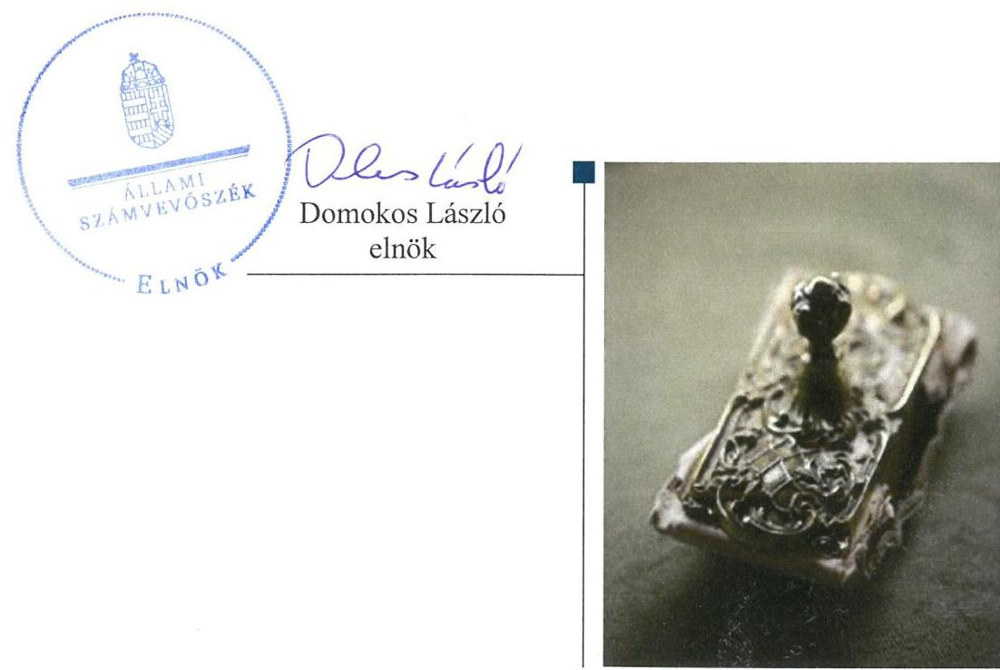
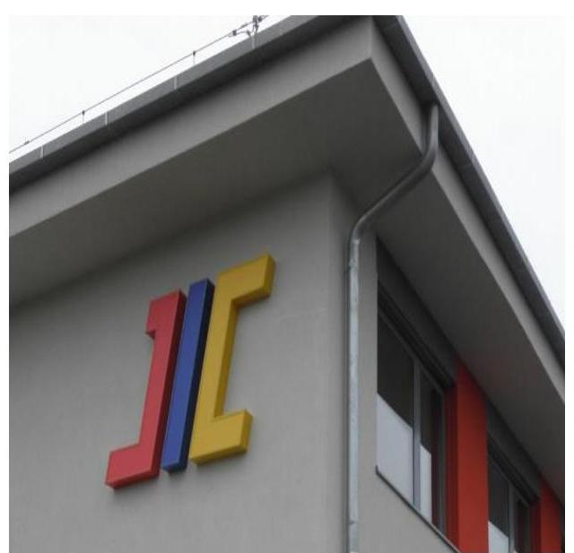
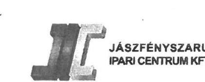
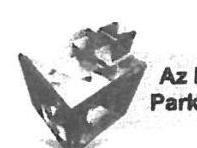
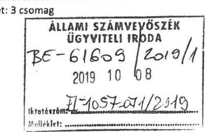
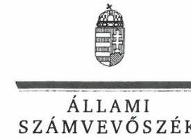
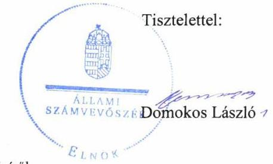
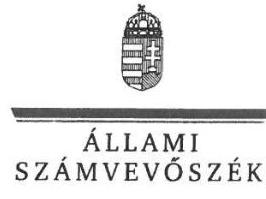
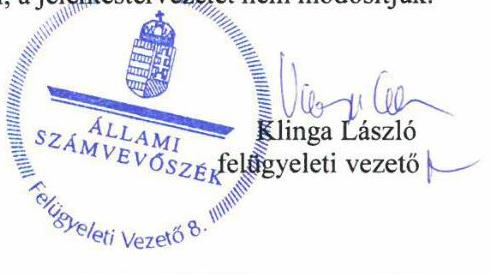

# Jellentés 

## Nemzeti tulajdonú gazdasági társaságok ellenőrzése

JÁSZFÉNYSZARU IPARI CENTRUM Korlátolt Felelősségű Társaság 2019.

19219
www.asz.hu

---

# Jelențtés 

## Nemzeti tulajdonú gazdasági társaságok ellenőrzése

JÁSZFÉNYSZARU IPARI CENTRUM Korlátolt Felelősségű Társaság 2019. 11. hó 20. nap

---

# AZ ELLENŐRZÉST FELÜGYELTE:

- **KLINGA LÁSZLÓ** felügyeleti vezető
- **AZ ELLENŐRZÉST VEZETTE ÉS A VÉGREHAJTÁSÁÉRT FELELŐS:**
  - **DR. PELLEI TAMÁS** ellenőrzésvezető
  - **A PROGRAM ÖSSZEÁLLÍTÁSÁÉRT FELELŐS:**
    - **TÓTPÁL SZABOLCS** osztályvezető

**IKTATÓSZÁM:** EL-2174-001/2019.

**TÉMASZÁM:** 2478

**ELLENŐRZÉS-AZONOSÍTÓ SZÁM:** V082278

Jelentéseink az Országgyűlés számítógépes hálózatán és az Interneta a www.asz.hu címen is olvashatóak.

---

# TARTALOMJEGYZÉK 

■ ÖSSZEGZÉS ..... 5
■ AZ ELLENŐRZÉS CÉLJA ..... 6
■ AZ ELLENŐRZÉS TERÜLETE ..... 7
■ AZ ELLENŐRZÉS HÁTTERE, INDOKOLTSÁGA ..... 8
■ A JELENTÉS LÉNYEGES KÉRDÉSKÖREI ..... 9
■ AZ ELLENŐRZÉS HATÓKÖRE ÉS MÓDSZEREI ..... 10
■ MEGÁLLAPÍTÁSOK ..... 12
■ JAVASLATOK ..... 14
■ MELLÉKLETEK ..... 15
I. sz. melléklet: Értelmező szótár ..... 15
■ FÜGGELÉK: ÉSZREVÉTELEK ..... 17
■ RÖVIDÍTÉSEK JEGYZÉKE ..... 25

---

.

---

# ÖSSZEGZÉS 

A JÁSZFÉNYSZARU IPARI CENTRUM Korlátolt Felelősségű Társaság vagyongazdálkodása nem volt szabályszerű, így az átláthatóságot és az elszámoltathatóságot nem biztosította.

## Az ellenőrzés társadalmi indokoltsága

Az Állami Számvevőszék kiemelt célja, hogy a helyi önkormányzatok gazdálkodásában rejlő pénzügyi kockázatok feltárásával, az államháztartáson kívülre nyújtott költségvetési támogatások és ingyenes vagyonjuttatások, valamint az államháztartáson kívül múködő feladat-ellátó rendszerek ellenőrzéseivel hozzájáruljon ahhoz, hogy a közpénzeket az államháztartáson kívül múködő szervezetek is átlátható, rendezett módon használják fel.

Az állam és a helyi önkormányzatok tulajdona nemzeti vagyon, melynek megőrzése érdekében kiemelten fontos a nemzeti tulajdonú gazdasági társaságok ellenőrzése. Ellenőrzésüket további társadalmi elvárás is indokolja, részben a gazdálkodásuk körébe tartozó vagyon nagysága, részben az általuk ellátott közszolgáltatások, sajátos feladatellátások, mivel tevékenységükön keresztül a lakosság széles köre kerül kapcsolatba a társaságokkal.

Az Állami Számvevőszék céljaival és a társadalmi igénnyel összhangban, a gazdasági társaságok kiemelt fontosságú szerepe miatt került sor a JÁSZFÉNYSZARU IPARI CENTRUM Korlátolt Felelősségű Társaság vagyongazdálkodásának, illetve a Jászfényszaru Város Önkormányzata tulajdonosi joggyakorlásának ellenőrzésére.

## Főbb megállapítások, következtetések, javaslatok

Jászfényszaru Város Önkormányzata tulajdonosi joggyakorlása szabályszerű volt, a felügyelőbizottság létrehozása megfelelt a jogszabályi előírásnak, valamint a 2015-2017. évekre vonatkozó számviteli beszámolók elfogadásáról a felügyelőbizottság írásbeli jelentése és a könyvvizsgáló véleményének birtokában döntött.

A JÁSZFÉNYSZARU IPARI CENTRUM Korlátolt Felelősségű Társaságnál a vagyongazdálkodás feltételeit szabályszerűen kialakították, azonban a vagyongazdálkodás nem volt szabályszerű, mert a jogszabályi előírás ellenére nem állított össze leltárt.

Az Állami Számvevőszék a jelentésben foglalt megállapítások alapján a JÁSZFÉNYSZARU IPARI CENTRUM Korlátolt Felelősségű Társaság ügyvezetőjének egy javaslatot fogalmazott meg. A javaslatot megalapozó megállapításra az érintettnek 30 napon belül intézkedési tervet kell készítenie.

---

# AZ ELLENŐRZÉS CÉLJA 

AZ ELLENŐRZÉS CÉLJA annak megállapítása, hogy a tulajdonosi joggyakorló a gazdasági társaságai feletti tulajdonosi joggyakorlás kereteit kialakította-e, tulajdonosi jogait megfelelően gyakorolta-e és kötelezettségeit teljesítette-e, továbbá a gazdasági társaság biztosí-totta-e a vagyon védelmét a nyilvántartások szabályszerű vezetése és a mérleg tételeinek leltárral történő alátámasztása útján, valamint szabályszerűen gondoskodott-e a társaság használatában, kezelésében lévő nemzeti vagyon értékének megőrzéséről, gyarapításáról, hasznosításáról.

---

# AZ ELLENŐRZÉS TERÜLETE 

## Jászfényszaru Város Önkormányzata és a kizárólagos tulajdonában lévő Jászfényszaru Ipari Centrum Korlátolt Felelősségú Társaság

Jászfényszaru város Jász-Nagykun-Szolnok megyében, a Jászberényi járásban helyezkedik el. Lakónépességének száma a KSH által közzétett népességi adatok ${ }^{1}$ szerint 2018. január 1-jén 5757 fő volt.

A JÁSZFÉNYSZARU IPARI CENTRUM Korlátolt Felelősségű Társaság 100\% önkormányzati tulajdonban álló gazdasági társaság, tulajdonosa Jászfényszaru Város Önkormányzata. A Társaságot ${ }^{2}$ 1998. március 4-én egyedüli tagként az Önkormányzat ${ }^{3}$ alapította 1,0 M Ft törzstőkével. A jegyzett tőke összegét az alapítás óta öt alkalommal emelte az Önkormányzat. A legutolsó tőke emelés 2010. december 15-én történt, ekkor a jegyzett tőke összege 1442,2 M Ft-ra emelkedett. Az Önkormányzat kilenc tagú Képviselő-testületének ${ }^{4}$ munkáját négy bizottság és kettő tanácsnok segítette.

Az ellenőrzött időszakban a Társaság fő tevékenységi köre saját tulajdonú, bérelt ingatlan bérbeadása, üzemeltetése volt.

A Társaságnál - az Alapítói okirat ${ }_{1-3}{ }^{5}$-ban meghatározottak szerint 2015. január 1-jétől három tagú, 2015. november 1-jétől öt tagú felügyelőbizottság múködött. A Társaság a jogszabályi előírások alapján könyvvizsgálatra nem volt kötelezett, azonban a Társaság az ellenőrzött időszakban könyvvizsgálói szolgáltatást vett igénybe.

Az ellenőrzött időszakban a Társaságnál az ügyvezető személye nem változott, a jelenlegi ügyvezető 2002. december 5-től tölti be tisztségét. A polgármester ${ }^{6}$ és a jegyző ${ }^{7}$ személyében nem történt változás.

A Társaság az ellenőrzött időszakban közfeladatot nem látott el, nem tartozott a kormányzati szektorba sorolt egyéb szervezetek közé. A Társaságnak más gazdasági társaságban tulajdoni részesedése nem volt, az Önkormányzat a Társasággal vagyonkezelési szerződést nem kötött, vagyonkezelt eszközzel nem rendelkezett. A Társaságnál foglalkoztatottak száma az ellenőrzött időszakban 17 fő volt.

---

# AZ ELLENŐRZÉS HÁTTERE, INDOKOLTSÁGA 

Az Alaptörvény ${ }^{8}$ 38. cikke alapján az állam és a helyi önkormányzatok tulajdona nemzeti vagyon. A nemzeti vagyon megőrzése, megóvása érdekében kiemelten fontos ezen nemzeti tulajdonú gazdasági társaságok ellenőrzése. Gazdálkodásuk jellemzően a közérdeklődés és a média figyelmének középpontjában áll, amihez hozzájárul a gazdálkodásuk körébe tartozó - a nemzeti vagyon részét képező - vagyon nagysága, illetve az általuk ellátott közszolgáltatások minősége és hatékonysága. Ellenőrzéseink feltárhatják, hogy a tulajdonosi felügyelet hozzájárult-e a szabályszerű gazdálkodáshoz és feladatellátáshoz.

Az ellenőrzés eredményeként meghatározhatóvá válnak a szervezet vagyongazdálkodást érintő kockázatai, ezzel lehetővé téve a kockázatok csökkentését. A megállapítások alapján megfogalmazott számvevőszéki javaslatok hasznosítása elősegítheti a meglévő hibák megszüntetését. A jó gyakorlatok bemutatásával az ÁSZ ${ }^{9}$ hozzájárulhat a követendő megoldások megismertetéséhez, terjesztéséhez.

---

# A JELENTÉS LÉNYEGES KÉRDÉSKÖREI 

1. A gazdasági társaság feletti tulajdonosi joggyakorlás megfelel-t-e a jogszabályi és belső előírásoknak?
2. A Társaság vagyongazdálkodási tevékenysége szabályszerüvol-e?

---

# AZ ELLENŐRZÉS HATÓKÖRE ÉS MÓDSZEREI 

## Az ellenőrzés típusa

Megfelelőségi ellenőrzés.

## Az ellenőrzött időszak

A tulajdonosi joggyakorlás vonatkozásában az ellenőrzött időszak 2017. január 1-től az ellenőrzés megkezdésének napjáig terjedt ki az éves beszámolók elfogadása kivételével, amelynél az ellenőrzött időszak 2015. január 1-től az ellenőrzés megkezdésének napjáig tartott.

A Társaság vagyongazdálkodása vonatkozásában az ellenőrzött időszak 2015-2017. évek, a 2017. évi beszámoló jóváhagyása tekintetében 2018. június 1-jéig tartó időszak.

## Az ellenőrzés tárgya

Az önkormányzati tulajdonban lévő gazdasági társaság feletti tulajdonosi joggyakorlás kialakítása és múködtetése.

Önkormányzati tulajdonban lévő gazdasági társaság vagyongazdálkodása keretében a társaság használatában, kezelésében lévő nemzeti vagyon, illetve a saját vagyon tekintetében a vagyonnyilvántartások vezetése, leltára. A társaság használatában, vagyonkezelésében lévő nemzeti vagyon tekintetében a vagyon értékének megőrzése, gyarapítása, hasznosítása.

## Az ellenőrzött szervezet

Jászfényszaru Város Önkormányzata, valamint JÁSZFÉNYSZARU IPARI CENTRUM Korlátolt Felelősségű Társaság.

## Az ellenőrzés jogalapja

Az ellenőrzés jogalapját az ÁSZ tv. ${ }^{10} 1 . \S$ (3) bekezdése és 5. § (3)-(5) bekezdései képezték.

---

# Az ellenőrzés módszerei 

Az ellenőrzést az ellenőrzési program ellenőrzési kérdései, az ellenőrzött időszakban hatályos jogszabályok, az ellenőrzés szakmai szabályok és módszertanok alapján, a nemzetközi standardok figyelembe vételével végeztük.

Az ellenőrzés ideje alatt az ellenőrzött szervezettel történő kapcsolattartást az ÁSZ SZMSZ ${ }^{11}$-ének vonatkozó előírásai alapján biztosítottuk.

A gazdasági társaság vagyonhoz kapcsolódó nyilvántartásai vezetésének megfelelősége, a mérleg tételeinek leltárral való alátámasztottsága, valamint a nemzeti vagyon értékmegőrzésének, hasznosításának szabályszerűsége a 2015-2017. évek tekintetében került ellenőrzésre.

A vagyonnyilvántartások és a leltár szabályszerűsége esetében az ellenőrzés azokra a legnagyobb értékű tételekre - a lényeges sokaságra terjedt ki, melyek összértéke eléri a teljes sokaság összértékének 50\%-át. A lényeges sokaságot tételesen ellenőriztük.

Az ellenőrzési kérdések megválaszolásához szükséges bizonyítékok megszerzése a következő ellenőrzési eljárások alkalmazásával történt: megfigyelés, információkérés, összehasonlítás, elemző eljárás. Az ellenőrzési bizonyítékként felhasználható adatforrások közé tartoznak az ellenőrzési programban felsorolt adatforrások, továbbá minden - az ellenőrzés folyamán - feltárt, az ellenőrzés szempontjából információkat tartalmazó dokumentum.

Az ellenőrzést a kérdésekre adott válaszok kiértékelésével, valamint a megjelölt adatforrások, a csatolt tanúsítványok felhasználásával, továbbá az adott időszakban hatályos jogszabályok figyelembe vételével folytattuk le.

---

# MEGÁLLAPÍTÁSOK 

## 1. A gazdasági társaság feletti tulajdonosi joggyakorlás megfelelte a jogszabályi és belső előírásoknak?

Összegző megállapítás Az Önkormányzat tulajdonosi joggyakorlása szabályszerű volt.
1.1. számú megállapítás Az Önkormányzat a tulajdonosi joggyakorlás kereteit a jogszabályi előírások alapján kialakította.

A TULAJDONOSI JOGOK GYAKORLÁSÁNAK
RENDJÉT az Önkormányzat az Nvtv. ${ }^{12}$-ben, Mötv. ${ }^{13}$-ben, az Áht. ${ }^{14}$-ban és a Ptk. ${ }^{15}$-ban rögzített előírások figyelembe vételével a Vagyongazdálkodási rendelet ${ }^{16}$-ben, az Alapítói okirat ${ }_{1-3}$-ban, valamint az SZMSZ ${ }_{1-2}{ }^{16}$-ben szabályszerűen kialakította.

A Társaság legfőbb szerve a Taktv. ${ }^{17}$ előírásának megfelelően megalkotta a Javadalmazási szabályzatot.
1.2. számú megállapítás A Társaság feletti tulajdonosi joggyakorlás szabályszerű volt.

AZ ÜZLETI TERVET a Társaság az ellenőrzött időszakban elkészítette, amelyet a Képviselő-testület határozatával elfogadott.

A FELÜGYELŐBIZOTTSÁG tevékenységéhez kapcsolódóan az Önkormányzat tulajdonosi joggyakorlása szabályszerű volt. A felügyelőbizottság létrehozása megfelelt a Ptk. és a Taktv. előírásainak.

A TÁRSASÁG EGYSZERŰSÍTETT ÉVES BESZÁMOLÓIT a Képviselő-testület - a könyvvizsgálói jelentések és a felügyelőbizottsági vélemények ismeretében - megtárgyalta, azokat jóváhagyta. A Képviselő-testület szabályszerűen döntött az eredmény felosztásáról, az adózott eredményt az eredménytartalékba helyezték.

## 2. A Társaság vagyongazdálkodási tevékenysége szabályszerű volt-e?

Összegző megállapítás A Társaság vagyongazdálkodása nem volt szabályszerű, mert az egyes mérlegtételeket nem támasztotta alá szabályszerű leltárral.

A VAGYONGAZDÁLKODÁS NEM VOLT SZABÁLYSZERŰ, mivel a Társaság a 2015-2017. évi beszámoló mérlegtételeinek alátámasztásához a Számv. tv. ${ }^{18}$ 69. § (1) bekezdés előírása ellenére nem állított össze leltárt. A követelések, az aktív időbeli elhatárolások, a rövid lejáratú kötelezettségek és a passzív időbeli elhatárolások mérlegtételeit leltárral nem támasztotta alá.

---

A VAGYONGAZDÁLKODÁS FELTÉTELEIT a Társaság szabályszerűen kialakította, mivel a Számv. tv. előírásai alapján rendelkezett Számviteli politikával ${ }_{1-2}{ }^{19}$ és az annak keretében elkészítendő számviteli szabályzatokkal. A Számlarend ${ }_{1-2}{ }^{20}$ kialakítása a Számv. tv. előírása alapján megtörtént.

# A SAJÁT VAGYON NYILVÁNTARTÁSBA VÉTELE 

megfelelt a Számv. tv. előírásainak. A tárgyi eszközök üzembe helyezését a Társaság bizonylattal alátámasztotta, az eszközök besorolása, bekerülési értékének meghatározása és az értékcsökkenés elszámolása a Számv. tv. előírásaival összhangban volt.

---

# JAVASLATOK 

Az ÁSZ tv. 33. § (1) bekezdésében foglaltak értelmében az ellenőrzött szervezet vezetője köteles a jelentésben foglalt megállapításokhoz kapcsolódó intézkedési tervet összeállítani és azt a jelentés kézhezvételétől számított 30 napon belül az ÁSZ részére megküldeni. Amennyiben az ellenőrzött szervezet vezetője nem küldi meg határidőben az intézkedési tervet, vagy továbbra sem elfogadható intézkedési tervet küld, az Állami Számvevőszék elnöke az ÁSZ tv. 33. § (3) bekezdése a) és b) pontjaiban foglaltakat érvényesítheti.

## JÁSZFÉNYSZARU IPARI CENTRUM Korlátolt Felelősségű Társaság ügyvezetőjének

1. Gondoskodjon a Számv. tv. előírásai szerint a beszámoló mérlegtételeinek leltárral való alátámasztásáról.
(2. sz. megállapítás 1. bekezdés 2. tagmondata alapján)

---

# MELLÉKLETEK 

- I. SZ. MELLÉKLET: ÉRTELMEZŐ SZÓTÁR
gazdasági társaság
nemzeti vagyon
tulajdonosi jogok gyakorlója
vagyongazdálkodás

Ptk. 3:88. § (1) bekezdése szerint „a gazdasági társaságok üzletszerű közös gazdasági tevékenység folytatására, a tagok vagyoni hozzájárulásával létrehozott, jogi személyiséggel rendelkező vállalkozások, amelyekben a tagok a nyereségből közösen részesednek, és a veszteséget közösen viselik".
Nvtv. 1. § (2) bekezdése szerint nemzeti vagyonba tartozik többek között:
„az állam vagy a helyi önkormányzat kizárólagos tulajdonában álló dolgok,
az a) pont hatálya alá nem tartozó, állam vagy a helyi önkormányzat tulajdonában lévő do$\log$,
az állam vagy a helyi önkormányzat tulajdonában lévő pénzügyi eszközök, továbbá az államot vagy a helyi önkormányzatot megillető társasági részesedések,
az államot vagy a helyi önkormányzatot megillető bármely vagyoni érték-kel rendelkező jogosultság, amelyet jogszabály vagyoni értékű jogként nevesít
Aki a nemzeti vagyon felett az államot vagy a helyi önkormányzatot megillető tulajdonosi jogok és kötelezettségek összességének gyakorlására jogosult. (Forrás: Nvtv. 3. § (1) bekezdés 17. pontja)
A nemzeti vagyongazdálkodás feladata a nemzeti vagyon rendeltetésének megfelelő, az állam, az önkormányzat mindenkori teherbíró képességéhez igazodó, elsődlegesen a közfeladatok ellátásához és a mindenkori társadalmi szükségletek kielégítéséhez szükséges, egységes elveken alapuló, átlátható, hatékony és költségtakarékos működtetése, értékének megőrzése, állagának védelme, értéknövelő használata, hasznosítása, gyarapítása, továbbá az állam vagy a helyi önkormányzat feladatának ellátása szempontjából feleslegessé váló vagyontárgyak elidegenítése. (Forrás: Nvtv. 7. § (2) bekezdése).

---

.

---

# FÜGGELÉK: ÉSZREVÉTELEK 

A jelentéstervezetet a Számvevőszék 15 napos észrevételezésre megküldte az ellenőrzött szervezetek vezetőinek az ÁSZ tv. 29. §* (1) bekezdése előírásának megfelelően.

JÁSZFÉNYSZARU IPARI CENTRUM Korlátolt Felelősségű Társaság ügyvezetője a jelentéstervezet megállapításaira írásban észrevételt tett, Jászfényszaru Város Önkormányzatának polgármestere nem tett észrevételt.
Az ÁSZ tv. 29. § (3) bekezdésével összhangban az ÁSZ a Függelékben feltünteti az ellenőrzés megállapításaival kapcsolatban tett, figyelembe nem vett észrevételeket, és megindokolja, hogy azokat miért nem fogadta el.

[^0]
[^0]:    * 29. § (1) Az Állami Számvevőszék az ellenőrzési megállapításait megküldi az ellenőrzött szervezet vezetőjének vagy az általa megbízott személynek, és annak, akinek személyes felelősségét állapította meg.
    (2) Az ellenőrzött szervezet vezetője és a felelősként megjelölt személy az ellenőrzés megállapításaira tizenöt napon belül írásban észrevételt tehet.
    (3) Az Állami Számvevőszék az észrevételre a beérkezésétől számított harminc napon belül írásban válaszol. A figyelembe nem vett észrevételeket köteles a jelentésben feltüntetni, és megindokolni, hogy azokat miért nem fogadta el.

---

JÁSZFÉNYSZARU
IPARI CENTRUM KFT.

Iktatószám:
Tárgy: Észrevétel jelentéstervezetre
Melléklet: 3 csomag

Domokos László elnök

Állami Számvevőszék

Tisztelt Elnök Úr!

Az EL-1057-068/2019 iktató számú levéllel megkaptuk az Állami Számvevőszék Jelentéstervezetét, amellyel kapcsolatban az alábbi észrevételeket tesszük.

A Számvevőszék részére 2018. szeptemberben, 2019. januárban és 2019. májusban teljesítettünk adatszolgáltatást. A kért dokumentumokat határidőben (öt munkanap) megküldtük. Helyszínen történő ellenőrzés nem volt.

Az ellenőrzés keretében vizsgálták a JIC Kft. vagyona (tulajdon, használat, kezelés) értékének megőrzését, gyarapítását, hasznosítását, szabályzatok meglétét, a beszámolókat, a vagyonnyilvántartást, a leltározás dokumentumait 2015-ben, 2016-ban, 2017-ben. Továbbá kiválasztottak négy tételt (Vállalkozói Ház eszközökkel, NAV illeték és kettő értéknövelő beruházás) és meg kellett küldeni az ezekhez kapcsolódó szerződéseket, számlákat, teljesítés igazolásokat, átadásátvételi jegyzőkönyveket, az üzembe helyezéssel, állományba vétellel, nyilvántartással, értékcsökkenés elszámolásával kapcsolatos dokumentumokat.

A Jelentéstervezet megállapítja, hogy a vagyongazdálkodás feltételeinek kialakítása szabályszerű (számviteli politika, szabályzatok, számlarend), a vagyon nyilvántartásba vétele, üzembe helyezése, az eszközök besorolása, bekerülési érték meghatározása, az értékcsökkenés elszámolása megfelel az ide vonatkozó előírásoknak.

A Jelentéstervezet egy területen tesz észrevételt, a leltározás nem volt megfelelő egyes mérleg tételeknél, a JIC Kft. egyes mérlegtételeket nem támasztotta alá szabályszerű leltárral. A Jelentéstervezet szerint a követelések, az aktív időbeli elhatárolások, a rövid lejáratú kötelezettségek és a passzív időbeli elhatárolások leltározása nem volt megfelelő. Az észrevételezett tételek értéke a mérlegfőösszeg 0,$5 ; 1,2 ; 0,8 ; 1,1 ; 0,2$ és $0,5 \%$-a volt.

A Jelentéstervezetből nem derült ki, hogy a fenti tételek leltározásával kapcsolatban konkrétan mi az észrevétel, kifogás, ezért telefonon kértem felvilágosítást. A választ úgy értelmeztük, nem megfelelő az, ha a leltár felvételi íveken a fent megjelölt tételek esetében vannak „összevont" tételek, mert így külső szemlélő nem tudja pontosan beazonosítani a leltározott tételben szereplő dolgot. Egy példával érzékeltetve: a 2017. évi leltározás során a Forgóeszközök - Követelések Leltár felvételi ívén (2018. 01. 12.) Követelések áruszállításból és szolgáltatásból (vevők) résznél 12 tétel van. A Megnevezés alatt

---

11 lételnél szerepel a cég neve, a Mennyiségnél: 1 db szerepel, a Nettó értéknél 525 eFt és 2.994 eFt közötti értékek vannak. A 12. tételnél a Megnevezésnél ez szerepel: Egyéb partner, a Mennyiségnél: 18 db , a nettó értéknél: 1.768 eFt . Az Észrevétel alapján a 12. tételnél mind a tizennyolc cég nevét fel kellett volna tüntetni egy-egy sorban és minden egyes cégnél ki kellett volna írni az összeget.

Ez a helyzet az ugyanezen Leltár felvételi íven szereplő Egyéb szállító megnevezés alatt leltározott 2 db mennyiségi egységü, 48 eFt értékủ tételnél is. A kettő céget külön sorban, névvel kell szerepeltetni az összeg megbontásával.

A fentiek alapján az alábbi észrevételeket tesszük:
A leltár felvétele során minden egyes, a mérlegben szereplő tételnek, sornak az alátámasztása megtörtént. A leltár felvételi íveken szereplő értékek és a mérleg sorainak értékei megegyeznek. Azoknál a tételeknél, ahol a leltár felvételi íven összesített mennyiség (pl. 2 db), összesített érték (48 eFt) szerepel, a leltárt megalapozó dokumentumokból (folyószámla, fökönyvi karton) megállapítható (pl. befogadott, de kifizetetlen számlák), beazonosítható, ellenőrizhető a konkrét tétel megléte, illetve annak megnevezése, értéke. Az összevont tételek alacsony egyedi összegűek.

A leltározást követően a beszámoló elfogadásáig tartó folyamatban a leltározott tételek meglétének, a nyilvántartásokkal történő mennyiségi és értékbeli egyezőségének ellenőrzése az ide vonatkozó szabályzatoknak, előírásoknak megfelelően több alkalommal, több személy által megtörtént.

Az észrevétellel nem érintett leltárfelvételi íveknél - amelyek összesített értéke a mérlegfőösszeg 98,8 - 99,8 \%-át jelenti - is szükséges az egyes tételeknél a különböző alátámasztó dokumentumok tartalmának ismerete, önmagában a leltárfelvételi í nem elégséges.

Az ellenőrzés lefolytatása során nem került sor sem helyszínen folytatott ellenőrzésre, sem olyan adatkérésre, amivel a felmerült kérdések (észrevételezett tételek tényleges meglétének, értékének ellenőrzése) tisztázhatók lettek volna. Amennyiben erre sor került volna, akkor be tudtuk volna mutatni a leltárt alátámasztó dokumentumokat és a tételek helytállósága (leltár) megállapításra kerülhetett volna. Ezeket a dokumentumokat ezúton mellékelten megküldjük (pl. fökönyvi kivonat, analitika).

A Jelentéstervezet szerint a nem leltározott tételek értéke a mérlegfőösszeg $0,2-1,2 \%$-a közötti, ami szerintünk nem minősül olyan súlyú hiányosságnak, ami a teljes vagyongazdálkodás szabályszerűtlenségét megalapozná. A Jelentéstervezet szerinti hiányosság értéke nem jelentős, a mérlegfőösszeg $2 \%$-át nem haladta meg egyetlen esetben sem.

Attól még, hogy bizonyos tételek mennyiségben és értékben összevontan szerepeltek a leltárban, ezeknek a tételeknek az ellenőrizhetősége biztosított, mert a mennyiség, valamint az érték a leltárfelvételi íven rögzítve van, így szerintünk részlegesen mindenféle képpen teljesülnek a Számv. tv. 69. § (1)-ben foglaltak még a Jelentéstervezetben megjelölt tételek esetén is.

---

A fenti paragrafus második bekezdése szerint a leltár összeállítása során a fökönyvi könyvelés és az analitikus nyilvántartások adatai közötti egyeztetést el kell végezni. Az ellenőrzés során nem merült fel olyan adat, információ, ami szerint az egyeztetés elmaradt volna, továbbá a vizsgált három év közül kettőben $(2015,2017)$ egyeztetéssel történt a teljes leltározás, míg a Jelentéstervezetben érintett tételek esetében eleve csak egyeztetés lehetséges, így szerintünk nem sérültek a fenti paragrafus első bekezdésében foglaltak.

A Jelentéstervezet 5. és 13. oldalán az a megfogalmazás szerepel, hogy nem került összeállításra leltár (négy mérlegsor esetében), annak ellenére, hogy gyakorlatilag arról van szó, az ellenőrzés néhány, ténylegesen leltározott tétel esetén nem találta megfelelőnek azok leltárfelvételi íven történő szerepeltetésének módját (összevont mennyiség és/vagy érték miatt). A Jelentéstervezet szerint például a rövid lejáratú kötelezettségek és a passzív időbeli elhatárolások megnevezésű tétel nem volt leltározva 2015-ben, ez értékben $\sim 13,4$ millió forint, míg egyedül a passzív időbeli elhatárolások megnevezésű tétel esetén 9 tétel szerepel $\sim 487,6$ millió forint összeggel az adatszolgáltatás során Önöknek megküldött leltárfelvételi íven. A Mérlegben is ugyanez az összeg szerepel. Amennyiben a leltárfelvételi ívek kitöltésénél elkövettünk hibát azzal, hogy egyes tételek mennyiségben és/vagy értékben összevontan kerültek rögzítésre, az módszertani, technikai hiányosság, hiszen az összevontan szerepeltetett tételeknél is először egyenként, tételesen meg kellett állapítani a mennyiséget és/vagy az értéket, majd ezt követően történt a leltárfelvételi íven történő rögzítés.

Kérem, hogy észrevételeinket mérlegelni, illetve méltányolni szíveskedjenek és a mellékelt dokumentumokkal együtt a Jelentéstervezetben szereplő súlyos elmarasztaló értékítéletüket a cselekmény súlyának megfelelően értékeljék.

Tisztelettel:
Versegi László
ügyvezető

Jászfényszaru, 2019. október 3.

JÁSZFÉNYSZARU IPARI CENTRUM KFT.
5126 Jászfényszaru, Albert Einstein út 5. Tel./fax: 06 / 57 / 424 - 240
www.jic.huwww.jic-lejlesztes.hu

---

ELNÖK

Ikt.szám: EL-1057-072/2019.

# Versegi László úr 

ügyvezető

## JÁSZFÉNYSZARU IPARI CENTRUM Kft.

Jászfényszaru

## Tisztelt Ügyvezető Úr!

A „Nemzeti tulajdonú gazdasági társaságok ellenőrzése - JÁSZFÉNYSZARU IPARI CENTRUM Korlátolt Felelősségü Társaság" címmel készített számvevőszéki jelentéstervezetre tett, 2019. október 3-án kelt levelében megküldött észrevételét köszönettel megkaptam.
Az Állami Számvevőszék észrevételre vonatkozó álláspontjáról a felügyeleti vezető által készített részletes tájékoztatást csatoltan megküldöm.
Tájékoztatom Ügyvezető urat, hogy a számvevőszéki jelentésben - az Állami Számvevőszékről szóló 2011. évi LXVI. törvény 29. § (3) bekezdése alapján - a figyelembe nem vett észrevételeket szerepeltetjük az elutasítás indokának feltüntetésével.

Budapest, 2019. 10 hó 28 nap

Melléklet: Tájékoztatás az észrevételek kezeléséről

---

FELÜGYELETI VEZETŐ

Melléklet
Ikt.szám: EL-1057-072/2019.

# Tájékoztatás   az észrevételek kezeléséről 

A „Nemzeti tulajdonú gazdasági társaságok ellenőrzése - JÁSZFÉNYSZARU IPARI CENTRUM Korlátolt Felelősségü Társaság" című jelentéstervezetre (továbbiakban: jelentéstervezet) a 2019. október 3-án kelt levélben megküldött észrevételét áttekintettem. Az észrevétele kezeléséről az alábbi tájékoztatást adom.

1. 2) A 2015.-2017. évi számviteli beszámolók mérlegtételeinek leltárral történő alátámasztottsága kapcsán tett észrevétel (Jelentéstervezet Főbb megállapítások, következtetések, javaslatok 2. bekezdése, 2. megállapítás 1. bekezdése, valamint 1. függeléke)

A Társaság ügyvezetője észrevételében kifejtette, hogy 2015-2017. évi beszámolókhoz kapcsolódó leltárak felvétele során minden egyes, a mérlegben szereplő tételnek, sornak az alátámasztása megtörtént. A leltár felvételi íveken szereplő értékek és a mérleg sorainak értékei megegyeznek. Azoknál a tételeknél, ahol a leltár felvételi íven összesített mennyiség, összesített érték szerepel, a leltárt megalapozó dokumentumokból (folyószámla, fökönyvi karton) megállapítható, beazonosítható, ellenőrizhető a konkrét tétel megléte, illetve annak megnevezése, értéke. Az összevont tételek alacsony egyedi összegűek voltak.
A nem leltározott tételek értéke a mérlegfőösszeg 0,2 - 1,2 \%-a közötti, ami a Társaság ügyvezetője szerint nem minősül olyan súlyú hiányosságnak, ami a teljes vagyongazdálkodás szabályszerűtlenségét megalapozná, továbbá a hiányosság értéke nem jelentős, a mérlegfőösszeg $2 \%$ át nem haladta meg egyetlen esetben sem.
Az észrevétel szerint, attól még, hogy bizonyos tételek mennyiségben és értékben összevontan szerepeltek a leltárban, ezeknek a tételeknek az ellenőrizhetősége biztosított, mert a mennyiség, valamint az érték a leltárfelvételi íven rögzítve volt, így részlegesen mindenféleképpen teljesültek a számvitelről szóló 2000 . évi C. törvény (továbbiakban: Számv. tv.) 69. § (I) bekezdésében foglaltak még az ellenőrzés által kifogásolt tételek esetén is. A fenti paragrafus második bekezdése szerint a leltár összeállítása során a fökönyvi könyvelés és az analitikus nyilvántartások adatai közötti egyeztetést el kell végezni. Az ellenőrzés során nem merült fel olyan adat, információ, ami szerint az egyeztetés elmaradt volna, továbbá a vizsgált három év közül kettőben $(2015,2017)$ egyeztetéssel történt a teljes leltározás, míg az ellenőrzés által kifogásolt tételek esetében eleve csak egyeztetés lehetséges, így nem sérültek a fenti paragrafus első bekezdésében foglaltak.
A Jelentéstervezet 5. és 13. oldalán az a megfogalmazás szerepel, hogy nem került összeállításra leltár (négy mérlegsor esetében), annak ellenére, hogy az ellenőrzés néhány, ténylegesen leltározott tétel esetén nem találta megfelelőnek azok leltárfelvételi íven történő szerepeltetésének módját (összevont mennyiség és/vagy érték miatt). Ügyvezető észrevételében előadta még, hogy

1052 BUDAPEST, APÁCZAI CSERE JÁNOS UTCA 10.1364 Budapest 4. Pf. 54 telefon: +36 46501582

---

amennyiben a leltárfelvételi ívek kitöltésénél hibát követtek el azzal, hogy egyes tételek menynyiségben és/vagy értékben összevontan kerültek rögzítésre, az módszertani, technikai hiányosság, hiszen az összevontan szerepeltetett tételeknél is először egyenként, tételesen meg kellett állapítani a mennyiséget és/vagy az értéket, majd ezt követően történt a leltárfelvételi íven történő rögzítés.
Ügyvezető úr észrevételében foglaltakra válaszolva tájékoztatom, hogy az EL-1057003/2018. iktatószámú, 2018. augusztus 16-án kelt adatbekérő levélben kértük a Társaság 20152017. évi mérlegtételeit alátámasztó leltárak átadását. A Társaság 2015-2017. évi leltárainak átadása a 2018. augusztus 29-én kelt teljességi és hitelességi nyilatkozattal alátámasztott módon megtörtént. Az EL-1057-0014/2018. iktatószámú, 2018. december 28-án kelt adatbekérő levélben kértük a Társaság 2015-2017. évi mérlegtételeit alátámasztó leltárak átadását a „Nemzeti tulajdonú gazdasági társaságok ellenörzése - Vagyongazdálkodás modul" ellenőrzés keretében. A Társaság 2015-2017. évi leltárainak átadása a 2019. január 22-én kelt teljességi és hitelességi nyilatkozattal alátámasztott módon megtörtént. Az átadott leltárak viszont nem felelnek meg a Számv. tv. 69. § (1) bekezdésében foglalt elöírásoknak, mivel a 2015-2017. évben a december 31-i mérleg-fordulónapra elkészített leltárfelvételi ívek nem tartalmazták tételesen, ellenőrizhető módon a vevököveteléseket, az egyéb adott előlegeket, az aktív és passzív időbeli elhatárolásokat, a szállítói kötelezettségeket, a vevőktől kapott előleget, kauciót, és az egyéb rövid lejáratú kötelezettségeket. Amennyiben a leltárban szereplő adatok a leltárt alátámasztó dokumentumok vizsgálatával azonosíthatóak be - vagyis az észrevételben jelezettek szerint csak részlegesen teljesülnek a Számv. tv. 69. § (1) bekezdésében foglaltak -, akkor az összeállított leltár önmagában nem tudja betölteni azt a rendeltetését, hogy tételesen, ellenőrizhető módon tartalmazza az eszközöket és forrásokat mennyiségben és értékben, ezért nem felel meg a Számv. tv. 69. § (1) bekezdésében foglaltaknak.
Az ellenőrzés leltárakkal összefüggésben tett megállapításainak helytállóságát nem befolyásolják az észrevételben a fökönyvi könyvelés és az analitikus nyilvántartások adatai közötti - a Számv. tv. 69. § (2) bekezdésében előírtak szerinti - egyeztetéssel kapcsolatban rögzítettek, mivel az érintett megállapítás a Számv. tv. 69. § (1) bekezdése szerinti leltár összeállítására vonatkozott, és nem a Számv. tv. 69. § (2) bekezdése szerinti egyeztetés elvégzésének hiányára.
Az ellenőrzés megállapításait az ÁSZ ellenőrzési módszertanaiban foglaltak szerint tette meg, ezért a Társaság ügyvezetőjének észrevételét tudomásul veszi, de az a jelentéstervezet módosítását nem indokolja.
Az ellenőrzés Társaság által szolgáltatott adatok alapján, annak leltáraival kapcsolatban tett megállapításai - mivel azok nem feleltek meg a Számv. tv. 69. § (1) bekezdésében foglalt elöírásoknak - változatlanul helytállóak, ezért a jelentéstervezet 5. és 13. oldalán tett megállapításainak módosítása nem indokolt.
Fentiekre tekintettel az észrevételt nem fogadjuk el, a jelentéstervezetet nem módosítjuk.
Budapest, 2019. 6. hó 28 nap

---

.

---

# RÖVIDÍTÉSEK JEGYZÉKE 

${ }^{1}$ KSH által közzétett népességi adatok
${ }^{2}$ Társaság
${ }^{3}$ Önkormányzat
${ }^{4}$ Képviselő-testület
${ }^{5}$ Alapítói okirat ${ }_{1-3}$
${ }^{6}$ polgármester
${ }^{7}$ jegyző
${ }^{8}$ Alaptörvény
${ }^{9}$ ÁSZ
${ }^{10}$ ÁSZ tv.
${ }^{11}$ ÁSZ SZMSZ
${ }^{12}$ Nvtv.
${ }^{13}$ Mötv.
${ }^{14}$ Áht.
${ }^{15}$ Ptk.
${ }^{16}$ Vagyongazdálkodási rendelet
${ }^{16} \mathrm{SZMSZ}_{1-2}$
${ }^{17}$ Taktv.
${ }^{18}$ Számv. tv.
${ }^{19}$ Számviteli politika ${ }_{1-2}$
${ }^{20}$ Számlarend $_{1-2}$

Központi Statisztikai Hivatal Magyarország Közigazgatási Helynévkönyve, 2018. január 1.
JÁSZFÉNYSZARU IPARI CENTRUM Korlátolt Felelősségű Társaság
Jászfényszaru Város Önkormányzata
Jászfényszaru Város Önkormányzata Képviselő-testülete
Alapító okirat1: JÁSZFÉNYSZARU IPARI CENTRUM Korlátolt Felelősségű Társaság
Alapító okirata (hatályos: 2015. december 7-éig); Alapító okirat2: JÁSZFÉNYSZARU IPARI CENTRUM Korlátolt Felelősségű Társaság Alapító okirata (hatályos: 2017. február 3-áig); Alapító okirat3: JÁSZFÉNYSZARU IPARI CENTRUM Korlátolt Felelősségű Társaság Alapító okirata (hatályos: 2017. február 3-ától)
Jászfényszaru Városi Önkormányzata polgármestere
Jászfényszarui Közös Önkormányzati Hivatal jegyzője
Magyarország Alaptörvénye (hatályos: 2012. január 1-jétől)
Állami Számvevőszék
Az Állami Számvevőszékről szóló 2011. évi LXVI. törvény (hatályos: 2011. július 1-jétől)
Állami Számvevőszék Szervezeti és Működési Szabályzata
A nemzeti vagyonról szóló 2011. évi CXCVI. törvény (hatályos: 2011. december 31-étől)
Magyarország helyi önkormányzatairól szóló 2011. évi CLXXXIX. törvény (hatályos: 2012. január 1-jétől)
Az államháztartásról szóló 2011. évi CXCV. törvény (hatályos: 2011. december 31-étől)
A Polgári Törvénykönyvről szóló 2013. évi V. törvény (hatályos: 2014. március 15-étől)
Jászfényszaru Város Önkormányzata Képviselő-testületének a 24/2015. (XI. 06.) önkormányzati rendeletével módosított 10/2013. (IV. 04.) önkormányzati rendelete az önkormányzati vagyongazdálkodás szabályairól (hatályos: 2013. április 4-étől, a módosítás hatályos 2015. november 6-ától)
SZMSZ1: a 73/2011. (II. 23.) számú Képviselő-testületi határozattal elfogadott Jászfényszaru Ipari Centrum Korlátolt Felelősségű Társaság Szervezeti és Múködési Szabályzata (hatályos: 2015. március 1-jéig); SZMSZ2: a 228/2015. (V. 27.) számú Képviselő-testületi határozattal elfogadott Jászfényszaru Ipari Centrum Korlátolt Felelősségű Társaság Szervezeti és Múködési Szabályzata (hatályos: 2015. március 1-jétől)
A köztulajdonban álló gazdasági társaságok takarékosabb múködéséről szóló 2009. évi CXXII. törvény (hatályos: 2009. december 4-től)
A számvitelről szóló 2000. évi C. törvény (hatályos: 2001. január 1-jétől)
Számviteli politika1: Jászfényszaru Ipari Centrum Kft. Számviteli politika (hatályos: 2015. december 31-éig); Számviteli politika2: Jászfényszaru Ipari Centrum Kft. Számviteli politika (hatályos: 2016. január 1-jétől)
Számlarend1: Jászfényszaru Ipari Centrum Kft. Számlarend (hatályos: 2015. december 31-éig); Számlarend 2: Jászfényszaru Ipari Centrum Kft. Számviteli politika/ Számlarend (hatályos: 2016. január 1-jétől)

---

# ÁLLAMI SZÁMVEVŐSZÉK 

1052 Budapest, Apáczai Csere János utca 10.
Levélcím: 1364 Budapest 4. Pf. 54
Telefon: +36 14849100 Telefax: +36 14849200
www.asz.hu