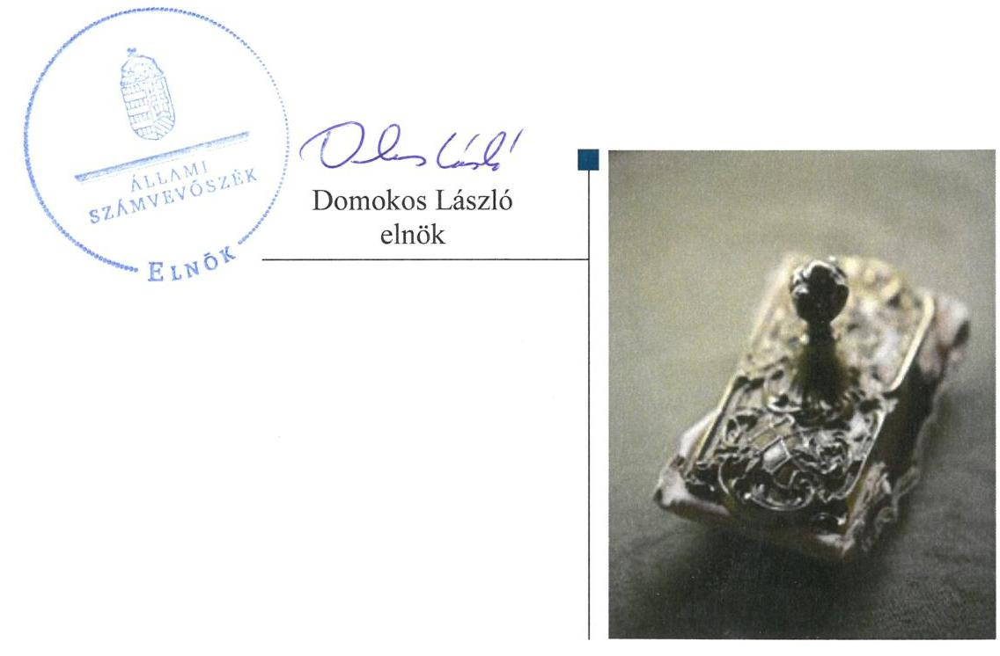
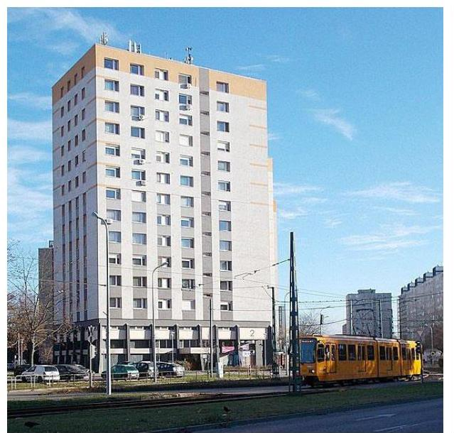

# Jelentés 

## Nemzeti tulajdonú gazdasági társaságok ellenőrzése

PALOTA-HOLDING Ingatlan- és Vagyonkezelő Zártkörűen Működő Részvénytársaság
2019.

---

# Jelentés 

## Nemzeti tulajdonú gazdasági társaságok ellenőrzése

PALOTA-HOLDING Ingatlan- és Vagyonkezelő Zártkörűen Működő Részvénytársaság
2019. 12. hó 30. nap

---

# AZ ELLENŐRZÉST FELÜGYELTE:

DR. PULAY GYULA felügyeleti vezető

# AZ ELLENŐRZÉST VEZETTE ÉS A VÉGREHAJTÁSÁÉRT FELELŐS:

VALASTYÁNNÉ DR. VÍZHÁNYÓ JÚLIA ellenőrzésvezető

SALAMIN VIKTOR ellenőrzésvezető

DR. GÁL NÓRA ellenőrzésvezető

A PROGRAM ÖSSZEÁLLÍTÁSÁÉRT FELELŐS:

TÓTPÁL SZABOLCS osztályvezető

Jelentéseink az Országgyűlés számítógépes hálózatán és az Interneten a www.asz.hu címen is olvashatóak.

IKTATÓSZÁM: EL-2176-001/2019.

TÉMASZÁM: 2478

ELLENŐRZÉS-AZONOSÍTÓ SZÁM: V082225

---

# TARTALOMJEGYZÉK 

■ ÖSSZEGZÉS ..... 5
■ AZ ELLENŐRZÉS CÉLJA ..... 6
■ AZ ELLENŐRZÉS TERÜLETE ..... 7
■ AZ ELLENŐRZÉS HÁTTERE, INDOKOLTSÁGA ..... 8
■ A JELENTÉS LÉNYEGES KÉRDÉSKÖREI ..... 9
■ AZ ELLENŐRZÉS HATÓKÖRE ÉS MÓDSZEREI ..... 10
■ MEGÁLLAPÍTÁSOK ..... 12
■ JAVASLATOK ..... 14
■ MELLÉKLETEK ..... 15
I. sz. melléklet: Értelmező szótár ..... 15
■ FÜGGELÉKEK ..... 17
I. sz. függelék a jelentéshez ..... 17
II. sz. függelék: Észrevételek ..... 18
■ RÖVIDÍTÉSEK JEGYZÉKE ..... 21

---

.

---

# ÖSSZEGZÉS 

A PALOTA-HOLDING Ingatlan- és Vagyonkezelő Zrt. vagyongazdálkodása nem volt szabályszerű. A 2015., 2016. és 2017. évben a Társaság gazdálkodásának átláthatósága és elszámoltathatósága nem volt biztosított. A nemzeti vagyon védelme nem volt biztosított.

## Az ellenőrzés társadalmi indokoltsága

Az Állami Számvevőszék kiemelt célja, hogy a helyi önkormányzatok gazdálkodásában rejlő pénzügyi kockázatok feltárásával, az államháztartáson kívülre nyújtott költségvetési támogatások és ingyenes vagyonjuttatások, valamint az államháztartáson kívül működő feladatellátó rendszerek ellenőrzéseivel hozzájáruljon ahhoz, hogy a közpénzeket az államháztartáson kívül működő szervezetek is átlátható, rendezett módon használják fel.

Magyarországon az önkormányzatok kötelező és önként vállalt feladataik vonatkozásában is egyre szélesebb körben alkalmazzák a költségvetésen kívüli feladatellátást, ezáltal - a nonprofit szervezetek mellett - az önkormányzati tulajdonú gazdasági társaságok is kiemelt fontosságú szerephez jutottak.

## Főbb megállapítások, következtetések, javaslatok

Budapest Főváros XV. Kerület Rákospalota, Pestújhely, Újpalota Önkormányzata tulajdonosi joggyakorlása szabályszerű volt.

A PALOTA-HOLDING Ingatlan- és Vagyonkezelő Zrt. vagyongazdálkodási tevékenysége nem volt szabályszerű, 2015-2017. években a mérleg alátámasztásához nem készített a jogszabályi előírásoknak megfelelő leltárt, ezért a 2015-2017. évekre vonatkozó éves beszámolói nem voltak megalapozottak. A Társaság a vagyonkezelt vagyonhoz kapcsolódó nyilvántartásait 2015. évben nem vezette szabályszerűen, a vagyonkezelt vagyont nem a vagyonkezelési szerződésben meghatározott könyv szerinti értéken vette nyilvántartásba, és szerepeltette a mérlegében. Szabályszerű nyilvántartás hiányában nem volt biztosított a Társaság kezelésében lévő nemzeti vagyonnal való felelős gazdálkodás, a nemzeti vagyon védelme.

Az Állami Számvevőszék a jelentésben foglalt megállapítások alapján a PALOTA-HOLDING Ingatlan- és Vagyonkezelő Zrt. vezérigazgatójának egy javaslatot fogalmazott meg.

---

# AZ ELLENŐRZÉS CÉLJA 

AZ ELLENŐRZÉS CÉLJA annak megítélése volt, hogy a tulajdonosi joggyakorló a gazdasági társaságai feletti tulajdonosi joggyakorlás kereteit kialakította-e, tulajdonosi jogait megfelelően gyakorolta-e és kötelezettségeit teljesítette-e. A gazdasági társaság biztosította-e a vagyon védelmét a nyilvántartások szabályszerű vezetése és a mérleg tételeinek leltárral történő alátámasztása útján, valamint szabályszerűen gondoskodott-e a társaság használatában, kezelésében lévő nemzeti vagyon értékének megőrzéséről, gyarapításáról, hasznosításáról.

---

# AZ ELLENŐRZÉS TERÜLETE

## Budapest Főváros XV. Kerület Rákospalota, Pestújhely, Újpalota Önkormányzata, PALOTA-HOLDING Ingatlan- és Vagyonkezelő Zrt.

Az Önkormányzat¹ a Társaságot² 1991. november 27-én alapította, jegyzett tőkéje alapításkor 19,1 M Ft, az ellenőrzött időszakban 30,0 M Ft volt. A társaság az Önkormányzat kizárólagos tulajdonában volt.

A Társaság fő feladata az Önkormányzat ingatlanvagyonának önkormányzati célok megvalósítását szolgáló hasznosítása, üzemeltetése, állagának megóvása, értékének védelme volt. Feladatellátása megbízási szerződés¹⁵³, alapján kiterjedt az Önkormányzat törzsvagyonát képező lakáscélú ingatlanok kezelésére, valamint vagyonkezelési szerződés¹²⁴ alapján az Önkormányzat üzleti vagyonát képező nem lakáscélú ingatlanok kezelésére. A Társaság egyéb tevékenysége a vegyes tulajdonú társasházak kezelése, közös képviselete volt.

Az ellenőrzött időszakban a polgármester⁵ és a jegyző⁶ személyében nem történt változás, a Társaság vezérigazgatójának személye 2016 januárjában és 2017 novemberében változott. A Társaság az ellenőrzött időszakban nem tartozott a kormányzati szektorba sorolt gazdasági társaságok közé.

---

# AZ ELLENŐRZÉS HÁTTERE, INDOKOLTSÁGA 

Az Alaptörvény 38. cikke alapján az állam és a helyi önkormányzatok tulajdona nemzeti vagyon. A nemzeti vagyon megőrzése, megóvása érdekében kiemelten fontos ezen nemzeti tulajdonú gazdasági társaságok ellenőrzése. Gazdálkodásuk jellemzően a közérdeklődés és a média figyelmének középpontjában áll, amihez hozzájárul a gazdálkodásuk körébe tartozó - a nemzeti vagyon részét képező - vagyon nagysága, illetve az általuk ellátott közszolgáltatások minősége és hatékonysága. Ellenőrzéseink feltárhatják, hogy a tulajdonosi felügyelet hozzájárult-e a szabályszerű gazdálkodáshoz és feladatellátáshoz.

Az ellenőrzés eredményeként meghatározhatóvá válnak a szervezet vagyongazdálkodást érintő kockázatai, ezzel lehetővé téve a kockázatok csökkentését. A megállapítások alapján megfogalmazott számvevőszéki javaslatok hasznosítása elősegítheti a meglévő hibák megszüntetését. A jó gyakorlatok bemutatásával az ÁSZ hozzájárulhat a követendő megoldások megismertetéséhez, terjesztéséhez.

---

# A JELENTÉS LÉNYEGES KÉRDÉSKÖREI 

1. A Társaság feletti tulajdonosi joggyakorlás megfelelt-e a jogszabályi és belső előírásoknak?
2. A Társaság vagyongazdálkodási tevékenysége szabályszerű volt-e?

---

# AZ ELLENŐRZÉS HATÓKÖRE ÉS MÓDSZEREI 

## Az ellenőrzés típusa

Megfelelőségi ellenőrzés.

## Az ellenőrzött időszak

A tulajdonosi joggyakorlás vonatkozásában az ellenőrzött időszak 2017. január 1-től az ellenőrzés megkezdésének napjáig 2018. október 5-ig terjedt. Az éves beszámolók jóváhagyása és a vagyonkezelésbe adott vagyonnal való gazdálkodás tulajdonosi ellenőrzése 2015. január 1-től az ellenőrzés megkezdésének napjáig, 2018. október 5-ig tartott.

A Társaság vagyongazdálkodása vonatkozásában az ellenőrzött időszak 2015-2017. évek.

## Az ellenőrzés tárgya

Az önkormányzati tulajdonban lévő gazdasági társaság feletti tulajdonosi joggyakorlás kialakítása és működtetése.

Önkormányzati tulajdonban lévő gazdasági társaság vagyongazdálkodása keretében a társaság használatában, kezelésében lévő nemzeti vagyon, illetve a saját vagyon tekintetében a vagyonnyilvántartások vezetése, leltára. A társaság használatában, vagyonkezelésében lévő nemzeti vagyon tekintetében a vagyon értékének megőrzése, gyarapítása, hasznosítása.

## Az ellenőrzött szervezet

Budapest Főváros XV. Kerület Rákospalota, Pestújhely, Újpalota Önkormányzata, valamint a PALOTA-HOLDING Ingatlan- és Vagyonkezelő Zrt.

## Az ellenőrzés jogalapja

Az ellenőrzés jogalapját az ÁSZ tv. ${ }^{7}$ 1. § (3) bekezdése és 5. § (3)-(5) bekezdései képezték.

---

# Az ellenőrzés módszerei 

Az ellenőrzést az ellenőrzési program ellenőrzési kérdései, az ellenőrzött időszakban hatályos jogszabályok, az ellenőrzés szakmai szabályok és módszertanok alapján, a nemzetközi standardok figyelembe vételével végeztük.

Az ellenőrzés ideje alatt az ellenőrzött szervezettel történő kapcsolattartást az ÁSZ Szervezeti és Működési Szabályzatának vonatkozó előírásai alapján biztosítottuk.
2017. január 1-től az ellenőrzés megkezdésének napjáig ellenőriztük a tulajdonosi joggyakorlás kereteinek kialakítását, a tulajdonosi joggyakorló tevékenységét a felügyelő bizottság és a független könyvvizsgáló működéséhez kapcsolódóan, valamint azt, hogy a tulajdonosi joggyakorló - amennyiben a gazdasági társaság feladatellátásához és vagyonkezeléséhez kapcsolódóan határozott meg követelményeket, elvárásokat - a nemzeti vagyon értékének megőrzése érdekében monitorozta-e azok teljesülését. 2015. január 1-től az ellenőrzés megkezdésének napjáig ellenőriztük a tulajdonosi joggyakorló részvételét az éves beszámoló elfogadására vonatkozó döntéshozatalban, valamint amennyiben adott a társaságainak vagyonkezelésbe nemzeti vagyont, akkor azt, hogy az azzal történő gazdálkodást a tulajdonosi joggyakorló ellenőrizte-e.

Az ellenőrzési kérdések megválaszolásához szükséges bizonyítékok megszerzése a Társaság vagyongazdálkodása vonatkozásában a következő ellenőrzési eljárások alkalmazásával történt: megfigyelés, információkérés, összehasonlítás, elemző eljárás. Az ellenőrzési bizonyítékként felhasználható adatforrások közé tartoznak az ellenőrzési programban felsorolt adatforrások, továbbá minden - az ellenőrzés folyamán - feltárt, az ellenőrzés szempontjából információkat tartalmazó dokumentum.

Az ellenőrzést a kérdésekre adott válaszok kiértékelésével, valamint a megjelölt adatforrások, a csatolt tanúsítványok felhasználásával, továbbá az adott időszakban hatályos jogszabályok figyelembe vételével folytattuk le.

A vagyonnyilvántartások, valamint a nemzeti vagyon kezelésének szabályszerűsége esetében az ellenőrzés azokra a legnagyobb értékű tételekre - a lényeges sokaságra - terjedt ki, melyek összértéke eléri a teljes sokaság összértékének 50%-át. A lényeges sokaságot tételesen ellenőriztük. A 2015-2017. évekre történt meg a lényeges dokumentumok, ennek keretében a leltározáshoz kapcsolódó dokumentumok, valamint a mérleg tételeit alátámasztó leltár értékelése.

---

# 1. A Társaság feletti tulajdonosi joggyakorlás megfelelt-e a jogszabályi és belső előírásoknak? 

Összegző megállapítás

Az Önkormányzat tulajdonosi joggyakorlása szabályszerű volt.
1.1. számú megállapítás

Az Önkormányzat a tulajdonosi joggyakorlás kereteit a jogszabályi előírások szerint alakította ki.

## A TULAJDONOSI JOGOK GYAKORLÁSÁNAK

RENDJÉT az Önkormányzat a Vagyonrendelet ${ }_{1-4}{ }^{8}$-ben, valamint a Társaság Alapszabály ${ }^{9}$-ában a jogszabályi előírásokkal összhangban kialakította.

Az Önkormányzat Képviselő-testülete a Társaság legfőbb szerveként a Taktv. ${ }^{10}$ 5. § (3) bekezdésének előírása szerint megalkotta a vezető tisztségviselők, a felügyelőbizottsági tagok, az Mt. ${ }^{11}$ 208. §-ának hatálya alá eső munkavállalók javadalmazásáról, valamint a jogviszony megszűnése esetére biztosított juttatások módjának, mértékének elveiről, annak rendszeréről szóló szabályzatot.
1.2. számú megállapítás

A Társaság feletti tulajdonosi joggyakorlás szabályszerű volt.
A SZÁMVITELI BESZÁMOLÓ ELFOGADÁSÁRA, az eredmény felosztására vonatkozó döntéshozatalban a tulajdonosi joggyakorló a jogszabályi előírásoknak megfelelően részt vett. A döntéshez a Felügyelő bizottság és a Könyvvizsgáló jelentése rendelkezésre állt.

A FELÜGYELŐ BIZOTTSÁG és a könyvvizsgáló tevékenységéhez kapcsolódóan a tulajdonosi joggyakorlás szabályszerű volt. A Felügyelő bizottság létrehozása megfelelt a Ptk. ${ }^{12}$ és a Taktv. előírásainak, ügyrenddel rendelkezett. A könyvvizsgáló megválasztása megfelelt a Ptk. és a Számv. tv. ${ }^{13}$ előírásainak.

Az Önkormányzat a Társaság feladatellátásához és vagyonkezeléséhez kapcsolódóan meghatározott követelmények, elvárások teljesülését a nemzeti vagyon értékének megőrzése érdekében rendszeresen monitorozta. Az Önkormányzat az Nvtv. ${ }^{14}$ 10. § (2) bekezdése előírásainak megfelelően ellenőrizte a vagyonkezelésbe adott nemzeti vagyonnal való gazdálkodást az ellenőrzött időszakban.

---

# 2. A Társaság vagyongazdálkodási tevékenysége szabályszerű volt-e? 

Összegző megállapítás

A Társaság vagyongazdálkodási tevékenysége nem volt szabályszerű.

## LELTÁRKÉSZÍTÉSI ÉS LELTÁROZÁSI SZABÁLY-

ZATTAL a Társaság rendelkezett az ellenőrzött időszakban a Számv. tv előírásainak megfelelően.

A MÉRLEG TÉTELEINEK ALÁTÁMASZTÁSÁHOZ a Társaság a Számv. tv. 69. § (1) bekezdésének előírása ellenére 2015-2017. évekre vonatkozóan nem állított össze olyan leltárt, amely tételesen, ellenőrizhető módon tartalmazta a mérleg fordulónapján meglévő eszközöket és forrásokat mennyiségben és értékben. Szabályszerű leltár hiányában a 2015-2017. évi beszámolók nem voltak megalapozottak, nem érvényesült a Számv. tv. 15. § (3) bekezdésében foglalt valódiság elve, nem volt biztosított a nemzeti vagyon védelme.

A Társaság könyvvizsgálója a 2015-2017. évi beszámolókról korlátozás nélküli véleményt adott.

## A VAGYONKEZELT VAGYONHOZ KAPCSOLÓDÓ

NYILVÁNTARTÁSAIT a Társaság 2015. évben nem vezette szabályszerűen, mert a vagyonkezelt vagyont nem a vagyonkezelési szerződés-1-ben szereplő könyv szerinti értéken vette nyilvántartásba. A 2015. évi beszámoló mérlegében a vagyonkezelt vagyont nem a vagyonkezelési szerződés-1-ben rögzített könyvszerinti értéket alapul véve szerepeltette, ezzel megsértette a Számv. tv. 165.§ (1) bekezdésében foglalt előírást. Szabályszerű nyilvántartás hiányában a Társaság nem biztosította a nemzeti vagyon védelmét, a nemzeti vagyonnal való elszámoltathatóság feltételeit.

A vagyonkezelési szerződés 2016. augusztusi módosítását követően a vagyonnyilvántartásban és a 2016. és 2017. évi beszámolók mérlegeiben a vagyonkezelt vagyon könyvszerinti értéke megegyezett a vagyonkezelési szerződés-2-ben rögzített értékkel.

---

# JAVASLATOK 

Az ÁSZ tv. 33. § (1) bekezdésében foglaltak értelmében az ellenőrzött szervezet vezetője köteles a jelentésben foglalt megállapításokhoz kapcsolódó intézkedési tervet összeállítani és azt a jelentés kézhezvételétől számított 30 napon belül az ÁSZ részére megküldeni. Amennyiben az ellenőrzött szervezet vezetője nem küldi meg határidőben az intézkedési tervet, vagy továbbra sem elfogadható intézkedési tervet küld, az Állami Számvevőszék
 elnöke az ÁSZ tv. 33. § (3) bekezdése a) és b) pontjaiban foglaltakat érvényesítheti.

## A PALOTA-HOLDING Ingatlan- és Vagyonkezelő Zrt. vezérigazgatójának

1. | Intézkedjen a Számv. tv. előírása szerinti leltár összeállításáról.
(2. sz. megállapítás 2. bekezdés első mondata alapján)

---

# MELLÉKLETEK 

- I. SZ. MELLÉKLET: ÉRTELMEZŐ SZÓTÁR
gazdasági társaság
koncessziós szerződés
közszolgáltatás
közfeladat
nemzeti vagyon
nemzeti vagyon használója
tulajdonosi jogok gyakorlója
vagyonkezelő

Ptk. 3:88. § (1) bekezdése szerint „a gazdasági társaságok üzletszerű közös gazdasági tevékenység folytatására, a tagok vagyoni hozzájárulásával létrehozott, jogi személyiséggel rendelkező vállalkozások, amelyekben a tagok a nyereségből közösen részesednek, és a veszteséget közösen viselik".
Az 1991. évi XVI. tv. alapján a kizárólagos állami, önkormányzati vagy önkormányzati társulási tulajdon hatékony működtetésének, valamint a kizárólagosan az állam vagy az önkormányzat hatáskörébe utalt tevékenységek gyakorlásának egyik lehetséges útja mindezek koncessziós szerződés alapján való átengedése.
Az Ebktv. ${ }^{15}$ 3. § d) pontja a következőképpen határozza meg a közszolgáltatást: „szerződéskötési kötelezettség alapján a lakosság alapvető szükségleteinek ellátására irányuló szolgáltatás, így különösen a villamos energia-, gáz-, hő-, víz-, szennyvíz- és hulladékkezelési, köztisztasági, postai és távközlési szolgáltatás, továbbá a menetrend alapján közlekedő járművekkel végzett közforgalmú személyszállítás".
Az Áht. 3/A. § (1) bekezdése alapján közfeladat a jogszabályban meghatározott állami vagy önkormányzati feladat.
Nvtv. 1. § (2) bekezdése szerint nemzeti vagyonba tartozik többek között:
„az állam vagy a helyi önkormányzat kizárólagos tulajdonában álló dolgok,
az a) pont hatálya alá nem tartozó, állam vagy a helyi önkormányzat tulajdonában lévő dolog,
az állam vagy a helyi önkormányzat tulajdonában lévő pénzügyi eszközök, továbbá az államot vagy a helyi önkormányzatot megillető társasági részesedések,
az államot vagy a helyi önkormányzatot megillető bármely vagyoni értékkel rendelkező jogosultság, amelyet jogszabály vagyoni értékű jogként nevesít."
A tulajdonosi joggyakorló vagy a nemzeti vagyon használója által a nemzeti vagyon birtoklásának, használatának, hasznok szedése jogának bármely - a tulajdonjog átruházását nem eredményező - jogcímen történő átengedése, ide nem értve a vagyonkezelésbe adást, valamint a haszonélvezeti jog alapítását.
Forrás: Nvtv. 3. § (1) bekezdés 4. pont
Azon természetes személy, jogi személy vagy jogi személyiséggel nem rendelkező szervezet, aki vagy amely állami vagyon tekintetében törvény vagy szerződés alapján, a helyi önkormányzat vagyona tekintetében törvény, a helyi önkormányzat rendelete vagy szerződés alapján bármely jogcímen nemzeti vagyont birtokol, használ, szedi annak hasznait, kivéve a tulajdonosi joggyakorló.
Forrás: Nvtv. 3. § (1) bekezdés 11. pont
Aki a nemzeti vagyon felett az államot vagy a helyi önkormányzatot megillető tulajdonosi jogok és kötelezettségek összességének gyakorlására jogosult. (Forrás: Nvtv. 3. § (1) bekezdés 17. pontja)
az állam tulajdonában álló nemzeti vagyon tekintetében:
aa) költségvetési szerv,
ab) helyi önkormányzat, nemzetiségi önkormányzat, valamint ezek társulásai,
ac) az ab) alpontban felsoroltak fenntartása vagy irányítása alá tartozó intézmény,
ad) köztestület,
ae) az állam, az aa)-ac) alpontban meghatározott személyek együtt vagy külön-külön 100%-os tulajdonában álló gazdálkodó szervezet,
af) az ae) alpont szerinti gazdálkodó szervezet 100%-os tulajdonában álló gazdálkodó szervezet,
ag) a törvény által kijelölt egyedileg meghatározott jogi személy.
b) a helyi önkormányzat tulajdonában álló nemzeti vagyon tekintetében:

---

ba) nemzetiségi önkormányzat, helyi vagy nemzetiségi önkormányzati társulás, valamint ezek fenntartása vagy irányítása alá tartozó intézmény,
bb) költségvetési szerv,
bc) köztestület,
bd) az állam, a helyi önkormányzat, a ba) alpontban meghatározott személyek együtt vagy külön-külön 100%-os tulajdonában álló gazdálkodó szervezet,
be) a bd) alpont szerinti gazdálkodó szervezet 100%-os tulajdonában álló gazdálkodó szervezet.
Forrás: Nvtv. 3. § (1) bekezdés 19. pont
vagyongazdálkodás
A nemzeti vagyongazdálkodás feladata a nemzeti vagyon rendeltetésének megfelelő, az állam, az önkormányzat mindenkori teherbíró képességéhez igazodó, elsődlegesen a közfeladatok ellátásához és a mindenkori társadalmi szükségletek kielégítéséhez szükséges, egységes elveken alapuló, átlátható, hatékony és költségtakarékos működtetése, értékének megőrzése, állagának védelme, értéknövelő használata, hasznosítása, gyarapítása, továbbá az állam vagy a helyi önkormányzat feladatának ellátása szempontjából feleslegessé váló vagyontárgyak elidegenítése. (Forrás: Nvtv. 7. § (2) bekezdése).

---

# FÜGGELÉKEK 

- I. SZ. FÜGGELÉK A JELENTÉSHEZ

Az Állami Számvevőszék az ellenőrzések során feltárt tényekhez kapcsolódó további körülmények tisztázására eszközrendszerrel nem rendelkezik. Amennyiben az ellenőrzésen túlmutatóan indokoltnak látszik az ellenőrzés során feltárt körülmények további vizsgálata, az Állami Számvevőszék törvényi felhatalmazás alapján az ellenőrzés által feltárt körülményeket továbbítja a hatáskörrel rendelkező szervnek a szükséges intézkedések megtétele, eljárások lefolytatása érdekében.

A Társaság 2015., 2016. és 2017. évi beszámolók mérlegtételeit nem támasztotta alá leltárral, ezzel megsértette a Számv. tv. 69. § (1) bekezdése előírását.

A mérleget alátámasztó leltár hiányában nem igazolt, hogy a Társaság 2015., 2016. és 2017. évi beszámolói megbízható és valós összképet mutatnak.

Az eset konkrét körülményeinek feltárására a Nemzeti Adó- és Vámhivatal rendelkezik hatáskörrel.

---

A jelentéstervezetet a Számvevőszék 15 napos észrevételezésre megküldte az ellenőrzött szervezetek vezetőinek az ÁSZ tv. 29. § (1) bekezdése előírásának megfelelően.

A PALOTA-HOLDING Ingatlan- és Vagyonkezelő Zártkörűen Működő Részvénytársaság vezérigazgatója a jelentéstervezet megállapításaira írásban észrevételt tett. Budapest Főváros XV. Kerület Rákospalota, Pestújhely, Újpalota Önkormányzata polgármestere az ÁSZ tv. 29. § (2) bekezdésében foglalt észrevételezési jogával nem élt, a törvényes határidőn belül írásban észrevételt nem tett.
Az ÁSZ tv. 29. § (3) bekezdésével összhangban az ÁSZ a Függelékben feltünteti az ellenőrzés megállapításaival kapcsolatban tett, figyelembe nem vett észrevételeket, és megindokolja, hogy azokat miért nem fogadta el.

Az észrevétel 3. bekezdésében a vagyonkezelt vagyonhoz kapcsolódó nyilvántartásokkal kapcsolatos észrevételre adott válasz:

A beérkezett dokumentumok felülvizsgálata során megállapítást nyert, hogy az 549/2016. számú, Módosításokkal egységes szerkezetbe foglalt Vagyonkezelési szerződést és mellékletét a Társaság a mintatételekhez, az EL-0881043/2018 iktatószámú adatbekérő levélben kért adatok kapcsán küldte be. Tekintettel arra, hogy a módosított vagyonkezelési szerződés aláírására 2016. augusztus 17-én került sor, a vagyonkezelt vagyonhoz kapcsolódó 2015. évi nyilvántartásokat és a 2015. évi beszámoló adatait nem támasztja alá. A fentiek alapján a jelentéstervezetben a 2015. évre vonatkozóan a megállapítás módosítása nem indokolt.

# Az észrevétel 4. bekezdésében a mérlegtételek leltárral való alátámasztottságával kapcsolatos megállapításra tett észrevételre adott válasz: 

Az ÁSZ a Társaságtól az EL-0881-003/2018. iktatószámú adatbekérő levél 2. számú melléklet 2. pontjában kérte az ellenőrzött időszak mérleg tételeit alátámasztó leltárakat, majd az EL-0881-013/2018. iktatószámú adatbekérő levél 2. számú melléklet 20. pontjában a leltározáshoz kapcsolódó dokumentumokat. A rendelkezésre álló határidőben a Társaság az EL-0881-003/2018. iktatószámú adatbekérő levélben kért dokumentumok teljesítéseként a vonatkozó teljességi és hitelességi nyilatkozat 4-56. sorában szereplő dokumentumokat, az EL-0881-013/2018. iktatószámú adatbekérő levélben kért dokumentumok teljesítéseként a vonatkozó teljességi és hitelességi nyilatkozat 243-257. sorában szereplő dokumentumokat (leltározási utasítás, leltár összesítők) bocsátott az ellenőrzés rendelkezésére.

A vezérigazgató a teljességi és hitelességi nyilatkozataival igazolta az átadott dokumentumok teljes körűségét és hitelességét. Az ellenőrzési dokumentumok felülvizsgálata során megállapítható, hogy a rendelkezésre bocsátott

[^0]
[^0]:    * 29. § (1) Az Állami Számvevőszék az ellenőrzési megállapításait megküldi az ellenőrzött szervezet vezetőjének vagy az általa megbízott személynek, és annak, akinek személyes felelősségét állapította meg.
    (2) Az ellenőrzött szervezet vezetője és a felelősként megjelölt személy az ellenőrzés megállapításaira tizenöt napon belül írásban észrevételt tehet.
    (3) Az Állami Számvevőszék az észrevételre a beérkezésétől számított harminc napon belül írásban válaszol. A figyelembe nem vett észrevételeket köteles a jelentésben feltüntetni, és megindokolni, hogy azokat miért nem fogadta el.

---

dokumentumok nem tartalmazták az éves beszámolók mérlegsorait alátámasztó tételes leltárt az alábbi mérlegsorok és évek esetében:

- Saját tőke (2015., 2016., 2017. évek)
- Rövid lejáratú kötelezettségeken belül a vevőktől kapott előlegből a pályázati ajánlati biztosíték (2015., 2017. évek)
- Pénztár (2016., 2017. évek)
- Céltartalékok (2017. év)

A passzív időbeli elhatárolások esetében a költségek, ráfordítások passzív időbeli elhatárolása összevont értéket tartalmazott, nem került sor a mérlegsort alkotó elemek tételes bemutatására a leltárban. Fentiek figyelembe vételével helytálló a jelentéstervezet megállapítása, amely szerint a leltár nem felelt meg a Számv. tv. 69.§ (1) bekezdés szerinti előírásnak.

---

.

---

# RÖVIDÍTÉSEK JEGYZÉKE 

${ }^{1}$ Önkormányzat
${ }^{2}$ Társaság
${ }^{3}$ megbizási szerződés ${ }_{1}$
megbizási szerződés2
megbizási szerződés3
megbizási szerződés4
megbizási szerződés5
${ }^{4}$ vagyonkezelési szerződés
vagyonkezelési szerződés2
${ }^{5}$ Polgármester
${ }^{6}$ Jegyző

Budapest Főváros XV. Kerület Rákospalota, Pestújhely, Újpalota Önkormányzata PALOTA-HOLDING Ingatlan- és Vagyonkezelő Zrt.
Budapest Főváros XV. kerület Rákospalota, Pestújhely, Újpalota Önkormányzata törzsvagyonát képező lakáscélú ingatlanok kezelésére a PALOTA-HOLDING Ingatlan- és Vagyonkezelő Zártkörűen Működő Részvénytársasággal létrejött 286/2015. számú megbízási szerződés (hatályos: 2015.03.31. és 2015.12.31. között, határozott időre szólt azzal a megkötéssel, hogy a 2016. évre vonatkozó szerződés megkötéséig a működtetési feladatokat a 2015. évi költségkeret időarányos mértékéig ellátja)
Budapest Főváros XV. kerület Rákospalota, Pestújhely, Újpalota Önkormányzata törzsvagyonát képező lakáscélú ingatlanok kezelésére a PALOTA-HOLDING Ingatlan- és Vagyonkezelő Zártkörűen Működő Részvénytársasággal létrejött 286/2015. számú megbízási szerződés 1049/2015. számú szerződésmódosítása (hatályos: 2015.03.31. és 2015.12.31. között, határozott időre szólt azzal a megkötéssel, hogy a 2016. évre vonatkozó szerződés megkötéséig a működtetési feladatokat a 2015. évi költségkeret időarányos mértékéig ellátja)
Budapest Főváros XV. kerület Rákospalota, Pestújhely, Újpalota Önkormányzata törzsvagyonát képező lakáscélú ingatlanok kezelésére a PALOTA-HOLDING Ingatlan- és Vagyonkezelő Zártkörűen Működő Részvénytársasággal létrejött 249/2016. számú megbízási szerződés (hatályos: 2016.05.23. és 2016.12.31. között azzal a megkötéssel, hogy a 2017. évre vonatkozó szerződés megkötéséig a működtetési feladatokat a 2016. évi költségkeret időarányos mértékéig ellátja)
Budapest Főváros XV. kerület Rákospalota, Pestújhely, Újpalota Önkormányzata törzsvagyonát képező lakáscélú ingatlanok kezelésére a PALOTA-HOLDING Ingatlan- és Vagyonkezelő Zártkörűen Működő Részvénytársasággal létrejött 126/2017. számú megbízási szerződés (hatályos: 2017.03.30. és 2017.12.31. között azzal a megkötéssel, hogy a 2018. évre vonatkozó szerződés megkötéséig a működtetési feladatokat a 2017. évi költségkeret időarányos mértékéig ellátja)
Budapest Főváros XV. kerület Rákospalota, Pestújhely, Újpalota Önkormányzata törzsvagyonát képező lakáscélú ingatlanok kezelésére a PALOTA-HOLDING Ingatlan- és Vagyonkezelő Zártkörűen Működő Részvénytársasággal létrejött 126/2017. számú megbízási szerződés 430/2017. számú szerződésmódosítása (hatályos: 2017. december 29-től)
Budapest Főváros XV. kerület Rákospalota, Pestújhely, Újpalota Önkormányzata törzsvagyonát képező lakáscélú ingatlanok kezelésére a PALOTA-HOLDING Ingatlan- és Vagyonkezelő Zártkörűen Működő Részvénytársasággal létrejött 617/2015. számú vagyonkezelési szerződés (hatályos: 2015. július 1-jétől, határozatlan időre kötött)
Budapest Főváros XV. kerület Rákospalota, Pestújhely, Újpalota Önkormányzata törzsvagyonát képező lakáscélú ingatlanok kezelésére a PALOTA-HOLDING Ingatlan- és Vagyonkezelő Zártkörűen Működő Részvénytársasággal létrejött 617/2015. számú vagyonkezelési szerződés 549/2016. számú szerződésmódosítása egységes szerkezetben (hatályos: 2016. augusztus 17-től, határozatlan időre kötött)
Budapest Főváros XV. Kerület Rákospalota, Pestújhely, Újpalota Önkormányzata Polgármestere
Budapest Főváros XV. Kerület Rákospalota, Pestújhely, Újpalota Önkormányzata Jegyzője

---

${ }^{7}$ ÁSZ tv.
${ }^{8}$ Vagyonrendelet ${ }_{3-4}$
${ }^{9}$ Alapszabály
${ }^{10}$ Taktv.
${ }^{11}$ Mt.
${ }^{12}$ Ptk.
${ }^{13}$ Számv. tv.
${ }^{14}$ Nvtv.
${ }^{15}$ Ebktv.
az Állami Számvevőszékről szóló 2011. évi LXVI. törvény
Budapest Főváros XV. kerület Rákospalota, Pestújhely, Újpalota Önkormányzat Képviselő-testületének a 46/2013. (XII.2.), a 37/2014. (XII.18.) önkormányzati rendelettel egységes szerkezetbe foglalt 33/2013. (IX.30.); önkormányzati rendelete az Önkormányzat vagyonáról és a vagyongazdálkodás szabályairól és a 20/2015. (IV.24.); a 29/2016. (XII.19.); a 27/2017. (XII.21.); önkormányzati rendelettel beiktatott módosításai
a PALOTA-HOLDING Ingatlan- és Vagyonkezelő Zártkörűen Működő Részvénytársaság többször módosított Alapszabálya (hatályos: 2015.
 január 14-től)
2009. évi CXXII. törvény a köztulajdonban álló gazdasági társaságok takarékosabb működéséről (hatályos: 2009. december 4-től)
2012. évi I. törvény a munka törvénykönyvéről (hatályos: 2012. július 1-jétől)
a Polgári Törvénykönyvről szóló 2013. évi V. törvény (hatályos: 2013. február 26-ától)
2000. évi C. törvény a számvitelről (hatályos: 2001. január 1-jétől)
2011. évi CXCVI. törvény a nemzeti vagyonról
egyenlő bánásmódról és az esélyegyenlőség előmozdításáról szóló 2003. évi CXXV.

---

# ÁLLAMI SZÁMVEVŐSZÉK 

1052 Budapest, Apáczai Csere János utca 10.
Levélcím: 1364 Budapest Pf. 54
Telefon: +36 14849100 Telefax: +36 14849200
www.asz.hu
