# Jelentés 

## Központi költségvetési szervek ellenőrzése

Állami Egészségügyi Ellátó Központ 2019.

---

# Jelentés 

## Központi költségvetési szervek ellenőrzése

Állami Egészségügyi Ellátó Központ 2019. 11. hó 13. nap
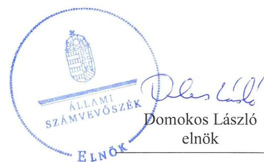
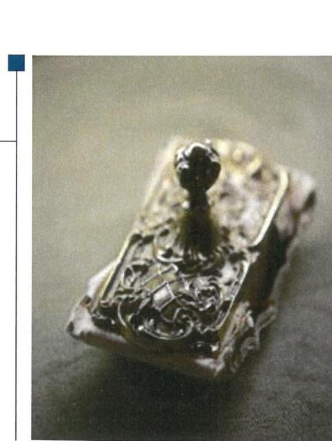

---

# AZ ELLENŐRZÉST FELÜGYELTE:

- HOLMAN MAGDOLNA felügyeleti vezető
- AZ ELLENŐRZÉST VEZETTE ÉS A VÉGREHAJTÁSÁÉRT FELELŐS:
  - ÁRPÁSI TIBOR ellenőrzésvezető
  - A PROGRAM ÖSSZEÁLLÍTÁSÁÉRT FELELŐS:
    - TÓTPÁL SZABOLCS osztályvezető

**IKTATÓSZÁM:** EL-2177-001/2019.

**TÉMASZÁM:** 2450

**ELLENŐRZÉS-AZONOSÍTÓ SZÁM:** V079137

Jelentéseink az Országgyűlés számítógépes hálózatán és az Interneten a www.asz.hu címen is olvashatóak.

---

# TARTALOMJEGYZÉK 

■ ÖSSZEGZÉS ..... 5
■ AZ ELLENŐRZÉS CÉLJA ..... 6
■ AZ ELLENŐRZÉS TERÜLETE ..... 7
■ AZ ELLENŐRZÉS HÁTTERE, INDOKOLTSÁGA ..... 8
■ A JELENTÉS LÉNYEGES KÉRDÉSKÖREI ..... 9
■ AZ ELLENŐRZÉS HATÓKÖRE ÉS MÓDSZEREI ..... 10
■ MEGÁLLAPÍTÁSOK ..... 13
■ KÖVETKEZTETÉSEK ..... 19
■ JAVASLATOK ..... 20
■ MELLÉKLETEK ..... 23
I. sz. melléklet: Értelmező szótár ..... 23
■ FÜGGELÉKEK ..... 27
I. sz. függelék a jelentéshez ..... 27
II. sz. függelék: Észrevételek ..... 29
■ RÖVIDÍTÉSEK JEGYZÉKE ..... 47

---

.

---

# ÖSSZEGZÉS 

Az Állami Egészségügyi Ellátó Központ nem biztosította az átlátható és elszámoltatható közpénzfelhasználást, a vagyon értékének megőrzését. A szervezet nem volt védett a korrupciós kockázatokkal szemben.

## Az ellenőrzés társadalmi indokoltsága

A központi alrendszer részét képező intézmények alapvető rendeltetése a közfeladatok ellátásának biztosítása. A közpénzek felhasználásában meghatározó, központi alrendszerbe tartozó intézmények pénzügyi és vagyongazdálkodási tevékenységük és/vagy feladatellátásuk súlya miatt jelentős hatást gyakorolhatnak a költségvetés egyensúlyának fenntartására. Hatással vannak továbbá az állami vagyonnal való gazdálkodás minőségére, a kormányzati (szak)politikák végrehajtására, illetve közfeladat ellátásuk vonatkozásában az állampolgárok életminőségére, jogaik és kötelezettségeik gyakorlására. Indokolt ezért, hogy az Állami Számvevőszék ezen intézmények pénzügyi és vagyongazdálkodását, az esetleges átalakulások szabályszerűségét rendszeresen ellenőrizze.

Az egészségügyi ellátások közfeladat teljesítése a társadalom széles körét érinti és a közérdeklődés középpontjában áll. A központi költségvetésből az egyik legjelentősebb kiadást az egészségügyi ellátásokra fordított kiadások jelentik, amelyekből a kórházak kapják a legtöbb támogatást. Az Állami Egészségügyi Ellátó Központ egészségügyi közfeladatot lát el és jelentős mértékű állami vagyont kezel.

## Főbb megállapítások, következtetések, javaslatok

Az Állami Egészségügyi Ellátó Központ belső kontrollrendszerének kialakítása és működtetése nem volt szabályszerű, ezen belül a kontrollkörnyezet kialakítása 2015-2016-ban, az integrált kockázatkezelési rendszer kialakítása és működtetése, a kontrolltevékenységek gyakorlása, valamint az információs és kommunikációs folyamatok kialakítása és működtetése, a belső ellenőrzés működtetése nem volt szabályszerű.

Az Állami Egészségügyi Ellátó Központnál a pénzügyi gazdálkodás nem volt szabályszerű 2015-2016-ban. A kiadási előirányzatok felhasználása során a gazdálkodási jogkörök gyakorlása az ellenőrzött időszakban nem volt szabályszerű, az elszámoltathatóság nem érvényesült a gazdálkodás során.

Az Állami Egészségügyi Ellátó Központ vagyongazdálkodása nem volt szabályszerű 2015-2017-ben. A jogszabályi előírások és a belső szabályozásban foglaltak ellenére az Állami Egészségügyi Ellátó Központ nem állított össze a mérleg fordulónapján meglévő eszközeit és forrásait mennyiségben és értékben, tételesen, ellenőrizhető módon tartalmazó leltárt, nem végezte el a mérlegben szereplő eszközök és források év végi egyedi minősítését.

Az Állami Egészségügyi Ellátó Központnál a jogszabályok által előírt integritást támogató kontrollok kiépítése nem a kockázatokkal arányosan történt.

Az Állami Számvevőszék a jelentésben foglalt megállapítások alapján az Állami Egészségügyi Ellátó Központ főigazgatójának 12 javaslatot fogalmazott meg. A javaslatokat megalapozó megállapításokra az érintettnek 30 napon belül intézkedési tervet kell készítenie.

---

# AZ ELLENŐRZÉS CÉLJA 

AZ ELLENŐRZÉS CÉLJA annak megítélése volt, hogy az Állami Egészségügyi Ellátó Központra vonatkozó irányító szervi feladatellátás a jogszabályi előírások betartásával történt-e; az ÁEEK ${ }^{1}$-nál a belső kontrollrendszer kialakítása és működtetése szabályszerű volt-e, biztosította-e az átlátható, szabályszerű, gazdaságos, hatékony és eredményes gazdálkodás feltételeit; az ÁEEK pénzügyi és vagyongazdálkodása megfelelt-e a jogszabályi előírásoknak és belső szabályzatainak, az intézmény átalakításának vagy átszervezésének lebonyolítása szabályszerűen történt-e. Az ellenőrzés keretében értékeltük az ÁEEK korrupciós kockázatainak kezelését szolgáló integritás kontrollok kiépítettségét és az integritás szemlélet érvényesülését, valamint azt, hogy megteremtették-e a teljesítményellenőrzés feltételeit.

---

# AZ ELLENŐRZÉS TERÜLETE 

## Állami Egészségügyi Ellátó Központ

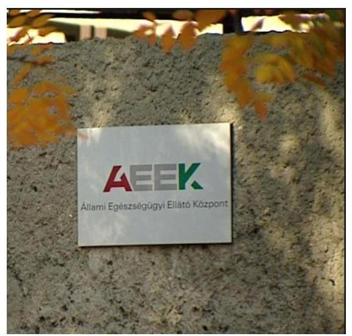

Az Állami Egészségügyi Ellátó Központ a 27/2015. (II. 25.) Korm. rendelet ${ }^{2}$ alapján 2015. március 1-től az egészségügyért felelős miniszter által az EMMI ${ }^{3}$ útján irányított, középirányítói jogosítványokkal felhatalmazott, országos illetékességű, központi hivatalként működő, gazdasági szervezettel rendelkező központi költségvetési szerv.

Az ÁEEK közfeladatként egészségügyi fejlesztési, elemzési és értékelési, kutatási, szakértői és szakmai támogatási feladatokat lát el, adatgyűjtést végez, egészségügyi informatikai feladatokat lát el. Az ÁEEK jogszabályban meghatározott módon gyakorolja a MÖKtv. ${ }^{4}$ és a Ttv. ${ }^{5}$ alapján az állam fenntartásába, illetve tulajdonába került egészségügyi intézmények, továbbá az országos gyógyintézetek, és az Országos Vérellátó Szolgálat felett az egyes fenntartói jogokat, a hatáskörébe tartozó költségvetési szervek tekintetében a középirányítói jogokat, a gazdasági társaságok tekintetében a tagsági jogokat, valamint az alapítványok esetében az alapítói jogokat, az Eftv. ${ }^{6}$ alapján a magyar államot megillető tulajdonosi jogokat. Az integrált elődintézmények általános jogutódaként azok korábbi tevékenységeit is ellátja, továbbá a 46/2012. (III.28.) Korm. rendelet ${ }^{7}$ alapján központi beszerzőként jár el.

Az ÁEEK jogelődje az 59/2011. (IV. 12.) Korm. rendelet ${ }^{8}$ alapján létrejött Gyógyszerészeti és Egészségügyi Minőség- és Szervezetfejlesztési Intézet volt. A 27/2015. (II. 25.) Korm. rendelet alapján az Országos Gyógyszerészeti Intézet kiválása és egyes feladatok elvonása mellett névváltozással a GYEMSZI ${ }^{9}$ elnevezése ÁEEK-re változott.

A 378/2016. (XII. 2.) Korm. rendelet ${ }^{10}$ alapján az ÁEEK 2017. január 1-től az Egészségügyi Készletgazdálkodási Intézet és Egészségügyi Nyilvántartási és Képzési Központ jogutóda. Az Országos Tisztifőorvosi Hivatal praxis programokkal kapcsolatos feladatai tekintetében, a Nemzeti Egészségfejlesztési Intézet módszertani feladatai tekintetében 2017. április 1. napjától lett jogutód az ÁEEK.

Az ellenőrzött időszakban az ÁEEK-et főigazgató ${ }_{1,2}{ }^{11}$ vezette, akinek személyében 2015. évben következett be változás. A gazdasági vezető ${ }_{1-3}{ }^{12}$ személye 2015-ben és 2017-ben változott.

Az ÁEEK éves költségvetési beszámolói szerint a teljesített összes bevétele a 2015. december 31-i 49452 M Ft-ról 2017. év végére 90671 M Ft-ra nőtt, a teljesített összes kiadása a 2015. december 31-i 47234 M Ft-ról 2017. december 31-re 90671 M Ft-ra csökkent.

Az intézmény vagyona a 2015. évi 46852 M Ft-ról 2017. évre 110321 M Ft-ra nőtt.

Az ÁEEK engedélyezett létszáma 2015-ben 3602 fő, 2016-ban 378 fő, 2017-ben 975 fő volt.

Az ÁEEK vagyonkezelt vagyona tekintetében a tulajdonosi jogok gyakorlója az MNV Zrt. ${ }^{13}$ volt.

---

# AZ ELLENŐRZÉS HÁTTERE, INDOKOLTSÁGA 

Az államháztartás központi alrendszerének közpénz felhasználása, az intézmények által ellátott közfeladatok sokrétűsége, valamint a feladatellátásához rendelt vagyon nagyságrendje indokolja, hogy az ÁSZ ellenőrzéseket folytasson a pénzügyi és vagyongazdálkodás területén.

Az államháztartás központi alrendszerébe tartozó szervezet vagyona a nemzeti vagyon része és az Alaptörvény is rögzíti, hogy a vagyonnal való gazdálkodás célja a közérdek szolgálata. Az ÁSZ ellenőrzi az éves költségvetési törvény végrehajtását, az ellenőrzés során feltárt kockázatok és a terület folyamatos kockázatelemzésével beazonosított kockázatok kezelése érdekében ráépülő ellenőrzésekkel ellenőrzi a költségvetési szervek gazdálkodását, működését, hogy az ellenőrzések megállapításaival támogassa az ellenőrzött szervezetek szabályszerű gazdálkodását, javaslataival elősegítse az Alaptörvényben megfogalmazott alapvetések érvényesülését a mindennapi életben a szervezetek szintjén.

A belső kontrollrendszer kialakítása és működtetése nélkül nem valósítható meg a közpénzek, a közvagyon átlátható, szabályos, gazdaságos, hatékony és eredményes felhasználása. A belső kontrollrendszer azt a célt szolgálja, hogy a költségvetési szervek működésük és gazdálkodásuk során a tevékenységeket szabályszerűen hajtsák végre, teljesítsék elszámolási kötelezettségeiket és megvédjék az erőforrásokat a veszteségektől, a károktól és a nem rendeltetésszerű használattól. A belső kontrollrendszer magában foglalja mindazon elveket, eljárásokat és belső szabályzatokat, melyek biztosítják, hogy a költségvetési szerv valamennyi tevékenysége és célja összhangban legyen a szabályszerűséggel, szabályozottsággal, valamint a gazdaságosság, hatékonyság és eredményesség követelményeivel, az eszközökkel és forrásokkal való gazdálkodásban ne kerüljön sor pazarlásra, visszaélésre, rendeltetésellenes felhasználásra. Megfelelő, pontos és naprakész információk álljanak rendelkezésre a költségvetési szerv működésével kapcsolatosan, és a belső kontrollrendszer harmonizációjára, összehangolására vonatkozó jogszabályok végrehajtásra kerüljenek. Az integritás kontrollok kiépítése, erősítése a szervezet korrupciós kockázatainak kezelését szolgálja. A teljesítménykövetelmények meghatározása és működtetése megalapozhatja a központi költségvetési szervnél a teljesítményellenőrzés lefolytatását.

Az elvégzett ellenőrzések során az ÁSZ „jó gyakorlatokat" is azonosíthat, melyeket tanácsadó funkciója keretében szélesebb körben is megismertethet az érintettekkel, ezáltal is hozzájárulva a költségvetési rendszer szabályozott, átlátható, kiegyensúlyozott és fenntartható működéséhez.

---

# A JELENTÉS LÉNYEGES KÉRDÉSKÖREI 

1. Az irányító szerv ÁEEK-re vonatkozó feladatellátása szabályszerű volt-e?
2. A belső kontrollrendszer kialakítása és működtetése biztosította-e a közpénzekkel és a nemzeti vagyonnal történő szabályszerű gazdálkodást?
3. Az ÁEEK pénzügyi gazdálkodása szabályszerű volt-e?
4. Az ÁEEK vagyongazdálkodása szabályszerű volt-e?
5. Az ÁEEK-nál alakítottak-e ki a teljesítmény mérésére alkalmas követelményeket?

---

# AZ ELLENŐRZÉS HATÓKÖRE ÉS MÓDSZEREI 

## Az ellenőrzés típusa

Megfelelőségi ellenőrzés.

## Az ellenőrzött időszak

2015. március 1. - 2016. december 31. az irányító szervi feladatellátás, a pénzügyi gazdálkodás, az ÁEEK szervezeti átalakításának lebonyolítása tekintetében. 2015. március 1. - 2017. december 31., illetve az éves beszámoló jóváhagyásáig tartó időszak (2018. június 30.) az ÁEEK belső kontrollrendszere, a vagyongazdálkodás tekintetében, továbbá a 2017. év az integritás kontrollrendszer vonatkozásában.

## Az ellenőrzés tárgya

A 2015. március 1. - 2016. december 31. közötti időszakra terjedően az ÁEEK-re vonatkozó irányító szervi feladatok ellátása, a pénzügyi gazdálkodás, az átszervezések lebonyolítása. A 2015. március 1. - 2017. december 31. közötti időszakban az ÁEEK belső kontrollrendszerének kialakítása és működtetése, valamint vagyongazdálkodása. 2017. évre vonatkozóan az ÁEEK-nél az integritáskontrollok kiépítettsége, az integritás szemlélet érvényesülése, valamint a teljesítményellenőrzés feltételeinek rendelkezésre állása.

A vagyongazdálkodás ellenőrzésének keretében az ÁSZ ellenőrizte a vagyongazdálkodás feltételeinek kialakítását, annak szabályszerűségét, az elszámoltathatóság biztosítását a szabályozás szintjén. A vagyonváltozást eredményező döntéseket, a vagyonban bekövetkezett változások végrehajtását, nyilvántartásba vételének, elszámolásának szabályszerűségét. A könyveiben, mérlegében az állami vagyon kimutatásának szabályszerűségét, ennek keretében az állami vagyonnal történő rendelkezést, a vagyonmozgásokat, a vagyon nyilvántartásba vételét, értékelését és a mérleg alátámasztás szabályszerűségét.

Az ellenőrzés kiterjedt minden olyan körülményre és adatra, amely az ÁSZ jogszabályban meghatározott feladatainak teljesítéséhez, valamint a program végrehajtása folyamán felmerült újabb összefüggések feltárásához szükséges volt.

## Az ellenőrzött szervezet

- Állami Egészségügyi Ellátó Központ
- Emberi Erőforrások Minisztériuma mint irányító szerv.

---

# Az ellenőrzés jogalapja 

Az ellenőrzés jogszabályi alapját az ÁSZ tv. ${ }^{14} 1 . \S$ (3) bekezdés, 5. § (2)-(4) és (6) bekezdései, valamint az Áht. ${ }^{15} 61 . \S$ (2) bekezdésének előírásai képezték.

## Az ellenőrzés módszerei

Az ellenőrzésre a szakmai program szempontjai, az ellenőrzött időszakban hatályos jogszabályok, az ellenőrzés szakmai szabályai, a jelen ellenőrzésre irányadó ÁSZ módszertanok figyelembevételével került sor.

Az ellenőrzés ideje alatt az ellenőrzött szervezetekkel a kapcsolattartást az ÁSZ SZMSZ ${ }^{16}$-ének vonatkozó előírásai alapján biztosította az ÁSZ.

Az ellenőrzési kérdések megválaszolásához szükséges bizonyítékok megszerzése az ellenőrzött szervezetek által rendelkezésre bocsátott dokumentumokra, adatokra alapozva megfigyelés, szemle (szemrevételezés), kérdésfeltevés (információkérés), mintavételezés,
 valamint elemző eljárás útján történt.

Az ellenőrzési bizonyítékként felhasználható adatforrások közé tartoztak egyrészt a szakmai program részletes szempontjainál felsorolt adatforrások, másrészt minden egyéb - az ellenőrzés folyamán feltárt, az ellenőrzés szempontjából információt tartalmazó - dokumentum.

Az ellenőrzés lefolytatásához az ellenőrzött szervezetek a tanúsítványok kitöltésével, valamint az ÁSZ által kért dokumentumok megküldésével szolgáltattak adatokat, amelyek valódiságát és teljes körűségét az ellenőrzött szervezet vezetője által tett teljességi és hitelességi nyilatkozat igazolta. Az így rendelkezésre bocsátott adatok, információk kontrollja az ellenőrzés keretében történt.

A központi költségvetési szerv belső kontrollrendszere egyes pilléreinek kialakítására és működtetésére vonatkozó értékelés:
$\longrightarrow$ „szabályszerű", amennyiben az értékelt területen az elért „igen" válaszok százalékban kifejezett, egész számra kerekített aránya legalább $85 \%$,
$\longrightarrow$ „nem szabályszerű", ha nem érte el a 85%-ot,
Az ÁEEK belső kontrollrendszerének összesített értékelése az egyes részterületek esetében kapott megfelelőségi arányok számtani átlaga alapján történt és megegyezett a pillérenként (kontrollterületenként) alkalmazott százalékos értékelésekkel, a következő eltérésekkel: a kontrollrendszer egésze esetében a „szabályszerű" értékelésnek a százalékos értéken felül további feltétele volt, hogy egyik kontrollterület sem kaphatott „nem szabályszerű" értékelést.

A kiadások ellenőrzésére a 2015-2017. évek vonatkozásában, a bevételek ellenőrzésére a 2015-2016. évek vonatkozásában került sor. A kiadások (külső személyi juttatások, felhalmozási kiadások, dologi kiadások) és bevételek (értékesítésből és bérbeadásból származó bevételek) esetében az ellenőrzés azokra a legnagyobb értékű tételekre - a lényeges sokaságra - terjedt ki, melyek összértéke eléri a teljes sokaság összértékének 50%-át.

---

A 2015. évi kiadások elszámolásának szabályszerűségét a lényeges sokaságból véletlen mintavételi eljárással kiválasztott tételek alapján ellenőriztük. A 2016-2017. évi kiadások és a 2015-2016. évi bevételek esetében a lényeges sokaságot tételesen ellenőriztük. A 2017. évben az ellenőrzött szervezet értékesítésből származó felhalmozási bevétellel nem rendelkezett.

A 2017. évi beruházások, felújítások végrehajtásának, valamint a feladatellátást szolgáló állami vagyontárgyak használatának és év végi értékelésének szabályszerűségét a teljes sokaságból véletlen mintavétellel kiválasztott tételek alapján ellenőriztük.

A 2017. évi pénzmozgáshoz nem kapcsolódó vagyonváltozások szabályszerűségének esetében tételes ellenőrzésre került sor.

A mintavétellel ellenőrzött területek esetében minden egyes tétel vonatkozásában a felhasználás, elszámolás és értékelés szabályszerűségére vonatkozó kérdéseket tettünk fel. Szabályszerűnek értékeltünk egy ellenőrzött területet, amennyiben 95%-os bizonyossággal az ellenőrzött sokaságban az átlagos hibaarány legfeljebb 10%, nem szabályszerűnek, amennyiben 10%-nál magasabb arányt képviselt.

Abban az esetben, ha az ellenőrzött sokaság tekintetében a 10%-os hibaarányhoz való viszony megítélésének megbízhatósága nem érte el a 95%-ot, annak elérése érdekében értékelésünket további szempontokkal egészítettük ki, és figyelembe vettük a feltárt hibák értékét.

Az ellenőrzés ideje alatt az ellenőrzött szervezettel történő kapcsolattartásra az ÁSZ SZMSZ-ének vonatkozó előírásai alapján került sor.

---

# 1. Az irányító szerv ÁEEK-re vonatkozó feladatellátása szabályszerű volt-e? 

Összegző megállapítás

Az EMMI irányító szervi feladatellátása a munkáltatói jogkörgyakorlás hiányosságai miatt nem volt szabályszerű a 2015-2016. években.

Az EMMI szabályszerűen gyakorolta alapítói jogait, az Ávr. ${ }^{17}$ előírásainak megfelelően adta ki az ÁEEK Alapító Okiratát; ${ }^{18}$, amely tartalmazta a jogszabályban meghatározott tartalmi elemeket. Az egyéb irányítási, felügyeleti és ellenőrzési jogkörök gyakorlása 2015-ben nem volt szabályszerű. Az EMMI által kiadott, 2016. március 23-ig hatályos SZMSZ; ${ }^{19}$ 2015. március 1-től nem felelt meg az Ávr. 13. § (1) bekezdésében foglaltaknak, mert nem tartalmazta a 27/2015. (II. 25.) Korm. rendelet alapján az irányított szerv nevében, szervezetében, feladatkörében bekövetkezett változásokat, azokat a gazdálkodó szervezeteket, amelyek tekintetében az irányított szerv alapítói, tulajdonosi jogokat gyakorolt.

Az EMMI az Ávr. és az Áhsz. ${ }^{20}$ előírásainak megfelelően határozta meg az elemi költségvetés tervezési követelményeit, majd hagyta jóvá az ÁEEK elemi költségvetéseit, éves költségvetési beszámolóit, előirányzat-maradványait.

Munkáltatói jogait nem szabályszerűen gyakorolta az EMMI. Az EMMI a 10/2013. (I. 21.) Korm. rend. ${ }^{21}$ 6. § (1) bekezdése a) pontjában foglaltak ellenére nem határozott meg az ÁEEK főigazgatója ${ }_{1,2}$ részére egyéni teljesítménykövetelményeket.

## 2. A belső kontrollrendszer kialakítása és működtetése biztosította-e a közpénzekkel és a nemzeti vagyonnal történő szabályszerű gazdálkodást?

Összegző megállapítás

Az ÁEEK belső kontrollrendszerének kialakítása és működtetése 2015-2017-ben nem volt szabályszerű, nem biztosította a közpénzekkel és a nemzeti vagyonnal történő szabályszerű gazdálkodást.

A kontrollkörnyezet kialakítása 2015-2016-ban nem volt szabályszerű, mert

- Az ÁEEK gazdasági szervezetére vonatkozó szabályokat és a gazdálkodással kapcsolatos feladatokat tartalmazó Ügyrendje; ${ }^{22}$ 2015. március 1-től nem állt összhangban az Ávr. 13. § (5) bekezdésében

---

foglaltakkal, mert nem tartalmazta az ÁEEK létrejöttét követő szervezeti változásokat.
Az Eszközök és források értékelési szabályzata ${ }_{1}{ }^{23}$ az Áhsz. 50. § (2) bekezdés b)-d) pontjaiban foglalt előírások ellenére nem tartalmazta követeléstípusonként a kis összegű követelések év végi meghatározásának elveit, dokumentálásának szabályait, az egyszerűsített értékelés alá vont követelések besorolásának elveit, dokumentálásának szabályait, valamint a tulajdonosnak, tulajdonosi joggyakorló szervezetnek a vagyonkezelésbe adott eszközök vagyonértékelése során alkalmazott eljárás felelőseit.
$\longrightarrow$ Az ÁEEK Számlarendje ${ }_{1}{ }^{24}$ nem volt összhangban a Számv. tv. 161. § (2) bekezdés a)-c) pontjaiban foglaltakkal, mert az nem tartalmazta minden alkalmazásra kijelölt számla jelét és megnevezését, a könyvviteli számla értéke növekedésének, csökkenésének jogcímeit, a főkönyvi számla és az analitikus nyilvántartás kapcsolatát. A Számlarend ${ }_{1}$ nem tartalmazta továbbá az Áhsz. 51. § (3) bekezdésében foglalt előírások ellenére a részletező nyilvántartások vezetésének módját, azoknak a kapcsolódó könyvviteli és nyilvántartási számlákkal való egyeztetését, annak dokumentálását, valamint a részletező nyilvántartások és az egységes rovatrend rovataihoz kapcsolódóan vezetett nyilvántartási számlák adataiból a pénzügyi könyveléshez készült összesítő bizonylatok (feladások) elkészítésének rendjét, az összesítő bizonylatok (feladások) tartalmi és formai követelményeit.
2015-2017-ben az ÁEEK a Bkr. 6. § (3) bekezdésében foglaltak ellenére nem rendelkezett a szervezet egészére vonatkozó működési folyamatokat lefedő ellenőrzési nyomvonallal, továbbá az ÁEEK főigazgatója ${ }_{1,2}$ a Bkr. 6. § (1) bekezdés c) pontjában foglaltak ellenére nem határozta meg az etikai elvárásokat a szervezet minden szintjén.

A kontrollkörnyezet kialakítása 2017-ben szabályszerű volt.
Az ellenőrzött években az ÁEEK a gazdálkodás részletes rendjét az Ávr. előírásaival összhangban álló Kötelezettségvállalási szabályzatban ${ }_{1-3}{ }^{25}$ határozta meg. Az ÁEEK rendelkezett a Kttv. ${ }^{26}$ előírásai alapján Közszolgálati szabályzattal ${ }_{1-2}{ }^{27}$, valamint a Vnytv. ${ }^{28}$-ben foglaltaknak megfelelően az SZMSZ-ben ${ }_{1-4}$ meghatározták a vagyonnyilatkozat-tételi kötelezettséggel járó munkaköröket.

Az ÁEEK a Számv. tv. ${ }^{29}$ előírásaival összhangban lévő Számviteli politikával ${ }_{1-3}{ }^{30}$, Leltározási és leltárkészítési szabályzattal ${ }_{1-2}{ }^{31}$, Pénzkezelési szabályzattal ${ }_{1,2}{ }^{32}$, Bizonylati renddel ${ }_{1-3}{ }^{33}$ és az önköltségszámítás rendjére vonatkozó szabályzattal ${ }_{1,2}{ }^{34}$ rendelkezett. A 2017-ben kiadott Eszközök és források értékelési szabályzata ${ }_{2}$ és Számlarend ${ }_{2}$ megfelelt a Számv. tv. és az Áhsz. előírásainak.

Az ÁEEK rendelkezett a közbeszerzésekre vonatkozó, a Kbt. ${ }_{1,2}{ }^{35}$ előírásai szerinti szabályozással ${ }_{1-5}{ }^{36}$. Az Ávr. előírásaival összhangban a Kbt. ${ }_{1,2}$ hatálya alá nem tartozó beszerzésekre vonatkozó eljárásrendet a beszerzési szabályzatban ${ }_{1,2}{ }^{37}$ határozta meg.

A kockázatkezelési rendszer, illetve 2016. október 1-jétől az integrált kockázatkezelési rendszer kialakítása és működtetése nem volt szabályszerű.

---

Az ÁEEK 2016. október 1-től a Bkr. 6. § (4) bekezdésében foglalt előírás ellenére nem rendelkezett integrált kockázatkezelési eljárásrenddel.

Az ÁEEK 2015-től a kockázatkezelési rendszert, majd 2016. október 1-től az integrált kockázatkezelési rendszert nem működtette, mert a Bkr. 7. § (2) bekezdésében előírtak ellenére az ÁEEK nem mérte fel, nem állapította meg és nem azonosította a szervezet tevékenységében rejlő és szervezeti célokkal összefüggő kockázatokat. Az ÁEEK csak 2017-től végezte el a kockázatok meghatározott kritériumok szerinti értékelését, határozta meg az egyes kockázatokkal kapcsolatos intézkedéseket és azok teljesítése folyamatos nyomon követését.

Az ÁEEK főigazgatója ${ }_{2}$ a Bkr. 7. § (4) bekezdésében foglaltak ellenére 2016. október 1-től 2017. január 31-ig nem jelölte ki a szervezet integrált kockázatkezelési rendszer koordinálásának felelősét.

Az ÁEEK 2016-tól rendelkezett a szervezet működésével összefüggő integritási és korrupciós kockázatokra vonatkozó bejelentések fogadására és kivizsgálására vonatkozó eljárásrenddel ${ }^{38}$.

A kontrolltevékenységek gyakorlása nem volt szabályszerű 2015-2017-ben.

Az ÁEEK az Ávr. 60. § (3) bekezdésében foglaltak ellenére nem vezetett naprakész nyilvántartást a kötelezettségvállalásra, pénzügyi ellenjegyzésre, teljesítés igazolására, érvényesítésre, utalványozásra jogosult személyekről és aláírás-mintájukról.

A kiadások teljesítéséhez kapcsolódó kontrolltevékenységek gyakorlása nem volt szabályszerű, mert
$\longrightarrow$ a kiadások teljesítésére az Áht. 37. § (1) bekezdésében és az Ávr. 52. § (1) bekezdés a) pontjában foglaltak ellenére az ÁEEK vezetője vagy az általa írásban felhatalmazott személy kötelezettségvállalása nélkül került sor,
$\longrightarrow$ az Áht. 38. § (1) bekezdésében és az Ávr. 57. § (4) bekezdésében foglaltak ellenére elmaradt a teljesítésigazolás, mert azt nem végezték el, vagy a teljesítést nem az arra jogosult, kijelöléssel rendelkező személy írta alá,
$\longrightarrow$ az Ávr. 57. § (3) bekezdésében foglaltak ellenére a teljesítést igazoló dokumentumon nem szerepelt a teljesítés dátuma, a teljesítés tényére történő utalás.

Az információs és kommunikációs folyamatok működtetése nem volt szabályszerű 2015-2017-ben.

Az ÁEEK nem tett eleget az Áhsz. 32. § (1) bekezdésében előírt, az éves költségvetési beszámolók adatainak a Kincstár által működtetett adatszolgáltatási rendszerbe történő feltöltési kötelezettségének.

Az ÁEEK az Info tv. ${ }^{39}$ 1. sz. II/1. és III/1. sz. melléklete szerinti közzétételi kötelezettségének nem tett eleget, mert honlapján nem tette nyilvánossá hatályos SZMSZ-ét ${ }_{1-4}$, Ügyrendjét ${ }_{1,2}$, Adatvédelmi szabályzatát, költségvetését, valamint előző évi költségvetési beszámolóját.

Az ÁEEK tevékenységének, a célok megvalósításának folyamatos és eseti nyomon követését biztosító rendszer kialakítása szabályszerű volt. A szervezet rendelkezésére álló források szabályszerű, gazdaságos, hatékony és eredményes felhasználása követelményeit, átláthatósága szabályait a

---

Bkr. előírásainak megfelelően az SZMSZ ${ }_{1-3}$, az Ügyrend ${ }_{1,2}$, a számviteli, a gazdálkodási és egyéb szabályzatok, valamint a számviteli és pénzügyi területen dolgozók munkaköri leírásai tartalmazták. Az ÁEEK vezetője a követelmények eseti és folyamatos nyomon követéséről éves beszámoltatással gondoskodott.

A belső ellenőrzés működtetése nem volt szabályszerű 2017-ben. A főigazgató a 2017. évi ellenőrzési tervet a Bkr. 32. § (2) bekezdés szerinti határidőre nem küldte meg az EMMI belső ellenőrzési vezetője részére. Az ÁEEK belső ellenőrzési vezetője 2017-ben nem vezette az elvégzett belső ellenőrzésekről a Bkr. 50. § (1)-(2) bekezdései szerinti nyilvántartást, továbbá a belső ellenőrzési jelentésekben tett megállapításokról, javaslatokról, az intézkedési tervekben meghatározott egyes feladatok végrehajtásáról a Bkr. 47. § (1) bekezdésében meghatározott nyilvántartást.

A belső kontrollrendszer minőségét 2015. december 1-től értékelő vezetői nyilatkozathoz az ÁEEK főigazgatója ${ }_{2}$ a Bkr. 11. § (4) bekezdésben foglaltak ellenére nem mellékelte az ÁEEK 2015-ben távozó vezetőjének az addig eltelt időszakot értékelő nyilatkozatát. Nyilatkozatát a főigazgató ${ }_{2}$ a Bkr. 11. § (2) bekezdése ellenére nem küldte meg az EMMI-nek. Az ÁEEK főigazgatója 2016-2017. években a Bkr. előírásainak eleget téve nyilatkozatban értékelte a szervezet belső kontrollrendszerének minőségét. Az ÁSZ ellenőrzése nem igazolta vissza a belső kontrollrendszer szabályszerű működését.

Az integritási kontrollok kiépítése
 és működtetése kockázatelemzés hiányában nem a kockázatokkal arányosan történt 2017-ben. Az ÁEEK nem végzett kockázatelemzéseket 2017-ben, az egyéb integritást erősítő kontrollokat csak alacsony szinten működtette.

# 3. Az ÁEEK pénzügyi gazdálkodása szabályszerű volt-e? 

## Összegző megállapítás

Az ÁEEK pénzügyi gazdálkodása 2015-2016-ban nem volt szabályszerű.

A bevételek elszámolása 2015-2016-ban a jogszabályi előírásokkal összhangban történt.

A kiadási előirányzatok felhasználása nem volt szabályszerű 2015-ben és 2016-ban a kontrolltevékenységek gyakorlásának hiányosságai miatt (lásd 2. pont).

A 2015-2016. évi kiadások esetében - az Ávr. 50. § (1a) bekezdésében foglaltak ellenére - a jogi személlyel, jogi személyiséggel nem rendelkező szervezettel kötött visszterhes szerződések nem tartalmazták a szervezet képviselőjének nyilatkozatát arra vonatkozóan, hogy átlátható szervezetnek minősül.

---

A 2015-2016. évi maradvány megállapítása nem volt szabályszerű. Az ÁEEK az Áhsz. 39. § (3) bekezdésében foglaltak ellenére a kötelezettségvállalással terhelt maradvány alátámasztásához nem vezette az Áhsz. 14. melléklet II. 4. pontja szerinti részletező nyilvántartást a kötelezettségvállalásokról, más fizetési kötelezettségekről.

# 4. Az ÁEEK vagyongazdálkodása szabályszerű volt-e? 

Összegző megállapítás

Az ÁEEK vagyongazdálkodása nem volt szabályszerű 2015-2017-ben.

Az ÁEEK vagyongazdálkodása az ellenőrzött időszakban nem volt szabályszerű.

Az ÁEEK 2015-2017-ben a Számv. tv. 69. § (1) bekezdésében, valamint az Áhsz. 22. § (1) bekezdésében foglaltak ellenére a mérleg tételeinek alátámasztásához nem állított össze leltárt. Az ÁEEK a Leltárkészítési és leltározási szabályzat $_{1}$ 2.3. a.) pontjában foglaltak ellenére a tárgyi eszközök évenkénti mennyiségi felvételezéssel történő leltározását 2015-2016-ban nem végezte el, illetve a Leltárkészítési és leltározási szabályzat $_{2}$ 20. II. pontjában foglaltak ellenére a tárgyi eszközök 2017-ben esedékes háromévenkénti mennyiségi felvételezéssel történő leltározását nem végezte el.

Az ÁEEK 2015-2016-ban a követelések értékvesztésének és visszaírásának elszámolását a Számv. tv. 165. § (1)-(2) bekezdésében foglaltak ellenére bizonylatokkal nem támasztotta alá.

2017-ben vagyontárgyak átszervezés miatti átvétele és nyilvántartásba vétele nem volt szabályszerű. Az ÁEEK az Egészségügyi Készletgazdálkodási Intézettől és az Egészségügyi Nyilvántartási és Képzési Központtól 2017. január 1-én átvett vagyon növekedést a Számv. tv. 165. § (1)-(2) bekezdésében foglaltak ellenére bizonylatokkal nem támasztotta alá.

Az ÁEEK 2017-ben az állami vagyon létrejöttét eredményező beszerzéseiről a tulajdonosi joggyakorló felé teljesítendő tájékoztatási kötelezettségének a Vtvr. $^{40}$ 2. § (3) bekezdésében foglaltak ellenére nem tett eleget, a vagyonelemek állam javára történő megszerzéséhez a Vtvr. 2. § (1) bekezdésében foglaltak ellenére nem kérte az MNV Zrt. előzetes egyetértését.

Az ÁEEK szervezeti átalakítására vonatkozó előírásokat 2015-ben az EMMI az Alapító Okirat $_{1}$ módosítására kiadott Módosító okirat $^{41}$ 14. pontjában határozta meg a 27/2015. (II. 25.) Korm. rendelet előírásaival összhangban. Az átalakítás lebonyolítása nem volt szabályszerű, mert az ÁEEK a Módosító okirat 14.3.1. pontjában meghatározott átadás-átvételi megállapodásokat nem készítette el, ezáltal nem biztosította az elszámoltathatóságot, az átadott vagyon megóvását. Az ÁEEK megsértette a Számv. tv. 165. § (1)-(2) bekezdésében foglaltakat, mert számviteli nyilvántartásaiban a szervezeti átalakulással járó vagyonváltozásokat nem támasztotta alá bizonylattal.

---

# 5. Az ÁEEK-nál alakítottak-e ki a teljesítmény mérésére alkalmas követelményeket? 

Összegző megállapítás Az ÁEEK nem alakított ki a szervezeti, vezetői teljesítmény mérésére alkalmas követelményeket.

Az ÁEEK-nál 2017-ben nem alakítottak ki a teljesítmény mérésére alkalmas követelményeket, nem képeztek teljesítmény-mutatókat, a követelmények teljesülésének mérését nem biztosították.

A főigazgató nem határozta meg a szervezeti célok elérését szolgáló feladatok, a vagyongazdálkodással kapcsolatos feladatok, tevékenységek mérését, monitoringját, illetve nem képezett és működtetett a megvalósulást mérő indikátorokat.

---

# KÖVETKEZTETÉSEK 

Az ÁSZ tv. 32. § (1) bekezdésében foglaltak értelmében az ÁSZ jelentés tartalmazza a feltárt tényeket, az ezeken alapuló megállapításokat, következtetéseket, amelyeknek a 24. § (1) bekezdés d) pontja szerint okszerűnek és megalapozottnak kell lenniük.

Az jelentésben foglalt megállapítás szerint az EMMI nem határozott meg az ÁEEK főigazgatója részére egyéni teljesítménykövetelményeket. Az EMMI a 15 napos észrevételezés során azt jelezte, hogy a kormányzati igazgatásról szóló 2018. évi CXXV. törvény 96. § (1) bekezdése alapján a kormánytisztviselő teljesítményértékelése - melynek részét képezi a teljesítménykövetelmények meghatározása - nem kötelező, a munkáltatói jogkör gyakorlójának a döntésén múlik. Ezért intézkedési kötelezettsége nincsen.

A központi költségvetés végrehajtásával szemben az Alaptörvény rögzíti, hogy azt törvényesen és célszerűen, a közpénzek eredményes kezelésével és az átláthatóság biztosításával kell végrehajtani. Az államháztartás egyensúlyának és a közpénzekkel való áttekinthető, hatékony, ellenőrizhető gazdálkodás garanciáinak megteremtése céljából megalkotott, az államháztartásról szóló 2011. évi CXCV. törvény (Áht.) szerint a költségvetési szerv vezetője felel a közfeladatok jogszabályban, alapító okiratban, belső szabályzatban foglaltaknak megfelelő ellátásáért, valamint a költségvetési szerv számára jogszabályban előírt kötelezettségek teljesítéséért. Az Alaptörvényben rögzített alapelveknek, követelményeknek megfelelő felelős gazdálkodás követelményeit a költségvetési szerv vezetője - a munkáltatói jogkör gyakorlója által meghatározott - teljesítménykövetelmények nélkül nem tudja teljesíteni.
A kormányzati szolgálati jogviszony tekintetében a kormányzati igazgatásról szóló 2018. évi CXXV. törvény (Kit.) 96. § (1) bekezdés rendelkezése szerint a kormánytisztviselő munkateljesítményének munkáltatói jogkör gyakorlója általi értékelése írásbeliséghez kötött.
Tekintve, hogy a teljesítményértékelés alapján az illetmény csökkenthető, illetve növelhető, teljesítmény elismerés fizethető, továbbá nem megfelelő munkavégzés jogcímmel a jogviszony felmenthető, ezért a teljesítmény értékelése - amelynek része az egyéni teljesítményértékelés meghatározása - a továbbiakban is törvényi előírás. Mindezek alapján a költségvetési szerv vezetője részére elengedhetetlen a vezetői teljesítménykövetelmények meghatározása. Az munkáltatói jogkör gyakorlója a teljesítménykövetelmények meghatározásának hiányával hozzájárul a szervezet vezetőjének a közpénzekkel, közvagyonnal való nem megfelelő gazdálkodásához.

---

# JAVASLATOK 

Az ÁSZ tv. 33. § (1) bekezdésében foglaltak értelmében az ellenőrzött szervezet vezetője köteles a jelentésben foglalt megállapításokhoz kapcsolódó intézkedési tervet összeállítani és azt a jelentés kézhezvételétől számított 30 napon belül az ÁSZ részére megküldeni. Amennyiben az ellenőrzött szervezet vezetője nem küldi meg határidőben az intézkedési tervet, vagy továbbra sem elfogadható intézkedési tervet küld, az Állami Számvevőszék elnöke az ÁSZ tv. 33. § (3) bekezdése a) és b) pontjaiban foglaltakat érvényesítheti.

## Az Állami Egészségügyi Ellátó Központ főigazgatójának

1. Intézkedjen a Bkr. előírásai alapján a szervezet működési folyamatainak leírását tartalmazó ellenőrzési nyomvonalak kialakítására.
(2. sz. megállapítás 2. bekezdése alapján)
2. Gondoskodjon a Bkr. előírásainak megfelelően az etikai elvárások meghatározásáról a szervezet minden szintjén.
(2. sz. megállapítás 2. bekezdése alapján)
3. Intézkedjen a Bkr. előírásainak megfelelő integrált kockázatkezelés eljárásrendjének szabályozására.
(2. sz. megállapítás 8. bekezdése alapján)
4. Intézkedjen a gazdálkodási jogkörök gyakorlására jogosult személyek és aláírás-mintájuk Ávr. szerinti naprakész nyilvántartására.
(2. sz. megállapítás 13. bekezdése alapján)
5. Intézkedjen a kötelezettségvállalások és teljesítésigazolások jogszabályi előírásoknak megfelelő végrehajtására.
(2. sz. megállapítás 14. bekezdése alapján)
6. Intézkedjen az éves költségvetési beszámoló adatai Kincstár által működtetett elektronikus adatszolgáltató rendszerbe az Áhsz. szerinti határidőben történő feltöltésére.
(2. sz. megállapítás 16. bekezdése alapján)
7. Intézkedjen a Bkr. előírásainak megfelelő belső ellenőrzés működtetéséről.
(2. sz. megállapítás 19. bekezdése alapján)

---

8. Intézkedjen, hogy a jogi személlyel, jogi személyiséggel nem rendelkező szervezettel kötött visszterhes szerződések tartalmazzák az Ávr.-ben előírtak szerint a szervezet képviselőjének nyilatkozatát arra vonatkozóan, hogy átlátható szervezetnek minősülnek.
(3. sz. megállapítás 3. bekezdése alapján)
9. Intézkedjen a kötelezettségvállalások, más fizetési kötelezettségek Áhsz. szerinti tartalmú nyilvántartás vezetésére.
(3. sz. megállapítás 4. bekezdése alapján)
10. Intézkedjen a mérleg tételeinek alátámasztásához a Számv. tv. által előírt leltár összeállítására.
(4. sz. megállapítás 2. bekezdés 1. mondata alapján)
11. Intézkedjen a Vtvr. előírása alapján a tulajdonosi joggyakorló felé teljesítendő tájékoztatási kötelezettség megtételére, valamint a vagyonelem állam javára történő megszerzéséhez a tulajdonosi joggyakorló előzetes egyetértésének megkérésére.
(4. sz. megállapítás 5. bekezdés alapján)
12. Intézkedjen, hogy a Számv. tv. előírásainak megfelelően számviteli (könyvviteli) nyilvántartásokba csak szabályszerűen kiállított bizonylat alapján jegyezzenek be adatokat.
(4. sz. megállapítás 4. bekezdése utolsó mondata alapján)

---

.

---

# MELLÉKLETEK 

- I. SZ. MELLÉKLET: ÉRTELMEZŐ SZÓTÁR
állami vagyon
állami vagyonnak minősül:
a) az állam tulajdonában lévő dolog, valamint a dolog módjára hasznosítható természeti erő,
b) az a) pont hatálya alá nem tartozó mindazon vagyon, amely vonatkozásában törvény az állam kizárólagos tulajdonjogát nevesíti,
c) az állam tulajdonában lévő tagsági jogviszonyt megtestesítő értékpapír, illetve az államot megillető egyéb társasági részesedés,
d) az államot megillető olyan immateriális, vagyoni értékkel rendelkező jogosultság, amelyet jogszabály vagyoni értékű jogként nevesít. (Forrás: Vtv. 1. § (2) bekezdése)
állami vagyon használója Az a természetes vagy jogi személy, jogi személyiséggel nem rendelkező szervezet, aki, vagy amely törvény vagy szerződés alapján, bármely jogcímen (bérlet, haszonbérlet, használat stb.) állami vagyont birtokol, használ, szedi annak hasznait, hasznosít, ide nem értve a haszonélvezőt, a vagyonkezelőt és a tulajdonosi jogok gyakorlóját. (Forrás: Vtvr. 1. § (7) bekezdés a) pontja)
állami vagyon hasznosítása Az állami vagyont az MNV Zrt. maga kezeli, vagy szerződés - így különösen bérlet, haszonbérlet, megbízás - alapján központi költségvetési szervnek, természetes vagy jogi személynek, vagy jogi személyiséggel nem rendelkező gazdálkodó szervezetnek hasznosításra átengedi.
(Forrás: Vtv. 23. § (1) bekezdése, hatályos 2012. január 1-jétől)
Az állami vagyonnal a tulajdonosi joggyakorló maga gazdálkodik, vagy szerződés - így különösen bérlet, haszonbérlet, megbízás - alapján hasznosításra átengedi, illetőleg vagyonkezelésbe, haszonélvezetbe adja. (Forrás: Vtv. 23. § (1) bekezdése, hatályos 2013. június 28-ától)
az állami vagyont az MNV Zrt. maga kezeli, vagy szerződés - így különösen bérlet, haszonbérlet, megbízás - alapján központi költségvetési szervnek, természetes vagy jogi személynek, vagy jogi személyiséggel nem rendelkező gazdálkodó szervezetnek hasznosításra átengedi." Az állami vagyonra vonatkozóan az MNV Zrt. kizárólag az Nvtv. $^{42}$-ben meghatározott személyekkel köthet vagyonkezelési szerződést. (Forrás: Vtv. 27. § (1) bekezdése, hatályos 2012. január 1-jétől)
belső ellenőrzés
belső kontrollrendszer
belső kontrollrendszer területei

Független, tárgyilagos bizonyosságot adó és tanácsadó tevékenység, amelynek célja, hogy az ellenőrzött szervezet működését fejlessze és eredményességét növelje, az ellenőrzött szervezet céljai elérése érdekében rendszerszemléletű megközelítéssel és módszeresen értékeli, illetve fejleszti az ellenőrzött szervezet irányítási és belső kontrollrendszerének hatékonyságát. (Forrás: Bkr. 2. § b) pontja)
A belső kontrollrendszer a kockázatok kezelése és tárgyilagos bizonyosság megszerzése érdekében kialakított folyamatrendszer, amely azt a célt szolgálja, hogy a működés és gazdálkodás során a tevékenységeket szabályszerűen, gazdaságosan, hatékonyan, eredményesen hajtsák végre, az elszámolási kötelezettségeket teljesítsék, megvédjék az erőforrásokat a veszteségektől, károktól és nem rendeltetésszerű használattól. (Forrás: Áht. 69. § (1) bekezdése)
A kontrollkörnyezet, a kockázatkezelési rendszer, a kontrolltevékenységek, az információs és kommunikációs rendszer, valamint a nyomon követési (monitoring) rendszer. (Forrás: Bkr. 3. §-a)

---

információs és kommunikációs rendszer
integritás
integrált kockázatkezelési rendszer
irányító szerv/felügyeleti szerv
kockázat
kockázatkezelési rendszer
kontrollkörnyezet
kontrolltevékenységek
közfeladat
maradvány
nyomon követési rendszer (monitoring)

A költségvetési szerv vezetője által kialakított és működtetett olyan rendszer, mely biztosítja, hogy a megfelelő információk a megfelelő időben eljutnak az illetékes szervezethez, szervezeti egységhez, illetve személyhez. (Forrás: Bkr. 9. § (1) bekezdés)
Az integritás - egyik gyakran használt jelentése szerint - az elvek, értékek, cselekvések, módszerek, intézkedések konzisztenciáját jelenti, vagyis olyan magatartásmódot, amely meghatározott értékeknek megfelel. Integritás-irányítási rendszer bevezetése a szervezetben a szervezethez rendelt közfeladatok integritás szempontú ellátását, az érték alapú működéssel (integritással) összefüggő szervezeti követelmények következetes érvényesítését jelenti. (Forrás: Nemzetgazdasági Minisztérium:
 Államháztartási Belső Kontroll Standardok és Gyakorlati Útmutató 1.6. Etikai értékek és integritás 46. oldal, 2017. szeptember)
Olyan folyamatalapú kockázatkezelési rendszer, amely a szervezet minden tevékenységére kiterjed, egységes módszertan és eljárások alkalmazásával, a szervezet célkitűzéseinek és értékeinek figyelembevételével biztosítja a szervezet kockázatainak teljes körű azonosítását, azok meghatározott kritériumok szerinti értékelését, valamint a kockázatok kezelésére vonatkozó intézkedési terv elkészítését és az abban foglaltak nyomon követését. (Forrás: Bkr. 2. § m) pontja, 2016. október 1-jétől)
A költségvetési szerv tekintetében az Áht.-ban meghatározott irányítási hatáskört gyakorló szerv. (Forrás: Áht. 1. § 9. pontja)
A kockázat annak a valószínűségét jelenti, hogy egy vagy több esemény vagy intézkedés nem kívánt módon befolyásolja a rendszer működését, céljainak megvalósulását. (Forrás: Javaslatok a korrupciós kockázatok kezelésére - Kockázatkezelési és ellenőrzési módszertan 35. oldal, ÁSZ)
Olyan irányítási eszközök és módszerek összessége, melynek elemei a szervezeti célok elérését veszélyeztető tényezők (kockázatok) azonosítása, elemzése, csoportosítása, nyomon követése, valamint szükség esetén a kockázati kitettség mérséklése. (Forrás: Bkr. 2. § m) pontja)
A költségvetési szerv vezetője által kialakított olyan elvek, eljárások, belső szabályzatok összessége, amelyben világos a szervezeti struktúra, a folyamatok átláthatók, egyértelműek a felelősségi, hatásköri viszonyok és feladatok, meghatározottak, ismertek és elfogadottak az etikai elvárások a szervezet minden szintjén, átlátható a humán-erőforrás-kezelés. (Forrás: Bkr. 6. § (1) bekezdés)
A költségvetési szerv vezetője által a szervezeten belül kialakított (kontroll) tevékenységek, melyek biztosítják a kockázatok kezelését, hozzájárulnak a szervezet céljainak eléréséhez és erősítik a szervezet integritását. (Forrás: Bkr. 8. § (1) bekezdés)
Jogszabályban meghatározott állami vagy önkormányzati feladat, amit az arra kötelezett közérdekből, a jogszabályban meghatározott követelményeknek és feltételeknek megfelelve végez, ideértve a lakosság közszolgáltatásokkal való ellátását, továbbá az állam nemzetközi szerződésekben vállalt kötelezettségeiből adódó közérdekű feladatokat, valamint e feladatok ellátásakor szükséges infrastruktúra biztosítását is. (Forrás: Nvtv. 3. § (1) bekezdés 7. pontja)
A költségvetési év során a bevételek és kiadások különbözete, amely az alaptevékenység bevételei és kiadásai tekintetében a költségvetési maradvány, a vállalkozási tevékenység bevételei és kiadásai tekintetében a vállalkozási maradvány. (Forrás: Áht. 1. § 17. pont)
A költségvetési szerv vezetője köteles kialakítani a szervezet tevékenységének a célok megvalósításának nyomon követését biztosító rendszert, amely az operatív tevékenységek keretében megvalósuló folyamatos és eseti nyomon követésből, valamint az operatív tevékenységektől függetlenül működő belső ellenőrzésből áll. (Forrás: Bkr. 10. §)

---

vagyongazdálkodás

A nemzeti vagyongazdálkodás feladata a nemzeti vagyon rendeltetésének megfelelő, az állam, az önkormányzat mindenkori teherbíró képességéhez igazodó, elsődlegesen a közfeladatok ellátásához és a mindenkori társadalmi szükségletek kielégítéséhez szükséges, egységes elveken alapuló, átlátható, hatékony és költségtakarékos működtetése, értékének megőrzése, állagának védelme, értéknövelő használata, hasznosítása, gyarapítása, továbbá az állam vagy a helyi önkormányzat feladatának ellátása szempontjából feleslegessé váló vagyontárgyak elidegenítése. (Forrás: Nvtv. 7. § (2) bekezdése)

---

.

---

# FÜGGELÉKEK 

- I. SZ. FÜGGELÉK A JELENTÉSHEZ

Az Állami Számvevőszék az ellenőrzések során feltárt tényekhez kapcsolódó további körülmények tisztázására eszközrendszerrel nem rendelkezik. Amennyiben az ellenőrzésen túlmutatóan indokoltnak látszik az ellenőrzés során feltárt körülmények további vizsgálata, az Állami Számvevőszék törvényi felhatalmazás alapján az ellenőrzés által feltárt körülményeket továbbítja a hatáskörrel rendelkező szervnek a szükséges intézkedések megtétele, eljárások lefolytatása érdekében.

1. A közalkalmazotti jogviszonnyal rendelkező szakdolgozók után felmerülő, a Magyar Egészségügyi Szakdolgozói Kamara által kiszámlázott tagdíj költségek Intézmény általi megtérítésére a 2016. évben 117,1 M Ft, illetve a 2017. évben 243,7 M Ft összegben került sor, annak ellenére, hogy a megállapodás a Magyar Egészségügyi Szakdolgozói Kamara részéről jóváhagyólag nem került aláírásra.
Ezzel megsértették az Áht. 37. § (1) bekezdésben foglalt előírásokat.
Az Intézménynél a szoros elszámoltatási kötelem nem érvényesült, a pénzátutalás célhoz kötött felhasználása nem igazolt. A közpénzzel való rendelkezés elszámoltathatósága nem biztosított.
2. Az Intézménynél teljesítés igazolás nélkül került kifizetésre 2015. évben 797,8 M Ft, illetve 2017. évben 222,1 M Ft.
Ezzel megsértették az Áht. 38. § (1) bekezdésben foglalt előírásokat.
További kifizetéseknél 2015. évben 4239,4 M Ft, 2017. évben 163,7 M Ft összegeket érintően a teljesítést nem az arra jogosult, kijelöléssel rendelkező személy írta alá.
Ezzel megsértették az Áht. 38. § (1) bekezdésben foglalt előírásokat.
A fenti szabálytalanságok miatt nem igazolt, hogy a kiadások az Intézmény feladatellátásához kapcsolódtak, annak érdekében merültek fel, valamint hogy a kifizetésekhez valós teljesítések köthetők.
3. Az Intézmény 2015-2017. évek költségvetési beszámolói mérlegtételeinek alátámasztására leltárt nem készített, amely tételesen, ellenőrizhető módon tartalmazza a mérleg fordulónapján meglévő eszközöket és forrásokat mennyiségben és értékben.
Ezzel megsértette az Áhsz. 5. § (1) bekezdés, az Áhsz. 22. § (1) bekezdés és a Számv. tv. 69. § (1) bekezdés előírásait.
Leltár hiányában nem igazolt, hogy a 2015, 2016, 2017. éves költségvetési beszámolókban szereplő mérlegtételek a valóságban is megtalálhatóak.

---

A gazdálkodási jogkörre vonatkozó szabályok megsértése, az érintett kifizetések nagyságrendje, az elszámoltatási kötelezettség nélküli pénzügyi teljesítés, valamint a több évet érintő leltárak hiánya, együttesen a vagyoni hátrány okozás gyanúját veti fel.
A fenti esetek körülményeinek felderítésére az Ügyészség rendelkezik hatáskörrel.

---

A jelentéstervezetet a Számvevőszék 15 napos észrevételezésre megküldte az ellenőrzött szervezetek vezetőinek az ÁSZ tv. 29. § (1) bekezdése előírásának megfelelően.

Az Állami Egészségügyi Ellátó Központ főigazgatója és az Emberi Erőforrások Minisztériuma egészségügyért felelős államtitkára a jelentéstervezet megállapításaira írásban észrevételt tett.
Az ÁSZ tv. 29. § (3) bekezdésével összhangban az ÁSZ a Függelékben feltünteti az ellenőrzés megállapításaival kapcsolatban tett, figyelembe nem vett észrevételeket, és megindokolja, hogy azokat miért nem fogadta el.

[^0]
[^0]:    * 29. § (1) Az Állami Számvevőszék az ellenőrzési megállapításait megküldi az ellenőrzött szervezet vezetőjének vagy az általa megbízott személynek, és annak, akinek személyes felelősségét állapította meg.
    (2) Az ellenőrzött szervezet vezetője és a felelősként megjelölt személy az ellenőrzés megállapításaira tizenöt napon belül írásban észrevételt tehet.
    (3) Az Állami Számvevőszék az észrevételre a beérkezésétől számított harminc napon belül írásban válaszol. A figyelembe nem vett észrevételeket köteles a jelentésben feltüntetni, és megindokolni, hogy azokat miért nem fogadta el.

---

# 2019 OKT 01 

## AEEK

Állami Egészségügyi Ellátó Központ

## Domokos László úr részére

elnök

## Állami Számvevőszék

## Budapest

Apáczai Csere János u. 10.
1052
Tárgy: Észrevétel jelentéstervezetre

## 1125 Budapest, Diós árok 3.   Tel.: 1356 1522, Fax: 13757253   1525 Budapest 114 Pf. 32.

## Tisztelt Elnök Úr!

Köszönettel megkaptam a „Központi költségvetési szervek ellenőrzése - Állami Egészségügyi Ellátó Központ" című számvevőszéki jelentéstervezetüket.
Jelentéstervezetüket áttanulmányoztuk és arra a következő észrevételeket tesszük:

## Általános észrevétel

Az ellenőrzéshez az első körös dokumentumfeltöltés keretében hét érintett szervezeti egység 1334 pontban töltött fel dokumentumokat, amelyekhez esetenként több mint 50 aldokumentum tartozott.
A dokumentumok első körös feltöltésénél a rendelkezésre álló 5 munkanapból az első 2 napon az ÁSZ által megjelölt internetes felület nem működött, így az összeállított dokumentumok feltöltését nem lehetett időben megkezdeni.
Jelzésünkre az Állami Számvevőszékről szóló LXVI. törvény 28.§ (5) bekezdésében foglaltak ellenére csak 1 nap határidő hosszabbítást kaptunk az Állami Számvevőszéktől.
Az ÁSZ által a későbbiekben kiválasztott összesen 828 db mintatételhez szintén nagy mennyiségű dokumentumot kellett feltölteni (megrendelés vagy szerződés, teljesítésigazolás, jegyzőkönyvek, számla, utalványlap, kontirlap, analitikus nyilvántartásba vétel dokumentuma, stb.), amelyek egy része 4 évnél is régebbi volt, így azok jelentős részét archív nyilvántartásokból és külső irattárakból kellett az iratokat előkészíteni.
A rendkívül rövid idő alatt lebonyolított, kézzel végzett előkészítés és adatfeltöltés során sajnos előfordult, hogy a dokumentumok összeállításakor (szkennelés, másolás) kimaradt egy-egy oldal, vagy lap, ami alapján - hiánypótlási lehetőséget nem biztosítva - az adott tételt az ÁSZ nem fogadta el.
Az Állami Számvevőszék által tett megállapítások és következtetések álláspontunk szerint nem az ÁEEK működésének, hanem alapvetően a rövid határidejű adatfeltöltés megfelelőségén alapulnak, ezért javasoljuk annak mérlegelését, hogy a megállapításokat az ÁSZ törölje, vagy a valóságnak megfelelően csak az adatszolgáltatás teljességének egy-egy hiányosságával hozza összefüggésbe, és azokat ne terjessze ki a működés szabályosságára.
Mindezekre tekintettel, a jelentéstervezet alapján nem egyértelműen, de általunk a legjobb közelítéssel kikövetkeztethető, az adatszolgáltatásból sajnálatosan kimaradt dokumentumokat azonosítottuk és észrevételhez csatoltan megküldjük.
Kérem Elnök Urat, hogy a pótlólagos adatszolgáltatást szíveskedjen elfogadni, annak érdekében, hogy a megállapítások a valóságnak megfeleljenek, és a jelentés megbízható és megalapozott képet nyújtson az ÁEEK gazdálkodásának megfelelőségéről.

---

# Az egyes megállapításokhoz kapcsolódó észrevételek 

1. Jelentéstervezet 14. oldal utolsó bekezdés: „Az ÁEEK ... Ügyrendje، 2015. március 1-jétől ... nem tartalmazta az ÁEEK létrejöttét követő szervezeti változásokat."

A megállapítást nem fogadjuk el, mert az ÁEEK GF Ügyrendjének változására 2016-ban sor került, és azóta is szükség esetén módosítása megtörtént.
A dokumentumokat V_6_14 és V_4_3 file néven az ellenőrzés részére átadtuk. A teljességi és hitelességi nyilatkozat 745-751. illetve a 1085 sorai tartalmazzák.
2. Jelentéstervezet 16. oldal 6. bekezdés: „Az ÁEEK az Ávr. 60. § (3) bekezdésében foglaltak ellenére nem vezetett naprakész nyilvántartást a kötelezettségvállalásra, pénzügyi ellenjegyzésre, teljesítésigazolásra, érvényesítésre, utalványozásra jogosult személyekről és aláírásmintájukról."

A megállapítást nem fogadjuk el, mert a nyilvántartást az ellenőrzött időszakban folyamatosan, szabályszerűen, naprakészen vezettük.
A dokumentumokat IV_1_11_1-től IV_1_11_16-ig file néven az ellenőrzés részére átadtuk. A teljességi és hitelességi nyilatkozat 803-819 sorai tartalmazzák.
3. Jelentéstervezet 16. oldal 12. bekezdés: „Az ÁEEK az Ltv. 10. § (1) bekezdés b) pontjában foglalt kötelezettség ellenére nem rendelkezett egyedi iratkezelési szabályzattal."
A megállapítást nem fogadjuk el és kérjük törölni, mert az Állami Egészségügyi Ellátó Központ, korábbi nevén Gyógyszerészeti és Egészségügyi Minőség- és Szervezetfejlesztési Intézet (a továbbiakban: GYEMSZI) rendelkezett egyedi iratkezelési szabályzattal. A GYEMSZI Egyedi Iratkezelési Szabályzatáról szóló 3/2014. Főigazgatói Utasítás 2014. januárjától volt alkalmazandó. A fent megjelölt jogszabályhellyel összhangban a Közigazgatási és Igazságügyi Miniszter és a Magyar Nemzeti Levéltár szintén egyetértett a szabályzat bevezetésével 2012ben és 2013-ban.
A szabályzatot az Állami Egészségügyi Ellátó Központ Egyedi Iratkezelési Szabályzatáról szóló 1/2016 Főigazgatói Utasítás helyezte hatályon kívül, mely 2016. január 1. napján lépett hatályba és, amely szabályzat szintén rendelkezik a jogszabályban előírt egyetértésekkel, azaz a Magyar Nemzeti Levéltár és a Belügyminisztérium is egyetértett a bevezetésével.
A dokumentumokat 3/2014: IV_4_8_Iratkezelesi_3_2014_01,
IV_4_8_Iratkezelesi_3_2014_02, IV_4_8_Iratkezelesi_3_2014_03, 1/2016:
IV_4_8_Iratkezelesi_1_2016_01, IV_4_8_Iratkezelesi_1_2016_02,
IV_4_8_Iratkezelesi_1_2016_03 filenéven az ellenőrzés részére átadtuk.
4. Jelentéstervezet 16. oldal 13. bekezdés: „Az ÁEEK nem tett eleget az Áhsz. 32. § (1) bekezdésében előírt, az éves költségvetési beszámolók adatainak a Kincstár által működtetett adatszolgáltatási rendszerbe történő feltöltési kötelezettségének."
A megállapítást nem fogadjuk el, mert az ÁEEK határidőben elkészítette a 2015., 2016., 2017. évi éves költségvetési beszámolókat. Annak feltöltése azonban csak a fejezetet irányító szerv jóváhagyását követően lehetséges.
A beszámolókat a fejezetet irányító szerv valamint a Magyar Államkincstár jóváhagyta.
A Kincstár által működtetett adatszolgáltatási rendszerből az ellenőrzéshez benyújtásra került az erre vonatkozó képernyőkép. Az adatbekérés során az ÁSZ nem rendelkezett arról, hogy milyen más jellegű igazolást kérne a feltöltésről.
Az ellenőrzés részére átadott dokumentumokat a Teljességi és hitelességi nyilatkozat 847-882., 903-904.,
 982-994, és 1038-1040. sorai tartalmazzák.

---

5. Jelentéstervezet 17. oldal 2. bekezdés: „Az ÁEEK belső ellenőrzési vezetője 2017-ben nem vezette az elvégzett belső ellenőrzésekről a Bkr. 50. § (1)-(2) bekezdései szerinti nyilvántartást."
A megállapítást nem fogadjuk el, mert a belső ellenőrzések nyilvántartását a 2017. évben is vezettük, a dokumentum tartalmazza a jogszabály által előírt tartalmi elemeket. A nyilvántartást ugyanolyan formában és tartalommal fektettük fel és vezettük, mint a nem kifogásolt 2015. és 2016. évi nyilvántartásokat.

A dokumentumokat Belső ellenőrzések nyilvántartása 2015.pdf, Belső ellenőrzések nyilvántartása 2016.pdf, Belső ellenőrzések nyilvántartása 2017.pdf filenéven az ellenőrzés részére átadtuk.
6. Jelentéstervezet 17. oldal 2. bekezdés: „Az ÁEEK belső ellenőrzési vezetője 2017-ben nem vezette a belső ellenőrzési jelentésekben tett megállapításokról, javaslatokról, az intézkedési tervben meghatározott egyéb feladatok végrehajtásáról a Bkr. 47. § (1) bekezdésében meghatározott nyilvántartást"
A megállapítást nem fogadjuk el, mert a 2017. évi belső ellenőrzések megállapításaira, javaslataira vonatkozóan a nyilvántartást vezettük. A nyilvántartás tartalmilag megfelel az államháztartásért felelős miniszter által közzétett módszertani útmutatóban foglaltaknak. A nyilvántartást ugyanolyan formában és tartalommal fektettük fel és vezettük, mint a nem kifogásolt 2015. és 2016. évi nyilvántartásokat.
A dokumentumokat Bekönyv 2015.pdf, Bekönyv 2016.pdf, Bekönyv 2017.pdf filenéven az ellenőrzés részére átadtuk.
7. Jelentéstervezet 18. oldal 1. bekezdés: „...nem vezette a ... részletező nyilvántartást a kötelezettségvállalásokról, más fizetési kötelezettségekről"
A megállapítást nem fogadjuk el, mert az ÁEEK által vezetett kötelezettségvállalás-nyilvántartás a 2015. évre vonatkozó ÁSZ ellenőrzés már vizsgálta (ÁSZ 16163 számú Jelentés - 2015. évi zárszámadás), amely ellenőrzés nem állapította meg szabálytalanságot a kötelezettségvállalás nyilvántartással kapcsolatban.
A nyilvántartás egyébként megfelel az Áhsz. 14. melléklet II. 4. pontjában foglalt előírásoknak. Ugyanakkor az alkalmazott CT-EcoStat Program nem biztosította olyan kimutatások, riportok elkészítését és átadását az ellenőrzés részére, amelyekben az Ahsz. szerinti teljes tartalom megjelenne. Ilyen, a kimutatások és riportok teljességére vonatkozó rendelkezést az Ahsz. álláspontunk szerint nem tartalmaz.
8. Jelentéstervezet 18. oldal 4. pont 3. bekezdés: „Az ÁEEK 2015-16-ban a követelések értékvesztésének és visszaírásának elszámolását ... bizonylatokkal nem támasztotta alá."
A megállapítást nem fogadjuk el, mert mind a vevői, mind a devizás követelések értékvesztésének és visszaírásának elszámolását szabályszerű részletező nyilvántartások támasztják alá.
Az ellenőrzés részére átadott dokumentumokat a Teljességi és hitelességi nyilatkozat 930-935. sorai tartalmazzák.
9. Jelentéstervezet 18. oldal 4. pont 4. bekezdés: „2017-ben vagyontárgyak átszervezés miatti átvétele és nyilvántartása nem volt szabályszerű. Az ÁEEK az Egészségügyi Készletgazdálkodási Intézettől és az Egészségügyi Nyilvántartási Képzési Központtól 2017. január 1-én átvett vagyon növekedést a Számv. tv. 165. § (1)-(2) bekezdésében foglaltak ellenére bizonylatokkal nem támasztotta alá"

---

A megállapítást nem fogadjuk el, mert az átvételhez kapcsolódó vagyonváltozás dokumentumai rendelkezésre állnak. Azonban az ÁSZ dokumentumjegyzéke nem kérte tételesen a beolvadáshoz kapcsolódó számviteli dokumentumokat. A dokumentumjegyzék VI_2._11 pontjaihoz feltöltött dokumentumok tartalmazzák a 2017. évben beolvadó intézmények vagyonát, amely a teljességi és hitelességi nyilatkozat 1046-1050. sorai.

# A dokumentumokat az észrevétellel megküldött CD melléklet tartalmazza. 

10. Jelentéstervezet 18. oldal utolsó bekezdés: „Az ÁEEK szervezeti átalakításának lebonyolítása nem volt szabályszerű, mert az ÁEEK a Módosító okirat 14.3.1. pontjában meghatározott átadás-átvételi megállapodásokat nem készítette el ... a számviteli nyilvántartásaiban a szervezeti átalakulással járó vagyonváltozásokat nem támasztotta alá bizonylattal......"
A megállapítást nem fogadjuk el, mert az ellenőrzés részére a Jogi és Igazgatási Főosztály részéről bemutatásra kerültek a 2015. évi szétválással kapcsolatos megállapodások és mellékletei, amelyek az alapját adták a számviteli nyilvántartásokon átvezetett vagyonváltozásoknak. A dokumentumokat IV_9.1.-9.4. file néven az ellenőrzés részére átadtuk. A teljességi és hitelességi nyilatkozat 635-650. sorai tartalmazzák.
11. Jelentéstervezet 27. oldal 1. pont: „Az Intézménynél nem az arra felhatalmazott által került sor kötelezettségvállalásra 117,1 M Ft ...összegeket érintően."
A megállapítást nem fogadjuk el, mert a kifogásolt összeg tételeinél a hivatalban lévő főigazgató írta alá a kötelezettségvállalást. A főigazgató felhatalmazását a jogszabályok adják, aláírása a nyilvántartásban beazonosíthatóan szerepelt.
A dokumentumokat K_2016_01_01, K_2016_02_01, K_2016_11_01, II_2_5_kötráll utalványozás pénzügyi ellenjegyzés 2017 filenéven az ellenőrzés részére átadtuk.
12. Jelentéstervezet 27. oldal 1. pont: „Az Intézménynél nem az arra felhatalmazott által került sor kötelezettségvállalásra ...243,7 M Ft összegeket érintően"
A megállapítást nem fogadjuk el, mert a kifogásolt összeg Svájci Projekt keretében konzorciumi partnerek részére teljesített támogatási összeg tovább utalásából tevődik össze. A konzorciumi megállapodás szabályozta ezen kifizetéseket. A dokumentumjegyzék nem kérte tételesen a konzorciumi megállapodást.
Az SH/8 (Svájci projekt) esetében feltételezzük, hogy 2017. évben az ellenőrzés szerint Kötelezettségvállalás nélkül teljesített 243,7 M Ft az SH/8 projekt keretében a konzorciumi partnerek részére teljesített támogatási összeg tovább utalása az ellenőrzési megállapítás tárgya. A kifizetést a konzorciumi megállapodás szabályozta, mely dokumentum nem került feltöltésre az ellenőrzési mappába.

## A dokumentumokat az észrevétel melléklete tartalmazza.

13. A teljesítésigazolásokkal összefüggő megállapításokkal kapcsolatban az ellenőrzés részére feltöltött anyagokat tételesen átvizsgáltuk, annak eredményeként az alábbi észrevételeket tesszük.
A lentebb felsorolt mappákban a teljesítésigazolások nem, vagy hiányosan kerültek feltöltésre.

| Mappa neve | Megjegyzés |
| :-- | :-- |
| FK201501 | Teljesítésigazolásnak csak az első oldala került feltöltésre. |
| FK201506 | Teljesítésigazolásnak csak az első oldala került feltöltésre. |
| FK201511 | Teljesítésigazolásnak csak az első oldala került feltöltésre. |
| FK201512 | Teljesítésigazolás nem került feltöltésre. Előlegszámla. |
| K_2015_07 | Teljesítésigazolásnak csak az első oldala került feltöltésre. |
| K_2015_10 | Teljesítésigazolásnak csak az első oldala került feltöltésre. |

---

# AEEK 

Állami Egészségügyi Ellátó Központ

## 1125 Budapest, Diófa árok 3

Tel.: 1356 1522, Fax: 1375 7253
1525 Budapest 114 Pf. 32.

| K_2015_16 | Teljesítésigazolásnak csak az első oldala került feltöltésre. |
| :--: | :--: |
| FK201510 | Az adott számla kivitelezéssel kapcsolatos, melyben 3 kivitelező teljesített   konzorciumban (csatolt szerződés szerint) A KI1501720 sorszámú ZÁÉV Zrt. által   kiállított számla mögött található a Teljesítésigazolási Szakértői Szerv (TSZSZ) által   kiállított teljesítési igazolás, mely alapján a kivitelező a számláját kiállította. A   teljesítésigazolás nem került feltöltésre. |
| K_2015_11 | Teljesítésigazolási Szakértői Szerv (TSZSZ) által kiállított teljesítési igazolás   található a számla mögött, ami alapján a számla kiállításra került. A   teljesítésigazolás nem került feltöltésre. |
| K_2017_08 | A teljesítésigazolás nem került feltöltésre. A számla mögött két darab teljesítési   igazolás is található. Az egyik a kivitelező által kiállított teljesítési igazolás, a másik   a Megrendelő meghatalmazottja által kiállított teljesítési igazolás. |
| K_2017_09 | A számla mögött két darab teljesítési igazolás is található. Az egyik a kivitelező által   kiállított teljesítési igazolás, a másik a Megrendelő meghatalmazottja által kiállított   teljesítési igazolás. A teljesítésigazolás nem került feltöltésre |

A fenti, az adatszolgáltatásból hiányzó, vagy részleges nyolc darab teljesítést igazoló dokumentumot észrevételem mellékleteként megküldöm.

- FK201510 és K_2015_11 sorszámú tételek

A KFF részére szerződésmódosítás került benyújtásra, melyet a KFF elutasított. Az ex-ante ellenőrzés 9 hónapja alatt a kivitelező nem hagyott fel teljes mértékben a kivitelezéssel. Így 2015. szeptemberére eljutott addig a készültségi fokig, melyre a IV. számú résszámláját be tudta nyújtani. Mivel a KFF eljárás még tartott - s ezáltal nem volt jóváhagyott véghatárideje a kivitelezésnek, ami feltétele az elszámolhatóságnak - így a számlát nem tudta befogadni az ÁEEK. Ekkor a kivitelező a Teljesítésigazolási Szakértői Szervhez fordult (továbbiakban: TSZSZ), amely a 2013. évi XXXIV. törvény alapján az építészeti-műszaki tervezési, építési és kivitelezési szerződések teljesítéséből fakadó viták ügyében tud eljárni. A TSZSZ a helyszíni bejárást követően a felvett jegyzőkönyvben leigazolta a vállalkozói teljesítést. Ezzel együtt a számláját újból benyújtotta, melyet a Kedvezményezett projektmenedzsmentje teljesítés igazolás nélkül kifizetési kérelembe állított és benyújtott a Támogatónak, akinek ezt el kellett volna utasítania, mivel nem volt KFF tanúsítvány által támogatott szerződésmódosítás a véghatáridőre tekintettel a kivitelezői szerződésben. Ekkor még a projekt szállítói finanszírozású volt. A Támogató az előzőek ellenére a IV. résszámlát a szállítónak közvetlenül kifizette.
A kifizetéssel kapcsolatban később szabálytalansági eljárás keretében a 4. részszámla visszafizetéséről döntöttek. A 1582/2016. (X.25) Korm. rendeletben megítélt 2.344 millió többlettámogatásból fizettük vissza 569.152.383,- Ft összegben.
Ezek csak könyvelési és nem pénzforgalmi tételek voltak, a kifizetésük szállítói finanszírozással történt, így a szakmai igazoláson túl pénzügyi teljesítés igazolására nem volt szükség.

- K_2017_08 és K_2017_09 sorszámú tételek

A K_2017_09 sorszámú tétel mögött nem található a végszámlához kapcsolódó teljesítésigazoló jegyzőkönyvek, amelyeket mellékletként megküldök. A teljesítésigazolást Donkáné írta alá, akinek volt meghatalmazása (lásd lejjebb), hogy a projekttel kapcsolatos teljesítésigazolásokat aláírásával ellássa.
A teljesítésigazolásokat az alábbi táblázatban szereplők kivételével minden esetben a főigazgató, illetve távolléte esetén a főigazgató helyettes igazolta. A lenti esetekben a teljesítésigazolásokat szakmailag és pénzügyileg ellenjegyző személyek az ellenjegyzés vonatkozásában meghatalmazással rendelkeztek. A két személy meghatalmazásait jelen észrevételhez mellékelem.

| Mappa neve | Megjegyzés |
| :--: | :--: |
| FK201502 | Teljesítésigazoló Kun József, mint az ÁEEK főigazgató meghatalmazásában   eljáró megbízott képviselő. |

---

| K_2015_04 | Teljesítésigazoló Donkáné Verebes Éva, mint az ÁEEK főigazgató   meghatalmazásában eljáró megbízott képviselő. Meghatalmazás jelen   feljegyzéshez csatolva. |
| :--: | :-- |
| K_2015_24 | Teljesítésigazoló Donkáné Verebes Éva, mint az ÁEEK főigazgató   meghatalmazásában eljáró megbízott képviselő. Meghatalmazás jelen   feljegyzéshez csatolva. |
| K_2015_29 | Teljesítésigazoló Kun József, mint az ÁEEK főigazgató meghatalmazásában   eljáró megbízott képviselő. Meghatalmazás jelen feljegyzéshez csatolva. |
| K_2017_11 | Teljesítésigazoló Donkáné Verebes Éva, mint az ÁEEK főigazgató   meghatalmazásában eljáró megbízott képviselő. Meghatalmazás jelen   feljegyzéshez csatolva. |

A kifogásoltnak vélt tételekkel kapcsolatosan a fenti táblázatokon túl az alábbiakat szeretném kiemelni.
A mintában voltak olyan kifizetések, melyek előlegszámlákhoz tartoznak. Az előleg kifizetések a közbeszerzési eljárások útján megkötött szerződések idevonatkozó pontjainak eredményeként, előlegbekérő átadását követően a szállító részére történő átutalásokat foglaltak magukban. Az előlegszámlákhoz közvetlen teljesítés nem tartozik, így a teljesítésigazolás nélküli kifizetésre, valamint a teljesítés nem az arra jogosult személy által történő aláírására történő hivatkozás nem kellően megalapozott. A mintában található tételek közül több egy teljesítésigazoláshoz kapcsolódik, s előfordul, hogy az utalás összegei nem fedik le az adott teljesítést. Ez is adhatott téves következtetésekre okot.
Egyes projektek a teljesítésigazolásokat megelőzően külön szakmai teljesítésigazolásokat is készítettek a szállító részére, mely mindössze az elvégzett feladat szakmai elfogadását volt hivatott igazolni. Ezt követően elkészült a számlakiállításhoz kapcsolódó, a Támogató részéről is elfogadott teljesítésigazolás, melyet az arra jogosult, vagy az által megbízott személy írta alá, elfogadva a teljesítést.
A megállapításokban feltüntetett összegekből a 2017-es évre vonatkozó adatokat sikerült beazonosítani, ugyanakkor a jelentéstervezetben szereplő 2015-ös számokat a megállapítások szűk megfogalmazásai alapján, bővebb információ hiányában, a mintatételek nagy száma miatt csupán megközelítőleg tudtuk azonosítani és visszaigazolni.

A fentiek alapján kérem Elnök Urat, hogy a pótlólagos adatszolgáltatást szíveskedjen elfogadni, illetve a kapcsolódó megállapításokat és a jelentéstervezet 1.
 sz. függelékét szíveskedjen módosítani. Kérem ezt újfent annak érdekében, hogy a megállapítások a valóságnak megfeleljenek, és a jelentés megbízható, megalapozott képet nyújtson az ÁEEK gazdálkodásának megfelelőségéről.
Kérem újra gondolni, annak megalapozottságát, hogy a teljesítés igazolások adatszolgáltatásával összefüggő hiányosságok valóban megalapozzák-e, hogy nem igazolt a kiadások intézményi feladatellátáshoz kapcsolódása, illetőleg azok vagyoni hátrány okozás gyanúját felvetik-e.
Tájékoztatom Elnök Urat, hogy a jelentéstervezet megállapításaival összefüggő személyi felelősség megállapítására irányuló vizsgálatot megindítottam, amely magában foglalja az adatszolgáltatás hiányosságait is.

Budapest, 2019. szeptember ${ }_{n} 3_{n}$
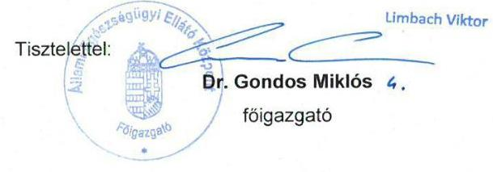

Mellékletek: 1 db dvd, 1 db együttműködési megállapodás, 2 db meghatalmazás, 8 db teljesítésigazolás, teljesítést igazoló jegyzőkönyvek

---

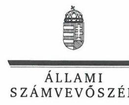

# Dr. Gondos Miklós 

főigazgató

Állami Egészségügyi Ellátó Központ

## Budapest

## Tisztelt Főigazgató úr!

A „Központi költségvetési szervek ellenőrzése - Állami Egészségügyi Ellátó Központ" címmel készített számvevőszéki jelentéstervezetre tett észrevételét megkaptam.
Az Állami Számvevőszék észrevételekre vonatkozó álláspontjáról a felügyeleti vezető által készített részletes tájékoztatást csatoltan megküldöm.
Tájékoztatom Főigazgató urat, hogy a számvevőszéki jelentésben - az Állami Számvevőszékről szóló 2011. évi LXVI. törvény 29. § (3) bekezdése alapján - a figyelembe nem vett észrevételeket szerepeltetjük az elutasítás indokának feltüntetésével.

Budapest, 2019. 09. 30.
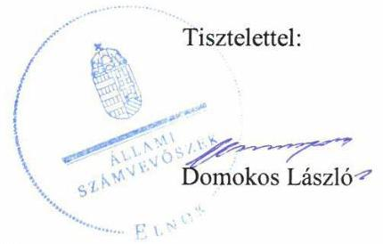

Melléklet: Tájékoztatás az észrevételek kezeléséről

---

# Tájékoztatás az észrevételek kezeléséről 

Az „Központi költségvetési szervek ellenőrzése - Állami Egészségügyi Ellátó Központ" című jelentéstervezetre (továbbiakban: jelentéstervezet) a 2019. szeptember 30-án kelt levélében megküldött észrevételeit áttekintettem. Az észrevételek kezeléséről az alábbi tájékoztatást adom.

Az Állami Számvevőszék (továbbiakban: ÁSZ) az ellenőrzési megállapításait az ellenőrzött szervezet közreműködési kötelezettsége keretében, az ellenőrzött szervezet által Teljességi és hitelességi nyilatkozattal alátámasztott dokumentumokra alapozva fogalmazta meg. Főigazgató úr által aláírt Teljességi és hitelességi nyilatkozatban foglaltak szerint az átadott dokumentumok, adatok megbízhatóak, az ÁSZ által bekért adatokra, dokumentumokra vonatkozóan teljes körű információt tartalmaznak. Főigazgató úr az átadott dokumentumok, adatok hitelességéért, valódiságáért, hiánytalanságáért teljes felelősséget vállalt. Így a 15 napos észrevételezés keretében megküldött adatok az észrevételre adott válasznál nem kerültek figyelembevételre.

1) A 2. számú megállapítás 1. bekezdés 1. francia bekezdéséhez tett észrevételt nem fogadtuk el.
Az észrevételben hivatkozott „V_6_14" elnevezésű, a Teljességi és hitelességi nyilatkozat 745-751 sorában feltüntetett dokumentumok közül kettő 2014. március 31-től hatályos GYEMSZI Gazdasági Főigazgatóságának ügyrendje, öt darab pedig a 2017. szeptember 18-tól hatályos ÁEEK Gazdasági főigazgatóság ügyrendjéről szóló szabályzat. 2015. március 1-től az ÁEEK feladat és hatáskörét az Állami Egészségügyi Ellátó Központról szóló 27/2015. (II. 25.) Korm. rendeletben foglaltak határozzák meg. Az ellenőrzött időszak az ÁEEK szervezeti átalakításának lebonyolítása tekintetében 2015. március 1. - 2016. december 31. közötti időszak volt, így az észrevételezett megállapítás is erre az időszakra vonatkozott. A Gyógyszerészeti és Egészségügyi Minőség- és Szervezetfejlesztési Intézet (továbbiakban: GYEMSZI) Gazdasági Főigazgatóságának ügyrendjét meghatározó, 2014. március 31-től hatályos „1-GF/2014. Főigazgató-helyettesi Utasítás az Ügyrendről" elnevezésű dokumentum tekintetében - az észrevételében hivatkozott - 2016. évi módosítást az ellenőrzési dokumentumok nem támasztották alá.
Fentiek alapján a jelentéstervezetben szereplő megállapítás módosítása nem indokolt.
Ezen túl a teljességi és hitelességi nyilatkozat észrevételben hivatkozott 1085. sorában V_4_3 elnevezésű fájl alatt a 36/2015. sz. főigazgatói utasítás szerepelt, amely a Főigazgatói Titkárság 2015. szeptember 1-től hatályos ügyrendjét, nem pedig a gazdasági szervezet ügyrendjét tartalmazta.

---

# 2) A 2. számú megállapítás 13. bekezdéséhez tett észrevételt nem fogadtuk el. 

Az államháztartás végrehajtásáról szóló 368/2011. (XII.31.) Korm. rendelet 60. § (3) bekezdése szerint a kötelezettséget vállaló szerv a kötelezettségvállalásra, pénzügyi ellenjegyzésre, teljesítés igazolására, érvényesítésre, utalványozásra jogosult személyekről és aláírás-mintájukról a belső szabályzatában foglaltak szerint naprakész nyilvántartást vezet. Az észrevételében hivatkozott IV_1_11_1-től IV_1_11_16-ig fájlnéven az ellenőrzés részére átadott, a teljességi és hitelességi nyilatkozat 803-819 soraiban szereplő dokumentumok szabályzatok mellékletei, jogosultak névsora, különálló aláírás minták, felhatalmazások.
Mindezek alapján a jelentéstervezetben szereplő megállapítás módosítása nem indokolt.

## 3) A 2. számú megállapítás 16. bekezdéséhez tett észrevételt elfogadtuk.

Az ÁEEK Egyedi Iratkezelési Szabályzatára vonatkozó észrevételét a számvevőszéki jelentés összeállításakor figyelembe vesszük.

## 4) A 2. sz. megállapítás 17. bekezdéséhez tett észrevételt nem fogadtuk el.

Az államháztartás számviteléről szóló 4/2013. (I. 11.) Korm. rendelet (Áhsz.) 32. § (1) bekezdése értelmében a költségvetési szerv az éves költségvetési beszámolója adatait a költségvetési évet követő év február 28-áig tölti fel a Kincstár által működtetett elektronikus adatszolgáltató rendszerbe az éves költségvetési beszámolót alátámasztó könyvelési rendszerből előállított - teljes főkönyvi kivonattal együtt. A fejezetet irányító szerv jóváhagyására vonatkozóan az Áhsz. 32. § (1a) bekezdés tartalmaz rendelkezést, mely szerint az irányító szerv az (1) bekezdés szerinti határidőt követő húsz napon belül felülvizsgálja és - annak javítása, kiegészítése szükség szerinti elrendelését követően - a Kincstár által működtetett elektronikus adatszolgáltató rendszerben jóváhagyja. A jogszabályi rendelkezés alapján tehát a fejezetet irányító szerv jóváhagyása az elektronikus adatszolgáltatást követően, az adatszolgáltató rendszerben történik.
Az éves költségvetési beszámolók és a csatolt képernyőképek alapján az ÁEEK a jogszabályban meghatározott határidőn túl, a költségvetési évet követő év február 28-át követően teljesítette adatszolgáltatási kötelezettségét, mert a 2015. évi költségvetési beszámolót 2016. június 1-én, a 2016. évi költségvetési beszámolót 2017. május 24-én, a 2017. évi költségvetési beszámolót 2018. június 1-én töltötte fel a Kincstár által működtetett elektronikus adatszolgáltató rendszerbe. A jelentéstervezetben szereplő megállapítás módosítása nem indokolt.
5) A 2. számú megállapítás 20. bekezdés 3. mondatához tett észrevételeket nem fogadtuk el.

A belső ellenőrzések 2017. évre vonatkozó nyilvántartásai esetében az ÁEEK nem bocsátott olyan dokumentumokat az ÁSZ részére, amelyek a költségvetési szervek belső kontrollrendszeréről és belső ellenőrzéséről szóló 370/2011. (XII. 31.) Korm. rendelet

---

(Bkr.) 50. § (1)-(2) és 47. § (1) bekezdésében meghatározott nyilvántartások vezetését alátámasztották volna. Az észrevételben hivatkozott „Belső ellenőrzések nyilvántartása 2017.pdf" és „Bekinyt 2017.pdf" dokumentumok az ellenőrzési dokumentumok között nem voltak megtalálhatók, azokat a 2018. október 3-án kelt teljességi és hitelességi nyilatkozat sem tartalmazta.
A jelentéstervezet megállapítása a 2017. évre vonatkozik, ezért a 2015-2016. évre vonatkozó „Belső ellenőrzések nyilvántartása 2015.pdf", „Belső ellenőrzések nyilvántartása 2016.pdf" és „Bekinyt 2015.pdf", „Bekinyt 2016.pdf" nyilvántartásokra vonatkozó észrevételét nem vettük figyelembe.
6) A 3. számú megállapítás 4. bekezdés 2. mondatához tett észrevételt nem fogadtuk el.

Az Áhsz. 39. § (3) bekezdésében és 14. melléklet II. 4. e) pontjában foglaltak értelmében a kötelezettségvállalások, más fizetési kötelezettségek nyilvántartása tartalmazza a kötelezettségvállalás, más fizetési kötelezettség évek szerinti megoszlását, a költségvetési évben a pénzügyi teljesítési határidőket dátum szerint, hogy abból az Áht. és Ávr. szerinti finanszírozási, likviditási terv összeállítható legyen. Az ÁSZ a jelentéstervezetben foglalt megállapításait az ellenőrzött által az adatszolgáltatás keretében rendelkezésre bocsátott, és Teljességi és hitelességi nyilatkozattal alátámasztott dokumentumok alapján tette meg. A rendelkezésre bocsátott ellenőrzési dokumentumok alapján az ÁEEK 2015-2016. évi kötelezettségvállalási nyilvántartásai a kötelezettségvállalás, más fizetési kötelezettség évek szerinti megoszlására vonatkozó adatokat nem tartalmazták, így a kötelezettségvállalással terhelt maradvány kimutatását nem támasztották alá. Az adatszolgáltatás keretében megküldött nyilvántartás hiányosságát Főigazgató úr is megerősítette észrevételében, mely szerint az alkalmazott CT EcoStat Program nem biztosította az Áhsz. szerinti teljes tartalom megjelenítését. A kötelezettségvállalások, más fizetési kötelezettségek nyilvántartásának kötelező minimum tartalmi elemeit az Áhsz. 14. melléklet II. 4. pontja határozza meg, az Áhsz. 39. § (3) bekezdésében előírt kötelezettség teljesítését az alkalmazott szoftver alkalmazási feltételei és lehetőségei nem befolyásolják.
Az „2015. évi zárszámadás - Magyarország 2015. évi központi költségvetése végrehajtásának ellenőrzése" című ellenőrzés célja a zárszámadási törvényjavaslat összeállítására, az abban foglalt adatok megbízhatóságára irányult. Az ellenőrzésről készült jelentés az erre vonatkozó megállapításokat tartalmazta, valamint külön mellékletben mutatta be a kontrollkörnyezet minősítését és a belső kontrollrendszer értékelését.

---

# 7) A 4. számú megállapítás 3. bekezdéséhez tett észrevételt nem fogadtuk el. 

A számvitelről szóló 2000. évi C. törvény (Számv. tv.) 165. § (1) bekezdése értelmében minden gazdasági műveletről, eseményről, amely az eszközök, illetve az eszközök forrásainak állományát vagy összetételét megváltoztatja, bizonylatot kell kiállítani (készíteni). A követelések értékvesztésének és visszaírásának elszámolását a Számv. tv. által előírt bizonylattal nem támasztotta alá.
Az észrevételben hivatkozott, a teljességi és hitelességi nyilatkozat 930-935. pontjaiban felsorolt, IV_8_2_1_behajt.köv.anal.2016..pdf, IV_8_2_2_értékveszt.analitika2016..pdf, IV_8_2_3_Valutás értékelési tételek 2016.pdf, IV_8_2_4_Valutás értékelési tételek 2015.pdf, IV_8_2_5_behajt.köv.anal.2015.pdf, IV_8_2_6 vevők egyedi értékelése 2016.pdf fájlnévvel megküldött dokumentumok (behajthatatlan követelés analitika, értékvesztés analitika, elszámolt devizás értékelési tételek, vevői egyenlegek vizsgálata) az észrevételében foglaltak szerint is részletező nyilvántartások.

## 8) A 4. számú megállapítás 4. bekezdéséhez tett észrevételt nem fogadtuk el.

Az egyes központi hivatalok és költségvetési szervi formában működő minisztériumi háttérintézmények felülvizsgálatával összefüggő jogutódlásáról, valamint egyes közfeladatok átvételéről szóló 378/2016. (XII.2) Korm. rendelet 17. §-a alapján az Egészségügyi Készletgazdálkodási Intézet 2016. december 31. napjával az Áht. 11. § (3) bekezdése alapján beolvadás útján jogutódlással megszűnt, jogutódja az ÁEEK lett. Az ÁEEK a 2018. október 3-án kelt 2. sz. tanúsítványon a 2017. évre vonatkozóan a feladatváltozás, átszervezés keretében átvett vagyon tekintetében 13 vagyonelemről nyilatkozott. A tanúsítványon az Egészségügyi Készletgazdálkodási Intézettől 2017. január 1-jén átvett immateriális javak, vagyoni értékű jogok, tárgyi eszközök, ingatlanok és kapcsolódó vagyoni értékű jogok, gépek, berendezések, felszerelések, járművek, beruházások, felújítások, és nemzeti vagyonba tartozó forgóeszközök bruttó és nettó összesített értéke szerepelt. A tanúsítványban rögzítésre került, hogy az átadás-átvételhez kapcsolódóan jegyzőkönyv/megállapodás nem áll rendelkezésre. Az ÁEEK 2015. március 1-től hatályos Alapító Okiratát módosító Módosító Okirat 14. „A költségvetési szerv átalakításával összefüggő átmeneti rendelkezések" pontjában az irányító szerv - Emberi Erőforrások Minisztériuma (EMMI) - meghatározta a közfeladatokhoz kapcsolódó erőforrások átadás-átvételének módját. Az Egészségügyi Nyilvántartási és Képzési Központ tekintetében az ÁEEK a szervezeti átalakulással járó vagyonváltozásokat (a vagyonkezelésbe átadott eszközök számviteli nyilvántartásokból történő kivezetését) a Számv. tv. 165. § (1)-(2) bekezdésében foglaltak ellenére nem támasztotta alá bizonylattal.
A jelentéstervezet „Az Ellenőrzés módszerei" című fejezet tartalmazza, hogy a 2017. évi, pénzmozgáshoz nem kapcsolódó vagyonváltozások szabályszerűségének esetében tételes ellenőrzésre került sor. Az ÁSZ a 2018. december 5-én kelt EL-1133-038/2018. ikt.sz. adatbekérő levél dokumentumjegyzéke, a 2. sz melléklet III. 2. pontjában - többek között a törvényi rendelkezés alapján történő vagyonkezelői jog átvételéhez a tulajdonosi

---

joggyakorló és a költségvetési szerv által megkötött, vagy módosított vagyonkezelői szerződést, a vagyonelemek vagyonkezelésbe vétele számviteli nyilvántartásainak dokumentumait, és a vagyon átvételének számviteli nyilvántartásokban való rögzítésének dokumentumait kérte megküldeni. Az ÁEEK főkönyvi kivonatokat, egyes tárgyi eszköz kartonokat, időszaki főkönyvi összesítőket bocsátott az ellenőrzés rendelkezésére.
Az ÁEEK a számviteli nyilvántartásokba bejegyzett adatokat, a gazdasági esemény számviteli elszámolását a Számv. tv. által előírt bizonylattal nem támasztotta alá.
9) A 4. számú megállapítás 6. bekezdés 2-3. mondatához tett észrevételt nem fogadtuk el. Az ÁEEK 2015. március 1-től hatályos Alapító Okiratát módosító Módosító Okirat 14. „A költségvetési szerv átalakításával összefüggő átmeneti rendelkezések"
 pontjában az irányító szerv - Emberi Erőforrások Minisztériuma (EMMI) - meghatározta a közfeladatokhoz kapcsolódó erőforrások átadás-átvételének módját. A Módosító Okirat 14.3.1. pontja az egyes feladatok átadásával összefüggő vagyon-, létszám- és forrásátcsoportosításról kétoldalú átadás-átvételi megállapodások elkészítését írta elő. A Módosító Okirat 14.3.2. pontja tartalmazta az átadás-átvétel tárgyát képező vagyonelemeket, azok használatának további módját és a jogutód szervezeteket, amelyek az Országos Gyógyszerészeti és Élelmezés-egészségügyi Intézet (OGYÉI), az Egészségügyi Nyilvántartási és Képzési Központ (ÉNKK), az Országos Egészségbiztosítási Pénztár (OEP) és az Országos Betegjogi, Ellátottjogi, Gyermekjogi és Dokumentációs Központ (OBDK) voltak. Az észrevételben is hivatkozott - a teljességi és hitelességi nyilatkozat 635-650. pontjaiban felsorolt - ellenőrzési dokumentumok alapján az ÁEEK a Módosító Okiratban foglalt, az EMMI által előírt átmeneti rendelkezések szerinti átadás-átvételi kötelezettségét nem hajtotta végre, mert a négyből két jogutód szervezet (OBDK, OEP) vonatkozásában az átadás-átvételt az előírt átadás-átvételi megállapodásokkal nem támasztotta alá. Az ÁEEK a szervezeti átalakulással járó vagyonváltozásokat (a vagyonkezelésbe átadott eszközök számviteli nyilvántartásokból történő kivezetését) a Számv. tv. által előírtak ellenére, a gazdasági esemény számviteli elszámolását (nyilvántartását) bizonylattal nem támasztotta alá.

# 10) A jelentéstervezet I. sz. Függelékéhez tett észrevételek 

a) A jelentéstervezet I. sz. Függelék 1. pontjához a kötelezettségvállaló személyére vonatkozó észrevételét nem fogadtuk el. Észrevétele és a rendelkezésre bocsátott dokumentumok alapján az I. sz. Függelékben leírtakat módosítjuk. Az ellenőrzés rendelkezésre bocsátott dokumentumok alapján nem volt kötelezettségvállalás, mert a megállapodást a szerződő partner nem írta alá. Az ellenőrzés rendelkezésre bocsátott dokumentumok tartalmazzák, hogy a „Megállapodás a Felek általi aláírás napján lép hatályba". Főigazgató úr észrevételében a 2017. évi kötelezettségvállalások tekintetében a jelentéstervezetben szereplő megállapítást nem cáfolta.
b) A jelentéstervezet I. sz. Függelék 2. pontjához tett észrevételét a teljesítésigazolások tekintetében nem fogadtuk el. Főigazgató úr észrevételében is

---

megerősítette, hogy az ÁSZ tv. szerinti határidőn belül történő adatszolgáltatás keretében az ÁEEK nem igazolta, hogy a teljesítésigazolásokat a jogszabályi előírásoknak megfelelően végrehajtották, ezért a jelentéstervezet Függelékének 2. pontjában foglalt megállapítások megalapozottak.
Budapest, 2019. 10. 25.
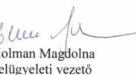

---

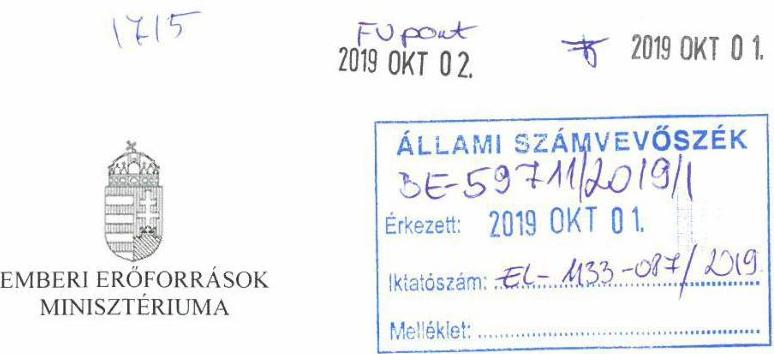

Iktatószám: 42327- 3/2019/EBIZT
Hiv. szám: EL-1133-083/2019.
Melléklet: -
Tárgy: Jelentéstervezet véleményezése

# Domokos László Elnök Úr részére 

Állami Számvevőszék

## Budapest

Apáczai Csere János u. 10.
1052

Tisztelt Elnök Úr!

A fent hivatkozott iktatószámon továbbított ,,Központi költségvetési szervek ellenőrzése Állami Egészségügyi Ellátó Központ" címủ jelentéstervezettel kapcsolatosan, illetékességből, az alábbiakról tájékoztatom.

A jelentéstervezet áttekintése megtörtént, az abban rögzített megállapításokra vonatkozóan észrevételt nem teszek.

Ugyanakkor jelezni kívánom, hogy a jelentéstervezet javaslati részében az emberi erőforrások minisztere részére megfogalmazott, intézkedési terv összeállítási kötelezettséggel járó javaslatot, miszerint „Intézkedjen az ÁEEK főigazgatója részére a 10/2013. (I. 21.) Korm. rendelet előírásainak megfelelő egyéni teljesítménykövetelmények meghatározására", nem tartom indokoltnak.

Tekintettel arra, hogy a kormányzati igazgatásról szóló 2018. évi CXXV. törvény 96. § (1) bekezdése alapján a kormánytisztviselő teljesítményértékelése - melynek részét képezi az egyéni teljesítménykövetelmények meghatározása - nem kötelező, a munkáltatói jogkör gyakorlójának döntésén múlik, kérem Tisztelt Elnök Urat, hogy az érintett javaslat jelentésben történő szerepeltetésétől eltekinteni szíveskedjen.

Budapest, 2019. szeptember 6.
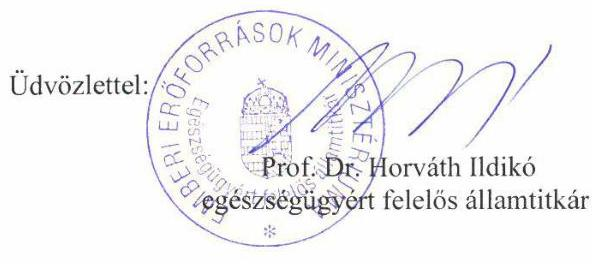

Cím: 1054 Budapest Akadémia utca 3. Tel: + 36 1 795 1200 , Fax: + 36 1 795 0022
E-mail: ildiko.horvath@emmi.gov.hu

---

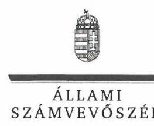

# Dr. Kásler Miklós 

miniszter

Emberi Erőforrások Minisztériuma

## Budapest

## Tisztelt Miniszter Úr!

A „Központi költségvetési szervek ellenőrzése - Állami Egészségügyi Ellátó Központ" címmel készített számvevőszéki jelentéstervezetre tett észrevételét megkaptam.
Az Állami Számvevőszék észrevételekre vonatkozó álláspontjáról a felügyeleti vezető által készített részletes tájékoztatást csatoltan megküldöm.
Tájékoztatom Miniszter urat, hogy a számvevőszéki jelentésben - az Állami Számvevőszékről szóló 2011. évi LXVI. törvény 29. § (3) bekezdése alapján - a figyelembe nem vett észrevételeket szerepeltetjük az elutasítás indokának feltüntetésével.

Budapest, 2019. 10. 31.

Tisztelettel:
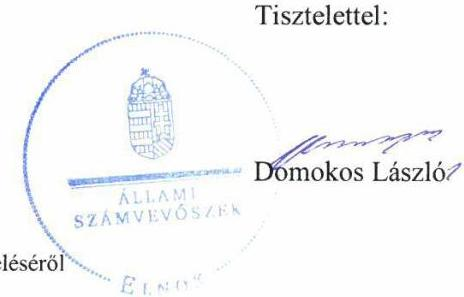

Melléklet: Tájékoztatás az észrevételek kezeléséről

---

# Tájékoztatás az észrevételek kezeléséről 

Az „Központi költségvetési szervek ellenőrzése - Állami Egészségügyi Ellátó Központ" című jelentéstervezetre (továbbiakban: jelentéstervezet) egészségügyi államtitkár úrhölgy 42327-3/2019/EBIZT iktatószámú levelében foglalt észrevételeit áttekintettem.
Az észrevételében foglaltakat a számvevőszéki jelentés készítésénél figyelembe vesszük. A javaslatot töröljük.

Budapest, 2019. 10. 3.
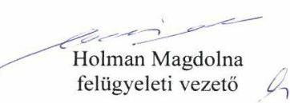

---

.

---

# RÖVIDÍTÉSEK JEGYZÉKE 

${ }^{1}$ ÁEEK
${ }^{2}$ 27/2015. (II. 25.) Korm. rendelet
${ }^{3}$ EMMI
${ }^{4}$ MÖKtv.
${ }^{5} \mathrm{Ttv}$.
${ }^{6}$ Eftv.
${ }^{7}$ 46/2012. (III. 28.) Korm. rendelet
${ }^{8}$ 59/2011. (IV. 12.) Korm. rendelet
${ }^{9}$ GYEMSZI
${ }^{10}$ 378/2016. (XII. 2.) Korm. rendelet
${ }^{11}$ főigazgató ${ }_{1-2}$
${ }^{12}$ gazdasági vezető ${ }_{1-3}$
${ }^{13}$ MNV Zrt.
${ }^{14}$ ÁSZ tv.
${ }^{15}$ Áht.
${ }^{16}$ ÁSZ SZMSZ
${ }^{17}$ Ávr.
${ }^{18}$ Alapító Okirat ${ }_{1-4}$

Állami Egészségügyi Ellátó Központ
27/2015. (II. 25.) Korm. rendelet az Állami Egészségügyi Ellátó Központról (hatályos: 2015. március 1-től)
Emberi Erőforrások Minisztériuma
2011. évi CLIV. törvény a megyei önkormányzatok konszolidációjáról, a megyei önkormányzati intézmények és a Fővárosi Önkormányzat egyes egészségügyi intézményeinek átvételéről (hatályos: 2011. november 26-tól)
2012. évi XXXVIII. törvény a települési önkormányzatok fekvőbeteg-szakellátó intézményeinek átvételéről és az átvételhez kapcsolódó egyes törvények módosításáról (hatályos: 2012. április 28-tól)
2006. évi CXXXII. törvény az egészségügyi ellátórendszer fejlesztéséről (hatályos: 2007. január 1-től)
46/2012. (III. 28.) Korm. rendelet a fekvőbeteg szakellátást nyújtó intézmények részére történő gyógyszer-, orvostechnikai eszköz és fertőtlenítőszer beszerzések országos központosított rendszeréről (hatályos: 2012. március 29-től)
59/2011. (IV. 12.) Korm. rendelet Gyógyszerészeti és Egészségügyi Minőség- és Szervezetfejlesztési Intézetről (hatályos: 2011. április 13-tól)
Gyógyszerészeti és Egészségügyi Minőség- és Szervezetfejlesztési Intézet
378/2016. (XII. 2.) Korm. rendelet egyes központi hivatalok és költségvetési szervi formában működő minisztériumi háttérintézmények felülvizsgálatával összefüggő jogutódlásról, valamint egyes közfeladatok átvételéről (hatályos: 2016. december 3-tól)
az ÁEEK főigazgatója
főigazgató: 2015. november 30-ig
főigazgató: 2015. december 1-től
az ÁEEK gazdasági vezetője
gazdasági vezető: (feladatát ellátta: 2015. március 31-ig)
gazdasági vezető: (feladatát ellátta: 2015. április 1-től 2017. április 30-ig)
gazdasági vezető: (feladatát ellátta: 2017. május 1-től)
Magyar Nemzeti Vagyonkezelő Zrt.
2011. évi LXVI. törvény az Állami Számvevőszékről (hatályos: 2011. július 1-től)
2011. évi CXCV. törvény az államháztartásról (hatályos: 2011. december 31-től)

Állami Számvevőszék Szervezeti és Működési Szabályzata
368/2011. (XII. 31.) Korm. rendelet az államháztartásról szóló törvény végrehajtásáról (hatályos: 2012. január 1-jétől)
az ÁEEK alapító okirata
Alapító Okirat: az ÁEEK 13118-9/2015/JOGIEÜ számú Alapító Okirata, módosításokkal egységes szerkezetben
(hatályos: 2015. március 1-től 2016. december 31-ig)
Alapító Okirat: az ÁEEK 63125-1/2016/JOGIEÜ számú Alapító Okirata, módosításokkal egységes szerkezetben
(hatályos: 2017. január 1-től 2017. március 31-ig)

---

${ }^{19}$ SZMSZ $_{1-4}$

20 Áhsz.
${ }^{21}$ 10/2013. (I. 21.) Korm. rend.
${ }^{22}$ Ügyrend $_{1,2}$
${ }^{23}$ eszközök és források értékelési szabályzata ${ }_{1,2}$
${ }^{24}$ számlarend $_{1,2}$
${ }^{25}$ Kötelezettségvállalási szabályzat ${ }_{1-3}$
${ }^{26} \mathrm{Kttv}$.
${ }^{27}$ Közszolgálati szabályzat ${ }_{1-3}$

Alapító Okirat ${ }_{3}$ az ÁEEK 18004-7/2017/JOGIEÚ számú Alapító Okirata, módosításokkal egységes szerkezetben
(hatályos: 2017. április 1-től 2017. május 31-ig)
Alapító Okirat ${ }_{4}$ az ÁEEK 18004-14/2017/JOGIEÚ számú Alapító Okirata, módosításokkal egységes szerkezetben (hatályos: 2017. június 1-től)
az ÁEEK Szervezeti és Működési Szabályzata
SZMSZ 1 9/2013. (III. 14.) EMMI utasítás a GYEMSZI szervezeti és működési szabályzatáról (hatályos: 2013. március 16-tól 2016. március 23-ig)
SZMSZ 2 9/2016. (III. 23.) EMMI utasítás az ÁEEK szervezeti és működési szabályzatáról (hatályos: 2016. március 24-től 2016. november 24-ig)
SZMSZ 3 53/2016. (XI. 24.) EMMI utasítás az ÁEEK szervezeti és működési szabályzatáról (hatályos: 2016. november 25-től 2017. december 13-ig)
SZMSZ 4 56/2017. (XII. 13.) EMMI utasítás az ÁEEK szervezeti és működési szabályzatáról (hatályos: 2017. december 14-től)
4/2013. (I. 11.) Korm. rendelet az államháztartás számviteléről (hatályos: 2014. január 1-től)
10/2013. (I. 21.) Korm. rendelet a közszolgálati egyéni teljesítményértékelésről (hatályos: 2013. július 1-től)
az ÁEEK ügyrendje
Ügyrend ${ }_{1}$ 1-GF/2014. Főigazgató-helyettesi Utasítás az Ügyrendről (hatályos: 2014. március 31-től 2017. szeptember 17-ig)
Ügyrend ${ }_{2}$ 29/2017. Főigazgatói utasítással kiadott Ügyrend (hatályos: 2017 szeptember 18-tól)
az ÁEEK Eszközök és források értékelési szabályzata
szabályzat ${ }_{1}$ 14/2013. Főigazgatói utasítással kiadott Eszközök és források értékelési (hatályos: 2013. május 21-től 2017. augusztus 14-ig)
szabályzat ${ }_{2}$ 24/2017. Főigazgatói utasítással kiadott Eszközök és források értékelési (hatályos: 2017. augusztus 15-től)
az ÁEEK Számlarendje
számlarend ${ }_{1}$ 16/2013. Főigazgatói utasítással kiadott számlarend (hatályos: 2013. május 21-től 2017. január 9-ig)
számlarend ${ }_{2}$ 1/2017. Főigazgatói utasítással kiadott számlarend (hatályos: 2017. január 10-től)
az ÁEEK Kötelezettségvállalási szabályzata
szabályzat ${ }_{1}$ 1/2013. sz. Főigazgatói utasítás a kötelezettségvállalás, ellenjegyzés, szakmai teljesítésigazolás, érvényesítés és utalványozás rendjéről (hatályos: 2013. május 21-től 2016. május 4-ig)
szabályzat ${ }_{2}$ 09/2016. Főigazgatói utasítás a kötelezettségvállalás, ellenjegyzés, szakmai teljesítésigazolás, érvényesítés és utalványozás rendjéről (hatályos: 2016. május 5-től 2017. szeptember 28-ig)
szabályzat ${ }_{3}$ 40/2017. Főigazgatói utasítás a kötelezettségvállalás, pénzügyi ellenjegyzés, teljesítésgazolás, érvényesítés és utalványozás rendjéről (hatályos: 2017. szeptember 29-től
2011. évi CXCIX. törvény a közszolgálati tisztviselőkről
(hatályos: 2012. március 1-jétől)
az ÁEEK Közszolgálati szabályzata
szabályzat ${ }_{1}$ 24/2014. Főigazgatói utasítással kiadott Közszolgálati szabályzat (hatályos: 2014. szeptember 30-tól 2015. április 30-ig)
szabályzat ${ }_{2}$ 12/2015. Főigazgatói utasítással kiadott Ideiglenes Közszolgálati szabályzat (hatályos: 2015. május 1-től)

---

${ }^{28}$ Vnytv.
${ }^{29}$ Számv. tv.
${ }^{30}$ Számviteli politika $1-3$
${ }^{31}$ leltározási és leltárkészítési szabályzat ${ }_{1,2}$
${ }^{32}$ pénzkezelési szabályzat ${ }_{1,2}$
${ }^{33}$ bizonylati rend $_{1-3}$
${ }^{34}$ önköltségszámítási szabályzat ${ }_{1,2}$
${ }^{35} \mathrm{Kbt} .1$
Kbt. 2
${ }^{36}$ közbeszerzési szabályzat ${ }_{1-5}$
szabályzat ${ }_{3}$ 20/2017. Főigazgatói utasítással kiadott Közszolgálati szabályzat (hatályos: 2015. június 1-től)
2007. évi CLII. tv. egyes vagyonnyilatkozat-tételi kötelezettségekről (hatályos: 2007. december 6-tól)
2000. évi. C. törvény a számvitelről (hatályos: 2001. január 1-től)
az ÁEEK Számviteli politikája
Számviteli politika ${ }_{1}$ 1/2013. Főigazgatói utasítással kiadott Számviteli politika (hatályos: 2013. május 21-től 2015. szeptember 2-ig)
Számviteli politika ${ }_{2}$ 46/2015. Főigazgatói utasítással kiadott Számviteli politika (hatályos: 2015. szeptember 3-tól 2017. augusztus 14-ig)
Számviteli politika ${ }_{3}$ 26/2017. főigazgatói utasítással kiadott Számviteli politika (hatályos: 2017. augusztus 15-től)
az ÁEEK Leltárkészítési és leltározási szabályzata
szabályzat ${ }_{1}$ 18/2013. Főigazgatói utasítással kiadott Leltárkészítési és leltározási szabályzata (hatályos: 2013. május 21-től 2017. szeptember 28-ig)
szabályzat ${ }_{2}$ 36/2017. Főigazgatói utasítással kiadott Leltárkészítési és leltározási szabályzata (hatályos: 2017. szeptember 29-től)
az ÁEEK Pénzkezelési szabályzata
szabályzat ${ }_{1}$ 5/2013. Főigazgatói utasítással kiadott Pénz és értékkezelésről szóló szabályzata (hatályos: 2013. február 15-től 2017. szeptember 27-ig)
szabályzat ${ }_{2}$ 32/2017. Főigazgatói utasítással kiadott Pénz és értékkezelésről szóló szabályzata (hatályos: 2017. szeptember 27-tő)
az ÁEEK Bizonylati rendje
bizonylati rend ${ }_{1}$ 5/2013. Főigazgatói utasítással kiadott Bizonylati rend (hatályos: 2013. május 21-től 2015. szeptember 1-ig)
bizonylati rend ${ }_{2}$ 42/2015. Főigazgatói utasítással kiadott Bizonylati rend (hatályos: 2015. szeptember 1-től 2017. szeptember 28-ig)
bizonylati rend ${ }_{3}$ 39/2017. Főigazgatói utasítással kiadott Bizonylati rend (hatályos: 2017. szeptember 29-től)
az ÁEEK Önköltségszámítási szabályzata
szabályzat ${ }_{1}$ 19/2013. Főigazgatói utasítással kiadott Önköltségszámítási szabályzat (hatályos: 2013. május 21-től 2017. augusztus 14-ig)
szabályzat ${ }_{2}$ 25/2017. Főigazgatói utasítással kiadott Önköltségszámítási szabályzat (hatályos: 2017. augusztus 15-től)
2011. évi CVIII. törvény a közbeszerzésekről (hatályos: 2011. augusztus 21-től) 2015. évi CXLIII törvény a közbeszerzésekről (hatályos: 2015. november 1-től) az ÁEEK Közbeszerzési szabályzata
szabályzat ${ }_{1}$ 7/2014. Főigazgatói utasítás az egyes európai uniós és nemzetközi támogatással megvalósuló projektek beszerzései és közbeszerzései esetén alkalmazandó eljárásrend (hatályos: 2014. február 17-től 2015. október 29-ig) szabályzat ${ }_{2}$ 8/2014. Főigazgatói utasítás a GYEMSZI (köz/beszerzésről szóló szabályzata (hatályos: 2014. március

 18-tól 2015. október 28-ig)
szabályzat ${ }_{3}$ 55/2015. Főigazgatói utasítás az ÁEEK (közbeszerzésről szóló szabályzata (hatályos: 2015. október 29-től 2016. augusztus 7-ig)
szabályzat ${ }_{4}$ 13/2016. Főigazgatói utasítás az ÁEEK közbeszerzési szabályzatáról (hatályos: 2016. augusztus 8-tól 2017. július 5-ig)
szabályzat ${ }_{5}$ 23/2017. Főigazgatói utasítás az ÁEEK közbeszerzési szabályzatáról (hatályos: 2017. július 5-től)

---

${ }^{37}$ beszerzési szabályzat ${ }_{1,2}$
${ }^{38}$ integritás irányítási szabályzat
${ }^{39}$ Info tv.
${ }^{40}$ Vtvr.
${ }^{41}$ Módosító okirat
${ }^{42} \mathrm{Nvtv}$.
az ÁEEK Beszerzési szabályzata
szabályzat ${ }_{1}$ 8/2014. Főigazgatói utasítás a GYEMSZI közbeszerzésről szóló szabályzata (hatályos: 2014. március 18-tól 2015. október 28-ig), szabályzat ${ }_{2}$ 55/2015. Főigazgatói utasítás az ÁEEK közbeszerzésről szóló szabályzata (hatályos: 2015. október 29-től)
2/2016. Főigazgatói utasítás az ÁEEK működésével összefüggő integritás irányítási rendszerről és a közérdekű bejelentések fogadásának rendjéről (hatályos: 2016. január 8-tól)
2011. évi CXII. törvény az információs önrendelkezési jogról és az információszabadságról (hatályos: 2011. július 27-től)
254/2007. (X. 4.) Korm. rendelet az állami vagyonnal való gazdálkodásról (hatályos: 2007. október 4-től)
az EMMI 13118-9/2015/JOGIEÚ sz. okirata a Gyógyszerészeti és Egészségügyi, Minőség- és Szervezetfejlesztési Intézetnek az Emberi Erőforrások Minisztériuma által 2014. május 14. napján kiadott, 21732-5/2014/JOGI számú alapító okiratának az államháztartásról szóló 2011. évi CXCV. törvény 8/A.-a - az Állami Egészségügyi Ellátó Központról szóló 27/2015. (II. 25.) Korm. rendeletre figyelemmel - alapján történő módosításáról (hatályos: 2015. március 1-től)
2011. évi CXCVI. törvény a nemzeti vagyonról (hatályos: 2011. december 31-től)

---

# ÁLLAMI SZÁMVEVŐSZÉK 

1052 Budapest, Apáczai Csere János utca 10.
Levélcím: 1364 Budapest 4. Pf. 54
Telefon: +36 14849100 Telefax: +36 14849200
www.asz.hu
