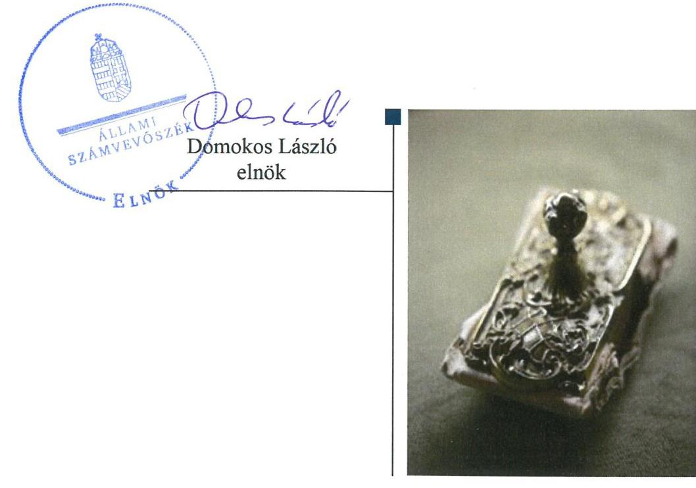

# Jelenetés 

## Nem állami humánszolgáltatók ellenőrzése

A humánszolgáltatást nyújtó államháztartáson kívüli szociális intézmények, szolgáltatók fenntartói központi költségvetésből kapott támogatásai felhasználásának ellenőrzése Szociális Missziótársulat
2019. 11. hó 29. nap

---

# Jelentés 

## Nem állami humánszolgáltatók ellenőrzése

A humánszolgáltatást nyújtó államháztartáson kívüli szociális intézmények, szolgáltatók fenntartói központi költségvetésből kapott támogatásai felhasználásának ellenőrzése Szociális Missziótársulat
2019. 11. hó 29. nap

---

# AZ ELLENŐRZÉST FELÜGYELTE:

- VARGA EDIT felügyeleti vezető
- AZ ELLENŐRZÉST VEZETTE ÉS A VÉGREHAJTÁSÁÉRT FELELŐS:
  - DR. PELLEI TAMÁS ellenőrzésvezető
  - A PROGRAM ÖSSZEÁLLÍTÁSÁÉRT FELELŐS:
    - TÓTPÁL SZABOLCS osztályvezető

**IKTATÓSZÁM:** EL-2214-001/2019.

**TÉMASZÁM:** 2491

**ELLENŐRZÉS-AZONOSÍTÓ SZÁM:** V083570

Jelentéseink az Országgyűlés számítógépes hálózatán és az Interneten a www.asz.hu címen is olvashatóak.

---

# TARTALOMJEGYZÉK 

■ ÖSSZEGZÉS ..... 5
■ AZ ELLENŐRZÉS CÉLJA ..... 6
■ AZ ELLENŐRZÉS TERÜLETE ..... 7
■ AZ ELLENŐRZÉS HÁTTERE, INDOKOLTSÁGA ..... 8
■ A JELENTÉS LÉNYEGES KÉRDÉSKÖREI ..... 9
■ AZ ELLENŐRZÉS HATÓKÖRE ÉS MÓDSZEREI ..... 10
■ MEGÁLLAPÍTÁSOK ..... 12
■ MELLÉKLETEK ..... 15
I. sz. melléklet: Értelmező szótár ..... 15
■ FÜGGELÉK: ÉSZREVÉTELEK ..... 17
■ RÖVIDÍTÉSEK JEGYZÉKE ..... 19

---

.

---

# ÖSSZEGZÉS 

A Szociális Missziótársulat a szociális humánszolgáltatási közfeladatok ellátásához kialakította a központi költségvetési támogatások átlátható, elszámoltatható igénybevételének és felhasználásának feltételeit. A központi költségvetési támogatásokat a jogszabályi előírásokat betartva az intézményei működtetésére fordította.

## Az ellenőrzés társadalmi indokoltsága

Az Állami Számvevőszék a stratégiájában célul tűzte ki, hogy az államháztartáson kívülre nyújtott költségvetési támogatások ellenőrzésével hozzájárul ahhoz, hogy a közpénzeket az államháztartáson kívüli szervezetek is átlátható módon használják fel a közfeladatok szerződésben vállalt ellátása érdekében. Az Állami Számvevőszék stratégiájában foglaltak alapján is indokolt az ellenőrzés, amely a társadalom számára jelzi, hogy a közpénz államháztartáson kívüli felhasználása sem maradhat ellenőrizetlenül.

A fentieket figyelembe véve, valamint a holisztikus megközelítés jegyében az egyedi kockázatelemzés alapján kiválasztott Szociális Missziótársulatnál értékeltük az államháztartáson kívüli szociális tevékenységhez kapcsolódó támogatások felhasználásának megfelelőségét.

## Főbb megállapítások, következtetések

A Szociális Missziótársulat megteremtette a szociális humánszolgáltatási közfeladatok ellátásának szervezeti feltételeit, a szakmai feladatellátás és a gazdálkodási kereteit kialakította, biztosította a költségvetési támogatások igénybevételének, felhasználásának átláthatóságát és elszámoltathatóságát.

A Szociális Missziótársulat a szociális humánszolgáltatási közfeladataihoz rendelt költségvetési támogatásokat szabályszerűen kezelte, elkülönítetten tartotta nyilván és a jogszabályi előírásoknak megfelelően az intézményei működtetésére fordította. Gazdálkodásával jó gyakorlatot mutatott.

A Szociális Missziótársulat ellenőrzési, és a külső ellenőrzésekkel kapcsolatos intézkedési kötelezettségeinek szabályszerűen eleget tett.

---

# AZ ELLENŐRZÉS CÉLJA

**AZ ELLENŐRZÉS CÉLJA** annak értékelése volt, hogy a Szociális Missziótársulat, mint szociális intézmények egyházi fenntartója a központi költségvetésből kapott támogatásainak felhasználása szabályszerű volt-e, a támogatások igénylése, évközi módosítása és év végi elszámolása megfelelte-e a jogszabályi előírásoknak.

---

# AZ ELLENŐRZÉS TERÜLETE 

## Szociális Missziótársulat

A Szociális Missziótársulat a Magyar Katolikus Egyház belső egyházi jogi személye. Az Esztergom-Budapesti Érsek által jóváhagyott Konstitúció ${ }^{1}$ szerint azért alakult, hogy azokat a vallásos és főleg szociális karitatív munkákat végezze, amelyek a kor követelményei szerint a Magyar Katolikus Egyház érdekét is szolgálják.

A Fenntartó² a 2015-2017. években kettő szociális humánszolgáltató intézmény ${ }^{3}$ fenntartásával és működtetésével vett részt az önkormányzati és az állami közfeladat ellátásban. Az önálló jogi személy jogállású, önállóan gazdálkodó szociális intézményei közül egyrészt a Farkas Edith Szeretetotthon 100 férőhelyen - melyből 85 emelt szintű - biztosította az ország egész területéről érkezők részére az időskorúak ápolását, gondozását, másrészt a Bethánia Szeretetotthon 48 férőhelyen időskorúak intézményi ellátását, valamint Szikszó Város Önkormányzatával kötött ellátási szerződés ${ }^{4}$ szerint 20 fő részére idősek nappali ellátását végezte, valamint étkeztetést biztosított. Az intézmények az Eszámv. ${ }^{5}$ előírásának megfelelő egyszerűsített éves beszámolót készítettek.

A Fenntartó a szociális feladatellátáshoz a 2015. évben 156,3 M Ft, a 2016. évben 166,0 M Ft, a 2017. évben 181,0 M Ft költségvetési támogatásban részesült.

A közfeladat ellátásával kapcsolatos törvényességi ellenőrzési feladatokat az ellenőrzött időszakban a területileg illetékes kormányhivatalok ${ }^{6}$ végezték.

---

# AZ ELLENŐRZÉS HÁTTERE, INDOKOLTSÁGA 

A szociális feladatokat ellátó nem állami intézményfenntartók részére közfeladataik ellátására évente jelentős összegű pénzügyi támogatást biztosítottak a mindenkori költségvetési törvények a bennük megfogalmazott feltételek mellett.

A felhasználható állami támogatások a Kvtv. ${ }_{1,2,3}{ }^{7}$-ekben a 2015-2017. években a szociális ágazatra vonatkozóan 273 Mrd Ft előirányzatot határoztak meg. Módosították a szociális igazgatásról és szociális ellátásokról szóló 1993. évi III. törvényt, amely - többek között - 2012. január 1-jei hatállyal megfogalmazta a finanszírozási rendszerbe történő befogadással összefüggő szabályokat.

Az ÁSZ stratégiájában foglaltak alapján is indokolt az ellenőrzés, amely a társadalom számára jelzi, hogy a közpénz államháztartáson kívüli felhasználása sem maradhat ellenőrizetlenül. Az államháztartáson kívülre nyújtott költségvetési támogatások ellenőrzésével az ÁSZ hozzájárul ahhoz, hogy a közpénzeket a nem állami humán fenntartók átlátható módon használják fel a közfeladatok ellátására kötött szerződésekben vállalt kötelezettségek teljesítése érdekében. Az ellenőrzés javaslataival hozzájárulhat az említett rendszerek szabályszerű támogatás felhasználásához, javíthatja a társadalmi-gazdasági döntések megalapozottságát, amely a „jól irányított állam" feltétele.

---

# A JELENTÉS LÉNYEGES KÉRDÉSKÖREI 

1. A szociális humánszolgáltatási közfeladatot ellátó Fenntartó szabályszerű működési - és gazdálkodási környezet kialakításával megteremtette-e a költségvetési támogatások átlátható, elszámoltatható igénybevételének, felhasználásának feltételeit?
2. A Fenntartó az átvállalt szociális humánszolgáltatási közfeladathoz biztosított költségvetési támogatásokat szabályszerűen fordította-e a humánszolgáltató intézményei működtetésére?
3. A Fenntartó a szociális humánszolgáltató intézményei működtetéséhez felhasznált közpénzekre vonatkozó gazdálkodásával elszámolt-e, ennek megalapozása érdekében ellenőrzési, és a külső ellenőrzésekkel kapcsolatos intézkedési feladatait szabályszerűen látta-e el?

---

# AZ ELLENŐRZÉS HATÓKÖRE ÉS MÓDSZEREI 

## Az ellenőrzés típusa

Megfelelőségi ellenőrzés.

## Az ellenőrzött időszak

2015. január 1-je és 2017. december 31-e közötti időszak. A helyszíni szemle tekintetében 2018. január 1-jétől 2019. április 11-éig tartó időszak.

## Az ellenőrzés tárgya

Az ellenőrzés a szociális humánszolgáltatási közfeladatokat ellátó államháztartáson kívüli fenntartók, humánszolgáltatási közfeladatai ellátásához a költségvetési törvényekben biztosított központi költségvetési támogatások igénylése, évközi módosítása és év végi elszámolása fenntartói feladatainak ellátása, illetve e központi költségvetésből kapott támogatásaik humánszolgáltatási közfeladatokra való fenntartó általi felhasználása szabályszerűségének értékelésére terjedt ki.

Az ellenőrzés kiterjedt minden olyan körülményre és adatra, amely az ÁSZ ${ }^{8}$ jogszabályban meghatározott feladatainak teljesítéséhez, valamint a program végrehajtása folyamán felmerült újabb összefüggések feltárásához volt szükséges.

## Az ellenőrzött szervezet

Szociális Missziótársulat

## Az ellenőrzés jogalapja

Az ellenőrzés jogszabályi alapját az ÁSZ tv. 1. § (3) bekezdése, 5. § (3) bekezdés, valamint az 5. § (11) c) pontjában foglalt előírások adják.

## Az ellenőrzés módszerei

Az ellenőrzést az ellenőrzési program szempontjai, kérdései, az ellenőrzött időszakban hatályos jogszabályok, a nemzetközi standardokat irányadónak tekintve, az ellenőrzés szakmai szabályok és módszertanok figyelembe vételével végezte az ÁSZ.

---

Az ellenőrzés ideje alatt az ÁSZ a Fenntartóval történő kapcsolattartást az ÁSZ SZMSZ ${ }^{\text {® }}$-ének vonatkozó előírásai alapján biztosította.

Az ellenőrzési kérdések megválaszolásához szükséges bizonyítékok megszerzése az ellenőrzött által rendelkezésre bocsátott dokumentumokra, adatokra alapozva megfigyelés, szemle (szemrevételezés), kérdésfeltevés (információkérés), valamint elemző eljárással történt.

Az ellenőrzési bizonyítékként felhasználható adatforrások közé tartoztak egyrészt az ellenőrzési program részletes szempontjainál felsorolt adatforrások, másrészt minden - az ellenőrzés folyamán feltárt, az ellenőrzés szempontjából információt tartalmazó - dokumentum.

Az ellenőrzés lefolytatásához a Fenntartó a kitöltött tanúsítványok, valamint az ÁSZ által kért dokumentumok elektronikus úton való megküldésével szolgáltatott adatokat, információkat. Az így rendelkezésre bocsátott adatok, információk és a tanúsítványok adatai valódiságának kontrollja az ellenőrzés keretében történt.

Az ellenőrzést alapvetően a szociális humánszolgáltatások esetében a központi költségvetési támogatások igénylésével, módosításával, felhasználásával, elszámolásával kapcsolatos feladatokat ellátó Fenntartónál végeztük. A fenntartott intézménynél helyszíni szemle keretében győződtünk meg a tényleges feladatellátásról (verifikáció).

A szociális humánszolgáltatások központi költségvetési támogatásai igénylésével, módosításával, elszámolásával kapcsolatos, államháztartáson kívüli fenntartó jogszabályokban előírt feladatai betartását, továbbá a központi költségvetési támogatások szabályszerű kezelését, nyilvántartását ellenőriztük a Fenntartónál, az ott rendelkezésre álló határozatok, nyilvántartások, beszámolók és egyéb dokumentumok alapján.

Az ellenőrzés nem terjedt ki a szociális humánszolgáltatások központi költségvetési támogatásai igénylése, módosítása, elszámolása valódiságának, megalapozottságának, helyességének - sem a fenntartónál, sem a székhely intézményénél való - értékelésére. Továbbá nem terjedt ki az ellenőrzés e források, intézmény általi szabályszerű felhasználásának értékelésére.

---

# MEGÁLLAPÍTÁSOK 

## 1. A szociális humánszolgáltatási közfeladatot ellátó Fenntartó szabályszerű működési - és gazdálkodási környezet kialakításával megteremtette-e a költségvetési támogatások átlátható, elszámoltatható igénybevételének, felhasználásának feltételeit?

Összegző megállapítás

A Fenntartó a szabályszerű működési- és gazdálkodási környezet kialakításával megteremtette a költségvetési támogatások átlátható, elszámoltatható igénybevételének, felhasználásának feltételeit.

A Fenntartó a Szoc. tv. ${ }^{10}$ előírásainak megfelelően a szociális humánszolgáltatási közfeladatok ellátásának szervezeti kereteit, irányítási rendszerét, illetve annak működését az Ehtv. ${ }^{11}$ szerint a Konstitúcióban meghatározta.

A Fenntartó a Számv. tv. ${ }^{12}$ előírásainak megfelelően rendelkezett számviteli politikával ${ }^{13}$ és a Számv. tv. szerint kialakította a gazdálkodásához kapcsolódó belső szabályzatokat. Számlarendjét a Számv. tv. előírásának megfelelően elkészítette.

A Fenntartó a pénzkezelési szabályzatában rögzítette a pénzgazdálkodással kapcsolatos folyamatokat, a pénzforgalom lebonyolításának rendjét, a pénzkezelés felelősségi szabályait. A központi költségvetési támogatások az Atr. ${ }^{14}$ előírása szerinti a feladatonként elkülönített és naprakész nyilvántartás vezetésének belső előírásait a számlarendben rögzítette. A Konstitúció tartalmazta az engedélyezési, jóváhagyási és kontrolleljárásokra vonatkozó szabályokat.

## 2. A Fenntartó az átvállalt szociális humánszolgáltatási közfeladathoz biztosított költségvetési támogatásokat szabályszerűen fordította-e a humánszolgáltató intézményei működtetésére?

Összegző megállapítás

A Fenntartó a költségvetési támogatásokat szabályszerűen használta fel az intézményei működtetésére.

A Fenntartó a közfeladatot ellátó intézmények alapító okiratait ${ }^{16}$ az SzCsM rendelet ${ }^{17}$ és a Szoc. tv. előírásával összhangban kiadta.

A Fenntartó a Szoc. tv. előírása szerint gondoskodott a közfeladatot ellátó Intézményei szervezeti és működési szabályzatainak elkészítéséről, valamint a szakmai programok és házirendek jóváhagyásáról. Az intézmények működési engedélyei és azok mellékleteként az Sznyvhr. ${ }^{15}$-ben rögzített a személyi és tárgyi feltételek meglétét igazoló, valamint az Sznyvhr. szerinti nyilvántartásba vételt igazoló dokumentumok a Fenntartónál rendelkezésre álltak.

---

A Fenntartó a szociális humánszolgáltatási közfeladathoz rendelt költségvetési támogatások felhasználását az Atr. előírásának megfelelően, feladatonként elkülönített nyilvántartással támasztotta alá. A költségvetési támogatásokat a Kvtv. előírásának megfelelően az Intézményeinek átadta.

# 3. A Fenntartó a szociális humánszolgáltató intézményei működtetéséhez felhasznált közpénzekre vonatkozó gazdálkodásával elszámolt-e, ennek megalapozása érdekében ellenőrzési, és a külső ellenőrzésekkel kapcsolatos intézkedési feladatait szabályszerűen látta-e el? 

Összegző megállapítás

A Fenntartó az Intézményei működtetéséhez felhasznált közpénzekre vonatkozó gazdálkodásával elszámolt, ennek megalapozása érdekében ellenőrzési és a külső ellenőrzésekkel kapcsolatos intézkedési kötelezettségeinek eleget tett.

A Fenntartó az Eszámv. szerint egyszerűsített éves beszámoló készítésére kötelezett kettős könyvvitelt vezető szervezet, az ellenőrzött időszakban a beszámoló készítési kötelezettségét a Számv. tv. előírásának megfelelő kettős könyvvitellel alátámasztott éves beszámolók elkészítésével teljesítette.

A Fenntartó a Szoc. tv. előírásának megfelelően a 2015-2017. évekre vonatkozóan a Konstitúcióban megfogalmazottak szerint belső ellenőrzéseket végzett az intézményeinél.

A Fenntartó a 2015-2017. évekre vonatkozóan az intézmények törvényességi, valamint szakmai ellenőrzéseivel kapcsolatban megállapított intézkedési kötelezettségének eleget tett.

A Fenntartót egy alkalommal érintette a Kincstár ${ }^{16}$ által végzett finanszírozói ellenőrzés, amely a felvállalt közfeladatra kapott költségvetési támogatások elszámolásának szabályszerűségére vonatkozott, az ellenőrzéssel
 kapcsolatban intézkedési kötelezettsége nem volt.

---

.

---

# MELLÉKLETEK 

- I. SZ. MELLÉKLET: ÉRTELMEZŐ SZÓTÁR
egyházi fenntartó
humánszolgáltatás
költségvetési támogatás
nem állami, nem önkormányzati (államháztartáson kívüli) intézmény fenntartó

Az Ehtv. 33. §-a alapján az Ehtv. mellékletében felsorolt egyházak és az általuk meghatározott, az egyház belső egyházi szabálya szerint jogi személyiséggel rendelkező szervezetek - a nyilvántartásba vételük dátumától függetlenül - 2012. január 1-jétől minősülnek egyházi fenntartóknak. Az Ehtv. 14. §-ában meghatározott eljárás folyamán az Országgyűlés által egyháznak elismert szervezet a törvénynek az egyház bejegyzésére vonatkozó módosítása hatálybalépésének napjától minősül egyháznak (Ehtv. 15. §). A 2010. évi CXL. törvény 5. Cikk Pénzügyi támogató intézkedések 1. pontja alapján 2011. január 1-jétől jogosult a Magyar Máltai Szeretetszolgálat Egyesület az egyházi kiegészítő támogatásra.
Külön törvényben meghatározott szociális, gyermekjóléti, gyermekvédelmi, közoktatási, felsőoktatási, kulturális közfeladatok (2014. évi Kvtv. 34. § (1), (4) bekezdés, 1. számú melléklet XX/20/2. alcím, 19. alcím, 2015. évi Kvtv. 43. § (1), (4) bekezdés, 1. számú melléklet XX/20/2/3. jogcím csoport, 19. alcím, 2016. évi Kvtv. 41. § (1), (4) bekezdés, 1. számú melléklet XX/20/2/3. jogcím csoport, 19. alcím).
a társadalombiztosítás pénzügyi alapjai kivételével az államháztartás központi alrendszeréből ellenérték nélkül, pénzben nyújtott támogatások (Áht. 1. § 14. pont)
A költségvetési törvényekben (2013. évi CCXXX. törvény 33-34. §, 2014. évi C. törvény 42-43. §, 2015. évi C. törvény 40-41. §) megállapított támogatás. Például a 2015. évi C. törvény 40-41. § szerint többek között: Az Országgyűlés a szociális, gyermekjóléti, gyermekvédelmi közfeladatot ellátó intézményt, szolgáltatást fenntartó egyházi jogi személy, civil szervezet, közalapítvány, országos nemzetiségi önkormányzat, települési vagy területi nemzetiségi önkormányzat, gazdasági társaság, és a humánszolgáltatást alaptevékenységként végző, az Szja tv. hatálya alá tartozó egyéni vállalkozó (a továbbiakban együtt: nem állami szociális fenntartó) részére támogatást állapít meg a következők szerint: a támogatás a nem állami szociális fenntartót a települési önkormányzatok 2. melléklet III. pont 3. alpont c)-k) pontjában és III. pont 5. alpont a) pontjában meghatározott támogatásaival azonos jogcímeken, összegben és feltételek mellett illeti meg. A szociális, gyermekjóléti és gyermekvédelmi közfeladatokat/humánszolgáltatásokat ellátó intézményt fenntartó egyházi jogi személy, társadalmi szervezet, alapítvány, közalapítvány, civil szervezet, országos nemzetiségi önkormányzat, nonprofit gazdasági társaság, gazdasági társaság és a humánszolgáltatást alaptevékenységként végző, Szja tv. hatálya alá tartozó egyéni vállalkozó. (2013. évi Kvtv. 35. § (1), (3) bekezdés, 2014. évi Kvtv. 33. §, 34. § (1), (4) bekezdés, 2015. évi Kvtv. 42. §, 43. § (1), (4) bekezdés, 2016. évi Kvtv. 40. §, 41. § (1), (4) bekezdés, 2017. évi Kvtv. 41. § (1), (4))

---

.

---

# FÜGGELÉK: ÉSZREVÉTELEK 

A jelentéstervezetet a Számvevőszék 15 napos észrevételezésre megküldte az ellenőrzött szervezet vezetőjének az ÁSZ tv. 29. § (1) bekezdése előírásának megfelelően.

A Szociális Missziótársulat általános főnöknője a jelentéstervezet megállapításaira nem tett észrevételt.

[^0]
[^0]:    * 29. § (1) Az Állami Számvevőszék az ellenőrzési megállapításait megküldi az ellenőrzött szervezet vezetőjének vagy az általa megbízott személynek, és annak, akinek személyes felelősségét állapította meg.
    (2) Az ellenőrzött szervezet vezetője és a felelősként megjelölt személy az ellenőrzés megállapításaira tizenöt napon belül írásban észrevételt tehet.
    (3) Az Állami Számvevőszék az észrevételre a beérkezésétől számított harminc napon belül írásban válaszol. A figyelembe nem vett észrevételeket köteles a jelentésben feltüntetni, és megindokolni, hogy azokat miért nem fogadta el.

---

.

---

# RÖVIDÍTÉSEK JEGYZÉKE 

${ }^{1}$ Konstitúció
${ }^{2}$ Fenntartó
${ }^{3}$ intézmény
${ }^{4}$ ellátási szerződés
${ }^{5}$ Eszámv.
${ }^{6}$ kormányhivatalok
${ }^{7}$ Kvtv. 1,2,3
${ }^{8}$ ÁSZ
${ }^{9}$ ÁSZ SZMSZ
${ }^{10}$ Szoc. tv.
${ }^{11}$ Ehtv.
${ }^{12}$ Számv. tv.
${ }^{13}$ számviteli politika
${ }^{14}$ Atr.
${ }^{16}$ alapító okiratok
${ }^{17}$ SzCsM rendelet
${ }^{15}$ Sznyvhr.
${ }^{16}$ Kincstár

Esztergom-Budapesti Érsek által jóváhagyott a Szociális Missziótársulat Konstitúció (hatályos: 1995. január 4-től)
Szociális Missziótársulat
Farkas Edith Szeretetotthon, Bethánia Szeretetotthon
Szikszó Város Önkormányzat Képviselő testületének 634/2011. (VI. 30.) számú határozatával jóváhagyott ellátási szerződés
Az egyházi jogi személyek beszámoló készítési és könyvvezetési kötelezettségének sajátosságairól szóló 296/2013. (VII. 29.) Korm. rendelet (hatályos: 2014. január 1-jétől)
Budapest Főváros Kormányhivatala, Borsod-Abaúj-Zemplén Megyei Kormányhivatal
Kvtv.1: Magyarország 2015. évi központi költségvetéséről szóló 2014. évi C. törvény (hatályos: 2015. január 1-jétől 2018. december 31-éig)
Kvtv.2: Magyarország 2016. évi központi költségvetéséről szóló 2015. évi C. törvény (hatályos: 2015. július 4-étől)
Kvtv.3: Magyarország 2017. évi központi költségvetéséről szóló 2016. évi XC. törvény (hatályos: 2016. november 1-jétől)
Állami Számvevőszék
Állami Számvevőszék Szervezeti és Működési Szabályzata
A szociális igazgatásról és szociális ellátásokról szóló 1993. évi III. törvény (hatályos: 1993. február 26-tól)
A lelkiismereti és vallásszabadság jogáról, valamint az egyházak, vallásfelekezetek és vallási közösségek jogállásáról szóló 2011. évi CCVI. törvény (hatályos: 2012. január 1-jétől)
A számvitelről szóló 2000. évi C. törvény (hatályos: 2001. január 1-jétől)
Szociális Missziótársulat Számviteli politikája (hatályos: 2014. január 1-jétől)
Az egyházi és nem állami fenntartású szociális, gyermekjóléti és gyermekvédelmi szolgáltatók, intézmények és hálózatok állami támogatásáról szóló 489/2013. (XII.18.) Korm. rendelet (hatályos: 2014. január 1-jétől)

Bethánia Szeretetotthon Szikszó alapító okiratának 3. számú módosítása (egységes szerkezetben hatályos: 2012. április 15-étől) Farkas Edith Szeretetotthon, Budapest alapító okiratának 2. számú módosítása (egységes szerkezetben hatályos: 2007. december 17-étől)
A személyes gondoskodást nyújtó szociális intézmények szakmai feladatairól és működésük feltételeiről szóló 1/2000. (I. 7.) SzCsM rendelet (hatályos: 2000. január 7-étől)
A szociális, gyermekjóléti és gyermekvédelmi szolgáltatók, intézmények és hálózatok hatósági nyilvántartásáról és ellenőrzéséről szóló 369/2013. (X. 24.) Korm. rendelet (hatályos: 2013. december 1-jétől)
Magyar Államkincstár

---

# ÁLLAMI SZÁMVEVŐSZÉK 

1052 Budapest, Apáczai Csere János utca 10.
Levélcím: 1364 Budapest 4. Pf. 54
Telefon: +36 1 4849100 Telefax: +36 1 4849200
www.asz.hu
