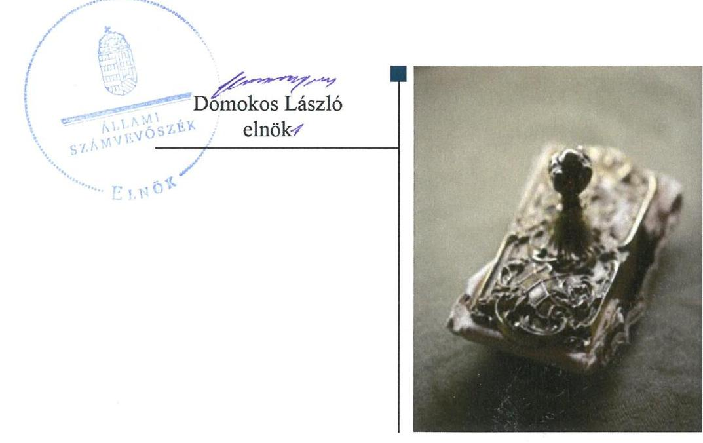
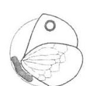
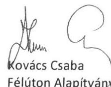
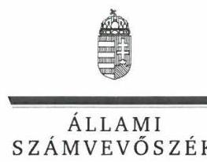
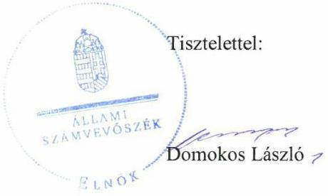

# Jelentés 

## Nem állami humánszolgáltatók ellenőrzése

A humánszolgáltatást nyújtó államháztartáson kívüli szociális intézmények, szolgáltatók fenntartói központi költségvetésből kapott támogatásai felhasználásának ellenőrzése Félúton Alapítvány
2019.

---

# Jelentés 

## Nem állami humánszolgáltatók ellenőrzése

A humánszolgáltatást nyújtó államháztartáson kívüli szociális intézmények, szolgáltatók fenntartói központi költségvetésből kapott támogatásai felhasználásának ellenőrzése Félúton Alapítvány
2019. 11. hó 18. nap

---

# AZ ELLENŐRZÉST FELÜGYELTE:

- VARGA EDIT felügyeleti vezető
- AZ ELLENŐRZÉST VEZETTE ÉS A VÉGREHAJTÁSÁÉRT FELELŐS:
  - DR. DOMOKOS MAGDOLNA ellenőrzésvezető
  - A PROGRAM ÖSSZEÁLLÍTÁSÁÉRT FELELŐS:
    - TÓTPÁL SZABOLCS osztályvezető

**IKTATÓSZÁM:** EL-2233-001/2019

**TÉMASZÁM:** 2491

**ELLENŐRZÉS-AZONOSÍTÓ SZÁM:** V083516

Jelentéseink az Országgyűlés számítógépes hálózatán és az Interneten a www.asz.hu címen is olvashatóak.

---

# TARTALOMJEGYZÉK 

■ ÖSSZEGZÉS ..... 5
■ AZ ELLENŐRZÉS CÉLJA ..... 6
■ AZ ELLENŐRZÉS TERÜLETE ..... 7
■ AZ ELLENŐRZÉS HÁTTERE, INDOKOLTSÁGA ..... 8
■ A JELENTÉS LÉNYEGES KÉRDÉSKÖREI ..... 9
■ AZ ELLENŐRZÉS HATÓKÖRE ÉS MÓDSZEREI ..... 10
■ MEGÁLLAPÍTÁSOK ..... 12
■ JAVASLATOK ..... 13
■ MELLÉKLET ..... 15
I. sz. melléklet: Értelmező szótár ..... 15
■ FÜGGELÉK: ÉSZREVÉTELEK ..... 17
■ RÖVIDÍTÉSEK JEGYZÉKE ..... 23

---

.

---

# ÖSSZEGZÉS 

A Félúton Alapítvány működési és gazdálkodási környezetét szabályszerűen alakította ki. A Félúton Alapítvány intézményeinek működtetéséhez felhasznált közpénzekre vonatkozó gazdálkodása nem volt átlátható, elszámoltatható.

## Az ellenőrzés társadalmi indokoltsága

Az Állami Számvevőszék stratégiájában hangsúlyos szerepet szán annak, hogy szilárd szakmai alapon álló, értékteremtő ellenőrzéseivel előmozdítsa a közpénzügyek átláthatóságát, rendezettségét és javaslataival a közpénzek és a közvagyon szabályos, gazdaságos, hatékony és eredményes felhasználását segítse. Az Állami Számvevőszék a stratégiájában célul tűzte ki, hogy az államháztartáson kívülre nyújtott költségvetési támogatások ellenőrzésével hozzájárul ahhoz, hogy a közpénzeket az államháztartáson kívüli szervezetek is átlátható módon használják fel a közfeladatok szerződésben vállalt ellátása érdekében. Az Állami Számvevőszék e stratégiai céljaival összhangban - az Állami Számvevőszékről szóló 2011. évi LXVI. törvény felhatalmazása alapján - végzi a központi költségvetésből származó források, nyújtott támogatások - kedvezményezett szervezetek közfeladat ellátásához való - felhasználásának az ellenőrzését. Az Állami Számvevőszék hozzájárul ezzel ahhoz is, hogy a nyilvánosság és az igénybevevők megfelelő tájékoztatást kapjanak az államháztartáson kívüli közfeladatot ellátók működéséről.

## Főbb megállapítások, következtetések

A Félúton Alapítvány a jogszabályi előírások szerint kialakította működési és gazdálkodási környezetét.
A Félúton Alapítvány gazdálkodásával nem számolt el, mivel számviteli nyilvántartásaiban nem különítette el a saját és intézményei gazdálkodásával összefüggő tételeket, továbbá a költségvetési támogatások felhasználását nem feladatonkénti bontásban, elkülönítetten kezelte, így a költségvetési támogatások felhasználásának átláthatósága és elszámoltathatósága nem volt biztosított.

Az ellenőrzés megállapításai alapján az Állami Számvevőszék a Félúton Alapítvány kuratóriuma elnöke részére egy javaslatot fogalmazott meg, melyekre az érintettnek 30 napon belül intézkedési tervet kell készítenie.

---

# AZ ELLENŐRZÉS CÉLJA 

Az ellenőrzés célja annak értékelése, hogy a Félúton Alapítvány, mint szociális intézmény fenntartó központi költségvetésből kapott támogatásainak felhasználása szabályszerű volt-e, a támogatások igénylése, évközi módosítása és év végi elszámolása megfelelt-e a jogszabályi előírásoknak.

---

# **AZ ELLENŐRZÉS TERÜLETE**

### **Félúton Alapítvány**

A Félúton Alapítványt magánszemélyek alapították 60 ezer Ft jegyzett tőkével 1994. évben, budapesti székhellyel. Az Alapítvány célja az alkoholbetegek bentlakásos és járóbeteg formában történő mentális gondozása, az alkohol-betegek és családjuk egymáshoz való közeledésének elősegítése, fiatalok tájékoztatása az alkoholizmusról, segítség-nyújtás a betegség korai felismeréséről, valamint az alkoholizmussal kapcsolatos előítéletek lebontása, a kialakult szemlélet megváltoztatása és az ebből adódó társadalmi feszültségek oldása. Az Alapítvány vállalkozási tevékenységet nem végzett.

A Fenntartó¹ az ellenőrzött években közhasznú jogállással rendelkezett, továbbá három, önálló jogi személyiséggel nem rendelkező szociális intézmény² működtetésével vett részt a közfeladat ellátásban, amelyek nem önállóan gazdálkodtak. A Fenntartó képviseletét a három fős Kuratórium³ elnöke és titkára látta el, akik személye az ellenőrzött években nem változott.

A Fenntartó szolgáltatási helyein a férőhelyek száma 2017. évben az 1. táblázatból látható:

1. táblázat

|  FÉRŐHELYEK SZÁMA |  |   |
| --- | --- | --- |
|  Intézmény megnevezése | Szolgáltatás megnevezése | Férőhely száma (Kt) 2017. 12. 31-én  |
|  Félút Centrum Szenvedélybetegek Integrált Intézménye | szenvedélybetegek nappali ellátása | 50  |
|   | szenvedélybetegek átmeneti ellátása | 12  |
|   | szenvedélybetegek közösségi ellátása | 61  |
|  Your Self Centrum Pszichiátriai Betegek Integrált Intézménye | pszichiátriai betegek nappali ellátása | 65  |
|   | pszichiátriai betegek átmeneti ellátása | 16  |
|  Orczy Szenvedélybetegek Nappali Klubja | szenvedélybetegek nappali klubja | 150  |
|   | szenvedélybetegek alacsonyküszöbű ellátása | 1 db szolgálat  |
|   | Forrás: Fenntartó intézményeinek szolgáltatói nyilvántartásba vett adatai |   |

A Félúton Alapítvány gazdálkodásának főbb adatait (amely tartalmazza az intézmények adatait is) a 2. táblázat mutatja millió Ft-ban:

2. táblázat

|  GAZDÁLKODÁSI ADATOK |  |  |   |
| --- | --- | --- | --- |
|  Megnevezés | 2015. év | 2016. év | 2017. év  |
|  Saját tőke | 16,1 | 11,7 | 12,7  |
|  Mérlegfőösszeg | 131,0 | 113,6 | 100,9  |
|  Összes bevétel | 185,5 | 186,5 | 197,5  |
|  ebből: központi költségvetésből támogatás | 117,9 | 134,5 | 146,5  |
|  Tárgyévi eredmény | 5,3 | -4,4 | 1,0  |

*Forrás: Félúton Alapítvány egyszerűsített éves beszámolói*

---

# AZ ELLENŐRZÉS HÁTTERE, INDOKOLTSÁGA 

A szociális feladatokat ellátó nem állami intézményfenntartók részére közfeladataik ellátására évente jelentős összegű pénzügyi támogatást biztosítottak a mindenkori költségvetési törvények a bennük megfogalmazott feltételek mellett. A felhasználható állami támogatások a költségvetési törvényekben (a 2014. évi C. törvény Magyarország 2015. évi központi költségvetéséről, 2015. évi C. törvény Magyarország 2016. évi központi költségvetéséről, 2016. évi XC. törvény Magyarország 2017. évi központi költségvetéséről) a 2015-2017. években a szociális ágazatra vonatkozóan 273 Mrd Ft előirányzatot határoztak meg. Módosították a szociális igazgatásról és szociális ellátásokról szóló 1993. évi III. törvényt, amely - többek között 2012. január 1-jei hatállyal - megfogalmazta a finanszírozási rendszerbe történő befogadással összefüggő szabályokat.

Az Állami Számvevőszék stratégiájában célul tűzte ki, hogy az államháztartáson kívülre nyújtott költségvetési támogatások ellenőrzésével hozzájárul ahhoz, hogy a közpénzeket az államháztartáson kívüli szervezetek is átlátható módon használják fel a közfeladatok szerződésben vállalt ellátása érdekében. Az Állami Számvevőszék stratégiájában foglaltak alapján is indokolt az ellenőrzés, amely a társadalom számára jelzi, hogy a közpénz államháztartáson kívüli felhasználása sem maradhat ellenőrizetlenül. Az ellenőrzés javaslataival hozzájárulhat az államháztartáson kívüli szervezetek szabályszerű támogatás felhasználásához, javíthatja a társadalmi-gazdasági döntések megalapozottságát, amely a „jó kormányzás" feltétele.

A holisztikus megközelítés jegyében az ellenőrzés keretében egyedi kockázatelemzés alapján kiválasztott fenntartóknál és intézményeiknél értékeljük az államháztartáson kívüli szociális tevékenységhez kapcsolódó támogatások felhasználásának megfelelőségét.

---

# A JELENTÉS LÉNYEGES KÉRDÉSKÖREI 

1. A szociális humánszolgáltató közfeladatot ellátó fenntartó szabályszerű működési - és gazdálkodási környezet kialakításával megteremtette-e a költségvetési támogatások átlátható, elszámoltatható igénybevételének, felhasználásának feltételeit?
2. Az államháztartáson kívüli fenntartó az átvállalt szociális humánszolgáltatási közfeladathoz biztosított költségvetési támogatásokat szabályszerűen fordította-e a humánszolgáltató intézményei működtetésére? Az intézményei működtetéséhez felhasznált közpénzekre vonatkozó gazdálkodásával elszámolt-e?

---

# AZ ELLENŐRZÉS HATÓKÖRE ÉS MÓDSZEREI 

## Az ellenőrzés típusa

Megfelelőségi ellenőrzés.

## Az ellenőrzött időszak

A 2015. január 1-je és 2017. december 31-e közötti időszak.
A helyszíni szemle tekintetében 2018. január 1-jétől 2019. január 29-ig tartó időszak.

## Az ellenőrzés tárgya

Az ellenőrzés a szociális humánszolgáltatási közfeladatokat ellátó államháztartáson kívüli fenntartók, humánszolgáltatási közfeladatai ellátásához a költségvetési törvényekben biztosított központi költségvetési támogatások igénylése, évközi módosítása és év végi elszámolása fenntartói feladatainak ellátása, illetve e központi költségvetésből kapott támogatásaik humánszolgáltatási közfeladatokra való fenntartó általi felhasználása szabályszerűségének értékelésére terjedt ki.

## Az ellenőrzött szervezet

Félúton Alapítvány

## Az ellenőrzés jogalapja

Az ellenőrzés jogszabályi alapját az ÁSZ tv⁴ 1. § (3) bekezdésében, valamint az 5. § (3) bekezdésében foglalt előírások adják.

## Az ellenőrzés módszerei

Az ellenőrzést az ellenőrzési program szempontjai, kérdései, az ellenőrzött időszakban hatályos jogszabályok, a nemzetközi standardokat irányadónak tekintve, az ellenőrzés szakmai szabályok és módszertanok figyelembe vételével végeztük. A közpénzekkel való felelős gazdálkodás segítésére irányuló javaslatok kidolgozásakor a hatályos jogszabályokat tekintettük irányadónak.

Az ellenőrzés ideje alatt az ellenőrzött szervezettel történő kapcsolattartást az ÁSZ SZMSZ⁵ vonatkozó előírásai alapján biztosítottuk.

---

Az ellenőrzési kérdések megválaszolásához szükséges bizonyítékok megszerzése az ellenőrzött által rendelkezésre bocsátott dokumentumokra, adatokra alapozva megfigyelés, szemle (szemrevételezés), kérdésfeltevés (információkérés), valamint elemző eljárással történt.

Az ellenőrzési bizonyítékként felhasználható adatforrások közé tartoztak egyrészt az ellenőrzési program részletes szempontjainál felsorolt adatforrások, másrészt minden - az ellenőrzés folyamán feltárt, az ellenőrzés szempontjából információt tartalmazó - dokumentum.

Az ellenőrzés lefolytatásához az ellenőrzött szervezet a kitöltött tanúsítványok, valamint az ÁSZ⁶ által kért dokumentumok elektronikus úton való megküldésével szolgáltatott adatokat, információkat. Az így rendelkezésre bocsátott adatok, információk és a tanúsítványok adatai valódiságának kontrollja az ellenőrzés keretében történt.

Az ellenőrzést alapvetően a szociális humánszolgáltatások esetében a központi költségvetési támogatások igénylésével, módosításával, felhasználásával, elszámolásával kapcsolatos feladatokat ellátó államháztartáson kívüli fenntartóknál/szervezeteinél végeztük. A fenntartott intézményeknél helyszíni szemle keretében győződtünk meg a tényleges feladatellátásról (verifikáció).

A szociális humánszolgáltatások központi költségvetési támogatásai igénylésével, módosításával, elszámolásával kapcsolatos, államháztartáson kívüli fenntartó jogszabályokban előírt feladatai betartását, továbbá a központi költségvetési támogatások szabályszerű kezelését, nyilvántartását ellenőriztük a fenntartónál, az ott rendelkezésre álló határozatok, nyilvántartások, beszámolók és egyéb dokumentumok alapján. Az ellenőrzés nem terjedt ki a szociális humánszolgáltatások központi költségvetési támogatásai igénylése, módosítása, elszámolása valódiságának, megalapozottságának, helyességének - sem a fenntartónál, sem a székhely intézményeinél való - értékelésére (mivel ennek felülvizsgálata, ellenőrzése a finanszírozó jogszabályban előírt feladata, határozatai kiadása előtt). Továbbá nem terjedt ki az ellenőrzés e források, intézmények általi szabályszerű felhasználásának értékelésére.

---

# MEGÁLLAPÍTÁSOK 

## 1. A szociális humánszolgáltató közfeladatot ellátó fenntartó szabályszerű működési - és gazdálkodási környezet kialakításával megteremtette-e a költségvetési támogatások átlátható, elszámoltatható igénybevételének, felhasználásának feltételeit?

Összegző megállapítás: A Fenntartó a szabályszerű működési és gazdálkodási környezet kialakításával megteremtette a költségvetési támogatások átlátható, elszámoltatható felhasználásának feltételeit.

A Fenntartó a Ptk.⁷-ban előírtaknak megfelelően rendelkezett Alapító okirattal⁸. Az Alapító okirat tartalmazta a Fenntartó cél szerinti tevékenységét és a Civiltv.⁹-ben meghatározott, a közhasznú nyilvántartásba vételhez szükséges tartalmi elemeket.

A Fenntartó rendelkezett a Számv.tv.¹⁰ előírásainak megfelelő számviteli politikával¹¹ és az annak keretében elkészítendő eszközök és a források leltárkészítési és leltározási szabályzatával, eszközök és a források értékelési szabályzatával, valamint számlarenddel. Az Atr.¹²-ben előírt kötelezettség teljesítése érdekében a számviteli politikában meghatározásra került a fenntartó és intézménye gazdálkodására vonatkozó tételek elkülönítésének, valamint a közfeladatokhoz rendelt költségvetési támogatások tevékenységenkénti felhasználásának elkülönített nyilvántartási módja.

## 2. Az államháztartáson kívüli fenntartó az átvállalt szociális humánszolgáltatási közfeladathoz biztosított költségvetési támogatásokat szabályszerűen fordította-e a humánszolgáltató intézményei működtetésére? Az intézményei
 működtetéséhez felhasznált közpénzekre vonatkozó gazdálkodásával elszámolt-e?

Összegző megállapítás A Fenntartó nem igazolta, hogy az átvállalt szociális humánszolgáltatási közfeladathoz biztosított költségvetési támogatásokat szabályszerűen fordította az intézményei működtetésére, gazdálkodásával nem számolt el.

A Fenntartó az Atr. 16. § (1) bekezdésében előírtak ellenére számviteli rendjében nem különítette el a saját és humánszolgáltatást végző intézményei gazdálkodását, valamint a támogatások felhasználását feladatonkénti bontásban, elkülönítetten nem mutatta ki.

A Fenntartó a Számv. tv. 4. § (1) bekezdésében meghatározattak ellenére a 2015-2017. évi beszámolóit a Számv. tv. 161/A §. (2) bekezdésében foglaltaknak megfelelő könyvvezetéssel nem támasztotta alá.

---

# JAVASLATOK 

Az ÁSZ tv. 33. § (1) bekezdésében foglaltak értelmében az ellenőrzött szervezet vezetője köteles a jelentésben foglalt megállapításokhoz kapcsolódó intézkedési tervet összeállítani és azt a jelentés kézhezvételétől számított 30 napon belül az ÁSZ részére megküldeni. Amennyiben az ellenőrzött szervezet vezetője nem küldi meg határidőben az intézkedési tervet, vagy továbbra sem elfogadható intézkedési tervet küld, az Állami Számvevőszék elnöke az ÁSZ tv. 33. § (3) bekezdése a) és b) pontjaiban foglaltakat érvényesítheti.

## Félúton Alapítvány kuratóriuma elnökének

1. A költségvetési támogatások szabályszerű felhasználása, a beszámoló jogszabályi előírásoknak megfelelő alátámasztása érdekében gondoskodjon a Fenntartó számviteli rendjében a Fenntartó és intézményei gazdálkodásának elkülönítéséről, és a támogatások felhasználásának feladatonként elkülönítve történő kimutatásáról.
(2. sz. megállapítás 1. és 2. bekezdései alapján)

---

.

---

# MELLÉKLET 

- I. SZ. MELLÉKLET: ÉRTELMEZŐ SZÓTÁR
befogadás
civil szervezet
ellátási terület
feladatfinanszírozás
humánszolgáltatás
költségvetési támogatás
nem állami, nem önkormányzati (államháztartáson kívüli) intézmény fenntartó
székhely intézmény
telephely

A Szoctv. illetve a Gyvt ${ }^{13}$. szerinti, a szociális szolgáltatások és a gyermekjóléti szolgáltató tevékenységek területi lefedettségét figyelembe vevő finanszírozási rendszerbe történő befogadás.
A Civil tv*. 2. § 6. pontja szerint civil szervezet a civil társaság, a Magyarországon nyilvántartásba vett egyesület (a párt, a szakszervezet és a kölcsönös biztosító egyesület kivételével), a közalapítvány és a pártalapítvány kivételével az alapítvány.
Az a terület, ahonnan az engedélyes gyermekeket, illetve más ellátottakat fogad.
A közfeladat államháztartáson kívüli szervezet által történő ellátásához közvetlenül kapcsolódó, arányos működési költségeket finanszírozó költségvetési támogatás.
Külön törvényben meghatározott szociális, gyermekjóléti, gyermekvédelmi, közoktatási, felsőoktatási, kulturális közfeladatok (2014. évi Kvtv ${ }^{14}$. 34. § (1), (4) bekezdés, 1. számú melléklet XX/20/2. alcím, 19. alcím, 2015. évi Kvtv. 43. § (1), (4) bekezdés, 1. számú melléklet XX/20/2/3. jogcím csoport, 19. alcím, 2016. évi Kvtv. 41. § (1), (4) bekezdés, 1. számú melléklet XX/20/2/3. jogcím csoport, 19. alcím).
a társadalombiztosítás pénzügyi alapjai kivételével az államháztartás központi alrendszeréből ellenérték nélkül, pénzben nyújtott támogatások (Áht. 1. § 14. pont)
A költségvetési törvényekben (2013. évi CCXXX. törvény 33-34. §, 2014. évi C. törvény 42-43. §, 2015. évi C. törvény 40-41. §) megállapított támogatás. Például a 2015. évi C. törvény 40-41. § szerint többek között: Az Országgyűlés a szociális, gyermekjóléti, gyermekvédelmi közfeladatot ellátó intézményt, szolgáltatást fenntartó egyházi jogi személy, civil szervezet, közalapítvány, országos nemzetiségi önkormányzat, települési vagy területi nemzetiségi önkormányzat, gazdasági társaság, és a humánszolgáltatást alaptevékenységként végző, az Szja tv ${ }^{15}$. hatálya alá tartozó egyéni vállalkozó (a továbbiakban együtt: nem állami szociális fenntartó) részére támogatást állapít meg a következők szerint: a támogatás a nem állami szociális fenntartót a települési önkormányzatok 2. melléklet III. pont 3. alpont c)-k) pontjában és III. pont 5. alpont a) pontjában meghatározott támogatásaival azonos jogcímeken, összegben és feltételek mellett illeti meg.
A szociális, gyermekjóléti és gyermekvédelmi közfeladatokat/humánszolgáltatásokat ellátó intézményt fenntartó egyházi jogi személy, társadalmi szervezet, alapítvány, közalapítvány, civil szervezet, országos nemzetiségi önkormányzat, nonprofit gazdasági társaság, gazdasági társaság és a humánszolgáltatást alaptevékenységként végző, Szja tv. hatálya alá tartozó egyéni vállalkozó. (2013. évi Kvtv. 35. § (1), (3) bekezdés, 2014. évi Kvtv. 33. §, 34. § (1), (4) bekezdés, 2015. évi Kvtv. 42. §, 43. § (1), (4) bekezdés, 2016. évi Kvtv. 40. §, 41. § (1), (4) bekezdés, 2017. évi Kvtv. 41. § (1), (4))
a szolgáltató székhelye, azaz a szolgáltató központi ügyintézésének helye, függetlenül attól, hogy használják-e szolgáltatás nyújtására (Sznyvhr ${ }^{16}$. 1.§ k) pont) (hatályos: 2013. december 1-től)
a szolgáltató székhelyétől különböző, szolgáltató/intézmény használatában álló hely, a szociális humánszolgáltatáshoz használt, bejegyzett hely. (Sznyvhr. 1.§ l) pont) (hatályos: 2015. január 1-től)

[^0]
[^0]:    * Előzmény törvények, amelyeket az ellenőrzött időszak miatt figyelembe kell venni: egyesülési jogról szóló 1989. évi II. tv, a közhasznú szervezetekről szóló 1997. évi CLVI. tv.

---

.

---

# FÜGGELÉK: ÉSZREVÉTELEK 

A jelentéstervezetet a Számvevőszék 15 napos észrevételezésre megküldte az ellenőrzött szervezet vezetőjének az ÁSZ tv. 29. § ${ }^{+}$(1) bekezdése előírásának megfelelően.

Az ÁSZ a jelentéstervezetet észrevételezésre megküldte a Félúton Alapítvány részére. A Félúton Alapítvány kuratóriumának titkára élt az ÁSZ tv. 29. § (2) bekezdésében foglalt észrevételezési jogával, a jelentéstervezet megállapításaira a törvényes határidőn belül észrevételt tett.
A Félúton Alapítvány kuratóriuma titkárának észrevételét és az arra adott választ a függelék tartalmazza.

[^0]
[^0]:    ${ }^{+} 29. \S$ (1) Az Állami Számvevőszék az ellenőrzési megállapításait megküldi az ellenőrzött szervezet vezetőjének vagy az általa megbízott személynek, és annak, akinek személyes felelősségét állapította meg.
    (2) Az ellenőrzött szervezet vezetője és a felelősként megjelölt személy az ellenőrzés megállapításaira tizenöt napon belül írásban észrevételt tehet.
    (3) Az Állami Számvevőszék az észrevételre a beérkezésétől számított harminc napon belül írásban válaszol. A figyelembe nem vett észrevételeket köteles a jelentésben feltüntetni, és megindokolni, hogy azokat miért nem fogadta el.

---

# FÉLÚTON ALAPÍTVÁNY ${ }^{\circledR}$ 

Közhasznú szervezet
Adószám: 18057966-1-42

## Állami Számvevőszék

1052 Budapest,
Apáczai Csere János utca 10.
Levelezési cím: 1364 Budapest 4. Pf. 54
Iktató szám: EL-1118-042/2019.
Tárgy: Észrevétel a jelentéstervezethez

## Tisztelt Elnök Úr!

Alulírott Kovács Csaba, mint a Félúton Alapítvány Kuratóriumának titkára a 2019. 09. 30-án átvett „Nem állami humánszolgáltatók ellenőrzése - A humánszolgáltatást nyújtó államháztartáson kívüli szociális intézmények, szolgáltatók fenntartói központi költségvetésből kapott támogatásai felhasználásának ellenőrzése - Félúton Alapítvány" címmel készített számvevőszéki jelentéstervezetre az alábbi észrevételt kívánom tenni.

Alapítványunk szabályszerűen használja fel a támogatásokat és rendelkezik a beszámoló jogszabályi előírásainak megfelelő alátámasztását szolgáló számviteli renddel (Számv. tv. 4 § (1) bek; Számv. tv. 161/A §. (2) bek.), biztosítja az Atr. 16 §. (1) bekezdésében foglaltaknak megfelelően, a Fenntartó és intézményei gazdálkodásának elkülönítését, és a támogatások felhasználásának feladatonkénti elkülönített kimutatását.

Az átlátható elkülönített gazdálkodást és a támogatások felhasználásának feladatonkénti elkülönítését, az un. munkaszámos rendszer biztosítja. Minden bevétel és kiadás könyvelése zárt munkaszámos rendszerben történik.

Az ellenőrzött időszakra vonatkozó 2. számú melléklet 34. pontjához (a költségvetési támogatások elkülönített nyilvántartását igazoló dokumentumok, főkönyvi és analitikus nyilvántartások a fenntartónál, illetve az önálló költségvetéssel rendelkező székhely intézmény/eknél) beküldésre került a munkaszámos rendszerben kezelt költségvetési támogatások tételes felhasználása.

Sajnálatos módon a 4. Tanúsítvány apró betűs része elkerülte a figyelmünket, hogy „a tanúsítványt az ellátott humánszolgáltatás típusonként külön-külön kell kitölteni", így a beküldött Tanúsítvány, - az évenkénti beszámolóval összhangban - a vizsgált időszakra vonatkozóan a teljes összegek kerültek beírásra a humánszolgáltatáshoz kapott központi költségvetési támogatás, - a tanúsítvány részletezéseinek megfelelően.

## Tisztelt Elnök Úr!

Kérem, hogy a 2011. évi LXVI. törvény (ÁSZ tv.) 32. § (5) bekezdése alapján biztosítson számunkra egy személyes egyeztetésre lehetőséget.

Észrevételünk mellé csatoltuk humánszolgáltatási típusonként külön-külön kitöltött 4. tanúsítványokat, a munkaszámok alapján az évenkénti főkönyvi kivonatokat és a vonatkozó

---

# FÉLÚTON ALAPÍTVÁNY ${ }^{C}$ 

Közhasznú szervezet
Adószám: 18057966-1-42

közhasznúsági mellékleteket.
A mellékelt főkönyvi kivonatokban láthatóak a könyvelt számlák, a kapott támogatások és bevételek, valamint a hozzájuk tartozó tárgyévi felhasználás. Ezek az éves beszámolók közhasznúsági mellékleteivel egyeznek.

Budapest, 2019. október 10.

Kovács Csaba
Félúton Alapítvány
Kuratórium titkára

FÉLÚTON ALAPÍTVÁNY
1172 Budapest, Liget sor 26.
Telefon: 253-5199
Adószám: 18057966-1-42
Címlaszám: 10404065-40611037

---

ELNÖK

Ikt.szám: EL-1118-045/2019.

Kovács Csaba úr kuratórium titkára Félúton Alapítvány

# Budapest 

## Tisztelt Titkár Úr!

A „Nem állami humánszolgáltatók ellenőrzése - A humánszolgáltatást nyújtó államháztartáson kívüli szociális intézmények, szolgáltatók fenntartói központi költségvetésből kapott támogatásai felhasználásának ellenőrzése - Félúton Alapítvány" címmel készített számvevőszéki jelentéstervezetre tett észrevételét köszönettel megkaptam.
Az Állami Számvevőszék észrevételre vonatkozó álláspontjáról a felügyeleti vezető által készített részletes tájékoztatást csatoltan megküldöm.
Tájékoztatom Titkár urat, hogy a számvevőszéki jelentésben - az Állami Számvevőszékről szóló 2011. évi LXVI. törvény 29. § (3) bekezdése alapján - a figyelembe nem vett észrevételeket szerepeltetjük, annak indoklásával, hogy azokat az Állami Számvevőszék miért nem fogadta el.

Budapest, 2019. 17. hó nap

Melléklet: Tájékoztatás az észrevételek kezeléséről

---

# Tájékoztatás az észrevételek kezeléséről 

A „Nem állami humánszolgáltatók ellenőrzése - A humánszolgáltatást nyújtó államháztartáson kívüli szociális intézmények, szolgáltatók fenntartói központi költségvetésből kapott támogatásai felhasználásának ellenőrzése - Félúton Alapítvány"című jelentéstervezetre a 2019. október 10én kelt levelében tett észrevételét áttekintettük, annak kezeléséről az alábbi tájékoztatást adom.

## A 2. számú összegző megállapítás 1. és 2. bekezdés megállapításaira vonatkozó észrevételével kapcsolatban

Észrevételében jelezte, hogy a Félúton Alapítvány (továbbiakban: Fenntartó) szabályszerűen használja fel a támogatásokat és rendelkezik a beszámoló jogszabályi előírásainak megfelelő alátámasztását szolgáló számviteli renddel - a számvitelről szóló 2000. évi C. törvény (továbbiakban: Számv. tv.) 4. § (1) bek.; Számv. tv. 161/A § (2) bek. -, biztosítja az egyházi és nem állami fenntartású szociális, gyermekjóléti és gyermekvédelmi szolgáltatók, intézmények és hálózatok állami támogatásáról szóló 489/2013. (XII. 18.) Korm. rendelet (továbbiakban: Atr.) 16. § (1) bekezdésében foglaltaknak megfelelően a Fenntartó és intézményei gazdálkodásának elkülönítését, és a támogatások felhasználásának feladatonkénti elkülönített kimutatását. Az átlátható elkülönített gazdálkodást és a támogatások felhasználásának feladatonkénti elkülönítését, az un. munkaszámos rendszer biztosítja. Minden bevétel és kiadás könyvelése zárt munkaszámos rendszerben történik. Az EL-1118-008/2018. iktatószámú adatbekérő levél 2. számú melléklet 34. pontjában kért - a költségvetési támogatások elkülönített nyilvántartását igazoló dokumentumok, főkönyvi és analitikus nyilvántartások a fenntartónál, illetve az önálló költségvetéssel rendelkező székhely intézmény/eknél - dokumentumokhoz beküldésre került a munkaszámos rendszerben kezelt költségvetési támogatások tételes felhasználása. Észrevételében megerősíti, hogy az adatszolgáltatás során a 4. számú tanúsítványt éves szinten összesítve töltötték ki nem az ellátott humánszolgáltatás típusonként külön-külön.
A jelentéstervezet észrevétellel érintett része megállapítja, hogy a Fenntartó az Atr. 16. § (1) bekezdésében előírtak ellenére számviteli rendjében nem különítette el a saját és humánszolgáltatást végző intézményei gazdálkodását, valamint a támogatások felhasználását feladatonkénti bontásban, elkülönítetten nem mutatta ki, továbbá a Fenntartó a Számv. tv. 4. § (1) bekezdésében meghatározattak ellenére a 2015-2017. évi beszámolóit a Számv. tv. 161/A §. (2) bekezdésében foglaltaknak megfelelő könyvvezetéssel nem támasztotta alá.
Az EL-1118-008/2018. iktatószámú adatbekérő levelünk alapján az ellenőrzés rendelkezésére bocsátott dokumentumok ismételt felülvizsgálata során megállapítottam, hogy az észrevételben hivatkozott - a költségvetési támogatások elkülönített nyilvántartását igazoló dokumentumokként az ellenőrzött időszakra vonatkozó, munkaszámokra tagolt főkönyvi kivonatok kerültek megküldésre. A főkönyvi kivonatok a Fenntartó feladataihoz kapcsolódó munkaszámok mellett tartalmazzák a Fenntartó feladataira nem felosztott állami támogatások önálló munkaszámait is: a 2015. évi főkönyvi
 kivonatban az ágazati és kiegészítő pótlékokhoz, a 2016. évi főkönyvi ki-

---

vonatban az ágazati, kiegészítő, valamint szociális ágazati összevont pótlékhoz, a 2017. évi főkönyvi kivonatban a szociális ágazati összevont pótlékhoz, valamint a minimálbér és garantált bérminimumhoz kapcsolódó állami támogatásokra és felhasználásukra vonatkozó munkaszámokat. A felsorolt támogatások esetében azok felhasználása nem került egyik - a Fenntartó által ellátott - feladat vonatkozásában sem elszámolásra, így megállapítható, hogy a Fenntartó az Atr. 16. § (1) bekezdésében előírtak ellenére számviteli rendjében nem különítette el a saját és humánszolgáltatást végző intézményei gazdálkodását, valamint a támogatások felhasználását feladatonkénti bontásban, elkülönítetten nem mutatta ki.
Fenti oknál fogva a Fenntartó a Számv. tv. 4. § (1) bekezdésében meghatározottak ellenére a 2015-2017. évi beszámolóit a Számv. tv. 161/A §. (2) bekezdésében foglaltaknak megfelelő könyvvezetéssel nem támasztotta alá.
Az Állami Számvevőszék (továbbiakban: ÁSZ) megállapításait az ÁSZ felhívására - az Állami Számvevőszékről szóló 2011. évi LXVI. törvény (továbbiakban: ÁSZ tv.) 28. § (2) bekezdésben meghatározott adatszolgáltatási időszakon belül megküldött és a teljességi és hitelességi nyilatkozatban szereplő dokumentumokra alapozza.
A 2018. október 19-ei keltezésű teljességi és hitelességi nyilatkozat dokumentumjegyzéke alapján nem bocsátottak az ellenőrzés rendelkezésére olyan analitikus (részletező) nyilvántartásokat, amelyek az észrevételüket alátámasztanák.
Mindezek alapján az észrevételt nem fogadjuk el, az ÁSZ megállapítása helytálló, a jelentéstervezet módosítása nem indokolt.

Budapest, 2019. 11. hó 19. nap

Varga Edit
felügyeleti vezető

---

# RÖVIDÍTÉSEK JEGYZÉKE 

${ }^{1}$ Fenntartó
${ }^{2}$ intézmény
${ }^{3}$ Kuratórium
${ }^{4}$ Ász tv.
${ }^{5}$ Ász SZMSZ
${ }^{6}$ ÁSZ
${ }^{7}$ Ptk.
${ }^{8}$ Alapító Okirat
${ }^{9}$ Civiltv.
${ }^{10}$ Számv.tv.
${ }^{11}$ számviteli politika
${ }^{12}$ Atr.
${ }^{13}$ Gyvt.
${ }^{14}$ Kvtv.
${ }^{15}$ Szja tv.
${ }^{16}$ Sznyvhr.

Félúton Alapítvány
A Félúton Alapítvány Szoc.tv.-ben meghatározott nappali, illetve bentlakásos ellátást nyújtó intézményei: Félút Centrum Szenvedélybetegek Integrált Intézménye, Your Self Centrum Pszichiátriai Betegek Integrált Intézménye, Orczy Szenvedélybetegek Nappali Klubja
Félúton Alapítvány Kuratóriuma
2011. évi LXVI. törvény az Állami Számvevőszékről

Állami Számvevőszék Szervezeti és Működési Szabályzata
Állami Számvevőszék
2013. évi V. törvény a Polgári törvénykönyvről

Félúton Alapítvány Alapító okirata
2011. évi CLXXV. törvény az egyesülési jogról, a közhasznú jogállásról, valamint a civil szervezetek működéséről és támogatásáról
2000. évi C. törvény a számvitelről

Számviteli politika: Számviteli politika 2015 Félúton Alapítvány hatályba lépett: 2./2015/03./31. számú határozattal (hatályos: 2015. január 1-jétől - 2015. december 31-ig)
Számviteli politika: Számviteli politika 2016 Félúton Alapítvány hatályba lépett: 1./2016/03./31. számú határozattal (hatályos: 2016. január 1-jétől)
489/2013. (XII. 18.) Korm. rendelet az egyházi és nem állami fenntartású szociális, gyermekjóléti és gyermekvédelmi szolgáltatók, intézmények és hálózatok állami támogatásokról (hatályos: 2014. január 1-jétől)
1997. évi XXXI. törvény a gyermekek védelméről és a gyámügyi igazgatásról költségvetési törvény
1995. évi CXVII. törvény a személyi jövedelemadóról

369/2013. (X. 24.) Korm. rendelet a szociális, gyermekjóléti és gyermekvédelmi szolgáltatók, intézmények és hálózatok hatósági nyilvántartásáról és ellenőrzéséről

---

# ÁLLAMI SZÁMVEVŐSZÉK 

1052 Budapest, Apáczai Csere János utca 10.
Levélcím: 1364 Budapest 4. Pf. 54
Telefon: +36 14849100 Telefax: +36 14849200
www.asz.hu
