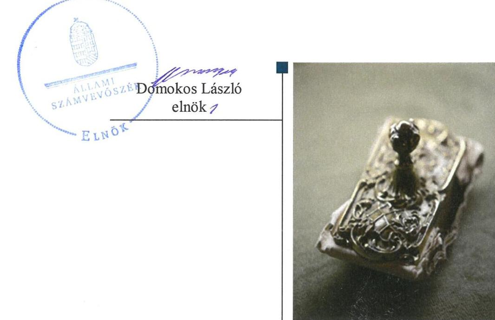
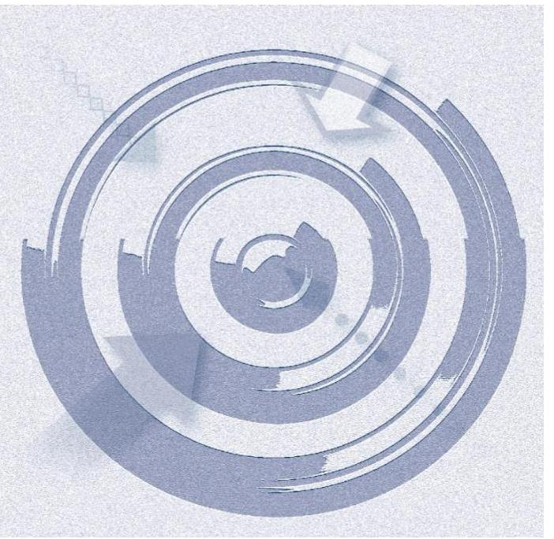
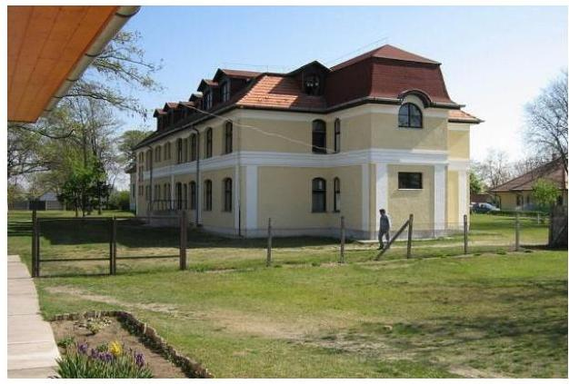
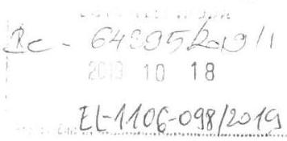
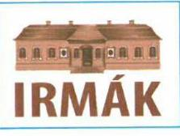
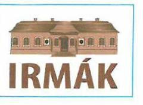
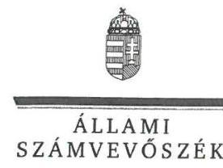
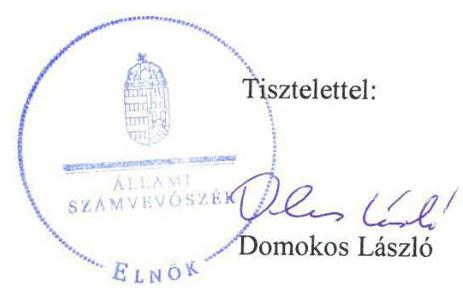
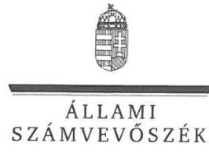
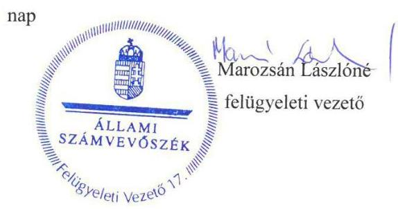

# Jelentés 

## Nem állami humánszolgáltatók ellenőrzése

A humánszolgáltatást nyújtó államháztartáson kívüli szociális intézmények, szolgáltatók fenntartói központi költségvetésből kapott támogatásai felhasználásának ellenőrzése IRMÁK Közhasznú Nonprofit Kft.

2019

---

# Jelentés 

## Nem állami humánszolgáltatók ellenőrzése

A humánszolgáltatást nyújtó államháztartáson kívüli szociális intézmények, szolgáltatók fenntartói központi költségvetésből kapott támogatásai felhasználásának ellenőrzése IRMÁK Közhasznú Nonprofit Kft.
2019. 11. hó 28. nap

---

# AZ ELLENŐRZÉST FELÜGYELTE:

- PETŐ KRISZTINA felügyeleti vezető
- MAROZSÁN LÁSZLÓNÉ felügyeleti vezető

# AZ ELLENŐRZÉST VEZETTE ÉS A VÉGREHAJTÁSÁÉRT FELELŐS:

- DR. KOVÁCS DIÁNA ellenőrzésvezető
- A PROGRAM ÖSSZEÁLLÍTÁSÁÉRT FELELŐS:
  - TÓTPÁL SZABOLCS osztályvezető

**IKTATÓSZÁM:** EL-2237-01/2019.

**TÉMASZÁM:** 2491

**ELLENŐRZÉS-AZONOSÍTÓ SZÁM:** V083504

Jelentéseink az Országgyűlés számítógépes hálózatán és az Interneta a www.asz.hu címen is olvashatóak.

---

# TARTALOMJEGYZÉK 

■ ÖSSZEGZÉS ..... 5
■ AZ ELLENŐRZÉS CÉLJA ..... 6
■ AZ ELLENŐRZÉS TERÜLETE ..... 7
■ AZ ELLENŐRZÉS HÁTTERE, INDOKOLTSÁGA ..... 8
■ A JELENTÉS LÉNYEGES KÉRDÉSKÖREI ..... 9
■ AZ ELLENŐRZÉS HATÓKÖRE ÉS MÓDSZEREI ..... 10
■ MEGÁLLAPÍTÁSOK ..... 12
■ JAVASLATOK ..... 14
■ MELLÉKLETEK ..... 15
I. sz. melléklet: Értelmező szótár ..... 15
■ FÜGGELÉK: ÉSZREVÉTELEK ..... 17
■ RÖVIDÍTÉSEK JEGYZÉKE ..... 25

---

.

---

# ÖSSZEGZÉS 

Az IRMÁK Közhasznú Nonprofit Kft. intézményfenntartóként kialakította a szabályszerű müködési környezetet. A központi költségvetésből kapott támogatás elszámoltathatóságát nem biztositotta. A szociális intézményei müködtetéséhez felhasznált közpénzek átláthatóságát nem biztositotta, a 2016-2017. évi beszámolási kötelezettségének nem tett eleget.

## Az ellenőrzés társadalmi indokoltsága

Az Állami Számvevőszék stratégiájában hangsúlyos szerepet szán annak, hogy szilárd szakmai alapon álló, értékteremtő ellenőrzéseivel előmozdítsa a közpénzügyek átláthatóságát, rendezettségét és javaslataival a közpénzek és a közvagyon szabályos, gazdaságos, hatékony és eredményes felhasználását segítse. Az Állami Számvevőszék a stratégiájában célul tűzte ki, hogy az államháztartáson kívülre nyújtott költségvetési támogatások ellenőrzésével hozzájáruljon ahhoz, hogy a közpénzeket az államháztartáson kívüli szervezetek is átlátható módon használják fel a közfeladatok szerződésben vállalt ellátása érdekében. Az Állami Számvevőszék e stratégiai céljaival összhangban - az Állami Számvevőszékről szóló 2011. évi LXVI. törvény felhatalmazása alapján - végzi a központi költségvetésből származó források, nyújtott támogatások - kedvezményezett szervezetek közfeladat ellátásához való - felhasználásának az ellenőrzését. Az Állami Számvevőszék hozzájárul ezzel ahhoz is, hogy a nyilvánosság és az igénybevevők megfelelő tájékoztatást kapjanak az államháztartáson kívüli közfeladatot ellátók múködéséről.

## Főbb megállapítások, következtetések, javaslatok

Az IRMÁK Közhasznú Nonprofit Kft. a jogszabályi előírások szerint kialakította a szociális humánszolgáltatási közfeladat ellátásának szervezeti és szabályozási kereteit és az intézményei múködésének feltételeit.

Az IRMÁK Közhasznú Nonprofit Kft. a központi költségvetési támogatások felhasználását számviteli rendjében feladatok szerinti bontásban nem kezelte elkülönítetten, a beszámolási kötelezettségének 2016-2017. évekre vonatkozóan nem tett eleget.

Az Állami Számvevőszék az IRMÁK Közhasznú Nonprofit Kft. ügyvezetői részére két javaslatot fogalmazott meg. A javaslatokat megalapozó megállapításokra az érintetteknek 30 napon belül intézkedési tervet kell készíteni.

---

# AZ ELLENŐRZÉS CÉLJA

**AZ ELLENŐRZÉS CÉLJA** annak értékelése volt, hogy az IRMÁK Közhasznú Nonprofit Kft. mint Fenntartó¹ központi költségvetésből kapott támogatásainak felhasználása szabályszerű volt-e, a támogatások igénylése, évközi módosítása és év végi elszámolása megfelelte a jogszabályi előírásoknak.

---

# **AZ ELLENŐRZÉS TERÜLETE**

## **IRMÁK Közhasznú Nonprofit Kft.**

Az albertirsai Fenntartó 2000-ben jött létre. A Fenntartó az ellenőrzött időszakban közhasznú jogállású szervezetként működött, élén kettős ügyvezetés állt, amelynek munkáját háromtagú felügyelőbizottság és egy fő cégvezető támogatta.

A Fenntartónak az ellenőrzött időszakban három, önálló jogi személyiséggel nem rendelkező intézménye volt: Speciális Foglalkoztató Otthon és Intézményei Albertirsán, Idősek Otthona és Intézményei Piliscsabán, és Kraxner Alajos Speciális Foglalkoztató Otthon és Intézményei Csobánkán. Ezen kívül *támogatott lakhatás* közfeladat ellátásában működött közre hat Pest megyei és egy Bács-Kiskun megyei feladatellátási helyen.

A közhasznú tevékenységből részesülők száma 2015-ben 389 fő, 2017-ben 579 fő volt. Ezen belül 2015-ben 343 fő bentlakásos ellátásban, 46 fő nappali ellátásban, 2017-ben 350 fő bentlakásos ellátásban, 66 fő nappali ellátásban, 20 fő házi segítségnyújtásban, 143 fő támogató szolgálatban volt érintett.

A Fenntartó és intézményei törvényességi felügyeletét, illetve ellenőrzését a területileg illetékes kormányhivatalok és az NRSZH², illetve a Kincstár³ gyakorolták.

A Fenntartó összes bevétele a 2015. évi 958,1 M Ft-ról 2017. évre 20,9 %-kal 1158,3 M Ft-ra nőtt, amelyből 2015-ben 292 M Ft, 2016-ban 353,2 M Ft, míg 2017-ben 387,3 M Ft volt a szociális feladathoz kapott központi költségvetési támogatás.

---

# AZ ELLENŐRZÉS HÁTTERE, INDOKOLTSÁGA 

A szociális feladatokat ellátó nem állami intézményfenntartók részére közfeladataik ellátására évente jelentős összegű pénzügyi támogatást biztosítottak a mindenkori költségvetési törvények a bennük megfogalmazott feltételek mellett. A felhasználható állami támogatások a Kvtv.-ben ${ }^{4}$ a 20152017. években a szociális ágazatra vonatkozóan 273 Mrd Ft előirányzatot határoztak meg. Módosították a szociális igazgatásról és szociális ellátásokról szóló 1993. évi III. törvényt, amely - többek között - 2012. január 1-jei hatállyal megfogalmazta a finanszírozási rendszerbe történő befogadással összefüggő szabályokat.

Az ÁSZ ${ }^{5}$ a stratégiájában célul tűzte ki, hogy az államháztartáson kívülre nyújtott költségvetési támogatások ellenőrzésével hozzájárul ahhoz, hogy a közpénzeket az államháztartáson kívüli szervezetek is átlátható módon használják fel a közfeladatok ellátására kötött szerződésekben vállalt ellátása érdekében. Az ÁSZ stratégiájában foglaltak alapján is indokolt az ellenőrzés, amely a társadalom számára jelzi, hogy a közpénzek államháztartáson kívüli felhasználása sem maradhat ellenőrizhetetlenül. Az államháztartáson kívülre nyújtott költségvetési támogatások ellenőrzésével az ÁSZ hozzájárul ahhoz, hogy a közpénzeket a nem állami humán fenntartók átlátható módon használják fel a közfeladatok ellátására kötött szerződésben vállalt kötelezettségek teljesítése érdekében. Az ellenőrzés javaslataival hozzájárul az említett rendszerek szabályszerű támogatás felhasználásához, javítja a társadalmi-gazdasági döntések megalapozottságát, ami a „jól irányított állam" feltétele.

---

# A JELENTÉS LÉNYEGES KÉRDÉSKÖREI 

1. A Fenntartó szabályszerű müködési- és gazdálkodási környezet kialakításával megteremtette-e a költségvetési támogatások átlátható, elszámoltatható igénybevételének, felhasználásának feltételeit?
2. A Fenntartó az átvállalt szociális humánszolgáltatási közfeladathoz biztositott költségvetési támogatásokat szabályszerűen fordította-e a humánszolgáltató intézménye müködtetésére, továbbá intézményei müködtetéséhez felhasznált közpénzekre vonatkozó gazdálkodásával a nyilvánosság előtt elszámolt-e?

---

# AZ ELLENŐRZÉS HATÓKÖRE ÉS MÓDSZEREI 

## Az ellenőrzés típusa

Megfelelőségi ellenőrzés.

## Az ellenőrzött időszak

A 2015. január 1. és 2017. december 31. közötti időszak. A helyszíni szemle tekintetében 2018. január 1-jétől az utolsó helyszíni szemle időpontjáig, 2019. február 5-ig tartó időszak.

## Az ellenőrzés tárgya

Az ellenőrzés a szociális humánszolgáltatási közfeladatokat ellátó Fenntartó humánszolgáltatási közfeladatai ellátásához a költségvetési törvényekben biztosított központi költségvetési támogatások igénylése, évközi módosítása és év végi elszámolása fenntartói feladatellátása, illetve e központi költségvetésből kapott támogatásaik humánszolgáltatási közfeladatokra való fenntartó általi felhasználása szabályszerűségének értékelésére terjedt ki.

## Az ellenőrzött szervezet

IRMÁK Közhasznú Nonprofit Kft. mint intézményfenntartó.

## Az ellenőrzés jogalapja

Az ellenőrzés jogszabályi alapját az ÁSZ tv. ${ }^{6} 1 . \S$ (3) bekezdése, 5. § (3) bekezdésében foglalt előírások adták.

## Az ellenőrzés módszerei

Az ellenőrzést az ellenőrzési program szempontjai, kérdései, az ellenőrzött időszakban hatályos jogszabályok, a nemzetközi standardokat irányadónak tekintve, az ellenőrzés szakmai szabályok és módszertanok figyelembevételével végezte az ÁSZ. A közpénzekkel való felelős gazdálkodás segítésére irányuló javaslatok kidolgozásakor a hatályos jogszabályok voltak irányadóak.

Az ellenőrzés ideje alatt az ellenőrzött szervezettel történő kapcsolattartást az ÁSZ SZMSZ²-ének vonatkozó előírásai alapján biztosította az ÁSZ.

---

Az ellenőrzési kérdések megválaszolásához szükséges bizonyítékok megszerzése az ellenőrzött által rendelkezésre bocsátott dokumentumokra, adatokra alapozva elemző eljárással történt.

Az ellenőrzési bizonyítékként felhasználható adatforrások közé tartoztak egyrészt a szakmai program részletes szempontjainál felsorolt adatforrások, másrészt minden - az ellenőrzés folyamán feltárt, az ellenőrzés szempontjából információt tartalmazó - dokumentum.

Az ellenőrzés lefolytatásához az ellenőrzött szervezet a kitöltött tanúsítványok, valamint az ÁSZ által kért dokumentumok elektronikus úton való megküldésével szolgáltatott adatokat, információkat. Az így rendelkezésre bocsátott adatok, információk és a tanúsítványok adatai valódiságának kontrollja az ellenőrzés keretében történt.

A fenntartott szociális intézményeknél helyszíni szemle keretében győződött meg az ÁSZ a tényleges feladatellátásról (verifikáció).

A szociális humánszolgáltatások központi költségvetési támogatásai igénylésével, módosításával, elszámolásával kapcsolatos, államháztartáson kívüli fenntartó jogszabályokban előírt feladatai betartását, továbbá a központi költségvetési támogatások szabályszerű kezelését, nyilvántartását ellenőrizte az ÁSZ a Fenntartónál határozatok, nyilvántartások, beszámolók és egyéb dokumentumok alapján. Az ellenőrzés nem terjedt ki a szociális humánszolgáltatások központi költségvetési támogatásai igénylése, módosítása, elszámolása valódiságának, megalapozottságának, helyességének - sem a Fenntartónál, sem a székhely intézménynél való - értékelésére. Továbbá nem terjedt ki az ellenőrzés e források szociális intézmények általi szabályszerű felhasználásának értékelésére.

A szabályosság megítélésének alapját képezte, hogy a központi költségvetési támogatások Fenntartó általi igénylése, módosítása és elszámolása a Kincstár felé megtörtént.

---

# MEGÁLLAPÍTÁSOK 

## 1. A Fenntartó szabályszerű múködési- és gazdálkodási környezet kialakításával megteremtette-e a költségvetési támogatások átlátható, elszámoltatható igénybevételének, felhasználásának feltételeit?

Összegző megállapítás

A Fenntartó kialakította a szabályszerű múködési környezetet, a költségvetési támogatások igénylési, módosítási, elszámolási feladatait szabályszerűen ellátta.

A Fenntartó a Ptk. ${ }^{8}$ előírásaival összhangban rendelkezett társasági szerződéssel ${ }^{9}$, amelyben szabályozta szervezeti felépítését, múködési rendjét, a felelősségi-és hatásköröket és azok gyakorlásának módját.

A Fenntartó a Szoc.tv. ${ }^{10}$ rendelkezései szerint a szociális közfeladatok ellátására vonatkozóan kötött ellátási szerződéseket ${ }^{11}$.

A Fenntartó a Számv.tv. ${ }^{12}$ előírása szerint elkészítette a Számviteli Politikát ${ }^{13}$, az annak keretében elkészítendő eszközök és a források leltárkészítési és leltározási szabályzatát, az eszközök és a források értékelési szabályzatát és a pénzkezelési szabályzatot.

A költségvetési támogatások igénylése, módosítása és elszámolása az Atr. ${ }^{14}$ alapján szabályszerűen történt.

## 2. A Fenntartó az átvállalt szociális humánszolgáltatási közfeladathoz biztosított költségvetési támogatásokat szabályszerűen fordította-e a humánszolgáltató intézménye múködtetésére, továbbá intézményei múködtetéséhez felhasznált közpénzekre vonatkozó gazdálkodásával a nyilvánosság előtt elszámolt-e?

Összegző megállapítás

A Fenntartó nem szabályszerűen fordította az intézményei múködtetésére a szociális feladathoz biztosított támogatást, azt nem szabályszerűen tartotta nyilván.

A Fenntartó biztosította intézményei múködtetésének szervezeti feltételeit. A Fenntartó a Szoc.tv. előírásaival összhangban SZMSZ ${ }^{15}$-ben határozta meg a humánszolgáltatást végző intézményei alapfeladatait és múködése kereteit. Az intézményeket a Fenntartó kezdeményezésére a Kormányhivatal ${ }^{16}$ nyilvántartásba vette.

Az Atr. 16. § (1) bekezdésében foglaltak ellenére a költségvetési támogatások felhasználását a számviteli rendjében nem kezelte feladatonkénti bontásban, elkülönítetten.

---

A Fenntartó a Számv. tv. 4. § (1) bekezdésében foglaltak ellenére a 2016-2017. évre vonatkozóan az éves beszámoló készítési kötelezettségének nem tett eleget, mivel a Számv. tv. 20. § (6) bekezdésében foglaltakat megsértve aláírt beszámolóval nem rendelkezett. Így a nyilvánosság előtt a Fenntartó a közfeladatot ellátó intézményei múködtetéséhez felhasznált közpénzekre vonatkozó gazdálkodásával a 2016-2017. évre vonatkozóan megtévesztésre alkalmas módon számolt el.

---

# JAVASLATOK 

Az ÁSZ tv. 33. § (1) bekezdésében foglaltak értelmében az ellenőrzött szervezet vezetője köteles a jelentésben foglalt megállapításokhoz kapcsolódó intézkedési tervet összeállítani és azt a jelentés kézhezvételétől számított 30 napon belül az ÁSZ részére megküldeni. Amennyiben az ellenőrzött szervezet vezetője nem küldi meg határidőben az intézkedési tervet, vagy továbbra sem elfogadható intézkedési tervet küld, az Állami Számvevőszék elnöke az ÁSZ tv. 33. § (3) bekezdése a) és b) pontjaiban foglaltakat érvényesítheti.

## IRMÁK Közhasznú Nonprofit Kft. ügyvezetőinek

1. Gondoskodjon arról, hogy a támogatás felhasználását az Atr. előírásának megfelelően feladatonkénti bontásban, elkülönítetten kezeljék.
(2. sz. megállapítás 2. bekezdése alapján)
2. Intézkedjen az éves beszámolójának a jogszabályi előírásnak megfelelő elkészítéséről.
(2. sz. megállapítás 3. bekezdése alapján)

---

# MELLÉKLETEK 

- I. SZ. MELLÉKLET: ÉRTELMEZŐ SZÓTÁR
civil szervezet
feladatfinanszírozás
humánszolgáltatás
integrált intézmény
költségvetési támogatás
nem állami, nem önkormányzati (államháztartáson kívüli) intézmény fenntartó
székhely intézmény
telephely

A Civil tv. ${ }^{17}$ 2. § 6. pontja szerint civil szervezet a civil társaság, a Magyarországon nyilvántartásba vett egyesület (a párt, a szakszervezet és a kölcsönös biztosító egyesület kivételével), a közalapítvány és a pártalapítvány kivételével az alapítvány.
A közfeladat államháztartáson kívüli szervezet által történő ellátásához közvetlenül kapcsolódó, arányos múködési költségeket finanszírozó költségvetési támogatás.
Külön törvényben meghatározott szociális, gyermekjóléti, gyermekvédelmi közfeladatok (2015. évi Kvtv. 43. § (1), (4) bekezdés, 2016. évi Kvtv. 41. § (1), (4) bekezdés, 2017. évi Kvtv. 41. § (1), (4) bekezdés).

Több intézménytípus különálló szervezeti egységekben történő megszervezése.
a társadalombiztosítás pénzügyi alapjai kivételével az államháztartás központi alrendszeréből ellenérték nélkül, pénzben nyújtott támogatások (Áht. ${ }^{18} 1 . \S 14$. pont)
A költségvetési törvényekben (2013. évi CCXXX. törvény 33-34. §, 2014. évi C. törvény 42-43. §, 2015. évi C. törvény 40-41. §) megállapított támogatás. A 2015. évi C. törvény 40-41. § szerint többek között: Az Országgyűlés a szociális, gyermekjóléti, gyermekvédelmi közfeladatot ellátó intézményt, szolgáltatást fenntartó egyházi jogi személy, civil szervezet, közalapítvány, országos nemzetiségi önkormányzat, települési vagy területi nemzetiségi önkormányzat, gazdasági társaság, és a humánszolgáltatást alaptevékenységként végző, az Szja tv. ${ }^{19}$ hatálya alá tartozó egyéni vállalkozó (a továbbiakban együtt: nem állami szociális fenntartó) részére támogatást állapít meg a következők szerint: a támogatás a nem állami szociális fenntartót a települési önkormányzatok 2. melléklet III. pont 3. alpont c)-k) pontjában és III. pont 5. alpont a) pontjában meghatározott támogatásaival azonos jogcímeken, összegben és feltételek mellett illeti meg.
A szociális közfeladatokat/humánszolgáltatásokat ellátó intézményt fenntartó egyházi jogi személy, társadalmi szervezet, alapítvány, közalapítvány, civil szervezet, országos nemzetiségi önkormányzat, nonprofit gazdasági társaság, gazdasági társaság és a humánszolgáltatást alaptevékenységként végző, Szja tv. hatálya alá tartozó egyéni vállalkozó. (2013. évi Kvtv. 35. § (1), (3) bekezdés, 2014. évi Kvtv. 33. §, 34. § (1), (4) bekezdés, 2015. évi Kvtv. 42. §, 43. § (1), (4) bekezdés, 2016. évi Kvtv. 40. §, 41. § (1), (4) bekezdés)
a szolgáltató székhelye, azaz a szolgáltató központi ügyintézésének helye, függetlenül attól, hogy használják-e szolgáltatás nyújtására (Sznyvhr. ${ }^{20} 1 . \S$ k) pont) (hatályos: 2013. december 1-től)
a szolgáltató székhelyétől különböző, szolgáltató/intézmény használatában álló hely, a szociális humánszolgáltatáshoz használt, bejegyzett hely. (Sznyvhr. 1.§ I) pont) (hatályos: 2015. január 1-től)

---

.

---

# FÜGGELÉK: ÉSZREVÉTELEK 

A jelentéstervezetet a Számvevőszék 15 napos észrevételezésre megküldte az ellenőrzött szervezet vezetőinek az ÁSZ tv. 29. §* (1) bekezdése előírásának megfelelően.

Az IRMÁK Közhasznú Nonprofit Kft. ügyvezetőinek egyike a jelentéstervezet megállapításaira írásban észrevételt tett.
Az ÁSZ tv. 29. § (3) bekezdésével összhangban az ÁSZ a Függelékben feltünteti az ellenőrzés megállapításaival kapcsolatban tett, figyelembe nem vett észrevételeket, és megindokolja, hogy azokat miért nem fogadta el.

[^0]
[^0]:    * 29. § (1) Az Állami Számvevőszék az ellenőrzési megállapításait megküldi az ellenőrzött szervezet vezetőjének vagy az általa megbízott személynek, és annak, akinek személyes felelősségét állapította meg.
    (2) Az ellenőrzött szervezet vezetője és a felelősként megjelölt személy az ellenőrzés megállapításaira tizenöt napon belül írásban észrevételt tehet.
    (3) Az Állami Számvevőszék az észrevételre a beérkezésétől számított harminc napon belül írásban válaszol. A figyelembe nem vett észrevételeket köteles a jelentésben feltüntetni, és megindokolni, hogy azokat miért nem fogadta el.

---

# IRMÁK 

## IRMÁK Közhasznú Nonprofit Korlátolt Felelősségú Társaság

2730 Albertirsa, Köztársaság u. 115.,
Tel: (53) 571-065, 571-131, fax: (53) 571-066
www.irmak.hu, e-mail: irmak@t-online.hu
Cg.: 13-09-129053

## ÁLLAMI SZÁMVEVŐSZÉK

DOMOKOS LÁsZLÓ ELNÖK

TÁRGY: ÉSZREVÉTELEZÉS
Hiv.szám: EL-1106-095/2019.

BUDAPEST
APACZAI CSERE JANOS UTCA 10.
1052

Tisztelt Állami Számvevőszék! Tisztelt Domokos László Elnök Úr!
Az IRMÁK Nonprofit Kft. (Székhely: 2730 Albertirsa, Köztársaság utca 115.; Cégj.: 13-09-129053, Képviseli: Vizvári Csilla ügyvezető) köszönettel megkapta a számvevőszéki jelentéstervezetet, mely kapcsán a tizenöt napon belüli írásos észrevételezési joggal kíván élni, az alábbiak szerint:

Megállapítások: 2. számú megállapítás 2. bekezdés
„Az Atr. 16. § (1) bekezdésben foglaltak ellenére a költségvetési támogatások felhasználását a számviteli rendjében nem kezelte feladatonkénti bontásban, elkülönítetten."

Észrevétel: Csatoltan küldöm a Magyar Államkincstár 2017. évi támogatások ellenőrzéséről szóló jegyzőkönyvét (1. melléklet), melynek 6. oldalának utolsó bekezdése a fenti megállapításnak ellentmond, amikor kifejezetten azt állapítja meg, hogy Társaságunk az Atr. 16. § (1) bekezdésében foglaltaknak megfelelően, a költségvetési támogatások felhasználását a számviteli rendjében feladatonkénti bontásban kezelte, elkülönítetten kezelte....

Mindezek alátámasztásaként az Irmák Nonprofit Kft. az Állami Számvevőszék EL-1106-007/2018. iktatószámú, Adatbekérési Projekt I. során (2018. szeptember 28-án megküldött) dokumentumok jegyzékében 12. pontként „a közfeladatokhoz rendelt költségvetési támogatások nyilvántartására vonatkozó rendelkezés/szabályozás" (2. melléklet), és 13. pontként „a költségvetési források és egyéb mérlegtételek elkülönített, sajátos elszámolásáról szóló rendelkezés/szabályozás" (3. melléklet) válaszul Vizvári Csilla ügyvezető az alábbi nyilatkozatot tette: „A közfeladatokhoz rendelt költségvetési támogatások nyilvántartásához vonatkozó rendelkezések/szabályozásokat az előzetesen benyújtott Számviteli politika 2017.12.12.pdf nevű dokumentum 7. pontja tartalmazza." A költségvetési források és egyéb mérlegtételek elkülönített, sajátos elszámolásról szóló rendelkezés/szabályozást az előzetesen benyújtott Számviteli politika 2017.12.12.pdf nevű dokumentum 7. pontja tartalmazza az alábbiak szerint: „A normatív finanszírozás elszámolásához a munkaszámos könyvelés biztosítja a valódiság elvét. ... Az információs igények kielégítése céljából mely egyrészt az állami támogatás elszámolási rendjéhez igazodik, valamint a vezetői számvitelhez a munkaszámos könyvelést vezette be. A költségviselők mellett a munkaszámok szerinti könyvelés is megvalósul."

A fentiekben említett nyilatkozatok a felületre (https://abr.asz.hu/) 2018. október 10-én, a Számviteli politika és munkaszámok 2018. szeptember 19-én feltöltésre kerültek.

Az Állami Számvevőszék részére 2018. 11. 28. dátumú teljességi és hitelességi nyilatkozat mellékletét képező dokumentumok listájában (4. melléklet) 247; 248; 249 és 250 számon ezek a munkaszámok megtalálhatók.

---

# IRMÁK Közhasznú Nonprofit Korlátolt Felelősségű Társaság 

2730 Albertirsa, Köztársaság u. 115.,
Tel: (53) 571-065, 571-131, fax: (53) 571-066
www.irmak.hu, e-mail: irmak@t-online.hu
Cg.: 13-09-129053

Az IRMÁK Nonprofit Kft. Számviteli politikájának mellékletét képező munkaszámok listája lehetővé teszi, hogy engedélyesenként és ezen belül jogcímenként bontásban kerüljenek a könyvviteli nyilvántartásban mind az állami támogatások, mind az azokra elszámolt költségek.

A fentiek gyakorlatban való megvalósításának példájaként csatoltam a Csobánkai Támogató Szolgálat 2017. évi támogatásának elszámolását és felhasználását igazoló költséghelyes főkönyvi kivonatot (munkaszám: 124 hivatkozással a számviteli politika említett mellékletére) (5. melléklet) valamint az ahhoz kapcsolódó, a Magyar Államkincsár ellenőrzése során kért tanúsítványt (6. melléklet), illetve az Állami Számvevőszék által kért tanúsítványt (7. melléklet).

A fentiek figyelembevételével kérjük a Tisztelt Állami Számvevőszéket, hogy jelentéséből az 2. számú megállapítás 2. bekezdésében szereplő a költségvetési támogatások felhasználását érintő észrevételét mellőzni szíveskedjen!

Megállapítások: 2. számú megállapítás 3. bekezdés „A nyilvánosság előtt a Fenntartó a közfeladatot ellátó intézményei müködéséhez felhasznált közpénzekre vonatkozó gazdálkodásával 2016-2017. évre vonatkozóan nem számolt el, mivel a Fenntartó a Számv. tv. 4. § (1) bekezdésében foglaltak ellenére - a Számv. törvény 20. § (6) bekezdésében foglaltakat megsértve - a 2016-2017. évi beszámolási kötelezettségének nem tett eleget."

Észrevétel: A Számv. tv. 4. § (1) bekezdése szerint „A gazdálkodó müködéséről, vagyoni, pénzügyi és jövedelmi helyzetéről az üzleti év könyveinek zárását követően, e törvényben meghatározott könyvvezetéssel alátámasztott beszámolót köteles - magyar nyelven - készíteni.", míg a 20. § (6) bek. értelmében „Az éves beszámoló részét képező mérleget, eredménykimutatást és kiegészítő mellékletet a hely és a kelet feltüntetésével a vállalkozó képviseletére jogosult személy köteles aláírni."

A 2006. évi V. tv. 18. § (1) bekezdése szerint: A cégnek a számviteli törvény szerinti beszámolót az E-ügyintézési tv. szerinti hivatalos elérhetőségén keresztül kell a céginformációs szolgálat részére megküldeni; ennek során nincs helye a papír alapú beszámoló képi formátumú elektronikus okirattá történő átalakításának. A beszámolóhoz - a cég, a beszámolót benyújtó természetes személy azonosíthatósága, valamint a benyújtás jogszerűségének igazolása érdekében - elektronikus űrlapot kell mellékelni; a céginformációs szolgálat a benyújtó adatait és jogosultságát ellenőrzi.

Csatoltan küldöm az e-beszámoló.im.gov.hu hivatalos weboldalról készült felvételt (8. melléklet), amelyen látszik, hogy mind 2016. mind 2017. évre készült, és közzé lett téve az Irmák Nonprofit Kft. beszámolója.

A beszámoló aláírása elektronikus úton történik, a cégkapun keresztüli megküldéssel. Papír alapon aláírt beszámoló, vagy annak bármilyen mellékletének feltöltésére nincs lehetőség, amint az a fent hivatkozott jogszabályból is kiderül. Ugyanakkor a félreértések elkerülése érdekében csatoltan megküldöm a 2016. és 2017. évi éves beszámoló elfogadására vonatkozó taggyűlési határozatot, valamint a cégjegyzésre jogosult által korábban már aláírt 2016 és 2017. évi éves beszámolók eredetivel mindenben megegyező hiteles másolati példányait (9-10. melléklet). Tájékoztatjuk Önöket továbbá, hogy a beszámoló aláírásának napjától kezdődően

---

# IRMÁK Közhasznú Nonprofit Korlátolt Felelősségű Társaság

2730 Albertirsa, Köztársaság u. 115.,

Tel: (53) 571-065, 571-131, fax: (53) 571-066

www.irmak.hu, e-mail: irmak@t-online.hu

Cg.: 13-09-129053

Társaságunk székhelyén rendelkezésre áll. Megállapítható, hogy Társaságunk a beszámoló készítési és annak közzétételére vonatkozó kötelezettségének, azaz beszámolási kötelezettségének a jogszabályoknak megfelelő módon és határidőben eleget tett. Megállapítható továbbá, hogy az Igazságügyi Minisztérium Céginformációs és az Elektronikus Cégeljárásban Közreműködő Szolgálat Elektronikus Beszámoló Portálon közzétett beszámoló megegyezik a most megküldött, kinyomtatott, aláírt beszámolóval. Hivatkozunk továbbá arra a tényre, hogy egyébként a beszámolók Társaságunk honlapján is elérhetőek (http://irmak.hu/szolgaltatasok/kozerdeku-informaciok).

Kérjük, hogy erre tekintettel az éves beszámoló készítésére vonatkozó kötelezettség elmulasztására vonatkozó 2. számú megállapítást jelentésükből mellőzni szíveskedjenek!

Albertirsa, 2019. október 15.

IRMÁK

Vizvári Csilla

Ügyvezető

Közhasznú Nonprofit Kft.

Levétesítve: 2730 Albertirsa, Köztársaság u. 115.,

Cégjegyzékszám: 13-09-129053

Adószám: 20321083-8-12

## Mellékletek jegyzéke:

1. **melléklet** - Magyar Államkincstár 2017. évi támogatások ellenőrzéséről szóló jegyzőkönyve
2. **melléklet** - Állami Számvevőszék EL-1106-007/2018. iktatószámú, Adatbekérési Projekt I. során (2018. szeptember 28-án megküldött) dokumentumok jegyzékében 12. ponthoz tett nyilatkozat
3. **melléklet** - Állami Számvevőszék EL-1106-007/2018. iktatószámú, Adatbekérési Projekt I. során (2018. szeptember 28-án megküldött) dokumentumok jegyzékében 13. ponthoz tett nyilatkozat
4. **melléklet** - Állami Számvevőszék részére megküldött 2018. 11. 28. dátumú teljességi és hitelességi nyilatkozat
5. **melléklet** - Csobánkái Támogató Szolgálat 2017. évi támogatásának elszámolását és felhasználását igazoló költséghelyes főkönyvi kivonat
6. **melléklet** - Magyar Államkincsár ellenőrzése során kért tanúsítvány
7. **melléklet** - Állami Számvevőszék ellenőrzése során kért tanúsítvány
8. **melléklet** - e-beszámoló.im.gov.hu hivatalos weboldalról készült felvétel
9. **melléklet** - 2016. évi éves beszámolók eredetivel mindenben megegyező hiteles másolati példánya
10. **melléklet** - 2017. évi éves beszámolók eredetivel mindenben megegyező hiteles másolati példánya

---

# Vízvári Csilla úrhölgy 

ügyvezető

IRMÁK Közhasznú Nonprofit Kft.

## Albertirsa

## Tisztelt Ügyvezető Úrhölgy!

A ,,Nem állami humánszolgáltatók ellenőrzése - A humánszolgáltatást nyújtó államháztartáson kivüli szociális intézmények, szolgáltatók fenntartói központi költségvetésböl kapott támogatásai felhasználásának ellenőrzése - IRMÁK Közhasznú Nonprofit Kft. " cimmel készített számvevöszéki jelentéstervezetre tett, 2019. október 15 -én kelt levelében megküldött észrevételeit köszönettel megkaptam.
Az Állami Számvevőszék észrevételekre vonatkozó álláspontjáról a felügyeleti vezető által készített részletes tájékoztatást csatoltan megküldöm.
Tájékoztatom Ügyvezető úrhölgyet, hogy a számvevőszéki jelentésben - az Állami Számvevőszékről szóló 2011. évi LXVI. törvény 29. § (3) bekezdése alapján - a figyelembe nem vett észrevételeket szerepeltetjük az elutasítás indokának feltüntetésével.

Budapest, 2019. 11 hó 15 nap

Melléklet: Tájékoztatás az észrevételek kezeléséről

---

FELÜGYELETI VEZETŐ

Melléklet
Ikt.szám: EL-1106-099/2019.

# Tájékoztatás az észrevételek kezeléséről 

A „Nem állami humánszolgáltatók ellenörzése - A humánszolgáltatást nyújtó államháztartáson kivüli szociális intézmények, szolgáltatók fenntartói központi költségvetésböl kapott támogatásai felhasználásának ellenörzése - IRMÁK Közhasznú Nonprofit Kft. " című jelentéstervezetre (továbbiakban: jelentéstervezet) a 2019. október 15 -én kelt levelében megküldött észrevételeit áttekintettem. Az észrevételek kezeléséről az alábbi tájékoztatást adom.

## 1. A költségvetési támogatások nyilvántartásával, felhasználásának kezelésével kapcsolatban tett észrevétel (Jelentéstervezet 2. összegző megállapítás és annak a 2. bekezdése)

Ügyvezető úrhölgy észrevételében kifejtette, hogy nem értenek egyet a számvevőszéki jelentéstervezet azon megállapításával, hogy a költségvetési támogatások felhasználását számviteli rendjükben nem kezelték feladatonkénti bontásban, elkülönítetten. A fentiek alátámasztására elmondta, hogy az ellenőrzéshez történő adatszolgáltatás során átadott 2017. évi Számviteli politika 7. pontja - az adatszolgáltatás során nyilatkozatban is megerősített módon - tartalmazza az IRMÁK Közhasznú Nonprofit Kft. (továbbiakban: Fenntartó) könyvelésében a munkaszámok alkalmazására vonatkozó szabályozás lefektetését, amely lehetővé teszi, hogy engedélyesenként és ezen belül jogcímenként szerepeljenek a könyvviteli nyilvántartásban mind az állami támogatások, mind az azokra elszámolt költségek. Továbbá észrevételéhez csatolta a Magyar Államkincstár 2018. június 26-án kelt ellenőrzési jegyzőkönyvét, amely 2017. évi ellenőrzött időszakra a támogatások felhasználásának elkülönített nyilvántartására vonatkozóan a Fenntartó egyházi és nem állami fenntartású szociális, gyermekjóléti és gyermekvédelmi szolgáltatók, intézmények és hálózatok állami támogatásáról szóló 489/2013. (XII. 18.) Korm. rendelet (továbbiakban: Atr.) 16. § (1) bekezdésének való megfelelését állapította meg.
Ügyvezető úrhölgy észrevételében foglaltakra válaszolva tájékoztatom, hogy az ellenőrzött időszakban hatályos számviteli politikák könyvvezetés szabályait rögzítő 7. pontja valóban tartalmazott arra vonatkozó előirást, hogy a Fenntartó az állami támogatások elszámolási rendjéhez igazodóan munkaszámos könyvvezetést alkalmaz. Ugyanakkor a számviteli politikához mellékelt munkaszám listák nem biztosították teljes körűen az állami támogatások felhasználásának az Atr. 16. § (1) bekezdés előírásának megfelelő elkülönített kezeléséhez a szabályozási kereteket tekintettel arra, hogy abban több munkaszám esetében a feladatonkénti bontás nem volt beazonosítható.
Az EL-1106-007/2019. iktatószámú adatbekérő levélben kértük továbbá a 2015-2017. évek viszonylatában a költségvetési támogatások elkülönített nyilvántartását igazoló dokumentumok, főkönyvi és analitikus nyilvántartások ellenőrzés részére való átadását, amelyre - a 2018. október 10 -én kelt teljességi és hitelességi nyilatkozattal alátámasztott módon - a

---

Fenntartó 2015-2017. évi állami támogatásból származó bevételeit bemutató fökönyvi kartonok kerültek átadásra. Az Atr. 16. § (1) bekezdése szerint a Fenntartónak a költségvetési támogatások felhasználását kell feladatonkénti bontásban, elkülönítetten kezelniük számviteli rendjükben, viszont az ellenőrzés rendelkezésére bocsátott fökönyvi kartonok a támogatás felhasználására vonatkozóan nem tartalmaztak adatokat. Ügyvezető úrhölgy a teljességi és hitelességi nyilatkozatban az átadott dokumentumok, adatok hitelességéért, valódiságáért, hiánytalanságáért és hatályosságáért teljes felelősséget vállalt.
Az Állami Számvevőszék (továbbiakban: ÁSZ) az ellenőrzési megállapításait az ellenőrzéshez kapcsolódó adatszolgáltatás során a részére törvényi határidőben rendelkezésre bocsátott dokumentumokra alapozva teszi meg. Fentiekre tekintettel az észrevételt nem fogadjuk el, a jelentéstervezet módosítása nem indokolt.
2. A 2016-2017. évi beszámoló készitési kötelezettség teljesitésével és a nyilvánosság előtti elszámolással kapcsolatban tett megállapításra érkezett észrevétel (Jelentéstervezet 2. összegző megállapítása és annak a 3. bekezdése)
Ügyvezető úrhölgy észrevételében kifejtette, hogy a Fenntartó a 2016. és 2017. évek tekintetében beszámoló készítési és közzétételi kötelezettségének a jogszabályoknak megfelelő módon és határidőben eleget tett. Ügyvezető úrhölgy hivatkozott a cégnyilvánosságról, a bírósági cégeljárásról és a végelszámolásról szóló 2006. évi V. törvény (továbbiakban: Cnytv.) 18. § (1) bekezdésének azon előírására, hogy a „cégnek a számviteli törvény szerinti beszámolót az E-ügyintézési tv. szerinti hivatalos elérhetőségén keresztül kell a céginformációs szolgálat részére megküldeni; ennek során nincs helye a papír alapú beszámoló képi formátumú elektronikus okirattá történő átalakításának." Ügyvezető úrhölgy szerint a beszámoló aláírása elektronikus úton történik, a cégkapun keresztüli megküldéssel. Elmondása szerint a 2016. és 2017. évi számviteli beszámolók az Igazságügyi Minisztérium Céginformációs és az Elektronikus Cégeljárásban Közremüködő Szolgálata (továbbiakban: Céginformációs Szolgálat) weboldalán, a Fenntartó honlapján és székhelyén rendelkezésre állnak.
Ügyvezető úrhölgy észrevételében foglaltakra válaszolva tájékoztatom, hogy az EL-1106001/2019. iktatószámú adatbekérő levélben kértük a Fenntartó 2015-2017. évi számviteli beszámolóinak az ÁSZ részére való rendelkezésre bocsátását. Az adatbekérő levél 2. melléklete kihangsúlyozta, hogy az ellenőrzött időszakra vonatkozóan az aláirt és hiteles dokumentumokat szükséges az adatszolgáltatási felületre feltölteni, így egyértelmű volt, hogy nem a Céginformációs Szolgálat online programjával előállított, aláírás nélküli beszámolót kértük az adatszolgáltatás során átadni. A 2018. szeptember 28-án kelt teljességi és hitelességi nyilatkozattal alátámasztott módon csak a 2015. évi számviteli beszámoló került az ÁSZ ellenőrzéséhez aláírt formában benyújtásra. A 2016. és 2017. évekre vonatkozóan a Céginformációs Szolgálat online beszámoló készítő programjával, a beküldő által megadott adatok alapján előállított aláírás nélküli számviteli beszámoló, ezenkívül a kiegészítő melléklet, közhasznúsági melléklet és könyvvizsgálói jelentés kerültek az ÁSZ elektronikus adatszolgáltató felületére Önök által feltöltésre, de ezek egyike sem tartalmazott aláírást.
Az észrevételében foglaltak alapján tájékoztatom, hogy az Állami Számvevőszékről szóló

---

2011. évi LXVI. törvény által biztosított határidőn belül megküldött 2016. és 2017. évi számviteli beszámolók, illetve annak külön is rendelkezésre bocsátott részei a számvitelről szóló 2000. évi C. törvény (továbbiakban: Számv. tv.) 20. § (6) bekezdésében foglalt előírásokat megsértve nem tartalmazták a Fenntartó képviseletére jogosult személy aláírását, ezáltal nem feleltek meg a Számv. tv. 4. § (1) bekezdésében előírt számviteli beszámolónak. Ennek következtében a Céginformációs Szolgálat részére megküldött elektronikus beszámoló adatai is megtévesztésre alkalmas módon kerültek közzétételre, mivel a Számv. tv.-nek megfelelő aláirt beszámoló azokat nem támasztotta alá.
Az ÁSZ az ellenőrzési megállapításait az ellenőrzéshez kapcsolódó adatszolgáltatás során a részére törvényi határidőben rendelkezésre bocsátott dokumentumokra alapozva teszi meg, a törvényes határidőn túl rendelkezésre bocsátott dokumentumokat nem értékeli.
Fentiekre tekintettel az éves beszámoló készítésére vonatkozó kötelezettség elmulasztására vonatkozó megállapítás törlésére irányuló észrevételét nem fogadjuk el. A jelentéstervezet 2. megállapítása és a kapcsolódó részmegállapítása módosításra került.

Budapest, 2019. 14 hó 45 nap

---

# RÖVIDÍTÉSEK JEGYZÉKE 

${ }^{1}$ Fenntartó
${ }^{2}$ NRSZH
${ }^{3}$ Kincstár
${ }^{4}$ Kvtv.
${ }^{5}$ ÁSZ
${ }^{6}$ ÁSZ tv.
${ }^{7}$ ÁSZ SZMSZ
${ }^{8}$ Ptk.
${ }^{9}$ társasági szerződés
${ }^{10}$ Szoc.tv.
${ }^{11}$ ellátási szerződés
${ }^{12}$ Számv.tv.
${ }^{13}$ Számviteli Politika

IRMÁK Közhasznú Nonprofit Kft.
Nemzeti Rehabilitációs és Szociális Hivatal
Magyar Államkincstár
Magyarország 2015. évi központi költségvetéséről szóló 2014. évi C. törvény (hatályos: 2015. január 1. és 2018. december 31. között)
Magyarország 2016. évi központi költségvetéséről szóló 2015. évi C. törvény (hatályos: 2016. január 1. és 2019. december 31. között)
Magyarország 2017. évi központi költségvetéséről szóló 2016. évi XC. törvény (hatályos: 2016. november 1. és 2020. december 31. között)
Állami Számvevőszék
az Állami Számvevőszékről szóló 2011. évi LXVI. törvény (hatályos: 2011. július 1-től)
az Állami Számvevőszék Szervezeti és Múködési Szabályzata
a Polgári Törvénykönyvről szóló 2013. évi V. törvény (hatályos: 2014. március 15-től)
IRMÁK Közhasznú Nonprofit Kft. társasági szerződése (hatályos: 2014. július 16-tól)
IRMÁK Közhasznú Nonprofit Kft. társasági szerződése (hatályos: 2016. március 09-től)
IRMÁK Közhasznú Nonprofit Kft. társasági szerződése (hatályos: 2017.február 01-től)
a szociális igazgatásról és szociális ellátásokról szóló 1993. évi III. törvény (hatályos: 1993. február 26-tól)
a Szociális és Gyermekvédelmi Főigazgatóság és az IRMÁK Közhasznú NKft. között 2014. december 16-án létrejött ellátási szerződés-módosítás
Albertirsa Város Önkormányzata és az IRMÁK Közhasznú NKft. között 2015. február 6-án létrejött ellátási szerződés-módosítás
Albertirsa Város Önkormányzata és az IRMÁK Közhasznú NKft. között 2016. április 15-én létrejött ellátási szerződés-módosítás
Albertirsa Város Önkormányzata és az IRMÁK Közhasznú NKft. között 2017. február 27-én létrejött ellátási szerződés-módosítás
Ceglédbercel Község Önkormányzat és az IRMÁK Közhasznú NKft. között 2015. május 22-én létrejött ellátási szerződés
Piliscsaba Város Önkormányzata és az IRMÁK Közhasznú NKft. között 2016. december 15-én létrejött ellátási szerződés
a számvitelről szóló 2000. évi C. törvény (hatályos: 2001. január 1-jétől)
IRMÁK Közhasznú Nonprofit Kft. - Számviteli Politika (hatályos: 2015. január 01-től)
IRMÁK Közhasznú Nonprofit Kft. - Számviteli Politika (hatályos: 2015. augusztus 25-től)
IRMÁK Közhasznú Nonprofit Kft. - Számviteli Politika (hatályos: 2016. január 01-től)
IRMÁK Közhasznú Nonprofit Kft. - Számviteli Politika (hatályos: 2016. március 07-től)

---

${ }^{14}$ Atr.
${ }^{15}$ SZMSZ
${ }^{16}$ Kormányhivatal
${ }^{17}$ Civil tv.
${ }^{18}$ Áht.
${ }^{19}$ Szja tv.
${ }^{20}$ Sznyvhr.

IRMÁK Közhasznú Nonprofit Kft. - Számviteli Politika (hatályos: 2017.december 12-től)
az egyházi és nem állami fenntartású szociális, gyermekjóléti és gyermekvédelmi szolgáltatók, intézmények és hálózatok állami támogatásáról szóló 489/2013. (XII. 18.) Korm. rendelet (hatályos: 2014. január 1-jétől)
szervezeti és múködési szabályzat
Pest Megyei Kormányhivatal
az egyesülési jogról, a közhasznú jogállásról, valamint a civil szervezetek múködéséről és támogatásáról szóló 2011. évi CLXXV. törvény (hatályos: 2011. december 22-től)
az államháztartásról szóló 2011. évi CXCV. törvény (hatályos: 2012. január 1-jétől)
a személyi jövedelemadóról szóló 1995. évi CXVII. törvény (hatályos: 1996. január 1-jétől)
a szociális, gyermekjóléti és gyermekvédelmi szolgáltatók, intézmények és hálózatok hatósági nyilvántartásáról és ellenőrzéséről szóló 369/2013. (X.24.) Korm. rendelet (hatályos: 2013. december 1-jétől)

---

# ÁLLAMI SZÁMVEVŐSZÉK 

1052 Budapest, Apáczai Csere János utca 10.
Levélcím: 1364 Budapest 4. Pf. 54
Telefon: +36 14849100 Telefax: +36 14849200
www.asz.hu