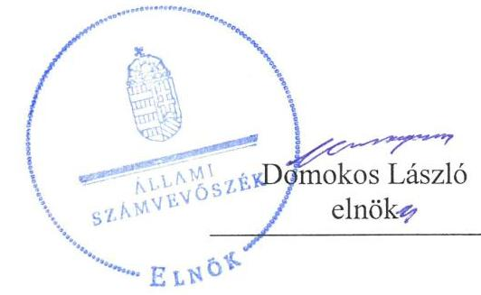
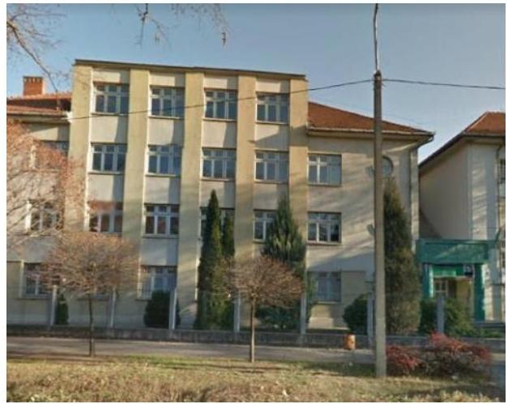

# Jelenetés 

## Központi költségvetési szervek ellenőrzése

Török János Mezőgazdasági és Egészségügyi Szakgimnázium és Szakközépiskola 2019.

19225
www.asz.hu

---

# Jelențtés 

## Központi költségvetési szervek ellenőrzése

Török János Mezőgazdasági és Egészségügyi Szakgimnázium és Szakközépiskola
2019. 12. hó 13. nap

---

# AZ ELLENŐRZÉST FELÜGYELTE:

## MAROZSÁN LÁSZLÓNÉ felügyeleti vezető

## AZ ELLENŐRZÉST VEZETTE ÉS A VÉGREHAJTÁSÁÉRT FELELŐS:

### GÖRGÉNYI GÁBOR ellenőrzésvezető

### A PROGRAM ÖSSZEÁLLÍTÁSÁÉRT FELELŐS:

### TÓTPÁL SZABOLCS osztályvezető

---

**IKTATÓSZÁM:** EL-2238-001/2019.

**TÉMASZÁM:** 2450

**ELLENŐRZÉS-AZONOSÍTÓ SZÁM:** V079176

---

Jelentéseink az Országgyűlés számítógépes hálózatán és az Interneta a www.asz.hu címen is olvashatóak.

---

# TARTALOMJEGYZÉK 

■ ÖSSZEGZÉS ..... 5
■ AZ ELLENŐRZÉS CÉLJA ..... 6
■ AZ ELLENŐRZÉS TERÜLETE ..... 7
■ AZ ELLENŐRZÉS HÁTTERE, INDOKOLTSÁGA ..... 8
■ A JELENTÉS LÉNYEGES KÉRDÉSKÖREI ..... 10
■ AZ ELLENŐRZÉS HATÓKÖRE ÉS MÓDSZEREI ..... 11
■ MEGÁLLAPÍTÁSOK ..... 14
■ JAVASLATOK ..... 18
■ MELLÉKLETEK ..... 21
I. sz. melléklet: Értelmező szótár ..... 21
■ FÜGGELÉKEK ..... 25
I. sz. függelék a jelentéshez ..... 25
II. sz. függelék: Észrevételek ..... 26
■ RÖVIDÍTÉSEK JEGYZÉKE ..... 27

---

.

---

# ÖSSZEGZÉS 

A Török János Mezőgazdasági és Egészségügyi Szakgimnázium és Szakközépiskola müködésének szabályozottsága, pénzügyi és vagyongazdálkodása nem felelt meg a jogszabályi előírásoknak. Nem volt biztositott a felelős, átlátható és elszámoltatható közpénzfelhasználás és a vagyonmegőrzés feltétele. A korrupcióval szembeni védettség nem volt arányos a kockázatokkal.

## Az ellenőrzés társadalmi indokoltsága

Magyarország versenyképességének és a magyar gazdaság fejlődésének alapvető feltétele a magyar munkavállalók megfelelő szakmai képzettsége és felkészültsége, amelyben a szakképzési rendszernek döntő szerepe van. A mezőgazdaság vonatkozásában is kiemelten fontos ez, hiszen a magyar mezőgazdaság piaci versenyképességét és eredményességét nagymértékben befolyásolja az agrárszférában dolgozók képzettsége, felkészültsége. A szakképzés legjelentősebb színterei a szakképző iskolák. Az eredményes és célszerű szakképzés alapja és alapvető feltétele a szakképző intézmények közpénzekkel és a közvagyonnal való törvényes, átlátható és a korrupcióval szembeni védelmet biztosító múködése és gazdálkodása. Ezért ezen szervezetekkel szemben is alapvető társadalmi igény, hogy a rájuk bízott közpénzekkel, közvagyonnal szabályosan gazdálkodjanak. Emellett a szakképzésben részt vevő pedagógusok, tanulók és a szülők jogos elvárása, hogy a szakképző iskolák múködése átlátható és elszámoltatható legyen. Mindezen igényekkel összhangban, a közpénzügyek átláthatóságának előmozdítása, a közvagyon védelme érdekében került sor az agrárszakképző iskolák belső kontrollrendszerének és gazdálkodásának ellenőrzésére.

## Főbb megállapítások, következtetések, javaslatok

A Török János Mezőgazdasági és Egészségügyi Szakgimnázium és Szakközépiskola kontrollkörnyezetének kialakítása a belső szabályzatok tartalmi hiányosságai miatt, az integrált kockázatkezelési rendszer a gazdálkodási feladatokra kiterjedő múködtetés elmaradása miatt nem volt szabályszerű. A Török János Mezőgazdasági és Egészségügyi Szakgimnázium és Szakközépiskola igazgatója a vagyonnyilatkozat-tételre kötelezett munkaköröket a szervezeti és múködési szabályzatban nem határozta meg, ezáltal nem tette meg az alapvető intézkedést a korrupcióval szembeni védelem érdekében. A feltárt hiányosságok miatt a Török János Mezőgazdasági és Egészségügyi Szakgimnázium és Szakközépiskola belső kontrollrendszere nem biztosította a múködés és gazdálkodás szabályozottságát.

Pénzügyi gazdálkodása nem volt szabályszerű, mert a szerződések, megrendelések nem tartalmazták a jogszabályban előírt tartalmi elemeket, továbbá a kötelezettségvállalással terhelt maradványt nem támasztotta alá szabályszerű nyilvántartás.

A Török János Mezőgazdasági és Egészségügyi Szakgimnázium és Szakközépiskola vagyongazdálkodása nem volt szabályszerű, a 2016-2017. évi költségvetési beszámolója nem mutatott valós összképet a vagyoni helyzetéről, mivel a mérleg tételeinek alátámasztásához összeállított leltár nem tartalmazta a vagyonkezelt ingatlanokat.

A korrupció elleni védelmet biztosító integritás kontrollrendszer nem kötelezően előírt kontrolljait a 2017. évben nem a korrupciós kockázatokkal arányosan építették ki. A teljesítménymérés feltételei a szükséges követelmények kialakításának hiánya miatt nem álltak fenn.

Az Állami Számvevőszék a Török János Mezőgazdasági és Egészségügyi Szakgimnázium és Szakközépiskola igazgatójának 9 javaslatot fogalmazott meg.

---

# AZ ELLENŐRZÉS CÉLJA 

AZ ELLENŐRZÉS CÉLJA annak megítélése volt, hogy az ellenőrzött intézményre vonatkozó irányító szervi feladatellátás a jogszabályi előírások betartásával történt-e; az intézménynél a belső kontrollrendszer kialakítása és múködtetése szabályszerű volt-e, biztosította-e az átlátható, szabályszerű, gazdaságos, hatékony és eredményes gazdálkodás feltételeit; az intézmény pénzügyi és vagyongazdálkodása megfelelt-e a jogszabályi előírásoknak és belső szabályzatainak. Az ellenőrzés keretében az ÁSZ ${ }^{1}$ értékelte az intézmény korrupciós kockázatainak kezelését szolgáló integritás kontrollok kiépítettségét és az integritás szemlélet érvényesülését. Az ÁSZ értékelte, hogy az intézménynél megteremtették-e a teljesítményellenőrzés feltételeit. Értékelte továbbá, hogy érvényesült-e a nemzeti vagyon kezelésének és védelmének célja, azaz a szervezet vagyona a közérdeket szolgálta, a közös szükségletek kielégítése és a természeti erőforrások megóvása, valamint a jövő nemzedékek szükségleteinek figyelembevétele mellett.

---

# **AZ ELLENŐRZÉS TERÜLETE**

## **Török János Mezőgazdasági és Egészségügyi Szakgimnázium és Szakközépiskola**

A Török János Mezőgazdasági és Egészségügyi Szakgimnázium és Szakközépiskola alaptevékenysége szerint szakgimnáziumi és szakközépiskolai nevelés-oktatást, valamint felnőttoktatást végez egészségügyi, környezetvédelem-vízgazdálkodási és mezőgazdasági szakmacsoport szerinti képzések keretében.

Az irányító szervi feladatokat 2016. január 1. és 2017. december 31. között az intézmény2, mint köznevelési intézmény fenntartója3, a Földművelésügyi Minisztérium látta el. A minisztérium 2013. augusztus 1. óta gyakorolja az intézmény felett a fenntartói feladatokat.

Az intézmény nem rendelkezett gazdasági szervezettel, a gazdálkodási feladatait a nagykőrösi székhelyű Toldi Miklós Élelmiszeripari Szakgimnázium, Szakközépiskola és Kollégium látta el. A munkamegosztást együttműködési megállapodásban4 rögzítették. Az együttműködési megállapodás alapján a gazdasági szervezet5 főbb feladata volt a költségvetési beszámoló elkészítése és az analitikus és főkönyvi nyilvántartások vezetése. Az intézmény főbb feladata volt a leltározás a gazdasági szervezet közreműködésével, továbbá a kis értékű tárgyi eszközök nyilvántartása.

Az intézmény az ellenőrzött időszakban vállalkozási tevékenységet nem végzett, az Áht.6 és az Nktv.7 szerinti átalakításra, átszervezésre nem került sor.

Az intézmény feladatellátását vagyonkezelési szerződések alapján kezelt önkormányzati és állami ingatlanvagyon biztosította, amely az iskola épületéből, a kapcsolódó udvarból, valamint a tangazdaságból állt.

Az intézmény által készített beszámolók szerint az intézmény teljesített összes bevétele a 2016. december 31-ei 398,8 M Ft-ról 2017. év végére 3,8%-kal, 414,0 M Ft-ra nőtt, ebből a finanszírozási bevételek nagysága 280,1 M Ft és 320,4 M Ft volt. A teljesített összes kiadás a 2016. december 31-ei 381,9 M Ft-ról 2017-re 4,5%-kal, 399,1 M Ft-ra nőtt.

Az intézmény munkavállalóinak átlagos statisztikai állományi létszáma 2016-ban 63 fő volt, amely 2017-ben 65 főre nőtt. A munkáltatói jogokat az igazgató8 gyakorolta, személye nem változott az ellenőrzött időszakban.

---

# AZ ELLENŐRZÉS HÁTTERE, INDOKOLTSÁGA 

Az államháztartás központi alrendszerének közpénz felhasználása, az intézmények által ellátott közfeladatok sokrétűsége, valamint a feladatellátásához rendelt vagyon nagyságrendje indokolja, hogy az ÁSZ ellenőrzéseket folytasson a pénzügyi és vagyongazdálkodás területén.

Az államháztartás központi alrendszerébe tartozó szervezet vagyona a nemzeti vagyon része és az Alaptörvény ${ }^{9}$ is rögzíti, hogy a vagyonnal való gazdálkodás célja a közérdek szolgálata. Az ÁSZ ellenőrzi az éves költségvetési törvény végrehajtását, az ellenőrzés során feltárt kockázatok és a terület folyamatos kockázatelemzésével beazonosított kockázatok kezelése érdekében ráépülő ellenőrzésekkel ellenőrzi a költségvetési szervek gazdálkodását, múködését, hogy az ellenőrzések megállapításaival támogassa az ellenőrzött szervezetek szabályszerű gazdálkodását, javaslataival elősegítse az Alaptörvényben megfogalmazott alapvetések érvényesülését a mindennapi életben a szervezetek szintjén. A központi költségvetés rendszerében zajló folyamatok holisztikus elemzései, a kockázatok folyamatos figyelemmel kísérésének módszerével, az így kiválasztott szervezetek célzott, hatékony ellenőrzéseivel az ÁSZ betölti a legfőbb gazdasági ellenőrző szerv küldetését.

A belső kontrollrendszer kialakítása és múködtetése nélkül nem valósítható meg a közpénzek, a közvagyon átlátható, szabályos, gazdaságos, hatékony és eredményes felhasználása. A belső kontrollrendszer azt a célt szolgálja, hogy a költségvetési szervek múködésük és gazdálkodásuk során a tevékenységeket szabályszerűen hajtsák végre, teljesítsék elszámolási kötelezettségeiket és megvédjék az erőforrásokat a veszteségektől, a károktól és a nem rendeltetésszerű használattól. A belső kontrollrendszer magában foglalja mindazon elveket, eljárásokat és belső szabályzatokat, melyek biztosítják, hogy a költségvetési szerv valamennyi tevékenysége és célja összhangban legyen a szabályszerűséggel, szabályozottsággal, valamint a gazdaságosság, hatékonyság és eredményesség követelményeivel, az eszközökkel és forrásokkal való gazdálkodásban ne kerüljön sor pazarlásra, visszaélésre, rendeltetésellenes felhasználásra. Megfelelő, pontos és naprakész információk álljanak rendelkezésre a költségvetési szerv múködésével kapcsolatosan, és a belső kontrollrendszer harmonizációjára, öszszehangolására vonatkozó jogszabályok végrehajtásra kerüljenek. Az integritás kontrollok kiépítése, erősítése a szervezet korrupciós kockázatainak kezelését szolgálja. A teljesítménykövetelmények meghatározása és múködtetése megalapozhatja az intézménynél a teljesítményellenőrzés lefolytatását.

Az egyes ellenőrzések megállapításaival és egy időszak ellenőrzési eredményeinek elemzésével az ÁSZ ráirányíthatja a jogalkotók figyelmét a központi alrendszerben vagy annak egy ágazatában esetlegesen felmerülő pénzügyi, szabályozási feszültségekre. Az elvégzett ellenőrzések során az ÁSZ „jó gyakorlatokat" is azonosíthat, melyeket tanácsadó funkciója keretében szélesebb körben is megismertethet az érintettekkel, ezáltal is hozzájárulva a költségvetési rendszer szabályozott, átlátható, kiegyensúlyozott és fenntartható múködéséhez.

---

Az ellenőrzés a szervezet kockázatértékelése alapján, az egyedi és lényeges jellemzők figyelembevételével történt.

---

# A JELENTÉS LÉNYEGES KÉRDÉSKÖREI 

1.     - A fenntartó irányító szervi feladatellátása szabályszerű volt-e?
2.     - Az intézmény belső kontrollrendszerének kialakítása és müködtetése biztositotta-e a közpénzekkel és a nemzeti vagyonnal történő szabályszerű gazdálkodást?
3.     - Az intézmény pénzügyi gazdálkodása szabályszerű volt-e?
4.     - Az intézmény vagyongazdálkodása szabályszerű volt-e?

---

# AZ ELLENŐRZÉS HATÓKÖRE ÉS MÓDSZEREI 

## Az ellenőrzés típusa

Megfelelőségi ellenőrzés.

## Az ellenőrzött időszak

Az irányító szervi feladatellátás és az intézmény pénzügyi gazdálkodása esetében a 2016. év, az intézmény belső kontrollrendszere, valamint a vagyongazdálkodás tekintetében a 2016-2017. évek és az éves költségvetési beszámoló jóváhagyásáig tartó időszak (2018. június 30.), továbbá az integritás kontrollok vonatkozásában a 2017. év.

## Az ellenőrzés tárgya

Az intézményre vonatkozó irányító szervi feladatok ellátása. Az intézmény belső kontrollrendszerének kialakítása és müködtetése. Az intézmény pénzügyi és vagyongazdálkodása. Az intézménynél az integritás kontrollok kiépítettsége, az integritás szemlélet érvényesülése, valamint a teljesítményellenőrzés feltételeinek rendelkezésre állása.

## Az ellenőrzött szervezet

A Török János Mezőgazdasági és Egészségügyi Szakgimnázium és Szakközépiskola, az intézmény gazdálkodási feladatait ellátó Toldi Miklós Élelmiszeripari Szakgimnázium, Szakközépiskola és Kollégium, valamint az irányító szervi feladatokat ellátó Agrárminisztérium (az ellenőrzött időszakban: Földművelésügyi Minisztérium)

## Az ellenőrzés jogalapja

Az ellenőrzés jogszabályi alapját az ÁSZ tv. ${ }^{10} 1 . \S$ (3) bekezdés, 5. § (2)-(3) bekezdései, a (4) bekezdés a) pontja és a (6) bekezdés, valamint az Áht. 61. § (2) bekezdésének előírásai képezték.

## Az ellenőrzés módszerei

Az ellenőrzésre a szakmai program szempontjai, az ellenőrzött időszakban hatályos jogszabályok, az ellenőrzés szakmai szabályai, a jelen ellenőrzésre irányadó ÁSZ módszertanok figyelembevételével került sor.

---

Az ellenőrzés ideje alatt az ellenőrzött szervezetekkel a kapcsolattartást az ÁSZ SZMSZ ${ }^{11}$-ének vonatkozó előírásai alapján biztosította az ÁSZ.

Az ellenőrzési kérdések megválaszolásához szükséges bizonyítékok megszerzése az ellenőrzött szervezetek által rendelkezésre bocsátott dokumentumokra, adatokra alapozva megfigyelés, szemle (szemrevételezés), kérdésfeltevés (információkérés), mintavételezés, valamint elemző eljárás útján történt. Az ellenőrzési bizonyítékként felhasználható adatforrások közé tartoztak egyrészt a szakmai program részletes szempontjainál felsorolt adatforrások, másrészt minden egyéb - az ellenőrzés folyamán feltárt, az ellenőrzés szempontjából információt tartalmazó - dokumentum.

Az ellenőrzés lefolytatásához az ellenőrzött szervezetek a tanúsítványok kitöltésével, valamint az ÁSZ által kért dokumentumok megküldésével szolgáltattak adatokat, amelyek valódiságát és teljes körűségét az ellenőrzött szervezet vezetője által tett teljességi és hitelességi nyilatkozat igazolta. Az így rendelkezésre bocsátott adatok, információk kontrollja az ellenőrzés keretében történt.

Az intézmény belső kontrollrendszere egyes pilléreinek kialakítására és működtetésére vonatkozó értékelés:
$\longrightarrow$ „szabályszerü", amennyiben az értékelt területen az elért „igen" válaszok százalékban kifejezett, egész számra kerekített aránya legalább $85 \%$,
$\longrightarrow$ „nem szabályszerü", ha nem érte el a 85\%-ot.
Az intézmény belső kontrollrendszerének összesített értékelése az egyes részterületek esetében kapott megfelelőségi arányok számtani átlaga alapján történt és megegyezett a pillérenként (kontrollterületenként) alkalmazott százalékos értékelésekkel, a következő eltérésekkel: a kontrollrendszer egésze esetében a „szabályszerü" értékelésnek a százalékos értéken felül további feltétele volt, hogy egyik kontrollterület sem kaphatott „nem szabályszerü" értékelést.

Az ÁSZ statisztikai módszereken alapuló mintavételt alkalmazott.
A kiadások ellenőrzésére a 2016-2017. év vonatkozásában, a bevételek ellenőrzésére a 2016. év vonatkozásában került sor. A kiadások (külső személyi juttatások, felhalmozási kiadások, dologi kiadások) és bevételek (értékesítésből és bérbeadásból származó bevételek) esetében az ellenőrzés azokra a legnagyobb értékű tételekre - a lényeges sokaságra - terjedt ki, melyek összértéke eléri a teljes sokaság összértékének 50\%-át.

A 2016-2017. évi kiadások elszámolásának szabályszerűséget a lényeges sokaságból véletlen mintavételi eljárással kiválasztott tételek alapján ellenőrizte az ÁSZ. A 2016. évi bevételek esetében a lényeges sokaság tételesen került ellenőrzésre. A 2017. évben az ellenőrzött nem rendelkezett vagyontárgyak értékesítéséből származó bevétellel.

A 2017. évi beruházások, felújítások végrehajtásának, valamint a feladatellátást szolgáló állami vagyontárgyak használatának és év végi értékelésének szabályszerűségét a teljes sokaságból véletlen mintavétellel kiválasztott tételek alapján ellenőrizte az ÁSZ. A 2017. évi pénzmozgáshoz nem kapcsolódó vagyonváltozások szabályszerűségének esetében tételes ellenőrzésre került sor.

---

A mintavétellel ellenőrzött területek esetében minden egyes tétel vonatkozásában a használat, elszámolás és értékelés szabályszerűségére vonatkozó kérdéseket tett fel az ÁSZ. Szabályszerűnek értékelt egy ellenőrzött területet, amennyiben 95\%-os bizonyossággal az ellenőrzött sokaságban az átlagos hibaarány legfeljebb 10\%, nem szabályszerűnek, amennyiben 10\%-nál magasabb arányt képviselt.

Abban az esetben, ha az ellenőrzött sokaság tekintetében a 10\%-os hibaarányhoz való viszony megítélésnek megbízhatósága nem érte el a 95\%ot, annak elérése érdekében az ÁSZ az értékelését további szempontokkal egészítette ki, és figyelembe vette a feltárt hibák értékét.

---

# 1. A fenntartó irányító szervi feladatellátása szabályszerű volt-e? 

## Összegző megállapítás

A fenntartó irányító szervi feladatellátása szabályszerű volt.
A fenntartó szabályszerűen gyakorolta alapítói jogait, kiadta az intézmény Nktv.-ben és Ávr. ${ }^{12}$-ben előírt tartalmú alapító okiratát. ${ }^{13}$ A munkáltatói jogok gyakorlása szabályszerű volt, az igazgatót a miniszter ${ }^{14}$ bízta meg a feladatai ellátására.

Az egyéb irányítási jogkörök gyakorlása szabályszerű volt. A fenntartó az Áht.-ban, illetve az Ávr.-ben előírtak szerint kiadta a tervezés során alkalmazandó általános és kötelezően érvényesítendő tervezési követelményeket, jóváhagyta az intézmény elemi költségvetését és előirányzat-maradványát, továbbá az Áhsz. ${ }^{15}$ előírásai szerint az intézmény költségvetési beszámolóját. A fenntartó az igazgatót az éves feladatellátásról beszámoltatta.

## 2. Az intézmény belső kontrollrendszerének kialakítása és müködtetése biztosította-e a közpénzekkel és a nemzeti vagyonnal történő szabályszerű gazdálkodást?

## Összegző megállapítás

Az intézmény belső kontrollrendszerének kialakítása és müködtetése nem volt szabályszerű, nem biztosította a nemzeti vagyonnal történő szabályszerű gazdálkodást.

A KONTROLLKÖRNYEZET kialakítása nem volt szabályszerű. Az intézmény rendelkezett SZMSZ ${ }^{16}$-szel, de az a Bkr. ${ }^{17} 15$. § (2) bekezdése ellenére nem írta elő a belső ellenőrzést végző személy feladatait, továbbá a Vnytv. ${ }^{18} 4$. § a) pontjában foglalt előírások ellenére nem tartalmazta a vagyonnyilatkozat-tételi kötelezettséget. A vagyonnyilatkozat-tételi kötelezettséget és annak eljárási szabályait a Vagyonnyilatkozati szabályzat ${ }^{19}$ tartalmazta.

A gazdasági feladatok köznevelési intézmények közötti munkamegosztásának, elkülönítésének rendjét az Ávr. 9. § (5a) bekezdésében foglaltak szerinti együttműködési megállapodásban határozták meg. A gazdasági szervezet működésére és a gazdálkodás rendjére vonatkozó szabályokat Gazdálkodási szabályzatban ${ }^{20}$ határozták meg.

Az intézmény rendelkezett Számviteli politikával ${ }^{21}$ és annak keretében elkészített számviteli szabályzatokkal, de az Áhsz. 50. § (1) bekezdésben foglaltak ellenére a Számviteli politikában, illetve az annak keretében elkészített Leltározási szabályzatban ${ }^{22}$ nem rögzítették a számvitel alkalmazásával kapcsolatos sajátos szabályokat, előírásokat, módszereket, mert nem szabályozták a vagyonkezelésbe vett eszközök nyilvántartási és leltározási szabályait. A Számlarenden ${ }^{23}$ a Számv. tv. ${ }^{24}$ módosítása miatt szükséges

---

változásokat a Számv. tv. 161. § (5) bekezdésében foglaltak ellenére nem vezették át.

# AZ INTERGRÁLT KOCKÁZATKEZELÉSI RENDSZER működtetése nem volt szabályszerű. A Bkr. 2. § m) pontjában foglaltak ellenére az integrált kockázatkezelési rendszer nem terjedt ki a szervezet minden tevékenységére, így az együttműködési megállapodás alapján az intézmény által ellátandó gazdálkodási feladatokra sem, különös tekintettel a leltározási tevékenységre. A Bkr. 7. § (2) bekezdésében foglaltak ellenére az integrált kockázatkezelési rendszer működtetése során - az oktatási feladatok kivételével - nem mérték fel az intézmény tevékenységében rejlő és szervezeti célokkal összefüggő kockázatokat és nem határozták meg az egyes kockázatokkal kapcsolatban szükséges intézkedéseket, valamint azok teljesítésének folyamatos nyomon követésének módját.

A KONTROLLTEVÉKENYSÉGEK gyakorlása szabályszerű volt. A gazdálkodási jogkörök gyakorlására jogosult személyekről és aláírásmintájukról szabályszerű nyilvántartást vezettek. A kiadások teljesítéséhez kapcsolódóan a kötelezettségvállalás és teljesítés igazolás gazdálkodási jogkörök kontrolltevékenységének gyakorlása szabályszerű volt.

AZ INFORMÁCIÓS ÉS KOMMUNIKÁCIÓS folyamatok működtetése szabályszerű volt. Az intézmény eleget tett a közzétételi kötelezettségének.

A NYOMON KÖVETÉSI RENDSZER kialakítása szabályszerű volt, mely az operatív tevékenységek keretében megvalósuló folyamatos és eseti nyomon követésből állt. A monitoring tevékenység végrehajtását az SZMSZ, a Belső kontroll szabályzat ${ }^{25}$ és az Ellenőrzési nyomvonalak ${ }^{26}$ támogatták.

A BELSŐ ELLENŐRZÉS működtetése szabályszerű volt. A belső ellenőrzési feladatokat a Bkr. előírásaival összhangban külső szolgáltató bevonásával látták el, a megbízást 2016-ban az igazgató, 2017-ben a gazdasági szervezet intézményvezetője írta alá. A belső ellenőr az általános és szakmai követelmények szerinti képesítéssel rendelkezett, függetlensége biztosított volt.

Az igazgató által jóváhagyott és a fenntartó belső ellenőrzési vezetője részére megküldött belső ellenőrzési tervekben szereplő ellenőrzések lefolytatásra kerültek. A belső ellenőr megállapításairól, következtetéseiről és javaslatairól minden esetben ellenőrzési jelentés készült, amelyekhez kapcsolódóan az illetékesek intézkedési tervet készítettek.

A BELSŐ KONTROLLRENDSZER MINŐSÉGÉT a Bkr. szerinti nyilatkozatban értékelte az igazgató, azonban a nyilatkozat a Bkr. 11. § (1) bekezdésében, illetve a Bkr. 1. mellékletében foglaltak ellenére nem tartalmazta a szervezeti kultúra kialakítását és azt, hogy az integrált kockázatkezelési rendszerre vonatkozó jogszabályi előírásoknak az igazgató miként tett eleget. Az igazgató nyilatkozataiban foglaltakat nem igazolták vissza az ÁSZ által az intézmény belső kontrollrendszerének 20162017. évi múködéséről tett megállapítások.

---

AZ INTEGRITÁS KONTROLLRENDSZER nem kötelezően előírt kontrolljai kiépítettségének szintje a 2017. évben nem volt megfelelő. A jogszabályok által nem kötelezően előírt, egyéb integritást erősítő kontrollokat az intézmény csak alacsony szinten múködtette.

# 3. Az intézmény pénzügyi gazdálkodása szabályszerű volt-e? 

## Összegző megállapítás

Az intézmény 2016. évi pénzügyi gazdálkodása nem volt szabályszerű.

A KIADÁSI ELŐIRÁNYZATOK 2016. évi felhasználása nem volt szabályszerű, mert:

- A szerződések, megrendelések az Ávr. 50. § (1) bekezdés a)-c) pontjaiban foglaltak ellenére nem tartalmazták a szakmai, műszaki teljesítés mennyiségi és minőségi jellemzőinek meghatározását, határidejét; a kifizetendő összeget vagy a számlázás alapjául szolgáló egységárat, a pénzügyi teljesítés devizanemét, módját és feltételeit; valamint a kifizetés határidejét.
- A megrendelésekhez kapcsolódóan a jogi személyek esetében az Ávr. 50. § (1a) bekezdésben foglaltak ellenére nem állt rendelkezésre a szervezet képviselőjének nyilatkozata arra vonatkozóan, hogy átlátható szervezetnek minősül.

A BEVÉTELEK 2016. évi beszedése, elszámolása szabályszerű volt.
AZ ELŐIRÁNYZAT-MARADVÁNY 2016. évi megállapítása nem volt szabályszerű. Az intézmény az Áhsz. 39. § (3) bekezdésében foglaltak ellenére a kötelezettségvállalással terhelt maradvány alátámasztásához nem vezetett az Áhsz. 14. melléklet II. 4. a), f), g) pontjaiban előírt tartalmú részletező nyilvántartást, mert a kötelezettségvállalások nyilvántartása nem tartalmazta a pénzügyi ellenjegyzésre vonatkozó adatokat; a kötelezettségvállalás módosulásait tanúsító dokumentum megnevezését, iktatószámát, keltét; valamint a pénzügyi teljesítések dátumát.

## 4. Az intézmény vagyongazdálkodása szabályszerű volt-e?

## Összegző megállapítás Az intézmény vagyongazdálkodása nem volt szabályszerű.

A MÉRLEG TÉTELEINEK alátámasztásához az intézmény által összeállított leltár a Számv. tv. 69. § (1) bekezdésében és az Áhsz. 22. § (1) bekezdésében foglaltak ellenére nem tartalmazta tételesen a mérleg fordulónapján meglévő eszközeit és forrásait mennyiségben és értékben: Az intézmény vagyonkezelésében lévő önkormányzati tulajdonú ingatlanokat a leltár nem tartalmazta, azokat - az ingatlanokra fordított felhalmozási kiadások aktivált értéke kivételével - a Számv. tv. 23. § (2) bekezdésében és az Áhsz. 10. § (2) bekezdésében foglaltak ellenére a költségvetési beszámoló mérlegében sem mutatták ki eszközként, amely sérti a Számv. tv. 15. § (2) bekezdésében foglalt teljesség elvét.

---

Az intézmény a vagyonkezelésében lévő, az NFA ${ }^{27}$ tulajdonosi joggyakorlása alá tartozó állami földek vonatkozásában a Vtvr. ${ }^{28} 9 . \S$ (3) bekezdésében és 14. § (1) bekezdésében foglaltak ellenére nem teljesítette az állami vagyonra vonatkozó nyilvántartási kötelezettségét. Az NFA tv. ${ }^{29}$ 17/A. § (1)-(2) bekezdésben foglaltak ellenére 2017. június 23 -tól a vagyonkezelt állami földeket a 2017. évi vagyonnyilvántartásban nem tartották nyilván a közhiteles ingatlan-nyilvántartásban szereplő térmértékegységen és aranykorona-értéken. A Számv. tv. 46. § (3) bekezdésében és a 69. § (4) bekezdésben foglaltak ellenére a vagyonkezelt állami földeket mennyiségi leltározással nem ellenőrizték, így azokat a leltár sem tartalmazta.

A NEMZETI VAGYON VÁLTOZÁSÁT eredményező döntések 2017. évi végrehajtása a beruházások, felújítások tekintetében szabályszerű volt.

A TELJESÍTMÉNY ELLENŐRZÉS FELTÉTELEI a belső kontrollrendszer és a vagyongazdálkodás szabálytalansága miatt nem álltak fenn az intézménynél, mert nem biztosították a teljesítményértékeléshez szükséges adatok megbízhatóságát.

---

# JAVASLATOK 

Az ÁSZ tv. 33. § (1) bekezdésében foglaltak értelmében az ellenőrzött szervezet vezetője köteles a jelentésben foglalt megállapításokhoz kapcsolódó intézkedési tervet összeállítani és azt a jelentés kézhezvételétől számított 30 napon belül az ÁSZ részére megküldeni. Amennyiben az ellenőrzött szervezet vezetője nem küldi meg határidőben az intézkedési tervet, vagy továbbra sem elfogadható intézkedési tervet küld, az Állami Számvevőszék elnöke az ÁSZ tv. 33. § (3) bekezdése a) és b) pontjaiban foglaltakat érvényesítheti.

## Török János Mezőgazdasági és Egészségügyi Szakgimnázium és Szakközépiskola igazgatója részére

1. Intézkedjen a Bkr. előirása szerint a belső ellenőrzést végző személy feladatainak, valamint a Vnytv. előirása szerint a vagyonnyilatkozattételi kötelezettséggel járó munkakörök SZMSZ-ben való feltüntetéséről.
(2. sz. megállapítás 1. bekezdésének 2. mondata alapján)
2. Intézkedjen arról, hogy a számviteli politika és a leltározási szabályzat megfeleljen a jogszabályi előírásoknak.
(2. sz. megállapítás 3. bekezdésének 1. mondata alapján)
3. Intézkedjen a Számv. tv. módosításainak számlarenden történő átvezetéséről.
(2. sz. megállapítás 3. bekezdésének 2. mondata alapján)
4. Intézkedjen az integrált kockázatkezelési rendszer Bkr. előirása szerinti müködtetéséről.
(2. sz. megállapítás 4. bekezdése alapján)
5. Intézkedjen, hogy a jövőben a szerződések, megrendelések megfeleljenek az Avr. előírásainak.
(3. sz. megállapítás 1. bekezdésének 1-2. francia bekezdése alapján)
6. Intézkedjen az Áhsz. előirásai szerinti részletező nyilvántartás vezetéséről a kötelezettségvállalásokra vonatkozóan.
(3. sz. megállapítás 3. bekezdésének 2. mondata alapján)

---

7. Intézkedjen az éves költségvetési beszámoló elkészitéséhez, a mérleg tételeinek alátámasztásához a jogszabályi előírások szerinti leltározás végrehajtásáról és az alapján szabályszerű leltár összeállításáról.
(4. sz. megállapítás 1. bekezdésének 1. mondata, 2. mondatának 1. tagmondata és 2. bekezdésének 3. mondata alapján)
8. Intézkedjen a vagyonkezelésben lévő önkormányzati tulajdonú ingatlanok költségvetési beszámoló mérlegében történő kimutatásáról.
(4. sz. megállapítás 1. bekezdés 2. mondatának 2. tagmondata alapján)
9. Intézkedjen vagyonkezelésben lévő állami tulajdonú földek jogszabályi előírások szerinti vagyonnyilvántartásáról.
(4. sz. megállapítás 2. bekezdésének 1-2. mondatai alapján)

---

.

---

# MELLÉKLETEK 

- I. SZ. MELLÉKLET: ÉRTELMEZŐ SZÓTÁR
állami vagyon
állami vagyonnak minősül:
a) az állam tulajdonában lévő dolog, valamint a dolog módjára hasznosítható természeti erő,
b) az a) pont hatálya alá nem tartozó mindazon vagyon, amely vonatkozásában törvény az állam kizárólagos tulajdonjogát nevesíti,
c) az állam tulajdonában lévő tagsági jogviszonyt megtestesítő értékpapír, illetve az államot megillető egyéb társasági részesedés,
d) az államot megillető olyan immateriális, vagyoni értékkel rendelkező jogosultság, amelyet jogszabály vagyoni értékű jogként nevesít. (Forrás: Vtv. ${ }^{30} 1 . \S$ (2) bekezdése)
állami vagyon használója Az a természetes vagy jogi személy, jogi személyiséggel nem rendelkező szervezet, aki, vagy amely törvény vagy szerződés alapján, bármely jogcímen (bérlet, haszonbérlet, használat stb.) állami vagyont birtokol, használ, szedi annak hasznait, hasznosít, ide nem értve a haszonélvezőt, a vagyonkezelőt és a tulajdonosi jogok gyakorlóját. (Forrás: Vtvr. 1. § (7) bekezdés a) pontja)
állami vagyon hasznosítása Az állami vagyont az MNV Zrt. ${ }^{31}$ maga kezeli, vagy szerződés - így különösen bérlet, haszonbérlet, megbízás - alapján központi költségvetési szervnek, természetes vagy jogi személynek, vagy jogi személyiséggel nem rendelkező gazdálkodó szervezetnek hasznosításra átengedi.
(Forrás: Vtv. 23. § (1) bekezdése, hatályos 2012. január 1-jétől)
Az állami vagyonnal a tulajdonosi joggyakorló maga gazdálkodik, vagy szerződés - így különösen bérlet, haszonbérlet, megbízás - alapján hasznosításra átengedi, illetőleg vagyonkezelésbe, haszonélvezetbe adja. (Forrás: Vtv. 23. § (1) bekezdése, hatályos 2013. június 28 -ától)
Az állami vagyont az MNV Zrt. maga kezeli, vagy szerződés - így különösen bérlet, haszonbérlet, megbízás - alapján központi költségvetési szervnek, természetes vagy jogi személynek, vagy jogi személyiséggel nem rendelkező gazdálkodó szervezetnek hasznosításra átengedi." Az állami vagyonra vonatkozóan az MNV Zrt. kizárólag az Nvtv. ${ }^{32}$-ben meghatározott személyekkel köthet vagyonkezelési szerződést. (Forrás: Vtv. 27. § (1) bekezdése, hatályos 2012. január 1-jétől)
belső ellenőrzés
belső kontrollrendszer
belső kontrollrendszer területei

Független, tárgyilagos bizonyosságot adó és tanácsadó tevékenység, amelynek célja, hogy az ellenőrzött szervezet működését fejlessze és eredményességét növelje, az ellenőrzött szervezet céljai elérése érdekében rendszerszemléletű megközelítéssel és módszeresen értékeli, illetve fejleszti az ellenőrzött szervezet irányítási és belső kontrollrendszerének hatékonyságát. (Forrás: Bkr. 2. § b) pontja)
A belső kontrollrendszer a kockázatok kezelése és tárgyilagos bizonyosság megszerzése érdekében kialakított folyamatrendszer, amely azt a célt szolgálja, hogy a múködés és gazdálkodás során a tevékenységeket szabályszerűen, gazdaságosan, hatékonyan, eredményesen hajtsák végre, az elszámolási kötelezettségeket teljesítsék, megvédjék az erőforrásokat a veszteségektől, károktól és nem rendeltetésszerű használattól. (Forrás: Áht. 69. § (1) bekezdése)
A kontrollkörnyezet, a kockázatkezelési rendszer, a kontrolltevékenységek, az információs és kommunikációs rendszer, valamint a nyomon követési (monitoring) rendszer. (Forrás: Bkr. 3. §-a)

---

információs és kommunikációs rendszer
integritás
integrált kockázatkezelési rendszer
irányító szerv/felügyeleti szerv
kockázat
kockázatkezelési rendszer
kontrollkörnyezet
kontrolltevékenységek
közfeladat
maradvány
nyomon követési rendszer (monitoring)

A költségvetési szerv vezetője által kialakított és működtetett olyan rendszer, mely biztosítja, hogy a megfelelő információk a megfelelő időben eljutnak az illetékes szervezethez, szervezeti egységhez, illetve személyhez. (Forrás: Bkr. 9. § (1) bekezdés)
Az integritás - egyik gyakran használt jelentése szerint - az elvek, értékek, cselekvések, módszerek, intézkedések konzisztenciáját jelenti, vagyis olyan magatartásmódot, amely meghatározott értékeknek megfelel. Integritás-irányítási rendszer bevezetése a szervezetben a szervezethez rendelt közfeladatok integritás szempontú ellátását, az érték alapú múködéssel (integritással) összefüggő szervezeti követelmények következetes érvényesítését jelenti. (Forrás: Nemzetgazdasági Minisztérium: Államháztartási Belső Kontroll Standardok és Gyakorlati Útmutató 1.6. Etikai értékek és integritás 46. oldal, 2017. szeptember)
Olyan folyamatalapú kockázatkezelési rendszer, amely a szervezet minden tevékenységére kiterjed, egységes módszertan és eljárások alkalmazásával, a szervezet célkitűzéseinek és értékeinek figyelembevételével biztosítja a szervezet kockázatainak teljes körű azonosítását, azok meghatározott kritériumok szerinti értékelését, valamint a kockázatok kezelésére vonatkozó intézkedési terv elkészítését és az abban foglaltak nyomon követését. (Forrás: Bkr. 2. § m) pontja, 2016. október 1-jétől)
A költségvetési szerv tekintetében az Áht.-ban meghatározott irányítási hatáskört gyakorló szerv. (Forrás: Áht. 1. § 9. pontja)
A kockázat annak a valószínűségét jelenti, hogy egy vagy több esemény vagy intézkedés nem kívánt módon befolyásolja a rendszer múködését, céljainak megvalósulását. (Forrás: Javaslatok a korrupciós kockázatok kezelésére - Kockázatkezelési és ellenőrzési módszertan 35. oldal, ÁSZ)
Olyan irányítási eszközök és módszerek összessége, melynek elemei a szervezeti célok elérését veszélyeztető tényezők (kockázatok) azonosítása, elemzése, csoportosítása, nyomon követése, valamint szükség esetén a kockázati kitettség mérséklése.(Forrás: Bkr. 2. § m) pontja)
A költségvetési szerv vezetője által kialakított olyan elvek, eljárások, belső szabályzatok összessége, amelyben világos a szervezeti struktúra, a folyamatok átláthatók, egyértelmúek a felelősségi, hatásköri viszonyok és feladatok, meghatározottak, ismertek és elfogadottak az etikai elvárások a szervezet minden szintjén, átlátható a humán-erőforrás-kezelés. (Forrás: Bkr. 6. § (1) bekezdés)
A költségvetési szerv vezetője által a szervezeten belül kialakított (kontroll) tevékenységek, melyek biztosítják a kockázatok kezelését, hozzájárulnak a szervezet céljainak eléréséhez és erősítik a szervezet integritását. (Forrás: Bkr. 8. § (1) bekezdés)
Jogszabályban meghatározott állami vagy önkormányzati feladat, amit az arra kötelezett közérdekből, a jogszabályban meghatározott követelményeknek és feltételeknek megfelelve végez, ideértve a lakosság közszolgáltatásokkal való ellátását, továbbá az állam nemzetközi szerződésekben vállalt kötelezettségeiből adódó közérdekű feladatokat, valamint e feladatok ellátásakor szükséges infrastruktúra biztosítását is. (Forrás: Nvtv. 3. § (1) bekezdés 7. pontja)
A költségvetési év során a bevételek és kiadások különbözete, amely az alaptevékenység bevételei és kiadásai tekintetében a költségvetési maradvány, a vállalkozási tevékenység bevételei és kiadásai tekintetében a vállalkozási maradvány. (Forrás: Áht. 1. § 17. pont)
A költségvetési szerv vezetője köteles kialakítani a szervezet tevékenységének a célok megvalósításának nyomon követését biztosító rendszert, amely az operatív tevékenységek keretében megvalósuló folyamatos és eseti nyomon követésből, valamint az operatív tevékenységektől függetlenül múködő belső ellenőrzésből állhat. (Forrás: Bkr. 10. §)

---

vagyongazdálkodás

A nemzeti vagyongazdálkodás feladata a nemzeti vagyon rendeltetésének megfelelő, az állam, az önkormányzat mindenkori teherbíró képességéhez igazodó, elsődlegesen a közfeladatok ellátásához és a mindenkori társadalmi szükségletek kielégítéséhez szükséges, egységes elveken alapuló, átlátható, hatékony és költségtakarékos múködtetése, értékének megőrzése, állagának védelme, értéknövelő használata, hasznosítása, gyarapítása, továbbá az állam vagy a helyi önkormányzat feladatának ellátása szempontjából feleslegessé váló vagyontárgyak elidegenítése. (Forrás: Nvtv. 7. § (2) bekezdése)

---

.

---

# FÜGGELÉKEK 

- I. SZ. FÜGGELÉK A JELENTÉSHEZ

Az Állami Számvevőszék az ellenőrzések során feltárt tényekhez kapcsolódó további körülmények tisztázására eszközrendszerrel nem rendelkezik. Amennyiben az ellenőrzésen túlmutatóan indokoltnak látszik az ellenőrzés során feltárt körülmények további vizsgálata, az Állami Számvevőszék törvényi felhatalmazás alapján az ellenőrzés által feltárt körülményeket továbbítja a hatáskörrrel rendelkező szervnek a szükséges intézkedések megtétele, eljárások lefolytatása érdekében.
A 2016-2017. évi költségvetési beszámoló mérleg tételeinek alátámasztásához az intézmény által összeállított leltár a Számv. tv. 69. § (1) bekezdésében és az Áhsz. 22. § (1) bekezdésében foglaltak ellenére nem tartalmazta:

- Az intézmény vagyonkezelésében lévő önkormányzati tulajdonú ingatlanokat. Azokat - az ingatlanokra fordított felhalmozási kiadások aktivált értéke kivételével - a Számv. tv. 23. § (2) bekezdésében és az Áhsz. 10. § (2) bekezdésében foglaltak ellenére a költségvetési beszámoló mérlegében nem mutatták ki eszközként. A mérlegben nem kimutatott 125,0 M Ft nagyságú eszközérték a 2016. évi 164,4 M Ft nagyságú, illetve a 2017. évi 167,4 M Ft nagyságú merlegfőösszegnek a 76, illetve 74,6 százaléka.
- Az intézmény a vagyonkezelésében lévő, az NFA tulajdonosi joggyakorlása alá tartozó állami földek vonatkozásában a Vtvr. 9. § (3) bekezdésében foglaltak ellenére nem teljesítette az állami vagyonra vonatkozó nyilvántartási kötelezettségét. Az NFA tv. 17/A. § (1)-(2) bekezdésben foglaltak ellenére 2017. június 23-tól a vagyonkezelt állami földeket a 2017. évi vagyonnyilvántartásban nem tartották nyilván a közhiteles ingatlan-nyilvántartásban szereplő térmértékegységen és aranykorona-értéken. A Számv. tv. 46. § (3) bekezdésében és a 69. § (4) bekezdésben foglaltak ellenére a vagyonkezelt állami földeket mennyiségi leltározással nem ellenőrizték, így azokat a leltár sem tartalmazta.
A költségvetési beszámoló mérlegében ki nem mutatott eszközérték mérlegfőösszeghez, illetve a nettó eredményszemléletü bevételhez viszonyított 20 százalékot meghaladó aránya a megbízható és valós képet befolyásoló hibának minősül, így felvetődik a számvitel rendjének megsértése, illetve nem zárható ki, hogy a feltárt hiányosságok következtében vagyoni hátrány keletkezett.
Az eset összes körülményeinek felderítésére az Ügyészség rendelkezik hatáskörrel.

---

A jelentéstervezetet a Számvevőszék 15 napos észrevételezésre megküldte az ellenőrzött szervezetek vezetőinek az ÁSZ tv. 29. §" (1) bekezdése előirásának megfelelően.

A Török János Mezőgazdasági és Egészségügyi Szakgimnázium és Szakközépiskola igazgatója, a Toldi Miklós Élelmiszeripari Szakgimnázium, Szakközépiskola és Kollégium igazgatója, valamint az Agrárminisztérium minisztere az ÁSZ tv. 29. § (2) bekezdésében foglalt határidőn belül nem tett észrevételt a jelentéstervezet megállapításaira.

[^0]
[^0]:    * 29. § (1) Az Állami Számvevőszék az ellenőrzési megállapításait megküldi az ellenőrzött szervezet vezetőjének vagy az általa megbízott személynek, és annak, akinek személyes felelősségét állapította meg.
    (2) Az ellenőrzött szervezet vezetője és a felelősként megjelölt személy az ellenőrzés megállapításaira tizenöt napon belül írásban észrevételt tehet.
    (3) Az Állami Számvevőszék az észrevételre a beérkezésétől számított harminc napon belül írásban válaszol. A figyelembe nem vett észrevételeket köteles a jelentésben feltüntetni, és megindokolni, hogy azokat miért nem fogadta el.

---

# RÖVIDÍTÉSEK JEGYZÉKE 

${ }^{1}$ ÁSZ
${ }^{2}$ intézmény
${ }^{3}$ fenntartó
${ }^{4}$ együttműködési megállapodás
${ }^{5}$ gazdasági szervezet
${ }^{6}$ Áht.
${ }^{7}$ Nktv.
${ }^{8}$ igazgató
${ }^{9}$ Alaptörvény
${ }^{10}$ ÁSZ tv.
${ }^{11}$ ÁSZ SZMSZ
${ }^{12}$ Ávr.
${ }^{13}$ alapító okirat
${ }^{14}$ miniszter
${ }^{15}$ Áhsz.
${ }^{16}$ SZMSZ
${ }^{17}$ Bkr.
${ }^{18}$ Vnytv.
${ }^{19}$ Vagyonnyilatkozati szabályzat

Állami Számvevőszék
Török János Mezőgazdasági és Egészségügyi Szakgimnázium és Szakközépiskola (2017. augusztus 30-ig Török János Mezőgazdasági és Egészségügyi Szakképző Iskola)
Földművelésügyi Minisztérium (2018-tól Agrárminisztérium)
Együttmüködési (munkamegosztási) megállapodás a pénzügyi-gazdasági feladatok ellátásáról (hatályos: 2015. október 20-tól)
Együttmüködési (munkamegosztási) megállapodás a pénzügyi-gazdasági feladatok ellátásáról (hatályos: 2017. december 11-től)
Toldi Miklós Élelmiszeripari Szakgimnázium, Szakközépiskola és Kollégium az államháztartásról szóló 2011. évi CXCV. törvény (hatályos: 2011. december 31-jétől)
2011. évi CXC. törvény a nemzeti köznevelésről (hatályos: 2012 szeptember 1-től)
Török János Mezőgazdasági és Egészségügyi Szakgimnázium és Szakközépiskola (2017. augusztus 30-ig Török János Mezőgazdasági és Egészségügyi Szakképző Iskola) 2015. december 24-étől megbízott, majd 2016. szeptember 1-jétől kinevezett igazgatója
Magyarország Alaptörvénye (hatályos: 2012. január 1-jétől)
2011. évi LXVI. törvény az Állami Számvevőszékről (hatályos: 2011. július 11-től)

Az Állami Számvevőszék elnökének 22/2018. (XII. 28.) ÁSZ utasítása az Állami Számvevőszék Szervezeti és Müködési Szabályzatáról (hatályos: 2019. január 1-jétől)
368/2011. (XII.31.) Korm. rendelet az államháztartásról szóló törvény végrehajtásáról (hatályos: 2012. január 1-jétől)
Török János Mezőgazdasági és Egészségügyi Szakképző Iskola alapító okirata (hatályos: 2015. augusztus 31-től);
Török János Mezőgazdasági és Egészségügyi Szakképző Iskola alapító okirata (hatályos: 2016. szeptember 1-től)
földművelésügyi miniszter
4/2013. (I.11.) Korm. rendelet az államháztartás számviteléről (hatályos: 2014. január 1-től)
Török János Mezőgazdasági és Egészségügyi Szakképző Iskola Oktatási-Nevelési Intézmény Szervezeti és Müködési Szabályzata (hatályos: 2015. augusztus 31-től);
Török János Mezőgazdasági és Egészségügyi Szakgimnázium és Szakközépiskola Nevelés-Oktatási Intézmény Szervezeti És Müködési Szabályzata (hatályos: 2017. augusztus 31-től)
370/2011. (XII. 31.) Korm. rendelet a költségvetési szervek belső kontrollrendszeréről és belső ellenőrzéséről (hatályos: 2012. január 1-jétől) 2007. évi CLII. törvény az egyes vagyonnyilatkozat-tételi kötelezettségekről (hatályos: 2007.december 6-ától)
Török János Mezőgazdasági és Egészségügyi Szakképző Iskola vagyonnyilatkozatok kezelésének szabályzata (hatályos: 2016. január 1-jétől)

---

${ }^{20}$ Gazdálkodási szabályzat
${ }^{21}$ Számviteli politika
${ }^{22}$ Leltározási szabályzat
${ }^{23}$ Számlarend
${ }^{24}$ Számv. tv.
${ }^{25}$ Belső kontroll szabályzat
${ }^{26}$ Ellenőrzési nyomvonal
${ }^{27}$ NFA
${ }^{28}$ Vtvr.
${ }^{29}$ NFA tv.
${ }^{30} \mathrm{Vtv}$.
${ }^{31}$ MNV Zrt.
${ }^{32}$ Nvtv.

Toldi Miklós Élelmiszeripari Szakképző Iskola és Kollégium Gazdálkodási szabályzata (hatályos: 2016. február 1-től);
Toldi Miklós Élelmiszeripari Szakképző Iskola és Kollégium Gazdálkodási szabályzata (hatályos: 2017. szeptember 1-től)
Török János Mezőgazdasági és Egészségügyi Szakképző Iskola Számviteli politika 2016. év (hatályos: 2016. január 1-től);
Török János Mezőgazdasági és Egészségügyi Szakképző Iskola Számviteli politikája (hatályos: 2017. január 1-től)
Török János Mezőgazdasági és Egészségügyi Szakképző Iskola Leltározási és leltárkészítési szabályzata (hatályos: 2016. január 1-től);
Török János Mezőgazdasági és Egészségügyi Szakképző Iskola Leltározási és leltárkészítési szabályzata (hatályos: 2017. január 1-től)
Török János Mezőgazdasági és Egészségügyi Szakképző Iskola Számlarend (hatályos: 2016. január 1-től);
Török János Mezőgazdasági és Egészségügyi Szakképző Iskola Számlarend (hatályos: 2017. január 1-től)
2000. évi C. törvény a számvitelről (hatályos: 2001. január 1-jétől)

Török János Mezőgazdasági és Egészségügyi Szakképző Iskola belső kontroll szabályzata (hatályos: 2016. október 1-től)
Török János Mezőgazdasági és Egészségügyi Szakképző Iskola belső kontroll szabályzata (hatályos: 2017. szeptember 1-től)
Pénzügyi ellenőrzési nyomvonalak 2016
Pénzügyi ellenőrzési nyomvonalak 2017
Nemzeti Földalapkezelő Szervezet
254/2007. (X. 4.) Korm. rendelet az állami vagyonnal való gazdálkodásról (hatályos: 2007. október 4-től)
2010. évi LXXXVII. törvény a Nemzeti Földalapról
(hatályos: 2010. szeptember 1-től)
az állami vagyonról szóló 2007. évi CVI. törvény
(hatályos: 2007. szeptember 25-től)
Magyar Nemzeti Vagyonkezelő Zrt.
a nemzeti vagyonról szóló 2011. évi CXCVI. törvény (hatályos: 2012. január 1-től)

---

# ÁLLAMI SZÁMVEVŐSZÉK 

1052 Budapest, Apáczai Csere János utca 10.
Levélcím: 1364 Budapest 4. Pf. 54
Telefon: +36 14849100 Telefax: +36 14849200
www.asz.hu