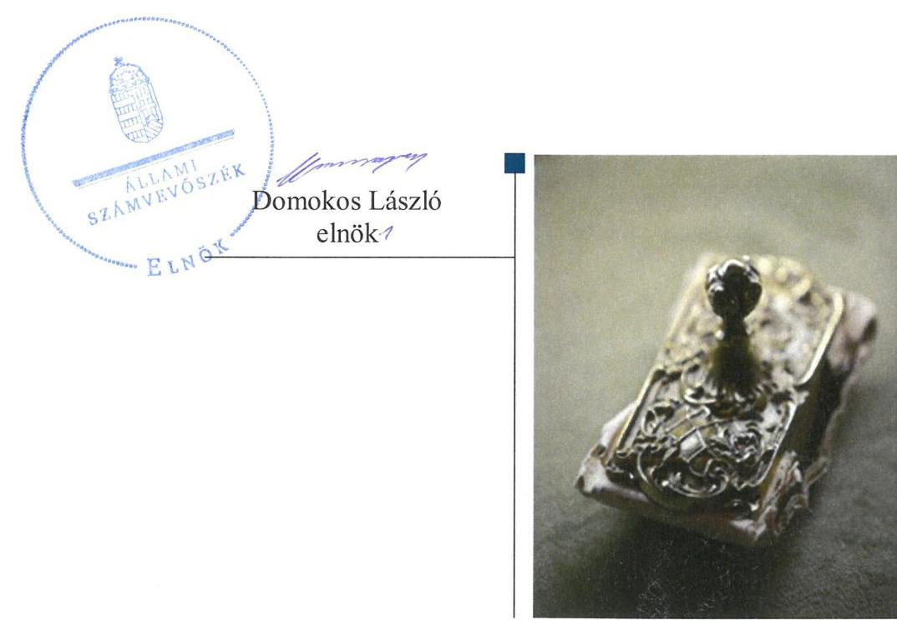
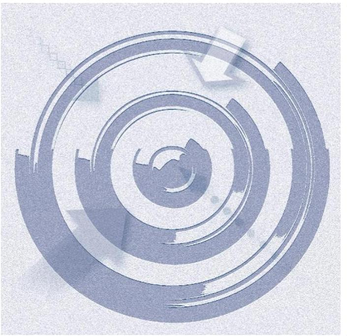
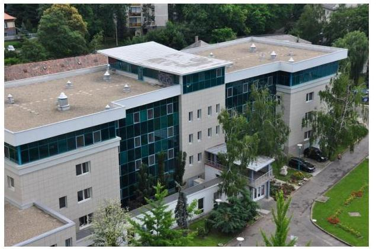
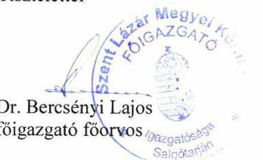
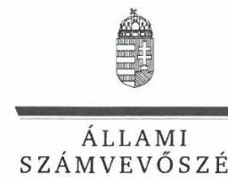
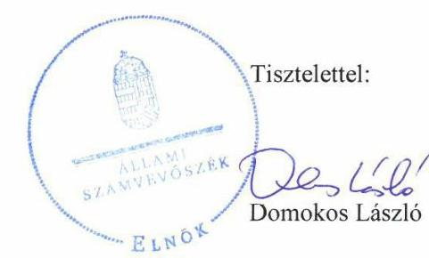

# Jelentés 

## Központi költségvetési szervek ellenőrzése

Szent Lázár Megyei Kórház 2019.

19226
www.asz.hu

---

# Jelenetés 

## Központi költségvetési szervek ellenőrzése

Szent Lázár Megyei Kórház
2019. 12. hó 03. nap

---

# AZ ELLENŐRZÉST FELÜGYELTE:

- DR. NAGY IMRE felügyeleti vezető
- DR. BENEDEK MÁRIA felügyeleti vezető

# AZ ELLENŐRZÉST VEZETTE ÉS A VÉGREHAJTÁSÁÉRT FELELŐS:

- VERTKOVCZI MÁRIA ellenőrzésvezető
- DR. KOVÁCS DIÁNA ellenőrzésvezető

# A PROGRAM ÖSSZEÁLLÍTÁSÁÉRT FELELŐS:

- TÓTPÁL SZABOLCS osztályvezető

Jelentéseink az Országgyűlés számítógépes hálózatán és az Interneta a www.asz.hu címen is olvashatóak.

|  IKTATÓSZÁM: EL-2241-001/2019 | |
| --- | --- |
|  TÉMASZÁM: 2450 | |
|  ELLENŐRZÉS-AZONOSÍTÓ SZÁM: V079130 | |

---

# TARTALOMJEGYZÉK 

■ ÖSSZEGZÉS ..... 5
■ AZ ELLENŐRZÉS CÉLJA ..... 7
■ AZ ELLENŐRZÉS TERÜLETE ..... 8
■ AZ ELLENŐRZÉS HÁTTERE, INDOKOLTSÁGA ..... 9
■ A JELENTÉS LÉNYEGES KÉRDÉSKÖREI ..... 10
■ AZ ELLENŐRZÉS HATÓKÖRE ÉS MÓDSZEREI ..... 11
■ MEGÁLLAPÍTÁSOK ..... 14
■ JAVASLATOK ..... 18
■ MELLÉKLETEK ..... 21
I. sz. melléklet: Értelmező szótár ..... 21
■ FÜGGELÉKEK ..... 25
I. sz. függelék a jelentéshez ..... 25
II. sz. függelék: Észrevételek ..... 26
■ RÖVIDÍTÉSEK JEGYZÉKE ..... 45

---

.

---

# ÖSSZEGZÉS 

A Szent Lázár Megyei Kórház a költségvetési fegyelemre vonatkozó törvényi előirásokat nem tartotta be. Belső kontrollrendszere nem biztositotta a közpénzekkel való átlátható és elszámoltatható gazdálkodás feltételeit. Pénzügyi- és vagyongazdálkodása nem volt szabályszerű. A Kórház vezetője nem építette ki a korrupciós helyzetek megelőzésére szolgáló integritási kontrollokat.

## Az ellenőrzés társadalmi indokoltsága

Az Állami Számvevőszék ellenőrzi a költségvetési szervek gazdálkodását, működését, hogy megállapításaival támogassa az ellenőrzött szervezetek szabályszerű gazdálkodását, javaslataival elősegítse az Alaptörvényben ${ }^{1}$ megfogalmazott alapvetések érvényesülését a mindennapi életben a szervezetek szintjén. A központi költségvetés rendszerében zajló folyamatok holisztikus elemzései, a kockázatok folyamatos figyelemmel kísérésének módszerével, az így kiválasztott szervezetek célzott, hatékony ellenőrzéseivel az Állami Számvevőszék betölti a legfőbb gazdasági ellenőrző szerv küldetését. Az ellenőrzések megállapításaival és egy adott időszak ellenőrzési eredményeinek elemzésével az Állami Számvevőszék ráirányíthatja a jogalkotók figyelmét a központi alrendszerben vagy annak egy ágazatában esetlegesen felmerülő pénzügyi, szabályozási feszültségekre. Az elvégzett ellenőrzések során az Állami Számvevőszék „jó gyakorlatokat" is azonosíthat, melyeket tanácsadó funkciója keretében szélesebb körben is megismertethet az érintettekkel, ezáltal is hozzájárulva a költségvetési rendszer szabályozott, átlátható, kiegyensúlyozott és fenntartható működéséhez.

## Főbb megállapítások, következtetések, javaslatok

A Szent Lázár Megyei Kórház a belső kontrollrendszeren belül a kontrollkörnyezetet, az információs és kommunikációs rendszert szabályszerűen kialakította. A kockázatkezelési rendszert a 2015. évben nem szabályszerűen múködtette. A monitoring rendszer kialakítása és múködtetése, valamint a kontrolltevékenységek gyakorlása nem volt szabályszerű. Ezáltal a Kórház belső kontrollrendszere nem biztosította a szabályszerű, eredményes és hatékony múködést, a közpénzekkel és a nemzeti vagyonnal történő szabályszerű gazdálkodást. Az integritás kontrollok kiépítése és múködtetése nem volt megfelelő, az nem biztosította a korrupció elleni védelmet. A Főigazgató nem küldte meg a Kórház belső kontrollrendszere minőségét értékelő nyilatkozatát az EMMI mint irányító szerv részére.

A Kórház pénzügyi gazdálkodása nem volt szabályszerű. A Kórház a bevételek beszedése és a kiadási előirányzatok felhasználása során nem tartotta be a jogszabályi előírásokat. A gazdálkodási jogkörgyakorlás nem volt szabályszerű az ellenőrzött időszakban, aminek következtében nem volt biztosított, hogy a közpénz felhasználására a közfeladat ellátása érdekében került sor. A Kórház a kiadási előirányzatok felhasználása során nem tartotta be a jogszabályi előírásokat az átlátható szervezetekkel való szerződéskötésre vonatkozóan.

A Kórház az éves költségvetési maradvány megállapítása és az azt befolyásoló év végi kifizetetlen szállítói állomány tekintetében nem tartotta be a jogszabályi előírásokat. A Kórház gazdálkodása során a törvényi előírásokat megsértve a szabad előirányzat mértékét meghaladóan vállalt kötelezettséget.

A költségvetési beszámoló mérleg tételei leltárral alátámasztottak voltak.
A könyvelés, a kötelezettségvállalás-nyilvántartás, a maradvány megállapítás és a vagyongazdálkodás területén feltárt szabálytalanságok miatt a Kórház beszámolója nem mutatott valós és megbízható képet a Kórház pénzügyi és vagyoni helyzetéről.

A Kórháznál alakítottak ki a teljesítmény mérésére szolgáló követelményeket, de a belső kontrollrendszer, a pénzügyi- és a vagyongazdálkodás múködése során feltárt hiányosságok miatt a teljesítménymérés feltételei nem álltak fenn.

---

Az irányító szervi feladatellátás az EMMI részéről, valamint a középirányítói feladatok ellátása az ÁEEK részéről szabályszerű volt.

Az Állami Számvevőszék az intézkedések megtétele céljából a Szent Lázár Megyei Kórház főigazgatója részére 11, az ÁEEK főigazgatója részére egy javaslatot fogalmazott meg.

---

# AZ ELLENŐRZÉS CÉLJA 

AZ ELLENŐRZÉS CÉLJA annak megállapítása volt, hogy a Szent Lázár Megyei Kórházra vonatkozó irányító szervi feladatellátás a jogszabályi előírások betartásával történt-e, a Kórház belső kontrollrendszere biztosí-totta-e az átlátható, szabályszerű, gazdaságos, hatékony és eredményes gazdálkodás feltételeit, szabályszerű volte a beszámolási és adatszolgáltatási kötelezettségek teljesítése, valamint az, hogy a Kórház pénzügyi és vagyongazdálkodása megfelelt-e a jogszabályi előírásoknak és belső szabályzatainak. Az ellenőrzés keretében értékelte az ÁSZ², hogy a Kórháznál kiépítették és erősítették-e a korrupciós kockázatok kezelését szolgáló integritási kontrollokat, továbbá megteremtették-e a teljesítményellenőrzés feltételeit. Az ellenőrzés célja volt továbbá annak értékelése, hogy az államháztartás központi alrendszerébe tartozó Kórház gazdálkodása elszámoltatható-e és megfelelt-e annak az Alaptörvényben meghatározott alapvetésnek, hogy Magyarország a kiegyensúlyozott, átlátható és fenntartható költségvetési gazdálkodás elvét érvényesíti. Érvényesülte a nemzeti vagyon kezelésének és védelmének célja, azaz a Kórház vagyona a közérdeket szolgálja, a közös szükségletek kielégítése és a természeti erőforrások megóvása, valamint a jövő nemzedékek szükségleteinek figyelembevétele mellett.

---

# **AZ ELLENŐRZÉS TERÜLETE**

## **Szent Lázár Megyei Kórház**

A salgótarjáni Szent Lázár Megyei Kórház az ellenőrzött időszakban önálló jogi személy volt, saját gazdasági szervezettel rendelkező állami egészségügyi intézmény, a költségvetési gazdálkodás rendje szerint működött. Működési és ellátási területét, valamint alaptevékenységét az egészségügyi ágazati jogszabályok5 határozták meg. Alapfeladata a járó- és fekvőbetegek diagnosztikus és terápiás szakorvosi ellátása, rehabilitációja és követéses gondozása volt.

Az ellenőrzött időszakban a Szent Lázár Megyei Kórház irányító szerve az EMMI4 volt, a középirányító szerv a GYEMSZI5, majd 2015. március 1-jétől jogutódja, az ÁEEK6 volt. Az ÁEEK feladata a miniszter7 hatáskörébe nem tartozó fenntartói, valamint a 27/2015. (II.25.) Korm. rendeletben8 meghatározott irányítói jogok gyakorlása volt.

A végrehajtott beruházások következtében a Szent Lázár Megyei Kórház könyvviteli mérleg szerinti vagyona a 2015. január 1-jei 6846 millió Ft-ról 2017. december 31-ére 8521 millió Ft-ra, 24,5%-kal nőtt. A teljesített költségvetési és finanszírozási bevétele a 2015. évi 10 412 millió Ft-ról 2017. évre 8119 millió Ft-ra, a teljesített költségvetési és finanszírozási kiadása a 2015. évi 10 261 millió Ft-ról a 2017. évre 7935 millió Ft-ra csökkent.

A Szent Lázár Megyei Kórház főigazgatója és gazdasági igazgatója személyében az ellenőrzött időszakban nem történt változás. A gazdálkodással kapcsolatos feladatokat a gazdasági igazgató irányítása alatt működő gazdasági szervezet látta el.

A munkavállalók átlagos statisztikai állományi létszáma a 2015. decemberi 862 főről a 2017. év decemberére 908 főre változott.

A 2015-2016. években a Szent Lázár Megyei Kórházat szervezeti átalakítás, feladat átadás-átvétel nem érintette.

---

# AZ ELLENŐRZÉS HÁTTERE, INDOKOLTSÁGA 

Az államháztartás központi alrendszerébe tartozó szervezet vagyona a nemzeti vagyon része, és az Alaptörvény is rögzíti, hogy a vagyonnal való gazdálkodás célja a közérdek szolgálata. Az ÁSZ ellenőrzi az éves költségvetési törvény végrehajtását, az ellenőrzés során feltárt kockázatok és a terület folyamatos kockázatelemzésével beazonosított kockázatok kezelése érdekében ráépülő ellenőrzésekkel ellenőrzi a költségvetési szervek gazdálkodását, múködését, hogy az ellenőrzések megállapításaival támogassa az ellenőrzött szervezetek szabályszerű gazdálkodását, javaslataival elősegítse az Alaptörvényben megfogalmazott alapvetések érvényesülését a mindennapi életben a szervezetek szintjén.

A belső kontrollrendszer kialakítása és múködtetése nélkül nem valósítható meg a közpénzek, a közvagyon átlátható, szabályos, gazdaságos, hatékony és eredményes felhasználása. A belső kontrollrendszer azt a célt szolgálja, hogy a költségvetési szervek múködésük és gazdálkodásuk során a tevékenységeket szabályszerűen hajtsák végre, teljesítsék elszámolási kötelezettségeiket és megvédjék az erőforrásokat a veszteségektől, a károktól és a nem rendeltetésszerű használattól. A belső kontrollrendszer magában foglalja mindazon elveket, eljárásokat és belső szabályzatokat, melyek biztosítják, hogy a költségvetési szerv valamennyi tevékenysége és célja összhangban legyen a szabályszerűséggel, szabályozottsággal, valamint a gazdaságosság, hatékonyság és eredményesség követelményeivel, az eszközökkel és forrásokkal való gazdálkodásban ne kerüljön sor pazarlásra, visszaélésre, rendeltetésellenes felhasználásra. Megfelelő, pontos és naprakész információk álljanak rendelkezésre a költségvetési szerv múködésével kapcsolatosan, és a belső kontrollrendszer harmonizációjára, öszszehangolására vonatkozó jogszabályok végrehajtásra kerüljenek. Az integritás kontrollok kiépítése, erősítése a szervezet korrupciós kockázatainak kezelését szolgálja. A teljesítménykövetelmények meghatározása és múködtetése megalapozhatja a központi költségvetési szervnél a teljesítményellenőrzés lefolytatását.

---

# A JELENTÉS LÉNYEGES KÉRDÉSKÖREI 

1.     - Az irányító szerv Kórházra vonatkozó feladatellátása szabályszerű volt-e?
2.     - A Kórház belső kontrollrendszerének kialakítása és müködtetése szabályszerű volt-e, az biztosította-e a közpénzfelhasználás és az állami vagyonnal való gazdálkodás szabályosságát?
3.     - A Kórház pénzügyi gazdálkodása szabályszerű volt-e?
4.     - A költségvetési maradvány megállapítása szabályszerűen tör-tént-e?
5.     - A Kórház vagyongazdálkodása szabályszerű volt-e?
6.     - A Kórháznál alakítottak-e ki a teljesítmény mérésére alkalmas követelményeket?

---

# AZ ELLENŐRZÉS HATÓKÖRE ÉS MÓDSZEREI 

## Az ellenőrzés típusa

Megfelelőségi ellenőrzés.

## Az ellenőrzött időszak

2015-2017. évek közötti időszak.

## Az ellenőrzés tárgya

A Kórházra vonatkozó irányító szervi feladatok ellátása a 2015-2016. években. A Kórház belső kontrollrendszerének kialakítása és működtetése 2015-2017. években, valamint az integritás kontrollok kiépítettsége és a teljesítményellenőrzés feltételei a 2017. évben.

A Kórház pénzügyi és vagyongazdálkodása a 2015-2016. években.
A 2017. évre vonatkozóan a Kórház vagyongazdálkodási feltételeinek kialakítása, annak szabályszerűsége, az elszámoltathatóság biztosítása a szabályozás szintjén. A Kórháznál hozott vagyonváltozást eredményező döntések, a vagyonban bekövetkezett változások végrehajtásának, nyilvántartásba vételének, elszámolásának szabályszerűsége. Az állami vagyon kimutatásának szabályszerűsége, ennek keretében az állami vagyonnal történő rendelkezés, a vagyonmozgások, a vagyonnyilvántartásba vétele, értékelése és a mérleg alátámasztás szabályszerűsége. A költségvetési maradvány megállapításának szabályszerűsége 2017. év vonatkozásában.

## Az ellenőrzött szervezet

- Szent Lázár Megyei Kórház
- Emberi Erőforrások Minisztériuma mint irányító szerv
- Állami Egészségügyi Ellátó Központ mint középirányító szerv

## Az ellenőrzés jogalapja

Az ellenőrzés jogszabályi alapját az ÁSZ tv. ${ }^{9}$ 1. § (3) bekezdése, 5. § (2)-(3) bekezdései, (4) bekezdés a) pontja és (6) bekezdése, valamint az Áht. ${ }^{10} 61$. § (2) bekezdésében foglalt előírások adták.

---

# Az ellenőrzés módszerei 

Az ÁSZ az ellenőrzést az ellenőrzési program szempontjai, az ellenőrzött időszakban hatályos jogszabályok, az ellenőrzés szakmai szabályai, a jelen ellenőrzésre irányadó ÁSZ módszertanok figyelembevételével hajtotta végre.

Az ellenőrzési kérdések megválaszolásához szükséges bizonyítékok megszerzése az ellenőrzött által rendelkezésre bocsátott dokumentumokra, adatokra alapozva megfigyelés, szemle (szemrevételezés), kérdésfeltevés (információkérés), mintavételezés, valamint elemző eljárás útján történt. Az ellenőrzési bizonyítékként felhasználható adatforrások közé tartoztak az ellenőrzési program részletes szempontjainál felsorolt adatforrások, valamint minden egyéb - az ellenőrzés folyamán feltárt, az ellenőrzés szempontjából információt tartalmazó - dokumentum.

Az ellenőrzés lefolytatásához az ellenőrzött szervezet tanúsítványok kitöltésével, valamint az ÁSZ által kért dokumentumok megküldésével szolgáltatott adatokat, amelyek valódiságát és teljes körűségét az ellenőrzött szervezet vezetője által tett teljességi és hitelességi nyilatkozat igazolta. A rendelkezésre bocsátott adatok, információk kontrollja az ellenőrzés keretében történt.

A Kórház belső kontrollrendszere egyes pilléreinek kialakítására és működtetésére vonatkozó értékelés:
$\longrightarrow$ „szabályszerü", amennyiben az értékelt területen az elért „igen" válaszok százalékban kifejezett, egész számra kerekített aránya legalább $85 \%$,
$\longrightarrow$ „nem szabályszerű", ha nem éri el a $85 \%$-ot.
A Kórház belső kontrollrendszerének összesített értékelése az egyes részterületek esetében kapott megfelelőségi arányok számtani átlaga alapján történt és megegyezik a pillérenként (kontrollterületenként) alkalmazott százalékos értékelésekkel, a következő eltérésekkel: a kontrollrendszer egésze esetében a „szabályszerű" értékelésnek a százalékos értéken felül további feltétele, hogy egyik kontrollterület sem kaphat „nem szabályszerű" értékelést.

A kiadások ellenőrzésére a 2015-2017., a bevételek ellenőrzésére a 2015-2016. év vonatkozásában került sor. A kiadások (külső személyi juttatások, felhalmozási kiadások, dologi kiadások) és a bevételek (értékesítésből és bérbeadásból származó bevételek) esetében az ellenőrzés azokra a legnagyobb értékű tételekre - a lényeges sokaságra - terjedt ki, melyek összértéke elérte a teljes sokaság összértékének 50\%-át. A 2015-2017. évi kiadások és a 2016. évi bevételek elszámolásának szabályszerűséget a lényeges sokaságból véletlen mintavételi eljárással kiválasztott tételek alapján ellenőrizte az ÁSZ. A 2015. évi bevételek esetében a lényeges sokaság tételes ellenőrzésére került sor.

A 2015-2016. évi beruházások, felújítások, valamint a mérlegben kimutatott eszközök év végi értékelésének, bekerülési értékük megállapításának, állományba vételük, és értékcsökkenésük elszámolásának szabályszerűségének ellenőrzése azokra a legnagyobb értékű tételekre - a lényeges sokaságra - terjedt ki, melyek összértéke elérte a teljes sokaság összértékének 50\%-át. A lényeges sokaságból véletlen mintavételi eljárással történt a mintatételek kiválasztása.

---

A 2017. évi beruházások, felújítások végrehajtásának, valamint a feladatellátást szolgáló állami vagyontárgyak felhasználásának és év végi értékelésének szabályszerűségét véletlen mintavétellel kiválasztott tételek alapján ellenőrizte az ÁSZ.

A mintavétellel ellenőrzött területek esetében minden egyes tétel vonatkozásában a felhasználás, elszámolás és értékelés szabályszerűségére vonatkozó kérdéseket tettünk fel. Szabályszerű értékelést kapott egy ellenőrzött terület, amennyiben 95\%-os bizonyossággal az ellenőrzött sokaságban az átlagos hibaarány legfeljebb 10\%, nem szabályszerű értékelést, amennyiben 10\%-nál magasabb arányt képviselt. Abban az esetben, ha az ellenőrzött sokaság tekintetében a 10\%-os hibaarányhoz való viszony megítélésnek megbízhatósága nem érte el a 95\%-ot, annak elérése érdekében az értékelés további szempontokkal került kiegészítésre, a feltárt hibák értékének figyelembe vételével.

Az ellenőrzés ideje alatt az ellenőrzött szervezettel történő kapcsolattartás az ÁSZ SZMSZ-ének vonatkozó előírásai alapján volt biztosított.

---

# 1. Az irányító szerv Kórházra vonatkozó feladatellátása szabályszerű volt-e? 

Összegző megállapítás

Az EMMI mint irányító szerv, valamint az ÁEEK mint középirányító szerv feladatellátása a Kórház ${ }^{11}$ vonatkozásában szabályszerű volt.

AZ ALAPÍTÓ OKIRAT ${ }^{12}$ az Ávr. ${ }^{13}$ előírásai alapján tartalmazta az alaptevékenységek kormányzati funkciók szerinti besorolását. Az ÁEEK Áht.-ban foglaltak alapján - átruházott hatáskörben - jóváhagyta a Kórház SZMSZ ${ }^{14}$-ét. Az elemi költségvetés tervezési követelményeit az EMMI az Ávr. előírásai alapján meghatározta, az Áht. és az Áhsz. ${ }^{15}$ előírásaival összhangban jóváhagyta a Kórház elemi költségvetéseit és éves költségvetési beszámolóit, továbbá az Ávr. előírásainak eleget téve gondoskodott a költségvetési maradvány megállapításáról.

## 2. A Kórház belső kontrollrendszerének kialakítása és múködtetése szabályszerű volt-e, az biztosította-e a közpénzfelhasználás és az állami vagyonnal való gazdálkodás szabályosságát?

Összegző megállapítás

A Kórház belső kontrollrendszerének múködtetése nem volt szabályszerű.

A KONTROLLKÖRNYEZET KIALAKÍTÁSA a 2015-2017. években szabályszerű volt. A Kórház az Ávr.-ben foglaltak alapján rendelkezett SZMSZ-szel és Ügyrenddel ${ }^{16}$. A Bkr. ${ }^{17}$ alapján elkészítette az Ellenőrzési nyomvonalát ${ }^{18}$, 2017-ben a Szervezeti integritást sértő események kezelésének eljárásrendjét ${ }^{19}$.

A Kórház a Számv. tv. ${ }^{20}$ előírásaival összhangban készítette el a Számviteli Politikáját ${ }^{21}$ és a Számlarendjét ${ }^{22}$. A gazdálkodás rendjét a Kórház az Ávr.-ben foglaltakkal összhangban a Kötelezettségvállalási szabályzatában ${ }^{23}$ határozta meg.

A KOCKÁZATKEZELÉSI RENDSZER múködtetése a 2015. január 1. és 2016. szeptember 30. között nem, az integrált kockázatkezelési rendszer múködtetése a 2016. október 1-jétől és a 2017. évben szabályszerű volt.

A Kórház a kockázatkezelési, majd integrált kockázatkezelési rendszerét a Kockázatkezelési szabályzatban ${ }^{24}$ és a Belső kontrollrendszer szabályzatban ${ }^{25}$ a Bkr. előírásai alapján alakította ki.

---

A Főigazgató a 2015. évben a Bkr. 7. § (2) bekezdés előírása ellenére nem mérte fel és nem állapította meg Kórház tevékenységében, gazdálkodásában rejlő kockázatokat, valamint nem határozta meg az egyes kockázatokkal kapcsolatban szükséges intézkedéseket, valamint azok teljesítésének folyamatos nyomon követésének módját. A 2015. évben jelzett hiányosság a 2016-2017. években nem állt fenn.

A KONTROLLTEVÉKENYSÉGEK GYAKORLÁSA nem volt szabályszerű a 2015-2017. években.

A 2015-2016. években a Kórháznál az Áht. 38. § (1) bekezdésében foglaltak ellenére teljesítés igazolás nélkül történt a kiadások kifizetése, 2017ben a szabálytalanság nem állt fenn.

Az Áht. 37. § (1) bekezdésében foglaltak ellenére a kiadási előirányzat felhasználása során nem került sor kötelezettségvállalásra a 2017. évben.

AZ INFORMÁCIÓS ÉS KOMMUNIKÁCIÓS rendszer kialakítása, működtetése a Bkr.-ben és az Info tv ${ }^{26}$-ben előírtak alapján szabályszerű volt. A Kórháznál kialakított információs és kommunikációs rendszer biztosította, hogy a megfelelő információk a megfelelő időben eljussanak az illetékes szervezetekhez.

A MONITORING RENDSZER működtetése a 2015-2017. években nem volt szabályszerű.

A belső ellenőrzési vezető a 2015-2017. években a Bkr. 17. § (4) bekezdésben foglalt előírás ellenére a 2013. október 15-én hatályba léptetett Belső ellenőrzési kézikönyv², rendszeres, de legalább kétévenkénti felülvizsgálatát nem végezte el.

A Főigazgató a 2015-2017. években a Bkr. 45. § (4) bekezdésében foglaltak ellenére az intézkedési terv jóváhagyásáról annak kézhezvételétől számított 8 napon túl döntött.

A Főigazgató a Bkr. 14. § (2) bekezdésben foglaltak ellenére a 20152017. években a külső ellenőrzések javaslatai alapján készült intézkedési tervek végrehajtásáról vezetett nyilvántartás alapján a tárgyévet követő év január 31-éig nem számolt be az EMMI mint fejezetet irányító szerv vezetőjének és az EMMI mint fejezetet irányító szerv belső ellenőrzési vezetőjének.

A Főigazgató a 2015-2017. években a Bkr. 1. mellékletében foglaltak alapján nyilatkozatban értékelte a Kórház belső kontrollrendszerének minőségét. A Főigazgató a nyilatkozatában azt rögzítette, hogy az ellenőrzött években a Kórház belső kontrollrendszerét kiépítette és működtette. Az ÁSZ ellenőrzés megállapításai nem igazolták a nyilatkozatban foglaltakat.

A Bkr. 11. § (2) bekezdés ellenére a Főigazgató a Bkr. 1. számú melléklet szerinti nyilatkozatot az éves költségvetési beszámolóval egyidejűleg nem küldte meg az EMMI mint irányító szerv részére a 2015-2017. években.

A Kórház az integritást erősítő kontrollokat nem alakította ki, az integritás szemlélet nem érvényesült a Kórház múködésében.

---

# 3. A Kórház pénzügyi gazdálkodása szabályszerű volt-e? 

## Összegző megállapítás

3.1. számú megállapítás
3.2. számú megállapítás

A Kórház pénzügyi gazdálkodása nem volt szabályszerű.
A bevételek beszedése, a kiadási előirányzatok felhasználása során nem tartották be a jogszabályi előírásokat.

A BEVÉTELEK BESZEDÉSE ÉS ELSZÁMOLÁSA nem volt szabályszerű a 2015. évben, a 2016. évben szabályszerű volt.

A Kórház a 2015. évben a bevételek beszedése során nem rendelkezett az Nvtv. ${ }^{28} 11 . \S$ (10) bekezdésében, illetve a 3. § (2) bekezdésében foglaltak ellenére a szerződő fél nyilatkozatával arról, hogy az átlátható szervezetnek minősül.

## A KIADÁSI ELŐIRÁNYZATOK FELHASZNÁLÁSA

nem volt szabályszerű 2015-2016. években.

A Kórház 2015-2016. években a Számv. tv. 165. § (2) bekezdésében foglaltak ellenére a kiadások felhasználását nem támasztotta alá bizonylattal.

A kötelezettségvállalás alapját jelentő, jogi személlyel megkötött visszterhes szerződések a 2015-2016. években az Ávr. 50. § (1a) bekezdésében foglaltak ellenére nem tartalmazták a szervezet képviselőjének nyilatkozatát arra vonatkozóan, hogy átlátható szervezetnek minősül.

A Kórházban az Ávr. 56. § (1) bekezdésében foglalt előírások ellenére a 2015-2016. években nem történt meg a Főigazgató általi kötelezettségvállalást követően annak az államháztartási számviteli kormányrendelet szerinti nyilvántartásba vétele.

A 2015-2016. évi előirányzat-maradvány megállapítása az azt alátámasztó nyilvántartás hiányosságai miatt nem volt szabályszerű.

A Kórház a 2015. és a 2016. években az Áhsz. ${ }^{29}$ 39. § (3) bekezdésében foglaltak ellenére nem rendelkezett az Áhsz. 14. melléklet II. 4. a)-g) pontokban meghatározott minimum tartalomnak megfelelő, az előirányzatmaradvány szabályszerű megállapításához szükséges kötelezettségvállalások, más fizetési kötelezettségek részletező nyilvántartásával.

## 4. A költségvetési maradvány megállapítása szabályszerűen tör-tént-e?

## Összegző megállapítás

4.1. számú megállapítás

A Kórház költségvetési maradvány megállapítása nem történt szabályszerűen.

A Kórház maradvány-kimutatása nem volt szabályszerű, a szabad előirányzat mértékét meghaladóan vállalt kötelezettséget.

A Kórház a 2017. évben az Áhsz. 53. § (4) bekezdésében foglaltak ellenére az Áhsz. 17. mellékletében meghatározott kötelező egyezőségek vizsgálatát nem végezte el. A Kórház nem biztosította az Áhsz. 17. melléklete 1. a) pontjában előírt kötelező egyezőség fennállását, mert az előirányzatok

---

# 4.2. számú megállapítás 

nyilvántartására vezetett számlák egyenlegét meghaladta a költségvetési évben esedékes kötelezettségek nyilvántartására szolgáló számlák egyenlege. Így a Kórház az Áht. 36. § (1)-(2) bekezdését megsértve a szabad előirányzat mértékét meghaladóan vállalt kötelezettséget, emiatt a maradvány kimutatása nem volt szabályszerű.
A maradvány összegét befolyásoló év végi kifizetetlen szállítói állomány tekintetében az eljárásra vonatkozó jogszabályi előírásokat nem tartották be.

Az év végi kifizetetlen szállítói tartozások tekintetében a nyilvántartásba vétel nem volt szabályszerű, mert a Kórház kötelezettségvállalással terhelt maradvány kimutatás adatai alátámasztásához vezetett részletező nyilvántartása a 2017. évben nem felelt meg az Áhsz. 39. § (3) bekezdésében foglaltak ellenére az Áhsz. 14. melléklet II. 4. a), c)-g) pontjaiban meghatározott tartalmi követelményeknek.

## 5. A Kórház vagyongazdálkodása szabályszerű volt-e?

## Összegző megállapítás A Kórház vagyongazdálkodása nem volt szabályszerű.

A beruházások, felújítások végrehajtása, valamint az állami vagyon év végi értékelése nem volt szabályszerű 2017. évben. A Kórház 2017. évben a Számv. tv. 165. § (2) bekezdésében foglaltak ellenére nem támasztotta alá bizonylattal a beruházások, felújítások végrehajtását, valamint az állami vagyon év végi értékelésének elvégzését.

LELTÁRRAL a mérlegben szereplő eszközök és források értékének valódiságát 2015-2017. években a Számv. tv.-ben foglaltakkal összhangban alátámasztotta a Kórház, azonban a kötelezettségvállalás nyilvántartásának tartalmi hiányossága, a bizonylatok hiánya és a 2017. évben a fedezet nélküli kötelezettségvállalás miatt a mérlegben szereplő adatok megalapozottsága nem volt igazolt.

Ebből következően a gazdasági eseményekről a valóságnak megfelelő, folyamatos, zárt rendszerú, áttekinthető részletező nyilvántartások, és a szabályszerű könyvvezetés hiányossága miatt a 2015-2017. években az Áhsz. 5. § (1) bekezdés szerinti költségvetési beszámolót a Kórház nem támasztotta alá.

## 6. A Kórháznál alakítottak-e ki a teljesítmény mérésére alkalmas követelményeket?

## Összegző megállapítás

A Kórháznál a 2017. évben alakítottak ki teljesítmény mérésére szolgáló követelményeket.

A Kórház rendelkezett teljesítmény mérésére szolgáló követelményekkel, de az adatok megbízhatóságának hiánya miatt a valós teljesítmény mérésének feltételei nem álltak fenn.

---

# JAVASLATOK 

Az ÁSZ tv. 33. § (1) bekezdésében foglaltak értelmében az ellenőrzött szervezet vezetője köteles a jelentésben foglalt megállapításokhoz kapcsolódó intézkedési tervet összeállítani és azt a jelentés kézhezvételétől számított 30 napon belül az ÁSZ részére megküldeni. Amennyiben az ellenőrzött szervezet vezetője nem küldi meg határidőben az intézkedési tervet, vagy továbbra sem elfogadható intézkedési tervet küld, az Állami Számvevőszék elnöke az ÁSZ tv. 33. § (3) bekezdése a) és b) pontjaiban foglaltakat érvényesítheti.

## az ÁEEK föigazgatójának

1. Tegyen intézkedéseket a feltárt hiányosságok és/vagy szabálytalanságok tekintetében a felelősség tisztázása érdekében, és szükség szerint intézkedjen a felelősség érvényesítéséről.
2. sz. megállapítás 8., 11., 12., 14., és 16. bekezdése, 3.1. sz. megállapítás 4. és 5. sz megállapítás 1. bekezdése, 3.1. sz. megállapítás 5. és 6. bekezdése, 3.2. sz. megállapítás és 4.2. sz. megállapítás, 4.1. sz. megállapítás 1. bekezdése, 5. sz. megállapítás 3. bekezdése alapján)

## a Kórház föigazgatójának

1. Intézkedjen arról, hogy a kötelezettségvállalásra az Áht. előírásának megfelelően kerüljön sor.
(2. sz. megállapítás 8. bekezdés alapján)
2. Gondoskodjon a Bkr. előírásának megfelelően a Belső ellenőrzési kézikönyv rendszeres, de legalább kétévenkénti felülvizsgálatáról és a szükséges módosítások átvezetéséről.
(2. sz. megállapítás 11. bekezdés alapján)
3. Döntsön a Bkr. előírásának megfelelően az intézkedési terv jóváhagyásáról az intézkedési terv kézhezvételétől számított 8 napon belül.
(2. sz. megállapítás 12. bekezdés alapján)
4. Számoljon be a Bkr. előírásának megfelelően a külső ellenőrzések javaslatai alapján készült intézkedési tervek végrehajtásáról vezetett nyilvántartás alapján a fejezetet irányító szerv vezetőjének és a fejezetet irányító szerv belső ellenőrzési vezetőjének.
(2. sz. megállapítás 14. bekezdés alapján)

---

5. Intézkedjen a Bkr. előírásának megfelelően a Kórház belső kontrollrendszere minőségét értékelő nyilatkozat irányító szerv részére történő megküldéséről.
(2. sz. megállapítás 16. bekezdése alapján)
6. Intézkedjen a Számv. tv. előírásainak megfelelően, hogy a számviteli (könyvviteli) nyilvántartásokba csak szabályosan kiállított bizonylat alapján kerüljenek adatok bejegyzésre.
(3.1. sz. megállapítás 4. és 5. sz megállapítás 1. bekezdése alapján)
7. Intézkedjen az Ávr. előírásainak megfelelően arról, hogy a jogi személlyel megkötött visszterhes szerződések tartalmazzák a szervezet képviselőjének nyilatkozatát arra vonatkozóan, hogy átlátható szervezetnek minősül.
(3.1. sz. megállapítás 5. bekezdése alapján)
8. Gondoskodjon az Ávr. előírásainak megfelelően a kötelezettségvállalást követően haladéktalanul annak államháztartási számviteli kormányrendelet szerinti nyilvántartásba vételéről.
(3.1. sz. megállapítás 6. bekezdése alapján)
9. Intézkedjen a kötelezettségvállalással terhelt maradvány kimutatás adatai alátámasztásához az Áhsz. 14. melléklet II. 4. pontjában előírt kötelező minimum tartalmú részletező nyilvántartás vezetéséről a kötelezettségvállalások, más fizetési kötelezettségek nyilvántartása vonatkozásában.
(3.2. sz. megállapítás és 4.2. sz. megállapítás alapján)
10. Intézkedjen
a) az Áhsz. előírásának megfelelően, hogy a kötelező egyezőségek vizsgálatával kerüljön elvégzésre a költségvetési és pénzügyi könyvvezetés helyességének ellenőrzése
b) az Áht. előírásának megfelelően, hogy kötelezettségvállalásra csak a szabad előirányzat mértékéig kerüljön sor.
(4.1. sz. megállapítás 1. bekezdése alapján)
11. Intézkedjen az Áhsz.-ben foglalt előírásoknak megfelelően a Kórház költségvetési beszámolójának szabályszerű könyvvezetéssel és részletező nyilvántartással történő alátámasztásáról.
(5. sz. megállapítás 3. bekezdése alapján)

---

.

---

# MELLÉKLETEK 

- I. SZ. MELLÉKLET: ÉRTELMEZŐ SZÓTÁR
állami vagyon
állami vagyonnak minősül:
a) az állam tulajdonában lévő dolog, valamint a dolog módjára hasznosítható természeti erő,
b) az a) pont hatálya alá nem tartozó mindazon vagyon, amely vonatkozásában törvény az állam kizárólagos tulajdonjogát nevesíti,
c) az állam tulajdonában lévő tagsági jogviszonyt megtestesítő értékpapír, illetve az államot megillető egyéb társasági részesedés,
d) az államot megillető olyan immateriális, vagyoni értékkel rendelkező jogosultság, amelyet jogszabály vagyoni értékű jogként nevesít. (Forrás: Vtv. 1. § (2) bekezdése)
állami vagyon értékesítése
állami vagyon használója
állami vagyon hasznosítása
állami vagyon hasznosítása kötött szerződés
állami vagyon kezelője /vagyonkezelő

ÁSZ Integritás Projekt

Állami vagyonnak minősül:
a) az állam tulajdonában lévő dolog, valamint a dolog módjára hasznosítható természeti erő,
b) az a) pont hatálya alá nem tartozó mindazon vagyon, amely vonatkozásában törvény az állam kizárólagos tulajdonjogát nevesíti,
c) az állam tulajdonában lévő tagsági jogviszonyt megtestesítő értékpapír, illetve az államot megillető egyéb társasági részesedés,
d) az államot megillető olyan immateriális, vagyoni értékkel rendelkező jogosultság, amelyet jogszabály vagyoni értékű jogként nevesít. (Forrás: Vtv. 1. § (2) bekezdése)
Állami vagyon tulajdonjogának bármely jogcímen történő, visszterhes átruházása. (Forrás: Vtvr. 1. § (7) bekezdés d) pontja)
Az a természetes vagy jogi személy, jogi személyiséggel nem rendelkező szervezet, aki, vagy amely törvény vagy szerződés alapján, bármely jogcímen (bérlet, haszonbérlet, használat stb.) állami vagyont birtokol, használ, szedi annak használt, hasznosít, ide nem értve a haszonélvezőt, a vagyonkezelőt és a tulajdonosi jogok gyakorlóját". (Forrás: Vtvr. 1. § (7) bekezdés a) pontja)
Az állami vagyont az MNV Zrt. maga kezeli, vagy szerződés - így különösen bérlet, haszonbérlet, megbízás - alapján központi költségvetési szervnek, természetes vagy jogi személynek, vagy jogi személyiséggel nem rendelkező gazdálkodó szervezetnek hasznosításra átengedi.
(Forrás: Vtv. 23. § (1) bekezdése, hatályos 2012. január 1-jétől)
Az állami vagyonnal a tulajdonosi joggyakorló maga gazdálkodik, vagy szerződés - így különösen bérlet, haszonbérlet, megbízás - alapján hasznosításra átengedi, illetőleg vagyonkezelésbe, haszonélvezetbe adja. (Forrás: Vtv. 23. § (1) bekezdése, hatályos 2013. június 28 -ától)
Az állami vagyon hasznosítására kötött szerződések elsődleges célja az állami vagyon hatékony működtetése, állagának védelme, értékének megőrzése, illetve gyarapítása, az állami és közfeladatok ellátásának elősegítése. (Forrás: Vtv. 23. § (2) bekezdése)
Az állami vagyont az MNV Zrt. maga kezeli, vagy szerződés - így különösen bérlet, haszonbérlet, megbízás - alapján központi költségvetési szervnek, természetes vagy jogi személynek, vagy jogi személyiséggel nem rendelkező gazdálkodó szervezetnek hasznosításra átengedi." Az állami vagyonra vonatkozóan az MNV Zrt. kizárólag az Nvtv-ben meghatározott személyekkel köthet vagyonkezelési szerződést. (Forrás: Vtv. 27. § (1) bekezdése, hatályos 2012. január 1-jétől)
Az Állami Számvevőszék 2009-ben indította el a „Korrupciós kockázatok feltérképezése - Integritás alapú közigazgatási kultúra terjesztése" című, európai uniós forrásból megvalósított kiemelt projektjét (Integritás Projekt). Az Integritás Projekt célja, hogy felmérje a közszféra intézményei korrupciós kockázatoknak való kitettségét, illetőleg az azok mérséklésére hivatott kontrollok szintjét. Az Állami Számvevőszék a projekt révén az integritás szemlélet minél szélesebb körrel történő megismertetését, gyakorlatba ültetését kívánja elérni. Az integritás követelményeinek megfelelő szervezeti múködést előnyben részesítő közigazgatási kultúra elterjesztését és a korrupció elleni fellépést az ÁSZ önmagára nézve is stratégiai jelentőségű célként fogalmazta meg. A projekt a felmérésben résztvevő intézmények számára helyzetükről

---

egyfajta „tükörképet" mutat be, ami alapot teremt a jövőbeni pozitív irányú elmozduláshoz. (Forrás: a http://integritas.asz.hu honlapon közzétett, a 2013. évi Integritás felmérés eredményeiről készült összefoglaló tanulmány)
belső ellenőrzés
belső kontrollrendszer
belső kontrollrendszer területei
felújítás
hasznosítás
információs és kommunikációs rendszer
integritás
irányító szerv
kincstári költségvetés
kockázat
Független, tárgyilagos bizonyosságot adó és tanácsadó tevékenység, amelynek célja, hogy az ellenőrzött szervezet múködését fejlessze és eredményességét növelje, az ellenőrzött szervezet céljai elérése érdekében rendszerszemléletű megközelítéssel és módszeresen értékeli, illetve fejleszti az ellenőrzött szervezet irányítási és belső kontrollrendszerének hatékonyságát. (Forrás: Bkr. 2. § b) pontja)
A belső kontrollrendszer a kockázatok kezelése és tárgyilagos bizonyosság megszerzése érdekében kialakított folyamatrendszer, amely azt a célt szolgálja, hogy a múködés és gazdálkodás során a tevékenységeket szabályszerűen, gazdaságosan, hatékonyan, eredményesen hajtsák végre, az elszámolási kötelezettségeket teljesítsék, megvédjék az erőforrásokat a veszteségektől, károktól és nem rendeltetésszerű használattól. (Forrás: Áht. 69. § (1) bekezdése)
A kontrollkörnyezet, a kockázatkezelési rendszer, a kontrolltevékenységek, az információs és kommunikációs rendszer, valamint a nyomon követési (monitoring) rendszer. (Forrás: Bkr. 3. §-a)
Az elhasználódott tárgyi eszköz eredeti állaga (kapacitása, pontossága) helyreállítását szolgáló időszakonként visszatérő olyan tevékenység, melynek során az eszköz élettartama megnövekszik, minősége, használata jelentősen javul, így a pótlólagos ráfordításból a jövőben gazdasági előnyök származnak. (Forrás: Számv. tv. 3. § (4) bekezdés 8. pontja)
A nemzeti vagyon birtoklásának, használatának, hasznok szedése jogának bármely a tulajdonjog átruházását nem eredményező - jogcímen történő átengedése, ide nem értve a vagyonkezelésbe adást, valamint a haszonélvezeti jog alapítását. (Forrás: Nvtv. 3. § (1) bekezdés 4. pontja)
A költségvetési szerv vezetője által kialakított és múködtetett olyan rendszer, mely biztosítja, hogy a megfelelő információk a megfelelő időben eljutnak az illetékes szervezethez, szervezeti egységhez, illetve személyhez. (Forrás: Bkr. 9. § (1) bekezdés)
Az integritás - egyik gyakran használt jelentése szerint - az elvek, értékek, cselekvések, módszerek, intézkedések konzisztenciáját jelenti, vagyis olyan magatartásmódot, amely meghatározott értékeknek megfelel. Integritás-irányítási rendszer bevezetése a szervezetben a szervezethez rendelt közfeladatok integritás szempontú ellátását, az érték alapú múködéssel (integritással) összefüggő szervezeti követelmények következetes érvényesítését jelenti. (Forrás: Nemzetgazdasági Minisztérium: Államháztartási Belső Kontroll Standardok és Gyakorlati Útmutató 1.6. Etikai értékek és integritás 46. oldal, 2017. szeptember)
A költségvetési szerv tekintetében az Áht-ban meghatározott irányítási hatáskört gyakorló szerv. (Forrás: Áht. 1. § 9. pontja)
A központi költségvetésről szóló törvény elfogadását követően a fejezetet irányító szerv az államháztartás központi alrendszerébe tartozó költségvetési szerv és a fejezeti kezelésű előirányzat kiemelt előirányzatait, valamint az elkülönített állami pénzalapok és a társadalombiztosítás pénzügyi alapjai jogszabályi előírás szerinti bevételeit és kiadásait kincstári költségvetés kiadásával állapítja meg. (Forrás: Áht. 28. § (2) bekezdés)
A kockázat annak a valószínűségét jelenti, hogy egy vagy több esemény vagy intézkedés nem kívánt módon befolyásolja a rendszer múködését, céljainak megvalósulását. (Forrás: Javaslatok a korrupciós kockázatok kezelésére - Kockázatkezelési és ellenőrzési módszertan 35. oldal, ÁSZ)

---

kockázatkezelési rendszer
integrált kockázatkezelési rendszer
kontrollkörnyezet
kontrolltevékenységek
kommunikáció
középirányító szerv
közfeladat
monitoring
monitoring-rendszer
tulajdonosi joggyakorló
vagyongazdálkodás

Olyan irányítási eszközök és módszerek összessége, melynek elemei a szervezeti célok elérését veszélyeztető tényezők (kockázatok) azonosítása, elemzése, csoportosítása, nyomon követése, valamint szükség esetén a kockázati kitettség mérséklése.(Forrás: Bkr. 2. § m) pontja)
Olyan folyamatalapú kockázatkezelési rendszer, amely a szervezet minden tevékenységére kiterjed, egységes módszertan és eljárások alkalmazásával, a szervezet célkitűzéseinek és értékeinek figyelembevételével biztosítja a szervezet kockázatainak teljes körű azonosítását, azok meghatározott kritériumok szerinti értékelését, valamint a kockázatok kezelésére vonatkozó intézkedési terv elkészítését és az abban foglaltak nyomon követését. (Forrás: Bkr. 2. § m) pontja, 2016. október 1-jétől)
A költségvetési szerv vezetője által kialakított olyan elvek, eljárások, belső szabályzatok összessége, amelyben világos a szervezeti struktúra, a folyamatok átláthatók, egyértelműek a felelősségi, hatásköri viszonyok és feladatok, meghatározottak, ismertek és elfogadottak az etikai elvárások a szervezet minden szintjén, átlátható a humán-erőforrás-kezelés. (Forrás: Bkr. 6. § (1) bekezdés)
A költségvetési szerv vezetője által a szervezeten belül kialakított (kontroll) tevékenységek, melyek biztosítják a kockázatok kezelését, hozzájárulnak a szervezet céljainak eléréséhez és erősítik a szervezet integritását. (Forrás: Bkr. 8. § (1) bekezdés)
Az a tevékenység, melynek során információ továbbítása valósul meg. A kommunikációs folyamat résztvevői között tájékoztatás történik, mely során tényeket, ezek magyarázatát közlik.
A költségvetési szerv tekintetében törvény vagy kormányrendelet alapján meghatározott, átruházott irányítási hatásköröket gyakorló szerv. (Forrás: Áht. 9. § (4) bekezdés)
Jogszabályban meghatározott állami vagy önkormányzati feladat, amit az arra kötelezett közérdekből, a jogszabályban meghatározott követelményeknek és feltételeknek megfelelve végez, ideértve a lakosság közszolgáltatásokkal való ellátását, továbbá az állam nemzetközi szerződésekben vállalt kötelezettségeiből adódó közérdekű feladatokat, valamint e feladatok ellátásakor szükséges infrastruktúra biztosítását is. (Forrás: Nvtv. 3. § (1) bekezdés 7. pontja)
A monitoring általánosságban a különböző szintű szervezeti célok megvalósításának folyamatát kíséri figyelemmel, melynek során a releváns eseményekről és tevékenységekről (együtt: folyamatokról) rendszeres jelleggel, strukturált, döntéstámogató információkhoz jutnak a szervezet vezetői. (Forrás: NGM Útmutató a költségvetési szervek monitoring rendszeréhez 2011. november)
A költségvetési szerv vezetője köteles kialakítani a szervezet tevékenységének a célok megvalósításának nyomon követését biztosító rendszert, amely az operatív tevékenységek keretében megvalósuló folyamatos és eseti nyomon követésből, valamint az operatív tevékenységektől függetlenül múködő belső ellenőrzésből áll. (Forrás: Bkr. 10. §)
Aki a nemzeti vagyon felett az államot vagy a helyi önkormányzatot megillető tulajdonosi jogok és kötelezettségek összességének gyakorlására jogosult. (Forrás: Nvtv. 3. § (1) bekezdés 17. pontja)

A nemzeti vagyongazdálkodás feladata a nemzeti vagyon rendeltetésének megfelelő, az állam, az önkormányzat mindenkori teherbíró képességéhez igazodó, elsődlegesen a közfeladatok ellátásához és a mindenkori társadalmi szükségletek kielégítéséhez szükséges, egységes elveken alapuló, átlátható, hatékony és költségtakarékos müködtetése, értékének megőrzése, állagának védelme, értéknövelő használata, hasznosítása, gyarapítása, továbbá az állam vagy a helyi önkormányzat feladatának ellátása szempontjából feleslegessé váló vagyontárgyak elidegenítése. (Forrás: Nvtv. 7. § (2) bekezdése)

---

.

---

# FÜGGELÉKEK 

- I. SZ. FÜGGELÉK A JELENTÉSHEZ

Az Állami Számvevőszék az ellenőrzések során feltárt tényekhez kapcsolódó további körülmények tisztázására eszközrendszerrel nem rendelkezik. Amennyiben az ellenőrzésen túlmutatóan indokoltnak látszik az ellenőrzés során feltárt körülmények további vizsgálata, az Állami Számvevőszék törvényi felhatalmazás alapján az ellenőrzés által feltárt körülményeket továbbítja a hatáskörrel rendelkező szervnek a szükséges intézkedések megtétele, eljárások lefolytatása érdekében.

1. 

A Kórház a 2015-2016. években a Számv. tv. 165. § (2) bekezdésében foglalt előírások ellenére a fökönyvi nyilvántartásában 25117527 Ft értékben, számviteli bizonylat nélkül rögzített adatot és az alapján teljesített kifizetést.
Bizonylat hiányában nem igazolt, hogy a kifizetés a Kórház feladatellátását szolgálta, illetve hogy a kifizetéshez valós teljesítés kapcsolódott.
2. a)

A Kórház megsértette az Áht. 38. § (1) bekezdésében foglaltakat, mert úgy teljesített kifizetést, hogy nem került sor a teljesítés igazolására 2015-2016. években összesen 81822 080,Ft összegben.
2. b)

A Kórház 2017. évben megsértette az Áht. 37. § (1) bekezdésében foglaltakat, mert nem került sor kötelezettségvállalásra 70927 725,- Ft értékben.
A fenti szabálytalanságokhoz hozzátartozik a Főigazgató belső kontrollrendszer minőségét értékelő nyilatkozata, amelynek tartalmát az ÁSZ ellenőrzés megállapításai nem igazolták vissza.
A gazdálkodási jogkörgyakorlás szabályainak megsértése miatt nem igazolt, hogy a kifizetések a Kórház feladatellátását szolgálták, illetőleg, hogy azok valós teljesítésekhez kapcsolódtak.

A fentiekben rögzített szabálytalanságok alapján a közpénz felhasználásával kapcsolatos kontrollok sérültek, a közvagyonnal való gazdálkodás megbízhatósága kétséges, amely felveti a vagyoni hátrány okozásának gyanúját, annak veszélyét.
Az 1. és 2. pontokban feltárt konkrét esetek körülményeinek felderítésére az Ügyészség rendelkezik hatáskörrel.

---

A jelentéstervezetet a Számvevőszék 15 napos észrevételezésre megküldte az ellenőrzött szervezetek vezetőinek az ÁSZ tv. 29. §* (1) bekezdése előirásának megfelelően.

A Szent Lázár Megyei Kórház föigazgatója a jelentéstervezet megállapításaira írásban észrevételt tett. Az Emberi Eröforrások Minisztériuma minisztere és az Állami Egészségügyi Ellátó Központ föigazgatója nem tett észrevételt.
Az ÁSZ tv. 29. § (3) bekezdésével összhangban az ÁSZ a Függelékben feltünteti az ellenőrzés megállapításaival kapcsolatban tett, figyelembe nem vett észrevételeket, és megindokolja, hogy azokat miért nem fogadta el.

[^0]
[^0]:    * 29. § (1) Az Állami Számvevőszék az ellenőrzési megállapításait megküldi az ellenőrzött szervezet vezetőjének vagy az általa megbízott személynek, és annak, akinek személyes felelősségét állapította meg.
    (2) Az ellenőrzött szervezet vezetője és a felelősként megjelölt személy az ellenőrzés megállapításaira tizenöt napon belül írásban észrevételt tehet.
    (3) Az Állami Számvevőszék az észrevételre a beérkezésétől számított harminc napon belül írásban válaszol. A figyelembe nem vett észrevételeket köteles a jelentésben feltüntetni, és megindokolni, hogy azokat miért nem fogadta el.

---

# Szent Lázár Megyei Kórház alapitva tete 

SZENT LÁZÁR MEGYEI KÓRHÁZ IGAZGATÓSÁGA
Dr. Bercsényi Lajos föigazgató föorvos
Cím: 3100 Salgótarján, Füleki út 54-56.
Tel.: 06 (32) 522002 Fax. 06 (32) 311779

Ikt.szám: KOZ/4-9 /2019.

Állami Számvevőszék
Domokos László
elnök

## Budapest

Apáczai Csere János utca 10. 1052

## Tisztelt Elnök Úr!

Köszönettel kézhez vettem, az EL-0711-120/2019. iktatószámú ellenőrzéséről szóló számvevőszéki jelentéstervezetet.

A jelentéstervezetben foglalt megállapításokra az alábbiakban kívánok észrevételt tenni.
2/1. A KONTROLLKÖRNYEZET KIALAKÍTÁSA a 2015-2017. években szabályszerű volt. A kórház az Ávr-ben foglaltak alapján rendelkezett SZMSZ-szel és Ügyrenddel. A Bkr. alapján elkészítette az Ellenőrzési nyomvonalát, 2017-ben a Szervezeti integritást sértő események kezelésének eljárásrendjét.

Észrevétel:
A pozitív visszajelzést megköszönöm, visszaigazolja a befektetett munkánk jó irányát.
2/2. A kórház a Számv. tv. előírásival összhangban készítette el a Számviteli Politikáját és a Számlarendjét. A gazdálkodás rendjét a Kórház az Ávr-ben foglaltakkal összhangban a Kötelezettségvállalási szabályzatában határozta meg.

Észrevétel:
Köszönöm a pozitív minősítést, a vonatkozó szabályzatok elkészítésére továbbra is kiemelt figyelmet fordítunk.

---

2/3. A KOCKÁZATKEZELÉSI RENDSZER működtetése a 2015. január 1. és 2016. szeptember 30. között nem, az integrált kockázatkezelési rendszer működtetése a 2016. október 1-jétől és a 2017. évben szabályszerű volt.

Észrevétel:
A visszajelzés során megerősítést kaptam arra vonatkozóan, hogy az elindított folyamatunk megfelelő.

2/4. A Kórház a kockázatkezelési, majd integrált kockázatkezelési rendszerét a Kockázatkezelési Szabályzatban és a Belső kontrollrendszer Szabályzatban a Bkr. előírásai alapján alakította ki.

Észrevétel:
A megállapítást megköszönöm, az visszaigazolta a kialakított rendszer megfelelőségét.
2/5. A Főigazgató a 2015. évben a Bkr. 7. § (2) bekezdés előírása ellenére nem mérte fel és nem állapította meg Kórház tevékenységében, gazdálkodásában rejlő kockázatokat, valamint nem határozta meg az egyes kockázatokkal kapcsolatban szükséges intézkedéseket, valamint azok teljesítésének folyamatos nyomon követésének módját. A 2015. évben jelzett hiányosságok a 2016-2017. években nem álltak fenn.

Észrevétel:
Köszönöm a pozitív megállapítást, mely visszaigazolja az adott területre befektetett munkánkat.
2/6. A KONTROLLTEVÉKENYSÉGEK gyakorlása nem volt szabályszerű a 2015-2017. években.

Észrevétel:
Részletesen kifejtve a $2 / 7$ és $2 / 8$ pontokban.
2/7. A 2015.-2016. években a Kórháznál az Áht. 38.(1) bekezdésében foglaltak ellenére teljesítés igazolás nélkül történt a kiadások kifizetése, 2017-ben szabálytalanság nem állt fenn. (függelék $2 /$ a pont)

Észrevétel:
A Kórházunk pénzügyi rendszere a vizsgált időszak mindhárom évében (2015, 2016, 2017 években) úgy épült fel, hogy a kiadások kifizetését megelőzően több ponton, több fázisban is vizsgáltuk a teljesítés megtörténtét, ezáltal a kifizetés jogosságát és összegszerűségét is. Ezek a bizonylatokon, vagy az ahhoz csatolt mellékleteken (számlán, önálló teljesítés igazolás dokumentumon, jelenléti íven, szállító levélen stb.) rögzítésre kerültek a gazdálkodás rendjére vonatkozó szabályzat szerinti teljesítés igazolók által.
Ugyanakkor jelzem, hogy az adatszolgáltatás egységességét, a feltöltés végrehajtását megnehezítette, hogy az EL-0711-109/2019. iktatószámú adatbekérés során azt tapasztaltuk, hogy a 3. számú melléklet I-es, 2015-2016-ra vonatkozó mintatétel feltöltési rendszere eltért a II.-es, 2017. évi metodikától. A teljesítés igazolások, 2015-ben, 2016-ban, 2017-ben is biztosítottak voltak és rendelkezésre álltak.
További munkánkat jelentősen megkönnyítené, ha az ellenőrzés lezárása előtt, vagy azt követően visszajelzést kapnánk arra vonatkozóan, hogy mely tételeknél nem látják biztosítottnak a teljesítés igazolás meglétét. Kérem erre vonatkozó konkrét információ biztosítását.

---

Jelen észrevétel elkészítésének időpontjában információ hiányában, számítógépes program segítségével a beküldött mintatélek közül került meghatározásra az Önök által megjelölt összeget ( 81.822 .080 Ft ) tartalmazó verzió, leválogatás. Ennek eredménye négy tétel, mellyel kapcsolatban az alábbiakat kívánjuk megjegyezni:
81.163.125 Ft U_K_2015_1 sorszámú minta: teljesítés igazolásként csatolásra került a KEOP-5.6.0/E/15-2015-0053 azonosító pályázathoz kapcsolódva, külön dokumentumban a projektvezető teljesítés igazolása, a 2015. január 12-től hatályos gazdálkodási szabályzatunk szerint (megküldve a 2018. 07. havi adatszolgáltatás 2.1 .2 sorban). A 4. sz. melléklet 23. pontja tartalmazza, hogy uniós projektek vonatkozásában a teljesítés igazoló a menedzsmentvezető, aki önálló dokumentumban végezte el az igazolást, s ezt fel is töltöttük. Az orvosigazgató szignója is szerepel orvosszakmai szempontból a számlán.
Megjegyezzük, hogy a projekt, a kapcsolódó számla több fázisban is ellenőrzésre került az irányító hatóság által, a teljesítés igazolást szabályszerűnek találta. 610.000 Ft K_2016_01 sorszámú minta: a teljesítés igazolás az orvosigazgató által megtörtént 2015. január 12-tól hatályos gazdálkodási szabályzatunk (megküldve a 2018. 07. havi adatszolgáltatás 2.1 .2 sorban) 4 . sz. melléklet 1 . pontja szerint.

A számlán mind a teljesítés igazolás szövegét tartalmazó bélyegző, mind a teljesítés igazoló aláírása és bélyegzője is szerepel. Az adatszolgáltatáshoz kapcsolódva a jelenléti ívet is csatoltuk, ahol az orvosigazgató szignójával igazolta a teljesítést. 151 Ft FK_2017_25; 48.804 Ft FK_2017_10 tételek COFOG felosztást, mint másodlagos fökönyvi eseményt tartalmaznak. A felosztás alapját képező elsődleges könyvelési tételekhez kerülnek csatolásra a közvetlen számlák, melyen a teljesítés igazolások megtalálhatók. Ezt a 2019.09.24.-én kelt elektronikus üzenetünkben jeleztük, melyet a szentlazar@asz.hu címre küldtük a programozási vezető részére. Erre választ nem kaptunk, így az 5 munkanapos határidőben rendelkezésre álló információk szerint töltöttük fel az adatokat. Kérem a megállapítás módosítását.
2/8. Az Áht.37.§ (1) bekezdésében foglaltak ellenére a kiadási előirányzat felhasználása során nem került sor kötelezettségvállalásra a 2017. évben. (függelék 2/b pont)

Észrevétel:
Gazdálkodási rendszerünkben alapkövetelmény a kötelezettségvállalás megléte.
További munkánkat jelentősen megkönnyítené, ha az ellenőrzés lezárása előtt, vagy azt követően visszajelzést kapnánk arra vonatkozóan, hogy mely tételnél nem azonosítható be a kötelezettségvállalás.
Jelen észrevétel elkészítésének időpontjában információ hiányában, számítógépes program segítségével a beküldött mintatélek közül került meghatározásra az Önök által megjelölt összeget ( 70.927 .725 Ft ) tartalmazó verzió, leválogatás.
Ennek eredménye négy tétel, mellyel kapcsolatban az alábbiakat kívánjuk megjegyezni: 58.315.000 Ft U_K_2017_1 sorszámú minta: a szerződés a 8. oldala tartalmazza a pénzügyi ellenjegyzés dátumát, az aláírást és erre vonatkozó bélyegzőt, illetve a kötelezettségvállaló aláírását, bélyegzőjét (külön megjelölve magát a kötelezettségvállalás kifejezést) és dátumát. 10.86.526 Ft U_K_2017_2 sorszámú minta: a szerződés tartalmazza a pénzügyi ellenjegyzés dátumát, az aláírást és erre vonatkozó kifejezést, illetve a kötelezettségvállaló aláírását, bélyegzőjét (külön megjelölve magát a kötelezettségvállalás kifejezést) és dátumát. 538.293 Ft U_K_2017_24 sorszámú minta: a vonatkozó tétel esetében szabályszerű a kötelezettségvállalás, a csatolt szerződésmódosítás 2. oldala tartalmazza a pénzügyi ellenjegyzés dátumát, az aláírást és erre vonatkozó bélyegzőt, illetve a kötelezettségvállaló aláírását, bélyegzőjét (külön megjelölve magát a kötelezettségvállalás kifejezést) és dátumát. 1.987.906 Ft K_2017_23 sorszámú mintatétel alapszerződése 2010. 02. 11-én köttetett, a

---

szerződés 5. oldalán az akkor hatályos kifejezésként ellenjegyzést használtunk, a gazdasági igazgató aláírása szerepel a megjelölt helyen. Kötelezettségvállalóként a föigazgató főorvos írta alá a szerződést. Kérem a megállapítás módosítását.

2/9. AZ INFORMÁCIÓS ÉS KOMMUNIKÁCIÓS RENDSZER kialakítása, működtetése a Bkr.-ben és az Info tv-ben előírtak alapján szabályszerű volt. A Kórháznál kialakított információs és kommunikációs rendszer biztosította, hogy a megfelelő információk a megfelelő időben eljussanak az illetékes szervezetekhez.

Észrevétel:
Köszönöm a kialakított rendszerünk pozitív minősítését.
2/10. A MONITORING RENDSZER működtetése a 2015-2017. években nem volt szabályszerű.

Észrevétel: részletesen kifejtve a $2 / 11$., a $2 / 12$., a $2 / 13$., a $2 / 14$., a $2 / 15$. és a $20 / 16$. pontokban.
2/11. A belső ellenőrzési vezető a 2015-2017-években a Bkr. 17. § (4) bekezdésében foglalt előírás ellenére a 2013. október 15 -én hatályba léptetett Belső ellenőrzési kézikönyv, rendszeres, de legalább kétévenkénti felülvizsgálatát nem végezte el.

Észrevétel:
A 2018. júliusi adatszolgáltatás 2.6.11. tétele tartalmazta az 1504-11/2015-ös iktatószámú 2015-ös, valamint az 1503-20/2016-os iktatószámú 2016-os felülvizsgálatot. Ez alapján a kétévenkénti felülvizsgálat megtörtént. Kérem, a megállapítás módosítását, a felülvizsgálat megtörténtének rögzítését.

2/12. A Főigazgató a 2015-2017. években a Bkr. 45. § (4) bekezdésében foglaltak ellenére az intézkedési terv jóváhagyásáról annak kézhezvételétől számított 8 napon túl döntött.

Észrevétel:
Az intézkedési tervek készítésének rendszerét érintő határidő eltolódást már a vizsgált időszakban mi is észleltük, ez alapján a folyamatot 2017. IV. negyedévében átalakítottuk.

2/13. A Főigazgató a Bkr. 14. § (2) bekezdésében foglaltak ellenére a 2015-2017. években a külső ellenőrzések javaslatai alapján készült intézkedési tervek végrehajtásáról vezetett nyilvántartás alapján a tárgyévet követő év január 31-ig nem számolt be az EMMI, mint fejezetet irányító szerv vezetőjének és az EMMI, mint fejezetet irányító szerv belső ellenőrzési vezetőjének.

Észrevétel:
A külső ellenőrzésekről készített nyilvántartást az EL-0711-015/2018. iktatószámú adatbekérés 2.6.1. pontja alapján töltöttük fel. Ez a következőket tartalmazta: „külső (KEHI, egyéb) ellenőrzések nyilvántartása, beszámoló az ellenőrzésekről". Így a középirányító szervnek, az Állami Egészségügyi Ellátó Központ részére történő megküldés dokumentuma nem került feltöltésre. Az értelmezési problémát az is okozta, hogy a hivatkozott adatbekérés 2.6.4. pontja - egy más dokumentumra vonatkoztatva - külön kitért a megküldést igazoló dokumentumra, ezt itt értelemszerűen csatoltuk.

---

2/14. A Főigazgató a 2015-2017. években a Bkr. 1. mellékletében foglaltak alapján nyilatkozatban értékelte a Kórház belső kontrollrendszerének minőségét. A Főigazgató a nyilatkozatában azt rögzítette, hogy az ellenőrzött években a kórház belső kontrollrendszerét kiépített és müködtette. Az ÁSZ ellenőrzés megállapításai nem igazolták a nyilatkozatban foglaltakat.

Észrevétel:
Az ellenőrzés évében elsődleges szempont volt a belső kontrollrendszer müködtetése, melyet egy dinamikusan változó folyamatnak tekintek. Ezt az ellenőrzés visszaigazolta, de természetesen folyamatosan dolgozunk azon, hogy rendszerünk minél zártabb legyen. Kérem a megállapítás utolsó mondatában rögzített „nem igazolták" kifejezést a „részben nem igazolták"-ra módosítani. Ennek indoka, hogy a belső kontrollrendszer részét képező Információ és kommunikációs rendszert a $2 / 8$-as, a Kontrollkörnyezet a $2 / 1$-es és a $2 / 2$-es megállapításban szabályszerűnek minősítették.

2/15. A Bkr. 11. § (2) bekezdés ellenére a Főigazgató a Bkr. 1. számú melléklet szerinti nyilatkozatot az éves költségvetési beszámolóval egyidejűleg nem küldte meg az EMMI, mint irányító szerv részére a 2015-2017. években.

Észrevétel:
Az EL-0711- 033/2018. iktatószámú adatbekérés 1.17-es pontjához került feltöltésre a Bkr. 1. számú melléklete szerinti nyilatkozat, ugyanakkor a középirányító szervnek, az Állami Egészségügyi Ellátó Központ részére történő megküldést - értelmezésünk szerint - nem volt szükséges dokumentálnunk.
3.1. számú megállapítása: A bevételek beszedése, a kiadási előirányzatok felhasználása során nem tartották be a jogszabályi előírásokat.
3.1.1. A BEVÉTELEK BESZEDÉSE ÉS ELSZÁMOLÁSA nem volt szabályszerű a 2015. évben, a 2016. évben szabályszerű volt.
3.1.2. A Kórház a 2015. évben a bevételek beszedése során nem rendelkezett az Nvtv. 11.§ (10) bekezdésében, illetve, a 3. § (2) bekezdésében foglaltak ellenére a szerződő fél nyilatkozatával arról, hogy az átlátható szervezetnek minősül.

Észrevétel:
A Kórház előző, V-0937-202/2016. iktatószámú ellenőrzése is érintette a jelen vizsgálat vonatkozó témakörét. Az erre, 2016. október 18 -án készült intézkedési terv 3/i. pontjában vállaltuk a jogszabályi előírásoknak való megfelelést az átláthatósági nyilatkozat vonatkozásában. Jelen ellenőrzés is visszaigazolta, hogy 2017-től e tekintetben megfelelünk az előírásoknak. Jelen ellenőrzésben érintett a 2015, 2016 évre a vonatkozó hiányosságot visszamenőleg nem volt lehetséges pótolni, kérem annak rögzítését, hogy 2016. november 1jétől és 2017-ben már rendelkezett a nyilatkozattal.
3.1.3. A KIADÁSI ELŐRÁNYZATOK felhasználása nem volt szabályszerű 2015-2016. években.
3.1.4. A Kórház 2015-2016. években a Számv. tv. 165. § (2) bekezdésében foglaltak ellenére a kiadások felhasználását nem támasztotta alá bizonylattal. (függelék 1. pont)

Észrevétel:
Kórházunk számviteli rendszerének alapkövetelménye a bizonylatolás teljeskörűsége. További munkánkat jelentősen megkönnyítené, ha az ellenőrzés lezárása előtt, vagy azt követően

---

konkrét visszajelzést kapnánk arra vonatkozóan, hogy mely tételeknél nem látják alátámasztottnak a kiadások felhasználásának bizonylatolását.
Jelen észrevétel elkészítésének időpontjában információ hiányában, számítógépes program segítségével a beküldött mintatélek közül került meghatározásra az Önök által megjelölt összeget (25.117.527,- Ft) tartalmazó verzió, leválogatás.
Ennek eredménye öt tétel, mellyel kapcsolatban az alábbiakat kívánjuk megjegyezni:
A Függelék 1. pontja szerint a Számv.tv. 165. § (2) bekezdésben foglalt előírások ellenére a fökönyvi nyilvántartásban 25.117 .527 Ft értékben számviteli bizonylat nélkül rögzített adatokat, és ez alapján teljesített kifizetést az intézményünk.
A Számv.tv. hivatkozott szakasza az alábbiak szerint rendelkezik:
165. § (2) A számviteli (könyvviteli) nyilvántartásokba csak szabályszerűen kiállított bizonylat alapján szabad adatokat bejegyezni. Szabályszerủ az a bizonylat, amely az adott gazdasági műveletre (eseményre) vonatkozóan a könyvvitelben rögzítendő és a más jogszabályban előírt adatokat a valóságnak megfelelően, hiánytalanul tartalmazza, megfelel a bizonylat általános alaki és tartalmi követelményeinek, és amelyet - hiba esetén - előírásszerűen javítottak. 20.639.525 Ft K_2015_11_1 sorszámú adatbekérés: az adott gazdasági eseményre vonatkozóan a bizonylatok teljeskörűen rendelkezésre állnak, és ezek csatolásra is kerültek, így a számla, a számla alapját képező szerződés.
635.380 Ft K_2016_4 sorszámú adatbekérés: a számla és a megrendelés, raktári készlet bevételi bizonylata rendelkezésre áll, csatolásra került.
691.602 Ft K_2016_6 sorszámú adatbekérés: az adott gazdasági eseményhez kapcsolódó számla, megrendelés rendelkezésre áll, csatolásra került.
2.736.500 Ft U_K_2016_2 sorszámú adatbekérés: a számlát és a szerződést csatoltuk az adatbekérés során.
414.520 Ft U_F_2017_4 sorszámú adatbekérés: a számla és a megrendelés, valamint a tárgyi eszköz állományba vételéhez, üzembe helyezéséhez kapcsolódó bizonylatokat csatoltuk. Továbbá a leltározáshoz kapcsolódó tételeket is továbbítottuk.
3.1.5. A kötelezettségvállalás alapját jelentő, jogi személlyel megkötött visszterhes szerződések a 2015-2016. években az Ávr. 50. § (1a) bekezdésében foglaltak ellenére nem tartalmazták a szervezet képviselőjének nyilatkozatát arra vonatkozóan, hogy átlátható szervezetnek minősül.

Észrevétel:
A Kórház előző, V-0937—202/2016. iktatószámú ellenőrzés 4.4 megállapításának 5. bekezdése is érintette a jelen vizsgálat vonatkozó témakörét. Az erre, 2016. október 18-án készült intézkedési terv 3/i. pontjában vállaltuk a jogszabályi előírásoknak való megfelelést az átláthatósági nyilatkozat vonatkozásában. Jelen ellenőrzés is visszaigazolta, hogy 2017-től e tekintetben megfelelünk az előírásoknak. Mivel jelen ellenőrzés érintett a 2015, 2016 évet visszamenőleg nem volt lehetséges e hiányosság pótlása.
Úgy véljük, hogy a Függelék 1. pontjában szereplő megállapítás e problémakörrel van összefüggésben, ugyanakkor munkánkat jelentősen megkönnyítené, ha ez visszaigazolást nyerne Önök részéről.
3.1.6. A Kórházban az Ávr. 56. § (1) bekezdésében foglalt előírások ellenére a 2015-2016. években nem történt meg a Főigazgató általi kötelezettségvállalást követően annak az államháztartási számviteli kormányrendelet szerinti nyilvántartásba vétele.

Észrevétel:
A kötelezettségvállalás nyilvántartását a Ct.Ecostat rendszerből biztosítottuk, az feltöltésre került.

---

3.2. számú megállapítás A 2015-2016. évi előirányzat-maradvány megállapítása az azt alátámasztó nyilvántartás hiányossági miatt nem volt szabályszerű.
A Kórház a 2015. és a 2016. években az Áhsz. 36. (3) bekezdésében foglaltak ellenére nem rendelkezett az Áhsz. 14. melléklet II. 4. a)-g) pontokban meghatározott minimum tartalomnak megfelelő, az előirányzatmaradvány szabályszerű megállapításaihoz szükséges kötelezettségvállalások, más fizetési kötelezettségek részletező nyilvántartásával.

Észrevétel:
A számviteli, főkönyvi és analitikus nyilvántartást a Ct.Ecostat rendszerrel biztosítjuk, melyből a vonatkozó kiíratást csatoltuk az adatbekérés során.
4.1. számú megállapítás: A Kórház maradvány-kimutatása nem volt szabályszerű, a szabad előirányzat mértékét meghaladóan vállalt kötelezettséget.
A Kórház a 2017. évben az Áhsz. 53. § (4) bekezdésében foglaltak ellenére az Áhsz. 17. mellékletében meghatározott kötelező egyezőségek vizsgálatát nem végezte el. A Kórház nem biztosította az Áhsz. 17. melléklete 1. a) pontjában előírt kötelező egyezőség fennállását, mert az előirányzatok nyilvántartására vezetett számlák egyenlegét meghaladta a költségvetési évben esedékes kötelezettségek nyilvántartására szolgáló számlák egyenlege. Így a Kórház az Áht. 36. § (1) - (2) bekezdését megsértve a szabad előirányzat mértékét meghaladóan vállalt kötelezettséget, emiatt a maradvány kimutatása nem volt szabályszerű.

Észrevétel:
Kórházunk minden évben elvégezte az Áhsz. 53. § (4) bekezdésben foglaltak szerinti az Áhsz. 17. mellékletében meghatározott kötelező egyezőségek vizsgálatát, hiszen a zárási folyamatokat e nélkül nem áll módunkban technikailag sem lebonyolítani. Kérem ennek rögzítését.
Kórházunk alaptevékenysége a betegellátás, melynek szabályait „Az egészségügyről szóló" 1997. évi CLIV törvény írja elő.

Hivatkozott törvény 6., 7., § , a 77. § I. bekezdése, illetve a 129. § I. bekezdésének betartása nem engedi meg, hogy a beteget az ellátása során sérelem érje a szabad előirányzatok hiánya miatt.
A Kórház egészére rendkívül szigorú és takarékos gazdálkodást rendeltem el, azonban amennyiben e mellett az előirányzat szintjén hiány mutatkozik, a kötelezettség felvállalásának ez esetben is meg kell történnie a hivatkozott törvény, a betegellátás folyamatosságának biztosítása érdekében. Kérem annak rögzítését, hogy a szabad előirányzatot meghaladó kötelezettségvállalásra az „Az egészségügyről szóló" 1997. évi CLIV törvény előírásainak betartása érdekében került sor.

# 4.2. számú megállapítás 

A maradvány összegét befolyásoló év végi kifizetetlen szállítói állomány tekintetében az eljárásra vonatkozó jogszabályi előírásokat nem tartották be.

Az év végi kifizetetlen szállítói tartozások tekintetében a nyilvántartásba vétel nem volt szabályszerű, mert a Kórház kötelezettségvállalással terhelt maradvány kimutatás adatai alátámasztásához vezetett részletező nyilvántartása a 2017. évben nem felelt meg az Áhsz. 39. § (3) bekezdésében foglaltak ellenére az Áhsz. 14. melléklet II. 4. a), c)-g) pontjaiban meghatározott tartalmi követelményeknek.

---

# Észrevétel: 

A számviteli, fökönyvi és analitikus nyilvántartást a Ct.Ecostat rendszerrel biztosítjuk, melyből a vonatkozó kiíratást csatoltuk az adatbekérés során.
5. Összegző megállapítás: A Kórház vagyongazdálkodása nem volt szabályszerű.

A beruházások, felújítások végrehajtása, valamint az állami vagyon év végi értékelése nem volt szabályszerű 2017. évben. A Kórház 2017. évben a Számv. tv. 165.§ (2) bekezdésében foglaltak ellenére nem támasztotta alá bizonylattal a beruházások, felújítások végrehajtását, valamint az állami vagyon év végi értékelésének elvégzését.

Észrevétel:
Kórházunk számviteli rendszerének alapkövetelménye a bizonylatolás teljeskörűsége. További munkánkat jelentősen megkönnyítené, ha az ellenőrzés lezárása előtt, vagy azt követően visszajelzést kapnánk arra vonatkozóan, hogy mely tételeknél nem látják alátámasztottnak a kiadások felhasználásának bizonylatolását. Kérem arra vonatkozó visszajelzését, hogy konkrétan milyen hiányosságot tapasztaltak.
5.1. Leltárral a mérlegben szereplő eszközök és források értékének valódiságát 2015-2017. években a Számv. tv. ben foglaltakkal összhangban alátámasztotta a Kórház, azonban kötelezettségvállalás nyilvántartásának tartalmi hiányossága, a bizonylatok hiánya és a 2017. évben a fedezet nélküli kötelezettségvállalás miatt a mérlegben szereplő adatok megalapozottsága nem volt igazolt.

Észrevétel:
A számviteli, főkönyvi és analitikus nyilvántartást a Ct.Ecostat rendszerrel biztosítjuk, melyből a vonatkozó kiíratást csatoltuk az adatbekérés során.

## Tisztelt Elnök Úr!

Köszönöm Önnek és munkatársainak az ellenőrzés során végzett munkájukat. Munkatársaimmal azon dolgozunk, hogy az Állami Számvevőszék elvárásainak minden tekintetben megfeleljünk.

Salgótarján, 2019. 10. 09.
Tisztelettel

---

ELNÖK

Ikt.szám: EL-0711-128/2019

# Dr. Bercsényi Lajos úr   föigazgató 

## Szent Lázár Megyei Kórház

## Salgótarján

## Tisztelt Föigazgató Úr!

A „Központi költségvetési szervek ellenőrzése - Szent Lázár Megyei Kórház" címmel készített számvevőszéki jelentéstervezetre tett észrevételeit megkaptam.
Az Állami Számvevőszék észrevételekre vonatkozó álláspontjáról a felügyeleti vezető által készített részletes tájékoztatást csatoltan megküldöm.
Tájékoztatom Főigazgató urat, hogy a számvevőszéki jelentésben - az Állami Számvevőszékről szóló 2011. évi LXVI. törvény 29. § (3) bekezdése alapján - a figyelembe nem vett észrevételeket szerepeltetjük az elutasítás indokának feltüntetésével.

Budapest, 2019. 11 hó 11 nap

Melléklet: Tájékoztatás az észrevételek kezeléséről

---

# Tájékoztatás az észrevételek kezeléséről 

A „Központi költségvetési szervek ellenőrzése - Szent Lázár Megyei Kórház" című számvevőszéki jelentéstervezetre (továbbiakban: jelentéstervezet) a KOZ/4-/2019. iktatószámú, 2019. október 9-én kelt levelében megküldött észrevételeit áttekintettem. Az észrevételek kezeléséről az alábbi tájékoztatást adom.

## 1. A jelentéstervezet 2. számú megállapítás 1-5, valamint 9. bekezdésével kapcsolatos tájékoztatás

Főigazgató úr levelében megköszönte a jelentéstervezet 2. számú megállapítás 1-5, valamint 9. bekezdésében foglalt ellenőrzési megállapításokat.
Köszönettel vettük a jelentéstervezet megállapításaival kapcsolatban megfogalmazott tájékoztatását.

## 2. A jelentéstervezet 2. számú megállapítás 6. bekezdésével kapcsolatos észrevétel

Főigazgató úr megállapításhoz kapcsoló részletes észrevételét levelének $2 / 7$ és $2 / 8$ pontjai tartalmazzák.
A megállapításhoz kapcsolódó indoklást jelen tájékoztatás 3-4. pontjaiban kifejtettek tartalmazzák.

## 3. A jelentéstervezet 2. számú megállapítás 7. bekezdésével kapcsolatos észrevétel

Főigazgató úr észrevételében jelezte, hogy a kiadásokhoz kapcsolódó bizonylatokon, vagy az ahhoz csatolt mellékleteken rögzítésre került a teljesítés igazolása a gazdálkodás rendjére vonatkozó szabályzat szerinti teljesítésigazolók által. Főigazgató úr négy mintatétel esetében részletes tájékoztatást adott a teljesítésigazolás megtörténtéről és a teljesítésigazoló személyéről.
Az Állami Számvevőszék (továbbiakban: ÁSZ) a 2015-2017. évi kiadások elszámolásának szabályszerűségét a lényeges sokaságból véletlen mintavételi eljárással kiválasztott tételek alapján ellenőrizte. Az ÁSZ a 2015-2016. évre vonatkozóan, mintavételi eljárással összesen 60 tételt választott ki, amelyek esetében ellenőrizte - többek közt - teljesítésigazolásra vonatkozó jogszabályi előírások betartását. Az ellenőrzés a Szent Lázár Megyei Kórház (továbbiakban: Kórház) által megküldött tételek alapján teljesítésigazolással kapcsolatos hiányosságot a 2015-2016. éveket érintően állapított meg, a 2017. évre vonatkozóan ezzel kapcsolatos hiányosság a jelentéstervezetben nem szerepel. A 2015-2016. évi kiadási tételek ellenőrzése során több esetben köztük az észrevételben hivatkozott U_K_2015_1 és U_K_2016_01 sorszámú tétel tekintetében - megállapításra került, hogy a teljesítés igazolása ellenőrizhető okmányok alapján nem történt

---

meg, illetve hogy a teljesítésigazolást nem az arra kijelölt személy végezte. Tekintettel arra, hogy a teljesítésigazolásra vonatkozó jogszabályi előírások ellenőrzése során feltártak a jelentéstervezet ellenőrzés módszerei között rögzített hibahatárt meghaladták, a 2015-2016. évi kiadásokra vonatkozóan az ellenőrzés megállapította, hogy teljesítésigazolásra nem került sor. Az előbbiekre tekintettel az észrevételt nem fogadjuk el, a jelentéstervezet módosítása nem indokolt.

# 4. A jelentéstervezet 2. számú megállapítás 8. bekezdésével kapcsolatos észrevétel 

Főigazgató úr észrevételében jelezte, hogy gazdálkodási rendszerükben alapkövetelmény a kötelezettségvállalás megléte. Főigazgató úr négy mintatétel esetében részletes tájékoztatást adott a kötelezettségvállalás megtörténtéről és a kötelezettségvállaló személyéről.
Az ÁSZ a 2015-2017. évi kiadások elszámolásának szabályszerűséget a lényeges sokaságból véletlen mintavételi eljárással kiválasztott tételek alapján ellenőrizte. Az ÁSZ a 2017. évre vonatkozóan, a mintavételi eljárással összesen 30 tételt választott ki, amelyek esetében ellenőrizte - többek közt - kötelezettségvállalásra vonatkozó jogszabályi előírások betartását. Az ellenőrzés megállapította, hogy a Kórház által megküldött tételek közül több esetben - köztük az észrevételben hivatkozott U_K_2017_1 és U_K_2017_2 sorszámú tétel tekintetében is - hiányozott a kötelezettségvállalás dokumentuma. Tekintettel arra, hogy a kötelezettségvállalásra vonatkozó jogszabályi előírások ellenőrzése során feltártak a jelentéstervezet ellenőrzés módszerei között rögzített hibahatárt meghaladták, a 2017. évi kiadásokra vonatkozóan az ellenőrzés megállapította, hogy kötelezettségvállalásra nem került sor. Az előbbiekre tekintettel az észrevételt nem fogadjuk el, a jelentéstervezet módosítása nem indokolt.

## 5. A jelentéstervezet 2. számú megállapítás 10. bekezdésével kapcsolatos észrevétel

Főigazgató úr jelen pontban hivatkozott megállapításhoz kapcsoló részletes észrevételét levelének $2 / 11-2 / 15$ és $20 / 16$. pontjai tartalmazzák.
A megállapításhoz kapcsolódó indoklást jelen tájékoztatás 6-10. pontjaiban kifejtettek tartalmazzák.

## 6. A jelentéstervezet 2. számú megállapítás 11. bekezdésével kapcsolatos észrevétel

Főigazgató úr észrevételében jelezte, hogy az adatszolgáltatás során az ellenőrzés rendelkezésére bocsátották a 1504-11/2015-ös és a 1503-20/2016-os iktatószámú 2015-ös és 2016-os felülvizsgálatot, amely alapján a kétévenkénti felülvizsgálat megtörtént.
A költségvetési szervek belső kontrollrendszeréről és belső ellenőrzéséről szóló 370/2011. (XII. 31.) Korm. rendelet (továbbiakban: Bkr.) 17. § (4) bekezdése szerint a belső ellenőrzési vezető köteles a belső ellenőrzési kézikönyvet rendszeresen, de legalább kétévente felülvizsgálni, és a - jogszabályok, módszertani útmutatók változásai, illetve egyéb okok miatt - szükséges módosításokat átvezetni. Az adatbekérés során megküldött felülvizsgálati dokumentumok nem tartalmazzák, hogy a Belső Ellenőrzési Kézikönyvet a belső ellenőrzési vezető vizsgálta felül, a dokumentum kizárólag a felülvizsgálat tényét rögzíti, amelyet a főigazgató kiadmányozott. Ezért

---

nem igazolt, hogy a felülvizsgálatot a belső ellenőrzési vezető végezte el, az észrevételt nem fogadjuk el, a jelentéstervezet módosítása nem indokolt.

# 7. A jelentéstervezet 2. számú megállapítás 12. bekezdésével kapcsolatos tájékoztatás 

Főigazgató úr levelében tájékoztatott, hogy az intézkedési tervek készítésének rendszerét érintő határidő eltolódást a vizsgált időszakban maguk is észlelték, ez alapján a folyamatot 2017. IV. negyedévében átalakították.

Az intézkedési terv témaköréhez kapcsolódóan a megtett intézkedésről adott tájékoztatását köszönjük, az a jelentéstervezet megállapítását nem befolyásolja, így annak módosítása nem indokolt.

## 8. A jelentéstervezet 2. számú megállapítás 13. bekezdésével kapcsolatos észrevétel

Főigazgató úr észrevételében jelezte, hogy az adatszolgáltatás során az ellenőrzés rendelkezésére bocsátották a külső ellenőrzésekről vezetett nyilvántartást, a középirányító szervnek történő megküldés dokumentuma azonban nem került feltöltésre. Főigazgató úr megjegyezte továbbá, hogy az előbbi dokumentumra az adatbekérő levél részletesen nem tért ki.
Az ÁSZ az ellenőrzési megállapításait az adatszolgáltatás során a részére törvényi határidőben rendelkezésre bocsátott dokumentumokra alapozva fogalmazza meg. A teljességi és hitelességi nyilatkozatuk szerint az ÁSZ részére átadott dokumentumok, adatok megbízhatóak, és a bekért adatokra, dokumentumokra vonatkozóan teljes körű információt tartalmaznak. A teljességi és hitelességi nyilatkozat alapján az adatszolgáltatás során a Kórház nem bocsátott az ellenőrzés rendelkezésére olyan dokumentumot, amely az észrevétellel érintett megállapításban szereplő beszámolás tényét igazolta volna. Az EL-0711-015/2018. iktatószámú adatbekérő levél 2.6.1 pontja nevesíti a külső ellenőrzésekről szóló beszámolót, mint bekérendő dokumentumot. Az előbbiekre tekintettel az észrevételt nem fogadjuk el, a jelentéstervezet módosítása nem indokolt.

## 9. A jelentéstervezet 2. számú megállapítás 14. bekezdésével kapcsolatos észrevétel

Főigazgató úr levelében kérte a 2. számú megállapítás 14. bekezdésének utolsó mondatában („Az ÁSZ ellenőrzés megállapításai nem igazolták a nyilatkozatban foglaltakat") szereplő „nem igazolták" kifejezés, „részben nem igazolták"-ra történő módosítását, mivel a belső kontrollrendszer részét képező Információs és kommunikációs rendszer és a Kontrollkörnyezet szabályszerű minősítést kapott.

Az Informciós és kommunikációs rendszeren, valamint a Kontrollkörnyezeten kívül a belső kontrollrendszer része a Kockázatkezelési rendszer, a Kontrolltevékenységek gyakorlása és a Monitoring rendszer is, amelyek ellenőrzése során számos hibát, hiányosságot, szabálytalanságot tárt fel az ellenőrzés. A Kórház belső kontrollrendszerének összesített értékelése az egyes részterületek esetében kapott megfelelőségi arányok számtani átlaga alapján történt. Az összesített értékelés alapján a Kórház belső kontrollrendszerének müködtetése nem volt szabályszerű,

---

az ellenőrzés ez alapján vonta le azt a következtetést, hogy az ÁSZ ellenőrzés megállapításai nem igazolták a Főigazgató belső kontrollrendszerének minőségére vonatkozó nyilatkozatában foglaltakat. Az előbbiekre tekintettel az észrevételt nem fogadjuk el, a jelentéstervezet módosítása nem indokolt.

# 10. A jelentéstervezet 2. számú megállapítás 15. bekezdésével kapcsolatos észrevétel 

Főigazgató úr észrevételében jelezte, hogy az EL-0711-033/2018. iktatószámú adatbekérés 1.17es pontjához feltöltésre került a Bkr. 1. számú melléklete szerinti nyilatkozat, ugyanakkor a középirányító szerv részére történő megküldését értelmezésük szerint nem volt szükséges dokumentálniuk.

Az ÁSZ az ellenőrzési megállapításait az adatszolgáltatás során a részére törvényi határidőben rendelkezésre bocsátott dokumentumokra alapozva fogalmazza meg. A teljességi és hitelességi nyilatkozatuk szerint az ÁSZ részére átadott dokumentumok, adatok megbízhatóak, és a bekért adatokra, dokumentumokra vonatkozóan teljes körű információt tartalmaznak. Az EL-0711015/2018. iktatószámú adatbekérő levél 2.6.12. pontja nevesíti bekérendő dokumentumként a költségvetési szerv belső kontrollrendszerének értékelését tartalmazó dokumentum (nyilatkozat) irányító szerv részére történő megküldését alátámasztó dokumentumot, amelyet a teljességi és hitelességi nyilatkozat alapján nem bocsátottak az ellenőrzés rendelkezésére. Az előbbiekre tekintettel az észrevételt nem fogadjuk el, a jelentéstervezet módosítása nem indokolt.

## 11. A jelentéstervezet 3.1. számú összegző megállapításával, valamint a 3.1. számú megállapítás 1-2. bekezdésével kapcsolatos észrevétel

Főigazgató úr észrevételében jelezte, hogy a bevételek beszedésével és elszámolásával kapcsolatos hiányosságot a V-0937-202/2016. iktatószámú ellenőrzés is feltárta, amelyre intézkedési terv készült. Észrevételében utalt arra is, hogy jelen ellenőrzési jelentés visszaigazolása alapján a 2017. évben a hiányosság nem állt fenn. Főigazgató úr levelében kérte, annak rögzítését, hogy a Kórház 2016. november 1-jétől, és 2017-ben már rendelkezett nyilatkozattal, mivel a 2015. és 2016. évre vonatkozó hiányosságot visszamenőlegesen nem tudják pótolni.

Jelen ellenőrzés a 2015-2017. közötti időszakot fedte le. Az észrevételben is jelzett hiányosság - a korábbi ellenőrzéssel összhangban - a 2015. évre vonatkozóan megállapításra került. A feltárt hiányosság kijavítására vonatkozó tájékoztatását köszönjük, a 2016. évre vonatkozóan a jelentéstervezetben a szabálytalanság megállapításként nem szerepel, a bevételek beszedése és elszámolása szabályszerű minősítést kapott. Az 3.1. összegző megállapítást a 3.1 pontba tartozó valamennyi megállapítás együttes figyelembe vételével fogalmaztuk meg. Az előbbiekre tekintettel az észrevételt nem fogadjuk el, a jelentéstervezet módosítása nem indokolt.

---

# 12. A jelentéstervezet 3.1. számú megállapítás 3-4. bekezdésével kapcsolatos észrevétel 

Főigazgató úr észrevételében jelezte, hogy számviteli rendszerükben alapkövetelmény a bizonylatolás teljeskörüsége. Főigazgató úr öt mintatétel esetében részletes tájékoztatást adott a kapcsolódó számviteli bizonylatokról.
Az ÁSZ a 2015-2017. évi kiadások elszámolásának szabályszerűséget a lényeges sokaságból véletlen mintavételi eljárással kiválasztott tételek alapján ellenőrizte. Az ÁSZ a 2015-2016. évre vonatkozóan, mintavételi eljárással összesen 60 tételt választott ki, amelyek esetében ellenőrizte a kiadások felhasználását. A Kórház a kiválasztott tételekhez több esetben nem küldött dokumentumot, vagy nem a kiválasztott tételhez kapcsolódó dokumentumot küldte meg, mint például az észrevételben hivatkozott U_K_2015_11 sorszámú tétel esetében, ezért az ellenőrzés megállapította, hogy a kiadások felhasználása bizonylattal nem volt alátámasztott.
Az 3.1. számú megállapítás 3. bekezdésében szereplő megállapítást, miszerint a kiadási előirányzatok felhasználása nem volt szabályszerű a 2015-2016. években, a 3.1 számú megállapítás 4-6 bekezdésében foglaltak együttes figyelembe vételével fogalmaztuk meg. Az előbbiekre tekintettel az észrevételt nem fogadjuk el, a jelentéstervezet módosítása nem indokolt.

## 13. A jelentéstervezet 3.1. számú megállapítás 5. bekezdésével kapcsolatos észrevétel

Főigazgató úr észrevételében jelezte, hogy a hiányosságot a V-0937-202/2016. iktatószámú ellenőrzés is feltárta, amelyre intézkedési terv készült. Észrevételében utalt arra is, hogy jelen ellenőrzési jelentés visszaigazolása alapján a 2017. évben a hiányosság nem állt fenn. Főigazgató úr levelében jelezte továbbá, hogy a 2015. és 2016. évre vonatkozó hiányosságot visszamenőlegesen nem tudják pótolni.

Jelen ellenőrzés a 2015-2017. közötti időszakot fedte le. Az észrevételben is jelzett hiányosság - a korábbi ellenőrzéssel összhangban - a 2015-2016. évre vonatkozóan megállapításra került. A feltárt hiányosság kijavítására vonatkozó tájékoztatását köszönjük, az a 2015-2016. évre vonatkozóan megfogalmazott megállapításokat nem befolyásolja. Az előbbiekre tekintettel az észrevételt nem fogadjuk el, a jelentéstervezet módosítása nem indokolt.

## 14. A jelentéstervezet 3.1. számú megállapítás 6. bekezdésével kapcsolatos észrevétel

Főigazgató úr észrevételében jelezte, hogy a kötelezettségvállalás nyilvántartását a Ct.Ecostat rendszerből biztosították, az adatszolgáltatás során az került feltöltésre.
Az ÁSZ az ellenőrzési megállapításait az adatszolgáltatás során a részére törvényi határidőben rendelkezésre bocsátott dokumentumokra alapozva fogalmazza meg. A teljességi és hitelességi nyilatkozatuk szerint az ÁSZ részére átadott dokumentumok, adatok megbízhatóak, és a bekért adatokra, dokumentumokra vonatkozóan teljes körű információt tartalmaznak. A teljességi és hitelességi nyilatkozat alapján az adatszolgáltatás során a Kórház nem bocsátott az ellenőrzés rendelkezésére olyan dokumentumot, amely a kötelezettségvállalás államháztartási számviteli

---

kormányrendelet szerinti nyilvántartásba vételét igazolta volna. Az előbbiekre tekintettel az észrevételt nem fogadjuk el, a jelentéstervezet módosítása nem indokolt.

# 15. A jelentéstervezet 3.2. számú összegző megállapításával és a 3.2. számú megállapítás 1. bekezdésével kapcsolatos észrevétel 

Főigazgató úr észrevételében jelezte, hogy a számviteli, főkönyvi és analitikus nyilvántartást a Ct.Ecostat rendszerrel biztosítják, az adatszolgáltatás során a vonatkozó kiíratás került feltöltésre.
Az ÁSZ az ellenőrzési megállapításait az adatszolgáltatás során a részére törvényi határidőben rendelkezésre bocsátott dokumentumokra alapozva fogalmazza meg. A teljességi és hitelességi nyilatkozatuk szerint az ÁSZ részére átadott dokumentumok, adatok megbízhatóak, és a bekért adatokra, dokumentumokra vonatkozóan teljes körű információt tartalmaznak. A teljességi és hitelességi nyilatkozat alapján az adatszolgáltatás során a Kórház nem bocsátott az ellenőrzés rendelkezésére olyan nyilvántartást, amely Áhsz. 14. melléklet II. 4. a)-g) pontjaiban meghatározott tartalmi követelményeknek megfelelt. A 3.2. összegző megállapítást a 3.2. pontba tartozó megállapítások együttes figyelembe vételével fogalmaztuk meg. Az előbbiekre tekintettel az észrevételt nem fogadjuk el, a jelentéstervezet módosítása nem indokolt.

## 16. A jelentéstervezet 4.1. számú összegző megállapításával és a 4.1. számú megállapítás 1. bekezdésével kapcsolatos észrevétel

Főigazgató úr észrevételében jelezte, hogy a Kórház minden évben elvégezte az Áhsz. 53. § (4) bekezdésében foglaltak szerinti az Áhsz. 17. mellékletében meghatározott kötelező egyezőségi vizsgálatát, a zárási folyamatokat az előbbiek nélkül nem állt módjukban technikailag sem lebonyolítani. A Kórház alaptevékenysége a betegellátás, amelynek szabályait az egészségügyről szóló 1997. évi CLIV. törvény írja elő. Főigazgató úr tájékoztatott, hogy a törvény rendelkezéseit betartva a betegellátás folyamatosságának biztosításának érdekében került sor a szabad előirányzatot meghaladó kötelezettségvállalásra.
Az ÁSZ az ellenőrzési megállapításait az adatszolgáltatás során a részére törvényi határidőben rendelkezésre bocsátott dokumentumokra alapozva fogalmazza meg. A teljességi és hitelességi nyilatkozatuk szerint az ÁSZ részére átadott dokumentumok, adatok megbízhatóak, és a bekért adatokra, dokumentumokra vonatkozóan teljes körű információt tartalmaznak. A teljességi és hitelességi nyilatkozat alapján az adatszolgáltatás során a Kórház a 2017. évre vonatkozóan nem bocsátott az ellenőrzés rendelkezésére olyan dokumentumot, amely az Áhsz. 17. mellékletében meghatározott kötelező egyezőségek vizsgálatának elvégzését igazolta.
Főigazgató úr a jelentéstervezet megállapítását, miszerint a Kórház a szabad előirányzat mértékét meghaladóan vállalt kötelezettséget, nem vitatta. A szabad előirányzatot meghaladó mértékủ vagy tárgyévi előirányzattal nem rendelkező közfeladathoz kapcsolódó kötelezettségvállalás esetén az Áht. 36. § (2) bekezdésében foglaltakra szükséges figyelemmel lenni. Az előbbiekre tekintettel az észrevételt nem fogadjuk el, a jelentéstervezet módosítása nem indokolt.

---

# 17. A jelentéstervezet 4.2. számú összegző megállapításával és a 4.2. számú megállapítás 1. bekezdésével kapcsolatos észrevétel 

Főigazgató úr észrevételében jelezte, hogy a számviteli, főkönyvi és analitikus nyilvántartást a Ct.Ecostat rendszerrel biztosítják, az adatszolgáltatás során a vonatkozó kiíratás került feltöltésre.

Az ÁSZ az ellenőrzési megállapításait az adatszolgáltatás során a részére törvényi határidőben rendelkezésre bocsátott dokumentumokra alapozva fogalmazza meg. A teljességi és hitelességi nyilatkozatuk szerint az ÁSZ részére átadott dokumentumok, adatok megbízhatóak, és a bekért adatokra, dokumentumokra vonatkozóan teljes körű információt tartalmaznak. A teljességi és hitelességi nyilatkozat alapján az adatszolgáltatás során a Kórház a 2017. évre vonatkozóan nem bocsátott az ellenőrzés rendelkezésére olyan részletező nyilvántartást, amely Áhsz. 14. melléklet II. 4. a), c)-g) pontjaiban meghatározott tartalmi követelményeknek megfelelt. A 4.2. összegző megállapítást a 4.2. pontba tartozó megállapítás figyelembe vételével fogalmaztuk meg. Az előbbiekre tekintettel az észrevételt nem fogadjuk el, a jelentéstervezet módosítása nem indokolt.

## 18. A jelentéstervezet 5. számú összegző megállapításával és az 5. számú megállapítás 1. bekezdésével kapcsolatos észrevétel

Főigazgató úr észrevételében jelezte, hogy a Kórház számviteli rendszerének alapkövetelménye a bizonylatok teljeskörűsége. Főigazgató úr kérte a konkrét hiányosság megjelölését.

A 2017. évi beruházások, felújítások végrehajtásának, valamint a feladatellátást szolgáló állami vagyontárgyak felhasználásának és év végi értékelésének szabályszerűségét véletlen mintavétellel kiválasztott tételek alapján ellenőrizte az ÁSZ. Az ÁSZ a 2017. évre vonatkozóan, mintavételi eljárással kiválasztott tételeket adatbekérés útján bekérte a Kórház részéről. A Kórház a kiválasztott tételekhez több esetben nem küldött dokumentumot, vagy nem a kiválasztott tételhez kapcsolódó dokumentumot küldte meg. Tekintettel arra, hogy az ellenőrzés során feltártak a jelentéstervezet ellenőrzés módszerei között rögzített hibahatárt meghaladták, az ellenőrzés megállapította, hogy a beruházások, felújítások végrehajtása, valamint az állami vagyon év végi értékelésének elvégzése bizonylattal nem volt alátámasztott a 2017. évben, továbbá megállapította, hogy a beruházások, felújítások végrehajtása, valamint az állami vagyon év végi értékelése nem volt szabályszerű 2017. évben. Az előbbiekre tekintettel az észrevételt nem fogadjuk el, a jelentéstervezet módosítása nem indokolt.

## 19. A jelentéstervezet 5. számú megállapítás 2. bekezdésével kapcsolatos észrevétel

Főigazgató úr észrevételében jelezte, hogy a számviteli, főkönyvi és analitikus nyilvántartást a Ct.Ecostat rendszerrel biztosítják, az adatszolgáltatás során a vonatkozó kiíratás került feltöltésre.

Az ÁSZ az ellenőrzési megállapításait az adatszolgáltatás során a részére törvényi határidőben rendelkezésre bocsátott dokumentumokra alapozva fogalmazza meg. A teljességi és hitelességi nyilatkozatuk szerint az ÁSZ részére átadott dokumentumok, adatok megbízhatóak, és a bekért

---

adatokra, dokumentumokra vonatkozóan teljes körű információt tartalmaznak. A teljességi és hitelességi nyilatkozat alapján az adatszolgáltatás során a Kórház nem bocsátott az ellenőrzés rendelkezésére olyan nyilvántartást, amely Áhsz. 14. melléklet II. 4. a)-g) pontjaiban meghatározott tartalmi követelményeknek megfelelt. Az előbbiekre tekintettel az észrevételt nem fogadjuk el, a jelentéstervezet módosítása nem indokolt.
Budapest, 2019. 11 hó 11 nap

Dr. Nagy Imre
felügyeleti vezető

---

.

---

# RÖVIDÍTÉSEK JEGYZÉKE 

${ }^{1}$ Alaptörvény
${ }^{2}$ ÁSZ
${ }^{3}$ egészségügyi ágazati jogszabályok
${ }^{4}$ EMMI
${ }^{5}$ GYEMSZI
${ }^{6}$ ÁEEK
${ }^{7}$ miniszter
${ }^{8}$ 27/2015. (II. 25.) Korm. rendelet
${ }^{9}$ ÁSZ tv.
${ }^{10}$ Áht.
${ }^{11}$ Kórház
${ }^{12}$ Alapító okirat
${ }^{13}$ Ávr.
${ }^{14}$ SZMSZ
${ }^{15}$ Áhsz.
${ }^{16}$ Ügyrend
${ }^{17}$ Bkr.
${ }^{18}$ Ellenőrzési nyomvonal
${ }^{19}$ Integritási szabályzat
${ }^{20}$ Számv. tv.
${ }^{21}$ Számviteli politika
${ }^{22}$ Számlarend

Magyarország Alaptörvénye (2011. április 25.)
Állami Számvevőszék
Az egészségügyi ellátó rendszer fejlesztéséről szóló 2006. évi CXXXII. törvény (hatályos: 2007. január 1-jétől), az egészségügyről szóló 1997. évi CLIV. törvény (hatályos: 1998. július 1-jétől)
Emberi Erőforrások Minisztériuma
Gyógyszerészeti és Egészségügyi Minőség- és Szervezetfejlesztési Intézet
Állami Egészségügyi Ellátó Központ
emberi erőforrások minisztere
az Állami Egészségügyi Ellátó Központról szóló 27/2015. (II. 25.) Korm. rendelet (hatályos: 2015. március 1-jétől)
az Állami Számvevőszékről szóló 2011. évi LXVI. törvény
(hatályos: 2011. július 1-jétől)
az államháztartásról szóló 2011. évi CXCV. törvény
(hatályos: 2012. január 1-jétől)
Szent Lázár Megyei Kórház
Szent Lázár Megyei Kórház alapító okirata egységes szerkezetben
(hatályos: 2012. január 1-jétől)
Az államháztartásról szóló törvény végrehajtásáról szóló 368/2011. (XII. 31.)
Korm. rendelet (hatályos: 2012. január 1-jétől)
Szent Lázár Megyei Kórház Szervezeti és Működési Szabályzata
(hatályos: 2016. 09.11-étől)
Az államháztartás számviteléről szóló 4/2013. (I. 11.) Korm. rendelet
(hatályos: 2014. január 1-jétől)
Szent Lázár Megyei Kórház gazdasági szervezetének ügyrendje
(hatályos: 2012. január 1-jétől 2016. szeptember 14-éig;
hatályos: 2016. szeptember 15-étől 2016. december 31-éig;
hatályos: 2017. január 1-jétől 2017. november 13-áig;
hatályos: 2017. november 14-étől)
a költségvetési szervek belső kontrollrendszeréről és belső ellenőrzéséről szóló 370/2011. (XII. 31.) Korm. rendelet (hatályos: 2012. január 1-jétől)
Szent Lázár Megyei Kórház Ellenőrzési nyomvonala (hatályos 2015. január 1-jétől 2015.december 31-éig) (hatályos: 2016. január 1-jétől)
Szent Lázár Megyei Kórház szervezeti integritást sértő események kezelésének eljárásrendje (hatályos: 2017. január 12-étől)
2001. évi C. törvény a számvitelről (hatályos: 2001. január 1-jétől)

A Szent Lázár Megyei Kórház Számviteli politikája (hatályos: 2015. január 1-jétől 2016. január 1-jéig, 2016. január 2-ától 2016. november 30-áig, 2016. december 1-jétől 2017. január 1-jéig, 2017 január 2-ától 2017. július 31-éig, 2017. augusztus 1-jétől)

A Szent Lázár Megyei Kórház Számlarendje (hatályos: 2015. január 2-ától 2016. augusztus 11-éig, 2016. augusztus 12-étől 2017. augusztus 10-éig, 2017.08.11-től)

---

${ }^{23}$ Kötelezettségvállalási szabályzat
${ }^{24}$ Kockázatkezelési szabályzat
${ }^{25}$ Belső kontrollrendszer szabályzat
${ }^{26}$ Info tv.
${ }^{27}$ Belső ellenőrzési kézikönyv
${ }^{28}$ Nvtv.
${ }^{29}$ Áhsz.

A Szent Lázár Megyei Kórház Kötelezettségvállalási szabályzata (hatályos: 2015. január 12-étől 2016. szeptember 1-jéig, melléklete módosítva 2016.március 1-jétől, 2016. szeptember 1-jétől)

A Szent Lázár Megyei Kórház Kockázatkezelési szabályzata (hatályos: 2012. január 1-jétől-től 2016.szeptember 14-éig, 2016.szeptember 15-étől 2017. november 2-áig, Integrált kockázatkezelés szabályzat hatályos: 2017. november 3-ától)
Szent Lázár Megyei Kórház Belső kontrollrendszer szabályzata (hatályos: 2017. szeptember 11-étől)
2011. évi CXII. törvény az információs önrendelkezési jogról és az információszabadságról (hatályos: 2011. július 27-étől)
A Szent Lázár Megyei Kórház belső ellenőrzési kézikönyve (hatályos: 2013. október 15-étől)
a nemzeti vagyonról szóló 2011. évi CXCVI. törvény (hatályos: 2011. december 31-től)
az államháztartás számviteléről szóló 4/2013. (I. 11.) Korm. rendelet (hatályos: 2014. január 1-jétől)

---

# ÁLLAMI SZÁMVEVŐSZÉK 

1052 Budapest, Apáczai Csere János utca 10.
Levélcím: 1364 Budapest 4. Pf. 54
Telefon: +36 14849100 Telefax: +36 14849200
www.asz.hu