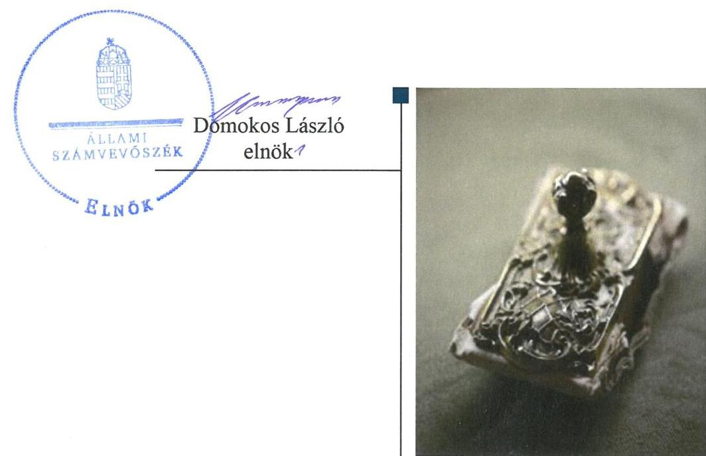
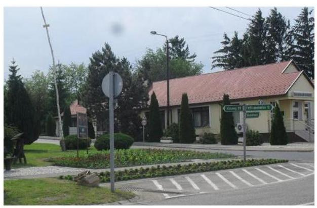
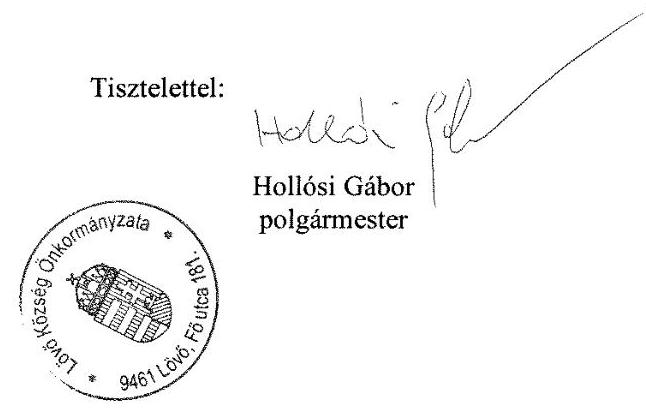
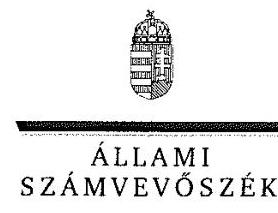
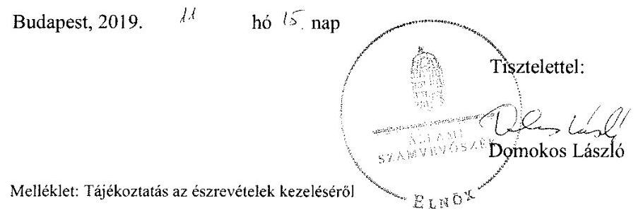
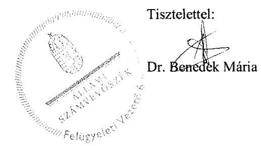

ÁLLAMI
SZÁMVEVŐSZÉK

# Jelentés 

## Önkormányzatok ellenőrzése

Integritás- és belső kontrollrendszer, Befektetési tevékenységek ellenőrzése - Lövő Község Önkormányzata 2019.

---

# Jelentés 

## Önkormányzatok ellenőrzése

Integritás- és belső kontrollrendszer, Befektetési tevékenységek ellenőrzése - Lövő Község Önkormányzata
2019. 12. hó 13. nap

---

# AZ ELLENŐRZÉST FELÜGYELTE:

DR. BENEDEK MÁRIA felügyeleti vezető

## AZ ELLENŐRZÉST VEZETTE ÉS A VÉGREHAJTÁSÁÉRT FELELŐS:

PETRÓ KATALIN ellenőrzésvezető

A PROGRAM ÖSSZEÁLLÍTÁSÁÉRT FELELŐS:

TÓTPÁL SZABOLCS osztályvezető

IKTATÓSZÁM: EL-2243-001/2019.

TÉMASZÁM: 2485

ELLENŐRZÉS-AZONOSÍTÓ SZÁM: V082911

Jelentéseink az Országgyűlés számítógépes hálózatán és az Interneta a www.asz.hu címen is olvashatóak.

---

# TARTALOMJEGYZÉK 

■ ÖSSZEGZÉS ..... 5
■ AZ ELLENŐRZÉS CÉLJA ..... 6
■ AZ ELLENŐRZÉS TERÜLETE ..... 7
■ AZ ELLENŐRZÉS HÁTTERE, INDOKOLTSÁGA ..... 8
■ A JELENTÉS LÉNYEGES KÉRDÉSKÖREI ..... 9
■ AZ ELLENŐRZÉS HATÓKÖRE ÉS MÓDSZEREI ..... 10
■ MEGÁLLAPÍTÁSOK ..... 12
■ JAVASLATOK ..... 15
■ MELLÉKLETEK ..... 17
I. sz. melléklet: Értelmező szótár ..... 17
■ FÜGGELÉK: ÉSZREVÉTELEK ..... 19
■ RÖVIDÍTÉSEK JEGYZÉKE ..... 29

---

.

---

# ÖSSZEGZÉS 

Lövő Község Önkormányzata belső kontrollrendszerének kialakítása és müködtetése a 2017. évben nem volt szabályszerű, ezáltal nem biztositotta a közpénzekkel történő elszámoltatható, szabályszerű gazdálkodást és a nemzeti vagyonnal történő felelős gazdálkodást. A belső kontrollrendszer a 2013-2017. években a befektetési tevékenység szabályszerű végzését, a befektetett eszközökkel való elszámoltathatóságot nem biztositotta. A korrupció elleni védettséget nem biztositották.

## Az ellenőrzés társadalmi indokoltsága

Az önkormányzatok vagyona a nemzeti vagyon része, és az Alaptörvény is rögzíti, hogy a vagyonnal való gazdálkodás célja a közérdek szolgálata, ezért az önkormányzatok felé elvárás a kiegyensúlyozott, átlátható és fenntartható költségvetési gazdálkodás elvének érvényesítése, továbbá a nemzeti vagyonnal való rendeltetésszerű és felelős módon való gazdálkodás. Az Állami Számvevőszék törvényben kapott felhatalmazással élve ellenőrzi az önkormányzatok gazdálkodását, múködését, hogy az ellenőrzések megállapításaival támogassa az ellenőrzött önkormányzatok szabályszerű gazdálkodását, javaslataival elősegítse az alaptörvényben megfogalmazott alapvetések érvényesülését a mindennapi életben az önkormányzatok szintjén. Az Állami Számvevőszék stratégiájában megfogalmazottak szerint támogatja az integritás alapú, átlátható és elszámoltatható közpénzfelhasználás megteremtését. Mindezekre tekintettel, a közpénzzel gazdálkodó szervezetek esetében a belső kontrollrendszer megfelelő kialakítása és múködtetés ellenőrzését prioritásként kezeli az Állami Számvevőszék.

## Főbb megállapítások, következtetések, javaslatok

Lövő Község Önkormányzata belső kontrollrendszerének kialakítása és múködtetése a 2017. évben nem volt szabályszerű.

Lövő Község Önkormányzata nem rendelkezett a vagyonnal történő gazdálkodás szabályaival, valamint gazdasági programmal, ezáltal nem biztosította a nemzeti vagyonnal történő felelős gazdálkodást. A Képviselő-testület a hivatásetikai alapelvek részletes tartalmát és az etikai eljárás szabályait nem határozta meg, így az önkormányzat nem szabályszerű kontrolkörnyezetben múködött. Lövő Község Önkormányzata integrált kockázatkezelési rendszert nem múködtetett.

Lövő Község Önkormányzata a 2017. évi költségvetési beszámolóját részletező nyilvántartásokkal és szabályszerű könyvvezetéssel nem támasztotta alá, így a beszámoló nem mutatott megbízható, valós képet és múködésének ellenőrizhetősége nem volt biztosított.

Lövő Község Önkormányzata nem biztosította, hogy a megfelelő információk a megfelelő időben eljussanak az illetékes szervezethez, szervezeti egységhez, illetve személyhez, így a jegyző nem szabályszerűen múködtette az információs és kommunikációs rendszert. A jegyző a monitoring rendszer múködtetéséről nem gondoskodott.

A Lövő Község Önkormányzatánál a 2013-2017. években a befektetési tevékenység szabályszerű végzése nem volt biztosított. A befektetésekkel kapcsolatos döntéshozatal, a számviteli elszámolás, nyilvántartás nem volt szabályszerű.

Az integritását támogató kontrollok kiépítése nem történt meg. Lövő Község Önkormányzata a teljesítmény mérésére alkalmas követelményeket nem alakította ki, a szervezeti célok elérését szolgáló feladatokat nem határozta meg, így nem volt biztosított a közpénzekkel való elszámoltatható, felelős gazdálkodás.

Az Állami Számvevőszék az intézkedések megtétele céljából a Polgármester és a Jegyző részére hat-hat javaslatot fogalmazott meg.

---

# AZ ELLENŐRZÉS CÉLJA 

AZ ELLENŐRZÉS CÉLJA annak megállapítása volt, hogy az önkormányzat belső kontrollrendszere biz-tosította-e a közpénzekkel és a nemzeti vagyonnal történő elszámoltatható, átlátható, szabályszerű, gazdaságos, hatékony és eredményes gazdálkodás feltételeit. Az ÁSZ ${ }^{1}$ az ellenőrzés keretében értékelte továbbá, hogy az önkormányzatnál kiépítették és erősítették-e a korrupciós kockázatok kezelését szolgáló integritás kontrollokat és azt, hogy megteremtették-e a teljesítményellenőrzés feltételeit.

Az ellenőrzés további célja annak értékelése volt, hogy a jogszabályi előírásoknak megfelelően alakították-e ki a belső kontrollrendszert, a kontrollkörnyezet biztosította-e a befektetési tevékenységek szabályszerű végzését. Az Állami Számvevőszék értékelte továbbá, hogy az egyes befektetési tevékenységekkel kapcsolatos döntéshozatal és a döntések végrehajtása, valamint az egyes befektetések számviteli elszámolása, nyilvántartása szabályszerű volt-e, és a belső és külső ellenőrzések támogatták-e az egyes befektetési tevékenységek szabályszerű végzését.

---

# AZ ELLENŐRZÉS TERÜLETE 

## Lövő Község Önkormányzata

Lövő község a Nyugat-Dunántúl régióban, Győr-Moson-Sopron megyében található. Állandó lakosainak száma a Központi Statisztikai Hivatal Magyarország közigazgatási helynévkönyve alapján 2017. január 1-jén 1420 fő volt.

A Polgármester ${ }^{2}$ 2014. év október 12-e óta tölti be tisztségét. Az Önkormányzat héttagú Képviselő-testületének ${ }^{3}$ munkáját egy állandó bizottság segítette.

Lövő Község Önkormányzata hivatali feladatait a Lövői Közös Önkormányzati Hivatal látta el. A Hivatal ${ }^{4}$-t három önkormányzat hozta létre Lövő székhellyel. A Hivatal nem tagolódott szervezeti egységekre, elkülönült gazdasági szervezettel nem rendelkezett. A Jegyzó ${ }^{5}$ 2013. január 1-étől látja el feladatát.

Lövő Község Önkormányzata konszolidált beszámolója szerint a 2017. évben 421,8 millió Ft költségvetési bevételt ért el, valamint 415,2 millió Ft költségvetési kiadást teljesített. 2017. december 31-én a befektetett eszközvagyon értéke 1380,4 millió Ft, a saját tőke értéke 1969,7 millió Ft, a mérleg szerinti eredménye 195,6 millió Ft, a mérlegfőösszege 2010,0 millió Ft, a követelésállománya 160,7 millió Ft, a kötelezettségeinek állománya 3,1 millió Ft volt.

Lövő Község Önkormányzata a 2017. évi költségvetésének végrehajtásáról szóló rendelete szerint 2017. december 31-én forgatási célú hitelviszonyt megtestesítő értékpapírral (tőkegarantált befektetési jegy) 85,005 millió Ft összértékben rendelkezett.

---

# AZ ELLENŐRZÉS HÁTTERE, INDOKOLTSÁGA 

A belső kontrollrendszer kialakítása és működtetése nélkül nem valósítható meg a közpénzek, a közvagyon átlátható, szabályos, gazdaságos, hatékony és eredményes felhasználása. A belső kontrollrendszer azt a célt szolgálja, hogy a költségvetési szervek működésük és gazdálkodásuk során a tevékenységeket szabályszerűen hajtsák végre, teljesítsék elszámolási kötelezettségeiket és megvédjék az erőforrásokat a veszteségektől, a károktól és a nem rendeltetésszerű használattól. A belső kontrollrendszer magában foglalja mindazon elveket, eljárásokat és belső szabályzatokat, melyek biztosítják, hogy a költségvetési szerv valamennyi tevékenysége és célja összhangban legyen a szabályszerűséggel, szabályozottsággal, valamint a gazdaságosság, hatékonyság és eredményesség követelményeivel, az eszközökkel és forrásokkal való gazdálkodásban ne kerüljön sor pazarlásra, visszaélésre, rendeltetésellenes felhasználásra. Megfelelő, pontos és naprakész információk álljanak rendelkezésre a költségvetési szerv működésével kapcsolatosan, és a belső kontrollrendszer harmonizációjára, öszszehangolására vonatkozó jogszabályok végrehajtásra kerüljenek. Az integritás kontrollok kiépítése, erősítése a szervezet korrupciós kockázatainak kezelését szolgálja. A teljesítménykövetelmények meghatározása és működtetése megalapozhatja az önkormányzatoknál a teljesítményellenőrzés lefolytatását.

Az önkormányzati vagyongazdálkodás keretében az önkormányzatok át-menetileg szabad pénzeszközeinek befektetését jogszabály nem tiltja, a befektetések jellege nem korlátozott, a pénzpiaci szolgáltatók közül az önkormányzatok a kínált szolgáltatás és annak költségei alapján, szabadon választhatnak, azonban a veszteséges gazdálkodás kockázatai és következményei az önkormányzatokat terhelik. A szabad pénzeszközök felhasználása során kiemelten fontos a felelős gazdálkodás érvényesülése, amely összhangban kell, hogy legyen, az önkormányzati gazdálkodás alapelveivel. Az ellenőrzéssel feltárásra kerülhetnek azok a kockázatok, amelyek az önkormányzatok gazdálkodásával, ezen belül befektetési tevékenységeivel, kontrollkörnyezetével kapcsolatosak és a befektetési tevékenységek szabályszerű végrehajtását befolyásolják. Az ellenőrzéssel az önkormányzatok befektetési/vagyongazdálkodási döntései értékelhetővé válnak, és megalapozott megállapítás tehető arra vonatkozóan, hogy milyen hatást gyakoroltak az önkormányzat vagyonára a képviselő-testület döntései.

---

# A JELENTÉS LÉNYEGES KÉRDÉSKÖREI 

1. Szabályszerú volt-e az önkormányzat belső kontrollrendszerének müködtetése a 2017. évben?
2. Az önkormányzatnál alakítottak-e ki a teljesítmény mérésére alkalmas követelményeket?
3. Az önkormányzatnál a befektetési tevékenységek szabályszerű végzését a kiépített kontrollrendszer biztositotta-e a 2013-2017. években? Az önkormányzatnál a 2017. december 31-én meglévő egyes befektetéseivel kapcsolatos döntéshozatal és az egyes befektetések számviteli elszámolása szabályszerű volt-e?

---

# AZ ELLENŐRZÉS HATÓKÖRE ÉS MÓDSZEREI 

## Az ellenőrzés típusa

Megfelelőségi és szabályszerűségi ellenőrzés.

## Az ellenőrzött időszak

Az ellenőrzött időszak a 2017. év.
Az egyes befektetési tevékenységek ellenőrzése tekintetében az ellenőrzött időszak 2013. január 1. - 2017. december 31. közötti időszak.

## Az ellenőrzés tárgya

Az önkormányzat és a gazdálkodási feladatokat ellátó hivatala belső kontrollrendszerének kialakítása és múködtetése, valamint az integritás kontrollok kiépítettsége, a teljesítményellenőrzés feltételei voltak.

Az egyes befektetési tevékenységek ellenőrzésének tárgya az önkormányzat 2017. december 31-én meglévő, a Számv. tv. 3. § (6) bekezdés 2. és 3. pontja szerint az értékpapírokban megtestesülő befektetései, lekötött betétei.

## Az ellenőrzött szervezet

Lövő Község Önkormányzata

## Az ellenőrzés jogalapja

Az ellenőrzés jogszabályi alapját az ÁSZ tv. 1. § (3) bekezdés, 5. § (2) és (6) bekezdései, valamint az Áht. 61. § (2) bekezdésének előírásai képezték.

## Az ellenőrzés módszerei

Az ÁSZ az ellenőrzést az ellenőrzési program szempontjai, az ellenőrzött időszakban hatályos jogszabályok, az ellenőrzés szakmai szabályai, a jelen ellenőrzésre irányadó ÁSZ módszertanok figyelembevételével végezte.

Az ellenőrzés ideje alatt az ÁSZ az önkormányzattal a kapcsolattartást az ÁSZ SZMSZ ${ }^{\text {® }}$-ének vonatkozó előírásai alapján biztosította.

---

Az ellenőrzési kérdések megválaszolásához szükséges bizonyítékok megszerzése az ellenőrzött által rendelkezésre bocsátott dokumentumokra, adatokra alapozva megfigyelés, szemle (szemrevételezés), kérdésfeltevés (információkérés), valamint elemző eljárás útján történt.

Az ellenőrzési bizonyítékként felhasználható adatforrások közé tartoztak az ellenőrzési program részletes szempontjainál felsorolt adatforrások, valamint minden egyéb - az ellenőrzés folyamán feltárt, az ellenőrzés szempontjából információt tartalmazó - dokumentum.

Az ellenőrzés lefolytatásához az ellenőrzött szervezet tanúsítványok kitöltésével, valamint az ÁSZ által kért dokumentumok megküldésével szolgáltatott adatokat, amelyek valódiságát és teljes körűségét az ellenőrzött szervezet vezetője által tett teljességi és hitelességi nyilatkozat igazolta. A rendelkezésre bocsátott adatok, információk kontrollja az ellenőrzés keretében történt.

Az önkormányzat belső kontrollrendszere egyes pilléreinek kialakítására és működtetésére vonatkozó értékelés:
$\longrightarrow$ „szabályszerú", amennyiben az értékelt területen az elért „igen" válaszok százalékban kifejezett, egész számra kerekített aránya legalább $85 \%$,
$\longrightarrow$ „nem szabályszerű", ha nem éri el a $85 \%$-ot.
Az önkormányzat belső kontrollrendszerének összesített értékelése az egyes részterületek esetében kapott megfelelőségi arányok számtani átlaga alapján történt és megegyezett a pillérenként (kontrollterületenként) alkalmazott százalékos értékelésekkel, a következő eltérésekkel: a kontrollrendszer egésze esetében a „szabályszerű" értékelésnek a százalékos értéken felül további feltétele volt, hogy egyik kontrollterület sem kaphatott „nem szabályszerű" értékelést.

Az önkormányzatok befektetési tevékenységét a szerződéskötés (és a kapcsolódó döntés-előkészítés, döntéshozatal) kivételével a 2013. január 1. és 2017. december 31. közötti időszak vonatkozásában értékelte az ÁSZ. A szerződéskötést az önkormányzat 2017. december 31-én meglévő értékpapírjai és egyéb befektetései vonatkozásában értékelte az ellenőrzés.

---

# 1. Szabályszerú volt-e az önkormányzat belső kontrollrendszerének múködtetése a 2017. évben? 

Összegző megállapítás

Az Önkormányzat ${ }^{7}$ belső kontrollrendszerének kialakítása és múködtetése nem volt szabályszerű a 2017. évben.

A KONTROLLKÖRNYEZET kialakítása és múködtetése nem volt szabályszerű.

Az Önkormányzat a Htv. ${ }^{8}$ 138. § (1) bekezdés j) pontja előírása ellenére nem rendelkezett a Képviselő-testület által elfogadott önkormányzati vagyonnal történő gazdálkodás szabályaival.

Az Önkormányzat a Mötv. ${ }^{9}$ 116. § (5) bekezdés előírása ellenére nem rendelkezett a Képviselő-testület által elfogadott gazdasági programmal.

A Hivatal a Kttv. ${ }^{10}$ 231. § (1) bekezdés előírása ellenére nem rendelkezett a Képviselő-testület által megállapított hivatásetikai alapelvek részletes tartalmával, valamint az etikai eljárás szabályaival.

A polgármester nem gondoskodott arról, hogy a jegyző a Kttv. 75. §. (1) bekezdés d) pontja, a Kttv. 226. § (1) bekezdés és a Kttv. 226. § (2) bekezdés a) és b) pontjainak előírása szerint rendelkezzen munkaköri leírással.

Az Önkormányzat rendelkezett a Mötv. által előírt önkormányzati SZMSZ ${ }^{11}$-el. A Hivatal rendelkezett az Áht. és az Ávr. ${ }^{12}$ által előírt alapító okirattal ${ }^{13}$ és hivatali SZMSZ ${ }^{14}$-el. Az Önkormányzat és a Hivatal rendelkezett a Számv.tv. ${ }^{15}$ és az Áhsz. ${ }^{16}$ által előírt Számviteli politikával ${ }^{17}$, valamint az annak keretében elkészítendő szabályzatokkal ${ }^{18}$.

## A JEGYZŐ AZ INTEGRÁLT KOCKÁZATKEZELÉSI

RENDSZERT a Bkr. ${ }^{19} 7 . \S$ (1) bekezdésben foglaltak ellenére nem múködtette.

A KONTROLLTEVÉKENYSÉGEK múködtetése nem volt szabályszerű, mert az Önkormányzat az Áhsz. 39. § (1) bekezdésében foglaltakat megsértve nem vezetett, a valóságnak megfelelő folyamatos, zárt rendszerú, áttekinthető részletező nyilvántartást, tekintettel az egyéb dologi kiadások analitikus nyilvántartása és a beszámoló közötti eltérésre, mivel a főkönyvi adatbázisban és a 2017. évi éves költségvetési beszámolóban a K355 Egyéb dologi kiadások rovatkód egyenlege nem egyezett meg egymással. Ennek következtében az Önkormányzat a részletező nyilvántartások és a szabályszerű könyvvezetés hiányában az Áhsz. 5. § (1) bekezdésében foglaltak ellenére a 2017. évről szóló költségvetési beszámolóját részletező nyilvántartásokkal és szabályszerű könyvvezetéssel nem támasztotta alá.

Az Önkormányzat által megküldött dokumentumokban foglaltakat az ÁSZ értékelte és a kontrolltevékenységek múködésére vonatkozóan megállapította, hogy a 2017. évben 13 esetben összesen 14,3 millió Ft összeg

---

az Áht. 38 § (1) bekezdésben előírtakat megsértve teljesítésigazolás nélkül került kifizetésre.

# A JEGYZŐ AZ INFORMÁCIÓS ÉS KOMMUNIKÁCIÓS RENDSZERT a Bkr. 3. § d) pontjában előírtak ellenére nem alakította ki. 

A JEGYZŐ A MONITORING RENDSZERT a Bkr. 3. § e) pontjában előírtak ellenére nem alakította ki.

A jegyző a belső ellenőrzés kialakításáról és múködtetéséről Társulás ${ }^{20}$ által foglalkoztatott belső ellenőrzés útján, az Áht. előírásai szerint gondoskodott.

A jegyző a Bkr. 11. § (1) bekezdése alapján az 1. melléklet szerinti nyilatkozatban értékelte a Hivatal belső kontrollrendszerének 2017. évi minőségét. Az ÁSZ ellenőrzési megállapításai nem igazolták a nyilatkozatban foglaltakat.

Az Önkormányzat a korrupciós kockázatok kezelésére alkalmas integritás kontrollokat nem építette ki.

## 2. Az önkormányzatnál alakítottak-e ki a teljesítmény mérésére alkalmas követelményeket?

Összegző megállapítás Az Önkormányzatnál nem alakítottak ki a teljesítmény mérésére alkalmas követelményeket.

A szervezeti célok elérését szolgáló feladatok, folyamatok, tevékenységek mérését szolgáló indikátorokat, mérőszámokat, feladat- és teljesítménymutatókat az Önkormányzat nem képzett, így nem biztosította a teljesítménymérés lehetőségét.

## 3. Az önkormányzatnál a befektetési tevékenységek szabályszerű végzését a kiépített kontrollrendszer biztosította-e a 2013-2017. években? Az önkormányzatnál a 2017. december 31-én meglévő egyes befektetéseivel kapcsolatos döntéshozatal és az egyes befektetések számviteli elszámolása szabályszerű volt-e?

### 3.1. Összegző megállapítás Az Önkormányzatnál a befektetési tevékenységek szabályszerű végzését a belső kontrollrendszer nem biztosította a 2013-2017. években.

A jegyző nem készítette el a 2013. január 01. - 2016. november 14. közötti időszakra a Számv. tv. 14. § (3) bekezdéseiben foglaltak ellenére a Hivatal számviteli politikáját. A Hivatal 2016. november 15-től rendelkezett számviteli politikával.

A jegyző nem készítette el a 2013. január 01. - 2016. december 31. közötti időszakra a Hivatal számviteli politikája keretében a Számv. tv. 14. §

---

(5) bekezdés a) pontjában foglaltak ellenére az eszközök és a források leltárkészítési és leltározási szabályzatát. A Hivatal 2017. január 01-től rendelkezett eszközök és a források leltárkészítési és leltározási szabályzattal.

A jegyző nem készítette el a 2013. január 01. - 2016. december 31. közötti időszakra a Hivatal tekintetében a Számv. tv. 14. § (5) bekezdés b) pontjában foglaltak ellenére az eszközök és források értékelési szabályzatát és a Számv. tv. 161. § (1) bekezdésben foglaltak ellenére a számlarendet. A jegyző nem készítette el továbbá a Hivatal és az Önkormányzat tekintetében a Számv. tv. 14. § (5) bekezdés d) pontjában foglaltak ellenére a pénzkezelési szabályzatot. 2017. január 01-től a Hivatal rendelkezett eszközök és források értékelési szabályzattal és számlarenddel, a Hivatal és az Önkormányzat rendelkezett pénzkezelési szabályzattal.

A belső ellenőrzés nem támogatta az egyes befektetési tevékenységek szabályszerű végzését. Az Önkormányzatnál a 2013. január 1. - 2017. december 31. közötti időszakban a belső ellenőrzés a befektetésekkel kapcsolatosan nem végzett kockázatelemzést, a befektetési tevékenységet nem ellenőrizte, ezáltal befektetési tevékenységeket érintő intézkedések nem kerültek megfogalmazásra.

# 3.2. Összegző megállapítás Az Önkormányzat 2017. december 31-én meglévő egyes befektetéseivel kapcsolatos döntéshozatal és az egyes befektetések számviteli elszámolása, nyilvántartása nem volt szabályszerű. 

AZ EGYES BEFEKTETÉSEKKEL KAPCSOLATOS DÖNTÉSHOZATAL nem volt szabályszerű.

A polgármester a Mötv. 107. §, valamint az Önkormányzat Képviselőtestületének 2013., 2014., 2015., 2016., 2017. évi költségvetéséről szóló rendeletei ${ }^{21}$ 4. § (6)-(7) bekezdésekben foglaltak ellenére a Képviselő-testület határozata nélkül döntött befektetési jegyek vételéről és betétlekötésről.

A jegyző a Bkr. 8. § (2) bekezdés b) pontjában foglaltak ellenére a 2013. január 1. és 2017. december 31. közötti időszakban nem biztosította a kontrolltevékenység részeként az egyes befektetésekre vonatkozó szervezeti célok elérését veszélyeztető kockázatok csökkentésére irányuló kontrollok kiépítését, a döntések célszerűségi, gazdaságossági, hatékonysági és eredményességi szempontú megalapozottsága vonatkozásában.

AZ EGYES BEFEKTETÉSEK SZÁMVITELI ELSZÁMOLÁSA, NYILVÁNTARTÁSA a 2013-2017. években nem volt szabályszerű.

A jegyző az Áhsz. ${ }_{1}$ 49. § (1) és az Áhsz. ${ }_{2}{ }^{22}$ 45. § (3) bekezdésekben foglaltak ellenére a 2013-2017. években a forgatási célú hitelviszonyt megtestesítő értékpapírok vonatkozásában az elemi költségvetési beszámoló adatai valóságnak megfelelő, áttekinthető alátámasztásáról, illetve a vonatkozó adatszolgáltatási kötelezettségének alátámasztásáról a könyvviteli számlák alábontásával vagy a könyvviteli számlákhoz kapcsolódó részletező nyilvántartások vezetésével nem gondoskodott.

---

# JAVASLATOK 

Az ÁSZ tv. 33. § (1) bekezdésében foglaltak értelmében az ellenőrzött szervezet vezetője köteles a jelentésben foglalt megállapításokhoz kapcsolódó intézkedési tervet összeállítani és azt a jelentés kézhezvételétől számított 30 napon belül az ÁSZ részére megküldeni. Amennyiben az ellenőrzött szervezet vezetője nem küldi meg határidőben az intézkedési tervet, vagy továbbra sem elfogadható intézkedési tervet küld, az Állami Számvevőszék elnöke az ÁSZ tv. 33. § (3) bekezdése a) és b) pontjaiban foglaltakat érvényesítheti.

## a polgármesternek

1. Intézkedjen az Állami Számvevőszék ellenőrzése során feltárt hiányosságok és/vagy szabálytalanságok tekintetében a munkajogi felelősség tisztázására irányuló eljárás megindításáról, és ennek eredménye ismeretében tegye meg a szükséges intézkedéseket.
(1. sz. megállapítás 7-8. és 10-11. sz. bekezdései, 3.2. sz. megállapítás 3. és 5. bekezdés megállapításai alapján sz. megállapítás alapján)
2. Gondoskodjon a Htv. előirása szerint, hogy a képviselő-testület elfogadja az önkormányzati vagyonnal történő gazdálkodás szabályait.
(1. sz. megállapítás 2. bekezdése alapján)
3. Gondoskodjon a Kttv. előirása szerint, hogy a hivatásetikai alapelvek részletes tartalmát, valamint az etikai eljárás szabályait a képviselőtestület állapítsa meg.
(1. sz. megállapítás 4. bekezdés alapján)
4. Gondoskodjon, hogy a Kttv. előirása szerint a jegyző rendelkezzen munkaköri leírással.
(1. sz. megállapítás 5. bekezdés alapján)
5. Az Önkormányzat kiadási előirányzatainak terhére vállalt kötelezettség vonatkozásában az Áht. előirása szerint igazolja a teljesítést.
(1. sz. megállapítás 9. bekezdés alapján)
6. Az egyes befektetésekkel kapcsolatos döntései során a Mötv., valamint az önkormányzat költségvetéséről szóló rendeletek előírásainak megfelelően járjon el.
(3.2. sz. megállapítás 2. bekezdés alapján)

---

# a jegyzőnek 

1. Intézkedjen a Bkr. előírásának megfelelően az integrált kockázatkezelési rendszer müködtetéséről.
(1. sz. megállapítás 7. bekezdése alapján)
2. Intézkedjen az Áhsz. előírásának megfelelően az éves költségvetési beszámoló részletező nyilvántartással és szabályszerű könyvvezetéssel történő alátámasztásáról.
(1. sz. megállapítás 8. bekezdése alapján)
3. Alakitson ki a Bkr előírásának megfelelően információs és kommunikációs rendszert.
(1. sz. megállapítás 10. bekezdése alapján)
4. Alakitson ki a Bkr. előírásainak megfelelően a belső kontrollrendszer keretében a szervezet tevékenységének, a célok megvalósításának nyomon követését biztosító rendszert.
(1. sz. megállapítás 11. bekezdése alapján)
5. Biztosítsa a Bkr. előírásának megfelelően a kontrolltevékenység részeként az egyes befektetésekre vonatkozó szervezeti célok elérését veszélyeztető kockázatok csökkentésére irányuló kontrollok kiépítését, a döntések célszerüségi, gazdaságossági, hatékonysági és eredményességi szempontú megalapozottsága vonatkozásában.
(3.2. sz. megállapítás 3. bekezdése alapján)
6. Gondoskodjon az Áhsz. előírásainak megfelelően a könyvviteli számlák alábontásáról vagy részletező nyilvántartás vezetéséről a forgatási célú hitelviszonyt megtestesítő értékpapírok tekintetében.
(3.2. sz. megállapítás 5. bekezdése alapján)

---

# MELLÉKLETEK 

- I. SZ. MELLÉKLET: ÉRTELMEZŐ SZÓTÁR
belső ellenőrzés
belső kontrollrendszer
belső kontrollrendszer területei
információs és kommunikációs rendszer
integrált kockázatkezelési rendszer
integritás
kockázat
kontrollkörnyezet
kontrolltevékenységek
kommunikáció

Független, tárgyilagos bizonyosságot adó és tanácsadó tevékenység, amelynek célja, hogy az ellenőrzött szervezet működését fejlessze és eredményességét növelje, az ellenőrzött szervezet céljai elérése érdekében rendszerszemléletű megközelítéssel és módszeresen értékeli, illetve fejleszti az ellenőrzött szervezet irányítási és belső kontrollrendszerének hatékonyságát. (Forrás: Bkr. 2. § b) pontja)
A belső kontrollrendszer a kockázatok kezelése és tárgyilagos bizonyosság megszerzése érdekében kialakított folyamatrendszer, amely azt a célt szolgálja, hogy a müködés és gazdálkodás során a tevékenységeket szabályszerűen, gazdaságosan, hatékonyan, eredményesen hajtsák végre, az elszámolási kötelezettségeket teljesítsék, megvédjék az erőforrásokat a veszteségektől, károktól és nem rendeltetésszerű használattól. (Forrás: Áht. 69. § (1) bekezdése)
A kontrollkörnyezet, az integrált kockázatkezelési rendszer, a kontrolltevékenységek, az információs és kommunikációs rendszer, valamint a nyomon követési (monitoring) rendszer. (Forrás: Bkr. 3. §-a)
A költségvetési szerv vezetője által kialakított és müködtetett olyan rendszer, mely biztosítja, hogy a megfelelő információk a megfelelő időben eljutnak az illetékes szervezethez, szervezeti egységhez, illetve személyhez. (Forrás: Bkr. 9. § (1) bekezdés)
Olyan folyamatalapú kockázatkezelési rendszer, amely a szervezet minden tevékenységére kiterjed, egységes módszertan és eljárások alkalmazásával, a szervezet célkitűzéseinek és értékeinek figyelembevételével biztosítja a szervezet kockázatainak teljes körű azonosítását, azok meghatározott kritériumok szerinti értékelését, valamint a kockázatok kezelésére vonatkozó intézkedési terv elkészítését és az abban foglaltak nyomon követését. (Forrás: Bkr. 2. § m) pontja, 2016. október 1-jétől)
Az integritás az elvek, értékek, cselekvések, módszerek, intézkedések konzisztenciáját jelenti, vagyis olyan magatartásmódot, amely meghatározott értékeknek megfelel. (Forrás: Nemzetgazdasági Minisztérium: Magyarországi államháztartási belső kontroll standardok Útmutató 1.6.1. pontja, 2012. december)
A kockázat annak a valószínűségét jelenti, hogy egy vagy több esemény vagy intézkedés nem kívánt módon befolyásolja a rendszer müködését, céljainak megvalósulását. (Forrás: Javaslatok a korrupciós kockázatok kezelésére - Kockázatkezelési és ellenőrzési módszertan 35. oldal, ÁSZ)
A költségvetési szerv vezetője által kialakított olyan elvek, eljárások, belső szabályzatok összessége, amelyben világos a szervezeti struktúra, a folyamatok átláthatók, egyértelműek a felelősségi, hatásköri viszonyok és feladatok, meghatározottak, ismertek és elfogadottak az etikai elvárások a szervezet minden szintjén, átlátható a humán-erőforrás-kezelés, biztosított a szervezeti célok és értékek irányában való elkötelezettség fejlesztése és elősegítése. (Forrás: Bkr. 6. § (1) bekezdés)
A költségvetési szerv vezetője által a szervezeten belül kialakított (kontroll) tevékenységek, melyek biztosítják a kockázatok kezelését, hozzájárulnak a szervezet céljainak eléréséhez és erősítik a szervezet integritását. (Forrás: Bkr. 8. § (1) bekezdés)
Az a tevékenység, melynek során információ továbbítása valósul meg. A kommunikációs folyamat résztvevői között tájékoztatás történik, mely során tényeket, ezek magyarázatát közlik.

---

| közös önkormányzati hivatal | A települési képviselő-testület más települési képviselő-testülettel társult képviselőtestületet alakíthat, amely esetén a képviselő-testületek részben vagy egészben egyesítik a költségvetésüket, közös önkormányzati hivatalt tartanak fenn és intézményeiket közösen működtetik. (Forrás: Mötv. 56. § (1)-(2) bekezdései) |
| :--: | :--: |
| monitoring | A monitoring általánosságban a különböző szintű szervezeti célok megvalósításának folyamatát kíséri figyelemmel, melynek során a releváns eseményekről és tevékenységekről (együtt: folyamatokról) rendszeres jelleggel, strukturált, döntéstámogató információkhoz jutnak a szervezet vezetői. (Forrás: NGM Útmutató a költségvetési szervek monitoring rendszeréhez 2011. november) |
| monitoring-rendszer | A költségvetési szerv vezetője köteles kialakítani a szervezet tevékenységének a célok megvalósításának nyomon követését biztosító rendszert, amely az operatív tevékenységek keretében megvalósuló folyamatos és eseti nyomon követésből, valamint az operatív tevékenységektől függetlenül múködő belső ellenőrzésből állhat. (Forrás: Bkr. 10. §) |
| önkormányzati hivatal | A polgármesteri hivatal, a főpolgármesteri hivatal, a megyei önkormányzati hivatal és a közös önkormányzati hivatal. (Forrás: Áht. 1. § 18. pont) |
| társulás | A helyi önkormányzatok képviselő-testületei megállapodhatnak abban, hogy egy vagy több önkormányzati feladat- és hatáskör, valamint a polgármester és a jegyző államigazgatási feladat- és hatáskörének hatékonyabb, célszerűbb ellátására jogi személyiséggel rendelkező társulást hoznak létre. (Forrás: Mötv. 87. §) |

---

# FÜGGELÉK: ÉSZREVÉTELEK 

A jelentéstervezetet a Számvevőszék 15 napos észrevételezésre megküldte az ellenőrzött szervezet vezetőjének az ÁSZ tv. 29. §* (1) bekezdése előírásának megfelelően.

Lövő Község Önkormányzatának polgármestere a jelentéstervezet megállapításaira írásban észrevételt tett.
Az ÁSZ tv. 29. § (3) bekezdésével összhangban az ÁSZ a Függelékben feltünteti az ellenőrzés megállapításaival kapcsolatban tett, figyelembe nem vett észrevételeket, és megindokolja, hogy azokat miért nem fogadta el.

[^0]
[^0]:    * 29. § (1) Az Állami Számvevőszék az ellenőrzési megállapításait megküldi az ellenőrzött szervezet vezetőjének vagy az általa megbízott személynek, és annak, akinek személyes felelősségét állapította meg.
    (2) Az ellenőrzött szervezet vezetője és a felelősként megjelölt személy az ellenőrzés megállapításaira tizenöt napon belül írásban észrevételt tehet.
    (3) Az Állami Számvevőszék az észrevételre a beérkezésétől számított harminc napon belül írásban válaszol. A figyelembe nem vett észrevételeket köteles a jelentésben feltüntetni, és megindokolni, hogy azokat miért nem fogadta el.

---

Lövő Község Önkormányzata

9461. Lövő, Fő utca 181.
E-mail: korjegyzo@lovokorjegyzo.hu

Tel.:06(99)533-550
Fax: 06(99)533-558

103-12/2019.

Tárgy: Számvevőszéki jelentéstervezetre észrevétel

Hiv.sz.: EL-0811-055/2019.

Domokos László
Elnök Úr
részére

ÁLLAMI SZÁMVEVŐSZÉK

Budapest 4.
Pf.: 54.
1364

Tisztelt Elnök Úr !

"Önkormányzatok ellenőrzése - Integritás és belső kontrollrendszer-Befektetési tevékenységek ellenőrzése - Lövő Község Önkormányzata" című ellenőrzésről készült jelentéstervezethez az alábbi észrevételt terjesztem a T. Elnök Úrhoz:

1./

ÁSZ megállapítása és javaslata:

"1. Intézkedjen az Állami Számvevőszék ellenőrzése során feltárt hiányosságok és/vagy szabálytalanságok tekintetében a munkajogi felelősség tisztázására irányuló eljárás megindításáról, és ennek eredménye ismeretében tegye meg a szükséges intézkedéseket."

Észrevétel:

Lövői Közös Önkormányzati Hivatal jegyzője, és köztisztviselői a hatályos jogszabályok alapján, lelkiismeretesen, tudásuk legjavát adva végzik és végezték ezideig a munkájukat.

Álláspontom alapján - figyelemmel a fentiekre, jelen észrevételben, valamint Jegyző Aszony által tett észrevételben foglaltakra, munkajogi felelősség tisztázására irányuló eljárást nem tartok indokoltnak, így Lövő Község Önkormányzat Képviselő-testülete felé ilyen tartalmú javaslattal nem kívánok élni.

---

# 2./ 

## ÁSZ megállapítása és javaslata:

"2. Gondoskodjon a Htv. előirása szerint, hogy a képviselő-testület elfogadja az önkormányzati vagyonnal történő gazdálkodás szabályait."

## Észrevétel:

A tervezet 21.oldalának 1.pontjában megfogalmazottakkal kapcsolatban tájékoztatom az Elnök Urat,hogy Lövő Község Önkormányzatának Képviselő-testülete az önkormányzati vagyonnal történő gazdálkodás szabályait elfogadta az alábbiak szerint:

Az önkormányzati vagyon kezelésbe adásáról a 6/2014.(VI.05.) önkormányzati rendeletében rendelkezett, melyet 2014.június 5 -én fogadott el a képviselő-testület, és Önökhöz 1.5.vagyongaz_rendelet megnevezéssel került felterjesztésre az adatszolgáltatás keretében.

A Képviselő-testület 2011.március 21-én elfogadta Lövő Község Önkormányzatának 20102014.évi gazdasági programját ,melyet 3.2. Lovo_gazd_program 2010-2014 megnevezéssel terjesztettük fel Önökhöz.

A képviselő-testület 2015.március 17-én elfogadta Lövő Község Önkormányzata Képviselőtestületének Gazdasági Programját 2014-2019.évre ,melyet 3.1.2.gazd_program megnevezéssel terjesztettük fel Önökhöz.

A képviselő-testület 2013.március 20-án elfogadta Lövő Község Önkormányzata Képviselőtestületének Közép -és Hosszú távú vagyongazdálkodási tervét ,melyet 3.6.Lovo_Kepv_Test_kozep_es_hosszu_tavu_gazd-terv megnevezéssel terjesztettük fel Önökhöz. A felsorolt dokumentumokat csatoltan ismételten megküldjük.
3./

## ÁSZ megállapítása és javaslata:

"4. Gondoskodjon, hogy a Kttv. előírása szerint a jegyző rendelkezzen munkaköri leírással."

## Észrevétel:

A 4.pontban megfogalmazott javaslatukkal kapcsolatban az alábbi észrevételt teszem:
A jegyző rendelkezett a Kttv. 75. § (1) és a Kttv.226.§ (1) és Kttv.226.§ (2) bekezdésében megfogalmazott mukaköri leírással mely részére 2015.január 29-én került kiadásra.

A munkaköri leírás tartalmazza a betöltéshez szükséges végzettséget,szakképzettséget,és a jegyző konkrét iskolai végzettségét.

A munkaköri leírás 26_munkakori_leiras_Lukacs_Antal_Gyorgyne megnevezéssel került Önökhöz felterjesztésre.

---

A munkaköri leirást mellékelten ismételten felterjesztjük.
A jelentéstervezetük 3,5,6 pontjában megfogalmazott javaslatukra észrevételt nem kivánok tenni, azt elfogadom, kijavitásukra a szükséges intézkedéseket különösen az intézkedési tervben foglaltakra tekintettel megkezdem.

Lövő,2019.október 22.

---

ELMök

Ikt.szám: EL-0811-059/2019.

# Hollósi Gábor úr 

polgármester
Lövő Község Önkormányzata

Lövő

## Tisztelt Polgármester Úr!

Az „Önkormányzatok ellenörzése - Integritás- és belső kontrollrendszer - Befektetési tevékenységek ellenörzése - Lövő Község Önkormányzata" címủ számvevőszéki jelentéstervezetben foglalt megállapításokra tett 2019. október 22-i keltezésủ, 103-12/2019. iktatószámú észrevételeit megkaptam.

Tájékoztatom Polgármester urat, hogy a figyelembe nem vett észrevételeket - az Állami Számvevőszékről szóló 2011. évi LXVI. törvény 29. § (3) bekezdése alapján - az Állami Számvevőszék a számvevőszéki jelentésben szerepelteti azok elutasítása indoklásának feltüntetésével.

Az Állami Számvevőszék észrevételekre vonatkozó álláspontjáról a felügyeleti vezető által készített részletes tájékoztatást csatoltan megküldöm.
Budapest, 2019.

---

# Tájékoztatás az észrevételek kezeléséről 

Az „Önkormányzatok ellenőrzése - Integritás- és belső kontrollrendszer, Befektetési tevékenységek ellenőrzése - Lövő Község Önkormányzata" címủ számvevőszéki jelentéstervezetben foglalt megállapításokra a 2019. október 22-i keltezésủ, 103-12/2019. iktatószámú levélben megküldött észrevételeit áttekintettem. Az észrevételek kezeléséről az alábbi tájékoztatást adom.

1. A jelentéstervezetben a polgármesternek címzett 1. javaslatra vonatkozó észrevétel: Polgármester úr észrevételében jelezte, hogy a „Lövői Közös Önkormányzati Hivatal jegyzője, és köztisztviselői a hatályos jogszabályok alapján, lelkiismeretesen, tudásuk legjavát adva végzik és végezték ezideig a munkájukat. Álláspontom alapján - figyelemmel a fentiekre, jelen észrevételben, valamint Jegyző Asszony által tett észrevételben foglaltakra, munkajogi felelősség tisztázására irányuló eljárást nem tartok indokoltnak, igy Lövő Község Önkormányzat Képviselő-testülete felé ilyen tartalmú javaslattal nem kivánok élni."
Az ÁSZ ellenőrzés megállapította, hogy Lövő Község Önkormányzatánál (továbbiakban: Önkormányzat) a belső kontrollrendszer öt eleme közül egyik sem volt szabályszerű a 2017. évben. Továbbá a befektetési tevékenységek szabályszerű végzését a belső kontrollrendszer a 2013-2017. években sem biztosította, így Polgármester úr észrevételét az ÁSZ ellenőrzés megállapításai nem igazolták.
A fent leírtak alapján Polgármester úr észrevételét az ÁSZ nem veszi figyelembe, a számvevőszéki jelentéstervezetben szereplő, polgármesternek címzett 1. javaslat módosítása nem indokolt.
2. A jelentéstervezetben a polgármesternek címzett 2. javaslatra vonatkozó észrevétel: Polgármester úr észrevételében jelezte, hogy „A tervezet 21. oldalának 1. pontjában megfogalmazottukkal kapcsolatban tájékoztatom az Elnök Urat, hogy Lövő Község Önkormányzatának Képviselő-testülete az önkormányzati vagyonnal történő gazdálkodás szabályait elfogadta az alábbiak szerint:

Az Önkormányzati vagyon kezelésbe adásáról a 6/2014.(VI.05.) önkormányzati rendeletében rendelkezett, melyet 2014. június 5-én fogadott el a képviselő-testület, és Önökhöz

---

1.5 vagyongaz_rendelet megnevezéssel került felterjesztésre az adatszolgáltatás keretében.
A Képviselő-testület 2011.március 21-én elfogadta Lövő Község Önkormányzatának 2010-2014. évi gazdasági programját, melyet 3.2. Lovo_gazd_program 2010-2014 megnevezéssel terjesztettük fel Önökhöz.

A képviselő-testület 2015. március 17-én elfogadta Lövő Község Önkormányzata Képvi-selő- testületének Gazdasági Programját 2014-2019.évre, melyet 3.1.2.gazd_program megnevezéssel terjesztettük fel Önökhöz.

A képviselő-testület 2013.március 20-án elfogadta Lövő Község Önkormányzata Képvi-selő- testületének Közép -és Hosszú távú vagyongazdálkodási tervét, melyet 3.6 Lovo_Kepv_Test_kozep_es_hosszu_tavu_gazd-terv megnevezéssel terjesztettük fel Önökhöz. A felsorolt dokumentumokat csatoltan ismételten megküldjük."

Az ÁSZ az EL-0811-005/2018. iktatószámú adatbekérő levél 2. számú melléklet 1.5. pontjában foglaltak szerint kérte az ellenőrzéshez megküldeni az Önkormányzat vagyongazdálkodási rendeletét. Az adatszolgáltatásra biztosított határidőben az Önkormányzat által rendelkezésére bocsátott dokumentumok felülvizsgálata során az ÁSZ megállapította, hogy az adatszolgáltatási rendszerbe megküldött „1.5_vagyongaz_rend" elnevezésű fájl az Önkormányzat 6/2014. (VI. 05.) számú önkormányzati rendelete az önkormányzati vagyon vagyonkezelésbe adásáról. A hivatkozott rendelet a Magyarország helyi önkormányzatairól szóló 2011. évi CLXXXIX. törvény (továbbiakban: Mötv.) 109. § (4) bekezdése előírásai szerint a vagyonkezelői jog létesítéséről, gyakorlásáról, átengedéséről és ellenőrzéséről rendelkezik. Ugyanakkor az Önkormányzat nem bocsátott az ÁSZ rendelkezésére olyan dokumentumot, amellyel azt igazolja, hogy a nemzeti vagyonról szóló 2011. évi CXCVI. törvény (továbbiakban Nvtv.) 18. § (1) bekezdése előírásainak megfelelően rendeletben jelölte meg a forgalomképtelennek minősülő vagyonából azokat a tulajdonában álló vagyonelemeket, amelyeket az 5. § (4) bekezdés szerinti nemzetgazdasági szempontból kiemelt jelentőségű nemzeti vagyonként forgalomképtelen törzsvagyonnak minősít, továbbá az Nvtv. 5. § (2) bekezdése b) és c) pontjai, valamint (4) bekezdésében előírtak szerinti szabályokat.
Polgármester úr észrevételében hivatkozott és az adatszolgáltatásra biztosított határidőben megküldött, a 2010-2014. évekre és a 2014-2019. évekre vonatkozó gazdasági programok, valamint az Önkormányzat Közép-és hosszú távú vagyongazdálkodási terve elkészítésével az Mötv. 116. § (3) bekezdése előírásainak tett eleget az Önkormányzat. A gazdasági program és a vagyongazdálkodási terv rendeltetése más, mivel azok célkitűzéseket tartalmaznak, szemben az önkormányzati rendelettel, mely kötelező érvényű előírásokat határoz meg, melyeket az önkormányzat vagyonával történő gazdálkodás során be kell tartani.

---

Polgármester úr észrevételéhez mellékletként csatolt, az ÁSZ részére az adatszolgáltatásra biztosított határidőn kívül megküldött, utólag rendelkezésre bocsátott dokumentumot az ÁSZ nem értékeli. A fent leírtak alapján észrevételét az ÁSZ nem veszi figyelembe, a számvevőszéki jelentéstervezetben szereplő 1. sz. megállapítás 2. bekezdése és a 2. javaslat módosítása nem indokolt.

# 3. A jelentéstervezetben a polgármesternek címzett 4. javaslatra vonatkozó észrevétel: 

Polgármester úr észrevételében arról adott tájékoztatást, hogy ,,A jegyző rendelkezett a Kttv. 75. § (1) és a Kttv. 226.§ (1) és Kttv. 226. § (2) bekezdésében megfogalmazott munkaköri leirással mely részére 2015.január 29-én került kiadásra. A munkaköri leírás tartalmazza a betöltéshez szükséges végzettséget, szakképzettséget, és a jegyző konkrét iskolai végzettségét. A munkaköri leírás 26_munkakori_leiras_Lukacs_Antal_Gyorgyne megnevezéssel került Önökhöz felterjesztésre.
A munkaköri leírást mellékelten ismételten felterjesztjük."
Az ÁSZ az EL-0811-005/2018. iktatószámú adatbekérő levél 2. számú melléklet 3.1.10. pontjában foglaltak szerint kérte az ellenőrzéshez megküldeni a jegyző, valamint a gazdálkodást végző szervezeti egységnél a pénzügyi, számviteli területen dolgozók munkaköri leírásait.
Az Önkormányzat által az adatszolgáltatásra biztosított határidőben rendelkezésére bocsátott dokumentumok felülvizsgálata során az ÁSZ megállapította, hogy Polgármester úr észrevételében hivatkozott „26_munkakori_leiras_Lukacs_Antal Gyorgyne" megnevezésű fájl az Önkormányzattól az ÁSZ adatbekérési rendszerébe nem érkezett. Polgármester úr által aláírt 2018. július 13-i keltezésű, 44-11/2018. iktatószámú levél mellékleteként az ÁSZ részére megküldött Teljességi és Hitelességi Nyilatkozatban a 3.1.10. sorszámú munkakör leírások „3.1.10_munka_leiras.pdf" fájl néven szerepel. Az ÁSZ adatbekérési rendszerébe beküldött „3.1.10_munka_leiras.pdf" fájl a pénzügyi és számviteli területen dolgozók munkaköri leírásai, valamint egy hiányos, a dokumentum 14-15. oldalain található, Polgármester úr által készített munkaköri leírás, melynek első oldala nem került megküldésre az ÁSZ részére, így nem beazonosítható hogy mely közszolgálati tisztviselőre vonatkozik.
Polgármester úr észrevételéhez mellékletként csatolt, az ÁSZ részére az adatszolgáltatásra biztosított határidőn kívül megküldött, utólag rendelkezésre bocsátott dokumentumot az ÁSZ nem értékeli. A fent leírtak alapján észrevételét az ÁSZ nem veszi figyelembe, a számvevőszéki jelentéstervezetben szereplő 1. sz. megállapítás 5. bekezdése és a 4. javaslat módosítása nem indokolt.

---

# 4. A jelentéstervezet polgármesternek címzett 3., 5., 6. javaslatokra vonatkozó észrevétel: 

Polgármester úr észrevételében arról adott tájékoztatást, hogy ,, A jelentéstervezetük 3,5,6 pontjában megfogalmazott javaslatukra észrevételt nem kivánok tenni, azt elfogadom, kijavításukra a szükséges intézkedéseket különösen az intézkedési tervben foglaltakra tekintettel megkezdem. "
A leírtakat az ÁSZ nem tekinti észrevételnek. Köszönettel vettem tájékoztatását arról, hogy a számvevőszéki jelentéstervezetben a polgármesternek címzett 3., 5. és 6. számú javaslatokat megalapozó megállapítások kijavítására a szükséges intézkedéseket megkezdte.

Budapest, 2019. 11 hó 15 nap

---

.

---

# RÖVIDÍTÉSEK JEGYZÉKE 

${ }^{1}$ ÁSZ
${ }^{2}$ Polgármester
${ }^{3}$ Képviselő-testület
${ }^{4}$ Hivatal
${ }^{5}$ Jegyző
${ }^{6}$ ÁSZ SZMSZ
${ }^{7}$ Önkormányzat
${ }^{8} \mathrm{Htv}$.
${ }^{9}$ Mötv.
${ }^{10}$ Kttv.
${ }^{11}$ önkormányzati SZMSZ
${ }^{12}$ Ávr.
${ }^{13}$ alapító okirat
${ }^{14}$ hivatali SZMSZ
${ }^{15}$ Számv.tv.
${ }^{16}$ Áhsz.
${ }^{17}$ Számviteli politika
${ }^{18}$ Számviteli politika keretében elkészítendő szabályzatok
${ }^{19}$ Bkr.
${ }^{20}$ Társulás
${ }^{21}$ költségvetési rendeletek

Állami Számvevőszék
Lövő Község Önkormányzata polgármestere
Lövő Község Önkormányzata Képviselő-testülete
Lövői Közös Önkormányzati Hivatal
Lövői Közös Önkormányzati Hivatal jegyzője
Állami Számvevőszék Szervezeti és Müködési Szabályzata
Lövő Község Önkormányzata
1991. évi XX. törvény a helyi önkormányzatok és szerveik, a köztársasági megbízottak, valamint egyes centrális alárendeltségű szervek feladat- és hatásköreiről (hatályos: 1991. július 23-tól)
2011. évi CLXXXIX. törvény Magyarország helyi önkormányzatairól (hatályos: 2012. január 1-jétől)
2011. évi CXCIX. törvény a közszolgálati tisztviselőkről (hatályos: 2012. március 1-jétől)
Lövő Község Önkormányzata 11/2014. (XII. 08.) számú rendelettel elfogadott Szervezeti és Müködési Szabályzata
368/2011 (XII.31.) Korm. rendelet az államháztartásról szóló törvény végrehajtásáról (hatályos: 2012. január 1-jétől)
Lövői Közös Önkormányzati Hivatal alapító okirata (hatályos: 2015. április 30-ától)
Lövői Közös Önkormányzati Hivatal 33/2015. (I. 29) számú határozattal elfogadott Szervezeti és Müködési Szabályzata (hatályos: 2015. május 1-jétől)
2000. évi C. törvény a számvitelről (hatályos: 2001. január 1-jétől)
4/2013. (I. 11.) Korm. rendelet az államháztartás számviteléről (hatályos: 2014. január 1-jétől)
Lövő Község Önkormányzata számviteli politikája (hatályos: 2017. január 1-jétől)
Lövő Község Önkormányzata leltározási és leltárkészítési szabályzata (hatályos: 2017. január 1-jétől)
Lövő Község Önkormányzata eszközök és források értékelési szabályzata (hatályos: 2017. január 1-jétől)
Lövő Község Önkormányzata házipénztári pénzkezelési szabályzata (hatályos: 2017. január 1-jétől)
Lövő Község Önkormányzata önköltségszámítás rendje (hatályos: 2017. január 1-jétől)
Lövő Község Önkormányzata számlarendje (hatályos: 2017. január 1-jétől)
370/2011. (XII. 31.) Korm. rendelet - a költségvetési szervek belső kontrollrendszeréről és belső ellenőrzéséről (hatályos: 2012. január 1-étől)
Sopron és Térsége Önkormányzati társulás
Lövő Község Önkormányzata Képviselő-testületének 1/2013. (II.28.) önkormányzati rendelete, Lövő Község Önkormányzata Képviselő-testületének 1/2014. (II.28.) önkormányzati rendelete, Lövő Község Önkormányzata Képviselő-testületének 2/2015. (II.26.) önkormányzati rendelete, Lövő Község Önkormányzata Képviselő-testületének 1/2016. (III.16.) önkormányzati rendelete, Lövő Község Önkormányzata Képviselő-testületének 3/2017. (III.09.) önkormányzati rendelete

---

${ }^{22}$ Áhsz.1,2

249/2000. (XII. 24.) Korm. rendelet - az államháztartás szervezetei beszámolási és könyvvezetési kötelezettségének sajátosságairól (hatályos: 2013. december 31-ig),
4/2013. (I. 11.) Korm. rendelet az államháztartás számviteléről (hatályos: 2014. január 1-jétől)

---

# ÁLLAMI SZÁMVEVŐSZÉK 

1052 Budapest, Apáczai Csere János utca 10.
Levélcím: 1364 Budapest 4. Pf. 54
Telefon: +36 14849100 Telefax: +36 14849200
www.asz.hu