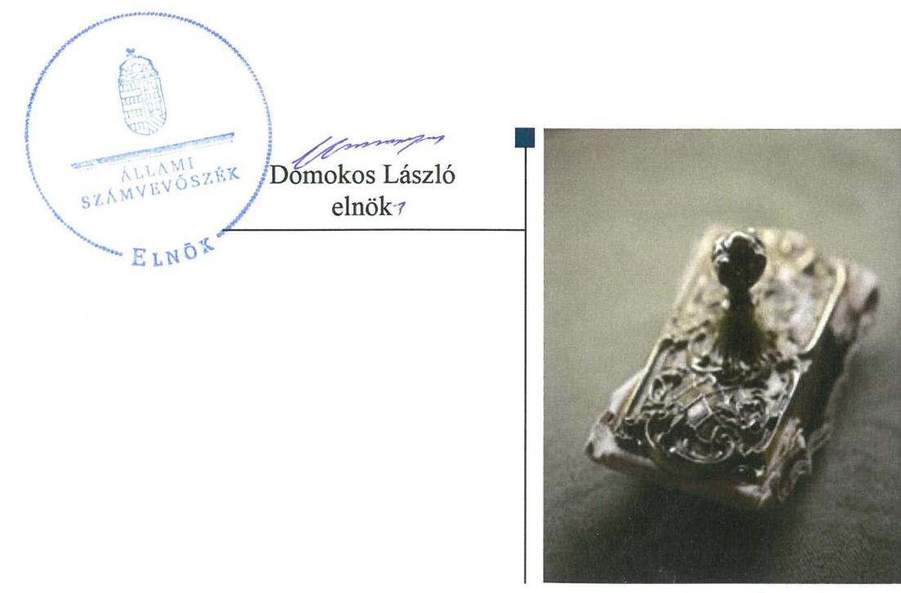
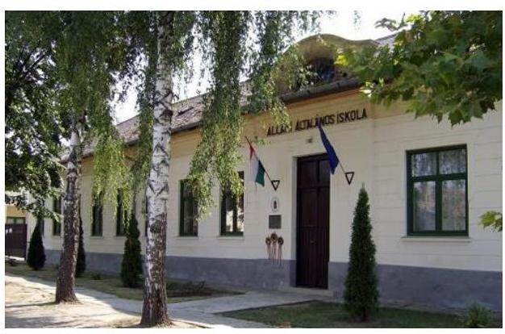
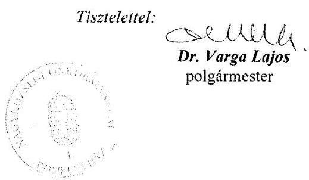
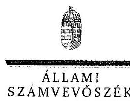
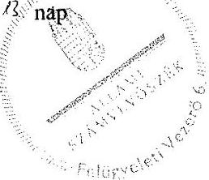

ÁLLAMI
SZÁMVEVŐSZÉK

# Jelentés 

## Önkormányzatok ellenőrzése

Integritás- és belső kontrollrendszer, Befektetési tevékenységek ellenőrzése

- Dombegyház Nagyközség

Önkormányzata
2019.

---

# Jelentés 

## Önkormányzatok ellenőrzése

Integritás- és belső kontrollrendszer, Befektetési tevékenységek ellenőrzése - Dombegyház Nagyközség Önkormányzata
2019. 12. hó 13. nap

---

# AZ ELLENŐRZÉST FELÜGYELTE:

DR. BENEDEK MÁRIA felügyeleti vezető

## AZ ELLENŐRZÉST VEZETTE ÉS A VÉGREHAJTÁSÁÉRT FELELŐS:

PETRÓ KATALIN ellenőrzésvezető

A PROGRAM ÖSSZEÁLLÍTÁSÁÉRT FELELŐS:

TÓTPÁL SZABOLCS osztályvezető

IKTATÓSZÁM: EL-2244-001/2019.

TÉMASZÁM: 2485

ELLENŐRZÉS-AZONOSÍTÓ SZÁM: V082911

Jelentéseink az Országgyűlés számítógépes hálózatán és az Interneten a www.asz.hu címen is olvashatóak.

---

# TARTALOMJEGYZÉK 

■ ÖSSZEGZÉS ..... 5
■ AZ ELLENŐRZÉS CÉLJA ..... 6
■ AZ ELLENŐRZÉS TERÜLETE ..... 7
■ AZ ELLENŐRZÉS HÁTTERE, INDOKOLTSÁGA ..... 8
■ A JELENTÉS LÉNYEGES KÉRDÉSKÖREI ..... 9
■ AZ ELLENŐRZÉS HATÓKÖRE ÉS MÓDSZEREI ..... 10
■ MEGÁLLAPÍTÁSOK ..... 12
■ JAVASLATOK ..... 15
■ MELLÉKLETEK ..... 19
I. sz. melléklet: Értelmező szótár ..... 19
■ FÜGGELÉK: ÉSZREVÉTELEK ..... 21
■ RÖVIDÍTÉSEK JEGYZÉKE ..... 27

---

.

---

# ÖSSZEGZÉS 

Dombegyház Nagyközség Önkormányzata belső kontrollrendszerének kialakítása és működtetése a 2017. évben nem volt szabályszerű, ezáltal nem biztosította a közpénzekkel történő elszámoltatható, szabályszerű gazdálkodást és a nemzeti vagyonnal történő felelős gazdálkodást. A belső kontrollrendszer a 2013-2017. években a befektetési tevékenység szabályszerű végzését, a befektetett eszközökkel való elszámoltathatóságot nem biztosította. A korrupció elleni védettséget nem biztosították.

## Az ellenőrzés társadalmi indokoltsága

Az önkormányzatok vagyona a nemzeti vagyon része, és az Alaptörvény is rögzíti, hogy a vagyonnal való gazdálkodás célja a közérdek szolgálata, ezért az önkormányzatok felé elvárás a kiegyensúlyozott, átlátható és fenntartható költségvetési gazdálkodás elvének érvényesítése, továbbá a nemzeti vagyonnal való rendeltetésszerű és felelős módon való gazdálkodás. Az Állami Számvevőszék törvényben kapott felhatalmazással élve ellenőrzi az önkormányzatok gazdálkodását, működését, hogy az ellenőrzések megállapításaival támogassa az ellenőrzött önkormányzatok szabályszerű gazdálkodását, javaslataival elősegítse az alaptörvényben megfogalmazott alapvetések érvényesülését a mindennapi életben az önkormányzatok szintjén. Az Állami Számvevőszék stratégiájában megfogalmazottak szerint támogatja az integritás alapú, átlátható és elszámoltatható közpénzfelhasználás megteremtését. Mindezekre tekintettel, a közpénzzel gazdálkodó szervezetek esetében a belső kontrollrendszer megfelelő kialakítása és működtetés ellenőrzését prioritásként kezeli az Állami Számvevőszék.

## Főbb megállapítások, következtetések, javaslatok

Dombegyház Nagyközség Önkormányzata belső kontrollrendszerének kialakítása és működtetése a 2017. évben nem volt szabályszerű. Dombegyház Nagyközség Önkormányzata nem rendelkezett szervezeti és működési szabályzattal, az önkormányzati vagyonnal való gazdálkodás szabályait nem határozta meg, ezáltal a nemzeti vagyonnal történő felelős gazdálkodás nem volt biztosított. A jegyző nem készítette el a számviteli politikát, valamint az annak keretében elkészítendő szabályzatokat. A jegyző integrált kockázatkezelési rendszert nem alakított ki.

Dombegyház Nagyközség Önkormányzata a kontrolltevékenységeket nem gyakorolta, így nem volt biztosított a közpénzekkel történő átlátható, elszámoltatható, szabályszerű gazdálkodás.

Dombegyház Nagyközség Önkormányzata nem működtette az információs és kommunikációs rendszert. A jegyző a monitoring rendszer működtetéséről nem gondoskodott.

Dombegyház Nagyközség Önkormányzatánál a 2013-2017. években a kiépített kontrollrendszer nem biztosította a befektetési tevékenység szabályszerű végzését. A befektetésekkel kapcsolatos döntéshozatal, a számviteli elszámolás, nyilvántartás nem volt szabályszerű.

Dombegyház Nagyközség Önkormányzata az integritást támogató belső kontrollokat nem építette ki, az integritás alapú működést nem biztosította. Dombegyház Nagyközség Önkormányzata a szervezeti teljesítmény mérésére alkalmas követelményeket nem alakította ki, így a teljesítmény mérésének lehetősége nem volt biztosított.

Az Állami Számvevőszék az intézkedések megtétele céljából a Polgármester részére hét, a Jegyző részére kilenc javaslatot fogalmazott meg.

---

# AZ ELLENŐRZÉS CÉLJA 

AZ ELLENŐRZÉS CÉLJA annak megállapítása volt, hogy az önkormányzat belső kontrollrendszere biztosította-e a közpénzekkel és a nemzeti vagyonnal történő elszámoltatható, átlátható, szabályszerű, gazdaságos, hatékony és eredményes gazdálkodás feltételeit. Az ÁSZ ${ }^{1}$ az ellenőrzés keretében értékelte továbbá, hogy az önkormányzatnál kiépítették és erősítették-e a korrupciós kockázatok kezelését szolgáló integritás kontrollokat és azt, hogy megteremtették-e a teljesítményellenőrzés feltételeit.

Az ellenőrzés további célja annak értékelése volt, hogy a jogszabályi előírásoknak megfelelően alakították-e ki a belső kontrollrendszert, a kontrollkörnyezet biztosította-e a befektetési tevékenységek szabályszerű végzését. Az Állami Számvevőszék értékelte továbbá, hogy az egyes befektetési tevékenységekkel kapcsolatos döntéshozatal és a döntések végrehajtása, valamint az egyes befektetések számviteli elszámolása, nyilvántartása szabályszerű volt-e, és a belső és külső ellenőrzések támogatták-e az egyes befektetési tevékenységek szabályszerű végzését.

---

# **AZ ELLENŐRZÉS TERÜLETE**

## **Dombegyház Nagyközség Önkormányzata**

Dombegyház nagyközség a Dél-alföldi régióban, Békés megyében található. Állandó lakosainak száma a Központi Statisztikai Hivatal Magyarország közigazgatási helynévkönyve alapján 2017. január 1. napján 2 010 fő volt.

A Polgármester² 2006. év október 1-je óta tölti be tisztségét. Dombegyház Nagyközség Önkormányzata héttagú Képviselő-testületének³ munkáját két állandó bizottság segítette.

Dombegyház Nagyközség Önkormányzata hivatali feladatait a Dombegyházi Polgármesteri Hivatal látta el, amely nem tagolódott szervezeti egységekre, elkülönült gazdasági szervezettel nem rendelkezett. A Jegyző⁴ 2015. április 15-étől látja el feladatát.

Dombegyház Nagyközség Önkormányzata 2017. évi beszámolójában 1 011,4 millió Ft bevételt és 307,8 millió Ft kiadást teljesített. Mérlegfőösszege 1 936,4 millió Ft, saját tőkéje 1 918,5 millió Ft, követelésállománya 8,8 millió Ft, kötelezettségállománya 7,4 millió Ft volt 2017. december 31-én.

Dombegyház Nagyközség Önkormányzata a 2017. évi költségvetésének végrehajtásáról szóló rendelete szerint 2017. december 31-én forgatási célú hitelviszonyt megtestesítő értékpapírral (Tőkegarantált befektetési jegy) 49,2 millió Ft összértékben, befektetett pénzügyi eszközzel (részesedés nem közfeladatellátást szolgáló gazdasági társaságban) 0,25 millió Ft összértékben rendelkezett a Békés Manifest Nonprofit Kft.-ben.

---

# AZ ELLENŐRZÉS HÁTTERE, INDOKOLTSÁGA 

A belső kontrollrendszer kialakítása és működtetése nélkül nem valósítható meg a közpénzek, a közvagyon átlátható, szabályos, gazdaságos, hatékony és eredményes felhasználása. A belső kontrollrendszer azt a célt szolgálja, hogy a költségvetési szervek működésük és gazdálkodásuk során a tevékenységeket szabályszerűen hajtsák végre, teljesítsék elszámolási kötelezettségeiket és megvédjék az erőforrásokat a veszteségektől, a károktól és a nem rendeltetésszerű használattól. A belső kontrollrendszer magában foglalja mindazon elveket, eljárásokat és belső szabályzatokat, melyek biztosítják, hogy a költségvetési szerv valamennyi tevékenysége és célja összhangban legyen a szabályszerűséggel, szabályozottsággal, valamint a gazdaságosság, hatékonyság és eredményesség követelményeivel, az eszközökkel és forrásokkal való gazdálkodásban ne kerüljön sor pazarlásra, visszaélésre, rendeltetésellenes felhasználásra. Megfelelő, pontos és naprakész információk álljanak rendelkezésre a költségvetési szerv működésével kapcsolatosan, és a belső kontrollrendszer harmonizációjára, összehangolására vonatkozó jogszabályok végrehajtásra kerüljenek. Az integritás kontrollok kiépítése, erősítése a szervezet korrupciós kockázatainak kezelését szolgálja. A teljesítménykövetelmények meghatározása és működtetése megalapozhatja az önkormányzatoknál a teljesítményellenőrzés lefolytatását.

Az önkormányzati vagyongazdálkodás keretében az önkormányzatok átmenetileg szabad pénzeszközeinek befektetését jogszabály nem tiltja, a befektetések jellege nem korlátozott, a pénzpiaci szolgáltatók közül az önkormányzatok a kínált szolgáltatás és annak költségei alapján, szabadon választhatnak, azonban a veszteséges gazdálkodás kockázatai és következményei az önkormányzatokat terhelik. A szabad pénzeszközök felhasználása során kiemelten fontos a felelős gazdálkodás érvényesülése, amely összhangban kell, hogy legyen, az önkormányzati gazdálkodás alapelveivel. Az ellenőrzéssel feltárásra kerülhetnek azok a kockázatok, amelyek az önkormányzatok gazdálkodásával, ezen belül befektetési tevékenységeivel, kontrollkörnyezetével kapcsolatosak és a befektetési tevékenységek szabályszerű végrehajtását befolyásolják. Az ellenőrzéssel az önkormányzatok befektetési/vagyongazdálkodási döntései értékelhetővé válnak, és megalapozott megállapítás tehető arra vonatkozóan, hogy milyen hatást gyakoroltak az önkormányzat vagyonára a képviselő-testület döntései.

---

# A JELENTÉS LÉNYEGES KÉRDÉSKÖREI 

1. Szabályszerű volt-e önkormányzat belső kontrollrendszerének működtetése a 2017. évben?
2. Az önkormányzatnál alakítottak-e ki a teljesítmény mérésére alkalmas követelményeket?
3. Az önkormányzatnál a befektetési tevékenységek szabályszerű végzését a kiépített kontrollrendszer biztosította-e a 2013-2017. években? Az önkormányzatnál a 2017. december 31-én meglévő egyes befektetéseivel kapcsolatos döntéshozatal és az egyes befektetések számviteli elszámolása szabályszerű volt-e?

---

# AZ ELLENŐRZÉS HATÓKÖRE ÉS MÓDSZEREI 

## Az ellenőrzés típusa

Megfelelőségi és szabályszerűségi ellenőrzés.

## Az ellenőrzött időszak

Az ellenőrzött időszak a 2017. év.
Az egyes befektetési tevékenységek ellenőrzése tekintetében az ellenőrzött időszak a 2013. január 1. és 2017. december 31. közötti időszak, továbbá a 2013. január 1. előtti időszak is, mivel a 2017. december 31. előtti befektetési tevékenységekkel kapcsolatos döntéshozatalra 2005. szeptember 16-án került sor.

## Az ellenőrzés tárgya

Az önkormányzat és a gazdálkodási feladatokat ellátó hivatala belső kontrollrendszerének kialakítása és működtetése, valamint az integritás kontrollok kiépítettsége, a teljesítményellenőrzés feltételeinek rendelkezésre állása.

Az egyes befektetési tevékenységek ellenőrzésének tárgya az önkormányzat 2017. december 31-én meglévő, a Számv. tv . 3. § (6) bekezdés 2. és 3. pontja szerint az értékpapírokban megtestesülő befektetései, lekötött betétei.

## Az ellenőrzött szervezet

Dombegyház Nagyközség Önkormányzata

## Az ellenőrzés jogalapja

Az ellenőrzés jogszabályi alapját az ÁSZ tv. 1. § (3) bekezdés, 5. § (2) és (6) bekezdései, valamint az Áht. 61. § (2) bekezdésének előírásai képezték.

## Az ellenőrzés módszerei

Az ÁSZ az ellenőrzést az ellenőrzési program szempontjai, az ellenőrzött időszakban hatályos jogszabályok, az ellenőrzés szakmai szabályai, a jelen ellenőrzésre irányadó ÁSZ módszertanok figyelembevételével végezte.

---

Az ellenőrzés ideje alatt az ÁSZ az önkormányzattal a kapcsolattartást az ÁSZ SZMSZ-ének vonatkozó előírásai alapján biztosította.

Az ellenőrzési kérdések megválaszolásához szükséges bizonyítékok megszerzése az önkormányzat által rendelkezésre bocsátott dokumentumokra, adatokra alapozva megfigyelés, szemle (szemrevételezés), kérdésfeltevés (információkérés), mintavételezés, valamint elemző eljárás útján történt.

Az ellenőrzési bizonyítékként felhasználható adatforrások közé tartoztak az ellenőrzési program részletes szempontjainál felsorolt adatforrások, valamint minden egyéb - az ellenőrzés folyamán feltárt, az ellenőrzés szempontjából információt tartalmazó - dokumentum.

Az ellenőrzés lefolytatásához az önkormányzat tanúsítványok kitöltésével, valamint az ÁSZ által kért dokumentumok megküldésével szolgáltatott adatokat, amelyek valódiságát és teljes körűségét az ellenőrzött szervezet vezetője által tett teljességi és hitelességi nyilatkozat igazolta. A rendelkezésre bocsátott adatok, információk kontrollja az ellenőrzés keretében történt.

Az önkormányzat belső kontrollrendszere egyes pilléreinek kialakítására és működtetésére vonatkozó értékelés:
$\longrightarrow$ „szabályszerű", amennyiben az értékelt területen az elért „igen" válaszok százalékban kifejezett, egész számra kerekített aránya legalább $85 \%$,
$\longrightarrow$ „nem szabályszerű", ha nem éri el a $85 \%$-ot.
Az önkormányzat belső kontrollrendszerének összesített értékelése az egyes részterületek esetében kapott megfelelőségi arányok számtani átlaga alapján történt és megegyezett a pillérenként (kontrollterületenként) alkalmazott százalékos értékelésekkel, a következő eltérésekkel: a kontrollrendszer egésze esetében a „szabályszerű" értékelésnek a százalékos értéken felül további feltétele volt, hogy egyik kontrollterület sem kaphatott „nem szabályszerű" értékelést.

A 2017. évi kiadások teljesítéséhez kapcsolódó pénzgazdálkodási belső kontrollok működésének szabályszerűsége esetében az ellenőrzés azokra a legnagyobb értékű tételekre - a lényeges sokaságra - terjedt ki, melyek összértéke eléri a teljes sokaság összértékének 50\%-át. Az ÁSZ az önkormányzatnál a 2017. évi kiadások esetében a lényeges sokaságból véletlen mintavétellel kiválasztott tételeket ellenőrizte. Szabályszerűnek" értékeltük az ellenőrzött területet, amennyiben 95\%-os bizonyossággal az ellenőrzött sokaságban az átlagos hibaarány legfeljebb 10\%, "nem szabályszerűnek", amennyiben 10\%-nál magasabb arányt képviselt.

Az önkormányzatok befektetési tevékenységét a szerződéskötés (és a kapcsolódó döntés-előkészítés, döntéshozatal) kivételével a 2013. január 1. és 2017. december 31. közötti időszak vonatkozásában értékelte az ÁSZ. A szerződéskötést az önkormányzat 2017. december 31-én meglévő értékpapírjai és egyéb befektetései vonatkozásában értékelte az ellenőrzés. A befektetési döntés előkészítése és döntéshozatala 2005. szeptember 16-án történt, ezért ennek értékelését a döntés előkészítés és a döntéshozatal időpontjában hatályos jogszabályok előírásai alapján végezte az ÁSZ.

---

# 1. Szabályszerű volt-e önkormányzat belső
 kontrollrendszerének működtetése a 2017. évben? 

Összegző megállapítás

Az Önkormányzat ${ }^{5}$ belső kontrollrendszerének kialakítása és működtetése nem volt szabályszerű a 2017. évben.

A KONTROLLKÖRNYEZET kialakítása és működtetése nem volt szabályszerű a 2017. évben.

Az Önkormányzat a Mötv. ${ }^{6}$ 53.§ (1) bekezdésében foglalt előírás ellenére nem rendelkezett szervezeti és működési szabályzattal.

Az Önkormányzat nem rendelkezett a Képviselő-testület által elfogadott a Htv. ${ }^{7}$ 138. § (1) bekezdés j) pontja előírása szerint az önkormányzati vagyonnal történő gazdálkodás szabályaival.

A jegyző az Áhsz. 50.§ (1) bekezdés és a Számv.tv. ${ }^{8}$ 14. § (5) bekezdés a), b) és d) pontjában foglaltak ellenére az Önkormányzat és a Hivatal ${ }^{9}$ vonatkozásában nem készítette el a számviteli politikát, valamint annak keretében a Leltározási és leltárkészítési szabályzatot ${ }^{10}$, az Eszközök és források értékelési szabályzatát ${ }^{11}$, a Pénzkezelési szabályzatot ${ }^{12}$, valamint az Áhsz. 51.§ (2) bekezdés és a Számv.tv. 161. § (1) bekezdésében foglaltak ellenére a Hivatal számlarendjét.

A jegyző az Ávr. ${ }^{13}$ 60.§ (3) bekezdésében foglaltak ellenére a hivatali előirányzatok vonatkozásában a gazdálkodási jogkörök gyakorlására jogosult személyekről és aláírás-mintájukról nyilvántartást nem vezetett.

## AZ INTEGRÁLT KOCKÁZATKEZELÉSI RENDSZERT a jegyző a Bkr. ${ }^{14}$ 3. § (b) pontban foglaltak ellenére nem alakította ki.

A KONTROLLTEVÉKENYSÉGEKET az Önkormányzat nem működtette a 2017. évben.

A polgármester az Áht. 37.§ (1) bekezdés előírása ellenére az önkormányzati előirányzat terhére történt kifizetéseknél írásban nem vállalt kötelezettséget.

A polgármester az Ávr. 57. § (1) bekezdés előírása ellenére ellenőrizhető okmány alapján nem ellenőrizte és nem igazolta a kiadások teljesítésének jogosságát, összegszerűségét.

A polgármester az önkormányzati előirányzat terhére történt kifizetések esetében a teljesítést az Áht. 38. § (1) bekezdés előírása ellenére nem igazolta.

A polgármester a jogszabályi kötelezettségeit nem ruházta át további személyre, ezért a kötelezettségvállalás és teljesítésigazolás tekintetében a polgármester járhatott el jogszerűen.

---

# A JEGYZŐ AZ INFORMÁCIÓS ÉS KOMMUNIKÁCIÓS RENDSZERT nem működtette a 2017. évben. 

A jegyző a Bkr. 9. § (1) bekezdésben előírtak ellenére nem biztosította, hogy a megfelelő információk a megfelelő időben eljussanak az illetékes szervezethez, szervezeti egységhez, illetve személyhez.

A JEGYZŐ A MONITORING RENDSZERT a Bkr. 3. § e) pontjában előírtak ellenére nem alakította ki.

A jegyző a belső ellenőrzés kialakításáról és működtetéséről Társulás ${ }^{15}$ által foglalkoztatott belső ellenőrzés útján, az Áht. előírásai szerint gondoskodott.

A jegyző a Bkr. 11. § (1) bekezdés alapján az 1. melléklet szerinti nyilatkozatban értékelte a Hivatal belső kontrollrendszerének minőségét. Az ÁSZ ellenőrzés megállapításai nem igazolták a nyilatkozatban foglaltakat.

Az Önkormányzat a korrupciós kockázatok kezelésére alkalmas integritás kontrollokat nem építette ki.

## 2. Az önkormányzatnál alakítottak-e ki a teljesítmény mérésére alkalmas követelményeket?

Összegző megállapítás Az Önkormányzatnál nem alakítottak ki a teljesítmény mérésére alkalmas követelményeket.

A szervezeti célok elérését szolgáló feladatok, folyamatok, tevékenységek mérését szolgáló indikátorokat, mérőszámokat, feladat- és teljesítménymutatókat az Önkormányzat nem képzett, így nem biztosította a teljesítménymérés lehetőségét.

## 3. Az önkormányzatnál a befektetési tevékenységek szabályszerű végzését a kiépített kontrollrendszer biztosította-e a 2013-2017. években? Az önkormányzatnál a 2017. december 31-én meglévő egyes befektetéseivel kapcsolatos döntéshozatal és az egyes befektetések számviteli elszámolása szabályszerű volt-e?

### 3.1. Összegző megállapítás A befektetési tevékenységek szabályszerű végzését a belső kontrollrendszer nem biztosította a 2013-2017. években.

Az Önkormányzat a 2013-2017. években a Mötv. ${ }^{16}$ 53.§ (1) bekezdésében foglalt előírás ellenére nem rendelkezett szervezeti és működési szabályzattal.

Az Önkormányzat a 2013-2017. években nem rendelkezett a Képviselőtestület által elfogadott a Htv. ${ }^{17}$ 138. § (1) bekezdés j) pontja előírása szerint az önkormányzati vagyonnal történő gazdálkodás szabályaival.

---

A jegyző a Bkr. 3. § b) pontjában foglaltak ellenére 2016. január 31-ig nem alakított ki - a szervezet minden szintjén érvényesülő - kockázatkezelési rendszert, 2016. október 01-től 2017. december 31-ig integrált kockázatkezelési rendszert.

Az Önkormányzat a Mötv. 116. § (5) bekezdésében foglaltak ellenére 2015. június 29-ig nem rendelkezett a Képviselő-testület által elfogadott gazdasági programmal, fejlesztési tervvel.

A jegyző a Bkr. 6. § (3) bekezdésben előírtak ellenére 2016. január 31ig nem készítette el a Hivatal ellenőrzési nyomvonalát. A Hivatal 2016. február 1-től rendelkezett ellenőrzési nyomvonallal.

A belső ellenőrzés nem támogatta az egyes befektetési tevékenységek szabályszerű végzését. Az Önkormányzatnál a 2013. január 1. - 2017. december 31. közötti időszakban a belső ellenőrzés a befektetésekkel kapcsolatosan nem végzett kockázatelemzést, a befektetési tevékenységet nem ellenőrizte, ezáltal befektetési tevékenységeket érintő intézkedések nem kerültek megfogalmazásra.

# 3.2. Összegző megállapítás Az Önkormányzat 2017. december 31-én meglévő egyes befektetéseivel kapcsolatos döntéshozatala és a befektetett pénzügyi eszközeinek számviteli elszámolása, nyilvántartása nem volt szabályszerű. 

AZ EGYES BEFEKTETÉSEKKEL KAPCSOLATOS DÖNTÉSHOZATAL nem volt szabályszerű a 2013-2017. években.

A polgármester a Mötv. 107. §, valamint az Önkormányzat Képviselőtestületének 2013., 2014., 2015., 2016., 2017. évi költségvetéséről szóló rendeletei ${ }^{18}$ 11. § (1) bekezdésében foglaltak ellenére a Képviselő-testület határozata nélkül döntött befektetési jegyek vételéről és betétlekötésről.

A jegyző a Bkr. 8. § (2) bekezdés b) pontjában foglaltak ellenére nem biztosította a kontrolltevékenység részeként az egyes befektetésekre vonatkozó szervezeti célok elérését veszélyeztető kockázatok csökkentésére irányuló kontrollok kiépítését, a döntések célszerűségi, gazdaságossági, hatékonysági és eredményességi szempontú megalapozottsága vonatkozásában.

AZ EGYES BEFEKTETÉSEK SZÁMVITELI ELSZÁMOLÁSA, NYILVÁNTARTÁSA a 2013-2017. években nem volt szabályszerű.

A jegyző az Áhsz. ${ }_{1}$ 49. § (1) és az Áhsz. ${ }_{2}{ }^{19}$ 45. § (3) bekezdésekben foglaltak ellenére a 2013-2017. években a forgatási célú hitelviszonyt megtestesítő értékpapírokra és részesedésekre a beszámoló adatai valóságnak megfelelő, áttekinthető alátámasztásához, illetve a vonatkozó adatszolgáltatási kötelezettségének alátámasztásához a könyvviteli számlák alábontásával vagy a könyvviteli számlákhoz kapcsolódó részletező nyilvántartások vezetésével nem gondoskodott.

A jegyző az Áhsz. ${ }_{1}$ 37. § (1) - (2) és az Áhsz. ${ }_{2}$ 22. § (1) - (2) bekezdés előírásai ellenére a 2013-2017. években a befektetett pénzügyi eszközökről (részesedés) és értékpapírokról a mérleg tételeinek alátámasztásához nem állított össze leltárt.

---

# JAVASLATOK 

Az ÁSZ tv. 33. § (1) bekezdésében foglaltak értelmében az ellenőrzött szervezet vezetője köteles a jelentésben foglalt megállapításokhoz kapcsolódó intézkedési tervet összeállítani és azt a jelentés kézhezvételétől számított 30 napon belül az ÁSZ részére megküldeni. Amennyiben az ellenőrzött szervezet vezetője nem küldi meg határidőben az intézkedési tervet, vagy továbbra sem elfogadható intézkedési tervet küld, az Állami Számvevőszék elnöke az ÁSZ tv. 33. § (3) bekezdése a) és b) pontjaiban foglaltakat érvényesítheti.

## a polgármesternek

1. Intézkedjen az Állami Számvevőszék ellenőrzése során feltárt hiányosságok és/vagy szabálytalanságok tekintetében a munkajogi felelősség tisztázására irányuló eljárás megindításáról, és ennek eredménye ismeretében tegye meg a szükséges intézkedéseket.
(1. sz. megállapítás 4. bekezdése, 5-6. és 13-14. bekezdései, 3.2. sz. megállapítás 3. és 5-6. bekezdései megállapításai alapján)
2. Gondoskodjon az Mötv. előírása szerint, hogy a képviselő-testület a működésének részletes szabályait a szervezeti és működési szabályzatról szóló rendeletében meghatározza.
(1. sz. megállapítás 2. bekezdése alapján)
3. Gondoskodjon a Htv. előírása szerint, hogy a képviselő-testület elfogadja az önkormányzati vagyonnal történő gazdálkodás szabályait.

(1. sz. megállapítás 3. bekezdése alapján)
4. Az önkormányzati előirányzat terhére történt kifizetéseknél az Áht. előírása szerint írásban vállaljon kötelezettséget.
(1. sz. megállapítás 8. bekezdés alapján)
5. Intézkedjen az Ávr. előírása szerint az Önkormányzat kiadási előirányzatainak terhére vállalt kötelezettség vonatkozásában, hogy a teljesítés igazolása során ellenőrizhető okmányok alapján ellenőrizze és igazolja a kiadások teljesítésének jogosságát, összegszerűségét.
(1. sz. megállapítás 9. bekezdés alapján)
6. Az Önkormányzat kiadási előirányzatainak terhére vállalt kötelezettség vonatkozásában az Áht. előírása szerint igazolja a teljesítést.
(1. sz. megállapítás 10. bekezdés alapján)

---

7. Az egyes befektetésekkel kapcsolatos döntései során az Mötv., valamint a költségvetésről szóló rendeletek előírásainak megfelelően járjon el.
(3.2. sz. megállapítás 2. bekezdése alapján)

# a jegyzőnek 

1. Intézkedjen a Számv. tv és az Áhsz. előírásának megfelelően az Önkormányzat és a Hivatal vonatkozásában a számviteli politika, valamint annak keretében a Leltározási és leltárkészítési szabályzat, az Eszközök és források értékelési szabályzata és a Pénzkezelési szabályzat elkészítéséről.
(1. sz. megállapítás 4. bekezdése 1-4. tagmondata alapján)
2. Intézkedjen a Számv. tv és az Áhsz. előírásának megfelelően a Hivatal számlarendjének elkészítéséről.
(1. sz. megállapítás 4. bekezdés 5. tagmondata alapján)
3. Intézkedjen az Ávr. előírásának megfelelően a hivatali előirányzatok vonatkozásában a gazdálkodási jogkörök gyakorlására jogosult személyekről és aláírás-mintájukról történő nyilvántartás vezetéséről.
(1. sz. megállapítás 5. bekezdése alapján)
4. Intézkedjen a Bkr. előírásának megfelelően az integrált kockázatkezelési rendszer kialakításáról.
(1. sz. megállapítás 6. bekezdése alapján)
5. Intézkedjen a Bkr. előírása szerint olyan rendszerek működtetéséről, melyek biztosítják, hogy a megfelelő információk a megfelelő időben eljutnak az illetékes szervezethez, szervezeti egységhez, illetve személyhez.
(1. sz. megállapítás 13. bekezdése alapján)
6. Alakítson ki a Bkr. előírásainak megfelelően a belső kontrollrendszer keretében a szervezet tevékenységének, a célok megvalósításának nyomon követését biztosító rendszert.
(1. sz. megállapítás 14. bekezdés alapján)

---

7. Biztosítsa a Bkr. előírásának megfelelően a kontrolltevékenység részeként az egyes befektetésekre vonatkozó szervezeti célok elérését veszélyeztető kockázatok csökkentésére irányuló kontrollok kiépítését, a döntések célszerűségi, gazdaságossági, hatékonysági és eredményességi szempontú megalapozottsága vonatkozásában.
(3.2. sz. megállapítás 3. bekezdése alapján)
8. Gondoskodjon az Áhsz. előírásainak megfelelően a könyvviteli számlák alábontásáról vagy részletező nyilvántartás vezetéséről a forgatási célú hitelviszonyt megtestesítő értékpapírok és részesedések tekintetében.
(3.2. sz. megállapítás 5. bekezdése alapján)
9. Intézkedjen az Áhsz. előírásának megfelelően a befektetett pénzügyi eszközök és értékpapírok mérleg tételeinek alátámasztásához leltár összeállításáról.
(3.2. sz. megállapítás 6. bekezdése alapján)

---

.

---

# MELLÉKLETEK 

- I. SZ. MELLÉKLET: ÉRTELMEZŐ SZÓTÁR
belső ellenőrzés
belső kontrollrendszer
belső kontrollrendszer területei
információs és kommunikációs rendszer
integrált kockázatkezelési rendszer
integritás
kockázat
kontrollkörnyezet
kontrolltevékenységek
kommunikáció

Független, tárgyilagos bizonyosságot adó és tanácsadó tevékenység, amelynek célja, hogy az ellenőrzött szervezet működését fejlessze és eredményességét növelje, az ellenőrzött szervezet céljai elérése érdekében rendszerszemléletű megközelítéssel és módszeresen értékeli, illetve fejleszti az ellenőrzött szervezet irányítási és belső kontrollrendszerének hatékonyságát. (Forrás: Bkr. 2. § b) pontja)
A belső kontrollrendszer a kockázatok kezelése és tárgyilagos bizonyosság megszerzése érdekében kialakított folyamatrendszer, amely azt a célt szolgálja, hogy a működés és gazdálkodás során a tevékenységeket szabályszerűen, gazdaságosan, hatékonyan, eredményesen hajtsák végre, az elszámolási kötelezettségeket teljesítsék, megvédjék az erőforrásokat a veszteségektől, károktól és nem rendeltetésszerű használattól. (Forrás: Áht. 69. § (1) bekezdése)
A kontrollkörnyezet, az integrált kockázatkezelési rendszer, a kontrolltevékenységek, az információs és kommunikációs rendszer, valamint a nyomon követési (monitoring) rendszer. (Forrás: Bkr. 3. §-a)
A költségvetési szerv vezetője által kialakított és működtetett olyan rendszer, mely biztosítja, hogy a megfelelő információk a megfelelő időben eljutnak az illetékes szervezethez, szervezeti egységhez, illetve személyhez. (Forrás: Bkr. 9. § (1) bekezdés)
Olyan folyamatalapú kockázatkezelési rendszer, amely a szervezet minden tevékenységére kiterjed, egységes módszertan és eljárások alkalmazásával, a szervezet célkitűzéseinek és értékeinek figyelembevételével biztosítja a szervezet kockázatainak teljes körű azonosítását, azok meghatározott kritériumok szerinti értékelését, valamint a kockázatok kezelésére vonatkozó intézkedési terv elkészítését és az abban foglaltak nyomon követését. (Forrás: Bkr.

 2. § m) pontja, 2016. október 1-jétől)
Az integritás az elvek, értékek, cselekvések, módszerek, intézkedések konzisztenciáját jelenti, vagyis olyan magatartásmódot, amely meghatározott értékeknek megfelel. (Forrás: Nemzetgazdasági Minisztérium: Magyarországi államháztartási belső kontroll standardok Útmutató 1.6.1. pontja, 2012. december)
A kockázat annak a valószínűségét jelenti, hogy egy vagy több esemény vagy intézkedés nem kívánt módon befolyásolja a rendszer működését, céljainak megvalósulását. (Forrás: Javaslatok a korrupciós kockázatok kezelésére - Kockázatkezelési és ellenőrzési módszertan 35. oldal, ÁSZ)
A költségvetési szerv vezetője által kialakított olyan elvek, eljárások, belső szabályzatok összessége, amelyben világos a szervezeti struktúra, a folyamatok átláthatók, egyértelműek a felelősségi, hatásköri viszonyok és feladatok, meghatározottak, ismertek és elfogadottak az etikai elvárások a szervezet minden szintjén, átlátható a humán-erőforrás-kezelés, biztosított a szervezeti célok és értékek irányában való elkötelezettség fejlesztése és elősegítése. (Forrás: Bkr. 6. § (1) bekezdés)
A költségvetési szerv vezetője által a szervezeten belül kialakított (kontroll) tevékenységek, melyek biztosítják a kockázatok kezelését, hozzájárulnak a szervezet céljainak eléréséhez és erősítik a szervezet integritását. (Forrás: Bkr. 8. § (1) bekezdés)
Az a tevékenység, melynek során információ továbbítása valósul meg. A kommunikációs folyamat résztvevői között tájékoztatás történik, mely során tényeket, ezek magyarázatát közlik.

---

monitoring

monitoring-rendszer
önkormányzati hivatal
társulás

A monitoring általánosságban a különböző szintű szervezeti célok megvalósításának folyamatát kíséri figyelemmel, melynek során a releváns eseményekről és tevékenységekről (együtt: folyamatokról) rendszeres jelleggel, strukturált, döntéstámogató információkhoz jutnak a szervezet vezetői. (Forrás: NGM Útmutató a költségvetési szervek monitoring rendszeréhez 2011. november)
A költségvetési szerv vezetője köteles kialakítani a szervezet tevékenységének a célok megvalósításának nyomon követését biztosító rendszert, amely az operatív tevékenységek keretében megvalósuló folyamatos és eseti nyomon követésből, valamint az operatív tevékenységektől függetlenül működő belső ellenőrzésből állhat. (Forrás: Bkr. 10. §)
A polgármesteri hivatal, a főpolgármesteri hivatal, a megyei önkormányzati hivatal és a közös önkormányzati hivatal. (Forrás: Áht. 1. § 18. pont)
A helyi önkormányzatok képviselő-testületei megállapodhatnak abban, hogy egy vagy több önkormányzati feladat- és hatáskör, valamint a polgármester és a jegyző államigazgatási feladat- és hatáskörének hatékonyabb, célszerűbb ellátására jogi személyiséggel rendelkező társulást hoznak létre. (Forrás: Mötv. 87. §)

---

# FÜGGELÉK: ÉSZREVÉTELEK 

A jelentéstervezetet a Számvevőszék 15 napos észrevételezésre megküldte az ellenőrzött szervezet vezetőjének az ÁSZ tv. 29. § (1) bekezdése előírásának megfelelően.

Dombegyház Nagyközség Önkormányzatának polgármestere a jelentéstervezet megállapításaira írásban észrevételt tett.
Az ÁSZ tv. 29. § (3) bekezdésével összhangban az ÁSZ a Függelékben feltünteti az ellenőrzés megállapításaival kapcsolatban tett, figyelembe nem vett észrevételeket, és megindokolja, hogy azokat miért nem fogadta el.

[^0]
[^0]:    * 29. § (1) Az Állami Számvevőszék az ellenőrzési megállapításait megküldi az ellenőrzött szervezet vezetőjének vagy az általa megbízott személynek, és annak, akinek személyes felelősségét állapította meg.
    (2) Az ellenőrzött szervezet vezetője és a felelősként megjelölt személy az ellenőrzés megállapításaira tizenöt napon belül írásban észrevételt tehet.
    (3) Az Állami Számvevőszék az észrevételre a beérkezésétől számított harminc napon belül írásban válaszol. A figyelembe nem vett észrevételeket köteles a jelentésben feltüntetni, és megindokolni, hogy azokat miért nem fogadta el.

---

# Dombegyház Nagyközség Polgármesterétől 

5836 Dombegyház, Tavasz u. 5.
Telefon: 68/432-031; Fax: 68/590-941
E-mail: polgarmester@dombegyhaz.co.hu

Pénz/5-4/2019.

Tárgy: Észrevételek a számvevőszéki jelentéstervezettel kapcsolatban

Hiv. szám: EL-0812-046/2019

## Állami Számvevőszék   Domokos László elnök

Budapest 4.
Pf: 54
1364

## Tisztelt Elnök Úr!

Az Állami Számvevőszék által az „Önkormányzatok ellenőrzése - Integritás- és belső kontrollrendszer, Befektetési tevékenység ellenőrzése - Dombegyház Nagyközség Önkormányzata" című jelentéstervezet kapcsán az alábbi észrevételeket teszem:

## A Javaslatok a polgármesternek c. megállapítások 2. pontjával kapcsolatban

[Gondoskodjon az Mötv. előírása szerint, hogy a képviselő-testület a működésének részletes szabályait a szervezeti és működési szabályzatáról szóló rendeletében meghatározza. l. sz. megállapítás 2. bekezdése alapján] észrevételem:

Dombegyház Nagyközség Önkormányzatának 5/2011. (III.24.) önkormányzati rendelete szól az önkormányzat szervezeti és működési szabályzatáról. A rendelet időállapotok szerint hatályos változatait az adatbekérések során az elektronikus felületre feltöltöttük az
I. adatbekérés 1. pontjához:

- Önk_SZMSZ_2017_01_01-2017_05_31.pdf
- Önk_SZMSZ_2017_06_01-2017_11_30.pdf
- Önk_SZMSZ_2017_11_31-.pdf,
a III. adatbekérés 1. pontjához:
- 1.1-2 Önk_SzMSz_2012.04.28-2014.02.14.pdf
- 1.1-3 Önk_SzMSz 2014.02.15.-2014.11.27.pdf
- 1.1-4 Önk_SZMSZ 2014.11.28-2015.07.02.pdf
- 1.1-5 Önk_SZMSZ 2015.07.03-2016.12.31.pdf
fájlnevű dokumentumok formájában.
Jelen észrevételemhez 1-7. sz. mellékletként ismét csatolom hitelesítve az időállapotok szerint hatályos rendeleteket.

A Javaslatok a polgármesternek c. megállapítások 3. pontjával kapcsolatban [Gondoskodjon a Htv. előírása szerint, hogy a képviselő-testület elfogadja az önkormányzati vagyonnal történő gazdálkodás szabályait] észrevételem:

---

Dombegyház Nagyközség Önkormányzatának 2/2012. (III.01.) önkormányzati rendelete szól az önkormányzat vagyonáról és a vagyongazdálkodás szabályairól. A rendelet 2013. november 2-tól hatályos egységes szerkezetbe foglalt változatát a II. adatbekérés során az elektronikus felületre feltöltöttük a II. adatbekérés 8. pontjához 1.5. Vagyonrendelet 2-2012.pdf fájlnevű dokumentum formájában.

Jelen észrevételemhez 8. sz. mellékletként ismét csatolom hitelesítve a hatályos rendeletet.
A Javaslatok a polgármesternek c. megállapítások 4. pontjával kapcsolatban észrevételem A IV. adatbekérés 16. sorszámú bizonylat esetében adminisztrációs okokból lemaradt a kötelezettségvállalás dokumentuma (szállítási szerződés) amelyet jelen észrevételemhez 9. sz. mellékletként kiegészítésül becsatolok.

Dombegyház, 2019. október 22.

---

ELNÖK

Ikt.szám: EL-0812-053/2019.

# Dr. Varga Lajos úr 

polgármester
Dombegyház Nagyközség Önkormányzata

## Dombegyház

## Tisztelt Polgármester Úr!

Az ,,Önkormányzatok ellenőrzése - Integritás- és belső kontrollrendszer, Befektetési tevékenységek ellenőrzése - Dombegyház Nagyközség Önkormányzata" című számvevőszéki jelentéstervezetben foglalt megállapításokra tett 2019. október 22-i keltezésű észrevételeit megkaptam.

Tájékoztatom Polgármester urat, hogy a figyelembe nem vett észrevételeket - az Állami Számvevőszékről szóló 2011. évi LXVI. törvény 29. § (3) bekezdése alapján - az Állami Számvevőszék a számvevőszéki jelentésben szerepelteti azok elutasítása indoklásának feltüntetésével.

Az Állami Számvevőszék észrevételekre vonatkozó álláspontjáról a felügyeleti vezető által készített részletes tájékoztatást csatoltan megküldöm.

Budapest, 2019. 11. 13.

Melléklet: Tájékoztatás az észrevételek kezeléséről

---

# Tájékoztatás az észrevételek kezeléséről 

Az „Önkormányzatok ellenőrzése - Integritás- és belső kontrollrendszer, Befektetési tevékenységek ellenőrzése - Dombegyház Nagyközség Önkormányzata" című számvevőszéki jelentéstervezetben foglalt megállapításokra a 2019. október 22-i keltezésű levélben megküldött észrevételeit áttekintettem. Az észrevételek kezeléséről az alábbi tájékoztatást adom.

1. A jelentéstervezetben a polgármesternek címzett 2. javaslatra vonatkozó észrevétel: Polgármester úr észrevételében jelezte, hogy „Dombegyház Nagyközség Önkormányzatának 5/2011. (III.24.) önkormányzati rendelete szól az önkormányzat szervezeti és működési szabályzatáról. A rendelet időállapotok szerint hatályos változatait az adatbekérések során az elektronikus felületre feltöltöttük az
I. adatbekérés 1. pontjához:

- Önk_SZMSZ_2017_01_01-2017_05_31.pdf
- Önk_SZMSZ_2017_06_01-2017_11_30.pdf
- Önk_SZMSZ_2017_11_31-.pdf.
a III. adatbekérés 1. pontjához:
- 1.1-2 Önk_SzMSz_2012.04.28-2014.02.14.pdf
- 1.1-3 Önk_SzMSz 2014.02.15.-2014.11.27.pdf
- 1.1-4 Önk_SZMSZ 2014.11.28-2015.07.02.pdf
- 1.1-5 Önk_SZMSZ 2015.07.03-2016.12.31.pdf
fájlnevű dokumentumok formájában.
Jelen észrevételemhez 1-7. sz. mellékletként ismét csatolom hitelesítve az időállapotok szerint hatályos rendeleteket."
Dombegyház Nagyközség Önkormányzata (továbbiakban: Önkormányzat) által az adatszolgáltatásra biztosított határidőben rendelkezésre bocsátott dokumentumok felülvizsgálata során az Állami Számvevőszék (továbbiakban: ÁSZ) megállapította, hogy az EL-0812-002/2018., továbbá az EL-1045-001/2019. iktatószámú adatbekérő levelek 2. számú melléklet 2. bekezdésében foglaltak ellenére az Önkormányzat nem aláírt, nem hiteles dokumentumokat bocsátott az ÁSZ rendelkezésére.
Az ÁSZ az ellenőrzési megállapításait az ellenőrzéshez kapcsolódó adatszolgáltatás során a részére törvényi határidőben rendelkezésre bocsátott dokumentumokra alapozva teszi meg. Fentiekre tekintettel az észrevételt nem fogadjuk el, a jelentéstervezetben szereplő 1. sz. megállapítás 2. bekezdése és a 2. javaslat módosítása nem indokolt.

---

# 2. A jelentéstervezetben a polgármesternek címzett 3. javaslatra vonatkozó észrevétel: 

Polgármester úr észrevételében jelezte, hogy „Dombegyház Nagyközség Önkormányzatának 2/2012. (III.01.) önkormányzati rendelete szól az Önkormányzat vagyonáról és a vagyongazdálkodás szabályairól. A rendelet 2013. november 2-tól hatályos egységes szerkezetbe foglalt változatát a II. adatbekérés során az elektronikus felületre feltöltöttük a II. adatbekérés 8. pontjához 1.5. Vagyonrendelet 2-2012.pdf fájlnevű dokumentum formájában. Jelen észrevételemhez 8. sz. mellékletként ismét csatolom hitelesítve a hatályos rendeletet."
Az Önkormányzat által az adatszolgáltatásra biztosított határidőben rendelkezésre bocsátott dokumentumok felülvizsgálata során az ÁSZ megállapította, hogy az EL-0812-004/2018. iktatószámú adatbekérő levél 2. számú melléklet 2. bekezdésében foglaltak ellenére az Önkormányzat nem aláírt, nem hiteles dokumentumot bocsátott az ÁSZ rendelkezésére.
Az ÁSZ az ellenőrzési megállapításait az ellenőrzéshez kapcsolódó adatszolgáltatás során a részére törvényi határidőben rendelkezésre bocsátott dokumentumokra alapozva teszi meg. Fentiekre tekintettel az észrevételt nem fogadjuk el, a jelentéstervezetben szereplő 1. sz. megállapítás 3. bekezdése és a 3. javaslat módosítása nem indokolt.

## 3. A jelentéstervezetben a polgármesternek címzett 4. javaslatra vonatkozó észrevétel:

Polgármester úr észrevételében arról adott tájékoztatást, hogy „A IV. adatbekérés 16. sorszámú bizonylat esetében adminisztrációs okokból lemaradt a kötelezettségvállalás dokumentuma (szállítási szerződés) amelyet jelen észrevételemhez 9. sz. mellékletként kiegészítésül becsatolok."
Polgármester úr az ÁSZ megállapítását nem vitatta. Észrevételében elismerte, hogy a 16. tételhez az ÁSZ részére az adatszolgáltatásra nyitva álló határidőben nem adott át kötelezettségvállalási dokumentumot.
Tekintettel arra, hogy az ÁSZ az ellenőrzési megállapításait az ellenőrzéshez kapcsolódó adatszolgáltatás során a részére törvényi határidőben rendelkezésre bocsátott dokumentumokra alapozva teszi meg, és a kifogásolt kötelezettségvállalási dokumentumot a törvényi határidőben nem adta át az ÁSZ részére, a számvevőszéki jelentéstervezetben szereplő 1. sz. megállapítás 8. bekezdése és a 4. javaslat módosítása nem indokolt.
Budapest, 2019. 11. 16.

Tisztelettel:

Dr. Benedék Mária

---

# RÖVIDÍTÉSEK JEGYZÉKE 

${ }^{1}$ ÁSZ
${ }^{2}$ Polgármester
${ }^{3}$ Képviselő-testület
${ }^{4}$ Jegyző
${ }^{5}$ Önkormányzat
${ }^{6}$ Mötv.
${ }^{7}$ Htv.
${ }^{8}$ Számv.tv.
${ }^{9}$ Hivatal
${ }^{10}$ Leltározási és leltárkészítési szabályzat
${ }^{11}$ Eszközök és források értékelési szabályzat
${ }^{12}$ Pénzkezelési szabályzat
${ }^{13}$ Ávr.
${ }^{14}$ Bkr.
${ }^{15}$ Társulás
${ }^{16}$ Mötv.
${ }^{17}$ Htv.
${ }^{18}$ költségvetési rendeletek
${ }^{19}$ Áhsz.1,2

Állami Számvevőszék
Dombegyház Nagyközség Önkormányzata polgármestere
Dombegyház Nagyközség Önkormányzata Képviselő-testülete
Dombegyházi Polgármesteri Hivatal jegyzője
Dombegyház Nagyközség Önkormányzata
2011. évi CLXXXIX. törvény Magyarország helyi önkormányzatairól (hatályos: 2012. január 1-jétől)
1991. évi XX. törvény a helyi önkormányzatok és szerveik, a köztársasági megbízottak, valamint egyes centrális alárendeltségű szervek feladat- és hatásköreiről (hatályos: 1991. július 23-tól)
2000. évi C. törvény a számvitelről (hatályos: 2001. január 1-jétől)

Dombegyházi Polgármesteri Hivatal
Dombegyház Nagyközség Önkormányzatának leltározási és leltárkészítési szabályzata (hatályos: 2016. január 1-től)
Dombegyház Nagyközség Önkormányzatának eszközök és források értékelési szabályzata (hatályos: 2016. január 1-től)
Dombegyház Nagyközség Önkormányzatának házipénztári pénzkezelési szabályzata (hatályos: 2016. január 1-től)
368/2011 (XII.31.) Korm. rendelet az államháztartásról szóló törvény végrehajtásáról (hatályos: 2012. január 1-jétől)
370/2011. (XII. 31.) Korm. rendelet - a költségvetési szervek belső kontrollrendszeréről és belső ellenőrzéséről (hatályos: 2012. január 1-jétől)
Dél-Békési Kistérség Többcélú Társulás
2011. évi CLXXXIX. törvény Magyarország helyi önkormányzatairól (hatályos: 2012. január 1-jétől)
1991. évi XX. törvény a helyi önkormányzatok és szerveik, a köztársasági megbízottak, valamint egyes centrális alárendeltségű szervek feladat- és hatásköreiről (hatályos: 1991. július 23-tól)
Dombegyház Nagyközség Önkormányzata Képviselő-testületének 1/2013. (II.12.) önkormányzati rendelete, Dombegyház Nagyközség Önkormányzata Képviselőtestületének 1/2014. (II.14.) önkormányzati rendelete, Dombegyház Nagyközség Önkormányzata Képviselő-testületének 1/2015. (II.06.) önkormányzati rendelete, Dombegyház Nagyközség Önkormányzata Képviselő-testületének 2/2016. (II.12.) önkormányzati rendelete, Dombegyház Nagyközség Önkormányzata Képviselőtestületének 2/2017 (II.10.) önkormányzati rendelete,
249/2000. (XII. 24.) Korm. rendelet - az államháztartás szervezetei beszámolási és könyvvezetési kötelezettségének sajátosságairól (hatályos: 2013. december 31-ig), 4/2013. (I. 11.) Korm. rendelet az államháztartás számviteléről (hatályos: 2014. január 1-jétől)

---

# ÁLLAMI SZÁMVEVŐSZÉK 

1052 Budapest, Apáczai Csere János utca 10.
Levélcím: 1364 Budapest 4. Pf. 54
Telefon: +36 14849100 Telefax: +36 14849200
www.asz.hu

