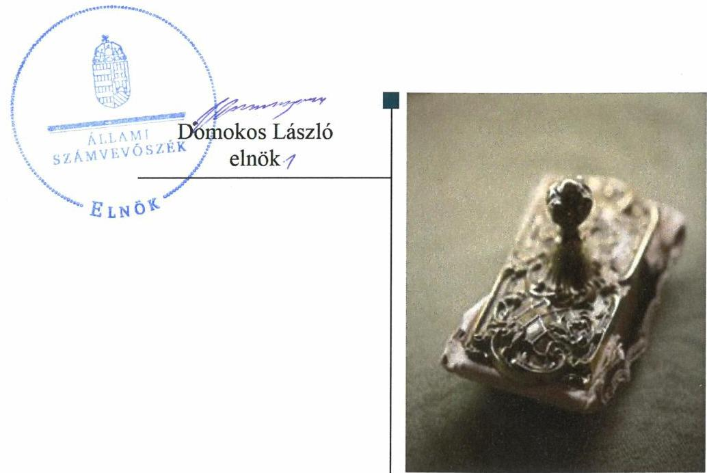
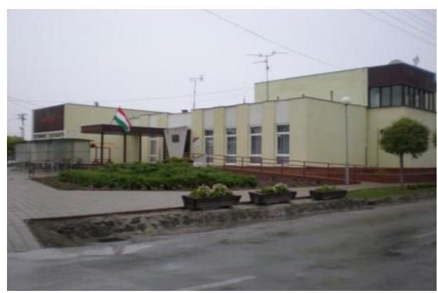
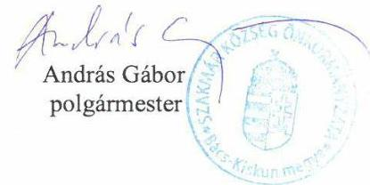
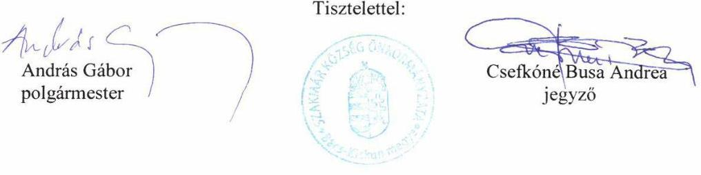
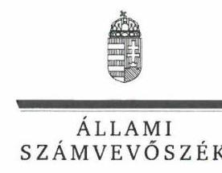
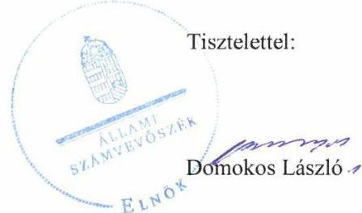
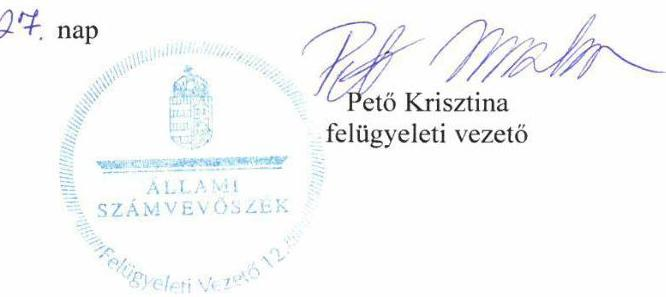

# Jelentés 

## Önkormányzatok ellenőrzése

Integritás- és belső kontrollrendszer, Befektetési tevékenységek ellenőrzése - Szakmár Község Önkormányzata 2019. 12. hó 13. nap

---

# AZ ELLENŐRZÉST FELÜGYELTE: 

PETŐ KRISZTINA felügyeleti vezető

## AZ ELLENŐRZÉST VEZETTE ÉS A VÉGREHAJTÁSÁÉRT FELELŐS:

DR. DOMOKOS MAGDOLNA ellenőrzésvezető

## A PROGRAM ÖSSZEÁLLÍTÁSÁÉRT FELELŐS:

TÓTPÁL SZABOLCS osztályvezető

IKTATÓSZÁM: EL-2334-001/2019.
TÉMASZÁM: 2485

## ELLENŐRZÉS-AZONOSÍTÓ SZÁM: V082904

Jelentéseink az Országgyűlés számítógépes hálózatán és az Interneten a www.asz.hu címen is olvashatóak.

---

# TARTALOMJEGYZÉK 

■ ÖSSZEGZÉS ..... 5
■ AZ ELLENŐRZÉS CÉLJA ..... 6
■ AZ ELLENŐRZÉS TERÜLETE ..... 7
■ AZ ELLENŐRZÉS HÁTTERE, INDOKOLTSÁGA ..... 8
■ A JELENTÉS LÉNYEGES KÉRDÉSKÖREI ..... 10
■ AZ ELLENŐRZÉS HATÓKÖRE ÉS MÓDSZEREI ..... 11
■ MEGÁLLAPÍTÁSOK ..... 13
■ JAVASLATOK ..... 16
■ MELLÉKLETEK ..... 19
I. sz. melléklet: Értelmező szótár ..... 19
■ FÜGGELÉK: ÉSZREVÉTELEK ..... 21
■ RÖVIDÍTÉSEK JEGYZÉKE ..... 35

---

.

---

# ÖSSZEGZÉS 

Szakmár Község Önkormányzata a közpénzekkel, nemzeti vagyonnal történő szabályszerű, átlátható és elszámoltatható gazdálkodást, valamint a befektetési tevékenységek szabályszerű végzését és a korrupciós kockázatokkal szembeni védelmet nem biztosította.

## Az ellenőrzés társadalmi indokoltsága

Az Állami Számvevőszék alapvető feladata a közpénzekkel, az állami és önkormányzati vagyonnal való gazdálkodás ellenőrzése. Az Alaptörvény szerint az önkormányzatok kötelezettsége a kiegyensúlyozott, átlátható és fenntartható költségvetési gazdálkodás elvének érvényesítése, a nemzeti vagyonnal való rendeltetésszerű és felelős módon való gazdálkodás biztosítása. Az Állami Számvevőszék stratégiájában megfogalmazott célkitűzése az integritás alapú, átlátható és elszámoltatható közpénzfelhasználás elősegítése. Ennek megvalósítása érdekében az Állami Számvevőszék prioritásként kezeli a közpénzzel gazdálkodó szervezetek esetében a belső kontrollrendszer működésének ellenőrzését.

## Főbb megállapítások, következtetések, javaslatok

Szakmár Község Önkormányzat belső kontrollrendszerének kialakítása és működtetése a 2017. évben nem volt szabályszerű. A jogszabályi előírás ellenére Szakmár Község Önkormányzatának nem volt számlarendje, továbbá a számviteli politika tartalma nem felelt meg a jogszabályi előírásoknak. A számviteli törvényben előírt szabályozások hiányában nem volt biztosított a szabályszerű közpénzfelhasználás feltétele. Az integrált kockázatkezelési rendszert nem működtették. Szakmár Község Önkormányzata 2017. évi költségvetési beszámolóját leltár nem támasztotta alá, ezért a beszámolója nem mutatott megbízható és valós képet. Szakmár Község Önkormányzatánál nem szabályszerűen működtették az információs és kommunikációs rendszert, továbbá a monitoring rendszer működtetéséről nem gondoskodtak.

A 2013-2016. években a befektetésekhez kapcsolódóan a belső kontrollrendszer Szakmár Község Önkormányzatánál és a Szakmári Közös Önkormányzati Hivatalnál a jogszabályok által kötelezően elkészítendő szabályzatok esetében feltárt hiányosságok miatt nem volt szabályszerű, az nem biztosította a befektetési tevékenység szabályszerű végzését. A 2017. december 31-én meglévő befektetések számviteli elszámolása, nyilvántartása nem volt szabályszerű.

Szakmár Község Önkormányzatánál az integritási kontrollok kialakítása nem volt megfelelő. Az integritás elvű működést célzó kontrollok nem kerültek kiépítésre, nem volt biztosított a korrupciós kockázatokkal szembeni védelem. A jegyző nem alakította ki a teljesítménymérésre alkalmas követelményeket, ezzel nem biztosította a teljesítmény mérésének a lehetőségét.

Az Állami Számvevőszék a jegyző munkajogi felelősségre vonását kezdeményezte volna, azonban a jegyző személyének 2019-ben történt változása miatt ez ellehetetlenült.

Az Állami Számvevőszék az ellenőrzés megállapításai alapján Szakmár Község Önkormányzata polgármestere részére 3 javaslatot, a Szakmári Közös Önkormányzati Hivatal jegyzője részére 7 javaslatot fogalmazott meg.

---

# AZ ELLENŐRZÉS CÉLJA 

AZ ELLENŐRZÉS CÉLJA annak megállapítása volt, hogy Szakmár Község Önkormányzata belső kontrollrendszere biztosította-e a közpénzekkel és a nemzeti vagyonnal történő elszámoltatható, átlátható, szabályszerű, gazdaságos, hatékony és eredményes gazdálkodás feltételeit. Az ellenőrzés keretében az Állami Számvevőszék értékelte továbbá, hogy az önkormányzatnál kiépítették és erősítették-e a korrupciós kockázatok kezelését szolgáló integritás kontrollokat és azt, hogy megteremtették-e a teljesítményellenőrzés feltételeit.

Az ellenőrzés további célja annak értékelése volt, hogy a jogszabályi előírásoknak megfelelően alakították-e ki a belső kontrollrendszert, a kontrollkörnyezet biztosította-e a befektetési tevékenységek szabályszerű végzését. Az Állami Számvevőszék értékelte továbbá, hogy az egyes befektetési tevékenységekkel kapcsolatos döntéshozatal és a döntések végrehajtása, valamint az egyes befektetések számviteli elszámolása, nyilvántartása szabályszerű volt-e, és a belső és külső ellenőrzések támogatták-e az egyes befektetési tevékenységek szabályszerű végzését.

---

# AZ ELLENŐRZÉS TERÜLETE 

## Szakmár Község Önkormányzata

Szakmár község Bács-Kiskun Megyében, a Kalocsai járásban fekszik. Lakossága 2017. január 1-jén - a Központi Statisztikai Hivatal által kiadott Magyarország közigazgatási helynévkönyve alapján - 1212 fő volt.

Az Önkormányzat hét tagú Képviselő-testületének munkáját egy három főből álló Ügyrendi bizottság segítette. A településen Roma Nemzetiségi Önkormányzat működött.

Az Önkormányzat Újtelek és Öregcsertő községek önkormányzatával kötött megállapodás alapján 2013. január 1-jétől közös önkormányzati Hivatalt működtetett. A Hivatal gazdasági szervezettel nem rendelkezett, a 2017. évi beszámoló adatai szerint a Hivatalban foglalkoztatott köztisztviselők száma 12 fő volt.
Az Önkormányzat a Hivatalon kívül egy költségvetési szervvel, Szakmár Község Óvodája és Szociális Étkezője* intézménnyel rendelkezett, gazdasági társaságban többségi tulajdona nem volt.

A polgármester a 2014. évi önkormányzati választások óta töltötte be tisztségét, a jegyző 2017. január 1-je óta látta el feladatait.

Az Önkormányzat a 2017. évi költségvetési beszámolója szerint 376,1 M Ft költségvetési bevételt ért el, valamint 321,8 M Ft költségvetési kiadást teljesített.

A mérleg szerinti eszközvagyon értéke 2017. december 31-én 1 106,6 millió Ft volt, amelyből a forgatási célú értékpapírok (befektetési jegyek) 35,0 millió Ft-ot tettek ki. A forrásokon belül a költségvetési évben esedékes kötelezettségállomány 0,6 millió Ft-ot, a költségvetési évet követően esedékes kötelezettségállomány 4,6 millió Ft-ot tett ki.

[^0]
[^0]:    * Az intézmény neve 2017. május 31-ig Szakmár Község Óvodája volt.

---

# AZ ELLENŐRZÉS HÁTTERE, INDOKOLTSÁGA 

Az Állami Számvevőszék a stratégiai céljával összhangban - az Állami Számvevőszékről szóló 2011. évi LXVI. törvény felhatalmazása alapján - végzi a közpénzekkel, az állami és önkormányzati vagyonnal való felelős gazdálkodás, valamint a helyi önkormányzatok számviteli rendje betartásának és belső kontrollrendszere működésének ellenőrzését.

Magyarország Alaptörvénye az önkormányzatoktól is elvárja a kiegyensúlyozott, átlátható és fenntartható költségvetési gazdálkodás elvének érvényesítését, továbbá a nemzeti vagyonnal való rendeltetésszerű és felelős módon való gazdálkodást. Az Állami Számvevőszék stratégiájában megfogalmazta, hogy támogatja az integritás alapú, átlátható és elszámoltatható közpénzfelhasználás megteremtését. Mindezekre tekintettel, a közpénzzel gazdálkodó szervezetek esetében a belső kontrollrendszer megfelelő működése ellenőrzését prioritásként kezeli az Állami Számvevőszék.

A belső kontrollrendszer kialakítása és működtetése nélkül nem valósítható meg a közpénzek, a közvagyon átlátható, szabályos, gazdaságos, hatékony és eredményes felhasználása. A belső kontrollrendszer azt a célt szolgálja, hogy a költségvetési szervek működésük és gazdálkodásuk során a tevékenységeket szabályszerűen hajtsák végre, teljesítsék elszámolási kötelezettségeiket és megvédjék az erőforrásokat a veszteségektől, a károktól és a nem rendeltetésszerű használattól. A belső kontrollrendszer magában foglalja mindazon elveket, eljárásokat és belső szabályzatokat, melyek biztosítják, hogy a költségvetési szerv valamennyi tevékenysége és célja összhangban legyen a szabályszerűséggel, szabályozottsággal, valamint a gazdaságosság, hatékonyság és eredményesség követelményeivel, az eszközökkel és forrásokkal való gazdálkodásban ne kerüljön sor pazarlásra, visszaélésre, rendeltetésellenes felhasználásra. Megfelelő, pontos és naprakész információk álljanak rendelkezésre a költségvetési szerv működésével kapcsolatosan, és a belső kontrollrendszer harmonizációjára, összehangolására vonatkozó jogszabályok végrehajtásra kerüljenek. Az integritás kontrollok kiépítése, erősítése a szervezet korrupciós kockázatainak kezelését szolgálja. A teljesítménykövetelmények meghatározása és működtetése megalapozhatja az önkormányzatoknál a teljesítményellenőrzés lefolytatását.

Az önkormányzati vagyongazdálkodás keretében az önkormányzatok átmenetileg szabad pénzeszközeinek befektetését jogszabály nem tiltja, a befektetések jellege nem korlátozott, a pénzpiaci szolgáltatók közül az önkormányzatok a kínált szolgáltatás és annak költségei alapján, szabadon választhatnak, azonban a veszteséges gazdálkodás kockázatai és következményei az önkormányzatokat terhelik. A szabad pénzeszközök felhasználása során kiemelten fontos a felelős gazdálkodás érvényesülése, amely összhangban kell, hogy legyen, az önkormányzati gazdálkodás alapelveivel. Az ellenőrzéssel feltárásra kerülhetnek azok a kockázatok, amelyek az önkormányzatok gazdálkodásával, ezen belül befektetési tevékenységeivel, kontrollkörnyezetével kapcsolatosak és a befektetési tevékenységek szabályszerű végrehajtását befolyásolják. Az ellenőrzéssel az önkormányzatok

---

befektetési/vagyongazdálkodási döntései értékelhetővé válnak, és megalapozott megállapítás tehető arra vonatkozóan, hogy milyen hatást gyakoroltak az önkormányzat vagyonára a képviselő-testület döntései.

---

# A JELENTÉS LÉNYEGES KÉRDÉSKÖREI 

1.     - Az önkormányzat belső kontrollrendszerének kialakítása és működtetése szabályszerű volt-e a 2017. évben?
2.     - Az önkormányzatnál alakítottak-e ki a szervezeti teljesítmény mérésére alkalmas követelményeket?
3.     - Az önkormányzatnál a befektetési tevékenységek szabályszerű végzését a belső kontrollrendszer biztosította-e a 2013-2017. években? Az Önkormányzat 2017. december 31-én meglévő befektetéseinek számviteli elszámolása, nyilvántartása szabályszerű volt-e?

---

# AZ ELLENŐRZÉS HATÓKÖRE ÉS MÓDSZEREI 

## Az ellenőrzés típusa

Megfelelőségi és szabályszerűségi ellenőrzés.

## Az ellenőrzött időszak

Az integritás és belső kontrollrendszer ellenőrzött időszaka a 2017. év.
Az egyes befektetési tevékenységek ellenőrzése tekintetében az ellenőrzött időszak 2013. január 1. - 2017. december 31. közötti időszak.

## Az ellenőrzés tárgya

Szakmár Község Önkormányzata és a gazdálkodási feladatokat ellátó Szakmári Közös Önkormányzati Hivatal belső kontrollrendszerének kialakítása és működtetése, valamint az integritás kontrollok kiépítettsége, a teljesítményellenőrzés feltételeinek rendelkezésre állása volt.

Az egyes befektetési tevékenységek ellenőrzésének tárgya az önkormányzat 2017. december 31-én meglévő, a Számv. tv. 3. § (6) bekezdés 2. és 3. pontja szerint az értékpapírokban megtestesülő befektetései, lekötött betétei.

## Az ellenőrzött szervezet

Szakmár Község Önkormányzata

## Az ellenőrzés jogalapja

Az ellenőrzés jogszabályi alapját az ÁSZ tv. 1. § (3) bekezdés, 5. § (2) és (6) bekezdései, valamint az Áht. 61. § (2) bekezdésének előírásai képezik.

## Az ellenőrzés módszerei

Az ÁSZ az ellenőrzést az ellenőrzési program szempontjai, az ellenőrzött időszakban hatályos jogszabályok, az ellenőrzés szakmai szabályai, a jelen ellenőrzésre irányadó ÁSZ módszertanok figyelembevételével hajtotta végre. Az ellenőrzési kérdések megválaszolásához szükséges bizonyítékok megszerzése az ellenőrzött által rendelkezésre bocsátott dokumentu-

---

mokra, adatokra alapozva megfigyelés, szemle (szemrevételezés), kérdésfeltevés (információkérés), mintavételezés, valamint elemző eljárás útján történt. Az ellenőrzési bizonyítékként felhasználható adatforrások közé tartoznak az ellenőrzési program részletes szempontjainál felsorolt adatforrások, valamint minden egyéb - az ellenőrzés folyamán feltárt, az ellenőrzés szempontjából információt tartalmazó - dokumentum.

Az ellenőrzés lefolytatásához az ellenőrzött szervezet tanúsítványok kitöltésével, valamint az ÁSZ által kért dokumentumok megküldésével szolgáltatott adatokat, amelyek valódiságát és teljes körűségét az ellenőrzött szervezet vezetője által tett teljességi és hitelességi nyilatkozat igazolja. A rendelkezésre bocsátott adatok, információk kontrollja az ellenőrzés keretében megtörtént.

Az önkormányzat belső kontrollrendszere egyes pilléreinek kialakítására és működtetésére vonatkozó értékelés:
$\longrightarrow$ „szabályszerű", amennyiben az értékelt területen az elért „igen" válaszok százalékban kifejezett, egész számra kerekített aránya legalább 85 %,
$\longrightarrow$ „nem szabályszerű", ha nem éri el a 85 %-ot,
Az önkormányzat belső kontrollrendszerének összesített értékelése az egyes részterületek esetében kapott megfelelőségi arányok számtani átlaga alapján történik és megegyezik a pillérenként (kontrollterületenként) alkalmazott százalékos értékelésekkel, a következő eltérésekkel: a kontrollrendszer egésze esetében a „szabályszerű" értékelésnek a százalékos értéken felül további feltétele, hogy egyik kontrollterület sem kaphat „nem szabályszerű" értékelést.

A 2017. évi kiadások teljesítéséhez kapcsolódó pénzgazdálkodási belső kontrollok működésének szabályszerűsége esetében az ellenőrzés
 azokra a legnagyobb értékű tételekre - a lényeges sokaságra - terjedt ki, melyek összértéke eléri a teljes sokaság összértékének 50%-át. A 2017. évi kiadások esetében a lényeges sokaságot tételesen ellenőriztük.

Az önkormányzat befektetési tevékenységét a 2013. január 1. és 2017. december 31. közötti időszak vonatkozásában értékeltük.

Az ÁSZ az ellenőrzés ideje alatt az ellenőrzött szervezettel történő kapcsolattartást az ÁSZ SZMSZ ${ }^{12}$ vonatkozó előírásai alapján biztosította.

---

# 1. Az önkormányzat belső kontrollrendszerének kialakítása és működtetése szabályszerű volt-e a 2017. évben? 

Összegző megállapítás Az Önkormányzat belső kontrollrendszerének kialakítása nem volt szabályszerű a 2017. évben.
1.1. számú megállapítás A kontrollkörnyezet kialakítása nem volt szabályszerű.

A polgármester a Számv. tv. 161. § (1) és (4) bekezdése ellenére nem gondoskodott az Önkormányzat számlarendjének összeállításáról.

Az Önkormányzatnál a számviteli politika ${ }^{13}$ nem tartalmazta a Számv. tv. 14. § (4) bekezdésében meghatározott azon szabályokat, előírásokat, amellyel meghatározásra kerül, hogy számviteli elszámolás, értékelés szempontjából mit tekintenek kivételes nagyságú vagy előfordulású bevételnek, költségnek, vagy ráfordításnak.

A Képviselő-testület nem állapította meg a Kttv. ${ }^{14}$ 231. § (1) bekezdés szerinti hivatásetikai alapelvek részletes tartalmát, valamint az etikai eljárás szabályait.
1.2. számú megállapítás Az integrált kockázatkezelési rendszert nem működtették.

A jegyző a Bkr. ${ }^{15}$ 7. § (1) bekezdése előírása ellenére az integrált kockázatkezelési rendszert nem működtette, a Bkr. 7. § (4) bekezdésében foglaltak ellenére nem gondoskodott az integrált kockázatkezelési rendszer koordinálása szervezeti felelősének kijelöléséről.
1.3. számú megállapítás A kontrolltevékenységek működtetése szabályszerű volt.

A kiadások teljesítéséhez kapcsolódó kötelezettségvállalási és teljesítésigazolási kontrollok szabályszerűen működtek.
1.4. számú megállapítás Az információs és kommunikációs folyamatok működtetése nem volt szabályszerű.

A jegyző az Ávr. ${ }^{16}$ 169. § (3) bekezdésében foglaltak ellenére az Önkormányzat és a Hivatal időközi költségvetési jelentéseit, valamint Ávr. 170. § (2) bekezdésében előírt időközi mérlegjelentéseit nem töltötte fel a Kincstár ${ }^{17}$ által működtetett elektronikus adatszolgáltató rendszerbe.
1.5. számú megállapítás A monitoring rendszert nem működtették.

A jegyző a Bkr. 3. § e) pontjában foglaltak ellenére nem gondoskodott a nyomon követési rendszer működtetéséről. A Bkr. 22. § (1) bekezdés b) pontja bekezdése ellenére az Önkormányzat nem rendelkezett stratégiai és éves belső ellenőrzési tervvel.

---

A jegyző a Bkr. 11. § (1) bekezdésében előírtak alapján a Bkr. 1. számú melléklete szerinti nyilatkozatban értékelte a belső kontrollrendszer minőségét, mely nincs összhangban az ellenőrzés megállapításaival.

Szakmár Község Önkormányzat integritás elvű működését célzó kontrollok nem kerültek kiépítésre, nem volt biztosított a korrupciós kockázatokkal szembeni védelem. Az Önkormányzatnál nem végeztek korrupciós védelmet erősítő kockázatelemzést, ezáltal nem azonosították az integritást veszélyeztető kockázatokat, továbbá nem határozták meg az integritás erősítésére és a korrupció megelőzésére szolgáló értékeket.

# 2. Az önkormányzatnál alakítottak-e ki a szervezeti teljesítmény mérésére alkalmas követelményeket? 

Összegző megállapítás Az Önkormányzatnál nem alakítottak ki a teljesítmény mérésére alkalmas követelményeket a 2017. évben.

Az Önkormányzat nem alakította ki a teljesítmény mérésének feltételeit, a szervezeti célok elérését szolgáló feladatok, folyamatok, tevékenységek mérését szolgáló indikátorokat, mérőszámokat, feladat és teljesítmény-mutatókat nem képeztek.

## 3. Az önkormányzatnál a befektetési tevékenységek szabályszerű végzését a belső kontrollrendszer biztosította-e a 2013-2017. években? Az Önkormányzat 2017. december 31-én meglévő befektetéseinek számviteli elszámolása, nyilvántartása szabályszerű volt-e?

## Összegző megállapítás

3.1. számú megállapítás

A befektetési tevékenységek szabályszerű végzését a belső kontrollrendszer nem biztosította a 2013-2017. években. Az Önkormányzat 2017. december 31-én meglévő befektetéseinek számviteli elszámolása, nyilvántartása nem volt szabályszerű.

A befektetési tevékenységek szabályszerű végzését a belső kontrollrendszer nem biztosította a 2013-2017. években.

A jegyző a 2013. január 1. - 2014. március 26. közötti időszakban az Áht. 10. § (5) bekezdése ellenére a Hivatal szervezetét, feladatai ellátásának részletes belső rendjét és módját szervezeti és működési szabályzatban nem állapította meg.

A jegyző a 2013-2014. években a Számv. tv. 14. § (3) bekezdése ellenére nem gondoskodott az Önkormányzatnál és a Hivatalnál a számviteli politika kialakításáról.

A jegyző a 2013. évben a Számv. tv. 14. § (5) bekezdés a) - b) pontja ellenére nem gondoskodott az Önkormányzatnál és a Hivatalnál az eszközök és a források leltárkészítési és leltározási szabályzatának és az eszközök és

---

a források értékelési szabályzatának elkészítéséről, valamint 2013. január 1-jétől 2013. február 28-ig a Számv. tv. 14. § (5) bekezdés d) pontjában előírtak ellenére a pénzkezelési szabályzat elkészítéséről.

A jegyző a 2013-2014. évben az Ávr. 60. § (3) bekezdésében foglaltak ellenére nem gondoskodott az Önkormányzatnál naprakész nyilvántartás vezetéséről a gazdálkodási jogkörök gyakorlására jogosult személyekről és aláírás-mintájukról, az Áhsz. ${ }^{18}$ 51. § (2) bekezdése előírása ellenére nem készítette el a Hivatal számlarendjét.

A 2013-2017. években a Számv. tv. 161. § (1) és (4) bekezdése ellenére a polgármester nem gondoskodott az Önkormányzat számlarendjének összeállításáról.

A 2013-2017. években hatályos önkormányzati SZMSZ ${ }_{1,2}{ }^{19}$ tartalma nem volt szabályszerű, az Mötv. ${ }^{20} 42 . \S 4$. pontjában foglaltak ellenére a Képviselő-testület hatásköréből át nem ruházható hitelfelvételt a polgármester hatásköreként rögzítette.

A 2013-2017. években az Önkormányzat nem rendelkezett az Mötv. 116. § (1) bekezdésében foglaltak ellenére a Képviselő-testület által elfogadott gazdasági programmal, fejlesztési tervvel.

# 3.2. számú megállapítás 

Az Önkormányzat 2017. december 31-én meglévő befektetéseinek számviteli elszámolása, nyilvántartása nem volt szabályszerű.

Az Önkormányzat 2017. december 31-én meglévő értékpapírjainak vonatkozásában a jegyző
— az Áhsz. 39. § (3) bekezdésében foglaltak ellenére nem vezette az Áhsz. 14. melléklet VIII.1. a)-j) pontjaiban előírtak szerinti részletező nyilvántartást, így az analitikus nyilvántartás és a bizonylatok adatai közötti egyeztetés és ellenőrzés lehetősége a Számv. tv. 165. § (4) bekezdése ellenére nem volt biztosított;
— a Számv. tv. 69. § (1) bekezdése ellenére nem állított össze a forgóeszközök között kimutatott értékpapírok mérlegtételének alátámasztásához leltárt.

---

# JAVASLATOK 

Az ÁSZ tv. 33. § (1) bekezdésében foglaltak értelmében az ellenőrzött szervezet vezetője köteles a jelentésben foglalt megállapításokhoz kapcsolódó intézkedési tervet összeállítani és azt a jelentés kézhezvételétől számított 30 napon belül az ÁSZ részére megküldeni. Amennyiben az ellenőrzött szervezet vezetője nem küldi meg határidőben az intézkedési tervet, vagy továbbra sem elfogadható intézkedési tervet küld, az Állami Számvevőszék elnöke az ÁSZ tv. 33. § (3) bekezdés a) és b) pontjaiban foglaltakat érvényesítheti.

## Szakmár Község Önkormányzata polgármesterének

1. Intézkedjen a jogszabály szerinti számlarend elkészítéséről.
(1.1. sz. megállapítás 1. bekezdése és a 3.1. sz. megállapítás 5. bekezdése alapján)
2. Kezdeményezze a hivatásetikai alapelvek részletes tartalmának, valamint az etikai eljárás szabályainak megállapítását.
(1.1. sz. megállapítás 3. bekezdése alapján)
3. Intézkedjen a jogszabálynak megfelelő önkormányzati SZMSZ Képviselő-testület elé terjesztéséről annak jóváhagyása érdekében.
(3.1. sz. megállapítás 6. bekezdése alapján)

## Szakmár Község Önkormányzati Hivatal jegyzőjének

1. Intézkedjen, hogy a számviteli politika feleljen meg a jogszabályi előírásnak.
(1.1. sz. megállapítás 2. bekezdése alapján)
2. Intézkedjen a kockázatokhoz kapcsolódó intézkedések nyomon követése módjának meghatározásáról és az integrált kockázatkezelési rendszer koordinálásának felelőse kijelöléséről.
(1.2. sz. megállapítás 1. bekezdése alapján)

---

3. Intézkedjen a jogszabályban előírt adatszolgáltatási kötelezettség teljesítése érdekében.
(1.4. sz. megállapítás 1. bekezdése alapján)
4. Intézkedjen a belső kontrollrendszer keretében a nyomon követési rendszer működtetéséről.
(1.5. sz. megállapítás 1. bekezdésének 1. mondata alapján)
5. Intézkedjen a jogszabálynak megfelelő önkormányzati SZMSZ előkészítése érdekében.
(3.1. sz. megállapítás 6. bekezdése alapján)
6. Intézkedjen a jogszabály szerinti részletező nyilvántartás vezetéséről, valamint biztosítsa az analitikus nyilvántartás és a bizonylatok adatai közötti egyeztetés és ellenőrzés lehetőségét.
(3.2. sz. megállapítás 1. bekezdésének 1. francia bekezdése alapján)
7. Intézkedjen a mérleg tételeinek alátámasztásához leltár összeállításáról.
(3.2. sz. megállapítás 1. bekezdésének 2. francia bekezdése alapján)

---

.

---

# MELLÉKLETEK 

- I. SZ. MELLÉKLET: ÉRTELMEZŐ SZÓTÁR
belső ellenőrzés
belső kontrollrendszer
belső kontrollrendszer területei
közös önkormányzati hivatal
monitoring
monitoring-rendszer
önkormányzati hivatal
társulás

Független, tárgyilagos bizonyosságot adó és tanácsadó tevékenység, amelynek célja, hogy az ellenőrzött szervezet működését fejlessze és eredményességét növelje, az ellenőrzött szervezet céljai elérése érdekében rendszerszemléletű megközelítéssel és módszeresen értékeli, illetve fejleszti az ellenőrzött szervezet irányítási és belső kontrollrendszerének hatékonyságát. (Forrás: Bkr. 2. § b) pontja)
A belső kontrollrendszer a kockázatok kezelése és tárgyilagos bizonyosság megszerzése érdekében kialakított folyamatrendszer, amely azt a célt szolgálja, hogy a működés és gazdálkodás során a tevékenységeket szabályszerűen, gazdaságosan, hatékonyan, eredményesen hajtsák végre, az elszámolási kötelezettségeket teljesítsék, megvédjék az erőforrásokat a veszteségektől, károktól és nem rendeltetésszerű használattól. (Forrás: Áht. 69. § (1) bekezdése)
A kontrollkörnyezet, az integrált kockázatkezelési rendszer, a kontrolltevékenységek, az információs és kommunikációs rendszer, valamint a nyomon követési (monitoring) rendszer. (Forrás: Bkr. 3. §)
A települési képviselő-testület más települési képviselő-testülettel társult képviselőtestületet alakíthat, amely esetén a képviselő-testületek részben vagy egészben egyesítik a költségvetésüket, közös önkormányzati hivatalt tartanak fenn és intézményeiket közösen működtetik. (Forrás: Mötv. 56. § (1)-(2) bekezdései)
A monitoring általánosságban a különböző szintű szervezeti célok megvalósításának folyamatát kíséri figyelemmel, melynek során a releváns eseményekről és tevékenységekről (együtt: folyamatokról) rendszeres jelleggel, strukturált, döntéstámogató információkhoz jutnak a szervezet vezetői. (Forrás: NGM Útmutató a költségvetési szervek monitoring rendszeréhez 2011. november)
A költségvetési szerv vezetője köteles kialakítani a szervezet tevékenységének a célok megvalósításának nyomon követését biztosító rendszert, amely az operatív tevékenységek keretében megvalósuló folyamatos és eseti nyomon követésből, valamint az operatív tevékenységektől függetlenül működő belső ellenőrzésből állhat. (Forrás: Bkr. 10. §)
A polgármesteri hivatal, a főpolgármesteri hivatal, a megyei önkormányzati hivatal és a közös önkormányzati hivatal. (Forrás: Áht. 1. § 18. pont)
A helyi önkormányzatok képviselő-testületei megállapodhatnak abban, hogy egy vagy több önkormányzati feladat- és hatáskör, valamint a polgármester és a jegyző államigazgatási feladat- és hatáskörének hatékonyabb, célszerűbb ellátására jogi személyiséggel rendelkező társulást hoznak létre. (Forrás: Mötv. 87. §)

---

.

---

# FÜGGELÉK: ÉSZREVÉTELEK 

A jelentéstervezetet a Számvevőszék 15 napos észrevételezésre megküldte az ellenőrzött szervezet vezetőjének az ÁSZ tv. 29. § ${ }^{+}$(1) bekezdése előírásának megfelelően.

Szakmár Község Önkormányzatának polgármestere a jelentéstervezet megállapításaira írásban észrevételt tett.
Az ÁSZ tv. 29. § (3) bekezdésével összhangban az ÁSZ a Függelékben feltünteti az ellenőrzés megállapításaival kapcsolatban tett, figyelembe nem vett észrevételeket, és megindokolja, hogy azokat miért nem fogadta el.

[^0]
[^0]:    ${ }^{+}$29. § (1) Az Állami Számvevőszék az ellenőrzési megállapításait megküldi az ellenőrzött szervezet vezetőjének vagy az általa megbízott személynek, és annak, akinek személyes felelősségét állapította meg.
    (2) Az ellenőrzött szervezet vezetője és a felelősként megjelölt személy az ellenőrzés megállapításaira tizenöt napon belül írásban észrevételt tehet.
    (3) Az Állami Számvevőszék az észrevételre a beérkezésétől számított harminc napon belül írásban válaszol. A figyelembe nem vett észrevételeket köteles a jelentésben feltüntetni, és megindokolni, hogy azokat miért nem fogadta el.

---

Szakmár Község Önkormányzata 6336 Szakmár, Bajcsy-Zs. u. 24. Tel./fax: 78/475-002, 78/575-010 e-mail: szakmar@dunaktv.hu

Ügyiratszám: S-I-86-16/2019.
Tárgy: jelentéstervezettel kapcsolatos észrevétel megküldése
Hív.szám: EL-0751-037/2019.
Ellenőrzés-azonosító szám: V082904

ÁLLAMI SZÁMVEVŐSZÉK

1364 BUDAPEST
PF:54

# Tisztelt Cím! 

Az EL-0751-037/2019. iktatószámú jelentéstervezetükkel kapcsolatos észrevételeinket jelen levelünk mellékleteként csatoltan megküldjük további szíves felhasználás céljából.

Szakmár, 2019. október 31.

Tisztelettel:

---

Szakmár Község Önkormányzata
6336 Szakmár, Bajcsy-Zs. u. 24.
Tel./fax: 78/475-002, 78/575-010
e-mail: szakmar@dunaktv.hu

Szám:
 S-I/86-15/2019.
Tárgy: jelentéstervezettel kapcsolatos észrevételek
Hiv.szám: EL-0751-037/2019.
Ellenőrzés-azonosító szám: V082904
ÁLLAMI SZÁMVEVŐSZÉK
Budapest
Apáczai Csere János u. 10.
1052

Tisztelt Állami Számvevőszék!

Az Állami Számvevőszék által az „Önkormányzatok ellenőrzése - Integritás - és belső kontrollrendszer, Befektetési tevékenységek ellenőrzése - Szakmár Község Önkormányzata" címmel készült számvevőszéki jelentéstervezetre az alábbi észrevételeket tesszük:

Az Önök által tett megállapításokkal kapcsolatos észrevételeink:

1. Az Önkormányzat belső kontrollrendszerének kialakítása nem volt szabályszerű a 2017. évben.

# 1.1. számú megállapítás: A kontrollkörnyezet kialakítása nem volt szabályszerű. 

A polgármester a Számv. tv. 161. § (1) és (4) bekezdése ellenére nem gondoskodott az Önkormányzat számlarendjének összeállításáról.

Az Állami Számvevőszék az EL-0751-006/2018. iktatószámú 2018.06.27-én kelt levelének 3.1.4. pontjában kérte be 2017. január 1. és 2017. december 31. időszakra vonatkozó számlarendet.
Szakmár Község Önkormányzata 2017. január 1-jétől hatályos Számlarenddel rendelkezett, mely az ellenőrzés során feltöltésre került az adott pontban. A számlarend szabályainak összeállításáról a jegyző gondoskodott, tekintettel arra, hogy a szabályzat hatálya a Szakmári Közös Önkormányzati Hivatalra és Szakmár Község Önkormányzatára is kiterjedt.
A Számv. tv. 161. § (4) bekezdése szerint a jövőben biztosítani fogjuk, hogy a számlarend összeállítását, karbantartását a gazdálkodó képviseletére jogosult személy végezze el.

Az Önkormányzatnál a számviteli politika nem tartalmazta a Számv. tv. 14. § (4) bekezdésében meghatározott azon szabályokat, előírásokat, amellyel meghatározásra kerül, hogy számviteli elszámolás, értékelés szempontjából mit tekintenek kivételes nagyságú vagy előfordulású bevételnek, költségnek, vagy ráfordításnak.

A számviteli politika jogszabályi megfeleltetését a jövőben biztosítani fogjuk.

---

# Szakmár Község Önkormányzata 6336 Szakmár, Bajcsy-Zs. u. 24. Tel./fax: 78/475-002, 78/575-010 e-mail: szakmar@dunaktv.hu 

A Képviselő-testület nem állapította meg a Kttv. 231. § (1) bekezdés szerinti hivatásetikai alapelvek részletes tartalmát, valamint az etikai eljárás szabályait.

A Szakmári Közös Önkormányzati Hivatal Etikai kódexét 2014. január 1-jei hatállyal a jegyző készítette el és hagyta jóvá, mely szabályzat az adatszolgáltatás során feltöltésre került az Önök részére. A dokumentum elfogadásáról a Képviselő-testület nem határozott, mely hiányosság pótlásáról intézkedni fogunk.

## 1.2. számú megállapítás: Az integrált kockázatkezelési rendszert nem működtették.

A jegyző a Bkr. 7. § (1) bekezdése előírása ellenére az integrált kockázatkezelési rendszert nem működtette, a Bkr. 7. § (4) bekezdésében foglaltak ellenére nem gondoskodott az integrált kockázatkezelési rendszer koordinálása szervezeti felelősének kijelöléséről.

A Bkr. vonatkozó rendelkezéseinek figyelembe vételével az integrált kockázatkezelési rendszer kiépítése, annak működtetése, az integrált kockázatkezelési rendszer koordinálása szervezeti felelősének kijelölése a megállapításnak megfelelően pótlásra kerül.
1.3. számú megállapítás: A kontrolltevékenységek működtetése nem volt szabályszerű Az Önkormányzat az Áhsz. 39. § (1) bekezdésében foglaltak ellenére nem vezetett a valóságnak megfelelő, folyamatos, zárt rendszerű, áttekinthető részletező nyilvántartást, tekintettel a felhalmozási kiadások analitikus nyilvántartása és a beszámoló közötti eltérésre. Ezáltal az Önkormányzat az Áhsz. 5. § (1) bekezdésében foglaltak ellenére a 2017. évről szóló költségvetési beszámoló adatait részletező nyilvántartással és szabályszerű könyvvezetéssel nem támasztotta alá.

Az önkormányzat a Kincstár által működtetett ASP rendszerben vezeti a valóságnak megfelelő, folyamatos, zárt rendszerű, áttekinthető részletező nyilvántartást, mely az ellenőrzés során - az ASP rendszer adta lehetőségnek megfelelően - lekérdezésre, majd az adatszolgáltatás során feltöltésre került. A benyújtott beszámoló és a főkönyv egyezősége biztosított, hiszen e nélkül a beszámoló nem kerülhetett volna feladásra, illetve a Magyar Államkincstár által elfogadásra. A bekért adatok megegyeznek mind a beszámolóval, mind az azt alátámasztó főkönyvi kivonattal.
Álláspontunk szerint a felhalmozási kiadások analitikus nyilvántartása és a beszámoló közötti eltérés nem mutatható ki. A Tisztelt Állami Számvevőszék nem konkretizálta, hogy mire alapozza az eltérést. A bekért felhalmozási kiadások pénzforgalmi teljesítésének ellenőrzéséhez kért és csatolt - az ASP rendszerből lekérdezett - Excel táblákból lekérhető adatok (05613, 05623, 05633, 05643, 05713, 05723, 05733) főkönyvi adatbázisa megegyezik a beszámolóban közölt teljesítések adataival. Az Excel tábla - mivel a zárás már megtörtént - tartalmazza a zárás adatait is. A zárási adatok mellőzésével látható az egyezőség.
1.4. számú megállapítás: Az információs és kommunikációs folyamatok működtetése nem volt szabályszerű.
A jegyző az Áht. 108. § (1) bekezdés a) pontjának ellenére az Önkormányzat és a Hivatal az elemi költségvetésére, éves költségvetési beszámolójára vonatkozó adatszolgáltatást nem teljesítette az államháztartás információs rendszerébe.

---

Szakmár Község Önkormányzata
6336 Szakmár, Bajcsy-Zs. u. 24.
Tel./fax: 78/475-002, 78/575-010
e-mail: szakmar@dunaktv.hu

A jegyző az Ávr. 169. § (3) bekezdésében foglaltak ellenére az Önkormányzat és a Hivatal időközi költségvetési jelentéseit, valamint az Ávr. 170. § (2) bekezdésében előírt időközi mérlegjelentéseit nem töltötte fel a Kincstár által működtetett elektronikus adatszolgáltató rendszerbe.

Az Állami Számvevőszék az EL-0751-006/2018. iktatószámú, 2018. június 27-én kelt adatbekérő levelének 2. számú melléklete 3.1.42. pontjában kérte be „az adatszolgáltatási kötelezettség teljesítésének dokumentumai (költségvetési rendelet, éves költségvetési beszámoló megküldésének, javításának dokumentumai, negyedéves adatszolgáltatási kötelezettségek dokumentumai - költségvetési jelentések, időközi mérlegjelentések, adósságot keletkeztető ügyletek)" dokumentumokat.
A bekért dokumentumok mind az önkormányzat, mind a hivatal részéről - álláspontunk szerint - maradéktalanul feltöltésre kerültek. Az adatszolgáltatási kötelezettség teljesítésének igazolása a Magyar Államkincstár által üzemeltetett KGR11 rendszerből már feladott állapotban lévő beszámolói űrlapok kinyomtatásával valósult meg. Az űrlapokon lévő adatellenőrző kód igazolja, hogy az adatszolgáltatás megtörtént. Az államkincstár által üzemeltetett rendszer nem ad lehetőséget arra, hogy a feladás dátuma is rákerüljön a kinyomtatott űrlapra, csupán a nyomtatás dátuma látható. A rendszer a határidőben történő adatszolgáltatásról hiteles visszaigazolást nem állít elő.
Az ellenőrzés során az adatszolgáltatási kötelezettség teljesítésének dokumentumait kérte a Tisztelt Állami Számvevőszék, nem pedig a határidőben történő teljesítés dokumentumait, bizonyítékait.
Önkormányzatunk - jó adatszolgáltató Önkormányzatként - minden adatszolgáltatást határidőben teljesített, a Magyar Államkincstár általi bírság kiszabására egyetlenegy esetben sem került sor. Többször pályázhattunk - többek között a 2017-es adatszolgáltatások alapján is - a „Jó adatszolgáltató önkormányzatok" támogatására.

Mellékelten megküldjük a KGR11 rendszerből előállított képernyőfotókat, melyeken egyértelműen látszik a feladás ideje; az adatellenőrző kód segítségével azonosíthatók be az egyes adatszolgáltatás típusai. Sajnálatos módon a rendszer csak ezt a lehetőséget nyújtja számunkra feladás idejének bizonyítására. A Hivatal adatszolgáltatásai az önkormányzat adatszolgáltatásaival egyidőben, vagy korábbi időpontban történtek, mivel alárendelt az adatszolgáltatás informatikai rendszere. A KGR11 rendszerében az önkormányzat adatszolgáltatásának időpontjában válik feladottá a Hivatal adatszolgáltatása is.

# 1.5. számú megállapítás: A monitoring rendszert nem működtették. 

A jegyző a Bkr. 3. § e) pontjában foglaltak ellenére nem gondoskodott a nyomon követési rendszer működtetéséről. A Bkr. 22. § (1) bekezdés b) pontja bekezdése ellenére az Önkormányzat nem rendelkezett stratégiai és éves ellenőrzési tervvel.
A jegyző a Bkr. 11. § (1) bekezdésében előírtak alapján a Bkr. 1. számú melléklete szerinti nyilatkozatban értékelte a belső kontrollrendszer minőségét, mely nincs összhangban az ellenőrzés megállapításaival.
Szakmár Község Önkormányzata integritás elvű működését célzó kontrollok nem kerültek kiépítésre, nem volt biztosított a korrupciós kockázatokkal szembeni védelem. Az Önkormányzatnál nem végeztek korrupciós védelmet erősítő kockázatelemzést, ezáltal nem azonosították az integritást veszélyeztető kockázatokat, továbbá nem határozták meg az integritás erősítésére és a korrupció megelőzésére szolgáló értékeket.

---

Szakmár Község Önkormányzata
6336 Szakmár, Bajcsy-Zs. u. 24.
Tel./fax: 78/475-002, 78/575-010
e-mail: szakmar@dunaktv.hu

Az Állami Számvevőszék az EL-1035-001/2018. iktatószámú, 2018.08.15-én kelt adatbekérő levelük 3.16. pontjában a belső ellenőrzés 2013.-2017. évekre vonatkozó éves ellenőrzési tervei és az azt megalapozó kockázatelemzések (teljes ellenőrzési időszakra) dokumentumait kérte be.

Stratégiai ellenőrzési tervvel Önkormányzatunk valóban nem rendelkezett, azonban adatszolgáltatásunk során a vizsgált időszakra vonatkozó és a vizsgált időszakban elfogadott belső ellenőrzési terveket (képviselő-testületi határozati kivonat formájában) és azok mellékleteit (kockázat elemzés, létszám - és erőforrás, ellenőrzések, tevékenységek) a 3.16-10 és 3.16-11 és 3.16-13 elnevezésű fájlokban az Önök rendelkezésére bocsátottuk.
A megállapítás egyéb tartalmi elemeivel egyetértünk, a hiányosságokat pótolni fogjuk.

# 2. Az önkormányzatnál nem alakítottak-e ki a szervezeti teljesítmény mérésére alkalmas követelményeket? 

Az Önkormányzat nem alakította ki a teljesítmény mérésének feltételeit, a szervezeti célok elérését szolgáló feladatok, folyamatok, tevékenységek mérését szolgáló indikátorokat, mérőszámokat, feladat és teljesítmény-mutatókat nem képeztek.

Az Állami Számvevőszék az EL-0751-006/2018. iktatószámú 2018.06.27-én kelt levelének 3.3.1. pontjában kérte be 2017. január 1. és 2017. december 31. időszakra vonatkozó ,,A teljesítmény-mutatók, a teljesítmény-követelmények teljesülésének helyzetéről készített beszámolók," dokumentumokat. Az adatszolgáltatás során a jegyző által tett nyilatkozat került feltöltésre arra vonatkozóan, hogy a Szakmári Közös Önkormányzati Hivatalban a teljesítmény-értékelési rendszer kialakításra került, mely alapján a TÉR informatikai rendszerben minden évben értékelésre kerül a köztisztviselők munkája. A vizsgált időszakra vonatkozóan a Bács-Kiskun Megyei Kormányhivatal Jogi, Humánpolitikai és Koordinációs Főosztálya közszolgálati ellenőrzést végzett Hivatalunknál, mely során az egyéni teljesítményértékelésre vonatkozó dokumentumok az illetékes hatóság felé elektronikus úton csatolásra kerültek. Az egyéni teljesítményértékelésre vonatkozó dokumentumokat jelen észrevételünk mellé csatoltan megküldjük.
3. Az önkormányzatnál a befektetési tevékenységek szabályszerű végzését a belső kontrollrendszer biztosította-e a 2013-2017. években? Az Önkormányzat 2017. december 31-én meglévő befektetéseinek számviteli elszámolása, nyilvántartása szabályszerű volt-e?

### 3.1. számú megállapítás: A befektetési tevékenységek szabályszerű végzését a belső kontrollrendszer nem biztosította a 2013-2017. években.

A 2018. június 4. napján érkezett, EL-0751-001/2018. iktatószámon indított ellenőrzés során a 2017.01.01. napjától megbízott jegyző a 2013-2016. évekre vonatkozóan bekért és a rendelkezésre álló dokumentumok feltöltéséről maradéktalanul gondoskodott.
Szakmár Község Önkormányzata 2015. január 1-jétől 2016. december 31-ig, valamint a 2017. január 1-jétől hatályos Számlarenddel rendelkezett, mely az ellenőrzés során feltöltésre került az adott pontban. A számlarend szabályainak összeállításáról a jegyző gondoskodott, tekintettel arra, hogy a szabályzat hatálya a Szakmári Közös Önkormányzati Hivatalra és Szakmár Község Önkormányzatára is kiterjedt.

---

# Szakmár Község Önkormányzata 

6336 Szakmár, Bajcsy-Zs. u. 24.
Tel./fax: 78/475-002, 78/575-010
e-mail: szakmar@dunaktv.hu

A Számv. tv. 161. § (4) bekezdése szerint a jövőben biztosítani fogjuk, hogy a számlarend összeállítását, karbantartását a gazdálkodó képviseletére jogosult személy végezze el.

Önkormányzatunk 2014-2019. évekre vonatkozó gazdasági programmal rendelkezett, melyet a Képviselő-testület 10/2015. (II.12.) határozatával fogadott el. Az adatszolgáltatás során a bekért „gazdasági program" került feltöltésre, az arról szóló képviselő-testületi határozat nem, melyről szóló jegyzőkönyvi kivonat jelen levelünk mellé csatolásra került.

### 3.2. számú megállapítás: Az Önkormányzat 2017. december 31-én meglévő befektetéseinek számviteli elszámolása, nyilvántartása nem volt szabályszerű.

Az önkormányzat a befektetéseire vonatkozóan rendelkezik analitikus nyilvántartással, mely az észrevétel alapján az Áhsz. 14. melléklet VIII. 1. a)-j) pontjaiban előírtak szerint kiegészítésre kerül a jövőben.

Az önkormányzat az értékpapír számlán nyilvántartott befektetési jeggyel rendelkezik, melyről csatolásra került a számlavezető pénzintézet (9247531712 N kivonatszámú, 2018.01.02-án kelt) igazolása, valamint az ez alapján készült befektetési jegyek analitikája. A pénzintézet kivonata tartalmazza - tőkegarantált befektetési jegy révén - a nem realizált hozamot is, mely a befektetési jegyek főkönyvi számláján nem mutatható ki. Az analitikus nyilvántartás, a főkönyvi karton és az értékpapír számlakivonat (nem realizált hozammal csökkentett értéke) a Számv. tv. 165. § (4) bekezdése alapján teljes egyezőséget mutat.

A forgóeszközök között kimutatott értékpapírok mérlegtételének alátámasztására a becsatolt főkönyvi karton és az alapján készített befektetési jegyek analitikája, valamint a pénzintézet értékpapír számlakivonata együttesen szolgál.

Kérjük a Tisztelt Állami Számvevőszéket észrevételeink
 figyelembe vételére.

Szakmár, 2019. október 31.

---

Ikt. szám: EL-0751-043/2019.

# András Gábor 

polgármester

Szakmár Község Önkormányzata

## Szakmár

## Tisztelt Polgármester úr!

Az „Önkormányzatok ellenőrzése - Integritás- és belső kontrollrendszer, Befektetési tevékenységek ellenőrzése - Szakmár Község Önkormányzata" címmel készített számvevőszéki jelentéstervezetre tett észrevételét megkaptam.
Az Állami Számvevőszék észrevételekre vonatkozó álláspontjáról a felügyeleti vezető által készített részletes tájékoztatást csatoltan megküldöm.
Tájékoztatom Polgármester urat, hogy a számvevőszéki jelentésben - az Állami Számvevőszékről szóló 2011. évi LXVI. törvény 29. § (3) bekezdése alapján - a figyelembe nem vett észrevételeket szerepeltetjük az elutasítás indokának feltüntetésével.

Budapest, 2019. november 27.

Melléklet: Tájékoztatás az észrevételek kezeléséről

---

# Tájékoztatás az észrevételek kezeléséről 

Az „Önkormányzatok ellenőrzése - Integritás- és belső kontrollrendszer. Befektetési tevékenységek ellenőrzése - Szakmár Község Önkormányzata" című jelentéstervezetre (továbbiakban: jelentéstervezet) a 2019. október 31-én kelt levélében megküldött észrevételeit áttekintettem. Az észrevételek kezeléséről az alábbi tájékoztatást adom.

Az Állami Számvevőszék (továbbiakban: ÁSZ) az ellenőrzési megállapításait az ellenőrzött szervezet közreműködési kötelezettsége keretében, az ellenőrzött szervezet által Teljességi és hitelességi nyilatkozattal alátámasztott dokumentumokra alapozva fogalmazta meg. Polgármester úr által aláírt Teljességi és hitelességi nyilatkozatokban foglaltak szerint az átadott dokumentumok, adatok megbízhatóak, az ÁSZ által bekért adatokra, dokumentumokra vonatkozóan teljes körű információt tartalmaznak. Polgármester úr az átadott dokumentumok, adatok hitelességéért, valódiságáért, hiánytalanságáért teljes felelősséget vállalt. Így a 15 napos észrevételezés keretében megküldött adatok az észrevételre adott válasznál nem kerültek figyelembevételre.

## 1) A 1.1. sz. megállapítás 1. bekezdéséhez tett észrevételt nem fogadtuk el.

A számvitelről szóló 2000. évi C. törvény (továbbiakban: Számv. tv.) 161. § (4) bekezdésében foglaltak alapján a számlarend összeállításáért, annak folyamatos karbantartásáért, a naprakész könyvvezetés helyességéért a gazdálkodó képviseletére jogosult személy a felelős. Az észrevételben hivatkozott és ellenőrzési dokumentumok között megtalálható, 2017. január 1-jétől hatályos, Szakmár Község Önkormányzatára (továbbiakban: Önkormányzat) vonatkozó számlarendet nem a gazdálkodó képviseletére jogosult személy, hanem a jegyző írta alá és hagyta jóvá, amit Polgármester úr az észrevételében is elismert. Fentiekre tekintettel a jelentéstervezetben szereplő megállapítás módosítása nem indokolt.
2) Az 1.1. sz. megállapítás 2. bekezdéséhez tett észrevételt nem fogadtuk el.

Polgármester úr észrevételében jelezte, hogy a számviteli politika jogszabályi megfeleltetését a jövőben biztosítani fogják. Polgármester úr az észrevételében a jelentéstervezetben szereplő megállapítást nem cáfolta, ezért a módosítása nem indokolt.

---

# 3) Az 1.1. sz. megállapítás 3. bekezdéséhez észrevételt nem fogadtuk el. 

Polgármester úr észrevételében jelezte, hogy a Szakmári Közös Önkormányzati Hivatal (továbbiakban: Közös Hivatal) Etikai kódexét a 2014. január 1-jei hatállyal a jegyző készítette el, azonban a dokumentum elfogadásáról a képviselő-testület nem határozott. A hiányosság pótlásáról intézkedni fognak. Polgármester úr észrevételében a jelentéstervezetben szereplő megállapítást nem cáfolta, ezért a jelentéstervezet módosítása nem indokolt.
4) Az 1.2. sz. megállapítás 1. bekezdéséhez tett észrevételt nem fogadtuk el.

Polgármester úr észrevételében jelezte, hogy a költségvetési szervek belső kontrollrendszeréről és belső ellenőrzéséről szóló 370/2011. (XII. 31.) Korm. rendelet (továbbiakban: Bkr.) vonatkozó rendelkezéseinek figyelembe vételével az integrált kockázatkezelési rendszer kiépítése, annak működtetése, az integrált kockázatkezelési rendszer koordinálása szervezeti felelősének kijelölése pótlásra kerül. Polgármester úr észrevételében a jelentéstervezetben szereplő megállapítást nem cáfolta, ezért a jelentéstervezet módosítása nem indokolt.
5) Az 1.3. sz. megállapítás 1. bekezdéséhez tett észrevételt elfogadtuk.

A felhalmozási kiadások és a beszámoló közötti eltérésekre vonatkozó észrevételét a számvevőszéki jelentés összeállításakor figyelembe vesszük.
6) Az 1.4. sz. megállapítás 1. bekezdéséhez tett észrevételt elfogadtuk, a 2. bekezdéshez tett észrevételt nem fogadtuk el.
Az elemi költségvetésre és az éves költségvetési beszámolóra vonatkozó adatszolgáltatás teljesítésére vonatkozó észrevételét a számvevőszéki jelentés összeállításakor figyelembe vesszük.
Az adatszolgáltatás során az ellenőrzés rendelkezésére bocsátott dokumentumok felülvizsgálata alapján a 2017. év 1-3., 4. és 11. havi időközi költségvetési jelentés tekintetében az Önkormányzat az államháztartásról szóló törvény végrehajtásáról szóló 368/2011. (XII. 31.) Korm. rendelet (továbbiakban: Ávr.) 169. § (3) bekezdésében előírt adatszolgáltatási kötelezettségének - beleértve annak előírt határidőben történő - teljesítését dokumentumokkal nem támasztotta alá. Az ellenőrzési dokumentumok alapján a 2017. év 1-3. és 4. havi időközi költségvetési jelentések tekintetében a Közös Hivatal az Ávr. 169. § (3) bekezdésében előírt adatszolgáltatási kötelezettségének - beleértve annak előírt határidőben történő - teljesítését dokumentumokkal nem támasztotta alá. Az Önkormányzat és a Közös Hivatal a 2017. I. és IV. negyedévi időközi mérlegjelentések tekintetében az Ávr. 170. § (2) bekezdésében előírt adatszolgáltatási kötelezettségének - beleértve annak előírt határidőben történő - teljesítését dokumentumokkal nem támasztotta alá. Fentiekre tekintettel az időközi költségvetési jelentésekre és időközi mérlegjelentésekre vonatkozó észrevételét nem fogadjuk el, a jelentéstervezet módosítása e tekintetben nem indokolt.

---

# 7) Az 1.5. sz. megállapítás 1-3. bekezdéseihez tett észrevételt nem fogadtuk el. 

Az ellenőrzés megállapította, hogy a Bkr. 22. § (1) bekezdés b) pontja ellenére az Önkormányzat nem rendelkezett stratégiai és éves belső ellenőrzési tervvel. A polgármester észrevételében megerősítette, hogy az Önkormányzat stratégiai ellenőrzési tervvel nem rendelkezett.
A belső ellenőrzési tervekre vonatkozóan az észrevételben hivatkozott „3.16-10, 3.16.11 és 3.16-13" fájlok az ellenőrzési dokumentumok között nem voltak megtalálhatók, azokat a polgármester által aláírt 2018. július 12-én kelt Teljességi és hitelességi nyilatkozat sem tartalmazta. Az Önkormányzat a 2017. évi éves ellenőrzési tervek összeállítását dokumentumokkal nem támasztotta alá. Az ellenőrzési dokumentumok között megtalálható „3.1.51..pdf" fájl Szakmár Község Önkormányzata Képviselő-testülete 2017. november 9-én megtartott ülésének jegyzőkönyvéből a 88/2017. (XI. 9.) Képviselőtestületi határozat kivonatát tartalmazta, amelynek tárgya a 2018. évi pénzügyi ellenőrzési terv elfogadása volt. Tekintettel arra, hogy az ellenőrzött időszak a 2017. év volt, az észrevétel alapján a jelentéstervezetben szereplő megállapítás nem módosul. Az előzőekben leírtak alapján észrevételét nem fogadjuk el, a jelentéstervezet módosítása nem indokolt.

## 8) A 2. sz. megállapítás 1. bekezdéseihez tett észrevételt nem fogadtuk el.

Az ÁSZ a 2018. június 27-én kelt EL-0751-006/2019. ikt. számú adatbekérő levél 2. sz. melléklet 3.3.3. pontjában „a vezető által kiadott, a szervezeti célok meghatározását, valamint a források szabályszerű, gazdaságos, hatékony és eredményes felhasználását biztosító követelményeket tartalmazó dokumentumokat, kialakított indikátorokat (pl.: mérőszámok, feladat-, teljesítménymutatókat)" kérte rendelkezésre bocsátani.
A bekért dokumentumok vonatkozásában a 2018. július 12-én kelt teljességi és hitelességi nyilatkozat 3.3.1. pontjában megnevezett dokumentum a jegyző nyilatkozatát tartalmazta arra vonatkozóan, hogy a Szakmári Közös Önkormányzati Hivatalban a teljesítményértékelési rendszer kialakításra került, amely alapján minden évben értékelésre került a köztisztviselők munkája. A teljességi és hitelességi nyilatkozat 3.3.3. pontjában megnevezett dokumentum a jegyző nyilatkozatát tartalmazta arra vonatkozóan, hogy a kért dokumentum megegyezik a 3.1.46. pontban csatolt dokumentumokkal, amelyek Szakmár Község Önkormányzata, a Szakmári Közös Önkormányzati Hivatal, Szakmár Község Óvodája és a Szakmári Roma Nemzetiségi Önkormányzat belső kontrollrendszerének kialakításának és működésének szabályzatát, valamint ellenőrzési nyomvonalait tartalmazták. A hivatkozott dokumentumok a szervezet céljainak elérését szolgáló feladatok, folyamatok, tevékenységek mérésének kialakítását, a szervezet teljesítmény mérésére alkalmas számszerűsíthető követelmények és a megvalósulást mérő indikátorok meghatározását nem igazolták.
Fentiek alapján az ellenőrzés megállapította, hogy az Önkormányzat nem alakította ki a teljesítmény mérésének feltételeit, a szervezeti célok elérését szolgáló feladatok, folyamatok, tevékenységek mérését szolgáló indikátorokat, mérőszámokat, feladat- és teljesítménymutatókat nem képeztek. Az észrevételében hivatkozott, a köztisztviselők egyéni teljesítményértékelésére vonatkozó rendszer kialakításáról adott tájékoztatás a megállapítás megalapozottságát nem érinti, ezért észrevételét nem fogadjuk el, a jelentéstervezet módosítása nem indokolt.
9) A 3.1. sz. megállapítás 4-5. és 7. bekezdéseihez tett észrevételt nem fogadtuk el.

Az ellenőrzési dokumentumok között megtalálható, a 2018. augusztus 30-án kelt teljességi és hiteleségi nyilatkozat 3.9. pontjában felsorolt, - az Önkormányzatra és a Közös Hivatalra is kiterjedő - számlarend 2015. január 1-jétől volt hatályos, azonban azt a jegyző hagyta jóvá. Az ellenőrzési dokumentumok között megtalálható, ugyancsak a 2018. augusztus 30-án kelt teljességi és hiteleségi nyilatkozat 3.9. pontjában felsorolt, 2013. március 1-jei keltezést tartalmazó számlarend a kiadmányozó aláírását, hitelesítést, a szervezet(ek) megnevezését nem tartalmazta, ezért ellenőrzési dokumentumként nem volt értékelhető. Megbízhatónak tekinti az ÁSZ az ellenőrzés szempontjából azon bizonyítékot, amely kétséget kizáróan bizonyítja a benne foglaltakat.
Az észrevételben hivatkozott és ellenőrzési dokumentumok között megtalálható, 2017. január 1-jétől hatályos, az Önkormányzatra vonatkozó számlarendet nem a gazdálkodó képviseletére jogosult személy, hanem a jegyző írta alá és hagyta jóvá, amit Polgármester úr az észrevételében is elismert.
Fentiek alapján a Közös Hivatal a 2013-2014. évek vonatkozásában, az Önkormányzat pedig a 2013-2017. években nem rendelkezett - a 2013. december 31-ig hatályos - az államháztartás szervezetei beszámolási és könyvvezetési kötelezettségének sajátosságairól szóló 249/2000. (XII. 24.) Korm. rendelet 49. § (1) bekezdésében, 2014. január 1-jétől az államháztartás számviteléről szóló 4/2013. (I. 11.) Korm. rendelet (továbbiakban: Áhsz.) 51. § (2) bekezdésében, valamint a Számv. tv. 161. § (1) és (4) bekezdésében előírtak szerinti számrenddel. Fentiekre tekintettel észrevételét nem fogadjuk el, a jelentéstervezetben szereplő megállapítás módosítása nem indokolt.
Polgármester úr a 2014-2019. évekre vonatkozó gazdasági program tekintetében észrevételében elismerte, hogy a gazdasági program elfogadásáról szóló képviselő-testületi határozat az adatszolgáltatás során nem került megküldésre az ÁSZ részére. Tekintettel arra, hogy az észrevétel az ellenőrzési megállapítást nem cáfolja, a jelentéstervezet módosítása nem indokolt.
10) A 3.2. sz. megállapítás 1. bekezdés 1. francia bekezdéséhez tett észrevétel:

Az ellenőrzési dokumentumok között megtalálható, a 2018. augusztus 30-án kelt teljességi és hiteleségi nyilatkozat 3.36. pontjában felsorolt dokumentumok nem tartalmazták az Áhsz. 14. melléklet VIII.1. a)-j) pontjaiban előírtak szerinti adatokat. Az analitikus nyilvántartás hiányában az analitikus nyilvántartás és a bizonylatok adatai közötti egyeztetés és ellenőrzés lehetősége a Számv. tv. 165. § (4) bekezdése ellenére nem volt biztosított. Polgármester úr észrevételében nem cáfolta, hogy nem vezette az Áhsz. 14. melléklet VIII.1. a)-j) pontjaiban

---

előírtak szerinti részletező nyilvántartást, továbbá elismerte, hogy a mérlegtételek alátámasztására a becsatolt főkönyvi karton, az „annak alapján készített befektetési jegyek analitikája", valamint a pénzintézeti értékszámla kivonat „együttesen" szolgál. Az ellenőrzési dokumentumok alapján az Önkormányzat a Számv. tv. 165. § (4) bekezdésében előírtak szerinti, a főkönyvi könyvelés, az analitikus nyilvántartások és a bizonylatok adatai közötti egyeztetés és ellenőrzés lehetőségét, függetlenül az adathordozók fajtájától, a feldolgozás (kézi vagy gépi) technikájától, logikailag zárt rendszerrel nem biztosította. Az észrevételben hivatkozott, 2018. január 2-án kelt pénzintézeti igazolás az ellenőrzési dokumentumok között nem volt megtalálható. Az előzőekben leírtakra tekintettel észrevételét nem fogadjuk el, a jelentéstervezetben szereplő megállapítás módosítása nem indokolt.
Budapest, 2019. november 24.

---

.

---

# RÖVIDÍTÉSEK JEGYZÉKE 

${ }^{1}$ Önkormányzat
${ }^{2}$ Képviselő-testület
${ }^{3}$ Ügyrendi bizottság
${ }^{4}$ megállapodás
${ }^{5}$ Hivatal
${ }^{6}$ polgármester
${ }^{7}$ jegyző
${ }^{8}$ Számv. tv.
${ }^{9}$ ÁSZ tv.
${ }^{10}$ Áht.
${ }^{11}$ ÁSZ
${ }^{12}$ ÁSZ SZMSZ
${ }^{13}$ számviteli politika
${ }^{14}$ Kttv.
${ }^{15}$ Bkr.
${ }^{16}$ Ávr.
${ }^{17}$ Kincstár
${ }^{18}$ Áhsz.
${ }^{19}$ önkormányzati SZMSZ ${ }_{1,2}$

[^0]Szakmár Község Önkormányzata
Szakmár Község Önkormányzat

 Képviselő-testülete
Szakmár Község Képviselő-testületének ügyrendi bizottsága
Szakmár, Öregcsertő és Újtelek Község Önkormányzata által kötött megállapodás közös Önkormányzati Hivatal létrehozásáról (hatályos: 2013. január 1-jétől)
Szakmári Közös Önkormányzati Hivatal
Szakmár Község Önkormányzat polgármestere
Szakmári Közös Hivatal jegyzője
2000. évi C. törvény a számvitelről (hatályos: 2001. január 1-jétől)
2011. évi LXVI. törvény az Állami Számvevőszékről (hatályos: 2011. július 1-jétől)
2011. évi CXCV. törvény az államháztartásról (hatályos: 2012. január 1-jétől)

Állami Számvevőszék
Az Állami Számvevőszék Szervezeti és Működési
Szabályzata, 2/2018. (XII. 28.) számú ÁSZ elnöki utasítás
Szakmár Község Önkormányzatának Számviteli Politikája
(hatályos: 2017. január 1-jétől)
2011. évi CXCIX. törvény a közszolgálati tisztviselőkről
(hatályos: 2011. január 1-jétől)
370/2011. (XII. 31.) Korm. rendelet a költségvetési szervek belső
kontrollrendszeréről és belső ellenőrzéséről (hatályos: 2012. január 1-jétől)
368/2011. (XII. 31.) Korm. rendelet az államháztartásról szóló törvény végrehajtásáról
Magyar Államkincstár
4/2013. (I. 11.) Korm. rendelet az államháztartás számviteléről
Szakmár Község Önkormányzat Képviselő-testületének 5/2011. (IV.18.) számú rendelete a Képviselő-testület Szervezeti és Működési Szabályzatáról (hatályos: 2014. december 14-ig)
Szakmár Község Önkormányzat Képviselő-testületének 9/2014. (XII.15.) számú rendelete a Képviselő-testület Szervezeti és Működési Szabályzatáról (hatályos: 2014. december 15-től 2017. december 31-ig)
2011. évi CLXXXIX. törvény Magyarország helyi önkormányzatairól (hatályos: 2012. január 1-jétől)

[^0]:    ${ }^{20}$ Mötv.

---

# ÁLLAMI SZÁMVEVŐSZÉK 

1052 Budapest, Apáczai Csere János utca 10.
Levélcím: 1364 Budapest 4. Pf. 54
Telefon: +36 14849100 Telefax: +36 14849200
www.asz.hu
