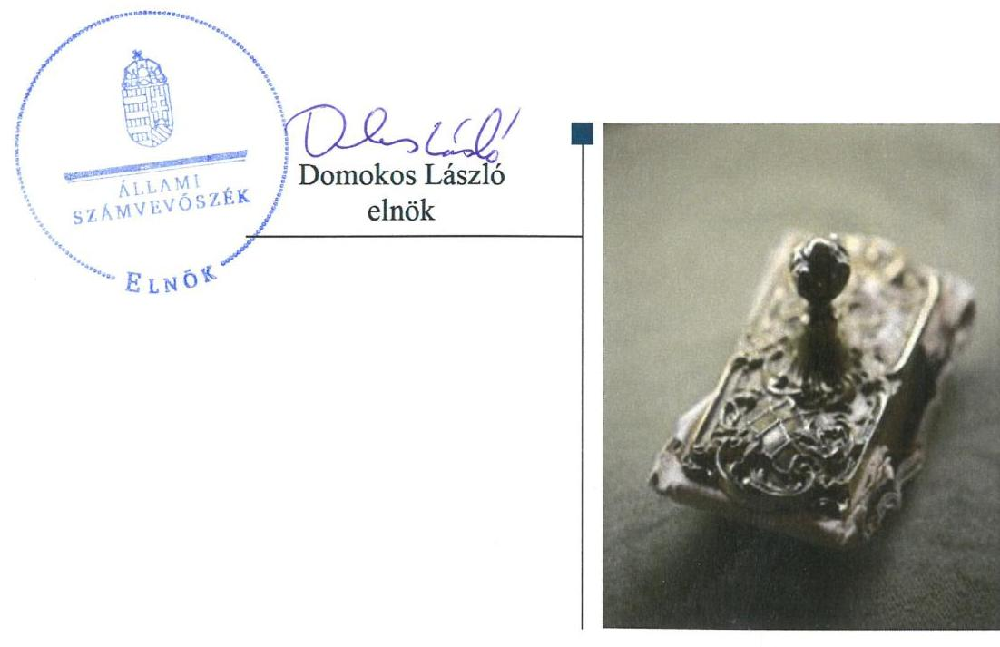

ÁLLAMI
SZÁMVEVŐSZÉK

# Jelentés

## Központi költségvetési szervek ellenőrzése

Batthyány Lajos Mezőgazdasági és Élelmiszeripari Szakgimnázium, Szakközépiskola és Kollégium 2019.

19231
www.asz.hu

---

# Jelentés 

## Központi költségvetési szervek ellenőrzése

Batthyány Lajos Mezőgazdasági és Élelmiszeripari Szakgimnázium, Szakközépiskola és Kollégium 2019. 12. hó 19. nap

---

# AZ ELLENŐRZÉST FELÜGYELTE:

## MAROZSÁN LÁSZLÓNÉ felügyeleti vezető

## AZ ELLENŐRZÉST VEZETTE ÉS A VÉGREHAJTÁSÁÉRT FELELŐS:

### DR. NAGY JUDIT ellenőrzésvezető

### A PROGRAM ÖSSZEÁLLÍTÁSÁÉRT FELELŐS:

### TÓTPÁL SZABOLCS osztályvezető

---

**IKTATÓSZÁM:** EL-2328-001/2019.

**TÉMASZÁM:** 2450

**ELLENŐRZÉS-AZONOSÍTÓ SZÁM:** V079169

---

Jelentéseink az Országgyűlés számítógépes hálózatán és az Interneten a www.asz.hu címen is olvashatóak.

---

# TARTALOMJEGYZÉK 

■ ÖSSZEGZÉS ..... 5
■ AZ ELLENŐRZÉS CÉLJA ..... 6
■ AZ ELLENŐRZÉS TERÜLETE ..... 7
■ AZ ELLENŐRZÉS HÁTTERE, INDOKOLTSÁGA ..... 8
■ A JELENTÉS LÉNYEGES KÉRDÉSKÖREI ..... 9
■ AZ ELLENŐRZÉS HATÓKÖRE ÉS MÓDSZEREI ..... 10
■ MEGÁLLAPÍTÁSOK ..... 12
■ JAVASLATOK ..... 16
■ MELLÉKLETEK ..... 19
I. sz. melléklet: Értelmező szótár ..... 19
■ FÜGGELÉKEK ..... 21
I. sz. függelék a jelentéshez ..... 21
II. sz. függelék: Észrevételek ..... 22
■ RÖVIDÍTÉSEK JEGYZÉKE ..... 27

---

.

---

# ÖSSZEGZÉS 

A Batthyány Lajos Mezőgazdasági és Élelmiszeripari Szakgimnázium, Szakközépiskola és Kollégium működése, pénzügyi és vagyongazdálkodása nem volt szabályszerű. Nem volt biztosított a felelős gazdálkodás, a közpénzek átlátható, szabályszerű felhasználása és a nemzeti vagyonnal történő elszámoltatható gazdálkodás. A korrupcióval szembeni védelmet nem építették ki.

## Az ellenőrzés társadalmi indokoltsága

Magyarország versenyképességének és a magyar gazdaság fejlődésének alapvető feltétele a magyar munkavállalók megfelelő szakmai képzettsége és felkészültsége, amelyben a szakképzési rendszernek döntő szerepe van. A mezőgazdaság vonatkozásában is kiemelten fontos ez, hiszen a magyar mezőgazdaság piaci versenyképességét és eredményességét nagymértékben befolyásolja az agrárszférában dolgozók képzettsége, felkészültsége. A szakképzés legjelentősebb színterei a szakképző iskolák. Az eredményes és célszerű szakképzés alapja és alapvető feltétele a szakképző intézmények közpénzekkel és a közvagyonnal való törvényes, átlátható és a korrupcióval szembeni védelmet biztosító működése és gazdálkodása. Ezért ezen szervezetekkel szemben is alapvető társadalmi igény, hogy a rájuk bízott közpénzekkel, közvagyonnal szabályosan gazdálkodjanak. Emellett a szakképzésben részt vevő pedagógusok, tanulók és a szülők jogos elvárása, hogy a szakképző iskolák működése átlátható és elszámoltatható legyen. Mindezen igényekkel összhangban, a közpénzügyek átláthatóságának előmozdítása, a közvagyon védelme érdekében került sor az agrár szakképző iskolák belső kontrollrendszerének és gazdálkodásának ellenőrzésére.

## Főbb megállapítások, következtetések, javaslatok

A Batthyány Lajos Mezőgazdasági és Élelmiszeripari Szakgimnázium, Szakközépiskola és Kollégium belső kontrollrendszerének kialakítása és működtetése a 2016. évben nem volt szabályszerű, mivel nem rendelkezett szervezeti és működési szabályzattal, pénzkezelési szabályzattal, továbbá nem rendelkeztek a vagyonnyilatkozat-tételi eljárásról. Ezáltal nem teremtették meg a szabályszerű működés és a gazdálkodás kereteit. A belső kontrollrendszer kialakításának hiányában nem biztosították a korrupciómentességnek a feltételeit.

A 2017. évben kontrollkörnyezetét nem szabályszerűen alakította ki, integrált kockázatkezelési rendszerét, információs és kommunikációs rendszerét nem alakította ki, nyomonkövetési rendszerét nem működtette, a kontrolltevékenységet nem szabályszerűen gyakorolta.

A Batthyány Lajos Mezőgazdasági és Élelmiszeripari Szakgimnázium, Szakközépiskola és Kollégium költségvetési beszámolói nem mutattak megbízható és valós összképet a vagyonáról, pénzügyi helyzetéről, mivel a költségvetési beszámolók mérleg tételei leltárral nem voltak alátámasztottak, továbbá a 2016. évben nem szabályszerűen vezetett könyvviteli nyilvántartások alapján készült.

A Batthyány Lajos Mezőgazdasági és Élelmiszeripari Szakgimnázium, Szakközépiskola és Kollégiumban nem tették meg a legalapvetőbb intézkedéseket sem a korrupció megelőzése érdekében, mivel nem szabályozták a vagyonnyilatkozat tételi kötelezettség folyamatát. A teljesítmény mérés követelményeit nem alakították ki, ezáltal a teljesítmény ellenőrzés feltételei nem voltak biztosítottak.

A megállapítások alapján az Állami Számvevőszék a Batthyány Lajos Mezőgazdasági és Élelmiszeripari Szakgimnázium, Szakközépiskola és Kollégium intézményvezetője részére 12 javaslatot fogalmazott meg.

---

# AZ ELLENŐRZÉS CÉLJA 

AZ ELLENŐRZÉS CÉLJA annak megítélése volt, hogy az ellenőrzött intézményre vonatkozó irányító szervi feladatellátás a jogszabályi előírások betartásával történt-e; az intézménynél a belső kontrollrendszer kialakítása és működtetése szabályszerű volt-e, biztosította-e az átlátható, szabályszerű, gazdaságos, hatékony és eredményes gazdálkodás feltételeit; az intézmény pénzügyi és vagyongazdálkodása megfelelt-e a jogszabályi előírásoknak és belső szabályzatainak. Az ellenőrzés keretében az Állami Számvevőszék értékelte az intézmény korrupciós kockázatainak kezelését szolgáló integritás kontrollok kiépítettségét és az integritás szemlélet érvényesülését, a teljesítményellenőrzés feltételeinek kialakítását. Értékelte továbbá, hogy az ellenőrzött megfelel-e annak az Alaptörvényben meghatározott alapvetésnek, hogy Magyarország a kiegyensúlyozott, átlátható és fenntartható költségvetési gazdálkodás elvét érvényesíti. Érvényesült-e a nemzeti vagyon kezelésének és védelmének célja, azaz a szervezet vagyona a közérdeket szolgálta-e a közös szükségletek kielégítése és a természeti erőforrások megóvása, valamint a jövő nemzedékek szükségleteinek figyelembevétele mellett.

---

# **AZ ELLENŐRZÉS TERÜLETE**

## **Batthyány Lajos Mezőgazdasági és Élelmiszeripari Szakgimnázium, Szakközépiskola és Kollégium**

A pápai székhelyű Batthyány Lajos Mezőgazdasági és Élelmiszeripari Szakgimnázium, Szakközépiskola és Kollégium Veszprém megyében található. 2013. augusztus 1-jétől az Intézmény1 irányító szerve és fenntartója a Minisztérium2.

Az Intézmény alapfeladata a szakgimnáziumi és szakközépiskolai nevelés-oktatás, a felnőttoktatás. Az Intézmény tanulói létszáma 437 fő volt 2017. októberében, akik számára mezőgazdaság, élelmiszeripar, vendéglátás-turisztika, környezetvédelem, kereskedelem-marketing, vendéglátás-idegenforgalom szakmacsoportban nyújtottak oktatást és biztosítottak szakképzési lehetőséget.

Az Intézmény gazdasági szervezettel nem rendelkezik, a gazdálkodással összefüggő feladatokat a Szent István Mezőgazdasági és Élelmiszeripari Szakgimnázium és Szakközépiskola látta el.

A foglalkoztatottak létszáma a 2017. évben 73 fő volt.

Az ellenőrzött időszakban az Intézménynél szervezeti, szerkezeti átalakításra nem került sor, az Intézmény vezetője3 az ellenőrzött időszakban nem változott.

Az Intézménynél a 2016. évi összes bevétele 462,3 millió Ft volt, ebből finanszírozási bevételei 357,6 millió Ft összegben teljesültek. 2017. év tekintetében az összes bevétel 466,6 millió Ft volt, melyből a finanszírozási bevételek 377,6 millió Ft összegben teljesültek.

---

# AZ ELLENŐRZÉS HÁTTERE, INDOKOLTSÁGA 

Az államháztartás központi alrendszerének közpénz felhasználása, az intézmények által ellátott közfeladatok sokrétűsége, valamint a feladatellátásához rendelt vagyon nagyságrendje indokolja, hogy az ÁSZ ${ }^{4}$ ellenőrzéseket folytasson a pénzügyi és vagyongazdálkodás területén. Az ÁSZ az ellenőrzései során feltárja a gazdálkodást, a központi alrendszer intézményei átalakulását, átszervezését érintő szabályozások esetleges hiányosságait, a szabályozással nem érintett gazdálkodási területeket, rámutathat a vagyongazdálkodási tevékenység - ezen belül a tulajdonosi joggyakorlás és vagyonkezelés - esetleges szabálytalanságaira, értékeli az állami vagyon nyilvántartására és elszámolására vonatkozó eljárásokat.

Az ellenőrzés a szervezet kockázatértékelése alapján, az egyedi és lényeges jellemzők figyelembevételével, az ellenőrzésre kiválasztott modullal történik. Az integritás- és belső kontroll modul a központi költségvetési szerv működésének irányítottságát, korrupció elleni védettségét értékeli.

A belső kontrollrendszer kialakítása és működtetése nélkül nem valósítható meg a közpénzek, a közvagyon átlátható, szabályos, gazdaságos, hatékony és eredményes felhasználása. A belső kontrollrendszer azt a célt szolgálja, hogy a költségvetési szervek működésük és gazdálkodásuk során a tevékenységeket szabályszerűen hajtsák végre, teljesítsék elszámolási kötelezettségeiket és megvédjék az erőforrásokat a veszteségektől, a károktól és a nem rendeltetésszerű használattól. A belső kontrollrendszer magában foglalja mindazon elveket, eljárásokat és belső szabályzatokat, melyek biztosítják, hogy a költségvetési szerv valamennyi tevékenysége és célja összhangban legyen a szabályszerűséggel, szabályozottsággal, valamint a gazdaságosság, hatékonyság és eredményesség követelményeivel, az eszközökkel és forrásokkal való gazdálkodásban ne kerüljön sor pazarlásra, visszaélésre, rendeltetésellenes felhasználásra. Megfelelő, pontos és naprakész információk álljanak rendelkezésre a költségvetési szerv működésével kapcsolatosan, és a belső kontrollrendszer harmonizációjára, összehangolására vonatkozó jogszabályok végrehajtásra kerüljenek. Az integritás kontrollok kiépítése, erősítése a szervezet korrupciós kockázatainak kezelését szolgálja. A teljesítménykövetelmények meghatározása és működtetése megalapozhatja a központi költségvetési szervnél a teljesítményellenőrzés lefolytatását.

Az egyes ellenőrzések megállapításaival és egy időszak ellenőrzési eredményeinek elemzésével az ÁSZ ráirányíthatja a jogalkotók figyelmét a központi alrendszerben vagy annak egy ágazatában esetlegesen felmerülő pénzügyi, szabályozási feszültségekre. Az elvégzett ellenőrzések során az ÁSZ „jó gyakorlatokat" is azonosíthat, melyeket tanácsadó funkciója keretében szélesebb körben is megismertethet az érintettekkel, ezáltal is hozzájárulva a költségvetési rendszer szabályozott, átlátható, kiegyensúlyozott és fenntartható működéséhez.

---

# A JELENTÉS LÉNYEGES KÉRDÉSKÖREI 

1. Az irányító szerv ellenőrzött költségvetési szervre vonatkozó feladatellátása szabályszerű volt-e?
2. A belső kontrollrendszer kialakítása és működtetése biztosította-e a közpénzekkel és a nemzeti vagyonnal történő átlátható, szabályszerű gazdálkodást?
3. A költségvetési szerv pénzügyi gazdálkodása szabályszerű volt-e?
4. A költségvetési szerv vagyongazdálkodása szabályszerű volt-e?
5. A költségvetési szervnél alakítottak-e ki a teljesítménymérésére alkalmas követelményeket?

---

# AZ ELLENŐRZÉS HATÓKÖRE ÉS MÓDSZEREI 

## Az ellenőrzés típusa

Megfelelőségi ellenőrzés.

## Az ellenőrzött időszak

Az irányító szervi feladatellátás és az ellenőrzött szervezet pénzügyi gazdálkodása tekintetében a 2016. év.

Az intézmény vagyongazdálkodása, integritás és belső kontrollrendszerének értékelése tekintetében a 2016-2017. évek.

## Az ellenőrzés tárgya

Az intézményre vonatkozó irányító szervi feladatok ellátása. Az intézmény belső kontrollrendszerének kialakítása és működtetése, pénzügyi és vagyongazdálkodása, az integritáskontrollok kiépítettsége, az integritás szemlélet érvényesülése, a teljesítményellenőrzés feltételei.

## Az ellenőrzött szervezet

Batthyány Lajos Mezőgazdasági és Élelmiszeripari Szakgimnázium, Szakközépiskola és Kollégium és irányítószerve a Földművelésügyi Minisztérium (jelenleg Agrárminisztérium); valamint a gazdálkodási feladatokat ellátó Szent István Élelmiszeripari Szakgimnázium és Szakközépiskola

## Az ellenőrzés jogalapja

Az ellenőrzés jogszabályi alapját az ÁSZ tv. ${ }^{5}$ 1. § (3) bekezdés, 5. § (2)-(3), (4) bekezdés a) pontja és (6) bekezdése, valamint az Áht. ${ }^{6} 61 . \S$ (2) bekezdésének előírásai képezték.

## Az ellenőrzés módszerei

Az ellenőrzésre a szakmai program szempontjai, az ellenőrzött időszakban hatályos jogszabályok, az ellenőrzés szakmai szabályai, a jelen ellenőrzésre irányadó ÁSZ módszertanok figyelembevételével került sor.

Az ellenőrzési kérdések megválaszolásához szükséges bizonyítékok megszerzése az ellenőrzött szervezetek által rendelkezésre bocsátott dokumentumokra, adatokra alapozva megfigyelés, szemle (szemrevételezés), kérdésfeltevés (információkérés), mintavételezés, valamint elemző eljárás útján történt. Az ellenőrzési bizonyítékként felhasználható adatforrások közé tartoztak az ellenőrzési program részletes szempontjainál felsorolt adatforrások, valamint minden egyéb - az ellenőrzés folyamán feltárt, az ellenőrzés szempontjából információt tartalmazó - dokumentum.

Az ellenőrzés lefolytatásához az ellenőrzött szervezetek tanúsítványok kitöltésével, valamint az ÁSZ által kért dokumentumok megküldésével szolgáltattak adatokat, amelyek valódiságát és teljes körűségét az ellenőrzött szervezetek vezetői által tett teljességi és hitelességi nyilatkozat igazolta. A rendelkezésre bocsátott adatok, információk kontrollja az ellenőrzés keretében történt.

Az Intézmény belső kontrollrendszere egyes pilléreinek kialakítására és működtetésére vonatkozó értékelés a következő volt:
$\longrightarrow$ „szabályszerű", amennyiben az értékelt területen az elért „igen" válaszok százalékban kifejezett, egész számra kerekített aránya legalább $85 \%$ volt,
$\longrightarrow$ „nem szabályszerű", ha nem érte el a 85\%-ot.
Az Intézmény belső kontrollrendszerének összesített értékelése az egyes részterületek esetében kapott megfelelőségi arányok számtani átlaga alapján történt és megegyezett a pillérenként (kontrollterületenként) alkalmazott százalékos értékelésekkel, a következő eltérésekkel: a kontrollrendszer egésze esetében a „szabályszerű" értékelésnek a százalékos értéken felül további feltétele volt, hogy egyik kontrollterület sem kaphat „nem szabályszerű" értékelést.

Az ÁSZ statisztikai módszereken alapuló mintavételt alkalmazott. A kiadások és a bevételek ellenőrzésére a 2016-2017 év vonatkozásában került sor. A kiadások (külső személyi juttatások, felhalmozási kiadások, dologi kiadások) és bevételek (értékesítésből és bérbeadásból származó bevételek) esetében az ellenőrzés azokra a legnagyobb értékű tételekre - a lényeges sokaságra - terjedt ki, melyek összértéke eléri a teljes sokaság összértékének 50\%-át. A 2017. évi kiadások elszámolásának szabályszerűségét a lényeges sokaságból véletlen mintavételi eljárással kiválasztott tételek alapján ellenőrizte az
 ÁSZ. A 2016. évi bevételek lényeges sokasága és a 2016–2017. évi beruházások, felújítások végrehajtásának szabályszerűsége ellenőrzése esetében tételes ellenőrzésre került sor. A 2017. évi feladatellátást szolgáló állami vagyontárgyak használatának és év végi értékelésének szabályszerűsége megítélése véletlen mintavétellel kiválasztott tételek alapján történt. A mintavétellel ellenőrzött területek esetében minden egyes tétel vonatkozásában a használat, elszámolás és értékelés szabályszerűségére vonatkozó kérdéseket tett fel az ÁSZ. Szabályszerűnek értékelt egy ellenőrzött területet, amennyiben 95%-os bizonyossággal az ellenőrzött sokaságban az átlagos hibaarány legfeljebb 10%, nem szabályszerűnek, amennyiben 10%-nál magasabb arányt képviselt.

Az ellenőrzés ideje alatt az ellenőrzött szervezettel történő kapcsolattartást az ÁSZ az SZMSZ ${ }^{7}$-ének vonatkozó előírásai alapján biztosította.

---

# MEGÁLLAPÍTÁSOK 

## 1. Az irányító szerv ellenőrzött költségvetési szervre vonatkozó feladatellátása szabályszerű volt-e?

Összegző megállapítás A Minisztérium Intézményre vonatkozó feladatellátása szabályszerű volt.

A Minisztérium jóváhagyta az Intézmény elemi költségvetését, költségvetési beszámolóját a jogszabályi előírásoknak megfelelően.

A Minisztérium az Áht.-ben foglalt hatáskörét gyakorolva beszámoltatta az Intézmény vezetőjét az éves szakmai feladatellátásról, valamint az éves gazdálkodásról.

## 2. A belső kontrollrendszer kialakítása és működtetése biztosította-e a közpénzekkel és a nemzeti vagyonnal történő átlátható, szabályszerű gazdálkodást?

## Összegző megállapítás Az Intézménynél a belső kontrollrendszer kialakítása és működtetése nem volt szabályszerű a 2016–2017. években.

A BELSŐ KONTROLLRENDSZER KIALAKÍTÁSA ÉS MŰKÖDTETÉSE NEM VOLT SZABÁLYSZERŰ A 2016. ÉVBEN az Intézménynél, mivel az Intézmény nem rendelkezett szervezeti és működési szabályzattal az Áht. 10. § (5) bekezdése ellenére, nem alakított ki a vagyonnyilatkozat-tételi kötelezettséghez kapcsolódó belső szabályozást a Vnytv. ${ }^{8}$ 11. § (6) bekezdésében foglaltak ellenére, valamint a Számv. tv. 14. § (5) bekezdés d) pontjában előírtak ellenére nem rendelkezett pénzkezelési szabályzattal.

A szervezeti és működési szabályzat és a pénzkezelési szabályzat hiánya miatt az Intézmény kontrollkörnyezete nem biztosította az Intézmény kontrolltevékenységéhez, a kockázatkezelési feladatok teljesítéséhez szükséges felelősségi, hatásköri viszonyok kereteit. A szervezeti szintek meghatározása nélkül nem volt kialakítható az Intézménynél a megbízható információs és kommunikációs, valamint nyomon követési rendszer.

A KONTROLLKÖRNYEZET KIALAKÍTÁSA A 2017. ÉVBEN az Intézménynél nem szabályszerűen történt, mert:
$\longrightarrow$ az Intézmény az Áht. 10. § (5) bekezdése ellenére nem rendelkezett szervezeti és működési szabályzattal;

---

$\longrightarrow$ az Intézmény vezetője a Vnytv. 11. § (6) bekezdésében foglaltak ellenére a vagyonnyilatkozat átadására, nyilvántartására, a vagyonnyilatkozatban foglalt személyes adatok védelmére vonatkozó további szabályokat szabályzatban nem állapított meg;
— nem rendelkezett az Intézmény a Számv. tv. ${ }^{9}$ 161. § (2) bekezdésének és az Áhsz. ${ }^{10} 51 . \S$ (2) bekezdésének előírása ellenére az ellenőrzött időszakban hatályos jogszabályi előírásoknak megfelelő tartalmú számlarenddel, mert a számlarend nem tartalmazta minden alkalmazásra kijelölt számla számjelét és megnevezését az Áhsz. 51. § (1) bekezdésében előírt, az Áhsz. 16. számú mellékletében rögzített egységes számlakeret alapján;
— az Ávr. ${ }^{11} 13 . \S$ (2) bekezdésének e) pontjában előírtak ellenére a reprezentációs kiadások felosztását, azok teljesítésének és elszámolásának szabályait nem határozták meg.
INTEGRÁLT KOCKÁZATKEZELÉSI RENDSZERT az Intézmény vezetője a Bkr. ${ }^{12} 3$. § b) pontjában előírtak ellenére nem alakított ki a 2017. évben, mivel az Intézmény vezetője a Bkr. 6. § (4) bekezdésének előírása ellenére nem szabályozta a szervezeti integritást sértő események kezelésének eljárásrendjét, valamint az integrált kockázatkezelés eljárásrendjét.
A KONTROLLTEVÉKENYSÉGEK GYAKORLÁSA a 2017. évben nem szabályszerűen történt az Intézménynél, mivel:
— az Intézménynél a dologi kiadások elszámolása során az Áht. 37. § (1) bekezdése ellenére nem történtek meg a kötelezettségvállalások a 2017. évben;
— a dologi kiadások pénzügyi teljesítésére az Áht. 38. § (1) bekezdése ellenére teljesítésigazolások nélkül került sor;
— a 2017. évben az Intézmény nem vezetett az Ávr. 60. § (3) bekezdés szerinti nyilvántartást a kötelezettségvállaló és teljesítést igazoló jogkörök gyakorlóiról.

# AZ INTÉZMÉNY INFORMÁCIÓS ÉS KOMMUNIKÁCIÓS RENDSZERÉT az Intézmény vezetője a Bkr. 3. § d) pontja és a 9. § (1) bekezdésében foglaltak ellenére nem alakította ki, mivel nem szabályozta a közérdekű adatok megismerésére irányuló kérelmek teljesítésének rendjét, továbbá a kötelezően közzéteendő adatok nyilvánosságra hozatalának rendjét, az Ávr. 13. § (2) bekezdésének h) pontjában előírt rendelkezések ellenére.

## AZ INTÉZMÉNY NYOMONKÖVETÉSI RENDSZERÉT az Intézmény vezetője nem működtette, mivel a Bkr. 10. § előírása ellenére nem gondoskodott az operatív tevékenységek keretében megvalósuló folyamatos és eseti nyomon követésről.

Az Intézmény vezetője az Áht. 70. § (1) bekezdésében előírtak ellenére nem gondoskodott az Intézményre vonatkozó belső ellenőrzés Bkr. 15 § (4) bekezdésében előírtak szerinti kialakításáról és működtetéséről a 2017. évben, mivel a belső ellenőrzési feladatokat nem a gazdasági szervezet feladatait ellátó költségvetési szerv, vagy az irányító szerv által kijelölt

---

szerv végezte, hanem az Intézmény vezetője által megbízott belső ellenőrzési szervezet látta el, az irányító szerv vezetőjének írásos jóváhagyása nélkül.

# A JOGSZABÁLYOK ÁLTAL ELŐÍRT INTEGRITÁS

KONTROLLOK kiépítettségi szintje az Intézménynél nem támogatta a korrupciós kockázatok kezelését. Az Intézmény nem végzett kockázatelemzést. Az Intézmény nem működtetett az integritást erősítő, kötelezően és nem kötelezően előírt kontrollokat.

Az Intézmény vezetője a vezetői nyilatkozatában 2016–2017. évekre vonatkozóan a Bkr.-ben foglaltak szerint szabályszerűnek értékelte az Intézmény belső kontrollrendszere minőségét. Az ÁSZ ellenőrzés megállapításai a 2016–2017. években kiadott vezetői nyilatkozatokat nem támasztották alá.

## 3. A költségvetési szerv pénzügyi gazdálkodása szabályszerű volt-e?

## Összegző megállapítás

Az Intézmény pénzügyi gazdálkodása a 2016. évben nem volt szabályszerű.

Az Intézménynél a 2016. évben a bevételek és a kiadások elszámolása nem volt szabályszerű, mert:
$\longrightarrow$ az Intézmény a Számv. tv. 14. § (5) bekezdés d) pontjában előírtak ellenére nem rendelkezett pénzkezelési szabályzattal;
$\longrightarrow$ az Intézmény külső személyi juttatások (egyéb külső személyi juttatások) ellenőrizhetőségét nem biztosította;
$\longrightarrow$ az Áhsz. 39. § (1) bekezdése ellenére a vagyontárgyak bérbeadásából származó bevétel esetén a 2016. évben az Intézmény nem vezetett nyilvántartást;
$\longrightarrow$ az Intézménynél az Áhsz. 39. § (1) bekezdésben előírtak ellenére a kötelezettségvállalásokról és más fizetési kötelezettségekről nem vezették az Áhsz. 14. melléklet II. 4. pontjában előírt tartalommal a nyilvántartást.

## 4. A költségvetési szerv vagyongazdálkodása szabályszerű volt-e?

## Összegző megállapítás

Az Intézmény vagyongazdálkodása a 2016–2017. években nem volt szabályszerű.

A vagyongazdálkodás nem volt szabályszerű, mert:
$\longrightarrow$ az Áhsz. 5. § (1) bekezdésében, 22. § (1)–(2) bekezdéseiben, valamint a Számv. tv. 69. § (1) bekezdésében előírtak ellenére az Intézmény a mérleg tételeit 2016–2017. évekre vonatkozóan leltárral nem támasztotta alá;
$\longrightarrow$ az Intézménynél a beruházások, felújítások elszámolás során a pénzügyi teljesítésre az Áht. 38. § (1) bekezdése ellenére a 2016. évben teljesítésigazolás nélkül került sor;

---

- a 2017. évi beruházások végrehajtása során a jogi személlyel, jogi személyiséggel nem rendelkező szervezettel kötött visszterhes szerződések nem tartalmazták a szervezet képviselőjének nyilatkozatát arra vonatkozóan, hogy átlátható szervezetnek minősülnek, az Ávr. 50. § (1a) bekezdésének előírásai ellenére. Továbbá a nemzeti vagyonelemek 2016. évi bérbeadása során nem tartották be az Nvtv. ${ }^{13} 11 . \S$ (10) bekezdés előírásait, mivel az Intézmény nem rendelkezett a szerződő félnek az Nvtv. 3. § (2) bekezdésben előírt nyilatkozatával arról, hogy átlátható szervezeteknek minősülnek.

# 5. A költségvetési szervnél alakítottak-e ki a teljesítménymérésére alkalmas követelményeket? 

## Összegző megállapítás

Az Intézménynél nem alakították ki a teljesítménymérésére alkalmas követelményeket

A teljesítménymérésre alkalmas követelményeket, ehhez kapcsolódóan mérőszámokat, indikátorokat az Intézmény vezetője nem alakított ki, ezáltal a teljesítmény mérésének feltételei nem állnak fenn.

---

# JAVASLATOK 

Az ÁSZ tv. 33. § (1) bekezdésében foglaltak értelmében az ellenőrzött szervezet vezetője köteles a jelentésben foglalt megállapításokhoz kapcsolódó intézkedési tervet összeállítani és azt a jelentés kézhezvételétől számított 30 napon belül az ÁSZ részére megküldeni. Amennyiben az ellenőrzött szervezet vezetője nem küldi meg határidőben az intézkedési tervet, vagy továbbra sem elfogadható intézkedési tervet küld, az Állami Számvevőszék elnöke az ÁSZ tv. 33. § (3) bekezdés a) és b) pontjaiban foglaltakat érvényesítheti.

## Batthyány Lajos Mezőgazdasági és Élelmiszeripari Szakgimnázium, Szakközépiskola és Kollégium igazgatója részére

1. Intézkedjen a jogszabályi előírások szerint a szervezeti és működési szabályzat elkészítéséről.
(2. sz. megállapítás 3. bekezdés 1. francia bekezdés alapján)
2. Intézkedjen a vagyonnyilatkozat átadására, nyilvántartására, a vagyonnyilatkozatban foglalt személyes adatok védelmére vonatkozó további szabályok megállapításáról.
(2. sz. megállapítás 3. bekezdés 2. francia bekezdése alapján)
3. Intézkedjen az Ávr. előírása szerint a reprezentációs kiadások felosztása, azok teljesítésének és elszámolásának szabályairól rendelkező belső szabályzat elkészítéséről.
(2. sz. megállapítás 3. bekezdés 4. francia bekezdése alapján)
4. Intézkedjen a jogszabályi előírások szerinti számlarend elkészítéséről.
(2. sz. megállapítás 3. bekezdés 3. francia bekezdése alapján)
5. Intézkedjen a Bkr. előírásának megfelelően az integrált kockázatkezelési rendszer kialakításáról és működtetéséről.
(2. sz. megállapítás 4. bekezdés alapján)
6. Intézkedjen, hogy a kötelezettségvállalásra és a teljesítésigazolásra az Áht. előírásainak megfelelően kerüljön sor.
(2. sz. megállapítás 5. bekezdés 1–2. francia bekezdése alapján)

---

7. Intézkedjen az Ávr. előírása szerinti nyilvántartás vezetéséről a kötelezettségvállaló és a teljesítést igazoló jogkörre jogosultakról.
(2. sz. megállapítás 5. bekezdés 3. francia bekezdése alapján)
8. Intézkedjen a jogszabályi előírásoknak megfelelő információs és kommunikációs rendszer kialakítása és működtetése érdekében az Ávr. szerinti közérdekű adatok megismerésére irányuló kérelmek intézésének és a kötelezően közzéteendő adatok nyilvánosságra hozatala rendjének belső szabályzatban való rendezéséről.
(2. sz. megállapítás 6. bekezdés alapján)
9. Intézkedjen a Bkr. előírásai szerint az operatív tevékenységek keretében megvalósuló folyamatos és eseti nyomon követésről.
(2. sz. megállapítás 7. bekezdése alapján)
10. Intézkedjen a belső ellenőrzés Bkr. előírásainak megfelelő kialakításáról és működtetéséről.
(2. sz. megállapítás 8. bekezdése alapján)
11. Intézkedjen az éves költségvetési beszámoló elkészítéséhez, a mérlegtételeinek alátámasztásához a jogszabályi előírásnak megfelelő leltár összeállításáról.
(4. sz. megállapítás 1. bekezdés 1. francia bekezdése alapján)
12. Gondoskodjon arról, hogy jogi személlyel, jogi személyiséggel nem rendelkező szervezettel kötött szerződések az Ávr. előírása szerint tartalmazzák a szerződő fél képviselőjének nyilatkozatát arról, hogy átlátható szervezetnek minősül.
(4. sz. megállapítás 1. bekezdés 3. francia bekezdés 1. mondata alapján)

---

.

---

# MELLÉKLETEK 

- I. SZ. MELLÉKLET: ÉRTELMEZŐ SZÓTÁR
állami vagyon
állami vagyon kezelője /vagyonkezelő
átalakítás
belső ellenőrzés
belső kontrollrendszer
belső kontrollrendszer területei
ellenőrzési nyomvonal
információs és kommunikációs rendszer
integritás

Állami vagyonnak minősül:
a) az állam tulajdonában lévő dolog, valamint a dolog módjára hasznosítható természeti erő,
b) az a) pont hatálya alá nem tartozó mindazon vagyon, amely vonatkozásában törvény az állam kizárólagos tulajdonjogát nevesíti,
c) az állam tulajdonában lévő tagsági jogviszonyt megtestesítő értékpapír, illetve az államot megillető egyéb társasági részesedés,
d) az államot megillető olyan immateriális, vagyoni értékkel rendelkező jogosultság, amelyet jogszabály vagyoni értékű jogként nevesít. (Forrás: Vtv. ${ }^{14}$ 1. § (2) bekezdése)
Az állami vagyont az MNV Zrt ${ }^{15}$. maga kezeli, vagy szerződés - így különösen bérlet, haszonbérlet, megbízás - alapján központi költségvetési szervnek, természetes vagy jogi személynek, vagy jogi személyiséggel nem rendelkező gazdálkodó szervezetnek hasznosításra átengedi." Az állami vagyonra vonatkozóan az MNV Zrt. kizárólag az Nvtv.-ben meghatározott személyekkel köthet vagyonkezelési szerződést. (Forrás: Vtv. 27. § (1) bekezdése, hatályos 2012. január 1.-jétől)

A költségvetési szerv általános jogutódlással
 történő megszüntetése átalakítással történhet. Az átalakítás lehet egyesítés vagy különválás. Az egyesítés lehet beolvadás vagy összeolvadás. (2015. január 1-jétől Áht. 11. § (2) bekezdés)
Független, tárgyilagos bizonyosságot adó és tanácsadó tevékenység, amelynek célja, hogy az ellenőrzött szervezet működését fejlessze és eredményességét növelje, az ellenőrzött szervezet céljai elérése érdekében rendszerszemléletű megközelítéssel és módszeresen értékeli, illetve fejleszti az ellenőrzött szervezet irányítási és belső kontrollrendszerének hatékonyságát. (Forrás: Bkr. 2. § b) pontja)
A belső kontrollrendszer a kockázatok kezelése és tárgyilagos bizonyosság megszerzése érdekében kialakított folyamatrendszer, amely azt a célt szolgálja, hogy a működés és gazdálkodás során a tevékenységeket szabályszerűen, gazdaságosan, hatékonyan, eredményesen hajtsák végre, az elszámolási kötelezettségeket teljesítsék, megvédjék az erőforrásokat a veszteségektől, károktól és nem rendeltetésszerű használattól. (Forrás: Áht. 69. § (1) bekezdése)
A kontrollkörnyezet, az integrált kockázatkezelési rendszer, a kontrolltevékenységek, az információs és kommunikációs rendszer, valamint a nyomon követési (monitoring) rendszer. (Forrás: Bkr. 3. §-a)
Az ellenőrzési nyomvonal a költségvetési szerv működési folyamatainak szöveges, táblázatokkal vagy folyamatábrákkal szemléltetett leírása, amely tartalmazza különösen a felelősségi és információs szinteket és kapcsolatokat, irányítási és ellenőrzési folyamatokat, lehetővé téve azok nyomon követését és utólagos ellenőrzését. (Forrás: Bkr. 6. § (3) bekezdés)
A költségvetési szerv vezetője által kialakított és működtetett olyan rendszer, mely biztosítja, hogy a megfelelő információk a megfelelő időben eljutnak az illetékes szervezethez, szervezeti egységhez, illetve személyhez. (Forrás: Bkr. 9. § (1) bekezdés)
Az integritás - egyik gyakran használt jelentése szerint - az elvek, értékek, cselekvések, módszerek, intézkedések konzisztenciáját jelenti, vagyis olyan magatartásmódot, amely meghatározott értékeknek megfelel. Integritás-irányítási rendszer bevezetése a szervezetben a szervezethez rendelt közfeladatok integritás szempontú ellátását, az érték alapú működéssel (integritással) összefüggő szervezeti követelmények következetes érvényesítését jelenti. (Forrás: Nemzetgazdasági Minisztérium: Államháztartási Belső Kontroll Standardok és Gyakorlati Útmutató 1.6. Etikai értékek és integritás 46. oldal, 2017. szeptember)

---

integrált kockázatkezelési rendszer
kockázat
kockázatkezelési rendszer
kontrollkörnyezet
kontrolltevékenységek
nyomon követési rendszer (monitoring)
vagyongazdálkodás

Olyan folyamatalapú kockázatkezelési rendszer, amely a szervezet minden tevékenységére kiterjed, egységes módszertan és eljárások alkalmazásával, a szervezet célkitűzéseinek és értékeinek figyelembevételével biztosítja a szervezet kockázatainak teljes körű azonosítását, azok meghatározott kritériumok szerinti értékelését, valamint a kockázatok kezelésére vonatkozó intézkedési terv elkészítését és az abban foglaltak nyomon követését. (Forrás: Bkr. 2. § m) pontja, 2016. október 1-jétől)

A költségvetési szerv tekintetében az Áht.-ban meghatározott irányítási hatáskört gyakorló szerv. (Forrás: Áht. 1. § 9. pontja)
A kockázat annak a valószínűségét jelenti, hogy egy vagy több esemény vagy intézkedés nem kívánt módon befolyásolja a rendszer működését, céljainak megvalósulását. (Forrás: Javaslatok a korrupciós kockázatok kezelésére - Kockázatkezelési és ellenőrzési módszertan 35. oldal, ÁSZ)
Olyan irányítási eszközök és módszerek összessége, melynek elemei a szervezeti célok elérését veszélyeztető tényezők (kockázatok) azonosítása, elemzése, csoportosítása, nyomon követése, valamint szükség esetén a kockázati kitettség mérséklése. (Forrás: Bkr. 2. § m) pontja, 2016. szeptember 30-ig)

A költségvetési szerv vezetője által kialakított olyan elvek, eljárások, belső szabályzatok összessége, amelyben világos a szervezeti struktúra, a folyamatok átláthatók, egyértelműek a felelősségi, hatásköri viszonyok és feladatok, meghatározottak, ismertek és elfogadottak az etikai elvárások a szervezet minden szintjén, átlátható a humánerőforrás-kezelés. (Forrás: Bkr. 6. § (1) bekezdés)
A költségvetési szerv vezetője által a szervezeten belül kialakított (kontroll) tevékenységek, melyek biztosítják a kockázatok kezelését, hozzájárulnak a szervezet céljainak eléréséhez és erősítik a szervezet integritását. (Forrás: Bkr. 8. § (1) bekezdés)
A költségvetési szerv vezetője köteles kialakítani a szervezet tevékenységének a célok megvalósításának nyomon követését biztosító rendszert, amely az operatív tevékenységek keretében megvalósuló folyamatos és eseti nyomon követésből, valamint az operatív tevékenységektől függetlenül működő belső ellenőrzésből áll. 2016. október 1-jétől: A költségvetési szerv vezetője köteles kialakítani a szervezet tevékenységének, a célok megvalósításának nyomon követését biztosító rendszert, mely az operatív tevékenységek keretében megvalósuló folyamatos és eseti nyomon követésből, valamint az operatív tevékenységektől függetlenül működő belső ellenőrzésből állhat. (Forrás: Bkr. 10. §)
A nemzeti vagyongazdálkodás feladata a nemzeti vagyon rendeltetésének megfelelő, az állam, az önkormányzat mindenkori teherbíró képességéhez igazodó, elsődlegesen a közfeladatok ellátásához és a mindenkori társadalmi szükségletek kielégítéséhez szükséges, egységes elveken alapuló, átlátható, hatékony és költségtakarékos működtetése, értékének megőrzése, állagának védelme, értéknövelő használata, hasznosítása, gyarapítása, továbbá az állam vagy a helyi önkormányzat feladatának ellátása szempontjából feleslegessé váló vagyontárgyak elidegenítése. (Forrás: Nvtv. 7. § (2) bekezdése)

---

# FÜGGELÉKEK 

- I. SZ. FÜGGELÉK A JELENTÉSHEZ

Az Állami Számvevőszék az ellenőrzések során feltárt tényekhez kapcsolódó további körülmények tisztázására eszközrendszerrel nem rendelkezik. Amennyiben az ellenőrzésen túlmutatóan indokoltnak látszik az ellenőrzés során feltárt körülmények további vizsgálata, az Állami Számvevőszék törvényi felhatalmazás alapján az ellenőrzés által feltárt körülményeket továbbítja a hatáskörrel rendelkező szervnek a szükséges intézkedések megtétele, eljárások lefolytatása érdekében.

1. Az Intézménynél a 2017. évben a dologi kiadások esetében az Áht. 37. § (1) bekezdése ellenére 4.993.121,-Ft kifizetése történt meg kötelezettségvállalás nélkül.
2. Az Intézménynél az Áht. 38. § (1) bekezdése ellenére 2016. évben 1.270.000,-Ft összegben a felhalmozási kiadásoknál, 2017. évben 5.773.772,-Ft összegben a dologi kiadásoknál a teljesítésigazolást nem a kötelezettségvállaló vagy az általa írásban kijelölt személy végezte, valamint 563.347,-Ft összegben teljesítésigazolás nélkül történt a kifizetés.
Az 1.-2. pontban rögzített, gazdálkodási jogkörben megfogalmazott szabálytalanságok miatt nem igazolt, hogy a kiadások valóban az Intézmény érdekében merültek fel, annak feladatellátását szolgálták, valamint hogy a kifizetésekhez valós teljesítések kapcsolódtak.
3. Az Intézmény 2016.-2017. évi költségvetési beszámolója mérleg tételeinek alátámasztásához nem készült leltár. Ezzel megsértették az Áhsz. 5. § (1) bekezdésében, 22. § (1)-(2) bekezdéseiben, valamint a Számv. tv. 69. § (1) bekezdésében foglaltakat. Leltár hiányában nem igazolt, hogy a 2016.-2017. évi beszámolóban szereplő tételek a valóságban is megtalálhatóak.

A fenti esetek konkrét körülményeinek felderítésére az Ügyészség rendelkezik hatáskörrel.

---

A jelentéstervezetet a Számvevőszék 15 napos észrevételezésre megküldte az ellenőrzött szervezetek vezetőinek az ÁSZ tv. 29. § (1) bekezdése előírásának megfelelően.

A Batthyány Lajos Mezőgazdasági és Élelmiszeripari Szakgimnázium, Szakközépiskola és Kollégium igazgatója a jelentéstervezet megállapításaira írásban észrevételt tett. Az Agrárminisztériumot vezető miniszter és a Szent István Mezőgazdasági és Élelmiszeripari Szakgimnázium és Szakközépiskola igazgatója a jelentéstervezet megállapításaira nem tettek észrevételt.
Az ÁSZ tv. 29. § (3) bekezdésével összhangban az ÁSZ a Függelékben feltünteti az ellenőrzés megállapításaival kapcsolatban tett, figyelembe nem vett észrevételeket, és megindokolja, hogy azokat miért nem fogadta el.

[^0]
[^0]:    * 29. § (1) Az Állami Számvevőszék az ellenőrzési megállapításait megküldi az ellenőrzött szervezet vezetőjének vagy az általa megbízott személynek, és annak, akinek személyes felelősségét állapította meg.
    (2) Az ellenőrzött szervezet vezetője és a felelősként megjelölt személy az ellenőrzés megállapításaira tizenöt napon belül írásban észrevételt tehet.
    (3) Az Állami Számvevőszék az észrevételre a beérkezésétől számított harminc napon belül írásban válaszol. A figyelembe nem vett észrevételeket köteles a jelentésben feltüntetni, és megindokolni, hogy azokat miért nem fogadta el.

---

A „Központi költségvetési szervek ellenőrzése - Batthyány Lajos Mezőgazdasági és Élelmiszeripari Szakgimnázium, Szakközépiskola és Kollégium" címmel készített számvevőszéki jelentéstervezet megállapításaival kapcsolatban az igazgató által 2019. október 29-én tett (az Állami Számvevőszékhez 2019. november 4-én érkezett) el nem fogadott észrevételek és azok kezelésének indokolása.

1. A 2. számú megállapítás 1. bekezdésére, a 3. bekezdés 1. francia bekezdésére és a kapcsolódó 1. számú javaslatra, valamint a 3. számú megállapítás 1. bekezdés 1. francia bekezdésére tett észrevétel:

Az igazgató észrevételében leírta, hogy a 2016. és 2017. évi szervezeti és működési szabályzatot (SZMSZ) és a hatályos Pénzkezelési szabályzatot az ellenőrzés során teljességi és hitelességi nyilatkozattal igazoltan feltöltötték. Az Intézmény 2017-től önálló pénzkezelési szabályzattal rendelkezik.

Az észrevételt nem fogadjuk el. Az Intézmény 2016-2017 évre megküldött SZMSZ-e nem minősül érvényes dokumentumnak, mivel nem tartalmazza a kiadmányozó aláírását. 2017. augusztus 15-éig az Intézményre a gazdasági feladatokat ellátó szervezet pénz- és értékkezelési szabályzata volt kiterjesztve, amelyet azonban az azt kiadó Szent István Mezőgazdasági és Élelmiszeripari Szakképző Iskola igazgatója nem írt alá, így az nem tekinthető érvényes szabályzatnak, továbbá, az észrevételében hivatkozott megismerési nyilatkozat nem felel meg az Áhsz. 50. § (1) bekezdésében foglaltaknak a szabályzat elkészítésének felelősségét érintően. A fentiek miatt az észrevétel alapján a jelentéstervezet módosítása nem indokolt.
2. A 2. számú megállapítás 3. bekezdés 3. francia bekezdésére és a kapcsolódó 4. számú javaslatra tett észrevétel:

Az igazgató észrevételében leírta, hogy a számlarendet időközben aktualizálták.
Az igazgató észrevétele megerősítette a jelentéstervezet számlarendre tett megállapítását, az észrevétel alapján a jelentéstervezet módosítása nem indokolt.
3. A 2. számú megállapítás 5. bekezdés 1-2. francia bekezdéseire és a kapcsolódó 6. számú javaslatra tett észrevétel:

Az igazgató észrevételében leírta, hogy a 2017. évi dologi kiadásokhoz kapcsolódó kötelezettség-vállalásokat az EcoStat integrált ügyviteli rendszer által generált excel táblázatban feltöltötték az ÁSZ adatbekérési rendszerébe. A papír alapú megrendelésekkel, szerződésekkel is rendelkeznek. Kérte, hogy az ÁSZ a kontrolltevékenységekkel kapcsolatos problémás tételeket tételesen, beazonosítható módon küldje meg az Iskola részére.

Az igazgató által hivatkozott, az ÁSZ rendszerbe feltöltött excel formátumú kötelezettségvállalási nyilvántartás nem azonos az egyes dologi kiadási tételekhez kapcsolódó kötelezettségvállalás dokumentumával. Észrevételében nem vitatta, hogy a 2017. évi kötelezettségvállalások dokumentumai nem álltak az ellenőrzés rendelkezésére. Az ÁSZ a megállapításait az Intézmény által az ellenőrzés részére az adatbekérés során átadott mintatételek dokumentumainak értékelése alapján tette meg, így azok az Iskola rendelkezésére állnak. A jelentéstervezetben tett megállapításokat a mintatételekhez megküldött bizonylatok, illetve azok hiánya, vagy az érintett kontrolltevékenység szabálytalan gyakorlása támasztja alá. A fentiek alapján észrevételét nem fogadjuk el, a jelentéstervezet módosítása nem indokolt.
4. A 2. számú megállapítás 5. bekezdés 3. francia bekezdésére és a kapcsolódó 7. számú javaslatra tett észrevétel:

Az igazgató észrevétele szerint az adatbekérés során az V. Integritás és belső kontroll modul - 2017 1. Kontrollkörnyezet 15. pontjához feltöltötték a 2017-ben hatályos, a kötelezettségvállaló-, valamint teljesítésigazoló jogkört gyakorlók nevét, beosztását, aláírás-mintáit tartalmazó nyilvántartásokat.

Az igazgató észrevételében hivatkozott nyilvántartás a kötelezettségvállalásra és teljesítés igazolására jogosult személyekről nem felelt meg az Ávr. 60. § (3) bekezdésében előírtaknak, mivel olyan személyek is szerepeltek benne, akik kijelölés hiányában a jogkör gyakorlására nem voltak jogosultak. A nem megfelelően vezetett nyilvántartást az ÁSZ nem tekintette az Ávr. 60. § (3) bekezdése szerinti nyilvántartásnak. Az észrevételt nem fogadjuk el, a jelentéstervezet módosítása nem indokolt.
5. A 2. számú megállapítás 8. bekezdésére és a kapcsolódó 10. számú javaslatra tett észrevétel:

---

Az igazgató észrevételében leírta, hogy az iskolák között tisztázatlan munkamegosztás miatt saját maga, igazgatóként bízott meg külső ellenőrt az Intézmény belső ellenőrzési feladatainak ellátásával az átlátható, jogszabályoknak megfelelő működés biztosítása érdekében.

Az igazgató észrevétele, amely szerint 2017-ben a belső ellenőrzést az általa megbízott külső ellenőr végezte - az ellenőrzés részére az adatbekérés során átadott szerződés
 szerint azonban csak 2017. szeptember-december időszakban –, megerősíti a jelentéstervezet azon megállapítását, hogy a 2017. évben nem a Bkr. 15. § (4) bekezdésében előírtaknak megfelelően gondoskodott az Intézmény belső ellenőrzéséről. A Bkr. 15. § (4) bekezdésében foglalt előírás szerint gazdasági szervezettel nem rendelkező költségvetési szervek belső ellenőrzését a 2017. évtől a gazdasági szervezetének feladatait ellátó költségvetési szerv, vagy az irányító szerv által kijelölt szerv végzi, amitől eltérni csak a fejezetet irányító szerv vezetőjének írásos jóváhagyásával lehet. Az adatszolgáltatás során az Intézmény nem bocsátott az ÁSZ rendelkezésére arra vonatkozó dokumentumot, hogy az igazgató által megbízott belső ellenőrt 2017. szeptember 1-jétől az irányítószerv jelölte ki a feladat ellátására, illetve a szerződés aláírásához az irányítószerv jóváhagyása mellett került sor. A fentiek alapján az észrevételt nem fogadjuk el, a jelentéstervezet módosítása nem indokolt.

# 6. A 3. számú megállapítás 1. bekezdés 2. francia bekezdésére tett észrevétel: 

Az igazgató észrevételében leírta, hogy véleménye szerint a külső személyi juttatások ellenőrizhetősége biztosított, a külső személyi juttatások analitikáját az adatbekérés során feltöltötték. Az ellenőrzéséhez szükséges dokumentumok rendelkezésükre állnak, amelyek a számfejtést alátámasztják.

Az igazgató észrevételében hivatkozott és az ellenőrzés rendelkezésére bocsátott külső személyi juttatások kimutatása a 2017. évre vonatkozott. Az adatbekérés során az igazgató 2018. november 8-án nyilatkozatot adott, amely szerint a 2016. évi külső személyi juttatásokat illetően az Intézmény csak elektronikus nyilvántartással rendelkezik. Ugyanakkor az ÁSZ részére a 2016. évre vonatkozóan nem küldtek a külső személyi juttatások között elszámolt megbízási díjakról kimutatást, így az ellenőrzéshez szükséges mintatételek kiválasztását, az ellenőrizhetőséget nem biztosította. Az észrevételt nem fogadjuk el, a jelentéstervezet 2016. évet érintő megállapításának módosítása nem indokolt.

## 7. A 3. számú megállapítás 1. bekezdés 3. francia bekezdésére tett észrevétel:

Az igazgató észrevételében leírta, hogy a jelentéstervezetben kifogásolt vagyontárgyak bérbeadásából származó bevételek nyilvántartása az EcoStat integrált ügyviteli rendszerben történik. Az adatszolgáltatás során az Intézmény által a 2017. évre vonatkozóan feltöltött nyilvántartása 2016-ra is generálható a rendszerből, amelynek 481-641. sorai tartalmazzák az eszköz-bérbeadás bevételeit.

Az Intézmény által az ellenőrzés rendelkezésére bocsátott analitika a 2016. évre vonatkozó vagyontárgyak bérbeadásából származó bevételekről mindösszesen 34 tételt tartalmazott, szemben az észrevételében említett és az ÁSZ részére át nem adott 160 tételből álló analitikával. Az ellenőrzés feltárta, hogy az ellenőrzés rendelkezésére bocsátott nyilvántartásban szereplő bevétel összege nem egyezett meg az éves beszámoló és a főkönyvi kivonat szerinti, bérbeadásból származó bevételek összegével. Az Állami Számvevőszék ellenőrzési megállapításait az adatbekérés során a törvényi határidőben rendelkezésre bocsátott dokumentumok értékelése alapján teszi. Az igazgató 2018. október 18-án kelt teljességi és hitelességi nyilatkozata szerint az ellenőrzés részére átadott dokumentumok a bekért adatokra teljes körű információt tartalmaznak. A fentiek alapján az észrevételt nem fogadjuk el, a jelentéstervezet megállapítása helytálló, módosítása nem indokolt.

## 8. A 3. számú megállapítás 1. bekezdés 4. francia bekezdésére tett észrevétel:

Az igazgató észrevételében leírta, hogy a kötelezettségvállalások nyilvántartása az EcoStat integrált ügyviteli rendszerben történik, amelyből bármikor visszakereshetők az adatok. A kötelezettségvállalásokról szóló szerződések papír alapon az Iskolában megtalálhatóak.

Az észrevételt nem fogadjuk el. Az igazgató észrevételében nem cáfolta az ellenőrzés részére átadott kötelezettségvállalási nyilvántartások tartalmára tett megállapítást, amely szerint az nem felelt meg az Áhsz. 14. melléklet II. 4. pontja szerinti előírásnak. Az észrevétel alapján a jelentéstervezet módosítása nem indokolt.

---

# 9. A 4. számú megállapítás 1. bekezdés 1. francia bekezdésére és a kapcsolódó 11. számú javaslatra tett észrevétel: 

Az igazgató észrevételében leírta, hogy nem ért egyet teljes mértékben a 2016-2017. évekre a mérleget alátámasztó leltár hiányára tett megállapítással. 2016. október 26-án leltározási utasítást adtak ki, de a Pápa Város Önkormányzatával a vagyonkezelői szerződés aláírására csak 2017. február 28-án került sor, ezért a leltározási folyamat elhúzódott. A kapcsolódó dokumentumokat (leltárutasítás, jegyzőkönyv, a leltár folytatásának elrendelése, kiértékelés, összesítő kimutatás) teljességi és hitelességi nyilatkozatban feltüntetve feltöltötték az Állami Számvevőszék részére az adatbekérés során.

Az ÁSZ az EL-1149-003/2018. iktatószámú adatbekérő levél 2. melléklet I. 8.1. pontjában a 2016. évi vagyongazdálkodáshoz kapcsolódóan a leltározás összesített kiértékeléséről készített dokumentumot, leltározási jegyzőkönyvet, a mérlegsorokat alátámasztó leltár-egyeztetések dokumentumait, a VI. 2. pontjaiban a vagyontárgyak 2017. év végi értékelésének, leltározásának dokumentumait kérte megküldeni. Az igazgató észrevételében hivatkozott, az ÁSZ-nak teljességi és hitelességi nyilatkozattal átadott dokumentumok nem igazolják, hogy az Intézménynél a 2016 és 2017 évekre vonatkozóan összeállították az Áhsz. 22. § (1) bekezdése és a Számv. tv. 69. § (1) bekezdésében előírt, a beszámoló mérleg tételeit alátámasztó leltárt. A beszámolóba bekerült összegeket alátámasztó részletes leltárt az Intézmény az ellenőrzés részére nem adott át. Az igazgató 2018. október 18-ai teljességi nyilatkozata alapján az ellenőrzés rendelkezésére bocsátott, valamint az észrevételében hivatkozott leltárösszesítő kimutatás (összesen 1 oldal) 2017. december 31-ei fordulónapra vonatkozóan az Intézmény nemzeti vagyonba tartozó befektetett eszközeit tartalmazza főkönyvi számlánként nyitó, forgalmi és záró értékekkel, a 2017. évi beszámoló valamennyi mérlegtételének alátámasztásához nem bocsátott leltározási dokumentumot az ÁSZ rendelkezésére. A fentiek alapján az észrevételét nem fogadjuk el, az észrevétel alapján a jelentéstervezet módosítása nem indokolt.

## 10. A 4. számú megállapítás 1. bekezdés 2. francia bekezdésére tett észrevétel:

Az igazgató észrevételében kérte megadni a 2016. évi beruházások, felújítások esetében a teljesítésigazolást nem tartalmazó dokumentumokat.

A kiadások szabályszerűségének ellenőrzését a 2019. március 13-ai, EL-1149-037/2019. iktatószámú adatbekérő levelünk 2. mellékletében kért, az Intézmény által az ÁSZ rendelkezésére bocsátott dokumentumok alapján végeztük. A jelentéstervezetben tett megállapításokat az Intézmény által megküldött és így az Iskolánál rendelkezésre álló bizonylatok támasztják alá. Az észrevétel alapján a jelentéstervezet módosítása nem indokolt.
11. A 4. számú megállapítás 1. bekezdés 3. francia bekezdésére és a kapcsolódó 12. számú javaslatra tett észrevétel:

Az igazgató észrevételében tájékoztat arról, hogy az átláthatósági nyilatkozatokat időközben már beépítették a szerződéseikbe.

Az igazgató észrevétele megerősíti az ellenőrzés során tett megállapítást, a jelentéstervezet módosítása nem indokolt.

## 12. Egyéb tájékoztatás a javaslatokban foglaltakat érintően:

Az igazgató észrevételében jelezte, hogy a jelentéstervezet javaslataiban foglaltakat megismerte, az 1., 4., 6., 7., 10., 11. és 12. pontokban felsorolt hiánypótlások megtörténtek, a többi pedig folyamatban van.

Az igazgató tájékoztatása nem minősül észrevételnek.

## 13. A Függelékben foglaltakat érintő tájékoztatás kérés:

Az igazgató kérte, hogy a jelentéstervezet Függeléke 1-2. pontjaiban szereplő kiadásokról tételes, a számlák beazonosítását lehetővé tevő listát küldjön meg az ÁSZ.

Az igazgató kérése érdemi észrevételt nem tartalmaz. A kiadások szabályszerűségének ellenőrzését a 2019. március 13-ai, EL-1149-037/2019. iktatószámú adatbekérő levelünk 2. mellékletében kért és az Iskola által az ÁSZ rendelkezésére bocsátott dokumentumok alapján végeztük. A jelentéstervezetben tett megállapításokhoz, a kért mintatételekhez az Intézmény által megküldött bizonylatokat értékeltük, a megállapításokat az Iskola által küldött dokumentumok támasztják alá, így azok az Intézmény rendelkezésére állnak.

---

.

---

# RÖVIDÍTÉSEK JEGYZÉKE 

${ }^{1}$ Intézmény
${ }^{2}$ Minisztérium
${ }^{3}$ Intézmény vezetője
${ }^{4}$ ÁSZ
${ }^{5}$ ÁSZ tv.
${ }^{6}$ Áht.
${ }^{7}$ ÁSZ SZMSZ
${ }^{8}$ Vnytv.
${ }^{9}$ Számv. tv.
${ }^{10}$ Áhsz.
${ }^{11}$ Ávr.
${ }^{12}$ Bkr.
${ }^{13}$ Nvtv.
${ }^{14}$ Vtv.
${ }^{15}$ MNV Zrt.

Batthyány Lajos Mezőgazdasági és Élelmiszeripari Szakgimnázium, Szakközépiskola és Kollégium
Agrárminisztérium, 2018. május 17-ig Földművelésügyi Minisztérium
Batthyány Lajos Mezőgazdasági és Élelmiszeripari Szakgimnázium, Szakközépiskola és Kollégium, mint költségvetési intézmény vezetője
Állami Számvevőszék
2011. évi LXVI. törvény az Állami Számvevőszékről (hatályos: 2011. július 1-jétől) 2011. évi CXCV. törvény az államháztartásról (hatályos: 2011. december 31-jétől) Állami Számvevőszék Szervezeti és Működési Szabályzata
2007. évi CLII. törvény egyes vagyonnyilatkozat-tételi kötelezettségekről (hatályos: 2007. december 8-tól)
2000. évi C. törvény a számvitelről (hatályos: 2001. január 1-jétől) 4/2013. (I. 11.) Korm. rendelet az államháztartás számviteléről 368/2011. (XII. 31.) Korm. rendelet az államháztartásról szóló törvény végrehajtásáról
370/2011. (XII. 31.) Korm. rendelet a költségvetési szervek belső kontrollrendszeréről és belső ellenőrzésről
2011. évi CXCVI. törvény a nemzeti vagyonról (hatályos: 2012. január 1-jétől) 2007. évi CVI. törvény az állami vagyonról (hatályos: 2007. szeptember 25-étől) Magyar Nemzeti Vagyonkezelő Zrt.

---

# ÁLLAMI SZÁMVEVŐSZÉK 

1052 Budapest, Apáczai Csere János utca 10.
Levélcím: 1364 Budapest 4. Pf. 54
Telefon: +36 14849100 Telefax: +36 14849200
www.asz.hu
