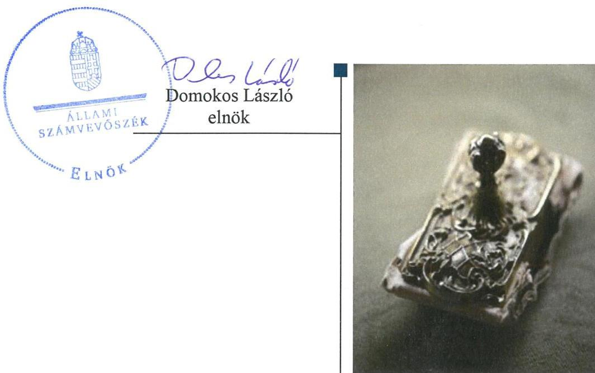
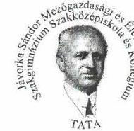
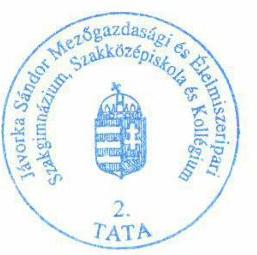
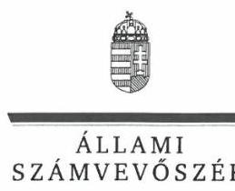
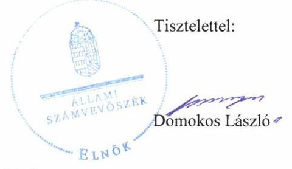
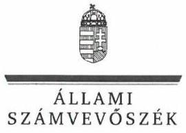
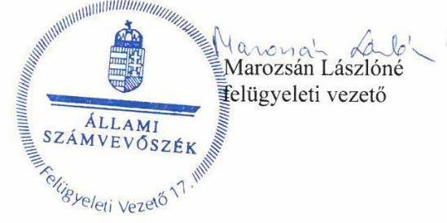

# Jelentés 

## Központi költségvetési szervek ellenőrzése

Jávorka Sándor Mezőgazdasági és Élelmiszeripari Szakgimnázium, Szakközépiskola és Kollégium 2019.

19232
www.asz.hu

---

# Jelentés 

## Központi költségvetési szervek ellenőrzése

Jávorka Sándor Mezőgazdasági és Élelmiszeripari Szakgimnázium, Szakközépiskola és Kollégium
2019. 12. hó 19. nap

---

# AZ ELLENŐRZÉST FELÜGYELTE:

## MAROZSÁN LÁSZLÓNÉ felügyeleti vezető

## AZ ELLENŐRZÉST VEZETTE ÉS A VÉGREHAJTÁSÁÉRT FELELŐS:

## NEMESVÁRI-HORTHY ESZTER ellenőrzésvezető

## A PROGRAM ÖSSZEÁLLÍTÁSÁÉRT FELELŐS:

## TÓTPÁL SZABOLCS osztályvezető

IKTATÓSZÁM: EL-2320-001/2019.

TÉMASZÁM: 2450

ELLENŐRZÉS-AZONOSÍTÓ SZÁM: V079157

Jelentéseink az Országgyűlés számítógépes hálózatán és az Interneten a www.asz.hu címen is olvashatóak.

---

# TARTALOMJEGYZÉK 

■ ÖSSZEGZÉS ..... 5
■ AZ ELLENŐRZÉS CÉLJA ..... 6
■ AZ ELLENŐRZÉS TERÜLETE ..... 7
■ AZ ELLENŐRZÉS HÁTTERE, INDOKOLTSÁGA ..... 8
■ A JELENTÉS LÉNYEGES KÉRDÉSKÖREI ..... 9
■ AZ ELLENŐRZÉS HATÓKÖRE ÉS MÓDSZEREI ..... 10
■ MEGÁLLAPÍTÁSOK ..... 12
■ JAVASLATOK ..... 16
■ MELLÉKLETEK ..... 19
I. sz. melléklet: Értelmező szótár ..... 19
■ FÜGGELÉKEK ..... 21
I. sz. függelék a jelentéshez ..... 21
II. sz. függelék: Észrevételek ..... 22
■ RÖVIDÍTÉSEK JEGYZÉKE ..... 27

---

.

---

# ÖSSZEGZÉS 

A Jávorka Sándor Mezőgazdasági és Élelmiszeripari Szakgimnázium, Szakközépiskola és Kollégium működése, pénzügyi és vagyongazdálkodása nem volt szabályszerű. Nem volt biztosított a felelős gazdálkodás, a közpénzek átláthatósága, szabályszerűsége. Nem volt védett a korrupcióval szemben.

## Az ellenőrzés társadalmi indokoltsága

Magyarország versenyképességének és a magyar gazdaság fejlődésének alapvető feltétele a magyar munkavállalók megfelelő szakmai képzettsége és felkészültsége, amelyben a szakképzési rendszernek döntő szerepe van. A mezőgazdaság vonatkozásában is kiemelten fontos ez, hiszen a magyar mezőgazdaság piaci versenyképességét és eredményességét nagymértékben befolyásolja az agrárszférában dolgozók képzettsége, felkészültsége. A szakképzés legjelentősebb színterei a szakképző iskolák. Az eredményes és célszerű szakképzés alapja és alapvető feltétele a szakképző intézmények közpénzekkel és a közvagyonnal való törvényes, átlátható és a korrupcióval szembeni védelmet biztosító működése és gazdálkodása. Ezért ezen szervezetekkel szemben is alapvető társadalmi igény, hogy a rájuk bízott közpénzekkel, közvagyonnal szabályosan gazdálkodjanak. Emellett a szakképzésben részt vevő pedagógusok, tanulók és a szülők jogos elvárása, hogy a szakképző iskolák működése átlátható és elszámoltatható legyen. Mindezen igényekkel összhangban, a közpénzügyek átláthatóságának előmozdítása, a közvagyon védelme érdekében került sor az agrárszakképző iskolák belső kontrollrendszerének és gazdálkodásának ellenőrzésére.

## Főbb megállapítások, következtetések, javaslatok

A Jávorka Sándor Mezőgazdasági és Élelmiszeripari Szakgimnázium, Szakközépiskola és Kollégium belső kontrollrendszere 2016. évben nem volt szabályszerű, mert nem rendelkezett szervezeti és működési szabályzattal.

A 2017. évben a Jávorka Sándor Mezőgazdasági és Élelmiszeripari Szakgimnázium, Szakközépiskola és Kollégium kontrollkörnyezetének kialakítása nem volt szabályszerű, integrált kockázatkezelési rendszerét az eljárásra vonatkozó szabályzat hiányában nem alakították ki. Az információs és kommunikációs rendszer, valamint monitoring rendszer nem működött. A belső ellenőrzés kialakítása során a jogszabályi változást nem vették figyelembe. A fenti szabálytalanságok miatt a belső kontrollrendszer kialakítása és működtetése a 2017. évben sem volt szabályszerű.

A Jávorka Sándor Mezőgazdasági és Élelmiszeripari Szakgimnázium, Szakközépiskola és Kollégium költségvetési beszámolói nem mutattak megbízható és valós összképet a vagyonáról, pénzügyi helyzetéről, mivel a költségvetési beszámoló mérlegtételei leltárral nem voltak alátámasztottak, a tárgyi eszközök üzembe helyezése nem volt dokumentált.

A korrupciós kockázatok kezelésére nem építették ki a jogszabályok által előírt integritási kontrollokat, kockázatelemzést nem végeztek. A Jávorka Sándor Mezőgazdasági és Élelmiszeripari Szakgimnázium, Szakközépiskola és Kollégium igazgatója a folyamatok teljesítményének mérésére nem alakított ki követelményeket, ezáltal a teljesítmény mérés feltételei nem voltak biztosítottak.

Az Állami Számvevőszék a jelentésében foglalt megállapítások alapján a Jávorka Sándor Mezőgazdasági és Élelmiszeripari Szakgimnázium, Szakközépiskola és Kollégium igazgatója részére 13 javaslatot fogalmazott meg.

---

# AZ ELLENŐRZÉS CÉLJA

**AZ ELLENŐRZÉS CÉLJA** annak megítélése volt, hogy a Jávorka Sándor Mezőgazdasági és Élelmiszeripari Szakgimnázium, Szakközépiskola és Kollégiumra vonatkozó irányító szervi feladatellátás a jogszabályi előírások betartásával történt-e, a Jávorka Sándor Mezőgazdasági és Élelmiszeripari Szakgimnázium, Szakközépiskola és Kollégiumnál a belső kontrollrendszer kialakítása és működtetése szabályszerű volt-e, biztosította-e az átlátható, szabályszerű, gazdaságos, hatékony és eredményes gazdálkodás feltételeit; a pénzügyi és vagyongazdálkodása megfelelte-e a jogszabályi előírásoknak és belső szabályzatainak. Az ellenőrzés célja volt annak megállapítása is, hogy a Jávorka Sándor Mezőgazdasági és Élelmiszeripari Szakgimnázium, Szakközépiskola és Kollégium megfelelte-e annak az Alaptörvényben meghatározott alapvetésnek, hogy Magyarország a kiegyensúlyozott, átlátható és fenntartható költségvetési gazdálkodás elvét érvényesíti; érvényesült-e a nemzeti vagyon kezelésének és védelmének célja, azaz a vagyona a közérdeket szolgálta-e a közös szükségletek kielégítése és a természeti erőforrások megóvása, valamint a jövő nemzedékek szükségleteinek figyelembevétele mellett. Az ellenőrzés keretében az Állami Számvevőszék értékelte a Jávorka Sándor Mezőgazdasági és Élelmiszeripari Szakgimnázium, Szakközépiskola és Kollégiumnál a korrupciós kockázatok kezelését szolgáló integritás kontrollok kiépítettségét és az integritás szemlélet érvényesülését, továbbá a teljesítményellenőrzés feltételeinek kialakítását.

---

# AZ ELLENŐRZÉS TERÜLETE 

## Jávorka Sándor Mezőgazdasági és Élelmiszeripari Szakgimnázium, Szakközépiskola és Kollégium

A tatai székhelyű Intézmény ${ }^{1}$ jogi személy, irányító szerve és fenntartója 2013. augusztus 1-jétől a Minisztérium². Alaptevékenysége szakgimnáziumi, szakközépiskolai nevelés, oktatás, kollégiumi ellátás, felnőttoktatás. Az Intézmény mezőgazdaság, élelmiszeripar, környezetvédelem-vízgazdálkodás, környezetvédelem, kertészet és parképítés, vízügy, mezőgazdasági gépész és agrár gépész szakmacsoportokban nyújtott képzési lehetőséget. A tanulói létszám a 2016/2017. tanévben 310 fő volt.

Az Áht. ${ }^{3}$ szerinti átalakítására az ellenőrzött időszakban nem került sor.

Az Intézmény gazdasági szervezettel nem rendelkezik, gazdasági feladatait a Minisztérium döntése alapján a Szent István Mezőgazdasági és Élelmiszeripari Szakgimnázium és Szakközépiskola látja el.

Az ellenőrzött időszakban az Igazgató ${ }^{4}$ személyében nem történt változás.

Az Intézmény teljesített bevétele a 2016. évben 414,0 millió Ft, 2017. évben 530,4 millió Ft volt. Ebből a finanszírozási bevétel 2016. évben 275,5 millió Ft-ot, 2017. évben 303,2 millió Ft-ot tett ki. A költségvetési kiadásai a 2016. évi 411,6 millió Ft-ról, 12,2\%-os növekedéssel 2017. évben 461,9 millió Ft-ra emelkedtek.

---

# AZ ELLENŐRZÉS HÁTTERE, INDOKOLTSÁGA 

Az államháztartás központi alrendszerének közpénz felhasználása, az intézmények által ellátott közfeladatok sokrétűsége, valamint a feladatellátásához rendelt vagyon nagyságrendje indokolja, hogy az ÁSZ ${ }^{5}$ ellenőrzéseket folytasson a pénzügyi és vagyongazdálkodás területén. Az ÁSZ az ellenőrzései során feltárja a gazdálkodást, a központi alrendszer intézményei átalakulását, átszervezését érintő szabályozások esetleges hiányosságait, a szabályozással nem érintett gazdálkodási területeket, rámutathat a vagyongazdálkodási tevékenység - ezen belül a tulajdonosi joggyakorlás és vagyonkezelés - esetleges szabálytalanságaira, értékeli az állami vagyon nyilvántartására és elszámolására vonatkozó eljárásokat.

Az ellenőrzés várhatóan hozzájárul a központi intézmények pénzügyi helyzetének pontosabb megítéléséhez.

Az ellenőrzések megállapításai támogathatják az ellenőrzött szervezetek szabályszerű gazdálkodását, javaslataival elősegítheti az Alaptörvényben megfogalmazott alapvetések érvényesülését a mindennapi életben a szervezetek szintjén. A központi költségvetés rendszerében zajló folyamatok holisztikus elemzései, a kockázatok folyamatos figyelemmel kísérésének módszerével, az így kiválasztott szervezetek célzott, hatékony ellenőrzéseivel az ÁSZ betölti a legfőbb gazdasági ellenőrző szerv küldetését.

A belső kontrollrendszer kialakítása és működtetése nélkül nem valósítható meg a közpénzek, a közvagyon átlátható, szabályos, gazdaságos, hatékony és eredményes felhasználása. A belső kontrollrendszer azt a célt szolgálja, hogy a költségvetési szervek működésük és gazdálkodásuk során a tevékenységeket szabályszerűen hajtsák végre, teljesítsék elszámolási kötelezettségeiket és megvédjék az erőforrásokat a veszteségektől, a károktól és a nem rendeltetésszerű használattól. A belső kontrollrendszer magában foglalja mindazon elveket, eljárásokat és belső szabályzatokat, melyek biztosítják, hogy a költségvetési szerv valamennyi tevékenysége és célja összhangban legyen a szabályszerűséggel, szabályozottsággal, valamint a gazdaságosság, hatékonyság és eredményesség követelményeivel, az eszközökkel és forrásokkal való gazdálkodásban ne kerüljön sor pazarlásra, visszaélésre, rendeltetésellenes felhasználásra. Megfelelő, pontos és naprakész információk álljanak rendelkezésre a költségvetési szerv működésével kapcsolatosan, és a belső kontrollrendszer harmonizációjára, összehangolására vonatkozó jogszabályok végrehajtásra kerüljenek. Az integritás kontrollok kiépítése, erősítése a szervezet korrupciós kockázatainak kezelését szolgálja. A teljesítménykövetelmények meghatározása és működtetése megalapozhatja a központi költségvetési szervnél a teljesítményellenőrzés lefolytatását.

Az egyes ellenőrzések megállapításaival és egy időszak ellenőrzési eredményeinek elemzésével az ÁSZ ráirányíthatja a jogalkotók figyelmét a központi alrendszerben vagy annak egy ágazatában esetlegesen felmerülő pénzügyi, szabályozási feszültségekre. Az elvégzett ellenőrzések során az ÁSZ „jó gyakorlatokat" is azonosíthat, melyeket tanácsadó funkciója keretében szélesebb körben is megismertethet az érintettekkel, ezáltal is hozzájárulva a költségvetési rendszer szabályozott, átlátható, kiegyensúlyozott és fenntartható működéséhez.

---

# A JELENTÉS LÉNYEGES KÉRDÉSKÖREI 

1. Szabályszerű volt-e az ellenőrzött központi költségvetési szervre vonatkozó irányító szervi feladatellátás?
2. A belső kontrollrendszer kialakítása és működtetése szabályszerű volt-e, biztosította-e a közpénzekkel és a nemzeti vagyonnal történő szabályszerű és átlátható gazdálkodást?
3. A központi költségvetési szerv pénzügyi gazdálkodása szabályszerű volt-e?
4. A központi költségvetési szerv vagyongazdálkodása szabályszerű volt-e?
5. A központi költségvetési szervnél alakítottak-e ki a teljesítmény mérésére vonatkozó követelményeket?

---

# AZ ELLENŐRZÉS HATÓKÖRE ÉS MÓDSZEREI 

## Az ellenőrzés típusa

Megfelelőségi ellenőrzés.

## Az ellenőrzött időszak

2016-2017. évek.

## Az ellenőrzés tárgya

A Jávorka Sándor Mezőgazdasági és Élelmiszeripari Szakgimnázium, Szakközépiskola és Kollégiumra vonatkozó irányító szervi feladatok ellátása a 2016. évben.

A Jávorka Sándor Mezőgazdasági és Élelmiszeripari Szakgimnázium, Szakközépiskola és Kollégium belső kontrollrendszerének a kialakítása és működtetése, valamint vagyongazdálkodása tekintetében 2016-2017. évek, a pénzügyi gazdálkodás tekintetében a 2016. év, az integritáskontrollok kiépítettsége és a teljesítményellenőrzés feltételei a 2017. évben.

## Az ellenőrzött szervezet

Jávorka Sándor Mezőgazdasági és Élelmiszeripari Szakgimnázium, Szakközépiskola és Kollégium, a gazdasági szervezet feladatait ellátó Szent István Mezőgazdasági és Élelmiszeripari Szakgimnázium és Szakközépiskola, valamint az irányító szervi feladatellátás tekintetében a Földművelésügyi Minisztérium (2018. május 18-tól Agrárminisztérium).

## Az ellenőrzés jogalapja

Az ellenőrzés jogszabályi alapját az ÁSZ tv. ${ }^{6}$ 1. § (3) bekezdése, 5. § (2)(3) bekezdései, a (4) bekezdés a) pontja és (6) bekezdése, valamint az Áht. 61. § (2) bekezdésének előírásai képezték.

## Az ellenőrzés módszerei

Az ellenőrzésre a szakmai program szempontjai, az ellenőrzött időszakban hatályos jogszabályok, az ellenőrzés szakmai szabályai, a jelen ellenőrzésre irányadó ÁSZ módszertanok figyelembevételével került sor.

---

Az ÁSZ az ellenőrzés ideje alatt az ellenőrzött szervezetekkel az ÁSZ SZMSZ ${ }^{2}$-ének vonatkozó előírásai alapján biztosította a kapcsolattartást. Az ellenőrzési kérdések megválaszolásához szükséges bizonyítékok megszerzése az ellenőrzött szervezetek által rendelkezésre bocsátott dokumentumokra, adatokra alapozva megfigyelés, szemle (szemrevételezés), kérdésfeltevés (információkérés), mintavételezés, valamint elemző eljárás útján történt. Az ellenőrzési bizonyítékként felhasználható adatforrások közé tartoztak egyrészt a szakmai program részletes szempontjainál felsorolt adatforrások, másrészt minden egyéb - az ellenőrzés folyamán feltárt, az ellenőrzés szempontjából információt tartalmazó - dokumentum.

Az ellenőrzés lefolytatásához az ellenőrzöttek az ÁSZ által kért dokumentumok megküldésével szolgáltattak adatokat, amelyek valódiságát és teljes körűségét az ellenőrzött szervezet vezetője által tett teljességi és hitelességi nyilatkozat igazolta. Az így rendelkezésre bocsátott adatok, információk kontrollja az ellenőrzés keretében történt.

Az Intézmény belső kontrollrendszere egyes pilléreinek kialakítására és működtetésére vonatkozó értékelés „szabályszerű", amennyiben az értékelt területen az elért „igen" válaszok százalékban kifejezett, egész számra kerekített aránya legalább 85\%, „nem szabályszerű", ha nem éri el a 85\%ot. Az Intézmény belső kontrollrendszerének összesített értékelése az egyes részterületek esetében kapott megfelelőségi arányok számtani átlaga alapján történt és megegyezik a pillérenként (kontrollterületenként) alkalmazott százalékos értékelésekkel, a következő eltérésekkel: a kontrollrendszer egésze esetében
 a „szabályszerű” értékelésnek a százalékos értéken felül további feltétele, hogy egyik kontrollterület sem kaphat „nem szabályszerű” értékelést.

Az ÁSZ statisztikai módszereken alapuló mintavételt alkalmazott.
A 2016. évi felhalmozási kiadások és bevételek (értékesítésből és bérbeadásból származó bevételek) esetében az ellenőrzés azokra a legnagyobb értékű tételekre - a lényeges sokaságra - terjedt ki, melyek összértéke eléri a teljes sokaság összértékének 50%-át. A lényeges sokaságokat tételesen ellenőrizte az ÁSZ.

A 2017. évi beruházások, felújítások végrehajtása szabályszerűségének esetében a teljes sokaság tételes ellenőrzésére került sor.

A 2017. évi feladatellátást szolgáló állami vagyontárgyak év végi értékelésének szabályszerűségét a teljes sokaságból véletlen mintavétellel kiválasztott tételek alapján ellenőrizte az ÁSZ.

A mintavétellel ellenőrzött területek esetében minden egyes tétel vonatkozásában az értékelés szabályszerűségére vonatkozó kérdéseket tett fel az ÁSZ. Szabályszerűnek értékelte egy ellenőrzött területet, amennyiben 95%-os bizonyossággal az ellenőrzött sokaságban az átlagos hibaarány legfeljebb 10%, nem szabályszerűnek, amennyiben 10%-nál magasabb arányt képviselt.

---

# 1. Szabályszerű volt-e az ellenőrzött központi költségvetési szervre vonatkozó irányító szervi feladatellátás? 

Összegző megállapítás Az Intézményre vonatkozó irányító szervi feladatellátás szabályszerű volt.

Az Irányító szerv ${ }^{8}$ az Ávr. ${ }^{9}$ előírásai szerint meghatározta az általános és kötelezően érvényesítendő tervezési követelményeket, előfeltételeket, módszertant, előírásokat, az Áht. és az Áhsz. ${ }^{10}$ előírásai alapján jóváhagyta az Intézmény elemi költségvetését és éves költségvetési beszámolóját. Az Áht. előírásai alapján az Igazgatót beszámoltatta az Intézmény gazdálkodásáról és szakmai feladatellátásáról.

Munkáltatói jogait az Irányító szerv szabályszerűen gyakorolta. Az Igazgató rendelkezett a jogszabályi előírások szerint az igazgatói feladatok ellátására a Miniszter ${ }^{11}$ által adott megbízással.

## 2. A belső kontrollrendszer kialakítása és működtetése szabályszerű volt-e, biztosította-e a közpénzekkel és a nemzeti vagyonnal történő szabályszerű és átlátható gazdálkodást?

## Összegző megállapítás

A belső kontrollrendszer kialakítása és működtetése nem volt szabályszerű 2016-2017. években.

A BELSŐ KONTROLLRENDSZER KIALAKÍTÁSA ÉS MŰKÖDTETÉSE 2016. ÉVBEN nem volt szabályszerű, mivel az Intézmény - az Áht. 10. § (5) bekezdése ellenére - 2016. augusztus 14-ig nem rendelkezett szervezeti és működési szabályzattal.

A KONTROLLKÖRNYEZET kialakítása 2017. évben nem volt szabályszerű.

Az Igazgató a Vnytv. ${ }^{12}$ 11. § (6) bekezdése előírása ellenére a vagyonnyilatkozatban foglalt személyes adatok védelmére vonatkozó szabályokat belső szabályzatban nem rögzítette.

Az Igazgató a Számviteli politikában ${ }^{13}$ - a Számv. tv. ${ }^{14}$ 14. § (4) bekezdése előírása ellenére - nem rögzítette azokat az Intézményre jellemző szabályokat, előírásokat, módszereket, amelyekkel meghatározza, hogy az alkalmazott gyakorlatot milyen okok miatt kell megváltoztatni. Az Igazgató a Számviteli politikában - az Áhsz. 50. § (7) bekezdése ellenére - nem rögzítette az általános költségek, valamint az általános kiadások és bevételek tevékenységekre történő felosztásának módját, a felosztáshoz alkalmazott mutatókat, vetítési alapokat.

---

Az Igazgató - az Ávr. 13. § (2) bekezdés h) pontjában foglalt előírás ellenére - belső szabályzatban nem szabályozta a közérdekű adatok megismerésére irányuló kérelmek intézésének, továbbá a kötelezően közzéteendő adatok nyilvánosságra hozatalának rendjét.

Az Igazgató - a Bkr. ${ }^{15}$ 6. § (4) bekezdésében előírtak ellenére - nem szabályozta a szervezeti integritást sértő események kezelésének eljárásrendjét.

Az Intézmény rendelkezett az Áht.-ban, és az Ávr.-ben foglalt előírások szerinti SZMSZ ${ }^{16}$-el.

# AZ INTEGRÁLT KOCKÁZATKEZELÉSI RENDSZERT az Igazgató a Bkr. 3. § (b) pontja előírása ellenére nem alakította ki 2017. évben. Az Igazgató a Bkr. 6. § (4) bekezdésében előírtak ellenére nem szabályozta az integrált kockázatkezelés eljárásrendjét. 

## A KONTROLLTEVÉKENYSÉGEK GYAKORLÁSA

2017. évben nem volt szabályszerű. Az Intézménynél a gazdálkodási jogkör gyakorlására jogosult személyekről és aláírás-mintájukról - az Ávr. 60. § (3) bekezdésében előírtak ellenére - vezetett nyilvántartás nem volt naprakész, mert nem tartalmazta minden jogkörgyakorlásra felhatalmazott személy aláírásmintáját. Az Intézménynél a dologi kiadásokról - az Áhsz. 39. § (1) bekezdése előírása ellenére - részletező nyilvántartást nem vezettek. Nem végezték el az Áhsz. 53. § (1) és (4) bekezdése előírása ellenére szabályszerűen az év végi zárlati munkák során a szükséges egyeztetéseket sem, tekintettel a részletező nyilvántartás és a főkönyvi kivonat közötti egyezőség hiányára.

## AZ INFORMÁCIÓS ÉS KOMMUNIKÁCIÓS RENDSZERT az Igazgató 2017. évben a Bkr. 3. § (d) pontja ellenére nem működtette, mivel nem biztosította a Bkr. 9. (1) bekezdésében előírtak ellenére, hogy a megfelelő információk a megfelelő időben eljussanak az illetékes szervezethez, szervezeti egységhez, illetve személyhez. Az Igazgató az időközi költségvetési jelentésekre és az időközi mérlegjelentésekre vonatkozó adatszolgáltatási kötelezettségét az Ávr. 169. § (2) és 170. § (2) bekezdése előírásai ellenére a Kincstár ${ }^{17}$ által működtetett elektronikus adatszolgáltatási rendszerbe nem teljesítette. Az Igazgató a Kincstár felé a tartozásállományra vonatkozó adatszolgáltatási kötelezettségét - az Ávr. 167/M. § (1) bekezdése és az 5. melléklet 4. pontjában foglalt előírás ellenére - február és szeptember hónapra nem teljesítette.

A MONITORING RENDSZERT nem működtette a 2017. évben az Igazgató, mert - a Bkr. 10. § előírása ellenére - nem gondoskodott az operatív tevékenységek keretében megvalósított folyamatos és eseti nyomon követésről.

A BELSŐ ELLENŐRZÉS kialakításáról és megfelelő működtetéséről az Igazgató a 2017. évben az Áht. 70. § (1) bekezdésében előírtak ellenére nem gondoskodott, figyelemmel a Bkr. 15. § (4) bekezdésében előírtakra, mivel belső ellenőrzési feladat ellátásáról nem gondoskodott a gazdasági szervezet feladatait ellátó költségvetési szerv, vagy az Irányító

---

szerv által kijelölt szerv útján, illetve ettől való eltérésre nem rendelkezetett az Irányító szerv vezetőjének írásos jóváhagyásával.

Az Igazgató a belső kontrollrendszer minőségét a Bkr. 1. sz. melléklete szerinti nyilatkozatban értékelte, azonban a nyilatkozatot - a Bkr. 11. § (2) bekezdésben előírtak ellenére - az Irányító szerv részére nem küldte meg. Az Igazgató nyilatkozott arról, hogy gondoskodott a belső kontrollrendszer kialakításáról, valamint szabályszerű, eredményes, gazdaságos és hatékony működéséről. Az ÁSZ ellenőrzés megállapításai ezt nem támasztották alá.

Az Intézmény nem építette ki a kötelezően előírt, integritást támogató kontrollokat, továbbá nem működtetett integritást erősítő, nem kötelezően előírt kontrollokat, kockázatelemzést nem végzett.

# 3. A központi költségvetési szerv pénzügyi gazdálkodása szabályszerű volt-e? 

## Összegző megállapítás

Az Intézmény pénzügyi gazdálkodása 2016. évben nem volt szabályszerű.

Az Intézmény pénzügyi gazdálkodása nem volt szabályszerű 2016. évben, mert a kiadások elszámolása során az Intézménynél a kötelezettségvállalásokról és más fizetési kötelezettségekről - az Áhsz. 39. § (3) bekezdése előírása ellenére - a 14. melléklet II. pontjában foglalt tartalommal nem vezették a nyilvántartást.

## 4. A központi költségvetési szerv vagyongazdálkodása szabályszerű volt-e?

## Összegző megállapítás

Az Intézmény vagyongazdálkodása nem volt szabályszerű 2016-2017. években.

Az Intézmény - az Áhsz. 5. § (1), 22. § (1)-(2) bekezdései, valamint a Számv. tv. 69. § (1) bekezdése előírása ellenére - a 2016. és 2017. évi éves költségvetési beszámolói mérlegtételeit nem támasztotta alá leltárral.

A beruházások, felújítások számviteli elszámolása 2016. évben nem volt szabályszerű, mert az azokban bekövetkezett változásokat számviteli bizonylat nélkül jegyezték be az Intézmény számviteli nyilvántartásaiba a Számv. tv. 165. § (2) bekezdése előírása ellenére. A beruházások, felújítások számviteli elszámolása 2017. évben nem volt szabályszerű, mivel a beszerzett tárgyi eszközöket úgy vették nyilvántartásba, hogy - a Számv. tv. 52. § (2) bekezdésében foglaltak ellenére - az üzembe helyezést nem dokumentálták.

---

# 5. A központi költségvetési szervnél alakítottak-e ki a teljesítmény mérésére vonatkozó követelményeket? 

Összegző megállapítás Az Intézménynél nem alakítottak ki a teljesítmény mérésére vonatkozó követelményeket.

Az Igazgató nem képzett a szervezeti célok eléréséhez szükséges feladatok és folyamatok mérésére szolgáló indikátorokat, mérőszámokat, feladat és teljesítménymutatókat, így nem biztosította a teljesítménymérés feltételeit.

---

# JAVASLATOK 

Az ÁSZ tv. 33. § (1) bekezdésében foglaltak értelmében az ellenőrzött szervezet vezetője köteles a jelentésben foglalt megállapításokhoz kapcsolódó intézkedési tervet összeállítani és azt a jelentés kézhezvételétől számított 30 napon belül az ÁSZ részére megküldeni. Amennyiben az ellenőrzött szervezet vezetője nem küldi meg határidőben az intézkedési tervet, vagy továbbra sem elfogadható intézkedési tervet küld, az Állami Számvevőszék elnöke az ÁSZ tv. 33. § (3) bekezdés a) és b) pontjaiban foglaltakat érvényesítheti.

## Jávorka Sándor Mezőgazdasági és Élelmiszeripari Szakgimnázium, Szakközépiskola és Kollégium igazgatója részére

1. Intézkedjen a Vnytv. előírásának megfelelően a vagyonnyilatkozatban foglalt személyes adatok védelmére vonatkozó szabályok megállapításáról.
(2. sz. megállapítás 3. bekezdése alapján)
2. Intézkedjen arról, hogy a számviteli politika feleljen meg a jogszabályi előírásoknak.
(2. sz. megállapítás 4. bekezdése alapján)
3. Intézkedjen az Ávr. előírásának megfelelően
a) a kötelezően közzéteendő adatok nyilvánosságra hozatala rendjének
b) a közérdekű adatok megismerésére irányuló kérelmek intézésének belső szabályzatban való rendezéséről.
(2. sz. megállapítás 5. bekezdése alapján)
4. Intézkedjen a szervezeti integritást sértő események kezelésének eljárásrendje szabályozásáról.
(2. sz. megállapítás 6. bekezdése alapján)
5. Intézkedjen a Bkr. előírása szerint az integrált kockázatkezelési rendszer kialakításáról és működtetéséről.
(2. sz. megállapítás 8. bekezdése alapján)

---

6. Intézkedjen az Ávr. előírása szerinti nyilvántartás vezetéséről a gazdálkodási jogkör gyakorlására jogosult személyekről és aláírás-mintájukról.
(2. sz. megállapítás 9. bekezdés 2. mondata alapján)
7. Gondoskodjon az Intézmény könyvviteli nyilvántartásának az Áhsz. szerinti vezetéséről.
(2. sz. megállapítás 9. bekezdés 3. mondata alapján)
8. Intézkedjen az információs és kommunikációs rendszer Bkr. előírásának megfelelő működtetéséről, az adatszolgáltatási kötelezettség Ávr. szerinti teljesítéséről.
(2. sz. megállapítás 10. bekezdése alapján)
9. Intézkedjen a Bkr. előírásai szerint az operatív tevékenységek keretében megvalósuló folyamatos és eseti nyomon követésről.
(2. sz. megállapítás 11. bekezdése alapján)
10. Gondoskodjon a belső ellenőrzés Bkr. előírása szerinti kialakításáról és működtetéséről.
(2. sz. megállapítás 12. bekezdése alapján)
11. Intézkedjen a Bkr. előírása szerint a belső kontrollrendszer minőségének értékeléséről tett nyilatkozatának az irányító szerv felé történő megküldéséről.
(2. sz. megállapítás 13. bekezdés 1. mondat 2. tagmondata alapján)
12. Intézkedjen az éves költségvetési beszámoló elkészítéséhez, a mérlegtételeinek alátámasztásához a jogszabályi előírás szerint leltár összeállításáról.
(4. sz. megállapítás 1. bekezdése alapján)
13. Gondoskodjon a Számv. tv. szerint a beszerzett tárgyi eszközök üzembe helyezésének dokumentálásáról.
(4. sz. megállapítás 2. bekezdés 2. mondata alapján)

---

.

---

# MELLÉKLETEK 

- I. SZ. MELLÉKLET: ÉRTELMEZŐ SZÓTÁR
állami vagyon
állami vagyonnak minősül:
a) az állam tulajdonában lévő dolog, valamint a dolog módjára hasznosítható természeti erő,
b) az a) pont hatálya alá nem tartozó mindazon vagyon, amely vonatkozásában törvény az állam kizárólagos tulajdonjogát nevesíti,
c) az állam tulajdonában lévő tagsági jogviszonyt megtestesítő értékpapír, illetve az államot megillető egyéb társasági részesedés,
d) az államot megillető olyan immateriális, vagyoni értékkel rendelkező jogosultság, amelyet jogszabály vagyoni értékű jogként nevesít. (Forrás: Vtv. ${ }^{18}$ 1. § (2) bekezdése)
állami vagyon kezelője /vagyonkezelő
átalakítás
belső ellenőrzés
belső kontrollrendszer
belső kontrollrendszer területei
fenntartó
hasznosítás
információs és kommunikációs rendszer
integritás

Az állami vagyont az MNV Zrt. ${ }^{19}$ - maga kezeli, vagy szerződés - így különösen bérlet, haszonbérlet, megbízás - alapján központi költségvetési szervnek, természetes vagy jogi személynek, vagy jogi személyiséggel nem rendelkező gazdálkodó szervezetnek hasznosításra átengedi." Az állami vagyonra vonatkozóan az MNV Zrt. kizárólag az Nvtv-ben meghatározott személyekkel köthet vagyonkezelési szerződést. (Forrás: Vtv. 27. § (1) bekezdése, hatályos 2012. január 1-jétől)
A
 költségvetési szerv általános jogutódlással történő megszüntetése átalakítással történhet. Az átalakítás lehet egyesítés vagy különválás. Az egyesítés lehet beolvadás vagy összeolvadás. (Áht. 11. § (2) bekezdés)
Független, tárgyilagos bizonyosságot adó és tanácsadó tevékenység, amelynek célja, hogy az ellenőrzött szervezet működését fejlessze és eredményességét növelje, az ellenőrzött szervezet céljai elérése érdekében rendszerszemléletű megközelítéssel és módszeresen értékeli, illetve fejleszti az ellenőrzött szervezet irányítási és belső kontrollrendszerének hatékonyságát. (Forrás: Bkr. 2. § b) pontja)
A belső kontrollrendszer a kockázatok kezelése és tárgyilagos bizonyosság megszerzése érdekében kialakított folyamatrendszer, amely azt a célt szolgálja, hogy a működés és gazdálkodás során a tevékenységeket szabályszerűen, gazdaságosan, hatékonyan, eredményesen hajtsák végre, az elszámolási kötelezettségeket teljesítsék, megvédjék az erőforrásokat a veszteségektől, károktól és nem rendeltetésszerű használattól. (Forrás: Áht. 69. § (1) bekezdése)
A kontrollkörnyezet, a kockázatkezelési rendszer, a kontrolltevékenységek, az információs és kommunikációs rendszer, valamint a nyomon követési (monitoring) rendszer. (Forrás: Bkr. 3. §-a)
Az a természetes vagy jogi személy, aki vagy amely a köznevelési feladat ellátására való jogosultságot megszerezte vagy azzal rendelkezik, és a köznevelési intézmény működéséhez szükséges feltételekről gondoskodik. (Forrás: Köznev. tv. ${ }^{20}$ 4. § 9. pont)
A nemzeti vagyon birtoklásának, használatának, hasznok szedése jogának bármely a tulajdonjog átruházását nem eredményező jogcímen történő átengedése, ide nem értve a vagyonkezelésbe adást, valamint a haszonélvezeti jog alapítását. (Forrás: Nvtv. ${ }^{21}$ 3. § (1) bekezdés 4. pontja)
A költségvetési szerv vezetője által kialakított és működtetett olyan rendszer, mely biztosítja, hogy a megfelelő információk a megfelelő időben eljutnak az illetékes szervezethez, szervezeti egységhez, illetve személyhez. (Forrás: Bkr. 9. § (1) bekezdés)
Az integritás - egyik gyakran használt jelentése szerint - az elvek, értékek, cselekvések, módszerek, intézkedések konzisztenciáját jelenti, vagyis olyan magatartásmódot, amely meghatározott értékeknek megfelel. Integritás-irányítási rendszer bevezetése

---

| irányító szerv/felügyeleti szerv | a szervezetben a szervezethez rendelt közfeladatok integritás szempontú ellátását, az érték alapú működéssel (integritással) összefüggő szervezeti követelmények következetes érvényesítését jelenti. (Forrás: Nemzetgazdasági Minisztérium: Államháztartási Belső Kontroll Standardok és Gyakorlati Útmutató 1.6. Etikai értékek és integritás 46. oldal, 2017. szeptember) |
| :--: | :--: |
| integrált kockázatkezelési rendszer | A költségvetési szerv tekintetében az Áht.-ban meghatározott irányítási hatáskört gyakorló szerv. (Forrás: Áht. 1. § 9. pontja) |
|  | A kockázat annak a valószínűségét jelenti, hogy egy vagy több esemény vagy intézkedés nem kívánt módon befolyásolja a rendszer működését, céljainak megvalósulását. (Forrás: Javaslatok a korrupciós kockázatok kezelésére - Kockázatkezelési és ellenőrzési módszertan 35. oldal, ÁSZ) |
| integrált kockázatkezelési rendszer | Olyan folyamatalapú kockázatkezelési rendszer, amely a szervezet minden tevékenységére kiterjed, egységes módszertan és eljárások alkalmazásával, a szervezet célkitűzéseinek és értékeinek figyelembevételével biztosítja a szervezet kockázatainak teljes körű azonosítását, azok meghatározott kritériumok szerinti értékelését, valamint a kockázatok kezelésére vonatkozó intézkedési terv elkészítését és az abban foglaltak nyomon követését. (Forrás: Bkr. 2. § m) pontja, 2016. október 1-jétől) |
| kontrollkörnyezet | A költségvetési szerv vezetője által kialakított olyan elvek, eljárások, belső szabályzatok összessége, amelyben világos a szervezeti struktúra, a folyamatok átláthatók, egyértelműek a felelősségi, hatásköri viszonyok és feladatok, meghatározottak, ismertek és elfogadottak az etikai elvárások a szervezet minden szintjén, átlátható a humán erőforrás-kezelés. (Forrás: Bkr. 6. § (1) bekezdés) |
| kontrolltevékenységek | A költségvetési szerv vezetője által a szervezeten belül kialakított (kontroll) tevékenységek, melyek biztosítják a kockázatok kezelését, hozzájárulnak a szervezet céljainak eléréséhez és erősítik a szervezet integritását. (Forrás: Bkr. 8. § (1) bekezdés) |
| közfeladat | Jogszabályban meghatározott állami vagy önkormányzati feladat, amit az arra kötelezett közérdekből, a jogszabályban meghatározott követelményeknek és feltételeknek megfelelve végez, ideértve a lakosság közszolgáltatásokkal való ellátását, továbbá az állam nemzetközi szerződésekben vállalt kötelezettségeiből adódó közérdekű feladatokat, valamint e feladatok ellátásakor szükséges infrastruktúra biztosítását is. (Forrás: Nvtv. 3. § (1) bekezdés 7. pontja) |
| nyomon követési rendszer (monitoring) | A költségvetési szerv vezetője köteles kialakítani a szervezet tevékenységének a célok megvalósításának nyomon követését biztosító rendszert, amely az operatív tevékenységek keretében megvalósuló folyamatos és eseti nyomon követésből, valamint az operatív tevékenységektől függetlenül működő belső ellenőrzésből áll. (Forrás: Bkr. 10. §) |
| vagyongazdálkodás | A nemzeti vagyongazdálkodás feladata a nemzeti vagyon rendeltetésének megfelelő, az állam, az önkormányzat mindenkori teherbíró képességéhez igazodó, elsődlegesen a közfeladatok ellátásához és a mindenkori társadalmi szükségletek kielégítéséhez szükséges, egységes elveken alapuló, átlátható, hatékony és költségtakarékos működtetése, értékének megőrzése, állagának védelme, értéknövelő használata, hasznosítása, gyarapítása, továbbá az állam vagy a helyi önkormányzat feladatának ellátása szempontjából feleslegessé váló vagyontárgyak elidegenítése. (Forrás: Nvtv. 7. § (2) bekezdése) |

---

# FÜGGELÉKEK 

- I. SZ. FÜGGELÉK A JELENTÉSHEZ

Az Állami Számvevőszék az ellenőrzések során feltárt tényekhez kapcsolódó további körülmények tisztázására eszközrendszerrel nem rendelkezik. Amennyiben az ellenőrzésen túlmutatóan indokoltnak látszik az ellenőrzés során feltárt körülmények további vizsgálata, az Állami Számvevőszék törvényi felhatalmazás alapján az ellenőrzés által feltárt körülményeket továbbítja a hatáskörrel rendelkező szervnek a szükséges intézkedések megtétele, eljárások lefolytatása érdekében.

1. Az Intézmény a 2016-2017. évi éves költségvetési beszámolói mérleg tételeit nem támasztotta alá leltárral. Ezzel az Intézmény megsértette az Áhsz. 5. § (1) és 22. § (1)-(2) bekezdéseiben, valamint a Számv. tv. 69. § (1) bekezdésében foglalt előírást. Leltári alátámasztottság hiányában nem igazolt, hogy az Intézmény beszámolóiban szereplő tételek a valóságban is megtalálhatók.
2. Az Intézménynél 2016. évben a beruházásokhoz és felújításokhoz kapcsolódóan a vagyonelemekben bekövetkezett változásokat 6 esetben, összesen 989 ezer Ft értékben számviteli bizonylat nélkül jegyezte be az Intézmény a számviteli nyilvántartásaiba. Ezzel megsértette a Számv. tv. 165. § (2) bekezdésében foglalt előírásokat. A jogszabályban foglaltak megsértése miatt nem igazolt, hogy a kiadások az ellenőrzött szervezet feladatellátásának körében keletkeztek és a kifizetések valós teljesítéshez kapcsolódtak.
3. Az Intézmény 2017. évben összesen 185,6 millió Ft összegű dologi kiadás elszámolásáról nem vezette a részletező nyilvántartást. Az Intézmény ezzel megsértette az Áhsz. 39. § (1) és 53. § (1) és (4) bekezdés előírásait. A jogszabályban foglaltak megsértése miatt nem igazolt, hogy az éves költségvetési beszámolójában szereplő dologi kiadások valós képet mutatnak és hogy a kiadások az ellenőrzött szervezet feladatellátásának körében keletkeztek és a kifizetések valós teljesítéshez kapcsolódtak.
A fenti esetekben felvetődik, hogy az Intézménynél vagyoni hátrány keletkezett. A fenti esetek konkrét körülményeinek felderítésére az Ügyészség rendelkezik hatáskörrel.

---

A jelentéstervezetet a Számvevőszék 15 napos észrevételezésre megküldte az ellenőrzött szervezetek vezetőinek az ÁSZ tv. 29. § (1) bekezdése előírásának megfelelően.

A Jávorka Sándor Mezőgazdasági és Élelmiszeripari Szakgimnázium, Szakközépiskola és Kollégium igazgatója a jelentéstervezet megállapításaira írásban észrevételt tett. Az Agrárminisztériumot vezető miniszter és a Szent István Mezőgazdasági és Élelmiszeripari Szakgimnázium és Szakközépiskola igazgatója a jelentéstervezet megállapításaira nem tettek észrevételt.
Az ÁSZ tv. 29. § (3) bekezdésével összhangban az ÁSZ a Függelékben feltünteti az ellenőrzés megállapításaival kapcsolatban tett, figyelembe nem vett észrevételeket, és megindokolja, hogy azokat miért nem fogadta el.

[^0]
[^0]:    * 29. § (1) Az Állami Számvevőszék az ellenőrzési megállapításait megküldi az ellenőrzött szervezet vezetőjének vagy az általa megbízott személynek, és annak, akinek személyes felelősségét állapította meg.
    (2) Az ellenőrzött szervezet vezetője és a felelősként megjelölt személy az ellenőrzés megállapításaira tizenöt napon belül írásban észrevételt tehet.
    (3) Az Állami Számvevőszék az észrevételre a beérkezésétől számított harminc napon belül írásban válaszol. A figyelembe nem vett észrevételeket köteles a jelentésben feltüntetni, és megindokolni, hogy azokat miért nem fogadta el.

---

Jávorka Sándor
Mezőgazdasági és Élelmiszeripari Szakgimnázium, Szakközépiskola és Kollégium
2890. Tata, Új út 19.

Tel/Fax.: 34/ 587-580
E-mail: javorka@javorka-tata.sulinet.hu
Ikt.szám: 1/124/3/2019
Tárgy: EL-1162-057/2019 sz. ellenőrzésre
kérelem benyújtása

Állami Számvevőszék

Tisztelt Marozsán Lászlóné
felügyeleti vezető asszony!

A Jávorka Sándor Mezőgazdasági és Élelmiszeripari Szakgimnázium és Szakközépiskola és Kollégium nevében a fenti számú határozat megállapításait elfogadom, de szeretném az alábbi kérelmet előterjeszteni.

Intézményünkben a kritikus leterheltségből eredő figyelmetlenség miatt az ellenőrzés 2/b adatvételi egységében nem lett teljes körűen feltöltve a 2016. évi felhalmozott kiadásokról kért mintatételek számviteli bizonylatok, így 6 esetben 989 e Ft értékben állapított meg az ellenőrzés hiányosságot. (Függelékek 2. pont).
Nyilvántartásunkat áttekintetve megállapítottam, hogy a számlák, melyek határidőben utalva lettek, valóban nem a banki helyükre kerültek. Ezt a hibát szeretnénk korrigálni, mely sajnos időigényes, mert több havi könyvelési bizonylatot kell átnéznünk. A szállítóktól beszereztük az irattárban nem a megfelelő helyen lévő számlák hiteles másolatát. Megállapítást nyert, hogy egy db számla esetében a számla sorszámában számcsere is volt (IH4SA9854360 helyett helyesen IH4SA9854630). Mellékelem az összes 2016. évre bekért számla másolatát.
2017. évre az Iskolánknak a Magyar Államkincstár, és az Agrárminisztérium által jóváhagyott éves költségvetési beszámolója és mérlege van, melynek elengedhetetlen része a főkönyvi kivonat. Ennek csatolása nélkül az Államkincstári KGR rendszerbe a jelentések nem tölthetők fel. Az ellenőrzés során a 2017. évi főkönyvi kivonat helyett tévedésből a 2016. évi lett feltöltve. (Függelékek 3. pontja).
A 2016. évi főkönyvi kivonatot, az elfogadott beszámolóval és mérleggel, mellékelten csatolom.
2018. évben teljes körű leltárfelvételt rendeltem el, külső leltározó bevonásával (Rendszerház KFT), hogy egészében áttekinthető és a valóságnak megfelelő képet kapjunk az Intézmény vagyonáról. (Függelékek 1. pont.) Sajnos ez a korábbi években, a munkaerőhiány és a nagy fluktuáció, valamint az elavult eszköznyilvántartó (BEFESZ) program miatt nem tudtuk elvégezni.

Kérem a végleges határozat meghozatalánál a fentiek szíves figyelembe vételét.
Tata, 2019. október 22.

Tisztelettel:
Iglóiné Hidasi Bernadett
mb. igazgató

---

ELNÖK

Ikt.szám: EL-1162-064/2019.

# Iglóiné Hidasi Bernadett úrhölgy 

mb. igazgató
Jávorka Sándor Mezőgazdasági és Élelmiszeripari Szakgimnázium, Szakközépiskola és Kollégium

## Tata

## Tisztelt Igazgató Úrhölgy!

A „Központi költségvetési szervek ellenőrzése - Jávorka Sándor Mezőgazdasági és Élelmiszeripari Szakgimnázium, Szakközépiskola és Kollégium" címmel készített számvevőszéki jelentéstervezetre tett, 2019. október 22-én kelt és 2019. október 29-én postára adott levelét köszönettel megkaptam.
Az Állami Számvevőszék levelében foglaltakkal kapcsolatos álláspontjáról a felügyeleti vezető által készített tájékoztatást csatoltan megküldöm.

Budapest, 2019. 117 hó 21 nap

Melléklet: Tájékoztatás az észrevételek kezeléséről

---

FELÜGYELETI VEZETŐ

Melléklet
Ikt.szám: EL-1162-064/2019.

# Tájékoztatás   az észrevételek kezeléséről 

A „Központi költségvetési szervek ellenőrzése - Jávorka Sándor Mezőgazdasági és Élelmiszeripari Szakgimnázium, Szakközépiskola és Kollégium" című jelentéstervezetre (továbbiakban: jelentéstervezet) a 2019. október 22-én kelt, 2019. október 29-én postára adott levelében foglaltakat áttekintettem, ahhoz kapcsolódóan az alábbi tájékoztatást adom.

Igazgató úrhölgy 2019. október 22-én kelt, 1/124/3/2019. iktatószámú levele az Állami Számvevőszék (továbbiakban: ÁSZ) által megküldött jelentéstervezet megállapításaihoz kapcsolódóan érdemi észrevételt nem tartalmaz.
Igazgató úrhölgy tájékoztatta az ÁSZ-t, hogy a jelentéstervezet megállapításait elfogadja, továbbá magyarázatként leírta, hogy az adatszolgáltatás során tévedésből nem töltötték fel hiánytalanul az ellenőrzéshez bekért valamennyi dokumentumot, melyeket leveléhez mellékelt. Kérte, hogy a végleges jelentés elkészítése során az ÁSZ azokat vegye figyelembe.
Az ÁSZ az ellenőrzési megállapításait az
 ellenőrzési adatszolgáltatás során a részére törvényi határidőben rendelkezésre bocsátott dokumentumokra alapozva fogalmazza meg. Igazgató úr/hölgy a teljességi és hitelességi nyilatkozatokban az átadott dokumentumok, adatok hitelességéért, valódiságáért, hiánytalanságáért és hatályosságáért teljes felelősséget vállalt. Az adatszolgáltatásra nyitva álló törvényi határidőn kívül, utólag rendelkezésre bocsátott dokumentumokat az ÁSZ nem értékeli.
A fentiek alapján a jelentéstervezet megállapításainak módosítása nem indokolt.
Tájékoztatott továbbá arról is, hogy a 2018. évben teljes körű leltárfelvételt rendelt el, hogy megfelelő képet kapjanak az Intézmény vagyonáról. Tájékoztatását az ellenőrzött időszakon kívüli intézkedéséről köszönöm, az a jelentéstervezet megállapítását nem érinti.
Budapest, 2019. /1
hó 25 nap

---

.

---

# RÖVIDÍTÉSEK JEGYZÉKE 

${ }^{1}$ Intézmény
${ }^{2}$ Minisztérium
${ }^{3}$ Áht.
${ }^{4}$ Igazgató
${ }^{5}$ ÁSZ
${ }^{6}$ ÁSZ tv.
${ }^{7}$ ÁSZ SZMSZ
${ }^{8}$ Irányító szerv
${ }^{9}$ Ávr.
${ }^{10}$ Áhsz.
${ }^{11}$ Miniszter
${ }^{12}$ Vnytv.
${ }^{13}$ Számviteli politika
${ }^{14}$ Számv. tv.
${ }^{15}$ Bkr.
${ }^{16}$ SZMSZ
${ }^{17}$ Kincstár
${ }^{18} \mathrm{Vtv}$.
${ }^{19}$ MNV Zrt.
${ }^{20}$ Köznev. tv.
${ }^{21}$ Nvtv.

Jávorka Sándor Mezőgazdasági és Élelmiszeripari Szakgimnázium, Szakközépiskola és Kollégium
Földművelésügyi Minisztérium, 2018. május 18-tól Agrárminisztérium
2011. évi CXCV. törvény az államháztartásról (hatályos: 2012. január 1-jétől)

Jávorka Sándor Mezőgazdasági és Élelmiszeripari Szakgimnázium, Szakközépiskola és Kollégium igazgatója
Állami Számvevőszék
2011. évi LXVI. törvény az Állami Számvevőszékről (hatályos: 2011. július 1-jétől)

Állami Számvevőszék Szervezeti és Működési Szabályzata
Jávorka Sándor Mezőgazdasági és Élelmiszeripari Szakgimnázium, Szakközépiskola és Kollégium irányító szerve (Földművelésügyi Minisztérium, 2018. május 18-tól Agrárminisztérium)
az államháztartásról szóló törvény végrehajtásáról szóló 368/2011. (XII. 31.) Korm. rendelet (hatályos: 2012. január 1-jétől)
az államháztartás számviteléről szóló 4/2013. (I. 11.) Korm. rendelet (hatályos: 2014. január 1-jétől)
Földművelésügyi Minisztérium, 2018. május 18-ától az Agrárminisztérium minisztere
2007. évi CLII. törvény az egyes vagyonnyilatkozat-tételi kötelezettségekről (hatályos: 2007. december 7-től)
Jávorka Sándor Mezőgazdasági és Élelmiszeripari Szakgimnázium, Szakközépiskola és Kollégium számviteli politikája (hatályos: 2012. április 1-től 2017. május 29-ig, hatályos: 2017. május 30-tól)
2000. évi C. törvény a számvitelről (hatályos: 2001. január 1-jétől)
a költségvetési szervek belső kontrollrendszeréről és belső ellenőrzésről szóló 370/2011. (XII. 31.) Korm. rendelet (hatályos: 2012. január 1-jétől)
Jávorka Sándor Mezőgazdasági és Élelmiszeripari Szakgimnázium, Szakközépiskola és Kollégium Szervezeti és működési szabályzat (hatályos: 2016. augusztus 15-től)
Magyar Államkincstár
2007. évi CVI. törvény az állami vagyonról (hatályos: 2007. szeptember 25-től) Magyar Nemzeti Vagyonkezelő Zrt.
2011. évi CXC. törvény a nemzeti köznevelésről
(hatályos: 2012. szeptember 1-jétől)
2011. évi CXCVI. törvény a nemzeti vagyonról (hatályos: 2012. január 1-jétől)

---

# ÁLLAMI SZÁMVEVŐSZÉK 

1052 Budapest, Apáczai Csere János utca 10.
Levélcím: 1364 Budapest 4. Pf. 54
Telefon: +36 14849100 Telefax: +36 14849200
www.asz.hu
