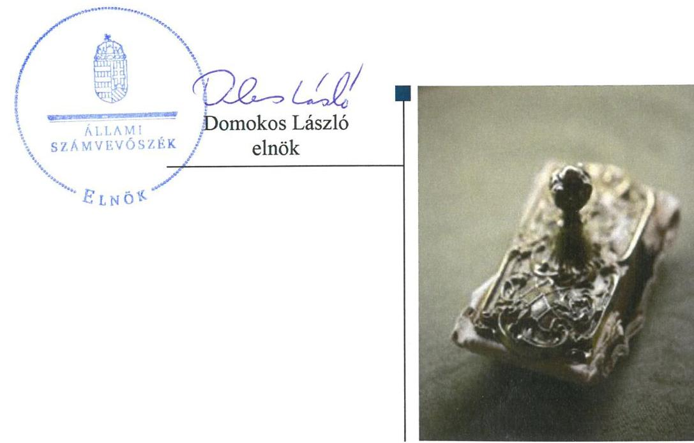
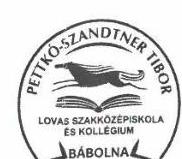
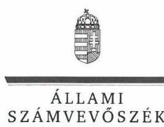
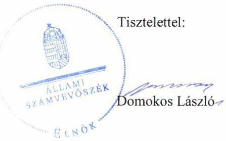

ÁLLAMI
SZÁMVEVŐSZÉK

# Jelentés 

## Központi költségvetési szervek ellenőrzése

Pettkó-Szandtner Tibor Lovas
Szakközépiskola és Kollégium
2019.

---

# Jelentés 

## Központi költségvetési szervek ellenőrzése

Pettkó-Szandtner Tibor Lovas
Szakközépiskola és Kollégium
2019. 12. hó 19. nap

---

# AZ ELLENŐRZÉST FELÜGYELTE:

- KAKAS SÁNDOR felügyeleti vezető
- AZ ELLENŐRZÉST VEZETTE ÉS A VÉGREHAJTÁSÁÉRT FELELŐS:
  - TESKI NORBERT ellenőrzésvezető
  - A PROGRAM ÖSSZEÁLLÍTÁSÁÉRT FELELŐS:
    - TÓTPÁL SZABOLCS osztályvezető

**IKTATÓSZÁM:** EL-2318-001/2019

**TÉMASZÁM:** 2450

**ELLENŐRZÉS-AZONOSÍTÓ SZÁM:** V079167

Jelentéseink az Országgyűlés számítógépes hálózatán és az Interneten a www.asz.hu címen is olvashatóak.

---

# TARTALOMJEGYZÉK 

■ ÖSSZEGZÉS ..... 5
■ AZ ELLENŐRZÉS CÉLJA ..... 6
■ AZ ELLENŐRZÉS TERÜLETE ..... 7
■ AZ ELLENŐRZÉS HÁTTERE, INDOKOLTSÁGA ..... 8
■ A JELENTÉS LÉNYEGES KÉRDÉSKÖREI ..... 9
■ AZ ELLENŐRZÉS HATÓKÖRE ÉS MÓDSZEREI ..... 10
■ MEGÁLLAPÍTÁSOK ..... 12
■ JAVASLATOK ..... 15
■ MELLÉKLETEK ..... 17
I. sz. melléklet: Értelmező szótár ..... 17
■ FÜGGELÉK: ÉSZREVÉTELEK ..... 21
■ RÖVIDÍTÉSEK JEGYZÉKE ..... 29

---

.

---

# ÖSSZEGZÉS 

A Pettkó-Szandtner Tibor Lovas Szakközépiskola és Kollégium belső kontrollrendszere és vagyongazdálkodása nem biztosította a közpénzek szabályos felhasználását és a nemzeti vagyonnal való elszámoltatható, átlátható gazdálkodást, a felelős gazdálkodás nem érvényesült. Nem volt védett a korrupcióval szemben.

## Az ellenőrzés társadalmi indokoltsága

Magyarország versenyképességének és a magyar gazdaság fejlődésének alapvető feltétele a magyar munkavállalók megfelelő szakmai képzettsége és felkészültsége, amelyben a szakképzési rendszernek döntő szerepe van. A mezőgazdaság vonatkozásában is kiemelten fontos ez, hiszen a magyar mezőgazdaság piaci versenyképességét és eredményességét nagymértékben befolyásolja az agrárszférában dolgozók képzettsége, felkészültsége. A szakképzés legjelentősebb színterei a szakképző iskolák. Az eredményes és célszerű szakképzés alapja és alapvető feltétele a szakképző intézmények közpénzekkel és a közvagyonnal való törvényes, átlátható és a korrupcióval szembeni védelmet biztosító működése és gazdálkodása. Ezért ezen szervezetekkel szemben is alapvető társadalmi igény, hogy a rájuk bízott közpénzekkel, közvagyonnal szabályosan gazdálkodjanak. Emellett a szakképzésben részt vevő pedagógusok, tanulók és a szülők jogos elvárása, hogy a szakképző iskolák működése átlátható és elszámoltatható legyen. Mindezen igényekkel összhangban, a közpénzügyek átláthatóságának előmozdítása, a közvagyon védelme érdekében került sor az agrárszakképző iskolák belső kontrollrendszerének és gazdálkodásának ellenőrzésére.

## Főbb megállapítások, következtetések, javaslatok

A Pettkó-Szandtner Tibor Lovas Szakközépiskola és Kollégium 2016-ban a jogszabályi előírások ellenére nem rendelkezett a feladatellátás részletes belső rendjét és módját rögzítő szervezeti és működési szabályzattal, így a szabályszerű működés alapvető feltételei hiányoztak. A jogszabályi előírásoknak megfelelő szervezeti és működési szabályzattal 2017. augusztus 31-étől rendelkezett.

A Pettkó-Szandtner Tibor Lovas Szakközépiskola és Kollégium 2017-ben nem működtetett kockázatkezelési rendszert, továbbá a kontrolltevékenység gyakorlása, az információs és kommunikációs rendszer, valamint a belső ellenőrzés működtetése nem volt megfelelő, ezáltal nem biztosította a nemzeti vagyonnal való átlátható gazdálkodás feltételeit.

A Pettkó-Szandtner Tibor Lovas Szakközépiskola és Kollégium a 2017. évi mérlegtételek alátámasztásához nem állított össze leltárt, ezáltal a számviteli beszámolója nem volt megalapozott.

A Pettkó-Szandtner Tibor Lovas Szakközépiskola és Kollégium nem építette ki és működtette megfelelően az integritás kontrollokat.

Az Állami Számvevőszék a jelentésben foglalt megállapítások alapján a Pettkó-Szandtner Tibor Lovas Szakközépiskola és Kollégium vezetője részére hét javaslatot fogalmazott meg.

---

# AZ ELLENŐRZÉS CÉLJA 

AZ ELLENŐRZÉS CÉLJA annak megítélése volt, hogy a Pettkó-Szandtner Tibor Lovas Szakközépiskola és Kollégium belső kontrollrendszerének kialakítása és működtetése szabályszerű volt-e, biztosította-e az átlátható, szabályszerű, gazdaságos, hatékony és eredményes gazdálkodás feltételeit; az iskola pénzügyi és vagyongazdálkodása megfelelt-e a jogszabályi előírásoknak és belső szabályzatainak. Az ellenőrzés keretében az Állami Számvevőszék értékelte az iskola korrupciós kockázatainak kezelését szolgáló integritás kontrollok kiépítettségét és az integritás szemlélet érvényesülését, továbbá, hogy az ellenőrzött megfelel-e annak az Alaptörvényben meghatározott alapvetésnek, hogy Magyarország a kiegyensúlyozott, átlátható és fenntartható költségvetési gazdálkodás elvét érvényesíti. Érvényesül-e a nemzeti vagyon kezelésének és védelmének célja, azaz a szervezet vagyona a közérdeket szolgálja, a közös szükségletek kielégítése és a természeti erőforrások megóvása, valamint a jövő nemzedékek szükségleteinek figyelembevétele mellett.

---

# AZ ELLENŐRZÉS TERÜLETE 

## Pettkó-Szandtner Tibor Lovas Szakközépiskola és Kollégium

A bábolnai székhelyű Pettkó-Szandtner Tibor Lovas Szakközépiskola és Kollégiumot, mint költségvetési szervet 2013. augusztus 1-jén alapították. Az Iskola ${ }^{1}$ elnevezése 2017. augusztus 30-áig Pettkó-Szandtner Tibor Lovas Szakképző Iskola és Kollégium, 2017. augusztus 31-étől Pettkó-Szandtner Tibor Lovas Szakközépiskola és Kollégium volt. Nevelő-oktató célú közfeladatát a működését meghatározó Nkt. ${ }^{2}$ alapján látja el.

Az Iskola alaptevékenységébe tartozik a szakközépiskolai nevelés-oktatás, a felnőttoktatás, a kollégiumi ellátás. A beilleszkedési, tanulási és magatartási nehézséggel küzdő tanulók iskolai nevelése-oktatása, a többi tanulóval együtt nevelhető, oktatható, olyan sajátos nevelési igényű tanuló iskolai nevelése, oktatása, aki egyéb pszichés fejlődési zavarral küzd. Az Alapító okiratban meghatározott tanulólétszám 420 fő.

Az Iskola gazdasági szervezeti feladatait a Szent István Mezőgazdasági és Élelmiszeripari Szakképző Iskola látta el az ellenőrzött időszakban.

Az Iskola vezetőjének és a gazdasági szervezet vezetőjének személye az ellenőrzött időszakban nem változott.

Az Iskola fölött az irányító szervi jogkört az Agrárminisztérium gyakorolja.

---

# AZ ELLENŐRZÉS HÁTTERE, INDOKOLTSÁGA 

Az államháztartás központi alrendszerének közpénz felhasználása, az intézmények által ellátott közfeladatok sokrétűsége, valamint a feladatellátásához rendelt vagyon nagyságrendje indokolja, hogy az ÁSZ ellenőrzéseket folytasson a pénzügyi és vagyongazdálkodás területén. Az ÁSZ az ellenőrzései során feltárja a gazdálkodást, a központi alrendszer intézményei átalakulását, átszervezését érintő szabályozások esetleges hiányosságait, a szabályozással nem érintett gazdálkodási területeket, rámutathat a vagyongazdálkodási tevékenység - ezen belül a tulajdonosi joggyakorlás és vagyonkezelés - esetleges szabálytalanságaira, értékeli az állami vagyon nyilvántartására és elszámolására vonatkozó eljárásokat.

Az ellenőrzés várhatóan hozzájárul a központi intézmények pénzügyi helyzetének pontosabb megítéléséhez, a jó gyakorlat kialakításán és terjesztésén keresztül az ellenőrzések elősegíthetik a gazdálkodás szabályszerűségének javítását.

Az ellenőrzés a szervezet kockázatértékelése alapján, az egyedi és lényeges jellemzők figyelembevételével, az ellenőrzésre kiválasztott modullal történik. Az integritás- és belső kontroll modul a központi költségvetési szerv működésének irányítottságát, korrupció elleni védettségét értékeli.

A belső kontrollrendszer kialakítása és működtetése nélkül nem valósítható meg a közpénzek, a közvagyon átlátható, szabályos, gazdaságos, hatékony és eredményes felhasználása. A belső kontrollrendszer azt a célt szolgálja, hogy a költségvetési szervek működésük és gazdálkodásuk során a tevékenységeket szabályszerűen hajtsák végre, teljesítsék elszámolási kötelezettségeiket és megvédjék az erőforrásokat a veszteségektől, a károktól és a nem rendeltetésszerű használattól. A belső kontrollrendszer magában foglalja mindazon elveket, eljárásokat és belső szabályzatokat, melyek biztosítják, hogy a költségvetési szerv valamennyi tevékenysége és célja összhangban legyen a szabályszerűséggel, szabályozottsággal, valamint a gazdaságosság, hatékonyság és eredményesség követelményeivel, az eszközökkel és forrásokkal való gazdálkodásban ne kerüljön sor pazarlásra, visszaélésre, rendeltetésellenes felhasználásra. Megfelelő, pontos és naprakész információk álljanak rendelkezésre a költségvetési szerv működésével kapcsolatosan, és a belső kontrollrendszer harmonizációjára, összehangolására vonatkozó jogszabályok végrehajtásra kerüljenek. Az integritás kontrollok kiépítése, erősítése a szervezet korrupciós kockázatainak kezelését szolgálja. A teljesítménykövetelmények meghatározása és működtetése megalapozhatja a központi költségvetési szervnél a teljesítményellenőrzés lefolytatását.

Az egyes ellenőrzések megállapításaival és egy időszak ellenőrzési eredményeinek elemzésével az ÁSZ ráirányíthatja a jogalkotók figyelmét a központi alrendszerben vagy annak egy ágazatában esetlegesen felmerülő pénzügyi, szabályozási feszültségekre. Az elvégzett ellenőrzések során az ÁSZ „jó gyakorlatokat" is azonosíthat, melyeket tanácsadó funkciója keretében szélesebb körben is megismertethet az érintettekkel, ezáltal is hozzájárulva a költségvetési rendszer szabályozott, átlátható, kiegyensúlyozott és fenntartható működéséhez.

---

# A JELENTÉS LÉNYEGES KÉRDÉSKÖREI 

1. A belső kontrollrendszer kialakítása és működtetése biztosította-e a közpénzekkel és a nemzeti vagyonnal történő átlátható, szabályszerű gazdálkodást?
2. A költségvetési szerv vagyongazdálkodása szabályszerű volt-e?
3. A költségvetési szervnél alakítottak-e ki a teljesítmény mérésére alkalmas követelményeket?

---

# AZ ELLENŐRZÉS HATÓKÖRE ÉS MÓDSZEREI 

## Az ellenőrzés típusa

Megfelelőségi ellenőrzés.

## Az ellenőrzött időszak

Az ellenőrzött időszak a 2016-2017. évek.

## Az ellenőrzés tárgya

A Pettkó-Szandtner Tibor Lovas Szakközépiskola és Kollégium belső kontrollrendszerének kialakítása és működtetése, valamint vagyongazdálkodása. A Pettkó-Szandtner Tibor Lovas Szakközépiskola és Kollégiumnál az integritáskontrollok kiépítettsége, az integritás szemlélet érvényesülése.

Az ellenőrzés kiterjedt minden olyan körülményre és adatra, amely az ÁSZ jogszabályban meghatározott feladatainak teljesítéséhez, valamint a program végrehajtása folyamán felmerült újabb összefüggések feltárásához szükséges volt.

## Az ellenőrzött szervezet

Pettkó-Szandtner Tibor Lovas Szakközépiskola és Kollégium és a gazdasági szervezeti feladatait ellátó Szent István Mezőgazdasági és Élelmiszeripari Szakgimnázium és Szakközépiskola.

## Az ellenőrzés jogalapja

Az ellenőrzés jogszabályi alapját az ÁSZ tv. 1. § (3) bekezdés, 5. § (2)-(4) és (6) bekezdései, valamint az Áht. 61. § (2) bekezdésének előírásai képezik.

## Az ellenőrzés módszerei

Az ellenőrzést az ÁSZ ${ }^{1}$ a szakmai program szempontjai, az ellenőrzött időszakban hatályos jogszabályok, az ellenőrzés szakmai szabályai, a jelen ellenőrzésre irányadó ÁSZ módszertanok figyelembevételével végezte.

Az ellenőrzés ideje alatt az ellenőrzött szervezetekkel történő kapcsolattartást az ÁSZ SZMSZ²-ének vonatkozó előírásai alapján biztosította az ÁSZ.

---

Az ellenőrzési kérdések megválaszolásához szükséges bizonyítékok megszerzése az ellenőrzöttek által rendelkezésre bocsátott dokumentumokra, adatokra alapozva, mintavételezés, valamint elemző eljárás útján történt. Az ellenőrzési bizonyítékként felhasználható adatforrások közé tartoztak egyrészt a szakmai program részletes szempontjainál felsorolt adatforrások, másrészt minden egyéb - az ellenőrzés folyamán feltárt, az ellenőrzés szempontjából információt tartalmazó - dokumentum.

Az ellenőrzés lefolytatásához az ellenőrzött szervezetek a tanúsítványok kitöltésével, valamint az ÁSZ által kért dokumentumok megküldésével szolgáltattak adatokat, amelyek valódiságát és teljes körűségét az ellenőrzött szervezet vezetője által tett teljességi és hitelességi nyilatkozat igazolta. Az így rendelkezésre bocsátott adatok, információk kontrollja az ellenőrzés keretében történt.

Az Iskola belső kontrollrendszerének egyes pilléreinek kialakítására és működtetésére vonatkozó értékelés a következő volt:
$\longrightarrow$ „szabályszerű", amennyiben az értékelt területen az elért „igen" válaszok százalékban kifejezett, egész számra kerekített aránya legalább $85 \%$ volt,
$\longrightarrow$ „nem szabályszerű", ha nem érte el a $85 \%$-ot.
A belső kontrollrendszer összesített értékelése az egyes részterületek esetében kapott értékelések számtani átlaga alapján történt. A „szabályszerű" értékelésnek a százalékos értéken felül további feltétele volt, hogy egyik kontrollterület sem kaphatott „nem szabályszerű" értékelést.

A kiadások ellenőrzésére a 2017. év vonatkozásában került sor. A kiadások (külső személyi juttatások, felhalmozási kiadások, dologi kiadások) esetében az ellenőrzés azokra a legnagyobb értékű tételekre - a lényeges sokaságra - terjedt ki, melyek összértéke eléri a teljes sokaság összértékének 50\%-át. A lényeges sokaság tételes ellenőrzése történt meg.

A 2017. évi beruházások, felújítások végrehajtása és év végi értékelése szabályszerűségének ellenőrzése tételesen történt.

Amennyiben az Iskola működését és gazdálkodását alapvetően meghatározó dokumentum hiánya miatt, valamely lényeges kérdéskörre vonatkozóan az ÁSZ megállapítást tett, további ellenőrzési tevékenységek az adott kérdéskörrel és az azzal szoros logikai kapcsolatban lévő kérdéskörökkel - ráépülő jelleggel - nem kerültek végrehajtásra.

---

# 1. A belső kontrollrendszer kialakítása és működtetése biztosította-e a közpénzekkel és a nemzeti vagyonnal történő átlátható, szabályszerű gazdálkodást? 

Összegző megállapítás

Az Iskola belső kontrollrendszerének kialakítása és működtetése nem volt szabályszerű.

AZ ISKOLA BELSŐ KONTROLLRENDSZERE 2016-BAN nem biztosította az átlátható, szabályszerű gazdálkodást, mert az Áht. ${ }^{5} 10 . \S$ (5) bekezdésében előírtak ellenére nem rendelkezett a feladatok ellátásának részletes belső rendjét és módját meghatározó szervezeti
 és működési szabályzattal.

2017-BEN a kontrollkörnyezet kialakítása nem volt szabályszerű.

Az Áht. előírásainak megfelelő SZMSZ${ }^{6}$-el, valamint a gazdálkodás részletes rendjét meghatározó Gazdálkodási szabályzattal${ }^{7}$ az Iskola 2017. augusztus 31-étől rendelkezett.

Az Iskola a Számv. tv.${ }^{8}$ szerint rendelkezett Számviteli politikával${ }^{9}{ }_{,1}{ }^{10}$-val és az annak keretében elkészítendő szabályzatokkal${ }^{11}$.

Az Iskola 2017. szeptember 1-jétől hatályos Számlarendje${ }^{12}$ a Számv. tv. 161. §. (2) bekezdés a) pontjával ellentétben nem tartalmazta az alkalmazásra kijelölt számlák számjelét és megnevezését, az Áhsz.${ }^{13}$ 51. § (3) bekezdésében foglaltak ellenére nem tartalmazta a könyvviteli és a nyilvántartási számlák egyeztetési módjának dokumentálását, a pénzügyi könyveléshez készült összesítő bizonylatok elkészítésének rendjét.

Az Iskola nem rendelkezett a Bkr.${ }^{14}$ 6. § (4) bekezdésében meghatározott szervezeti integritást sértő események kezelésének eljárásrendjével, az Info tv.${ }^{15}$ 24. § (3) bekezdésében foglalt adatvédelmi és adatbiztonsági szabályzattal, valamint az Ávr.${ }^{16}$ 13. § (2) bekezdés c), e) és f) pontjaiban előírt kiküldetési szabályzattal, reprezentációs szabályzattal, valamint gépjármű igénybevételének rendjével. Az Iskola a Vnytv.${ }^{17}$ 11. § (6) bekezdésében foglaltak ellenére belső szabályzatban nem állapította meg a vagyonnyilatkozat átadására, nyilvántartására, a vagyonnyilatkozatban foglalt személyes adatok védelmére vonatkozó szabályokat, továbbá az Ltv.${ }^{18}$ 10. § (1) bekezdés a) pontjában foglaltak ellenére nem adott ki egyedi iratkezelési szabályzatot.

Kockázatkezelési rendszert az Iskola nem működtetett, mert a Bkr. 7. § (2) bekezdésekben foglaltakkal ellentétben nem határozta meg az egyes kockázatokkal kapcsolatos intézkedéseket, és az intézkedések teljesítésének folyamatos nyomon követésének módját.

---

A kontrolltevékenység gyakorlása nem volt szabályszerű.

Az Ávr. 57. § (4) bekezdésével ellentétben írásbeli kijelöléssel nem rendelkező személy végzett teljesítésigazolást, továbbá az Ávr. 57. § (1) bekezdése ellenére egy esetben a teljesítésigazoló nem ellenőrizte a kiadás összegszerűségét.

# AZ INFORMÁCIÓS ÉS KOMMUNIKÁCIÓS RENDSZER működtetése nem volt szabályszerű. 

Az Iskola vezetője a Bkr. előírásainak megfelelően kialakította az információ áramlására alkalmas rendszert, azonban a Bkr. 9. § (2) bekezdésében foglaltak ellenére nem határozott meg beszámolási szinteket.

Az Info tv. 35. § (3) bekezdésében előírtakkal ellentétben az Iskola vezetője nem szabályozta a kötelezően közzéteendő adatok nyilvánosságra hozatalának rendjét.

Az Iskola vezetője az Info tv. előírásainak megfelelően 2017. szeptember 1-jétől szabályozta a közérdekű adatok megismerésére irányuló igények teljesítésének rendjét.

A Bkr. 10. §-ában foglaltak ellenére az Iskola nem gondoskodott az operatív tevékenységek keretében megvalósuló folyamatos és eseti nyomon követésről. A belső ellenőrzés kialakításáról az Iskola az Áht. előírásai szerint gondoskodott, azonban a Bkr. 47. § (1) bekezdésével ellentétben nem vezetett nyilvántartást éves bontásban a belső ellenőrzési jelentésekben tett megállapításokról, javaslatokról, a vonatkozó intézkedési tervekről és azok nyomon követéséről.

A belső kontrollrendszer értékelésére vonatkozóan az Iskola vezetője eleget tett a Bkr.-ben előírt nyilatkozattételi kötelezettségének. A nyilatkozat tartalmát az ellenőrzés nem igazolta.

Az Iskola csekély mértékben építette ki és működtette a kötelezően előírt integritás kontrollokat. Nem végzett rendszerszerű kockázatelemzést. Kevés kötelezően nem előírt integritást erősítő kontrollt működtetett.

## 2. A költségvetési szerv vagyongazdálkodása szabályszerű volt-e?

## Összegző megállapítás Az Iskola vagyongazdálkodása nem volt szabályszerű.

A vagyongazdálkodás nem volt szabályszerű, mert a Számv. tv. 69. § (1) bekezdése ellenére a 2017. évi mérlegtételek alátámasztásához az Iskola nem állított össze leltárt, amely tételesen, ellenőrizhető módon tartalmazta a mérlegben szereplő eszközöket és forrásokat mennyiségben és értékben.

---

# 3. A költségvetési szervnél alakítottak-e ki a teljesítmény mérésére alkalmas követelményeket? 

Összegző megállapítás A teljesítmény mérésére alkalmas követelményeket az Iskola nem alakított ki.

A teljesítménymérés feltételeit az Iskola nem biztosította, mert nem alakított ki a szervezeti célok eléréséhez szükséges minden feladat és folyamat mérésére szolgáló indikátorokat, mérőszámokat, feladat és teljesítménymutatókat.

---

# JAVASLATOK 

Az ÁSZ tv. 33. § (1) bekezdésében foglaltak értelmében az ellenőrzött szervezet vezetője köteles a jelentésben foglalt megállapításokhoz kapcsolódó intézkedési tervet összeállítani és azt a jelentés kézhezvételétől számított 30 napon belül az ÁSZ részére megküldeni. Amennyiben az ellenőrzött szervezet vezetője nem küldi meg határidőben az intézkedési tervet, vagy továbbra sem elfogadható intézkedési tervet küld, az Állami Számvevőszék elnöke az ÁSZ tv. 33. § (3) bekezdés a) és b) pontjaiban foglaltakat érvényesítheti.

## Pettkó-Szandtner Tibor Lovas Szakközépiskola és Kollégium igazgatójának

1. Gondoskodjon a jogszabályi előírásoknak megfelelő számlarend elkészítéséről.
(1. megállapítás 5. bekezdése alapján)
2. Gondoskodjon a jogszabályi előírások szerint
a) a szervezeti integritást sértő események kezelése eljárásrendjének szabályozásáról;
b) a vagyonnyilatkozatok átadására, nyilvántartására, a vagyonnyilatkozatban foglalt személyes adatok védelmére vonatkozó szabályok megállapításáról;
c) az iratkezelési szabályzat kiadásáról.
(1. megállapítás 6. bekezdése alapján)
3. Intézkedjen a Bkr. előírásainak megfelelően az integrált kockázatkezelési rendszer működtetéséről.
(1. megállapítás 7. bekezdése alapján)
4. Intézkedjen a jogszabályi előírásnak megfelelő teljesítésigazolás elvégzéséről.
(1. megállapítás 9. bekezdése alapján)
5. Gondoskodjon az operatív tevékenységek keretében megvalósuló folyamatos és eseti nyomon követésről a Bkr. előírása szerint.
(1. megállapítás 14. bekezdés 1. mondata alapján)

---

6. Intézkedjen a belső ellenőrzési jelentésekben tett megállapításokról, javaslatokról, a vonatkozó intézkedési tervekről és azok végrehajtásának nyomon követéséről szóló nyilvántartás vezetéséről a Bkr. előírása szerint.
(1. megállapítás 14. bekezdés 2. mondatának 2. tagmondata alapján)
7. Intézkedjen a jogszabályi előírásoknak megfelelően a mérleg tételeit alátámasztó leltár elkészítéséről, amely tételesen, ellenőrizhető módon tartalmazza a mérleg fordulónapján meglévő eszközöket és forrásokat mennyiségben és értékben.
(2. megállapítás 1. bekezdése alapján)

---

# MELLÉKLETEK 

## I. SZ. MELLÉKLET: ÉRTELMEZŐ SZÓTÁR

állami vagyon
állami vagyon használója
állami vagyon hasznosítása
állami vagyon hasznosítása
kötött szerződés
belső kontrollrendszer
belső kontrollrendszer területei
beruházás
felújítás

Állami vagyonnak minősül:
a) az állam tulajdonában lévő dolog, valamint a dolog módjára hasznosítható természeti erő,
b) az a) pont hatálya alá nem tartozó mindazon vagyon, amely vonatkozásában törvény az állam kizárólagos tulajdonjogát nevesíti,
c) az állam tulajdonában lévő tagsági jogviszonyt megtestesítő értékpapír, illetve az államot megillető egyéb társasági részesedés,
d) az államot megillető olyan immateriális, vagyoni értékkel rendelkező jogosultság, amelyet jogszabály vagyoni értékű jogként nevesít,
e) az állam tulajdonában lévő pénzügyi eszközök.
(Forrás: Vtv. 1. § (2) bekezdése)
Az a természetes vagy jogi személy, jogi személyiséggel nem rendelkező szervezet, aki, vagy amely törvény vagy szerződés alapján, bármely jogcímen (bérlet, haszonbérlet, használat stb.) állami vagyont birtokol, használ, szedi annak hasznait, hasznosít, ide nem értve a haszonélvezőt, a vagyonkezelőt és a tulajdonosi jogok gyakorlóját". (Forrás: Vtvr. 1. § (7) bekezdés a) pontja)
Az állami vagyont az MNV Zrt. maga kezeli, vagy szerződés - így különösen bérlet, haszonbérlet, megbízás - alapján központi költségvetési szervnek, természetes vagy jogi személynek, vagy jogi személyiséggel nem rendelkező gazdálkodó szervezetnek hasznosításra átengedi.
(Forrás: Vtv. 23. § (1) bekezdése, hatályos 2012. január 1-jétől)
Az állami vagyonnal a tulajdonosi joggyakorló maga gazdálkodik, vagy szerződés - így különösen bérlet, haszonbérlet, megbízás - alapján hasznosításra átengedi, illetőleg vagyonkezelésbe, haszonélvezetbe adja. (Forrás: Vtv. 23. § (1) bekezdése, hatályos 2013. június 28-ától)
Az állami vagyon hasznosítására kötött szerződések elsődleges célja az állami vagyon hatékony működtetése, állagának védelme, értékének megőrzése, illetve gyarapítása, az állami és közfeladatok ellátásának elősegítése. (Forrás: Vtv. 23. § (2) bekezdése)
A belső kontrollrendszer a kockázatok kezelése és tárgyilagos bizonyosság megszerzése érdekében kialakított folyamatrendszer, amely azt a célt szolgálja, hogy a működés és gazdálkodás során a tevékenységeket szabályszerűen, gazdaságosan, hatékonyan, eredményesen hajtsák végre, az elszámolási kötelezettségeket teljesítsék, megvédjék az erőforrásokat a veszteségektől, károktól és nem rendeltetésszerű használattól. (Forrás: Áht. 69. § (1) bekezdése)
A kontrollkörnyezet, az integrált kockázatkezelési rendszer, a kontrolltevékenységek, az információs és kommunikációs rendszer, valamint a nyomon követési (monitoring) rendszer. (Forrás: Bkr. 3. §-a)
A tárgyi eszköz beszerzése, létesítése, saját előállítása, a beszerzett tárgyi eszköz üzembe helyezése, rendeltetésszerű használatba vétele érdekében az üzembe helyezésig, a rendeltetésszerű használatba vételig végzett tevékenység, beruházás a meglevő tárgyi eszköz bővítését, rendeltetésének megváltoztatását, átalakítása, élettartamának, teljesítőképességének közvetlen növelését eredményező tevékenység is, az előbbiekben felsorolt, e tevékenységhez hozzákapcsolható egyéb tevékenységekkel együtt. (Számv. tv. 3. § (3) bekezdés 7. pontja)
Az elhasználódott tárgyi eszköz eredeti állaga (kapacitása, pontossága) helyreállítását szolgáló, időszakonként visszatérő olyan tevékenység, amely mindenképpen azzal jár, hogy az adott eszköz élettartama megnövekszik, eredeti műszaki állapota, teljesítőképessége megközelítőleg vagy teljesen visszaáll, az előállított termékek minősége vagy az adott eszköz használata jelentősen javul és így a felújítás pótlólagos ráfordításából a jövőben gazdasági előnyök származnak; felújítás a korszerűsítés is, ha az a korszerű technika alkalmazásával a tárgyi eszköz egyes részeinek az eredetitől eltérő megoldásával vagy kicserélésével a tárgyi eszköz

---

|  | üzembiztonságát, teljesítőképességét, használhatóságát vagy gazdaságosságát növeli; a tárgyi eszközt akkor kell felújítani, amikor a folyamatosan, rendszeresen elvégzett karbantartás mellett a tárgyi eszköz oly mértékben elhasználódott (szerkezeti elemei elöregedtek), amely elhasználódottság már a rendeltetésszerű használatot veszélyezteti; nem felújítás az elmaradt és felhalmozódó karbantartás egy időben való elvégzése, függetlenül a költségek nagyságától. (Forrás: Számv. tv. 3. § (4) bekezdés 8. pontja) |
| :--: | :--: |
| információs és kommunikációs rendszer | A költségvetési szerv vezetője által kialakított és működtetett olyan rendszer, mely biztosítja, hogy a megfelelő információk a megfelelő időben eljutnak az illetékes szervezethez, szervezeti egységhez, illetve személyhez. (Forrás: Bkr. 9. § (1) bekezdés) |
| integrált kockázatkezelési rendszer | Olyan folyamatalapú kockázatkezelési rendszer, amely a szervezet minden tevékenységére kiterjed, egységes módszertan és eljárások alkalmazásával, a szervezet célkitűzéseinek és értékeinek figyelembevételével biztosítja a szervezet kockázatainak teljes körű azonosítását, azok meghatározott kritériumok szerinti értékelését, valamint a kockázatok kezelésére vonatkozó intézkedési terv elkészítését és az abban foglaltak nyomon követését. (Forrás: Bkr. 2. § m) pontja, 2016. október 1-jétől) |
| integritás | Az integritás az elvek, értékek, cselekvések, módszerek, intézkedések konzisztenciáját jelenti, vagyis olyan magatartásmódot, amely meghatározott értékeknek megfelel. (Forrás: Nemzetgazdasági Minisztérium: Magyarországi államháztartási belső kontroll standardok Útmutató 1.6.1. pontja, 2012. december) |
| irányító szerv | A költségvetési szerv tekintetében az Áht-ban meghatározott irányítási hatáskört gyakorló szerv. (Forrás: Áht. 1. § 9. pontja) |
| kockázat | A kockázat annak a valószínűségét jelenti, hogy egy vagy több esemény vagy intézkedés nem kívánt módon befolyásolja a rendszer működését, céljainak megvalósulását. (Forrás: Javaslatok a korrupciós kockázatok kezelésére - Kockázatkezelési és ellenőrzési módszertan 35. oldal, ÁSZ) |
| kontrollkörnyezet | A költségvetési szerv vezetője által kialakított olyan elvek, eljárások, belső szabályzatok összessége, amelyben világos a szervezeti struktúra, a folyamatok átláthatók, egyértelműek a felelősségi, hatásköri viszonyok és feladatok, meghatározottak, ismertek és elfogadottak az etikai elvárások a szervezet minden szintjén, átlátható a humánerőforrás-kezelés, biztosított a szervezeti célok és értékek irányában való elkötelezettség fejlesztése és elősegítése. (Forrás: Bkr. 6. § (1) bekezdés) |
| kontrolltevékenységek | A költségvetési szerv vezetője által a szervezeten belül kialakított (kontroll) tevékenységek, melyek biztosítják a kockázatok kezelését, hozzájárulnak a szervezet céljainak eléréséhez és erősítik a szervezet integritását. (Forrás: Bkr. 8.

 § (1) bekezdés) |
| kommunikáció | Az a tevékenység, melynek során információ továbbítása valósul meg. A kommunikációs folyamat résztvevői között tájékoztatás történik, mely során tényeket, ezek magyarázatát közlik. |
| monitoring | A monitoring általánosságban a különböző szintű szervezeti célok megvalósításának folyamatát kíséri figyelemmel, melynek során a releváns eseményekről és tevékenységekről (együtt: folyamatokról) rendszeres jelleggel, strukturált, döntéstámogató információkhoz jutnak a szervezet vezetői. (Forrás: NGM Útmutató a költségvetési szervek monitoring rendszeréhez 2011. november) |
| monitoring-rendszer | A költségvetési szerv vezetője köteles kialakítani a szervezet tevékenységének a célok megvalósításának nyomon követését biztosító rendszert, mely az operatív tevékenységek keretében megvalósuló folyamatos és eseti nyomon követésből, valamint az operatív tevékenységektől függetlenül működő belső ellenőrzésből állhat. (Forrás: Bkr. 10. §) |
| működtetés | a nemzeti vagyon birtoklásából, használatából, hasznai szedéséből, a nemzeti vagyon fenntartásából és üzemeltetéséből álló tevékenységek együttese, amely - jogszabály vagy szerződés alapján - a nemzeti vagyon felújítására, fejlesztésére, a birtoklásának, használatának hasznai szedése jogának továbbengedésére is kiterjedhet. (Forrás: Nvtv. 3. § (1) bekezdés 10. pontja) |

---

vagyongazdálkodás

A nemzeti vagyongazdálkodás feladata a nemzeti vagyon rendeltetésének megfelelő, az állam, az önkormányzat mindenkori teherbíró képességéhez igazodó, elsődlegesen a közfeladatok ellátásához és a mindenkori társadalmi szükségletek kielégítéséhez szükséges, egységes elveken alapuló, átlátható, hatékony és költségtakarékos működtetése, értékének megőrzése, állagának védelme, értéknövelő használata, hasznosítása, gyarapítása, továbbá az állam vagy a helyi önkormányzat feladatának ellátása szempontjából feleslegessé váló vagyontárgyak elidegenítése. (Forrás: Nvtv. 7. § (2) bekezdése)

---

.

---

# FÜGGELÉK: ÉSZREVÉTELEK 

A jelentéstervezetet a Számvevőszék 15 napos észrevételezésre megküldte az ellenőrzött szervezetek vezetőinek az ÁSZ tv. 29. § (1) bekezdése előírásának megfelelően.

A Pettkó-Szandtner Tibor Lovas Szakközépiskola és Kollégium igazgatója a jelentéstervezet megállapításaira írásban észrevételt tett. A Szent István Mezőgazdasági és Élelmiszeripari Szakgimnázium és Szakközépiskola igazgatója nem tett észrevételt.
Az ÁSZ tv. 29. § (3) bekezdésével összhangban az ÁSZ a Függelékben feltünteti az ellenőrzés megállapításaival kapcsolatban tett, figyelembe nem vett észrevételeket, és megindokolja, hogy azokat miért nem fogadta el.

[^0]
[^0]:    * 29. § (1) Az Állami Számvevőszék az ellenőrzési megállapításait megküldi az ellenőrzött szervezet vezetőjének vagy az általa megbízott személynek, és annak, akinek személyes felelősségét állapította meg.
    (2) Az ellenőrzött szervezet vezetője és a felelősként megjelölt személy az ellenőrzés megállapításaira tizenöt napon belül írásban észrevételt tehet.
    (3) Az Állami Számvevőszék az észrevételre a beérkezésétől számított harminc napon belül írásban válaszol. A figyelembe nem vett észrevételeket köteles a jelentésben feltüntetni, és megindokolni, hogy azokat miért nem fogadta el.

---

Pettkó-Szandtner Tibor
Lovas Szakközépiskola és Kollégium Iskolaigazgató: Körmendi Csaba e-mail: igazgato@pettkoiskola.sulinet.hu 2943 Bábolna, Rákóczi út 6.

Tel./fax: 34/568-063
e-mail: titkarsag@pettkoiskola.sulinet.hu
internet: www.pettkoiskola.sulinet.hu
OM-azonosító: 200209
Akkreditációs lajstromszám: AL-2316

# Állami Számvevőszék 

Iktatószám: PSZI-844/2019.

## Budapest

Apáczai Csere János utca 10. 1052
Postacím: 1364, Budapest Pf. 54.
Domokos László Elnök Úr részére

Tárgy: észrevétel megküldése

## Tisztelt Elnök Úr!

Hivatkozva az EL-1193-032/2019. iktatószámú levelére „Központi költségvetési szervek ellenőrzése - Pettkó-Szandtner Tibor Lovas Szakközépiskola és Kollégium" című számvevőszéki jelentéstervezetre a következő észrevételeket teszem:

Nem tartom helytállónak a jelentéstervezet összegzés, főbb megállapítások, következtetések, javaslatok leiratban (5. oldal), hogy az intézmény 2016. évben nem rendelkezett Szervezeti és Működési Szabályzattal. Az intézményt 2016-ban is ellenőrizte az Állami Számvevőszék, amikor a 2016. évi SZMSZ feltöltésre került az Állami Számvevőszék ellenőrzési felületére, így a 2017. évi ellenőrzésnél hivatkozás történt „az előzőekben megküldött dokumentumoknál" a 2016. évi SZMSZ-re. Az említett 2016. évi ÁSZ ellenőrzés nem kifogásolta az intézmény SZMSZ-ét, és intézkedési terv készítését sem írta elő az SZMSZ vonatkozásában.

Túlzottnak tartom az Állami Számvevőszék azon feltételezését, hogy a megküldött szabályzatok az ellenőrzés időszakában kerültek volna elkészítésre. Megjegyezném azonban, hogy a rendelkezésre álló 5 napos, viszonylag rövid feltöltési időszak, az adathalmaz nagy mennyisége, a munkavállalók ilyen szintű informatikai alapkompetenciáinak hiányossága, eredményezhet adatfeltöltési zavarokat, amelyet későbbi észrevételek után a rendszer zárása miatt javítani nem lehet. Az észrevett emberi tévedések jelzése is csak online űrlap kitöltésével lehetséges.

A jelenlegi elnevezése szerint Pettkó-Szandtner Tibor Lovas Szakközépiskola és Kollégium felügyeletét ellátó, akkori elnevezéssel Földművelésügyi Miniszter rendelkezése szerint 2015. augusztus 31-én kelt Munkamegosztási megállapodás alapján az intézmény pénzügyigazdasági tevékenységét a jelenlegi Szent István Mezőgazdasági és Élelmiszeripari Szakgimnázium és Szakközépiskola látja el. A megállapodás II (3) bekezdése kimondja, hogy az együttműködés nem csorbíthatja a Pettkó-Szandtner Tibor Lovas Szakközépiskola és Kollégium önálló szakmai döntési rendszerét, önálló jogi személyiségét és felelősségét. A megállapodás konkrétan nem tartalmazza a készítendő szabályzatok felelősségét, illetve a külső ellenőrzések eljárásrendjét sem. Ezen Munkamegosztási megállapodás 2017. június 08-ával került módosításra, 2017. decemberi fenntartói jóváhagyással, amely tartalmazta a Pettkó-

---

Szandtner Tibor Lovas Szakközépiskola és Kollégiumban rendelkezésre álló szabályzatok felsorolását, amelyben szerepelt az Ön által kifogásolt számlarend is. A módosított Munkamegosztási megállapodás továbbra sem tartalmazta a külső ellenőrzések eljárásrendjét.

A 2017. évi beszámoló mérlegtételeinek alátámasztására a beszámoló 12/A mérleg űrlap soronként tartalmazza az eszközök és források értékét. A 2000. évi C. törvény a számvitelről 69.§ (3) bekezdése értelmében az intézménynek joga van arra, hogy háromévente mennyiségi, közbeeső években csak egyeztető leltárral támasza alá a mérleg sorokat, mivel folyamatos mennyiségi nyilvántartást vezet. Ebben az esetben, mint az intézmény igazgatója a leltározási utasításban egyeztető leltár elrendeléséről intézkedtem, annál is inkább mivel az intézménynek ingatlan és ingó vagyona nem volt. A források értéke 119.234.770,- Ft volt, amelyből a mérleg „Pénzeszközök" soron - illetve ahogy a bankszámla kivonaton is megállapítható - ebből 103.739.707,- Ft pénzeszköz volt, KEHOP pályázati pénzből. A „Beruházások, felújítások" sorban 15.166.301,- Ft, míg a „Gépek, berendezések, felszerelések, járművek" soron mindössze 119.057,- Ft összeg szerepel. A beszámoló mellékletében található az egyeztető leltár elrendelése.
Az Állami Számvevőszék részéről a jelentéstervezet 1. sz. függelék I. pontban azt a feltételezést, hogy az intézménynek „vagyoni hátránya" keletkezett, kizárom.

Az Állami Számvevőszék részéről a jelentés tervezet 1. sz. függelék II/3. (3) bekezdésében leírt 6.425.510,- Ft összegű jogszerűtlen kifizetés feltételezéséről kérem Tisztelettel Önöket, hogy részletesen indokolják, mely szolgáltatási számlákról van szó, amelyek esetleg az Önök megítélése szerint, nem az iskola feladatellátását szolgálták, illetve a teljesítésigazolása jogszerűtlennek tűnt. Úgy gondolom arra lehetőségem van, hogy a számlák ismeretében megindokoljam azok szükségességét.

Mint egy oktatási intézmény felelős igazgatója, aki közfeladatot lát el, legfontosabb feladatomnak tartom a tanulók nevelését, jogszabály követését, ezért egy kicsit meglepődve olvastam az Önök feltételezését. Biztos vagyok benne, amennyiben a munkatársaim, illetve jó magam, akár a dokumentumok feltöltésénél, akár az Önök által kért pontok értelmezésénél rosszul jártunk el, akkor is a jóhiszeműség, a pontos határidő betartása vezérelt bennünket.

A fentiekben leírtak alapján a végleges jelentés kiadása előtt kérem, mérlegeljék észrevételeimet.

Bábolna, 2019. október 09.

---

ELNÖK

Ikt.szám: EL-1193-036/2019.

# Körmendi Csaba úr 

igazgató
Pettkó-Szandtner Tibor Lovas Szakközépiskola és Kollégium

## Bábolna

## Tisztelt Igazgató Úr!

A „Központi Költségvetési szervek ellenőrzése - Pettkó-Szandtner Tibor Lovas Szakközépiskola és Kollégium" címmel készített számvevőszéki jelentéstervezetre tett, PSZI-844/2019. iktatószámú észrevételeit köszönettel megkaptam.
Az Állami Számvevőszék észrevételekre vonatkozó álláspontjáról a felügyeleti vezető által készített részletes tájékoztatást csatoltan megküldöm.
Tájékoztatom Igazgató urat, hogy a számvevőszéki jelentésben - az Állami Számvevőszékről szóló 2011. évi LXVI. törvény 29. § (3) bekezdése alapján - a figyelembe nem vett észrevételeket szerepeltetjük annak indoklásával, hogy azokat miért nem fogadtuk el.

Budapest, 2019. 17 hónap nap

Melléklet: Tájékoztatás az észrevételek kezeléséről

---

# Tájékoztatás az észrevételek kezeléséről 

A „Központi Költségvetési szervek ellenőrzése - Pettkó-Szandtner Tibor Lovas Szakközépiskola és Kollégium" című jelentéstervezetre 2019. október 9-én tett (az Állami Számvevőszékhez 2019. október 14-én érkezett) észrevételének kezelésével kapcsolatban a következő tájékoztatást adom.

## 1. A jelentéstervezet Főbb megállapítások részére vonatkozó észrevétel:

Az Iskola igazgatója (igazgató) észrevételében leírta, hogy nem tartja helytállónak a jelentéstervezet Főbb megállapítások, következtetések rész 1. bekezdésében a 2016. évi szervezeti és működési szabályzat (SZMSZ) hiányára tett megállapítást. A Pettkó-Szandtner Tibor Lovas Szakközépiskola és Kollégium (Iskola) már a 2016-ban lefolytatott ÁSZ ellenőrzés részére átadta az SZMSZ-t, és a jelen ellenőrzésnél hivatkozott arra előzőleg megküldött dokumentumként.
Az igazgató 2018. október 18-án kelt nyilatkozatában hozzájárult a 2016 évet érintően a 2017. május 17-én az ÁSZ rendelkezésre bocsátott, a nyilatkozatban felsorolt dokumentumok jelen ellenőrzéshez történő felhasználásához. A nyilatkozat tartalmazta az Iskola 2016. január 1-jén kiadott SZMSZ-ét is. A hivatkozott dokumentumot újra felülvizsgáltuk, és annak tartalma alapján megállapítható, a 2016 évi SZMSZ az aláírás időpontjában nem készülhetett el, tehát 2016. évben az Iskola nem rendelkezett SZMSZ-szel.
Az igazgató észrevételét nem fogadjuk el, a jelentéstervezet módosítása nem indokolt.

## 2. A jelentéstervezet 1. számú megállapítás 6. bekezdésére vonatkozó észrevétel:

Az igazgató észrevételében leírta, hogy túlzottnak tartja az ÁSZ azon feltételezését, hogy a megküldött szabályzatok az ellenőrzés időszakában kerültek volna elkészítésre. Az adatszolgáltatásra rendelkezésre álló idő rövidsége, az adathalmaz nagysága, a munkatársak informatikai alapkompetencia-hiányosságai eredményezhettek adatfeltöltési zavart, amelyet nem tudtak javítani.
Az igazgató észrevétele nem cáfolta az Iskola által az ellenőrzés részére átadott szabályzatokra - a vagyonnyilatkozat-tételi, az iratkezelési, az adatvédelmi, a kiküldetési és a reprezentációs szabályzat, valamint a gépjármű igénybevételének rendje - tett megállapítást. A felsorolt szabályzatok ismételt felülvizsgálata során megállapítottuk, hogy azok tartalmuk alapján nem készülhettek az aláírásuk időpontjában. Az adatszolgáltatás mennyiségével, az arra rendelkezésre álló idővel, illetve az Iskola munkatársainak kompetenciáival kapcsolatos észrevétele nem érinti a jelentéstervezet megállapítását. Az észrevétel alapján a jelentéstervezet módosítása nem indokolt.

---

# 3. A jelentéstervezet 1. számú megállapítás 5. bekezdésére, valamint az 1. számú javaslatra vonatkozó észrevétel: 

Az igazgató észrevételében leírta, hogy az Iskola pénzügyi-gazdasági tevékenységét Munkamegosztási megállapodás alapján másik intézmény látja el. A 2017. június 8-án módosított Munkamegosztási megállapodásban felsorolták az Iskola rendelkezésre álló szabályzatokat, amelyben szerepelt az ÁSZ által kifogásolt számlarend, azonban a külső ellenőrzések eljárásrendjét nem tartalmazta.
Az igazgató észrevételében jelzett Együttműködési megállapodás II. (5) pontjában felsorolják az Iskola saját pénzügyi-gazdasági tevékenységét szabályozó belső szabályzatait, többek között a számlarendet is. A felsorolásból nem következik, hogy azokkal a szabályzatokkal az Iskola a megállapodás aláírásakor rendelkezett is. Az adatbekérés során az Iskola a 2017. szeptember 1-je előtt hatályos számlarendet nem bocsátott az ellenőrzés rendelkezésére. A 2017. szeptember 1-jétől hatályos számlarend nem felelt meg a számvitelről szóló 2000. évi C. törvény (Számv. tv.) 161. §. (2) bekezdés a) pontjában előírtaknak. Az észrevételben hivatkozott külső ellenőrzések eljárásrendjére a jelentéstervezet nem tartalmaz megállapítást. Az észrevétel alapján a jelentéstervezet módosítása nem indokolt.

## 4. A jelentéstervezet 2. számú megállapítás 1. bekezdésére, a 7. számú javaslatra vonatkozó észrevétel:

Az igazgató észrevétele szerint a 2017. évi beszámoló mérlegtételeinek alátámasztására a beszámoló mérleg űrlapja tartalmazza az eszközök és források értékét. Az Iskola folyamatos mennyiségi
 nyilvántartást vezet, ezért az igazgató a számviteli törvény szerinti háromévenkénti mennyiségi leltározás helyett a leltározási utasításban egyeztető leltár elrendeléséről intézkedett. Az Iskolának ingatlan és ingó vagyona nem volt, a források értéke a Pénzeszközök, a Beruházások és a Gépek, berendezések, járművek mérlegsorok értékével egyezik. Az igazgató a jelentéstervezet függelékének feltételezését az intézmény vagyoni hátrányának keletkezéséről kizárja.
Az észrevételt nem fogadjuk el. Az észrevétel szerint a beszámoló mérlegtételeinek értékét a beszámoló űrlap támasztja alá. A Számv. tv. 69. § (2) bekezdése szerint a beszámoló egyes sorait a beszámoló fordulónapjára vonatkozóan a főkönyvi könyvelés és az analitikus nyilvántartások adatai között elvégzett egyeztetés támasztja alá. Az adatszolgáltatás során az ÁSZ rendelkezésére bocsátott leltározási dokumentum (leltár záró jegyzőkönyv) alapján nem állapítható meg, hogy az Iskola beszámolójában szereplő mérlegtételek értéke, a vagyon kimutatása valós-e. A beszámolóba bekerülő összegeket alátámasztó részletes leltárt az Iskola az ellenőrzés részére nem adott át. Az észrevétel alapján a jelentéstervezet módosítása nem indokolt.

## 5. A jelentéstervezet az 1. számú megállapítás 9. bekezdésére vonatkozó észrevétel:

Az igazgató észrevételében kéri az érintett szolgáltatási számlák beazonosítását, hogy azok ismeretében indokolhassa a kiadások szükségességét az iskolai feladatellátáshoz.
A kiadások szabályszerűségének ellenőrzését a 2019. május 15-ei, EL-1193-018/2019. iktatószámú adatbekérő levelünk 2. mellékletében kért, az Iskola által az ÁSZ rendelkezésére bocsátott

---

dokumentumok alapján végeztük. A jelentéstervezetben tett megállapításokat a megküldött bizonylatok támasztják alá. Az észrevétel alapján a jelentéstervezet módosítása nem indokolt.

# 6. Egyéb, nem a jelentéstervezet konkrét megállapítására vonatkozó észrevétel: 

Az igazgató kéri az észrevételében leírtak mérlegelését a végleges jelentés kiadása előtt. Mint közfeladatot ellátó oktatási intézmény igazgatója jelzi, hogy fontosnak tartja a jogszabályok követését, így őt és munkatársait egyaránt a jóhiszeműség, a határidő betartása vezérelte a dokumentumok feltöltése során, még akkor is, ha azok értelmezésénél esetleg rosszul jártak el.
Az észrevétel konkrét megállapítást nem érint, ezért a jelentéstervezet módosítása nem indokolt.
Budapest, 2019. (c) hó 30. nap

Kakas Sándor
félügyeleti vezető

---

.

---

# RÖVIDÍTÉSEK JEGYZÉKE 

${ }^{1}$ Iskola
${ }^{2}$ Nkt.
${ }^{3}$ ÁSZ
${ }^{4}$ ÁSZ SZMSZ
${ }^{5}$ Áht.
${ }^{6}$ SZMSZ
${ }^{7}$ Gazdálkodási szabályzat
${ }^{8}$ Számv. tv.
${ }^{9}$ Számviteli politika:
${ }^{10}$ Számviteli politika:
${ }^{11}$ Számviteli politika szabályzatok
${ }^{12}$ Számlarend
${ }^{13}$ Áhsz.
${ }^{14}$ Bkr.
${ }^{15}$ Info tv.
${ }^{16}$ Ávr.
${ }^{17}$ Vnytv.
${ }^{18} \mathrm{Ltv}$.

Pettkó-Szandtner Tibor Szakképző Iskola és Kollégium (2017. augusztus 30-áig), Pettkó-Szandtner Tibor Lovas Szakközépiskola és Kollégium (2017. augusztus 31-étől)
2011. évi CXC. törvény a nemzeti köznevelésről

Állami Számvevőszék
Az Állami Számvevőszék elnökének 2/2018. (XII. 28.) ÁSZ utasítása az Állami Számvevőszék Szervezeti és Működési Szabályzatáról
2011. évi CXCV. törvény az államháztartásról

A Pettkó-Szandtner Tibor Lovas Szakközépiskola és Kollégium Szervezeti és működési szabályzata (hatályos: 2017. augusztus 31-étől)
Pettkó-Szandtner Tibor Lovas Szakközépiskola és Kollégium Gazdálkodási Szabályzat (hatályos: 2017. augusztus 31-étől)
2000. évi C. törvény a számvitelről

A Pettkó-Szandtner Tibor Lovas Szakképző Iskola és Kollégium Számviteli politikája (hatályos: 2016. január 1-jétől)
A Pettkó-Szandtner Tibor Lovas Szakközépiskola és Kollégium Számviteli politikája (hatályos: 2017. szeptember 1-jétől)
A Pettkó-Szandtner Tibor Lovas Szakképző Iskola és Kollégium Leltározási és leltárkészítési szabályzata (hatályos: 2016. január 1-jétől)
Pettkó-Szandtner Tibor Lovas Szakközépiskola és Kollégium Leltározási és leltárkészítési szabályzata (hatályos: 2017. szeptember 1-jétől); A Pettkó-Szandtner Tibor Lovas Szakképző Iskola és Kollégium Eszközök és források értékelési szabályzata (hatályos: 2016. január 1-jétől)
Pettkó-Szandtner Tibor Lovas Szakközépiskola és Kollégium Eszközök és források értékelési szabályzata (hatályos: 2017. szeptember 1-jétől); A Pettkó-Szandtner Tibor Lovas Szakképző Iskola és Kollégium Pénzkezelési szabályzat (hatályos: 2016. január 1-jétől),
Pettkó-Szandtner Tibor Lovas Szakközépiskola és Kollégium Pénzkezelési szabályzat (hatályos: 2017. szeptember 1-jétől)
A Pettkó-Szandtner Tibor Lovas Szakközépiskola és Kollégium Számlarendje (hatályos: 2017. szeptember 1-jétől)
4/2013. (I. 11.) Korm. rendelet az államháztartási számvitelről
370/2011. (XII. 31.) Korm. rendelet a költségvetési szervek belső kontrollrendszeréről és belső ellenőrzéséről
2011. évi CXII. törvény az információs önrendelkezési jogról és az információszabadságról
368/2011. (XII. 31.) Korm. rendelet az államháztartásról szóló törvény végrehajtásáról
2007. évi CLII. törvény az egyes vagyonnyilatkozat-tételi kötelezettségekről 1995. évi LXVI. törvény a köziratokról, a közlevéltárakról és a magánlevéltári anyagok védelméről

---

# ÁLLAMI SZÁMVEVŐSZÉK 

1052 Budapest, Apáczai Csere János utca 10.
Levélcím: 1364 Budapest 4. Pf. 54
Telefon: +36 14849100 Telefax: +36 14849200
www.asz.hu
