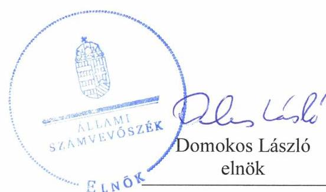
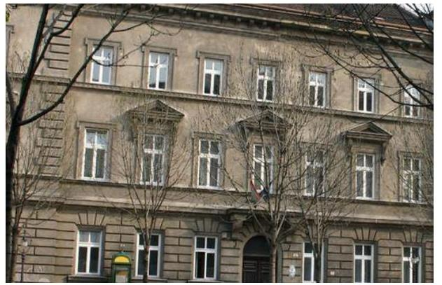
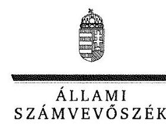
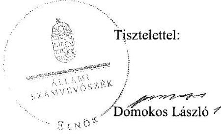

# Jelenetés 

## Központi költségvetési szervek ellenőrzése

Pesti Barnabás Élelmiszeripari Szakgimnázium és Szakközépiskola 2019. 12. hó 19. nap

---

# AZ ELLENŐRZÉST FELÜGYELTE:

## TÓTH MARIANNA felügyeleti vezető

## AZ ELLENŐRZÉST VEZETTE ÉS A VÉGREHAJTÁSÁÉRT FELELŐS:

### BAJNAI ZSUZSANNA ellenőrzésvezető

### A PROGRAM ÖSSZEÁLLÍTÁSÁÉRT FELELŐS:

### TÓTPÁL SZABOLCS osztályvezető

---

**IKTATÓSZÁM:** EL-2316-001/2019.

**TÉMASZÁM:** 2450

**ELLENŐRZÉS-AZONOSÍTÓ SZÁM:** V079166

---

Jelentéseink az Országgyűlés számítógépes hálózatán és az Interneten a www.asz.hu címen is olvashatóak.

---

# TARTALOMJEGYZÉK 

■ ÖSSZEGZÉS ..... 5
— AZ ELLENŐRZÉS CÉLJA ..... 6
— AZ ELLENŐRZÉS TERÜLETE ..... 7
— AZ ELLENŐRZÉS HÁTTERE, INDOKOLTSÁGA ..... 8
— A JELENTÉS LÉNYEGES KÉRDÉSKÖRE ..... 9
— AZ ELLENŐRZÉS HATÓKÖRE ÉS MÓDSZEREI ..... 10
— MEGÁLLAPÍTÁSOK ..... 12
— KÖVETKEZTETÉSEK ..... 13
— MELLÉKLETEK ..... 15
I. sz. melléklet: Értelmező szótár ..... 15
— FÜGGELÉK: ÉSZREVÉTELEK ..... 17
— RÖVIDÍTÉSEK JEGYZÉKE ..... 21

---

.

---

# ÖSSZEGZÉS 

A Pesti Barnabás Élelmiszeripari Szakgimnázium és Szakközépiskola belső kontrollrendszerének kialakítása és működtetése nem biztosította a közpénzekkel, a nemzeti vagyonnal való felelős, átlátható, elszámoltatható gazdálkodást, nem nyújtott védelmet a korrupciós kockázatokkal szemben.

## Az ellenőrzés társadalmi indokoltsága

Magyarország versenyképességének és a magyar gazdaság fejlődésének alapvető feltétele a magyar munkavállalók megfelelő szakmai képzettsége és felkészültsége, amelyben a szakképzési rendszernek döntő szerepe van. A mezőgazdaság vonatkozásában is kiemelten fontos ez, hiszen a magyar mezőgazdaság piaci versenyképességét és eredményességét nagymértékben befolyásolja az agrárszférában dolgozók képzettsége, felkészültsége. A szakképzés legjelentősebb színterei a szakképző iskolák. Az eredményes és célszerű szakképzés alapja és alapvető feltétele a szakképző intézmények közpénzekkel és a közvagyonnal való törvényes, átlátható és a korrupcióval szembeni védelmet biztosító működése és gazdálkodása. Ezért ezen szervezetekkel szemben is alapvető társadalmi igény, hogy a rájuk bízott közpénzekkel, közvagyonnal szabályosan gazdálkodjanak. Emellett a szakképzésben részt vevő pedagógusok, tanulók és a szülők jogos elvárása, hogy a szakképző iskolák működése átlátható és elszámoltatható legyen. Mindezen igényekkel összhangban, a közpénzügyek átláthatóságának előmozdítása, a közvagyon védelme érdekében került sor az agrár szakképző iskolák belső kontrollrendszerének és gazdálkodásának ellenőrzésére.

A Pesti Barnabás Élelmiszeripari Szakgimnázium és Szakközépiskola mintegy 150 millió Ft bevételből gazdálkodik, vagyona meghaladja a 600 millió Ft-ot, ezért indokolt belső kontrollrendszerének, pénzügyi- és vagyongazdálkodásának ellenőrzése.

## Főbb megállapítások, következtetések

A Pesti Barnabás Élelmiszeripari Szakgimnázium és Szakközépiskola belső kontrollrendszerének kialakítása és működtetése nem volt szabályszerű. A jogszabályi előírás ellenére nem rendelkezett a feladatokat, a hatásköri és felelősségi viszonyokat meghatározó szervezeti és működési szabályzattal, így nem volt biztosított az elszámoltatható működés alapvető feltétele. Nem készítették el a számviteli politikát, annak keretében az eszközök és források leltárkészítési és leltározási-, az eszközök és források értékelési szabályzatát, a pénzkezelési szabályzatot, nem vezették a gazdálkodási jogkörgyakorlásra jogosult személyekről és aláírás mintájukról a nyilvántartást, így nem volt biztosítva a közpénzfelhasználás szabályozottsága, a nemzeti vagyonnal történő felelős gazdálkodás. Nem valósult meg a belső kontrollrendszer minőségének nyomon követése, értékelése, a belső kontrollrendszer működésére vonatkozó vezetői nyilatkozat elkészítésének elmulasztása miatt.

A vagyonnyilatkozat-tételi kötelezettséghez kapcsolódó szabályozás elmaradása miatt nem tették meg a legalapvetőbb intézkedést sem a korrupció megelőzése érdekében.

Pénzügyi gazdálkodása nem volt szabályszerű a 2016. évben, mert nem vezették a kötelezettségvállalások nyilvántartását. A nyilvántartás hiánya miatt nem rendelkeztek megbízható információkkal a pénzügyi döntések meghozatalához.

A vagyongazdálkodás nem volt szabályszerű, az aláírás mintákról vezetett nyilvántartási, a leltárkészítési és leltározási szabályzat megalkotására vonatkozó kötelezettség elmulasztása, továbbá a 2017. évi leltár elkészítésének elmaradása miatt. Leltár hiányában a 2017. évi számviteli beszámoló nem mutatott megbízható és valós képet a gazdálkodásról.

---

# AZ ELLENŐRZÉS CÉLJA 

AZ ELLENŐRZÉS CÉLJA annak értékelése volt, hogy a központi költségvetési szerv belső kontrollrendszerének kialakítása és működtetése szabályszerű volt-e, biztosította-e az átlátható, szabályszerű, gazdaságos, hatékony és eredményes gazdálkodás feltételeit; kiépítették és erősítették-e a korrupciós kockázatok kezelését szolgáló integritás kontrollokat. További cél a pénzügyi- és vagyongazdálkodás szabályszerűségének megítélése volt.

---

# AZ ELLENŐRZÉS TERÜLETE

## Pesti Barnabás Élelmiszeripari Szakgimnázium és Szakközépiskola

A budapesti székhelyű, az Agrárminisztérium fenntartásában működő Intézmény1 tevékenysége szakgimnáziumi, szakközépiskolai nevelésre-oktatásra, sajátos nevelési igényű tanulók tanítására, valamint felnőttoktatásra terjedt ki. A képzések az élelmiszeripari szakágazatban folytak, technikusi, szakács, pék, cukrász szakmacsoportokban adtak szakképesítést.

Az ellenőrzött időszakban az Intézmény vezetőjének2 személye nem változott.

A gazdálkodási feladatokat az Intézmény látta el.

---

# AZ ELLENŐRZÉS HÁTTERE, INDOKOLTSÁGA 

BELSŐ KONTROLLRENDSZER kialakítása és működtetése nélkül nem valósítható meg a közpénzek, a közvagyon átlátható, szabályos, gazdaságos, hatékony és eredményes felhasználása. A belső kontrollrendszer azt a célt szolgálja, hogy a költségvetési szervek működésük és gazdálkodásuk során a tevékenységeket szabályszerűen hajtsák végre, teljesítsék elszámolási kötelezettségeiket és megvédjék az erőforrásokat a veszteségektől, a károktól és a nem rendeltetésszerű használattól.

A belső kontrollrendszer magában foglalja mindazon elveket, eljárásokat és belső szabályzatokat, amelyek biztosítják, hogy a költségvetési szerv valamennyi tevékenysége és célja összhangban legyen a szabályszerűséggel, szabályozottsággal, valamint a gazdaságosság, hatékonyság és eredményesség követelményeivel, az eszközökkel és forrásokkal való gazdálkodásban ne kerüljön sor pazarlásra, visszaélésre, rendeltetésellenes felhasználásra. Megfelelő, pontos és naprakész információk álljanak rendelkezésre a költségvetési szerv működésével kapcsolatosan, és a belső kontrollrendszer harmonizációjára, összehangolására vonatkozó jogszabályok végrehajtásra kerüljenek. Az integritás kontrollok kiépítése, erősítése a szervezet korrupciós kockázatainak kezelését szolgálja.

## AZ ÁLLAMHÁZTARTÁS KÖZPONTI ALRENDSZERÉNEK

közpénz felhasználása, az intézmények által ellátott közfeladatok sokrétűsége, valamint a feladatellátásához rendelt vagyon nagyságrendje indokolja, hogy az ÁSZ ${ }^{3}$ ellenőrzéseket folytasson a pénzügyi- és vagyongazdálkodás területén.

Az államháztartás központi alrendszerébe tartozó szervezet vagyona a nemzeti vagyon része. Az Alaptörvény ${ }^{4}$ is rögzíti, hogy a vagyonnal való gazdálkodás célja a közérdek szolgálata. Az ÁSZ ellenőrzi az éves költségvetési törvény végrehajtását, az ellenőrzés során feltárt kockázatok és a terület folyamatos elemzésével beazonosított kockázatok kezelése érdekében ráépülő ellenőrzésekkel kontrollálja a költségvetési szervek gazdálkodását, működését, hogy az ellenőrzések megállapításaival támogassa az ellenőrzött szervezetek szabályszerű gazdálkodását, javaslataival elősegítse az Alaptörvényben megfogalmazott alapvetések érvényesülését a mindennapi életben a szervezetek szintjén.

Az ellenőrzés várhatóan hozzájárul a központi intézmények pénzügyi helyzetének pontosabb megítéléséhez, elősegítheti a gazdálkodás szabályszerűségének javítását.

---

# A JELENTÉS LÉNYEGES KÉRDÉSKÖRE 

Az Intézmény belső kontrollrendszerének kialakítása és működtetése biztosította-e a közpénzekkel és a nemzeti vagyonnal történő felelős gazdálkodást, pénzügyi- és vagyongazdálkodása szabályszerű volt-e?

---

# AZ ELLENŐRZÉS HATÓKÖRE ÉS MÓDSZEREI 

## Az ellenőrzés típusa

Megfelelőségi ellenőrzés.

## Az ellenőrzött időszak

- integritás és belső kontrollrendszer 2016-2017. évek;
- vagyongazdálkodás 2016-2017. évek;
- pénzügyi gazdálkodás 2016. év.

## Az ellenőrzés tárgya

Az Intézmény belső kontrollrendszerének kialakítása és működtetése, pénzügyi és vagyongazdálkodása, az integritáskontrollok kiépítettsége, az integritás szemlélet érvényesülése.

## Az ellenőrzött szervezet

Pesti Barnabás Élelmiszeripari Szakgimnázium és Szakközépiskola

## Az ellenőrzés jogalapja

Az ellenőrzés jogszabályi alapját az ÁSZ tv. ${ }^{5}$ 1. § (3) bekezdés, 5. § (2)(3) bekezdései, 5. § (4) bekezdés a) pontja, valamint az Áht. ${ }^{6}$ 61. § (2) bekezdésének előírásai képezték.

## Az ellenőrzés módszerei

Az ÁSZ az ellenőrzést az ellenőrzési program ellenőrzési kérdései, az ellenőrzött időszakban hatályos jogszabályok, az ellenőrzés szakmai szabályok és módszertanok figyelembe vételével, valamint a nemzetközi standardokat irányadónak tekintve végezte.

Az ellenőrzés ideje alatt az ellenőrzött szervezettel történő kapcsolattartást az ÁSZ Szervezeti és Működési Szabályzatának vonatkozó előírásai alapján biztosította.

Az ellenőrzési kérdések megválaszolásához szükséges bizonyítékok megszerzése az ellenőrzött által rendelkezésre bocsátott dokumentumokra, adatokra alapozva megfigyelés, kérdésfeltevés (információkérés),

---

valamint elemző eljárás. Az ellenőrzési bizonyítékként felhasználható adatforrások közé tartoztak egyrészt az ellenőrzési programban felsorolt adatforrások, másrészt az ellenőrzés szempontjából releváns információt tartalmazó dokumentumok.

Amennyiben az ellenőrzött szervezet működését és gazdálkodását alapvetően meghatározó dokumentum hiánya miatt, valamely lényeges kérdéskörre vonatkozóan az ÁSZ megállapítást tett, további ellenőrzési tevékenységek az adott kérdéskörrel és az azzal szoros logikai kapcsolatban lévő kérdéskörökkel - ráépülő jelleggel - nem kerültek végrehajtásra.

---

# MEGÁLLAPÍTÁSOK 

## 1. Az Intézmény belső kontrollrendszerének kialakítása és működtetése biztosította-e a közpénzekkel és a nemzeti vagyonnal történő felelős gazdálkodást, pénzügyi- és vagyongazdálkodása szabályszerű volt-e?

Összegző megállapítás

Az Intézmény belső kontrollrendszerének kialakítása és működtetése nem biztosította a közpénzekkel és a nemzeti vagyonnal való felelős gazdálkodást, pénzügyi- és vagyongazdálkodása nem volt szabályszerű.

A BELSŐ KONTROLLRENDSZER kialakítása és működtetése nem volt szabályszerű, a felelős gazdálkodást nem biztosította, mert az Intézmény vezetője
$\longrightarrow$ nem állapította meg az Intézmény szervezetének, feladatai ellátásának részletes belső rendjét és módját szervezeti és működési szabályzatban az Áht. 10. § (5) bekezdésében foglaltak ellenére a 2016. évben;
$\longrightarrow$ a szervezeti és működési szabályzat hiányában nem tett eleget a Vnytv. ${ }^{7} 4 . \S$ a) pontjában előírt a vagyonnyilatkozat-tételi kötelezettséggel érintett munkakörök meghatározásának;
$\longrightarrow$ nem készítette el a számviteli politikát, és annak keretében az eszközök és a források leltárkészítési és leltározási szabályzatát, az eszközök és a források értékelési szabályzatát és a pénzkezelési szabályzatot a Számv. tv. ${ }^{8} 14 . \S$ (3) bekezdésének, az (5) bekezdés a), b) és d) pontjaiban előírtak ellenére a 2016-2017. években;
$\longrightarrow$ nem vezetett nyilvántartást az Ávr. ${ }^{9} 60 . \S$ (3) bekezdésében foglaltak ellenére a kötelezettségvállalásra, teljesítés igazolására jogosult személyekről és aláírás-mintájukról a 2016-2017. években;
$\longrightarrow$ nem értékelte a belső kontrollrendszer minőségét a Bkr. ${ }^{10}$ 11. § (1) bekezdése ellenére a 2016-2017. években.

A PÉNZÜGYI GAZDÁLKODÁS a 2016. évben nem volt szabályszerű, mert az Intézmény vezetője nem gondoskodott az Áhsz. ${ }^{11} 39 . \S$ (1) bekezdésében előírtak ellenére a kötelezettségvállalások nyilvántartásának vezetéséről.

A VAGYONGAZDÁLKODÁS a 2016-2017. években nem felelt meg a jogszabályi előírásoknak az aláírás-mintákról vezetett nyilvántartás hiánya miatt, az eszközök és a források leltárkészítési és leltározási szabályzata elkészítésének elmulasztása miatt, továbbá, mert nem állítottak össze leltárt a 2017. évben a Számv. tv. 69. (1) és az Áhsz. 22. § (1) bekezdéseiben előírtak ellenére a mérleg tételeinek alátámasztásához.

---

# KÖVETKEZTETÉSEK 

Az ÁSZ tv. 32. § (1) bekezdésében foglaltak értelmében az ÁSZ jelentés tartalmazza a feltárt tényeket, az ezeken alapuló megállapításokat, következtetéseket, amelyeknek a 24. § (1) bekezdés d) pontja szerint okszerűnek és megalapozottnak kell lenniük.

A Pesti Barnabás Élelmiszeripari Szakgimnázium és Szakközépiskola azáltal, hogy a jogszabályi előírás ellenére nem rendelkezett a feladatokat, a hatásköri és felelősségi viszonyokat meghatározó szervezeti és működési szabályzattal, nem biztosította az átlátható és elszámoltatható működés alapvető feltételét.

Az Intézmény nem alakította ki a szabályszerű gazdálkodási környezetet, ezáltal nem voltak biztosítottak a központi költségvetésből kapott támogatások átlátható és elszámoltatható igénybevételének és felhasználásának feltételei. Mindezek következtében nem volt igazolható a vagyonnal való felelős gazdálkodás illetve - tekintve, hogy felmerül a számviteli elszámolások szabálytalanságának lehetősége - a beszámoló valódisága is megkérdőjelezhető.

A Pesti Barnabás Élelmiszeripari Szakgimnázium és Szakközépiskola esetében felmerül a jogosulatlan kifizetések lehetősége, tekintettel arra, hogy nem vezették a gazdálkodási jogkörgyakorlásra jogosult személyekről és aláírás mintájukról a nyilvántartást.

Azzal, hogy a vagyonnyilatkozat-tételi kötelezettséghez kapcsolódó szabályozást az Intézmény nem alakította ki, nem tette meg a legalapvetőbb intézkedést a korrupció megelőzése
 érdekében.

---

.

---

# MELLÉKLETEK 

- I. SZ. MELLÉKLET: ÉRTELMEZŐ SZÓTÁR
állami vagyon
belső kontrollrendszer
integritás
belső kontrollrendszer területei
költségvetési szerv vezetője (Bkr. alkalmazásában)
vagyongazdálkodás

Állami vagyonnak minősül:
a) az állam tulajdonában lévő dolog, valamint a dolog módjára hasznosítható természeti erő,
b) az a) pont hatálya alá nem tartozó mindazon vagyon, amely vonatkozásában törvény az állam kizárólagos tulajdonjogát nevesíti,
c) az állam tulajdonában lévő tagsági jogviszonyt megtestesítő értékpapír, illetve az államot megillető egyéb társasági részesedés,
d) az államot megillető olyan immateriális, vagyoni értékkel rendelkező jogosultság, amelyet jogszabály vagyoni értékű jogként nevesít. (Forrás: Vtv. ${ }^{12} 1$. § (2) bekezdése)
A belső kontrollrendszer a kockázatok kezelése és tárgyilagos bizonyosság megszerzése érdekében kialakított folyamatrendszer, amely azt a célt szolgálja, hogy a működés és gazdálkodás során a tevékenységeket szabályszerűen, gazdaságosan, hatékonyan, eredményesen hajtsák végre, az elszámolási kötelezettségeket teljesítsék, megvédjék az erőforrásokat a veszteségektől, károktól és nem rendeltetésszerű használattól.(Forrás: Áht. 69. § (1) bekezdése)
Az integritás - egyik gyakran használt jelentése szerint - az elvek, értékek, cselekvések, módszerek, intézkedések konzisztenciáját jelenti, vagyis olyan magatartásmódot, amely meghatározott értékeknek megfelel. Integritás-irányítási rendszer bevezetése a szervezetben a szervezethez rendelt közfeladatok integritás szempontú ellátását, az érték alapú működéssel (integritással) összefüggő szervezeti követelmények következetes érvényesítését jelenti. (Forrás: Nemzetgazdasági Minisztérium: Államháztartási Belső Kontroll Standardok és Gyakorlati Útmutató 1.6. Etikai értékek és integritás 46. oldal, 2017. szeptember)

A kontrollkörnyezet, az integrált kockázatkezelési rendszer, a kontrolltevékenységek, az információs és kommunikációs rendszer, valamint a nyomon követési (monitoring) rendszer. (Forrás: Bkr. 3. §-a)
Központi költségvetési szerv esetén a központi költségvetési szerv első számú vezetője. (Forrás: Bkr. 2. § n) pont na) alpont)
A nemzeti vagyongazdálkodás feladata a nemzeti vagyon rendeltetésének megfelelő, az állam, az önkormányzat mindenkori teherbíró képességéhez igazodó, elsődlegesen a közfeladatok ellátásához és a mindenkori társadalmi szükségletek kielégítéséhez szükséges, egységes elveken alapuló, átlátható, hatékony és költségtakarékos működtetése, értékének megőrzése, állagának védelme, értéknövelő használata, hasznosítása, gyarapítása, továbbá az állam vagy a helyi önkormányzat feladatának ellátása szempontjából feleslegessé váló vagyontárgyak elidegenítése. (Forrás: Nvtv. ${ }^{13}$ 7. § (2) bekezdése)

---

.

---

# FÜGGELÉK: ÉSZREVÉTELEK 

A jelentéstervezetet a Számvevőszék 15 napos észrevételezésre megküldte az ellenőrzött szervezetek vezetőinek az ÁSZ tv. 29. § (1) bekezdése előírásának megfelelően.

A Pesti Barnabás Élelmiszeripari Szakgimnázium és Szakközépiskola igazgatója a jelentéstervezet megállapításaira írásban észrevételt tett.
Az ÁSZ tv. 29. § (3) bekezdésével összhangban az ÁSZ a Függelékben feltünteti az ellenőrzés megállapításaival kapcsolatban tett, figyelembe nem vett észrevételeket, és megindokolja, hogy azokat miért nem fogadta el.

[^0]
[^0]:    * 29. § (1) Az Állami Számvevőszék az ellenőrzési megállapításait megküldi az ellenőrzött szervezet vezetőjének vagy az általa megbízott személynek, és annak, akinek személyes felelősségét állapította meg.
    (2) Az ellenőrzött szervezet vezetője és a felelősként megjelölt személy az ellenőrzés megállapításaira tizenöt napon belül írásban észrevételt tehet.
    (3) Az Állami Számvevőszék az észrevételre a beérkezésétől számított harminc napon belül írásban válaszol. A figyelembe nem vett észrevételeket köteles a jelentésben feltüntetni, és megindokolni, hogy azokat miért nem fogadta el.

---

Iktatószám: $\lg (1) 1273 / 1 / 2019$

# Címzett: 

Domokos László elnök úr részére
Állami Számvevőszék
1052 Budapest,
Apáczai Csere János u. 10.
Tárgy: Észrevétel

Tisztelt Elnök Úr!

Az alábbiakban teszem meg észrevételeimet az EL-1102-020/2019. iktatószám mellékleteként megküldött a „Központi költségvetési szervek ellenőrzése - Pesti Barnabás Élelmiszeripari Szakgimnázium és Szakközépiskola" című számvevőszéki jelentéstervezetükre.

Az Állami Számvevőszék által az ellenőrzött időszakra vonatkozóan kért dokumentumokkal rendelkezünk, azonban határidőn belül nem kerültek feltöltésre a megadott felületre. Az intézmény alkalmazásában állt (2016. 08. 15-től 2019. 03. 31-ig), megbízott gazdasági vezető indokolatlanul nem tett eleget az adatszolgáltatásnak. Amint tudomásomra jutott próbáltuk a felületre feltölteni, de ez már nem sikerült, amit azonnal jeleztem, majd a helyszíni ellenőrzéskor bemutattuk a dokumentumokat.

Az Állami Számvevőszék nem vonhatott le más következtetést a dokumentumok hiányában, mint, hogy az intézmény szabályozatlanul, jogszabályellenesen működik.

Fentiek alapján kijelentem, hogy a pénzeszközök rendeltetésellenes felhasználásának jogszabályellenes állapota a vizsgált időszakban és azóta sem áll fenn, melynek alátámasztására külön levélben mellékelem az aktuális szabályzatokat.

Budapest, 2019. november 4.

Molnár Zoltán intézményvezető

---

# Molnár Zoltán úr 

igazgató
Pesti Barnabás Élelmiszeripari Szakgimnázium és Szakközépiskola

## Budapest

## Tisztelt Igazgató Úr!

A „Központi költségvetési szervek ellenőrzése - Pesti Barnabás Élelmiszeripari Szakgimnázium és Szakközépiskola" címmel készített számvevőszéki jelentéstervezetre tett észrevételét megkaptam.
Az Állami Számvevőszék észrevételekre vonatkozó álláspontjáról a felügyeleti vezető által készített részletes tájékoztatást csatoltan megküldöm.
Tájékoztatom Intézményvezető urat, hogy a számvevőszéki jelentésben - az Állami Számvevőszékről szóló 2011. évi LXVI. törvény 29. § (3) bekezdése alapján - a figyelembe nem vett észrevételeket szerepeltetjük az elutasítás indokának feltüntetésével.

Budapest, 2019. 11. hó 21. nap

Melléklet: Tájékoztatás az észrevételek kezeléséről

---

# Tájékoztatás az észrevételek kezeléséről 

A „Központi költségvetési szervek ellenőrzése - Pesti Barnabás Élelmiszeripari Szakgimnázium és Szakközépiskola" című jelentéstervezetre (továbbiakban: jelentéstervezet) a 2019. november 4-én kelt, $\operatorname{lg}(1) 1273 / 1 / 2019$ iktatószámú levélben megküldött észrevételeit áttekintettem. Az észrevételek kezeléséről az alábbi tájékoztatást adom.
Az Állami Számvevőszékről szóló 2011. évi LXVI. törvény (ÁSZ tv.) 28. § (2) bekezdése értelmében a közreműködésre felhívott szervezet az Állami Számvevőszék (a továbbiakban: ÁSZ) részére - annak kérésére soron kívül, de legkésőbb öt munkanapon belül - az ellenőrzés tervezhetősége, meghatározása, illetve lefolytatása érdekében szükséges adatokat és dokumentumokat rendelkezésre bocsátja, illetve a kapcsolódó tájékoztatást köteles megadni.
Az ÁSZ az ellenőrzési megállapításait az ellenőrzött szervezet közreműködési kötelezettsége keretében, az ellenőrzött szervezet által Teljességi és hitelességi nyilatkozattal alátámasztott dokumentumokra alapozva fogalmazza meg. Az ÁSZ-hoz visszaérkezett tértivevény alapján a Pesti Barnabás Élelmiszeripari Szakgimnázium és Szakközépiskola (a továbbiakban: intézmény) az adatszolgáltatásra felhívó EL-1192-001/2018. iktatószámú levelet 2018. október 16-án vette át. Az adatszolgáltatásra rendelkezésre álló - ÁSZ tv.-ben meghatározott - határidő 2018. október 21-én lejárt. Az adatszolgáltatásra biztosított határidőben az intézmény dokumentumokat az ÁSZ részére nem küldött.
Intézményvezető úr tárgyi ellenőrzéshez kapcsolódóan 2019. január 22. napján nemleges adattartalmú teljességi és hitelességi nyilatkozatot tett.
Az EL-1192-023/2019. iktatószámú levélben kért és az intézmény által az lg.(1)1274/1/2019 iktatószámú levéllel beküldött dokumentumokat az ÁSZ a vagyonmegóvási intézkedés elrendelésének szükségessége tárgykörben értékeli, ezért az EL-1192-019/2019. iktatószámú számvevőszéki jelentéstervezet módosítása nem indokolt.

Budapest, 2019. hó N nap

Tóth Marianna felügyeleti vezető

---

# RÖVIDÍTÉSEK JEGYZÉKE 

${ }^{1}$ Intézmény
${ }^{2}$ Intézmény vezetője
${ }^{3}$ ÁSZ
${ }^{4}$ Alaptörvény
${ }^{5}$ ÁSZ tv.
${ }^{6}$ Áht.
${ }^{7}$ Vnytv.
${ }^{8}$ Számv. tv.
${ }^{9}$ Ávr.
${ }^{10}$ Bkr.
${ }^{11}$ Áhsz.
${ }^{12}$ Vtv.
${ }^{13}$ Nvtv.

Pesti Barnabás Élelmiszeripari Szakgimnázium és Szakközépiskola Pesti Barnabás Élelmiszeripari Szakgimnázium és Szakközépiskola igazgatója Állami Számvevőszék
Magyarország Alaptörvénye (hatályos: 2011. április 25-től)
2011. évi LXVI. törvény az Állami Számvevőszékről (hatályos: 2011. július 1-jétől)
2011. évi CXCV. törvény az államháztartásról (hatályos: 2011. december 31-étől)
2007. évi CLII. törvény egyes vagyonnyilatkozat-tételi kötelezettségekről (hatályos: 2007. december 8-tól)
2000. évi C. törvény a számvitelről (hatályos: 2001. január 1-től)

368/2011 (XII.31.) Korm. rendelet az államháztartási törvény végrehajtásáról (hatályos: 2012. január 1-jétől)
370/2011. (XII. 31.) Korm. rendelet a költségvetési szervek belső
kontrollrendszeréről és belső ellenőrzéséről (hatályos: 2012. január 1-jétől)
4/2013. (I. 11.) Korm. rendelet az államháztartás számviteléről (hatályos: 2014. január 1-jétől)
2007. évi CVI. törvény az állami vagyonról (hatályos: 2007. szeptember 25-étől)
2011. évi CXCVI. törvény a nemzeti vagyonról (hatályos: 2011. december 31-től)

---

# ÁLLAMI SZÁMVEVŐSZÉK 

1052 Budapest, Apáczai Csere János utca 10.
Levélcím: 1364 Budapest 4. Pf. 54
Telefon: +36 14849100 Telefax: +36 14849200
www.asz.hu
