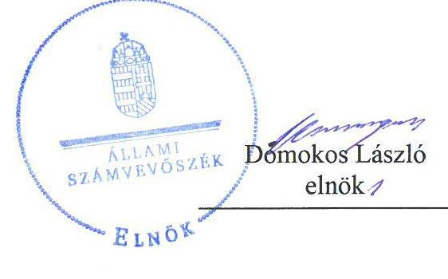
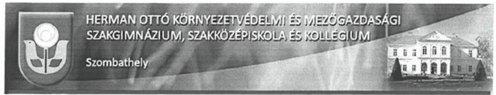
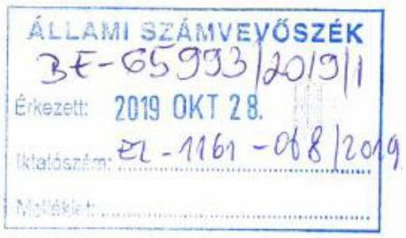
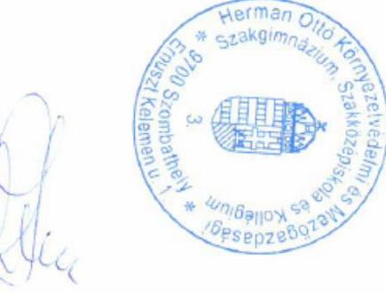
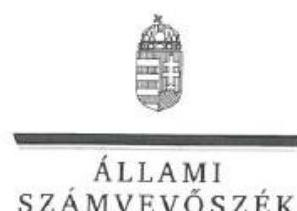
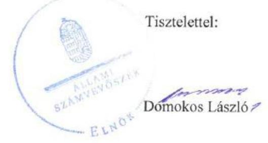
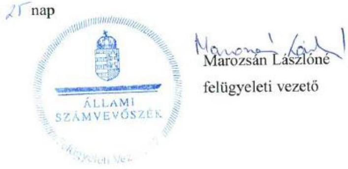

# Jelentés 

## Központi költségvetési szervek ellenőrzése

Herman Ottó Környezetvédelmi és Mezőgazdasági Szakgimnázium, Szakközépiskola és Kollégium 2019.

---

# Jelenetés 

## Központi költségvetési szervek ellenőrzése

Herman Ottó Környezetvédelmi és Mezőgazdasági Szakgimnázium, Szakközépiskola és Kollégium
2019. 12. hó 19. nap

---

# AZ ELLENŐRZÉST FELÜGYELTE:

## MAROZSÁN LÁSZLÓNÉ felügyeleti vezető

## AZ ELLENŐRZÉST VEZETTE ÉS A VÉGREHAJTÁSÁÉRT FELELŐS:

## NEMESVÁRI-HORTHY ESZTER ellenőrzésvezető

## A PROGRAM ÖSSZEÁLLÍTÁSÁÉRT FELELŐS:

## TÓTPÁL SZABOLCS osztályvezető

IKTATÓSZÁM: EL-2319-001/2019.

TÉMASZÁM: 2450

ELLENŐRZÉS-AZONOSÍTÓ SZÁM: V079156

Jelentéseink az Országgyűlés számítógépes hálózatán és az Interneta a www.asz.hu címen is olvashatóak.

---

# TARTALOMJEGYZÉK 

■ ÖSSZEGZÉS ..... 5
■ AZ ELLENŐRZÉS CÉLJA ..... 6
■ AZ ELLENŐRZÉS TERÜLETE ..... 7
■ AZ ELLENŐRZÉS HÁTTERE, INDOKOLTSÁGA ..... 8
■ A JELENTÉS LÉNYEGES KÉRDÉSKÖREI ..... 9
■ AZ ELLENŐRZÉS HATÓKÖRE ÉS MÓDSZEREI ..... 10
■ MEGÁLLAPÍTÁSOK ..... 13
■ JAVASLATOK ..... 17
■ MELLÉKLETEK ..... 19
I. sz. melléklet: Értelmező szótár ..... 19
■ FÜGGELÉKEK ..... 21
I. sz. függelék a jelentéshez ..... 21
II. sz. függelék: Észrevételek ..... 22
■ RÖVIDÍTÉSEK JEGYZÉKE ..... 31

---

.

---

# ÖSSZEGZÉS 

A Herman Ottó Környezetvédelmi és Mezőgazdasági Szakgimnázium, Szakközépiskola és Kollégium müködése, pénzügyi és vagyongazdálkodása nem volt szabályszerű. Nem volt biztositott a felelős gazdálkodás, a közpénzek átláthatósága, szabályszerűsége. A korrupciós kockázatokkal arányos integritás kontrollokat nem építették ki.

## Az ellenőrzés társadalmi indokoltsága

Magyarország versenyképességének és a magyar gazdaság fejlődésének alapvető feltétele a magyar munkavállalók megfelelő szakmai képzettsége és felkészültsége, amelyben a szakképzési rendszernek döntő szerepe van. A mezőgazdaság vonatkozásában is kiemelten fontos ez, hiszen a magyar mezőgazdaság piaci versenyképességét és eredményességét nagymértékben befolyásolja az agrárszférában dolgozók képzettsége, felkészültsége. A szakképzés legjelentősebb színterei a szakképző iskolák. Az eredményes és célszerű szakképzés alapja és alapvető feltétele a szakképző intézmények közpénzekkel és a közvagyonnal való törvényes, átlátható és a korrupcióval szembeni védelmet biztosító múködése és gazdálkodása. Ezért ezen szervezetekkel szemben is alapvető társadalmi igény, hogy a rájuk bízott közpénzekkel, közvagyonnal szabályosan gazdálkodjanak. Emellett a szakképzésben részt vevő pedagógusok, tanulók és a szülők jogos elvárása, hogy a szakképző iskolák múködése átlátható és elszámoltatható legyen. Mindezen igényekkel összhangban, a közpénzügyek átláthatóságának előmozdítása, a közvagyon védelme érdekében került sor az agrárszakképző iskolák belső kontrollrendszerének és gazdálkodásának ellenőrzésére.

## Főbb megállapítások, következtetések, javaslatok

A Herman Ottó Környezetvédelmi és Mezőgazdasági Szakgimnázium, Szakközépiskola és Kollégium kontrollkörnyezetének kialakítása a szervezeti és múködési szabályzat és a számviteli politika tartalmi hiányosságai és a hiányzó számlarend miatt nem volt szabályszerű. Az integrált kockázatkezelési rendszert az eljárásra vonatkozó szabályzat hiányában 2017. november 1-ig nem alakították ki. A kontroltevékenységek gyakorlása nem volt szabályszerű. Az információs és kommunikációs rendszer, valamint monitoring rendszer nem múködött. A belső ellenőrzést 2016. évben kialakították és múködtették, azonban a belső ellenőrzés megszervezése során a 2017-ben nem jártak el szabályszerűen. A fenti szabálytalanságok miatt a Herman Ottó Környezetvédelmi és Mezőgazdasági Szakgimnázium, Szakközépiskola és Kollégium belső kontrollrendszerének kialakítása és múködtetése a 2016-2017. évben nem volt szabályszerű.

A Herman Ottó Környezetvédelmi és Mezőgazdasági Szakgimnázium, Szakközépiskola és Kollégium költségvetési beszámolói nem mutattak megbízható és valós összképet a vagyonáról, mivel a költségvetési beszámolók mérleg tételei leltárral nem voltak alátámasztottak. A 2016. évben a kiadások elszámolása során a számviteli nyilvántartások vezetése nem volt szabályszerű.

A korrupciós kockázatok kezelését a jogszabályok által előírt integritási kontrollok kiépítettsége és a nem előírt kontrollok múködtetése nem támogatta. A Herman Ottó Környezetvédelmi és Mezőgazdasági Szakgimnázium, Szakközépiskola és Kollégium igazgatója a folyamatok teljesítményének mérésére nem alakított ki követelményeket, ezáltal a teljesítmény mérés feltételei nem voltak biztosítottak.

Az Állami Számvevőszék a jelentésében foglalt megállapítások alapján a Herman Ottó Környezetvédelmi és Mezőgazdasági Szakgimnázium, Szakközépiskola és Kollégium igazgatója részére 13 javaslatot fogalmazott meg.

---

# AZ ELLENŐRZÉS CÉLJA 

AZ ELLENŐRZÉS CÉLJA annak megítélése volt, hogy a Herman Ottó Környezetvédelmi és Mezőgazdasági Szakgimnázium, Szakközépiskola és Kollégium a vonatkozó irányító szervi feladatellátás a jogszabályi előírások betartásával történt-e, a Herman Ottó Környezetvédelmi és Mezőgazdasági Szakgimnázium, Szakközépiskola és Kollégiumnál a belső kontrollrendszer kialakítása és müködtetése szabályszerű volt-e, biztosította-e az átlátható, szabályszerű, gazdaságos, hatékony és eredményes gazdálkodás feltételeit; a pénzügyi és vagyongazdálkodása megfelelt-e a jogszabályi előírásoknak és belső szabályzatainak. Az ellenőrzés célja volt annak megállapítása is, hogy a Herman Ottó Környezetvédelmi és Mezőgazdasági Szakgimnázium, Szakközépiskola és Kollégium megfelelt-e annak az Alaptörvényben meghatározott alapvetésnek, hogy Magyarország a kiegyensúlyozott, átlátható és fenntartható költségvetési gazdálkodás elvét érvényesíti; érvényesült-e a nemzeti vagyon kezelésének és védelmének célja, azaz a vagyona a közérdeket szolgálta-e a közös szükségletek kielégítése és a természeti erőforrások megóvása, valamint a jövő nemzedékek szükségleteinek figyelembevétele mellett. Az ellenőrzés keretében az Állami Számvevőszék értékelte a Herman Ottó Környezetvédelmi és Mezőgazdasági Szakgimnázium, Szakközépiskola és Kollégiumnál a korrupciós kockázatok kezelését szolgáló integritás kontrollok kiépítettségét és az integritás szemlélet érvényesülését, továbbá a teljesítményellenőrzés feltételeinek kialakítását.

---

# **AZ ELLENŐRZÉS TERÜLETE**

### **Herman Ottó Környezetvédelmi és Mezőgazdasági Szakgimnázium, Szakközépiskola és Kollégium**

A szombathelyi székhelyű Intézmény1 jogi személy, irányító szerve és fenntartója 2013. augusztus 1-jétől a Minisztérium2. Alaptevékenysége szakgimnáziumi, szakközépiskola nevelés, oktatás, kollégiumi ellátás, felnőttoktatás. Az Intézmény erdészet és vadgazdálkodás, környezetvédelem-vizgazdálkodás, környezetvédelem, vízügy, mezőgazdaság, kertészet és parképítés, sport és kereskedelem szakmacsoportokban nyújtott képzési lehetőséget.

Az Áht.3 szerinti átalakítására az ellenőrzött időszakban nem került sor.

Az Intézmény gazdasági szervezettel nem rendelkezik, gazdasági feladatait a Minisztérium döntése alapján az AM Dunántúli Agrárszakképző Központ, Csapó Dániel Mezőgazdasági Szakgimnázium, Szakközépiskola és Kollégium látja el.

A 2016-2017. években az Igazgató4 személyében nem történt változás.

Gazdálkodásáról elkészített beszámolói szerint az Intézmény teljesített bevétele a 2016. évben 461,2 millió Ft, 2017. évben 920,1 millió Ft. Ebből a finanszírozási bevétel 2016. évben 354,7 millió Ft-ot, 2017. évben 372,7 millió Ft-ot tett ki. A 2016. évi bevételhez képest a 2017. évi bevétel jelentős növekedését európai uniós pályázati támogatás pénzeszközének átvétele eredményezte. Költségvetési kiadásai a 2016. évi 448,3 millió Ft-ról, 14,5%-os növekedéssel 2017. évben 513,3 millió Ft-ra emelkedtek.

---

# AZ ELLENŐRZÉS HÁTTERE, INDOKOLTSÁGA 

Az államháztartás központi alrendszerének közpénz felhasználása, az intézmények által ellátott közfeladatok sokrétúsége, valamint a feladatellátásához rendelt vagyon nagyságrendje indokolja, hogy az ÁSZ ${ }^{5}$ ellenőrzéseket folytasson a pénzügyi és vagyongazdálkodás területén. Az ÁSZ az ellenőrzései során feltárja a gazdálkodást, a központi alrendszer intézményei átalakulását, átszervezését érintő szabályozások esetleges hiányosságait, a szabályozással nem érintett gazdálkodási területeket, rámutathat a vagyongazdálkodási tevékenység - ezen belül a tulajdonosi joggyakorlás és vagyonkezelés - esetleges szabálytalanságaira, értékeli az állami vagyon nyilvántartására és elszámolására vonatkozó eljárásokat.

Az ellenőrzés várhatóan hozzájárul a központi intézmények pénzügyi helyzetének pontosabb megítéléséhez.

Az ellenőrzések megállapításai támogathatják az ellenőrzött szervezetek szabályszerű gazdálkodását, javaslataival elősegítheti az Alaptörvényben megfogalmazott alapvetések érvényesülését a mindennapi életben a szervezetek szintjén. A központi költségvetés rendszerében zajló folyamatok holisztikus elemzései, a kockázatok folyamatos figyelemmel kísérésének módszerével, az így kiválasztott szervezetek célzott, hatékony ellenőrzéseivel az ÁSZ betölti a legfőbb gazdasági ellenőrző szerv küldetését.

A belső kontrollrendszer kialakítása és múködtetése nélkül nem valósítható meg a közpénzek, a közvagyon átlátható, szabályos, gazdaságos, hatékony és eredményes felhasználása. A belső kontrollrendszer azt a célt szolgálja, hogy a költségvetési szervek múködésük és gazdálkodásuk során a tevékenységeket szabályszerűen hajtsák végre, teljesítsék elszámolási kötelezettségeiket és megvédjék az erőforrásokat a veszteségektől, a károktól és a nem rendeltetésszerű használattól. A belső kontrollrendszer magában foglalja mindazon elveket, eljárásokat és belső szabályzatokat, melyek biztosítják, hogy a költségvetési szerv valamennyi tevékenysége és célja összhangban legyen a szabályszerűséggel, szabályozottsággal, valamint a gazdaságosság, hatékonyság és eredményesség követelményeivel, az eszközökkel és forrásokkal való gazdálkodásban ne kerüljön sor pazarlásra, visszaélésre, rendeltetésellenes felhasználásra. Megfelelő, pontos és naprakész információk álljanak rendelkezésre a költségvetési szerv múködésével kapcsolatosan, és a belső kontrollrendszer harmonizációjára, öszszehangolására vonatkozó jogszabályok végrehajtásra kerüljenek. Az integritás kontrollok kiépítése, erősítése a szervezet korrupciós kockázatainak kezelését szolgálja. A teljesítménykövetelmények meghatározása és múködtetése megalapozhatja a központi költségvetési szervnél a teljesítményellenőrzés lefolytatását.

Az egyes ellenőrzések megállapításaival és egy időszak ellenőrzési eredményeinek elemzésével az ÁSZ ráirányíthatja a jogalkotók figyelmét a központi alrendszerben vagy annak egy ágazatában esetlegesen felmerülő pénzügyi, szabályozási feszültségekre. Az elvégzett ellenőrzések során az ÁSZ „jó gyakorlatokat" is azonosíthat, melyeket tanácsadó funkciója keretében szélesebb körben is megismertethet az érintettekkel, ezáltal is hozzájárulva a költségvetési rendszer szabályozott, átlátható, kiegyensúlyozott és fenntartható múködéséhez.

---

# A JELENTÉS LÉNYEGES KÉRDÉSKÖREI 

1. Szabályszerú volt-e az ellenőrzött központi költségvetési szervre vonatkozó irányító szervi feladatellátás?
2. A belső kontrollrendszer kialakítása és müködtetése szabályszerű volt-e, biztositotta-e a közpénzekkel és a nemzeti vagyonnal történő szabályszerű és átlátható gazdálkodást?
3. A központi költségvetési szerv pénzügyi gazdálkodása szabályszerű volt-e?
4. A központi költségvetési szerv vagyongazdálkodása szabályszerű volt-e?
5. A központi költségvetési szervnél alakítottak-e ki a teljesítmény mérésére vonatkozó követelményeket?

---

# AZ ELLENŐRZÉS HATÓKÖRE ÉS MÓDSZEREI 

## Az ellenőrzés típusa

Megfelelőségi ellenőrzés

## Az ellenőrzött időszak

2016-2017. évek

## Az ellenőrzés tárgya

A Herman Ottó Környezetvédelmi és Mezőgazdasági Szakgimnázium, Szakközépiskola és Kollégiumra vonatkozó irányító szervi feladatok ellátása a 2016. évben.

A Herman Ottó Környezetvédelmi és Mezőgazdasági Szakgimnázium, Szakközépiskola és Kollégium belső kontrollrendszerének a kialakítása és múködtetése, valamint vagyongazdálkodása tekintetében 2016-2017. évek, a pénzügyi gazdálkodás tekintetében a 2016. év, az integritáskontrollok kiépítettsége és a teljesítményellenőrzés feltételei a 2017. év.

## Az ellenőrzött szervezet

Herman Ottó Környezetvédelmi és Mezőgazdasági Szakgimnázium, Szakközépiskola és Kollégium, a gazdasági szervezet feladatait ellátó FM Dunántúli Agrárszakképző Központ, Csapó Dániel Mezőgazdasági Szakgimnázium, Szakközépiskola és Kollégium, valamint az irányító szervi feladatellátás tekintetében a Földművelésügyi Minisztérium (2018. május 18-tól Agrárminisztérium).

## Az ellenőrzés jogalapja

Az ellenőrzés jogszabályi alapját az ÁSZ tv. ${ }^{6}$ 1. § (3) bekezdése, 5. § (2)-(3) bekezdései, a (4) bekezdés a) pontja és (6) bekezdése, valamint az Áht. 61. § (2) bekezdésének előírásai képezték.

---

# Az ellenőrzés módszerei 

Az ellenőrzésre a szakmai program szempontjai, az ellenőrzött időszakban hatályos jogszabályok, az ellenőrzés szakmai szabályai, a jelen ellenőrzésre irányadó ÁSZ módszertanok figyelembevételével került sor.

Az ÁSZ az ellenőrzés ideje alatt az ellenőrzött szervezetekkel az ÁSZ SZMSZ'-ének vonatkozó előírásai alapján biztosította a kapcsolattartást. Az ellenőrzési kérdések megválaszolásához szükséges bizonyítékok megszerzése az ellenőrzött szervezetek által rendelkezésre bocsátott dokumentumokra, adatokra alapozva megfigyelés, szemle (szemrevételezés), kérdésfeltevés (információkérés), mintavételezés, valamint elemző eljárás útján történt. Az ellenőrzési bizonyítékként felhasználható adatforrások közé tartoztak egyrészt a szakmai program részletes szempontjainál felsorolt adatforrások, másrészt minden egyéb - az ellenőrzés folyamán feltárt, az ellenőrzés szempontjából információt tartalmazó - dokumentum.

Az ellenőrzés lefolytatásához az ellenőrzött szervezetek az ÁSZ által kért tanúsítványok kitöltésével és dokumentumok megküldésével szolgáltattak adatot, amelyek valódiságát és teljes körűségét az ellenőrzött szervezet vezetője által tett teljességi és hitelességi nyilatkozat igazolta. Az így rendelkezésre bocsátott adatok, információk kontrollja az ellenőrzés keretében történt.

Az Intézmény belső kontrollrendszere egyes pilléreinek kialakítására és működtetésére vonatkozó értékelés „szabályszerü", amennyiben az értékelt területen az elért „igen" válaszok százalékban kifejezett, egész számra kerekített aránya legalább 85\%, „nem szabályszerű", ha nem éri el a 85\%ot. Az Intézmény belső kontrollrendszerének összesített értékelése az egyes részterületek esetében kapott megfelelőségi arányok számtani átlaga alapján történt és megegyezik a pillérenként (kontrollterületenként) alkalmazott százalékos értékelésekkel, a következő eltérésekkel: a kontrollrendszer egésze esetében a „szabályszerü" értékelésnek a százalékos értéken felül további feltétele, hogy egyik kontrollterület sem kaphat „nem szabályszerű" értékelést.

Az ÁSZ statisztikai módszereken alapuló mintavételt alkalmazott.
A kiadások (külső személyi juttatások, felhalmozási kiadások, dologi kiadások) és bevételek (értékesítésből és bérbeadásból származó bevételek) esetében az ellenőrzés azokra a legnagyobb értékű tételekre - a lényeges sokaságra - terjedt ki, melyek összértéke eléri a teljes sokaság összértékének 50\%-át. A 2017. évi kiadások elszámolásának szabályszerűséget a lényeges sokaságból véletlen mintavételi eljárással kiválasztott tételek alapján ellenőrizte az ÁSZ. A 2016. évi bevételek esetében a lényeges sokaság tételes ellenőrzésére került sor. A 2017. évi beruházások, felújítások végrehajtása és év végi értékelésének szabályszerűsége ellenőrzése a teljes sokaságból véletlen mintavétellel kiválasztott tételek alapján történt. A mintavétellel ellenőrzött területek esetében minden egyes tétel vonatkozásában az elszámolás és értékelés szabályszerűségére vonatkozó kérdéseket tett fel az ÁSZ.

Szabályszerűnek értékelt az ÁSZ egy ellenőrzött területet, amennyiben 95\%-os bizonyossággal az ellenőrzött sokaságban az átlagos hibaarány legfeljebb 10\%, nem szabályszerűnek, amennyiben 10\%-nál magasabb arányt képviselt. Abban az esetben, ha az ellenőrzött sokaság tekintetében a 10\%-

---

os hibaarányhoz való viszony megítélésének megbízhatósága nem érte el a 95\%-ot, annak elérése érdekében az értékelés további szempontokkal került kiegészítésre, a feltárt hibák értékének figyelembevételével.

---

# 1. Szabályszerú volt-e az ellenőrzött központi költségvetési szervre vonatkozó irányító szervi feladatellátás? 

Összegző megállapítás Az Intézményre vonatkozó irányító szervi feladatellátás szabályszerű volt.

Az Irányító szerv ${ }^{8}$ az Ávr. ${ }^{9}$ előírásai szerint meghatározta az általános és kötelezően érvényesítendő tervezési követelményeket, előfeltételeket, módszertant, előírásokat, az Áht. és az Áhsz. ${ }^{10}$ előírásai alapján jóváhagyta az Intézmény elemi költségvetését és éves költségvetési beszámolóját. Az Áht. előírásai alapján az Igazgatót beszámoltatta az Intézmény gazdálkodásáról és a szakmai feladatellátásáról.

Munkáltatói jogait az Irányító szerv szabályszerűen gyakorolta. Az Igazgató rendelkezett a jogszabályi előírások szerint az igazgatói feladatok ellátására a Miniszter ${ }^{11}$ által adott megbízással.

## 2. A belső kontrollrendszer kialakítása és múködtetése szabályszerű volt-e, biztosította-e a közpénzekkel és a nemzeti vagyonnal történő szabályszerű és átlátható gazdálkodást?

## Összegző megállapítás

A belső kontrollrendszer kialakítása és múködtetése nem volt szabályszerű 2016-2017. években.

A KONTROLLKÖRNYEZET kialakítása 2016-2017. évben nem volt szabályszerű. Az SZMSZ ${ }^{12}$ - a Bkr. ${ }^{13}$ 15. (2) bekezdés előírása ellenére - a belső ellenőrzést végző személy feladatait nem írta elő. Az SZMSZ-ben - a Vnytv ${ }^{14}$. 4. § a) pontjának előírásai ellenére - nem tüntették fel a vagyonnyilatkozat-tételi kötelezettséggel járó munkaköröket.

Az Igazgató a Számviteli politika ${ }^{15}$ módosításáról - az Áhsz. 50. § (1) bekezdése és a Számv. tv. ${ }^{16}$ 14. § (11) bekezdése ellenére - az Áhsz. 2014. január 1-jét követő hatályba lépését követő 90 napon belül nem gondoskodott. A Számviteli politika - a Számv. tv. 14. § (4) bekezdése ellenére nem rögzítette azokat az Intézményre jellemző szabályokat, előírásokat, módszereket, hogy a törvényben biztosított választási, minősítési lehetőségek közül az Intézmény által alkalmazott gyakorlatot milyen okok miatt kell megváltoztatni. A Számviteli politika - az Áhsz. 50. § (7) bekezdésében előírtak ellenére - nem rögzítette az általános költségek, valamint az általános kiadások és 2017. január 1-től a bevételek tevékenységekre történő felosztásának módját, a felosztáshoz alkalmazott mutatókat, vetítési alapokat.

Az Igazgató - a Számv. tv. 161. § (1) bekezdés előírása ellenére - nem készített számlarendet.

---

A KOCKÁZATKEZELÉSI RENDSZERT a 2016. évben az Igazgató nem alakította ki. Az integrált kockázatkezelési rendszert 2017. november 2-től kialakította, a Bkr. előírásaival összhangban kiadta az Integrált kockázatkezelési szabályzatot ${ }^{17}$. Az Igazgató az integrált kockázatkezelési rendszert nem múködtette, mivel a Bkr. előírásaival összhangban felmérte a tevékenységében rejlő és a szervezeti célokkal összefüggő kockázatokat, azonban a Bkr. 7. § (2) bekezdése ellenére nem határozta meg, nem azonosította a kockázattal kapcsolatban szükséges intézkedéseket, valamint azok teljesítésének folyamatos nyomon követésének módját.

# A KONTROLLTEVÉKENYSÉGEK GYAKORLÁSA 

2016-2017. évben nem volt szabályszerű, mert:

1. A kötelezettségvállalásokról és más fizetési kötelezettségekről az Intézménynél - az Áhsz. 39. § (3) bekezdésében előírtak ellenére nem vezették a 2016. évben az Áhsz. 14. melléklet II. pontja a)-g) pontjai előírásaiban foglalt tartalmi követelmények szerinti részletező nyilvántartást.
2. Külső személyi juttatások kifizetésére 2017. évben - az Áht. 38. § (1) bekezdése előírása ellenére - a teljesítés igazolása nélkül került sor.

## AZ INFORMÁCIÓS ÉS KOMMUNIKÁCIÓS RENDSZERT 2016-2017. évben az Igazgató kialakította, de a Bkr. 3. § (d) pontja ellenére nem működtette, mivel - a Bkr. 9. (1) bekezdése ellenére - nem biztosította, hogy a megfelelő információk a megfelelő időben eljussanak az illetékes szervezethez, szervezeti egységhez, illetve személyhez. A 2017. évben az Igazgató az időközi költségvetési jelentésekre és az időközi mérlegjelentésekre vonatkozó adatszolgáltatási kötelezettségét az Ávr. 169. § (2) és 170. § (2) bekezdése előírásai ellenére a Kincstár ${ }^{18}$ által működtetett elektronikus adatszolgáltatási rendszerbe nem teljesítette.

A MONITORING RENDSZERT nem működtette a 2016-2017. években az Igazgató, mert - a Bkr. 10. § előírása ellenére - nem gondoskodott az operatív tevékenységek keretében megvalósított folyamatos és eseti nyomon követésről.

A BELSŐ ELLENŐRZÉS kialakítása és múködtetése 2016. évben szabályszerű volt. Az Igazgató a 2017. évben az Áht. 70. § (1) bekezdésében előírtak ellenére nem gondoskodott a belső ellenőrzés kialakításáról és megfelelő működtetéséről, figyelemmel a Bkr. 15. § (4) bekezdésében előírtakra, mivel belső ellenőrzési feladat ellátásáról nem gondoskodott a gazdasági szervezet feladatait ellátó költségvetési szerv, vagy az Irányító szerv által kijelölt szerv útján, illetve ettől való eltérésre nem rendelkezett az Irányító szerv vezetőjének írásos jóváhagyásával.

Az Igazgató a belső kontrollrendszer minőségét 2016. és 2017. évben a Bkr. 1. sz. melléklete szerinti nyilatkozatban értékelte, azonban a nyilatkozatait - a Bkr. 11. § (2) bekezdésben előírtak ellenére - az Irányító szerv részére nem küldte meg. Az Igazgató nyilatkozott arról, hogy gondoskodott az Intézmény belső kontrollrendszere kialakításáról, valamint szabályszerű, eredményes és hatékony működéséről. Az ÁSZ ellenőrzés megállapításai nem igazolták a nyilatkozataiban foglaltakat.

---

Az Intézmény nem a kockázatokkal arányosan építette ki a kötelezően előírt, integritást támogató kontrollokat, továbbá nem múködtetett integritást erősítő, nem kötelezően előírt kontrollokat, kockázatelemzést nem végzett.

# 3. A központi költségvetési szerv pénzügyi gazdálkodása szabályszerű volt-e? 

## Összegző megállapítás

Az Intézmény pénzügyi gazdálkodása 2016. évben nem volt szabályszerű.

Az Intézmény pénzügyi gazdálkodása nem volt szabályszerű 2016. évben.
A kiadások elszámolása nem volt szabályszerű:
$\longrightarrow$ Az Igazgató nem gondoskodott a kötelezettségvállalásokról és más fizetési kötelezettségekről - az Áhsz. 39. § (3) bekezdése ellenére a 14. melléklet II. pontjában foglalt tartalommal részletező nyilvántartás vezetéséről.
$\longrightarrow$ Az Igazgató a dologi kiadásokról - az Áhsz. 39. § (1) és 53. § (1) és (4) bekezdése előírása ellenére - nem gondoskodott a részletező nyilvántartás vezetéséről, tekintettel a részletező nyilvántartás és a főkönyvi kivonat közötti egyezőség hiányára.

## 4. A központi költségvetési szerv vagyongazdálkodása szabályszerű volt-e?

## Összegző megállapítás

Az Intézmény vagyongazdálkodása nem volt szabályszerű.
Az Igazgató a Szombathely MJVÖ ${ }^{19}$-tal kötött vagyonkezelési szerződésben ${ }^{20}$ szereplő ingatlanok vonatkozásában - a vagyonkezelési szerződés 2. pontjában foglalt előírások ellenére - nem gondoskodott a vagyonkezelői jog ingatlan-nyilvántartásba történő bejegyeztetéséről.

Jogi személlyel 2016-2017. évekre beruházásra, felújításra vonatkozó visszterhes szerződés - az Ávr. 50 § (1a) bekezdés előírása ellenére - nem tartalmazta a szervezet képviselőjének nyilatkozatát arra vonatkozóan, hogy átlátható szervezetnek minősül.

Az Intézménynél - az Áhsz. 5. § (1), 22. § (1)-(2) bekezdései, valamint a Számv. tv. 69. § (1) bekezdése előírása ellenére - a 2016. és 2017. évi éves költségvetési beszámolói mérleg tételeit nem támasztották alá leltárral.

---

# 5. A központi költségvetési szervnél alakítottak-e ki a teljesítmény mérésére vonatkozó követelményeket? 

Összegző megállapítás Az Intézménynél nem alakítottak ki a teljesítmény mérésére vonatkozó követelményeket.

Az Igazgató nem képzett a szervezeti célok eléréséhez szükséges feladatok és folyamatok mérésére szolgáló indikátorokat, mérőszámokat, feladat és teljesítménymutatókat, így nem biztosította a teljesítménymérés feltételeit.

---

# JAVASLATOK 

Az ÁSZ tv. 33. § (1) bekezdésében foglaltak értelmében az ellenőrzött szervezet vezetője köteles a jelentésben foglalt megállapításokhoz kapcsolódó intézkedési tervet összeállítani és azt a jelentés kézhezvételétől számított 30 napon belül az ÁSZ részére megküldeni. Amennyiben az ellenőrzött szervezet vezetője nem küldi meg határidőben az intézkedési tervet, vagy továbbra sem elfogadható intézkedési tervet küld, az Állami Számvevőszék elnöke az ÁSZ tv. 33. § (3) bekezdése a) és b) pontjaiban foglaltakat érvényesítheti.

## Herman Ottó Környezetvédelmi és Mezőgazdasági Szakgimnázium, Szakközépiskola és Kollégium igazgatója részére

1. Intézkedjen a Bkr. előírásának megfelelően a belső ellenőrzést végző személy feladatainak az SZMSZ-ben való előírásáról.
(2. sz. megállapítás 1. bekezdés 2. mondata alapján)
2. Intézkedjen a Vnytv. előírásainak megfelelően a vagyonnyilatkozat-tételi kötelezettség SZMSZ-ben való feltüntetéséről.
(2. sz. megállapítás 1. bekezdés 3. mondata alapján)
3. Intézkedjen arról, hogy a számviteli politika feleljen meg a jogszabályi előírásoknak.
(2. sz. megállapítás 2. bekezdése alapján)
4. Intézkedjen a jogszabályi előírások szerint a számlarend elkészítéséről.
(2. sz. megállapítás 3. bekezdése alapján)
5. Intézkedjen az integrált kockázatkezelési rendszer Bkr. előírásának megfelelő müködtetéséről.
(2. sz. megállapítás 4. bekezdés 3. mondat 1. és 3-5. tagmondatai alapján)
6. Intézkedjen, hogy teljesítésigazolásra az Áht. előírása szerint kerüljön sor.
(2. sz. megállapítás 5. bekezdés 2. francia bekezdése alapján)

---

7. Intézkedjen az információs és kommunikációs rendszer Bkr. előírásának megfelelő müködtetéséről, az adatszolgáltatási kötelezettség Ávr. szerinti teljesítéséről.
(2. sz. megállapítás 6. bekezdése alapján)
8. Intézkedjen a Bkr. előírásai szerint az operatív tevékenységek keretében megvalósuló folyamatos és eseti nyomon követésről.
(2. sz. megállapítás 7. bekezdése alapján)
9. Gondoskodjon a belső ellenőrzés Bkr. előirása szerinti kialakításáról és müködtetéséről.
(2. sz. megállapítás 8. bekezdés 2. mondata alapján)
10. Intézkedjen a Bkr. előirása szerint a belső kontrollrendszer minőségének értékeléséről tett nyilatkozatának az irányító szerv felé történő megküldéséről.
(2. sz. megállapítás 9. bekezdés 1. mondat 2. tagmondata alapján)
11. Gondoskodjon az Intézmény vagyonkezelésében lévő ingatlanok esetében a vagyonkezelői jog ingatlan-nyilvántartásba történő bejegyzéséről.
(4 sz. megállapítás 1. bekezdése alapján)
12. Gondoskodjon arról, hogy jogi személlyel kötött visszterhes szerződések az Ávr. előirása szerint tartalmazzák a szerződő fél képviselőjének nyilatkozatát arról, hogy átlátható szervezetnek minősül.
(4. sz. megállapítás 2. bekezdése alapján)
13. Intézkedjen az éves költségvetési beszámoló elkészitéséhez, a mérlegtételeinek alátámasztásához a jogszabályi előirás szerint leltár összeállításáról.
(4. sz. megállapítás 3. bekezdése alapján)

---

# MELLÉKLETEK 

- I. SZ. MELLÉKLET: ÉRTELMEZŐ SZÓTÁR
átalakítás
belső ellenőrzés
belső kontrollrendszer
belső kontrollrendszer területei
fenntartó
hasznosítás
információs és kommunikációs rendszer
integritás
irányító szerv/felügyeleti szerv
kockázat
kockázatkezelési rendszer

A költségvetési szerv általános jogutódlással történő megszüntetése átalakítással történhet. Az átalakítás lehet egyesítés vagy különválás. Az egyesítés lehet beolvadás vagy összeolvadás. (Áht. 11. § (2) bekezdés)
Független, tárgyilagos bizonyosságot adó és tanácsadó tevékenység, amelynek célja, hogy az ellenőrzött szervezet működését fejlessze és eredményességét növelje, az ellenőrzött szervezet céljai elérése érdekében rendszerszemléletű megközelítéssel és módszeresen értékeli, illetve fejleszti az ellenőrzött szervezet irányítási és belső kontrollrendszerének hatékonyságát. (Forrás: Bkr. 2. § b) pontja)
A belső kontrollrendszer a kockázatok kezelése és tárgyilagos bizonyosság megszerzése érdekében kialakított folyamatrendszer, amely azt a célt szolgálja, hogy a múködés és gazdálkodás során a tevékenységeket szabályszerűen, gazdaságosan, hatékonyan, eredményesen hajtsák végre, az elszámolási kötelezettségeket teljesítsék, megvédjék az erőforrásokat a veszteségektől, károktól és nem rendeltetésszerű használattól. (Forrás: Áht. 69. § (1) bekezdése)
A kontrollkörnyezet, a kockázatkezelési rendszer, a kontrolltevékenységek, az információs és kommunikációs rendszer, valamint a nyomon követési (monitoring) rendszer. (Forrás: Bkr. 3. §-a)
Az a természetes vagy jogi személy, aki vagy amely a köznevelési feladat ellátására való jogosultságot megszerezte vagy azzal rendelkezik, és a köznevelési intézmény múködéséhez szükséges feltételekről gondoskodik. (Forrás: Köznev. tv. ${ }^{21}$ 4. § 9. pont)
A nemzeti vagyon birtoklásának, használatának, hasznok szedése jogának bármely a tulajdonjog átruházását nem eredményező - jogcímen történő átengedése, ide nem értve a vagyonkezelésbe adást, valamint a haszonélvezeti jog alapítását. (Forrás: Nvtv. ${ }^{22}$ 3. § (1) bekezdés 4. pontja)
A költségvetési szerv vezetője által kialakított és múködtetett olyan rendszer, mely biztosítja, hogy a megfelelő információk a megfelelő időben eljutnak az illetékes szervezethez, szervezeti egységhez, illetve személyhez. (Forrás: Bkr. 9. § (1) bekezdés)
Az integritás - egyik gyakran használt jelentése szerint - az elvek, értékek, cselekvések, módszerek, intézkedések konzisztenciáját jelenti, vagyis olyan magatartásmódot, amely meghatározott értékeknek megfelel. Integritás-irányítási rendszer bevezetése a szervezetben a szervezethez rendelt közfeladatok integritás szempontú ellátását, az érték alapú múködéssel (integritással) összefüggő szervezeti követelmények következetes érvényesítését jelenti. (Forrás: Nemzetgazdasági Minisztérium: Államháztartási Belső Kontroll Standardok és Gyakorlati Útmutató 1.6. Etikai értékek és integritás 46. oldal, 2017. szeptember)
A költségvetési szerv tekintetében az Áht.-ban meghatározott irányítási hatáskört gyakorló szerv. (Forrás: Áht. 1. § 9. pontja)
A kockázat annak a valószínűségét jelenti, hogy egy vagy több esemény vagy intézkedés nem kívánt módon befolyásolja a rendszer múködését, céljainak megvalósulását. (Forrás: Javaslatok a korrupciós kockázatok kezelésére - Kockázatkezelési és ellenőrzési módszertan 35. oldal, ÁSZ)
Olyan irányítási eszközök és módszerek összessége, melynek elemei a szervezeti célok elérését veszélyeztető tényezők (kockázatok) azonosítása, elemzése, csoportosítása, nyomon követése, valamint szükség esetén a kockázati kitettség mérséklése.(Forrás: Bkr. 2. § m) pontja)

---

integrált kockázatkezelési rendszer
kontrollkörnyezet
kontrolltevékenységek
közfeladat
nyomon követési rendszer (monitoring)
vagyongazdálkodás

Olyan folyamatalapú kockázatkezelési rendszer, amely a szervezet minden tevékenységére kiterjed, egységes módszertan és eljárások alkalmazásával, a szervezet célkitűzéseinek és értékeinek figyelembevételével biztosítja a szervezet kockázatainak teljes körű azonosítását, azok meghatározott kritériumok szerinti értékelését, valamint a kockázatok kezelésére vonatkozó intézkedési terv elkészítését és az abban foglaltak nyomon követését. (Forrás: Bkr. 2. § m) pontja, 2016. október 1-jétől)
A költségvetési szerv vezetője által kialakított olyan elvek, eljárások, belső szabályzatok összessége, amelyben világos a szervezeti struktúra, a folyamatok átláthatók, egyértelműek a felelősségi, hatásköri viszonyok és feladatok, meghatározottak, ismertek és elfogadottak az etikai elvárások a szervezet minden szintjén, átlátható a humán-erőforrás-kezelés. (Forrás: Bkr. 6. § (1) bekezdés)
A költségvetési szerv vezetője által a szervezeten belül kialakított (kontroll) tevékenységek, melyek biztosítják a kockázatok kezelését, hozzájárulnak a szervezet céljainak eléréséhez és erősítik a szervezet integritását. (Forrás: Bkr. 8. § (1) bekezdés)
Jogszabályban meghatározott állami vagy önkormányzati feladat, amit az arra kötelezett közérdekből, a jogszabályban meghatározott követelményeknek és feltételeknek megfelelve végez, ideértve a lakosság közszolgáltatásokkal való ellátását, továbbá az állam nemzetközi szerződésekben vállalt kötelezettségeiből adódó közérdekű feladatokat, valamint e feladatok ellátásakor szükséges infrastruktúra biztosítását is. (Forrás: Nvtv. 3. § (1) bekezdés 7. pontja)
A költségvetési szerv vezetője köteles kialakítani a szervezet tevékenységének a célok megvalósításának nyomon követését biztosító rendszert, amely az operatív tevékenységek keretében megvalósuló folyamatos és eseti nyomon követésből, valamint az operatív tevékenységektől függetlenül működő belső ellenőrzésből áll. (Forrás: Bkr. 10. §)

A nemzeti vagyongazdálkodás feladata a nemzeti vagyon rendeltetésének megfelelő, az állam, az önkormányzat mindenkori teherbíró képességéhez igazodó, elsődlegesen a közfeladatok ellátásához és a mindenkori társadalmi szükségletek kielégítéséhez szükséges, egységes elveken alapuló, átlátható, hatékony és költségtakarékos működtetése, értékének megőrzése, állagának védelme, értéknövelő használata, hasznosítása, gyarapítása, továbbá az állam vagy a helyi önkormányzat feladatának ellátása szempontjából feleslegessé váló vagyontárgyak elidegenítése. (Forrás: Nvtv. 7. § (2) bekezdése)

---

# FÜGGELÉKEK 

- I. SZ. FÜGGELÉK A JELENTÉSHEZ

Az Állami Számvevőszék az ellenőrzések során feltárt tényekhez kapcsolódó további körülmények tisztázására eszközrendszerrel nem rendelkezik. Amennyiben az ellenőrzésen túlmutatóan indokoltnak látszik az ellenőrzés során feltárt körülmények további vizsgálata, az Állami Számvevőszék törvényi felhatalmazás alapján az ellenőrzés által feltárt körülményeket továbbítja a hatáskörrel rendelkező szervnek a szükséges intézkedések megtétele, eljárások lefolytatása érdekében.

1. Az Intézménynél a 2016-2017. évi éves költségvetési beszámolók mérleg tételeit nem támasztották alá leltárral. Ezzel az Intézmény megsértette az Áhsz. 5. § (1) és 22. § (1)-(2) bekezdéseiben, valamint a Számv. tv. 69. § (1) bekezdésében foglalt előirást. Leltári alátámasztottság hiányában nem igazolt, hogy az Intézmény beszámolói megbízható és valós képet mutatnak, a beszámolóban szereplő tételek a valóságban is megtalálhatóak.
2. Az Intézménynél 2017. évben összesen 1,9 millió Ft értékben a külső személyi juttatások kifizetését megelőzően nem történt meg a teljesítés igazolása. Ezzel az Intézmény megsértette az Áht. 38. § (1) bekezdésében foglalt előirást. A jogszabályban foglaltak megsértése miatt nem igazolt, hogy a kiadások az ellenőrzött szervezet feladatellátásának körében keletkeztek és a kifizetések valós teljesítéshez kapcsolódtak.
3. Az Intézménynél a 2016. évben 454 ezer Ft összegű dologi kiadás elszámolásáról nem vezettek részletező nyilvántartást. Az Intézmény ezzel megsértette az Áhsz. 39. § (1) és 53. § (1) és (4) bekezdésében foglalt előirást. A jogszabályban foglaltak megsértése miatt nem igazolt, hogy az éves költségvetési beszámolójában szereplő dologi kiadások valós képet mutatnak és hogy a kiadások az ellenőrzött szervezet feladatellátásának körében keletkeztek és a kifizetések valós teljesítéshez kapcsolódtak.
A fenti esetekben felvetődik, hogy az Intézménynél vagyoni hátrány keletkezett. A fenti esetek konkrét körülményeinek felderítésére az Ügyészség rendelkezik hatáskörrel.

---

A jelentéstervezetet a Számvevőszék 15 napos észrevételezésre megküldte az ellenőrzött szervezetek vezetőinek az ÁSZ tv. 29. §* (1) bekezdése előírásának megfelelően.

A Herman Ottó Környezetvédelmi és Mezőgazdasági Szakgimnázium, Szakközépiskola és Kollégium igazgatója a jelentéstervezet megállapításaira írásban észrevételt tett. Az Agrárminisztériumot vezető miniszter és az AM Dunántúli Agrárszakképző Központ, Csapó Dániel Mezőgazdasági Szakgimnázium, Szakközépiskola és Kollégium föigazgatója a jelentéstervezet megállapításaira nem tettek észrevételt.
Az ÁSZ tv. 29. § (3) bekezdésével összhangban az ÁSZ a Függelékben feltünteti az ellenőrzés megállapításaival kapcsolatban tett, figyelembe nem vett észrevételeket, és megindokolja, hogy azokat miért nem fogadta el.

[^0]
[^0]:    * 29. § (1) Az Állami Számvevőszék az ellenőrzési megállapításait megküldi az ellenőrzött szervezet vezetőjének vagy az általa megbízott személynek, és annak, akinek személyes felelősségét állapította meg.
    (2) Az ellenőrzött szervezet vezetője és a felelősként megjelölt személy az ellenőrzés megállapításaira tizenöt napon belül írásban észrevételt tehet.
    (3) Az Állami Számvevőszék az észrevételre a beérkezésétől számított harminc napon belül írásban válaszol. A figyelembe nem vett észrevételeket köteles a jelentésben feltüntetni, és megindokolni, hogy azokat miért nem fogadta el.

---

9700 Szombathely, Emuszt K. u. 1.
-Tel: 94/512-420 $\cdot$ Fax: 94/512-421
www.hermanszombathely.hu

Iktatószám: 435/2019
Tárgy: észrevétel az EL-1161-067/2019
ikt.számú jelentéstervezethez

Állami Számvevőszék
1052 Budapest,
Apácai Csere János u. 10
Domokos László
Elnök

Tisztelt Elnök Úr!

Az EL-1161-067/2019 iktatószámú Számvevőszéki jelentéstervezethez a következő észrevételt kívánom tenni.

Javaslat 6. és a függelék 2. pontjához

- A 1,9 millió Ft értékben külső személyi juttatások kifizetése teljesítés igazolások alapján történt.
Az adatszolgáltatáskor a B-28, B29, B-30 ponthoz kimaradtak a feltöltésből. A teljesítésigazolások az 1.számú mellékletben megtalálhatók.

# Javaslat 7. pontjához 

- A 2017 évben a költségvetési jelentésekre és az időközi mérlegjelentésekre vonatkozó adatszolgáltatási kötelezettség megtörtént a Kincstár által működtetett elektronikus adatszolgáltatási rendszerben. Az arról szóló dokumentumok a 2 számú mellékletben megtalálhatók

## Javaslat 9. pontjához

- A gazdasági szervezet feladatait ellátó költségvetési szerv az AM Daszk Csapó Dániel Mezőgazdasági Szakgimnázium, Szakközépiskola és Kollégium 2018 évtől gondoskodik a belső ellenőrzési feladat ellátásától. A 2017 évben az intézmény gondoskodott a feladatok ellátásáról.

---

# Javaslat 10. pontjához 

- Az igazgató a 2016-2017 évben a belső kontrollrendszerről szóló nyilatkozatát az irányító szerv részére a beszámoló mellékleteivel egyidejűleg küldte meg. A feladást igazoló dokumentumok a 3. mellékletben megtalálhatók.

## Javaslat 11. pontjához

A Szombathely Megyei Jogú Város Önkormányzata tulajdonában és az Intézmény vagyonkezelésben lévő ingatlanok esetében a vagyonkezelői jog ingatlan nyilvántartásba történő bejegyzése 2014.04.03-án megtörtént. Tulajdoni lapok a 4. mellékletben megtalálhatók.

Az NFA tulajdonosi jogokat gyakorló szervezet és az intézmény vagyonkezelésében lévő földterületek esetében a vagyonkezelői jog ingatlan nyilvántartásba történő bejegyzésem 2015.08.28-án megtörtént. Tulajdoni lapok a 4. mellékletben megtalálhatók.

## Javaslat 13. és a függelék 1. pontjához.

Az intézmény a 2016-2017 évi költségvetési beszámoló mérlegtételeit t a következő leltárral támasztotta alá.

## 2016 év Vagyongazdálkodás

8.1 ABR feltöltésre került a dokumentumlista alapján a 155 sorszámtól a 155.6 sorszám alatti dokumentumok.

A feltöltésből kimaradt a kiegyenlítetlen szállító analitika, a kiegyenlítetlen vevőanalitika és a készlet leltár. A dokumentumok az 5.mellékletben megtalálhatók

## 2017 évi vagyongazdálkodás

6.6 ABR feltöltésre került a dokumentum lista alapján a 160 sorszámtól a 160.5 sorszám alatti dokumentumok

A feltöltésből kimaradt a nyilatkozat 411,412,413,415; időszaki pénztárjelentés, és összevont számlakivonat. A dokumentumok az 5.mellékletben megtalálhatók

## A függelék 3. pontjához

- A 2016 évben a 454 ezer Ft összegű dologi kiadás elszámolásához a részletező nyilvántartás teljes és az EPER programból előállított főkönyvi kartonok adják. A felsorolt főkönyvi kartonok az ABR 10.2.2 pontjában kimaradtak feltöltésből.
Főkönyvi szám: 05311663 Összege : 208.636 Ft ; főkönyvi szám 053124313 összege 33.780 Ft; főkönyvi szám: 053126123 összege 3.913 Ft ; főkönyvi szám :053557213 összege 82.323 Ft; főkönyvi szám 05341313 összege 125.445 Ft A főkönyvi kartonok az 6. mellékletben megtalálhatók.

---

# Kontrolltevékenységek gyakorlása témakörben 

- A kötelezettségvállalásról készített részletező nyilvántartást az EPER Elektronikus pénzügyi rendszer vezeti. A 2016 évi program által készített részletező nyilvántartás az ABR 8.5 pontjába az adatszolgáltatáskor feltöltésre került. A dokumentum listában a 126 és a 126.1 sorszám alatt.

Teljesítmény mérésre vonatkozó követelmények témakörben

- Az intézmény 2008 óta létrehozott és múködtet teljesítmény mérésére vonatkozó követelményrendszert. A dokumentum a 7. mellékletben megtalálható.

Az előírt intézkedési terv tartalmazni fogja a javaslatokra tett intézkedéseket.

Szombathely, 2019.10.22

Tisztelettel:

Hodvogner Csaba
igazgató

---

ELNÖK

Ikt.szám: EL-1161-069/2019.

# Hodvogner Csaba úr 

igazgató
Herman Ottó Környezetvédelmi és Mezőgazdasági
Szakgimnázium, Szakközépiskola és Kollégium

## Szombathely

## Tisztelt Igazgató Úr!

A ,,Központi költségvetési szervek ellenőrzése - Herman Ottó Környezetvédelmi és Mezőgazdasági Szakgimnázium, Szakközépiskola és Kollégium" címmel készített számvevőszéki jelentéstervezetre tett, 2019. október 22 -én kelt, 435/2019. iktatószámú levélben megküldött észrevételét köszönettel megkaptam.
Az Állami Számvevőszék észrevételekre vonatkozó álláspontjáról a felügyeleti vezető által készített részletes tájékoztatást csatoltan megküldöm.
Tájékoztatom Igazgató urat, hogy a számvevőszéki jelentésben - az Állami Számvevőszékről szóló 2011. évi LXVI. törvény 29. § (3) bekezdése alapján - a figyelembe nem vett észrevételeket szerepeltetjük az elutasítás indokának feltüntetésével.

Budapest, 2019. 11 hó $2 /$ nap

Melléklet: Tájékoztatás az észrevételek kezeléséről

---

# Tájékoztatás az észrevételek kezeléséről 

A ,,Központi költségvetési szervek ellenőrzése - Herman Ottó Környezetvédelmi és Mezőgazdasági Szakgimnázium, Szakközépiskola és Kollégium" címủ számvevőszéki jelentéstervezetre (továbbiakban: jelentéstervezet) tett, 435/2019. iktatószámú levelében megküldött észrevételeket áttekintettem. Az észrevételek kezeléséről az alábbi tájékoztatást adom.

1. A külső személyi juttatások kifizetésének teljesítésigazolásával kapcsolatos észrevétel (jelentéstervezet 2. összegző megállapítás 5. bekezdés 2. francia bekezdése és Javaslatok fejezet 6. pont és I. sz. függelék 2. pont)
Igazgató úr tájékoztatott arról, hogy a jelentéstervezetben megjelölt összegủ külső személyi juttatások kifizetése teljesítésigazolások alapján történt, azonban az adatszolgáltatás során a Herman Ottó Környezetvédelmi és Mezőgazdasági Szakgimnázium, Szakközépiskola és Kollégium (továbbiakban: Intézmény) részéről az adatbekérő levél B-28, B29 és B-30 pontjaihoz tartozó dokumentumok nem kerültek feltöltésre, azokat észrevételeit tartalmazó levelének mellékleteként csatolta.
2. A 2016. évi dologi kiadás elszámolására vonatkozó részletező nyilvántartás vezetésével kapcsolatos észrevétel (jelentéstervezet 3. összegző megállapítás 2. bekezdés 2. francia bekezdése és I. sz. függelék 3. pont)
Igazgató úr észrevételében leírta, hogy a dologi kiadások elszámolásához a részletező nyilvántartás teljes, azonban több fökönyvi karton kimaradt az adatszolgáltatás során, melyeket csatolt leveléhez.
Az 1-2. sorszám alatti észrevételeihez kapcsolódóan tájékoztatom, hogy az Állami Számvevőszék (továbbiakban: ÁSZ) az ellenőrzési megállapításait az ellenőrzési adatszolgáltatás során a részére törvényi határidőben rendelkezésre bocsátott dokumentumokra és az ellenőrzött szervezet vezetője által aláirt teljességi és hitelességi nyilatkozatra alapozva fogalmazza meg. Igazgató úr a kapcsolódó teljességi és hitelességi nyilatkozatban az átadott dokumentumok, adatok hitelességéért, valódiságáért, hiánytalanságáért és hatályosságáért teljes felelősséget vállalt, ugyanakkor jelen észrevételében mégis arról tájékoztat, hogy egyes dokumentumok kimaradtak az adatszolgáltató rendszerünkbe való feltöltésből.
Az adatszolgáltatáson kívül, utólag rendelkezésre bocsátott dokumentumokat ellenőrzési bizonyítékként az ÁSZ nem fogadja el, ezért azokat a jelentéstervezet készítése során nem veszi figyelembe. A fentiekre tekintettel a jelentéstervezet módosítása nem indokolt.

## 3. Az adatszolgáltatási kötelezettség teljesítésére vonatkozó észrevétel (jelentéstervezet 2. összegző megállapítás 6. bekezdése és Javaslatok fejezet 7. pont)

Igazgató úr tájékoztatott arról, hogy a költségvetési jelentésekre és az időközi mérlegjelentésekre vonatkozó adatszolgáltatást a Magyar Államkincstár által müködtetett elektronikus adatszolgáltatási rendszerbe teljesítették és az adatszolgáltatást igazoló dokumentumokat csatolta levele

---

mellékletében.
4. A belső kontrollrendszer minőségének értékeléséről tett nyilatkozat irányító szerv felé történő megküldésével kapcsolatos észrevétel (jelentéstervezet 2. összegző megállapítás 9. bekezdés 1. mondat 2. tagmondata és Javaslatok fejezet 10. pont)

Igazgató úr tájékoztatott arról, hogy a 2016-2017. évben a belső kontrollrendszerről szóló nyilatkozatát az irányító szerv részére a beszámoló mellékleteivel egyidejüleg megküldte, melynek feladását igazoló dokumentumokat csatolta észrevételéhez.
5. A vagyonkezelői jog ingatlan-nyilvántartásba történő bejegyzésére vonatkozó észrevétel (jelentéstervezet 4 összegző megállapítás 1. bekezdése és Javaslatok fejezet 11. pont)
Igazgató úr tájékoztatott arról, hogy az Intézmény vagyonkezelésében lévő ingatlanok esetében a vagyonkezelői jog ingatlan-nyilvántartásba történő bejegyzése megtörtént, melynek igazolására a tulajdoni lapokat csatolta észrevétele mellékleteként.
6. A teljesítmény mérésére vonatkozó észrevétel (jelentéstervezet 5. összegző megállapítás 1. bekezdése)

Igazgató úr tájékoztatott arról, hogy az Intézmény 2008 óta müködtet teljesítmény mérésére vonatkozó követelményrendszert és a kapcsolódó dokumentumot csatolta levele mellékleteként.
A 3-6. sorszám alatti észrevételeihez kapcsolódóan tájékoztatom, hogy az ÁSZ az ellenőrzési megállapításait az ellenőrzési adatszolgáltatás során a részére törvényi határidőben rendelkezésre bocsátott dokumentumokra alapozva fogalmazza meg. Az adatszolgáltatásra nyitva álló törvényi határidőn kívül, utólag rendelkezésre bocsátott dokumentumokat az ÁSZ nem értékeli.
Felülvizsgálatunk során megállapítottuk, hogy Igazgató úr észrevételében megjelölt és mellékelt dokumentumok az adatszolgáltatás során nem kerültek az ellenőrzéshez megküldésre. Igazgató úr a teljességi és hitelességi nyilatkozatban az átadott dokumentumok, adatok hitelességéért, valódiságáért, hiánytalanságáért és hatályosságáért teljes felelősséget vállalt.
Az előbbiekre tekintettel az észrevételeit nem fogadjuk el, a jelentéstervezet megállapításainak módosítása nem indokolt.
7. A belső ellenőrzés ellátásával kapcsolatos észrevétel (jelentéstervezet 2. összegző megállapítás 8. bekezdés 2. mondata és Javaslatok fejezet 9. pont)
Igazgató úr észrevételében jelezte, hogy a gazdasági szervezet feladatait ellátó költségvetési szerv az AM Daszk Csapó Dániel Mezőgazdasági Szakgimnázium, Szakközépiskola és Kollégium 2018. évtől gondoskodik a belső ellenőrzési feladat ellátásáról. A 2017. évben az intézmény gondoskodott a feladat ellátásáról.
Tájékoztatom, hogy a költségvetési szervek belső kontrollrendszeréről és belső ellenőrzésről szóló 370/2011. (XII. 31.) Korm. rendelet (Bkr.) 15. § (4) bekezdésének 2017. január 01-jétől hatályos előírása szerint a gazdasági szervezettel nem rendelkező költségvetési szervek belső ellenőrzését a gazdasági szervezetének feladatait ellátó költségvetési szerv, vagy az irányító szerv által kijelölt szerv végzi. Ettől eltérni 2017. évtől csak a fejezetet irányító szerv vezetőjének

---

írásos jóváhagyásával lehet.
Az ÁSZ az ellenőrzési megállapításait az ellenőrzési adatszolgáltatás során a részére törvény határidőben rendelkezésre bocsátott dokumentumokra alapozva fogalmazza meg. Az adatszolgáltatás során az Intézmény a 2017. év vonatkozásában nem bocsátott az ÁSZ rendelkezésére a belső ellenőri feladatok ellátáshoz kapcsolódóan a fenntartói jóváhagyást igazoló dokumentumot.

Az előbbiekre tekintettel az észrevételt nem fogadjuk el, a jelentéstervezet módosítása nem indokolt.

# 8. A 2016-2017. évi vagyongazdálkodásra vonatkozó megállapításra tett észrevétel (jelentéstervezet 4. összegző megállapítás 3. bekezdése és I. sz. függelék 1. pont) 

Igazgató úr észrevételében jelezte, hogy a 2016. évi vagyongazdálkodásra vonatkozóan az adatbekérés során a 8.1. pontban feltöltésre kerültek a dokumentumlista 155 . sorszámtól 155.6 sorszám alatti dokumentumok, továbbá tájékoztatott arról, hogy a 2016. évre vonatkozó dokumentumok közül a feltöltésből kimaradt a kiegyenlítetlen szállító analitika, a kiegyenlítetlen vevőanalitika és a készlet leltár, amely dokumentumokat csatolta levele mellékleteként. Igazgató úr észrevételében leírta továbbá, hogy a 2017. évi vagyongazdálkodásra vonatkozóan az adatbekérés során a 6.6 pontban feltöltésre kerültek a dokumentumlista 160 . sorszámtól 160.5 sorszám alatti dokumentumok, továbbá tájékoztatott arról, hogy a 2017. évi vagyongazdálkodás dokumentumai közül az Intézmény nem töltötte fel a $411,412,413,415$. fökönyvi számlákra vonatkozó nyilatkozatot, az időszaki pénztárjelentést és az összevont számlakivonatot, amely dokumentumokat csatolta mellékletben.
Az ÁSZ által a 2016. évre vonatkozóan az adatszolgáltatásra megküldött EL-1161-003/2018. iktatószámú levél 2. számú melléklet Dokumentumok jegyzéke I. 8. pontja kérte a Vagyongazdálkodás dokumentumait, annak 8.1 alpontja a leltározás összesített kiértékeléséről készített dokumentumot, leltározási jegyzőkönyvet, a mérlegsorokat alátámasztó leltár egyeztetésének dokumentumait. Az ÁSZ által az adatszolgáltatásra megküldött EL-1161003/2018. iktatószámú levél 2. számú melléklet Dokumentumok jegyzéke VI. 2.4-2.9 alpontjai kérték a vagyontárgyak év végi értékelésének 2017. évre vonatkozó leltározással kapcsolatos egyes dokumentumait (a leltár elrendelésének, a leltározás ütemtervének, a mérlegsorokat alátámasztó leltár egyeztetésének, a leltárkülönbözetek megállapításának, a leltáreltérések okainak kivizsgálása és a leltározás lebonyolítását igazoló egyéb dokumentumait).
Az ÁSZ az Állami Számvevőszékről szóló 2011. évi LXVI. törvény 28. § (1)-(2) bekezdései alapján az adatszolgáltatás során megküldött dokumentumokra és a teljességi és hitelességi nyilatkozat adataira alapozva teszi meg ellenőrzési megállapításait. A dokumentumok felülvizsgálata során megállapítást nyert, hogy az adatbekérés dokumentumai között kért, fent megjelölt leltár dokumentumok nem kerültek az ÁSZ részére teljes körüen átadásra. Az ÁSZ az ellenőrzési megállapításait az ellenőrzési adatszolgáltatás során a részére törvényi határidőben rendelkezésre bocsátott dokumentumokra alapozva fogalmazza meg. Igazgató úr a teljességi és hitelességi nyilatkozatban az átadott dokumentumok, adatok hitelességért, valódiságáért, hiánytalanságáért és hatályosságáért teljes felelősséget vállalt.

---

Az adatszolgáltatásra nyitva álló törvényi határidőn kívül, utólag rendelkezésre bocsátott dokumentumokat az ÁSZ nem értékeli.

A fentiekre tekintettel az észrevételeit nem fogadjuk el, a jelentéstervezet módosítása nem indokolt.
9. A kontrolltevékenységek gyakorlása témakörben a kötelezettségvállalásokról és más fizetési kötelezettségekről vezetett nyilvántartásra vonatkozó észrevétel (jelentéstervezet 2. összegző megállapítás 5. bekezdés 1. francia bekezdése és 3. összegző megállapítás 2. bekezdés 1. francia bekezdése)

Igazgató úr észrevételében jelezte, hogy a kötelezettségvállalásról készített részletező nyilvántartást az EPER Elektronikus pénzügyi rendszerben vezetik. A 2016. évi, EPER rendszerböl készített részletező nyilvántartást az adatbekérés 8.5 pontja alatt feltöltötték a dokumentumlista 126. és 126.1 sorszáma alatt.

Az ÁSZ az adatszolgáltatásra megküldött EL-1161-001/2018. iktatószámú levél 3. számú melléklet Dokumentumok jegyzéke I.6. pontjában, valamint EL-1161-003/2018. iktatószámú levél 2. számú melléklet Dokumentumok jegyzéke I. 8.5 alpontjában kérte a 2016. évi kötelezettségek analitikus, fökönyvi nyilvántartásának dokumentumainak megküldését. Az ÁSZ az Állami Számvevőszékről szóló 2011. évi LXVI. törvény 28. § (1)-(2) bekezdései alapján az adatszolgáltatás során megküldött dokumentumokra és a teljességi és hitelességi nyilatkozat adataira alapozva teszi meg ellenőrzési megállapításait. Tájékoztatom, hogy az Ön által megjelölt dokumentumok értékelése során megállapítást nyert, hogy az ÁSZ részére az adatszolgáltatás során megküldött és azt teljességi és hitelességi nyilatkozattal alátámasztott kötelezettségvállalási nyilvántartás tartalmilag nem felel meg az államháztartás számviteléről szóló 4/2013. (I. 11.) Korm. rendelet 14. melléklet II./4. pontjában előirtaknak.

Erre tekintettel az észrevételt nem fogadjuk el, a jelentéstervezet módosítása nem indokolt.

Budapest, 2019.

---

# RÖVIDÍTÉSEK JEGYZÉKE 

${ }^{1}$ Intézmény
${ }^{2}$ Minisztérium
${ }^{3}$ Áht.
${ }^{4}$ Igazgató
${ }^{5}$ ÁSZ
${ }^{6}$ ÁSZ tv.
${ }^{7}$ ÁSZ SZMSZ
${ }^{8}$ Irányító szerv
${ }^{9}$ Ávr.
${ }^{10}$ Áhsz.
${ }^{11}$ Miniszter
${ }^{12}$ SZMSZ
${ }^{13}$ Bkr.
${ }^{14}$ Vnytv.
${ }^{15}$ Számviteli politika
${ }^{16}$ Számv. tv.
${ }^{17}$ Integrált kockázatkezelési szabályzat
${ }^{18}$ Kincstár
${ }^{19}$ Szombathely MJVÖ
${ }^{20}$ vagyonkezelési szerződés
${ }^{21}$ Köznev. tv.
${ }^{22}$ Nvtv.

Herman Ottó Környezetvédelmi és Mezőgazdasági Szakgimnázium, Szakközépiskola és Kollégium
Földművelésügyi Minisztérium, 2018. május 18-tól Agrárminisztérium
2011. évi CXCV. törvény az államháztartásról (hatályos: 2012. január 1-jétől)
Herman Ottó Környezetvédelmi és Mezőgazdasági Szakgimnázium, Szakközépiskola és Kollégium igazgatója
Állami Számvevőszék
2011. évi LXVI. törvény az Állami Számvevőszékről (hatályos: 2011. július 1-jétől)

Állami Számvevőszék Szervezeti és Müködési Szabályzata
Herman Ottó Környezetvédelmi és Mezőgazdasági Szakgimnázium, Szakközépiskola és Kollégium irányító szerve (Földművelésügyi Minisztérium, 2018. május 18-tól Agrárminisztérium)
az államháztartásról szóló törvény végrehajtásáról szóló 368/2011. (XII. 31.) Korm. rendelet (hatályos: 2012. január 1-jétől)
az államháztartás számviteléről szóló 4/2013. (I. 11.) Korm. rendelet (hatályos: 2014. január 1-jétől)
Agrárminisztérium, 2018. május 18-a előtt a Földművelésügyi Minisztérium minisztere
Herman Ottó Környezetvédelmi és Mezőgazdasági Szakgimnázium, Szakközépiskola és Kollégium szervezeti és működési szabályzata (hatályos: 2015. szeptember 1-jétől, névváltozás miatti módosítás jóváhagyva 2017. augusztus 28-án)
a költségvetési szervek belső kontrollrendszeréről és belső ellenőrzésről szóló 370/2011. (XII. 31.) Korm. rendelet (hatályos: 2012. január 1-jétől)
2007. évi CLII. törvény az egyes vagyonnyilatkozat-tételi kötelezettségekről (hatályos: 2007. december 7-től)
Herman Ottó Környezetvédelmi és Mezőgazdasági Szakgimnázium, Szakközépiskola és Kollégium számviteli politikája (hatályos: 2013. augusztus 1-jétől, felülvizsgálva: 2017. augusztus 31-én)
2000. évi C. törvény a számvitelről (hatályos: 2001. január 1-jétől)

Herman Ottó Környezetvédelmi és Mezőgazdasági Szakgimnázium, Szakközépiskola és Kollégium folyamatainak azonosítása és kockázatkezelése (hatályos: 2017. november 2-től)
Magyar Államkincstár
Szombathely Megyei Jogú Város Önkormányzata
Herman Ottó Környezetvédelmi és Mezőgazdasági Szakgimnázium, Szakközépiskola és Kollégium és Szombathely Megyei Jogú Város között 61.06514/2014. számon létrejött, 2014. szeptember 26-án kelt vagyonkezelési szerződés
2011. évi CXC. törvény a nemzeti köznevelésről
(hatályos: 2012. szeptember 1-jétől)
2011. évi CXCVI. törvény a nemzeti vagyonról (hatályos: 2012. január 1-jétől)

---

# ÁLLAMI SZÁMVEVŐSZÉK 

1052 Budapest, Apáczai Csere János utca 10.
Levélcím: 1364 Budapest 4. Pf. 54
Telefon: +36 14849100 Telefax: +36 14849200
www.asz.hu