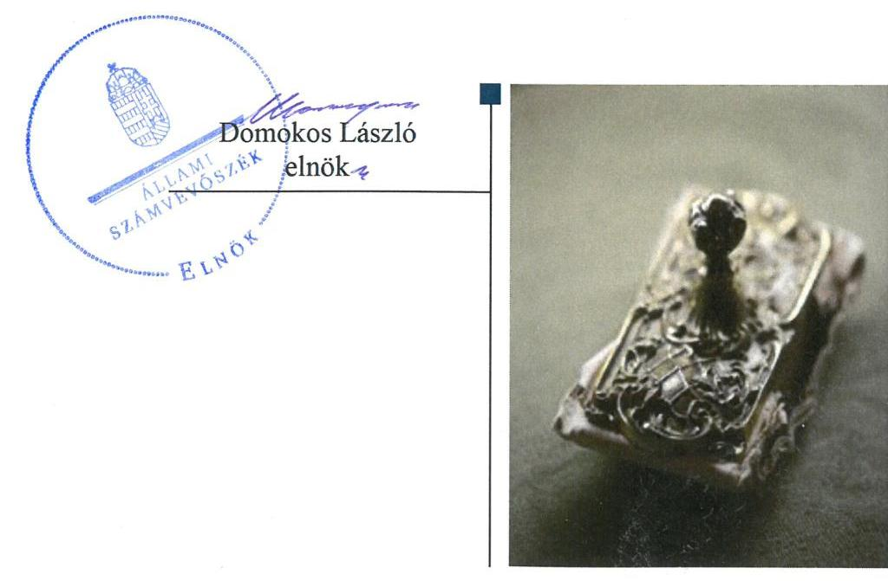
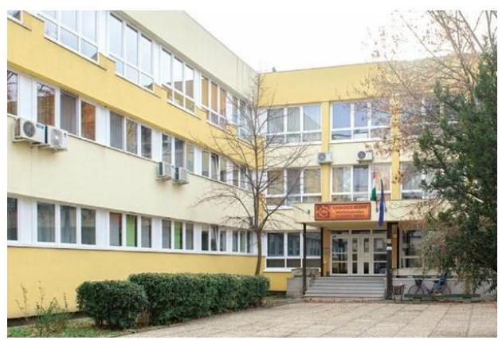
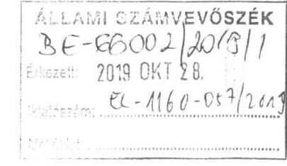
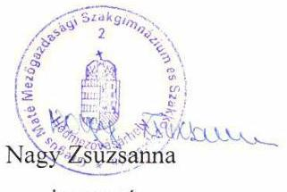
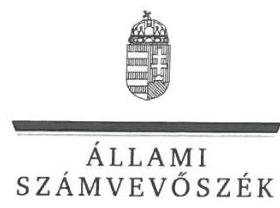
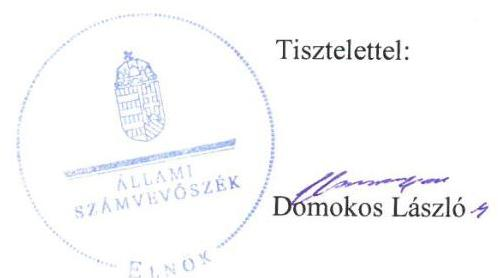

# Jelenetés 

## Központi költségvetési szervek ellenőrzése

Gregus Máté Mezőgazdasági Szakgimnázium és Szakközépiskola
2019.

---

# Jelentés 

## Központi költségvetési szervek ellenőrzése

Gregus Máté Mezőgazdasági Szakgimnázium és Szakközépiskola
2019. 12. hó 13. nap

---

# AZ ELLENŐRZÉST FELÜGYELTE:

## MAROZSÁN LÁSZLÓNÉ felügyeleti vezető

## AZ ELLENŐRZÉST VEZETTE ÉS A VÉGREHAJTÁSÁÉRT FELELŐS:

### KEREKES PÉTER ellenőrzésvezető

### A PROGRAM ÖSSZEÁLLÍTÁSÁÉRT FELELŐS:

### TÓTPÁL SZABOLCS osztályvezető

---

**IKTATÓSZÁM:** EL-2317-001/2019.

**TÉMASZÁM:** 2450

**ELLENŐRZÉS-AZONOSÍTÓ SZÁM:** V079155

---

Jelentéseink az Országgyűlés számítógépes hálózatán és az Interneten a www.asz.hu címen is olvashatóak.

---

# TARTALOMJEGYZÉK 

■ ÖSSZEGZÉS ..... 5
■ AZ ELLENŐRZÉS CÉLJA ..... 6
■ AZ ELLENŐRZÉS TERÜLETE ..... 7
■ AZ ELLENŐRZÉS HÁTTERE, INDOKOLTSÁGA ..... 8
■ A JELENTÉS LÉNYEGES KÉRDÉSKÖREI ..... 10
■ AZ ELLENŐRZÉS HATÓKÖRE ÉS MÓDSZEREI ..... 11
■ MEGÁLLAPÍTÁSOK ..... 14
JAVASLATOK ..... 17
MELLÉKLETEK ..... 19
I. sz. melléklet: Értelmező szótár ..... 19
FÜGGELÉKEK ..... 21
I. sz. függelék a jelentéshez ..... 21
II. sz. függelék: Észrevételek ..... 22
■ RÖVIDÍTÉSEK JEGYZÉKE ..... 33

---

.

---

# ÖSSZEGZÉS 

A Gregus Máté Mezőgazdasági Szakgimnázium és Szakközépiskola működésének szabályozottsága, pénzügyi és vagyongazdálkodása nem felelt meg a jogszabályi előírásoknak. Nem volt biztosított a felelős gazdálkodás, a közpénzek elszámoltathatósága és szabályos felhasználása. Nem volt védett a korrupcióval szemben.

## Az ellenőrzés társadalmi indokoltsága

Magyarország versenyképességének és a magyar gazdaság fejlődésének alapvető feltétele a magyar munkavállalók megfelelő szakmai képzettsége és felkészültsége, amelyben a szakképzési rendszernek döntő szerepe van. A mezőgazdaság vonatkozásában is kiemelten fontos ez, hiszen a magyar mezőgazdaság piaci versenyképességét és eredményességét nagymértékben befolyásolja az agrárszférában dolgozók képzettsége, felkészültsége. A szakképzés legjelentősebb színterei a szakképző iskolák. Az eredményes és célszerű szakképzés alapja és alapvető feltétele a szakképző intézmények közpénzekkel és a közvagyonnal való törvényes, átlátható és a korrupcióval szembeni védelmet biztosító működése és gazdálkodása. Ezért ezen szervezetekkel szemben is alapvető társadalmi igény, hogy a rájuk bízott közpénzekkel, közvagyonnal szabályosan gazdálkodjanak. Emellett a szakképzésben részt vevő pedagógusok, tanulók és a szülők jogos elvárása, hogy a szakképző iskolák működése átlátható és elszámoltatható legyen. Mindezen igényekkel összhangban, a közpénzügyek átláthatóságának előmozdítása, a közvagyon védelme érdekében került sor az agrárszakképző iskolák belső kontrollrendszerének és gazdálkodásának ellenőrzésére.

## Főbb megállapítások, következtetések, javaslatok

A Gregus Máté Mezőgazdasági Szakgimnázium és Szakközépiskola belső kontrollrendszere nem teremtette meg a szabályos működés és a gazdálkodás kereteit. A Gregus Máté Mezőgazdasági Szakgimnázium és Szakközépiskola nem rendelkezett szervezeti és működési szabályzattal, ezáltal nem biztosította a szabályszerű működéshez szükséges feladat és felelősségi körök világos elhatárolását. A kontrolltevékenységek szabálytalan és hiányos gyakorlása, valamint a jogszabály által előírt részletező nyilvántartások vezetésének hiánya következtében nem volt biztosított a szabályszerű pénzügyi gazdálkodás.

A Gregus Máté Mezőgazdasági Szakgimnázium és Szakközépiskola vagyongazdálkodása nem volt szabályszerű, éves költségvetési beszámolóját szabályszerű könyvvezetés nem támasztotta alá.

A Gregus Máté Mezőgazdasági Szakgimnázium és Szakközépiskolában a korrupciós kockázatok elleni védelemhez szükséges kontrollokat nem építették ki, kockázatelemzést nem végeztek. A teljesítményméréshez szükséges követelményeket nem határozták meg, így a mérés feltételei nem voltak biztosítottak.

A megállapítások alapján az Állami Számvevőszék a Gregus Máté Mezőgazdasági Szakgimnázium és Szakközépiskola vezetője részére 12 javaslatot fogalmazott meg.

---

# AZ ELLENŐRZÉS CÉLJA 

AZ ELLENŐRZÉS CÉLJA annak megítélése volt, hogy az ellenőrzött intézményre vonatkozó irányító szervi feladatellátás a jogszabályi előírások betartásával történt-e; az intézménynél a belső kontrollrendszer kialakítása és működtetése szabályszerű volt-e, biztosította-e az átlátható, szabályszerű, gazdaságos, hatékony és eredményes gazdálkodás feltételeit; az intézmény pénzügyi és vagyongazdálkodása megfelelt-e a jogszabályi előírásoknak és belső szabályzatainak. Az ellenőrzés keretében az Állami Számvevőszék értékelte az intézmény korrupciós kockázatainak kezelését szolgáló integritás kontrollok kiépítettségét és az integritás szemlélet érvényesülését, a teljesítményellenőrzés feltételeinek kialakítását. Értékelte, hogy az ellenőrzött megfelel-e annak az Alaptörvényben meghatározott alapvetésnek, hogy Magyarország a kiegyensúlyozott, átlátható és fenntartható költségvetési gazdálkodás elvét érvényesíti. Érvényesült-e a nemzeti vagyon kezelésének és védelmének célja, azaz a szervezet vagyona a közérdeket szolgálta-e a közös szükségletek kielégítése és a természeti erőforrások megóvása, valamint a jövő nemzedékek szükségleteinek figyelembevétele mellett.

---

# **AZ ELLENŐRZÉS TERÜLETE**

## **Gregus Máté Mezőgazdasági Szakgimnázium és Szakközépiskola**

A hódmezővásárhelyi székhelyű Intézmény3 illetékessége és működési területe országos. A fenntartói és irányítói jogokat 2013. augusztus 1-től a Minisztérium2 gyakorolja.

Az Intézmény típusa szakgimnázium és szakközépiskola, amely mezőgazdaság, informatika és elektrotechnika-elektronika szakmacsoportokban kínált képzési lehetőséget az ellenőrzött években a tanulók számára. Az Intézmény tanulói létszáma a 2016/2017-es tanévben 284 fő, a 2017/2018. tanévben 283 fő volt.

Az ellenőrzött időszakban az Intézménynél szervezeti, szerkezeti átalakításra nem került sor, az igazgató személye nem változott.

Az Intézmény önálló gazdasági szervezettel nem rendelkezik. A gazdálkodással kapcsolatos feladatait a Bedő Albert Erdészeti Szakgimnázium, Szakközépiskola és Kollégium látja el.

Az Intézmény mérlegfőösszege 2017. december 31-én 366,0 millió Ft volt. 2016-ban összesen 329,5 millió Ft bevétele volt, melyből 273,3 millió Ft volt a finanszírozási bevétel, 2017-ben összesen 335,4 millió Ft bevétele volt, melyből 271,1 millió Ft volt a finanszírozási bevétel.

---

# AZ ELLENŐRZÉS HÁTTERE, INDOKOLTSÁGA 

Az államháztartás központi alrendszerének közpénz felhasználása, az intézmények által ellátott közfeladatok sokrétűsége, valamint a feladatellátásához rendelt vagyon nagyságrendje indokolja, hogy az ÁSZ³ ellenőrzéseket folytasson a pénzügyi és vagyongazdálkodás területén. Az ÁSZ az ellenőrzései során feltárja a gazdálkodást, a központi alrendszer intézményei átalakulását, átszervezését érintő szabályozások esetleges hiányosságait, a szabályozással nem érintett gazdálkodási területeket, rámutathat a vagyongazdálkodási tevékenység - ezen belül a tulajdonosi joggyakorlás és vagyonkezelés - esetleges szabálytalanságaira, értékeli az állami vagyon nyilvántartására és elszámolására vonatkozó eljárásokat.

Az ellenőrzés várhatóan hozzájárul a központi intézmények pénzügyi helyzetének pontosabb megítéléséhez, és a jó gyakorlat kialakításán és terjesztésén keresztül az ellenőrzések elősegíthetik a gazdálkodás szabályszerűségének javítását.

Az ellenőrzések megállapításai támogathatják az ellenőrzött szervezetek szabályszerű gazdálkodását, javaslataival elősegítheti az Alaptörvényben megfogalmazott alapvetések érvényesülését a mindennapi életben a szervezetek szintjén.

Az ellenőrzés a szervezet kockázatértékelése alapján, az egyedi és lényeges jellemzők figyelembevételével, az ellenőrzésre kiválasztott modullal történik. Az integritás- és belső kontroll modul a központi költségvetési szerv működésének irányítottságát, korrupció elleni védettségét értékeli.

A belső kontrollrendszer kialakítása és működtetése nélkül nem valósítható meg a közpénzek, a közvagyon átlátható, szabályos, gazdaságos, hatékony és eredményes felhasználása. A belső kontrollrendszer azt a célt szolgálja, hogy a költségvetési szervek működésük és gazdálkodásuk során a tevékenységeket szabályszerűen hajtsák végre, teljesítsék elszámolási kötelezettségeiket és megvédjék az erőforrásokat a veszteségektől, a károktól és a nem rendeltetésszerű használattól. A belső kontrollrendszer magában foglalja mindazon elveket, eljárásokat és belső szabályzatokat, melyek biztosítják, hogy a költségvetési szerv valamennyi tevékenysége és célja összhangban legyen a szabályszerűséggel, szabályozottsággal, valamint a gazdaságosság, hatékonyság és eredményesség követelményeivel, az eszközökkel és forrásokkal való gazdálkodásban ne kerüljön sor pazarlásra, visszaélésre, rendeltetésellenes felhasználásra. Megfelelő, pontos és naprakész információk álljanak rendelkezésre a költségvetési szerv működésével kapcsolatosan, és a belső kontrollrendszer harmonizációjára, összehangolására vonatkozó jogszabályok végrehajtásra kerüljenek. Az integritás kontrollok kiépítése, erősítése a szervezet korrupciós kockázatainak kezelését szolgálja. A teljesítménykövetelmények meghatározása és működtetése megalapozhatja a központi költségvetési szervnél a teljesítményellenőrzés lefolytatását.

A központi költségvetés rendszerbe tartozó szervezetek célzott, hatékony ellenőrzéseivel az ÁSZ betölti a legfőbb gazdasági ellenőrző szerv küldetését. Az egyes ellenőrzések megállapításaival és egy időszak ellenőrzési eredményeinek elemzésével az ÁSZ ráirányíthatja a jogalkotók figyelmét a

---

központi alrendszerben vagy annak egy ágazatában esetlegesen felmerülő pénzügyi, szabályozási feszültségekre. Az elvégzett ellenőrzések során az ÁSZ „jó gyakorlatokat" is azonosíthat, melyeket tanácsadó funkciója keretében szélesebb körben is megismertethet az érintettekkel, ezáltal is hozzájárulva a költségvetési rendszer szabályozott, átlátható, kiegyensúlyozott és fenntartható működéséhez.

---

# A JELENTÉS LÉNYEGES KÉRDÉSKÖREI 

1.     - Az irányító szerv ellenőrzött költségvetési szervre vonatkozó feladatellátása szabályszerű volt-e?
2.     - A belső kontrollrendszer kialakítása és működtetése biztosította-e a közpénzekkel és a nemzeti vagyonnal történő átlátható, szabályszerű gazdálkodást, illetve a beszámolási és adatszolgáltatási kötelezettségek szabályszerű teljesítését?
3.     - A költségvetési szerv pénzügyi gazdálkodása szabályszerű volt-e?
4.     - A költségvetési szerv vagyongazdálkodása szabályszerű volt-e?
5.     - A központi költségvetési szervnél alakítottak-e ki a teljesítmény mérésére alkalmas követelményeket?

---

# AZ ELLENŐRZÉS HATÓKÖRE ÉS MÓDSZEREI 

## Az ellenőrzés típusa

Megfelelőségi ellenőrzés.

## Az ellenőrzött időszak

A szervezet vagyongazdálkodása, integritás és belső kontrollrendszerének értékelése tekintetében a 2016-2017. évek.

Az irányító szervi feladatellátás és a szervezet pénzügyi gazdálkodása tekintetében a 2016. év.

## Az ellenőrzés tárgya

Az Intézmény belső kontrollrendszerének kialakítása és működtetése, pénzügyi és vagyongazdálkodása, az integritáskontrollok kiépítettsége, az integritás szemlélet érvényesülése, a teljesítményellenőrzés feltételei, valamint az irányító szervi feladatellátás.

## Az ellenőrzött szervezet

- Gregus Máté Mezőgazdasági Szakgimnázium és Szakközépiskola
- Agrárminisztérium, mint irányító szerv
- Bedő Albert Erdészeti Szakgimnázium, Szakközépiskola és Kollégium, mint gazdálkodási feladatokat ellátó szervezet

## Az ellenőrzés jogalapja

Az ellenőrzés jogszabályi alapját az ÁSZ tv. ${ }^{4}$ 1. § (3) bekezdés, 5. § (2)-(3) bekezdései, 5. § (4) bekezdés a) pontja, valamint az Áht. ${ }^{5}$ 61. § (2) bekezdésének előírásai képezték.

## Az ellenőrzés módszerei

Az ellenőrzésre a szakmai program szempontjai, az ellenőrzött időszakban hatályos jogszabályok, az ellenőrzés szakmai szabályai, a jelen ellenőrzésre irányadó ÁSZ módszertanok figyelembevételével került sor.

Az ÁSZ az ellenőrzés ideje alatt az ellenőrzött szervezetekkel a kapcsolattartást az ÁSZ SZMSZ ${ }^{6}$-ének vonatkozó előírásai alapján biztosította.

---

Az ellenőrzési kérdések megválaszolásához szükséges bizonyítékok megszerzése az ellenőrzött szervezetek által rendelkezésre bocsátott dokumentumokra, adatokra alapozva megfigyelés, szemle (szemrevételezés), kérdésfeltevés (információkérés), mintavételezés, valamint elemző eljárás útján történt.

Az ellenőrzési bizonyítékként felhasználható adatforrások közé tartoztak egyrészt a szakmai program részletes szempontjainál felsorolt adatforrások, másrészt minden egyéb - az ellenőrzés folyamán feltárt, az ellenőrzés szempontjából információt tartalmazó - dokumentum.

Az ellenőrzés lefolytatásához az ellenőrzött szervezetek a tanúsítványok kitöltésével, valamint az ÁSZ által kért dokumentumok megküldésével szolgáltattak adatokat, amelyek valódiságát és teljes körűségét az ellenőrzött szervezet vezetője által tett teljességi és hitelességi nyilatkozat igazolta. Az így rendelkezésre bocsátott adatok, információk kontrollja az ellenőrzés keretében történt.

Az Intézmény belső kontrollrendszere egyes pilléreinek kialakítására és működtetésére vonatkozó értékelés a következő volt:
$\longrightarrow$ „szabályszerű", amennyiben az értékelt területen az elért „igen" válaszok százalékban kifejezett, egész számra kerekített aránya legalább $85 \%$ volt,
$\longrightarrow$ „nem szabályszerű", ha nem érte el a 85\%-ot.
A központi költségvetési szerv belső kontrollrendszerének összesített értékelése az egyes részterületek esetében kapott megfelelőségi arányok számtani átlaga alapján történt és megegyezett a pillérenként (kontrollterületenként) alkalmazott százalékos értékelésekkel, a következő eltérésekkel: a kontrollrendszer egésze esetében a „szabályszerű" értékelésnek a százalékos értéken felül további feltétele volt, hogy egyik kontrollterület sem kaphatott „nem szabályszerű" értékelést.

A kiadások és bevételek ellenőrzésére a 2016-2017 év vonatkozásában került sor. A 2016. évi kiadások esetében a megfelelő alapsokaság hiányában nem került sor mintavételre.

A 2017. évi kiadások (külső személyi juttatások, felhalmozási kiadások, dologi kiadások) és a 2016-2017. évi bevételek (értékesítésből és bérbeadásból származó bevételek) esetében az ellenőrzés azokra a legnagyobb értékű tételekre
 - a lényeges sokaságra terjedt ki, melyek összértéke eléri a teljes sokaság összértékének 50%-át.

A 2016. évi bevételek esetében a lényeges sokaságot tételesen ellenőrizte az ÁSZ. 2017-ben az ellenőrzött szervezet nem rendelkezett értékesítésből származó bevétellel.

A 2017. évi kiadások elszámolásának szabályszerűségét a lényeges sokaságból véletlen mintavételi eljárással kiválasztott tételek alapján ellenőrizte az ÁSZ.

A feladatellátást szolgáló állami vagyontárgyak 2017. év végi értékelésének szabályszerűségét a teljes sokaságból véletlen mintavétellel kiválasztott tételek alapján ellenőrizte az ÁSZ.

A 2017. évi beruházások, felújítások szabályszerűségének esetében tételes ellenőrzésre került sor.

A mintavétellel ellenőrzött területek esetében minden egyes tétel vonatkozásában a felhasználás, elszámolás és értékelés szabályszerűségére

---

vonatkozó kérdéseket tett fel az ÁSZ. Szabályszerűnek lett értékelve egy ellenőrzött terület, amennyiben 95%-os bizonyossággal az ellenőrzött sokaságban az átlagos hibaarány legfeljebb 10%, nem szabályszerűnek, amennyiben 10%-nál magasabb arányt képviselt.

---

# 1. Az irányító szerv ellenőrzött költségvetési szervre vonatkozó feladatellátása szabályszerű volt-e? 

## Összegző megállapítás

A Minisztérium Intézményre vonatkozó feladatellátása szabályszerű volt.

A Minisztérium az Nkt. ${ }^{7}$-ban előírtak szerint kiadta, és szükség szerint módosította az Intézmény alapító okiratát, megbízta az Intézmény igazgatóját.

A Minisztérium egyéb irányítási hatáskörében eljárva a jogszabályi előírásoknak megfelelően jóváhagyta az Intézmény elemi költségvetését és az éves költségvetési beszámolóját.

## 2. A belső kontrollrendszer kialakítása és működtetése biztosította-e a közpénzekkel és a nemzeti vagyonnal történő átlátható, szabályszerű gazdálkodást, illetve a beszámolási és adatszolgáltatási kötelezettségek szabályszerű teljesítését?

## Összegző megállapítás

Az Intézmény belső kontrollrendszerének kialakítása és működtetése nem volt szabályszerű, nem biztosította a közpénzfelhasználás szabályozottságát a 2016. és 2017. években.

Az Intézmény belső kontrollrendszerének kialakítása és működtetése a 2016. évben nem volt szabályszerű, mivel az Intézmény az Áht. 10. § (5) bekezdésében előírtak ellenére nem rendelkezett szervezeti és működési szabályzattal.

Az Intézmény a 2017. évben nem szabályszerű kontrollkörnyezetben működött, mivel az Áht. 10. § (5) bekezdésében előírtak ellenére nem rendelkezett szervezeti és működési szabályzattal. Továbbá a Számlatükör ${ }^{8}$ az Áhsz. ${ }^{9}$ 51. § (1) bekezdésében előírtak ellenére nem felelt meg az Áhsz. 16. mellékletében megállapított egységes számlakeretnek, mert nem teljes körűen az abban meghatározott könyvviteli és nyilvántartási számlákat tartalmazta.

Az Intézmény vezetője 2017-ben a Bkr. ${ }^{10}$ 6. § (4) bekezdésében előírtak ellenére nem szabályozta a szervezeti integritást sértő események kezelésének eljárásrendjét.

INTEGRÁLT KOCKÁZATKEZELÉSI RENDSZERT a 2017. évben az Intézmény vezetője a Bkr. 7. § (1) bekezdésben előírtak ellenére nem működtetett, mivel a Bkr. 7. § (2) bekezdésében előírtak ellenére nem határozta meg az egyes kockázatokkal kapcsolatban szükséges intézkedéseket, valamint azok teljesítésének folyamatos nyomon követésének módját.

---

A KONTROLLTEVÉKENYSÉGEK gyakorlása az Intézménynél nem szabályszerűen történt.

A 2017. évben az Áht. 37. § (1) bekezdésben előírtak ellenére a jogszabályban előírt esetekben a megrendeléseket nem előzte meg írásbeli kötelezettségvállalás.

Az Intézménynél a 2017. évben az Ávr. ${ }^{11}$ 57. § (3) bekezdésben előírtak ellenére nem szabályszerű teljesítésigazolással történtek kifizetések, mert a dokumentumokon nem szerepelt a teljesítésigazolás dátuma.

# A SZERVEZET INFORMÁCIÓS ÉS KOMMUNIKÁCIÓS RENDSZERÉT az Intézmény vezetője a 2017. évben nem szabályszerűen működtette. Az Intézmény a működési folyamatok ellenőrzési nyomvonalában határozta meg az információs szinteket és kapcsolatokat, azonban a nyomvonal nem fedte le teljes körűen az Intézmény működési folyamatait, ezáltal a Bkr. 9. § (1) bekezdésben előírtak ellenére nem volt biztosított, hogy a megfelelő információk a megfelelő időben eljussanak az illetékes szervezethez, szervezeti egységhez, illetve személyhez.

A 2017. évben az Ávr. 167/M.§ (1) bekezdésben előírtakkal ellentétben az Intézmény tartozásállományára vonatkozó, az Ávr. 5. melléklet 4. pontjában meghatározott, a Magyar Államkincstár felé történő adatszolgáltatási kötelezettség nem teljesült.

## A SZERVEZET NYOMONKÖVETÉSI RENDSZERÉT a

2017. évben az Intézmény vezetője nem működtette, a Bkr. 10. §-ában előírtak ellenére nem gondoskodott az operatív tevékenységek keretében megvalósuló folyamatos és eseti nyomon követésről.

Az Intézmény belső ellenőrzését 2017. január 1-től a Bkr. 15. § (4) bekezdésben előírtak ellenére nem a Gazdálkodási feladatokat ellátó szervezet ${ }^{12}$ vagy a Minisztérium által kijelölt más szervezet látta el, hanem egy, az Intézmény által megbízott belső ellenőr. A jogszabály előírásaitól való eltérésre nem rendelkeztek a Minisztérium jóváhagyásával.

Az Intézmény vezetője a Bkr. 1. mellékletében foglalt előírás alapján nyilatkozatban értékelte az Intézmény belső kontrollrendszerének minőségét. Nyilatkozott arról, hogy gondoskodott az Intézmény belső kontrollrendszere kialakításáról, valamint szabályszerű, eredményes és hatékony működésről. Azonban a vezetői nyilatkozatot az ÁSZ jelen ellenőrzésének megállapításai nem támasztották alá.

A 2016-2017. években az Intézmény nem építette ki a kötelezően előírt, integritást támogató kontrolljait. Az Intézmény nem végzett kockázatelemzéseket. Az Intézmény nem működtetett az integritást erősítő, nem kötelezően előírt kontrollokat.

---

# 3. A költségvetési szerv pénzügyi gazdálkodása szabályszerű volt-e? 

## Összegző megállapítás

Az Intézmény pénzügyi gazdálkodása a 2016. évben nem volt szabályszerű.

Az Intézmény pénzügyi gazdálkodása nem volt szabályszerű, mert
$\longrightarrow$ az Intézmény az Áhsz. 39. § (3) bekezdésben előírtak ellenére nem rendelkezett a kötelezettségvállalásokról és más fizetési kötelezettségekről az Áhsz. 14. mellékletének II. 4. pontjában előírt részletező nyilvántartással
$\longrightarrow$ az Intézmény éves beszámolója a felújítási kiadások vonatkozásában az Áhsz. 5. § (1) bekezdésben előírtakkal ellentétben nem volt szabályszerűen vezetett kettős könyvvitellel és folyamatosan vezetett részletező nyilvántartással alátámasztva, megsértve ezzel a Számv.tv. ${ }^{13} 15 . \S$ (5) bekezdésében előírt következetesség elvét.

## 4. A költségvetési szerv vagyongazdálkodása szabályszerű volt-e?

## Összegző megállapítás

Az Intézmény vagyongazdálkodása a 2016-2017. években nem volt szabályszerű.

A 2017. évben az Intézmény éves beszámolója a befektetett eszközei vonatkozásában az Áhsz. 5. § (1) bekezdésben előírtakkal ellentétben nem volt folyamatosan vezetett részletező nyilvántartással alátámasztva.

A 2017. évben a beruházások, felújítások során az Intézmény részéről megkötött visszterhes szerződések az érintett szervezetek nyilatkozatát az Ávr. 50. § (1a) bekezdésében előírtak ellenére nem tartalmazták. A 2016. évben a nemzeti vagyon hasznosítása során nem tartották be az Nvtv. ${ }^{14} 11$. § (10) bekezdés előírásait, mivel az Intézmény nem rendelkezett a szerződő partnereknek az Nvtv. 3. § (2) bekezdésben előírt nyilatkozatával arról, hogy átlátható szervezeteknek minősülnek.

Az Intézmény az éves beszámoló mérlegsorait leltárral alátámasztotta.

## 5. A központi költségvetési szervnél alakítottak-e ki a teljesítmény mérésére alkalmas követelményeket?

Összegző megállapítás Az Intézménynél nem alakítottak ki a teljesítmény mérésére alkalmas követelményeket.

A TELJESÍTMÉNYMÉRÉSRE alkalmas követelményeket, ehhez kapcsolódóan mérőszámokat, indikátorokat az Intézmény vezetője nem alakított ki, ezáltal a teljesítmény mérésének feltételei nem álltak fenn.

---

# JAVASLATOK 

Az ÁSZ tv. 33. § (1) bekezdésében foglaltak értelmében az ellenőrzött szervezet vezetője köteles a jelentésben foglalt megállapításokhoz kapcsolódó intézkedési tervet összeállítani és azt a jelentés kézhezvételétől számított 30 napon belül az ÁSZ részére megküldeni. Amennyiben az ellenőrzött szervezet vezetője nem küldi meg határidőben az intézkedési tervet, vagy továbbra sem elfogadható intézkedési tervet küld, az Állami Számvevőszék elnöke az ÁSZ tv. 33. § (3) bekezdése a) és b) pontjaiban foglaltakat érvényesítheti.

## Gregus Máté Mezőgazdasági Szakgimnázium és Szakközépiskola igazgatója részére

1. Intézkedjen a szervezeti és működési szabályzat jogszabályi előírásoknak megfelelő elkészítéséről.
(2. sz. megállapítás 2. bekezdés 1. mondata alapján)
2. Intézkedjen az Áhsz. előírásainak megfelelő tartalmú számlatükör elkészítéséről.
(2. sz. megállapítás 2. bekezdés 2. mondata alapján)
3. Intézkedjen a szervezeti integritást sértő események kezelésének eljárásrendje szabályozásáról.
(2. sz. megállapítás 3. bekezdése alapján)
4. Intézkedjen a Bkr. előírásának megfelelően, az integrált kockázatkezelési rendszer működtetéséről.
(2. sz. megállapítás 4. bekezdése alapján)
5. Intézkedjen, hogy a kötelezettségvállalásra és a teljesítésigazolásra a jogszabályi előírásoknak megfelelően kerüljön sor.
(2. sz. megállapítás 6-7. bekezdései alapján)
6. Intézkedjen az információs és kommunikációs rendszer Bkr. előírásainak megfelelő működtetéséről.
(2. sz. megállapítás 8. bekezdés 2. mondata alapján)
7. Gondoskodjon az intézményi tartozásállományra vonatkozó adatszolgáltatási kötelezettség Ávr. előírásának megfelelő teljesítéséről.
(2. sz. megállapítás 9. bekezdése alapján)

---

8. Intézkedjen a Bkr. előírásainak megfelelően, az operatív tevékenységek keretében megvalósuló folyamatos és eseti nyomon követésről.
(2. sz. megállapítás 10. bekezdése alapján)
9. Gondoskodjon az Intézmény belső ellenőrzésének Bkr. szerinti kialakításáról és működtetéséről.
(2. sz. megállapítás 11. bekezdése alapján)
10. Gondoskodjon az Áhsz. előírásainak megfelelő részletező nyilvántartás vezetéséről az Intézményt érintő kötelezettségvállalásokról, más fizetési kötelezettségekről.
(3. sz. megállapítás 1. bekezdés 1. francia bekezdése alapján)
11. Gondoskodjon az Intézmény könyvviteli nyilvántartásának az Áhsz.-ben előírtaknak megfelelő vezetéséről, továbbá arról, hogy az Intézmény éves beszámolója szabályszerűen vezetett kettős könyvvitel adatai alapján készüljön.
(3. sz. megállapítás 1. bekezdés 2. francia bekezdése és a 4. sz. megállapítás 1. bekezdése alapján)
12. Gondoskodjon arról, hogy jogi személlyel, jogi személyiséggel nem rendelkező szervezettel kötött visszterhes szerződések és a nemzeti vagyon hasznosítására kötött szerződések esetén az Ávr. és az Nvtv. előírása szerint rendelkezésre álljon a szervezet képviselőjének nyilatkozata arról, hogy átlátható szervezetnek minősül.
(4. sz. megállapítás 2. bekezdése alapján)

---

# MELLÉKLETEK 

- I. SZ. MELLÉKLET: ÉRTELMEZŐ SZÓTÁR
állami vagyon
állami vagyonnak minősül:
a) az állam tulajdonában lévő dolog, valamint a dolog módjára hasznosítható természeti erő,
b) az a) pont hatálya alá nem tartozó mindazon vagyon, amely vonatkozásában törvény az állam kizárólagos tulajdonjogát nevesíti,
c) az állam tulajdonában lévő tagsági jogviszonyt megtestesítő értékpapír, illetve az államot megillető egyéb társasági részesedés,
d) az államot megillető olyan immateriális, vagyoni értékkel rendelkező jogosultság, amelyet jogszabály vagyoni értékű jogként nevesít. (Forrás: Vtv. ${ }^{15}$ 1. § (2) bekezdése)
állami vagyon kezelője /vagyonkezelő
átalakítás
belső ellenőrzés
belső kontrollrendszer
belső kontrollrendszer területei
ellenőrzési nyomvonal
információs és kommunikációs rendszer
integritás

Az állami vagyont az MNV Zrt. ${ }^{16}$ maga kezeli, vagy szerződés - így különösen bérlet, haszonbérlet, megbízás - alapján központi költségvetési szervnek, természetes vagy jogi személynek, vagy jogi személyiséggel nem rendelkező gazdálkodó szervezetnek hasznosításra átengedi." Az állami vagyonra vonatkozóan az MNV Zrt. kizárólag az Nvtv.-ben meghatározott személyekkel köthet vagyonkezelési szerződést. (Forrás: Vtv. 27. § (1) bekezdése, hatályos 2012. január 1-jétől)
A költségvetési szerv általános jogutódlással történő megszüntetése átalakítással történhet. Az átalakítás lehet egyesítés vagy különválás. Az egyesítés lehet beolvadás vagy összeolvadás. (2015. január 1-jétől Áht. 11. § (2) bekezdés)
Független, tárgyilagos bizonyosságot adó és tanácsadó tevékenység, amelynek célja, hogy az ellenőrzött szervezet működését fejlessze és eredményességét növelje, az ellenőrzött szervezet céljai elérése érdekében rendszerszemléletű megközelítéssel és módszeresen értékeli, illetve fejleszti az ellenőrzött szervezet irányítási és belső kontrollrendszerének hatékonyságát. (Forrás: Bkr. 2. § b) pontja)
A belső kontrollrendszer a kockázatok kezelése és tárgyilagos bizonyosság megszerzése érdekében kialakított folyamatrendszer, amely azt a célt szolgálja, hogy a működés és gazdálkodás során a tevékenységeket szabályszerűen, gazdaságosan, hatékonyan, eredményesen hajtsák végre, az elszámolási kötelezettségeket teljesítsék, megvédjék az erőforrásokat a veszteségektől, károktól és nem rendeltetésszerű használattól. (Forrás: Áht. 69. § (1) bekezdése)
A kontrollkörnyezet, az integrált kockázatkezelési rendszer, a kontrolltevékenységek, az információs és kommunikációs rendszer, valamint a nyomon követési (monitoring) rendszer. (Forrás: Bkr. 3. §-a)
Az ellenőrzési nyomvonal a költségvetési szerv működési folyamatainak szöveges, táblázatokkal vagy folyamatábrákkal szemléltetett leírása, amely tartalmazza különösen a felelősségi és információs szinteket és kapcsolatokat, irányítási és ellenőrzési folyamatokat, lehetővé téve

 azok nyomon követését és utólagos ellenőrzését. (Forrás: Bkr. 6. § (3) bekezdés)
A költségvetési szerv vezetője által kialakított és működtetett olyan rendszer, mely biztosítja, hogy a megfelelő információk a megfelelő időben eljutnak az illetékes szervezethez, szervezeti egységhez, illetve személyhez. (Forrás: Bkr. 9. § (1) bekezdés)
Az integritás - egyik gyakran használt jelentése szerint - az elvek, értékek, cselekvések, módszerek, intézkedések konzisztenciáját jelenti, vagyis olyan magatartásmódot, amely meghatározott értékeknek megfelel. Integritás-irányítási rendszer bevezetése a szervezetben a szervezethez rendelt közfeladatok integritás szempontú ellátását, az

---

integrált kockázatkezelési rendszer
irányító szerv/felügyeleti szerv
kockázat
kockázatkezelési rendszer
kontrollkörnyezet
kontrolltevékenységek
nyomon követési rendszer (monitoring)
vagyongazdálkodás
érték alapú működéssel (integritással) összefüggő szervezeti követelmények következetes érvényesítését jelenti. (Forrás: Nemzetgazdasági Minisztérium: Államháztartási Belső Kontroll Standardok és Gyakorlati Útmutató 1.6. Etikai értékek és integritás 46. oldal, 2017. szeptember)
Olyan folyamatalapú kockázatkezelési rendszer, amely a szervezet minden tevékenységére kiterjed, egységes módszertan és eljárások alkalmazásával, a szervezet célkitűzéseinek és értékeinek figyelembevételével biztosítja a szervezet kockázatainak teljes körű azonosítását, azok meghatározott kritériumok szerinti értékelését, valamint a kockázatok kezelésére vonatkozó intézkedési terv elkészítését és az abban foglaltak nyomon követését. (Forrás: Bkr. 2. § m) pontja, 2016. október 1-jétől)
A költségvetési szerv tekintetében az Áht.-ban meghatározott irányítási hatáskört gyakorló szerv. (Forrás: Áht. 1. § 9. pontja)
A kockázat annak a valószínűségét jelenti, hogy egy vagy több esemény vagy intézkedés nem kívánt módon befolyásolja a rendszer működését, céljainak megvalósulását. (Forrás: Javaslatok a korrupciós kockázatok kezelésére - Kockázatkezelési és ellenőrzési módszertan 35. oldal, ÁSZ)
Olyan irányítási eszközök és módszerek összessége, melynek elemei a szervezeti célok elérését veszélyeztető tényezők (kockázatok) azonosítása, elemzése, csoportosítása, nyomon követése, valamint szükség esetén a kockázati kitettség mérséklése. (Forrás: Bkr. 2. § m) pontja), 2016. szeptember 30-ig.
A költségvetési szerv vezetője által kialakított olyan elvek, eljárások, belső szabályzatok összessége, amelyben világos a szervezeti struktúra, a folyamatok átláthatók, egyértelműek a felelősségi, hatásköri viszonyok és feladatok, meghatározottak, ismertek és elfogadottak az etikai elvárások a szervezet minden szintjén, átlátható a humán-erőforrás-kezelés. (Forrás: Bkr. 6. § (1) bekezdés)
A költségvetési szerv vezetője által a szervezeten belül kialakított (kontroll) tevékenységek, melyek biztosítják a kockázatok kezelését, hozzájárulnak a szervezet céljainak eléréséhez és erősítik a szervezet integritását. (Forrás: Bkr. 8. § (1) bekezdés)
A költségvetési szerv vezetője köteles kialakítani a szervezet tevékenységének a célok megvalósításának nyomon követését biztosító rendszert, amely az operatív tevékenységek keretében megvalósuló folyamatos és eseti nyomon követésből, valamint az operatív tevékenységektől függetlenül működő belső ellenőrzésből áll. 2016. október 1-jétől: A költségvetési szerv vezetője köteles kialakítani a szervezet tevékenységének, a célok megvalósításának nyomon követését biztosító rendszert, mely az operatív tevékenységek keretében megvalósuló folyamatos és eseti nyomon követésből, valamint az operatív tevékenységektől függetlenül működő belső ellenőrzésből állhat. (Forrás: Bkr. 10. §)
A nemzeti vagyongazdálkodás feladata a nemzeti vagyon rendeltetésének megfelelő, az állam, az önkormányzat mindenkori teherbíró képességéhez igazodó, elsődlegesen a közfeladatok ellátásához és a mindenkori társadalmi szükségletek kielégítéséhez szükséges, egységes elveken alapuló, átlátható, hatékony és költségtakarékos működtetése, értékének megőrzése, állagának védelme, értéknövelő használata, hasznosítása, gyarapítása, továbbá az állam vagy a helyi önkormányzat feladatának ellátása szempontjából feleslegessé váló vagyontárgyak elidegenítése. (Forrás: Nvtv. 7. § (2) bekezdése)

---

# FÜGGELÉKEK 

- I. SZ. FÜGGELÉK A JELENTÉSHEZ

Az Állami Számvevőszék az ellenőrzések során feltárt tényekhez kapcsolódó további körülmények tisztázására eszközrendszerrel nem rendelkezik. Amennyiben az ellenőrzésen túlmutatóan indokoltnak látszik az ellenőrzés során feltárt körülmények további vizsgálata, az Állami Számvevőszék törvényi felhatalmazás alapján az ellenőrzés által feltárt körülményeket továbbítja a hatáskörrel rendelkező szervnek a szükséges intézkedések megtétele, eljárások lefolytatása érdekében.
I. Az ellenőrzés feltárta, hogy az Intézménynél a 2017. évben az Áht. 37. § (1) bekezdésben előírtakat megsértve írásbeli kötelezettségvállalás nélkül adtak megrendelést 3285342 Ft értékben.
Kötelezettségvállalás hiányában nem igazolt a megrendelések és a kiadások jogossága, vagyis az, hogy a megrendelések és a kiadások valóban az Intézmény érdekében merültek fel, annak feladatellátását szolgálták, valamint hogy a kifizetésekhez valós teljesítések kapcsolódtak. Nem zárható ki, hogy a szabálytalan megrendelések és kifizetések az ellenőrzött szervezetnél vagyoni hátrányt okoztak.
II. Az ellenőrzés feltárta, hogy az Intézmény 2016. éves beszámolója 82668888 Ft értékű kiadás vonatkozásában, valamint a 2017. éves beszámolója 14787899 Ft értékű állami vagyon vonatkozásában az Áhsz. 5. § (1) bekezdésében előírtakat megsértve nem volt szabályszerű könyvvezetéssel és folyamatosan vezetett részletező nyilvántartásokkal alátámasztva, ezáltal nem volt biztosított az Intézménynél az Áhsz. 39. § (1) bekezdésében előírtak ellenére a valóságnak megfelelő, folyamatos, zárt rendszerű nyilvántartás vezetése.
Az éves beszámolók megalapozatlansága miatt az Intézménynél nem zárható ki a vagyoni hátrány okozása.

Az esetek konkrét körülményeinek felderítésére az ügyészség rendelkezik hatáskörrel.

---

A jelentéstervezetet a Számvevőszék 15 napos észrevételezésre megküldte az ellenőrzött szervezetek vezetőinek az ÁSZ tv. 29. § (1) bekezdése előírásának megfelelően.

A Gregus Máté Mezőgazdasági Szakgimnázium és Szakközépiskola igazgatója a jelentéstervezet megállapításaira írásban észrevételt tett. Az Agrárminisztériumot vezető miniszter és a Bedő Albert Erdészeti Szakgimnázium, Szakközépiskola és Kollégium igazgatója a jelentéstervezet megállapításaira nem tettek észrevételt.
Az ÁSZ tv. 29. § (3) bekezdésével összhangban az ÁSZ a Függelékben feltünteti az ellenőrzés megállapításaival kapcsolatban tett, figyelembe nem vett észrevételeket, és megindokolja, hogy azokat miért nem fogadta el.

[^0]
[^0]:    * 29. § (1) Az Állami Számvevőszék az ellenőrzési megállapításait megküldi az ellenőrzött szervezet vezetőjének vagy az általa megbízott személynek, és annak, akinek személyes felelősségét állapította meg.
    (2) Az ellenőrzött szervezet vezetője és a felelősként megjelölt személy az ellenőrzés megállapításaira tizenöt napon belül írásban észrevételt tehet.
    (3) Az Állami Számvevőszék az észrevételre a beérkezésétől számított harminc napon belül írásban válaszol. A figyelembe nem vett észrevételeket köteles a jelentésben feltüntetni, és megindokolni, hogy azokat miért nem fogadta el.

---

# 1508 

Gregus Máté Mezőgazdasági Szakgimnázium és Szakközépiskola 6800 Hódmezővásárhely, Árpád u. 8.

Tel.: 62/535-490

Domokos László elnök
Állami Számvevőszék

Budapest 4.
Pf. 54.
1364

Hivatkozási szám:EL-1160-052/2019.
Iktatószám: 23/1-3/43

Köszönettel megkaptuk az Állami Számvevőszékről szóló 2011. évi LXVI. törvény 29. § (1) bekezdése alapján észrevételezés céljából a Gregus Máté Mezőgazdasági Szakgimnázium és Szakközépiskola (továbbiakban: Iskola) részére 2019. október 11-én megküldött a „Központi költségvetési szervek ellenőrzése - Gregus Máté Mezőgazdasági Szakgimnázium és Szakközépiskola" című számvevőszéki jelentés tervezetet, melyre a hivatkozott jogszabályi felhatalmazás alapján az Iskola észrevételeket kíván tenni.

Az észrevételek felsorolása előtt kiemelném, hogy 2015. szeptember 1-jétől az Iskola gazdasági szervezete átalakult. A Bedő Albert Erdészeti Szakgimnázium, Szakközépiskola és Kollégium látja el több intézmény gazdasági feladatait egyszerre. Az intézmények gazdasági vonalát érintő egységesítés, átláthatóság, a törvényességi előírásoknak megfelelő végrehajtás folyamatban van. Ellenőrző szervek javaslatára a mutatkozó hibák javításra kerülnek. A vizsgálat kiterjedt az intézmény főbb problémáira. Az ellenőrzések mellett folyamatosan korrigáltuk a feltárt hibákat, pótoltuk a hiányosságokat. Az ellenőrzött időszakra vonatkozó - a számvevőszéki megállapításokban részletezett hiányosságok részben ismertek voltak számomra, melyek megszüntetésére, a szabályos működésre vonatkozóan számos intézkedést tettem.

A 2. sz. pontban a szervezeti és működési szabályzatról tett megállapításukhoz kapcsolódóan megjegyzem, hogy az Iskola 2013. augusztus 13-tól rendelkezik szervezeti és működési szabályzattal, mely az ellenőrzések során a EL-1160-001/2018. ikt. sz., valamint EL-1160003/2018. ikt. sz. adatbekérések során feltöltésre került több alkalommal is, így nem értek azzal egyet, hogy az Intézmény nem rendelkezett szervezeti és működési szabályzattal.

A 2. számú pontban a számlatükrökről kialakított véleményükhöz azt az információt tenném hozzá, hogy az Iskola 2015. január 1-jétől gépi könyvelő program által folyamatosan frissített, törvényi előírásoknak megfelelő beépített számlatükröt használ, mely az Áhsz. 16. mellékletében megállapított egységes számlakerettel megegyező, tekintettel arra, hogy gépi rögzítés történik. A KGR rendszerbe feltöltött adatok mellé a könyvelő programban készült főkönyvet csatolni kell minden esetben, nem egyezőség esetén a rendszer hibát jelezne.

---

# Gregus Máté Mezőgazdasági Szakgimnázium és Szakközépiskola 6800 Hódmezővásárhely, Árpád u. 8.   Tel.: 62/535-490 

A szervezeti integritást sértő események kezeléséről és az integrált kockázatkezelési rendszerről írt megállapításukhoz megjegyezni kívánom, hogy a belső kontrollrendszer, a kockázatkezelési szabályzat, a szabálytalanság kezelési szabályzat részben taglalja, ennek külön szabályozására az intézmény megkezdte a szükséges intézkedések megtételét, hogy a fentebb említett szabályzatoktól elkülönüljön és teljes mértékben átláthatóvá váljon.

A 2. számú pontban foglalt kontrolltevékenységről tett megállapításukhoz kapcsolódóan megjegyzem, hogy az Iskolánál 2015-től digitális kötelezettségvállalás készült a könyvelőprogramba, ennek kiegészítésére 2017-ben a papír alapú kötelezettségvállalás is bevezetésre került. A Bedő Albert Erdészeti Szakgimnázium, Szakközépiskola és Kollégium, mint az Iskola gazdasági feladatainak ellátója új ügyrendet hozott létre, melynek az életbe léptetése 2019. 09. 01-én megtörtént. Ezen ügyrend pontosan és részletesen tartalmazza a kötelezettségvállaláshoz kötött megrendelésekhez elkészítendő dokumentumokat és nyilvántartást.

A 2. számú pont 7. bekezdésben a teljesítésigazolásról tett megállapításukhoz kapcsolódóan megjegyzem, hogy az Iskolánál a teljesítés igazolások szabályszerű végrehajtásáról 2018. szeptember 13-tól kezdve a szükséges intézkedéseket megtettük.

A 2. számú pont 8. bekezdés a szervezet információs és kommunikációs rendszeréről kialakított véleményükhöz azt az információt tenném hozzá, hogy az Iskolánál a szigorú határidőkhöz kötött jelentések, adatszolgáltatások időben elküldésre kerültek. Az Iskolánk 2016 és 2017. évben minden hónapban pontosan a törvényi előírásoknak megfelelően teljesítette a tartozásállományra vonatkozó jelentését a Magyar Államkincstár felé az elektronikus rendszerében. Ebből a rendszerből kerül letöltésre a jelentés melyet a Minisztérium felé is továbbítani kell, ezért ezzel a megállapítással nem értek egyet.

A 2. számú pontban a szervezeti nyomonkövetési rendszerről tett megállapításukhoz kapcsolódóan megjegyzem, hogy a 2017-es évre a belső ellenőrzési tervet 2016. november 15-ig a Minisztérium részére jóváhagyásra meg kellett küldeni. A belső ellenőrzési terv a 2014-2017. évekre vonatkozó Belső ellenőrzési stratégiai terv részét is képezte, mely egy 4 éves ellenőrzési időszakot ölelt fel. Az ellenőrzés 2014. június 3-tól kezdődött, így a folyamatban lévő szerződés nem került felbontásra. Ezt követően az Iskola részére a törvényi előírásoknak megfelelően lett alkalmazva a belső ellenőr, ezért ezzel a megállapításukkal nem értek egyet.

A 3. számú pontban az Intézményi pénzügyi gazdálkodásról kialakított véleményükhöz azt az információt tenném hozzá, hogy Iskola a Saldo könyviteli programot használja, mely kettős könyvvitelt biztosít. Ezen programot a Minisztérium felé is be kellett jelenteni, az iskola többedmagával együtt ezt a programot használja. A programban költséghelyenként és pénzügyileg is könyvelünk, mely a beküldött főkönyvi kivonaton és utalványrendeleteken egyértelműen látszik, így a törvényi előírásoknak megfelelően a kettős könyvvitel teljesül. Továbbá az iskolánk havi és negyedéves jelentést készít a KGR rendszerben, az adatszolgáltatás során csak a kettős könyvvitellel történt főkönyvet lehet feltölteni, ugyanis a feltöltés után a főkönyv sorait egyezteti az adatszolgáltatás soraival, ezért ezzel a megállapításukkal nem értek egyet.

---

# Gregus Máté Mezőgazdasági Szakgimnázium és Szakközépiskola 6800 Hódmezővásárhely, Árpád u. 8.   Tel.: 62/535-490 

A 4. számú pontban
 az Intézmény vagyongazdálkodásáról tett megállapításukhoz kapcsolódóan megjegyzem, hogy 2017. november 10.-től kezdődően az Iskola az átlátható szervezetnek minősülő nyilatkozatok beszerzésére már tett intézkedést, a szerződő partnerektől ezen iratok bekérését iskolánk megkezdte és folyamatban van.

Az 5. számú pontban a teljesítménymérésről tett megállapításukhoz kapcsolódóan megjegyzem, hogy az Iskolánál 2013. szeptember 1.-től a pedagógusok részéről minősítési eljárás történik. Az iskola működésében résztvevő más dolgozók részére a teljesítményértékelésre irányuló indikátorok kialakításának folyamatát már elkezdtük.

A jelentés tervezet I. számú függelék I. pontjában foglaltak szerint megjegyezném, hogy 2016. évben az Iskola beruházása összesen 1.945.000 Ft, felújítása összesen 2.400.000 Ft volt, melyet főkönyvi kivonattal is alátámasztva igazoltunk. A 2016-os beruházásról és felújításról az Állami Számvevőszék nem kért mintatételt. Az EL-1160-034/2019 iktatószámú adatbekérő levél 3. számú mellékletében a 2016. évi bevételre vonatkozóan kérte az Iskolától mintatételeket, a mintatétel összesített összege 2.033.514 Ft, mely a jelentés tervezetben említett 3.285.342 Ft azonban kiadási tételekhez kapcsolódik, pedig az adatbekérőben 2016-ra nincs ilyen adat. Tekintettel arra, hogy bevételi bizonylatokról készült mintatétel, így azok során nem készül írásbeli kötelezettségvállalás, így kérem törölni az I. bekezdésben foglaltakat.

A jelentés tervezet I. számú függelék II. pontjában jelzett 2016. és 2017. évre vonatkozó beszámolókhoz kapcsolódó, a függelékben megjelölt számadatok az adatszolgáltatásunkkal nem összehasonlíthatóak. Azonban megjegyezném, hogy 2016 gazdasági évtől teljes utóellenőrzést rendeltem el, melynek végrehajtása folyamatban van. Amennyiben szükséges és az Állami Számvevőszék kéri, a 2016 és 2017 gazdasági évre szóló beszámolót, melyet az Agrárminisztérium is jóváhagyott, a rendelkezésükre tudjuk bocsájtani.

Tisztelettel kérem, hogy a végleges jelentésnél észrevételeimet figyelembe venni szíveskedjenek.

Hódmezővásárhely, 2019. október 24.

Tisztelettel:

igazgató

---

ELNÖK

Ikt.szám: EL-1160-058/2019.

# Nagy Zsuzsanna úrhölgy 

igazgató

Gregus Máté Mezőgazdasági Szakgimnázium és Szakközépiskola

## Hódmezővásárhely

## Tisztelt Igazgató Úrhölgy!

A „Központi költségvetési szervek ellenőrzése - Gregus Máté Mezőgazdasági Szakgimnázium és Szakközépiskola" címmel készített számvevőszéki jelentéstervezetre tett, 2019. október 24-én kelt, 23/1-3/19. iktatószámú levelében megküldött észrevételeit köszönettel megkaptam.
Az Állami Számvevőszék észrevételekre vonatkozó álláspontjáról a felügyeleti vezető által készített részletes tájékoztatást csatoltan megküldöm.
Tájékoztatom Igazgató úrhölgyet, hogy a számvevőszéki jelentésben - az Állami Számvevőszékről szóló 2011. évi LXVI. törvény 29. § (3) bekezdése alapján - a figyelembe nem vett észrevételeket szerepeltetjük az elutasítás indokának feltüntetésével.

Budapest, 2019. f/ hó 47 nap

Melléklet: Tájékoztatás az észrevételek kezeléséről

---

# Tájékoztatás   az észrevételek kezeléséről 

A „Központi költségvetési szervek ellenőrzése - Gregus Máté Mezőgazdasági Szakgimnázium és Szakközépiskola" című jelentéstervezetre (továbbiakban: jelentéstervezet) a 2019. október 24-én kelt, 23/1-3/19. iktatószámú levelében megküldött észrevételeit áttekintettem. Az észrevételek kezeléséről az alábbi tájékoztatást adom.

1. Az Intézmény szervezeti és működési szabályzatának hiánya kapcsán tett észrevétel (Jelentéstervezet 2. megállapítás 1. bekezdése és 2. bekezdés 1. mondata)
Igazgató úrhölgy észrevételében kifejtette, hogy az Intézmény 2013. augusztus 13-tól rendelkezik szervezeti és működési szabályzattal (továbbiakban: SZMSZ), amelyet az ellenőrzési adatszolgáltatás során rendelkezésre bocsátottak, így nem értenek egyet a jelentéstervezet azon megállapításával, hogy a Gregus Máté Mezőgazdasági Szakgimnázium és Szakközépiskola (továbbiakban: Intézmény) SZMSZ-el nem rendelkezett.
Igazgató úrhölgy észrevételében foglaltakra válaszolva tájékoztatom, hogy az EL-1160001/2018. és EL-1160-003/2018. iktatószámú adatbekérő levelekben - azok 3. illetve 2. mellékletében hangsúlyozott módon kértük az Intézmény aláírt, hiteles 2016. illetve 2017. évben hatályos SZMSZ-ének átadását, de ezen adatbekérésekhez kapcsolódóan - a 2018. október 17-én és 2018. november 10-én kelt teljességi és hitelességi nyilatkozattal alátámasztott módon - kizárólag aláírás nélküli dokumentumok kerültek az Állami Számvevőszék felé (továbbiakban: ÁSZ) benyújtásra. A beküldött dokumentumok nem tartalmazták az Intézmény vezetőjének aláírását, így azok az Intézmény hiteles SZMSZ-eként nem elfogadhatóak. Az Állami Számvevőszék az ellenőrzési megállapításait az ellenőrzési adatszolgáltatás során a részére törvényi határidőben rendelkezésre bocsátott hiteles dokumentumokra alapozva fogalmazza meg. Fentiekre tekintettel az észrevételt nem fogadjuk el, a jelentéstervezet módosítása nem indokolt.
2. Az Intézmény számlatükrével kapcsolatban tett megállapításra érkezett észrevétel (Jelentéstervezet 2. megállapítás 2. bekezdés 2. mondata)
Igazgató úrhölgy észrevételében kifejtette, hogy az Intézmény 2015. január 1-től gépi könyvelő program által folyamatosan frissített, törvényi előírásoknak megfelelő beépített számlatükröt használ, amely az államháztartás számviteléről szóló 4/2013. (I. 11.) Korm. rendelet (továbbiakban: Áhsz.) 16. mellékletében megállapított egységes számlakerettel megegyező. A KGR rendszerbe feltöltött adatok mellé a könyvelő programban készült főkönyvet csatolni kell minden esetben, nem egyezőség esetén a rendszer hibát jelezne.

---

Igazgató úrhölgy észrevételében foglaltakra válaszolva tájékoztatom, hogy az ellenőrzési adatszolgáltatás során rendelkezésre bocsátott 2016. január 4-től hatályos és 2017. szeptember 1-től hatályos „Számlarend és számlatükör" (továbbiakban: számlarendek) elnevezésű dokumentumok az Áhsz. 51. § (2) bekezdését és a számvitelről szóló 2000. évi C. törvény (továbbiakban: Számv. tv.) 161. § (2) bekezdés a) pontját megsértve nem tartalmazták minden alkalmazásra kijelölt számla számlajelét és megnevezését, azaz nem tartalmaztak teljeskörű számlatükröt. Többek között a számlarendek nem tartalmazzák a 00. és 01-04. számlacsoportjában meghatározott nyilvántartási számlákat, valamint a saját tőke elemei és elszámolásuk nem állnak összhangban az Áhsz. 16. mellékletében előírtakkal (pl.: „416. mérleg szerinti eredmény" számlájuk egyáltalán nincsen). Fentiekre tekintettel az észrevételt nem fogadjuk el, a jelentéstervezet módosítása nem indokolt.
3. A szervezeti integritást sértő események kezelését és integrált kockázatkezelési rendszert érintően tett észrevétel (Jelentéstervezet 2. megállapítás 3-4. bekezdése)
Igazgató úrhölgy észrevételében a szervezeti integritást sértő események kezeléséről és integrált kockázatkezelési rendszerről írt megállapítások kapcsán kifejtette, hogy Intézmény belső kontrollrendszere, a kockázatkezelési szabályzat, a szabálytalanságkezelési szabályzat részben taglalja a kérdéskört, de külön szabályozására az Intézmény megkezdte a szükséges intézkedések megtételét, hogy a fentebb említett szabályzatoktól elkülönüljön és teljes mértékben átláthatóvá váljon.
Ahogy Igazgató úrhölgy észrevételében maga is elismerte, a benyújtott és fentiekben felsorolt szabályzatok az integrált kockázatkezelési rendszer működtetéséhez és az integritást sértő események kezeléséhez szükséges szabályozást csak részben tartalmazzák. A jövőbeli tervezett intézkedésekre vonatkozó tájékoztatását köszönettel vettük, de ezek jelen ellenőrzés megállapításait nem érintik. Fentiekre tekintettel a jelentéstervezet módosítása nem indokolt.
4. A jelentéstervezet kontrolltevékenységekkel (kötelezettségvállalások) kapcsolatban tett megállapítására érkezett észrevétel (Jelentéstervezet 2. megállapítás 5-6. bekezdése)
Igazgató úrhölgy észrevételében a kontrolltevékenységekhez kötődően kifejtette, hogy az Intézménynél 2015-től digitális kötelezettségvállalás készült a könyvelőprogram keretében, amely 2017-ben kiegészült papír alapú kötelezettségvállalással. Továbbá elmondta, hogy a Bedő Albert Erdészeti Szakgimnázium, Szakközépiskola és Kollégium, mint az Intézmény gazdasági feladatainak ellátója 2019. szeptember 1-től új ügyrendet léptetett életbe, amely pontosan és részletesen tartalmazza a kötelezettségvállaláshoz elkészítendő dokumentumokat és nyilvántartást.
Igazgató úrhölgy észrevételében foglaltakra válaszolva tájékoztatom, hogy az ellenőrzés során szabálytalannak értékelt tételek dokumentációja szabályszerű kötelezettségvállalást nem tartalmazott, csak „belső megrendelő" elnevezésű belső bizonylatokat, amelyek az államháztartásról szóló törvény végrehajtásáról szóló 368/2011. (XII. 31.) Korm. rendelet (továbbiakban: Ávr.) 50. § (1) bekezdés előírásainak nem feleltek meg, mivel az Ávr. 50. § (1) bekezdés a) és c) pontjában meghatározott tartalmi feltételeket nem teljesítik.
Az ellenőrzött időszakon kívüli intézkedésekre vonatkozó tájékoztatását köszönjük, de az az

---

ellenőrzött időszak vonatkozásában tett megállapításainkat nem befolyásolja. A fentiek értelmében a vonatkozó észrevételt nem fogadjuk el, így a jelentéstervezet módosítása nem indokolt.
5. A jelentéstervezet teljesítésigazolásokkal kapcsolatban tett megállapítására érkezett észrevétel (Jelentéstervezet 2. megállapítás 7. bekezdése)
Igazgató úrhölgy a teljesítésigazolásokról tett megállapításhoz kapcsolódóan észrevételében jelezte, hogy 2018. szeptember 13-tól a teljesítésigazolások szabályszerű végrehajtásához szükséges intézkedéseket megtették.
Igazgató úrhölgy észrevételében nem vitatta az ÁSZ vonatkozó megállapítását. Az ellenőrzött időszakon kívüli intézkedésekre vonatkozó tájékoztatását köszönettel vettük, de az az ellenőrzött időszak vonatkozásában tett megállapításainkat nem befolyásolja. A fentiek értelmében a jelentéstervezet módosítása nem indokolt.
6. Az információs és kommunikációs rendszerre vonatkozó adatszolgáltatás teljesítésével kapcsolatban tett megállapítására érkezett észrevétel (Jelentéstervezet 2. megállapítás 9. bekezdése)

Igazgató úrhölgy az Intézmény információs és kommunikációs rendszeréhez tett megállapításokhoz kapcsolódóan észrevételében kifejtette, hogy az Intézménynél a szigorú határidőkhöz kötött jelentések, adatszolgáltatások időben elküldésre kerültek. Észrevételében jelezte, hogy az Intézmény 2016. és 2017. években minden hónapban pontosan a törvényi előírásoknak megfelelően teljesítette a tartozásállományra vonatkozó jelentését a Magyar Államkincstár felé az elektronikus rendszerben. Ezen rendszerből letöltött jelentést a Minisztérium felé is továbbítaniuk kellett.
Igazgató úrhölgy észrevételében foglaltakra válaszolva tájékoztatom, hogy a 2018. november 10-én kelt teljességi és hitelességi nyilatkozattal alátámasztott módon beküldésre került kapcsolódó dokumentumok csak a 2016. és 2017. évi tartozásállománnyal kapcsolatban a Földművelésügyi Minisztérium (továbbiakban: Minisztérium) irányába teljesített adatszolgáltatást tanúsítják, ugyanakkor a Magyar Államkincstár irányába teljesített kapcsolódó adatszolgáltatás teljesítését dokumentumokkal nem támasztották alá.
A teljességi és hitelességi nyilatkozatban az Intézmény igazgatója nyilatkozott, hogy az átadott dokumentumok, adatok megbízhatóak, és a bekért adatokra, dokumentumokra vonatkozóan teljes körű információt tartalmaznak. Az ÁSZ az ellenőrzési megállapításait az ellenőrzési adatszolgáltatás során a részére törvényi határidőben rendelkezésre bocsátott dokumentumokra alapozva fogalmazza meg. Fentiekre tekintettel az észrevételt nem fogadjuk el, a jelentéstervezet módosítása nem indokolt.
7. Az Intézmény nyomonkövetési rendszerével kapcsolatban tett megállapítására érkezett észrevétel (Jelentéstervezet 2. megállapítás 11. bekezdése)
Igazgató úrhölgy észrevételében jelezte, hogy az Intézmény nyomonkövetési rendszerével és belső ellenőrzésével kapcsolatban tett megállapításokkal nem ért egyet. Ennek alátámasztá-

---

sára kifejtette, hogy az Intézmény 2017-es évre vonatkozó belső ellenőrzési tervét 2016. november 15-ig kellett a Minisztérium részére jóváhagyásra megküldeni. A belső ellenőrzési terv a 2014-2017. évekre vonatkozó Belső ellenőrzési stratégiai terv részét is képezte, amely egy 4 éves ellenőrzési időszakot ölelt fel. A belső ellenőrzés 2014. június 3-tól kezdődött, így a folyamatban lévő szerződés nem került felbontásra. Ezt követően az Intézmény részére a törvényi előírásoknak megfelelően lett alkalmazva a belső ellenőr.
A dokumentumok felülvizsgálata alapján megállapítható, hogy az Intézmény belső ellenőrzését 2017. év vonatkozásában nem a Bkr. - 2017. január 1-től hatályos - 15. § (4) bekezdése szerint látták el, mert a belső ellenőrzést az Intézmény gazdasági szervezetének feladatait ellátó költségvetési szerv, vagy az irányító szerv által kijelölt szerv helyett az Intézmény vezetője által megbízott belső ellenőr végezte a 2016. november 10-én kelt megbízási szerződés értelmében. A megbízási szerződést a belső ellenőr és az Intézmény igazgatója kötötte, amelyhez a kapcsolódó adatbekérés ellenére 2017. január 1-jétől irányítószervi jóváhagyást, vagy a belső ellenőr irányítószerv általi kijelölését igazoló dokumentumot az ÁSZ részére nem küldtek. Igazgató úrhölgy észrevételében is megerősítette, hogy - a korábbi 4 éves belső ellenőrzési stratégiai tervre tekintettel - nem kezdeményezték a 2016. november 10-én kelt megbízási szerződés megszüntetését a 2017. évben. Fentiekre tekintettel az észrevételt nem fogadjuk el, a jelentéstervezet módosítása nem indokolt.

# 8. Az Intézmény pénzügyi gazdálkodásával kapcsolatban tett megállapításra érkezett észrevétel (Jelentéstervezet 3. megállapítás 1. bekezdés 2. francia bekezdés) 

Igazgató úrhölgy az Intézmény pénzügyi gazdálkodásával kapcsolatban tett megállapítással nem értett egyet, mivel az általuk használt Saldo könyvviteli program álláspontja szerint biztosítja a kettős könyvvitel alkalmazását. Továbbá kifejtette, hogy a programban költséghelyenként és pénzügyileg is
 könyvelnek, mely a beküldött főkönyvi kivonatokon és utalványrendeleteken egyértelműen látszik, így a törvényi előírásoknak megfelelő kettős könyvvitel teljesül. Álláspontja szerint a KGR rendszerbe teljesített adatszolgáltatások során is csak kettős könyvvitellel készült főkönyvet lehet feltölteni, amikor a főkönyv sorai egyeztetésre is kerülnek az adatszolgáltatás soraival.
Igazgató úrhölgy észrevételében foglaltakra válaszolva tájékoztatom, hogy az EL-1160003/2018. iktatószámú adatbekérő levélben 2016. és 2017. évek viszonylatában bekértük a felhalmozási kiadások analitikáját és a kapcsolódó számviteli beszámolók 1. és 2. űrlapjait, amelyek a 2018. november 10-én kelt teljességi és hitelességi nyilatkozattal alátámasztott módon megküldésre kerültek. A 2016. év viszonylatában az ingatlanok felújítása (K71) beszámoló sor 2400000 Ft-os összegét nem támasztotta alá a beküldött vonatkozó analitika (713) 525150 Ft-os összegzett értéke, így az Intézmény 2016. évi számviteli beszámolójában szereplő felújítási kiadások vonatkozásában az Ábsz. 5. § (1) bekezdése nem teljesült. Fentiekre tekintettel az észrevételt nem fogadjuk el, a jelentéstervezet módosítása nem indokolt.

---

9. Az Intézmény vagyongazdálkodásával kapcsolatban tett megállapításra érkezett észrevétel (Jelentéstervezet 4. megállapítás 2. bekezdés)
Igazgató úrhölgy észrevételében jelezte, hogy az Intézmény az átlátható szervezetnek minősülő nyilatkozatok beszerzésére 2017. november 10-től kezdődően már tett intézkedést, a szerződő partnerektől ezen iratok bekérése folyamatban van.
Igazgató úrhölgy a jelentéstervezet kapcsolódó megállapítását nem vitatta. Az ellenőrzött időszakon kívüli intézkedésekre vonatkozó tájékoztatását köszönettel vettük, de az az ellenőrzött időszak vonatkozásában tett megállapításainkat nem befolyásolja. A fentiek értelmében a jelentéstervezet módosítása nem indokolt.
10. A teljesítményméréssel kapcsolatban tett megállapításra érkezett észrevétel (Jelentéstervezet 5. megállapítás 1. bekezdés)
Igazgató úrhölgy észrevételében jelezte, hogy az Intézménynél 2013. szeptember 1-től a pedagógusok részéről Minősítési eljárás történik. Az iskola működésében résztvevő más dolgozók részére a teljesítmény értékelésre irányuló indikátorok kialakítása folyamatban van.
Igazgató úrhölgy a jelentéstervezet kapcsolódó megállapítását nem vitatta. Az ellenőrzött időszakon kívüli intézkedésekre vonatkozó tájékoztatását köszönettel vettük, de az az ellenőrzött időszak vonatkozásában tett megállapításainkat nem befolyásolja. A fentiek értelmében a jelentéstervezet módosítása nem indokolt.
11. A jelentéstervezet I. számú függelékének I. pontjával kapcsolatban tett észrevétel (Jelentéstervezet I. függelék I. pontja)
Igazgató úrhölgy észrevételében a jelentéstervezet I. függeléke I. pontjának törlését kérte, mivel az Állami Számvevőszék 2016. évet érintően csak bevételekből kért be mintatételt, ahol nem szükséges az előzetes írásbeli kötelezettségvállalás.
Igazgató úrhölgy észrevételében foglaltakra válaszolva tájékoztatom, hogy a jelentéstervezet I. függelékének I. pontjában hibásan került feltüntetésre az érintett időszak (2016. év). A Függelék I. pontjában leírtak a jelentéstervezet 2. megállapítás 6. bekezdésének megállapításához kapcsolódnak, így az érintett időszak helyesen a 2017. év. A fentiekre tekintettel indokolt az észrevétel figyelembe vétele az érintett időszak vonatkozásában és a jelentéstervezet kapcsolódó pontjának módosítása.
12. A jelentéstervezet I. számú függelékének II. pontjával kapcsolatban tett észrevétel (Jelentéstervezet I. függelék II. pontja)
Igazgató úrhölgy észrevételében kifejtette, hogy a 2016. és 2017. évre vonatkozó beszámolókhoz kapcsolódó függelékben megjelölt számadatok az adatszolgáltatásukkal nem hasonlíthatóak össze. Megjegyezte továbbá, hogy a 2016. gazdasági évtől teljes utóellenőrzés került elrendelésre, amelynek végrehajtása folyamatban van.
Igazgató úrhölgy észrevételében foglaltakra válaszolva tájékoztatom, hogy a jelentéstervezet I. függelékének II. pontja a jelentéstervezet 3. megállapítás 1. bekezdés 2. franciabekezdésében, valamint a 4. megállapítás 1. bekezdésében feltárt hiányosságokkal érintett 2016. évi

---

kiadási tételeket (a mintabekéréssel érintett kiadási tételek összege) és 2017. évi gépek, berendezések, felszerelések, járművek mérlegsort számszerűsíti. A megállapításokkal kapcsolatban folyamatban lévő intézkedéséről nyújtott tájékoztatást köszönjük, de az az ellenőrzött időszak vonatkozásában tett megállapításainkat nem befolyásolja, így a jelentéstervezet módosítása nem indokolt.

Budapest, 2019.

---

# RÖVIDÍTÉSEK JEGYZÉKE 

${ }^{1}$ Intézmény
${ }^{2}$ Minisztérium
${ }^{3}$ ÁSZ
${ }^{4}$ ÁSZ tv.
${ }^{5}$ Áht.
${ }^{6}$ ÁSZ SZMSZ
${ }^{7}$ Nkt.
${ }^{8}$ Számlatükör
${ }^{9}$ Áhsz.
${ }^{10}$ Bkr.
${ }^{11}$ Ávr.
${ }^{12}$ Gazdálkodási feladatokat ellátó szervezet
${ }^{13}$ Számv.tv.
${ }^{14}$ Nvtv.
${ }^{15} \mathrm{Vtv}$.
${ }^{16}$ MNV Zrt.

Gregus Máté Mezőgazdasági Szakgimnázium és Szakközépiskola
Agrárminisztérium, 2018. május 17-ig Földművelésügyi Minisztérium
Állami Számvevőszék
2011. évi LXVI. törvény az Állami Számvevőszékről (hatályos: 2011. július 1-jétől)

Az államháztartásról szóló 2011. évi CXCV. törvény
(hatályos: 2011. december 31-étől)
Állami Számvevőszék Szervezeti és Működési Szabályzata
2011. évi CXC. törvény a nemzeti köznevelésről
(hatályos: 2012. szeptember 1-től)
Gregus Máté Mezőgazdasági Szakgimnázium és Szakközépiskola számlatükre
(hatályos: 2016. január 4-től)
4/2013. (I. 11.) Korm. rendelet az államháztartás számviteléről
(hatályos: 2014. január 1-től)
370/2011. (XII. 31.) Korm. rendelet a költségvetési szervek belső
kontrollrendszeréről és belső ellenőrzéséről (hatályos: 2012. január 1-től)
368/2011. (XII. 31.) Korm. rendelet az államháztartásról szóló törvény
végrehajtásáról (hatályos: 2012. január 1-től)
Bedő Albert Erdészeti Szakgimnázium, Szakközépiskola és Kollégium
2000. évi C. törvény a számvitelről (hatályos: 2001. január 1-től)
2011. évi CXCVI. törvény a nemzeti vagyonról (hatályos: 2011. december 31-től)
2007. évi CVI. törvény az állami vagyonról (hatályos: 2007. szeptember 25-étől)

Magyar Nemzeti Vagyonkezelő Zrt.

---

# ÁLLAMI SZÁMVEVŐSZÉK 

1052 Budapest, Apáczai Csere János utca 10.
Levélcím: 1364 Budapest 4. Pf. 54
Telefon: +36 14849100 Telefax: +36 14849200
www.asz.hu
