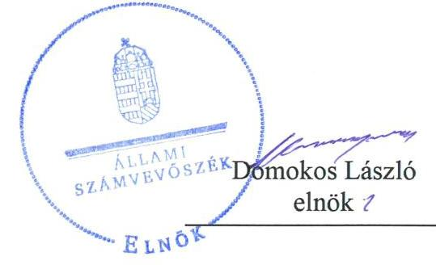
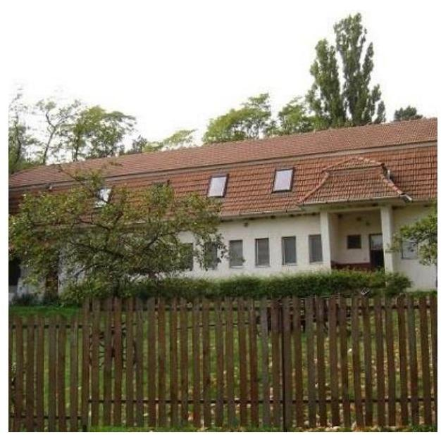

ÁLLAMI
SZÁMVEVŐSZÉK

# Jelentés

## Központi költségvetési szervek ellenőrzése

Bárczay János Mezőgazdasági Szakgimnázium, Szakközépiskola és Kollégium

2019.

19237
www.asz.hu

---

# Jelentés 

## Központi költségvetési szervek ellenőrzése

Bárczay János Mezőgazdasági Szakgimnázium, Szakközépiskola és Kollégium
2019. 12. hó 19. nap

---

# AZ ELLENŐRZÉST FELÜGYELTE:

## MAROZSÁN LÁSZLÓNÉ felügyeleti vezető

## AZ ELLENŐRZÉST VEZETTE ÉS A VÉGREHAJTÁSÁÉRT FELELŐS:

### DR. NAGY JUDIT ellenőrzésvezető

### A PROGRAM ÖSSZEÁLLÍTÁSÁÉRT FELELŐS:

### TÓTPÁL SZABOLCS osztályvezető

---

**IKTATÓSZÁM:** EL-2322-001/2019.

**TÉMASZÁM:** 2450

**ELLENŐRZÉS-AZONOSÍTÓ SZÁM:** V079142

---

Jelentéseink az Országgyűlés számítógépes hálózatán és az Interneten a www.asz.hu címen is olvashatóak.

---

# TARTALOMJEGYZÉK 

■ ÖSSZEGZÉS ..... 5
■ AZ ELLENŐRZÉS CÉLJA ..... 6
■ AZ ELLENŐRZÉS TERÜLETE ..... 7
■ AZ ELLENŐRZÉS HÁTTERE, INDOKOLTSÁGA ..... 8
■ A JELENTÉS LÉNYEGES KÉRDÉSKÖREI ..... 9
■ AZ ELLENŐRZÉS HATÓKÖRE ÉS MÓDSZEREI ..... 10
■ MEGÁLLAPÍTÁSOK ..... 12
■ JAVASLATOK ..... 15
■ MELLÉKLETEK ..... 17
I. sz. melléklet: Értelmező szótár ..... 17
■ FÜGGELÉKEK ..... 19
I. sz. függelék a jelentéshez ..... 19
II. sz. függelék: Észrevételek ..... 20
■ RÖVIDÍTÉSEK JEGYZÉKE ..... 21

---

.

---

# ÖSSZEGZÉS 

A Bárczay János Mezőgazdasági Szakgimnázium, Szakközépiskola és Kollégium működésének szabályozottsága, pénzügyi és vagyongazdálkodása nem felelt meg a jogszabályi előírásoknak. Nem volt biztosított a felelős gazdálkodás, a közpénzek szabályszerű felhasználása és a nemzeti vagyonnal történő elszámoltatható gazdálkodás. A korrupcióval szemben nem volt védett.

## Az ellenőrzés társadalmi indokoltsága

Magyarország versenyképességének és a magyar gazdaság fejlődésének alapvető feltétele a magyar munkavállalók megfelelő szakmai képzettsége és felkészültsége, amelyben a szakképzési rendszernek döntő szerepe van. A mezőgazdaság vonatkozásában is kiemelten fontos ez, hiszen a magyar mezőgazdaság piaci versenyképességét és eredményességét nagymértékben befolyásolja az agrárszférában dolgozók képzettsége, felkészültsége. A szakképzés legjelentősebb színterei a szakképző iskolák. Az eredményes és célszerű szakképzés alapja és alapvető feltétele a szakképző intézmények közpénzekkel és a közvagyonnal való törvényes, átlátható és a korrupcióval szembeni védelmet biztosító működése és gazdálkodása. Ezért ezen szervezetekkel szemben is alapvető társadalmi igény, hogy a rájuk bízott közpénzekkel, közvagyonnal szabályosan gazdálkodjanak. Emellett a szakképzésben részt vevő pedagógusok, tanulók és a szülők jogos elvárása, hogy a szakképző iskolák működése átlátható és elszámoltatható legyen. Mindezen igényekkel összhangban, a közpénzügyek átláthatóságának előmozdítása, a közvagyon védelme érdekében került sor az agrárszakképző iskolák belső kontrollrendszerének és gazdálkodásának ellenőrzésére.

## Főbb megállapítások, következtetések, javaslatok

A Bárczay János Mezőgazdasági Szakgimnázium, Szakközépiskola és Kollégium belső kontrollrendszerének kialakítása és működtetése nem volt szabályszerű. A Bárczay János Mezőgazdasági Szakgimnázium, Szakközépiskola és Kollégium nem rendelkezett szervezeti és működési szabályzattal, ezáltal nem biztosította a szabályszerű működéshez szükséges feladat és felelősségi körök világos elhatárolását. A 2017. évben integrált kockázatkezelési rendszerét, információs és kommunikációs rendszerét, nyomonkövetési rendszerét nem működtette, a kontrolltevékenységet nem szabályszerűen gyakorolta. A feltárt hiányosságok miatt a belső kontrollrendszer nem biztosította a szabályszerű működés és gazdálkodás feltételeit.

A Bárczay János Mezőgazdasági Szakgimnázium, Szakközépiskola és Kollégium pénzügyi és vagyongazdálkodása nem volt szabályszerű, nem vezették a jogszabályok szerinti nyilvántartást a kötelezettségvállalásokról, 2017. évi költségvetési beszámolójának mérleg tételei leltárral nem voltak alátámasztottak.

A Bárczay János Mezőgazdasági Szakgimnázium, Szakközépiskola és Kollégiumnál a korrupció elleni védelemhez szükséges kontrollokat nem építették ki, kockázatelemzést nem végeztek. A teljesítmény mérés feltételei nem voltak biztosítottak.

A megállapítások alapján az Állami Számvevőszék a Bárczay János Mezőgazdasági Szakgimnázium, Szakközépiskola és Kollégium intézmény vezetője részére 12 javaslatot fogalmazott meg.

---

# AZ ELLENŐRZÉS CÉLJA 

AZ ELLENŐRZÉS CÉLJA annak megítélése volt, hogy az ellenőrzött intézményre vonatkozó irányító szervi feladatellátás a jogszabályi előírások betartásával történt-e; az intézménynél a belső kontrollrendszer kialakítása és működtetése szabályszerű volt-e, biztosította-e az átlátható, szabályszerű, gazdaságos, hatékony és eredményes gazdálkodás feltételeit; az intézmény pénzügyi és vagyongazdálkodása megfelelt-e a jogszabályi előírásoknak és belső szabályzatainak. Az ellenőrzés keretében az Állami Számvevőszék értékelte az intézmény korrupciós kockázatainak kezelését szolgáló integritás kontrollok kiépítettségét és az integritás szemlélet érvényesülését, a teljesítményellenőrzés feltételeinek kialakítását. Értékelte továbbá, hogy az ellenőrzött megfelel-e annak az Alaptörvényben meghatározott alapvetésnek, hogy Magyarország a kiegyensúlyozott, átlátható és fenntartható költségvetési gazdálkodás elvét érvényesíti. Érvényesült-e a nemzeti vagyon kezelésének és védelmének célja, azaz a szervezet vagyona a közérdeket szolgálta-e a közös szükségletek kielégítése és a természeti erőforrások megóvása, valamint a jövő nemzedékek szükségleteinek figyelembevétele mellett.

---

# **AZ ELLENŐRZÉS TERÜLETE**

## **Bárczay János Mezőgazdasági Szakgimnázium, Szakközépiskola és Kollégium**

Az abaújszántói székhelyű Bárczay János Mezőgazdasági Szakgimnázium, Szakközépiskola és Kollégium és annak perem telephelye Borsod-Abaúj-Zemplén megyében található. 2013. augusztus 1. óta az Intézmény1 irányító szerve és fenntartója a Minisztérium2.

Az Intézmény, alapfeladata a szakgimnáziumi és szakközépiskolai nevelés-oktatás, továbbá kollégiumi elhelyezés biztosítása.

Az Intézmény tanulói létszáma 169 fő volt 2017. október 1-jén, akik számára mezőgazdaság szakmacsoportban nyújtottak oktatást és biztosítottak szakképzési lehetőséget.

Az Intézmény gazdasági szervezettel nem rendelkezik, a gazdálkodással összefüggő feladatokat a Vay Ádám Gimnázium, Mezőgazdasági Szakképző Iskola és Kollégium látja el. A foglalkoztatottak száma 2017. évben 30 főt tett ki.

Az ellenőrzött időszakban az Intézménynél szervezeti, szerkezeti átalakításra nem került sor. Az Intézmény vezetője3 2015. július 1-je óta látta el a feladatát, személye az ellenőrzött időszakban nem változott.

Az Intézménynél a 2016. évi összes bevételek 180,4 millió Ft volt, ebből finanszírozási bevételek 128,6 millió Ft összegben teljesültek. 2017. év tekintetében az összes bevételek 202,5 millió Ft volt, a finanszírozási bevételek 135,3 millió Ft összegben teljesültek.

---

# AZ ELLENŐRZÉS HÁTTERE, INDOKOLTSÁGA 

Az államháztartás központi alrendszerének közpénz felhasználása, az intézmények által ellátott közfeladatok sokrétűsége, valamint a feladatellátásához rendelt vagyon nagyságrendje indokolja, hogy az ÁSZ ${ }^{4}$ ellenőrzéseket folytasson a pénzügyi és vagyongazdálkodás területén. Az ÁSZ az ellenőrzései során feltárja a gazdálkodást, a központi alrendszer intézményei átalakulását, átszervezését érintő szabályozások esetleges hiányosságait, a szabályozással nem érintett gazdálkodási területeket, rámutathat a vagyongazdálkodási tevékenység - ezen belül a tulajdonosi joggyakorlás és vagyonkezelés - esetleges szabálytalanságaira, értékeli az állami vagyon nyilvántartására és elszámolására vonatkozó eljárásokat.

Az ellenőrzés a szervezet kockázatértékelése alapján, az egyedi és lényeges jellemzők figyelembevételével, az ellenőrzésre kiválasztott modullal történik. Az integritás- és belső kontroll modul a központi költségvetési szerv működésének irányítottságát, korrupció elleni védettségét értékeli.

A belső kontrollrendszer kialakítása és működtetése nélkül nem valósítható meg a közpénzek, a közvagyon átlátható, szabályos, gazdaságos, hatékony és eredményes felhasználása. A belső kontrollrendszer azt a célt szolgálja, hogy a költségvetési szervek működésük és gazdálkodásuk során a tevékenységeket szabályszerűen hajtsák végre, teljesítsék elszámolási kötelezettségeiket és megvédjék az erőforrásokat a veszteségektől, a károktól és a nem rendeltetésszerű használattól. A belső kontrollrendszer magában foglalja mindazon elveket, eljárásokat és belső szabályzatokat, melyek biztosítják, hogy a költségvetési szerv valamennyi tevékenysége és célja összhangban legyen a szabályszerűséggel, szabályozottsággal, valamint a gazdaságosság, hatékonyság és eredményesség követelményeivel, az eszközökkel és forrásokkal való gazdálkodásban ne kerüljön sor pazarlásra, visszaélésre, rendeltetésellenes felhasználásra. Megfelelő, pontos és naprakész információk álljanak rendelkezésre a költségvetési szerv működésével kapcsolatosan, és a belső kontrollrendszer harmonizációjára, összehangolására vonatkozó jogszabályok végrehajtásra kerüljenek. Az integritás kontrollok kiépítése, erősítése a szervezet korrupciós kockázatainak kezelését szolgálja. A teljesítménykövetelmények meghatározása és működtetése megalapozhatja a központi költségvetési szervnél a teljesítményellenőrzés lefolytatását.

Az egyes ellenőrzések megállapításaival és egy időszak ellenőrzési eredményeinek elemzésével az ÁSZ ráirányíthatja a jogalkotók figyelmét a központi alrendszerben vagy annak egy ágazatában esetlegesen felmerülő pénzügyi, szabályozási feszültségekre. Az elvégzett ellenőrzések során az ÁSZ „jó gyakorlatokat" is azonosíthat, melyeket tanácsadó funkciója keretében szélesebb körben is megismertethet az érintettekkel, ezáltal is hozzájárulva a költségvetési rendszer szabályozott, átlátható, kiegyensúlyozott és fenntartható működéséhez.

---

# A JELENTÉS LÉNYEGES KÉRDÉSKÖREI 

1. Az irányító szerv ellenőrzött költségvetési szervre vonatkozó feladatellátása szabályszerű volt-e?
2. A belső kontrollrendszer kialakítása és működtetése biztosította-e a közpénzekkel és a nemzeti vagyonnal történő átlátható, szabályszerű gazdálkodást?
3. A költségvetési szerv pénzügyi-és vagyongazdálkodása szabályszerű volt-e?
4. A költségvetési szervnél alakítottak-e ki a teljesítmény mérésére alkalmas követelményeket?

---

# AZ ELLENŐRZÉS HATÓKÖRE ÉS MÓDSZEREI 

## Az ellenőrzés típusa

Megfelelőségi ellenőrzés.

## Az ellenőrzött időszak

Az irányító szervi feladatellátás és a szervezet pénzügyi gazdálkodása tekintetében a 2016. év.

Az Intézmény vagyongazdálkodása, integritás és belső kontrollrendszerének értékelése tekintetében a 2016-2017. évek.

## Az ellenőrzés tárgya

Az Intézményre vonatkozó irányító szervi feladatok ellátása. Az Intézmény belső kontrollrendszerének kialakítása és működtetése, pénzügyi és vagyongazdálkodása, az integritáskontrollok kiépítettsége, az integritás szemlélet érvényesülése, a teljesítményellenőrzés feltételei.

## Az ellenőrzött szervezet

Bárczay János Mezőgazdasági Szakgimnázium, Szakközépiskola és Kollégium és irányítószerve a Földművelésügyi Minisztérium (jelenleg Agrárminisztérium); valamint a gazdálkodási feladatokat ellátó Vay Ádám Gimnázium, Mezőgazdasági Szakképző Iskola és Kollégium

## Az ellenőrzés jogalapja

Az ellenőrzés jogszabályi alapját az ÁSZ tv. 1. § (3) bekezdés, 5. § (2)-(3), (4) bekezdés a) pontja és (6) bekezdései, valamint az Áht. ${ }^{5}$ 61. § (2) bekezdésének előírásai képezték.

## Az ellenőrzés módszerei

Az ellenőrzésre a szakmai program szempontjai, az ellenőrzött időszakban hatályos jogszabályok, az ellenőrzés szakmai szabályai, a jelen ellenőrzésre irányadó ÁSZ módszertanok figyelembevételével került sor.

Az ellenőrzési kérdések megválaszolásához szükséges bizonyítékok megszerzése az ellenőrzött szervezetek által rendelkezésre bocsátott dokumentumokra, adatokra alapozva megfigyelés, szemle (szemrevételezés), kérdésfeltevés (információkérés), mintavételezés, valamint elemző eljárás útján történik. Az ellenőrzési bizonyítékként felhasználható adatforrások közé tartoznak az ellenőrzési program részletes szempontjainál felsorolt adatforrások, valamint minden egyéb - az ellenőrzés folyamán feltárt, az ellenőrzés szempontjából információt tartalmazó - dokumentum.

Az ellenőrzés lefolytatásához az ellenőrzött szervezetek tanúsítványok kitöltésével, valamint az ÁSZ által kért dokumentumok megküldésével szolgáltattak adatokat, amelyek valódiságát és teljes körűségét az ellenőrzött szervezetek vezetői által tett teljességi és hitelességi nyilatkozat igazolja. A rendelkezésre bocsátott adatok, információk kontrollja az ellenőrzés keretében történt.

Az Intézmény belső kontrollrendszere egyes pilléreinek kialakítására és működtetésére vonatkozó értékelés a következő volt:
$\longrightarrow$ „szabályszerű", amennyiben az értékelt területen az elért „igen" válaszok százalékban kifejezett, egész számra kerekített aránya legalább $85 \%$ volt,
$\longrightarrow$ „nem szabályszerű", ha nem érte el a 85\%-ot.
Az Intézmény belső kontrollrendszerének összesített értékelése az egyes részterületek esetében kapott megfelelőségi arányok számtani átlaga alapján történt és megegyezett a pillérenként (kontrollterületenként) alkalmazott százalékos értékelésekkel, a következő eltérésekkel: a kontrollrendszer egésze esetében a „szabályszerű" értékelésnek a százalékos értéken felül további feltétele volt, hogy egyik kontrollterület sem kaphat „nem szabályszerű" értékelést.

Az ÁSZ statisztikai módszereken alapuló mintavételt alkalmazott. A 2017. évi kiadások (külső személyi juttatások, felhalmozási kiadások, dologi kiadások) esetében az ellenőrzés azokra a legnagyobb értékű tételekre - a lényeges sokaságra - terjedt ki, melyek összértéke eléri a teljes sokaság összértékének 50\%-át. A 2017. évi kiadások elszámolásának szabályszerűségét a lényeges sokaságból véletlen mintavételi eljárással kiválasztott tételek alapján ellenőrizte az ÁSZ. A 2017. évi feladatellátást szolgáló állami vagyontárgyak használatának szabályszerűsége esetében tételes ellenőrzésre került sor. A mintavétellel ellenőrzött terület esetében minden egyes tétel vonatkozásában az elszámolás szabályszerűségére vonatkozó kérdéseket tett fel az ÁSZ. Szabályszerűnek értékelt egy ellenőrzött területet, amennyiben 95\%-os bizonyossággal az ellenőrzött sokaságban az átlagos hibaarány legfeljebb 10\%, nem szabályszerűnek, amennyiben 10\%-nál magasabb arányt képviselt.

Az ellenőrzés ideje alatt az ellenőrzött szervezettel
 történő kapcsolattartást az ÁSZ az SZMSZ ${ }^{\circledR}$-ének vonatkozó előírásai alapján biztosította.

---

# 1. Az irányító szerv ellenőrzött költségvetési szervre vonatkozó feladatellátása szabályszerű volt-e? 

Összegző megállapítás A Minisztérium Intézményre vonatkozó feladatellátása szabályszerű volt.

A Minisztérium jóváhagyta az Intézmény elemi költségvetését, költségvetési beszámolóját a jogszabályi előírásoknak megfelelően.

A Minisztérium az Áht.-ben foglalt hatáskörét gyakorolva beszámoltatta az Intézmény vezetőjét az éves szakmai feladatellátásról, valamint az éves gazdálkodásról.

## 2. A belső kontrollrendszer kialakítása és működtetése biztosította-e a közpénzekkel és a nemzeti vagyonnal történő átlátható, szabályszerű gazdálkodást?

## Összegző megállapítás

Az Intézménynél a belső kontrollrendszer kialakítása és működtetése nem volt szabályszerű a 2016-2017. években.

## A BELSŐ KONTROLLRENDSZER KIALAKÍTÁSA ÉS MŰKÖDTETÉSE NEM VOLT SZABÁLYSZERŰ A

2016. ÉVBEN az Intézménynél, mivel az Intézmény nem rendelkezett az Áht. 10. § (5) bekezdésében előírtak ellenére szervezeti és működési szabályzattal.

## A KONTROLLKÖRNYEZET KIALAKÍTÁSA A

2017. ÉVBEN az Intézménynél nem szabályszerűen történt, mert.
—_ Az Intézmény az Áht. 10. § (5) bekezdésében foglaltak ellenére nem rendelkezett szervezeti és működési szabályzattal.
—_ Az Ávr. ${ }^{7}$ 13. § (2) bekezdés a) pontjával foglaltak ellenére az Intézmény vezetője belső szabályzatban nem rendezte a gazdálkodással kapcsolatos belső előírásokat, feltételeket, a kötelezettségvállalás és a teljesítésigazolás gyakorlásának módját, az ezeket végző személyek kijelölésének rendjét.
— Nem rendelkezett az Intézmény a jogszabályi előírások szerinti tartalmú számlarenddel, mivel az nem tartalmazta a Számv. tv. 161. § (2) bekezdése b) pontjában előírtak ellenére a számla értéke növekedésének, csökkenésének jogcímeit, továbbá az Áhsz. ${ }^{8}$ 51. § (3) bekezdésében előírtak ellenére a részletező nyilvántartások egyeztetését a kapcsolódó könyvviteli számlákkal, a

---

pénzügyi könyvvezetéshez készült összesítő bizonylatok elkészítésének a rendjét.

- A Vagyonnyilatkozat szabályzatban ${ }^{9}$ a Vnytv. ${ }^{10}$ 14. § (3) bekezdésében foglaltak ellenére, a meghallgatásra vonatkozó szabályok nem kerültek megállapításra.
- Az Intézmény vezetője az Ávr. 13. § (2) bekezdésének h) pontjában előírtak ellenére belső szabályzatban nem rendezte a közérdekű adatok megismerésére irányuló kérelmek teljesítésének rendjét.

INTEGRÁLT KOCKÁZATKEZELÉSI RENDSZERT az Intézmény vezetője a Bkr. ${ }^{11} 7$. § (1) bekezdésben előírtak ellenére nem működtetett a 2017. évben, mivel a Bkr. 7. § (2) bekezdésében előírtak ellenére nem mérte fel és nem állapította meg az Intézmény tevékenységében rejlő és a szervezeti célokkal összefüggő kockázatokat, valamint nem határozta meg az egyes kockázatokkal kapcsolatban szükséges intézkedéseket, valamint azok teljesítésének folyamatos nyomon követésének módját

# A KONTROLLTEVÉKENYSÉGEK GYAKORLÁSA a 

2017. évben nem szabályszerűen történt az Intézménynél. Az Intézménynél a dologi kiadások az Áht. 37. § (1) bekezdése ellenére kötelezettségvállalások nélkül történtek. A dologi kiadások és a külső személyi juttatások pénzügyi teljesítésére az Áht. 38. § (1) bekezdése ellenére teljesítésigazolások nélkül került sor.

## AZ INTÉZMÉNY INFORMÁCIÓS ÉS KOMMUNIKÁCIÓS RENDSZERÉT a Bkr. ${ }^{12} 3$ § d) pontja és a 9. § (1) bekezdésében foglaltak ellenére az Intézmény vezetője nem alakította ki és nem működtette a 2017. évben.

Az Intézmény az Áht. 108. § (1) bekezdése a) pontjában és az Ávr. 167/M. §-ban, a 169. § (2) bekezdésében, valamint az Ávr. 170. § (2) bekezdésében foglalt, a MÁK ${ }^{13}$ felé teljesítendő adatszolgáltatási kötelezettségének nem tett eleget.

## A SZERVEZET NYOMONKÖVETÉSI RENDSZERÉT

az Intézmény vezetője nem működtette a 2017. évben, mivel a Bkr. 10. § előírása ellenére nem gondoskodott az operatív tevékenységek keretében megvalósuló folyamatos és eseti nyomon követésről.

Az Intézmény vezetője az Áht. 70. § (1) bekezdésében előírtak ellenére nem gondoskodott az Intézményre vonatkozó belső ellenőrzés kialakításáról és működtetéséről a 2017. évben.

Az integritás kontrollok kiépítettségi szintje az Intézménynél nem támogatta a korrupciós kockázatok kezelését. Az Intézmény nem végzett kockázatelemzéseket. Az Intézmény nem működtetett az integritást erősítő, nem kötelezően előírt kontrollokat.

Az Intézmény vezetője a Bkr. 11. § (1) bekezdésében foglaltak ellenére a 2016. évre, valamint 2017. szeptember 1-jétől december 31-ig terjedő időszakra vonatkozóan nem értékelte a belső kontrollrendszer minőségét. A 2017. január 1-jétől augusztus 31-ig terjedő időszakra a belső kontrollrendszert szabályszerűnek értékelte az Intézmény vezetője. Az ÁSZ ellenőrzés megállapításai a vezetői nyilatkozatot nem támasztották alá.

---

# 3. A költségvetési szerv pénzügyi-és vagyongazdálkodása szabályszerű volt-e? 

## Összegző megállapítás

Az Intézmény pénzügyi-és vagyongazdálkodása nem volt szabályszerű.

Az Intézmény pénzügyi és vagyongazdálkodása a 2016. évben nem volt szabályszerű, mivel:
$\longrightarrow$ Az Ávr. 13. § (2) bekezdése ellenére nem szabályozta a gazdálkodási jogkörök gyakorlásának módját és az ezeket végző személyek kijelölésének rendjét, így nem volt elhatároltak és egyértelműek a felelősségi viszonyok.
$\longrightarrow$ Az Áhsz. 39. § (3) bekezdésben előírtak ellenére a kötelezettségvállalásokról és más fizetési kötelezettségekről nem vezette az Áhsz. 14. melléklet II. 4. pontjában előírt tartalommal a nyilvántartást a 2016. évben.
Az Intézmény 2017. évi vagyongazdálkodása nem volt szabályszerű, mert az Áhsz. 5. § (1) bekezdésében, 22. § (1)-(2) bekezdéseiben, valamint a Számv. tv. ${ }^{14}$ 69. § (1) bekezdésében előírtak ellenére az Intézmény mérleg tételeit 2017. évre vonatkozóan leltárral nem támasztották alá.

## 4. A költségvetési szervnél alakítottak-e ki a teljesítmény mérésére alkalmas követelményeket?

## Összegző megállapítás

Az intézménynél nem alakították ki a teljesítménymérésére alkalmas követelményeket

A teljesítménymérésre alkalmas követelményeket, ehhez kapcsolódóan mérőszámokat, indikátorokat az Intézmény vezetője nem alakított ki, ezáltal a teljesítmény mérésének feltételei nem állnak fenn az Intézménynél.

---

# JAVASLATOK 

Az ÁSZ tv. 33. § (1) bekezdésében foglaltak értelmében az ellenőrzött szervezet vezetője köteles a jelentésben foglalt megállapításokhoz kapcsolódó intézkedési tervet összeállítani és azt a jelentés kézhezvételétől számított 30 napon belül az ÁSZ részére megküldeni. Amennyiben az ellenőrzött szervezet vezetője nem küldi meg határidőben az intézkedési tervet, vagy továbbra sem elfogadható intézkedési tervet küld, az Állami Számvevőszék elnöke az ÁSZ tv. 33. § (3) bekezdés a) és b) pontjaiban foglaltakat érvényesítheti.

## Bárczay János Mezőgazdasági Szakgimnázium, Szakközépiskola és Kollégium igazgatója részére

1. Intézkedjen a jogszabályi előírásoknak megfelelően a szervezeti és működési szabályzat elkészítéséről.
(2. sz. megállapítás 2. bekezdés 1. francia bekezdése alapján)
2. Intézkedjen, az Ávr. előírásának megfelelően a gazdálkodással kapcsolatos belső előírások, feltételek, a kötelezettségvállalás módjának, ezeket végző személyek kijelölésének a szabályozásáról.
(2. sz. megállapítás 2. bekezdés 2. francia bekezdése alapján)
3. Intézkedjen az Áhsz. előírásainak megfelelő tartalmú számlarend elkészítéséről.
(2. sz. megállapítás 2. bekezdés 3. francia bekezdése alapján)
4. Intézkedjen a vagyongyarapodási vizsgálattal kapcsolatos meghallgatásra vonatkozó további szabályok jogszabályi előírásnak megfelelő megállapításáról.
(2. sz. megállapítás 2. bekezdés 4. francia bekezdése alapján)
5. Intézkedjen az Ávr. előírásának megfelelően a közérdekű adatok megismerésére irányuló kérelmek intézésének belső szabályzatban való rendezéséről
(2. sz. megállapítás 2. bekezdés 5. francia bekezdése alapján)
6. Intézkedjen a Bkr. előírásának megfelelően az integrált kockázatkezelési rendszer működtetéséről.
(2. sz. megállapítás 3. bekezdése alapján)

---

7. Intézkedjen a jogszabályi előírásnak megfelelő kötelezettségvállalásról és teljesítésigazolásról.
(2. sz. megállapítás 4. bekezdés 2-3. mondatai alapján)
8. Intézkedjen az információs és kommunikációs rendszer Bkr. előírásának megfelelő kialakításáról és működtetéséről.
(2. sz. megállapítás 5. bekezdései alapján)
9. Intézkedjen az adatszolgáltatási kötelezettség jogszabályban előírtaknak megfelelő teljesítéséről a MÁK felé.
(2. sz. megállapítás 6. bekezdése alapján)
10. Intézkedjen a Bkr. előírásainak megfelelően az operatív tevékenységek keretében megvalósuló folyamatos és eseti nyomon követésről.
(2. sz. megállapítás 7. bekezdése alapján)
11. Intézkedjen az Intézmény belső ellenőrzésének Bkr. előírásainak megfelelő kialakításáról és működtetéséről.
(2. sz. megállapítás 8. bekezdése alapján)
12. Intézkedjen az éves költségvetési beszámoló elkészítéséhez, a mérlegtételeinek alátámasztásához a jogszabályi előírásnak megfelelő leltár összeállításáról.
(3. sz. megállapítás 2. bekezdése alapján)

---

# MELLÉKLETEK 

- I. SZ. MELLÉKLET: ÉRTELMEZŐ SZÓTÁR
állami vagyon
állami vagyon kezelője /vagyonkezelő
átalakítás
belső ellenőrzés
belső kontrollrendszer
belső kontrollrendszer területei
ellenőrzési nyomvonal
információs és kommunikációs rendszer
integritás

Állami vagyonnak minősül:
a) az állam tulajdonában lévő dolog, valamint a dolog módjára hasznosítható természeti erő, b) az a) pont hatálya alá nem tartozó mindazon vagyon, amely vonatkozásában törvény az állam kizárólagos tulajdonjogát nevesíti,
c) az állam tulajdonában lévő tagsági jogviszonyt megtestesítő értékpapír, illetve az államot megillető egyéb társasági részesedés,
d) az államot megillető olyan immateriális, vagyoni értékkel rendelkező jogosultság, amelyet jogszabály vagyoni értékű jogként nevesít. (Forrás: Vtv. ${ }^{15}$ 1. § (2) bekezdése)
Az állami vagyont az MNV Zrt. ${ }^{16}$ maga kezeli, vagy szerződés - így különösen bérlet, haszonbérlet, megbízás - alapján központi költségvetési szervnek, természetes vagy jogi személynek, vagy jogi személyiséggel nem rendelkező gazdálkodó szervezetnek hasznosításra átengedi." Az állami vagyonra vonatkozóan az MNV Zrt. kizárólag az Nvtv. ${ }^{17}$-ben meghatározott személyekkel köthet vagyonkezelési szerződést. (Forrás: Vtv. 27. § (1) bekezdése, hatályos 2012. január 1-jétől)

A költségvetési szerv általános jogutódlással történő megszüntetése átalakítással történhet. Az átalakítás lehet egyesítés vagy különválás. Az egyesítés lehet beolvadás vagy összeolvadás. (2015. január 1-jétől Áht. 11. § (2) bekezdés)
Független, tárgyilagos bizonyosságot adó és tanácsadó tevékenység, amelynek célja, hogy az ellenőrzött szervezet működését fejlessze és eredményességét növelje, az ellenőrzött szervezet céljai elérése érdekében rendszerszemléletű megközelítéssel és módszeresen értékeli, illetve fejleszti az ellenőrzött szervezet irányítási és belső kontrollrendszerének hatékonyságát. (Forrás: Bkr. 2. § b) pontja)
A belső kontrollrendszer a kockázatok kezelése és tárgyilagos bizonyosság megszerzése érdekében kialakított folyamatrendszer, amely azt a célt szolgálja, hogy a működés és gazdálkodás során a tevékenységeket szabályszerűen, gazdaságosan, hatékonyan, eredményesen hajtsák végre, az elszámolási kötelezettségeket teljesítsék, megvédjék az erőforrásokat a veszteségektől, károktól és nem rendeltetésszerű használattól. (Forrás: Áht. 69. § (1) bekezdése)
A kontrollkörnyezet, az integrált kockázatkezelési rendszer, a kontrolltevékenységek, az információs és kommunikációs rendszer, valamint a nyomon követési (monitoring) rendszer. (Forrás: Bkr. 3. §-a)
Az ellenőrzési nyomvonal a költségvetési szerv működési folyamatainak szöveges, táblázatokkal vagy folyamatábrákkal szemléltetett leírása, amely tartalmazza különösen a felelősségi és információs szinteket és kapcsolatokat, irányítási és ellenőrzési folyamatokat, lehetővé téve azok nyomon követését és utólagos ellenőrzését. (Forrás: Bkr. 6. § (3) bekezdés)
A költségvetési szerv vezetője által kialakított és működtetett olyan rendszer, mely biztosítja, hogy a megfelelő információk a megfelelő időben eljutnak az illetékes szervezethez, szervezeti egységhez, illetve személyhez. (Forrás: Bkr. 9. § (1) bekezdés)
Az integritás - egyik gyakran használt jelentése szerint - az elvek, értékek, cselekvések, módszerek, intézkedések konzisztenciáját jelenti, vagyis olyan magatartásmódot, amely meghatározott értékeknek megfelel. Integritás-irányítási rendszer bevezetése a szervezetben a szervezethez rendelt közfeladatok integritás szempontú ellátását, az érték alapú működéssel (integritással) összefüggő szervezeti követelmények következetes érvényesítését jelenti. (Forrás: Nemzetgazdasági Minisztérium: Államháztartási Belső Kontroll Standardok és Gyakorlati Útmutató 1.6. Etikai értékek és integritás 46. oldal, 2017. szeptember)

---

integrált kockázatkezelési rendszer
irányító szerv/felügyeleti szerv
kockázat
kockázatkezelési rendszer
kontrollkörnyezet
kontrolltevékenységek
nyomon követési rendszer (monitoring)
vagyongazdálkodás

Olyan folyamatalapú kockázatkezelési rendszer, amely a szervezet minden tevékenységére kiterjed, egységes módszertan és eljárások alkalmazásával, a szervezet célkitűzéseinek és értékeinek figyelembevételével biztosítja a szervezet kockázatainak teljes körű azonosítását, azok meghatározott kritériumok szerinti értékelését, valamint a kockázatok kezelésére vonatkozó intézkedési terv elkészítését és az abban foglaltak nyomon követését. (Forrás: Bkr. 2. § m) pontja, 2016. október 1-jétől)
A költségvetési szerv tekintetében az Áht.-ban meghatározott irányítási hatáskört gyakorló szerv. (Forrás:

 Áht. 1. § 9. pontja)
A kockázat annak a valószínűségét jelenti, hogy egy vagy több esemény vagy intézkedés nem kívánt módon befolyásolja a rendszer működését, céljainak megvalósulását. (Forrás: Javaslatok a korrupciós kockázatok kezelésére - Kockázatkezelési és ellenőrzési módszertan 35. oldal, ÁSZ)
Olyan irányítási eszközök és módszerek összessége, melynek elemei a szervezeti célok elérését veszélyeztető tényezők (kockázatok) azonosítása, elemzése, csoportosítása, nyomon követése, valamint szükség esetén a kockázati kitettség mérséklése.(Forrás: Bkr. 2. § m) pontja, 2016. szeptember 30-ig)

A költségvetési szerv vezetője által kialakított olyan elvek, eljárások, belső szabályzatok összessége, amelyben világos a szervezeti struktúra, a folyamatok átláthatók, egyértelműek a felelősségi, hatásköri viszonyok és feladatok, meghatározottak, ismertek és elfogadottak az etikai elvárások a szervezet minden szintjén, átlátható a humánerőforrás-kezelés. (Forrás: Bkr. 6. § (1) bekezdés)
A költségvetési szerv vezetője által a szervezeten belül kialakított (kontroll) tevékenységek, melyek biztosítják a kockázatok kezelését, hozzájárulnak a szervezet céljainak eléréséhez és erősítik a szervezet integritását. (Forrás: Bkr. 8. § (1) bekezdés)
A költségvetési szerv vezetője köteles kialakítani a szervezet tevékenységének a célok megvalósításának nyomon követését biztosító rendszert, amely az operatív tevékenységek keretében megvalósuló folyamatos és eseti nyomon követésből, valamint az operatív tevékenységektől függetlenül működő belső ellenőrzésből áll. 2016. október 1-jétől: A költségvetési szerv vezetője köteles kialakítani a szervezet tevékenységének, a célok megvalósításának nyomon követését biztosító rendszert, mely az operatív tevékenységek keretében megvalósuló folyamatos és eseti nyomon követésből, valamint az operatív tevékenységektől függetlenül működő belső ellenőrzésből állhat. (Forrás: Bkr. 10. §)
A nemzeti vagyongazdálkodás feladata a nemzeti vagyon rendeltetésének megfelelő, az állam, az önkormányzat mindenkori teherbíró képességéhez igazodó, elsődlegesen a közfeladatok ellátásához és a mindenkori társadalmi szükségletek kielégítéséhez szükséges, egységes elveken alapuló, átlátható, hatékony és költségtakarékos működtetése, értékének megőrzése, állagának védelme, értéknövelő használata, hasznosítása, gyarapítása, továbbá az állam vagy a helyi önkormányzat feladatának ellátása szempontjából feleslegessé váló vagyontárgyak elidegenítése. (Forrás: Nvtv. 7. § (2) bekezdése)

---

# FÜGGELÉKEK 

- I. SZ. FÜGGELÉK A JELENTÉSHEZ

Az Állami Számvevőszék az ellenőrzések során feltárt tényekhez kapcsolódó további körülmények tisztázására eszközrendszerrel nem rendelkezik. Amennyiben az ellenőrzésen túlmutatóan indokoltnak látszik az ellenőrzés során feltárt körülmények további vizsgálata, az Állami Számvevőszék törvényi felhatalmazás alapján az ellenőrzés által feltárt körülményeket továbbítja a hatáskörrel rendelkező szervnek a szükséges intézkedések megtétele, eljárások lefolytatása érdekében.

1. Az Intézmény 2017. évi éves beszámolója mérleg tételeinek alátámasztásához nem készült leltár. Ezzel megsértették az Áhsz. 5. § (1) bekezdésében, 22. § (1)(2) bekezdéseiben, valamint a Számv. tv. 69. § (1) bekezdésében foglaltakat.

Ezért nem igazolt, hogy a 2017. évi költségvetési beszámoló mérlegében szereplő tételek a valóságban is megtalálhatóak.
2. Az Intézménynél a 2017. évben a dologi kiadások vonatkozásában 5 esetben, összesen 1.265.726,-Ft értékben az Áht. 37. § (1) bekezdésében foglaltak ellenére kötelezettségvállalás nélkül történt a kifizetés.
3. A 2017. évben az Áht. 38. § (1) bekezdése ellenére 2 esetben összesen 590.417,-Ft értékben a dologi kiadásoknál és 3 esetben összesen 842.720,-Ft értékben a külső személyi juttatásoknál teljesítésigazolás nélkül történt a kifizetés.

A gazdálkodási jogkörben a 2-3. pontban megfogalmazott szabálytalanságok miatt nem igazolt, hogy a kiadások valóban az Intézmény érdekében merültek fel, annak feladatellátását szolgálták, valamint hogy a kifizetésekhez valós teljesítések kapcsolódtak. Nem zárható ki, hogy a szabálytalan kifizetések az ellenőrzött szervezetnél vagyoni hátrányt okoztak.
Az ismertetett jelzések konkrét körülményeinek felderítésére az Ügyészség rendelkezik hatáskörrel.

---

A jelentéstervezetet a Számvevőszék 15 napos észrevételezésre megküldte az ellenőrzött szervezetek vezetőinek az ÁSZ tv. 29. § (1) bekezdése előírásának megfelelően.

A Bárczay János Mezőgazdasági Szakgimnázium, Szakközépiskola és Kollégium igazgatója, a Vay Ádám Mezőgazdasági Szakképző Iskola és Kollégium igazgatója, valamint az Agrárminisztérium minisztere az ÁSZ tv. 29. § (2) bekezdésében foglalt határidőn belül nem tett észrevételt a jelentéstervezet megállapításaira.

[^0]
[^0]:    * 29. § (1) Az Állami Számvevőszék az ellenőrzési megállapításait megküldi az ellenőrzött szervezet vezetőjének vagy az általa megbízott személynek, és annak, akinek személyes felelősségét állapította meg.
    (2) Az ellenőrzött szervezet vezetője és a felelősként megjelölt személy az ellenőrzés megállapításaira tizenöt napon belül írásban észrevételt tehet.
    (3) Az Állami Számvevőszék az észrevételre a beérkezésétől számított harminc napon belül írásban válaszol. A figyelembe nem vett észrevételeket köteles a jelentésben feltüntetni, és megindokolni, hogy azokat miért nem fogadta el.

---

# RÖVIDÍTÉSEK JEGYZÉKE 

${ }^{1}$ Intézmény
${ }^{2}$ Minisztérium
${ }^{3}$ Intézmény vezetője
${ }^{4}$ ÁSZ
${ }^{5}$ Áht.
${ }^{6}$ ÁSZ SZMSZ
${ }^{7}$ Ávr.
${ }^{8}$ Áhsz.
${ }^{9}$ Vagyonnyilatkozat szabályzat
${ }^{10}$ Vnytv.
${ }^{11}$ Bkr.
${ }^{12}$ Bkr.
${ }^{13}$ MÁK
${ }^{14}$ Számv. tv.
${ }^{15}$ Vtv.
${ }^{16}$ MNV Zrt.
${ }^{17}$ Nvtv.

Bárczay János Mezőgazdasági Szakgimnázium, Szakközépiskola és Kollégium Agrárminisztérium, 2018. május 17-ig Földművelődésügyi Minisztérium
Bárczay János Mezőgazdasági Szakgimnázium, Szakközépiskola és Kollégium mint költségvetési intézmény vezetője
Állami Számvevőszék
2011. évi CXCV. törvény az államháztartásról (hatályos: 2011. december 31-jétől)

Állami Számvevőszék Szervezeti és Működési Szabályzata
368/2011. (XII. 31.) Korm. rendelet az államháztartásról szóló törvény végrehajtásáról
4/2013. (I. 11.) Korm. rendelet az államháztartás számviteléről
Bárczay János Mezőgazdasági Szakképző Iskola és Kollégium a vagyonnyilatkozat átadásáról, nyilvántartásáról és a vagyonnyilatkozatban foglalt személyes adatok védelméről (hatályos: 2016. január 4-től)
Bárczay János Mezőgazdasági Szakgimnázium, Szakközépiskola és Kollégium a vagyonnyilatkozat átadásáról, nyilvántartásáról és a vagyonnyilatkozatban foglalt személyes adatok védelméről (hatályos: 2017. szeptember 1-jétől)
2007. évi CLII. törvény egyes vagyonnyilatkozat-tételi kötelezettségekről (hatályos: 2007. december 8-tól)
370/2011. (XII. 31.) Korm. rendelet a költségvetési szervek belső kontrollrendszeréről és belső ellenőrzésről
370/2011. (XII. 31.) Korm. rendelet a költségvetési szervek belső kontrollrendszeréről és belső ellenőrzésről
Magyar Állam Kincstár
2000. évi C. törvény a számvitelről (hatályos: 2001. január 1-jétől)
2007. évi CVI. törvény az állami vagyonról (hatályos: 2007. szeptember 25-étől)

Magyar Nemzeti Vagyonkezelő Zrt.
2011. évi CXCVI. törvény a nemzeti vagyonról (hatályos: 2012. január 1-jétől)

---

# ÁLLAMI SZÁMVEVŐSZÉK 

1052 Budapest, Apáczai Csere János utca 10.
Levélcím: 1364 Budapest 4. Pf. 54
Telefon: +36 14849100 Telefax: +36 14849200
www.asz.hu
