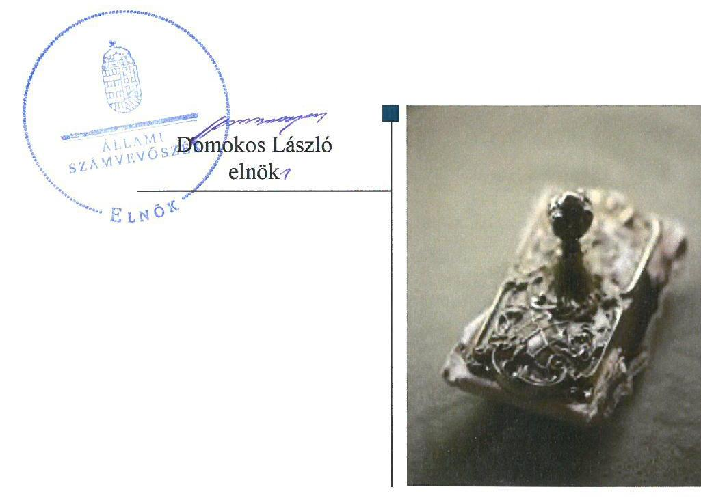
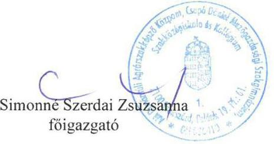
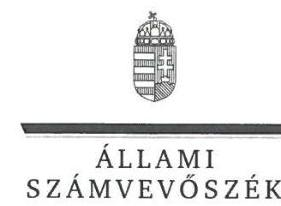
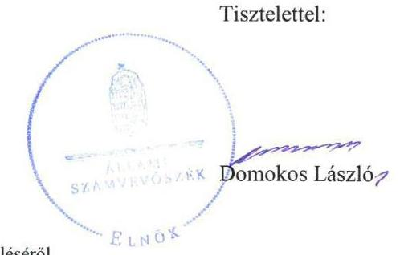

# Jelentés 

## Központi költségvetési szervek ellenőrzése

AM Dunántúli Agrárszakképző Központ, Csapó Dániel Mezőgazdasági Szakgimnázium, Szakközépiskola és Kollégium 2019.

---

# Jelentés 

## Központi költségvetési szervek ellenőrzése

AM Dunántúli Agrárszakképző Központ, Csapó Dániel Mezőgazdasági Szakgimnázium, Szakközépiskola és Kollégium
2019. 12. hó 19. nap

---

# AZ ELLENŐRZÉST FELÜGYELTE:

## MAKKAI MÁRIA felügyeleti vezető

## AZ ELLENŐRZÉST VEZETTE ÉS A VÉGREHAJTÁSÁÉRT FELELŐS:

### DÉZSINÉ KIS HAJNALKA ellenőrzésvezető

## A PROGRAM ÖSSZEÁLLÍTÁSÁÉRT FELELŐS:

### TÓTPÁL SZABOLCS osztályvezető

---

**IKTATÓSZÁM:** EL-2321-001/2019

**TÉMASZÁM:** 8

**ELLENŐRZÉS-AZONOSÍTÓ SZÁM:** V079139

---

Jelentéseink az Országgyűlés számítógépes hálózatán és az Interneta a www.asz.hu címen is olvashatóak.

---

# TARTALOMJEGYZÉK 

■ ÖSSZEGZÉS ..... 5
■ AZ ELLENŐRZÉS CÉLJA ..... 6
■ AZ ELLENŐRZÉS TERÜLETE ..... 7
■ AZ ELLENŐRZÉS HÁTTERE, INDOKOLTSÁGA ..... 8
■ A JELENTÉS LÉNYEGES KÉRDÉSKÖREI ..... 9
■ AZ ELLENŐRZÉS HATÓKÖRE ÉS MÓDSZEREI ..... 10
■ MEGÁLLAPÍTÁSOK ..... 12
■ JAVASLATOK ..... 15
■ FÜGGELÉK: ÉSZREVÉTELEK ..... 17
■ RÖVIDÍTÉSEK JEGYZÉKE ..... 25

---

.

---

# ÖSSZEGZÉS 

Az AM Dunántúli Agrárszakképző Központ, Csapó Dániel Mezőgazdasági Szakgimnázium, Szakközépiskola és Kollégium belső kontrollrendszere, pénzügyi és vagyongazdálkodása nem volt szabályszerű. Nem volt biztositott a nemzeti vagyonnal való átlátható, szabályszerű gazdálkodás. Az Intézmény nem volt védett a korrupcióval szemben.

## Az ellenőrzés társadalmi indokoltsága

Magyarország versenyképességének és a magyar gazdaság fejlődésének alapvető feltétele a magyar munkavállalók megfelelő szakmai képzettsége és felkészültsége, amelyben a szakképzési rendszernek döntő szerepe van. A mezőgazdaság vonatkozásában is kiemelten fontos ez, hiszen a magyar mezőgazdaság piaci versenyképességét és eredményességét nagymértékben befolyásolja az agrárszférában dolgozók képzettsége, felkészültsége. A szakképzés legjelentősebb színterei a szakképző iskolák. Az eredményes és célszerű szakképzés alapja és alapvető feltétele a szakképző intézmények közpénzekkel és a közvagyonnal való törvényes, átlátható és a korrupcióval szembeni védelmet biztosító múködése és gazdálkodása. Ezért ezen szervezetekkel szemben is alapvető társadalmi igény, hogy a rájuk bízott közpénzekkel, közvagyonnal szabályosan gazdálkodjanak. Emellett a szakképzésben részt vevő pedagógusok, tanulók és a szülők jogos elvárása, hogy a szakképző iskolák múködése átlátható és elszámoltatható legyen. Mindezen igényekkel összhangban, a közpénzügyek átláthatóságának előmozdítása, a közvagyon védelme érdekében került sor az agrár-szakképző iskolák belső kontrollrendszerének és gazdálkodásának ellenőrzésére.

## Főbb megállapítások, következtetések, javaslatok

Az AM Dunántúli Agrárszakképző Központ, Csapó Dániel Mezőgazdasági Szakgimnázium, Szakközépiskola és Kollégium belső kontrollrendszerének kialakítása és múködtetése nem felelt meg a jogszabályi előírásoknak a kontrollkörnyezet kialakításának hiányosságai, valamint az integrált kockázatkezelés, a gazdálkodási jogkörgyakorlás és a belső ellenőrzés területén tapasztalt szabálytalanságok miatt, ezáltal nem biztosította a szabályszerű közpénzfelhasználás feltételeit.

Az AM Dunántúli Agrárszakképző Központ, Csapó Dániel Mezőgazdasági Szakgimnázium, Szakközépiskola és Kollégium pénzügyi gazdálkodása nem volt szabályszerű, mert a kötelezettségvállalások nyilvántartása nem felelt meg a jogszabályi előírásoknak. Ezáltal nem volt biztosított a kiadási előirányzatok szabályszerű, ütemezett felhasználása.

Az AM Dunántúli Agrárszakképző Központ, Csapó Dániel Mezőgazdasági Szakgimnázium, Szakközépiskola és Kollégium vagyongazdálkodása nem volt szabályszerű a leltározási hiányosságok valamint az ingatlanokat érintő vagyonkezelési szerződések hiánya miatt. Az Intézmény költségvetési beszámolójában szereplő mérleg nem megalapozott, nem érvényesült a nemzeti vagyon védelme.

Az AM Dunántúli Agrárszakképző Központ, Csapó Dániel Mezőgazdasági Szakgimnázium, Szakközépiskola nem végzett integritás kockázatelemzést, a kötelező és nem kötelező kontrollok kiépítettsége nem volt megfelelő.

Az Állami Számvevőszék a jelentésben foglalt megállapítások alapján az AM Dunántúli Agrárszakképző Központ, Csapó Dániel Mezőgazdasági Szakgimnázium, Szakközépiskola és Kollégium igazgatója részére 10 javaslatot fogalmazott meg.

---

# AZ ELLENŐRZÉS CÉLJA 

AZ ELLENŐRZÉS CÉLJA annak megállapítása volt, hogy a központi költségvetési szervre vonatkozó irányító szervi feladatellátás a jogszabályi előírások betartásával történt-e; a központi költségvetési szerv belső kontrollrendszerének kialakítása és működtetése szabályszerű volt-e, biztosította-e az átlátható, szabályszerű, gazdaságos, hatékony és eredményes gazdálkodás feltételeit. Kiépítették és erősítették-e a korrupciós kockázatok kezelését szolgáló integritás kontrollokat; az intézményt érintő átszervezések lebonyolítása szabályszerűen törtét-e; megteremtették-e a teljesítményellenőrzés feltételeit. Továbbá annak megállapítása, hogy a szervezet gazdálkodása során elszámoltatható és megfelel-e annak az Alaptörvényben meghatározott alapvetésnek, hogy Magyarország a kiegyensúlyozott, átlátható és fenntartható költségvetési gazdálkodás elvét érvényesíti. Érvényesül-e a nemzeti vagyon kezelésének és védelmének célja, azaz a szervezet vagyona a közérdeket szolgálja, a közös szükségletek kielégítése és a természeti erőforrások megóvása, valamint a jövő nemzedékek szükségleteinek figyelembevétele mellett.

---

# AZ ELLENŐRZÉS TERÜLETE 

## AM Dunántúli Agrárszakképző Központ, Csapó Dániel Mezőgazdasági Szakgimnázium, Szakközépiskola és Kollégium

A Szekszárdon található AM Dunántúli Agrárszakképző Központ, Csapó Dániel Mezőgazdasági Szakgimnázium, Szakközépiskola és Kollégium hat tagintézménnyel rendelkező közös igazgatású köznevelési intézmény, térségi integrált szakképző központ. Az Intézmény ${ }^{1}$ tevékenysége szakgimnáziumi, szakközépiskolai nevelés-oktatás és kollégiumi ellátás, valamint felnőttoktatás.

A képzések mezőgazdasági, élelmiszeripari, közgazdasági, mezőgazdasági gépészeti, kertészet és parképítési, valamint rendészet és közszolgálati szakágazatban folytak.

Az Intézmény alapítója és irányító szerve a Földművelésügyi Minisztérium, jelenleg Agrárminisztérium. Az Igazgató² személye az ellenőrzés időszakában nem változott.

Az Intézmény saját gazdasági szervezete útján látta el a gazdálkodásával kapcsolatos feladatokat. A Gazdasági igazgatóhelyettes ${ }^{3}$ személye változott 2016-ban.

Az Intézmény a 2017. évben 4 125,1 millió Ft költségvetési bevétellel rendelkezett, költségvetési kiadása 3657,8 millió Ft volt, és 4719,9 millió Ft vagyonnal gazdálkodott. Az átlagos statisztikai állományi létszám 487 fő volt.

---

# AZ ELLENŐRZÉS HÁTTERE, INDOKOLTSÁGA 

Az ÁSZ ${ }^{4}$ ellenőrzi a költségvetési szervek gazdálkodását, működését, hogy megállapításaival támogassa az ellenőrzött szervezetek szabályszerű gazdálkodását, javaslataival elősegítse az Alaptörvényben ${ }^{5}$ megfogalmazott alapvetések érvényesülését a mindennapi életben a szervezetek szintjén. Az egyes ellenőrzések megállapításaival és egy időszak ellenőrzési eredményeinek elemzésével az ÁSZ ráirányíthatja a jogalkotók figyelmét a központi alrendszerben vagy annak egy ágazatában esetlegesen felmerülő pénzügyi, szabályozási feszültségekre.

Az elvégzett ellenőrzések során az ÁSZ „jó gyakorlatokat" is azonosíthat, melyeket tanácsadó funkciója keretében szélesebb körben is megismertethet az érintettekkel, ezáltal is hozzájárulva a költségvetési rendszer szabályozott, átlátható, kiegyensúlyozott és fenntartható működéséhez.

Az ellenőrzés a szervezet kockázatértékelése alapján, az egyedi és lényeges jellemzők figyelembevételével, az ellenőrzésre kiválasztott modulIal történik.

Az integritás- és belső kontroll modul a központi költségvetési szerv múködésének irányítottságát, korrupció elleni védettségét értékeli.

A belső kontrollrendszer kialakítása és működtetése nélkül nem valósítható meg a közpénzek, a közvagyon átlátható, szabályos, gazdaságos, hatékony és eredményes felhasználása. A belső kontrollrendszer azt a célt szolgálja, hogy a költségvetési szervek múködésük és gazdálkodásuk során a tevékenységeket szabályszerűen hajtsák végre, teljesítsék elszámolási kötelezettségeiket és megvédjék az erőforrásokat a veszteségektől, a károktól és a nem rendeltetésszerű használattól.

Az államháztartás központi alrendszerébe tartozó szervezet vagyona a nemzeti vagyon része, és az Alaptörvény is rögzíti, hogy a vagyonnal való gazdálkodás célja a közérdek szolgálata.

---

# A JELENTÉS LÉNYEGES KÉRDÉSKÖREI 

1. Az irányító szerv ellenőrzött költségvetési szervre vonatkozó feladatellátása szabályszerű volt-e?
2. A belső kontrollrendszer kialakítása és müködtetése szabályszerűen történt-e?
3. A költségvetési szerv pénzügyi gazdálkodása szabályszerű volt-e?
4. A költségvetési szerv vagyongazdálkodása szabályszerű volt-e?

---

# AZ ELLENŐRZÉS HATÓKÖRE ÉS MÓDSZEREI 

## Az ellenőrzés típusa

Megfelelőségi ellenőrzés.

## Az ellenőrzött időszak

A belső kontroll rendszer és a vagyongazdálkodás tekintetében a 2016. és a 2017. év.

Az irányító szervi feladatellátás és a pénzügyi gazdálkodás tekintetében a 2016. év.

## Az ellenőrzés tárgya

Az ellenőrzött szervezetre vonatkozó irányító szervi feladatok ellátása. Az intézmény belső kontroll rendszerének kialakítása és múködtetése. Az intézmény pénzügyi és vagyongazdálkodása, átalakításának vagy átszervezésének lebonyolítása. Az intézménynél az integritáskontrollok kiépítettsége, az integritás szemlélet érvényesülése, a teljesítményellenőrzés feltételei.

## Az ellenőrzött szervezet

AM Dunántúli Agrárszakképző Központ, Csapó Dániel Mezőgazdasági Szakgimnázium, Szakközépiskola és Kollégium és irányítószerve az Agrárminisztérium.

## Az ellenőrzés jogalapja

Az ellenőrzés jogszabályi alapját az ÁSZ tv . 1. § (3) bekezdés, 5. § (2)-(3) és (6) bekezdései, (4) bekezdés a), pontja, valamint Áht. 61. § (2) bekezdésének előírásai képezik.

## Az ellenőrzés módszerei

Az ÁSZ az ellenőrzést az ellenőrzési program szempontjai, az ellenőrzött időszakban hatályos jogszabályok, az ellenőrzés szakmai szabályai, a jelen ellenőrzésre irányadó ÁSZ módszertanok figyelembevételével hajtotta végre.

---

Az ellenőrzési kérdések megválaszolásához szükséges bizonyítékok megszerzése az ellenőrzött által rendelkezésre bocsátott dokumentumokra, adatokra alapozva megfigyelés, szemle (szemrevételezés), mintavételezés, valamint elemző eljárás útján történik. Az ellenőrzési bizonyítékként felhasználható adatforrások közé tartoznak az ellenőrzési program részletes szempontjainál felsorolt adatforrások, valamint minden egyéb az ellenőrzés folyamán feltárt, az ellenőrzés szempontjából információt tartalmazó - dokumentum.

Az ellenőrzés lefolytatásához az ellenőrzött szervezet tanúsítványok kitöltésével, valamint az ÁSZ által kért dokumentumok megküldésével szolgáltat adatokat, amelyek valódiságát és teljes körűségét az ellenőrzött szervezet vezetője által tett teljességi és hitelességi nyilatkozat igazolja. A rendelkezésre bocsátott adatok, információk kontrollja az ellenőrzés keretében történt.

A központi költségvetési szerv belső kontrollrendszere egyes pilléreinek kialakítására és működtetésére vonatkozó értékelés:
$\longrightarrow$ „szabályszerű", amennyiben az értékelt területen az elért „igen" válaszok százalékban kifejezett, egész számra kerekített aránya legalább $85 \%$,
$\longrightarrow$ „nem szabályszerű", ha nem éri el a 85\%-ot.
A kontrollrendszer egésze esetében a „szabályszerű" értékelésnek a százalékos értéken felül további feltétele, hogy egyik kontrollterület sem kaphat „nem szabályszerű" értékelést.

A Kiadások és a Bevételek ellenőrzésére a 2016-2017 év vonatkozásában került sor. A Kiadások (külső személyi juttatások, felhalmozási kiadások, dologi kiadások) és Bevételek (értékesítésből és bérbeadásból származó bevételek) esetében az ellenőrzés azokra a legnagyobb értékű tételekre - a lényeges sokaságra - terjedt ki, melyek összértéke eléri a teljes sokaság összértékének 50\%-át.

A 2017. évi bevételek és a 2016. évi felhalmozási kiadások esetében a lényeges sokaság tételesen került ellenőrzésre.

A 2016-2017. évi kiadások és a 2016. évi bevételek elszámolásának szabályszerűsége a lényeges sokaságból véletlen mintavételi eljárással kiválasztott tételek alapján került ellenőrzésre.

A 2017. évi beruházások, felújítások végrehajtásának, valamint a feladatellátást szolgáló állami vagyontárgyak használatának és év végi értékelésének szabályszerűsége véletlen mintavétellel kiválasztott tételek alapján került ellenőrzésre.

A mintavétellel ellenőrzött területek esetében szabályszerűnek értékeltünk egy ellenőrzött területet, amennyiben 95\%-os bizonyossággal az ellenőrzött sokaságban az átlagos hibaarány legfeljebb 10\%, nem szabályszerűnek, amennyiben 10\%-nál magasabb arányt képviselt.

Abban az esetben, ha az ellenőrzött sokaság tekintetében a 10\%-os hibaarányhoz való viszony megítélésnek megbízhatósága nem érte el a 95\%ot, annak elérése érdekében értékelésünket további szempontokkal egészítettük ki, és figyelembe vettük a feltárt hibák értékét

Az ellenőrzés ideje alatt az ellenőrzött szervezettel történő kapcsolattartást az ÁSZ SZMSZ-ének vonatkozó előírásai alapján biztosítottuk.

---

# 1. Az irányító szerv ellenőrzött költségvetési szervre vonatkozó feladatellátása szabályszerű volt-e? 

Összegző megállapítás Az Irányító szerv ${ }^{6}$ Intézményre vonatkozó feladatellátása a 2016. évben szabályszerű volt.

AZ IRÁNYÍTÓ SZERV ALAPÍTÓI jogosultságainak gyakorlása a 2016. évben a jogszabályi előírásoknak megfelelően történt, mert az Áht. ${ }^{7}$-ban foglalt jogkörében eljárva kiadmányozta - az államháztartásért felelős miniszter előzetes egyetértésével - az Intézmény alapító okiratának módosítását a szakképzés rendszerét érintő szabályozási környezet változása miatt. Az alapító okirat tartalma megfelelt az Ávr. ${ }^{8}$ előírásainak.

AZ EGYÉB IRÁNYÍTÁSI, FELÜGYELETI ÉS ELLENÖRZÉSI JOGOSULTSÁGAIT az Irányító szerv a 2016. évben szabályszerűen gyakorlata, mert az Ávr. előírásának megfelelően kiadta a kötelező tervezési követelményeket és jóváhagyta az Intézmény elemi költségvetését. Az Áhsz.-ben ${ }^{9}$ meghatározott határidő betartásával jóváhagyta az Intézmény költségvetési beszámolóját és az Áht.-ben foglalt hatáskörében eljárva beszámoltatta az Intézményt az éves szakmai feladatellátásról.

MUNKÁLTATÓI JOGOSULTSÁGAIT az Irányító szerv a 2016. éven szabályszerűen gyakorolta.

## 2. A belső kontrollrendszer kialakítása és múködtetése szabályszerűen történt-e?

## Összegző megállapítás

Az Intézmény belső kontroll rendszerének kialakítása és múködtetése nem volt szabályszerű a 2016-2017. években.

A BELSŐ KONTROLLRENDSZER kialakítása ás működtetése nem volt szabályszerű a 2016. évben, mert az Intézmény nem rendelkezett a szervezetét, feladatai ellátásának részletes belső rendjét és módját megállapító szervezeti és működési szabályzattal az Áht. 10. § (5) bekezdésében foglaltak ellenére.

A KONTROLLKÖRNYEZET kialakítása nem volt szabályszerű a 2017. évben, mert az Intézmény a Bkr. ${ }^{10}$ 6. § (3) bekezdésében foglaltak ellenére nem készítette el ellenőrzési nyomvonalát, nem rendelkezett adatvédelmi és adatbiztonsági szabályzattal az Info tv. ${ }^{11} 24 . \S$ (3) bekezdése ellenére, valamint az Igazgató nem határozta meg az etikai elvárásokat a szervezet minden szintjén a Bkr. 6.§ (1) bekezdés c) pontja ellenére.

---

# AZ INTEGRÁLT KOCKÁZATKEZELÉSI RENDSZER 

működtetése nem volt szabályszerű a 2017. évben, mert az Intézmény nem követte az egyes kockázatokkal kapcsolatban szükséges intézkedések teljesítését a Bkr. 7.§ (2) bekezdésének előírása ellenére.

A KONTROLLTEVÉKENYSÉGEK gyakorlása a 2016. évben nem volt szabályszerű, a 2017. évben szabályszerű volt. Az Intézmény az Áht. 38. §(1) bekezdésben előírtak ellenére a 2016. évben a kiadások kifizetéséhez nem rendelkezett teljesítés igazolással. Az Intézmény a Kbt. ${ }^{124}$. § (1) bekezdésében foglaltak ellenére közbeszerzési eljárás lefolytatása nélkül szerzett be eszközöket.

## AZ INFORMÁCIÓS ÉS KOMMUNIKÁCIÓS FOLYAMATOK kialakítása és működtetése nem volt szabályszerű a 2017. évben, mert az Intézmény az Info tv. 30. § (6) bekezdésében előírtak ellenére nem szabályozta a közérdekű adatok megismerésére irányuló igények teljesítésének rendjét, valamint az Info tv. 35. § (3) bekezdésében előírtak ellenére nem szabályozta a kötelezően közzéteendő adatok nyilvánosságra hozatalának rendjét.

A NYOMON KÖVETÉSI RENDSZER működtetése nem volt szabályszerű a 2017. évben, mert a belső ellenőrzési vezető nem vezetett éves bontásban nyilvántartást a belső ellenőrzési jelentésekben tett megállapításokról, javaslatokról, a vonatkozó intézkedési tervekről és azok végrehajtásáról a Bkr. 47. § (1) bekezdésében foglaltak ellenére.

Az Intézmény Igazgatója a 2016-2017. években eleget tett a Bkr. 11. § (1) bekezdésében előírt nyilatkozattételi kötelezettségének a belső kontrollrendszer értékelésére vonatkozóan. A nyilatkozat tartalmát az ellenőrzés nem igazolta.

## AZ INTEGRITÁS KONTROLLOK KIÉPÍTÉSE ÉS

MŰKÖDTETÉSE nem volt megfelelő a 2016-2017. években. Az Intézménynél a jogszabályok által előírt kontrollok kiépítettségének szintje nem támogatta a szervezet integritáselvű működését. Az Intézmény nem végzett integritás kockázatelemzést és kevés integritást erősítő, de kötelezően nem előírt kontrollt működtetett.

## A TELJESÍTMÉNY MÉRÉSÉRE ALKALMAS KÖVE-

TELMÉNYEKET az Intézmény nem alakította ki a 2017. évben. Az Intézmény nem képzett a szervezeti célok eléréséhez szükséges feladatok és folyamatok mérésére szolgáló indikátorokat, mérőszámokat, feladat és teljesítménymutatókat, így nem biztosították a teljesítménymérés feltételeit.

---

# 3. A költségvetési szerv pénzügyi gazdálkodása szabályszerű volt-e? 

Összegző megállapítás Az Intézmény pénzügyi gazdálkodása a 2016. évben nem volt szabályszerű.

A KÖTELEZETTSÉGVÁLLALÁSOK NYILVÁNTARTÁSA a 2016. évben nem volt szabályszerű, mert az Intézmény az Áhsz. 39.§ (3) bekezdésében foglaltak ellenére nem gondoskodott a kötelezettségvállalások jogszabálynak megfelelő nyilvántartásáról, a nyilvántartás az Áhsz. 14. melléklet II. 4. e) pontja ellenére nem tartalmazta a pénzügyi teljesítési határidőket.

## 4. A költségvetési szerv vagyongazdálkodása szabályszerű volt-e?

## Összegző megállapítás Az Intézmény vagyongazdálkodása nem volt szabályszerű a 2016-2017. években.

AZ ÁLLAMI VAGYON KIMUTATÁSA nem volt szabályszerű a 2016-2017. években, mert az Áhsz. 10. § (2) bekezdésében foglaltak ellenére az Intézmény költségvetési beszámolójának mérlegei tartalmaztak olyan - az alapító okirat szerint vagyonkezelt - ingatlanokat is, amelyekre az Intézmény nem rendelkezett az Nvtv. ${ }^{13} 11 . \S$ (1) bekezdése ellenére vagyonkezelési szerződéssel és a Vtvr. ${ }^{14} 7 . \S$ (2) bekezdése ellenére ingatlannyilvántartásba történő bejegyzéssel. Az Intézmény a 2016. évben nem támasztotta alá leltárral költségvetési beszámolója tárgyi eszköz mérlegtételeit a Számv.tv. ${ }^{15}$ 69. § (1) és az Áhsz. 5.§ (1) bekezdésében foglaltak ellenére. Az Intézmény a 2017. évben a költségvetési beszámolója tárgyi eszköz mérlegtételeit alátámasztó, leltárba bekerülő adatok valódiságáról mennyiségi felvétellel történő leltározással nem győződött meg a Számv.tv. 69. § (3) és az Áhsz. 22.§ (2) bekezdésében és leltározási szabályzata VIII.2. pontjában foglaltak ellenére.

Az Intézmény a követelések értékelését az Áhsz. 21. § (8) bekezdésében foglaltak ellenére nem végezte el.

A SZERVEZETI ÁTALAKÍTÁSOK lebonyolítása nem volt szabályszerű a 2016. évben, mert az Irányítószervvel kötött megállapodás 1. számú melléklete 6. bekezdésének előírása ellenére nem készített át-adás-átvételi jegyzőkönyvet tagintézménye 2016. augusztus 31-i kiválásáról.

---

# JAVASLATOK 

Az ÁSZ tv. 33. § (1) bekezdésében foglaltak értelmében az ellenőrzött szervezet vezetője köteles a jelentésben foglalt megállapításokhoz kapcsolódó intézkedési tervet összeállítani és azt a jelentés kézhezvételétől számított 30 napon belül az ÁSZ részére megküldeni. Amennyiben az ellenőrzött szervezet vezetője nem küldi meg határidőben az intézkedési tervet, vagy továbbra sem elfogadható intézkedési tervet küld, az Állami Számvevőszék elnöke az ÁSZ tv. 33. § (3) bekezdése a) és b) pontjaiban foglaltakat érvényesítheti.

## AM Dunántúli Agrárszakképző Központ, Csapó Dániel Mezőgazdasági Szakgimnázium, Szakközépiskola és Kollégium igazgatójának

1. Intézkedjen a Bkr. előírásainak megfelelő ellenőrzési nyomvonal elkészitéséről.
(2. sz. megállapítás 2. bekezdés 2. tagmondata alapján)
2. Intézkedjen az Info. tv. előírásainak megfelelően az adatvédelmi és adatbiztonsági szabályzat megalkotásáról.
(2. sz. megállapítás 2. bekezdés 3. tagmondata alapján)
3. Intézkedjen olyan kontrollkörnyezet kialakítására, amelyben meghatározottak, ismertek és elfogadottak az etikai elvárások a szervezet minden szintjén.
(2. sz. megállapítás 2. bekezdés 4. tagmondata alapján)
4. Intézkedjen a Bkr. előírásainak megfelelő integrált kockázatkezelési rendszer müködtetésére.
(2. sz. megállapítás 3. bekezdése alapján)
5. Intézkedjen a belső ellenőrzési jelentések Bkr. előírásának megfelelő nyilvántartásának vezetéséről.
(2. sz. megállapítás 6. bekezdés 2. tagmondata alapján)
6. Intézkedjen a kiadási előirányzatok felhasználása során a jogszabályi előírásoknak megfelelő kötelezettségvállalás szabályszerű nyilvántartásáról.
(3. sz. megállapítás alapján)

---

7. Kezdeményezze az intézmény vagyonkezelésében lévő állami vagyon jogszerú kezeléséhez a jogszabályi előírásoknak megfelelő szerződés megkötését.
(4. sz. megállapítás 1. bekezdés 1. mondat 3. tagmondata alapján)
8. Intézkedjen a befektetett eszközök éves költségvetési beszámoló mérlegében való jogszabályi előírásoknak megfelelő kimutatásáról.
(4. sz. megállapítás 1. bekezdés 1. mondata alapján)
9. Intézkedjen a jogszabályi előírásoknak és a belső szabályozásnak megfelelően a leltározás elvégzéséről.
(4. sz. megállapítás 1. bekezdés 3. mondata alapján)
10. Intézkedjen a jogszabályi előírásoknak megfelelően a követelések értékeléséről.
(4. sz. megállapítás 2. bekezdése alapján)

---

# FÜGGELÉK: ÉSZREVÉTELEK 

A jelentéstervezetet a Számvevőszék 15 napos észrevételezésre megküldte az ellenőrzött szervezetek vezetőinek az ÁSZ tv. 29. §* (1) bekezdése előírásának megfelelően.

Az AM Dunántúli Agrárszakképző Központ, Csapó Dániel Mezőgazdasági Szakgimnázium, Szakközépiskola és Kollégium föigazgatója élt az ÁSZ törvény 29.§ (2) bekezdésében foglalt észrevételezési lehetőséggel, a törvényes határidőn belül észrevételt tett. Az észrevételeket és az arra adott válaszokat a függelék tartalmazza.

[^0]
[^0]:    * 29. § (1) Az Állami Számvevőszék az ellenőrzési megállapításait megküldi az ellenőrzött szervezet vezetőjének vagy az általa megbízott személynek, és annak, akinek személyes felelősségét állapította meg.
    (2) Az ellenőrzött szervezet vezetője és a felelősként megjelölt személy az ellenőrzés megállapításaira tizenöt napon belül írásban észrevételt tehet.
    (3) Az Állami Számvevőszék az észrevételre a beérkezésétől számított harminc napon belül írásban válaszol. A figyelembe nem vett észrevételeket köteles a jelentésben feltüntetni, és megindokolni, hogy azokat miért nem fogadta el.

---

# DASzK 

AM Dunántúli Agrárszakképző Központ, Csapó Dániel Mezőgazdasági Szakgimnázium, Szakközépiskola és Kollégium 7100 Szekszárd Palánk 19. Pf.:61. OM azonosító: 036410
e-mail: info@csaposuli.hu; honlap: www.csaposuli.hu
Telefon: (36)-74/311-277; Fax:74/311-675

Úgyiratszám: 384-7/2018
Hivatkozási szám: EL-1142-078/2019
Szekszárd, 2019. október 25.

Tárgy: Észrevétel tétel Melléklet:

## ÁLLAMI SZÁMVEVŐSZÉK Budapest   Apáczai Csere János utca 10. 1364

## Domokos László elnök

## Tisztelt Elnök Úr!

Hivatkozva az EL-1142-078/2019 számú jelentéstervezetre a „Központi költségvetési szervek ellenörzése - AM Dunántúli Agrárszakképzö Központ, Csapó Dániel Mezőgazdasági Szakgimnázium, Szakközépiskola és Kollégium " címmel, az abban foglalt megállapításokkal kapcsolatban a következő észrevételt kívánom tenni:
Megállapítások:
2. Belső kontrollrendszerének kialakítása és müködtetése szabályszerűen történt-e?

## 1. bekezdés:

„Az intézmény nem rendelkezett a szervezetét, feladatai ellátásának részletes belső rendjét és módját megállapító szervezeti és müködési szabályzattal az Áht. 10. § (5) bekezdésében foglaltak ellenére. "
Az EL-1142-001/2018. számú Értesítő levél adatbekérésében I.1. pontban kérték az AM DASzK Szervezeti és Müködési Szabályzatát, amely a Teljességi és Hitelességi Nyilatkozatban AM DASzK Szervezeti és müködési szabályzat néven található.

## 2. bekezdés:

,... az intézmény a Bkr. 6.§ (3) bekezdésében foglaltak ellenére nem készítette el ellenörzési nyomvonalát, ...nem határozta meg az etikai elvárásokat a szervezet minden szintén"
Az EL-1142-003/2018. számú Értesítő levél adatbekérésében az I.1.19. pontban kérték az AM DASzK ellenőrzési nyomvonalát, amit a Teljességi és Hitelességi Nyilatkozatban Am DASzK ellenőrzési nyomvonal néven töltöttünk fel.
Az EL-1142-003/2018. számú Értesítő levél adatbekérésében I.1.10. pont alatt kérték az AM DASzK etikai elvárást meghatározó dokumentumait - Etikai Kódex/hivatásetikai szabályzat. E dokumentum a Teljességi és Hitelességi Nyilatkozatban DASzK pedagógus etikai kódex néven található.

---

# 4. A költségvetési szerv vagyongazdálkodás szabályszerű volt-e? 

## 1. bekezdés:

„Az Intézmény 2016. évben nem támasztotta alá leltárral költségvetési beszámolója mérlegtételeit..."
Az EL-1142-003/2018. számú Értesítő levél adatbekérésében I.8.1. pont alatt kérték az AM DASzK leltározásáról készített dokumentumokat. E dokumentumok a Teljességi és Hitelességi Nyilatkozatban az alábbi file nevek alatt találhatóak:
— AM DASzK I.8.1 Leltár kiértékelő_31-20. sz. terem Lengyel.pdf
— AM DASzK I.8.1. Leltár összesítés Vép.pdf
— AM DASZK I.8.1. leltár Szekszárd leltárellenőrzés Szekszárd.pdf
— AM DASZK I.8.1. leltár Szekszárd leltárhiány nyilatkozatok Szekszárd.pdf
— AM DASZK I.8.1. leltár Szekszárd leltárhiányok Szekszárd.pdf
— AM DASZK I.8.1. leltár Szekszárd leltárív átadók Szekszárd.pdf
— AM DASZK I.8.1. leltár Szekszárd ütemterv Szekszárd.pdf
— AM DASZK I.8.1. leltár Szekszárd záró jegyzőkönyv Szekszárd
— AM DASzK I.8.1. Leltár záró jkv készlet001 Szentlőrinc
— AM DASzK I.8.1. Leltár záró jkv t eszk001 Szentlőrinc.pdf
— AM DASzK I.8.1. Leltárellenőrzési jkv készlet001 Szentlőrinc
— AM DASzK I.8.1. Leltárellenőrzési jkv t eszk001 Szentlőrinc
— AM DASzK I.8.1. Leltárkiértékelés készlet001 Szentlőrinc.pdf
— AM DASzK I.8.1. Leltárkiértékelés készlet002 Szentlőrinc.pdf
— AM DASzK I.8.1. Leltárkiértékelés készlet003 Szentlőrinc.pdf
— AM DASzK I.8.1. Leltárkiértékelés készlet004 Szentlőrinc.pdf
— AM DASzK I.8.1. Leltárkiértékelés készlet005 Szentlőrinc.pdf
— AM DASzK I.8.1. Leltárkiértékelés készlet006 Szentlőrinc.pdf
— AM DASzK I.8.1. Leltárkiértékelés készlet007 Szentlőrinc.pdf
— AM DASzK I.8.1. Leltárkiértékelés készlet008 Szentlőrinc.pdf
— AM DASzK I.8.1. Leltárkiértékelés készlet009 Szentlőrinc.pdf
— AM DASzK I.8.1. Leltárkiértékelés készlet010 Szentlőrinc.pdf
— AM DASzK I.8.1. Leltárkiértékelés készlet011 Szentlőrinc.pdf
— AM DASzK I.8.1. Leltárkiértékelés készlet012 Szentlőrinc.pdf
— AM DASzK I.8.1. Leltárkülönbözeti jkv készlet001 Szentlőrinc.pdf
— AM DASzK I.8.1. Leltárösszesítő készlet001 Szentlőrinc.pdf
— AM DASzK I.8.1. Leltárösszesítő t eszköz001 Szentlőrinc.pdf
— AM DASZK jegyzőkönyv készlet Kaposvár.pdf
— AM DASZK jegyzőkönyv tárgyi eszközök Kaposvár.pdf
— AM DASZK Készlet leltár kiértékelő Lengyel.pdf
— AM DASZk Készlet leltár Szekszárd.pdf
— AM DASZK kiértékelés készlet Kaposvár.pdf
— AM DASZK kiértékelés tárgyi eszköz Kaposvár.pdf
— AM DASZK leltár értekezlet Sellye.pdf
— AM DASZK leltár hiány Sellye 2016.pdf
— AM DASZK leltár jegyzőkönyv Sellye.pdf
— AM DASZK leltár kezdés jegyzőkönyv Sellye.pdf
— AM DASZK leltár kiértékelő listák Sellye 2016.pdf
— AM DASzK Leltár kértékelő_19-1. sz. terem Lengyel.pdf
— AM DASzK Leltár kiértékelő_ebédlő Lengyel.pdf
— AM DASzK Leltár kiértékelő_garázsok Lengyel.pdf
— AM DASzK Leltár kiértékelő_gépműhely Lengyel.pdf
— AM DASzK Leltár kiértékelő_II. sz. kollégium Lengyel.pdf

---

- AM DASzK Leltár kiértékelő_III. sz. Kollégium Lengyel.pdf
- AM DASzK Leltár kiértékelő_III. sz. kollégium tankonyha Lengyel.pdf
- AM DASzK Leltár kiértékelő_kastély folyosó, varroda, mosókonyha Lengyel.pdf
- AM DASzK Leltár kiértékelő_kastély vendégszobák Lengyel.pdf
- AM DASzK Leltár kiértékelő_kertészet Lengyel.pdf
- AM DASzK Leltár kiértékelő_Nagyértékủ eszközök Lengyel.pdf
- AM DASzK Leltár kiértékelő_tanügy és kastély irodák Lengyel.pdf
- AM DASZK leltár nyilatkozatok Sellye.pdf
- AM DASZK leltár Szekszárd rendőrségi határozat Szekszárd.pdf
- AM DASZK leltár Villány.pdf
- AM DASZK leltár zárójegyzőkönyv Sellye.pdf
- AM DASzK Leltár zárójk. A 2016. évi leltározásról Lengyel.pdf
- AM DASZK Leltárhiány jegyzőkönyv Sellye.pdf
- AM DASZK mérlegsorokat alátámasztó dokumentumok.pdf
- AM DASZK Záró jegyzőkönyv Sellye 2016.pdf
2017.évi belső ellenőrzés tárgya volt a 2016.évi beszámoló vizsgálata (4/2017. ellenőrzés), mely kitért a mérleg alátámasztások pénzügyi ellenőrzésére is. Megállapításra került, hogy a mérleg minden tétele mérlegleltárral került alátámasztásra. Az EL-1142-003/2018. számú Értesítő levél adatbekérésében V.5.5. pontban történt vizsgálat dokumentumainak feltöltése, e dokumentumok a Teljességi és Hitelességi Nyilatkozatban a következő file nevek alatt találhatók:
- AM DASZK 42017 Ell program
- AM DASZK 42017 Kaposvár
- AM DASZK 42017 Lengyel
- AM Daszk 42017 Sellye
- AM DASZK 42017 Szekszárd
- AM DASZK 42017 Szentlőrinc
- AM DASZK 42017 Vép
- AM DASZK 42017 Villány
,,Az intézmény a 2017. évben a költségvetési beszámolója tárgyi eszköz mérlegtételeit alátámasztó, leltárba kerülő adatok valódiságáról mennyiségi felvétellel történő leltározással nem győződött meg ...."
2017. évi leltár készítésénél intézményünk a DASzK Eszközök és Források Leltározási, Leltárkészítési és a Feleslegessé Vált Vagyontárgyak Hasznosítási és Selejtezési Szabályzata szerint járt el. Az EL-1142-003/2018. számú Értesítő levél adatbekérésében VI.2.4, VI.2.5, VI.2.6, VI.2.7 VI.2.8, VI.2.9 VI.2.10 pontban történt vizsgálat dokumentumainak feltöltése, e dokumentumok a Teljességi és Hitelességi Nyilatkozatban a következő file nevek alatt találhatók:

AM DASZK VI.2.4 Leltárutasítás Kaposvár
AM DASZK VI.2.4 Leltárutasítás Szekszárd
AM DASZK VI.2.4 Leltárutasítás Szentlőrinc
AM DASZK VI.2.4 Leltárutasítás Vép
AM DASZK VI.2.4 Leltárutasítás Lengyel
AM DASZK VI.2.4 Leltárutasítás Sellye
AM DASZK VI.2.4 Leltárutasítás Villány
AM DASZK Leltározás ütemterve 2017
AM DASZK VI. 2.5. Leltár ütemterv Vép
AM DASZK VI.2.5 Szekszárd
AM DASZK VI.2.5 Kaposvár
AM DASZK VI.2.5 Lengyel
AM DASZK VI.2.5 Sellye

---

AM DASZK VI.2.5 Villány
AM DASZK bank, pénztár leltár
AM DASZK Kimutatás egyéb mérlegtételekről
AM DASZK Kimutatás szállítói, vevői kötelezettségekről
AM DASZK kimutatás tárgyi eszközökről
AM DASZK Mezei leltár,készletkimutatás
AM DASZK péneszközök leltár
AM DASZK VI. 2.7. leltárkülönbözetek Sellye
AM DASZK VI. 2.7. leltárkülönbözetek Szekszárd
AM DASZK VI. 2.7. leltárkülönbözetek Szentlőrinc
AM DASZK VI. 2.7. leltáreltérések Kaposvár
AM DASZK VI. 2.7. leltáreltérések Lengyel
AM DASZK VI. 2.7. leltáreltérések Vép
AM DASZK VI. 2.7. leltáreltérések Villány
AM DASZK leltáreltérés kivizsgálása Szentlőrinc
AM DASZK Leltár Kaposvár 2017
AM DASZK Leltár Lengyel 2017
AM DASZK Leltár Sellye 2017
AM DASZK Leltár Szekszárd 2017
AM DASZK Leltár Szentlőrinc 2017
AM DASZK Leltár Villány 2017
AM DASZK VI. 2. 9 leltár Kaposvár 201
AM DASZK VI. 2. 9 leltár Vép 2017
FM DASZK leltáreltérés analitikus könyvelése Szekszárd
Leltártöbblet bizonylatai Szentlőrinc

Kérjük, a fentieket alapján szíveskedjék mérlegelni az érintett megállapításokat és azt szíveskedjék módosítani.

Tisztelettel:

---

ELNÖK

Ikt.szám: EL-1142-083/2019.

# Simonné Szerdai Zsuzsanna 

főigazgató
AM Dunántúli Agrárszakképző Központ, Csapó Dániel
Mezőgazdasági Szakgimnázium, Szakközépiskola és Kollégium
Szekszárd

## Tisztelt Főigazgató Úrhölgy!

A „Központi költségvetési szervek ellenőrzése - AM Dunántúli Agrárszakképzö Központ, Csapó Dániel Mezőgazdasági Szakgimnázium, Szakközépiskola és Kollégium" címmel készített számvevőszéki jelentéstervezetre tett észrevételét köszönettel megkaptam.

Az Állami Számvevőszék észrevételre vonatkozó álláspontjáról a felügyeleti vezető által készített részletes tájékoztatást mellékelten megküldőm.

Tájékoztatom Főigazgató úrhölgyet, hogy a számvevőszéki jelentésben - az Állami Számvevőszékről szóló 2011. évi LXVI. törvény 29. § (3) bekezdése alapján - a figyelembe nem vett észrevételt szerepeltetjük, annak indoklásával, hogy azt az Állami Számvevőszék miért nem fogadta el.

Budapest, 2019. 11 hó 27 nap

Melléklet: Tájékoztatás az észrevétel kezeléséről

---

# Tájékoztatás   az észrevétel kezeléséről 

A „Központi költségvetési szervek ellenőrzése - AM Dunántúli Agrárszakképzö Központ, Csapó Dániel Mezögazdasági Szakgimnázium, Szakközépiskola és Kollégium" címủ jelentéstervezetre 2019. november 4-én érkezett észrevételét áttekintettük, annak kezelésével kapcsolatban a következő tájékoztatást adom.

## 1. A jelentéstervezet 2. számú megállapításával kapcsolatban tett észrevételre adott válasz:

- Az észrevétel 1. bekezdése szerint az Intézmény az Állami Számvevőszék (továbbiak ÁSZ) EL-1142-001/2018. számú adatbekérő levél 1.1. pontjában kértek alapján az Intézmény szervezeti és működési szabályzatát „AM DASzK Szervezeti és müködési szabályzat" néven, amely a Teljességi és Hitelességi Nyilatkozatban is rögzített, bocsátotta rendelkezésre.
Az Intézmény által rendelkezésre bocsátott dokumentum, a hivatkozott adatbekérő levélben kértekkel ellentétben nem tartalmazza a kiadmányozásra jogosult aláirását, hiteles és hatályos dokumentumként nem fogadható el. Fentiek alapján a jelentéstervezet módosítása nem indokolt, az észrevételt nem fogadjuk el.
- A 2. bekezdésben írt észrevétel vitatja az ÁSZ megállapításait, melyeket az Intézmény ellenőrzési nyomvonalára és az etikai elvárások meghatározására tett. Az észrevétel szerint az Intézmény az adatszolgáltatás során „Am DASzK ellenőrzési nyomvonal" néven rendelkezésre bocsátotta az AM DASzK ellenőrzési nyomvonalát és „DASzK pedagógus etikai kódex" néven az etikai elvárásokat meghatározó dokumentumot.
Tájékoztatom, hogy a hivatkozott „Am DASzK ellenőrzési nyomvonal és „DASzK pedagógus etikai kódex" dokumentumok hatálya nem állapítható meg, valamint nem tartalmazzák a kiadmányozásra jogosult aláírását. Továbbá a „DASzK ellenőrzési nyomvonal" a „A költségvetés végrehajtásáról történő éves beszámolás" ellenőrzési nyomvonalát tartalmazza, mely nem feleltethető meg a Bkr. 6. § (3) bekezdésében előírt, a költségvetési szerv müködési folyamatai leírásának.
Fentiek alapján az észrevételt nem fogadjuk el, a jelentéstervezet módosítása nem indokolt.

## 2. A jelentéstervezet 4. számú megállapításával kapcsolatban tett észrevételre válasz:

- Az észrevétel - vitatva az ÁSZ megállapítását - a 2016. évi beszámoló tárgyi eszközök mérlegtételeinek alátámasztására összeállítandó leltárral kapcsolatban felsorolta az adatbekérés során rendelkezésre bocsátott vonatkozó dokumentumokat a Teljességi és Hitelességi nyilatkozatban szerepeltetés szerint.
Az észrevétel rögzíti továbbá, hogy a 2017. évi belső ellenőrzés tárgya volt a 2016. évi beszámoló vizsgálata, mely kitért a mérleg alátámasztások pénzügyi ellenőrzésére is.

---

A tagintézmények 2016. évi mérleget és költségvetési beszámolót alátámasztó dokumentációi vizsgálatáról készült belső ellenőrzési jegyzőkönyvek nem fogadhatók el az Intézmény beszámolója mérlegtételeinek alátámasztására. Az Intézmény nem bocsátott az ellenőrzés rendelkezésére olyan dokumentumot, leltár összesítőt, amely a jogszabályi előírásnak megfelelően tartalmazza a tárgyi eszközök mérlegtételeinek alátámasztását. Ezért a megállapítás módosítása nem indokolt, az észrevételt nem fogadjuk el.

- A tárgyi eszközök 2017. évi leltározásával kapcsolatban tett észrevétel arról tájékoztat, hogy az Intézmény a 2017. évi leltár készítésénél a DASzK Eszközök és Források leltározási, Leltárkészítési és a Feleslegessé Vált Vagyontárgyak Hasznosítási és Selejtezési Szabályzata szerint járt el és a leltározás dokumentumait az ellenőrzés során rendelkezésre bocsátották.

Az Intézmény hivatkozott szabályzatának VIII. pontja szerint „A mérleg elkészitéséhez minden évben a mérleg fordulónapját megelőző, vagy követő 30 napos időszakban, lehetőleg a fordulónaphoz közeli időpontban leltározni kell", valamint a VIII. 2. Tárgyi eszközök pontjában előírta, hogy „A tárgyi eszközök körében az ingatlanok, gépek, berendezések és felszerelése, jármüvek és tenyészállatok leltározását mennyiségi felvétellel kell leltározni". Az Intézmény által rendelkezésre bocsátott dokumentumok (2017 évre vonatkozó leltár utasítások, ütemtervek, jegyzőkönyvek) nem igazolták a tárgyi eszközök mennyiségi felvétellel történő leltározását.
Fentiek alapján az észrevételt nem fogadjuk el, a jelentéstervezet módosítása nem indokolt.

Budapest, 2019. i) hó 21. nap

Makkai Mária
felügyeleti vezető

---

# RÖVIDÍTÉSEK JEGYZÉKE 

${ }^{1}$ Intézmény
${ }^{2}$ Igazgató
${ }^{3}$ Gazdasági igazgató-helyettes
${ }^{4}$ ÁSZ
${ }^{5}$ Alaptörvény
${ }^{6}$ Irányító szerv
${ }^{7}$ Áht.
${ }^{8}$ Ávr.
${ }^{9}$ Áhsz.
${ }^{10}$ Bkr.
${ }^{11}$ Info.tv.
${ }^{12}$ Kbt.
${ }^{13}$ Nvtv.
${ }^{14}$ Vtvr.
${ }^{15}$ Számv.tv.

AM Dunántúli Agrárszakképző Központ, Csapó Dániel Mezőgazdasági Szakgimnázium, Szakközépiskola és Kollégium
AM Dunántúli Agrárszakképző Központ, Csapó Dániel Mezőgazdasági Szakgimnázium, Szakközépiskola és Kollégium igazgatója
AM Dunántúli Agrárszakképző Központ, Csapó Dániel Mezőgazdasági Szakgimnázium, Szakközépiskola és Kollégium gazdasági igazgató-helyettese Állami Számvevőszék
Magyarország Alaptörvénye (2011. április 25.)
Földművelésügyi Minisztérium/Agrárminisztérium
az államháztartásról szóló 2011. évi CXCV. törvény
az államháztartási törvény végrehajtásáról szóló 368/2011 (XII.31.) Korm. rendelet
az államháztartás számviteléről szóló 4/2013. (I. 11.) Korm. rendelet
a költségvetési szervek belső kontrollrendszeréről és belső ellenőrzéséről szóló 370/2011. (XII.31.) Korm. rendelet
az információs önrendelkezési jogról és az információszabadságról szóló 2011.évi CXII. törvény
a közbeszerzésekről szóló 2015. évi CXLIII. törvény
a nemzeti vagyonról szóló 2011.évi CXCVI. törvény
az állami vagyonnal való gazdálkodásról szóló 254/2017. (X.4.) Korm. rendelet
a számvitelről szóló 2000.évi C. törvény

---

# ÁLLAMI SZÁMVEVŐSZÉK 

1052 Budapest, Apáczai Csere János utca 10.
Levélcím: 1364 Budapest 4. Pf. 54
Telefon: +36 14849100 Telefax: +36 14849200
www.asz.hu