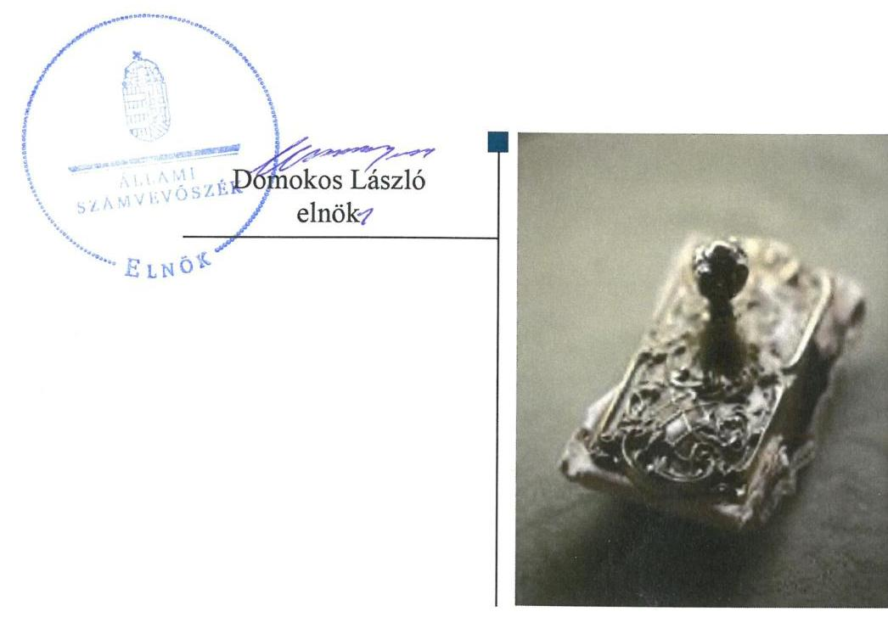
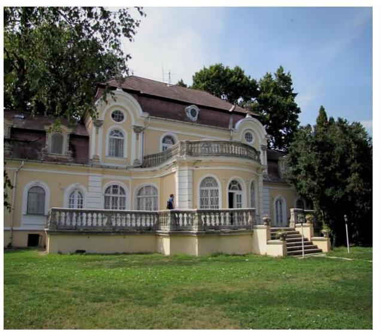

# Jelenetés 

## Központi költségvetési szervek ellenőrzése

Kenderesi Mezőgazdasági Szakgimnázium, Szakközépiskola és Kollégium 2019.

19239
www.asz.hu

---

# Jelenetés 

## Központi költségvetési szervek ellenőrzése

Kenderesi Mezőgazdasági Szakgimnázium, Szakközépiskola és Kollégium
2019. 12. hó 13. nap

---

# AZ ELLENŐRZÉST FELÜGYELTE:

## MAKKAI MÁRIA felügyeleti vezető

## AZ ELLENŐRZÉST VEZETTE ÉS A VÉGREHAJTÁSÁÉRT FELELŐS:

### DÉZSINÉ KIS HAJNALKA ellenőrzésvezető

## A PROGRAM ÖSSZEÁLLÍTÁSÁÉRT FELELŐS:

### TÓTPÁL SZABOLCS osztályvezető

---

**IKTATÓSZÁM:** EL-2325-001/2019

**TÉMASZÁM:** 2450

**ELLENŐRZÉS-AZONOSÍTÓ SZÁM:** V079158

---

Jelentéseink az Országgyűlés számítógépes hálózatán és az Interneta a www.asz.hu címen is olvashatóak.

---

# TARTALOMJEGYZÉK 

■ ÖSSZEGZÉS ..... 5
■ AZ ELLENŐRZÉS CÉLJA ..... 6
■ AZ ELLENŐRZÉS TERÜLETE ..... 7
■ AZ ELLENŐRZÉS HÁTTERE, INDOKOLTSÁGA ..... 8
■ A JELENTÉS LÉNYEGES KÉRDÉSKÖREI ..... 9
■ AZ ELLENŐRZÉS HATÓKÖRE ÉS MÓDSZEREI ..... 10
■ MEGÁLLAPÍTÁSOK ..... 12
■ JAVASLATOK ..... 15
■ FÜGGELÉKEK ..... 19
I. sz. függelék a jelentéshez ..... 19
II. sz. függelék: Észrevételek ..... 20
■ RÖVIDÍTÉSEK JEGYZÉKE ..... 21

---

.

---

# ÖSSZEGZÉS 

A Kenderesi Mezőgazdasági Szakgimnázium, Szakközépiskola és Kollégium belső kontrollrendszere, pénzügyi és vagyongazdálkodása nem volt szabályszerű, nem biztosította a nemzeti vagyonnal való átlátható, elszámoltatható gazdálkodást, a vagyon védelmét. A Kenderesi Mezőgazdasági Szakgimnázium, Szakközépiskola és Kollégium nem volt védett a korrupcióval szemben.

## Az ellenőrzés társadalmi indokoltsága

Magyarország versenyképességének és a magyar gazdaság fejlődésének alapvető feltétele a magyar munkavállalók megfelelő szakmai képzettsége és felkészültsége, amelyben a szakképzési rendszernek döntő szerepe van. A mezőgazdaság vonatkozásában is kiemelten fontos ez, hiszen a magyar mezőgazdaság piaci versenyképességét és eredményességét nagymértékben befolyásolja az agrárszférában dolgozók képzettsége, felkészültsége. A szakképzés legjelentősebb színterei a szakképző iskolák. Az eredményes és célszerű szakképzés alapja és alapvető feltétele a szakképző intézmények közpénzekkel és a közvagyonnal való törvényes, átlátható és a korrupcióval szembeni védelmet biztosító múködése és gazdálkodása. Ezért ezen szervezetekkel szemben is alapvető társadalmi igény, hogy a rájuk bízott közpénzekkel, közvagyonnal szabályosan gazdálkodjanak. Emellett a szakképzésben részt vevő pedagógusok, tanulók és a szülők jogos elvárása, hogy a szakképző iskolák múködése átlátható és elszámoltatható legyen. Mindezen igényekkel összhangban, a közpénzügyek átláthatóságának előmozdítása, a közvagyon védelme érdekében került sor az agrárszakképző iskolák belső kontrollrendszerének és gazdálkodásának ellenőrzésére.

## Főbb megállapítások, következtetések, javaslatok

A Kenderesi Mezőgazdasági Szakgimnázium, Szakközépiskola és Kollégium belső kontrollrendszerének kialakítása és múködtetése nem felelt meg a jogszabályi előírásoknak az integrált kockázatkezelési rendszer és az információs rendszer kialakításának hiánya, valamint a gazdálkodási jogkörgyakorlás területén tapasztalt szabálytalanságok miatt. A belső kontrollrendszer nem biztosította a szabályos közpénzfelhasználást.

Az Intézmény pénzügyi gazdálkodása során a kötelezettségvállalások nyilvántartása nem felelt meg a jogszabályi előírásoknak. Ezáltal a költségvetési források szabályszerű felhasználásának feltételei nem álltak fenn.

Az Intézmény költségvetési beszámolója mérlegtételei leltárral nem voltak alátámasztottak, a beszámoló nem igazolta a vagyon megőrzését.

Az Intézmény nem múködtette a kötelezően előírt és az integritást erősítő kontrollokat.
Az Állami Számvevőszék a jelentésben foglalt megállapítások alapján a Kenderesi Mezőgazdasági Szakgimnázium, Szakközépiskola és Kollégium Igazgatója részére 15 javaslatot fogalmazott meg.

---

# AZ ELLENŐRZÉS CÉLJA 

CÉLJA annak megállapítása volt, hogy a központi költségvetési szervre vonatkozó irányító szervi feladatellátás a jogszabályi előírások betartásával történt-e; a központi költségvetési szerv belső kontrollrendszere biztosította-e az átlátható, szabályszerű, gazdaságos, hatékony és eredményes gazdálkodás feltételeit; kiépítették és erősítették e a korrupciós kockázatok kezelését szolgáló integritás kontrollokat; megteremtették-e a teljesítményellenőrzés feltételeit. Továbbá annak megállapítása, hogy a szervezet gazdálkodása során elszámoltatható és megfelel-e annak az Alaptörvényben ${ }^{1}$ meghatározott alapvetésnek, hogy Magyarország a kiegyensúlyozott, átlátható és fenntartható költségvetési gazdálkodás elvét érvényesíti. Érvé-nyesül-e a nemzeti vagyon kezelésének és védelmének célja, azaz a szervezet vagyona a közérdeket szolgálja, a közös szükségletek kielégítése és a természeti erőforrások megóvása, valamint a jövő nemzedékek szükségleteinek figyelembevétele mellett.

---

# **AZ ELLENŐRZÉS TERÜLETE**

## **Kenderesi Mezőgazdasági Szakgimnázium, Szakközépiskola és Kollégium**

Az 1950-től működő Kenderesi Mezőgazdasági Szakgimnázium, Szakközépiskola és Kollégium Jász-Nagykun-Szolnok megyében található köznevelési intézmény.

Az Intézmény2 tevékenysége szakgimnáziumi, szakközépiskolai nevelés-oktatás, valamint felnőttoktatás.

A képzések vendéglátóipari, mezőgazdasági és kertészeti ágazatban folynak.

Az Intézmény alapítója és irányító szerve a Földművelésügyi Minisztérium, 2018-tól Agrárminisztérium.

Az Igazgató3 személye az ellenőrzött időszakban nem változott.

Az Intézmény gazdasági szervezeti feladatait a SZS KK4 látta el az ellenőrzött időszakban együttműködési megállapodás alapján.

Az Intézmény a 2017. évben 597,5 millió Ft költségvetési bevétellel rendelkezett, költségvetési kiadása 430,1 millió Ft volt, és 810,1 millió Ft vagyonnal gazdálkodott. Az átlagos statisztikai állományi létszám 66 fő volt.

---

# AZ ELLENŐRZÉS HÁTTERE, INDOKOLTSÁGA 

Az ÁSZ ${ }^{5}$ ellenőrzi a költségvetési szervek gazdálkodását, működését, hogy megállapításaival támogassa az ellenőrzött szervezetek szabályszerű gazdálkodását, javaslataival elősegítse az Alaptörvényben megfogalmazott alapvetések érvényesülését a mindennapi életben a szervezetek szintjén. Az egyes ellenőrzések megállapításaival és egy időszak ellenőrzési eredményeinek elemzésével az ÁSZ ráirányíthatja a jogalkotók figyelmét a központi alrendszerben vagy annak egy ágazatában esetlegesen felmerülő pénzügyi, szabályozási feszültségekre.

Az elvégzett ellenőrzések során az ÁSZ „jó gyakorlatokat" is azonosíthat, melyeket tanácsadó funkciója keretében szélesebb körben is megismertethet az érintettekkel, ezáltal is hozzájárulva a költségvetési rendszer szabályozott, átlátható, kiegyensúlyozott és fenntartható működéséhez.

Az ellenőrzés a szervezet kockázatértékelése alapján, az egyedi és lényeges jellemzők figyelembevételével, az ellenőrzésre kiválasztott modullal történik.

Az integritás- és belső kontroll modul a központi költségvetési szerv múködésének irányítottságát, korrupció elleni védettségét értékeli.

A belső kontrollrendszer kialakítása és működtetése nélkül nem valósítható meg a közpénzek, a közvagyon átlátható, szabályos, gazdaságos, hatékony és eredményes felhasználása. A belső kontrollrendszer azt a célt szolgálja, hogy a költségvetési szervek múködésük és gazdálkodásuk során a tevékenységeket szabályszerűen hajtsák végre, teljesítsék elszámolási kötelezettségeiket és megvédjék az erőforrásokat a veszteségektől, a károktól és a nem rendeltetésszerű használattól.

Az államháztartás központi alrendszerébe tartozó szervezet vagyona a nemzeti vagyon része, és az Alaptörvény is rögzíti, hogy a vagyonnal való gazdálkodás célja a közérdek szolgálata.

---

# A JELENTÉS LÉNYEGES KÉRDÉSKÖREI 

1. Az irányító szerv ellenőrzött költségvetési szervre vonatkozó feladatellátása szabályszerű volt-e?
2. A belső kontrollrendszer kialakítása és müködtetése szabályszerűen történt-e?
3. A költségvetési szerv pénzügyi gazdálkodása szabályszerű volt-e?
4. A költségvetési szerv vagyongazdálkodása szabályszerű volt-e?

---

# AZ ELLENŐRZÉS HATÓKÖRE ÉS MÓDSZEREI 

## Az ellenőrzés típusa

Megfelelőségi ellenőrzés.

## Az ellenőrzött időszak

A belső kontroll rendszer és a vagyongazdálkodás tekintetében a 2016. és a 2017. év.

Az irányító szervi feladatellátás és a pénzügyi gazdálkodás tekintetében a 2016. év.

## Az ellenőrzés tárgya

Az ellenőrzött szervezetre vonatkozó irányító szervi feladatok ellátása. Az intézmény belső kontroll rendszerének kialakítása és múködtetése. Az intézmény pénzügyi és vagyongazdálkodása. Az intézménynél az integritáskontrollok kiépítettsége, az integritás szemlélet érvényesülése, a teljesítményellenőrzés feltételei.

## Az ellenőrzött szervezet

Kenderesi Mezőgazdasági Szakgimnázium, Szakközépiskola és Kollégium és irányítószerve az Agrárminisztérium, valamint a gazdasági szervezeti feladatokat ellátó Szentannai Sámuel Középiskola és Kollégium.

## Az ellenőrzés jogalapja

Az ellenőrzés jogszabályi alapját az ÁSZ tv . 1. § (3) bekezdés, 5. § (2)-(3) és (6) bekezdései, (4) bekezdés a), pontja, valamint Áht. 61. § (2) bekezdésének előírásai képezik.

## Az ellenőrzés módszerei

Az ÁSZ az ellenőrzést az ellenőrzési program szempontjai, az ellenőrzött időszakban hatályos jogszabályok, az ellenőrzés szakmai szabályai, a jelen ellenőrzésre irányadó ÁSZ módszertanok figyelembevételével hajtja végre.

Az ellenőrzési kérdések megválaszolásához szükséges bizonyítékok megszerzése az ellenőrzött által rendelkezésre bocsátott dokumentu-

---

mokra, adatokra alapozva megfigyelés, szemle (szemrevételezés), mintavételezés, valamint elemző eljárás útján történik. Az ellenőrzési bizonyítékként felhasználható adatforrások közé tartoznak az ellenőrzési program részletes szempontjainál felsorolt adatforrások, valamint minden egyéb az ellenőrzés folyamán feltárt, az ellenőrzés szempontjából információt tartalmazó - dokumentum.

Az ellenőrzés lefolytatásához az ellenőrzött szervezet tanúsítványok kitöltésével, valamint az ÁSZ által kért dokumentumok megküldésével szolgáltat adatokat, amelyek valódiságát és teljes körűségét az ellenőrzött szervezet vezetője által tett teljességi és hitelességi nyilatkozat igazolja. A rendelkezésre bocsátott adatok, információk kontrollja az ellenőrzés keretében történt.

A központi költségvetési szerv belső kontrollrendszere egyes pilléreinek kialakítására és múködtetésére vonatkozó értékelés:
$\longrightarrow$ „szabályszerű", amennyiben az értékelt területen az elért „igen" válaszok százalékban kifejezett, egész számra kerekített aránya legalább $85 \%$,
$\longrightarrow$ „nem szabályszerű", ha nem éri el a $85 \%$-ot.
A kontrollrendszer egésze esetében a „szabályszerű" értékelésnek a százalékos értéken felül további feltétele, hogy egyik kontrollterület sem kaphat „nem szabályszerű" értékelést.

A kiadások és a bevételek ellenőrzésére a 2016-2017. év vonatkozásában került sor. A kiadások (külső személyi juttatások, felhalmozási kiadások, dologi kiadások) és bevételek (értékesítésből és bérbeadásból származó bevételek) esetében az ellenőrzés azokra a legnagyobb értékű tételekre - a lényeges sokaságra - terjedt ki, melyek összértéke eléri a teljes sokaság összértékének 50\%-át.

A bevételek esetében a lényeges sokaságot tételesen, a kiadások elszámolásának szabályszerűségét a lényeges sokaságból véletlen mintavételi eljárással kiválasztott tételek alapján ellenőriztük.

A 2017. évi beruházások, felújítások végrehajtásának, valamint év végi értékelésének szabályszerűségét teljes körűen, a feladatellátást szolgáló állami vagyontárgyak használatának szabályszerűségét a teljes sokaságból véletlen mintavétellel kiválasztott tételek alapján ellenőriztük.

A mintavétellel ellenőrzött területek esetében minden egyes tétel vonatkozásában a használat, elszámolás és értékelés szabályszerűségére vonatkozó kérdéseket tettünk fel. Szabályszerűnek értékeltünk egy ellenőrzött területet, amennyiben 95\%-os bizonyossággal az ellenőrzött sokaságban az átlagos hibaarány legfeljebb 10\%, nem szabályszerűnek, amennyiben 10\%-nál magasabb arányt képviselt.

Az ellenőrzés ideje alatt az ellenőrzött szervezettel történő kapcsolattartást az ÁSZ SZMSZ ${ }^{\circledR}$-ének vonatkozó előírásai alapján biztosítottuk.

---

# 1. Az irányító szerv ellenőrzött költségvetési szervre vonatkozó feladatellátása szabályszerű volt-e? 

Összegző megállapítás Az Irányító szerv ${ }^{7}$ Intézményre vonatkozó feladatellátása a 2016. évben szabályszerű volt.

AZ IRÁNYÍTÓ SZERV ALAPÍTÓI jogosultságainak gyakorlása a 2016. évben a jogszabályi előírásoknak megfelelően történt, mert az Áht. ${ }^{8}$-ban foglalt jogkörében eljárva kiadmányozta az Intézmény alapító okiratának módosítását a szakképzés rendszerét érintő szabályozási környezet változása miatt. Az alapító okirat tartalma megfelelt az Ávr. ${ }^{9}$ előírásainak.

AZ EGYÉB IRÁNYÍTÁSI, FELÜGYELETI ÉS ELLENÖRZÉSI JOGOSULTSÁGAIT az Irányító szerv a 2016. évben szabályszerűen gyakorolta, mert az Ávr.-nek megfelelően kiadta a kötelező tervezési követelményeket és jóváhagyta az Intézmény elemi költségvetését, az Áhsz.-ben ${ }^{10}$ foglaltaknak megfelelően jóváhagyta az Intézmény költségvetési beszámolóját és az Áht.-ben foglalt irányító szervi hatáskörében eljárva beszámoltatta az Intézményt az éves szakmai feladatellátásról. Az Irányító szerv kijelölte a pénzügyi gazdasági feladatok ellátását végző költségvetési szervet és a feladatok ellátásáról szóló megállapodást jóváhagyta. Az együttműködési megállapodás 2015. szeptember 1-től lépett hatályba.

MUNKÁLTATÓI JOGOSULTSÁGAIT az Irányító szerv a 2016. évben szabályszerűen gyakorolta.

## 2. A belső kontrollrendszer kialakítása és múködtetése szabályszerűen történt-e?

Összegző megállapítás

A 2016-2017. években a belső kontroll rendszer kialakítása és múködtetése nem volt szabályszerű.

A BELSŐ KONTROLLRENDSZER kialakítása ás működtetése nem volt szabályszerű a 2016. évben, mert az Intézmény a Vnytv. ${ }^{11} 11$. § (6) bekezdése ellenére nem készítette el a vagyonnyilatkozat átadására, nyilvántartására, a vagyonnyilatkozatban foglalt személyes adatok védelmére vonatkozó szabályzatát.

A KONTROLLKÖRNYEZET KIALAKÍTÁSA nem volt szabályszerű a 2017. évben, mert az Intézmény a Bkr. ${ }^{12}$ 6. § (3) bekezdésében foglaltak ellenére nem készítette el ellenőrzési nyomvonalát, a Bkr. 6.§ (1)

---

bekezdés c) pontja ellenére nem határozta meg az etikai elvárásokat a szervezet minden szintjén, valamint a Bkr. 6. § (4) bekezdésében foglaltak ellenére nem szabályozta a szervezeti integritást sértő események kezelésének eljárásrendjét. Az Intézmény a 2017. évben rendelkezett szervezeti és múködési szabályzattal, azonban a szabályzatában a Vnytv. 4. § a) pontjában foglaltak ellenére nem tüntette fel a vagyonnyilatkozat-tételi kötelezettséggel járó munkaköröket, és a Vnytv. 11. § (6) bekezdése ellenére nem készítette el a vagyonnyilatkozat átadására, nyilvántartására, a vagyonnyilatkozatban foglalt személyes adatok védelmére vonatkozó szabályzatát.

INTEGRÁLT KOCKÁZATKEZELÉSI RENDSZERT a 2017. évben az Intézmény a Bkr. 3. § b) pontjában foglaltak ellenére nem alakított ki.

A KONTROLLTEVÉKENYSÉGEK gyakorlása a 2016-2017. években nem volt szabályszerű, mert az Intézmény az Áht. 37. § (1) bekezdésében foglaltak ellenére a kiadási előirányzatok felhasználását nem támasztotta alá írásbeli kötelezettségvállalással, és az Ávr. 57. § (1) bekezdésében foglaltak ellenére nem igazolta a kiadások teljesítésének jogosságát, összegszerűségét.

# AZ INFORMÁCIÓS ÉS KOMMUNIKÁCIÓS RENDSZER kialakítása és múködtetése nem volt szabályszerű a 2017. évben, mert az Intézmény az Info tv. ${ }^{13}$ 24.§ (3) bekezdésében foglaltak ellenére nem rendelkezett adatvédelmi és adatbiztonsági szabályzattal, a Ltv. ${ }^{14} 10$. § (1) bekezdése a) pontjában foglaltak ellenére nem készített iratkezelési szabályzatot, az Info tv. 30. § (6) bekezdésében előírtak ellenére nem szabályozta a közérdekú adatok megismerésére irányuló igények teljesítésének rendjét, valamint az Info tv. 35. § (3) bekezdésében előírtak ellenére nem szabályozta a kötelezően közzéteendő adatok nyilvánosságra hozatalának rendjét.

A NYOMON KÖVETÉSI RENDSZER múködtetése nem volt szabályszerű a 2017. évben, mert a belső ellenőrzési vezető a Bkr. 47. § (1) bekezdésében előírtak ellenére nem vezetett éves bontásban nyilvántartást, amellyel a belső ellenőrzési jelentésekben tett megállapításokat, javaslatokat, a vonatkozó intézkedési terveket és azok végrehajtását nyomon követte, valamint az Intézmény Igazgatója a Bkr. 10. §-ban foglaltak ellenére nem alakította ki az operatív tevékenységek keretében megvalósuló folyamatos és eseti nyomon követést.

Az Intézmény Igazgatója a 2016-2017. években eleget tett a Bkr. 11. § (1) bekezdésében előírt nyilatkozattételi kötelezettségének a belső kontrollrendszer értékelésére vonatkozóan. A nyilatkozat tartalmát az ellenőrzés nem igazolta.

## AZ INTEGRITÁS KONTROLLOK KIÉPÍTÉSE ÉS

MŰKÖDTETÉSE nem volt megfelelő a 2016-2017. években. Az Intézmény nem múködtette az integritást erősítő kötelezően és a nem kötelezően előírt kontrollokat. Nem végzett integritás kockázatelemzést.

---

# A TELJESÍTMÉNY MÉRÉSÉRE ALKALMAS KÖVETELMÉNYEKET az Intézmény nem alakította ki a 2017. évben. Az Intézmény nem képzett a szervezeti célok eléréséhez szükséges feladatok és folyamatok mérésére szolgáló indikátorokat, mérőszámokat, feladat és teljesítménymutatókat, így nem biztosították a teljesítménymérés feltételeit. 

## 3. A költségvetési szerv pénzügyi gazdálkodása szabályszerű volt-e?

Összegző megállapítás Az Intézmény pénzügyi gazdálkodása a 2016. évben nem volt szabályszerű.

A BEVÉTELEK ELSZÁMOLÁSA nem volt szabályszerű a 2016. évben, mert az Intézmény az önköltségszámítási szabályzata II/4. pontjában foglaltak ellenére nem támasztotta alá az ingatlan bérbeadási szolgáltatást önköltségszámítással.

A KÖTELEZETTSÉGVÁLLALÁSOK NYILVÁNTARTÁSA a 2016. évben nem volt szabályszerű, mert az Intézmény az Áhsz. 39.§ (3) bekezdésében foglaltak ellenére nem gondoskodott a kötelezettségvállalások jogszabálynak megfelelő nyilvántartásáról, a nyilvántartás az Áhsz. 14. melléklet II. 4. e) pontja ellenére nem tartalmazta a pénzügyi teljesítési határidőket.

## 4. A költségvetési szerv vagyongazdálkodása szabályszerű volt-e?

Összegző megállapítás Az Intézmény vagyongazdálkodása nem volt szabályszerű a 2016-2017. években.

A VAGYONTÁRGYAK KIMUTATÁSA nem volt szabályszerű a 2016-2017. években, mert az Intézmény a Vtvr. ${ }^{15}$ 7. § (2) bekezdésében foglaltak ellenére nem gondoskodott a vagyonkezelésében lévő ingatlanok vagyonkezelői jogának ingatlan-nyilvántartásba történő bejegyeztetéséről, valamint a Számv.tv. ${ }^{16}$ 69. § (1), az Áhsz. 5.§ (1) és az Áhsz. 22. § (1)-(2) bekezdésében előírtak ellenére, a leltár dokumentumainak hiányában nem támasztotta alá beszámolójának mérlegtételeit leltárral.

---

# JAVASLATOK 

Az ÁSZ tv. 33. § (1) bekezdésében foglaltak értelmében az ellenőrzött szervezet vezetője köteles a jelentésben foglalt megállapításokhoz kapcsolódó intézkedési tervet összeállítani és azt a jelentés kézhezvételétől számított 30 napon belül az ÁSZ részére megküldeni. Amennyiben az ellenőrzött szervezet vezetője nem küldi meg határidőben az intézkedési tervet, vagy továbbra sem elfogadható intézkedési tervet küld, az Állami Számvevőszék elnöke az ÁSZ tv. 33. § (3) bekezdése a) és b) pontjaiban foglaltakat érvényesítheti.

## a Kenderesi Mezőgazdasági Szakgimnázium, Szakközépiskola és Kollégium igazgatójának

1. Intézkedjen a Bkr. elöírásainak megfelelően az ellenőrzési nyomvonal elkészitéséről és rendszeres aktualizálásáról.
(2. sz. megállapítás 2. bekezdése 1. mondat 2. mondatrésze alapján)
2. Intézkedjen olyan kontrollkörnyezet kialakításáról, amelyben meghatározottak, ismertek és elfogadottak az etikai elvárások a szervezet minden szintjén.
(2. sz. megállapítás 2. bekezdése 1. mondat 3. mondatrésze alapján)
3. Intézkedjen a szervezeti integritást sértő események kezelése eljárásrendjének szabályozásáról.
(2. sz. megállapítás 2. bekezdése 1. mondat 4. mondatrésze alapján)
4. Intézkedjen a vagyonnyilatkozat átadására, nyilvántartására, a vagyonnyilatkozatban foglalt személyes adatok védelmére vonatkozó további szabályok szabályzatban történő megállapításáról, valamint a vagyonnyilatkozat-tételi kötelezettség szervezeti és müködési szabályzatban való feltüntetéséről a Vnytv. elöírásainak megfelelően.
(2. sz. megállapítás 2. bekezdése 2. mondata alapján)
5. Intézkedjen a Bkr. elöírásainak megfelelően integrált kockázatkezelési rendszer kialakításáról és müködtetéséről.
(2. sz. megállapítás 3. bekezdése alapján)

---

6. Intézkedjen a kiadási előirányzatok felhasználása során a jogszabályi előírásoknak megfelelő kötelezettségvállalásról és teljesítésigazolásról.
(2. sz. megállapítás 4. bekezdése alapján)
7. Intézkedjen az Info. tv. előírásainak megfelelően az adatvédelmi és adatbiztonsági szabályzat megalkotásáról.
(2. sz. megállapítás 5. bekezdése 1. mondat 2. mondatrésze alapján)
8. Intézkedjen az Ltv. előírásainak megfelelően az iratkezelési szabályzat elkészítéséről.
(2. sz. megállapítás 5. bekezdése 1. mondat 3. mondatrésze alapján)
9. Intézkedjen az Info. tv. előírásainak megfelelően a közérdekü adatok megismerésére irányuló igények teljesítésének rendjét rögzitő szabályzat elkészítéséről.
(2. sz. megállapítás 5. bekezdése 1. mondat 4. mondatrésze alapján)
10. Intézkedjen az Info tv. előírásainak megfelelően a kötelezően közzéteendő adatok nyilvánosságra hozatalának rendje szabályozásáról.
(2. sz. megállapítás 5. bekezdése 1. mondat 5. mondatrésze alapján)
11. Intézkedjen az Bkr. előírásainak megfelelően a belső ellenőrzési jelentésekben tett megállapítások, javaslatok, vonatkozó intézkedési tervek és azok végrehajtása nyomon követésére nyilvántartás vezetéséről.
(2. sz. megállapítás 6. bekezdése alapján)
12. Intézkedjen az ingatlan bérbeadási szolgáltatások szabályszerű önköltségszámítással történő alátámasztásáról.
(3. sz. megállapítás 1. bekezdése alapján)
13. Intézkedjen a kötelezettségvállalások jogszabályi előírásoknak megfelelő nyilvántartásáról.
(3. sz. megállapítás 2. bekezdése alapján)

---

14. Intézkedjen a vagyonkezelésben lévő ingatlanok vagyonkezelői jogának ingatlan-nyilvántartásba történő bejegyeztetéséről.
(4. sz. megállapítás 1. bekezdése 1. mondat 2. mondatrésze alapján)
15. Intézkedjen a jogszabályi előírásoknak megfelelően a mérleg tételeit alátámasztó leltár összeállításáról, amely tételesen, ellenőrizhető módon tartalmazza a mérleg fordulónapján meglévő eszközöket és forrásokat mennyiségben és értékben.
(4. sz. megállapítás 1. bekezdése 1. mondat 3. mondatrésze alapján)

---

.

---

# FÜGGELÉKEK 

- I. SZ. FÜGGELÉK A JELENTÉSHEZ

Az Állami Számvevőszék az ellenőrzések során feltárt tényekhez kapcsolódó további körülmények tisztázására eszközrendszerrel nem rendelkezik. Amennyiben az ellenőrzésen túlmutatóan indokoltnak látszik az ellenőrzés során feltárt körülmények további vizsgálata, az Állami Számvevőszék törvényi felhatalmazás alapján az ellenőrzés által feltárt körülményeket továbbítja a hatáskörrel rendelkező szervnek a szükséges intézkedések megtétele, eljárások lefolytatása érdekében.

1. 

Az Intézmény a 2016-2017. éves költségvetési beszámoló mérlegtételeinek alátámasztásához nem készített leltárt. Ezzel megsértette a Számv. tv. 69. § (1), valamint az Áhsz. 5.§ (1) és az Áhsz. 22. § (1)-(2) bekezdésében foglaltakat.
A leltárral alá nem támasztott mérlegfőösszeg a 2016. évben 824,3 millió Ft, a 2017. évben 810,1 millió Ft volt.

Leltár hiányában nem igazolt, hogy a beszámolóban szereplő tételek a valóságban is megtalálhatók.
2.

Az Intézmény az Áht. 37. § (1) bekezdésében foglaltak ellenére a 2016. évben 20 db összesen 16,9 millió Ft értékü, a 2017. évben 6 db összesen 2,2 millió Ft értékü kiadási előirányzat felhasználását nem támasztott alá írásbeli kötelezettségvállalással.
Az Intézmény az Ávr. 57. § (1) bekezdésében foglaltak ellenére nem igazolta a 2016. évben 3 db összesen 2,2 millió Ft értékü, a 2017. évben 3 db összesen 0,5 millió Ft értékü kiadás teljesítésének jogosságát, összegszerűségét.
A kötelezettségvállalások és teljesítés igazolások hiánya miatt nem igazolt, hogy a kiadások az ellenőrzött szervezet feladatellátásának körében keletkeztek és a kifizetések valós teljesítéshez kapcsolódtak.
A több évet érintő leltárhiány és a gazdálkodási jogkörök gyakorlására vonatkozó előírások megsértése felvetheti a vagyoni hátrány okozás gyanúját.

Az esetek konkrét körülményeinek felderítésére az Ügyészség rendelkezik hatáskörrel.

Az ellenőrzés által feltárt, a gazdálkodási jogkörre vonatkozó szabályok megsértésével öszszefüggésbe hozható további szabálytalanság, hogy az Intézmény a 2016-2017. években a Vnytv. 11. § (6) bekezdése ellenére nem készítette el a vagyonnyilatkozat átadására, nyilvántartására, a vagyonnyilatkozatban foglalt személyes adatok védelmére vonatkozó szabályzatát, valamint a 2017. évben a Vnytv. 4. § a) pontjában előirtak ellenére nem tüntette fel a vagyonnyilatkozat-tételi kötelezettséggel járó munkaköröket az SZMSZ-ben.

---

A jelentéstervezetet a Számvevőszék 15 napos észrevételezésre megküldte az ellenőrzött szervezetek vezetőinek az ÁSZ tv. 29. §̊ (1) bekezdése előirásának megfelelően.

A Kenderesi Mezőgazdasági Szakgimnázium, Szakközépiskola és Kollégium igazgatója, a Szentannai Sámuel Középiskola és Kollégium igazgatója és az agrárminiszter észrevételezési jogával nem élt.

[^0]
[^0]:    * 29. § (1) Az Állami Számvevőszék az ellenőrzési megállapításait megküldi az ellenőrzött szervezet vezetőjének vagy az általa megbízott személynek, és annak, akinek személyes felelősségét állapította meg.
    (2) Az ellenőrzött szervezet vezetője és a felelősként megjelölt személy az ellenőrzés megállapításaira tizenöt napon belül írásban észrevételt tehet.
    (3) Az Állami Számvevőszék az észrevételre a beérkezésétől számított harminc napon belül írásban válaszol. A figyelembe nem vett észrevételeket köteles a jelentésben feltüntetni, és megindokolni, hogy azokat miért nem fogadta el.

---

# RÖVIDÍTÉSEK JEGYZÉKE 

${ }^{1}$ Alaptörvény
${ }^{2}$ Intézmény
${ }^{3}$ Igazgató
${ }^{4}$ SZS KK
${ }^{5}$ ÁSZ
${ }^{6}$ ÁSZ SZMSZ
${ }^{7}$ Irányító szerv
${ }^{8}$ Áht.
${ }^{9}$ Ávr.
${ }^{10}$ Áhsz.
${ }^{11}$ Vnytv.
${ }^{12}$ Bkr.
${ }^{13}$ Info.tv.
${ }^{14}$ Ltv.
${ }^{15}$ Vtvr.
${ }^{16}$ Számv. tv.

Magyarország Alaptörvénye (2011. április 25.)
Kenderesi Mezőgazdasági Szakgimnázium, Szakközépiskola és Kollégium
Kenderesi Mezőgazdasági Szakgimnázium, Szakközépiskola és Kollégium Igazgatója
Szentannai Sámuel Középiskola és Kollégium
Állami Számvevőszék
Az Állami Számvevőszék elnökének 2/2018. (XII.28.) utasítása az Állami Számvevőszék Szervezeti és Múködési Szabályzatáról
Földművelésügyi Minisztérium, jelenleg Agrárminisztérium
az államháztartásról szóló 2011. évi CXCV. törvény
az államháztartási törvény végrehajtásáról szóló 368/2011 (XII.31.) Korm. rendelet
az államháztartás számviteléről szóló 4/2013. (I. 11.) Korm. rendelet
2007. évi CLII. törvény - egyes vagyonnyilatkozat-tételi kötelezettségekről
a költségvetési szervek belső kontrollrendszeréről és belső ellenőrzéséről szóló 370/2011. (XII.31.) Korm. rendelet
az információs önrendelkezési jogról és az információszabadságról szóló 2011.évi CXII. törvény
a közokiratokról, a közlevéltárakról és a magánlevéltári anyag védelméről szóló 1995. évi LXVI. törvény
254/2007. (X. 4.) Korm. rendelet az állami vagyonnal való gazdálkodásról a számvitelről szóló 2000.évi C. törvény

---

# ÁLLAMI SZÁMVEVŐSZÉK 

1052 Budapest, Apáczai Csere János utca 10.
Levélcím: 1364 Budapest 4. Pf. 54
Telefon: +36 14849100 Telefax: +36 14849200
www.asz.hu