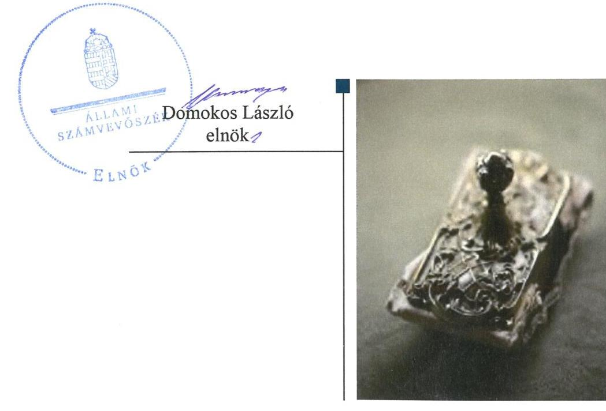

# Jelentés 

## Központi költségvetési szervek ellenőrzése

Kiss Ferenc Erdészeti Szakgimnázium 2019.

---

# Jelențtés 

## Központi költségvetési szervek ellenőrzése

Kiss Ferenc Erdészeti Szakgimnázium 2019. 12. hó 19. nap

---

# AZ ELLENŐRZÉST FELÜGYELTE:

## MAKKAI MÁRIA felügyeleti vezető

## AZ ELLENŐRZÉST VEZETTE ÉS A VÉGREHAJTÁSÁÉRT FELELŐS:

### KISS ISTVÁN GYÖRGY ellenőrzésvezető

### DR. TÓTH LILI ellenőrzésvezetőként eljáró elemző számvevő

## A PROGRAM ÖSSZEÁLLÍTÁSÁÉRT FELELŐS:

### TÓTPÁL SZABOLCS osztályvezető

IKTATÓSZÁM: EL-2324-001/2019.

|  Jelentéseink az Országgyűlés számítógépes hálózatán és az Interneta a www.asz.hu címen is olvashatóak. | TÉMASZÁM: 2450  |
| --- | --- |
|   | ELLENŐRZÉS-AZONOSÍTÓ SZÁM: V079162  |

---

# TARTALOMJEGYZÉK 

■ ÖSSZEGZÉS ..... 5
■ AZ ELLENŐRZÉS CÉLJA ..... 6
■ AZ ELLENŐRZÉS TERÜLETE ..... 7
■ AZ ELLENŐRZÉS HÁTTERE, INDOKOLTSÁGA ..... 8
■ A JELENTÉS LÉNYEGES KÉRDÉSKÖREI ..... 9
■ AZ ELLENŐRZÉS HATÓKÖRE ÉS MÓDSZEREI ..... 10
■ MEGÁLLAPÍTÁSOK ..... 12
■ JAVASLATOK ..... 15
■ MELLÉKLETEK ..... 17
I. sz. melléklet: Értelmező szótár ..... 17
■ FÜGGELÉK: ÉSZREVÉTELEK ..... 19
■ RÖVIDÍTÉSEK JEGYZÉKE ..... 21

---

.

---

# ÖSSZEGZÉS 

A Kiss Ferenc Erdészeti Szakgimnáziumnál nem volt biztositott a nemzeti vagyonnal való átlátható, elszámoltatható, felelős gazdálkodás, a vagyon védelme. A Kiss Ferenc Erdészeti Szakgimnázium nem volt védett a korrupcióval szemben.

## Az ellenőrzés társadalmi indokoltsága

Magyarország versenyképességének és a magyar gazdaság fejlődésének alapvető feltétele a magyar munkavállalók megfelelő szakmai képzettsége és felkészültsége, amelyben a szakképzési rendszernek döntő szerepe van. A mezőgazdaság vonatkozásában is kiemelten fontos ez, hiszen a magyar mezőgazdaság piaci versenyképességét és eredményességét nagymértékben befolyásolja az agrárszférában dolgozók képzettsége, felkészültsége. A szakképzés legjelentősebb színterei a szakképző iskolák. Az eredményes és célszerű szakképzés alapja és alapvető feltétele a szakképző intézmények közpénzekkel és a közvagyonnal való törvényes, átlátható és a korrupcióval szembeni védelmet biztosító működése és gazdálkodása. Ezért ezen szervezetekkel szemben is alapvető társadalmi igény, hogy a rájuk bízott közpénzekkel, közvagyonnal szabályosan gazdálkodjanak. Emellett a szakképzésben részt vevő pedagógusok, tanulók és a szülők jogos elvárása, hogy a szakképző iskolák működése átlátható és elszámoltatható legyen. Mindezen igényekkel összhangban, a közpénzügyek átláthatóságának előmozdítása, a közvagyon védelme érdekében került sor az agrárszakképző iskolák belső kontrollrendszerének és gazdálkodásának ellenőrzésére.

## Főbb megállapítások, következtetések, javaslatok

A Kiss Ferenc Erdészeti Szakgimnázium nem szabályszerű kontrollkörnyezetben működött a 2016-2017. években. Kockázatkezelési rendszert, illetve integrált kockázatkezelési rendszert, információs és kommunikációs rendszert nem alakított ki, monitoring rendszert nem működtetett, ezért belső kontrollrendszerének kialakítása és működtetése nem volt szabályszerű. Nem biztosította a szabályos közpénzfelhasználást.

A Kiss Ferenc Erdészeti Szakgimnázium pénzügyi gazdálkodása nem volt szabályszerű, mivel a kötelezettségvállalásokat nem szabályszerűen tartotta nyilván. Nem volt igazolt ezáltal, hogy a kiadási előirányzatok terhére történő kifizetések a közfeladat ellátása érdekében történtek.

A Kiss Ferenc Erdészeti Szakgimnázium vagyongazdálkodása nem volt szabályszerű, mivel a költségvetési beszámoló mérlegtételei leltárral nem voltak alátámasztottak. A beszámoló nem igazolta a vagyon megőrzését.

A Kiss Ferenc Erdészeti Szakgimnázium nem gondoskodott az integritáselvű működést támogató, kötelezően előírt kontrollok kiépítéséről.

Az Állami Számvevőszék a jelentésben foglalt megállapítások alapján a Kiss Ferenc Erdészeti Szakgimnázium igazgatója részére nyolc javaslatot fogalmazott meg.

---

# AZ ELLENŐRZÉS CÉLJA 

AZ ELLENŐRZÉS CÉLJA annak megállapítása volt, hogy a központi költségvetési szervre vonatkozó irányító szervi feladatellátás a jogszabályi előírások betartásával történt-e; a központi költségvetési szerv belső kontrollrendszere biztosította-e az átlátható, szabályszerű, gazdaságos, hatékony és eredményes gazdálkodás feltételeit; kiépítették és erősítették-e a korrupciós kockázatok kezelését szolgáló integritás kontrollokat; megteremtették-e a teljesítményellenőrzés feltételeit. Továbbá annak megállapítása, hogy a szervezet gazdálkodása során elszámoltatható és megfelel-e annak az Alaptörvényben meghatározott alapvetésnek, hogy Magyarország a kiegyensúlyozott, átlátható és fenntartható költségvetési gazdálkodás elvét érvényesíti. Érvényesül-e a nemzeti vagyon kezelésének és védelmének célja, azaz a szervezet vagyona a közérdeket szolgálja, a közös szükségletek kielégítése és a természeti erőforrások megóvása, valamint a jövő nemzedékek szükségleteinek figyelembevétele mellett.

---

# AZ ELLENŐRZÉS TERÜLETE 

## Kiss Ferenc Erdészeti Szakgimnázium

A szegedi székhelyű Kiss Ferenc Erdészeti Szakgimnázium felett az alapítói, irányító szervi és fenntartói jogokat az ellenőrzött időszakban a Földművelésügyi Minisztérium gyakorolta. A fenntartó jogelőd szerve a Klebersberg Intézményfenntartó Központ, illetve Szeged Megyei Jogú Város Önkormányzata volt.

Az Intézmény ${ }^{1}$ alaptevékenysége szakgimnáziumi nevelésoktatás, szakközépiskolai nevelés-oktatás, több tanulóval együtt nevelhető, oktatható olyan sajátos nevelési igényű tanuló iskolai nevelése-oktatása, aki egyéb pszichés fejlődési zavarral küzd, továbbá a beilleszkedési, tanulási magatartási nehézségekkel küzdő tanulók iskolai nevelése, oktatása. Az Intézménybe felvehető maximális tanulólétszám 500 fő.

Az Intézmény gazdasági szervezettel nem rendelkezett, gazdasági feladatait a Bedő Albert Erdészeti Szakgimnázium, Szakközépiskola és Kollégium látta el együttműködési megállapodás alapján. Az Intézmény az ellenőrzött időszakban vagyonkezelt önkormányzati vagyonnal rendelkezett. Könyvvizsgálatra nem volt kötelezett. Az Intézmény vezetőjének személye kétszer változott az ellenőrzött időszakban.

---

# AZ ELLENŐRZÉS HÁTTERE, INDOKOLTSÁGA 

Az ÁSZ ${ }^{2}$ ellenőrzi a költségvetési szervek gazdálkodását, működését, hogy megállapításaival támogassa az ellenőrzött szervezetek szabályszerű gazdálkodását, javaslataival elősegítse az Alaptörvényben megfogalmazott alapvetések érvényesülését a mindennapi életben a szervezetek szintjén. Az egyes ellenőrzések megállapításaival és egy időszak ellenőrzési eredményeinek elemzésével az ÁSZ ráirányíthatja a jogalkotók figyelmét a központi alrendszerben vagy annak egy ágazatában esetlegesen felmerülő pénzügyi, szabályozási feszültségekre.

Az elvégzett ellenőrzések során az ÁSZ „jó gyakorlatokat" is azonosíthat, melyeket tanácsadó funkciója keretében szélesebb körben is megismertethet az érintettekkel, ezáltal is hozzájárulva a költségvetési rendszer szabályozott, átlátható, kiegyensúlyozott és fenntartható működéséhez.

Az ellenőrzés a szervezet kockázatértékelése alapján, az egyedi és lényeges jellemzők figyelembevételével, az ellenőrzésre kiválasztott modullal történik.

Az integritás- és belső kontroll modul a központi költségvetési szerv működésének irányítottságát, korrupció elleni védettségét értékeli.

A belső kontrollrendszer kialakítása és működtetése nélkül nem valósítható meg a közpénzek, a közvagyon átlátható, szabályos, gazdaságos, hatékony és eredményes felhasználása. A belső kontrollrendszer azt a célt szolgálja, hogy a költségvetési szervek működésük és gazdálkodásuk során a tevékenységeket szabályszerűen hajtsák végre, teljesítsék elszámolási kötelezettségeiket és megvédjék az erőforrásokat a veszteségektől, a károktól és a nem rendeltetésszerű használattól.

Az államháztartás központi alrendszerébe tartozó szervezet vagyona a nemzeti vagyon része, és az Alaptörvény is rögzíti, hogy a vagyonnal való gazdálkodás célja a közérdek szolgálata.

---

# A JELENTÉS LÉNYEGES KÉRDÉSKÖREI 

1. Az Irányító szerv ellenőrzött Intézményre vonatkozó feladatellátása szabályszerű volt-e?
2. Az Intézmény belső kontrollrendszerének kialakítása és müködtetése szabályszerű volt-e?
3. Az Intézmény pénzügyi gazdálkodása szabályszerű volt e?
4. Az Intézmény vagyongazdálkodása szabályszerű volt e?

---

# AZ ELLENŐRZÉS HATÓKÖRE ÉS MÓDSZEREI 

## Az ellenőrzés típusa

Megfelelőségi ellenőrzés.

## Az ellenőrzött időszak

Az irányítószervi feladatellátás és a pénzügyi gazdálkodás tekintetében 2016. év. A belső kontrollrendszer és vagyongazdálkodás tekintetében a 2016. és 2017. év.

## Az ellenőrzés tárgya

Az ellenőrzött szervezetre vonatkozó irányító szervi feladatok ellátása. Az intézmény pénzügyi és vagyongazdálkodása, átalakításának vagy átszervezésének lebonyolítása. Az intézmény belső kontroll rendszerének kialakítása és múködtetése. Az intézménynél az integritáskontrollok kiépítettsége, az integritás szemlélet érvényesülése, a teljesítményellenőrzés feltételei.

## Az ellenőrzött szervezet

Kiss Ferenc Erdészeti Szakgimnázium, a gazdasági szervezet feladatait ellátó Bedő Albert Erdészeti Szakgimnázium, Szakközépiskola és Kollégium, valamint az Agrárminisztérium mint irányító szerv.

## Az ellenőrzés jogalapja

Az ellenőrzés jogszabályi alapját az ÁSZ tv. ${ }^{3} 1 . \S$ (3) bekezdés, 5. § (2)-(4) és (6) bekezdései, valamint az Áht. 61. § (2) bekezdésének előírásai képezik.

## Az ellenőrzés módszerei

Az ellenőrzésre a szakmai program szempontjai, az ellenőrzött időszakban hatályos jogszabályok, az ellenőrzés szakmai szabályai, a jelen ellenőrzésre irányadó ÁSZ módszertanok figyelembevételével került sor.

Az ellenőrzés ideje alatt az ellenőrzött szervezetekkel a kapcsolattartást az ÁSZ SZMSZ ${ }^{4}$ ének vonatkozó előírásai alapján biztosította az ÁSZ.

Az ellenőrzési kérdések megválaszolásához szükséges bizonyítékok meg-szerzése az ellenőrzött szervezetek által rendelkezésre bocsátott

---

dokumentumokra, adatokra alapozva megfigyelés, szemle (szemrevételezés), kérdésfeltevés (információkérés), mintavételezés, valamint elemző eljárás útján történt.

Az ellenőrzési bizonyítékként felhasználható adatforrások közé tartoztak egyrészt a szakmai program részletes szempontjainál felsorolt adatforrások, másrészt minden egyéb - az ellenőrzés folyamán feltárt, az ellenőrzés szempontjából információt tartalmazó - dokumentum.

Az ellenőrzés lefolytatásához az ellenőrzött szervezet tanúsítványok kitöltésével, valamint az ÁSZ által kért dokumentumok megküldésével szolgáltatott adatokat, amelyek valódiságát és teljes körűségét az ellenőrzött szervezet vezetője által tett teljességi és hitelességi nyilatkozat igazolta. A rendelkezésre bocsátott adatok, információk kontrollja az ellenőrzés keretében történt.

A központi költségvetési szerv belső kontrollrendszere egyes pilléreinek kialakítására és múködtetésére vonatkozó értékelés:
$\longrightarrow$ „szabályszerű", amennyiben az értékelt területen az elért „igen" válaszok százalékban kifejezett, egész számra kerekített aránya legalább $85 \%$ volt,
$\longrightarrow$ „nem szabályszerű", ha nem érte el a 85\%-ot.
A központi költségvetési szerv belső kontrollrendszerének összesített értékelése az egyes részterületek esetében kapott megfelelőségi arányok számtani átlaga alapján történt és megegyezik a pillérenként (kontrollterületenként) alkalmazott százalékos értékelésekkel, a következő eltérésekkel: a kontrollrendszer egésze esetében a „szabályszerű" értékelésnek a százalékos értéken felül további feltétele, hogy egyik kontrollterület sem kaphatott „nem szabályszerű" értékelést.

Amennyiben az ellenőrzött szervezet működését, pénzügyi és vagyongazdálkodását alapvetően meghatározó dokumentum hiánya, szabálytalansága miatt, valamely lényeges kérdéskörre vonatkozóan az ÁSZ megállapítást tett, a továbbiakban az ellenőrzési tevékenységek az adott ellenőrzési kérdéskörrel és az azzal szoros logikai kapcsolatban lévő más ráépülő jellegű ellenőrzési kérdésekkel nem kerültek végrehajtásra.

---

# MEGÁLLAPÍTÁSOK 

## 1. Az Irányító szerv ellenőrzött Intézményre vonatkozó feladatellátása szabályszerű volt-e?

Összegző megállapítás Az Irányító szerv ${ }^{5}$ feladatellátása a 2016. évben szabályszerű volt.

AZ IRÁNYÍTÓ SZERV alapítói jogosultságait az Áht. ${ }^{6}$ előírásai szerint gyakorolta.

AZ INTÉZMÉNY ELEMI KÖLTSÉGVETÉSÉT és éves költségvetési beszámolóját az Irányító szerv szabályszerűen jóváhagyta. Az Irányító szerv meghatározta az Intézmény éves létszámkeretét és költségvetési maradványát.

A TERVEZETT BEVÉTELEK ÉS KIADÁSOK megállapításához az Irányító szerv az Áht. 13. § (2) bekezdése szerinti kiadta az általános és kötelezően érvényesítendő tervezési követelményeket.

## 2. Az Intézmény belső kontrollrendszerének kialakítása és müködtetése szabályszerű volt-e?

Összegző megállapítás Az Intézmény belső kontrollrendszerének kialakítása és müködtetése nem volt szabályszerű a 2016-2017. években.

AZ INTÉZMÉNY BELSŐ KONTROLLRENDSZERÉNEK KIALAKÍTÁSA A 2016. ÉVBEN nem volt szabályszerű, mivel nem rendelkezett az Intézmény a 2016. évben a számviteli politika keretében elkészítendő eszközök és források leltárkészítési és leltározási szabályzatával a Számv. tv. ${ }^{7}$ 14. § (5) bekezdés a) pontja ellenére. Nem rendelkezett az Intézmény a 2016. évben az Ávr. 13. § (2) bekezdése ellenére a gazdálkodás részletes rendjéről szóló szabályzattal.
Nem értékelte az Intézmény vezetője továbbá a belső kontrollrendszer minőségét a Bkr. ${ }^{8}$ 11. § (1) bekezdése ellenére, mivel nyilatkozatát nem a Bkr. 1. számú melléklete szerinti tartalommal készítette el a 2016. év tekintetében.

AZ INTÉZMÉNY NEM SZABÁLYSZERŰ KONTROLLKÖRNYEZETBEN múködött a 2017. évben, mivel a Számv. tv. 14. § (5) bekezdés b) pontja ellenére nem készítette el a számviteli politika részeként az eszközök és források értékelési szabályzatát.

---

INTEGRÁLT KOCKÁZATKEZELÉSI RENDSZERT az Intézmény a Bkr. 3. § b) pont ellenére - a szabályozás hiányára tekintettel - nem alakított ki a 2017. évben.

INFORMÁCIÓS ÉS KOMMUNIKÁCIÓS RENDSZER kialakítása nem volt szabályszerű a 2017. évben. Az Intézmény az Ávr. 13. § (2) bekezdés h) pontja ellenére nem szabályozta a kötelezően közzéteendő adatok nyilvánosságra hozatalának rendjét.

MONITORING RENDSZERT az intézmény nem múködtetett a 2017. évben. Az intézmény vezetője a Bkr. ${ }^{9} 11 . \S$ (1) bekezdése ellenére a Bkr. 1. számú melléklete szerint nyilatkozatban nem értékelte a belső kontrollrendszer minőségét a 2017. év tekintetében, így a belső kontrollrendszer múködésének nyomon követése, értékelése nem valósult meg.

AZ INTEGRITÁS KONTROLLOK kiépítése nem volt megfelelő az Intézménynél a jogszabályok által előírt kontrollok hiányában. Az Intézmény nem alakította ki a Bkr. 6. § (4) bekezdésben előírtak ellenére szervezeti integritást sértő események kezelésének eljárásrendjét.

Vagyonnyilatkozat átadására, nyilvántartására, a vagyonnyilatkozatban foglalt személyes adatok védelmére vonatkozó szabályokat az Intézmény a Vnytv. ${ }^{10} 11 . \S$ (6) bekezdése ellenére szabályzatban nem állapította meg. Az Intézmény nem tüntette fel SZMSZ ${ }_{1-2}{ }^{11}$-ében a Vnytv. 4. § a) pontja előírása ellenére a közszolgálatban álló személyek vagyonnyilatkozat-tételi kötelezettségét.

A TELJESÍTMÉNY MÉRÉSÉRE alkalmas követelményeket az Intézmény nem alakított ki a 2016-2017. évben. Az Intézmény nem képzett a szervezeti célok eléréséhez szükséges feladatok és folyamatok mérésére szolgáló indikátorokat, mérőszámokat, feladat és teljesítménymutatókat, ezáltal nem biztosították a teljesítménymérés feltételeit.

# 3. Az Intézmény vagyongazdálkodása szabályszerű volt e? 

## Összegző megállapítás

Az Intézmény pénzügyi-számviteli gazdálkodása nem volt szabályszerű 2016. évben.

Az Intézmény az Ávr. 56. § (1) bekezdés ellenére nem gondoskodott a kötelezettségvállalások Áhsz. szerinti nyilvántartásba vételéről, mivel a kötelezettségvállalások nyilvántartása nem felelt meg az Áhsz. ${ }^{12} 39 . \S$ (3) bekezdés alapján az Áhsz. 14. melléklet II. fejezet 4. pontjában foglalt követelményeknek. Nem tartalmazta a b) pont ellenére a kötelezettségvállalást tanúsító dokumentum megnevezését, iktatószámát, az e) pont ellenére a pénzügyi teljesítés határidejét, a g) pont ellenére a teljesítés dátumát és a c) pont ellenére a jogosult azonosításához szükséges adatokat.

---

# 4. Az Intézmény vagyongazdálkodása szabályszerű volt e? 

Összegző megállapítás Az Intézmény vagyongazdálkodása nem volt szabályszerű a 2016-2017. években.

AZ INTÉZMÉNY A 2016 - 2017. ÉVI KÖLTSÉGVETÉSI BESZÁMOLÓINAK mérlegtételeit a Számv. tv. 69. § (1), valamint az Áhsz. 5. § (1) és az Áhsz. 22. § (1)-(2) bekezdése ellenére leltárral nem támasztotta alá.

---

# JAVASLATOK 

Az ÁSZ tv. 33. § (1) bekezdésében foglaltak értelmében az ellenőrzött szervezet vezetője köteles a jelentésben foglalt megállapításokhoz kapcsolódó intézkedési tervet összeállítani és azt a jelentés kézhezvételétől számított 30 napon belül az ÁSZ részére megküldeni. Amennyiben az ellenőrzött szervezet vezetője nem küldi meg határidőben az intézkedési tervet, vagy továbbra sem elfogadható intézkedési tervet küld, az Állami Számvevőszék elnöke az ÁSZ tv. 33. § (3) bekezdése a) és b) pontjaiban foglaltakat érvényesítheti.

## Kiss Ferenc Erdészeti Szakgimnázium igazgatójának

1. Intézkedjen az eszközök és források értékelési szabályzata jogszabályi előírásnak megfelelő elkészítéséről.
(2. sz. megállapítás 3. bekezdése alapján)
2. Intézkedjen a Bkr. előírásainak megfelelő integrált kockázatkezelési rendszer kialakításáról.
(2. sz. megállapítás 4. bekezdése alapján)
3. Intézkedjen az Ávr. előírásainak megfelelően a kötelezően közzéteendő adatok nyilvánosságra hozatalának rendje szabályozásáról.
(2. sz. megállapítás 5. bekezdés második mondata alapján)
4. Intézkedjen a Bkr. előírásának megfelelően a belső kontrollrendszer minőségét értékelő nyilatkozat elkészítéséről.
(2. sz. megállapítás 6. bekezdés második mondata alapján)
5. Intézkedjen a szervezeti integritást sértő események kezelése eljárásrendjének szabályozásáról.
(2. sz. megállapítás 7. bekezdés második mondata alapján)
6. Intézkedjen a Vnytv. előírásainak megfelelően a vagyonnyilatkozat átadására, nyilvántartására, a vagyonnyilatkozatban foglalt személyes adatok védelmére vonatkozó szabályok szabályzatban történő megállapításáról, valamint a vagyonnyilatkozat-tételi kötelezettség szervezeti és müködési szabályzatban való feltüntetéséről.
(2. sz. megállapítás 8. bekezdése alapján)

---

7. Intézkedjen a kötelezettségvállalások részletező nyilvántartásának jogszabályi előírásoknak megfelelő vezetéséről.
(3. sz. megállapítás 1. bekezdése alapján)
8. Intézkedjen az éves beszámoló mérlegtételeit alátámasztó leltár jogszabályi előírásnak megfelelő elkészítéséről.
(4. sz. megállapítás 1. bekezdése alapján)

---

# MELLÉKLETEK 

- I. SZ. MELLÉKLET: ÉRTELMEZŐ SZÓTÁR
belső kontrollrendszer
belső kontrollrendszer területei
információs és
kommunikációs rendszer
integritás
irányító szerv
kockázat
kockázatkezelési rendszer
integrált kockázatkezelési rendszer
kontrollkörnyezet
kommunikáció

A belső kontrollrendszer a kockázatok kezelése és tárgyilagos bizonyosság megszerzése érdekében kialakított folyamatrendszer, amely azt a célt szolgálja, hogy a múködés és gazdálkodás során a tevékenységeket szabályszerűen, gazdaságosan, hatékonyan, eredményesen hajtsák végre, az elszámolási kötelezettségeket teljesítsék, megvédjék az erőforrásokat a veszteségektől, károktól és nem rendeltetésszerű használattól. (Forrás: Áht. 69. § (1) bekezdése)
A kontrollkörnyezet, a kockázatkezelési rendszer, a kontrolltevékenységek, az információs és kommunikációs rendszer, valamint a nyomon követési (monitoring) rendszer. (Forrás: Bkr. 3. §-a)
A költségvetési szerv vezetője által kialakított és múködtetett olyan rendszer, mely biztosítja, hogy a megfelelő információk a megfelelő időben eljutnak az illetékes szervezethez, szervezeti egységhez, illetve személyhez. (Forrás: Bkr. 9. § (1) bekezdés)
Az integritás - egyik gyakran használt jelentése szerint - az elvek, értékek, cselekvések, módszerek, intézkedések konzisztenciáját jelenti, vagyis olyan magatartásmódot, amely meghatározott értékeknek megfelel. Integritás-irányítási rendszer bevezetése a szervezetben a szervezethez rendelt közfeladatok integritás szempontú ellátását, az érték alapú múködéssel (integritással) összefüggő szervezeti követelmények következetes érvényesítését jelenti. (Forrás: Nemzetgazdasági Minisztérium: Államháztartási Belső Kontroll Standardok és Gyakorlati Útmutató 1.6. Etikai értékek és integritás 46. oldal, 2017. szeptember)
A költségvetési szerv tekintetében az Áht-ban meghatározott irányítási hatáskört gyakorló szerv. (Forrás: Áht. 1. § 9. pontja)
A kockázat annak a valószínűségét jelenti, hogy egy vagy több esemény vagy intézkedés nem kívánt módon befolyásolja a rendszer múködését, céljainak megvalósulását. (Forrás: Javaslatok a korrupciós kockázatok kezelésére Kockázatkezelési és ellenőrzési módszertan 35. oldal, ÁSZ)
Olyan irányítási eszközök és módszerek összessége, melynek elemei a szervezeti célok elérését veszélyeztető tényezők (kockázatok) azonosítása, elemzése, csoportosítása, nyomon követése, valamint szükség esetén a kockázati kitettség mérséklése.(Forrás: Bkr. 2. § m) pontja)
Olyan folyamatalapú kockázatkezelési rendszer, amely a szervezet minden tevékenységére kiterjed, egységes módszertan és eljárások alkalmazásával, a szervezet célkitűzéseinek és értékeinek figyelembevételével biztosítja a szervezet kockázatainak teljes körű azonosítását, azok meghatározott kritériumok szerinti értékelését, valamint a kockázatok kezelésére vonatkozó intézkedési terv elkészítését és az abban foglaltak nyomon követését. (Forrás: Bkr. 2. § m) pontja, 2016. október 1-jétől)
A költségvetési szerv vezetője által kialakított olyan elvek, eljárások, belső szabályzatok összessége, amelyben világos a szervezeti struktúra, a folyamatok átláthatók, egyértelmúek a felelősségi, hatásköri viszonyok és feladatok, meghatározottak, ismertek és elfogadottak az etikai elvárások a szervezet minden szintjén, átlátható a humánerőforrás-kezelés. (Forrás: Bkr. 6. § (1) bekezdés)
Az a tevékenység, melynek során információ továbbítása valósul meg. A kommunikációs folyamat résztvevői között tájékoztatás történik, mely során tényeket, ezek magyarázatát közlik.

---

vagyongazdálkodás

A nemzeti vagyongazdálkodás feladata a nemzeti vagyon rendeltetésének megfelelő, az állam, az önkormányzat mindenkori teherbíró képességéhez igazodó, elsődlegesen a közfeladatok ellátásához és a mindenkori társadalmi szükségletek kielégítéséhez szükséges, egységes elveken alapuló, átlátható, hatékony és költségtakarékos múködtetése, értékének megőrzése, állagának védelme, értéknövelő használata, hasznosítása, gyarapítása, továbbá az állam vagy a helyi önkormányzat feladatának ellátása szempontjából feleslegessé váló vagyontárgyak elidegenítése. (Forrás: Nvtv. 7. § (2) bekezdése)

---

# FÜGGELÉK: ÉSZREVÉTELEK 

A jelentéstervezetet a Számvevőszék 15 napos észrevételezésre megküldte az ellenőrzött szervezetek vezetőinek az ÁSZ tv. 29. §* (1) bekezdése előírásának megfelelően.

Az ÁSZ a jelentéstervezetet észrevételezésre megküldte a Kiss Ferenc Erdészeti Szakgimnázium és a Bedő Albert Erdészeti Szakgimnázium, Szakközépiskola és Kollégium igazgatójának, valamint az agrárminiszternek.
A Kiss Ferenc Erdészeti Szakgimnázium és a Bedő Albert Erdészeti Szakgimnázium, Szakközépiskola és Kollégium igazgatója, az agrárminiszter észrevételt nem tettek.

[^0]
[^0]:    * 29. § (1) Az Állami Számvevőszék az ellenőrzési megállapításait megküldi az ellenőrzött szervezet vezetőjének vagy az általa megbízott személynek, és annak, akinek személyes felelősségét állapította meg.
    (2) Az ellenőrzött szervezet vezetője és a felelősként megjelölt személy az ellenőrzés megállapításaira tizenöt napon belül írásban észrevételt tehet.
    (3) Az Állami Számvevőszék az észrevételre a beérkezésétől számított harminc napon belül írásban válaszol. A figyelembe nem vett észrevételeket köteles a jelentésben feltüntetni, és megindokolni, hogy azokat miért nem fogadta el.

---

.

---

# RÖVIDÍTÉSEK JEGYZÉKE 

${ }^{1}$ Intézmény
${ }^{2}$ ÁSZ
${ }^{3}$ ÁSZ tv.
${ }^{4}$ ÁSZ SZMSZ
${ }^{5}$ Irányító szerv
${ }^{6}$ Áht.
${ }^{7}$ Számv. tv.
${ }^{8}$ Bkr.
${ }^{9}$ Bkr. 1

Bkr. 2
${ }^{10}$ Vny tv.
${ }^{11}$ SZMSZ1

SZMSZ2
${ }^{12}$ Áhsz.

Kiss Ferenc Erdészeti Szakgimnázium
Állami Számvevőszék
Az Állami Számvevőszékről szóló 2011. évi LXVI. törvény
Állami Számvevőszék Szervezeti és Működési Szabályzata
Agrárminisztérium
Az államháztartásról szóló 2011. évi CXCV. törvény
2000. évi C. törvény a számvitelről (hatályos 2001. január 1.)

A költségvetési szervek belső kontrollrendszeréről és belső ellenőrzéséről szóló 370/2011. (XII. 31.) Korm. rendelet
A költségvetési szervek belső kontrollrendszeréről és belső ellenőrzéséről szóló 370/2011. (XII. 31.) Korm. rendelet (hatályos 2016. január 1-től 2016. szeptember 30-ig)
A költségvetési szervek belső kontrollrendszeréről és belső ellenőrzéséről szóló 370/2011. (XII. 31.) Korm. rendelet (hatályos 2016. október 1-től)
Egyes vagyonnyilatkozat-tételi kötelezettségekről szóló 2007. évi CLII. törvény
Kiss Ferenc Erdészeti Szakgimnázium Szervezeti és Müködési Szabályzata (hatályos 2015. augusztus 31-től 2017 január 29-ig)
Kiss Ferenc Erdészeti Szakgimnázium Szervezeti és Müködési Szabályzata (hatályos 2017 január 30-tól)
Az államháztartás számviteléről szóló 4/2013. (I. 11.) Korm. rendelet

---

# ÁLLAMI SZÁMVEVŐSZÉK 

1052 Budapest, Apáczai Csere János utca 10.
Levélcím: 1364 Budapest 4. Pf. 54
Telefon: +36 14849100 Telefax: +36 14849200
www.asz.hu