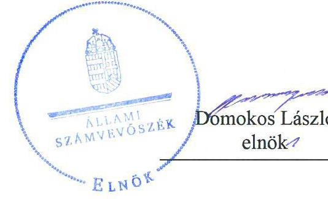
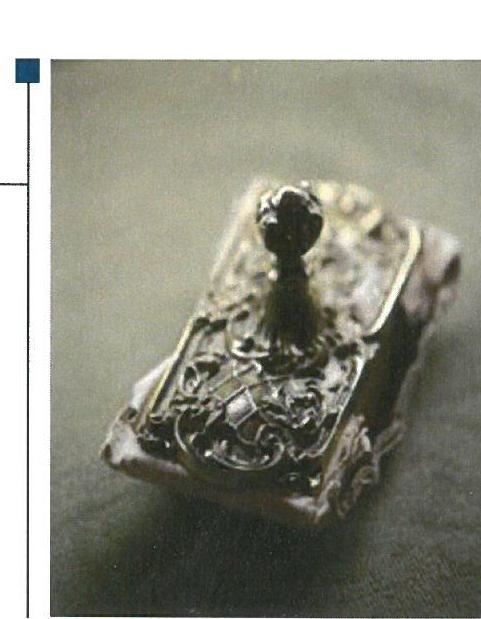

# Jelentés 

## Központi költségvetési szervek ellenőrzése

Dr. Entz Ferenc Mezőgazdasági
Szakgimnázium, Szakközépiskola és Kollégium
2019.

---

# Jelenetés 

## Központi költségvetési szervek ellenőrzése

Dr. Entz Ferenc Mezőgazdasági
Szakgimnázium, Szakközépiskola és Kollégium
2019. 12. hó 13. nap

---

# AZ ELLENŐRZÉST FELÜGYELTE:

## MAKKAI MÁRIA felügyeleti vezető

## AZ ELLENŐRZÉST VEZETTE ÉS A VÉGREHAJTÁSÁÉRT FELELŐS:

### KISS ISTVÁN GYÖRGY ellenőrzésvezető

### A PROGRAM ÖSSZEÁLLÍTÁSÁÉRT FELELŐS:

### TÓTPÁL SZABOLCS osztályvezető

---

**IKTATÓSZÁM:** EL-2326-001/2019

**TÉMASZÁM:** 2450

**ELLENŐRZÉS-AZONOSÍTÓ SZÁM:** V079151; V0823151

---

Jelentéseink az Országgyűlés számítógépes hálózatán és az Interneta a www.asz.hu címen is olvashatóak.

---

# TARTALOMJEGYZÉK 

■ ÖSSZEGZÉS ..... 5
■ AZ ELLENŐRZÉS CÉLJA ..... 6
■ AZ ELLENŐRZÉS TERÜLETE ..... 7
■ AZ ELLENŐRZÉS HÁTTERE, INDOKOLTSÁGA ..... 8
■ A JELENTÉS LÉNYEGES KÉRDÉSKÖREI ..... 9
■ AZ ELLENŐRZÉS HATÓKÖRE ÉS MÓDSZEREI ..... 10
■ MEGÁLLAPÍTÁSOK ..... 13
■ JAVASLATOK ..... 16
■ MELLÉKLETEK ..... 19
I. sz. melléklet: Értelmező szótár ..... 19
■ FÜGGELÉKEK ..... 23
I. sz. függelék a jelentéshez ..... 23
II. sz. függelék: Észrevételek ..... 24
■ RÖVIDÍTÉSEK JEGYZÉKE ..... 25

---

.

---

# ÖSSZEGZÉS 

Dr. Entz Ferenc Mezőgazdasági Szakgimnázium, Szakközépiskola és Kollégium belső kontrollrendszere, pénzügyi és vagyongazdálkodása nem volt szabályszerű, nem biztosította a közpénzekkel és nemzeti vagyonnal való átlátható, elszámoltatható felelős gazdálkodást, a vagyon védelmét. Az intézmény nem volt védett a korrupcióval szemben.

## Az ellenőrzés társadalmi indokoltsága

Magyarország versenyképességének és a magyar gazdaság fejlődésének alapvető feltétele a magyar munkavállalók megfelelő szakmai képzettsége és felkészültsége, amelyben a szakképzési rendszernek döntő szerepe van. A mezőgazdaság vonatkozásában is kiemelten fontos ez, hiszen a magyar mezőgazdaság piaci versenyképességét és eredményességét nagymértékben befolyásolja az agrárszférában dolgozók képzettsége, felkészültsége. A szakképzés legjelentősebb színterei a szakképző iskolák. Az eredményes és célszerű szakképzés alapja és alapvető feltétele a szakképző intézmények közpénzekkel és a közvagyonnal való törvényes, átlátható és a korrupcióval szembeni védelmet biztosító múködése és gazdálkodása. Ezért ezen szervezetekkel szemben is alapvető társadalmi igény, hogy a rájuk bízott közpénzekkel, közvagyonnal szabályosan gazdálkodjanak. Emellett a szakképzésben részt vevő pedagógusok, tanulók és a szülők jogos elvárása, hogy a szakképző iskolák múködése átlátható és elszámoltatható legyen. Mindezen igényekkel összhangban, a közpénzügyek átláthatóságának előmozdítása, a közvagyon védelme érdekében került sor az agrárszakképző iskolák belső kontrollrendszerének és gazdálkodásának ellenőrzésére.

## Főbb megállapítások, következtetések, javaslatok

A Dr. Entz Ferenc Mezőgazdasági Szakgimnázium, Szakközépiskola és Kollégium belső kontrollrendszerének kialakítása és múködtetése nem volt szabályszerű. Az intézmény nem rendelkezett vagyonnyilatkozat-tételi kötelezettséghez kapcsolódó szabályozással 2016-ban. Az integrált kockázatkezelési rendszert nem múködtette szabályszerűen, az információs és kommunikációs rendszert, valamint a nyomon követési rendszert nem alakította ki 2017-ben.

A feltárt szabálytalanságok miatt a Dr. Entz Ferenc Mezőgazdasági Szakgimnázium, Szakközépiskola és Kollégium belső kontrollrendszere nem biztosította a szabályos közpénzfelhasználás feltételeit.

A Dr. Entz Ferenc Mezőgazdasági Szakgimnázium, Szakközépiskola és Kollégium pénzügyi gazdálkodása nem felelt meg a jogszabályi előírásoknak, mert 2016. évben nem rendelkezett kötelezettségvállalási nyilvántartással.

A vagyongazdálkodás az éves költségvetési beszámolók mérlegtételeinek leltárral való alátámasztásának hiánya miatt nem volt szabályszerű. A költségvetési beszámolók nem igazolták a vagyon megőrzését.

A Dr. Entz Ferenc Mezőgazdasági Szakgimnázium, Szakközépiskola és Kollégium a korrupciós kockázatokkal arányos integritást erősítő kontrollokat nem múködtetett.

Az Állami Számvevőszék a jelentésben foglalt megállapítások alapján a Dr. Entz Ferenc Mezőgazdasági Szakgimnázium, Szakközépiskola és Kollégium igazgatója részére 7 javaslatot fogalmazott meg.

---

# AZ ELLENŐRZÉS CÉLJA

**AZ ELLENŐRZÉS CÉLJA** annak megállapítása volt, hogy az ellenőrzött intézményre vonatkozó irányító szervi feladatellátás a jogszabályi előírások betartásával történt-e; az intézménynél a belső kontrollrendszer kialakítása és működtetése szabályszerű volt-e; az intézmény pénzügyi és vagyongazdálkodása megfelelt-e a jogszabályi előírásoknak és belső szabályzatainak; az intézmény átalakításának vagy átszervezésének lebonyolítása szabályszerűen történt-e.

Az ellenőrzés célja volt továbbá annak megállapítása, hogy a központi költségvetési szerv belső kontrollrendszere biztosította-e az átlátható, szabályszerű, gazdaságos, hatékony és eredményes gazdálkodás feltételeit; gazdálkodása során elszámoltatható volt-e és megfelelt-e annak az Alaptörvényben meghatározott alapvetésnek, hogy Magyarország a kiegyensúlyozott, átlátható és fenntartható költségvetési gazdálkodás elvét érvényesíti. Érvényesült-e a nemzeti vagyon kezelésének és védelmének célja, azaz a szervezet vagyona a közérdeket szolgálta, a közös szükségletek kielégítése és a természeti erőforrások megóvása, valamint a jövő nemzedékek szükségleteinek figyelembevétele mellett.

Az ellenőrzés keretében értékeltük, hogy a központi költségvetési szervnél kiépítették és erősítették-e a korrupciós kockázatok kezelését szolgáló integritási kontrollokat, az integritás szemlélet érvényesülését, továbbá megteremtették-e a teljesítményellenőrzés feltételeit.

---

# **Az Elvenőrzés Területe**

## **Dr. Entz Ferenc Mezőgazdasági Szakgimnázium, Szakközépiskola és Kollégium**

Az Intézmény1-t a Földművelésügyi Minisztérium alapította 2013. július 25.-én. Az Intézmény székhelye Fejér megyei Velence városban található.

Az Intézmény alapfeladatát a szakgimnáziumi, a szakközépiskolai nevelés-oktatás, a felnőttoktatás, a többi tanulóval együtt nevelhető, oktatható sajátos nevelési igényű tanulók iskolai nevelése-oktatása képezi.

A felvehető tanulói létszám a nappali képzésen 750 főben, az esti és levelező tagozaton 100-100 főben, míg a kollégiumi férőhelyek száma 200 főben került meghatározásra. A közfeladat ellátása két helyszínen, az Intézmény velencei székhelyén és seregélyesi telephelyén zajlik. Az intézmény vállalkozási tevékenységet folytatott. Az Intézmény gazdasági szervezettel rendelkezett. Az Igazgató2 személye 2017. április 30-tól változott, 2018. január 1-jén történt kinevezéséig megbízással látta el a feladatát.

Az Intézmény a 2016. évben 368,7 M Ft, 2017. évben 193,5 M Ft költségvetési bevételt ért el, a foglalkoztatott létszám mindkét évben 113 fő volt.

---

# AZ ELLENŐRZÉS HÁTTERE, INDOKOLTSÁGA 

Az államháztartás központi alrendszerének közpénz felhasználása, az intézmények által ellátott közfeladatok sokrétűsége, valamint a feladatellátásához rendelt vagyon nagyságrendje indokolja, hogy az ÁSZ ${ }^{3}$ ellenőrzéseket folytasson a pénzügyi és vagyongazdálkodás területén. Az államháztartás központi alrendszerébe tartozó szervezet vagyona a nemzeti vagyon része, és az Alaptörvény ${ }^{4}$ is rögzíti, hogy a vagyonnal való gazdálkodás célja a közérdek szolgálata.

Az ÁSZ az ellenőrzései során feltárja a gazdálkodást, a központi alrendszer intézményei átalakulását, átszervezését érintő szabályozások esetleges hiányosságait, a szabályozással nem érintett gazdálkodási területeket, rámutathat a vagyongazdálkodási tevékenység - ezen belül a tulajdonosi joggyakorlás és vagyonkezelés - esetleges szabálytalanságaira, értékeli az állami vagyon nyilvántartására és elszámolására vonatkozó eljárásokat.

Az ellenőrzés várhatóan hozzájárul a központi intézmények pénzügyi helyzetének pontosabb megítéléséhez, és a jó gyakorlat kialakításán és terjesztésén keresztül az ellenőrzések elősegíthetik a gazdálkodás szabályszerűségének javítását.

A belső kontrollrendszer kialakítása és működtetése nélkül nem valósítható meg a közpénzek, a közvagyon átlátható, szabályos, gazdaságos, hatékony és eredményes felhasználása. A belső kontrollrendszer azt a célt szolgálja, hogy a költségvetési szervek működésük és gazdálkodásuk során a tevékenységeket szabályszerűen hajtsák végre, teljesítsék elszámolási kötelezettségeiket és megvédjék az erőforrásokat a veszteségektől, a károktól és a nem rendeltetésszerű használattól.

---

# A JELENTÉS LÉNYEGES KÉRDÉSKÖREI 

1. Az Irányító szerv ellenőrzött Intézményre vonatkozó feladatellátása szabályszerű volt-e?
2. Az Intézmény belső kontrollrendszerének kialakítása és müködtetése szabályszerű volt-e?
3. Az Intézmény pénzügyi gazdálkodása szabályszerű volt-e?
4. Az Intézmény vagyongazdálkodása szabályszerű volt-e?
5. Az Intézménynél alakítottak-e ki teljesítménymérésre alkalmas követelményeket?

---

# AZ ELLENŐRZÉS HATÓKÖRE ÉS MÓDSZEREI 

## Az ellenőrzés típusa

Megfelelőségi ellenőrzés.

## Az ellenőrzött időszak

Az irányítószervi feladatellátás és a pénzügyi gazdálkodás tekintetében 2016. év.

A belső kontrollrendszer és vagyongazdálkodás tekintetében a 2016. és 2017. év.

## Az ellenőrzés tárgya

Az ellenőrzött szervezetre vonatkozó irányító szervi feladatok ellátása. Az intézmény pénzügyi és vagyongazdálkodása, átalakításának vagy átszervezésének lebonyolítása. Az intézmény belső kontroll rendszerének kialakítása és múködtetése. Az intézménynél az integritáskontrollok kiépítettsége, az integritás szemlélet érvényesülése, a teljesítményellenőrzés feltételei.

## Az ellenőrzött szervezet

Dr. Entz Ferenc Mezőgazdasági Szakgimnázium, Szakközépiskola és Kollégium, valamint irányítószerve az Agrárminisztérium.

## Az ellenőrzés jogalapja

Az ellenőrzés jogszabályi alapját az ÁSZ tv. 1. § (3) bekezdés, 5. § (2)-(4) és (6) bekezdései, valamint az Áht. 61. § (2) bekezdésének előírásai képezik.

## Az ellenőrzés módszerei

Az ellenőrzésre az ellenőrzési program szempontjai alapján, az ellenőrzött időszakban hatályos jogszabályok, az ellenőrzés szakmai szabályai, a jelen ellenőrzésre irányadó ÁSZ módszertanok figyelembevételével került sor.

Az ellenőrzés ideje alatt az ellenőrzött szervezetekkel a kapcsolattartást az ÁSZ SZMSZ5-ének vonatkozó előírásai alapján biztosította az ÁSZ.

---

Az ellenőrzési kérdések megválaszolásához szükséges bizonyítékok megszerzése az ellenőrzött szervezetek által rendelkezésre bocsátott dokumentumokra, adatokra alapozva megfigyelés, szemle (szemrevételezés), kérdésfeltevés (információkérés), mintavételezés, valamint elemző eljárás útján történt.

Az ellenőrzési bizonyítékként felhasználható adatforrások közé tartoztak a szakmai program részletes szempontjainál felsorolt adatforrások, valamint minden egyéb - az ellenőrzés folyamán feltárt, az ellenőrzés szempontjából információt tartalmazó - dokumentum.

Az ellenőrzés lefolytatásához az ellenőrzött szervezet tanúsítványok kitöltésével, valamint az ÁSZ által kért dokumentumok megküldésével szolgáltatott adatokat, amelyek valódiságát és teljeskörűségét az ellenőrzött szervezet vezetője által tett teljességi és hitelességi nyilatkozat igazolta. A rendelkezésre bocsátott adatok, információk kontrollja az ellenőrzés keretében történt.

A központi költségvetési szerv belső kontrollrendszere egyes pilléreinek kialakítására és működtetésére vonatkozó értékelés:
$\longrightarrow$ „szabályszerü", amennyiben az értékelt területen az elért „igen" válaszok százalékban kifejezett, egész számra kerekített aránya legalább $85 \%$,
$\longrightarrow$ „nem szabályszerű", ha nem éri el a $85 \%$-ot,
A központi költségvetési szerv belső kontrollrendszerének összesített értékelése az egyes részterületek esetében kapott megfelelőségi arányok számtani átlaga alapján történik és megegyezik a pillérenként (kontrollterületenként) alkalmazott százalékos értékelésekkel, a következő eltérésekkel: a kontrollrendszer egésze esetében a „szabályszerű" értékelésnek a százalékos értéken felül további feltétele, hogy egyik kontrollterület sem kaphat „nem szabályszerű" értékelést.

Az ÁSZ statisztikai módszereken alapuló mintavételt alkalmazott. Mintavétellel ellenőriztük a bevételek, a kiadások és a vagyonváltozás elszámolása szabályszerűségét, az állami vagyontárgyak jogszerű használatát, valamint az állami vagyon szabályszerű év végi értékelését.

A bevételek ellenőrzésére a 2016. év vonatkozásában, a kiadások ellenőrzésére a 2017. év tekintetében került sor. A kiadásokat (külső személyi juttatások, felhalmozási kiadások, dologi kiadások) és bevételeket (értékesítésből és bérbeadásból származó bevételek) esetében tételes ellenőrzés az ellenőrzés azokra a legnagyobb értékű tételekre - a lényeges sokaságra - terjedt ki, melyek összértéke eléri a teljes sokaság összértékének 50\%-át. A lényeges sokaságokat tételesen ellenőrizte az ÁSZ.

A 2016. évi felhalmozási kiadások esetében tételes ellenőrzésre került sor. A 2017. évi beruházások, felújítások végrehajtásának, a feladatellátást szolgáló állami vagyontárgyak használatának és év végi értékelésének szabályszerűsége, illetve a 2017. évi pénzmozgáshoz nem kapcsolódó vagyonváltozások szabályszerűsége megítélése véletlen mintavétellel kiválasztott tételek alapján történt.

A mintavétellel ellenőrzött területek esetében minden egyes tétel vonatkozásában a használat, elszámolás és értékelés szabályszerűségére vonatkozó kérdéseket tett fel az ÁSZ. Szabályszerűnek értékelt egy ellenőr-

---

zött területet, amennyiben 95\%-os bizonyossággal az ellenőrzött sokaságban az átlagos hibaarány legfeljebb 10\%, nem szabályszerűnek, amennyiben 10\%-nál magasabb arányt képviselt.

---

# 1. Az Irányító szerv ellenőrzött Intézményre vonatkozó feladatellátása szabályszerű volt-e? 

Összegző megállapítás Az Irányító szerv Intézményre vonatkozó feladatellátása 2016. évben szabályszerű volt.

AZ ALAPÍTÓI JOGOSULTSÁGAIT az Irányító szerv ${ }^{6}$ szabályszerűen gyakorolta. Az Irányítószerv Áht. ${ }^{7}$-ban foglalt jogkörében eljárva kiadmányozta az Intézmény alapító okirat ${ }^{8} 1,2$-ának módosítását, melynek módosítására a szakképzés rendszerét érintő szabályozási környezet változása, valamint új telephely alapítása miatt került sor. Az alapító okirat tartalmazta az Ávr. ${ }^{9}$-ben kötelezően előírt információkat.

AZ IRÁNYÍTÁSI, FELŰGYELETI ÉS ELLENŐRZÉSI JOGOSULTSÁGAIT az Irányító szerv az Áht. és Ávr. szerint szabályszerűen gyakorolta a tervezési követelmények meghatározásakor, az elemi költségvetés és a beszámoló összeállításához készült tájékoztató kiadásakor, a költségvetés, valamint az éves beszámolójának jóváhagyásakor. Az Irányító szerv olyan éves költségvetési beszámolót hagyott jóvá, amely a vagyon védelmét biztosító leltárral nem volt alátámasztva.

## 2. Az Intézmény belső kontrollrendszerének kialakítása és müködtetése szabályszerű volt-e?

Összegző megállapítás Az Intézmény belső kontrollrendszerének kialakítása és müködtetése nem volt szabályszerű.

AZ INTÉZMÉNY BELSŐ KONTROLLRENDSZERÉNEK kialakítása és müködtetése 2016. évben nem volt szabályszerű. Az intézmény nem szabályozta a vagyonnyilatkozat-tételi kötelezettség teljesítésének a rendjét a Vnytv. ${ }^{10} 4 . \S$ (a) bekezdésben, valamint a Vnytv. 11. § (6) bekezdéseiben foglalt előírások ellenére. Az Igazgató nem tette meg a legalapvetőbb intézkedést sem a közélet tisztaságának biztosítása és a korrupció megelőzése céljából.

AZ INTÉZMÉNY BELSŐ KONTROLLRENDSZERÉNEK kialakítása és müködtetése a 2017. évben az integrált kockázatkezelési rendszer müködtetésének, az információs és kommunikációs, valamint a monitoring rendszer kialakításának hiánya miatt nem volt szabályszerű.

A KONTROLLKÖRNYEZET KIALAKÍTÁSA 2017. évben szabályszerű volt. Az Igazgató az Nkt. ${ }^{11}$ előírása alapján, az Ávr. előírásainak

---

megfelelő tartalommal SZMSZ ${ }^{12}$-ben meghatározta az Intézmény szervezeti kereteit, feladatai ellátásának részletes belső rendjét.

Az Intézmény a Számv. tv. ${ }^{13}$ és az Áhsz. ${ }^{14}$ előírásának megfelelően rendelkezett Számviteli politika ${ }^{15}{ }_{1,2}$-vel, valamint a Számviteli politika keretében előírt Leltározási szabályzat ${ }^{16}{ }_{1,2}$-vel, Értékelési szabályzat ${ }^{17}{ }_{1,2}$-vel, az Önköltségszámítás rendjére vonatkozó szabályzat ${ }^{18}$-tal, valamint Pénzkezelési szabályzat ${ }^{19}{ }_{1,2}$-vel.

Az Intézmény rendelkezett a kötelezettségvállalásra, pénzügyi ellenjegyzésre, teljesítés igazolására, érvényesítésre, utalványozásra jogosult személyekről és aláírás-mintájukról vezetett Ávr. szerinti nyilvántartással.

# AZ INTEGRÁLT KOCKÁZATKEZELÉSI RENDSZER 

MŰKÖDTETÉSE nem volt szabályszerű. A kockázatok 2017. évi felmérése során a Bkr. 7. § (2) bekezdésében foglalt előírás és az Integrált kockázatkezelési szabályzat ${ }^{20}$ előírása ellenére az egyes kockázatokkal kapcsolatban szükséges intézkedéseket nem határozták meg.

A KONTROLLTEVÉKENYSÉGEK GYAKORLÁSA szabályszerű volt 2017. évben.

## AZ INFORMÁCIÓS ÉS KOMMUNIKÁCIÓS RENDSZER kialakítása nem volt szabályszerű 2017. évben, mert az intézmény nem rendelkezett iratkezelési szabályzattal az Ltv. ${ }^{21} 10 . \S$ (1) a) pontjában foglaltak ellenére.

A MONITORING RENDSZER KERETÉBEN az Igazgató a Bkr. 10. § ellenére a célok megvalósulásának nyomon követési rendszerét, és a független belső ellenőrzési tevékenység feltételeit nem alakította ki.

A BELSŐ KONTROLLRENDSZER minőségét az igazgató a Bkr. 11. § (4) bekezdése 1. melléklet szerint nyilatkozatban értékelte, a nyilatkozat tartalmát az ellenőrzés nem igazolta.

AZ INTEGRITÁSI KONTROLLOKAT nem alakította ki az Intézmény és integritást erősítő, de kötelezően nem előírt kontrollokat sem múködtetett.

## 3. Az Intézmény pénzügyi gazdálkodása szabályszerű volt-e?

Összegző megállapítás Az Intézmény pénzügyi gazdálkodása nem volt szabályszerű 2016. évben.

Az Intézmény nem rendelkezett Áhsz. 39. § (3) bekezdésében meghatározott kötelezettségvállalási nyilvántartással.

---

# 4. Az Intézmény vagyongazdálkodása szabályszerű volt-e? 

## Összegző megállapítás

Az intézmény vagyongazdálkodása a 2016-2017. években nem volt szabályszerű.

Az Intézmény a 2016. és 2017. évi mérlegek fordulónapjaira vonatkozólag a Számv.tv. 69. §. (1) bekezdésében, valamint az Áhsz. 5. § (1) és az Áhsz. 22.§ (1)-(2) bekezdésében foglaltak ellenére nem állított össze leltárt a beszámoló mérlegtételeinek alátámasztásához.

Az Intézmény 2017. évi vagyon nyilvántartása nem volt szabályszerű, mert vagyonkezelési szerződés nélkül, vagyonkezelt eszközként szerepeltette a feladatellátására kapott eszközöket a mérlegében az Áhsz. 10. § (2) bekezdésében, valamint az állami vagyonnal való gazdálkodásról szóló kormányrendelet ${ }^{22} 7 . \S$ (1) bekezdésben előírtak ellenére.

A beruházási és felújítási kiadások esetében Áht. 37. § (1) bekezdésével ellentétben írásban nem került sor kötelezettségvállalásra.

## 5. Az Intézménynél alakítottak-e ki teljesítménymérésre alkalmas követelményeket?

Összegző megállapítás
Az Intézménynél 2017. évben nem alakítottak ki a teljesítménymérésére szolgáló követelményeket.

A teljesítménymérésére alkalmas követelményeket az Intézmény Igazgatója nem alakított ki. Az Igazgató nem képzett az Intézmény céljainak elérését szolgáló, feladatok, folyamatok, tevékenységek mérését szolgáló mutatószámokat, így nem biztosította a teljesítménymérés lehetőségét.

---

# JAVASLATOK 

Az ÁSZ tv. 33. § (1) bekezdésében foglaltak értelmében az ellenőrzött szervezet vezetője köteles a jelentésben foglalt megállapításokhoz kapcsolódó intézkedési tervet összeállítani és azt a jelentés kézhezvételétől számított 30 napon belül az ÁSZ részére megküldeni. Amennyiben az ellenőrzött szervezet vezetője nem küldi meg határidőben az intézkedési tervet, vagy továbbra sem elfogadható intézkedési tervet küld, az Állami Számvevőszék elnöke az ÁSZ tv. 33. § (3) bekezdése a) és b) pontjaiban foglaltakat érvényesítheti.

## a Dr. Entz Ferenc Mezőgazdasági Szakgimnázium, Szakközépiskola és Kollégium igazgatójának

1. Intézkedjen az integrált kockázatkezelési rendszer Bkr. előírásainak megfelelő müködtetéséről.
(2. sz. megállapítás 6. bekezdése alapján)
2. Intézkedjen az iratkezelési szabályzat jogszabályi előírásoknak megfelelő kiadásáról.
(2. sz. megállapítás 8. bekezdése alapján)
3. Intézkedjen a szervezet tevékenységének, a célok megvalósításának nyomon követését biztosító rendszer kialakításáról.
(2. sz. megállapítás 9. bekezdése alapján)
4. Intézkedjen a kötelezettségvállalások nyilvántartásának Áhsz. előírásainak megfelelő vezetéséről.
(3. sz. megállapítás 1. bekezdése alapján)
5. Intézkedjen a jogszabályi előírásoknak megfelelően a mérleg tételeit alátámasztó leltár elkészítéséről, amely tételesen, ellenőrizhető módon tartalmazza a mérleg fordulónapján meglévő eszközöket és forrásokat mennyiségben és értékben.
(4. sz. megállapítás 1. bekezdése alapján)
6. Intézkedjen, hogy a vagyon nyilvántartása megfeleljen a jogszabályi előírásoknak.
(4. sz. megállapítás 2. bekezdése alapján)

---

7. Intézkedjen a beruházási és felújítási kiadások jogszabályi előírásnak megfelelő kötelezettségvállalásáról.
(4. sz. megállapítás 3. bekezdése alapján)

---

.

---

# MELLÉKLETEK 

- I. SZ. MELLÉKLET: ÉRTELMEZŐ SZÓTÁR
állami vagyon
állami vagyonnak minősül:
a) az állam tulajdonában lévő dolog, valamint a dolog módjára hasznosítható természeti erő,
b) az a) pont hatálya alá nem tartozó mindazon vagyon, amely vonatkozásában törvény az állam kizárólagos tulajdonjogát nevesíti,
c) az állam tulajdonában lévő tagsági jogviszonyt megtestesítő értékpapír, illetve az államot megillető egyéb társasági részesedés,
d) az államot megillető olyan immateriális, vagyoni értékkel rendelkező jogosultság, amelyet jogszabály vagyoni értékű jogként nevesít. (Forrás: Vtv. 1. § (2) bekezdése)
állami vagyon értékesítése
állami vagyon használója
állami vagyon hasznosítása
állami vagyon hasznosítása kötött szerződés
állami vagyon kezelője /vagyonkezelő

ÁSZ Integritás Projekt

Állami vagyonnak minősül:
a) az állam tulajdonában lévő dolog, valamint a dolog módjára hasznosítható természeti erő,
b) az a) pont hatálya alá nem tartozó mindazon vagyon, amely vonatkozásában törvény az állam kizárólagos tulajdonjogát nevesíti,
c) az állam tulajdonában lévő tagsági jogviszonyt megtestesítő értékpapír, illetve az államot megillető egyéb társasági részesedés,
d) az államot megillető olyan immateriális, vagyoni értékkel rendelkező jogosultság, amelyet jogszabály vagyoni értékű jogként nevesít. (Forrás: Vtv. 1. § (2) bekezdése)
Állami vagyon tulajdonjogának bármely jogcímen történő, visszterhes átruházása. (Forrás: Vtvr. 1. § (7) bekezdés d) pontja)
Az a természetes vagy jogi személy, jogi személyiséggel nem rendelkező szervezet, aki, vagy amely törvény vagy szerződés alapján, bármely jogcímen (bérlet, haszonbérlet, használat stb.) állami vagyont birtokol, használ, szedi annak használt, hasznosít, ide nem értve a haszonélvezőt, a vagyonkezelőt és a tulajdonosi jogok gyakorlóját". (Forrás: Vtvr. 1. § (7) bekezdés a) pontja)
Az állami vagyont az MNV Zrt. maga kezeli, vagy szerződés - így különösen bérlet, haszonbérlet, megbízás - alapján központi költségvetési szervnek, természetes vagy jogi személynek, vagy jogi személyiséggel nem rendelkező gazdálkodó szervezetnek hasznosításra átengedi.
(Forrás: Vtv. 23. § (1) bekezdése, hatályos 2012. január 1-jétől)
Az állami vagyonnal a tulajdonosi joggyakorló maga gazdálkodik, vagy szerződés - így különösen bérlet, haszonbérlet, megbízás - alapján hasznosításra átengedi, illetőleg vagyonkezelésbe, haszonélvezetbe adja. (Forrás: Vtv. 23. § (1) bekezdése, hatályos 2013. június 28 -ától)
Az állami vagyon hasznosítására kötött szerződések elsődleges célja az állami vagyon hatékony működtetése, állagának védelme, értékének megőrzése, illetve gyarapítása, az állami és közfeladatok ellátásának elősegítése. (Forrás: Vtv. 23. § (2) bekezdése)
Az állami vagyont az MNV Zrt. maga kezeli, vagy szerződés - így különösen bérlet, haszonbérlet, megbízás - alapján központi költségvetési szervnek, természetes vagy jogi személynek, vagy jogi személyiséggel nem rendelkező gazdálkodó szervezetnek hasznosításra átengedi." Az állami vagyonra vonatkozóan az MNV Zrt. kizárólag az Nvtv-ben meghatározott személyekkel köthet vagyonkezelési szerződést. (Forrás: Vtv. 27. § (1) bekezdése, hatályos 2012. január 1-jétől)
Az Állami Számvevőszék 2009-ben indította el a „Korrupciós kockázatok feltérképezése - Integritás alapú közigazgatási kultúra terjesztése" című, európai uniós forrásból megvalósított kiemelt projektjét (Integritás Projekt). Az Integritás Projekt célja, hogy felmérje a közszféra intézményei korrupciós kockázatoknak való kitettségét, illetőleg az azok mérséklésére hivatott kontrollok szintjét. Az Állami Számvevőszék a projekt révén az integritás szemlélet minél szélesebb körrel történő megismertetését, gyakorlatba ültetését kívánja elérni. Az integritás követelményeinek megfelelő szervezeti múködést előnyben részesítő közigazgatási kultúra elterjesztését és a korrupció elleni fellépést az ÁSZ önmagára nézve is stratégiai jelentőségű célként fogalmazta meg. A projekt a felmérésben résztvevő intézmények számára helyzetükről

---

egyfajta „tükörképet" mutat be, ami alapot teremt a jövőbeni pozitív irányú elmozduláshoz. (Forrás: a http://integritas.asz.hu honlapon közzétett, a 2013. évi Integritás felmérés eredményeiről készült összefoglaló tanulmány)
belső ellenőrzés
belső kontrollrendszer
belső kontrollrendszer területei
felújítás
hasznosítás
információs és kommunikációs rendszer
integritás
irányító szerv
kincstári költségvetés
kockázat
Független, tárgyilagos bizonyosságot adó és tanácsadó tevékenység, amelynek célja, hogy az ellenőrzött szervezet múködését fejlessze és eredményességét növelje, az ellenőrzött szervezet céljai elérése érdekében rendszerszemléletű megközelítéssel és módszeresen értékeli, illetve fejleszti az ellenőrzött szervezet irányítási és belső kontrollrendszerének hatékonyságát. (Forrás: Bkr. 2. § b) pontja)
A belső kontrollrendszer a kockázatok kezelése és tárgyilagos bizonyosság megszerzése érdekében kialakított folyamatrendszer, amely azt a célt szolgálja, hogy a múködés és gazdálkodás során a tevékenységeket szabályszerűen, gazdaságosan, hatékonyan, eredményesen hajtsák végre, az elszámolási kötelezettségeket teljesítsék, megvédjék az erőforrásokat a veszteségektől, károktól és nem rendeltetésszerű használattól. (Forrás: Áht. 69. § (1) bekezdése)
A kontrollkörnyezet, a kockázatkezelési rendszer, a kontrolltevékenységek, az információs és kommunikációs rendszer, valamint a nyomon követési (monitoring) rendszer. (Forrás: Bkr. 3. §-a)
Az elhasználódott tárgyi eszköz eredeti állaga (kapacitása, pontossága) helyreállítását szolgáló időszakonként visszatérő olyan tevékenység, melynek során az eszköz élettartama megnövekszik, minősége, használata jelentősen javul, így a pótlólagos ráfordításból a jövőben gazdasági előnyök származnak. (Forrás: Számv. tv. 3. § (4) bekezdés 8. pontja)
A nemzeti vagyon birtoklásának, használatának, hasznok szedése jogának bármely a tulajdonjog átruházását nem eredményező - jogcímen történő átengedése, ide nem értve a vagyonkezelésbe adást, valamint a haszonélvezeti jog alapítását. (Forrás: Nvtv. 3. § (1) bekezdés 4. pontja)
A költségvetési szerv vezetője által kialakított és múködtetett olyan rendszer, mely biztosítja, hogy a megfelelő információk a megfelelő időben eljutnak az illetékes szervezethez, szervezeti egységhez, illetve személyhez. (Forrás: Bkr. 9. § (1) bekezdés)
Az integritás - egyik gyakran használt jelentése szerint - az elvek, értékek, cselekvések, módszerek, intézkedések konzisztenciáját jelenti, vagyis olyan magatartásmódot, amely meghatározott értékeknek megfelel. Integritás-irányítási rendszer bevezetése a szervezetben a szervezethez rendelt közfeladatok integritás szempontú ellátását, az érték alapú múködéssel (integritással) összefüggő szervezeti követelmények következetes érvényesítését jelenti. (Forrás: Nemzetgazdasági Minisztérium: Államháztartási Belső Kontroll Standardok és Gyakorlati Útmutató 1.6. Etikai értékek és integritás 46. oldal, 2017. szeptember)
A költségvetési szerv tekintetében az Áht-ban meghatározott irányítási hatáskört gyakorló szerv. (Forrás: Áht. 1. § 9. pontja)
A központi költségvetésről szóló törvény elfogadását követően a fejezetet irányító szerv az államháztartás központi alrendszerébe tartozó költségvetési szerv és a fejezeti kezelésű előirányzat kiemelt előirányzatait, valamint az elkülönített állami pénzalapok és a társadalombiztosítás pénzügyi alapjai jogszabályi előírás szerinti bevételeit és kiadásait kincstári költségvetés kiadásával állapítja meg. (Forrás: Áht. 28. § (2) bekezdés)
A kockázat annak a valószínűségét jelenti, hogy egy vagy több esemény vagy intézkedés nem kívánt módon befolyásolja a rendszer múködését, céljainak megvalósulását. (Forrás: Javaslatok a korrupciós kockázatok kezelésére - Kockázatkezelési és ellenőrzési módszertan 35. oldal, ÁSZ)

---

kockázatkezelési rendszer
integrált kockázatkezelési rendszer
kontrollkörnyezet
kontrolltevékenységek
kommunikáció
középirányító szerv
közfeladat
monitoring
monitoring-rendszer
tulajdonosi joggyakorló
vagyongazdálkodás

Olyan irányítási eszközök és módszerek összessége, melynek elemei a szervezeti célok elérését veszélyeztető tényezők (kockázatok) azonosítása, elemzése, csoportosítása, nyomon követése, valamint szükség esetén a kockázati kitettség mérséklése.(Forrás: Bkr. 2. § m) pontja)
Olyan folyamatalapú kockázatkezelési rendszer, amely a szervezet minden tevékenységére kiterjed, egységes módszertan és eljárások alkalmazásával, a szervezet célkitűzéseinek és értékeinek figyelembevételével biztosítja a szervezet kockázatainak teljes körű azonosítását, azok meghatározott kritériumok szerinti értékelését, valamint a kockázatok kezelésére vonatkozó intézkedési terv elkészítését és az abban foglaltak nyomon követését. (Forrás: Bkr. 2. § m) pontja, 2016. október 1-jétől)
A költségvetési szerv vezetője által kialakított olyan elvek, eljárások, belső szabályzatok összessége, amelyben világos a szervezeti struktúra, a folyamatok átláthatók, egyértelműek a felelősségi, hatásköri viszonyok és feladatok, meghatározottak, ismertek és elfogadottak az etikai elvárások a szervezet minden szintjén, átlátható a humán-erőforrás-kezelés. (Forrás: Bkr. 6. § (1) bekezdés)
A költségvetési szerv vezetője által a szervezeten belül kialakított (kontroll) tevékenységek, melyek biztosítják a kockázatok kezelését, hozzájárulnak a szervezet céljainak eléréséhez és erősítik a szervezet integritását. (Forrás: Bkr. 8. § (1) bekezdés)
Az a tevékenység, melynek során információ továbbítása valósul meg. A kommunikációs folyamat résztvevői között tájékoztatás történik, mely során tényeket, ezek magyarázatát közlik.
A költségvetési szerv tekintetében törvény vagy kormányrendelet alapján meghatározott, átruházott irányítási hatásköröket gyakorló szerv. (Forrás: Áht. 9. § (4) bekezdés)
Jogszabályban meghatározott állami vagy önkormányzati feladat, amit az arra kötelezett közérdekből, a jogszabályban meghatározott követelményeknek és feltételeknek megfelelve végez, ideértve a lakosság közszolgáltatásokkal való ellátását, továbbá az állam nemzetközi szerződésekben vállalt kötelezettségeiből adódó közérdekű feladatokat, valamint e feladatok ellátásakor szükséges infrastruktúra biztosítását is. (Forrás: Nvtv. 3. § (1) bekezdés 7. pontja)
A monitoring általánosságban a különböző szintű szervezeti célok megvalósításának folyamatát kíséri figyelemmel, melynek során a releváns eseményekről és tevékenységekről (együtt: folyamatokról) rendszeres jelleggel, strukturált, döntéstámogató információkhoz jutnak a szervezet vezetői. (Forrás: NGM Útmutató a költségvetési szervek monitoring rendszeréhez 2011. november)
A költségvetési szerv vezetője köteles kialakítani a szervezet tevékenységének a célok megvalósításának nyomon követését biztosító rendszert, amely az operatív tevékenységek keretében megvalósuló folyamatos és eseti nyomon követésből, valamint az operatív tevékenységektől függetlenül múködő belső ellenőrzésből áll. (Forrás: Bkr. 10. §)
Aki a nemzeti vagyon felett az államot vagy a helyi önkormányzatot megillető tulajdonosi jogok és kötelezettségek összességének gyakorlására jogosult. (Forrás: Nvtv. 3. § (1) bekezdés 17. pontja)

A nemzeti vagyongazdálkodás feladata a nemzeti vagyon rendeltetésének megfelelő, az állam, az önkormányzat mindenkori teherbíró képességéhez igazodó, elsődlegesen a közfeladatok ellátásához és a mindenkori társadalmi szükségletek kielégítéséhez szükséges, egységes elveken alapuló, átlátható, hatékony és költségtakarékos müködtetése, értékének megőrzése, állagának védelme, értéknövelő használata, hasznosítása, gyarapítása, továbbá az állam vagy a helyi önkormányzat feladatának ellátása szempontjából feleslegessé váló vagyontárgyak elidegenítése. (Forrás: Nvtv. 7. § (2) bekezdése)

---

.

---

# FÜGGELÉKEK 

- I. SZ. FÜGGELÉK A JELENTÉSHEZ

Az Állami Számvevőszék az ellenőrzések során feltárt tényekhez kapcsolódó további körülmények tisztázására eszközrendszerrel nem rendelkezik. Amennyiben az ellenőrzésen túlmutatóan indokoltnak látszik az ellenőrzés során feltárt körülmények további vizsgálata, az Állami Számvevőszék törvényi felhatalmazás alapján az ellenőrzés által feltárt körülményeket továbbítja a hatáskörrel rendelkező szervnek a szükséges intézkedések megtétele, eljárások lefolytatása érdekében.

1. 

Az Intézmény 2016-2017. évi beszámoló mérlegtételeit nem támasztotta alá leltárral. Az Intézmény ezért 2016. és 2017. években megsértette a Számv.tv. 69. § (1) bekezdésében, valamint az Áhsz. 5. § (1) és az Áhsz. 22. § (1)-(2) bekezdésében előírtakat.
A fenti szabálytalanság miatt nem igazolt, hogy az Intézmény beszámolói megbízható és valós összképet mutatnak.
Az eset konkrét körülményeinek felderítésére a Nemzeti Adó- és Vámhivatal rendelkezik hatáskörrel.
2.

Az Intézmény 2017. évben 7.562 ezer Ft értékben értékben fogadott be és fizetett ki olyan egyedileg 200 ezer Ft-ot meghaladó számlákat, amelyekre az Áht. 37. § (1) bekezdésében foglaltak ellenére nem vállaltak írásban kötelezettséget.
Felmerül a gyanú, hogy a kötelezettségvállalások hiányában a kiadások nem az Intézmény feladatellátását szolgálták, így az Intézményt vagyoni hátrány érhette. Az esetek konkrét körülményeinek felderítésére az Ügyészség jogosult.

---

A jelentéstervezetet a Számvevőszék 15 napos észrevételezésre megküldte az ellenőrzött szervezetek vezetőinek az ÁSZ tv. 29. §̊ (1) bekezdése előirásának megfelelően.

Az ÁSZ a jelentéstervezetet észrevételezésre megküldte a Dr. Entz Ferenc Mezőgazdasági Szakgimnázium, Szakközépiskola és Kollégium igazgatójának és az agrárminiszternek.
A Dr. Entz Ferenc Mezőgazdasági Szakgimnázium, Szakközépiskola és Kollégium igazgatója nemleges észrevételt tett, az agrárminiszter észrevételezési jogával nem élt.

[^0]
[^0]:    * 29. § (1) Az Állami Számvevőszék az ellenőrzési megállapításait megküldi az ellenőrzött szervezet vezetőjének vagy az általa megbízott személynek, és annak, akinek személyes felelősségét állapította meg.
    (2) Az ellenőrzött szervezet vezetője és a felelősként megjelölt személy az ellenőrzés megállapításaira tizenöt napon belül írásban észrevételt tehet.
    (3) Az Állami Számvevőszék az észrevételre a beérkezésétől számított harminc napon belül írásban válaszol. A figyelembe nem vett észrevételeket köteles a jelentésben feltüntetni, és megindokolni, hogy azokat miért nem fogadta el.

---

# RÖVIDÍTÉSEK JEGYZÉKE 

${ }^{1}$ Intézmény
${ }^{2}$ Igazgató
${ }^{3}$ ÁSZ
${ }^{4}$ Alaptörvény
${ }^{5}$ ÁSZ SZMSZ
${ }^{6}$ Irányító szerv
${ }^{7}$ Áht.
${ }^{8}$ alapító okirat ${ }_{1}$
alapító okirat ${ }_{2}$
${ }^{9}$ Ávr.
${ }^{10}$ Vnytv.
${ }^{11} \mathrm{Nkt}$.
${ }^{12}$ SZMSZ
${ }^{13}$ Számv. tv.
${ }^{14}$ Áhsz.
${ }^{15}$ Számviteli politika ${ }_{1}$

Számviteli politika ${ }_{2}$
${ }^{16}$ Leltározási szabályzat ${ }_{1}$

Leltározási szabályzat ${ }_{2}$
${ }^{17}$ Értékelési szabályzat ${ }_{1}$

Értékelési szabályzat ${ }_{2}$
${ }^{18}$ Önköltségszámítási szabályzat
${ }^{19}$ Pénzkezelési szabályzat ${ }_{1}$

Pénzkezelési szabályzat ${ }_{2}$
Pénzkezelési szabályzat ${ }_{3}$
${ }^{20}$ Integrált kockázatkezelési szabályzat

Dr. Entz Ferenc Mezőgazdasági Szakgimnázium, Szakközépiskola és Kollégium Intézmény igazgatója
Állami Számvevőszék
Magyarország Alaptörvénye
Állami Számvevőszék Szervezeti és Müködési Szabályzata
2014. június 06. - 2018. május 18. között Földművelésügyi Minisztérium 2018. május 18. - Agrárminisztérium
2011. évi CXCV. törvény az államháztartásról

Dr. Entz Ferenc Mezőgazdasági Szakgimnázium, Szakközépiskola és Kollégium alapító okirat (hatályos: 2016. szeptember 01.)
Dr. Entz Ferenc Mezőgazdasági Szakgimnázium, Szakközépiskola és Kollégium alapító okirat (hatályos: 2017. augusztus 31.)
368/2011. (XII. 31.) Korm. rendelet az államháztartásról szóló törvény végrehajtásáról
2007. évi CLII. törvény egyes vagyonnyilatkozat-tételi kötelezettségekről 2011. évi CXC. törvény a nemzeti köznevelésről

Dr. Entz Ferenc Mezőgazdasági Szakképző Iskola és Kollégium Szervezeti és Müködési Szabályzat (hatályos: 2015. augusztus 28.)
2000. évi C. törvény a számvitelről (hatályos: 2001. január 01.)

4/2013. (I. 11.) Korm. rendelet az államháztartás számviteléről
Dr. Entz Ferenc Mezőgazdasági, Kereskedelmi és Vendéglátóipari Szakképző Iskola és Kollégium Számviteli Politika (hatályos: 2012. április 05.)
Dr. Entz Ferenc Mezőgazdasági Szakgimnázium, Szakközépiskola és Kollégium számviteli politikája (hatályos: 2017. szeptember 01.)
Dr. Entz Ferenc Mezőgazdasági Szakképző Iskola és Kollégium Leltározási Szabályzat (2014. január 01.)
Dr. Entz Ferenc Mezőgazdasági Szakgimnázium, Szakközépiskola és Kollégium Eszközök és források leltározási és leltárkészítési szabályzata (hatályos: 2017. szeptember 01.)
Dr. Entz Ferenc Mezőgazdasági, Kereskedelmi és Vendéglátóipari Szakképző Iskola és Kollégium Eszközök és Források Értékelési Szabályzata (hatályos: 2012. április 05.)
Dr. Entz Ferenc Mezőgazdasági Szakképző Iskola és Kollégium Értékelési Szabályzata (hatályos: 2016. április 16.)
Dr. Entz Ferenc Mezőgazdasági Szakgimnázium, Szakközépiskola és Kollégium Önköltségszámítási Szabályzata (hatályos: 2017. július 01.)
Dr. Entz Ferenc Mezőgazdasági, Kereskedelmi és Vendéglátóipari Szakképző Iskola és Kollégium Pénzkezelési Szabályzata (hatályos: 2012. április 05.)
Dr. Entz Ferenc Mezőgazdasági Szakképző Iskola és Kollégium Pénzkezelési és Bankszámlapénz kezelési szabályzata (hatályos: 2016.április 16.)
Dr. Entz Ferenc Mezőgazdasági Szakgimnázium, Szakközépiskola és Kollégium Pénzkezelési szabályzata (hatályos: 2017. szeptember 01.)
dr. Entz Ferenc Mezőgazdasági Szakgimnázium, Szakközépiskola és Kollégium Integrált kockázatkezelési szabályzata hatályos (2017. október 30.)

---

${ }^{21}$ Ltv.
${ }^{22}$ állami vagyonnal való gazdálkodásról szóló rendelet
1995. évi LXVI. törvény a köziratokról, a közlevéltárakról és a magánlevéltári anyag védelméről
Az állami vagyonnal való gazdálkodásról szóló 254/2007. (X.4) Korm. rendelet

---

# ÁLLAMI SZÁMVEVŐSZÉK 

1052 Budapest, Apáczai Csere János utca 10.
Levélcím: 1364 Budapest 4. Pf. 54
Telefon: +36 14849100 Telefax: +36 14849200
www.asz.hu