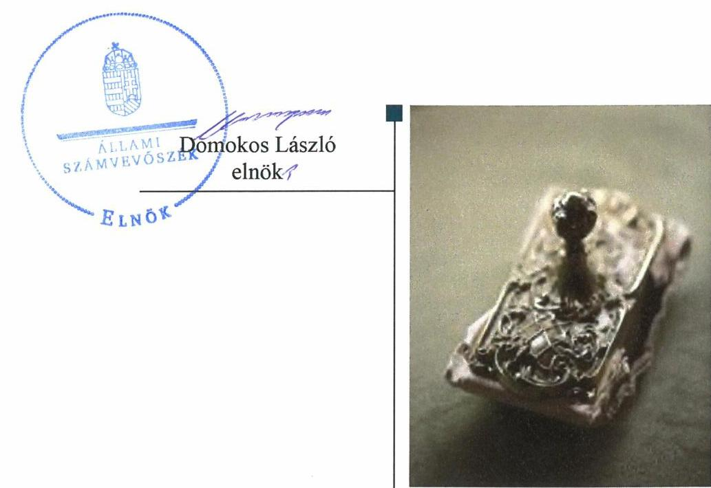
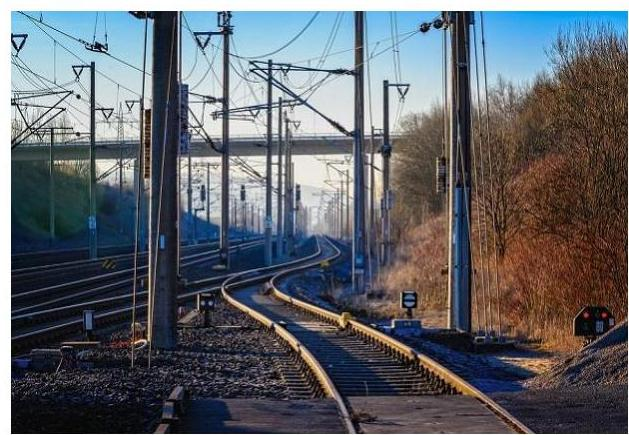
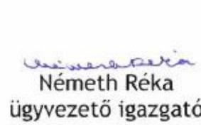
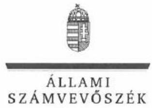
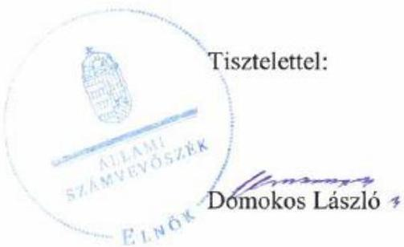

# Jelentés 

## Az állami tulajdonú gazdasági társaságok ellenőrzése

VPE Vasúti Pályakapacitás-elosztó Korlátolt Felelősségű Társaság 2019.

19242
www.asz.hu

---

# Jelen 

ÁLLAMI
SZÁMVEVŐSZÉK

## Jelentés

## Az állami tulajdonú gazdasági társaságok ellenőrzése

VPE Vasúti Pályakapacitás-elosztó Korlátolt Felelősségű Társaság
2019. 12. hó 12. nap

---

# AZ ELLENŐRZÉST FELÜGYELTE:

- **KLINGA LÁSZLÓ** felügyeleti vezető
- **AZ ELLENŐRZÉST VEZETTE ÉS A VÉGREHAJTÁSÁÉRT FELELŐS:**
  - **KISTÓTH KRISZTINA** ellenőrzésvezető
  - **A PROGRAM ÖSSZEÁLLÍTÁSÁÉRT FELELŐS:**
    - **TÓTPÁL SZABOLCS** osztályvezető

**IKTATÓSZÁM:** EL-2329-001/2019

**TÉMASZÁM:** 2480

**ELLENŐRZÉS-AZONOSÍTÓ SZÁM:** V-0824

---

Jelentéseink az Országgyűlés számítógépes hálózatán és az Interneta a www.asz.hu címen is olvashatóak.

---

# TARTALOMJEGYZÉK 

■ ÖSSZEGZÉS ..... 5
■ AZ ELLENŐRZÉS CÉLJA ..... 6
■ AZ ELLENŐRZÉS TERÜLETE ..... 7
■ AZ ELLENŐRZÉS HÁTTERE, INDOKOLTSÁGA ..... 8
■ A JELENTÉS LÉNYEGES KÉRDÉSKÖREI ..... 9
■ AZ ELLENŐRZÉS HATÓKÖRE ÉS MÓDSZEREI ..... 10
■ MEGÁLLAPÍTÁSOK ..... 12
■ JAVASLATOK ..... 15
■ MELLÉKLETEK ..... 17
I. sz. melléklet: Értelmező szótár ..... 17
■ FÜGGELÉK: ÉSZREVÉTELEK ..... 19
■ RÖVIDÍTÉSEK JEGYZÉKE ..... 31

---

.

---

# ÖSSZEGZÉS 

A VPE Vasúti Pályakapacitás-elosztó Korlátolt Felelősségű Társaság müködésének szabályozottsága, a pénzügyi-számviteli feladatok ellátása, valamint vagyongazdálkodási tevékenysége nem volt szabályszerű. A Társaság nem biztosította a vagyongazdálkodás törvényességét és a gazdálkodás átláthatóságát, elszámoltathatóságát.

## Az ellenőrzés társadalmi indokoltsága

Az Alaptörvény 38. cikke alapján az állam tulajdona a nemzeti vagyon része. A nemzeti vagyon megőrzésének, védelmének és a nemzeti vagyonnal való felelős gazdálkodásnak a követelményeit sarkalatos törvény határozza meg. Az állami tulajdonú gazdasági társaságok ellenőrzése kiemelten fontos a nemzeti vagyon megőrzése, megóvása érdekében.

Az ellenőrzés rámutat az állami tulajdonú közszolgáltatást végző gazdasági társaságok gazdálkodási tevékenységével, valamint az államháztartásból származó források felhasználásával kapcsolatos jó gyakorlatokra és szabálytalanságokra. Felhívja a figyelmet a jogszabályi követelmények teljesítéséhez szükséges feltételek hiányosságaira, hozzájárul az államháztartáson kívüli, de (közvetlenül vagy közvetve) állami vagyont használó gazdálkodó szervezetek tevékenységének átláthatóságához. Az Állami Számvevőszék ellenőrzése eredményeképpen javaslataival, megállapításaival hozzájárul a közvagyonnal való gazdálkodás átláthatóságának, elszámoltathatóságának javításához.

## Főbb megállapítások, következtetések, javaslatok

A VPE Vasúti Pályakapacitás-elosztó Korlátolt Felelősségű Társaság működésének szabályozottsága a 2015-2017. években nem volt szabályszerű. Az ügyvezető a Társaság szervezeti és működési szabályzatát nem készítette el, a Selejtezési és leltározási szabályzatban az ingatlanokra meghatározott mennyiségi felvétellel történő leltározás gyakorisága nem felelt meg a Számv. tv. ${ }^{1}$ előírásainak, továbbá a Társaság nem rendelkezett a számlarendben foglaltakat alátámasztó bizonylati renddel illetve 2016. augusztus 9-ig pénzkezelési szabályzattal.

A Társaság pénzügyi-számviteli feladatainak ellátása és vagyongazdálkodása nem volt szabályszerű a 2015-2017. években, mérlege alátámasztásához nem készített a jogszabályi előírásoknak megfelelő leltárt. A számviteli beszámoló készítési kötelezettségének a 2017. évben nem tett eleget. A Társaság nem biztosította a vagyonmegőrzés és a vagyonnal történő elszámolás feltételeit.

Az Állami Számvevőszék a jelentésben foglalt megállapítások alapján a VPE Vasúti Pályakapacitás-elosztó Korlátolt Felelősségű Társaság ügyvezetőjének tíz javaslatot fogalmazott meg. A javaslatokat megalapozó megállapításokra az érintettnek 30 napon belül intézkedési tervet kell készítenie.

---

# AZ ELLENŐRZÉS CÉLJA 

Az ellenőrzés célja annak értékelése, hogy a gazdasági társaság szabályozottsága, gazdálkodása és vagyongazdálkodási tevékenysége megfelelt-e a jogszabályi és a tulajdonosi előírásoknak. A vagyonváltozást eredményező döntések esetében a gazdasági társaság szabályszerűen járte el.

---

# AZ ELLENŐRZÉS TERÜLETE 

## VPE Vasúti Pályakapacitás-elosztó Korlátolt Felelősségű Társaság

A VPE Vasúti Pályakapacitás-elosztó Korlátolt Felelősségű Társaság a vasútról szóló 1993. évi XCV. törvény alapján 2004. január 26.-án jött létre. A Társaság ${ }^{2}$ fő tevékenysége szárazföldi szállítást kiegészítő szolgáltatás, a vasúti pályahálózat-kapacitás elosztása, ennek keretében a Hálózati Üzletszabályzat kidolgozása, a hálózat-hozzáférés díjszabás rendszerének kialakítása. A Társaság közfeladat ellátásához nyújtott szolgáltatást.

A Vasúti közlekedésről szóló törvény ${ }^{3}$ szerint a Társaság egyszemélyes gazdasági társaságként működött, kizárólagos tulajdonosa a Magyar Állam. A tulajdonosi jogokat a magyar állam nevében a nemzeti fejlesztési miniszter gyakorolta, majd 2018. május 18 -tól a nemzeti vagyon kezeléséért felelős tárca
nélküli miniszter.
A Társaságnál a taggyűlés jogait a tulajdonosi jogok gyakorlója a Ptk. 3:109. § (4) bekezdése alapján gyakorolta. A Társaságnál három fős Felügyelő Bizottság működött. A Társaság ügyvezetője személyében 2009. óta nem történt változás. A Társaság a Számv. tv. alapján könyvvizsgálatra volt kötelezett.

A Társaság szolgáltatásainak díjtételeit a 268/2009. (XII. 1.) Korm. rendelet ${ }^{4}$ határozta meg. A Számv. tv. által előírt önköltségszámítás rendjére vonatkozó szabályzat készítésére a Társaság nem volt kötelezett.

A Társaság az ellenőrzött időszakban nem minősült kormányzati szektorba sorolt gazdálkodó szervezetnek, nem végzett vagyonkezelést, továbbá tulajdonosi részesedéssel más gazdasági társaságban nem rendelkezett.

---

# AZ ELLENŐRZÉS HÁTTERE, INDOKOLTSÁGA 

Az állami tulajdonú gazdasági társaságokra vonatkozó előírások betartásának ellenőrzése kiemelten fontos a vagyon megőrzése, megóvása érdekében. Az állami tulajdonú gazdasági társaságok esetében alapvető követelmény, hogy gazdálkodásuk, működésük szabályszerű, az általuk szolgáltatott adatok minél megbízhatóbbak legyenek. Gazdálkodásuk jellemzően a közérdeklődés és a média figyelmének középpontjában áll, amihez hozzájárul a gazdálkodásuk körébe tartozó - közvetlen vagy közvetett állami tulajdonú, tehát végső soron a nemzeti vagyon részét képező - vagyon nagysága, illetve az általuk ellátott közszolgáltatások/közfeladatok minősége és hatékonysága. A rendszeres elszámoltatás feltételeinek kialakítása az ellenőrzése során nagy hangsúlyt kap.

---

# A JELENTÉS LÉNYEGES KÉRDÉSKÖREI 

1. A társaság müködésének szabályozottsága megfelelt-e az előírásoknak?
2. A társaságnál a pénzügyi-számviteli és adatszolgáltatási feladatok ellátása szabályszerü volt-e?
3. A társaság vagyongazdálkodása szabályszerü volt-e?

---

# AZ ELLENŐRZÉS HATÓKÖRE ÉS MÓDSZEREI 

## Az ellenőrzés típusa

Megfelelőségi ellenőrzés.

## Az ellenőrzött időszak

Az ellenőrzött időszak 2015-2017. évek.

## Az ellenőrzés tárgya

Állami tulajdonban lévő gazdasági társaság gazdálkodása, kiemelten vagyongazdálkodási tevékenysége.

## Az ellenőrzött szervezet

VPE Vasúti Pályakapacitás-elosztó Korlátolt Felelősségű Társaság

## Az ellenőrzés jogalapja

Az ellenőrzés jogalapját az ÁSZ tv. ${ }^{5}$ 1. § (3) bekezdése és 5. § (3)-(5) bekezdése képezte.

## Az ellenőrzés módszerei

Az ellenőrzést a nemzetközi standardokat irányadónak tekintve az ellenőrzési program ellenőrzési kérdései, az ellenőrzött időszakban hatályos jogszabályok, az ellenőrzés szakmai szabályok és módszertanok figyelembe vételével végezte az ÁSZ6.

Az ellenőrzés ideje alatt az ellenőrzött szervezettel történő kapcsolattartást az ÁSZ Szervezeti és Múködési Szabályzatának vonatkozó előírásai alapján biztosította az ÁSZ.

Az ellenőrzési kérdések megválaszolásához szükséges bizonyítékok megszerzése a következő ellenőrzési eljárások alkalmazásával történt: megfigyelés, kérdésfeltevés (információkérés), összehasonlítás, valamint elemző eljárás. Az ellenőrzési bizonyítékként felhasználható adatforrások közé tartoztak egyrészt az ellenőrzési programban felsorolt adatforrások, másrészt adatforrás lehetett még minden - az ellenőrzés folyamán - feltárt, az ellenőrzés szempontjából információkat tartalmazó dokumentum.

---

Az ellenőrzést a kérdésekre adott válaszok kiértékelésével, valamint a megjelölt adatforrások, a csatolt tanúsítványok felhasználásával, továbbá az adott időszakban hatályos jogszabályok figyelembe vételével kellett lefolytatni.

Az állami tulajdonú gazdasági társaság feladatellátásának értékelése az adott területen „szabályszerü"/"jogszabályi előírásoknak megfelelő", amennyiben az értékelt területen az „igen" válaszok százalékban kifejezett, egy tizedes számra kerekített aránya, meghaladta a $90 \%$-ot. Amennyiben ez az arány nem haladta meg a $90 \%$-ot az értékelés „nem szabályszerű"/"jogszabályi előírásoknak nem megfelelő".

A 2015. és 2017. évi ráfordítások elszámolásának szabályszerűsége esetében az ellenőrzés azokra a legnagyobb értékű tételekre - a lényeges sokaságra - terjedt ki, melyek összértéke eléri a teljes sokaság összértékének 50\%-át. A lényeges sokaságot tételesen ellenőriztük.

A 2015. és 2017. évi személyi jellegú kifizetések esetében a vezető tisztségviselők részére teljesített kifizetések tételes ellenőrzésére került sor.

---

# 1. A társaság múködésének szabályozottsága megfelelt-e az előírásoknak? 

Összegző megállapítás

## A Társaság múködésének szabályozottsága nem felelt meg az előírásoknak.

ALAPÍTÓ OKIRATTAL $1-3 .{ }^{7}$ rendelkezett a Társaság, melyben az Alapító a Ptk. szerint szabályozta a Társaság múködési rendjét. A Társaság ügyvezetője az Alapító okirat ${ }_{1-3} .123 .5$ pontja ellenére a Társaság szervezeti és múködési szabályzatát nem készítette el.

SZÁMVITELI POLITIKÁJÁT ${ }_{1-3}{ }^{8}$ kialakította a Társaság, melyben az értékelési szabályokat is rögzítette. A Számv. tv. előírásai szerint a számviteli politika keretében a Társaság elkészítette Selejtezési és leltározási szabályzatát ${ }^{9}$. A Társaság a Selejtezési és leltározási szabályzat 3.8.1. pontjában a tárgyi eszköznek minősülő vagyontárgyak közül az ingatlanok ötévenkénti, mennyiségi felvétellel történő leltározását írta elő, a Számv. tv. 69. § (3) bekezdés legalább három éves gyakorisági előírása ellenére.

A Társaság 2016. augusztus 9-ig a Számv. tv. 14. § (5) bekezdés d) pontjában előírt kötelezettség ellenére pénzkezelési szabályzattal nem rendelkezett, pénzkezelési szabályzata ${ }^{10}$ 2016. augusztus 10-től hatályos. A Társaság rendelkezett számlarenddel ${ }^{11}$, azonban az ellenőrzött időszakban a Számv. tv. 161. § (2) bekezdés d) pontja előírása ellenére nem készített a számlarendben foglaltakat alátámasztó bizonylati rendet.

JAVADALMAZÁSI SZABÁLYZATTAL a Társaság 2015. évben nem rendelkezett. A társasági vezető tisztségviselők, felügyelőbizottsági tagok, valamint az Mt. 208. §-ának hatálya alá eső munkavállalók Javadalmazási szabályzatát ${ }^{12}$ az alapító 2016. március 24-i hatállyal alkotta meg. A Takt. tv. ${ }^{13}$ 5. § (3) bekezdése szerinti letétbehelyezéssel a tulajdonos határozatában ${ }^{14}$ az ügyvezetőt bízta meg, aki a szabályzat letétbehelyezéséről a tulajdonosi határozatban foglaltak ellenére nem gondoskodott.

AZ ADATVÉDELEM feltételeit a Társaság nem alakította ki 2017. október 10-ig. A Társaság ügyvezetője az Alapító okirat ${ }_{1-3} .12 .3 .19$. pontja ellenére nem gondoskodott az adat- és információbiztonsági szabályzat elkészíttetéséről. A Társaság Adatvédelmi és adatbiztonsági Szabályzata ${ }^{15}$ 2017. október 11-től hatályos.

---

# 2. A társaságnál a pénzügyi-számviteli és adatszolgáltatási feladatok ellátása szabályszerű volt-e? 

Összegző megállapítás

A Társaság pénzügyi-számviteli, adatszolgáltatási feladatok ellátása nem volt szabályszerű.

A TÁRSASÁG SZÁMVITELI NYILVÁNTARTÁSA nem volt szabályszerű, mert a bevételek elszámolása során a főkönyvi és az analitikus adatok egyezősége nem állt fenn. A 2015. és 2017. években, a Számv. tv. 69. § (2) bekezdés ellenére nem végezték el a főkönyvi könyvelés és az analitikus nyilvántartások adatai közötti egyeztetést az üzleti év mérlegfordulónapjára vonatkozóan.

A tárgyi eszközök és immateriális javak vonatkozásában az analitikus nyilvántartásban szereplő állomány növekedési tételek a 2015. évben nem támasztották alá a kiegészítő mellékletben a Számv. tv. 92. § (1) bekezdés szerinti a mérlegtételeknek megfelelő bontásban a bruttó érték növekedéseként bemutatott értéket. A Társaság a Számv. tv. 161/A. § (1) bekezdés ellenére nem alakította ki a könyvvezetésre, a bizonylatolásra vonatkozó részletes belső szabályait úgy, hogy az (a mérleg és az eredménykimutatás alátámasztásán túlmenően) a kiegészítő melléklet adatainak közvetlen alátámasztására is alkalmas legyen.

A 2015. évben a ráfordítások elszámolása szabályszerű volt.

AZ ÉVES SZÁMVITELI BESZÁMOLÓ KÉSZÍTÉSI KÖTELEZETTSÉGÉNEK a Társaság a Számv. tv. 4. § (1) bekezdésében foglaltak ellenére a 2017. évben nem tett eleget.

A Társaság rendelkezett közzétételi szabályzattal ${ }^{16}$, közadatai megtalálhatóak a honlapján és az egységes közadat-kezelő rendszerben. Az ágazati jogszabályokban ${ }^{17}$ előírt közzétételi kötelezettségeinek a Társaság eleget tett.

TERVEZÉSI kötelezettségét a Társaság szabályszerűen teljesítette. Az éves üzleti terveket az Alapító okirat ${ }_{1-3}$.-nak és a tulajdonosi ${ }^{18}$ tervezési irányelveknek megfelelően a Társaság 2015-2017. évekre elkészítette, melyeket a tulajdonosi joggyakorló határozatával elfogadott. A Társaság az eszközei jelentős részét kitevő informatikai eszközeire a 2016-2019. évekre vonatkozóan fejlesztési stratégiát ${ }^{19}$ készített.

## 3. A társaság vagyongazdálkodása szabályszerű volt-e?

## Összegző megállapítás

A Társaság vagyonnyilvántartása és vagyongazdálkodása nem volt szabályszerű.

A VAGYON NYILVÁNTARTÁSA nem volt szabályszerű, mert a Társaság a Számv. tv. 69. § (1) bekezdés előírásai ellenére nem állított össze leltárt a 2015. a 2016. évi beszámolóhoz, leltárkészítési kötelezettségét a 2017. évben sem teljesítette. A Számv. tv. 69. § (3) bekezdés és a Selejtezési és leltározási szabályzat 3.6. pontja előírásai ellenére a Társaság

---

a leltárba bekerülő adatok valódiságáról leltározással nem győződött meg, a folyamatosan mennyiségben nyilvántartott eszközök mennyiségi felvétellel történő leltározását a Számv. tv. szerint legalább háromévente menynyiségi felvétellel nem végezte el.

A VAGYONGAZDÁLKODÁS feltételeit a Társaság kialakította, a kapcsolatos feladat- és hatásköröket, felelősségi viszonyokat az Alapító Okirat ${ }_{1-3}$ tartalmazta.

Az ügyvezető részére 2017-ben történt személygépkocsi értékesítés során a Társaság a Ptk. 3:188. § (2) bekezdése és az Alapító okirat ${ }_{3}$. 11.4.5. pontja ellenére az adásvételhez a tulajdonosi joggyakorló jóváhagyásával nem rendelkezett.

---

# JAVASLATOK 

Az ÁSZ tv. 33. § (1) bekezdésében foglaltak értelmében az ellenőrzött szervezet vezetője köteles a jelentésben foglalt megállapításokhoz kapcsolódó intézkedési tervet összeállítani és azt a jelentés kézhezvételétől számított 30 napon belül az ÁSZ részére megküldeni. Amennyiben az ellenőrzött szervezet vezetője nem küldi meg határidőben az intézkedési tervet, vagy továbbra sem elfogadható intézkedési tervet küld, az Állami Számvevőszék elnöke az ÁSZ tv. 33. § (3) bekezdése a) és b) pontjaiban foglaltakat érvényesítheti.

## VPE Vasúti Pályakapacitás-elosztó Korlátolt Felelősségű Társaság ügyvezetőjének

1. Intézkedjen a szervezeti és müködési szabályzat elkészitéséről az Alapító okirat elöírásainak megfelelően.
(1. sz. megállapítás 1. bekezdés 2. mondata alapján)
2. Intézkedjen a Selejtezési és leltározási szabályzat módosításáról az ingatlanok mennyiségi felvétellel történő leltározása gyakoriságának Számv. tv.-ben elöírtaknak megfelelő meghatározásával.
(1. sz. megállapítás 2. bekezdés 3. mondata alapján)
3. Intézkedjen a Számv. tv. elöírásainak megfelelően a bizonylati rend elkészitéséről.
(1. sz. megállapítás 3. bekezdés 2. mondat 2. tagmondata alapján)
4. Intézkedjen a Javadalmazási szabályzat Takt. tv.-ben elöírtak szerinti letétbe helyezéséről a tulajdonosi határozatban elöírtaknak megfelelően.
(1. sz. megállapítás 4. bekezdés 2. mondat 2. tagmondata alapján)
5. Gondoskodjon a fökönyvi könyvelés és az analitikus nyilvántartások adatai közötti, üzleti év mérlegfordulónapjára vonatkozó egyeztetés elvégzéséről a Számv. tv. elöírásainak megfelelően.
(2. sz. megállapítás 1. bekezdés 2. mondata alapján)

---

6. Gondoskodjon a könyvvezetésre, a bizonylatolásra vonatkozó részletes belső szabályok Számv. tv. előírásai szerinti kialakításáról.
(2. sz. megállapítás 2. bekezdés 2. mondata alapján)
7. Gondoskodjon az éves beszámoló készítési kötelezettség Számv. tv.-ben elöirtak szerinti teljesitéséröl.
(2. sz. megállapítás 4. bekezdése alapján)
8. Gondoskodjon a mérleg tételeinek Számv. tv. előírásai szerinti leltárral való alátámasztásáról.
(3. sz. megállapítás 1. bekezdés 1. mondat 2. tagmondata alapján)
9. Intézkedjen a folyamatosan mennyiségben nyilvántartott eszközök mennyiségi felvétellelt történő leltározásának Számv. tv.-ben elöirt gyakorisággal történő elvégzéséről.
(3. sz. megállapítás 1. bekezdés 2. mondata alapján)
10. Intézkedjen arról, hogy a tulajdonosi joggyakorló jóváhagyáshoz kötött ügyletek megkötésére a Ptk. és az Alapitó okirat elöírásai szerint kerüljön sor.
(3. sz. megállapítás 3. bekezdése alapján)

---

# MELLÉKLETEK 

- I. SZ. MELLÉKLET: ÉRTELMEZŐ SZÓTÁR
állami vagyon
a) Az állam tulajdonában lévő dolog, valamint a dolog módjára hasznosítható természeti erő,
b) az a) pont hatálya alá nem tartozó mindazon vagyon, amely vonatkozásában törvény az állam kizárólagos tulajdonjogát nevesíti,
c) az állam tulajdonában lévő tagsági jogviszonyt megtestesítő értékpapír, illetve az államot megillető egyéb társasági részesedés,
d) az államot megillető olyan immateriális, vagyoni értékkel rendelkező jogosultság, amelyet jogszabály vagyoni értékű jogként nevesít.
e) az állam tulajdonában lévő pénzügyi eszközök

Forrás: Vtv. ${ }^{20}$ 1. § (2) bekezdése
állami vagyon kezelője/vagyonkezelő
Az Nvtv. ${ }^{21}$-ben vagyonkezelőként meghatározott azon személy, amelylyel az állami vagyon vagyonkezelésére az MNV Zrt., valamint annak jogelődje, vagy az állami vagyon tulajdonosi joggyakorlója vagyonkezelési szerződést kötött, továbbá akit törvény vagyonkezelőnek kijelöl.
Forrás: Vtv.vhr ${ }^{22}$. 1. § (7) bekezdés d) pont
gazdasági társaság
A gazdasági társaságok üzletszerű közös gazdasági tevékenység folytatására, a tagok vagyoni hozzájárulásával létrehozott, jogi személyiséggel rendelkező vállalkozások, amelyekben a tagok a nyereségből közösen részesednek, és a veszteséget közösen viselik.
Forrás: Ptk. 3:88. § (1) bekezdése
kormányzati szektorba sorolt egyéb szervezet

Az a szervezet, amely az Áht. alapján nem része az államháztartásnak, azonban az Európai Közösséget létrehozó szerződéshez csatolt, a túlzott hiány esetén követendő eljárásról szóló jegyzőkönyv alkalmazásáról szóló 2009. május 25-i 479/2009/EK rendelet szerint a kormányzati szektorba tartozik.

---

.

---

# FÜGGELÉK: ÉSZREVÉTELEK 

A jelentéstervezetet a Számvevőszék 15 napos észrevételezésre megküldte az ellenőrzött szervezet vezetőjének az ÁSZ tv. 29. §* (1) bekezdése előírásának megfelelően.

A VPE Vasúti Pályakapacitás-elosztó Korlátolt Felelősségű Társaság ügyvezetője a jelentéstervezet megállapításaira írásban észrevételt tett.
Az ÁSZ tv. 29. § (3) bekezdésével összhangban az ÁSZ a Függelékben feltünteti az ellenőrzés megállapításaival kapcsolatban tett, figyelembe nem vett észrevételeket, és megindokolja, hogy azokat miért nem fogadta el.

[^0]
[^0]:    * 29. § (1) Az Állami Számvevőszék az ellenőrzési megállapításait megküldi az ellenőrzött szervezet vezetőjének vagy az általa megbízott személynek, és annak, akinek személyes felelősségét állapította meg.
    (2) Az ellenőrzött szervezet vezetője és a felelősként megjelölt személy az ellenőrzés megállapításaira tizenöt napon belül írásban észrevételt tehet.
    (3) Az Állami Számvevőszék az észrevételre a beérkezésétől számított harminc napon belül írásban válaszol. A figyelembe nem vett észrevételeket köteles a jelentésben feltüntetni, és megindokolni, hogy azokat miért nem fogadta el.

---

# VPE Vasúti Pályakapacitás-elosztó Kft. 

H-1054 Budapest
Bajcsy-Zsilinszky út 48.
Tel: +36 1 301-9900
e-mail: vpe@vpe.hu
web: http://www.vpe.hu

Állami Számvevőszék
Domokos László úr részére
elnök

## 1052 Budapest

Apáczai Csere János utca 10.
Tisztelt Elnök Úr!
VPE/101-21 AL/2019.

## ÁLLAMI SZÁMVEVÖSZÉK

$B E-67650 / 23511$
Érszert: 2019 NOV 03.
Hilátószám: 62-0804-063/249
Méléklet

Az EL-0804-067/2019. számon megküldött Számvevőszéki jelentéstervezetben foglaltakat áttanulmányoztuk, és azzal kapcsolatban az alábbi észrevételeket tesszük:

Az összegzésben megfogalmazottal, mely szerint a társaság müködésének szabályozottsága, a pénzügyi-számviteli feladatok ellátása, valamint a vagyongazdálkodási tevékenység nem volt szabályszerű nem értünk egyet.
ad.1. A társaság müködésének szabályozottsága megfelelt-e az elöírásoknak?

- Nem értünk egyet azzal, hogy a VPE nem készítette volna el a Szervezeti és Müködési Szabályzatát (továbbiakban: SZMSZ).

Megalakulásától folyamatosan rendelkezett a tulajdonosi jogkör gyakorlója által jóváhagyott SZMSZ-szel. A 2015-2017-es vizsgált időszakban a társaság tulajdonosa a 3/2015.(IV.13.) sz. Alapitói Határozatot hozta, melyben jóváhagyta annak mellékletét képező - az előző évekhez képesti módosított, egységes szerkezetben kezelt - szabályzat tartalmát. A hivatkozott 3/2015.(IV.13.) sz. Alapitói Határozatot csatoljuk a jelen észrevételhez (1. sz. melléklet).
A hatályos SZMSZ egyebekben a társaság honlapján is közzétételre kerül. (https://www2.vpe.hu/kozerdeku-adatok/tevekenysegre-mukodesre-vonatkozo-adatok/a-szerv-alaptevekenysege-feladat-es-hataskore).

- Nem értünk egyet azzal, hogy nem volt hatályos Pénzkezelési Szabályzata 2016. előtt. 2012-2016. közötti hatályos Szabályzat 2. sz. mellékletként csatolva. A társaságnál folyamatosan rendelkezésre álltak a Pénzkezelési Szabályzatok.
- Nem értünk egyet azzal, hogy nem rendelkezik bizonylati renddel. Mind a Gazdálkodási Szabályzata, mind a Kötelezettségvállalási és Utalványozási rendje (a hivatkozott 2 szabályzatot 3. sz. mellékletként csatoljuk) tartalmaz erre vonatkozó leíratot, mindazonáltal az ÁSZ megállapítás alapján egy dokumentumba - Bizonylati Rend - kerülnek a használatban lévő bizonylattípusok 2019. november 30 -áig.
- Nem értünk egyet azzal, hogy a VPE a Javadalmazási Szabályzatát az alapítói határozatban foglaltak szerint nem helyezte el a cégiratok közé, a társaság jogi

---

képviselőjét kérte fel a javadalmazási szabályzat cégiratok közé történő letétbe helyezésére, mely a csatolt 4. sz. melléklet szerint megtörtént.

- Az adatvédelemhez kapcsolódóan nem értünk egyet azzal, hogy annak feltételeit nem alakította ki a társaság. A társaság rendelkezett Informatikai Biztonsági Szabályzattal, melyben szerepeltek az adatvédelemhez kapcsolódó szabályozások, munkaszerződéseiben, egyéb szerződéseiben minden esetben megjelent a bizalmas információ kezelésére vonatkozó előírás addig is, amíg 2017-ben el nem készült az Adatvédelmi és Adatbiztonsági Szabályzat. Az Adatvédelmi és Adatbiztonsági Szabályzat kihirdetésével egyidejűleg a VPE Kft. munkavállalói külön is tájékoztatásra kerültek a személyes adatok kezelésével kapcsolatban, (a hivatkozott IBSZ szabályzat 5. sz. mellékletként, a munkavállalók részére kiadott tájékoztatást 6. sz. alatti mellékletként csatoljuk.) Adatkezeléssel kapcsolatos előírásokat tartalmazott továbbá a vizsgált időszakban a VPE Kft. Ügyviteli Szabályzata is. (Az Ügyviteli Szabályzatot 7. szám alatti mellékletként csatoljuk.) A társaságnak tevékenysége jellegéből fakadóan ügyfél vagy egyéb jellegű kapcsolata harmadik személyekkel nincs a személyes adatok vonatkozásában.
ad.2. A társaságnál a pénzügyi-számviteli és adatszolgáltatási feladatok ellátása szabályszerű volt-e?
- Nem értünk egyet azzal, hogy nem történt meg 2015. a főkönyvi könyvelés és az analitikus nyilvántartások ellenőrzése az éves beszámoló elkészítése során.
A VPE számviteli szolgáltatója és a Társasági Szolgáltatási Osztály munkatársai év közben is folyamatosan, de az év végi beszámoló elkészítésekor tételes ellenőrzést, összehasonlítást végeztek és a szükséges korrekciókra is sor került.

Az egyeztetésekről a társaság könyvvizsgálójának is beszámoltak, melynek eredményeként minden évben korlátozásmentes könyvvizsgálati záradék került kiadásra.

- „A társaság számviteli nyilvántartása nem volt szabályszerű, mert a bevételek elszámolása során a főkönyvi és az analitikus adatok egyezősége nem állt fenn" megállapítással nem értünk egyet.

A megállapításban foglaltak alapján átnéztük a 2015. és 2017. évi bevételek gazdasági eseményeit, a főkönyvi karton és a beszámoló adatait, illetve az az Excel fájlt, ami az ÁSZ-vizsgálathoz feltöltésre került.
Az összevetésben azt a hibát találtuk, hogy az Excel fájl nem tartalmazza a 9691 Különféle egyéb bevételek gazdasági eseményeket sem a 2015-ös, sem a 2017-es lekérdezésben, így annak összegzése valóban nem egyezik a beszámoló egyéb bevétel sorával. Az Infotéka KontírNet program az Excel generáláskor nem összegzi a lekért tételeket úgy, mint ha azt pdf állományban töltjük le, ezért nem tűnt fel, hogy ez az adat hiányzik mind a két időszakra vonatkozóan. A pdf-ben kinyomtatott fájlok teljes mértékben összhangban vannak a főkönyvben rögzítettekkel, így társasági adó, egyéb adó kockázat nem áll fenn.

A pdf-állományként lekért kartonokat 8-9.sz. mellékletként csatoljuk a 2015. és 2017. évi egyéb bevételekhez kapcsolódóan, melyekből látszik, hogy az megegyezik az éves beszámoló adataival, így nem értünk egyet azzal, hogy a

---

VPE nem biztosította a főkönyvi könyvelés és az analitikus nyilvántartás közötti egyeztetést.

- A 2015. évi tárgyi eszközök és immateriális javak vonatkozásában tett megállapítással nem értünk egyet.

A 16-os kartonon maradt 92421 ezer Ft még nem üzembe helyezett immateriális jószág, szellemi termék.
A 92421 eFt 2015. időszak előtti összege 26037 eFt, tárgyévi növekedése 66384 eFt (egyezően a szellemi termékek tárgyévi növekedésével).
Tekintettel arra, hogy a VPE-nél az immateriális javak 95\%-át teszi ki az eszközállománynak, könyvvizsgálóval egyeztetetten, a folyamatos követhetőség, egyeztethetőség érdekében ezen beszerzések értékeit is átvezeti a társaság a 16-os kartonon. Év végén, a beszámoló összeállításakor bekerül a még nem üzembehelyezett rész az immateriális javak állományába - a számviteli törvénynek megfelelően -, de abból értékcsökkenés még nem kerül elszámolásra.

Az immateriális javak mozgásának összefoglaló táblázatában a szellemi termékek:
2015. nyitó egyenleg: 51380 eFt (már értékcsökkenéssel leírt szellemi termék), és

26037 eFt befejezetlen beruházásból 2015 előtti rész
Összesen: $\quad 77417 \mathrm{eFt}$
2015. záró egyenleg: 77417 eFt és
66384 eFt (tárgyévi növekmény)
Összesen: $\quad 143801 \mathrm{eFt}$
Nettó nyitó érték: $\quad 26037 \mathrm{eFt}$
Nettó záró érték: $\quad 92421 \mathrm{eFt}$
Fentiek alapján egyértelmű, hogy a főkönyv, az analitika adatai és a beszámoló adatai megegyeznek, a VPE biztosította a Számviteli törvényben foglaltakat.

A VPE rendelkezik Gazdálkodási Szabályzattal, Kötelezettségvállalási és Utalványozási Szabályzattal, Számviteli Politikával, Számlarenddel, Pénzkezelési Szabályzattal, Külföldi kiküldetési Szabályzattal, Selejtezési és leltározási Szabályzattal, melyekben rögzítettek a gazdálkodásra vonatkozó folyamatok.

- Nem értünk egyet azzal, hogy nem történt meg a 2017-es éves beszámoló elkészítése. A társaság benyújtotta a tulajdonosi jogkör gyakorlójának 2018. április 25-én a beszámolót, melyet a társaság Felügyelöbizottsága is megtárgyalt 2018. április 24énés azt a 3/2018(IV.24.) sz. határozatában (10. sz. melléklet), javasolta jóváhagyásra megküldeni a társaság tulajdonosi jogkör gyakorlójának. A VPE-n kívül álló okok miatt a jóváhagyásra nem került sor a május 31-éig történő közzétételig, ezért a Felügyelöbizottság határozatával (11. sz. melléklet), került feltöltésre a beszámoló, mely visszavonásra került és ismételt benyújtása - egyebekben módosítás mentesen - a 4/2018.(08.01.) sz. tulajdonosi határozatot (12. sz. melléklet), követően történt meg.

---

ad.3. A társaság vagyongazdálkodása szabályszerű volt-e?

- A tárgyi eszköz nyilvántartásban folyamatosan bevezetésre kerültek a társaság eszközei - immateriális javak és tárgyi eszközök egyaránt, a mennyiségi összehasonlítás is megtörtént, az ÁSZ vizsgálat során bemutatásra került 2017-ben azon eszközök selejtezési jegyzőkönyve is, melyek a mennyiség ellenőrzés során már nem voltak használhatóak.
A VPE ingatlannal nem rendelkezik, egyetlen tétel került bevezetésre az ingatlan sorra, a bérleményben végzett átalakításra vonatkozóan 152 e Ft-ban 2008-ban.

A Selejtezési és Leltározási Szabályzatot a felhívásnak megfelelően módosítjuk, a 2019-es üzleti évhez kapcsolódóan az üzleti év 2019. december 31-ét megelőzően teljes, tételes mennyiségi felvételre kerül sor a leltározás keretében.

A VPE az ÁSZ-vizsgálat során mindvégig igyekezett a kért dokumentumok átadására.
Az újonnan bevezetett rendszer kezelése, és a kiszabott feltöltési határidők - különös tekintettel a 2018-as nyári időszakra - nagyban nehezítette az adatszolgáltatást, a dokumentumok feltöltését, volt elmaradó adatfeltöltés is. Ugyan az elmaradt adatszolgáltatást a szabadságolás után CD-mellékleten azonnal pótlólag megküldött a társaság, de sajnálatos módon ezt az ÁSZ figyelembe nem tudta venni. Megértve, hogy a VPE határidőn túli adatszolgáltatást nyújtott, és azt a vizsgálat során nem lehetett figyelembe venni, illetve azt a tényt, hogy a helyszíni vizsgálat során kért dokumentumok eredeti példányai több esetben nem álltak rendelkezésre, de szeretnénk fenntartani azt a véleményt, hogy ez nem jelenti/jelentheti, hogy gazdálkodási folyamatai nem lennének megfelelőek a Számviteli törvény és egyéb hatályos gazdálkodási szabályoknak. Nem értünk egyet azzal a vizsgálati megállapítással, hogy a VPE gazdálkodása nem volt átlátható és nem felelt meg a jogszabályoknak.
Az ÁSZ mindig is törekszik arra, hogy tényfeltárással a valódi helyzetet mutassa be, véleményünk szerint ez a VPE esetében a megküldött jelentéstervezetben nem állja meg a helyét.
Kérjük, szíveskedjenek fentieket ismételten áttekinteni, és véleményüket felülvizsgálni, a VPE mindig is igyekezett mind a gazdálkodási mind a szakmai jogszabályoknak megfelelően múködni, és nem tartjuk elfogadhatónak, hogy ennek pont az ellenkezője kerüljön megállapításra.
Bízva a felülvizsgálat pozitív eredményében, tisztelettel:

Budapest, 2019. október 30.

Vasút Pályakapacitás-alszato kTt.
1054 Budapest, Balczy-25. út 48.
Adószám: 13239990-2-41
Cg.01-69-725271
Németh Réka
ügyvezető igazgató

---

# Kémeth Réka úrhölgy 

ügyvezető
VPE Vasúti Pályakapacitás-elosztó Kft.

## Budapest

## Tisztelt Ügyvezető Úrhölgy!

„Az állami tulajdonú gazdasági társaságok ellenőrzése - VPE Vasúti Pályakapacitás-elosztó Korlátolt Felelösségü Társaság" címmel készített számvevőszéki jelentéstervezetre tett észrevételeit megkaptam.
Az Állami Számvevőszék észrevételekre vonatkozó álláspontjáról a felügyeleti vezető által készített részletes tájékoztatást csatoltan megküldöm.
Tájékoztatom Ügyvezető úrhölgyet, hogy a számvevőszéki jelentésben - az Állami Számvevőszékről szóló 2011. évi LXVI. törvény 29. § (3) bekezdése alapján - a figyelembe nem vett észrevételeket szerepeltetjük az elutasítás indokának feltüntetésével.

Budapest, 2019. 11 hó 17 nap

Melléklet: Tájékoztatás az észrevételek kezeléséről

---

# Tájékoztatás az észrevételek kezeléséről 

A ,,Az állami tulajdonú gazdasági társaságok ellenörzése - VPE Vasúti Pályakapacitás-elosztó Korlátolt Felelösségü Társaság" címủ számvevőszéki jelentéstervezetre (továbbiakban: jelentéstervezet) a VPE/101-23/12/2019. iktatószámú, 2019. október 30-án kelt levelében megküldött észrevételeit áttekintettem. Az észrevételek kezeléséről az alábbi tájékoztatást adom.

## 1. A jelentéstervezet 1. számú, 2. számú és 3. számú összegző megállapításával kapcsolatos észrevétel

Ügyvezető úrhölgy észrevételében jelezte, hogy nem ért egyet a jelentéstervezet összegző megállapításával, miszerint a VPE Vasúti Pályakapacitás-elosztó Kft. (továbbiakban: Társaság) müködésének szabályozottsága, a pénzügyi-számviteli feladatok ellátása, valamint a vagyongazdálkodási tevékenysége nem volt szabályszerű.
Az észrevétel kezeléséhez kapcsolódó indoklást jelen tájékoztatás 2-9. pontjaiban kifejtettek tartalmazzák.

## 2. A jelentéstervezet 1. számú megállapítás 1. bekezdésének 2. mondatával kapcsolatos észrevétel

Ügyvezető úrhölgy észrevételében jelezte, hogy a Társaság megalakulásától fogva folyamatosan rendelkezett a tulajdonosi joggyakorló által jóváhagyott SZMSZ-szel.
Az Állami Számvevőszék (továbbiakban: ÁSZ) az ellenőrzési megállapításait az adatszolgáltatás során a részére törvényi határidőben rendelkezésre bocsátott, hiteles dokumentumokra alapozva fogalmazza meg. Az adatbekérésen kívüli, nem közhiteles adatbázisból származó dokumentumokat nem értékel. A helyszíni adatbetekintés során az ellenőrzésvezető kérte a dokumentumjegyzékében szereplő dokumentumok bemutatását. A dokumentumjegyzékben a bekérendő dokumentumok között szerepelt a szervezeti és müködési szabályzat is. A helyszíni adatbetekintés során felvett jegyzőkönyv tanúsága szerint a Társaság nem mutatott be az ellenőrzés részére szervezeti és müködési szabályzatot. Az előbbiekre tekintettel az észrevételt nem fogadjuk el, a jelentéstervezet módosítása nem indokolt.

## 3. A jelentéstervezet 1. számú megállapítás 3. bekezdésének 1. mondatával kapcsolatos észrevétel

Ügyvezető úrhölgy észrevételében jelezte, hogy a Társaság rendelkezett 2012-2016. között hatályos Pénzkezelési Szabályzattal.
Az ÁSZ az ellenőrzési megállapításait az adatszolgáltatás során a részére törvényi határidőben rendelkezésre bocsátott dokumentumokra alapozva fogalmazza meg. A teljességi és hitelességi

---

nyilatkozatuk szerint az ÁSZ részére átadott dokumentumok, adatok megbízhatóak, és a bekért adatokra, dokumentumokra vonatkozóan teljes körű információt tartalmaznak. A teljességi és hitelességi nyilatkozat alapján az adatszolgáltatás során a Társaság nem bocsátott az ellenőrzés rendelkezésére 2016. augusztus 10. napja előtt hatályos Pénzkezelési Szabályzatot. Az előbbiekre tekintettel az észrevételt nem fogadjuk el, a jelentéstervezet módosítása nem indokolt.

# 4. A jelentéstervezet 1. számú megállapítás 3. bekezdésének 2. mondatával kapcsolatos észrevétel 

Ügyvezető úrhölgy észrevételében jelezte, hogy a Társaság rendelkezett bizonylati renddel, mivel bizonylati rendre vonatkozó leiratot a Gazdálkodási Szabályzat, Kötelezettségvállalási és Utalványozási rend is tartalmaz. Ügyvezető úrhölgy tájékoztatott, hogy egy dokumentumba Bizonylati Rend - kerülnek a használatban lévő bizonylattípusok 2019. november 30-ig.
Az észrevételben hivatkozottak, miszerint a Gazdálkodási Szabályzat, Kötelezettségvállalási és Utalványozási rend is tartalmaz bizonylati rendre vonatkozó leiratot nem felel meg sem a számvitelről szóló 2000 . évi C. törvény (továbbiakban: Számv. tv.) 161. § (2) bekezdés d) pontjában, sem a Számlarendben foglalt előírásoknak a következők miatt. A Számv. tv. 161. § (2) bekezdés d) pontja a számlarend kötelező tartalmi elemeként rögzíti a bizonylati rendet. A 2009. július 14én jóváhagyott Számlarend 2. oldal 3. bekezdése tartalmazza, hogy a számlarendben foglaltakat alátámasztó bizonylati rendet a Társaság külön szabályzatban rögzíti. A Számlarend 2. oldal 2. bekezdése nevesíti Bizonylati Rendet, mint dokumentumot, amely alapján a gazdasági események könyvviteli nyilvántartásokban való rögzítése megtörténik. A Társaság a jogszabályi és belső előírások szerint elkészített Bizonylati Rendet az ellenőrzés rendelkezésére nem bocsátott, a Bizonylati Rend elkészítésének hiányát az észrevételben foglaltak nem vitatták. A Bizonylati Rend elkészítésére vonatkozó tájékoztatását köszönjük, az a jelentéstervezet megállapítását nem befolyásolja. Az előbbiekre tekintettel az észrevételt nem fogadjuk el, a jelentéstervezet módosítása nem indokolt.

## 5. A jelentéstervezet 1. számú megállapítás 4. bekezdésének 3. mondatával kapcsolatos észrevétel

Ügyvezető úrhölgy észrevételében jelezte, hogy a javadalmazási szabályzat cégiratok közé történő letétbe helyezésére a Társaság jogi képviselőjét kérte fel, és a letétbe helyezés megtörtént.
Az ÁSZ az ellenőrzési megállapításait az adatszolgáltatás során a részére törvényi határidőben rendelkezésre bocsátott dokumentumokra alapozva fogalmazza meg. A helyszíni adatbetekintés során az ellenőrzésvezető kérte a dokumentumjegyzékében szereplő dokumentumok bemutatását. A dokumentumjegyzékben a bekérendő dokumentumok között szerepelt a javadalmazási és juttatási szabályzat letétbe helyezését igazoló dokumentum. A helyszíni adatbetekintés során felvett jegyzőkönyv tanúsága szerint a Társaság nem mutatott be az ellenőrzés részére a javadalmazási és juttatási szabályzat letétbe hclyczését igazoló dokumentumot. Az előbbiekre tekintettel az észrevételt nem fogadjuk el, a jelentéstervezet módosítása nem indokolt.

---

# 6. A jelentéstervezet 1. számú megállapítás 5. bekezdésének 1-2. mondatával kapcsolatos észrevétel 

Ügyvezető úrhölgy észrevételében jelezte, hogy nem ért egyet a jelentéstervezet azon megállapításával miszerint az adatvédelem feltételeit a Társaság nem alakította ki. A Társaság rendelkezett Informatikai Biztonsági Szabályzattal, amelyben szerepeltek az adatvédelemhez kapcsolódó szabályozások, amíg 2017-ben el nem készült az Adatvédelmi és Adatbiztonsági Szabályzat. Ügyvezető úrhölgy jelezte továbbá, hogy a Társaság Ügyviteli Szabályzata is tartalmazott adatkezeléssel kapcsolatos előírásokat.
A helyszíni adatbetekintés során az ellenőrzésvezető kérte a dokumentumjegyzékében szereplő dokumentumok bemutatását. A dokumentumjegyzékben a bekérendő dokumentumok között szerepelt az adatvédelmi szabályzat. A helyszíni adatbetekintés során felvett jegyzőkönyv tanúsága szerint 2017. október 10-e előtt hatályos adatvédelmi szabályzatot, illetve annak tartalmával megegyező dokumentumot a Társaság nem mutatott be az ellenőrzés részére. Az adat- és információbiztonsági szabályzat elkészittési kötelezettségét a 2015-2017. évben hatályos Alapitó okiratok 12.3.19. pontja előirta a Társaságra számára. Az előbbiekre tekintettel az észrevételt nem fogadjuk el, a jelentéstervezet módosítása nem indokolt.

## 7. A jelentéstervezet 2. számú megállapítás 1. bekezdésével kapcsolatos észrevétel és 2. bekezdésének 1. mondatával kapcsolatos észrevétel

Ügyvezető úrhölgy észrevételében jelezte, hogy áttekintették az adatszolgáltatás során átadott 2015-2017. évi bevételek gazdasági eseményeit, a fökönyvi karton és a beszámoló adatait, illetve az Excel file-t. Megállapították, hogy a 2015. és a 2017. évre vonatkozóan lekérdezett Excel file nem tartalmazza a 9691 Különféle egyéb bevételek gazdasági eseményeket, ezért valóban nem egyezik a beszámoló egyéb bevétel sorával. Az észrevételhez csatoltak egy pdf filet, amelyből megállapítható, hogy az adatok megegyeznek.
Ügyvezető úrhölgy észrevételében jelezte továbbá, hogy nem ért egyet a jelentéstervezet azon megállapításával miszerint nem történt meg a 2015. évre vonatkozó fökönyvi könyvelés és az analitikus nyilvántartások ellenőrzése az éves beszámoló elkészítése során. A Társaság munkatársai év közben és az év végi beszámoló elkészítésekor is tételes ellenőrzést, összehasonlítást végeznek. A Társaság könyvvizsgálója korlátozásmentes záradékot adott ki.
Ügyvezető úrhölgy észrevételében jelezte, hogy a jelentéstervezet tárgyi eszközökre és immateriális javakra vonatkozó megállapításával nem ért egyet. Állitásához kapcsolódóan a 16-os fökönyvi karton összegét és az immateriális javak 2015. évi nettó nyitó, illetve záró értékeit tüntette fel. Ügyvezető úrhölgy tájékoztatott továbbá, hogy a Társaság rendelkezik gazdálkodásra vonatkozó szabályzatokkal, amelyeket tételesen felsorolt.
Az ÁSZ az ellenőrzési megállapításait az adatszolgáltatás során a részére törvényi határidőben rendelkezésre bocsátott dokumentumokra alapozva fogalmazza meg. Ahogyan az észrevételben foglaltak is megerősítik, az adatbekérés során megküldött dokumentumok alapján a bevételek

---

elszámolása során a fökönyvi és az analitikus adatok egyezősége nem állt fenn. Az adatszolgáltatási határidő lejártát követően beküldött dokumentumokat az ÁSZ nem értékeli.
Tekintettel arra, hogy a fökönyvi könyvelés és az analitikus nyilvántartások adatai közötti egyezősége nem állt fenn, megállapítható, hogy az adatok egyeztetését nem végezték el.
Az előbb hivatkozott fökönyvi könyvelés és az analitikus nyilvántartások adatai közötti eltérés az oka annak is, hogy a 2015. év esetében a tárgyi eszközök és az immateriális javak vonatkozásában az analitikus nyilvántartásban szereplő állomány növekedési tételek és a kiegészítő mellékletben szereplő bruttó érték növekedési értéke nem egyeznek meg egymással. A Társaság szabályzataival kapcsolatos tájékoztatását köszönjük, azok a jelentéstervezet jelen pontban hivatkozott megállapítását nem befolyásolják.
Az ÁSZ a jogszabályban, illetve belső szabályzatban foglaltak betartását ellenőrzi az ellenőrzés rendelkezésére bocsátott dokumentumokra alapozva. Megállapításai megtételéhez más ellenőrzést végző személy/szervezet véleményét nem veszi figyelembe.
A fentiek miatt az észrevételt nem fogadjuk el, a jelentéstervezet módosítása nem indokolt.

# 8. A jelentéstervezet 2. számú megállapítás 4. bekezdésével kapcsolatos észrevétel 

Ügyvezető úrhölgy észrevételében jelezte, hogy a jelentéstervezet 2017. évi beszámoló elkészítésére vonatkozó megállapításával nem ért egyet. A Társaság benyújtotta a tulajdonosi jogkör gyakorlójának 2018. április 25 -én a beszámolót, amelyet a Felügyelőbizottság is megtárgyalt és javasolta jóváhagyásra megküldeni a tulajdonosi jogkör gyakorlójának. A Társaságon kívülálló okok miatt a jóváhagyásra május 31 -ig nem került sor, ezért a Felügyelőbizottság határozatával került feltöltésre a beszámoló, amelyet visszavontak és ismételten feltöltöttek a tulajdonosi határozatot követően.
A teljességi és hitelességi nyilatkozat alapján az adatszolgáltatás során a Társaság nem bocsátott az ellenőrzés rendelkezésére aláirt beszámolót. A Társaság részéről megküldött beszámoló nem felelt meg a Számv. tv. 20. § (6) bekezdésében foglaltaknak, mivel a képviseletre jogosult személy nem írta alá. Aláirt beszámoló hiányában nem igazolt, hogy a Társaság a Számv. tv. 4. § (1) bekezdésében foglalt beszámoló-készítési kötelezettségének eleget tett. Az előbbiekre tekintettel az észrevételt nem fogadjuk el, a jelentéstervezet módosítása nem indokolt.

## 9. A jelentéstervezet 3. számú megállapítás 1. bekezdésével kapcsolatos észrevétel

Ügyvezető úrhölgy észrevételében jelezte, hogy a tárgyi eszköz nyilvántartásban folyamatosan bevezetésre kerültek a Társaság eszközei. A mennyiségi összehasonlítás megtörtént, benyújtották a 2017-es selejtezési jegyzőkönyvet. A Társaság ingatlannal nem rendelkezett. Ügyvezető úrhölgy tájékoztatott, hogy a Selejtezési és Leltározási Szabályzatot módosítják és a 2019. évet megelőzően teljes mennyiségi felvételre kerül sor a leltározás keretében.
A teljességi és hitelességi nyilatkozat alapján az adatszolgáltatás során a Társaság nem bocsátott az ellenőrzés rendelkezésére olyan, 2015-2017. évi beszámolót alátámasztó leltározáshoz kapcsolódó dokumentumokat, amelyek megfeleltek volna a Számv. tv. 69. § (1) bekezdésében és (3) bekezdésében elóírtaknak.

---

A Számv. tv. 69. § (1) bekezdésében foglaltak szerint a könyvek üzleti év végi zárásához, a beszámoló elkészitéséhez, a mérleg tételeinek alátámasztásához olyan leltárt kell összeállítani és megőrizni, amely tételesen, ellenőrizhető módon tartalmazza a vállalkozónak a mérleg fordulónapján meglévő eszközeit és forrásait mennyiségben és értékben. A Számv. tv. előbb hivatkozott rendelkezése szerint a leltározást tehát nem kizárólag a tárgyi eszközök és az immateriális javak tekintetében szükséges elvégezni, hanem a mérleg valamennyi tételéhez kapcsolódóan.
A Selejtezési és Leltározási Szabályzattal, valamint a mennyiségi felvételre vonatkozóan adott tájékoztatását köszönjük, azok nem befolyásolják a jelentéstervezet megállapításait.
A fentiekre tekintettel az észrevételt nem fogadjuk el, a jelentéstervezet módosítása nem indokolt.

Budapest, 2019. 41 hó 27 nap

Klinga László felügyeléti vezető

---

.

---

# RÖVIDÍTÉSEK JEGYZÉKE 

${ }^{1}$ Számv. tv.
${ }^{2}$ Társaság
${ }^{3}$ Vasúti közlekedésről szóló törvény
${ }^{4}$ 268/2009. (XII. 1.) Korm. rendelet
${ }^{5}$ ÁSZ tv.
${ }^{6}$ ÁSZ
${ }^{7}$ Alapító okirat ${ }_{1}$

Alapító okirat ${ }_{2}$

Alapító okirat ${ }_{3}$
${ }^{8}$ Számviteli politika 1

Számviteli politika 2
${ }^{9}$ Selejtezési és leltározási szabályzat
${ }^{10}$ pénzkezelési szabályzat
${ }^{11}$ számlarend
${ }^{12}$ Javadalmazási szabályzat
${ }^{13}$ Takt. tv.
${ }^{14}$ tulajdonos határozat
${ }^{15}$ Adatvédelmi és adatbiztonsági Szabályzat
${ }^{16}$ közzétételi szabályzat
${ }^{17}$ ágazati jogszabályok
${ }^{18}$ tulajdonos
${ }^{19}$ fejlesztési stratégia
2000. évi C. törvény - a számvitelről

VPE Vasúti Pályakapacitás-elosztó Korlátolt Felelősségű Társaság
2005. évi CLXXXIII. törvény - a vasúti közlekedésről
268/2009. (XII. 1.) Korm. rendelet a Vasúti Pályakapacitás-elosztó Szervezet és a nem független vasúti pályahálózat-működtető közötti jogviszonyról
2011. évi LXVI. törvény az Állami Számvevőszékről, hatályos 2011. július 1-től Állami Számvevőszék
A VPE Kft. a tulajdonosi joggyakorló (NFM) 4/2015. (IV.13.) számú tulajdonosi határozatával elfogadott módosításokkal egységes szerkezetben elkészített alapító okirata, hatályos 2015. április 14-től
A VPE Kft. a tulajdonosi joggyakorló (NFM) 8/2016. (09.02.) számú tulajdonosi határozatával elfogadott módosításokkal egységes szerkezetben elkészített alapító okirata, hatályos 2016. szeptember 3-tól
A VPE Kft. a tulajdonosi joggyakorló (NFM) 7/2017. (VII.10.) számú tulajdonosi határozatával elfogadott módosításokkal egységes szerkezetben elkészített alapító okirata, hatályos 2017. július 11-től
A VPE Számviteli Politika és Értékelési Szabályzat, hatályos 2013. január 1-jétől 2015. december 31-ig

A VPE Számviteli Politika és Értékelési Szabályzat, hatályos 2016. január 1-jétől
VPE Vasúti Pályakapacitás-elosztó Kft. Selejtezési és leltározási szabályzata, hatályos 2013. január 1-től
VPE Vasúti Pályakapacitás-elosztó Kft. Pénzkezelési szabályzata, hatályos 2016. augusztus 10-től
VPE Vasúti Pályakapacitás-elosztó Kft. Számlarend, hatályos 2009.01.01-től
A VPE Vasúti Pályakapacitás-elosztó Kft. Javadalmazási szabályzata, az állam többségi befolyása alatt álló gazdasági társaságok vezető állású munkavállalóinak (Mt. 208. §) és tisztségviselőinek javadalmazási rendszeréről, hatályos 2016. március 24-től
2009. évi CXXII. törvény a köztulajdonban álló gazdasági társaságok takarékosabb müködéséről
4/2016. (III.24.) számú tulajdonosi határozat
VPE Vasúti Pályakapacitás-elosztó Kft. Adatvédelmi és adatbiztonsági Szabályzata, hatályos 2017. október 11-től
Szabályzat a közérdekű adatok megismerésére irányuló igények teljesítésének rendjéről és a közérdekú adatok közzétételének rendjéről a VPE Vasúti Pályakapacitás-elosztó Korlátolt Felelősségű Társaságnál, hatályos 2015. október 9-től
2005. évi CLXXXIII. törvény - a vasúti közlekedésről, 55/2015. (IX. 30.) NFM rendelet - a vasúti pályahálózathoz történő nyílt hozzáférés részletes szabályairól, 58/2015. (IX. 30.) NFM rendelet - a vasúti hálózat-hozzáférési díjrendszer kereteiről, valamint a hálózat-hozzáférési díjak képzésének és alkalmazásának alapvető szabályairól
Nemzeti Fejlesztési Minisztérium
VPE Vasúti Pályakapacitás-elosztó Korlátolt Felelősségű Társaság Informatikai Stratégia 2016-2019. Kelt 2015. december 30.

---

${ }^{20}$ Vtv.
${ }^{21}$ Nvtv.
${ }^{22}$ Vtv.vhr.
2007. évi CVI. törvény az állami vagyonról
a nemzeti vagyonról szóló 2011. évi CXCVI. törvény
az állami vagyonnal való gazdálkodásról szóló 254/2007. (X.4.) Korm. rendelet

---

# ÁLLAMI SZÁMVEVŐSZÉK 

1052 Budapest, Apáczai Csere János utca 10.
Levélcím: 1364 Budapest 4. Pf. 54
Telefon: +36 14849100 Telefax: +36 14849200
www.asz.hu