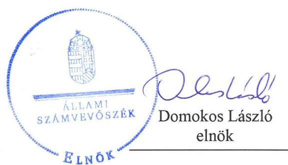
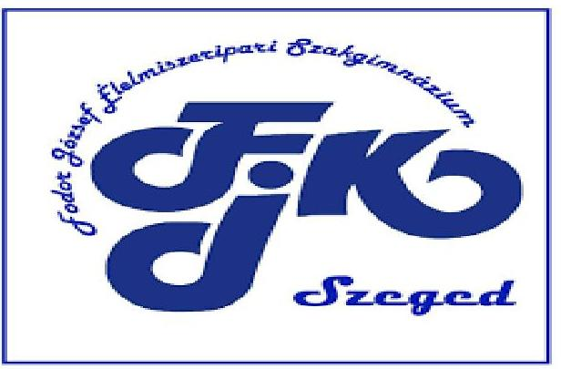
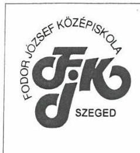
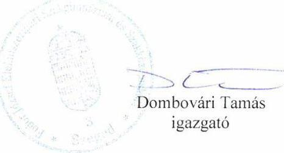
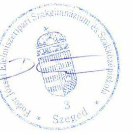
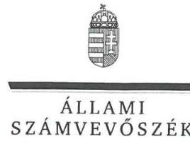
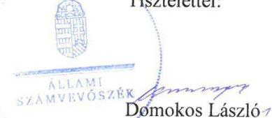

# Jelentés 

## Központi költségvetési szervek ellenőrzése

Fodor József Élelmiszeripari Szakgimnázium és Szakközépiskola 2019.

---

# Jelenetés 

## Központi költségvetési szervek ellenőrzése

Fodor József Élelmiszeripari Szakgimnázium és Szakközépiskola 2019. 12. hó 19. nap

---

# AZ ELLENŐRZÉST FELÜGYELTE:

DR. NAGY IMRE felügyeleti vezető

# AZ ELLENŐRZÉST VEZETTE ÉS A VÉGREHAJTÁSÁÉRT FELELŐS:

DR. GYŐRI GABRIELLA ellenőrzésvezető

# A PROGRAM ÖSSZEÁLLÍTÁSÁÉRT FELELŐS:

TÓTPÁL SZABOLCS osztályvezető

---

**IKTATÓSZÁM:** EL-2336-001/2019.

**TÉMASZÁM:** 2450

**ELLENŐRZÉS-AZONOSÍTÓ SZÁM:** V079153

---

Jelentéseink az Országgyűlés számítógépes hálózatán és az Interneta a www.asz.hu címen is olvashatóak.

---

# TARTALOMJEGYZÉK 

■ ÖSSZEGZÉS ..... 5
■ AZ ELLENŐRZÉS CÉLJA ..... 6
■ AZ ELLENŐRZÉS TERÜLETE ..... 7
■ AZ ELLENŐRZÉS HÁTTERE, INDOKOLTSÁGA ..... 8
■ A JELENTÉS LÉNYEGES KÉRDÉSKÖREI ..... 10
■ AZ ELLENŐRZÉS HATÓKÖRE ÉS MÓDSZEREI ..... 11
■ MEGÁLLAPÍTÁSOK ..... 13
■ JAVASLATOK ..... 16
■ MELLÉKLETEK ..... 19
I. sz. melléklet: Értelmező szótár ..... 19
■ FÜGGELÉKEK ..... 23
I. sz. függelék a jelentéshez ..... 23
II. sz. függelék: Észrevételek ..... 24
■ RÖVIDÍTÉSEK JEGYZÉKE ..... 33

---

.

---

# ÖSSZEGZÉS 

A szegedi székhelyü Fodor József Élelmiszeripari Szakgimnázium és Szakközépiskola belső kontrollrendszere és vagyongazdálkodása 2016-2017-ben, pénzügyi gazdálkodása 2016-ban nem biztositotta az átlátható és elszámoltatható közpénzfelhasználást, a felelős gazdálkodást és a vagyon megőrzését. A korrupció elleni védelmet nem biztositották.

## Az ellenőrzés társadalmi indokoltsága

Magyarország versenyképességének és a magyar gazdaság fejlődésének alapvető feltétele a magyar munkavállalók megfelelő szakmai képzettsége és felkészültsége, amelyben a szakképzési rendszernek döntő szerepe van. A mezőgazdaság vonatkozásában is kiemelten fontos ez, hiszen a magyar mezőgazdaság piaci versenyképességét és eredményességét nagymértékben befolyásolja az agrárszférában dolgozók képzettsége, felkészültsége. A szakképzés legjelentősebb színterei a szakképző iskolák. Az eredményes és célszerű szakképzés alapja és alapvető feltétele a szakképző intézmények közpénzekkel és a közvagyonnal való törvényes, átlátható és a korrupcióval szembeni védelmet biztosító múködése és gazdálkodása. Ezért ezen szervezetekkel szemben is alapvető társadalmi igény, hogy a rájuk bízott közpénzekkel, közvagyonnal szabályosan gazdálkodjanak. Emellett a szakképzésben részt vevő pedagógusok, tanulók és a szülők jogos elvárása, hogy a szakképző iskolák múködése átlátható és elszámoltatható legyen. Mindezen igényekkel összhangban, a közpénzügyek átláthatóságának előmozdítása, a közvagyon védelme érdekében került sor az agrárszakképző iskolák belső kontrollrendszerének és gazdálkodásának ellenőrzésére.

## Főbb megállapítások, következtetések, javaslatok

A Fodor József Élelmiszeripari Szakgimnázium és Szakközépiskolánál a belső kontrollrendszer nem biztosította az átlátható és elszámoltatható közpénzfelhasználást.

A Fodor József Élelmiszeripari Szakgimnázium és Szakközépiskola igazgatója az ellenőrzött időszakban nyilatkozatban értékelte a szervezet belső kontrollrendszerének minőségét, amely nem volt összhangban a jelen ellenőrzés során tapasztaltakkal. A Fodor József Élelmiszeripari Szakgimnázium és Szakközépiskolánál nem alakítottak ki a teljesítmény mérésére alkalmas követelményeket.

A jogszabályi előírás ellenére a Fodor József Élelmiszeripari Szakgimnázium és Szakközépiskola 2017. évi számviteli beszámolójának elkészítéséről nem gondoskodott, ezáltal nem biztosította költségvetési-, pénzügyi-, vagyoni helyzetének megbízható és valós bemutatását.

A jogszabályok által előírt integritást támogató kontrollok kiépítettségének hiányosságai miatt a Fodor József Élelmiszeripari Szakgimnázium és Szakközépiskolánál az integritási kontrollok kiépítése nem volt arányban a korrupciós kockázatokkal, így a korrupció elleni védelemről nem gondoskodtak.

Az Állami Számvevőszék a Fodor József Élelmiszeripari Szakgimnázium és Szakközépiskola igazgatójának nyolc javaslatot fogalmazott meg.

---

# AZ ELLENŐRZÉS CÉLJA 

AZ ELLENŐRZÉS CÉLJA annak megítélése volt, hogy az ellenőrzött intézményre vonatkozó irányító szervi feladatellátás a jogszabályi előírások betartásával történt-e; az intézménynél a belső kontrollrendszer kialakítása és múködtetése szabályszerű volt-e, biztosította-e az átlátható, szabályszerű, gazdaságos, hatékony és eredményes gazdálkodás feltételeit; az intézmény pénzügyi és vagyongazdálkodása megfelelt-e a jogszabályi előírásoknak és belső szabályzatainak. Az ellenőrzés keretében az ÁSZ ${ }^{1}$ értékelte az intézmény korrupciós kockázatainak kezelését szolgáló integritás kontrollok kiépítettségét és az integritás szemlélet érvényesülését, illetve, hogy az államháztartás központi alrendszerébe tartozó szervezet gazdálkodása során elszámoltatható volt és megfelelt-e annak az Alaptörvényben² meghatározott alapvetésnek, hogy Magyarország a kiegyensúlyozott, átlátható és fenntartható költségvetési gazdálkodás elvét érvényesíti. Az ÁSZ értékelte, hogy a központi költségvetési szervnél megteremtették-e a teljesítményellenőrzés feltételeit. Érvényesült-e a nemzeti vagyon kezelésének és védelmének célja, azaz a szervezet vagyona a közérdeket szolgálta, a közös szükségletek kielégítése és a természeti erőforrások megóvása, valamint a jövő nemzedékek szükségleteinek figyelembevétele mellett.

---

# AZ ELLENŐRZÉS TERÜLETE 

## Fodor József Élelmiszeripari Szakgimnázium és Szakközépiskola

A szegedi székhelyű Középiskolát ${ }^{3}$ 2013. augusztus 1-jén alapította a Vidékfejlesztési Minisztérium. A Középiskola köznevelési intézmény, közfeladata a nemzeti köznevelésről szóló 2011. évi CXC. törvény alapján nevelő-oktató munka folytatása. A Középiskola alaptevékenysége többek között a szakközépiskolai, szakiskolai nevelés-oktatás, a felnőttoktatás. Müködési területe országos.

Irányító szerve ${ }^{4}$ 2016. január 1. és 2017. december 31. között a Földművelésügyi Minisztérium volt (2018. május 18-ától Agrárminisztérium). A Középiskola önálló jogi személy. Gazdálkodási feladatait a Bedő Albert Erdészeti Szakképző Iskola és Kollégium látta el. Az Áht. ${ }^{5}$ rendelkezése szerinti átalakításra az ellenőrzött időszakban nem került sor.

A Középiskolát igazgató ${ }^{6}$ vezette, aki felett az irányító szervet vezető miniszter gyakorolta a kinevezési és munkáltatói jogokat. Az igazgató személyében 2016-2017. években nem történt változás.

A Középiskola alkalmazásában álló személyek foglalkoztatása közalkalmazotti jogviszonyban, munkajogviszonyban, illetve közfoglalkoztatási jogviszonyban történt. A Középiskola foglalkoztatottjai felett a munkáltatói jogokat az igazgató gyakorolta.

---

# AZ ELLENŐRZÉS HÁTTERE, INDOKOLTSÁGA 

Az államháztartás központi alrendszerének közpénz felhasználása, az intézmények által ellátott közfeladatok sokrétúsége, valamint a feladatellátásához rendelt vagyon nagyságrendje indokolja, hogy az ÁSZ ellenőrzéseket folytasson a pénzügyi és vagyongazdálkodás területén. Az ÁSZ az ellenőrzései során feltárja a gazdálkodást, a központi alrendszer intézményei átalakulását, átszervezését érintő szabályozások esetleges hiányosságait, a szabályozással nem érintett gazdálkodási területeket, rámutathat a vagyongazdálkodási tevékenység - ezen belül a tulajdonosi joggyakorlás és vagyonkezelés - esetleges szabálytalanságaira, értékeli az állami vagyon nyilvántartására és elszámolására vonatkozó eljárásokat.

Az államháztartás központi alrendszerébe tartozó szervezet vagyona a nemzeti vagyon része és az Alaptörvény is rögzíti, hogy a vagyonnal való gazdálkodás célja a közérdek szolgálata. Az ÁSZ ellenőrzi az éves költségvetési törvény végrehajtását, az ellenőrzés során feltárt kockázatok és a terület folyamatos kockázatelemzésével beazonosított kockázatok kezelése érdekében ráépülő ellenőrzésekkel ellenőrzi a költségvetési szervek gazdálkodását, működését, hogy az ellenőrzések megállapításaival támogassa az ellenőrzött szervezetek szabályszerű gazdálkodását, javaslataival elősegítse az Alaptörvényben megfogalmazott alapvetések érvényesülését a mindennapi életben a szervezetek szintjén. A központi költségvetés rendszerében zajló folyamatok holisztikus elemzései, a kockázatok folyamatos figyelemmel kísérésének módszerével, az így kiválasztott szervezetek célzott, hatékony ellenőrzéseivel az ÁSZ betölti a legfőbb gazdasági ellenőrző szerv küldetését.

Az ellenőrzés várhatóan hozzájárul a központi intézmények pénzügyi helyzetének pontosabb megítéléséhez, és a jó gyakorlat kialakításán és terjesztésén keresztül az ellenőrzések elősegíthetik a gazdálkodás szabályszerűségének javítását.

A belső kontrollrendszer kialakítása és működtetése nélkül nem valósítható meg a közpénzek, a közvagyon átlátható, szabályos, gazdaságos, hatékony és eredményes felhasználása. A belső kontrollrendszer azt a célt szolgálja, hogy a költségvetési szervek működésük és gazdálkodásuk során a tevékenységeket szabályszerűen hajtsák végre, teljesítsék elszámolási kötelezettségeiket és megvédjék az erőforrásokat a veszteségektől, a károktól és a nem rendeltetésszerű használattól. A belső kontrollrendszer magában foglalja mindazon elveket, eljárásokat és belső szabályzatokat, melyek biztosítják, hogy a költségvetési szerv valamennyi tevékenysége és célja összhangban legyen a szabályszerűséggel, szabályozottsággal, valamint a gazdaságosság, hatékonyság és eredményesség követelményeivel, az eszközökkel és forrásokkal való gazdálkodásban ne kerüljön sor pazarlásra, visszaélésre, rendeltetésellenes felhasználásra. Megfelelő, pontos és naprakész információk álljanak rendelkezésre a költségvetési szerv múködésével kapcsolatosan, és a belső kontrollrendszer harmonizációjára, öszszehangolására vonatkozó jogszabályok végrehajtásra kerüljenek. Az integritás kontrollok kiépítése, erősítése a szervezet korrupciós kockázatainak

---

kezelését szolgálja. A teljesítménykövetelmények meghatározása és múködtetése megalapozhatja a központi költségvetési szervnél a teljesítményellenőrzés lefolytatását.

Az egyes ellenőrzések megállapításaival és egy időszak ellenőrzési eredményeinek elemzésével az ÁSZ ráirányíthatja a jogalkotók figyelmét a központi alrendszerben vagy annak egy ágazatában esetlegesen felmerülő pénzügyi, szabályozási feszültségekre. Az elvégzett ellenőrzések során az ÁSZ „jó gyakorlatokat" is azonosíthat, melyeket tanácsadó funkciója keretében szélesebb körben is megismertethet az érintettekkel, ezáltal is hozzájárulva a költségvetési rendszer szabályozott, átlátható, kiegyensúlyozott és fenntartható múködéséhez.

Az ellenőrzés a szervezet kockázatértékelése alapján, az egyedi és lényeges jellemzők figyelembevételével történt.

---

# A JELENTÉS LÉNYEGES KÉRDÉSKÖREI 

1.     - Az irányító szerv ellenőrzött költségvetési szervre vonatkozó feladatellátása szabályszerű volt-e?
2.     - A belső kontrollrendszer kialakítása és müködtetése biztositotta-e a közpénzekkel és a nemzeti vagyonnal történő szabályszerű gazdálkodást?
3.     - A költségvetési szerv pénzügyi- és vagyongazdálkodása szabályszerű volt-e?

---

# AZ ELLENŐRZÉS HATÓKÖRE ÉS MÓDSZEREI 

## Az ellenőrzés típusa

Megfelelőségi ellenőrzés.

## Az ellenőrzött időszak

2016. év az irányító szervi feladatellátás és a pénzügyi gazdálkodás esetén, 2016-2017. évek a vagyongazdálkodás, valamint a belső kontroll rendszer ellenőrzése tekintetében, továbbá az integritás kontrollok esetében a 2017. év.

## Az ellenőrzés tárgya

A Középiskolára vonatkozó 2016. évi irányító szervi feladatok ellátása. A Középiskola 2016-2017. évi belső kontrollrendszerének kialakítása és működtetése, továbbá vagyongazdálkodása. A Középiskola 2016. évi pénzügyi gazdálkodása. 2017. évre vonatkozóan a Középiskolánál az integritáskontrollok kiépítettsége, az integritás szemlélet érvényesülése, valamint a teljesítményellenőrzés feltételeinek rendelkezésre állása volt. A vagyongazdálkodás ellenőrzésének keretében az ÁSZ ellenőrizte a vagyongazdálkodás feltételeinek kialakítását, annak szabályszerűségét, az elszámoltathatóság biztosítását a szabályozás szintjén. A vagyonváltozást eredményező döntéseket, a vagyonban bekövetkezett változások végrehajtását, nyilvántartásba vételének, elszámolásának szabályszerűségét. A könyveiben, mérlegében az állami vagyon kimutatásának szabályszerűségét, ennek keretében az állami vagyonnal történő rendelkezést, a vagyonmozgásokat, a vagyon nyilvántartásba vételét, értékelését és a mérleg alátámasztás szabályszerűségét.

Az ellenőrzés kiterjedt minden olyan körülményre és adatra, amely az ÁSZ jogszabályban meghatározott feladatainak teljesítéséhez, valamint a program végrehajtása folyamán felmerült újabb összefüggések feltárásához szükséges volt.

## Az ellenőrzött szervezet

Fodor József Élelmiszeripari Szakgimnázium és Szakközépiskola, a gazdálkodási feladatokat ellátó Bedő Albert Erdészeti Szakképző Iskola és Kollégium, valamint az Agrárminisztérium.

---

# Az ellenőrzés jogalapja 

Az ellenőrzés jogszabályi alapját az ÁSZ tv. ${ }^{7} 1 . \S$ (3) bekezdése, az 5. § (2)(4) és (6) bekezdései, valamint az Áht. 61. § (2) bekezdésének előírásai képezték.

## Az ellenőrzés módszerei

Az ellenőrzésre a szakmai program szempontjai, az ellenőrzött időszakban hatályos jogszabályok, az ellenőrzés szakmai szabályai, a jelen ellenőrzésre irányadó ÁSZ módszertanok figyelembevételével került sor.

Az ellenőrzés ideje alatt az ellenőrzött szervezetekkel a kapcsolattartást az ÁSZ SZMSZ ${ }^{8}$-ének vonatkozó előírásai alapján biztosította az ÁSZ.

Az ellenőrzési kérdések megválaszolásához szükséges bizonyítékok megszerzése az ellenőrzött szervezetek által rendelkezésre bocsátott dokumentumokra, adatokra alapozva megfigyelés, szemle (szemrevételezés), kérdésfeltevés (információkérés), valamint elemző eljárás útján történt.

Az ellenőrzési bizonyítékként felhasználható adatforrások közé tartoztak egyrészt a szakmai program részletes szempontjainál felsorolt adatforrások, másrészt minden egyéb - az ellenőrzés folyamán feltárt, az ellenőrzés szempontjából információt tartalmazó - dokumentum.

Az ellenőrzés lefolytatásához az ellenőrzött szervezetek a tanúsítványok kitöltésével, valamint az ÁSZ által kért dokumentumok megküldésével szolgáltattak adatokat, amelyek valódiságát és teljes körűségét az ellenőrzött szervezet vezetője által tett teljességi és hitelességi nyilatkozat igazolta. Az így rendelkezésre bocsátott adatok, információk kontrollja az ellenőrzés keretében történt.

A központi költségvetési szerv belső kontrollrendszere egyes pilléreinek kialakítására és működtetésére vonatkozó értékelés:
$\longrightarrow$ „szabályszerü", amennyiben az értékelt területen az elért „igen" válaszok százalékban kifejezett, egész számra kerekített aránya legalább $85 \%$,
$\longrightarrow$ „nem szabályszerü", ha nem érte el a $85 \%$-ot,
A központi költségvetési szerv belső kontrollrendszerének összesített értékelése az egyes részterületek esetében kapott megfelelőségi arányok számtani átlaga alapján történt és megegyezett a pillérenként (kontrollterületenként) alkalmazott százalékos értékelésekkel, a következő eltérésekkel: a kontrollrendszer egésze esetében a „szabályszerü" értékelésnek a százalékos értéken felül további feltétele volt, hogy egyik kontrollterület sem kaphatott „nem szabályszerü" értékelést.

Mintavételre számviteli beszámoló hiányában nem került sor.

---

# 1. Az irányító szerv ellenőrzött költségvetési szervre vonatkozó feladatellátása szabályszerű volt-e? 

## Összegző megállapítás Az irányító szerv Középiskolára vonatkozó feladatellátása szabályszerű volt a 2016. évben.

Az irányító szerv a Középiskola alapító okirat ${ }_{1,2}{ }^{9}$-jét az Ávr. ${ }^{10}$-ben foglaltakkal összhangban adta ki. Az irányítási jogosultságok keretében jóváhagyta a Középiskola elemi költségvetését, éves költségvetési beszámolóját. A Középiskolánál vezetői kinevezésre, felmentésre nem került sor.

## 2. A belső kontrollrendszer kialakítása és múködtetése biztosí-totta-e a közpénzekkel és a nemzeti vagyonnal történő szabályszerű gazdálkodást?

## Összegző megállapítás

A Középiskola belső kontrollrendszerének kialakítása és múködtetése nem volt szabályszerű.
2016. ÉVBEN a Középiskola belső kontrollrendszerének kialakítása nem volt szabályszerű, mivel

- 2016. évben a Középiskola nem rendelkezett a Számv. tv. ${ }^{11} 14 . \S$ (3) bekezdésében előírt számviteli politikával, valamint a Számv. tv. 14. § (5) bekezdés b) pontjában foglalt eszközök és a források értékelési szabályzatával;
- a Középiskola 2016. január 1-je és 2016. szeptember 1-je között nem rendelkezett az Áht. 10. § (5) bekezdésében előírtak ellenére szervezeti és működési szabályzattal.

2017. ÉVBEN a Középiskola belső kontrollrendszerének kialakítása és múködtetése nem volt szabályszerű:

A KONTROLLKÖRNYEZET keretében a Középiskola 2017. augusztus 31-ig nem rendelkezett a Számv. tv. 14. § (3) bekezdésében foglaltak ellenére számviteli politikával, illetve a Számv. tv. 14. § (5) bekezdés b) pontjában foglaltak ellenére az eszközök és a források értékelési szabályzatával. A Középiskolánál a Vnytv. ${ }^{12}$ 11. § (6) bekezdésében előírtak ellenére nem gondoskodtak 2017. évben a vagyonnyilatkozatok átadására és nyilvántartására, továbbá a vagyonnyilatkozatban foglalt személyes adatok védelmére vonatkozó szabályzat elkészítéséről. Nem rendelkezett a Középiskola továbbá 2017-ben a Számv. tv. 161. § (1) bekezdésében foglaltak ellenére számlarenddel.

---

# AZ INTEGRÁLT KOCKÁZATKEZELÉSI RENDSZER 

működtetéséről 2017. évben a Bkr. ${ }^{13}$ 3. § b) pontjában és a 7. § (1)-(2) bekezdéseiben foglaltak ellenére a Középiskola igazgatója nem gondoskodott. A Bkr. 7. § (4) bekezdésében előírtak ellenére a kockázatkezelési rendszer koordinálásának szervezeti felelősét a Középiskola igazgatója 2017. évben nem jelölte ki.

A KONTROLLTEVÉKENYSÉG gyakorlása nem volt szabályszerű, mert a Középiskola 2017. szeptember 1-ig az Ávr. 60. § (3) bekezdésében foglalt előírás ellenére nem vezetett nyilvántartást a kötelezettségvállalásra és teljesítés igazolására jogosult személyekről és aláírás-mintájukról.

AZ INFORMÁCIÓS ÉS KOMMUNIKÁCIÓS folyamatok működtetése 2017. évben nem volt szabályszerű. A Bkr. 3. § d) pontjában és a Bkr. 9. § (1) bekezdésében foglaltak ellenére az információs és kommunikációs rendszer kialakításáról, működtetéséről a Középiskola igazgatója nem gondoskodott. Nem szabályozta az Ávr. 13. § (2) bekezdés h) pontjában foglaltak ellenére a közérdekű adatok megismerésére irányuló kérelmek intézésének rendjét, továbbá a kötelezően közzéteendő adatok nyilvánosságra hozatalának rendjét.

A MONITORING RENDSZER működtetése nem volt szabályszerű. A monitoring rendszer részeként az operatív tevékenységek keretében megvalósuló folyamatos és eseti nyomon követés működtetéséről a Középiskola igazgatója a Bkr. 3. § e) pontjában és 10. §-ában foglaltak ellenére 2017. évben nem gondoskodott. A Középiskola 2017. évre vonatkozóan a Bkr. 15. § (4) bekezdésében foglaltak ellenére az irányító szerv vezetőjének írásos jóváhagyása nélkül kötött szerződést a belső ellenőrzési feladatok ellátására.

A Középiskola igazgatója 2017. évre vonatkozóan a Bkr. 1. melléklete szerinti nyilatkozatban értékelte a Középiskola belső kontrollrendszerének minőségét, amely nem volt összhangban a jelen ellenőrzés során tapasztaltakkal.

A teljesítmény mérésére alkalmas követelményeket a Középiskola nem alakított ki. A Középiskolánál a jogszabályok által előírt integritás kontrollok kiépítettségi szintje nem támogatta a szervezet integritás szerinti múködését.

## 3. A költségvetési szerv pénzügyi- és vagyongazdálkodása szabályszerű volt-e?

## Összegző megállapítás A pénzügyi- és vagyongazdálkodás nem volt szabályszerű.

A Középiskolánál a pénzügyi gazdálkodással kapcsolatos feladatok ellátása 2016-ban nem volt szabályszerű, mivel a Középiskola 2016. évben nem rendelkezett a Számv. tv. ${ }^{14}$ 14. § (3) bekezdésében előírt számviteli politikával.

---

A Középiskolánál a vagyongazdálkodással kapcsolatos feladatok ellátása 2016-2017-ben nem volt szabályszerű, mert a Középiskola nem rendelkezett 2016-ban a Számv. tv. 14. § (5) bekezdés b) pontjában foglalt eszközök és a források értékelési szabályzatával, valamint 2017-ben az Áht. 87. § a) pontjában és az Áhsz. ${ }^{15}$ 5. § (1) bekezdésében foglaltak szerinti 2017. évre vonatkozó költségvetési beszámolóval.

---

# JAVASLATOK 

Az ÁSZ tv. 33. § (1) bekezdésében foglaltak értelmében az ellenőrzött szervezet vezetője köteles a jelentésben foglalt megállapításokhoz kapcsolódó intézkedési tervet összeállítani és azt a jelentés kézhezvételétől számított 30 napon belül az ÁSZ részére megküldeni. Amennyiben az ellenőrzött szervezet vezetője nem küldi meg határidőben az intézkedési tervet, vagy továbbra sem elfogadható intézkedési tervet küld, az Állami Számvevőszék elnöke az ÁSZ tv. 33. § (3) bekezdése a) és b) pontjaiban foglaltakat érvényesítheti.

## Fodor József Élelmiszeripari Szakgimnázium és Szakközépiskola igazgatójának

1. Intézkedjen a vagyonnyilatkozat átadására, nyilvántartására, a vagyonnyilatkozatban foglalt személyes adatok védelmére vonatkozó további szabályok szabályzatban történő megállapítására a jogszabályi előírásnak megfelelően.
(2. sz. megállapítás 3. bekezdés 2. mondata alapján)
2. Intézkedjen számlarend elkészítéséről a jogszabályi előírásnak megfelelően.
(2. sz. megállapítás 3. bekezdés 3. mondata alapján)
3. Intézkedjen az integrált kockázatkezelési rendszer müködtetéséről a jogszabályi előírásnak megfelelően.
(2. sz. megállapítás 4. bekezdés 1. mondata alapján)
4. Intézkedjen az integrált kockázatkezelési rendszer koordinálására szervezeti felelős kijelöléséről a jogszabályi előírásnak megfelelően.
(2. sz. megállapítás 4. bekezdés 2. mondata alapján)
5. Intézkedjen az információs és kommunikációs rendszer kialakításáról, müködtetéséről a jogszabályi előírásnak megfelelően.
(2. sz. megállapítás 6. bekezdés 2. mondata alapján)
6. Intézkedjen, hogy belső szabályzatban rendezze a közérdekü adatok megismerésére irányuló kérelmek intézésének, továbbá a kötelezően közzéteendő adatok nyilvánosságra hozatalának rendjét.
(2. sz. megállapítás 6. bekezdés 3. mondata alapján)

---

7. Kezdeményezze, hogy a belső ellenőrzés kialakítása a jogszabályi előírásnak megfelelően történjen.
(2. sz. megállapítás 7. bekezdés 3. mondata alapján)
8. Intézkedjen a jövőben költségvetési beszámoló elkészítéséről a jogszabályi előírásnak megfelelően.
(3. sz. megállapítás 2. bekezdés 1. mondat 3. mondatrész alapján)

---

.

---

# MELLÉKLETEK 

- I. SZ. MELLÉKLET: ÉRTELMEZŐ SZÓTÁR
állami vagyon
állami vagyonnak minősül:
a) az állam tulajdonában lévő dolog, valamint a dolog módjára hasznosítható természeti erő,
b) az a) pont hatálya alá nem tartozó mindazon vagyon, amely vonatkozásában törvény az állam kizárólagos tulajdonjogát nevesíti,
c) az állam tulajdonában lévő tagsági jogviszonyt megtestesítő értékpapír, illetve az államot megillető egyéb társasági részesedés,
d) az államot megillető olyan immateriális, vagyoni értékkel rendelkező jogosultság, amelyet jogszabály vagyoni értékű jogként nevesít. (Forrás: Vtv. 1. § (2) bekezdése)
állami vagyon használója Az a természetes vagy jogi személy, jogi személyiséggel nem rendelkező szervezet, aki, vagy amely törvény vagy szerződés alapján, bármely jogcímen (bérlet, haszonbérlet, használat stb.) állami vagyont birtokol, használ, szedi annak hasznait, hasznosít, ide nem értve a haszonélvezőt, a vagyonkezelőt és a tulajdonosi jogok gyakorlóját. (Forrás: Vtvr. 1. § (7) bekezdés a) pontja)
állami vagyon hasznosítása Az állami vagyont az MNV Zrt. maga kezeli, vagy szerződés - így különösen bérlet, haszonbérlet, megbízás - alapján központi költségvetési szervnek, természetes vagy jogi személynek, vagy jogi személyiséggel nem rendelkező gazdálkodó szervezetnek hasznosításra átengedi.
(Forrás: Vtv. 23. § (1) bekezdése, hatályos 2012. január 1-jétől)
Az állami vagyonnal a tulajdonosi joggyakorló maga gazdálkodik, vagy szerződés - így különösen bérlet, haszonbérlet, megbízás - alapján hasznosításra átengedi, illetőleg vagyonkezelésbe, haszonélvezetbe adja. (Forrás: Vtv. 23. § (1) bekezdése, hatályos 2013. június 28 -ától)
az állami vagyont az MNV Zrt. maga kezeli, vagy szerződés - így különösen bérlet, haszonbérlet, megbízás - alapján központi költségvetési szervnek, természetes vagy jogi személynek, vagy jogi személyiséggel nem rendelkező gazdálkodó szervezetnek hasznosításra átengedi." Az állami vagyonra vonatkozóan az MNV Zrt. kizárólag az Nvtv.-ben meghatározott személyekkel köthet vagyonkezelési szerződést. (Forrás: Vtv. 27. § (1) bekezdése, hatályos 2012. január 1-jétől)
belső ellenőrzés
belső kontrollrendszer
belső kontrollrendszer területei

Független, tárgyilagos bizonyosságot adó és tanácsadó tevékenység, amelynek célja, hogy az ellenőrzött szervezet működését fejlessze és eredményességét növelje, az ellenőrzött szervezet céljai elérése érdekében rendszerszemléletű megközelítéssel és módszeresen értékeli, illetve fejleszti az ellenőrzött szervezet irányítási és belső kontrollrendszerének hatékonyságát. (Forrás: Bkr. 2. § b) pontja)
A belső kontrollrendszer a kockázatok kezelése és tárgyilagos bizonyosság megszerzése érdekében kialakított folyamatrendszer, amely azt a célt szolgálja, hogy a müködés és gazdálkodás során a tevékenységeket szabályszerűen, gazdaságosan, hatékonyan, eredményesen hajtsák végre, az elszámolási kötelezettségeket teljesítsék, megvédjék az erőforrásokat a veszteségektől, károktól és nem rendeltetésszerű használattól. (Forrás: Áht. 69. § (1) bekezdése)
A kontrollkörnyezet, a kockázatkezelési rendszer, a kontrolltevékenységek, az információs és kommunikációs rendszer, valamint a nyomon követési (monitoring) rendszer. (Forrás: Bkr. 3. §-a)

---

információs és kommunikációs rendszer
integritás
integrált kockázatkezelési rendszer
irányító szerv/felügyeleti szerv
kockázat
kockázatkezelési rendszer
kontrollkörnyezet
kontrolltevékenységek
közfeladat
maradvány
nyomon követési rendszer (monitoring)

A költségvetési szerv vezetője által kialakított és működtetett olyan rendszer, mely biztosítja, hogy a megfelelő információk a megfelelő időben eljutnak az illetékes szervezethez, szervezeti egységhez, illetve személyhez. (Forrás: Bkr. 9. § (1) bekezdés)
Az integritás - egyik gyakran használt jelentése szerint - az elvek, értékek, cselekvések, módszerek, intézkedések konzisztenciáját jelenti, vagyis olyan magatartásmódot, amely meghatározott értékeknek megfelel. Integritás-irányítási rendszer bevezetése a szervezetben a szervezethez rendelt közfeladatok integritás szempontú ellátását, az érték alapú múködéssel (integritással) összefüggő szervezeti követelmények következetes érvényesítését jelenti. (Forrás: Nemzetgazdasági Minisztérium: Államháztartási Belső Kontroll Standardok és Gyakorlati Útmutató 1.6. Etikai értékek és integritás 46. oldal, 2017. szeptember)
Olyan folyamatalapú kockázatkezelési rendszer, amely a szervezet minden tevékenységére kiterjed, egységes módszertan és eljárások alkalmazásával, a szervezet célkitűzéseinek és értékeinek figyelembevételével biztosítja a szervezet kockázatainak teljes körű azonosítását, azok meghatározott kritériumok szerinti értékelését, valamint a kockázatok kezelésére vonatkozó intézkedési terv elkészítését és az abban foglaltak nyomon követését. (Forrás: Bkr. 2. § m) pontja, 2016. október 1-jétől)
A költségvetési szerv tekintetében az Áht.-ban meghatározott irányítási hatáskört gyakorló szerv. (Forrás: Áht. 1. § 9. pontja)
A kockázat annak a valószínűségét jelenti, hogy egy vagy több esemény vagy intézkedés nem kívánt módon befolyásolja a rendszer múködését, céljainak megvalósulását. (Forrás: Javaslatok a korrupciós kockázatok kezelésére - Kockázatkezelési és ellenőrzési módszertan 35. oldal, ÁSZ)
Olyan irányítási eszközök és módszerek összessége, melynek elemei a szervezeti célok elérését veszélyeztető tényezők (kockázatok) azonosítása, elemzése, csoportosítása, nyomon követése, valamint szükség esetén a kockázati kitettség mérséklése.(Forrás: Bkr. 2. § m) pontja)
A költségvetési szerv vezetője által kialakított olyan elvek, eljárások, belső szabályzatok összessége, amelyben világos a szervezeti struktúra, a folyamatok átláthatók, egyértelmúek a felelősségi, hatásköri viszonyok és feladatok, meghatározottak, ismertek és elfogadottak az etikai elvárások a szervezet minden szintjén, átlátható a humán-erőforrás-kezelés. (Forrás: Bkr. 6. § (1) bekezdés)
A költségvetési szerv vezetője által a szervezeten belül kialakított (kontroll) tevékenységek, melyek biztosítják a kockázatok kezelését, hozzájárulnak a szervezet céljainak eléréséhez és erősítik a szervezet integritását. (Forrás: Bkr. 8. § (1) bekezdés)
Jogszabályban meghatározott állami vagy önkormányzati feladat, amit az arra kötelezett közérdekből, a jogszabályban meghatározott követelményeknek és feltételeknek megfelelve végez, ideértve a lakosság közszolgáltatásokkal való ellátását, továbbá az állam nemzetközi szerződésekben vállalt kötelezettségeiből adódó közérdekű feladatokat, valamint e feladatok ellátásakor szükséges infrastruktúra biztosítását is. (Forrás: Nvtv. 3. § (1) bekezdés 7. pontja)
A költségvetési év során a bevételek és kiadások különbözete, amely az alaptevékenység bevételei és kiadásai tekintetében a költségvetési maradvány, a vállalkozási tevékenység bevételei és kiadásai tekintetében a vállalkozási maradvány. (Forrás: Áht. 1. § 17. pont)
A költségvetési szerv vezetője köteles kialakítani a szervezet tevékenységének a célok megvalósításának nyomon követését biztosító rendszert, amely az operatív tevékenységek keretében megvalósuló folyamatos és eseti nyomon követésből, valamint az operatív tevékenységektől függetlenül múködő belső ellenőrzésből áll. (Forrás: Bkr. 10. §)

---

vagyongazdálkodás

A nemzeti vagyongazdálkodás feladata a nemzeti vagyon rendeltetésének megfelelő, az állam, az önkormányzat mindenkori teherbíró képességéhez igazodó, elsődlegesen a közfeladatok ellátásához és a mindenkori társadalmi szükségletek kielégítéséhez szükséges, egységes elveken alapuló, átlátható, hatékony és költségtakarékos múködtetése, értékének megőrzése, állagának védelme, értéknövelő használata, hasznosítása, gyarapítása, továbbá az állam vagy a helyi önkormányzat feladatának ellátása szempontjából feleslegessé váló vagyontárgyak elidegenítése. (Forrás: Nvtv. 7. § (2) bekezdése)

---

.

---

# FÜGGELÉKEK 

- I. SZ. FÜGGELÉK A JELENTÉSHEZ

Az Állami Számvevőszék az ellenőrzések során feltárt tényekhez kapcsolódó további körülmények tisztázására eszközrendszerrel nem rendelkezik. Amennyiben az ellenőrzésen túlmutatóan indokoltnak látszik az ellenőrzés során feltárt körülmények további vizsgálata, az Állami Számvevőszék törvényi felhatalmazás alapján az ellenőrzés által feltárt körülményeket továbbítja a hatáskörrrel rendelkező szervnek a szükséges intézkedések megtétele, eljárások lefolytatása érdekében.
Az ellenőrzése feltárta, hogy

1. a Középiskola nem rendelkezett 2017-ben a Számv. tv. 161. § (1) bekezdésében foglaltak ellenére számlarenddel, 2017. augusztus 31-ig a Számv. tv. 14. § (3) bekezdése ellenére számviteli politikával, valamint a Számv. tv. 14. § (5) bekezdés b) pontja ellenére eszközök és források értékelési szabályzatával;
2. a Középiskolánál nem gondoskodtak 2017. évben a Vnytv. 11. § (6) bekezdésében előírtak ellenére a vagyonnyilatkozatok átadására és nyilvántartására, továbbá a vagyonnyilatkozatban foglalt személyes adatok védelmére vonatkozó szabályzat elkészítéséről;
3. a Középiskola 2017. szeptember 1-ig az Ávr. 60. § (3) bekezdésében foglalt előírás ellenére nem vezetett nyilvántartást a kötelezettségvállalásra és teljesítés igazolására jogosult személyekről és aláírás-mintájukról;
4. a Középiskola nem rendelkezett 2017. évre vonatkozó, az Áht. 87. § a) pontjában és az Áhsz. 5. § (1) bekezdésében foglaltak szerinti éves költségvetési beszámolóval.
Nem zárható ki, hogy a Középiskola feladatkörébe nem tartozó kifizetések kerültek elszámolásra, és az sem, hogy a fenti szabálytalanságok miatt a Középiskolát vagyoni hátrány érte.
Az 1-4. pontokban rögzített esetek körülményeinek felderítésére az ügyészség rendelkezik hatáskörrel.

---

A jelentéstervezetet a Számvevőszék 15 napos észrevételezésre megküldte az ellenőrzött szervezetek vezetőinek az ÁSZ tv. 29. §* (1) bekezdése előirásának megfelelően.

A Fodor József Élelmiszeripari Szakgimnázium és Szakközépiskola igazgatója a jelentéstervezet megállapításaira írásban észrevételt tett. Az Agrárminisztériumot vezető miniszter és a Bedő Albert Erdészeti Szakképző Iskola és Kollégium igazgatója nem tett észrevételt.
Az ÁSZ tv. 29. § (3) bekezdésével összhangban az ÁSZ a Függelékben feltünteti az ellenőrzés megállapításaival kapcsolatban tett, figyelembe nem vett észrevételeket, és megindokolja, hogy azokat miért nem fogadta el.

[^0]
[^0]:    * 29. § (1) Az Állami Számvevőszék az ellenőrzési megállapításait megküldi az ellenőrzött szervezet vezetőjének vagy az általa megbízott személynek, és annak, akinek személyes felelősségét állapította meg.
    (2) Az ellenőrzött szervezet vezetője és a felelősként megjelölt személy az ellenőrzés megállapításaira tizenöt napon belül írásban észrevételt tehet.
    (3) Az Állami Számvevőszék az észrevételre a beérkezésétől számított harminc napon belül írásban válaszol. A figyelembe nem vett észrevételeket köteles a jelentésben feltüntetni, és megindokolni, hogy azokat miért nem fogadta el.

---

# Fodor József Élelmiszeripari Szakgimnázium és Szakközépiskola OM azonosító: 202742 

6725 Szeged, Szabadkai út 3.
Telefon/fax: (62) 548 - 964
E-mail: fodor@fodorj-szeged.sulinet.hu
Web: http://fjk.sulinet.hu
Iktatószám: FJ/22-2019/31
Úgyintéző: Deszponé Simon Orsolya

Állami Számvevőszék
1052 Budapest
Apáczai Csere János u. 10.

Tisztelt Állami Számvevőszék!

Az EL-1158-058/2019 iktatószámú levelükre hivatkozva, mellékelten megküldöm a Fodor József Élelmiszeripari Szakgimnázium és Szakközépiskola észrevételeit, valamint intézkedési tervét.

Szeged, 2019. október 28.

Tisztelettel:

---

# Számvevőszéki jelentés tervezet 

Megállapítás: Számviteli politika hiánya 2016. évben

## Észrevétel:

2015.09.01-től Intézményünk rendelkezett Számviteli politikával, de tévesen csak a 2017. évi került becsatolásra. Mellékeljük a 2015. évi Számviteli politikát, mely a kérdéses időszakban érvényes volt.

Megállapítás: Eszközök és források értékelési szabályzat hiánya 2016. évben

## Észrevétel:

2015.09.01-től Intézményünk rendelkezett Eszközök és források értékelési szabályzatával, de tévesen csak a 2017. évi került becsatolásra. Mellékeljük a 2015. évi Eszközök és források értékelési szabályzatát, mely a kérdéses időszakban érvényes volt.

Megállapítás: SZMSZ hánya 2016.01.01-2016.09.01 között.

## Észrevétel:

2013.09.01-től Intézményünk rendelkezett SZMSZ-el, ami hatályos volt 2016.08.31-ig, de ez tévesen, nem került felrögzítésre az adatszolgáltatásba. Úgy ítéltük meg, hogy az aktuális szabályzat kerüljön feltöltésre. Mellékelten megküldjük a 2013.09.01-tól hatályos SZMSZ-t.
2017. év

Megállapítás: Számviteli politika hiánya, Eszközök és források értékelési szabályzat hiánya

## Észrevétel:

Intézményünk 2015.09.01-tól rendelkezett Számviteli politikával és Eszközök és források értékelési szabályzatával, de tévesen a 2017. évi került becsatolásra, mert úgy ítéltük meg, hogy az aktuális szabályzat kerüljön feltöltésre. Emiatt a vizsgált időszakra vonatkozó szabályzatok sajnos nem teljes körúen lettek feltöltve. Mellékeljük a 2015. évi Számviteli politikát valamint az Eszközök és források értékelési szabályzatát.

Megállapítás: Vagyonnyilatkozatok átadására és nyilvántartására, továbbá a vagyonnyilatkozatokban foglalt személyes adatok védelmére vonatkozó szabályzat hiánya

Észrevétel:
2018.01.01 -tól az iskola már rendelkezik a fent megnevezett szabályzattal, melyet mellékelünk.

Megállapítás: Számlarend hiánya

## Észrevétel:

Intézményünk 2015.10.01-tól rendelkezett számlarenddel, de tévesen a 2017. évi került becsatolásra, mert úgy ítéltük meg, hogy az aktuális szabályzat kerüljön feltöltésre. Emiatt a vizsgált időszakra vonatkozó szabályzatok sajnos nem teljes körúen lettek feltöltve.

---

Megállapítás: Integrált kockázatkezelési rendszer. Kockázatkezelési rendszer koordinálásának szervezeti felelősét a Középiskola igazgatója 2017. évben nem jelölte ki.

Észrevétel:
Intézményünk 2019.01.01 óta rendelkezik a jogszabályoknak megfelelő Integrált kockázatkezelési rendszerrel, mely tartalmazza a rendszer szervezeti felelősét is. Mellékelten megküldjük az Integrált kockázatkezelés eljárásrendjét.

Megállapítás: 2017.09.01-ig nem vezetett nyilvántartást a kötelezettségvállalásra és teljesitésigazolására jogosult személyekröl és aláirás mintájukról.

Észrevétel:
Intézményünk 2015.09.01-től rendelkezett Számviteli politikával és Eszközök és források értékelési szabályzatával, de tévesen a 2017. évi került becsatolásra, mert úgy ítéltük meg, hogy az aktuális szabályzat kerüljön feltöltésre. Emiatt a vizsgált időszakra vonatkozó szabályzatok sajnos nem teljes körúen lettek feltöltve.

Megállapítás: Információs és kommunikációs folyamatok müködtetéséről a középiskola igazgatója nem gondoskodott. Nem szabályozta a közérdekü adatok megismerésére irányuló kérelmek intézésének rendjét, továbbá a kötelezöen közéteendő adatok nyilvánosságra hozatalának rendjét

Észrevétel:
Az intézmény 2019. 01. 01. óta rendelkezik Információs és kommunikációs szabályzattal, valamint Közérdekú adatok kezelésének rendje szabályzattal, melyeket csatolunk. Belső és külső kommunikációs szabályzat/ Közérdekú adatok kezelésének rendje

Megállapítás: A monitoring rendszer részeként az operativ tevékenységek keretében megvalósuló folyamatos és eseti nyomon követés müködtetéséről a Középiskola igazgatója a Bkr. 3. § e) pontjában és 10. §-ában foglaltak ellenére 2017. évben nem gondoskodott.

Észrevétel:
Az előzőekben említett Integrált kockázatkezelési rendszer tartalmazza a folyamatos és eseti nyomon követést.

Megállapítás: A Középiskola 2017. évre vonatkozóan a Bkr. 15§ (4) bekezdésében foglaltak ellenére az irányitó szerv vezetöjének irásos jóváhagyása nélkül kötött szerzödést a belsö ellenörzési feladatok ellátására

Észrevétel:
A belső ellenőrrel való szerződés 2016.11.9-én került aláírásra. A törvényi szabályozás változása 2017.01.01-én lépett hatályba. Mivel az iskola már rendelkezett érvényes szerződéssel, ezért az iskola és a gazdasági szervezetet múködtető Bedő Albert Erdészeti Szakgimnázium, Szakközépiskola és Kollégium szóbeli megállapodása alapján, a 2017. évre vonatkozó belső ellenőrzési feladatokat még az iskola önálló hatáskörben látta el.

---

Megállapítás: A teljesitmény mérésére alkalmas követelményeket a Középiskola nem alakította ki. A Középiskolánál a jogszabályok által elöirt integritás kontrollok kiépitettségi szintje nem támogatta a szervezet integritás szerinti müködését.

Észrevétel:
Az intézmény pedagógusai esetén a minósitést a 326/2013. (VIII. 30.) Korm. rendelet szabályozza. Valamint az intézmény 2019.01.01. óta rendelkezik a jogszabályoknak megfelelő integrált kockázatkezelési rendszerrel.

# A költségvetési szerv pénzügyi- és vagyongazdálkodása 

Megállapítás: Nem volt szabályszerű, mert 2016-ban nem volt számviteli politika, 2016-2017ben nem rendelkezett Eszközök és források értékelési szabályzatával, valamint 2017. évre vonatkozó költségvetési beszámolóval.

Észrevétel:
2015.09.01-tól volt számviteli politika és értékelési szabályzat, de tévesen a 2017. évi került becsatolásra, mert úgy ítéltük meg, hogy az aktuális szabályzat kerüljön feltöltésre, emiatt a vizsgált időszakra vonatkozó szabályzatok sajnos nem teljes körüen lettek feltöltve.
Az iskola Agrárminisztériumi fennhatóság alá tartozik. Önálló költségvetési beszámolóját a KGR rendszerben tárgyévet követő, február 28-ig köteles feltölteni. A beszámolóhoz tartozó szöveges beszámolót és értékelést köteles legkésőbb április 15-ig a Minisztériumnak megküldeni. A fenntartó ezek alapján elfogadta a 2017. évi Beszámolót. Az iskola rendelkezik a minisztérium által is hitelesített beszámolóval, melyet mellékelünk.

## JAVASLATOK

1. Intézkedjen a vagyonnyilatkozat átadására, nyilvántartására, a vagyonnyilatkozatban foglalt személyes adatok védelmére vonatkozó további szabályok szabályzatban történő megállapítására a jogszabályi elöírásoknak megfelelően.

Intézkedés: 2018.01.01-tól az iskola rendelkezik ilyen szabályzattal.
2. Intézkedjen számlarend elkészitéséről a jogszabályi elöírásnak megfelelően.

Intézkedés: Az iskola jelenleg is rendelkezik Számlarenddel, amely 2017.08.31-tól hatályos.
3. Intézkedjen az integrált kockázatkezelési rendszer müködtetéséről a jogszabályi elöírásoknak megfelelően

Intézkedés: az iskola 2018. 01. 01-tól rendelkezik integrált kockázatkezelési rendszerrel.

---

4. Intézkedjen az integrált kockázatkezelési rendszer koordinálására szervezeti felelős kijelöléséről a jogszabályi elöírásoknak megfelelően

Intézkedés: a 2019. 01. 01-tól érvényes integrált kockázatkezelési rendszer tartalmazza a szervezeti felelőst is.
5. Intézkedjen az információs és kommunikációs rendszer kialakításáról, müködtetéséről a jogszabályi elöírásoknak megfelelően.

Intézkedés: az intézmény 2019. 01. 01-tól rendelkezik információs és kommunikációs szabályzattal.
6. Intézkedjen, hogy belső szabályzatban rendezze a közérdekü adatok megismerésére irányuló kérelmek intézésének, továbbá a kötelezően közzéteendő adatok nyilvánosságára hozatalának rendjét.

Intézkedés: az intézmény 2019. 01. 01-tól rendelkezik a közérdekủ adatok megismerésével kapcsolatos szabályzattal.
7. Kezdeményezze, hogy a belső ellenőrzés kialakítása a jogszabályi elöírásnak megfelelően történjen

Intézkedés: A belső ellenőrzés kialakítása a jogszabályi előírásnak megfelelően történt. 2018.01.01. óta az iskola nem múködtet önálló belső ellenőrzést. Ezt a feladatot a gazdasági szervezetet múködtető Bedó Albert Erdészeti Szakgimnázium, Szakközépiskola és Kollégium látja el.
8. Intézkedjen a jövőben költségvetési beszámoló elkészitéséről a jogszabályi elöírásnak megfelelően.

Intézkedés: Az iskola Agrárminisztériumi fennhatóság alá tartozik. Önálló kötségvetési beszámolóját a KGR rendszerben tárgyévet követő, február 28-ig köteles feltölteni, ami 2013.08.01-tól kezdődően minden évben, határidőben megrörtént.

Szeged, 2019. október 28.

---

# Dombóvári Tamás úr 

igazgató
Fodor József Élelmiszeripari Szakgimnázium és Szakközépiskola

## Szeged

## Tisztelt Igazgató Úr!

A „Központi Költségvetési szervek ellenőrzése - Fodor József Élelmiszeripari Szakgimnázium és Szakközépiskola" címmel készített számvevőszéki jelentéstervezetre tett, FJ/22-2019/31. iktatószámú, 2019. október 28-án kelt észrevételeit köszönettel megkaptam.
Az Állami Számvevőszék észrevételekre vonatkozó álláspontjáról a felügyeleti vezető által készített részletes tájékoztatást csatoltan megküldőm.
Tájékoztatom Igazgató urat, hogy a számvevőszéki jelentésben - az Állami Számvevőszékről szóló 2011. évi LXVI. törvény 29. § (3) bekezdése alapján - a figyelembe nem vett észrevételeket szerepeltetjük annak indoklásával, hogy azokat miért nem fogadtuk el.

Budapest, 2019. 11 hó 23 nap

Tisztelettel:

Melléklet: Tájékoztatás az észrevételek kezeléséről

---

# Tájékoztatás   az észrevételek kezeléséről 

A „Központi Költségvetési szervek ellenőrzése - Fodor József Élelmiszeripari Szakgimnázium és Szakközépiskola" (továbbiakban: Iskola) címü jelentéstervezetre 2019. október 28-án tett (az Állami Számvevőszékhez 2019. november 4-én érkezett) észrevételének kezelésével kapcsolatban a következő tájékoztatást adom.

1. A jelentéstervezet 2. számú megállapítás 1. bekezdésére, a 3. bekezdés 1. mondatára, az 5. bekezdésére, valamint a 3. számú megállapítás 2. bekezdésére és a kapcsolódó 8. számú javaslatra vonatkozó észrevétel:
Észrevételében leírta, hogy az adatszolgáltatás során tévesen csak az aktuális, a 2017. évtől hatályos számviteli politikát, eszközök és források értékelési szabályzatát, valamint a szervezeti és müködési szabályzatot töltötték fel az ellenőrzés részére. Az Iskola rendelkezett a 2016. évben hatályos szabályzatokkal, amelyeket az észrevételhez mellékelten megküldtek. Az Iskola elkészítette a 2017. évi beszámolóját, amelyet a fenntartó Agrárminisztérium jóváhagyott, és amelyet szintén mellékeltek az észrevételhez.
Igazgató úr észrevételében elismerte, hogy a hivatkozott szabályzatokat az ellenőrzés során nem adták át az ÁSZ részére. Emellett Igazgató úr az Állami Számvevőszék adatbekéréseihez megküldött teljességi és hitelességi nyilatkozataiban kijelentette, hogy az ellenőrzés részére átadott dokumentumok, adatok a bekért adatokra, dokumentumokra vonatkozóan teljes körű információt tartalmaznak. Mindezek alapján az észrevételhez mellékletként csatolt, az adatszolgáltatáson kívül megküldött, utólag rendelkezésre bocsátott dokumentumokat az ÁSZ nem veszi figyelembe. Az észrevételét nem fogadjuk el, a jelentéstervezet módosítása nem indokolt.

## 2. A jelentéstervezet 2. számú megállapítás 3. bekezdés 4. mondatára, valamint a kapcsolódó 2. számú javaslatra vonatkozó észrevétel:

Igazgató úr észrevételében leírta, hogy 2015 óta rendelkeznek számlarenddel, de tévesen csak az aktuális 2017. évi számlarendet töltötték fel.
Az észrevételt nem fogadjuk el. Az Iskola az ellenőrzés során az átadott dokumentumok között „Számlarend" megnevezéssel a tényleges szabályzat helyett egy számlarendhez kapcsolódó megismerési nyilatkozatot adott át az ÁSZ részére. Igazgató úr az Állami Számvevőszék adatbekéréseihez megküldött teljességi és hitelességi nyilatkozataiban kijelentette, hogy az ellenőrzés részére átadott dokumentumok, adatok a bekért adatokra, dokumentumokra vonatkozóan teljes körű információt tartalmaznak. Mindezek alapján az észrevételhez mellékletként csatolt, az adatszolgáltatáson kívül megküldött, utólag rendelkezésre bocsátott dokumentumokat az ÁSZ nem veszi figyelembe, a jelentéstervezet módosítása nem indokolt.

---

3. A jelentéstervezet 2. számú megállapítás 3. bekezdés 2. mondatára és a kapcsolódó 1. számú javaslatra, a 4. bekezdés 2. mondatára és a kapcsolódó 4. számú javaslatra, a 6. bekezdésre és a kapcsolódó 5. és 6. számú javaslatokra, a 7. bekezdés 1. mondatára, valamint a 9. bekezdésre vonatkozó észrevételek:
Igazgató úr észrevételében leírta, hogy az Iskola a vagyonnyilatkozatokra vonatkozó szabályzattal 2018. január 1-je óta, integrált kockázatkezelési rendszerrel, információs és kommunikációs szabályzattal, továbbá a közérdekủ adatok kezelésének rendje szabályzattal 2019. január 1-je óta rendelkezik. A pedagógusok minősitését kormányrendelet szabályozza, a teljesítménymérés követelményeit, valamint az operatív tevékenységek folyamatos és eseti nyomon követését az integrált kockázatkezelési rendszer támogatja, tartalmazza.
Az észrevételt nem fogadjuk el. Az Igazgató úr észrevételében jelzett, az ellenőrzött 2016-2017. éves időszakot követően, 2018-ban illetve 2019-ben elkészített szabályzatok a jelentéstervezet megállapításai szempontjából nem relevánsak, a megállapításokat nem befolyásolják, azok alapján a jelentéstervezet módosítása nem indokolt.
4. A jelentéstervezet 2. számú megállapítás 7. bekezdés 3. mondatára, valamint a 7. számú javaslatra vonatkozó észrevétel:
Igazgató úr észrevétele szerint a belső ellenőrrel 2016. november 9-én írták alá a szerződést a belső ellenőrzési feladatok ellátására. A jelentéstervezet megállapításában hivatkozott jogszabályi előírás 2017. január 1-jén lépett hatályba. Az Iskola a gazdasági szervezetet müködtető Bedő Albert Erdészeti Szakgimnázium, Szakközépiskola és Kollégiummal történt szóbeli megállapodás szerint a belső ellenőrzési feladatokat 2017-ben az előző évben megkötött szerződés alapján önállóan látta el.
Az észrevételt nem fogadjuk el. Igazgató úr észrevétele, amely szerint 2017-ben az Iskola - a jogszabályi előírás ellenére - a gazdasági feladatait ellátó Bedő Albert Erdészeti Szakgimnázium, Szakközépiskola és Kollégiummal szóban állapodott meg abban, hogy a belső ellenőrzést nem a Bedő SZSZK, hanem a szerződéssel rendelkező belső ellenőr végezze, megerősíti a jelentéstervezet megállapítását. Az észrevételben hivatkozott 2016-ban megkötött szerződés alapján 2017-ben a költségvetési szervek belső kontrollrendszeréről és belső ellenőrzéséről szóló 370/2011. (XII: 31.) Korm. rendelet változása miatt a megbízott belső ellenőr már csak a fejezetet irányító szerv vezetőjének írásos jóváhagyásával láthatta volna el a feladatát. Az észrevétel alapján a jelentéstervezet módosítása nem indokolt.

# 5. A jelentéstervezet javaslataira készített intézkedési terv: 

Igazgató úr észrevételében tájékoztatást adott az ellenőrzés javaslatokat megalapozó megállapításaival összefüggésben tervezett intézkedésekről.
Tájékoztatom, hogy az ellenőrzött szervezet vezetője a nyilvánosságra hozott jelentésben foglalt megállapításokhoz kapcsolódóan köteles majd intézkedési tervet összeállítani, és azt a jelentés kézhezvételétől számított harminc napon belül az Állami Számvevőszék részére megküldeni.
Budapest, 2019. 11 hó 25 nap
Dr. Nagy Imre felügyeleti vezető

---

# RÖVIDÍTÉSEK JEGYZÉKE 

${ }^{1}$ ÁSZ
${ }^{2}$ Alaptörvény
${ }^{3}$ Középiskola
${ }^{4}$ irányító szerv
${ }^{5}$ Áht.
${ }^{6}$ igazgató
${ }^{7}$ ÁSZ tv.
${ }^{8}$ ÁSZ SZMSZ
${ }^{9}$ alapító okirat ${ }_{1}$
alapító okirat ${ }_{2}$
${ }^{10}$ Ávr.
${ }^{11}$ Számv. tv.
${ }^{12}$ Vnytv.
${ }^{13}$ Bkr.
${ }^{14}$ Számv. tv.
${ }^{15}$ Áhsz.

Állami Számvevőszék
Magyarország Alaptörvénye
Fodor József Élelmiszeripari Szakgimnázium és Szakközépiskola
az ellenőrzött időszakban a Földművelésügyi Minisztérium
az államháztartásról szóló 2011. évi CXCV. törvény
(hatályos: 2011. december 31-étől)
Fodor József Élelmiszeripari Szakgimnázium és Szakközépiskola igazgatója
az Állami Számvevőszékről szóló 2011. évi LXVI. törvény
(hatályos: 2011. július 1-jétől)
Állami Számvevőszék Szervezeti és Működési Szabályzata
Fodor József Élelmiszeripari Szakképző Iskola alapító okirata
(hatályos: 2015. augusztus 31-től)
Fodor József Élelmiszeripari Szakképző Iskola alapító okirata
(hatályos: 2016. szeptember 1-jétől)
az államháztartásról szóló törvény végrehajtásáról szóló 368/2011. (XII. 31.)
Korm. rendelet (hatályos: 2012. január 1-jétől)
a számvitelről szóló 2000. évi C. törvény (hatályos: 2001. január 1-jétől)
az egyes vagyonnyilatkozat-tételi kötelezettségekről szóló 2007. évi CLII. törvény
(hatályos: 2008. január 1-jétől)
a költségvetési szervek belső kontrollrendszeréről és belső ellenőrzéséről szóló
370/2011. (XII. 31.) Korm. rendelet (hatályos: 2012. január 1-jétől)
a számvitelről szóló 2000. évi C. törvény (hatályos: 2001. január 1-jétől)
az államháztartás számviteléről szóló 4/2013. (I. 11.) Korm. rendelet
(hatályos: 2014. január 1-jétől)

---

# ÁLLAMI SZÁMVEVŐSZÉK 

1052 Budapest, Apáczai Csere János utca 10.
Levélcím: 1364 Budapest 4. Pf. 54
Telefon: +36 14849100 Telefax: +36 14849200
www.asz.hu