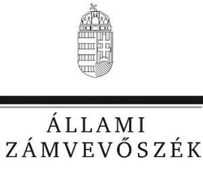
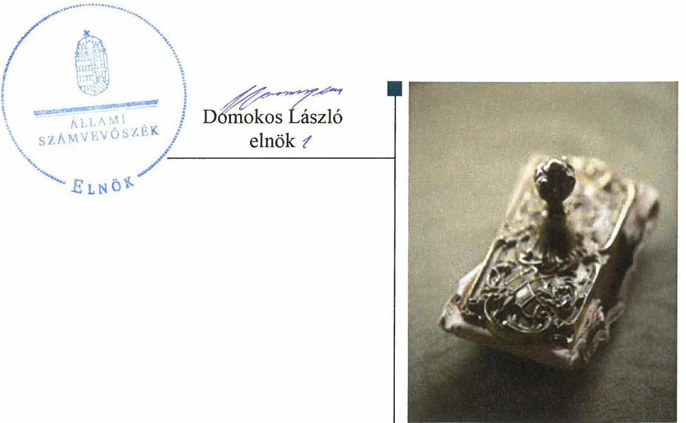
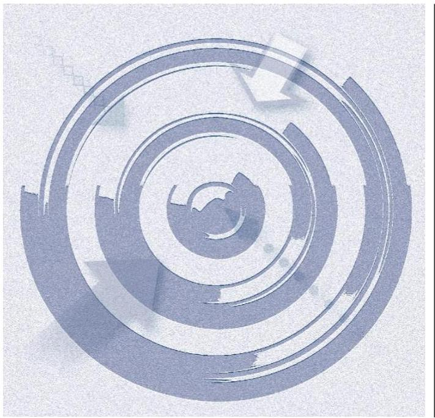
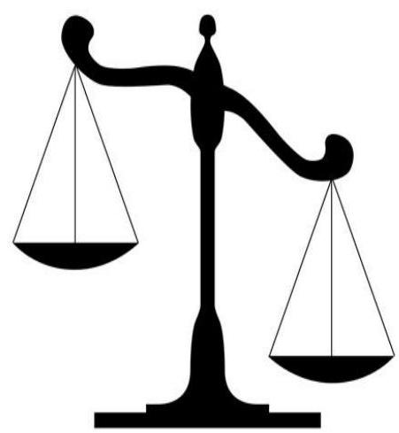
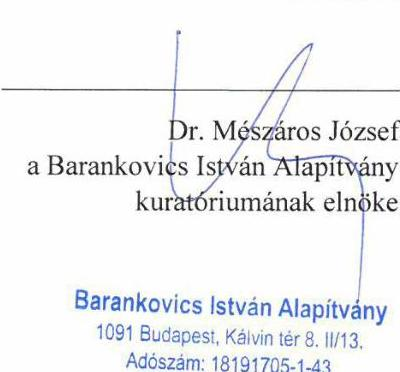
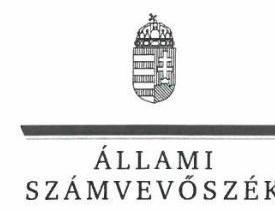
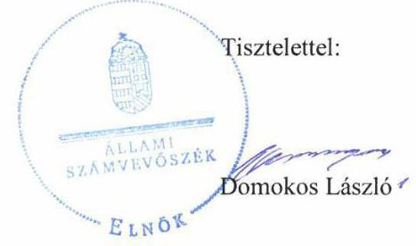

# Jelentés

A költségvetési támogatásban részesülő pártalapítványok 2016–2017. évi gazdálkodása törvényességének ellenőrzése

Barankovics István Alapítvány 2019.

---

# Jelenetés 

A költségvetési támogatásban részesüló pártalapítványok 2016-2017. évi gazdálkodása törvényességének ellenőrzése

Barankovics István Alapítvány
2019. 12. hó 18. nap

---

# AZ ELLENŐRZÉST FELÜGYELTE:

DR. NAGY IMRE felügyeleti vezető

# AZ ELLENŐRZÉST VEZETTE ÉS A VÉGREHAJTÁSÁÉRT FELELŐS:

DR. GYŐRI GABRIELLA ellenőrzésvezető

# A PROGRAM ÖSSZEÁLLÍTÁSÁÉRT FELELŐS:

TÓTPÁL SZABOLCS osztályvezető

---

**IKTATÓSZÁM:** EL-2330-001/2019

**TÉMASZÁM:** 2497

**ELLENŐRZÉS-AZONOSÍTÓ SZÁM:** V084102

---

Jelentéseink az Országgyűlés számítógépes hálózatán és az Interneta a www.asz.hu címen is olvashatóak.

---

# TARTALOMJEGYZÉK 

■ ÖSSZEGZÉS ..... 5
■ AZ ELLENŐRZÉS CÉLJA ..... 6
■ AZ ELLENŐRZÉS TERÜLETE ..... 7
■ AZ ELLENŐRZÉS HÁTTERE, INDOKOLTSÁGA ..... 8
■ A JELENTÉS LÉNYEGES KÉRDÉSKÖREI ..... 9
■ AZ ELLENŐRZÉS HATÓKÖRE ÉS MÓDSZEREI ..... 10
■ MEGÁLLAPÍTÁSOK ..... 13
■ JAVASLATOK ..... 16
■ MELLÉKLETEK ..... 17
I. sz. melléklet: Értelmező szótár ..... 17
II. sz. melléklet: Az ÁSZ 17092 számú jelentéséhez kapcsolódó intézkedési terv végrehajtása ..... 18
■ FÜGGELÉK: ÉSZREVÉTELEK ..... 19
■ RÖVIDÍTÉSEK JEGYZÉKE ..... 27

---

.

---

# ÖSSZEGZÉS 

A Barankovics István Alapítvány a szabályszerű müködés és gazdálkodás feltételeit megteremtette. Könyvvezetése az ellenőrzött időszak végére megfelelt a jogszabályi előírásoknak. A 2016-2017. évi tevékenységéről szóló jelentéseket a jogszabályi előírások alapján készítette el.

## Az ellenőrzés társadalmi indokoltsága

A politikai kultúra fejlesztése érdekében tudományos, ismeretterjesztő, kutatási, oktatási tevékenység folytatása céljából a pártok költségvetési támogatásra jogosult alapítványt hozhatnak létre. Jogszabályi előírások alapján a pártalapítványok gazdálkodása törvényességének ellenőrzésére az Állami Számvevőszék jogosult, ezért kétévente ellenőrzi a költségvetésből támogatásban részesülő pártalapítványoknak a gazdálkodását.

Az Állami Számvevőszék stratégiájában megfogalmazta, hogy az államháztartáson kívülre nyújtott költségvetési támogatások és az ingyenes vagyonjuttatás ellenőrzésével hozzájárul ahhoz, hogy a közpénzeket a civil szervezetek is átlátható módon használják fel. A pártalapítványok gazdálkodása szabályszerűségének bemutatásával az ellenőrzés értékteremtő módon járul hozzá az Állami Számvevőszék stratégiai céljainak megvalósításához, a nyilvánosság megfelelő tájékoztatásához.

## Főbb megállapítások, következtetések, javaslatok

A Barankovics István Alapítvány alapító okirata és a gazdálkodásra vonatkozó belső szabályozás a jogszabályi előírásokkal összhangban volt, ami megteremtette a közpénzekkel való átlátható és ellenőrizhető gazdálkodás alapjait.

A támogatásokat a Barankovics István Alapítvány szabályszerűen fogadta el és számolta el. A ráfordítások elszámolása 2016. évben nem volt szabályszerű, 2017. évben megfelelt a jogszabályi előírásoknak.

A 2016-2017. évekre vonatkozó éves jelentéseket és számviteli beszámolókat elkészítette.
A 2014-2015. évi gazdálkodás ellenőrzéséről szóló számvevőszéki jelentésben foglalt megállapításokhoz a Barankovics István Alapítvány öt pontból álló intézkedési tervet készített, az abban meghatározott feladatokat nem hajtotta végre.

---

# AZ ELLENŐRZÉS CÉLJA 

Az ellenőrzés célja annak megállapítása volt, hogy a pártalapítvány törvényesen gazdálkodott-e, az éves számviteli beszámolók és a tevékenységéről szóló éves jelentések a jogszabályi előírásoknak megfeleltek-e, a könyvvezetés és gazdálkodás során a vonatkozó jogszabályi rendelkezéseket, belső előírásokat betartották-e. Továbbá az ellenőrzés célja annak értékelése volt, hogy az előző számvevőszéki jelentésben fogalt intézkedést igénylő megállapításokkal összhangban készített intézkedési tervben meghatározott feladatokat az ellenőrzött szervezet végrehaj-totta-e.

---

# **AZ ELLENŐRZÉS TERÜLETE**

## **Barankovics István Alapítvány**

Az ellenőrzés a Párt tv.1 alapján a politikai kultúra fejlesztése érdekében tudományos, ismeretterjesztő, kutatási, oktatási tevékenység folytatása céljából, a Ptk.1,22 szerinti létesítő/alapító okiraton alapuló bírósági nyilvántartásba vétellel létrejött Barankovics István Alapítvány gazdálkodására terjedt ki. A pártalapítványok törvényes gazdálkodásának (könyvvezetése, beszámolása, jelentéstétele) szabályait alapvetően a Pártalapítványi tv.3-en túl a Számv. tv.4 és annak a végrehajtási rendelete a Számviteli vhr.1,25 határozták meg.

A Barankovics István Alapítványt 2006-ban hozta létre határozatlan időre a Kereszténydemokrata Néppárt, 0,7 M Ft induló vagyonnal.

A Pártalapítvány6 alapító okirat7 szerinti célja: az európai kereszténydemokrata és keresztényszociális eszme megismertetése, a nemzeti elkötelezettség és a kereszténydemokrata eszmekör jegyében az alapító szándékával és a közjó szolgálatával összhangban a politikai kultúra fejlesztése érdekében tudományos, ismeretterjesztő, kutatási és oktatási tevékenység elősegítése.

A Pártalapítvány az ellenőrzött időszakban évente 53,8 M Ft költségvetési támogatásban részesült, tevékenységét felügyelőbizottság ellenőrizte.

A Pártalapítvány az ellenőrzött időszakban gazdasági–vállalkozási tevékenységet nem végzett. A Pártalapítványnál az ellenőrzött időszakban külső ellenőrzés lefolytatására nem került sor.

---

# AZ ELLENŐRZÉS HÁTTERE, INDOKOLTSÁGA 

Társadalmi elvárás a közpénzek értékelvű, rendeltetésszerű felhasználása, a közpénzekből nyújtott támogatások átláthatóságának megteremtése, amelyhez az ÁSZ ${ }^{8}$ az államháztartásból nyújtott támogatások ellenőrzésével kíván hozzájárulni. A Párt tv. 9/A § (1) bekezdése alapján a politikai kultúra fejlesztése érekében tudományos, ismeretterjesztő, kutatási, oktatási tevékenység folytatása céljából létrehozott pártalapítványok gazdálkodása törvényességének ellenőrzése - Pártalapítványi tv. 4. § (2) bekezdése értelmében - az ÁSZ feladata. E törvény 4. § (4) bekezdése alapján az ÁSZ kétévente - kötelező jelleggel - ellenőrzi azoknak a pártalapítványoknak a gazdálkodását, amelyek költségvetési támogatásban részesültek.

Az ÁSZ, mint az Országgyűlés ellenőrző szerve a pártalapítványok gazdálkodása törvényességének/szabályszerűségének értékelésével hozzájárul ahhoz, hogy a társadalom objektív képet alkothasson a pártalapítványok működéséről. Az ellenőrzés eredményeinek célzott felhasználói a nyilvánosság, a jogalkotó, továbbá a pártalapítványok esetén azok alapítója és szervei. A jelentésben foglalt megállapítások, következtések és javaslatok alapján a törvényalkotók konkrét lépéseket tehetnek a pártalapítványokra vonatkozó szabályozások megváltoztatása, átláthatóbbá, ellenőrizhetőbbé tétele irányába. Az ellenőrzött szervezetek szintjén a hiányosságok, szabálytalanságok feltárása, az ennek kapcsán megfogalmazott megállapítások elősegíthetik a pártalapítványok szabályszerű gazdálkodását.

Az ÁSZ tv. ${ }^{9}$ 33. § (1) bekezdése értelmében a számvevőszéki jelentések intézkedést igénylő megállapításaihoz és javaslataihoz kapcsolódóan az ellenőrzött szervezet vezetője intézkedési tervet köteles összeállítani, és az ÁSZ részére megküldeni. Az intézkedési tervben foglaltak megvalósítását az ÁSZ törvény 33. § (7) bekezdésében foglaltak alapján - az ÁSZ utóellenőrzés keretében ellenőrizheti. Az utóellenőrzések keretében - az intézkedések értékelése során - az ÁSZ figyelembe veszi az ellenőrzött szervezetek működési feltételeiben, valamint a jogszabályi előírásokban bekövetkezett változásokat. Az ÁSZ az utóellenőrzés során értékeli, hogy az érintett számvevőszéki jelentésben foglalt intézkedést igénylő megállapításokkal és javaslatokkal összhangban, az ellenőrzött szervezet által készített intézkedési tervben meghatározott feladatokat a feladatra kijelöltek végrehajtották-e. Az intézkedések végrehajtásával az adott terület szabályszerű működése vonatkozásában a kockázatok csökkenhetnek, azonban hoszszabb távon az intézkedési tervben foglaltak végrehajtásával önmagában nem szűnnek meg, csak akkor, ha beépülnek az ellenőrzött szervezet működésébe, azokat folyamatosan karbantartják, figyelembe véve, illetve kezelve a változásokat. Emellett az intézkedések végrehajtásáig újabb kockázatok merülhetnek fel a szabályszerű működés vonatkozásában, amelyek kezelése szintén kiemelten fontos az ellenőrzött szervezet számára.

---

# A JELENTÉS LÉNYEGES KÉRDÉSKÖREI 

1. A Barankovics István Alapítvány gazdálkodásának törvényessége biztositott volt-e?
2. A Barankovics István Alapítvány könyvvezetése és gazdálkodása során a vonatkozó jogszabályi rendelkezéseket és belső elöírásokat betartották-e?
3. A Barankovics István Alapítvány tevékenységéről szóló éves jelentések, az éves számviteli beszámolók a jogszabályi elöírásoknak megfeleltek-e?
4. A Barankovics István Alapítvány a számvevőszéki jelentésben foglalt megállapításokkal összhangban készített intézkedési tervben meghatározott feladatokat végrehajtotta-e?

---

# AZ ELLENŐRZÉS HATÓKÖRE ÉS MÓDSZEREI 

## Az ellenőrzés típusa

Szabályszerúségi ellenőrzés.

## Az ellenőrzött időszak

2016. január 1 - 2017. december 31.

Az utóellenőrzés tekintetében a 17092 számú számvevőszéki jelentés ${ }^{10}$ közzétételének napjától (2017. június 12.) jelen ellenőrzésről szóló kiértesítő levél keltének (2018. szeptember 3.) napjáig tartó időszak.

## Az ellenőrzés tárgya

Az ellenőrzés tárgyát képezte a pártalapítvány gazdálkodása, a könyvvezetés szabályozása és gyakorlata szabályszerűsége, az éves számviteli beszámolókra és az alapítvány tevékenységéről szóló éves jelentésekre vonatkozó kötelezettség teljesítése, valamint a gazdálkodáshoz kapcsolódó ellenőrzések javaslatainak hasznosítására irányuló tevékenység.

Az ÁSZ tv. 2011. július 1-jei hatálybalépését követően a számvevőszéki jelentésben foglalt intézkedést igénylő megállapításokkal és javaslatokkal összhangban - az ellenőrzött szervezet által - készített intézkedési tervben foglaltak végrehajtásának ellenőrzése. Az utóellenőrzéssel érintett intézkedések végrehajtása elmaradásának következtében továbbra is fennálló szabálytalanságok értékelése a közpénzek, közvagyon veszélyeztetettségi kockázata valószínűsített hatására vonatkozóan. Az ellenőrzés kiterjedt minden olyan körülményre és adatra, amely az ÁSZ jogszabályban meghatározott feladatainak teljesítéséhez, valamint a program végrehajtása folyamán felmerült újabb összefüggések feltárásához szükséges.

## Az ellenőrzött szervezet

Barankovics István Alapítvány

## Az ellenőrzés jogalapja

Az ÁSZ tv. 1. § (3) bekezdése, 5. § (3) bekezdése, 33. § (7) bekezdése, a Pártalapítványi tv. 4. § (2) és (4) bekezdései.

---

# Az ellenőrzés módszerei 

Az ellenőrzést az ÁSZ az Ellenőrzési program szempontjai, az ellenőrzött időszakban hatályos jogszabályok, a jelen ellenőrzésre irányadó ÁSZ módszertan figyelembe vételével végezte.

Az ellenőrzés ideje alatt az ellenőrzött szervezettel történő kapcsolattartás az ÁSZ SZMSZ ${ }^{11}$-ének vonatkozó előírásai alapján történt.

Az ellenőrzési kérdések megválaszolásához szükséges bizonyítékok megszerzése az ellenőrzött által rendelkezésre bocsátott dokumentumokra, adatokra alapozva megfigyelés, szemle (szemrevételezés), kérdésfeltevés (információkérés), mintavételezés, valamint elemző eljárás útján történt. A mintavételezés rétegzett mintavételi eljárással történt.

Az ellenőrzési bizonyítékként felhasználható adatforrások közé tartoztak egyrészt az Ellenőrzési program részletes szempontjainál felsorolt adatforrások, másrészt minden egyéb - az ellenőrzés folyamán - feltárt, az ellenőrzés szempontjából információt tartalmazó dokumentum.

Az ellenőrzés lefolytatásához az ellenőrzött a tanúsítványok elektronikus kitöltésével, valamint az ÁSZ által kért dokumentumok elektronikus megküldésével szolgáltatott adatokat. Az így rendelkezésre bocsátott adatok, információk, a tanúsítványok adatai valódiságának kontrollja az ellenőrzés keretében történt.

Mintavétellel ellenőriztük a pártalapítvány tevékenységének költségei, ráfordításai felhasználása, kifizetése és elszámolása; a Pártalapítvány által nyújtott támogatásokra fordított összegek felhasználása, továbbá a beszámolók mérlegtételeinek besorolása, év végi értékelése, azok leltárral való alátámasztottsága szabályszerűségét. A mintavétellel ellenőrzött területek esetében minden egyes tétel vonatkozásában a szabályszerűségre vonatkozó kérdéseket tettünk fel. Szabályszerűnek értékeltünk egy ellenőrzött területet, amennyiben 95\%-os bizonyossággal az ellenőrzött sokaságban az átlagos hibaarány legfeljebb 10\%, nem szabályszerűnek, amennyiben 10\%-nál magasabb arányt képviselt. Abban az esetben, ha az ellenőrzött sokaság tekintetében a 10\%-os hibaarányhoz való viszony megítélésnek megbízhatósága nem érte el a 95\%-ot, annak elérése érdekében értékelésünket további szempontokkal egészítettük ki, és figyelembe vettük a feltárt hibák értékét.

Az utóellenőrzés megállapításait az ÁSZ rendelkezésére álló dokumentumok, valamint az ÁSZ adatbekérése szerint, az ellenőrzött szervezet által elektronikusan rendelkezésre bocsátott dokumentumok, adatok alapján fogalmaztuk meg. Az utóellenőrzés esetében az intézkedési tervekben előírt feladatokat, azok végrehajthatósága, illetve végrehajtása szempontjából az alábbiak szerint értékelte az ÁSZ:
$\longrightarrow$ „határidőben végrehajtott" a feladat, ha a teljesítés dokumentáltan, az intézkedési tervben előírt határidőben és tartalommal megtörtént;
$\longrightarrow$ „határidőn túl végrehajtott" a feladat, ha annak teljesítése az intézkedési tervben meghatározott módon, de az abban előírt határidőn túl történt meg;
$\longrightarrow$ „részben végrehajtott" a feladat, amelynek végrehajtása nem teljes körűen az intézkedési tervben előírt módon történt meg;

---

$\longrightarrow$„nem végrehajtott" a feladat, ha a végrehajtás nem történt meg, vagy amennyiben a teljesítést/végrehajtást nem dokumentálták, dokumentumokkal nem tudták igazolni annak teljesítését;
$\longrightarrow$ „okafogyottá vált" a feladat, ha végrehajtására - meghatározott esemény bekövetkezése, továbbá külső körülmény, a működést érintő feltétel változása miatt - már nincs szükség, illetve lehetőség, és egyértelműen megállapítható, hogy az intézkedést szükségessé tevő körülmény a jövőben nem fordulhat elő;
$\longrightarrow$ „nem időszerü" az a feladat, amelynek ellenőrzési időszakon belüli végrehajtására azért nem került (kerülhetett) sor, mert az intézkedés alapjául szolgáló esemény nem következett be, de annak jövőbeni előfordulása lehetséges, a végrehajtása nem volt esedékes, vagy a végrehajtás határideje még nem járt le.

---

# 1. A Barankovics István Alapítvány gazdálkodásának törvényessége biztosított volt-e? 

Összegző megállapítás

1.1. számú megállapítás
1.2. számú megállapítás

A Pártalapítvány a szabályszerű gazdálkodás feltételeit kialakította.

A Pártalapítvány gazdálkodása szervezeti kereteinek kialakítása szabályszerű volt.

Az alapító okirat a Ptk.1-2 előírásaival összhangban tartalmazta a Pártalapítvány célját és főtevékenységét, a részére teljesítendő vagyoni hozzájárulásokat, a vagyon kezelésének szabályait, az alapítványi szervek hatáskörét és eljárási szabályait.

A Kuratórium ${ }^{12}$ múködésének szabályait az SZMSZ ${ }^{13}$ tartalmazta, a Kuratórium munkáját alapítványi iroda segítette.
A Pártalapítvány gazdálkodására vonatkozó belső szabályozás elkészítése során érvényesültek a Számv. tv. előírásai.

A Pártalapítvány az ellenőrzött időszakban rendelkezett a Számv. tv.-vel összhangban elkészített hatályos számlarenddel ${ }^{14}$, számviteli politikával ${ }^{15}$, leltárkészítési és leltározási szabályzattal ${ }^{16}$, pénzkezelési szabályzattal ${ }^{17}$. Az eszközök és források értékelésére vonatkozó szabályokat a Pártalapítvány számviteli politikájában rögzítette.

## 2. A Barankovics István Alapítvány könyvvezetése és gazdálkodása során a vonatkozó jogszabályi rendelkezéseket és belső előírásokat betartották-e?

Összegző megállapítás

2.1. számú megállapítás

A Pártalapítvány könyvvezetése és gazdálkodása 2016. évben nem volt szabályszerű, 2017. évben szabályszerű volt.

A Pártalapítvány az ellenőrzött időszakban elfogadott támogatások számviteli elszámolása során betartotta a jogszabályi előírásokat.

A Pártalapítvány a támogatások elfogadásának szabályait az alapító okiratban rögzítette. A kapott támogatások számviteli elszámolása és nyilvántartása összhangban volt a számviteli politika, a számlarend és a Számviteli vhr.1,2 rendelkezéseivel. A támogatások elfogadása során érvényesültek a Pártalapítványi tv. előírásai.

---

# 2.2. számú megállapítás 

A Pártalapítvány ráfordításainak elszámolása 2016-ban nem volt szabályszerű, 2017-ben szabályszerű volt.

A ráfordítások elszámolása a 2016. évben nem volt szabályszerű, mert a kifizetéseket alátámasztó bizonylatok a Számv. tv. 167. § (1) bekezdés c) pontjában foglaltak ellenére nem tartalmazták a rendelkezés végrehajtását igazoló személy aláírását. A ráfordítások elszámolása 2017. évben szabályszerű volt.

A Pártalapítvány által az ellenőrzött időszakban nyújtott támogatások kifizetését a számviteli nyilvántartásokban a Számv. tv. előírásaival összhangban rögzítették.

A Pártalapítvány - a Párt tv. rendelkezéseit betartva - az alapító párt részére vagyoni hozzájárulást nem nyújtott.

## 3. A Barankovics István Alapítvány tevékenységéről szóló éves jelentések, az éves számviteli beszámolók a jogszabályi előírásoknak megfeleltek-e?

## Összegző megállapítás

Az ellenőrzött időszakban a Pártalapítvány tevékenységéről szóló éves jelentések elkészítése szabályszerű volt, a közzététel során nem érvényesültek a jogszabályi előírások.

A Pártalapítvány a tevékenységéről szóló éves jelentéseket a 2016-2017. évekre vonatkozóan a Pártalapítványi tv. előírásainak megfelelő szerkezetben állította össze. A közzététel során nem érvényesült a Pártalapítványi tv. 3/A § (5) bekezdésének előírása, mert a 2017. évi tevékenységről szóló jelentést a Pártalapítvány a Magyar Közlöny mellékletét képező Hivatalos Értesítőben a 2018. június 30-i határidőt követően, 2018. szeptember 13án tette közzé. A 2016. évre vonatkozó éves számviteli beszámolót a Pártalapítvány a 2011. évi CLXXXI. törvény ${ }^{18}$ 39. § (1) bekezdésében foglaltak ellenére az $\mathrm{OBH}^{19}$ részére nem küldte meg.

A Pártalapítvány 2016. évről a Számv. tv. alapján éves beszámolót, 2017. évről a Számviteli vhr. 2 alapján egyszerűsített éves beszámolót készített. A 2016-2017. évek vonatkozásában a leltározást a Pártalapítvány - a Számv. tv. 69. § (2) és (4) bekezdésében, a leltárkészítési és leltározási szabályzat 2. fejezet 2.2.2. pontjában és 4. fejezet 4.3. pontjában foglaltak ellenére - nem végezte el. A Kuratórium a számviteli beszámolókat az $\mathrm{FB}^{20}$ vélemény ismeretében jóváhagyta.

---

# 4. A Barankovics István Alapítvány a számvevőszéki jelentésben foglalt megállapításokkal összhangban készített intézkedési tervben meghatározott feladatokat végrehajtotta-e? 

Összegző megállapítás

A Pártalapítvány a korábbi számvevőszéki jelentésben foglalt megállapításokkal összhangban készített intézkedési tervben meghatározott feladatokat nem hajtotta végre.

A 17092 számú számvevőszéki jelentésben megfogalmazott intézkedést igénylő megállapításokkal összhangban a Pártalapítvány - az ÁSZ tv.-ben rögzített határidőben - öt pontból álló intézkedési tervet készített. A Pártalapítvány a feladatok végrehajtásáról nem gondoskodott:

- Nem intézkedett a számviteli szolgáltatást végző felszólításáról, hogy gondoskodjon a költségtérítésként kapott összegek fogalmi meghatározás szerinti könyveléséről.
- Nem intézkedett a számviteli szolgáltatást végző felszólításáról, hogy gondoskodjon a 2015. évi számviteli beszámoló javításáról.
- A 2015. évi számviteli beszámoló javításának hiányában nem gondoskodott a javított eredménykimutatás kuratóriumi jóváhagyásáról és közzétételéről.
- Nem szólította fel a Pártalapítvány alkalmazottait, hogy gondoskodjanak arról, hogy készpénzben történt kifizetések esetén a rendelkezés végrehajtását igazoló személy, illetve a pénztárellenőr az aláírási kötelezettségét teljesítse.
- Nem intézkedett a számviteli szolgáltatást végző felszólításáról, hogy a pénztári tételek könyvelésénél a bizonylatokon a könyvelés dátuma mellett egyértelműen kerüljön kijelölésre a könyvelés módja, az érintett könyvviteli számlákra történő hivatkozás.
Az intézkedési tervben meghatározott feladatokat, határidőket, felelősöket és a feladatok végrehajtását a II. számú melléklet mutatja be.

---

# JAVASLATOK 

Az ÁSZ tv. 33. § (1) bekezdésében foglaltak értelmében az ellenőrzött szervezet vezetője köteles a jelentésben foglalt megállapításokhoz kapcsolódó intézkedési tervet összeállítani és azt a jelentés kézhezvételétől számított 30 napon belül az ÁSZ részére megküldeni. Amennyiben az ellenőrzött szervezet vezetője nem küldi meg határidőben az intézkedési tervet, vagy továbbra sem elfogadható intézkedési tervet küld, az Állami Számvevőszék elnöke az ÁSZ tv. 33. § (3) bekezdése a) és b) pontjaiban foglaltakat érvényesítheti.

## Barankovics István Alapítvány elnöke részére

1. Gondoskodjon a jövőben a pártalapítvány tevékenységéről szóló éves jelentés közzétételéről a jogszabályi előírásnak megfelelően.
(3. sz. megállapítás 1. bekezdés 2. mondata alapján)
2. Gondoskodjon a jövőben az éves számviteli beszámoló Országos Bírósági Hivatalnak történő megküldéséről a jogszabályi előírásnak megfelelően.
(3. sz. megállapítás 1. bekezdése 3. mondata alapján)
3. Intézkedjen a jövőben szabályszerű leltározásról a jogszabályi előírásnak megfelelően.
(3. sz. megállapítás 2. bekezdése 2. mondata alapján)

---

# MELLÉKLETEK 

- I. SZ. MELLÉKLET: ÉRTELMEZŐ SZÓTÁR
alapítvány
gazdálkodó tevékenység
gazdasági-vállalkozási
tevékenység
költségvetésből juttatott/nyújtott forrás/támogatás
pártalapítvány

Az alapítvány az alapító által az alapító okiratban meghatározott tartós cél folyamatos megvalósítására létrehozott jogi személy. Az alapító az alapító okiratban meghatározza az alapítványnak juttatott vagyont és az alapítvány szervezetét. Alapítvány nem alapítható gazdasági-vállalkozási tevékenység folytatására. Az alapítvány az alapítványi cél megvalósításával közvetlenül összefüggő gazdasági tevékenység végzésére jogosult. Alapítvány nem lehet korlátlan felelősségű tagja más jogalanynak, nem létesíthet alapítványt és nem csatlakozhat alapítványhoz. (Forrás: Ptk. 3:378. §, 3:379. § (1) - (3) bekezdés)
azon tevékenységek összessége, amelyek a civil szervezet vagyoni, pénzügyi, jövedelmi helyzetére kiható gazdasági eseményt eredményeznek. (Forrás: Ectv. 2. § 10. pont.)
A jövedelem- és vagyonszerzésre irányuló vagy azt eredményező, üzletszerűen végzett gazdasági tevékenység, kivéve az adomány (ajándék) elfogadását, a létesítő okiratban meghatározott cél szerinti tevékenységet (ideértve a közhasznú tevékenységet is), - 2015. november 28-tól - a pénzeszközök betétbe, értékpapírba, társasági részesedésbe történő elhelyezését és az ingatlan megszerzését, használatának átengedését és átruházását. (Forrás: Ectv. 2. § 11. pont.)
a pártalapítványoknak a Párt tv. 9/A. § (1) bekezdése és a Pártalapítványi tv. 1. § előírásainak értelmében, az éves költségvetési törvények szerint - jellemzően az 1. számú melléklet 1. Országgyűlés fejezet 9. Pártalapítványok támogatás címen - az állami költségvetésből juttatott forrás/támogatás. az államháztartás központi alrendszeréből - a Tb alap kivételével - ellenérték nélkül, pénzben nyújtott költségvetési támogatás (Forrás: Áht. 1. § 14. pont)
a politikai kultúra fejlesztése érdekében, tudományos, ismeretterjesztő, kutatási és oktatási tevékenység folytatása céljából pártok által létrehozott, külön jogszabályban - a Pártalapítványi tv. 1. § és 3. § (1) bekezdésében- meghatározott, jogi személynek minősülő egyéb szervezet (Forrás: Párt tv. 9/A. § (1) bekezdés, Pártalapítványi tv. 1. §, Számv. tv. 3. § (1) bekezdése 4. pont, Számviteli vhr. 2. § (1) bekezdés k) pont, 4. § (1) bekezdés)

---

# II. SZ. MELLÉKLET: AZ ÁSZ 17092 SZÁMÚ JELENTÉSÉHEZ KAPCSOLÓDÓ INTÉZKEDÉSI TERV VÉGREHAJTÁSA

|  Sorszám | Intézkedési tervben meghatározott feladat | Az intézkedési tervben meghatározott határidő | Az intézkedési tervben meghatározott feladat felelőse | A feladat végrehajtása  |
| --- | --- | --- | --- | --- |
|  1. | A BIA ${ }^{21}$ Kuratóriumának elnöke felszólítja a számviteli szolgáltatást végző Kft.-t, hogy gondoskodjon arról, hogy a költségtérítésként kapott összegek minden esetben a fogalmi meghatározás szerint kerüljenek könyvelésre. | azonnal | számviteli szolgáltatást végző | A Pártalapítvány a feladat végrehajtásáról nem gondoskodott.  |
|  2. | A BIA Kuratóriumának elnöke felszólítja a számviteli szolgáltatást végző Kft.-t, hogy gondoskodjon a 2015. évi számviteli beszámolójának javításáról oly módon, hogy a mérlegben és az eredménykimutatásban szereplő, mérleg szerinti eredmény egyezősége megvalósuljon. | 2017. május 31. | számviteli szolgáltatást végző | A Pártalapítvány a feladat végrehajtásáról nem gondoskodott.  |
|  3. | A BIA Kuratóriumának elnöke a javítást követően gondoskodjon a 2015. évi javított eredménykimutatás kuratóriumi jóváhagyásáról, majd közzétételéről a BIA honlapján, a Magyar Közlönyben, illetve az Országos Bírósági Hivatalnál. | 2017. július 31. | Kuratórium elnöke | A Pártalapítvány a feladat végrehajtásáról nem gondoskodott.  |
|  4. | A BIA Kuratóriumának elnöke felszólítja a BIA alkalmazottait, hogy gondoskodjanak arról, hogy
a) a BIA által készpénzben kifizetett számlákra is minden esetben kerüljön rögzítésre a rendelkezés végrehajtását igazoló személy aláírása;
b) a pénztár bizonylatokon minden esetben szerepeljen a pénztárellenőr aláírása. | azonnal | pénzügyekért felelős főmunkatárs | A Pártalapítvány a feladat végrehajtásáról nem gondoskodott.  |
|  5. | A BIA Kuratóriumának elnöke felszólítja a számviteli szolgáltatást végző Kft.-t, hogy gondoskodjon arról, hogy a pénztári tételek könyvelésénél a bizonylatokon a könyvelés dátuma mellett egyértelműen kerüljön kijelölésre a könyvelés módja, az érintett könyvviteli számlákra történő hivatkozás. | azonnal | számviteli szolgáltatást végző | A Pártalapítvány a feladat végrehajtásáról nem gondoskodott.  |

---

# FÜGGELÉK: ÉSZREVÉTELEK 

A jelentéstervezetet a Számvevőszék 15 napos észrevételezésre megküldte az ellenőrzött szervezet vezetőjének az ÁSZ tv. 29. §* (1) bekezdése előírásának megfelelően.

A Barankovics István Alapítvány kuratóriumának elnöke élt az ÁSZ tv. 29. § (2) bekezdésében foglalt észrevételezési jogával és a törvényes határidőn belül észrevételt tett.
A függelék tartalmazza az ellenőrzött észrevételeit, illetve az el nem fogadott észrevételek elutasításának indoklását.

[^0]
[^0]:    * 29. § (1) Az Állami Számvevőszék az ellenőrzési megállapításait megküldi az ellenőrzött szervezet vezetőjének vagy az általa megbízott személynek, és annak, akinek személyes felelősségét állapította meg.
    (2) Az ellenőrzött szervezet vezetője és a felelősként megjelölt személy az ellenőrzés megállapításaira tizenöt napon belül írásban észrevételt tehet.
    (3) Az Állami Számvevőszék az észrevételre a beérkezésétől számított harminc napon belül írásban válaszol. A figyelembe nem vett észrevételeket köteles a jelentésben feltüntetni, és megindokolni, hogy azokat miért nem fogadta el.

---

Állami Számvevőszék
Domokos László elnök úr részére

Budapest

Hivatkozási szám: EL-1090-054/2019.

Tisztelt Elnök Úr!

Köszönettel megkaptuk 2019. október 29-én kelt levelüket, valamint a Barankovics István Alapítvány 2016-17. évi gazdálkodása törvényességének ellenőrzéséről szóló számvevőszéki jelentéstervezet. Az abban szereplő megállapításokat az Alapítvány munkája során köszönettel hasznosítjuk!

A vizsgálat során feltárt és a jelentéstervezetben javaslatként leírt hiányosságokra - egyeztetve a számviteli szolgáltatást végző partnerünkkel - az alábbiak szerint válaszolunk:

A jelentéstervezet 3. pontjának 2. bekezdésében szereplő, a Barankovics István Alapítvány által elvégzendő leltározás megvalósításáról szóló megállapításra a következőket válaszoljuk.
1.) ,, ... A 2016-2017. évek vonatkozásában a leltározást a Pártalapítvány - a Számv. tv. 69. § (2) és
(4) bekezdésében, a leltárkészitési és leltározási szabályzat 2.2.2.2. és 4.4.3. pontjában foglaltak
ellenére - nem végezte el. ... "

A leltárkészítési és leltározási szabályzatunkban ilyen számozású pontok nincsenek.
Az átadott bizonylatok alapján megállapítható, hogy 2017-ben a leltározás megtörtént.
Miután az irodában 2 fómunkatárs van, ezért a jegyzőkönyvben csak leltározót tudtunk megbízni.
Az analitikus leltári felvétel után az ellenőrzés úgy valósult meg, hogy a tény adatokat a fökönyvi adatokkal egyeztettük.

A használhatatlan tárgyi eszközöket a jogszabályban előírt módon kiselejteztük.

A jelentéstervezet 4. pontjában szereplő, a Barankovics István Alapítvány intézkedési tervének megvalósításáról szóló pontokra vonatkozóan a következőket válaszoljuk.
1.) „Nem intézkedett a számviteli szolgáltatást végzö felszólításáról, hogy gondoskodjon a költségtérítésként kapott összegek fogalmi meghatározás szerinti könyveléséről."
2017. január 1-től a költségtérítésként kapott összegeket a jogszabálynak megfelelően kezeljük.

---

2.) Nem intézkedett a számviteli szolgáltatást végző felszólításáról, hogy gondoskodjon a 2015. évi számviteli beszámoló javításáról."

A 2. pontban szereplő felszólítás megtörtént, a számviteli beszámoló javítása megvalósult.
3.) „A 2015. évi számviteli beszámoló javításának hiányában nem gondoskodott a javított eredménykimutatás kuratóriumi jóváhagyásáról és közzétételéről."

A 2. pontban említett 2015. évi beszámoló javítása megtörtént, de a kuratóriumi jóváhagyás és a közzététel sajnos elmaradt.
4.) „Nem szólította fel a Pártalapítvány alkalmazottait, hogy gondoskodjanak arról, hogy készpénzben történt kifizetések esetén a rendelkezés végrehajtását igazoló személy, illetve a pénztárellenőr az aláírási kötelezettségét teljesítse."

A pénztárbizonylatokra vonatkozó megállapítások nincsenek konkrét esetekkel alátámasztva, nincsenek hivatkozások, így az állítást nem tudjuk ellenőrizni.

Utólagosan ellenőriztünk több a 2016. évi, a vizsgálat során feltöltésre került pénztárbizonylatot, de ezen ellenőrzés során nem találtunk hibát.

A jövőben még körültekintőbben fogjuk ellenőrizni a bizonylatok alaki, és tartalmi elemeit.
5.) „Nem intézkedett a számviteli szolgáltatást végző felszólításáról, hogy a pénztári tételek könyvelésénél a bizonylatokon a könyvelés dátuma mellett egyértelmüen kerüljön kijelölésre a könyvelés módja, az érintett könyvviteli számlákra történő hivatkozás."

A pénztárbizonylatok könyvelésére vonatkozó megállapítás szintén nincs konkrét esettel alátámasztva, nincsenek hivatkozások, így az állítást nem tudjuk ellenőrizni. De a jövőre nézve intézkedem a Számv. tv. $167 \S$ (1) bekezdés szerinti előírások betartásáról.

Köszönjük szépen a jelentéstervezetben a Barankovics István Alapítvány elnöke részére tett javaslatokat, köszönettel vettük.

Az 1.) -2.) -3.) pontokban megfogalmazott
1.) „Gondoskodjon a jövőben a pártalapítvány tevékenységéről szóló éves jelentés közzétételéről a jogszabályi előírásnak megfelelően."
2.) „Gondoskodjon a jövőben az éves számviteli beszámoló Országos Bírósági Hivatalnak történő megküldéséről a jogszabályi előírásnak megfelelően."
3). „Intézkedjen a jövőben szabályszerű leltározásról a jogszabályi előírásnak megfelelően."

---

javaslatokat figyelembe véve, jövőbeni szabályszerű működésünk érdekében, gondoskodom a jogszabályi előírásnak megfelelően a továbbiakról: az éves beszámolót alátámasztó leltár elkészítéséről, az elfogadott és jóváhagyott beszámoló közzétételéről, az éves számviteli beszámoló az Országos Bírósági Hivatal adatbázisába történő feltöltéséről.

Az Ön és munkatársai munkáját ezúton is megköszönve kívánunk további tevékenységükhöz sok erőt és jó egészséget!

Budapest, 2019. november 12.

Tisztelettel:

---

ELNÖK

Ikt.szám: EL-1090-059/2019.

# Dr. Mészáros József úr 

kuratórium elnöke
Barankovics István Alapítvány

## Budapest

## Tisztelt Elnök Úr!

„A költségvetési támogatásban részesülö pártalapítványok 2016-2017. évi gazdálkodása törvényességének ellenörzése - Barankovics István Alapitvány "cimmel készített számvevőszéki jelentéstervezetre tett, 2019. november 12-én kelt észrevételeit köszönettel megkaptam.
Az Állami Számvevőszék észrevételekre vonatkozó álláspontjáról a felügyeleti vezető által készített részletes tájékoztatást csatoltan megküldöm.
Tájékoztatom Elnök urat, hogy a számvevőszéki jelentésben - az Állami Számvevőszékről szóló 2011. évi LXVI. törvény 29. § (3) bekezdése alapján - a figyelembe nem vett észrevételeket szerepeltetjük annak indoklásával, hogy azokat miért nem fogadtuk el.

Budapest, 2019. 16. hó 8 nap

Melléklet: Tájékoztatás az észrevételek kezeléséről

---

# Tájékoztatás   az észrevételek kezeléséről 

„A költségvetési támogatásban részesülö pártalapitványok 2016-2017. évi gazdálkodása törvényességének ellenörzése - Barankovics István Alapitvány" (továbbiakban: Alapítvány) címü jelentéstervezetre 2019. november 12-én tett (az Állami Számvevőszékhez 2019. november 15-én érkezett) észrevételének kezelésével kapcsolatban a következő tájékoztatást adom.

## 1. A jelentéstervezet 3. számú megállapítás 2. bekezdésére és a kapcsolódó 3. számú javaslatra vonatkozó észrevétel:

Elnök úr észrevételében leírta, hogy az Alapítvány leltárkészítési és leltározási szabályzatában nincsenek a jelentéstervezetben hivatkozott számozású pontok. Jelezte továbbá, hogy az ellenőrzésnek átadott bizonylatok alapján megállapítható, hogy 2017-ben megtörtént a leltározás. Az analitikus leltári felvétel után a leltárellenőrzést a tényadatok és a fökönyvi adatok egyeztetésével valósították meg. A használhatatlan eszközöket a jogszabályban előírt módon kiselejtezték.
Elnök úr észrevételének a leltározási szabályzat pontjainak hivatkozására vonatkozó észrevételét elfogadjuk, a jelentéstervezet 3. megállapítás 2. bekezdés 2. mondatban a hivatkozást pontosítjuk az alábbiak szerint: „A 2016-2017. évek vonatkozásában a leltározást a Pártalapitvány - a Számv. tv. 69. § (2) és (4) bekezdésében, a leltárkészitési és leltározási szabályzat 2. fejezet 2.2.2. pontjában és 4. fejezet 4.3. pontjában foglaltak ellenére - nem végezte el."

Elnök úrnak a leltározás 2017-ben történt elvégzésére vonatkozó észrevételét nem fogadjuk el. Az Alapítvány az EL-1090-001/2018. iktatószámú, 2018. szeptember 3-án kelt adatbekérő levél 3. számú mellékletében a teljes ellenőrzött időszakot, 2016 és 2017 éveket lefedően a 2. Egyéb dokumentumok 34. pontjában kért, a mérleg leltárral való alátámasztásának dokumentumait 2016. évre egyáltalán nem, 2017. évre vonatkozóan nem teljes körüen bocsátotta az Állami Számvevőszék rendelkezésére. A 2018. szeptember 14-én Elnök úr által aláirt teljességi és hitelességi nyilatkozattal igazoltan az ellenőrzésnek átadott 2017. december 29-ei keltü leltározási utasítás, a 2018. január 4-ei keltezésű eszközleltár és annak fökönyvi egyeztetését tartalmazó táblázat, az eszközleltárból kivezetésre kerülő, illetve idegen helyen tárolt eszközök listája csak az Alapítvány tárgyi eszközeinek leltározását igazolja. A számvitelről szóló 2000. évi C. törvény (továbbiakban Számv. tv.) 69. §-ában foglalt, a mérleg tételeit alátámasztó, a meglévő eszközeinek és forrásainak a mérleg fordulónapjára vonatkozó mennyiségi felvétellel, il-

---

letve a csak értékben kimutatott eszközöknél és kötelezettségeknél egyeztetéssel elvégzett leltározást az Alapítvány nem igazolta. Az észrevétel alapján a jelentéstervezet módosítása nem indokolt.

# 2. A jelentéstervezet 4. számú megállapítására vonatkozó észrevétel: 

Elnök úr észrevételében részletesen leírta, hogy az Alapítvány intézkedési tervében foglaltak egy része megvalósult, továbbá a jövőben körültekintően ellenőrzik majd a bizonylatok alaki, tartalmi kellékeit, intézkedik a Számv. tv. előírásainak betartásáról.
A tájékoztatását köszönjük, azonban az észrevételt nem tudjuk elfogadni. Az Elnök úr által 2018. szeptember 14-én aláírt, az intézkedési tervben vállalt feladatok végrehajtásáról szóló 9 . számú tanúsítványt „nemleges" jelzéssel küldték meg, a tanúsítvány az intézkedési tervben foglaltak végrehajtásáról adatot, információt nem tartalmaz. Az Alapítvány az EL-1090-001/2018. iktatószámú, 2018. szeptember 3-án kelt adatbekérő levél 3. számú melléklet 2. Egyéb dokumentumok 39. pontjában az utóellenőrzéshez kért, az intézkedési tervben foglaltak végrehajtását igazoló dokumentumokat nem bocsátotta az Állami Számvevőszék rendelkezésére. A 2018. szeptember 14-én Elnök úr által aláírt teljességi és hitelességi nyilatkozat szintén nem tartalmaz az intézkedési terven meghatározott feladatok végrehajtását alátámasztó, azokat igazoló dokumentumokat. Az észrevétel alapján a jelentéstervezet módosítása nem indokolt.

## 3. A jelentéstervezet javaslataira vonatkozó tájékoztatás:

Elnök úr észrevételében tájékoztatást adott az ellenőrzés javaslatokat megalapozó megállapításaival összefüggésben tervezett intézkedésekről.
Elnök úr tájékoztatását köszönjük, az abban foglaltak nem minősülnek észrevételnek. Tájékoztatom Elnök urat, hogy az Állami Számvevőszékről szóló 2011. évi LXVI. törvény 33. § (1) bekezdése alapján az ellenőrzött szervezet vezetője a nyilvánosságra hozott jelentésben foglalt megállapításokhoz kapcsolódóan köteles intézkedési tervet összeállítani, és azt a jelentés kézhezvételétől számított harminc napon belül az Állami Számvevőszék részére megküldeni.

Budapest, 2019. 42. hó 05 nap

Dr. Nagy Imre
felügyeleti vezető

---

.

---

# RÖVIDÍTÉSEK JEGYZÉKE 

${ }^{1}$ Párt tv.
${ }^{2}$ Ptk. 1

Ptk. 2
${ }^{3}$ Pártalapítványi tv.
${ }^{4}$ Számv. tv.
${ }^{5}$ Számviteli vhr. 1

Számviteli vhr. 2
${ }^{6}$ Pártalapítvány
${ }^{7}$ alapító okirat
${ }^{8}$ ÁSZ
${ }^{9}$ ÁSZ tv.
${ }^{10} 17092$ számú számvevőszéki jelentés
${ }^{11}$ ÁSZ SZMSZ
${ }^{12}$ Kuratórium
${ }^{13}$ SZMSZ
${ }^{14}$ számlarend
${ }^{15}$ számviteli politika
${ }^{16}$ leltárkészítési és leltározási szabályzat
${ }^{17}$ pénzkezelési szabályzat
${ }^{18}$ 2011. évi CLXXXI. törvény
${ }^{19}$ OBH
${ }^{20}$ FB
${ }^{21}$ BIA
a pártok múködéséről és gazdálkodásáról szóló 1989. évi XXXIII. törvény (hatályos: 1989. október 30-tól)
a Polgári törvénykönyvről szóló 1959. évi IV. törvény (hatálytalan: 2014. március 15-től)
a Polgári Törvénykönyvről szóló 2013. évi V. törvény (hatályos: 2014. március 15-től)
a pártok múködését segítő tudományos, ismeretterjesztő, kutatási, oktatási tevékenységet végző alapítványokról szóló 2003. évi XLVII. törvény (hatályos: 2003. július 1-jétől)
a számvitelről szóló 2000. évi C. törvény (hatályos: 2001. január 1-jétől)
a számviteli törvény szerinti egyes egyéb szervezetek beszámoló készítési és könyvvezetési kötelezettségének sajátosságairól szóló 224/2000. (XII.19) Korm. rendelet (hatályos: 2001. január 1-jétől 2016. december 31-ig)
a számviteli törvény szerinti egyes egyéb szervezetek beszámoló készítési és könyvvezetési kötelezettségének sajátosságairól szóló 479/2016. (XII. 28.) Korm. rendelet (hatályos: 2017. január 1-jétől)
Barankovics István Alapítvány
Barankovics István Alapítvány 2014. január 2. napján kelt egységes szerkezetú alapító okirata
Állami Számvevőszék
az Állami Számvevőszékről szóló 2011. évi LXVI. törvény (hatályos: 2011. július 1-jétől)
A költségvetési támogatásban részesülő pártalapítványok 2014-2015. évi gazdálkodása törvényességének ellenőrzése a Barankovics István Alapítványnál
Állami Számvevőszék Szervezeti és Működési Szabályzata
Barankovics István Alapítvány Kuratóriuma
Barankovics István Alapítvány Szervezeti és Múködési Szabályzata (hatályos: 2016. január 1-jétől)
Barankovics István Alapítvány Számalrend és Számlatükör (hatályos: 2016. január 1-jétől)
Barankovics István Alapítvány Számviteli Politika (hatályos: 2016. január 1-jétől)
Barankovics István Alapítvány Leltárkészítési és Leltározási Szabályzat (hatályos: 2016. január 1-jétől)
Barankovics István Alapítvány Pénzkezelési Szabályzat (hatályos: 2016. január 1-jétől)
a civil szervezetek bírósági nyilvántartásáról és az ezzel összefüggő eljárási szabályokról szóló 2011. évi CLXXXI. törvény (hatályos: 2011. december 23-tól) Országos Bírósági Hivatal
Barankovics István Alapítvány Felügyelő Bizottsága
Barankovics István Alapítvány

---

# ÁLLAMI SZÁMVEVŐSZÉK 

1052 Budapest, Apáczai Csere János utca 10.
Levélcím: 1364 Budapest 4. Pf. 54
Telefon: +36 14849100 Telefax: +36 14849200
www.asz.hu