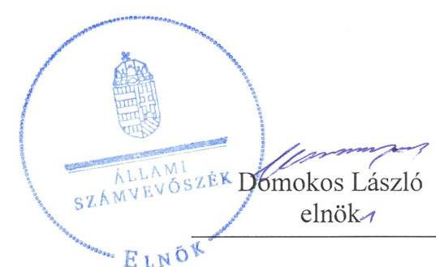
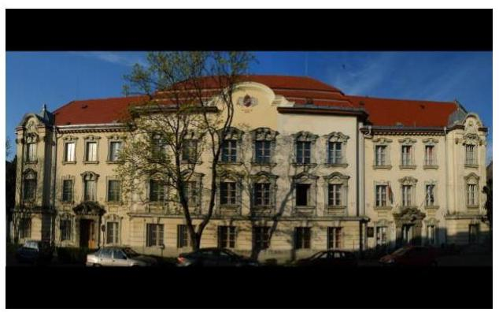
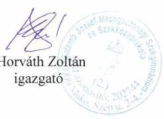
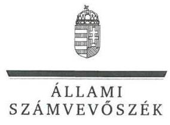
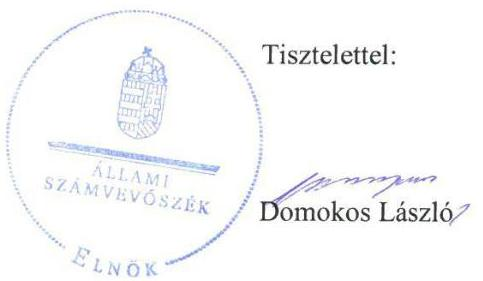

# Jelenetés 

## Központi költségvetési szervek ellenőrzése

Galamb József Mezőgazdasági Szakgimnázium és Szakközépiskola 2019.

---

# Jelentés 

## Központi költségvetési szervek ellenőrzése

Galamb József Mezőgazdasági Szakgimnázium és Szakközépiskola 2019. 12. hó 13. nap

---

# AZ ELLENŐRZÉST FELÜGYELTE:

DR. NAGY IMRE felügyeleti vezető

# AZ ELLENŐRZÉST VEZETTE ÉS A VÉGREHAJTÁSÁÉRT FELELŐS:

DR. GYŐRI GABRIELLA ellenőrzésvezető

# A PROGRAM ÖSSZEÁLLÍTÁSÁÉRT FELELŐS:

TÓTPÁL SZABOLCS osztályvezető

---

**IKTATÓSZÁM:** EL-2331-001/2019.

**TÉMASZÁM:** 2450

**ELLENŐRZÉS-AZONOSÍTÓ SZÁM:** V079154

---

Jelentéseink az Országgyűlés számítógépes hálózatán és az Interneta a www.asz.hu címen is olvashatóak.

---

# TARTALOMJEGYZÉK 

■ ÖSSZEGZÉS ..... 5
■ AZ ELLENŐRZÉS CÉLJA ..... 6
■ AZ ELLENŐRZÉS TERÜLETE ..... 7
■ AZ ELLENŐRZÉS HÁTTERE, INDOKOLTSÁGA ..... 8
■ A JELENTÉS LÉNYEGES KÉRDÉSKÖREI ..... 10
■ AZ ELLENŐRZÉS HATÓKÖRE ÉS MÓDSZEREI ..... 11
■ MEGÁLLAPÍTÁSOK ..... 14
■ JAVASLATOK ..... 17
■ MELLÉKLETEK ..... 19
I. sz. melléklet: Értelmező szótár ..... 19
■ FÜGGELÉK: ÉSZREVÉTELEK ..... 23
■ RÖVIDÍTÉSEK JEGYZÉKE ..... 31

---

.

---

# ÖSSZEGZÉS 

A makói székhelyű Galamb József Mezőgazdasági Szakgimnázium és Szakközépiskola belső kontrollrendszere és vagyongazdálkodása 2016-2017-ben, pénzügyi gazdálkodása 2016ban nem biztositotta az átlátható és elszámoltatható közpénzfelhasználást, a felelős gazdálkodást és a vagyon megőrzését. A korrupció elleni védelmet nem biztositották.

## Az ellenőrzés társadalmi indokoltsága

Magyarország versenyképességének és a magyar gazdaság fejlődésének alapvető feltétele a magyar munkavállalók megfelelő szakmai képzettsége és felkészültsége, amelyben a szakképzési rendszernek döntő szerepe van. A mezőgazdaság vonatkozásában is kiemelten fontos ez, hiszen a magyar mezőgazdaság piaci versenyképességét és eredményességét nagymértékben befolyásolja az agrárszférában dolgozók képzettsége, felkészültsége. A szakképzés legjelentősebb színterei a szakképző iskolák. Az eredményes és célszerű szakképzés alapja és alapvető feltétele a szakképző intézmények közpénzekkel és a közvagyonnal való törvényes, átlátható és a korrupcióval szembeni védelmet biztosító múködése és gazdálkodása. Ezért ezen szervezetekkel szemben is alapvető társadalmi igény, hogy a rájuk bízott közpénzekkel, közvagyonnal szabályosan gazdálkodjanak. Emellett a szakképzésben részt vevő pedagógusok, tanulók és a szülők jogos elvárása, hogy a szakképző iskolák múködése átlátható és elszámoltatható legyen. Mindezen igényekkel összhangban, a közpénzügyek átláthatóságának előmozdítása, a közvagyon védelme érdekében került sor az agrárszakképző iskolák belső kontrollrendszerének és gazdálkodásának ellenőrzésére.

## Főbb megállapítások, következtetések, javaslatok

A Galamb József Mezőgazdasági Szakgimnázium és Szakközépiskolánál a belső kontrollrendszer nem biztosította az átlátható és elszámoltatható közpénzfelhasználást.

A Galamb József Mezőgazdasági Szakgimnázium és Szakközépiskola igazgatója az ellenőrzött időszakban nyilatkozatban értékelte a szervezet belső kontrollrendszerének minőségét, amely nem volt összhangban a jelen ellenőrzés során tapasztaltakkal. A Galamb József Mezőgazdasági Szakgimnázium és Szakközépiskolánál nem alakítottak ki a teljesítmény mérésére alkalmas követelményeket.

A Galamb József Mezőgazdasági Szakgimnázium és Szakközépiskola 2016. évi vagyongazdálkodása a kontrollkörnyezet kialakítása és leltár hiányában nem volt szabályszerű. A jogszabályi előírás és a belső szabályozásban foglaltak ellenére a Galamb József Mezőgazdasági Szakgimnázium és Szakközépiskola nem állított össze a mérleg fordulónapján meglévő eszközeit és forrásait mennyiségben és értékben, tételesen, ellenőrizhető módon tartalmazó leltárt, emiatt a 2017. évi számviteli beszámoló nem mutatott megbízható és valós képet a gazdálkodásáról.

A jogszabályok által előírt integritást támogató kontrollok kiépítettségének hiányosságai miatt a Galamb József Mezőgazdasági Szakgimnázium és Szakközépiskolánál az integritási kontrollok kiépítése nem volt arányban a korrupciós kockázatokkal, így a korrupció elleni védelemről nem gondoskodtak.

Az Állami Számvevőszék a Galamb József Mezőgazdasági Szakgimnázium és Szakközépiskola igazgatójának 11 javaslatot fogalmazott meg.

---

# AZ ELLENŐRZÉS CÉLJA 

AZ ELLENŐRZÉS CÉLJA annak megítélése volt, hogy az ellenőrzött intézményre vonatkozó irányító szervi feladatellátás a jogszabályi előírások betartásával történt-e; az intézménynél a belső kontrollrendszer kialakítása és múködtetése szabályszerű volt-e, biztosította-e az átlátható, szabályszerű, gazdaságos, hatékony és eredményes gazdálkodás feltételeit; az intézmény pénzügyi és vagyongazdálkodása megfelelt-e a jogszabályi előírásoknak és belső szabályzatainak. Az ellenőrzés keretében az ÁSZ ${ }^{1}$ értékelte az intézmény korrupciós kockázatainak kezelését szolgáló integritás kontrollok kiépítettségét és az integritás szemlélet érvényesülését, illetve, hogy az államháztartás központi alrendszerébe tartozó szervezet gazdálkodása során elszámoltatható volt és megfelelt-e annak az Alaptörvényben² meghatározott alapvetésnek, hogy Magyarország a kiegyensúlyozott, átlátható és fenntartható költségvetési gazdálkodás elvét érvényesíti. Az ÁSZ értékelte, hogy a központi költségvetési szervnél megteremtették-e a teljesítményellenőrzés feltételeit. Érvényesült-e a nemzeti vagyon kezelésének és védelmének célja, azaz a szervezet vagyona a közérdeket szolgálta, a közös szükségletek kielégítése és a természeti erőforrások megóvása, valamint a jövő nemzedékek szükségleteinek figyelembevétele mellett.

---

# **AZ ELLENŐRZÉS TERÜLETE**

## **Galamb József Mezőgazdasági Szakgimnázium és Szakközépiskola**

A makói székhelyű Középiskolát3 2013. augusztus 1-jén alapította a Vidékfejlesztési Minisztérium. A Középiskola köznevelési intézmény, közfeladata a nemzeti köznevelésről szóló 2011. évi CXC. törvény alapján nevelő–oktató munka folytatása. A Középiskola alaptevékenysége többek között a szakközépiskolai, szakiskolai nevelés–oktatás, a felnőttoktatás. Működési területe országos.

Irányító szerve4 2016. január 1. és 2017. december 31. között a Földművelésügyi Minisztérium volt (2018. május 18-ától Agrárminisztérium). A Középiskola önálló jogi személy. Gazdálkodási feladatait a Bedő Albert Erdészeti Szakképző Iskola és Kollégium látta el. Az Áht.5 rendelkezése szerinti átalakításra az ellenőrzött időszakban nem került sor.

A Középiskolát igazgató6 vezette, aki felett az irányító szervet vezető miniszter gyakorolta a kinevezési és munkáltatói jogokat. Az igazgató személyében 2016–2017. években nem történt változás.

A Középiskola alkalmazásában álló személyek foglalkoztatása közalkalmazotti jogviszonyban, munkajogviszonyban, illetve közfoglalkoztatási jogviszonyban történt. Az átlagos statisztikai állományi létszám a 2016–2017. évben 71 fő volt. A Középiskola foglalkoztatottjai felett a munkáltatói jogokat az igazgató gyakorolta.

---

# AZ ELLENŐRZÉS HÁTTERE, INDOKOLTSÁGA 

Az államháztartás központi alrendszerének közpénz felhasználása, az intézmények által ellátott közfeladatok sokrétűsége, valamint a feladatellátásához rendelt vagyon nagyságrendje indokolja, hogy az ÁSZ ellenőrzéseket folytasson a pénzügyi és vagyongazdálkodás területén. Az ÁSZ az ellenőrzései során feltárja a gazdálkodást, a központi alrendszer intézményei átalakulását, átszervezését érintő szabályozások esetleges hiányosságait, a szabályozással nem érintett gazdálkodási területeket, rámutathat a vagyongazdálkodási tevékenység - ezen belül a tulajdonosi joggyakorlás és vagyonkezelés - esetleges szabálytalanságaira, értékeli az állami vagyon nyilvántartására és elszámolására vonatkozó eljárásokat.

Az államháztartás központi alrendszerébe tartozó szervezet vagyona a nemzeti vagyon része és az Alaptörvény is rögzíti, hogy a vagyonnal való gazdálkodás célja a közérdek szolgálata. Az ÁSZ ellenőrzi az éves költségvetési törvény végrehajtását, az ellenőrzés során feltárt kockázatok és a terület folyamatos kockázatelemzésével beazonosított kockázatok kezelése érdekében ráépülő ellenőrzésekkel ellenőrzi a költségvetési szervek gazdálkodását, működését, hogy az ellenőrzések megállapításaival támogassa az ellenőrzött szervezetek szabályszerű gazdálkodását, javaslataival elősegítse az Alaptörvényben megfogalmazott alapvetések érvényesülését a mindennapi életben a szervezetek szintjén. A központi költségvetés rendszerében zajló folyamatok holisztikus elemzései, a kockázatok folyamatos figyelemmel kísérésének módszerével, az így kiválasztott szervezetek célzott, hatékony ellenőrzéseivel az ÁSZ betölti a legfőbb gazdasági ellenőrző szerv küldetését.

Az ellenőrzés várhatóan hozzájárul a központi intézmények pénzügyi helyzetének pontosabb megítéléséhez, és a jó gyakorlat kialakításán és terjesztésén keresztül az ellenőrzések elősegíthetik a gazdálkodás szabályszerűségének javítását.

A belső kontrollrendszer kialakítása és működtetése nélkül nem valósítható meg a közpénzek, a közvagyon átlátható, szabályos, gazdaságos, hatékony és eredményes felhasználása. A belső kontrollrendszer azt a célt szolgálja, hogy a költségvetési szervek működésük és gazdálkodásuk során a tevékenységeket szabályszerűen hajtsák végre, teljesítsék elszámolási kötelezettségeiket és megvédjék az erőforrásokat a veszteségektől, a károktól és a nem rendeltetésszerű használattól. A belső kontrollrendszer magában foglalja mindazon elveket, eljárásokat és belső szabályzatokat, melyek biztosítják, hogy a költségvetési szerv valamennyi tevékenysége és célja összhangban legyen a szabályszerűséggel, szabályozottsággal, valamint a gazdaságosság, hatékonyság és eredményesség követelményeivel, az eszközökkel és forrásokkal való gazdálkodásban ne kerüljön sor pazarlásra, visszaélésre, rendeltetésellenes felhasználásra. Megfelelő, pontos és naprakész információk álljanak rendelkezésre a költségvetési szerv múködésével kapcsolatosan, és a belső kontrollrendszer harmonizációjára, öszszehangolására vonatkozó jogszabályok végrehajtásra kerüljenek. Az integritás kontrollok kiépítése, erősítése a szervezet korrupciós kockázatainak

---

kezelését szolgálja. A teljesítménykövetelmények meghatározása és múködtetése megalapozhatja a központi költségvetési szervnél a teljesítményellenőrzés lefolytatását.

Az egyes ellenőrzések megállapításaival és egy időszak ellenőrzési eredményeinek elemzésével az ÁSZ ráirányíthatja a jogalkotók figyelmét a központi alrendszerben vagy annak egy ágazatában esetlegesen felmerülő pénzügyi, szabályozási feszültségekre. Az elvégzett ellenőrzések során az ÁSZ „jó gyakorlatokat" is azonosíthat, melyeket tanácsadó funkciója keretében szélesebb körben is megismertethet az érintettekkel, ezáltal is hozzájárulva a költségvetési rendszer szabályozott, átlátható, kiegyensúlyozott és fenntartható múködéséhez.

Az ellenőrzés a szervezet kockázatértékelése alapján, az egyedi és lényeges jellemzők figyelembevételével történt.

---

# A JELENTÉS LÉNYEGES KÉRDÉSKÖREI 

1.     - Az irányító szerv ellenőrzött költségvetési szervre vonatkozó feladatellátása szabályszerű volt-e?
2.     - A belső kontrollrendszer kialakítása és müködtetése biztosi-totta-e a közpénzekkel és a nemzeti vagyonnal történő szabályszerű gazdálkodást?
3.     - A költségvetési szerv pénzügyi- és vagyongazdálkodása szabályszerű volt-e?

---

# AZ ELLENŐRZÉS HATÓKÖRE ÉS MÓDSZEREI 

## Az ellenőrzés típusa

Megfelelőségi ellenőrzés.

## Az ellenőrzött időszak

2016. év az irányító szervi feladatellátás és a pénzügyi gazdálkodás esetén, 2016-2017. évek a vagyongazdálkodás, valamint a belső kontroll rendszer ellenőrzése tekintetében, továbbá az integritás kontrollok esetében a 2017. év.

## Az ellenőrzés tárgya

A Középiskolára vonatkozó 2016. évi irányító szervi feladatok ellátása. A Középiskola 2016-2017. évi belső kontrollrendszerének kialakítása és működtetése, továbbá vagyongazdálkodása. A Középiskola 2016. évi pénzügyi gazdálkodása 2017. évre vonatkozóan a Középiskolánál az integritáskontrollok kiépítettsége, az integritás szemlélet érvényesülése, valamint a teljesítményellenőrzés feltételeinek rendelkezésre állása volt. A vagyongazdálkodás ellenőrzésének keretében a vagyongazdálkodás feltételeinek kialakítása, annak szabályzerúsége, az elszámoltathatóság biztosítása a szabályozás szintjén. A vagyonváltozást eredményező döntéseket, a vagyonban bekövetkezett változások végrehajtását, nyilvántartásba vételének, elszámolásának szabályszerűségét. A könyveiben, mérlegében az állami vagyon kimutatásának szabályszerűségét, ennek keretében az állami vagyonnal történő rendelkezést, a vagyonmozgásokat, a vagyon nyilvántartásba vételét, értékelését és a mérleg alátámasztás szabályszerűségét.

Az ellenőrzés kiterjedt minden olyan körülményre és adatra, amely az ÁSZ jogszabályban meghatározott feladatainak teljesítéséhez, valamint a program végrehajtása folyamán felmerült újabb összefüggések feltárásához szükséges volt.

## Az ellenőrzött szervezet

Galamb József Mezőgazdasági Szakgimnázium és Szakközépiskola, a gazdálkodási feladatokat ellátó Bedő Albert Erdészeti Szakképző Iskola és Kollégium, valamint az Agrárminisztérium.

---

# Az ellenőrzés jogalapja 

Az ellenőrzés jogszabályi alapját az ÁSZ tv. ${ }^{7}$ 1. § (3) bekezdés, 5. § (2)-(4) és (6) bekezdései, valamint az Áht. 61. § (2) bekezdésének előírásai képezték.

## Az ellenőrzés módszerei

Az ellenőrzésre a szakmai program szempontjai, az ellenőrzött időszakban hatályos jogszabályok, az ellenőrzés szakmai szabályai, a jelen ellenőrzésre irányadó ÁSZ módszertanok figyelembevételével került sor.

Az ellenőrzés ideje alatt az ellenőrzött szervezetekkel a kapcsolattartást az ÁSZ SZMSZ ${ }^{8}$-ének vonatkozó előírásai alapján biztosította az ÁSZ.

Az ellenőrzési kérdések megválaszolásához szükséges bizonyítékok megszerzése az ellenőrzött szervezetek által rendelkezésre bocsátott dokumentumokra, adatokra alapozva megfigyelés, szemle (szemrevételezés), kérdésfeltevés (információkérés), mintavételezés, valamint elemző eljárás útján történt.

Az ellenőrzési bizonyítékként felhasználható adatforrások közé tartoztak egyrészt a szakmai program részletes szempontjainál felsorolt adatforrások, másrészt minden egyéb - az ellenőrzés folyamán feltárt, az ellenőrzés szempontjából információt tartalmazó - dokumentum.

Az ellenőrzés lefolytatásához az ellenőrzött szervezetek a tanúsítványok kitöltésével, valamint az ÁSZ által kért dokumentumok megküldésével szolgáltattak adatokat, amelyek valódiságát és teljes körűségét az ellenőrzött szervezet vezetője által tett teljességi és hitelességi nyilatkozat igazolta. Az így rendelkezésre bocsátott adatok, információk kontrollja az ellenőrzés keretében történt.

A központi költségvetési szerv belső kontrollrendszere egyes pilléreinek kialakítására és működtetésére vonatkozó értékelés:
$\longrightarrow$ „szabályszerü", amennyiben az értékelt területen az elért „igen" válaszok százalékban kifejezett, egész számra kerekített aránya legalább $85 \%$,
$\longrightarrow$ „nem szabályszerü", ha nem érte el a 85\%-ot.
A központi költségvetési szerv belső kontrollrendszerének összesített értékelése az egyes részterületek esetében kapott megfelelőségi arányok számtani átlaga alapján történt és megegyezett a pillérenként (kontrollterületenként) alkalmazott százalékos értékelésekkel, a következő eltérésekkel: a kontrollrendszer egésze esetében a „szabályszerü" értékelésnek a százalékos értéken felül további feltétele volt, hogy egyik kontrollterület sem kaphatott „nem szabályszerü" értékelést.

Az ÁSZ statisztikai módszereken alapuló mintavételt alkalmazott. A kiadások ellenőrzésére a 2017. év vonatkozásában került sor. A kiadások (külső személyi juttatások, felhalmozási kiadások, dologi kiadások) esetében az ellenőrzés azokra a legnagyobb értékű tételekre - a lényeges sokaságra - terjedt ki, melyek összértéke elérte a teljes sokaság összértékének 50\%-át. A 2017. évi kiadások elszámolásának szabályszerűségét a lényeges

---

sokaság tételes ellenőrzésével végeztük. A 2017. évi beruházások, felújítások végrehajtása, valamint a feladatellátást szolgáló állami vagyontárgyak év végi értékelése szabályszerűségének megítélése esetében tételes ellenőrzésre került sor. A 2017. évi feladatellátást szolgáló állami vagyontárgyak használatának szabályszerűségét a teljes sokaságból véletlen mintavétellel kiválasztott tételek alapján ellenőriztük. A mintavétellel ellenőrzött területek esetében minden egyes tétel vonatkozásában a használat és az elszámolás szabályszerűségére vonatkozó kérdéseket tettünk fel. „Szabályszerúnek" értékeltünk egy ellenőrzött területet, amennyiben 95\%-os bizonyossággal az ellenőrzött sokaságban az átlagos hibaarány legfeljebb 10\%, „nem szabályszerűnek", amennyiben 10\%-nál magasabb arányt képviselt.

---

# 1. Az irányító szerv ellenőrzött költségvetési szervre vonatkozó feladatellátása szabályszerű volt-e? 

Összegző megállapítás Az irányító szerv Középiskolára vonatkozó feladatellátása szabályszerű volt a 2016. évben.

Az irányító szerv a Középiskola alapító okirat ${ }_{1,2}{ }^{9}$-jét az Ávr. ${ }^{10}$-ben foglaltakkal összhangban adta ki. Az irányítási jogosultságok keretében jóváhagyta a Középiskola elemi költségvetését, éves költségvetési beszámolóját. A munkáltatói jogokat az irányító szerv az Áht.-ban foglaltak alapján szabályszerűen gyakorolta.

## 2. A belső kontrollrendszer kialakítása és múködtetése biztosí-totta-e a közpénzekkel és a nemzeti vagyonnal történő szabályszerű gazdálkodást?

## Összegző megállapítás

A Középiskola belső kontrollrendszerének kialakítása és múködtetése nem volt szabályszerű.

2016-BAN a Középiskola belső kontrollrendszerének kialakítása nem volt szabályszerű, mivel az Ávr. 9. § (5) bekezdés a) pontja ellenére nem alakították ki az Ávr. 9. § (1) bekezdés a) és b) pontjában foglalt gazdasági szervezeti feladatok ellátásának alapvető kereteit.

2017-BEN a Középiskola belső kontrollrendszerének kialakítása és múködtetése nem volt szabályszerű:

A KONTROLLKÖRNYEZET keretében a Középiskola 2017-ben nem rendelkezett a Bkr. ${ }^{11} 6$. § (3) bekezdésében foglaltaknak megfelelő ellenőrzési nyomvonallal, továbbá a Bkr. 6. § (4) bekezdésében előírt szervezeti integritást sértő események kezelésének eljárás rendjével. A Bkr. 8. § (4) bekezdés a) pontjában foglaltak ellenére 2017-ben nem szabályozták a felelősségi körök meghatározásával az engedélyezési, jóváhagyási és kontrolleljárások rendjét. A Vnytv. ${ }^{12}$ 4. § a) pontjában foglaltak ellenére 2017-ben a vagyonnyilatkozat-tételi kötelezettséget a szervezeti és múködési szabályzatban nem tüntették fel. A Középiskola a Számv. tv. ${ }^{13} 161$. § (1) bekezdésében és az Áhsz. ${ }^{14} 51 . \S$ (2) bekezdésében foglaltak ellenére 2017. augusztus 31-ig nem rendelkezett számlarenddel.

AZ INTEGRÁLT KOCKÁZATKEZELÉSI RENDSZER múködtetéséről 2017. évben a Bkr. 3. § b) pontjában és 7. § (1) bekezdésében foglaltak ellenére a Középiskola igazgatója nem gondoskodott. A Bkr. 7. § (4) bekezdésében előírtak ellenére a kockázatkezelési rendszer

---

koordinálásának szervezeti felelősét a Középiskola igazgatója 2017-ben nem jelölte ki.

A KONTROLLTEVÉKENYSÉG gyakorlása körében a Középiskola 2017-ben nem gondoskodott az Ávr. 60. § (3) bekezdésében előírt gazdálkodási jogkörök gyakorlására jogosult személyeket és aláírás mintáikat tartalmazó - nyilvántartás vezetéséről.

AZ INFORMÁCIÓS ÉS KOMMUNIKÁCIÓS folyamatok működtetése 2017. évben nem volt szabályszerű. A Bkr. 3. § d) pontjában és a Bkr. 9. § (1) bekezdésében foglaltak ellenére az információs és kommunikációs rendszer kialakításáról, működtetéséről a Középiskola igazgatója nem gondoskodott. Nem szabályozta az Ávr. 13. § (2) bekezdés h) pontjában foglaltak ellenére a közérdekú adatok megismerésére irányuló kérelmek intézésének rendjét, továbbá a kötelezően közzéteendő adatok nyilvánosságra hozatalának rendjét.

A MONITORING RENDSZER működtetése 2017-ben nem volt szabályszerű. A monitoring rendszer részeként az operatív tevékenységek keretében megvalósuló folyamatos és eseti nyomon követés működtetéséről a Középiskola igazgatója a Bkr. 3. § e) pontjában és 10. §-ában foglaltak ellenére nem gondoskodott. A Középiskola 2017. évre vonatkozóan a Bkr. 15. § (4) bekezdésében foglaltak ellenére az irányító szerv vezetőjének írásos jóváhagyása nélkül kötött szerződést a belső ellenőrzési feladatok ellátására.

A Középiskola igazgatója 2017. évre vonatkozóan a Bkr. 1. melléklete szerinti nyilatkozatban értékelte a Középiskola belső kontrollrendszerének minőségét, amely nem volt összhangban a jelen ellenőrzés során tapasztaltakkal.

A teljesítmény mérésére alkalmas követelményeket a Középiskola nem alakított ki. A Középiskolánál a jogszabályok által előírt integritás kontrollok kiépítettségi szintje nem támogatta a szervezet integritás szerinti müködését.

# 3. A költségvetési szerv pénzügyi- és vagyongazdálkodása szabályszerű volt-e? 

Összegző megállapítás A pénzügyi és vagyongazdálkodás nem volt szabályszerű.
A PÉNZÜGYI GAZDÁLKODÁSSAL kapcsolatos feladatok ellátása a Középiskolánál 2016-ban nem volt szabályszerű, mivel nem gondoskodtak az Áhsz. 39. § (3) bekezdésben előírtak ellenére a kötelezettségvállalások Áhsz. 14. melléklet II. 4. pontja szerinti minimum tartalmú nyilvántartásának vezetéséről

A VAGYONGAZDÁLKODÁSSAL kapcsolatos feladatok ellátása a Középiskolánál 2016-2017. években nem volt szabályszerű:

2016-ban az Ávr. 9. § (5) bekezdés a) pontja ellenére nem alakították ki az Ávr. 9. § (1) bekezdés a) és b) pontjában foglalt gazdasági szervezeti feladatok ellátásának alapvető kereteit.

---

A Középiskola az általa használt ingatlan vagyonelemekre Makó Város Önkormányzatával az Nvtv. ${ }^{15}$, illetve az NFA ${ }^{16}$-val az NFA tv. ${ }^{17}$ alapján vagyonkezelési szerződést kötött. A vagyonkezelői jog ingatlan-nyilvántartási bejegyzéséről az önkormányzati tulajdonú ingatlan esetében a vagyonkezelési szerződés ${ }^{18} 2$. pontjában foglaltak ellenére, az állami tulajdonú ingatlan esetében a Vtvr. ${ }^{19} 7$. § (2) bekezdésében, továbbá a vagyonkezelési szerződés ${ }^{20} 2.2$. pontjában foglaltak ellenére nem gondoskodtak.

Az Áhsz. 5. § (1) bekezdésében, az Áhsz. 22. § (1)-(2) bekezdésében és a Számv. tv. 69. § (1) bekezdésében foglaltak ellenére a 2017. évi mérleg tételeit a Középiskola nem támasztotta alá leltárral. A mennyiségi leltározás végrehajtására a Számv. tv. 69. § (4) bekezdésében, a leltározási szabályzat ${ }^{21} 2$. pontjában, továbbá a 2017. évi leltározási utasítás 1. pontjában előírtak ellenére - az immateriális javak, gépek, berendezések, járművek, továbbá a készletek és készpénzállomány esetében - nem került sor.

A 2017. évben beszerzett eszközöket a számviteli nyilvántartásban a Számv. tv. előírásai alapján, szabályszerűen kiállított bizonylat alapján rögzítették.

---

# JAVASLATOK 

Az ÁSZ tv. 33. § (1) bekezdésében foglaltak értelmében az ellenőrzött szervezet vezetője köteles a jelentésben foglalt megállapításokhoz kapcsolódó intézkedési tervet összeállítani és azt a jelentés kézhezvételétől számított 30 napon belül az ÁSZ részére megküldeni. Amennyiben az ellenőrzött szervezet vezetője nem küldi meg határidőben az intézkedési tervet, vagy továbbra sem elfogadható intézkedési tervet küld, az Állami Számvevőszék elnöke az ÁSZ tv. 33. § (3) bekezdése a) és b) pontjaiban foglaltakat érvényesítheti.

## Galamb József Mezőgazdasági Szakgimnázium és Szakközépiskola igazgatójának

1. Intézkedjen a költségvetési szerv ellenőrzési nyomvonalának elkészítéséről és a szervezeti integritást sértő események kezelése eljárásrendjének szabályozásáról a jogszabályi előírásoknak megfelelően.
(2. sz. megállapítás 3. bekezdés 1. mondata alapján)
2. Intézkedjen az engedélyezési, jóváhagyási és kontrolleljárások szabályozásáról a jogszabályi előírásnak megfelelően.
(2. sz. megállapítás 3. bekezdés 2. mondata alapján)
3. Intézkedjen a vagyonnyilatkozat-tételi kötelezettség szervezeti és müködési szabályzatban történő feltüntetéséről a jogszabályi előírásnak megfelelően.
(2. sz. megállapítás 3. bekezdés 3. mondata alapján)
4. Intézkedjen az integrált kockázatkezelési rendszer müködtetéséről a jogszabályi előírásnak megfelelően.
(2. sz. megállapítás 4. bekezdés 1. mondata alapján)
5. Intézkedjen az integrált kockázatkezelési rendszer koordinálására szervezeti felelős kijelöléséről a jogszabályi előírásnak megfelelően.
(2. sz. megállapítás 4. bekezdés 2. mondata alapján)
6. Intézkedjen a jogszabályban elöirt naprakész nyilvántartás vezetéséről.
(2. sz. megállapítás 5. bekezdése alapján)

---

7. Intézkedjen az információs és kommunikációs rendszer kialakításáról, müködtetéséről a jogszabályi előírásnak megfelelően.
(2. sz. megállapítás 6. bekezdés 2. mondata alapján)
8. Intézkedjen, hogy belső szabályzatban rendezze a közérdekü adatok megismerésére irányuló kérelmek intézésének, továbbá a kötelezően közzéteendő adatok nyilvánosságra hozatalának rendjét.
(2. sz. megállapítás 6. bekezdés 3. mondata alapján)
9. Kezdeményezze, hogy a belső ellenőrzés kialakítása a jogszabályi előírásnak megfelelően történjen.
(2. sz. megállapítás 7. bekezdés 3. mondata alapján)
10. Gondoskodjon a vagyonkezelői jog ingatlan-nyilvántartásba történő bejegyzéséről.
(3. sz. megállapítás 4. bekezdés 2. mondata alapján)
11. Intézkedjen a jövőben a jogszabályi előírás szerinti leltározás elvégzéséről és leltár készítéséről.
(3. sz. megállapítás 5. bekezdése alapján)

---

# MELLÉKLETEK 

- I. SZ. MELLÉKLET: ÉRTELMEZŐ SZÓTÁR
állami vagyon
állami vagyonnak minősül:
a) az állam tulajdonában lévő dolog, valamint a dolog módjára hasznosítható természeti erő,
b) az a) pont hatálya alá nem tartozó mindazon vagyon, amely vonatkozásában törvény az állam kizárólagos tulajdonjogát nevesíti,
c) az állam tulajdonában lévő tagsági jogviszonyt megtestesítő értékpapír, illetve az államot megillető egyéb társasági részesedés,
d) az államot megillető olyan immateriális, vagyoni értékkel rendelkező jogosultság, amelyet jogszabály vagyoni értékű jogként nevesít. (Forrás: Vtv. 1. § (2) bekezdése)
állami vagyon használója Az a természetes vagy jogi személy, jogi személyiséggel nem rendelkező szervezet, aki, vagy amely törvény vagy szerződés alapján, bármely jogcímen (bérlet, haszonbérlet, használat stb.) állami vagyont birtokol, használ, szedi annak hasznait, hasznosít, ide nem értve a haszonélvezőt, a vagyonkezelőt és a tulajdonosi jogok gyakorlóját. (Forrás: Vtvr. 1. § (7) bekezdés a) pontja)
állami vagyon hasznosítása Az állami vagyont az MNV Zrt. maga kezeli, vagy szerződés - így különösen bérlet, haszonbérlet, megbízás - alapján központi költségvetési szervnek, természetes vagy jogi személynek, vagy jogi személyiséggel nem rendelkező gazdálkodó szervezetnek hasznosításra átengedi.
(Forrás: Vtv. 23. § (1) bekezdése, hatályos 2012. január 1-jétől)
Az állami vagyonnal a tulajdonosi joggyakorló maga gazdálkodik, vagy szerződés - így különösen bérlet, haszonbérlet, megbízás - alapján hasznosításra átengedi, illetőleg vagyonkezelésbe, haszonélvezetbe adja. (Forrás: Vtv. 23. § (1) bekezdése, hatályos 2013. június 28 -ától)
az állami vagyont az MNV Zrt. maga kezeli, vagy szerződés - így különösen bérlet, haszonbérlet, megbízás - alapján központi költségvetési szervnek, természetes vagy jogi személynek, vagy jogi személyiséggel nem rendelkező gazdálkodó szervezetnek hasznosításra átengedi." Az állami vagyonra vonatkozóan az MNV Zrt. kizárólag az Nvtv.-ben meghatározott személyekkel köthet vagyonkezelési szerződést. (Forrás: Vtv. 27. § (1) bekezdése, hatályos 2012. január 1-jétől)
belső ellenőrzés
belső kontrollrendszer
belső kontrollrendszer területei

Független, tárgyilagos bizonyosságot adó és tanácsadó tevékenység, amelynek célja, hogy az ellenőrzött szervezet működését fejlessze és eredményességét növelje, az ellenőrzött szervezet céljai elérése érdekében rendszerszemléletű megközelítéssel és módszeresen értékeli, illetve fejleszti az ellenőrzött szervezet irányítási és belső kontrollrendszerének hatékonyságát. (Forrás: Bkr. 2. § b) pontja)
A belső kontrollrendszer a kockázatok kezelése és tárgyilagos bizonyosság megszerzése érdekében kialakított folyamatrendszer, amely azt a célt szolgálja, hogy a müködés és gazdálkodás során a tevékenységeket szabályszerűen, gazdaságosan, hatékonyan, eredményesen hajtsák végre, az elszámolási kötelezettségeket teljesítsék, megvédjék az erőforrásokat a veszteségektől, károktól és nem rendeltetésszerű használattól. (Forrás: Áht. 69. § (1) bekezdése)
A kontrollkörnyezet, a kockázatkezelési rendszer, a kontrolltevékenységek, az információs és kommunikációs rendszer, valamint a nyomon követési (monitoring) rendszer. (Forrás: Bkr. 3. §-a)

---

információs és kommunikációs rendszer
integritás
integrált kockázatkezelési rendszer
irányító szerv/felügyeleti szerv
kockázat
kockázatkezelési rendszer
kontrollkörnyezet
kontrolltevékenységek
közfeladat
maradvány
nyomon követési rendszer (monitoring)

A költségvetési szerv vezetője által kialakított és működtetett olyan rendszer, mely biztosítja, hogy a megfelelő információk a megfelelő időben eljutnak az illetékes szervezethez, szervezeti egységhez, illetve személyhez. (Forrás: Bkr. 9. § (1) bekezdés)
Az integritás - egyik gyakran használt jelentése szerint - az elvek, értékek, cselekvések, módszerek, intézkedések konzisztenciáját jelenti, vagyis olyan magatartásmódot, amely meghatározott értékeknek megfelel. Integritás-irányítási rendszer bevezetése a szervezetben a szervezethez rendelt közfeladatok integritás szempontú ellátását, az érték alapú múködéssel (integritással) összefüggő szervezeti követelmények következetes érvényesítését jelenti. (Forrás: Nemzetgazdasági Minisztérium: Államháztartási Belső Kontroll Standardok és Gyakorlati Útmutató 1.6. Etikai értékek és integritás 46. oldal, 2017. szeptember)
Olyan folyamatalapú kockázatkezelési rendszer, amely a szervezet minden tevékenységére kiterjed, egységes módszertan és eljárások alkalmazásával, a szervezet célkitűzéseinek és értékeinek figyelembevételével biztosítja a szervezet kockázatainak teljes körű azonosítását, azok meghatározott kritériumok szerinti értékelését, valamint a kockázatok kezelésére vonatkozó intézkedési terv elkészítését és az abban foglaltak nyomon követését. (Forrás: Bkr. 2. § m) pontja, 2016. október 1-jétől)
A költségvetési szerv tekintetében az Áht.-ban meghatározott irányítási hatáskört gyakorló szerv. (Forrás: Áht. 1. § 9. pontja)
A kockázat annak a valószínűségét jelenti, hogy egy vagy több esemény vagy intézkedés nem kívánt módon befolyásolja a rendszer múködését, céljainak megvalósulását. (Forrás: Javaslatok a korrupciós kockázatok kezelésére - Kockázatkezelési és ellenőrzési módszertan 35. oldal, ÁSZ)
Olyan irányítási eszközök és módszerek összessége, melynek elemei a szervezeti célok elérését veszélyeztető tényezők (kockázatok) azonosítása, elemzése, csoportosítása, nyomon követése, valamint szükség esetén a kockázati kitettség mérséklése.(Forrás: Bkr. 2. § m) pontja)
A költségvetési szerv vezetője által kialakított olyan elvek, eljárások, belső szabályzatok összessége, amelyben világos a szervezeti struktúra, a folyamatok átláthatók, egyértelmúek a felelősségi, hatásköri viszonyok és feladatok, meghatározottak, ismertek és elfogadottak az etikai elvárások a szervezet minden szintjén, átlátható a humán-erőforrás-kezelés. (Forrás: Bkr. 6. § (1) bekezdés)
A költségvetési szerv vezetője által a szervezeten belül kialakított (kontroll) tevékenységek, melyek biztosítják a kockázatok kezelését, hozzájárulnak a szervezet céljainak eléréséhez és erősítik a szervezet integritását. (Forrás: Bkr. 8. § (1) bekezdés)
Jogszabályban meghatározott állami vagy önkormányzati feladat, amit az arra kötelezett közérdekből, a jogszabályban meghatározott követelményeknek és feltételeknek megfelelve végez, ideértve a lakosság közszolgáltatásokkal való ellátását, továbbá az állam nemzetközi szerződésekben vállalt kötelezettségeiből adódó közérdekű feladatokat, valamint e feladatok ellátásakor szükséges infrastruktúra biztosítását is. (Forrás: Nvtv. 3. § (1) bekezdés 7. pontja)
A költségvetési év során a bevételek és kiadások különbözete, amely az alaptevékenység bevételei és kiadásai tekintetében a költségvetési maradvány, a vállalkozási tevékenység bevételei és kiadásai tekintetében a vállalkozási maradvány. (Forrás: Áht. 1. § 17. pont)
A költségvetési szerv vezetője köteles kialakítani a szervezet tevékenységének a célok megvalósításának nyomon követését biztosító rendszert, amely az operatív tevékenységek keretében megvalósuló folyamatos és eseti nyomon követésből, valamint az operatív tevékenységektől függetlenül múködő belső ellenőrzésből áll. (Forrás: Bkr. 10. §)

---

vagyongazdálkodás

A nemzeti vagyongazdálkodás feladata a nemzeti vagyon rendeltetésének megfelelő, az állam, az önkormányzat mindenkori teherbíró képességéhez igazodó, elsődlegesen a közfeladatok ellátásához és a mindenkori társadalmi szükségletek kielégítéséhez szükséges, egységes elveken alapuló, átlátható, hatékony és költségtakarékos múködtetése, értékének megőrzése, állagának védelme, értéknövelő használata, hasznosítása, gyarapítása, továbbá az állam vagy a helyi önkormányzat feladatának ellátása szempontjából feleslegessé váló vagyontárgyak elidegenítése. (Forrás: Nvtv. 7. § (2) bekezdése)

---

.

---

# FÜGGELÉK: ÉSZREVÉTELEK 

A jelentéstervezetet a Számvevőszék 15 napos észrevételezésre megküldte az ellenőrzött szervezet vezetőjének az ÁSZ tv. 29. §* (1) bekezdése előírásának megfelelően.

A Galamb József Mezőgazdasági Szakgimnázium és Szakközépiskola igazgatója a jelentéstervezet megállapításaira írásban észrevételt tett. Az Agrárminisztérium minisztere és a Bedő Albert Erdészeti Szakgimnázium, Szakközépiskola és Kollégium igazgatója nem tett észrevételt.
Az ÁSZ tv. 29. § (3) bekezdésével összhangban az ÁSZ a Függelékben feltünteti az ellenőrzés megállapításaival kapcsolatban tett, figyelembe nem vett észrevételeket, és megindokolja, hogy azokat miért nem fogadta el.

[^0]
[^0]:    * 29. § (1) Az Állami Számvevőszék az ellenőrzési megállapításait megküldi az ellenőrzött szervezet vezetőjének vagy az általa megbízott személynek, és annak, akinek személyes felelősségét állapította meg.
    (2) Az ellenőrzött szervezet vezetője és a felelősként megjelölt személy az ellenőrzés megállapításaira tizenöt napon belül írásban észrevételt tehet.
    (3) Az Állami Számvevőszék az észrevételre a beérkezésétől számított harminc napon belül írásban válaszol. A figyelembe nem vett észrevételeket köteles a jelentésben feltüntetni, és megindokolni, hogy azokat miért nem fogadta el.

---

# GALAMB JÓZSEF MEZÓGAZDASÁGI SZÁKGIMNÁZIUM ÉS SZAKKÖZÉPISKOLA

6900 Makó, Szép u. 2-4.

OM azonosító: Tel: (62)510-896
E-mail: galamb.gazdasagi@gmail.com Tel./Fax: (62)510-895

Dátum: 2019-10-25

Úgyintéző: Horváth Zoltán

Iktatószám: 75513012019.

Melléklet:

Állami Számvevőszék Budapest
Apáczai Csere János utca 10. 1052

26-67739/2019/1
2019 11 05
H-1159-068/2019

Tárgy: Észrevételeink az EL-1159-062/2019. iktatószámú levelükhöz kapcsolódóan

Tisztelt Állami Számvevőszék!

Az alábbi észrevételeket tennénk összegző megállapításaik alapján:

## 2.1. Kontrollkörnyezettel kapcsolatban:

Megállapításukkal nem értünk egyet.
A 2016.01.04-től hatályos ellenőrzési nyomvonal feltöltésre került az EL-1159-003/2018 ellenőrzés I.19 pontjához 2016-os évre.

2017. évre az EL-1159-003/2018 ellenőrzés V.4. pontjához a 2017.09.01-től hatályos belső kontrollrendszer került feltöltésre, melynek részét képezi az ellenőrzési nyomvonal.(szabályzat 1. számú melléklete)
2017.09.01-től hatályos Szervezeti és integritást sértő esemény kezelésének eljárásrendje feltöltésre került. V.14 pontba

## 2.2. Integrált kockázatkezelési rendszerrel kapcsolatban:

Megállapításukkal egyetértünk.

## 2.3. Kontroltevékenységgel kapcsolatban:

Megállapításukkal nem értünk egyet.
A hatáskör gyakorlójának aláírás mintáit tartalmazó szabályzat feltöltésre került az ellenőrzés során több pontban is.

## 2.4. Az információs és kommunikációs folyamatok működtetésével kapcsolatban:

Megállapításukkal nem értünk egyet, mivel az V.2. pontban feltöltésre került Intézményünk SZMSZ-e, valamint az Intézményi beszámoló jelenléti ívvel.

---

# GALAMB JÓZSEF MEZÓGAZDASÁGI SZAKGIMNÁZIUM ÉS SZAKKÖZÉPISKOLA 

6900 Makó, Szép u. 2-4.

OM azonosító:
Tel: (62)510-896
E-mail: galamb.gazdasagi@gmail.com Tel./Fax: (62) 510-895

### 2.5 A monitorin g rendszerrel kapcsolatban:

Megállapításukkal egyetértünk.

### 3.1.A pénzügyi gazdálkodással kapcsolatban:

2019.09.01-ig az iskola a saldo program segítségével tartotta nyilván a kötelezettségeit, azonban elkülönített nyilvántartást, nem végzett. Az iskola gazdasági szervezetét működtető Bedő Albert Erdészeti Szakgimnázium, Szakközépiskola és Kollégiumnál lefolytatott ÁSZ ellenőrzés is megállapította a hibát, ennek kapcsán kidolgozásra került a helyes kötelezettségvállalási rendszer, melynek kapcsán a kötelezettségvállalással terhelt megrendelők már a programban is elkülönítetten kerülnek nyilvántartásra, s alátámasztásuk minden esetben írásbeli megrendelővel, azok pedig írásos árajánlattal, árajánlatokkal alátámasztottak.

### 3.2.A vagyongazdálkodással kapcsolatban:

- gazdasági szervezeti feladatok ellátásával kapcsolatban:

Megállapításukkal nem értünk egyet.
AVI.1. pontban feltöltésre került a Bedő Albert Erdészeti Szakgimnázium, Szakközépiskola és Kollégium, valamint Intézményünk között létrejött Együttműködési megállapodás, valamint az Úgyrend is.
Az iskola gazdasági szervezetét működtető Bedő Albert Erdészeti Szakgimnázium, Szakközépiskola és Kollégiumnál lefolytatott ÁSZ ellenőrzés is megállapította a hibát, ennek kapcsán a gazdasági szervezetre vonatkozó ügyrendek mellé 2019.09.01i hatállyal a Galamb Iskola saját ügyrendje is kidolgozásra és elfogadásra került.

- ingatlan vagyonelemekre vonatkozó megállapítások:

Megállapításukkal nem értünk egyet, mivel a vagyonkezelői jogok ingatlan nyilvántartásba történő bejegyzése 2015. évben maradéktalanul megtörtént, melynek igazolásául szolgáló hiteles tulajdoni lapok másolatait mellékeljük.

- 2017. évi leltárral kapcsolatban:

Megállapításukkal nem értünk egyet, mivel a vonatkozó jogszabályok alapján Intézményünk a 2017. évi tételes leltárát elvégezte, melyről szóló dokumentumokat - a tételes leltárfelvételi ívek kivételével - az ellenőrzés folyamán a VI.2. pontban feltöltöttük. Ennek alátámasztásaként ismételten megküldjük igazoló dokumentumainkat.

Köszönettel:

---

ELNÖK

Ikt.szám: EL-1159-070/2019.

# Horváth Zoltán úr 

igazgató
Galamb József Mezőgazdasági Szakgimnázium és Szakközépiskola

## Makó

## Tisztelt Igazgató Úr!

A „Központi költségvetési szervek ellenőrzése - Galamb József Mezőgazdasági Szakgimnázium és Szakközépiskola" címmel készített számvevőszéki jelentéstervezetre tett észrevételét köszönettel megkaptam.
Az Állami Számvevőszék észrevételre vonatkozó álláspontjáról a felügyeleti vezető által készített részletes tájékoztatást csatoltan megküldöm.
Tájékoztatom Igazgató urat, hogy a számvevőszéki jelentésben - az Állami Számvevőszékről szóló 2011. évi LXVI. törvény 29. § (3) bekezdése alapján - a figyelembe nem vett észrevételeket szerepeltetjük, annak indoklásával, hogy azokat az Állami Számvevőszék miért nem fogadta el.

Budapest, 2019. 11 hó 15 nap

Melléklet: Tájékoztatás az észrevételek kezeléséről

---

# Tájékoztatás az észrevételek kezeléséről 

A „Központi költségvetési szervek ellenőrzése - Galamb József Mezögazdasági Szakgimnázium és Szakközépiskola"címủ jelentéstervezetre a 755/30/2019. iktatószámú, 2019. október 25-én kelt levelében tett észrevételét áttekintettük, annak kezeléséről az alábbi tájékoztatást adom.

## 1. A kontrollkörnyezetre vonatkozó megállapításra tett észrevételével kapcsolatban

Észrevételében jelezte, hogy a megállapítással nem értenek egyet, mert a 2016. január 4-től hatályos ellenőrzési nyomvonalukat, továbbá a 2017. szeptember 1-től hatályos „belső kontrollrendszert" az annak részét képező ellenőrzési nyomvonallal és a szervezeti és integritást sértő esemény kezelésének eljárásrendjét az ellenőrzés rendelkezésre bocsátották.
A jelentéstervezet 2017. évre vonatkozóan a kontrollkörnyezettel kapcsolatban megállapítja, hogy a Középiskola nem rendelkezett a költségvetési szervek belső kontrollrendszeréről és belső ellenőrzéséről szóló 370/2011. (XII. 31.) Korm. rendelet (továbbiakban: Bkr.) 6. § (3) bekezdésében foglaltaknak megfelelő ellenőrzési nyomvonallal, továbbá a Bkr. 6. § (4) bekezdésében előírt szervezeti integritást sértő események kezelésének eljárás rendjével.
Az észrevételében hivatkozott és az ellenőrzés rendelkezésére bocsátott dokumentumok ismételt vizsgálata során megállapítottam, hogy az ellenőrzési nyomvonal 2017. évre vonatkozóan a Bkr. 6. § (3) bekezdés ellenére nem tartalmazta a Középiskolára vonatkozóan a felelősségi és információs szinteket és kapcsolatokat, irányítási és ellenőrzési folyamatokat. Az ellenőrzés rendelkezésére bocsátott 2017. szeptember 1-ei keltezésű szervezeti integritást sértő események kezelésének eljárásrendje a Középiskola igazgatója által nem került kiadmányozásra.
Mindezek alapján az észrevételt nem fogadjuk el, az ÁSZ megállapítása helytálló, a jelentéstervezet módosítása nem indokolt.

## 2. A kontroltevékenységre vonatkozó megállapításra tett észrevételével kapcsolatban

Észrevételében jelezte, hogy a megállapítással nem értenek egyet, mert a hatáskör gyakorlójának aláírás mintáit tartalmazó szabályzat feltöltésre került az ellenőrzés során több pontban is.
A jelentéstervezet 2017. évre vonatkozóan megállapítja, hogy a Középiskola nem gondoskodott az Ávr. 60. § (3) bekezdésében előírt - gazdálkodási jogkörök gyakorlására jogosult személyeket és aláírás mintáikat tartalmazó - nyilvántartás vezetéséről.
Az ellenőrzés során az ÁSZ rendelkezésére bocsátott dokumentumok ismételt felülvizsgálata során megállapítottam, hogy az észrevételben hivatkozott szabályzat (a Középiskola kötelezettségvállalás, utalványozás, érvényesítés, ellenjegyzés szabályzata) 2017. szeptember 1-től hatályos II. számú módosításában szereplő - gyakorlati oktatáshoz kapcsolódó teljesítés igazolásra jogosult neve és aláírás mintája nem került felvezetésre a nyilvántartásba.

---

Fenti oknál fogva a Középiskola 2017. évre vonatkozóan nem gondoskodott az Ávr. 60. § (3) bekezdésében előírt - gazdálkodási jogkörök gyakorlására jogosult személyeket és aláírás mintáikat tartalmazó - nyilvántartás vezetéséről.
Mindezek alapján az észrevételt nem fogadjuk el, az ÁSZ megállapítása helytálló, a jelentéstervezet módosítása nem indokolt.

# 3. Az információs és kommunikációs folyamatok müködtetésére vonatkozó megállapításra tett észrevételével kapcsolatban 

Észrevételében jelezte, hogy a megállapítással nem értenek egyet, mivel a Középiskola szervezeti és müködési szabályzatát, valamint a Középiskola intézményi beszámolóját jelenléti ívvel az ellenőrzés rendelkezésére bocsátották.
A jelentéstervezet megállapítása szerint a Középiskola igazgatója nem gondoskodott Bkr. 3. § d) pontjában és a Bkr. 9. § (1) bekezdésében foglaltak ellenére az információs és kommunikációs rendszer kialakításáról, müködtetéséről. A jelentéstervezet előbbi megállapítását arra alapozza, hogy a Középiskola igazgatója nem szabályozta az Ávr. 13. § (2) bekezdés h) pontjában foglaltak ellenére a közérdekủ adatok megismerésére irányuló kérelmek intézésének rendjét, továbbá a kötelezően közzéteendő adatok nyilvánosságra hozatalának rendjét. Igazgató úr a jelentéstervezet 8. számú javaslatát megalapozó, az Ávr. 13. § (2) bekezdés h) pontja alapján előírt szabályzatok hiányával kapcsolatos megállapításra nem tett észrevételt.
Az ellenőrzés során az ÁSZ rendelkezésére bocsátott dokumentumok ismételt felülvizsgálata során megállapítottam, hogy az észrevételben hivatkozott szervezeti és müködési szabályzat nem tartalmazza a közérdekủ adatok megismerésére irányuló kérelmek intézésének, továbbá a kötelezően közzéteendő adatok nyilvánosságra hozatalának rendjét. Az ÁSZ rendelkezésére bocsátott teljességi és hiteleségi nyilatkozatok nem tartalmaznak olyan dokumentumokat, amelyek alátámasztanák, hogy a Középiskola igazgatója szabályozta volna a közérdekủ adatok megismerésére irányuló kérelmek intézésének, továbbá a kötelezően közzéteendő adatok nyilvánosságra hozatalának rendjét.
Mindezek alapján az észrevételt nem fogadjuk el, az ÁSZ megállapítása helytálló, a jelentéstervezet módosítása nem indokolt.

## 4. A pénzügyi gazdálkodásra vonatkozó megállapításra tett észrevételével kapcsolatban

A jelentéstervezet észrevétellel érintett része megállapítja, hogy a pénzügyi gazdálkodással kapcsolatos feladatok ellátása a Középiskolánál 2016-ban nem volt szabályszerű, mivel nem gondoskodtak az Áhsz. 39. § (3) bekezdésben előírtak ellenére a kötelezettségvállalások Áhsz. 14. melléklet II. 4. pontja szerinti minimum tartalmú nyilvántartásának vezetéséről.
Az észrevétel szerint 2019. szeptember 1-ig a Középiskola a kötelezettségvállalásokról elkülönített nyilvántartást nem vezetett. Kidolgozásra került a Középiskolánál és a gazdálkodási feladatait ellátó szervezetnél került a jogszabályi előírásoknak megfelelő kötelezettségvállalási rendszer.
Az észrevétel a jelentéstervezet megállapításait alátámasztja, a jelentéstervezet módosítása nem indokolt.

---

# 5. A vagyongazdálkodás gazdasági szervezeti feladatok ellátására vonatkozó megállapításra tett észrevételével kapcsolatban 

Észrevételében jelezte, hogy a megállapítással nem értenek egyet, mivel a Középiskola gazdasági feladatait ellátó Bedő Albert Erdészeti Szakgimnázium, Szakközépiskola és Kollégium, valamint a Középiskola között létrejött Együttmüködési megállapodást, valamint a gazdasági szervezet ügyrendet az ellenőrzés rendelkezésére bocsátották. A Középiskola saját ügyrendje 2019. szeptember 1-ei hatállyal kidolgozásra és elfogadásra került.
A jelentéstervezet megállapítása szerint 2016-ban az Ávr. 9. § (5) bekezdés a) pontja ellenére nem alakították ki az Ávr. 9. § (1) bekezdés a) és b) pontjában foglalt gazdasági szervezeti feladatok ellátásának alapvető kereteit.
Az ÁSZ a jelentéstervezetben szereplő megállapítását arra alapozza, hogy a Középiskola nem bocsátotta az ellenőrzés rendelkezésére az Ávr. 9.§ (5a) bekezdésében előírt munkamegosztási megállapodást. Az ellenőrzés során az ÁSZ rendelkezésére bocsátott dokumentumok ismételt felülvizsgálata során megállapítottam, hogy a Középiskola kizárólag egy nyilatkozatot bocsátott az ellenőrzés rendelkezésére arról, hogy a gazdasági szervezet feladatait az irányító szerv által kijelölt más költségvetési szerv látja el. A jogszabályban előírt munkamegosztási megállapodás hiányában 2016-ban az Ávr. 9. § (5) bekezdés a) pontja ellenére nem alakították ki az Ávr. 9. § (1) bekezdés a) és b) pontjában foglalt gazdasági szervezeti feladatok ellátásának alapvető kereteit sem.
Mindezek alapján az észrevételt nem fogadjuk el, az ÁSZ megállapítása helytálló, a jelentéstervezet módosítása nem indokolt.

## 6. Az ingatlan vagyonelemek vagyonkezelési jogára vonatkozó megállapításra tett észrevételével kapcsolatban

Észrevételében jelezte, hogy a megállapítással nem értenek egyet, mivel a vagyonkezelői jogok ingatlan nyilvántartásba történő bejegyzése 2015. évben maradéktalanul megtörtént, melynek igazolásául szolgáló hiteles tulajdoni lapok másolatait mellékeltek.
A jelentéstervezet megállapította, hogy a Középiskola az általa használt ingatlan vagyonelemekre Makó Város Önkormányzatával és a Nemzeti Földalapkezelő Szervezettel vagyonkezelési szerződést kötött. A vagyonkezelői jog ingatlan-nyilvántartási bejegyzéséről nem gondoskodtak.
Az ÁSZ EL-1159-003/2018. iktatószámú adatbekérő levelének 3. számú mellékletének 8.3. pontjában kérte a vagyonkezelői jog ingatlan-nyilvántartási bejegyzésének kezdeményezését igazoló dokumentumok megküldését. A hivatkozott adatbekérő levelünkre megküldött dokumentumok felülvizsgálata során megállapítottam, hogy a vagyonkezelői jog ingatlan-nyilvántartási bejegyzés kezdeményezéséről szóló dokumentumot nem bocsátott a Középiskola az ÁSZ rendelkezésére.
A 2018. november 10-ei keltezésű teljességi és hitelességi nyilatkozat dokumentumjegyzéke alapján nem bocsátottak az ellenőrzés rendelkezésére olyan dokumentumot, amely az észrevételt alátámasztaná.

---

Az ÁSZ megállapításait az ÁSZ felhívására - az Állami Számvevőszékről szóló 2011. évi LXVI. törvény (továbbiakban: ÁSZ tv.) 28. § (2) bekezdésben meghatározott adatszolgáltatási időszakon belül megküldött és a teljességi és hitelességi nyilatkozatban szereplő dokumentumokra alapozza.
Mindezek alapján az észrevételt nem fogadjuk el, az ÁSZ megállapítása helytálló, a jelentéstervezet módosítása nem indokolt.

# 7. A 2017. évi leltárra vonatkozó megállapításra tett észrevételével kapcsolatban 

Észrevételében jelezte, hogy a megállapítással nem értenek egyet, mivel a vonatkozó jogszabályok alapján a Középiskola a 2017. évi tételes leltárát elkészítette, amelyről szóló dokumentumokat - a tételes leltárfelvételi ívek kivételével - az ellenőrzés folyamán az ÁSZ rendelkezésére bocsátotta. Ennek alátámasztásaként ismételten megküldték dokumentumaikat.
A jelentéstervezet megállapította, hogy az Áhsz. 5. § (1) bekezdésében, az Áhsz. 22. § (1)(2) bekezdésében és a Számv. tv. 69. § (1) bekezdésében foglaltak ellenére a 2017. évi mérleg tételeit a Középiskola nem támasztotta alá leltárral. A jelentéstervezet megállapítását arra alapoztuk, hogy a mennyiségi leltározás végrehajtására a Számv. tv. 69. § (4) bekezdésében, a Középiskola leltározási szabályzat 2. pontjában, továbbá a 2017. évi leltározási utasítás 1. pontjában előirtak ellenére - az immateriális javak, gépek, berendezések, járművek, továbbá a készletek és készpénzállomány esetében - nem került sor.
Az ÁSZ EL-1159-003/2018. iktatószámú adatbekérő levelének 3. számú mellékletének VI.2.9. pontjában kérte a leltározás lebonyolítását igazoló egyéb dokumentumok megküldését. A hivatkozott adatbekérő levelünkre megküldött dokumentumok felülvizsgálata során megállapítottam, hogy az immateriális javak, gépek, berendezések, járművek, továbbá a készletek és készpénzállomány esetében azok egyeztetéssel, illetve mennyiségi felvétellel történő leltározásáról szóló dokumentumokat nem bocsátott a Középiskola az ÁSZ rendelkezésére.
Az ÁSZ megállapításait az ÁSZ felhívására - az Állami Számvevőszékről szóló 2011. évi LXVI. törvény (továbbiakban: ÁSZ tv.) 28. § (2) bekezdésben meghatározott adatszolgáltatási időszakon belül megküldött és a teljességi és hitelességi nyilatkozatban szereplő dokumentumokra alapozza.
Mindezek alapján az észrevételt nem fogadjuk el, az ÁSZ megállapítása helytálló, a jelentéstervezet módosítása nem indokolt.

Budapest, 2019. hó 23 nap

Dr. Nagy Imre felügyeleti vezető

---

# RÖVIDÍTÉSEK JEGYZÉKE 

${ }^{1}$ ÁSZ
${ }^{2}$ Alaptörvény
${ }^{3}$ Középiskola
${ }^{4}$ irányító szerv
${ }^{5}$ Áht.
${ }^{6}$ igazgató
${ }^{7}$ ÁSZ tv.
${ }^{8}$ ÁSZ SZMSZ
${ }^{9}$ alapító okirat:
alapító okirat?
${ }^{10}$ Ávr.
${ }^{11}$ Bkr.
${ }^{12}$ Vnytv.
${ }^{13}$ Számv. tv.
${ }^{14}$ Áhsz.
${ }^{15}$ Nvtv.
${ }^{16}$ NFA
${ }^{17}$ NFA tv.
${ }^{18}$ vagyonkezelési szerződés:
${ }^{19}$ Inytv.
${ }^{20}$ vagyonkezelési szerződés:
${ }^{21}$ leltározási szabályzat

Állami Számvevőszék
Magyarország Alaptörvénye
Galamb József Mezőgazdasági Szakgimnázium és Szakközépiskola
az ellenőrzött időszakban a Földművelésügyi Minisztérium
az államháztartásról szóló 2011. évi CXCV. törvény
(hatályos: 2011. december 31-étől)
Galamb József Mezőgazdasági Szakgimnázium és Szakközépiskola igazgatója
az Állami Számvevőszékről szóló 2011. évi LXVI. törvény
(hatályos: 2011. július 1-jétől)
Állami Számvevőszék Szervezeti és Működési Szabályzata
Galamb József Mezőgazdasági Szakképző Iskola alapító okirata
(hatályos: 2015. augusztus 31-től)
Galamb József Mezőgazdasági Szakképző Iskola alapító okirata
(hatályos: 2016. szeptember 1-jétől)
az államháztartásról szóló törvény végrehajtásáról szóló 368/2011. (XII. 31.)
Korm. rendelet (hatályos: 2012. január 1-jétől)
a költségvetési szervek belső kontrollrendszeréről és belső ellenőrzéséről szóló
370/2011. (XII. 31.) Korm. rendelet (hatályos: 2012. január 1-jétől)
az egyes vagyonnyilatkozat-tételi kötelezettségekről szóló 2007. évi CLII. törvény
(hatályos: 2008. január 1-jétől)
a számvitelről szóló 2000. évi C. törvény (hatályos: 2001. január 1-jétől)
az államháztartás számviteléről szóló 4/2013. (I. 11.) Korm. rendelet
(hatályos: 2014. január 1-jétől)
a nemzeti vagyonról szóló 2011. évi CXCVI. törvény
(hatályos: 2012. január 1-jétől)
Nemzeti Földalapkezelő Szervezet (2019. július 1-jétől jogutódja a Nemzeti Földügyi Központ)
a Nemzeti Földalapról szóló 2010. évi LXXXVII. törvény
(hatályos: 2010. szeptember 1-jétől)
Makó Város Önkormányzata és a Galamb József Mezőgazdasági Szakképző Iskola között 2014. március 25-én kelt vagyonkezelési szerződés
az ingatlan-nyilvántartásról szóló 1997. évi CXLI. törvény
(hatályos: 2000. január 1-jétől)
Nemzeti Földalapkezelő Szervezet és a Galamb József Mezőgazdasági Szakképző Iskola között 2015. november 20-án létrejött VK-2015/49. számú szerződés
A Galamb József Mezőgazdasági Szakképző Iskola Leltározási szabályzata
(hatályos: 2016. szeptember 30-tól)

---

# ÁLLAMI SZÁMVEVŐSZÉK 

1052 Budapest, Apáczai Csere János utca 10.
Levélcím: 1364 Budapest 4. Pf. 54
Telefon: +36 14849100 Telefax: +36 14849200
www.asz.hu