# Jelentés 

## Önkormányzatok pénzügyi monitoring alapján végzett ellenőrzése

220 önálló polgármesteri hivatallal rendelkező községi önkormányzat gazdálkodásának fenntarthatósága 2019. 12. hó 12. nap
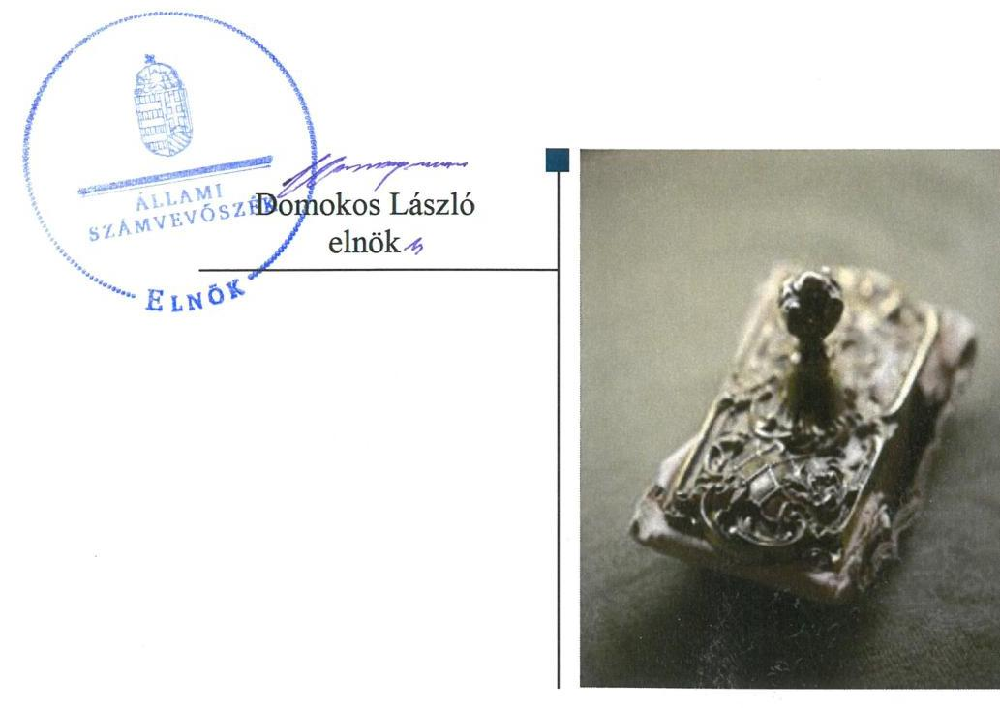

---

Jelentéseink az Országgyűlés számítógépes hálózatán és az Interneten a www.asz.hu címen is olvashatóak.

## AZ ELLENŐRZÉST FELÜGYELTE:

HOLMAN MAGDOLNA JULIANNA felügyeleti vezető

## AZ ELLENŐRZÉST VEZETTE ÉS A VÉGREHAJTÁSÁÉRT FELELŐS:

KISTÓTH KRISZTINA ellenőrzésvezető

## A PROGRAM ÖSSZEÁLLÍTÁSÁÉRT FELELŐS:

SZAPPANOS JÚLIA osztályvezető

## A TÉMÁHOZ KAPCSOLÓDÓ KORÁBBI SZÁMVEVŐSZÉKI JELENTÉSEK:

- címe: Önkormányzatok pénzügyi monitoring alapján végzett ellenőrzése - A nagyközségi önkormányzatok gazdálkodásának fenntarthatósága Önkormányzatok pénzügyi monitoring alapján végzett ellenőrzése - A városi önkormányzatok gazdálkodásának fenntarthatósága
- sorszáma: 18081; 19017

IKTATÓSZÁM: EL-2332-001/2019.
TÉMASZÁM: 2504
ELLENŐRZÉS-AZONOSÍTÓ SZÁM: V0848

---

# TARTALOMJEGYZÉK 

- ÉRTÉKELÉS ..... 5
- KÖVETKEZTETÉS ..... 7
- AZ ELLENŐRZÉS CÉLJA ..... 8
- AZ ELLENŐRZÉS TERÜLETE ..... 9
- AZ ELLENŐRZÉS HÁTTERE, INDOKOLTSÁGA ..... 10
- A JELENTÉS LÉNYEGES KÉRDÉSKÖREI ..... 11
- AZ ELLENŐRZÉS HATÓKÖRE ÉS MÓDSZEREI ..... 12
- MEGÁLLAPÍTÁSOK ..... 14
MELLÉKLETEK ..... 25
I. sz. melléklet: Fogalomtár ..... 25
II. sz. melléklet: Az ellenőrzési kritériumok módszertana és értékelése ..... 28
III. sz. melléklet: Az eszközök és források alakulása kiemelt mérlegsoronként a 2016-2017. években (E Ft) ..... 30
IV. sz. melléklet: Pénzügyi egyensúlyi helyzet CLF módszer szerinti értékelése a 2016-2017. években (E Ft) ..... 31
V. sz. melléklet: Az Önkormányzatok 2016-2017. évi főbb mutatóinak és kockázati területeinek összefoglaló értékelése ..... 33
VI. sz. melléklet: Az Önkormányzatok 2016-2017. évi főbb mutatóinak és kockázati területeinek részletes értékelése ..... 34
VII. sz. melléklet: Monitoring alá vont Önkormányzatok ..... 36
FÜGGELÉKEK ..... 39
I. sz. függelék: A jelentésben beazonosított 2017 évre vonatkozó kockázatokkal érintett önkormányzatok ..... 39
II. sz. függelék: Észrevételek ..... 41
- RÖVIDÍTÉSEK JEGYZÉKE ..... 47

---

.

---

# ÉRTÉKELÉS 

Az Állami Számvevőszék az önálló polgármesteri hivatallal rendelkező, község településtípusba tartozó 220 önkormányzat gazdálkodásának a kockázatait értékelte. A 2016. és 2017. évekre vonatkozó önkormányzati éves beszámolók adatai szerint az önkormányzatok gazdálkodása stabil, a pénzügyi egyensúly és a vagyon értékének megőrzése biztosított volt. Az önkormányzatok a vagyonnövekedés mellett pozitív és növekvő pénzügyi pozícióval rendelkeztek, az adósságkonszolidációt követően a gazdálkodásuk fenntarthatósága biztosított volt.

## Az ellenőrzés társadalmi indokoltsága

A magyar települési önkormányzatok a 2002-2008. között felhalmozott adósságállományának állami konszolidációjára 2011. és 2014. között került sor. Az adósságkonszolidációk eredményeként az önkormányzatok feladatellátása újra strukturálódott, rendszerszinten pénzügyi helyzetük helyreállt. Ugyanakkor az önkormányzatok gazdálkodásából eredő veszélyek miatt az ASZ továbbra is kiemelt figyelmet fordít az önkormányzatok pénzügyi egyensúlyi helyzetére ható kockázatok monitorizálására, a pénzügyi sérülékenységet okozó folyamatokra, az önkormányzati alrendszert veszélyeztető rendszeregyensúlyi kockázatokra annak érdekében, hogy a konszolidáció eredményei fenntarthatóak legyenek.

A Magyar Államkincstár központi információs rendszerében rendelkezésre álló önkormányzati éves költségvetési beszámolók adatait felhasználva, az önkormányzatok pénzügyi- és vagyongazdálkodási, valamint eladósodottság területen végzett monitoring riportok kiértékelésével az ASZ hozzájárul azon kockázatos területek feltárásához, amelyek rendszerszintű, vagy egyedi önkormányzati szintű beavatkozást igényelnek az önkormányzatok pénzügyi egyensúlyának fenntarthatósága érdekében.

Az önkormányzati törvény az önkormányzatok teherbíró képességére figyelemmel a differenciált hatáskör telepítés elvén alapul. Ez megjelenik az éves költségvetésükben. Erre figyelemmel a pénzügyi monitoringon alapuló ellenőrzés lehetőséget ad az egyes településtípus szerinti települések pénzügyi-gazdasági helyzetének rendszerszintű értékelésére, és a kockázatforrást jelentő területek beazonosítására. A községi településtípusba tartozó önkormányzatokon belül önálló kockázati csoportot képeztünk az önálló polgármesteri hivatallal rendelkező községi önkormányzatokra. Emellett a monitoring típusú ellenőrzés az ASZ erőforrásainak hatékony felhasználásával, az adatbekérések minimalizálásával, a kockázatokra fókuszáltan, széles lefedettséget képes biztosítani az önkormányzati alrendszer területén.

---

# Főbb megállapítások 

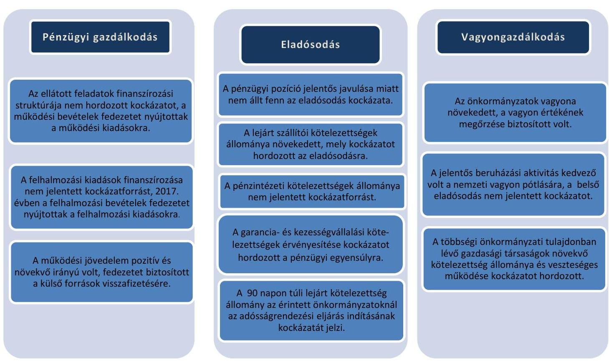

Az ellenőrzött időszakban az önálló polgármesteri hivatallal rendelkező, összesen 220 községi önkormányzat gazdálkodása stabil volt. Az önkormányzatok vagyonának növekedése erős pénzügyi pozíció mellett következett be.

Az ellenőrzés azonban a 2017. év végi adatok alapján 3 községi önkormányzat esetében tárt fel az adósságrendezési eljárás megindításának a veszélyét jelentő kockázatot, amely a feladat ellátás tekintetében is magas kockázatot hordozott.

---

# KÖVETKEZTETÉS 

Az önálló polgármesteri hivatallal rendelkező, községi önkormányzatok pénzügyi egyensúlya a feladatok és a feltételek lényeges változása nélkül fenntartható, rendszerszintű beavatkozást nem igényel. A működési jövedelem a hitel- és tőketörlesztésre fedezetet nyújt, az eladósodás rendszerszintű kockázata nem áll fenn. A vagyon gyarapodása a felmerülő pénzügyi kockázatokat mérsékli. A vagyon megőrzése érdekében azonban hosszabb távon erőfeszítéseket kell tenni az európai uniós támogatások függvényében.
A pénzügyi gazdálkodás, az eladósodás és a vagyongazdálkodás területén a 220 önálló polgármesteri hivatallal rendelkező, községi önkormányzat önkormányzati szintű kockázatait is értékeltük. A 2017. évre vonatkozó értékelést megküldtük a kockázatokkal érintett településekre, megjelölve a kockázatos területeket. E településeken közel 247 ezer ember él, az ellenőrzéssel érintett lakosság 39%-a.
Figyelemfelhívó levél keretében jeleztük

- a jelentés I. sz. függelékében szereplő, negatív működési jövedelemmel, 90 napon túli lejárt szállítóállománnyal, lejárt kötelezettségekkel, valamint magas garancia-és kezességvállalással rendelkező, összesen 57 önkormányzat;
- a pénzügyi gazdálkodás, az eladósodás, a vagyongazdálkodás kockázati értékelését követően a kettő, vagy három területen közepes kockázattal rendelkező, összesen 27 önkormányzat
gazdálkodásából eredő 2017. évi kockázatokat. A pénzügyi egyensúly megteremtése, fenntartása érdekében, figyelemmel a 2018-2019-ben bekövetkezett változásokra ezen önkormányzatoknak a kockázatokat a 2019. év tekintetében értékelni kell. A kockázatok súlyának, a működési egyensúlyra és a feladatellátásra gyakorolt hatásának megfelelően kell az önkormányzatoknak a kockázatokat kezelniük, az intézkedéseket megtenniük.

---

# AZ ELLENŐRZÉS CÉLJA

**AZ ELLENŐRZÉS CÉLJA** az önkormányzatok központi információs rendszerében szereplő adatok értékelése alapján beazonosított kockázatok kezelésének előmozdítása.

---

# **AZ ELLENŐRZÉS TERÜLETE**

## **A község településtípushoz tartozó 220 önkormányzat**

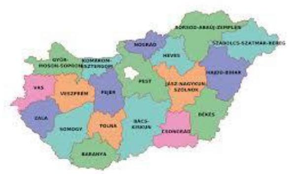

A 2678 községi önkormányzatból önálló kockázati csoportot képez a 220 község településtípusba tartozó Önkormányzat¹, amelyek - a MÁK² törzskönyvi nyilvántartása szerint a 2016. évben és a 2017. évben is - önálló polgármesteri hivatalt tartottak fenn.

A 220 község állandó lakosságának száma összesen 2016. január 1-én 625 912 fő és 2017. január 1-én 627 895 fő volt, kis mértékben, 1983 fővel nőtt. A települések 2017. január 1-ei népességszámát figyelembe véve a lakosság száma 152 önkormányzatnál 3 000 fő alatt, 45 önkormányzatnál 3 001-4 000 fő között, míg 23 önkormányzatnál 4 001 fő felett alakult.

Az Önkormányzatok esetében az egy állandó lakosra jutó működési kiadások összege a 2016. évben 134,6 ezer Ft, a 2017. évben 135,2 ezer Ft, míg az egy lakosra jutó helyi adóbevétel a 2016. évben 31,8 ezer Ft, a 2017. évben 33,9 ezer Ft összegben teljesült.

A 220 község közül a 105/2015. (IV. 23.) Korm. rendelet³ szerint 2017. január 1-jéig a társadalmi-gazdasági és infrastrukturális szempontból kedvezményezett települések száma 40, a jelentős munkanélküliséggel sújtott települések száma 37, az átmenetileg kedvezményezett települések száma pedig 18 darab volt. Az Önkormányzatok közül a 2016. évben 71, míg a 2017. évben 85 önkormányzat kapott önkormányzati rendkívüli támogatást.

Az önkormányzati többségi tulajdoni hányadú gazdasági társaságok száma a 2015. évről 2016. évre 11 darabbal növekedett, a 2016. és a 2017. években 67 gazdasági társaság működött.

2016. évben 6 önkormányzat szüntette meg egy-egy közfeladat ellátására létrehozott intézményét (1 óvoda, 1 idősek otthona és 4 művelődési, közösségi könyvtár). 2017. évben 13 önkormányzat 14 közfeladatot ellátó intézménnyel bővült, melyek mindegyike óvodai és étkeztetési feladatot látott el.

Az Önkormányzatok összevont költségvetési beszámolók szerint teljesített éves költségvetési bevételét és költségvetési kiadását, a könyvviteli mérleg szerinti eszközök, a követelések és kötelezettségek állományi értékét az 1. táblázat mutatja be (M Ft⁴).

|  Év | Bevételek | Kiadások | Eszközök | Követelések | Kötelezettségek  |
| --- | --- | --- | --- | --- | --- |
|  2016. | 104 438,4 | 98 375,3 | 472 306,0 | 10 463,3 | 6 171,0  |
|  2017. | 141 878,5 | 115 820,7 | 516 798,2 | 14 891,2 | 6 945,5  |

*Forrás: Önkormányzatok beszámolói*

---

# AZ ELLENŐRZÉS HÁTTERE, INDOKOLTSÁGA 

AZ ÁSZ STRATÉGIÁJÁBAN célul tűzte ki, hogy az önkormányzatok ellenőrzése során azok pénzügyi-gazdasági helyzetét értékeli, kockázatait feltárja. Az új megközelítésű monitoring rendszer egyszerűsített ellenőrzési módszerének az eredményeként megtörténik az önkormányzatok pénzügyi, vagyoni helyzetének megítélése, a pénzügyi egyensúly minősítése, továbbá a változások hatásának értékelése.

AZ ÖNKORMÁNYZATI ALRENDSZERBEN megjelenő gazdálkodási nehézségek, likviditási problémák és az eladósodottság növekedése az ÁSZ figyelmét a 2011. évtől az önkormányzatok pénzügyi helyzetére irányította. Az önkormányzati feladatellátást érintő átalakítások meghatározó része a 2013. évben következett be azzal, hogy az igazgatási, az oktatási, az egészségügyi és a szociális ellátásban a feladatok jelentős hányadát átvette az állam.

Az önkormányzati alrendszerben a 2013. évtől bevezetett új feladatfinanszírozási rendszer keretein belül továbbra is megoldandó kérdés a pénzügyi egyensúly megteremtése, hosszú távú fenntartása. Ahhoz, hogy az önkormányzatok meg tudjanak felelni a számukra meghatározott - szigorúbb - gazdálkodási szabályoknak, és az új feltételek mellett is biztosítható legyen a közszolgáltatások megfelelő színvonalú ellátása, szükséges volt a pénzügyi-gazdasági rendszerük alapjainak megszilárdítása, amely célt az adósságkonszolidáció szolgálta.

Az adósságkonszolidáció az önkormányzatok pénzügyi egyensúlyi helyzetére kedvező hatást gyakorolt, azonban a problémák kiváltó okait nem szüntette meg, ennek kezelése nélkül viszont az adósságállomány újratermelődhet. Erre tekintettel kiemelt fontosságú az önkormányzatok pénzügyi egyensúlyi helyzetére ható kockázatok feltárása.

---

# A JELENTÉS LÉNYEGES KÉRDÉSKÖREI 

1. Az önkormányzatok pénzügyi gazdálkodásának fenntarthatósága biztosított volt-e?
2.     - Fennállt-e az önkormányzatok eladósodásának kockázata?
3.     - Az önkormányzatok vagyongazdálkodása során biztosított volt-e a vagyon értékének a megőrzése?

---

# AZ ELLENŐRZÉS HATÓKÖRE ÉS MÓDSZEREI 

## Az ellenőrzés típusa

Helyénvalósági ellenőrzés.

## Az ellenőrzött időszak

A 2016-2017. évek.

## Az ellenőrzés tárgya

Az önkormányzati gazdálkodás fenntarthatósága, a törvényben előírt feladatok ellátása, az önkormányzatoknál észlelt negatív tendenciák okainak feltárása.

## Az ellenőrzött szervezet

Belügyminisztérium, mint a Kormány helyi önkormányzatokért felelős tagja által vezetett minisztérium, valamint a VII. számú melléklet szerinti monitoring alá vont önkormányzatok.

## Az ellenőrzés jogalapja

Az ellenőrzés jogszabályi alapját az Állami Számvevőszékről szóló 2011. évi LXVI. törvény 1. § (3) bekezdésének, az 5. § (2)-(6) bekezdéseinek, valamint az államháztartásról szóló 2011. évi CXCV. törvény 61. § (2) bekezdésének előírásai képezték.

## Az ellenőrzés módszerei

Az ellenőrzést az ellenőrzési program ellenőrzési kérdései, az ellenőrzött időszakban hatályos jogszabályok, az ellenőrzés szakmai szabályok és módszertanok figyelembe vételével végeztük.

Az ellenőrzés ideje alatt az ellenőrzött szervezettel történő kapcsolattartást az ÁSZ SZMSZ ${ }^{\text {I}}$-ének vonatkozó előírásai alapján biztosítottuk.

Az ellenőrzési kérdések megválaszolásához szükséges bizonyítékok megszerzése a Magyar Államkincstár által rendelkezésre bocsátott adatokra alapozva elemző eljárással történt, amelyeket mintavétel alapján kontrolláltunk a nyilvánosan elérhető adatbázisokban szereplő adatokkal.

---

Az ÁSZ az ellenőrzés előkészítése során meghatározta az ellenőrzési (helyénvalósági) kritériumokat, amelyek az ellenőrzési bizonyíték értékelésének, valamint a számvevőszéki jelentésben szereplő megállapítások és következtetések alapját képezték. A megállapításokban használt fogalmak értelmezését, forrását a fogalomtár, a mutatók helyénvalósági kritériumait, és a kockázatok értékelését az

 ellenőrzési kritériumok módszertana és értékelése tartalmazza.

A pénzforgalmi adatokat tartalmazó mutatók számításánál a 2016. évben a 2015. évi végi adatokat, a 2017. évben a 2016. év végi adatokat tekintettük bázis adatnak. A mérlegadatokat tartalmazó mutatók esetében a 2016. január 1. és 2017. december 31. közötti adatokkal számoltunk. A gazdasági társaságok esetében a 2016. és 2017. évi VI. havi időközi költségvetési jelentésekben szereplő 2016. december 31.-re és 2017. december 31.-re vonatkozó társasági adatokat vettük figyelembe.

A mintatételek (kormányzati jóváhagyással megkötött hosszú lejáratú adósságot keletkeztető ügyletek, valamint a többségi önkormányzati tulajdonban lévő gazdasági társaságok kötelezettségei) ellenőrzése során felhasználtunk nyilvánosan elérhető adatokat (zárszámadási rendeletek, e-beszámoló, cégnyilvántartás adatai).

Az ellenőrzési kérdésekre adott válaszok alapján értékeltük, hogy az Önkormányzatok képesek voltak-e a törvényben meghatározott feladataikat ellátni, gazdálkodásuk változatlan formában fenntartható-e.

Az értékelést a felülvizsgált adatok alapján végezte az ÁSZ. A felülvizsgálat eredményeképpen a 220 önkormányzat 13,63%-ánál hajtott végre az ÁSZ adatkorrekciót az önkormányzatok többségi tulajdonában lévő gazdasági társaságokkal kapcsolatos adatokban, mely jelzi az önkormányzati beszámolók ezen területének megbízhatósági kockázatát.

---

# 1. Az önkormányzatok pénzügyi gazdálkodásának fenntarthatósága biztosított volt-e? 

Összegző megállapítás

A 2016-2017. években az Önkormányzatok működés, felhalmozás és adósságszolgálat finanszírozási struktúrája biztosította a feladatellátást és a pénzügyi gazdálkodás fenntarthatóságát.

## 2. táblázat

| MUTATÓK ALAKULÁSA |  |  |
| :--: | :--: | :--: |
| Mutatók | 2016. | 2017. |
|  | ex | ex |
| Működési kiadások fedezettsége | 109,3% | 110,5% |
| Rendkívüli önkormányzati támogatás aránya | 0,65% | 0,86% |
| Adóbevételek működési bevételeken belüli aránya | 21,6% | 22,7% |
| Felhalmozási kiadások fedezettsége | 87,4% | 155,5% |

A 2016-2017. években az Önkormányzatok működés, felhalmozás és adósságszolgálat finanszírozási struktúrája biztosította a feladatellátást és a pénzügyi gazdálkodás fenntarthatóságát.

AZ ÖNKORMÁNYZATOK ÁLTAL ELLÁTOTT FELADATOK működési kiadásaira a működési bevételek 2016. évben 109,3%-ban és 2017. évben 110,5%-ban fedezetet nyújtottak. A működési kiadások fedezettsége mutató értékének 1,2 százalékpontos emelkedését okozta, hogy a működési bevételek (1698,1 M Ft-tal, 1,84%-kal) nagyobb mértékben emelkedtek, mint a működési kiadások (628,7 M Ft-tal, 0,75%-kal). A 220 községi önkormányzatból 2016. évben 178, míg a 2017. évben 184 önkormányzat esetében a működési bevételek meghaladták a működési kiadásokat.

A működési kiadásokon belül a 2016. évről a 2017. évre a személyi juttatásoknál és a dologi kiadásoknál 3-3%-os, az egyéb működési célú kiadásoknál 2%-os, az elvonásoknál és befizetéseknél 12%-os emelkedés történt. A közhatalmi bevételek 1389 M Ft, 6,9%-os 2016. évről a 2017. évre való növekedése elegendő fedezetet nyújtott a működési kiadások növekedésére.

Az Önkormányzatok által ellátott feladatokban bekövetkezett változások nem gyakoroltak jelentős hatást a működési költségvetési egyensúlyra. A 2017-ben új feladatokat ellátó 13 önkormányzat közül 12 esetében a működési bevételek biztosították a fedezetet a működési kiadásokra.

## RENDKÍVÜLI ÖNKORMÁNYZATI TÁMOGATÁSBAN

2016. évben 71 önkormányzat 603,1 M Ft értékben és a 2017. évben 85 önkormányzat 806,5 M Ft értékben részesült. A rendkívüli támogatás működési bevételekhez viszonyított aránya alacsony volt, a 2016. évben 0,65% míg a 2017. évben 0,86%.

Az Önkormányzatok átlagosan 2016. évben 8,5 M Ft és 2017. évben 9,5 M Ft rendkívüli önkormányzati támogatásban részesültek, a támogatás értéke a két évben önkormányzatonként 6 ezer Ft és 53 M Ft illetve 43 ezer Ft és 91 M Ft között mozgott. A rendkívüli támogatás aránya a működési bevételekhez viszonyítva 2016-ban 0,002-10,137% és 2017-ben 0,012-30,746% sávban változott.

A működési bevételek a rendkívüli önkormányzati támogatások nélkül is fedezetet nyújtottak a működési kiadásokra a 2016. (108,6%) és a 2017. években (109,5%), a 220 önkormányzat vonatkozásában a működés finanszírozása nem jelentett kockázatot a gazdálkodás fenntarthatóságára.

---

A 2016. évben 27 önkormányzat, a 2017. évben 30 önkormányzat esetében az önkormányzati rendkívüli támogatás nélkül a működési bevételek nem nyújtottak volna fedezetet a működési kiadásokra, a negatív működési jövedelem kockázatot hordozott az érintett önkormányzatok működési költségvetési egyensúlyára, önfenntartó működésére.

AZ ADÓBEVÉTELEK állománya a működési bevételeken belül a 2016. évi 19925 M Ft-ról 2017. évre 21254 M Ft-ra, 6,7%-kal nőtt. A helyi adóbevételek aránya a működési bevételeken belül a 2016. évben 21,6%, a 2017. évben 22,7% volt.

Az iparűzési adóbevételnek az adóbevételeken belüli aránya meghatározó, a 2016. és 2017. évben is 69,5% volt. Az iparűzési adó állománya a 2016. évi 13856 M Ft-ról, 2017-re 14776 M Ft-ra, 920 M Ft-al, 6,6%-kal emelkedett.

Az adóbevételek növekedése kedvező hatást gyakorolt az Önkormányzatok folyó költségvetési egyenlegére, a közfeladatok finanszírozási struktúrájának fenntarthatóságára.

Az adóbevételek - kiemelten a helyi iparűzési adóbevételek - alakulását az 1. ábra mutatja be.
1. ábra

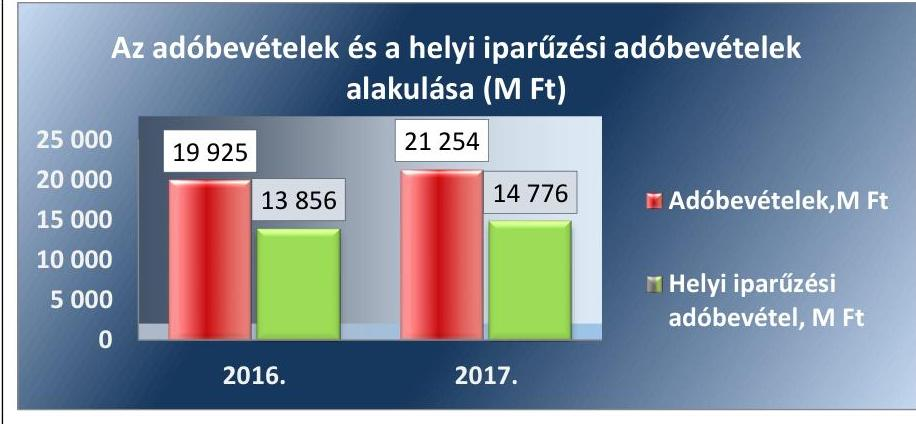

A FELHALMOZÁSI KIADÁSOK finanszírozása nem jelentett kockázatforrást az Önkormányzatok pénzügyi gazdálkodására.

Az Önkormányzatok a 2016. évben a költségvetési kiadások 14,3%-át, majd a 2017. évben 26,7%-át fordították fejlesztésekre. A felhalmozási bevételek a 2016. évben 87,4%-ban, a 2017. évben pedig a kiadásokat 55%-al meghaladó mértékben (155,5%-ban) nyújtottak fedezetet a felhalmozási kiadásokra, a mutató értéke a 2016. évről a 2017. évre jelentős mértékben kedvezően 68,1 százalékponttal emelkedett.
2016. évben a felhalmozási költségvetés hiányára a működési jövedelem (folyó költségvetés egyenlege) fedezetet nyújtott, a finanszírozási bevételek nélküli pénzügyi pozíció (a folyó és a felhalmozási költségvetés egyenlege) 6063,1 M Ft egyenleget mutatott. 2017. évben a felhalmozási bevételek fedezetet nyújtottak a felhalmozási kiadásokra.

A mutatók alakulását a 2. táblázat tartalmazza.
A 2016-2017. évek felhalmozási bevételeinek forrásösszetételét a 2. ábra mutatja be.

---

2. ábra
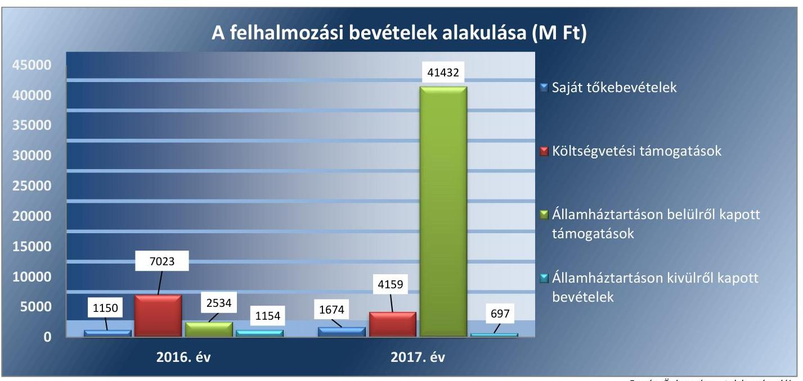

Fonrás: Önkormányzatok beszámolói
3. táblázat

| MUTATÓK ALAKULÁSA |  |  |
| :--: | :--: | :--: |
| Mutatók | 2016. év | 2017. év |
| Törlesztés fedezettségének aránya | 17,0% | 10,4% |
| Nettó működési jövedelem (M Ft) | 6505,1 | 7982,3 |

A beruházási, felújítási aktivitás nagymértékben megnőtt, 2016-ról 2017-re, a beruházásra és felújításra fordított kiadások 13 239,6 M Ft-ról, 30 344,9 M Ft-ra nőttek. 2017. évben, az előző évhez viszonyított növekedés mértéke 129% volt. A jelentős növekedéshez a forrást az államháztartáson belül kapott támogatások 38 898,7 M Ft-os emelkedése biztosította. Az államháztartáson belülről kapott támogatások jelentős részét képezték a Széchenyi 2020 operatív programjai keretében elnyert pályázati források, melyet a támogatásban részesülő önkormányzatok többsége a szennyvízelvezetéssel és kezeléssel, hulladékkezeléssel, vízgazdálkodással, infrastrukturális fejlesztéssel, valamint oktatással és foglalkoztatással kapcsolatos feladatellátásra kapott.

## AZ IGÉNYBEVETT KÜLSŐ FORRÁSOK VISSZAFIZETÉSE a 2016. és 2017. években nem hordozott kockázatot az Önkormányzatok pénzügyi gazdálkodásának fenntarthatóságára.

Az Önkormányzatoknak a 2016. évben + 7839,7 M Ft a 2017. évben + 8909,1 M Ft működési jövedelme keletkezett, a növekedés 13,6% volt. Az Önkormányzatok működési jövedelme fedezetet nyújtott a külső források adósság-szolgálatának teljesítésére, annak a 2016. évben 17,0%-át, míg a 2017. évben 10,4%-át kellett hiteltörlesztésre (tőketörlesztésre) fordítani.

Az Önkormányzatoknak a 2016. évben 6505,1 M Ft és 2017. évben 7982,3 M Ft nettó működési jövedelme keletkezett. A nettó működési jövedelem kedvezően változott, a 2016. évről a 2017. évre 22,7%-kal, 1477,2 M Ft-tal nőtt, alakulására hatással volt a működési jövedelem 13,6%-os növekedése, valamint a hiteltörlesztésre fordított kiadások 30,6%-os csökkenése.

A mutatók alakulását a 3. táblázat tartalmazza.
A 2016-2017. évi alacsony törlesztés fedezettség arány és annak kedvező, 6,6 százalékpontos csökkenése, továbbá a pozitív és növekvő nettó működési jövedelem mutatja, hogy az Önkormányzatok képesek voltak

---

biztosítani az adósságszolgálat finanszírozását, a külső források visszafizetésének feltételei kedvezően változtak.

# 2. Fennállt-e az önkormányzatok eladósodásának kockázata? 

## Összegző megállapítás

Az Önkormányzatok gazdálkodásában az eladósodás kockázata nem állt fenn. Azonban a lejárt kötelezettségek növekedése, ezen belül a 90 napon túli lejárt kötelezettségek kockázatot hordoztak a feladatellátásra.

## 4. táblázat

| MUTATÓK ALAKULÁSA |  |  |
| :--: | :--: | :--: |
| Mutatók | 2016. év | 2017. év |
| Eladósodási mutató | 1,3% | 1,34% |
| Eladósodási mutató változása százalékpontban | -0,18 | +0,04 |

Forrás: Önkormányzatok beszámolói

A PÉNZÜGYI EGYENSÚLY az Önkormányzatoknál a 2016. és a 2017. évben is biztosított volt. Az Önkormányzatok költségvetési bevételei a 2016. és a 2017. évben fedezetet nyújtottak a költségvetési kiadásokra, a maradvány igénybevétele - 2016. évben 21383,0 M Ft, a 2017. évben 25352,2 M Ft volt - tovább javította az Önkormányzatok pénzügyi helyzetét.

A pénzügyi egyensúlyi helyzet alakulását a 3. ábra mutatja be.
3. ábra
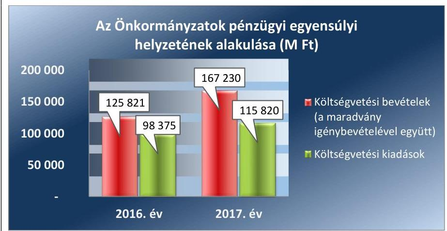

Forrás: Önkormányzatok beszámolói
Az Önkormányzatok forrásainak összetételében az idegen források aránya alacsony volt, az eladósodási mutató a 2016. évi 1,3%-ról 2017. évben 1,34%-ra, kismértékben változott, 0,04%-ponttal növekedett, nem hordozott kockázatot az Önkormányzatok pénzügyi egyensúlyára. A mutató értékének változására hatással volt, hogy a kötelezettségek állománya, ezen belül az éven belüli és éven túli beruházási és felújítási kötelezettségek, nagyobb mértékben (12,6%-kal nőtt) emelkedett, mint a mérlegfőösszeg (9,4%-kal nőtt). Az eladósodási mutató az Önkormányzatoknál eltérően alakult, a 2016. évben 0,1-15,4% közötti, a 2017. évben 0,1-14,2% közötti sávban változott.

Az Önkormányzatok pénzügyi pozíciója a 2016. és a 2017. években is pozitív volt, 3896,1 M Ft, illetve 23 314,5 M Ft értékben realizálódott. A 2017. évi pénzügyi pozíció előző évhez viszonyított kedvező, közel ötszörös emelkedését a folyó költségvetés pozitív egyenlege mellett 2017-ben a 17148 M Ft értékű felhalmozási költségvetés egyenleg okozta. Ugyanakkor az Önkormányzatok tárgyévi pénzügyi pozícióját rontotta 2016. évben a felhalmozási költségvetés -1776,5 M Ft és a finanszírozási műveletek

---

5. táblázat

| MUTATÓK ALAKULÁSA |  |  |
| :--: | :--: | :--: |
| Mutatók | 2016. 41 | 2017. 41 |
| Kötelezettségek dologi, felújítási beruházási kiadásokra állomány változása | -10,2% | 6,1% |
| Lejárt dologi, felújítási beruházási kiadásokkal kapcsolatos kötelezettségek állomány aránya (szállítói állományból) | 8,8% | 10,9% |
| Lejárt dologi, felújítási, beruházási kiadásokkal kapcsolatos kötelezettségek állomány változása | 88,0% | 30,9% |
| Lejárt szállítói állomány aránya a dologi kiadások egy havi átlagához viszonyítva | 5,4% | 7,0% |
| 90 napon túl lejárt kötelezettségek állományának aránya (összes köt. állományból) | 0,6% | 0,5% |

Forrás: Önkormányzatok beszámolói

-2167,0 M Ft, míg 2017. évben a finanszírozási műveletek -2743,3 M Ft negatív egyenlege. A pozitív, kedvező pénzügyi pozíció a 2016. évben 126, míg a 2017. évben 170 önkormányzatnál teljesült. A mutatók alakulását a 4. táblázat tartalmazza.

A finanszírozási műveletek nem hordoztak kockázatot, a negatív finanszírozási egyenleget a 2016. évben az értékpapírok értékesítését 2137,5 M Ft-tal meghaladó értékpapír-vásárlás okozta. 2017. év során mind a hitelfelvétel mind a hiteltörlesztés értéke 30%-ot meghaladóan csökkent, az értékpapíroknak jelentős összegű, az értékesítést (
 4507 M Ft ) 3056,6 M Ft-tal meghaladó vásárlása ( 7563,6 M Ft) mellett. A 2016. évről a 2017. évre az Önkormányzatok pénzeszközei közel megduplázódtak 22 732,2 M Ft-tal, 49 798,8 M Ft-ra, míg a tartós és forgatási célú értékpapírok állománya 6198,1 M Ft-ra emelkedett.

A SZÁLLÍTÓI KÖTELEZETTSÉG állománya (az Önkormányzatok dologi, beruházási és felújítási kiadásokkal kapcsolatos kötelezettsége) a 2016. évben 10,2%-kal csökkent, míg a 2017. évben 6,1%-kal növekedett az előző időszakhoz képest. A 2017. évi növekedés oka a beruházások és felújítások kötelezettségeinek 60%-ot meghaladó mértékű (261,6 M Ft) növekedése az előző időszakhoz képest.

Az Önkormányzatoknál a 2016-2017. években a szállítói kötelezettségek határidőre való nem teljesítésének következményeként a lejárt szállítói kötelezettségek nagysága kedvezőtlenül alakult, mert a 2016. évben 88,0%-kal, a 2017. évben 30,9%-kal emelkedett az előző évhez képest.

A szállítói állományon belül a lejárt szállítói állomány aránya a 2016. évben 8,8%, a 2017. évben 10,9% volt. Az arány kedvezőtlenül változott, emelkedett, a 2016. év végére 4,6 százalékponttal, míg 2016. évről a 2017. évre további 2,1%-ponttal. A 2016. évben 43 és a 2017. évben 40 önkormányzat rendelkezett lejárt szállítói állománnyal, melyből 2016-ban 25 és 2017-ben 20 önkormányzatnál a lejárt szállítói állomány aránya meghaladta a 25%-ot. A dologi kiadásokhoz kapcsolódó lejárt kötelezettségeknek a dologi kiadások egy havi átlagához viszonyított aránya kismértékben 1,6 százalékponttal szintén emelkedett (2016. évben 5,4%-ra, a 2017. évben 7,0%-ra teljesült).

A lejárt szállítói kötelezettség növekvő aránya kockázatot jelent, az érintett önkormányzat eladósodására. A mutatók alakulását az 5. táblázat tartalmazza.

A szállítói kötelezettségek állománya alakulását a 4. ábra szemlélteti.
4. ábra
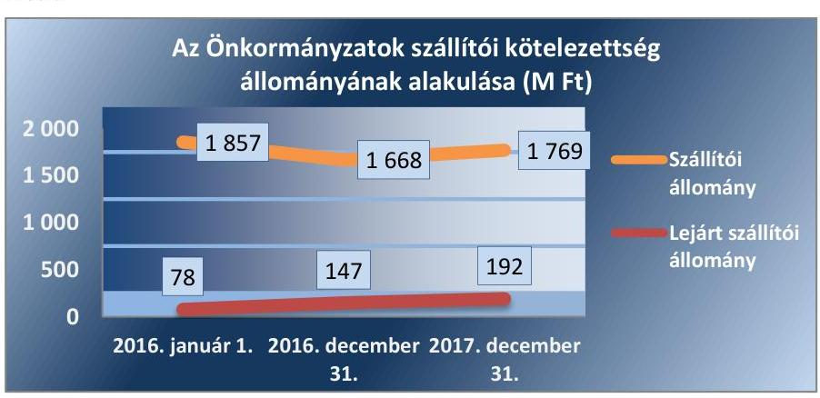

---

6. táblázat

| MUTATÓK ALAKULÁSA |  |  |
| :--: | :--: | :--: |
| Mutatók | $\begin{gathered} 2016 . \\ \text { év } \end{gathered}$ | $\begin{gathered} 2017 . \\ \text { év } \end{gathered}$ |
| Banki kötelezettség állomány mérlegfőösszeghez mért nagysága | $0,1 \%$ | $0,1 \%$ |
| Banki kötelezettségek állományának változása | $-17,0 \%$ | $-1,0 \%$ |
| Garancia- és kezességvállalások állománya, M Ft | 250,2 | 70,7 |

Forrás: Önkormányzatok beszámolói

Az Önkormányzatok a 2016. év végén 38,0 M Ft, a 2017. év végén 36,2 M Ft 90 napon túl lejárt tartozással rendelkeztek. A 2016. évről a 2017. évre csökkent mind a 90 napon túl lejárt kötelezettségek állománya 4,7%-kal, mind az állomány aránya az összes kötelezettséghez viszonyítva 0,1 százalékponttal. A csökkenő mérték mellett azonban a 90 napon túli kötelezettségek fennállása továbbra is az adósságrendezés, a pénzügyi függetlenség elvesztésének, korlátozásának kockázatát hordozza.

90 napon túl lejárt kötelezettsége a 2016. évben 16, a 2017. évben 12 önkormányzatnak volt. 2017. évben az érintett 12 önkormányzat közül Jászdózsa, Kengyel és Nyírkáta önkormányzatainál adósságrendezési eljárás indításának a veszélyét jelentő kockázatot azonosított az ellenőrzés, mert a 90 napon túli lejárt kötelezettségállomány mellett negatív működési jövedelemmel rendelkeztek. A negatív működési jövedelem mellett nem képződik elég bevétel a kötelezettségek teljesítésére, mely a jövőbeni kockázat kezelés szükségességét jelzi.

A 2016. évben 42, míg a 2017. évben 36 önkormányzat működési jövedelme volt negatív, ebből 14 önkormányzat működési jövedelme mindkét évben negatív volt. A 14 önkormányzat összes működési vesztesége 2016. évben -860,6 M Ft, 2017. évben -466,8 M Ft volt, 2017. évben a nemzeti vagyonba tartozó befektetett eszközeik állománya 108,8 M Ft-tal csökkent, továbbá nőtt a lejárt kötelezettségek 19,1 M Ft-tal és a 90 napon túli kötelezettségek állománya 5 M Ft-tal az előző időszakhoz képest. A 14 önkormányzat vonatkozásában a tartósan negatív működési jövedelem, a vagyoncsökkenés és mind a lejárt, mind a 90 napon túli kötelezettségek növekedése magas kockázatot hordoz a pénzügyi egyensúly fenntartására. Mindez kockázatot jelent a megfelelő színvonalú, gazdaságos, hatékony és eredményes feladatellátásra.

## A PÉNZINTÉZETEK FELÉ FENNÁLLÓ KÖTELE-

ZETTSÉG állomány nem jelentett kockázatot az Önkormányzatok pénzügyi egyensúlyára. A banki kötelezettségállomány kedvezően alakult, mert a mérlegfőösszeghez viszonyított aránya alacsony volt és a 2016. évi 0,14%-ról a 2017. évre 0,13%-ra csökkent. Az Önkormányzatok által igénybevett hitelfelvételek összege nagyobb mértékben (34,2%-kal) csökkent, mint a hiteltörlesztés összege (30,6%-kal), az év végi banki kötelezettség állomány (rövid és hosszúlejáratú hitelek) 2016-ról 1%-kal (6,5 M Ft-tal) 2017. végére 649,0 M Ft-ra csökkent. A 2016. évben 22, míg 2017. évben 27 Önkormányzatnak állt fenn december 31-én pénzintézeti, banki kötelezettségállománya. A mutatók alakulását a 6. táblázat tartalmazza.

A 2016. évben kormányzati jóváhagyással 2 db naptári éven túli futamidejű adósságot keletkeztető ügyletet kötött, 9,3 M Ft összegben 2 önkormányzat infrastrukturális és fejlesztési beruházásokra, míg 2017. évben kormányzati jóváhagyású ügyletkötésre nem került sor. Az Önkormányzatok kormányzati hozzájárulást nem igénylő naptári éven túli futamidejű adósságot keletkeztető ügyletet sem 2016. sem 2017. évben nem kötöttek.

Az Önkormányzatoknál az ellenőrzött időszakban a bankkal szembeni kötelezettségek állománya kedvezően változott, mely az Önkormányzatok pénzügyileg fenntartható gazdálkodását vetíti előre.

---

GARANCIA- ÉS KEZESSÉGVÁLLALÁSBÓL származó függő kötelezettséget 2016. december 31-én 4 önkormányzat mutatott ki 250,2 M Ft értékben, míg 2017. december 31-én ilyen kötelezettség 2 önkormányzatnál 70,7 M Ft összegben állt fenn. A függő kötelezettségállomány kedvezően változott, 2017. év végén 71,7%-kal alacsonyabb volt, mint 2016. év végén.

A 2016. évben garancia- és kezességvállalásból származó kötelezettsége Gönyű (173,0 M Ft, 69,1%), Kóka (73,8 M Ft, 29,5%), Deszk (3,3 M Ft, 1,3%) és Csanytelek (0,1 M Ft, 1% alatti arány) községek önkormányzatainak volt. A 2017. évben Jászalsószentgyörgy (69,4 M Ft, 98,2%) és Görbeháza (1,3 M Ft, 1,8%) önkormányzatai rendelkeztek garancia- és kezességvállalásból származó kötelezettséggel.

A garancia-, és kezességvállalással összefüggésben az adós nem teljesítése miatt a 2016. évben 4 önkormányzatnak 4,4 M Ft, a 2017. évben 3 önkormányzatnak 84,9 M Ft helytállási kötelezettsége keletkezett.

A 2017. év végén fennálló garancia-, és kezességvállalás állomány az érintett két önkormányzatnál kockázatot hordozott, mert annak érvényesítése kedvezőtlenül befolyásolhatja az önkormányzat pénzügyi egyensúlyát.

# 3. Az önkormányzatok vagyongazdálkodása során biztosított volt-e a vagyon értékének a megőrzése? 

Összegző megállapítás

Az Önkormányzatok vagyongazdálkodása során biztosított volt a vagyon értékének megőrzése, ugyanakkor a többségi önkormányzati tulajdonban lévő gazdasági társaságok növekvő kötelezettségállománya és veszteséges működése kockázatot hordozott.
7. táblázat

MUTATÓK ALAKULÁSA

| Mutatók | 2016. év | 2017. év |
| :--: | :--: | :--: |
| Befektetett eszközök fedezettsége | $98,4 \%$ | $100,5 \%$ |
| Ingatlanok és kapcsolódó vagyoni értékű jogok állományának változása (M Ft) | $+24441,1$ | $+6749,1$ |
| Koncesszióba, vagyonkezelésbe adott eszközök állományának változása (M Ft) | $+10148,3$ | $-4996,8$ |
| Eszközpótlási mutató (tárgyi eszközök összesen) | $131,9 \%$ | $77,0 \%$ |
| Eszközpótlási mutató (ingatlanok és kapcsolódó vagyoni értékű jogokra) | $153,5 \%$ | $84,1 \%$ |

A VAGYONVÁLTOZÁS 2016-2017. években nem jelentett kockázatforrást az Önkormányzatok vagyoni helyzetére. A 2016. év január 1-jéről a 2017. év végére az Önkormányzatok könyvviteli mérleg szerinti vagyona kedvezően változott, 84 511,2 M Ft-tal (19,5%-kal), 516 798,2 M Ft-ra nőtt. A vagyon szerkezetében a 2016. és 2017. években bekövetkezett változásokat egyrészt az Önkormányzatok tulajdonában lévő ingatlanok és kapcsolódó vagyoni értékű jogok 8,9%-os, a koncesszióba adott eszközök 22,4%-os, a nemzeti vagyonba tartozó forgóeszközök között az értékpapírok 333,8%-os, a pénzeszközök 120,5%-os és a követelések 113,4%-os növekedése okozta. A vagyon szerkezetében bekövetkezett változásokból a pénzeszközök és az értékpapírok állományának 2016. év január 1-jéről 2017. december 31-ére történő növekedése kiemelkedő volt, melyben jelentős szerepe volt az államháztartáson belülről felhalmozási célra kapott a 2017. évben fel nem használt támogatásoknak.

Az eszközök és források alakulását kiemelt mérlegsoronként a 2016-2017. években a III. számú melléklet tartalmazza. A mutatók alakulását a 7. táblázat tartalmazza. Az ellenőrzött időszakban a befektetett eszközök alakulását az 5. ábra mutatja be.

Forrás: Önkormányzatok beszámolói

---

5. ábra

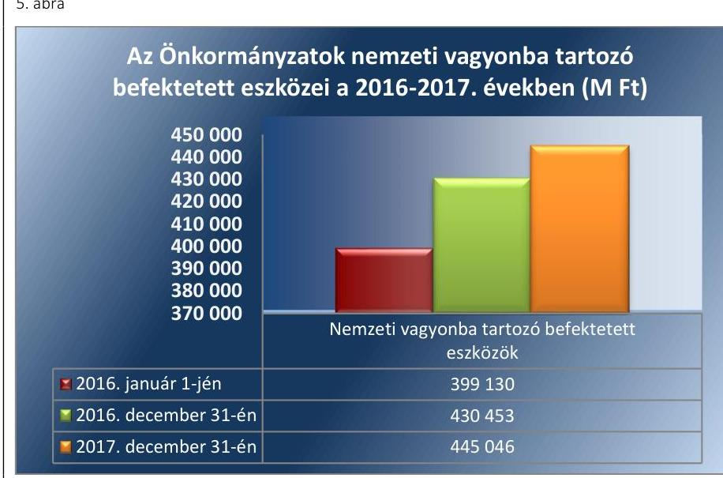

*Forrás: Önkormányzatok beszámolói*

A nemzeti vagyonba tartozó befektetett eszközökön belül a legjelentősebb tételt képviselő ingatlanok és a kapcsolódó vagyoni értékű jogok állománya 2016. évben 24 441,1 M Ft-tal (7,0%-kal), míg a 2017. évben 6749,1 M Ft-tal (1,8%-kal) növekedett. Az Önkormányzatok vagyonnövekedését a saját beruházási és felújítási kiadások kedvező alakulása okozta. Az ellenőrzött időszakban a befektetett eszközökön felüli eszközök összetételét a 6. ábra mutatja be.

6. ábra

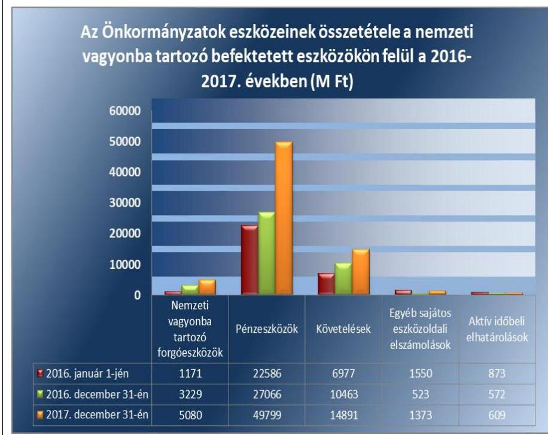

*Forrás: Önkormányzatok beszámolói*

---

Az Önkormányzatoknak a vagyon értékesítéséből 2016. évben 1147,8 M Ft és a 2017. évben 1672,8 M Ft összegű bevétele keletkezett. Ezzel szemben beruházásra, felújításra, a vagyon pótlására a 2016. évben 13 239,6 M Ft-ot és a 2017. évben 30 344,9 M Ft-ot fordítottak. Az Önkormányzatok vagyongazdálkodásuk során a vagyon értékének megőrzésén felül annak növeléséről is gondoskodtak, ezzel biztosították a nemzeti vagyon megőrzését, gyarapítását.

A saját tőke a 2016. évben 98,4%-ban, a 2017. évben 100,5%-ban nyújtott fedezetet a nemzeti vagyonba tartozó befektetett eszközökre. Az Önkormányzatoknak a 2016. évben kis mértékben szükségük volt idegen forrásokra a vagyoni eszközök megszerzéséhez, de a befektetett eszközök fedezettsége az ellenőrzött időszakban javult, így nem jelentett kockázatot a vagyongazdálkodásra. A 2016. és 2017. évben 142 önkormányzat esetében a vagyoni eszközök megszerzéséhez nem volt szükség idegen forrásra.

# A KONCESSZIÓBA ÉS/VAGY VAGYONKEZELÉSBE 

ADOTT ESZKÖZÖK állománya a 2016. évben +10 148,3 M Ft-tal (44,0%) nőtt, míg a 2017. évben -4 996,8 M Ft-tal (15,0%) csökkent, melyet nagy részben a vagyonkezelésbe adás illetve visszavétel okozott. A koncesszióba és, vagy vagyonkezelésbe adott eszközök nem hordoztak kockázatot.

A BELSŐ ELADÓSODÁS az Önkormányzatok vagyongazdálkodására a 2016-2017. években nem jelentett kockázatforrást. Az Önkormányzatoknál az értékcsökkenések kompenzálásaként a szükséges vagyonpótlást jelző tárgyi eszközök eszközpótlási mutatója 2016. évben 131,9%-on, míg 2017. évben 77,0%-on alakult. Az önkormányzat tárgyi eszközeinek legnagyobb részét (2016. évben 94,7%-át, 2017. évben 92,2%-át) az ingatlanok és kapcsolódó vagyoni értékű jogok jelentették, amelynek eszközpótlási mutatója az ellenőrzött években 153,5% és 84,1% volt.

A 2017. évi eszközpótlás elmaradást (4563,6 M Ft) ellentétezte a befejezetlen beruházás állomány év végi magas 15000 M Ft-ot meghaladó értéke, mely a jelentős beruházási aktivitás mellett a hosszú átfutási idejű beruházások és felújítások miatt keletkezett.

A mutatók alakulását a 7. táblázat, a tárgyévben aktivált beruházások, felújítások összegét, a tárgyi eszközök elszámolt értékcsökkenését, valamint a felhalmozási kiadások összegét a 7. ábra mutatja.

---

8. táblázat

| MUTATÓK ALAKULÁSA |  |  |
| :--: | :--: | :--: |
| Mutatók | $\begin{gathered} 2016 . \\ \text { év } \end{gathered}$ | $\begin{gathered} 2017 . \\ \text { év } \end{gathered}$ |
| Többségi önkormányzati tulajdonú gazdasági társaságok kötelezettségei állományának változása | $+5,9 \%$ | $+23,5 \%$ |
| Többségi önkormányzati tulajdonú gazdasági társaságok számának változása (db) | $+11$ | 0 |
| Tartós részesedések állományának változása

 | $+2,37 \%$ | $+1,05 \%$ |

A tárgyévben aktivált beruházások, felújítások, az elszámolt értékcsökkenés, a felhalmozási kiadások és a beruházások, felújítások alakulása (M Ft)
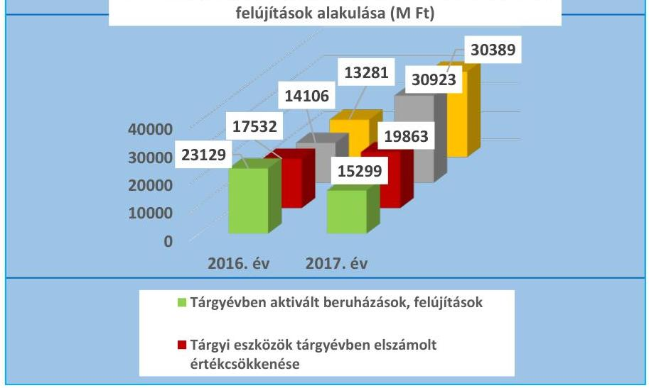

Forrás: Önkormányzatok beszámolói

A beruházási és felújítási kiadások aránya a befektetett eszközökhöz viszonyítva 2016. évben 3% és 2017. évben 6,8% volt, az arány jelentős növekedése kedvező volt a nemzeti vagyon pótlására.

Az Önkormányzatok megőrizték a vagyon értékét, a két éves ellenőrzött időszakban az értékcsökkenések kompenzálásaként a szükséges vagyonpótlás megtörtént.

## A TÖBBSÉGI ÖNKORMÁNYZATI TULAJDONBAN LÉVŐ GAZDASÁGI TÁRSASÁGOK kötelezettségeinek növekedése és veszteséges működése kockázatot hordozott az Önkormányzatok gazdálkodására és vagyongazdálkodására.

Az Önkormányzatok többségi és kisebbségi tulajdont jelentő tartós részesedéseinek állománya összesen az előző évhez képest a 2016. évben 2,37%-kal, a 2017. évben 1,05%-kal emelkedett, amelyet a gazdasági társaságokban történt újabb részesedés szerzés, illetve tőkeemelés okozott. Az Önkormányzatok közül a 2016. és a 2017. évben is 197 Önkormányzat rendelkezett tartós részesedéssel, ezen belül többségi tulajdonú részesedése 2016. és 2017. évben is 56 önkormányzatnak volt.

A többségi tulajdonban lévő gazdasági társaságok (továbbiakban: gazdasági társaságok) száma a 2016. év január 1-jén 56 db volt, ami a 2016. évben 67 db-ra nőtt. 2017. évben a gazdasági társaságok száma nem változott. A mutatók alakulását a 8. táblázat tartalmazza.

A gazdasági társaságok kötelezettségei és eredményei alakulását a 8. ábra mutatja be.

---

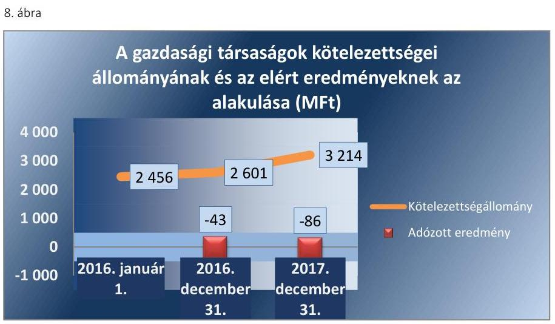

Forrás: Önkormányzatok beszámolói
A gazdasági társaságok kötelezettségeinek állománya a 2016. január 1-jei 2456 M Ft-hoz képest 2016. évben 5,9%-kal, míg 2017. évben 23,5%-kal emelkedett. A kötelezettségek emelkedése - a gazdasági társaságok nemfizetése esetében - az érintett önkormányzatra helytállási kötelezettségeket háríthat. A helytállási kötelezettség pedig kockázatot jelenthet az Önkormányzatok gazdálkodására.

A gazdasági társaságok adózott eredménye 2016. évben -76,1 M Ft és 59,8 M Ft között, a 2017. évben -62,9 M Ft és 65,2 M Ft sávban alakult. Az Önkormányzatok gazdasági társaságainak együttes adózott eredménye mindkét évben negatív volt, 2016. évről a 2017. évre a változás kedvezőtlen volt, mert a veszteség -42,8 M Ft-ról -86,3 M Ft-ra nőtt. Veszteséges volt a gazdálkodása a 2016. évben 28 db és 2017. évben 27 db gazdasági társaságnak, a veszteség összesen a két évben 178,3 M Ft illetve 202,0 M Ft volt.

A gazdasági társaságok kötelezettségének emelkedése mellett a gazdasági társaságok veszteséges működése kockázatot jelent a társaságok stabil fenntartható gazdálkodására, ezáltal pedig a közfeladat-ellátást biztosító működésére. Ez kockázatot hordoz az Önkormányzatok gazdálkodására, mert az önkormányzat a közfeladat ellátás biztosítása érdekében pótlólagos erőforrásokat bocsát a társaság rendelkezésére.

---

# MELLÉKLETEK 

- I. SZ. MELLÉKLET: FOGALOMTÁR
adósságszolgálat
belső eladósodás kockázatforrás
beruházás

CLF módszer
eladósodás kockázatforrás
eszközpótlási mutató
felhalmozási bevétel
felhalmozási kiadás
felhalmozási kiadások és finanszírozása kockázatforrás
felújítás
finanszírozás kockázatforrás
folyó bevétel
folyó kiadás
folyó költségvetés egyen-
lege

Az adósság tőkerészének és az esedékes kamat együttes összegének törlesztése. Kockázatforrást jelent, ha az értékcsökkenések kompenzálásaként a szükséges vagyonpótlás nem történt meg, ha romlott az eszközök állaga, mert az rejtett eladósodást jelent.
A tárgyi eszköz beszerzése, létesítése, saját vállalkozásban történő előállítása, a beszerzett tárgyi eszköz üzembe helyezése. A beruházás a meglévő tárgyi eszköz bővítését, rendeltetésének megváltoztatását, átalakítását, élettartamának, teljesítőképességének közvetlen növelését eredményező tevékenység. (Forrás: Számv. tv. ${ }^{4}$ 3. § (4) bekezdés 7. pontja)

Az önkormányzatok költségvetése elemzésének módszere, amely a pénzügyi kapacitás (nettó működési jövedelem) fogalmát helyezi a középpontba. A módszer következetesen elkülöníti a folyó és a felhalmozási költségvetés bevételeit és kiadásait, azok költségvetési egyenlegeit. Bizonyos mértékig a vállalati gazdálkodás logikai elemeit érvényesíti az önkormányzatok pénzügyi, jövedelmi helyzetének vizsgálata során.
Az államháztartás önkormányzati alrendszerében felhalmozott adósság állam részéről történő kiegyenlítését, illetve átvállalását követően az önkormányzatok kiemelt feladata, egyben felelőssége az adósságállomány újratermelődésének megakadályozása. Kockázatforrást jelent, ha az önkormányzat kötelezettségei emelkednek, a mérlegben az idegen források aránya nő, az adósságkonszolidációt - helyi önkormányzatok adósságának állam által történő átvállalása - követően a gazdálkodás újra eladósodási pályára áll. Az eladósodás a pénzügyi gazdálkodás egyenes következménye, ugyanakkor hatással is van rá a folyó adósságszolgálat teljesítésén keresztül
A tárgyi eszközállomány elemzéséhez használt mutató, amely megmutatja, hogy az üzembe helyezett beruházások milyen hányadát képezi az elszámolt értékcsökkenésnek. Számításakor tárgyévben üzembe helyezett beruházások, felújítások értékét a tárgyi eszközök tárgyévben elszámolt értékcsökkenéséhez kell viszonyítani.
Az önkormányzatok tárgyévi felhalmozási célú költségvetési bevételei.
Az önkormányzatok tárgyévi felhalmozási célú költségvetési kiadásai.
Kockázatforrást jelent az erőn felüli beruházási aktivitás, illetve ha a folyamatban lévő felhalmozási feladatok finanszírozásához szükséges pénzügyi forrás nem áll az önkormányzat rendelkezésére.
Az elhasználódott tárgyi eszköz eredeti állaga (kapacitása, pontossága) helyreállítását szolgáló időszakonként visszatérő olyan tevékenység, melynek során az eszköz élettartama megnövekszik, minősége, használata jelentősen javul, így a pótlólagos ráfordításból a jövőben gazdasági előnyök származnak. (Forrás: Számv. tv. 3. § (4) bekezdés 8. pontja)
Kockázatforrást jelent, ha az önkormányzat nem rendelkezik megfelelő fedezettel a külső források adósságszolgálatának teljesítéséhez, ami hosszútávon vagyonfeléléshez vagy adósságspirálhoz vezethet.
Az önkormányzatok tárgyévi működési célú költségvetési bevételei
Az önkormányzatok tárgyévi működési célú költségvetési kiadásai
A folyó költségvetés egyenlege, azaz a működési jövedelem megmutatja, hogy az Önkormányzat éves folyó bevétele fedezetet biztosít-e a kötelező és önként vállalt fel-

---

garancia- és kezességvállalás kockázatforrás
garanciavállalás
helyénvalósági ellenőrzés
kezességvállalás
kockázatforrás
koncessziós szerződés
kötvény
közfeladat
közfeladatok finanszírozási struktúrája kockázatforrás
adatellátáshoz kapcsolódó éves folyó kiadására. A működési jövedelem negatív értéke pénzügyileg fenntarthatatlan helyzetet jelez. A mutató pozitív értéke megtakarítást mutat, amely forrásul szolgálhat az Önkormányzat fennálló kötelezettségei megfizetéséhez, valamint fejlesztéseihez.
Kockázatforrást jelent, ha a szerződés kötelezettje a szerződésben vállalt kötelezettségeit nem teljesíti a jogosultnak, mert azokért a kezes köteles helytállni. A garancia- és kezességvállalások függő kötelezettségként kockázatot jelentenek az önkormányzat költségvetésére, ezen keresztül a közfeladatok ellátására.
Olyan kötelezettségvállalás, ahol a garanciát vállaló valamely jövőbeni esemény bekövetkezésekor, a szerződésben meghatározott feltételek beálltakor a garancia kedvezményezettje számára meghatározott összegig, meghatározott időpontig, felszólításra azonnal fizet.
A helyénvalósági ellenőrzés a megfelelőségi ellenőrzés azon altípusa, amelyet azokban az esetekben kell alkalmazni, amelyekre jogszabályi előírások nem alkalmazhatóak, illetve amennyiben egyes kérdések megítélésénél nyilvánvaló jogszabályi hiányosságok vannak. Helyénvalósági ellenőrzés során a Számvevőszéknek a közszféra szilárd gazdálkodására és a köztisztviselők magatartására vonatkozó általános alapelvek mentén kell az ellenőrzést lefolytatni.
Szerződésben vállalt olyan kötelezettség, amelyben a kezes arra vállal kötelezettséget, hogy ha a szerződés kötelezettje nem teljesít a kezes maga fog helyette teljesíteni a jogosultnak. (Forrás: Ptk. 6:416.§).
A kockázatok kiváltó okait kockázatforrásnak nevezzük. Első lépésben azonosítjuk a nyomon követendő kockázatokat, majd a kockázatos területeket és a kiváltó okokat (kockázatforrásokat). Kockázatként azonosítjuk, ha az önkormányzat hosszú távon nem képes a törvényben meghatározott feladatait ellátni, költségvetése változatlan formában nem fenntartható. A kockázat értékelésének célja annak megállapítása, hogy a pénzügyi gazdálkodás, eladósodás, vagyongazdálkodás kockázati területek milyen mértékben befolyásolják, veszélyeztetik az önkormányzat működését, a közfeladatok ellátását. A három kockázati terület minősítéséhez összesen 10 kockázatforrást rendelünk.
Az állam, illetőleg az önkormányzat (önkormányzati társulás) kizárólagos tulajdonában lévő vagyontárgyak birtoklásának, használatának és hasznosításának, valamint a koncesszió-köteles tevékenységek gyakorlásának jogát, visszterhes szerződéssel, időlegesen úgy engedi át, hogy a jogosultnak részleges piaci monopóliumot biztosít.
A koncessziós szerződés olyan visszterhes szerződés, amelyben az állam vagy az önkormányzat a törvényben meghatározott tevékenységek gyakorlásának a jogát időlegesen úgy engedi át, hogy a jogosultnak részleges piaci monopóliumot biztosít.
Hosszabb lejáratra szóló, hitelviszonyt megtestesítő kamatozó értékpapír. A kötvényben a kibocsátó arra kötelezi magát, hogy a kötvényben megjelölt pénzösszegnek az előre meghatározott kamatát vagy egyéb jutalékait, továbbá az adott pénzösszeget a kötvény mindenkori tulajdonosának, illetve jogosultjának a megjelölt időben és módon megfizeti.
A közfeladat a jogszabályban meghatározott állami vagy önkormányzati feladat. A közfeladatok ellátása költségvetési szervek alapításával és működtetésével vagy az azok ellátásához szükséges pénzügyi fedezet e törvényben (Áht.) meghatározott eszközökkel, részben vagy egészben történő biztosításával valósul meg. A közfeladatok ellátásában államháztartáson kívüli szervezet jogszabályban meghatározott rendben közreműködhet. (Forrás: Áht. 3/A. § (1)-(2) bekezdés, 2015. január 1-jétől)
Kockázatforrást jelent, ha az önkormányzat pénzügyi helyzete jelentős függőséget mutat a külső körülményektől (adóbevételektől, kiegészítő állami támogatásoktól). A

---

nettó működési jövedelem
önkormányzat
önkormányzat rendkívüli támogatása
pénzintézetek felé történő eladósodás kockázatforrás
szállítók felé történő eladósodás kockázatforrás
többségi önkormányzati tulajdonban lévő gazdasági társaságok kockázatforrás vagyongazdálkodás
vagyonváltozás kockázatforrás
közfeladatok finanszírozási struktúrája nem kielégítő, ha a működési bevételek nem fedezik teljes mértékben az ellátott közfeladatokat.
A nettó működési jövedelem a jövedelemtermelő képességet méri. Megmutatja a működési bevételekből a működési kiadások és a hitelek tőketörlesztésének kifizetése után fennmaradó jövedelmet.
A helyi önkormányzat jogi személy. Az önkormányzati feladatok ellátását a képviselőtestület és szervei biztosítják. A képviselőtestület szervei: a polgármester, a főpolgármester, a megyei közgyűlés elnöke, a képviselő-testület bizottságai, a részönkormányzat testülete, a polgármesteri hivatal, a megyei önkormányzati hivatal, a közös önkormányzati hivatal, a jegyző, továbbá a társulás. A képviselő-testület a feladatkörébe tartozó közszolgáltatások ellátására - jogszabályban meghatározottak szerint - költségvetési szervet, a Polgári perrendtartásról szóló 1952. évi III. törvény szerinti gazdálkodó szervezetet (a továbbiakban: gazdálkodó szervezet), nonprofit szervezetet és egyéb szervezetet (a továbbiakban együtt: intézmény) alapíthat, továbbá szerződést köthet természetes és jogi személlyel vagy jogi személyiséggel nem rendelkező szervezettel. (Forrás: Mötv. ${ }^{7}$ 41. § (1), (2), (6) bekezdései)
A 2015-2016. években a megyei önkormányzatok rendkívüli támogatása, a települési önkormányzatok rendkívüli támogatása és a tartósan fizetésképtelen helyzetbe került helyi önkormányzatok adósságrendezésére irányuló hitelfelvétel visszterhes kamattámogatása, a pénzügyi gondnok díja.
Kockázatforrásnak tekintettük, ha az önkormányzat (újból) adósságot keletkeztet, ami a kivételektől eltekintve a 2012. évtől kormányengedély-köteles. A pénzintézetekkel szemben fennálló kötelezettségek esetén olyan függőségi viszony jöhet létre, ahol az önkormányzat pénzügyi helyzete olyan külső körülmények hatására változhat, amely kizárólag a bank egyoldalú döntésén múlik.
Kockázatforrást jelent, ha az önkormányzat növeli a dologi, felújítási, beruházási kötelezettségeit (szállítókkal szemben fennálló tartozásait), ami burkolt hitelezésnek minősülhet, és az elismert kötelezettségeit átmenetileg vagy véglegesen nem tudja határidőre teljesíteni.
Kockázatforrást jelent, hogy az önkormányzati tulajdonban lévő gazdasági társaságok adósságállományáért a tulajdonos önkormányzatot helytállási kötelezettség terheli.

A nemzeti vagyongazdálkodás feladata a nemzeti vagyon rendeltetésének megfelelő, az állam, az önkormányzat mindenkori teherbíró képességéhez igazodó, elsődlegesen a közfeladatok ellátásához és a mindenkori társadalmi szükségletek kielégítéséhez szükséges, egységes elveken alapuló, átlátható, hatékony és költségtakarékos működtetése, értékének megőrzése, állagának védelme, értéknövelő használata, hasznosítása, gyarapítása, továbbá az állam vagy a helyi önkormányzat feladatának ellátása szempontjából feleslegessé váló vagyontárgyak elidegenítése. (Forrás: Nvtv. 7. § (2) bekezdése)
Kockázatforrásként értékeltük, ha csökken a nemzeti vagyon, ha az önkormányzatok a vagyonértékesítésből származó bevételeket nem beruházásokra, a vagyon pótlására fordítják.

---

# II. SZ. MELLÉKLET: AZ ELLENŐRZÉSI KRITÉRIUMOK MÓDSZERTANA ÉS ÉRTÉKELÉSE 

Az ellenőrzés tárgya: Az önkormányzati gazdálkodás fenntarthatósága, a törvényben előírt feladatok ellátása, az önkormányzatnál észlelt negatív tendenciák okainak feltárása, amely az ellenőrzési kritériumok alapján kerül értékelésre.
Az ellenőrzési kritériumok meghatározása során első lépésben azonosításra kerültek az önkormányzati gazdálkodás fenntarthatóságának, a törvényben előírt feladatok ellátásának kockázatos területei és a kiváltó okai (kockázatforrások), amelyekhez minden esetben mutatószám került hozzárendelésre. A mutatószámok között a

 viszonyszámok (relatív mutatószámok) és az abszolút adatok (abszolút mutatószámok) egyaránt megtalálhatóak, amelyekhez a Magyar Államkincstár által szolgáltatott adatállományok (költségvetési beszámolók, időközi költségvetési jelentések, mérlegjelentések adatait) kerültek felhasználásra.
Az egyes kockázati területek és kockázatforrások minősítése „pontozásos módszerrel" a mutatószámok értékelése alapján történt.

- Első lépésben a mutatószámok értékelésére és egy háromelemű skálán történő elhelyezésére került sor. Az értékelés (a kategória határok meghatározása) elsődlegesen a mutatószámok közgazdasági értelmezése alapján, az Állami Számvevőszék ellenőrzési tapasztalatait felhasználva történt. Az értékelések alapján egy-egy mutató alacsony besorolás esetén 0 pontot, közepes esetén 1 pontot, magas kockázatjelzés esetén 2 pontot kapott. (PI.: ha a működési kiadások fedezettsége mutató 90\% alatti volt, akkor magas kockázati besorolást, 2 pontot, ha 100\% feletti volt akkor alacsony besorolást, 0 pontot kapott.) A %-ban kifejezett mutatók kockázati besorolására a pontos (több tizedes jegy) értékek alapján került sor, ugyanakkor az önkormányzati riport a mutatókat egy, illetve esetenként két tizedes számjegyig mutatja be.
- Annak érdekében, hogy a kockázatforrások minősítésénél a lényeges mutatók értéke legyen a meghatározó a jellegzetes mutatókéval szemben, a mutatószámok súlyozására került sor*. A súlyok mértékének megválasztásakor az elsődleges mutatókat középértéknek tekintve 1-es súly mellérendelése* történt. A főmutató súlya az elsődleges mutatók súlyának kétszeresében, míg a másodlagos mutatók súlya az elsődleges mutatók súlyának felében került meghatározásra. (PI.: a kockázatforrás minősítéséhez a működési kiadások fedezettségét főmutatóként vették figyelembe, ezért 2-es súlyt rendeltek hozzá. Így ha a mutató kockázati besorolása magas volt, a magas kockázati besoroláshoz rendelt 2 pontot szorozták a főmutatóhoz rendelt 2-es súlyszámmal és az elért pontszám 4, míg alacsony besorolás esetén a besoroláshoz rendelt 0 pontot szorozva a főmutatóhoz rendelt 2-es súlyszámmal elért pontszám 0 volt.)
- Ezt követően került sor az önkormányzati gazdálkodás fenntarthatóságának, a törvényben előírt feladatok ellátásának kockázatához rendelt kockázati területek és kockázatforrások értékelési ponthatárainak meghatározására oly módon, hogy kockázatforrásonként a mutatószámok súlyozott értékelésével elérhető összes pontszám három egyenlő részre (alacsony, közepes, magas) osztása történt meg. (PI.: A közfeladatok finanszírozási struktúrája kockázatforrás 1 db főmutató, 2 db elsődleges mutató és további 2 db másodlagos mutató alakulása alapján került értékelésre. A mutatók magas kockázati besorolása esetén - a súlyozást követően - elérhető legmagasabb pontszám 10 volt. Ezt három egyenlő részre osztva kerültek meghatározásra a közfeladatok finanszírozási struktúrájának értékelési ponthatárai, amely 0-3,32 pontig alacsony, 3,33-6,66 pontig közepes, 6,67-10 pont között magas kockázati minősítést kapott.)
- Az egyes kockázatforrások értékelésekor a kockázatforráshoz rendelt mutatószámok - súlyozással kapott - értékeinek összesítése és a kialakított értékelési ponthatárok szerinti minősítése történt meg. (PI.: egy önkormányzat minősítésekor a közfeladatok finanszírozási struktúrája kockázatforráshoz rendelt 5 db

[^0]
[^0]:    * A súlyozás kifejezi, hogy az alkalmazott mutatószámok egymáshoz képest milyen mértékben járulnak hozzá az adott kockázatforrás értékeléséhez.
    † Egy esetben a banki kötelezettségállomány mérlegfőösszeghez mért nagysága mutatónál a kockázatforrás kiegyensúlyozottabb megítélése érdekében az 1-es súlyozás helyett 1,5-ös súlyozás került alkalmazásra.

---

mutató - fentiekben bemutatott - értékelésével elért összes pontszám 7 volt, akkor a kockázatforrás a hármas skálán a 6,67-10 pont közé került, így magas minősítést kapott.)

- Az egyes kockázati területek minősítése hasonlóan történt. Az egyes kockázati területeket meghatározó kockázatforrások pontjainak aggregálását követően, a kockázati területen elérhető összes pont három egyenlő részre osztásával kialakított skálán történő értékelésére került sor. Ha azonban a kockázatforrások közül legalább egy magas kockázati besorolást ért el, akkor a pontozás szerinti értékeléstől eltérően, a kockázati terület besorolása közepes kockázati minősítésűre módosult.

Az ellenőrzés tárgyának, az önkormányzati gazdálkodás fenntarthatóságának, a törvényben előírt feladatok ellátásának értékelése:
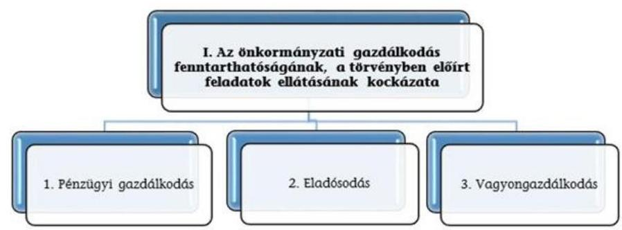

A három kockázati terület együttes értékelése alapján az alábbi mátrix segítségével kerül meghatározásra az önkormányzati gazdálkodás fenntarthatóságának, a törvényben előírt feladatok ellátásának értékelése a következők szerint:
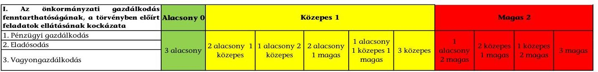

---

III. SZ. MELLÉKLET: AZ ESZKÖZÖK ÉS FORRÁSOK ALAKULÁSA KIEMELT MÉRLEGSORONKÉNT A 2016-2017. ÉVEKBEN (E FT®) Az Önkormányzatok 2016-2017. évi mérlegeinek adatai

| Megnevezés | 2016. január 1. | 2016. december 31. | 2017. december 31. |
| :--: | :--: | :--: | :--: |
| Befektetett eszközök   /NEMZETI VAGYONBA TARTOZÓ BEFEK-   TETETT ESZKÖZÖK | 399129812 | 430452764 | 445045843 |
| NEMZETI VAGYONBA TARTOZÓ FORGÓ-   ESZKÖZÖK | 1171036 | 3229172 | 5080476 |
| PÉNZESZKÖZÖK | 22585826 | 27066543 | 49798795 |
| KÖVETELÉSEK | 6976470 | 10463293 | 14891196 |
| EGYÉB SAJÁTOS ESZKÖZOLDALI ELSZÁ-   MOLÁSOK | 1550447 | 522573 | 1372827 |
| AKTÍV IDŐBELI ELHATÁROLÁSOK | 873436 | 571693 | 609065 |
| ESZKÖZÖK ÖSSZESEN | 432287027 | 472306038 | 516798204 |
| SAJÁT TÖKE | 400830729 | 423767603 | 447314383 |
| KÖTELEZETTSÉGEK | 6428671 | 6170995 | 6945456 |
| EGYÉB SAJÁTOS FORRÁSOLDALI ELSZÁ-   MOLÁSOK |  |  |  |
| PASSZÍV IDŐBELI ELHATÁROLÁSOK | 25027627 | 42367440 | 62538365 |
| FORRÁSOK ÖSSZESEN | 432287027 | 472306038 | 516798204 |

---

|  1. FOLYÓ KÖLTSÉGVETÉS | 2016. év | 2017. év | $\begin{gathered} \text { Változás } \ \text { [\%] } \ \text { (2017-2016) / } \ 2016 \end{gathered}$  |
| --- | --- | --- | --- |
|  1.1.1. Saját működési bevételek tulajdonosi bevételek nélkül | 29106913 | 30408174 | $4,47 \%$  |
|  1.1.2. Költségvetési támogatások a működőképesség megőrzését szolgáló kiegészítő támogatások nélkül | 40968362 | 42613027 | $4,01 \%$  |
|  1.1.3. Átengedett bevételek | 1630163 | 1709472 | $4,87 \%$  |
|  1.1.4. Államháztartáson belülről kapott támogatások | 19097957 | 17697835 | $-7,33 \%$  |
|  1.1.5. EU-tól és külföldről kapott bevételek | 20234 | 8377 | $-58,60 \%$  |
|  1.1.6. Államháztartáson kívülről kapott bevételek | 447612 | 253232 | $-43,43 \%$  |
|  1.1.7. Hozam- és kamatbevételek (2014-ben a működési rész csak az önkormányzat nyilvántartása alapján pontosítható) | 93414 | 139649 | $49,49 \%$  |
|  1.1.8. Kölcsönök visszatérülése, igénybevétele | 140887 | 170584 | $21,08 \%$  |
|  1.1.9. A működőképesség megőrzését szolgáló kiegészítő támogatások | 603113 | 806448 | $33,71 \%$  |
|  1.1. Folyó bevételek
(1.1.1.+1.1.2.+1.1.3.+1.1.4.+1.1.5.+1.1.6.+1.1.7.+1.1.8.+1.1.9.) | 92108657 | 93806797 | 1,84\%  |
|  1.2.1. Működési kiadások kamatkiadások nélkül | 74046204 | 74970341 | $1,25 \%$  |
|  1.2.2. Államháztartáson belülre átadott pénzeszközök | 4185685 | 4395177 | $5,00 \%$  |
|  1.2.3.1. vállalkozásoknak | 1052603 | 981720 | $-6,73 \%$  |
|  1.2.3.2. EU-nak, illetve külföldre | 1300 | 9060 | $596,90 \%$  |
|  1.2.3.3. magánszemélyeknek | 3013246 | 2785283 | $-7,57 \%$  |
|  1.2.3.4. non-profit szervezeteknek | 1591550 | 1496446 | $-5,98 \%$  |
|  1.2.3. Transzferkiadások | 5658698 | 5272508 | $-6,82 \%$  |
|  1.2.4. Kamatkiadások | 131039 | 83045 | $-36,63 \%$  |
|  1.2.5. Kölcsönök nyújtása, törlesztése | 247367 | 176643 | $-28,59 \%$  |
|  1.2. Folyó kiadások (1.2.1.+1.2.2.+1.2.3.+1.2.4.+1.2.5.) | 84268993 | 84897714 | 0,75\%  |
|  1.3. Folyó költségvetés egyenlege, működési jövedelem (1.1. - 1.2.) | 7839664 | 8909083 | 13,64\%  |
|  2. FELHALMOZÁSI KÖLTSÉGVETÉS |  |  |   |
|  2.1.1. Saját tőkebevételek | 1150416 | 1674003 | $45,51 \%$  |
|  2.1.2. Költségvetési támogatások | 7022761 | 4159368 | $-40,77 \%$  |
|  2.1.3. Államháztartáson belülről kapott támogatások | 2533559 | 41432234 | $1535,34 \%$  |
|  2.1.4. EU-tól és külföldről kapott támogatások | 46751 | 11105 | $-76,25 \%$  |
|  2.1.5. Államháztartáson kívülről kapott bevételek | 1153770 | 697407 | $-39,55 \%$  |
|  2.1.6. Hozam- és kamatbevételek (2014-ben (02/196+02/200-ból a felhalmozási rész csak az önkormányzat nyilvántartása alapján pontosítható) | 0 | 0 | $0,00 \%$  |
|  2.1.7. Kölcsönök visszatérülése, igénybevétele | 422517 | 97541 | $-76,91 \%$  |
|  2.1. Felhalmozási bevételek
(2.1.1.+2.1.2+2.1.3+2.1.4.+2.1.5.+2.1.6.+2.1.7.) | 12329774 | 48071658 | 289,88\%  |
|  2.2.1. Saját beruházási kiadás áfával | 7837407 | 18737809 | $139,08 \%$  |
|  2.2.2. Saját felújítási kiadás áfával | 5402156 | 11607060 | $114,86 \%$  |
|  2.2.3. Államháztartáson belülre átadott pénzeszközök | 357249 | 99593 | $-72,12 \%$  |

---

|  2.2.4. EU-nak és külföldnek adott pénzeszközök | 94113 | 3408 | $-96,38 \%$ |
| :--: | :--: | :--: | :--: |
| 2.2.5. Államháztartáson kívülre adott pénzeszközök | 283633 | 370621 | $30,67 \%$ |
| 2.2.6. Befektetéssel kapcsolatos kiadások | 41604 | 44236 | $6,33 \%$ |
| 2.2.7. Kamatkiadások (2014-ben 01/51+01/54-ből a felhalmozási rész csak az önkormányzat nyilvántartása alapján pontosítható) | 0 | 0 | $0,00 \%$ |
| 2.2.8. Kölcsönök nyújtása, törlesztése | 90134 | 60208 | $-33,20 \%$ |
| 2.2. Felhalmozási kiadások   (2.2.1.+2.2.2.+2.2.3.+2.2.4.+2.2.5.+2.2.6.+2.2.7.+2.2.8.) | 14106296 | 30922936 | 119,21\% |
| 2.3. Felhalmozási költségvetés egyenlege (2.1. - 2.2.) | $-1776523$ | 17148723 | 1065,30\% |
| 3. FINANSZÍROZÁSI MŰVELETEK NÉLKÜLI (GFS) POZÍCIÓ (1.3.+2.3.) | 6063141 | 26057806 | 329,77\% |
| 4. FINANSZÍROZÁSI MŰVELETEK |  |  |  |
| 4.1. Hitelfelvétel | 1340314 | 882326 | $-34,17 \%$ |
| 4.2. Hiteltörlesztés | 1334582 | 926739 | $-30,56 \%$ |
| 4.3. Forgatási és befektetési célú értékpapírok kibocsátása | 0 | 0 | $0,00 \%$ |
| 4.4. Forgatási és befektetési célú értékpapírok beváltása | 0 | 0 | $0,00 \%$ |
| 4.5. Forgatási és befektetési célú értékpapírok értékesítése | 1502746 | 4507046 | 199,92\% |
| 4.6. Forgatási és befektetési célú értékpapírok vásárlása | 3640289 | 7563639 | 107,78\% |
| 4.7. Egyéb finanszírozási bevételek | 13812219 | 16525051 | 19,64\% |
| 4.8. Egyéb finanszírozási kiadások | 13847401 | 16167334 | $16,75 \%$ |
| 4.9.Finanszírozási műveletek egyenlege (4.1.-4.2.+4.3.-   4.4.+4.5.-4.6.+4.7.-4.8.) | $-2166993$ | $-2743289$ | $-26,59 \%$ |
| 5. TÁRGYÉVI PÉNZÜGYI POZÍCIÓ (1.3.+ 2.3.+4.9.) | 3896148 | 23314517 | 498,40\% |
| 6. NETTÓ MŰKÖDÉSI JÖVEDELEM   (működési jövedelem (1.3.) - tőketörlesztés   $(4.2+4.4))$ | 6505081 | 7982344 | 22,71\% |
| * Az önkormányzat bevételei nem tartalmazzák az előző évi pénzmaradvány igénybevételét. |  |  |  |
| Tájékoztató adat: Maradvány igénybevétele | 21383004 | 25352173 |  |

---

# Összefoglaló értékelés 

| Azonosított kockázatok (értékelése: Magas=M / Közepes=K / Alacsony=A) | A kiválasztott önkormányzatok 2016. évi kockázati besorolása |

 és pontozása | A kiválasztott önkormányzatok 2017. évi kockázati besorolása és pontozása |
| :--: | :--: | :--: |
| I. Az önkormányzati gazdálkodás fenntarthatóságának, a törvényben előírt feladatok ellátásának kockázata |  |  |
| 1. Pénzügyi gazdálkodás | A 3,0 | 1,0 |
| 1.1 Közfeladatok finanszírozási struktúrája | A 1,0 | 1,0 |
| 1.2 Felhalmozási kiadások és finanszírozása | K 2,0 | 0,0 |
| 1.3 Finanszírozás | A 0,0 | 0,0 |
| 2. Eladósodás | A 9,5 | 10,5 |
| 2.1 Adósságkonszolidációt követő időszakban bekövetkező eladósodás | A 2,0 | 2,0 |
| 2.2 Szállítók felé történő eladósodás | K 4,5 | 6,5 |
| 2.3 Pénzintézet felé történő eladósodás | A 1,0 | 0,0 |
| 2.4 Garancia- és kezességvállalás | K 2,0 | 2,0 |
| 3. Vagyongazdálkodás | A 4,5 | 4,0 |
| 3.1 Vagyonváltozás | K 2,0 | 0,0 |
| 3.2 Belső eladósodás | A 0,0 | 0,0 |
| 3.3 Többségi önkormányzati tulajdonban lévő gazdasági társaságok | K 2,5 | 4,0 |

---

| Kockázat/Kockázati területek /Kockázatforrások/Mutatók | Mutatók értéke 2016.12.31. | Kockázati besorolás 2015. év | Mutatók értéke 2017.12.31. | Kockázati besorolás 2016. év |
| :--: | :--: | :--: | :--: | :--: |
| I. Az önkormányzati gazdálkodás fenntarthatóságának, a törvényben előírt feladatok ellátásának kockázata |  | A |  | A |
| 1. Pénzügyi gazdálkodás |  | A |  | A |
| 1.1 Közfeladatok finanszírozási struktúrája |  | A |  | A |
| Működési kiadások fedezettsége | 109,30\% | A | 110,49\% | A |
| Önkormányzati rendkívüli támogatás aránya | $0,65 \%$ | K | $0,86 \%$ | K |
| Adóbevételek működési bevételeken belüli arányának változása | - |  | $+1,01 \%$ | A |
| Adóbevételek állományának változása | - |  | $+6,67 \%$ | A |
| Helyi iparűzési adóbevételek állományának változása | - |  | $+6,64 \%$ | A |
| 1.2 Felhalmozási kiadások és finanszírozása |  | K |  | A |
| Felhalmozási kiadások fedezettsége | 87,41\% | K | 155,46\% | A |
| 1.3 Finanszírozás |  | A |  | A |
| Törlesztés fedezettségének aránya | 17,02\% | A | 10,40\% | A |
| Nettó működési jövedelem változása | - |  | $+23,19 \%$ | A |
| 2. Eladósodás |  | A |  | A |
| 2.1 Adósságkonszolidációt követő időszakban bekövetkező eladósodás |  | A |  | A |
| Eladósodási mutató | 1,31\% | A | 1,34\% | A |
| Eladósodási mutató változása | $-0,18 \%$ | K | $+0,04 \%$ | K |
| Tárgyévi pénzügyi pozíció változása | - |  | $+502,11 \%$ | A |
| 2.2 Szállítók felé történő eladósodás |  | K |  | K |
| Kötelezettségek dologi, felújítási beruházási kiadásokra állomány változása | $-10,16 \%$ | A | $+6,04 \%$ | K |
| 90 napon túli lejárt kötelezettségek állományának aránya (az összes kötelezettség állományból) | $0,62 \%$ | M | $0,52 \%$ | M |
| Lejárt dologi, felújítási beruházási kiadásokkal kapcsolatos kötelezettségek állomány aránya (az összes kötelezettség állományból) | $8,79 \%$ | K | $10,86 \%$ | K |
| Lejárt dologi, felújítási beruházási kiadásokkal kapcsolatos kötelezettségek állomány változása | $+87,98 \%$ | M | $+30,95 \%$ | M |

---

| Lejárt dologi kiadásokkal kapcsolatos kötelezettségek állomány aránya a dologi kiadások egy havi átlagához viszonyítva | $5,35 \%$ | K | $6,95 \%$ | K |
| :--: | :--: | :--: | :--: | :--: |
| 2.3 Pénzintézet felé történő eladósodás |  | A |  | A |
| Banki kötelezettségállomány mérlegfőösszeghez mért nagysága | $0,14 \%$ | A | $0,13 \%$ | A |
| Banki kötelezettségek (rövid és hosszúlejáratú hitelek és kötvénykibocsátásból származó tartozások) állományának változása | $-17,01 \%$ | A | $-0,99 \%$ | A |
| Tárgyévben kormányzati jóváhagyással megkötött hosszú lejáratú adósságot keletkeztető ügyletek darabszáma | 2 | M | 0 | A |
| ...ügyletek értéke (E Ft) | 9365,400 | A | 0,000 | A |
| Tárgyévben megkötött, kormányzati hozzájáruláshoz nem kötött, hosszúlejáratú adósságot keletkeztető ügyletek darabszáma | 0 | A | 0 | A |
| ... ügyletek értéke (E Ft) | 0,000 | A | 0,000 | A |
| 2.4 Garancia- és kezességvállalás |  | K |  | K |
| Garancia és kezességvállalások állománya (E Ft) | 250224,957 | K | 70653,958 | K |
| 3. Vagyongazdálkodás |  | A |  | A |
| 3.1 Vagyonváltozás |  | K |  | A |
| Befektetett eszközök fedezettsége | $98,45 \%$ | K | 100,51\% | A |
| Ingatlanok és kapcsolódó vagyoni értékű jogok állományának változása (E Ft) | $+24441088$ | A | $+6749133$ | A |
| Koncesszióba, vagyonkezelésbe adott eszközök állományának változása (E Ft) | $+10148295$ | M | $-4991857$ | A |
| 3.2 Belső eladósodás |  | A |  | A |
| Eszközpótlási mutató (tárgyi eszközök összesen) | $131,93 \%$ | A | $77,02 \%$ | A |
| Eszközpótlási mutató (ingatlanok és kapcsolódó vagyoni értékű jogokra) | $153,53 \%$ | A | $84,09 \%$ | A |
| 3.3 Többségi önkormányzati tulajdonban lévő gazdasági társaságok |  | K |  | K |
| Többségi önkormányzati tulajdonú gazdasági társaságok kötelezettségei állományának változása | $+5,9 \%$ | A | $+23,5 \%$ | K |
| ...gazdasági társaságok számának változása (db) | $+11$ | M | 0 | K |
| Tartós részesedések állományának változása | $+2,37 \%$ | K | $+1,05 \%$ | M |

---

|  sorszám | A település (községi önkormányzat) neve: | sorszám | A település (községi önkormányzat) neve:  |
| --- | --- | --- | --- |
|  1 | ABASÁR KÖZSÉGI ÖNKORMÁNYZAT | 45 | DOMONY KÖZSÉG ÖNKORMÁNYZAT  |
|  2 | ADÁCS KÖZSÉG ÖNKORMÁNYZATA | 46 | DÖGE KÖZSÉG ÖNKORMÁNYZATA  |
|  3 | ÁGASEGYHÁZA KÖZSÉG ÖNKORMÁNYZATA | 47 | DUNABOGDÁNY KÖZSÉG ÖNKORMÁNYZATA  |
|  4 | AKASZTÓ KÖZSÉG ÖNKORMÁNYZATA | 48 | DUSNOK KÖZSÉG ÖNKORMÁNYZATA  |
|  5 | ALATTYÁN KÖZSÉG ÖNKORMÁNYZATA | 49 | EBES KÖZSÉGI ÖNKORMÁNYZAT  |
|  6 | ALMÁSFÜZITÓ KÖZSÉG ÖNKORMÁNYZATA | 50 | ECSÉD KÖZSÉGI ÖNKORMÁNYZAT  |
|  7 | ANDORNAKTÁLYA KÖZSÉGI ÖNKORMÁNYZAT | 51 | ERDŐKERTES KÖZSÉG ÖNKORMÁNYZATA  |
|  8 | APAGY KÖZSÉG ÖNKORMÁNYZAT | 52 | ERDŐTELEK KÖZSÉGI ÖNKORMÁNYZAT  |
|  9 | APÁTFALVA KÖZSÉG ÖNKORMÁNYZATA | 53 | ÉRSEKCSANÁD KÖZSÉG ÖNKORMÁNYZATA  |
|  10 | APC KÖZSÉGI ÖNKORMÁNYZAT | 54 | ÉRSEKVADKERT KÖZSÉG ÖNKORMÁNYZATA  |
|  11 | ARNÖT KÖZSÉG ÖNKORMÁNYZATA | 55 | FARKASLYUK KÖZSÉG ÖNKORMÁNYZATA  |
|  12 | BAJ KÖZSÉG ÖNKORMÁNYZATA | 56 | FARMOS KÖZSÉG ÖNKORMÁNYZATA  |
|  13 | BAKS KÖZSÉGI ÖNKORMÁNYZAT | 57 | FÉNYESLITKE KÖZSÉG ÖNKORMÁNYZATA  |
|  14 | BALÁSTYA KÖZSÉGI ÖNKORMÁNYZAT | 58 | FERTŐRÁKOS KÖZSÉGI ÖNKORMÁNYZAT  |
|  15 | BALATONFENYVES KÖZSÉG ÖNKORMÁNYZATA | 59 | FORRÁSKÚT KÖZSÉG ÖNKORMÁNYZATA  |
|  16 | BALATONSZABADI KÖZSÉGI ÖNKORMÁNYZAT | 60 | FÜLÖPSZÁLLÁS KÖZSÉGI ÖNKORMÁNYZAT  |
|  17 | BALLÓSZÓG KÖZSÉG ÖNKORMÁNYZATA | 61 | GALGAHÉVÍZ KÖZSÉG ÖNKORMÁNYZATA  |
|  18 | BARACSKA KÖZSÉG ÖNKORMÁNYZATA | 62 | GÉGÉNY KÖZSÉG ÖNKORMÁNYZATA  |
|  19 | BÁTYA KÖZSÉG ÖNKORMÁNYZATA | 63 | GENCSAPÁTI KÖZSÉG ÖNKORMÁNYZATA  |
|  20 | BÉKÉSSÁMSON KÖZSÉG ÖNKORMÁNYZATA | 64 | GOMBA KÖZSÉG ÖNKORMÁNYZATA  |
|  21 | BESENYŐTELEK KÖZSÉGI ÖNKORMÁNYZAT | 65 | GÖNYÜ KÖZSÉG ÖNKORMÁNYZATA  |
|  22 | BIHARNAGYBAJOM KÖZSÉGI ÖNKORMÁNYZAT | 66 | GÖRBEHÁZA KÖZSÉG ÖNKORMÁNYZATA  |
|  23 | BOCSKAIKERT KÖZSÉGI ÖNKORMÁNYZAT | 67 | GYÖNGYÖSHALÁSZ KÖZSÉGI ÖNKORMÁNYZAT  |
|  24 | BOGÁCS KÖZSÉG ÖNKORMÁNYZATA | 68 | GYÖRSZEMERE KÖZSÉGI ÖNKORMÁNYZAT  |
|  25 | BOLDOG KÖZSÉG ÖNKORMÁNYZATA | 69 | GYÖRÜJBARÁT KÖZSÉG ÖNKORMÁNYZATA  |
|  26 | BÖCS KÖZSÉG ÖNKORMÁNYZATA | 70 | GYÖRZÁMOLY KÖZSÉG ÖNKORMÁNYZATA  |
|  27 | BÖNY KÖZSÉG ÖNKORMÁNYZATA | 71 | HAJDÚBAGOS KÖZSÉG ÖNKORMÁNYZATA  |
|  28 | BUJ KÖZSÉG ÖNKORMÁNYZATA | 72 | HAJDÚSZOVÁT KÖZSÉG ÖNKORMÁNYZATA  |
|  29 | BUJÁK KÖZSÉG ÖNKORMÁNYZATA | 73 | HARSÁNY KÖZSÉG ÖNKORMÁNYZATA  |
|  30 | CEGLÉDBERCEL KÖZSÉG ÖNKORMÁNYZATA | 74 | HERCEGHALOM KÖZSÉG ÖNKORMÁNYZATA  |
|  31 | CSÁNY KÖZSÉG ÖNKORMÁNYZATA | 75 | HERCEGSZÁNTÓ KÖZSÉG ÖNKORMÁNYZATA  |
|  32 | CSANYTELEK KÖZSÉG ÖNKORMÁNYZATA | 76 | HÉVÍZGYÖRK KÖZSÉG ÖNKORMÁNYZATA  |
|  33 | CSÁSZÁRTÖLTÉS KÖZSÉG ÖNKORMÁNYZATA | 77 | HIDAS KÖZSÉG ÖNKORMÁNYZAT  |
|  34 | CSEMŐ KÖZSÉG ÖNKORMÁNYZATA | 78 | HOSSZÚHETENY KÖZSÉGI ÖNKORMÁNYZAT  |
|  35 | CSENGŐD KÖZSÉG ÖNKORMÁNYZATA | 79 | IKLÁD KÖZSÉG ÖNKORMÁNYZATA  |
|  36 | CSERKESZŐLŐ KÖZSÉGI ÖNKORMÁNYZAT | 80 | IREGSZEMCSE KÖZSÉG ÖNKORMÁNYZATA  |
|  37 | CSOBÁNKA KÖZSÉG ÖNKORMÁNYZATA | 81 | JAKABSZÁLLÁS KÖZSÉG ÖNKORMÁNYZATA  |
|  38 | CSÖRÖG KÖZSÉG ÖNKORMÁNYZATA | 82 | JÁNOSHIDA KÖZSÉGI ÖNKORMÁNYZAT  |
|  39 | DÁNSZENTMIKLÓS KÖZSÉG ÖNKORMÁNYZATA | 83 | JÁSZALSÓSZENTGYÖRGY KÖZSÉGI ÖNKORMÁNYZAT  |
|  40 | DÁNY KÖZSÉG ÖNKORMÁNYZATA | 84 | JÁSZDÓZSA KÖZSÉGI ÖNKORMÁNYZAT  |
|  41 | DÁVOD ÖNKORMÁNYZAT | 85 | JÁSZJÁKÓHALMA KÖZSÉGI ÖNKORMÁNYZAT  |
|  42 | DÉLEGYHÁZA KÖZSÉG ÖNKORMÁNYZATA | 86 | JÁSZKARAJENŐ KÖZSÉG ÖNKORMÁNYZAT  |
|  43 | DESZK KÖZSÉG ÖNKORMÁNYZATA | 87 | JOBBÁGYI KÖZSÉG ÖNKORMÁNYZATA  |
|  44 | DIÓSJENŐ KÖZSÉG ÖNKORMÁNYZATA | 88 | KAKUCS KÖZSÉG ÖNKORMÁNYZATA  |

---

|  sorszám | A település (községi önkormányzat) neve: | sorszám | A település (községi önkormányzat) neve:  |
| --- | --- | --- | --- |
|  89 | KÁNTORIÁNOSI KÖZSÉG ÖNKORMÁNYZATA | 133 | NYÍRMIHÁLYDI KÖZSÉG ÖNKORMÁNYZAT  |
|  90 | KARÁCSOND KÖZSÉGI ÖNKORMÁNYZAT | 134 | NYÍRTASS KÖZSÉG ÖNKORMÁNYZATA  |
|  91 | KECSKÉD

 KÖZSEG ÖNKORMÁNYZATA | 135 | NYÍRVASVÁRI KÖZSEG ÖNKORMÁNYZATA  |
|  92 | KELEBIA KÖZSEG ÖNKORMÁNYZATA | 136 | NYÚL KÖZSEG ÖNKORMÁNYZATA  |
|  93 | KENGYEL KÖZSEG ÖNKORMÁNYZATA | 137 | ÖFEHÉRTÓ KÖZSEG ÖNKORMÁNYZATA  |
|  94 | KESZTÖLC KÖZSEG ÖNKORMÁNYZATA | 138 | ÖNOD KÖZSEG ÖNKORMÁNYZATA  |
|  95 | KISSZÁLLÁS KÖZSEG ÖNKORMÁNYZATA | 139 | ÖPÁLYI KÖZSEG ÖNKORMÁNYZATA  |
|  96 | KOCS KÖZSEG ÖNKORMÁNYZATA | 140 | ÖPUSZTASZER KÖZSEG ÖNKORMÁNYZATA  |
|  97 | KOCSORD KÖZSEG ÖNKORMÁNYZATA | 141 | ÖSI KÖZSEG ÖNKORMÁNYZATA  |
|  98 | KÓKA KÖZSEG ÖNKORMÁNYZATA | 142 | ÖTTEVÉNY KÖZSEG ÖNKORMÁNYZATA  |
|  99 | KONYÁR KÖZSEG ÖNKORMÁNYZATA | 143 | PÁND KÖZSEG ÖNKORMÁNYZATA  |
|  100 | KÖPHÁZA KÖZSEG ÖNKORMÁNYZATA | 144 | PÁTROHA KÖZSEG ÖNKORMÁNYZATA  |
|  101 | KORONCÓ KÖZSEG ÖNKORMÁNYZATA | 145 | PÁTY KÖZSEG ÖNKORMÁNYZATA  |
|  102 | KOSD KÖZSEG ÖNKORMÁNYZATA | 146 | PÁZMÁND KÖZSEG ÖNKORMÁNYZATA  |
|  103 | KÓTAJ KÖZSEG ÖNKORMÁNYZATA | 147 | PERBÁL KÖZSEG ÖNKORMÁNYZATA  |
|  104 | KÖRNYE KÖZSEG ÖNKORMÁNYZATA | 148 | PETŐFIBÁNYA KÖZSEG ÖNKORMÁNYZATA  |
|  105 | KÖRÖSTARCSA KÖZSEG ÖNKORMÁNYZATA | 149 | PILISBOROSJENŐ KÖZSEG ÖNKORMÁNYZATA  |
|  106 | KULCS KÖZSEG ÖNKORMÁNYZATA | 150 | PILISMARÓT KÖZSEG ÖNKORMÁNYZATA  |
|  107 | KUNFEHÉRTÓ KÖZSEG ÖNKORMÁNYZATA | 151 | PILISSZÁNTÓ KÖZSEG ÖNKORMÁNYZATA  |
|  108 | LOVASBERÉNY KÖZSEG ÖNKORMÁNYZATA | 152 | PILISSZENTIVÁN KÖZSEG ÖNKORMÁNYZATA  |
|  109 | MÁD KÖZSEG ÖNKORMÁNYZATA | 153 | PILISSZENTKERESZT KÖZSEG ÖNKORMÁNYZATA  |
|  110 | MADARAS KÖZSEG ÖNKORMÁNYZATA | 154 | PÖCSMEGYER KÖZSEG ÖNKORMÁNYZATA  |
|  111 | MAGYARBÁNHEGYES KÖZSEG ÖNKORMÁNYZATA | 155 | PUSZTAVÁM KÖZSEG ÖNKORMÁNYZATA  |
|  112 | MÁLYI KÖZSEG ÖNKORMÁNYZATA | 156 | RÁBAPATONA KÖZSEG ÖNKORMÁNYZATA  |
|  113 | MAROSLELE KÖZSEG ÖNKORMÁNYZATA | 157 | RÁCKERESZTÚR KÖZSEG ÖNKORMÁNYZATA  |
|  114 | MENDE KÖZSEG ÖNKORMÁNYZATA | 158 | RÁKÓCZIÚJFALU KÖZSEG ÖNKORMÁNYZATA  |
|  115 | MEZŐZOMBOR KÖZSEG ÖNKORMÁNYZATA | 159 | ROMHÁNY KÖZSEG ÖNKORMÁNYZATA  |
|  116 | MIKEPÉRCS KÖZSEG ÖNKORMÁNYZATA | 160 | RÖSZKE KÖZSEG ÖNKORMÁNYZATA  |
|  117 | MONORIERDŐ KÖZSEG ÖNKORMÁNYZATA | 161 | SAJÓKAZA KÖZSEG ÖNKORMÁNYZATA  |
|  118 | MONOSTORPÁLYI KÖZSEG ÖNKORMÁNYZATA | 162 | SAJÓLÁD KÖZSEG ÖNKORMÁNYZATA  |
|  119 | MOSONSZENTMIKLÓS KÖZSEG ÖNKORMÁNYZATA | 163 | SAJÓSZÖGED KÖZSEG ÖNKORMÁNYZATA  |
|  120 | NAGYDOBOS KÖZSEG ÖNKORMÁNYZATA | 164 | SÁRISÁP KÖZSEG ÖNKORMÁNYZATA  |
|  121 | NAGYHEGYES KÖZSEG ÖNKORMÁNYZATA | 165 | SÁRKERESZTÚR KÖZSEG ÖNKORMÁNYZATA  |
|  122 | NAGYTARCSA KÖZSEG ÖNKORMÁNYZATA | 166 | SÁRSZENTMIHÁLY KÖZSEG ÖNKORMÁNYZATA  |
|  123 | NASZÁLY KÖZSEG ÖNKORMÁNYZATA | 167 | SÜTTŐ KÖZSEG ÖNKORMÁNYZATA  |
|  124 | NYÁRLÓRINC KÖZSEG ÖNKORMÁNYZATA | 168 | SZABADEGYHÁZA KÖZSEG ÖNKORMÁNYZATA  |
|  125 | NYÍRACSÁD KÖZSEG ÖNKORMÁNYZATA | 169 | SZABADEGYHÁZA KÖZSEG ÖNKORMÁNYZATA  |
|  126 | NYÍRBOGDÁNY KÖZSEG ÖNKORMÁNYZATA | 170 | SZALOL KÖZSEG ÖNKORMÁNYZATA  |
|  127 | NYÍRCSAHOLY KÖZSEG ÖNKORMÁNYZATA | 171 | SZAKOLY KÖZSEG ÖNKORMÁNYZATA  |
|  128 | NYÍRGYULAI KÖZSEG ÖNKORMÁNYZATA | 172 | SZALKSZENTMÁRTON KÖZSEG ÖNKORMÁNYZATA  |
|  129 | NYÍRKARÁSZ KÖZSEG ÖNKORMÁNYZATA | 173 | SZANK KÖZSEG ÖNKORMÁNYZATA  |
|  130 | NYÍRKÁTA KÖZSEG ÖNKORMÁNYZATA | 174 | SZÁRLIGET KÖZSEG ÖNKORMÁNYZATA  |
|  131 | NYÍRMÁRTONFALVA KÖZSEG ÖNKORMÁNYZATA | 175 | SZATYMAZ KÖZSEG ÖNKORMÁNYZATA  |
|  132 | NYÍRMEGGYES KÖZSEG ÖNKORMÁNYZATA | 176 | SZEDRES KÖZSEG ÖNKORMÁNYZATA  |

---

|  sorszám | A település (községi önkormányzat) neve: |  | A település (községi önkormányzat) neve:  |
| --- | --- | --- | --- |
|  177 | SZÉKKUTAS KÖZSÉGI ÖNKORMÁNYZATA | 199 | TISZABURA KÖZSÉGI ÖNKORMÁNYZATA  |
|  178 | SZENTGÁL KÖZSÉG ÖNKORMÁNYZATA | 200 | TISZADADA KÖZSÉG ÖNKORMÁNYZATA  |
|  179 | SZENTKIRÁLYSZABADIA KÖZSÉG ÖNKORMÁNYZATA | 201 | TISZAESZLÁR KÖZSÉG ÖNKORMÁNYZATA  |
|  180 | SZIGETCSÉP KÖZSÉGI ÖNKORMÁNYZATA | 202 | TISZAKESZI KÖZSÉG ÖNKORMÁNYZATA  |
|  181 | SZIGETMONOSTOR KÖZSÉG ÖNKORMÁNYZATA | 203 | TISZAPÜSPÖKI KÖZSÉGI ÖNKORMÁNYZATA  |
|  182 | SZIGETSZENTMÁRTON KÖZSÉG ÖNKORMÁNYZATA | 204 | TOKODALTÁRÓ KÖZSÉG ÖNKORMÁNYZATA  |
|  183 | SZIGETÜJFALU KÖZSÉG ÖNKORMÁNYZATA | 205 | TORDAS KÖZSÉG ÖNKORMÁNYZATA  |
|  184 | SZOMÓD KÖZSÉG ÖNKORMÁNYZATA | 206 | TÓSZEG KÖZSÉGI ÖNKORMÁNYZATA  |
|  185 | SZŐD KÖZSÉG ÖNKORMÁNYZATA | 207 | TÖRTEL KÖZSÉG ÖNKORMÁNYZATA  |
|  186 | TAKTASZADA KÖZSÉG ÖNKORMÁNYZATA | 208 | TUNYOGMATOLCS KÖZSÉG ÖNKORMÁNYZATA  |
|  187 | TÁPIÓBICSKE KÖZSÉG ÖNKORMÁNYZATA | 209 | ÚJSZENTIVÁN KÖZSÉGI ÖNKORMÁNYZATA  |
|  188 | TÁPIÓGYÖRGYE KÖZSÉG ÖNKORMÁNYZATA | 210 | ÚJSZILVÁS KÖZSÉG ÖNKORMÁNYZATA  |
|  189 | TÁPIÓSÁG KÖZSÉG ÖNKORMÁNYZATA | 211 | ÚRI KÖZSÉG ÖNKORMÁNYZATA  |
|  190 | TÁPIÓSZŐLŐS KÖZSÉG ÖNKORMÁNYZATA | 212 | ÚRKÜT KÖZSÉG ÖNKORMÁNYZATA  |
|  191 | TÁPLÁNSZENTKERESZT KÖZSÉG ÖNKORMÁNYZATA | 213 | ÚRÖM KÖZSÉG ÖNKORMÁNYZATA  |
|  192 | TARJÁN KÖZSÉG ÖNKORMÁNYZATA | 214 | VÁCSZENTLÁSZLÓ KÖZSÉG ÖNKORMÁNYZATA  |
|  193 | TASS KÖZSÉG ÖNKORMÁNYZATA | 215 | VÁROSFÖLD KÖZSÉG ÖNKORMÁNYZATA  |
|  194 | TASZÁR KÖZSÉGI ÖNKORMÁNYZATA | 216 | VERŐCE KÖZSÉG ÖNKORMÁNYZATA  |
|  195 | TATÁRSZENTGYÖRGY KÖZSÉG ÖNKORMÁNYZATA | 217 | VÉRTESSZŐLŐS KÖZSÉG ÖNKORMÁNYZATA  |
|  196 | TELKI KÖZSÉG ÖNKORMÁNYZATA | 218 | ZAGYVARÉKAS KÖZSÉG ÖNKORMÁNYZATA  |
|  197 | TENGELIC KÖZSÉG ÖNKORMÁNYZATA | 219 | ZÁKÁNYSZÉK KÖZSÉG ÖNKORMÁNYZATA  |
|  198 | TISZABŐ KÖZSÉGI ÖNKORMÁNYZATA | 220 | ZSÁMBOK KÖZSÉG ÖNKORMÁNYZATA  |

---

# FÜGGELÉKEK

I. SZ. FÜGGELÉK: A JELENTÉSBEN BEAZONOSÍTOTT 2017 ÉVRE VONATKOZÓ KOCKÁZATOKKAL ÉRINTETT ÖNKORMÁNYZATOK

|  Negatív működési jövedelem miatti kockázat | Rendkívüli támogatás igénybevétele nélkül negatív működési jövedelem miatti kockázata | A 90 napon túl fennálló tartozás miatt eladósodásra irányuló kockázat | Eladósodás kockázata a lejárt szállítói tartozás működési jövedelemhez viszonyított aránya miatt | Garancia- és kezességvállalások miatti kockázat  |
| --- | --- | --- | --- | --- |
|  Abasár Községi Önkormányzata | Abasár Községi Önkormányzata | Bogács Község Önkormányzata | Arnót Község Önkormányzata | Görbeháza Község Önkormányzata  |
|  Adács Község Önkormányzata | Apagy Község Önkormányzata | Csengőd Község Önkormányzata | Hajdúszovát Község Önkormányzata | Jászalsószentgyörgy Községi Önkormányzata  |
|  Apagy Község Önkormányzata | Arnót Község Önkormányzata | Jászdózsa Községi Önkormányzata | Jászdózsa Községi Önkormányzata | Az érintett önkormányzatok száma: 2  |
|  Arnót Község Önkormányzata | Baks Községi Önkormányzata | Jobbágyi Község Önkormányzata | Kengyel Községi Önkormányzata |   |
|  Dány Község Önkormányzata | Hajdúszovát Község Önkormányzata | Kengyel Községi Önkormányzata | Kisszállás Község Önkormányzata |   |
|  Erdőtelek Községi Önkormányzata | Jászdózsa Községi Önkormányzata | Mályi Község Önkormányzata | Kocsord Község Önkormányzata |   |
|  Farkaslyuk Község Önkormányzata | Kisszállás Község Önkormányzata | Nyíracsád Község Önkormányzata | Nyírkáta Község Önkormányzata |   |
|  Hajdúszovát Község Önkormányzata | Kocsord Község Önkormányzata | Nyírkáta Község Önkormányzata | Rákócziújfalu Községi Önkormányzata |   |
|  Jászdózsa Községi Önkormányzata | Konyár Község Önkormányzata | Szedres Község Önkormányzata | Romhány Község Önkormányzata |   |
|  Kakucs Község Önkormányzata | Mád Község Önkormányzata | Tápiógyörgye Község Önkormányzata | Szedres Község Önkormányzata |   |
|  Kengyel Községi Önkormányzata | Mende Község Önkormányzata | Táplánszentkereszt Község Önkormányzata | Székkutas Községi Önkormányzata |   |
|  Konyár Község Önkormányzata | Mezőzombor Község Önkormányzata | Zákányszék Község Önkormányzata | Az érintett önkormányzatok száma: 11 |   |
|  Kópháza Község Önkormányzata | Nagydobos Község Önkormányzata | Az érintett önkormányzatok száma: 12 |  |   |
|  Mád Község Önkormányzata | Nyírcsaholy Község Önkormányzata |  |  |   |
|  Mezőzombor Község Önkormányzata | Nyírgyulaj Község Önkormányzata | Ebből 90 napon túl fennálló tartozás mellett negatív működési jövedelemmel rendelkező önkormányzatok száma: 3 |  |   |
|  Nagydobos Község Önkormányzata | Nyírkarász Községi Önkormányzata |  |  |   |
|  Nyírcsaholy Község Önkormányzata | Nyírkáta Község Önkormányzata |  |  |   |
|  Nyírgyulaj Község Önkormányzata | Nyírmihálydi Község Önkormányzata |  |  |   |
|  Nyírkarász Községi Önkormányzata | Öfehértó Község Önkormányzata |  |  |   |

---

| Negatív működési jövedelem miatti kockázat | Rendkívüli támogatás igénybevétele nélkül negatív működési jövedelem miatti kockázata | A 90 napon túl fennálló tartozás miatt eladósodásra irányuló kockázat | Eladósodás kockázata a lejárt szállítói tartozás működési jövedelemhez viszonyított aránya miatt | Garancia- és kezességvállalások miatti kockázat |
| :--: | :--: | :--: | :--: | :--: |
| Nyírkáta Község Önkormányzata | Opályi Község Önkormányzata |  |  |  |
| Nyírmihálydi Község Önkormányzata | Pátroha Községi Önkormányzata |  |  |  |
| Öfehértó Község Önkormányzata | Pilismarót Község Önkormányzata |  |  |  |
| Pilismarót Község Önkormányzata | Rákócziújfalu Községi Önkormányzata |  |  |  |
| Pilisszentiván Község Önkormányzata | Romhány Község Önkormányzata |  |  |  |
| Pilisszentkereszt Község Önkormányzata | Sajólád Község Önkormányzata |  |  |  |
| Pócsmegyer Község Önkormányzata | Szabadkigyós Község Önkormányzata |  |  |  |
| Rákócziújfalu Községi Önkormányzata | Tápiószőlős Község Önkormányzata |  |  |  |
| Romhány Község Önkormányzata | Taszár Községi Önkormányzata |  |  |  |
| Szabadkigyós Község Önkormányzata | Tatárszentgyörgy Község Önkormányzata |  |  |  |
| Szank Községi Önkormányzata | Zagyvarékas Község Önkormányzata |  |  |  |
| Székkutas Községi Önkormányzata | Az érintett önkormányzatok száma: 30 |  |  |  |
| Szigetmonostor Község Önkormányzata |  |  |  |

  |
| Szigetszentmárton Község Önkormányzata |  |  |  |  |
| Szigetújfalu Község Önkormányzata |  |  |  |  |
| Tápiószőlős Község Önkormányzata |  |  |  |  |
| Tunyogmatolcs Község Önkormányzata |  |  |  |  |
| Az érintett önkormányzatok száma: 36 |  |  |  |  |
| Ebből mindkét évben negatív működési jövedelemmel rendelkező önkormányzatok száma: 14 |  |  |  |  |

---

A jelentéstervezetet a Számvevőszék 15 napos észrevételezésre megküldte az ellenőrzött szervezetek vezetőinek az ÁSZ tv. 29. § (1) bekezdése előírásának megfelelően.

A Belügyminisztériumot vezető miniszter a jelentéstervezet megállapításaira írásban észrevételt tett.
Az ÁSZ tv. 29. § (3) bekezdésével összhangban az ÁSZ a Függelékben feltünteti az ellenőrzés megállapításaival kapcsolatban tett, figyelembe nem vett észrevételeket, és megindokolja, hogy azokat miért nem fogadta el.

[^0]
[^0]:    ${ }^{3}$ 29. § (1) Az Állami Számvevőszék az ellenőrzési megállapításait megküldi az ellenőrzött szervezet vezetőjének vagy az általa megbízott személynek, és annak, akinek személyes felelősségét állapította meg.
    (2) Az ellenőrzött szervezet vezetője és a felelősként megjelölt személy az ellenőrzés megállapításaira tizenöt napon belül írásban észrevételt tehet.
    (3) Az Állami Számvevőszék az észrevételre a beérkezésétől számított harminc napon belül írásban válaszol. A figyelembe nem vett észrevételeket köteles a jelentésben feltüntetni, és megindokolni, hogy azokat miért nem fogadta el.

---

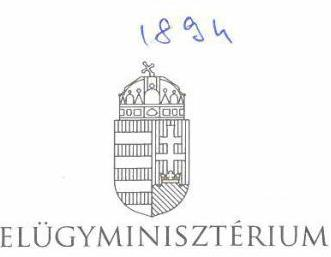

BELÜGYMINISZTÉRIUM

DR. PINTÉR SÁNDOR
miniszter

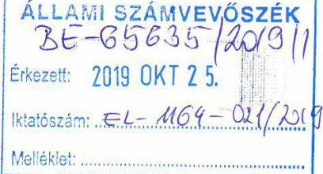

BMÖGF/652-7/2019.

Domokos László elnök úr részére

Állami Számvevőszék

Budapest

Tisztelt Elnök Úr!

Az „Önkormányzatok pénzügyi monitoring alapján végzett ellenőrzése – 220 önálló polgármesteri hivatallal rendelkező községi önkormányzat gazdálkodásának fenntarthatósága” című jelentéstervezethez a csatolt melléklet szerinti észrevételt teszem.

Budapest, 2019. október 22.

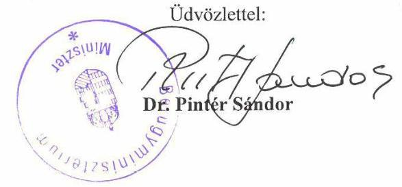

---

# Melléklet a BMÖGF/652-7/2019. iktatószámú levélhez 

A jelentéstervezet összegző megállapításai megerősítik, hogy a feladatalapú finanszírozási rendszer alapvetően betölti funkcióját, hiszen a vizsgált önkormányzatok esetében az ellátott feladatok finanszírozási struktúrája nem hordozott kockázatot, a működési bevételek fedezetet nyújtottak a működési kiadásokra.
Ugyancsak megerősítést nyert, hogy az önkormányzatok adósságkeletkeztető ügyleteinek újraszabályozása kapcsán a pénzintézeti adósságállomány nem jelent kockázatforrást az alrendszerben.

A minisztérium prioritásai között szerepel a finanszírozási rendszer nyomon követése, szükség esetén annak korrekciója.
Az önkormányzatok működőképessége szempontjából fontos a szállítói kötelezettségek alakulása, annak összetétele. A vizsgált évek vonatkozásában fontos megállapítás, hogy kedvezőtlen a szállítói kötelezettségek alakulása, azonban annak összegszerűsége - a 220 önkormányzat vonatkozásában összesen 192,0 millió forint a lejárt határidejű állomány - az önkormányzati alrendszer egészét tekintve nem meghatározó nagyságú. 3 olyan önkormányzat esetében jelezte az ÁSZ az adósságrendezési eljárás megindításának veszélyét, ahol a 90 napon túl fennálló tartozás mellett negatív működési jövedelem mutatható ki. A jelentéstervezetben szereplő önkormányzatok közül Kengyel Község esetében a Szolnoki Törvényszék 10.Apk.135/2019/22. számú, 2019. szeptember 20. napján jogerőre emelkedett végzésével az adósságrendezési eljárás megindítását elrendelte.

A későbbi vizsgálatokhoz hasznos lenne, ha azon 14 önkormányzat elemzés alapját képező adatait az ÁSZ rendelkezésre bocsátaná, melyeknél mindkét évben negatív működési jövedelem mutatkozott.

A jelentéstervezetben - korábbi jelentéseikhez hasonlóan - továbbra is szerepel, hogy a többségi önkormányzati tulajdonban lévő gazdasági társaságok növekvő kötelezettségállománya és veszteséges működése kockázatot hordozott az önkormányzatok gazdálkodására és vagyongazdálkodására. A jelentéstervezet szerint 2017-ben 67 db volt a többségi önkormányzati tulajdonban lévő gazdasági társaságok száma, ezek közül 27 db-nak volt veszteséges a gazdálkodása összesen 202,0 millió forint összegben. Bár ennek nagyságrendje nem meghatározó, de a tendencia ismeretében megfontolásra javasolt annak ÁSZ általi vizsgálata, hogy a veszteséges gazdálkodást milyen mértékben eredményezik a menedzsment döntései, vagy milyen mértékben vezethetők vissza a jelenlegi szabályozási környezet korlátaira.

A jelentéstervezet szintén tartalmaz utalást arra vonatkozóan, hogy az önkormányzati tulajdonban lévő cégekkel kapcsolatos adatokban meghatározó mértékben volt szükség adatkorrekcióra. Saját elemzéseink alkalmával mi is hasonló megállapításra jutottunk, ezért a Pénzügyminisztériummal közös javaslatot készítünk az adatszolgáltatás minőségének javítása érdekében.

---

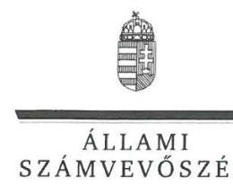

ELNÖK

Ikt. szám: EL-1164-022/2019.

# Dr. Pintér Sándor belügyminiszter 

Belügyminisztérium

## Budapest

## Tisztelt Miniszter úr!

A „Önkormányzatok pénzügyi monitoring alapján végzett ellenőrzése - 220 önálló polgármesteri hivatallal rendelkező községi önkormányzat gazdálkodásának fenntarthatósága" címmel készített számvevőszéki jelentéstervezetre tett észrevételét megkaptam.
Az Állami Számvevőszék észrevételekre vonatkozó álláspontjáról a felügyeleti vezető által készített részletes tájékoztatást csatoltan megküldöm.
Tájékoztatom Miniszter urat, hogy a számvevőszéki jelentésben - az Állami Számvevőszékről szóló 2011. évi LXVI. törvény 29. § (3) bekezdése alapján - a figyelembe nem vett észrevételeket szerepeltetjük az elutasítás indokának feltüntetésével.

Budapest, 2019. november 22.
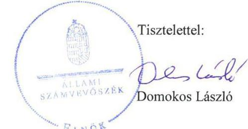

Melléklet: 1. Melléklet - Tájékoztatás az észrevételek kezeléséről
2. Melléklet - Önkormányzatok listája

---

# Tájékoztatás az észrevételek kezeléséről 

Az „Önkormányzatok pénzügyi monitoring alapján végzett ellenőrzése - 220 önálló polgármesteri hivatallal rendelkező községi önkormányzat gazdálkodásának fenntarthatósága" címủ jelentéstervezetre (továbbiakban: jelentéstervezet) a BMÖGF/652-7/2019. iktatószámú levélben megküldött észrevételeit áttekintettem.

Az észrevételek a jelentéstervezet megállapításait nem módosítják.
Tájékoztatom Miniszter Urat, hogy az ellenőrzés a Magyar Államkincstár által rendelkezésre bocsátott adatokra alapozva történt, a nyilvánosan elérhető adatbázisokban szereplő adatokkal kontrollálva. A pénzügyi monitoringon alapuló ellenőrzés lehetőséget ad az egyes településtípus szerinti települések pénzügyi-gazdasági helyzetének rendszerszintű értékelésére, és a kockázatforrást jelentő területek beazonosítására. Ellenőrzésünk célja ennek megfelelően az önkormányzatok központi információs rendszerében szereplő adatok értékelése alapján beazonosított kockázatok kezelésének előmozdítása. A Magyar Államkincstár központi információs rendszerében rendelkezésre álló önkormányzati éves költségvetési beszámolók adatait felhasználva, az önkormányzatok pénzügyi- és vagyongazdálkodási, valamint eladósodottság területen végzett monitoring riportok kiértékelésével az ÁSZ hozzájárul azon kockázatos területek feltárásához, amelyek rendszerszintű, vagy egyedi önkormányzati szintű beavatkozást igényelnek az önkormányzatok pénzügyi egyensúlyának fenntarthatósága érdekében. Jelen ellenőrzésünk nem tért ki a beazonosított kockázatokat okozó körülmények feltárására.
Örömmel vettem tájékoztatását, melyben Miniszter Úr az Állami Számvevőszék jelentéstervezetében foglalt megállapításaival kapcsolatban egyetértéséről adott számot, illetve tájékoztatott a jelentéstervezetben foglalt kockázatok kezelésére tett lépésekről, intézkedésekről. Ennek keretében a Minisztérium prioritásai között szerepel a finanszírozási rendszer nyomon követése, szükség esetén annak korrekciója, illetve javaslat készítése az adatszolgáltatás minőségének javítása érdekében.
Levelében megfogalmazott kérésére tájékoztatom Miniszter Urat, hogy a jelentés a véglegesítés során függelékkel egészül ki, amely a jelentés megállapításaival érintett egyes önkormányzatokkal kapcsolatban feltárt kockázatok értékelését tartalmazza. Jelen levelemmel egyidejűleg mellékletként megküldöm azon 14 önkormányzat listáját, melyeknél mindkét évben negatív működési jövedelem mutatkozott.
Budapest, 2019. november 26.
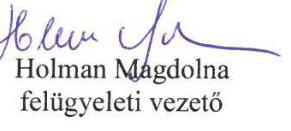

---

2. Melléklet
az EL-1164-022/2019. iktatószámú levélhez
2016. és 2017. évben negatív működési jövedelmet kimutató önkormányzatok

Arnót Község Önkormányzata
Erdőtelek Községi Önkormányzat
Hajdúszovát Község Önkormányzata
Jászdózsa Községi Önkormányzat
Kengyel Községi Önkormányzat
Mád Község Önkormányzata
Mezőzombor Község Önkormányzata
Nagydobos Község Önkormányzata
Nyírkarász Községi Önkormányzat
Nyírnihaldi Község Önkormányzat
Pócsmegyer Község Önkormányzata
Rákócziújfalu Községi Önkormányzat
Romhány Község Önkormányzata
Szigetmonostor Község Önkormányzata

---

# RÖVIDÍTÉSEK JEGYZÉKE 

${ }^{1}$ Önkormányzatok
${ }^{2}$ MÁK
${ }^{3}$ 105/2015. (IV. 23.) Korm. rendelet
${ }^{4} \mathrm{M} \mathrm{Ft}$
${ }^{5}$ ÁSZ SZMSZ
${ }^{6}$ Számv. tv.
${ }^{7}$ Mótv.
${ }^{8} \mathrm{E} \mathrm{Ft}$

220 önálló polgármesteri hivatallal rendelkező községi önkormányzat, amelyek község településtípus kategóriában szerepelnek. Az érintett 220 községi önkormányzat felsorolását a VII. számú melléklet tartalmazza.
Magyar Államkincstár
a kedvezményezett települések besorolásáról és a besorolás feltételrendszeréről szóló 105/2015. (IV. 23.) Korm. rendelet utolsó időállapota millió Ft-ban
Az Állami Számvevőszék Szervezeti és Működési Szabályzata 2000. évi C. törvény a számvitelről (hatályos: 2001. január 1-jétől) 2011. évi CLXXXIX. törvény Magyarország helyi önkormányzatairól (hatályos: 2012. január 1-jétől)
ezer Ft-ban

---

# ÁLLAMI SZÁMVEVŐSZÉK 

1052 Budapest, Apáczai Csere János utca 10.
Levélcím: 1364 Budapest 4. Pf. 54
Telefon: +36 14849100 Telefax: +36 14849200
www.asz.hu

