# Jelenetés 

## Önkormányzatok pénzügyi monitoring alapján végzett ellenőrzése

Öt vagy annál több önkormányzat alkotta közös önkormányzati hivatali székhely községi önkormányzatai, összesen 144 községi önkormányzat gazdálkodásának fenntarthatósága 2019. 12. hó 17. nap
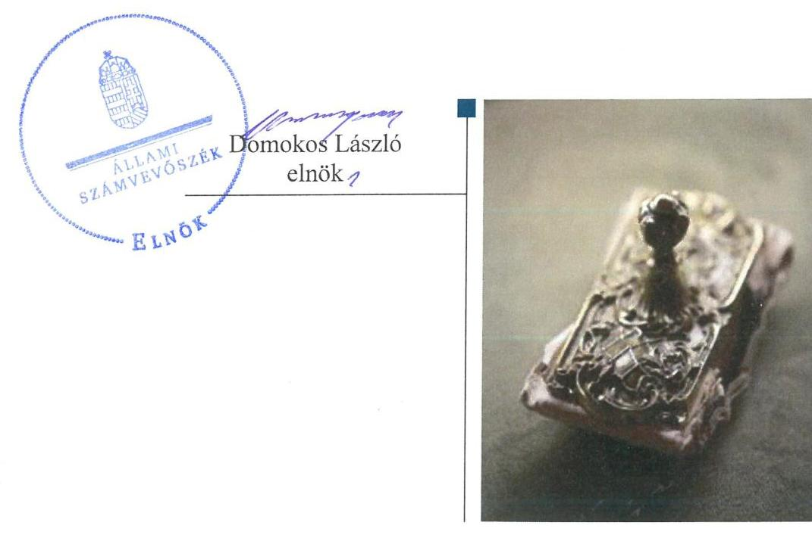

---

# Jelenetés 

## Önkormányzatok pénzügyi monitoring alapján végzett ellenőrzése

Öt vagy annál több önkormányzat alkotta közös önkormányzati hivatali székhely községi önkormányzatai, összesen 144 községi önkormányzat gazdálkodásának fenntarthatósága 2019. 12. hó 17. nap

---

Jelentéseink az Országgyülés számítógépes hálózatán és az Interneten a www.asz.hu címen is olvashatóak.

## AZ ELLENŐRZÉST FELÜGYELTE:

HOLMAN MAGDOLNA JULIANNA felügyeleti vezető

## AZ ELLENŐRZÉST VEZETTE ÉS A VÉGREHAJTÁSÁÉRT FELELŐS:

KISTÓTH KRISZTINA ellenőrzésvezető

## A PROGRAM ÖSSZEÁLLÍTÁSÁÉRT FELELŐS:

SZAPPANOS JÚLIA osztályvezető

## A TÉMÁHOZ KAPCSOLÓDÓ KORÁBBI SZÁMVEVŐSZÉKI JELENTÉSEK:

- címe: Önkormányzatok pénzügyi monitoring alapján végzett ellenőrzése - A nagyközségi önkormányzatok gazdálkodásának fenntarthatósága Önkormányzatok pénzügyi monitoring alapján végzett ellenőrzése - A városi önkormányzatok gazdálkodásának fenntarthatósága
- sorszáma: 18081; 19017

IKTATÓSZÁM: EL-2333-001/2019.
TÉMASZÁM: 2504
ELLENŐRZÉS-AZONOSÍTÓ SZÁM: V0848

---

# TARTALOMJEGYZÉK 

- ÉRTÉKELÉS ..... 5
- KÖVETKEZTETÉS ..... 7
- AZ ELLENŐRZÉS CÉLJA ..... 8
- AZ ELLENŐRZÉS TERÜLETE ..... 9
- AZ ELLENŐRZÉS HÁTTERE, INDOKOLTSÁGA ..... 11
- A JELENTÉS LÉNYEGES KÉRDÉSKÖREI ..... 12
- AZ ELLENŐRZÉS HATÓKÖRE ÉS MÓDSZEREI ..... 13
- MEGÁLLAPÍTÁSOK ..... 15
MELLÉKLETEK ..... 25
I. sz. melléklet: Fogalomtár ..... 25
II. sz. melléklet: Az ellenőrzési kritériumok módszertana és értékelése ..... 28
III. sz. melléklet: Az eszközök és források alakulása kiemelt mérlegsoronként a 2016-2017. években (E Ft) ..... 30
IV. sz. melléklet: Pénzügyi egyensúlyi helyzet CLF módszer szerinti értékelése a 2016-2017. években (E Ft) ..... 31
V. sz. melléklet: Az Önkormányzatok 2016-2017. évi főbb mutatóinak és kockázati területeinek összefoglaló értékelése ..... 33
VI. sz. melléklet: Az Önkormányzatok 2016-2017. évi főbb mutatóinak és kockázati területeinek részletes értékelése ..... 34
VII. sz. melléklet: A kockázatelemzés alá vont Önkormányzatok ..... 36
FÜGGELÉKEK ..... 39
I. sz. függelék: A jelentésben beazonosított 2017. évre vonatkozó kockázatokkal érintett önkormányzatok ..... 39
II. sz. függelék: Észrevételek ..... 41
- RÖVIDÍTÉSEK JEGYZÉKE ..... 43

---

.

---

# ÉRTÉKELÉS 

Az Állami Számvevőszék azon 144 közös hivatali székhely önkormányzat gazdálkodásának a kockázatait értékelte, amelyekhez öt vagy annál több községi önkormányzat tartozik. A 2016. és 2017. évekre vonatkozó önkormányzati beszámolók adatai szerint az önkormányzatok gazdálkodása stabil, pénzügyi egyensúlyuk biztosított volt, mérleg szerinti vagyonuk nőtt, azonban a tárgyi eszközök vagyonpótlásáról nem gondoskodtak. Az adósságkonszolidációt követően az önkormányzatok gazdálkodásának fenntarthatósága biztosított volt.

## Az ellenőrzés társadalmi indokoltsága

A magyar települési önkormányzatok a 2002-2008. között felhalmozott adósságállományának állami konszolidációjára 2011. és 2014. között került sor. Az adósságkonszolidációk eredményeként az önkormányzatok feladatellátása újra strukturálódott, rendszerszinten pénzügyi helyzetük helyreállt. Ugyanakkor az önkormányzatok gazdálkodásából eredő veszélyek miatt az ASZ továbbra is kiemelt figyelmet fordít az önkormányzatok pénzügyi egyensúlyi helyzetére ható kockázatok monitorizálására, a pénzügyi sérülékenységet okozó folyamatokra, az önkormányzati alrendszert veszélyeztető rendszeregyensúlyi kockázatokra annak érdekében, hogy a konszolidáció eredményei fenntarthatóak legyenek.

A Magyar Államkincstár központi információs rendszerében rendelkezésre álló önkormányzati éves költségvetési beszámolók adatait felhasználva, az önkormányzatok pénzügyi- és vagyongazdálkodási, valamint eladósodottság területen végzett monitoring riportok kiértékelésével az ASZ hozzájárul azon kockázatos területek feltárásához, amelyek rendszerszintű, vagy egyedi önkormányzati szintű beavatkozást igényelnek az önkormányzatok pénzügyi egyensúlyának fenntarthatósága érdekében.

Az önkormányzati törvény az önkormányzatok teherbíró képességére figyelemmel a differenciált hatáskör telepítés elvén alapul. Ez megjelenik az éves költségvetésükben. Erre figyelemmel a pénzügyi monitoringon alapuló ellenőrzés lehetőséget ad az egyes településtípus szerinti települések pénzügyi-gazdasági helyzetének rendszerszintű értékelésére, és a kockázatforrást jelentő területek beazonosítására. A községi településtípusba tartozó önkormányzatokon belül önálló kockázati csoportot képeztünk az öt vagy annál több önkormányzat alkotta közös önkormányzati hivatal székhely községi önkormányzatokra. Emellett a monitoring típusú ellenőrzés az ASZ erőforrásainak hatékony felhasználásával, az adatbekérések minimalizálásával, a kockázatokra fókuszáltan, széles lefedettséget képes biztosítani az önkormányzati alrendszer területén.

---

# Főbb megállapítások 

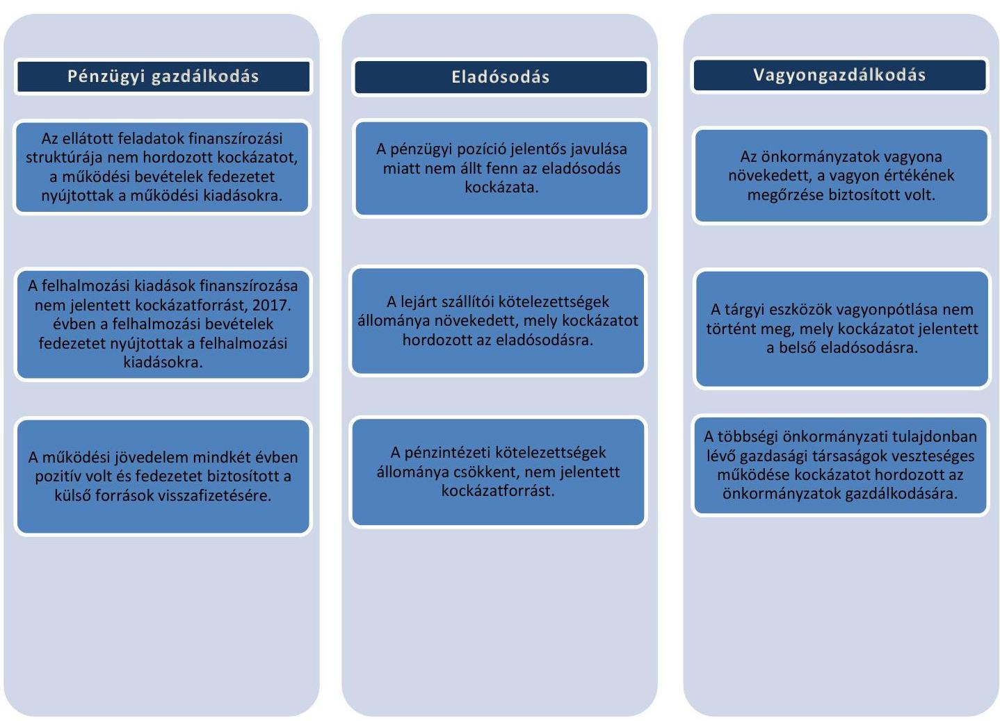

Az ellenőrzött időszakban az öt vagy annál több önkormányzat alkotta közös önkormányzati hivatal székhely községi önkormányzatok gazdálkodása stabil volt. A 2016. és a 2017. években az önkormányzatok működési jövedelme és nettó működési jövedelme pozitív volt, pénzügyi pozíciójuk a 2017. évben jelentős mértékben javult. Az Önkormányzatok mérleg szerinti vagyona nőtt, azonban a tárgyi eszközök vagyonpótlásáról az ellenőrzött időszakban nem gondoskodtak.

---

# KÖVETKEZTETÉS 

A 144 öt vagy annál több önkormányzat alkotta közös önkormányzati hivatal székhely községi önkormányzatok pénzügyi egyensúlya a feladatok és gazdálkodási feltételek lényeges változása nélkül fenntartható, rendszerszintű beavatkozást nem igényel. Az eladósodás rendszerszintű kockázata nem áll fenn. A vagyon megőrzése érdekében hosszabb távon erőfeszítéseket kell tenni.
A pénzügyi gazdálkodás, az eladósodás és a vagyongazdálkodás területén a 144 székhely községi önkormányzat önkormányzati szintű kockázatait is értékeltük. A 2017. évre vonatkozó értékelést megküldtük a kockázatokkal érintett településekre, megjelölve a kockázatos területeket. E településeken közel 72 ezer ember él, az ellenőrzéssel érintett lakosság 51%-a.

Figyelemfelhívó levél keretében jeleztük

- a jelentés I. sz. függelékében szereplő, negatív működési jövedelemmel, 90 napon túli lejárt szállítóállománnyal, lejárt kötelezettségekkel, valamint magas garancia-és kezességvállalással rendelkező, összesen 42 önkormányzat;
- a pénzügyi gazdálkodás, az eladósodás, a vagyongazdálkodás kockázati értékelését követően a kettő, vagy három területen közepes kockázattal rendelkező, összesen 27 önkormányzat
gazdálkodásából eredő 2017. évi kockázatokat. A pénzügyi egyensúly megteremtése, fenntartása érdekében, figyelemmel a 2018-2019-ben bekövetkezett változásokra ezen önkormányzatoknak a kockázatokat a 2019. év tekintetében értékelni kell. A kockázatok súlyának, a működési egyensúlyra és a feladatellátásra gyakorolt hatásának megfelelően kell az önkormányzatoknak a kockázatokat kezelniük, az intézkedéseket megtenniük.

---

# AZ ELLENŐRZÉS CÉLJA

**AZ ELLENŐRZÉS CÉLJA** az önkormányzatok központi információs rendszerében szereplő adatok értékelése alapján beazonosított kockázatok kezelésének előmozdítása.

---

# AZ ELLENŐRZÉS TERÜLETE

## A község településtípushoz tartozó 144 önkormányzat

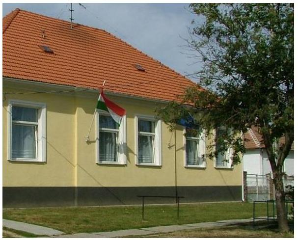

A MÁK1 törzskönyvi nyilvántartás szerint a 2016. és a 2017. években 2678 községi önkormányzat volt. Ezen belül csoportot képeznek azon közös hivatali székhely önkormányzatok, amelyekhez öt vagy annál több önkormányzat tartozik, összesen 144 önkormányzat (továbbiakban Önkormányzat2).

Az Önkormányzatok állandó lakosságának száma összesen 141 853 fő volt 2016. január 1-jén és 141 219 fő volt 2017. január 1-jén, kis mértékben 534 fővel (0,4%) csökkent.

Az ellenőrzött önkormányzatok közös hivatalai 5-13 település feladatait látják el. Ebből 108 közös hivatal 5-7 település, 29 közös hivatal 8-10 település, míg 7 közös hivatal legalább 11 település kapcsolódó feladatai végzi.

Az Önkormányzatok 77,8%-ának lakosságszáma az 501-1500 közötti lakosságszám tartományba esett. Az ellenőrzött csoportban 14 önkormányzat állandó lakosságszáma 500 fő alatt volt, 66 önkormányzatnál a lakosságszám 501-1000 fő között változott, míg 62 önkormányzat lakosságszáma 1001-2000 fő között alakult. A 2000 főt 2 önkormányzat lakosságszáma haladta meg.

Az Önkormányzatok 12 megyében helyezkednek el. Az önkormányzatok megyék szerinti eloszlását a térkép mutatja.

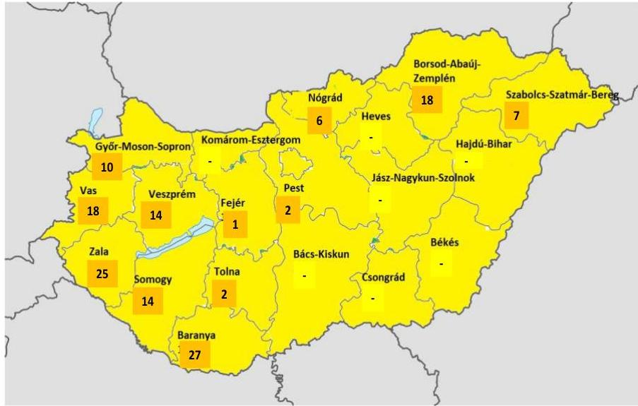

A 144 község közül a 105/2015. (IV. 23.) Korm. rendelet3 2017. január 1-i besorolása szerint a társadalmi-gazdasági és infrastrukturális szempontból kedvezményezett települések száma 30, a jelentős munkanélküliséggel sújtott települések száma 34 volt.

Az Önkormányzatok egy főre jutó helyi adóbevétele 2016. évben 34 056 Ft, a 2017. évben 33 563 Ft volt. Az 1 főre jutó működési kiadások 2016. évben 222 750 Ft, 2017. évben 232 264 Ft értékben realizálódtak.

Az Önkormányzatok közül a 2016. évben 57, míg a 2017. évben 47 önkormányzat kapott rendkívüli, kiegészítő önkormányzati támogatást.

---

Az önkormányzati többségi tulajdonú gazdasági társaságok száma a 2016. évben 2, a 2017. évben 4 társasággal emelkedett, az Önkormányzatoknál a 2016. évben 13, a 2017. évben 17 többségi tulajdonú gazdasági társaság működött.
2017. évben 12 önkormányzat hozott létre új intézményt, jellemzően főzőkonyhai és óvodai szolgáltatásokra, míg az ellenőrzött időszakban intézmény megszüntetésre nem került sor.

Az Önkormányzatok összevont költségvetési beszámolók szerint teljesített éves költségvetési bevételét és költségvetési kiadását, a könyvviteli mérleg szerinti eszközök, a követelések és kötelezettségek állományi értékét az 1. táblázat mutatja be (MFt4).

1. táblázat

| Év | Bevételek | Kiadások | Eszközök | Követelések | Kötelezettségek |
| :-- | :-- | :-- | :-- | :-- | :--: |
| $\mathbf{2 0 1 6 .}$ | $37212,0$ | $35063,4$ | $127653,2$ | $3380,0$ | $1921,2$ |
| $\mathbf{2 0 1 7 .}$ | $45434,2$ | $38720,0$ | $135067,3$ | $4105,6$ | $2033,0$ |

Forrás: Önkormányzatok beszámolói

---

# AZ ELLENŐRZÉS HÁTTERE, INDOKOLTSÁGA 

AZ ÁSZ STRATÉGIÁJÁBAN célul tűzte ki, hogy az önkormányzatok ellenőrzése során azok pénzügyi-gazdasági helyzetét értékeli, kockázatait feltárja. Az új megközelítésű, elemzéssel alátámasztott mintavétellel, illetve ellenőrzési eljárásokkal csökkentse a helyszíni ellenőrzések számát. A monitoring rendszer az önkormányzatok éves költségvetési beszámolójának, időközi költségvetési jelentéseinek és mérlegjelentéseinek a központi információs rendszerben szereplő adatai értékelése alapján jelzi, hogy melyek azok az önkormányzatok, és melyek azok a területek, ahol olyan kedvezőtlen gazdasági folyamatok, vagy gazdasági események következtek be, amelyek ellenőrzés lefolytatását teszik indokolttá.

Ennek az egyszerűsített ellenőrzési módszernek az eredményeként megtörténik az önkormányzatok pénzügyi, vagyoni helyzetének megítélése, a pénzügyi egyensúly minősítése, továbbá a változások hatásának értékelése.

AZ ÖNKORMÁNYZATI ALRENDSZERBEN megjelenő gazdálkodási nehézségek, likviditási problémák és az eladósodottság növekedése az ÁSZ figyelmét a 2011. évtől az önkormányzatok pénzügyi helyzetére irányította. Az önkormányzati feladatellátást érintő átalakítások meghatározó része a 2013. évben következett be azzal, hogy az igazgatási, az oktatási, az egészségügyi és a szociális ellátásban a feladatok jelentős hányadát átvette az állam.

Az önkormányzati alrendszerben a 2013. évtől bevezetett új feladatfinanszírozási rendszer keretein belül továbbra is megoldandó kérdés a pénzügyi egyensúly megteremtése, hosszú távú fenntartása. Ahhoz, hogy az önkormányzatok meg tudjanak felelni a számukra meghatározott - szigorúbb - gazdálkodási szabályoknak, és az új feltételek mellett is biztosítható legyen a közszolgáltatások megfelelő színvonalú ellátása, szükséges volt a pénzügyi-gazdasági rendszerük alapjainak megszilárdítása, amely célt az adósságkonszolidáció szolgálta.

Az adósságkonszolidáció az önkormányzatok pénzügyi egyensúlyi helyzetére kedvező hatást gyakorolt, azonban a problémák kiváltó okait nem szüntette meg, ennek kezelése nélkül viszont az adósságállomány újratermelődhet. Erre tekintettel kiemelt fontosságú az önkormányzatok pénzügyi egyensúlyi helyzetére ható kockázatok feltárása.

---

# A JELENTÉS LÉNYEGES KÉRDÉSKÖREI 

1. Az önkormányzatok pénzügyi gazdálkodásának fenntarthatósága biztosított volt-e?
2.     - Fennállt-e az önkormányzatok eladósodásának kockázata?
3. Az önkormányzatok vagyongazdálkodása során biztosított volt-e a vagyon értékének a megőrzése?

---

# AZ ELLENŐRZÉS HATÓKÖRE ÉS MÓDSZEREI 

## Az ellenőrzés típusa

Helyénvalósági ellenőrzés.

## Az ellenőrzött időszak

A 2016-2017. évek.

## Az ellenőrzés tárgya

Az önkormányzati gazdálkodás fenntarthatósága, a törvényben előírt feladatok ellátása, az önkormányzatoknál észlelt negatív tendenciák okainak feltárása.

## Az ellenőrzött szervezet

Belügyminisztérium, mint a Kormány helyi önkormányzatokért felelős tagja által vezetett minisztérium, valamint a VII. számú melléklet szerinti monitoring alá vont önkormányzatok.

## Az ellenőrzés jogalapja

Az ellenőrzés jogszabályi alapját az Állami Számvevőszékről szóló 2011. évi LXVI. törvény 1. § (3) bekezdésének, az 5. § (2)-(6) bekezdéseinek, valamint az államháztartásról szóló 2011. évi CXCV. törvény 61. § (2) bekezdésének előírásai képezték.

## Az ellenőrzés módszerei

Az ellenőrzést az ellenőrzési program ellenőrzési kérdései, az ellenőrzött időszakban hatályos jogszabályok, az ellenőrzés szakmai szabályok és módszertanok figyelembe vételével
 végeztük.

Az ellenőrzés ideje alatt az ellenőrzött szervezettel történő kapcsolattartást az ÁSZ SZMSZ-ének vonatkozó előírásai alapján biztosítottuk.

Az ellenőrzési kérdések megválaszolásához szükséges bizonyítékok megszerzése a Magyar Államkincstár által rendelkezésre bocsátott adatokra alapozva elemző eljárással történt, amelyeket kontrolláltunk a nyilvánosan elérhető adatbázisokban szereplő adatokkal.

---

Az ÁSZ az ellenőrzés előkészítése során meghatározta az ellenőrzési (helyénvalósági) kritériumokat, amelyek az ellenőrzési bizonyíték értékelésének, valamint a számvevőszéki jelentésben szereplő megállapítások és következtetések alapját képezték. A megállapításokban használt fogalmak értelmezését, forrását a fogalomtár, a mutatók helyénvalósági kritériumait, és a kockázatok értékelését az ellenőrzési kritériumok módszertana és értékelése tartalmazza.

A pénzforgalmi adatokat tartalmazó mutatók számításánál a 2016. évben a 2015. évi végi adatokat, a 2017. évben a 2016. év végi adatokat tekintettük bázis adatnak. A mérlegadatokat tartalmazó mutatók esetében a 2016. január 1. és 2017. december 31. közötti adatokkal számoltunk. A gazdasági társaságok esetében a 2017. és 2018. évi VI. havi időközi költségvetési jelentésekben szereplő 2016. december 31-re és 2017. december 31-re vonatkozó társasági adatokat vettük figyelembe.

A kormányzati jóváhagyással megkötött hosszú lejáratú adósságot keletkeztető ügyletek, valamint a többségi önkormányzati tulajdonban lévő gazdasági társaságok kötelezettségei tételes ellenőrzése során felhasználtunk nyilvánosan elérhető adatokat (zárszámadási rendeletek, e-beszámoló, cégnyilvántartás adatai).

Az ellenőrzési kérdésekre adott válaszok alapján értékeltük, hogy az önkormányzatok képesek voltak-e a törvényben meghatározott feladataikat ellátni, gazdálkodásuk változatlan formában fenntartható-e.

Az értékelést a felülvizsgált adatok alapján végezte az ÁSZ. A felülvizsgálat eredményeképpen a 144 önkormányzat 7,6%-ánál hajtott végre az ÁSZ adatkorrekciót az önkormányzatok többségi tulajdonában lévő gazdasági társaságokkal kapcsolatos adatokban, mely jelzi az önkormányzati beszámolók ezen területének megbízhatósági kockázatát.

---

# 1. Az önkormányzatok pénzügyi gazdálkodásának fenntarthatósága biztosított volt-e? 

Összegző megállapítás

Az Önkormányzatok működés, felhalmozás és adósságszolgálat finanszírozási struktúrája biztosította a pénzügyi gazdálkodás fenntarthatóságát a 2016-2017. években.

## 2. táblázat

## MUTATÓK ALAKULÁSA

| Mutatók | 2016.   év | 2017.   év |
| :--: | :--: | :--: |
| Működési kiadások fedezettsége | $108,8 \%$ | $107,9 \%$ |
| Rendkívüli önkormányzati támogatás aránya | $0,75 \%$ | $0,48 \%$ |
| Adóbevételek működési bevételeken belüli aránya | $14,05 \%$ | $13,40 \%$ |
| Felhalmozási kiadások fedezettsége | $82,0 \%$ | $169,8 \%$ |

## AZ ÖNKORMÁNYZATOK ÁLTAL ELLÁTOTT FEL-

ADATOK működési kiadásaira a működési bevételek fedezetet nyújtottak, a fedezettség 2016. évben 108,8%-on, a 2017. évben 107,9%-on teljesült, kis mértékben csökkent. A folyó kiadások - folyó bevételekhez viszonyított - magasabb arányú növekedése okozta a fedezettség mutató 0,9%-os csökkenését. A 2017. évben az előző évhez képest a működési kiadások 31 597,7 M Ft-ról, 32 800,1 M Ft-ra (3,8%-kal) emelkedtek, míg a működési bevételek ebben az időszakban 34 371,2 M Ft-ról, 35 384,5 M Ft-ra, 2,9%-kal nőttek. A mutatók alakulását a 2. táblázat tartalmazza.

A személyi juttatások 4,5%-kal, a dologi kiadások 5,4%-kal, az egyéb működési célú kiadások 8,7%-kal emelkedtek a 2017. évben a 2016. évhez képest. A működési bevételeken belül az államháztartáson belülről kapott működési célú támogatások értéke 4,2%-kal emelkedett, míg a közhatalmi bevételek 1,9%-kal csökkentek 2017. évben a megelőző évhez képest.

Az Önkormányzatok működési kiadások fedezettsége nem hordozott kockázatot az ellátott feladatok finanszírozására.

## RENDKÍVÜLI ÖNKORMÁNYZATI TÁMOGATÁSBAN

2016. évben 57 önkormányzat 258,2 M Ft értékben, 2017. évben 47 önkormányzat 170,5 M Ft értékben részesült. A működési bevételekhez viszonyított rendkívüli támogatás aránya alacsony volt, a 2016. évi 0,75%-ról 0,48%-ra kedvezően csökkent a 2017. évben.

Az Önkormányzatok működési bevételei a rendkívüli önkormányzati támogatások nélkül is fedezetet nyújtottak a működési kiadásokra a 2016. (108,0%) és a 2017. években (107,4%).

A rendkívüli támogatás összegének, a működési bevételekhez viszonyított arányának és a támogatást kapott önkormányzatok számának csökkenése kedvező tendenciát mutat, amely jelzi, hogy az Önkormányzatok gazdálkodási nehézségei mérséklődtek, pénzügyi helyzetük javult.

AZ ADÓBEVÉTELEK működési bevételeken belüli aránya a 2016. évben 14,06%, a 2017. évben 13,40% volt, 0,65 százalékponttal csökkent a 2016. évhez képest. A 2016. évben az adóbevételek állománya az Önkormányzatoknál 4 831,0 M Ft, a 2017. évben 4 739,8 M Ft volt, összesen 91,2 M Ft-os (-1,9%) csökkenést mutatott.

Az ellenőrzött időszakban az adóbevételeknek jelentős részét, 70%-át az iparűzési adóbevételek tették ki. 2016. évben az iparűzési adóbevételek

---

állománya 3 374,3 M Ft, a 2017. évben 3 319,0 M Ft volt, mely 55,3 M Ft-os (1,6%) csökkenést jelentett.

Az adóbevételek - kiemelten a helyi iparűzési adóbevételek - alakulását az 1. ábra mutatja be.
1. ábra
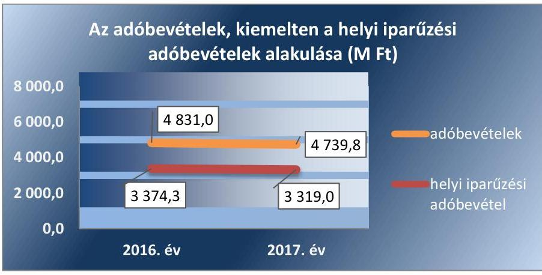

Forrás: Önkormányzatok beszámolói
Az adóbevételek és ezen belül a helyi iparűzési adóbevételek állományának csökkenése rontotta a kiadások fedezettségét.

A FELHALMOZÁSI KIADÁSOK finanszírozása nem jelentett kockázatforrást az Önkormányzatok pénzügyi gazdálkodására.

A 2016. évben a költségvetési kiadások 9,9%-át, a 2017. évben 15,3%-át fordították felhalmozási kiadásokra. A felhalmozási bevételek a 2016. évben 82,0%-ban nyújtottak fedezetet a felhalmozási kiadásokra, azonban a felhalmozási költségvetés hiányára a működési jövedelem fedezetet nyújtott, a finanszírozási bevételek nélküli pénzügyi pozíció 2 148,6 M Ft egyenleget mutatott.

A 2016-2017. évek felhalmozási bevételeinek forrásösszetételét a 2. ábra mutatja be.
2. ábra
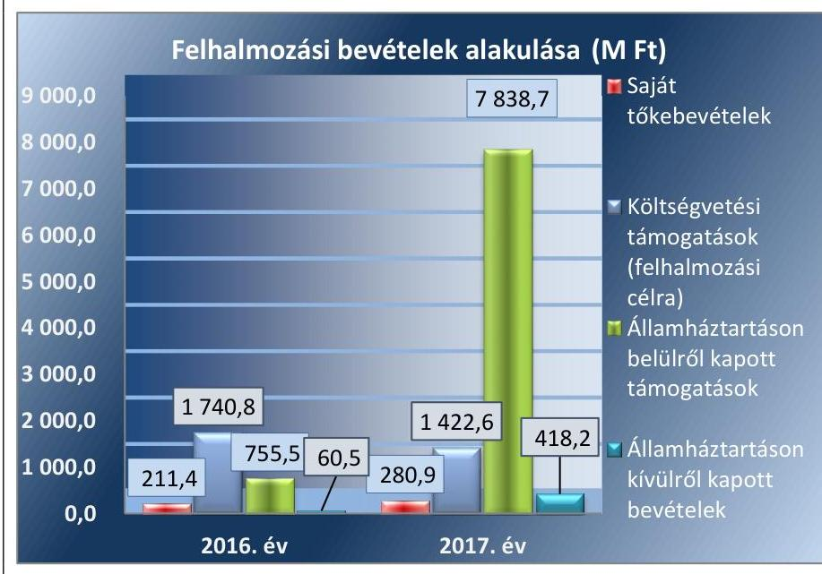

Forrás: Önkormányzatok beszámolói

---

3. táblázat

|  |   |   |
| --- | --- | --- |
|  MUTATÓK ALAKULÁSA |  |   |
|  Mutatók | 2016. év | 2017. év  |
|  Törlesztés fede- |  |   |
|  zettségének ará- | $14,2 \%$ | $15,6 \%$  |
|  nya |  |   |
|  Nettó működési |  |   |
|  jövedelem | 2380,5 | 2181,4  |
|  (M Ft) |  |   |

A 2017. évben a felhalmozási bevételek 169,8%-ban fedezetet nyújtottak a felhalmozási kiadásokra, a felhalmozási kiadások fedezettsége 87,8 százalékponttal javult a 2017. évben a 2016. évhez képest.

A felhalmozási kiadások 3 465,7 M Ft-ot tettek ki a 2016. évben, melyek +70,8%-al, 5 919,9 M Ft-ra emelkedtek a 2017. évben. A felhalmozási kiadásokon belül 2017. évben a beruházások 52,7%-kal, 2 768,4 M Ft-ra, míg a felújítási kiadások 130,1%-kal 3 013,4 M Ft-ra, több, mint duplájára nőttek a megelőző évhez képest. Az Önkormányzatok jelentős beruházási-fejlesztési kiadásaira a felhalmozási bevételek még nagyobb arányú növekedése - ezen belül az államháztartáson belülről kapott támogatásoknak előző évhez képest 7 083,2 M Ft-tal magasabb értéke - megfelelő fedezetet biztosított.

Az államháztartáson belülről kapott támogatások jelentős részét képezték a Széchenyi 2020 operatív programjai keretében elnyert pályázati források, melyeket az önkormányzatok energetikai, víz, szennyvíz és oktatási (ezen belül jellemzően óvodai kapacitásbővítési) fejlesztésekre kaptak.

## AZ IGÉNYBEVETT KÜLSŐ FORRÁSOK VISSZAFIZETÉSE

nem jelentett kockázatot az Önkormányzatok pénzügyi gazdálkodásának fenntarthatóságára a 2016. és a 2017. években. A mutatók alakulását a 3. táblázat tartalmazza.

Az Önkormányzatoknak a 2016. évben + 2773,5 M Ft, a 2017. évben + 2584,4 M Ft működési jövedelme keletkezett, a csökkenés 6,82% volt. Az Önkormányzatok működési jövedelme mindkét évben fedezetet nyújtott a külső források adósság-szolgálatának teljesítésére, a 2016. évben annak 14,2%-át, míg a 2017. évben 15,6%-át kellett hiteltörlesztésre (tőketörlesztésre) fordítani, a mutató 1,4 százalékponttal emelkedett.

A nettó működési jövedelem mindkét évben pozitív volt, a 2016. évben 2 380,5 M Ft-on, a 2017. évben 2 181,4 M Ft-on realizálódott. 2017. évben a nettó működési jövedelem 8,4%-kal csökkent, melyet a működési jövedelem 6,82%-os csökkenése mellett a tőketörlesztés 2,4%-os növekedése okozott. A nettó működési jövedelem csökkenése az Önkormányzatok pénzügyi kapacitásának csökkenését jelzi.

# 2. Fennállt-e az önkormányzatok eladósodásának kockázata? 

## Összegző megállapítás

4. táblázat

| MUTATÓK ALAKULÁSA |  |  |
| :--: | :--: | :--: |
| Mutatók | 2016. év | 2017. év |
| Eladósodási   mutató | $1,5 \%$ | $1,5 \%$ |
| Eladósodási   mutató változása   százalékpontban | 0,04 | 0,00 |

A PÉNZÜGYI EGYENSÚLY az Önkormányzatoknál az ellenőrzött időszakban biztosított volt. Az Önkormányzatok költségvetési bevételei a 2016. és a 2017. évben fedezetet nyújtottak a költségvetési kiadásokra, a maradvány igénybevétele - 2016. évben 5 556,8 M Ft, a 2017. évben 7 303,4 M Ft volt - tovább javította az Önkormányzatok pénzügyi helyzetét. A költségvetési bevételek és a költségvetési kiadások különbözete a 2016. évben 2 148,6 M Ft volt, míg a 2017. évben az előző évi háromszorosát meghaladóan, 6714,2 M Ft-ra teljesült. A mutatók alakulását a 4. táblázat tartalmazza.

---

5. táblázat

|  MUTATÓK ALAKULÁSA |  |   |
| --- | --- | --- |
|  Mutatók | $\begin{gathered} 2015 . \ \text { év } \end{gathered}$ | $\begin{gathered} 2017 . \ \text { év } \end{gathered}$  |
|  Kötelezettségek dologi, felújítási beruházási kiadásokra állomány változása | $-9,90 \%$ | $-22,80 \%$  |
|  Lejárt dologi, felújítási beruházási kiadásokkal kapcsolatos kötelezettségek állomány aránya (szállítói állományból) | $16,8 \%$ | $27,7 \%$  |
|  Lejárt dologi, felújítási, beruházási kiadásokkal kapcsolatos kötelezettségek állomány változása | $-18,6 \%$ | $+27,6 \%$  |
|  Lejárt szállítói állomány aránya a dologi kiadások egy havi átlagához viszonyítva | $8,3 \%$ | $10,7 \%$  |
|  90 napon túl lejárt kötelezettségek állományának aránya (összes köt. állományból) | $0,2 \%$ | $0,1 \%$  |

Forrás: Önkormányzatok beszámolói

Az Önkormányzatok pénzügyi egyensúlyi helyzetének CLF módszer szerinti értékelését - a 2016-2017. években - a IV. számú melléklet tartalmazza.

Az Önkormányzatok eladósodási mutatója kedvező, alacsony szinten alakult, a 2016. és a 2017. évben 1,5% volt. Az idegen források alacsony és változatlan aránya nem jelentett kockázatot az Önkormányzatok pénzügyi egyensúlyára.

Az Önkormányzatok pénzügyi egyensúlyi helyzetének alakulását (a maradvány figyelembevételével) a 3. ábra mutatja be.

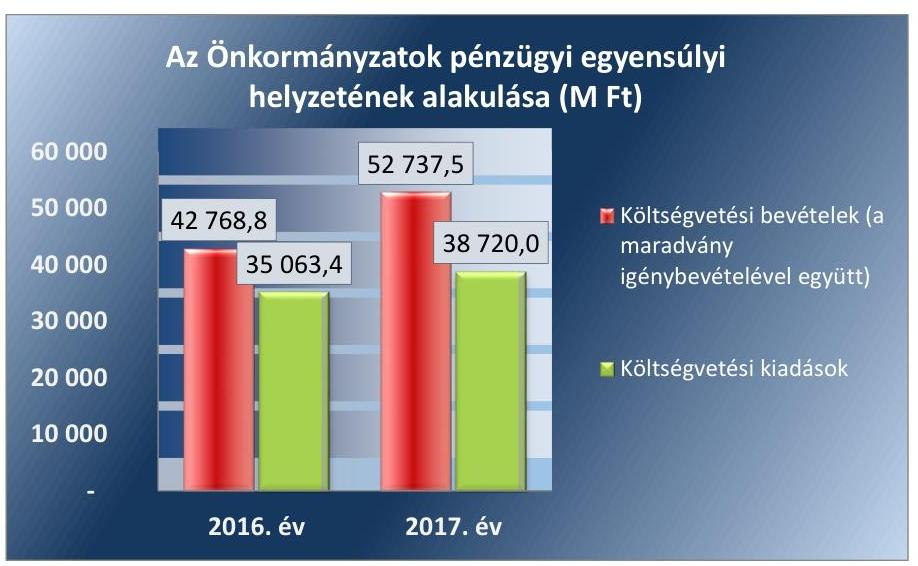

Az Önkormányzatok pénzügyi pozíciója kedvezően alakult, a 2016. évben 1726,2 M Ft a 2017. évben 6 643,2 M Ft értékben realizálódott, közel négyszeresére emelkedett. A pénzügyi pozíció erősödését elsősorban a felhalmozási egyenleg 4 754,7 M Ft-os növekedése és a finanszírozási egyenleg 351,3 M Ft-tal csökkenő negatív egyenlege okozta, ugyanakkor kis mértékben rontotta azt a működési jövedelem -189,1 M Ft-tal. Ezzel egy időben 2016. évről 2017. évre az Önkormányzatok pénzeszköze 6 634,50 M Ft-tal (85,5%) 14 397,5 M Ft-ra emelkedett.

A finanszírozási műveletek egyenlege 2016. évben -422,3 M Ft, 2017. évben -71 M Ft volt, 83,2%-kal javult. A finanszírozási műveletek nem hordoztak kockázatot, annak belső szerkezete kedvezően alakult. Az Önkormányzatoknál 2016. évben 88,1 M Ft-tal, 2017. évben pedig 10,4 M Ft-tal a hiteltörlesztés értéke meghaladta a hitelfelvétel összegét, továbbá az Önkormányzatok 2016. évben 426,0 M Ft-tal és 2017. évben 135,7 M Ft-tal több értékpapírt vásároltak, mint amennyit értékesítettek.

A SZÁLLÍTÓI KÖTELEZETTSÉG (az Önkormányzatok dologi, beruházási
 és felújítási kiadásokkal kapcsolatos kötelezettsége) állománya 2016. évben 9,9%-kal, majd 2017. évben további 22,8%-kal csökkent. A szállítói kötelezettség-állomány mérlegfőösszeghez mért aránya mindkét évben azonos, 0,2% volt. A mutatók alakulását az 5. táblázat tartalmazza.

A csökkenő szállítói állományon belül a lejárt szállítói kötelezettség a 2017. év végén 3,2 M Ft-tal (4%-al) meghaladta a 2016. év eleji értéket. A

---

| 6. táblázat |  |  |
| :--: | :--: | :--: |
| MUTATÓK ALAKULÁSA |  |  |
| Mutatók | 2016. | 2017. |
|  | év | év |
| Banki kötelezettség állomány mérlegfőösszeghez mért nagysága | 0,020% | 0,015% |
| Banki kötelezettségek állományának változása | -78,5% | -22,3% |
| Garancia- és kezességvállalások állománya, M Ft | 0 | 53,7 |

forrás: Önkormányzatok beszámolói
lejárt állomány a 2016. évben 68,5 M Ft-ra 18,6%-kal csökkent, azonban a 2017. évben 87,5 M Ft-ra 27,7%-kal újra növekedett. A szállítói állományon belül a lejárt szállítói állomány aránya szintén növekvő, a 2016. évben 16,8%, a 2017. évben 27,7% volt, 10,9 százalékponttal emelkedett. A lejárt dologi kiadásokkal kapcsolatos kötelezettségeknek a dologi kiadások egy havi átlagához viszonyított aránya is kedvezőtlenül változott, a 2016. évben 8,29%-ra, a 2017. évben 10,66%-ra teljesült, 2,37 százalékponttal emelkedett.

A szállítói kötelezettség állomány és a lejárt szállítói kötelezettség állomány alakulását az 4. ábra szemlélteti.
4. ábra
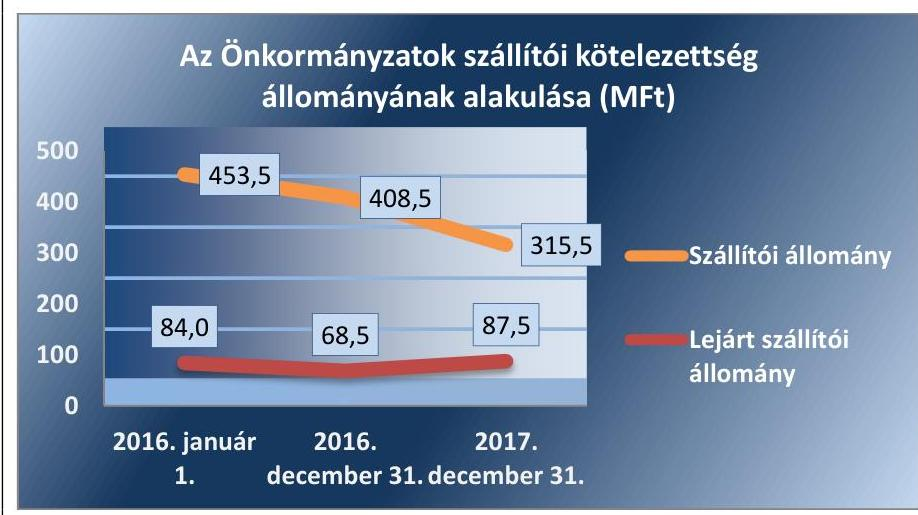

Forrás: Önkormányzatok beszámolói

A lejárt szállítói kötelezettségek mértéke és azok szállítói kötelezettségeken belüli aránya kockázatot jelentett az Önkormányzatok eladósodására, a kiadások finanszírozási problémáira hívja fel a figyelmet.

Az Önkormányzatok a 2016. év végén 3,1 M Ft, a 2017. év végén 1,72 M Ft 90 napon túl lejárt tartozással rendelkeztek. A 2016. évről a 2017. évre 90 napon túl lejárt kötelezettségek állománya 44,59%-kal, az állomány aránya az összes kötelezettséghez viszonyítva, 0,1 százalékponttal csökkent.

90 napon túl lejárt kötelezettsége a 2016. évben négy, míg a 2017. évben két önkormányzatnak volt. A 2017. év végén a két érintett önkormányzat közül Lukácsháza Község Önkormányzatánál az ellenőrzés adósságrendezési eljárás indításának veszélyét jelentő kockázatot azonosított, mert a 90 napon túl lejárt kötelezettség állománya mellett negatív működési jövedelemmel rendelkezett. A negatív működési jövedelem mellett nem képződik elég bevétel a kötelezettségek teljesítésére.

## A PÉNZINTÉZETEK FELÉ FENNÁLLÓ KÖTELE-

ZETTSÉG állomány kedvezően változott, nem jelentett kockázatot az Önkormányzatok pénzügyi egyensúlyára.

Az Önkormányzatok banki kötelezettségeinek (rövid- és hosszúlejáratú hitelekből származó tartozások) állománya kedvezően alakult, 2016. évben 78,5%-kal, majd 2017. évben további 22,3%-kal 19,8 M Ft-ra csökkent. A banki kötelezettségek mérlegfőösszeghez viszonyított aránya alacsony volt

---

és csökkenő, 2016. évben 0,02%, míg 2017. évben 0,015%-ra teljesült. A mutatók alakulását a 6. táblázat tartalmazza.

A banki kötelezettségállomány alakulására hatással volt, hogy az Önkormányzatok által teljesített tárgyévi hiteltörlesztés mindkét évben meghaladta az időszaki hitelfelvétel értékét.

A 2016. és a 2017. években az Önkormányzatoknak kormányzati jóváhagyáshoz kötött, hosszú lejáratú adósságot keletkeztető ügylete nem volt, továbbá kormányzati hozzájárulást nem igénylő naptári éven túli futamidejű adósságot keletkeztető ügyletet sem kötöttek.

A pénzintézetekkel szembeni kötelezettségek csökkenése jelzi, hogy az Önkormányzatok egyre kevésbé vettek igénybe külső, idegen, visszafizetendő forrásokat működésük finanszírozásához.

GARANCIA- ÉS KEZESSÉGVÁLLALÁSBÓL származó függő kötelezettség állománnyal 2017. december 31-én egy önkormányzat rendelkezett 53,7 M Ft összegben. Az Önkormányzatoknak 2016. évben nem volt garancia- és kezességvállalásból származó függő kötelezettsége.

A 2017. év végén fennálló garancia-, és kezességvállalás állomány az érintett önkormányzatnál kockázatot hordozott, mert annak érvényesítése kedvezőtlenül befolyásolhatja az önkormányzat pénzügyi egyensúlyát.

# 3. Az önkormányzatok vagyongazdálkodása során biztosított volt-e a vagyon értékének a megőrzése? 

Összegző megállapítás

7. táblázat

| MUTATÓK ALAKULÁSA |  |  |
| :--: | :--: | :--: |
| Mutatók | 2016. év | 2017. év |
| Befektetett eszközök fedezettsége | 102,7% | 105,7% |
| Ingatlanok és kapcsolódó vagyoni értékű jogok állományának változása (M Ft) | +1784,4 | +71,4 |
| Koncesszióba, vagyonkezelésbe adott eszközök állományának változása (M Ft) | +2046,0 | -876,7 |
| Eszközpótlási mutató (tárgyi eszközök összesen) | 75,9% | 65,6% |
| Eszközpótlási mutató (ingatlanok és kapcsolódó vagyoni értékű jogokra) | 89,0% | 65,5% |

Forrás: Önkormányzatok beszámolói

Az Önkormányzatok vagyona nőtt, azonban a tárgyi eszközök vagyonpótlása nem történt meg. A gazdasági társaságok veszteséges gazdálkodása kockázatot hordozott az önkormányzatok gazdálkodására.

A VAGYONVÁLTOZÁS 2016-2017. években nem jelentett kockázatforrást az Önkormányzatok vagyoni helyzetére. A 144 községi önkormányzat könyvviteli mérleg szerinti vagyona mindkét évben emelkedett. Az eszközök és források alakulását kiemelt mérlegsoronként a 2016-2017. években a III. számú melléklet tartalmazza.

A mérleg szerinti vagyon értéke az ellenőrzött időszakban jelentősen emelkedett, a 2016. január 1-i 120 791,0 M Ft-ról 2017. év végére 135 067,0 M Ft-ra (+11,8%) növekedett. Az Önkormányzatok vagyona 2016. évben 5,7%-al, majd a 2017. évben további 5,8%-al növekedett. A vagyon szerkezetében 2016. január 1. és 2017. december 31. között a tárgyi eszközök értéke kismértékben 1,4%-kal, a befektetett pénzügyi eszközök 12,6%-kal, míg a vagyonkezelésbe adott eszközök 15,3%-kal emelkedtek, a forgóeszközök 67,9%-os növekedése mellett. A forgóeszközökön belül az ellenőrzött időszakban a pénzeszközök 258,2%-os és a követelések állományának 254,3%-os növekedése kiemelkedő volt. A mutatók alakulását a 7. táblázat tartalmazza.

A nemzeti vagyonba tartozó befektetett eszközökön belül mindkét évben a legjelentősebb részarányt, 91%-ot a tárgyi eszközök képviselték, melyen belül az ingatlanok és kapcsolódó vagyoni értékű jogok állományának aránya volt a legmagasabb, mindkét évben 95%. Az ellenőrzött időszakban

---

az ingatlanok és kapcsolódó vagyoni értékű jogok állománya mindkét évben alacsony és csökkenő mértékben emelkedett, a 2016. évben 1,8%-kal, majd a 2017. évben további 0,1%-kal. Ugyanakkor a gépek berendezések állománya a 2016. évben 12%, a 2017. évben 2,26%-kal csökkent.

A tárgyi eszközök állományának változását az 5. ábra mutatja be.
5. ábra
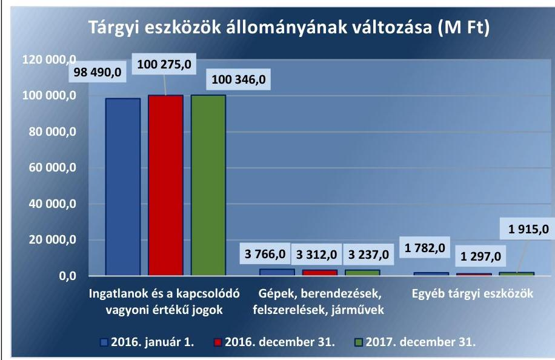

Forrás: Önkormányzatok beszámolói

A vagyon összetételében a nemzeti vagyonba tartozó befektetett eszközökön túl a pénzeszközök képviselték a legnagyobb arányt. Ennek mértéke a 2016. év elején 4,6%, a 2016. év végén 6,1%, a 2017. év végén 10,7% volt. A pénzeszközök állományának jelentős mértékű növekedésében meghatározó szerepe volt az államháztartáson belülről, felhalmozási célra kapott fel nem használt támogatások növekedésének.

Az Önkormányzatok nemzeti vagyonba tartozó befektetett eszközökön felüli eszközeinek összetételét a 2016-2017. években a 6. ábra szemlélteti.
6. ábra
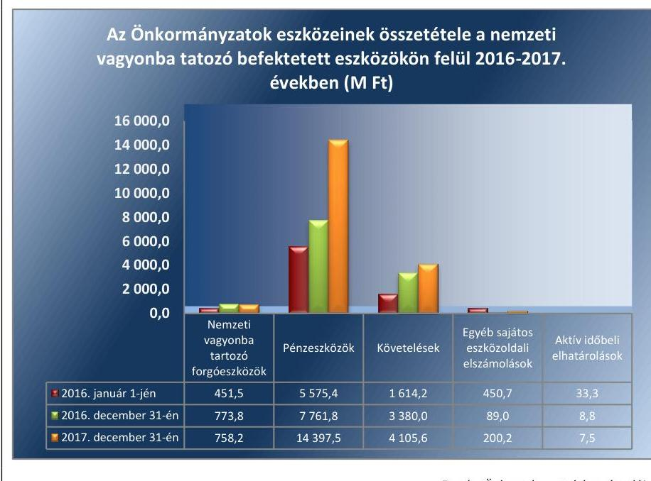

---

Az Önkormányzatok vagyonértékesítésből származó bevételei a 2016. évi 207,8 M Ft-ról a 2017. évre 245,1 M Ft-ra emelkedtek. Ezzel szemben a felhalmozási kiadások összege 2016. évben 3 465,7 M Ft-ra, míg a 2017. évben 5 919,9 M Ft-ra teljesült.

A befektetett eszközök fedezettsége nem hordozott kockázatot a vagyongazdálkodásra. 2016. évben 102,7%, míg 2017. évben 105,7% volt. A mutató értéke mindkét évben kedvezően alakult, a saját tőke fedezetet nyújtott a nemzeti vagyonba tartozó befektetett eszközök megszerzéséhez, nem volt szükség idegen források bevonására.

# **A KONCESSZIÓBA ÉS/VAGY VAGYONKEZELÉSBE ADOTT ESZKÖZÖK** állománya a 2016. évben 26,8%-kal növekedett (7 628,1 M Ft-ról 9 674,1 M Ft-ra), míg a 2017. évben 9,1%-kal csökkent (8 797,4 M Ft-ra). Az állományban bekövetkezett változást a vagyonkezelésbe adás és visszavétel okozta. A koncesszióba és/vagy vagyonkezelésbe adott eszközök nem hordoztak kockázatot.

# **A BELSŐ ELADÓSODÁS** az Önkormányzatok vagyongazdálkodására a 2016-2017. években kockázatforrást jelentett. Az Önkormányzatoknál az ellenőrzött időszakban nem történt meg a tárgyi eszközökön belül a szükséges vagyonpótlás.

A 2016. és a 2017. években a tárgyi eszközök eszközpótlási mutatójának értéke kedvezőtlenül alakult. A 2016. évben a mutató értéke 75,9%, a 2017. évben 65,6% volt, a 2017. évben az eszközpótlási mutató értéke tovább romlott, 10,3 százalékponttal csökkent. A tárgyi eszközökön belül az ingatlanok eszközpótlási mutatója a 2016. évben 89,0%, a 2017. évben 65,5% volt, az érték kedvezőtlen irányban változott, jelentősen csökkent.

A 2017. évben elmaradt eszközpótlásokat részben ellentételezi a 2017. évi megnövekedett beruházási aktivitás miatt a folyamatban lévő beruházások miatti befejezetlen állomány.

A 2016-2017. években a tárgyévben aktivált beruházások, felújítások összegét, tárgyi eszközök elszámolt értékcsökkenését, valamint a felhalmozási kiadások összegét a 7. ábra mutatja be.

7. ábra

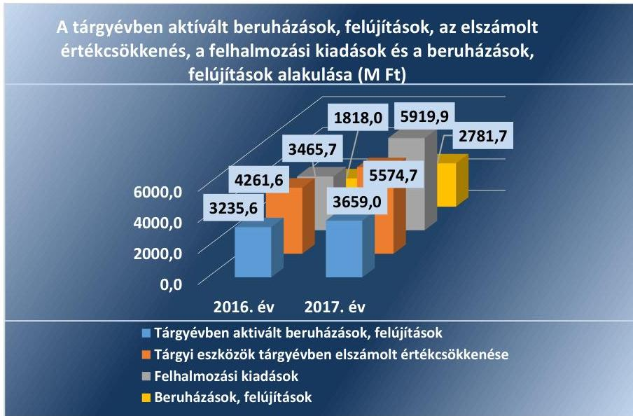

---

8. táblázat

| MUTATÓK ALAKULÁSA |  |  |
| :--: | :--: | :--: |
| Mutatók | 2016 | 2017 |
|  | év | év |
| Többségi önkormányzati tulajdonú gazdasági társaságok kötelezettségei állományának változása | -27,39% | +29,26% |
| Többségi önkormányzati tulajdonú gazdasági társaságok számának változása (db) | +2 | +4 |
| Tartós részesedések állományának változása | -2,19% | +3,79% |

Forrás: Önkormányzatok beszámolói

Az Önkormányzatok nem gondoskodtak a szükséges vagyonpótlásról, mely az eszközök állagromlását okozza, egyúttal a rejtett, belső eladósodás kockázatát hordozta.

## A TÖBBSÉGI ÖNKORMÁNYZATI TULAJDONBAN LÉVŐ GAZDASÁGI TÁRSASÁGOK kötelezettsége és veszteséges működése kockázatot hordozott az Önkormányzatok gazdálkodására és vagyongazdálkodására.

Az Önkormányzatok többségi és kisebbségi tulajdont jelentő tartós részesedéseinek állománya összesen az előző évhez képest a 2016. évben 2,19%-kal csökkent, majd a 2017. évben 3,79%-kal emelkedett. A részesedés-állomány változását a gazdasági társaságokban történt újabb részesedés szerzés, illetve tőkeemelés mellett 2016. évben -27,2 M Ft értékben, míg a 2017. évben -4,3 M Ft értékben 1-1 önkormányzat megszűnő részesedése okozta.

Az Önkormányzatok közül a 2016. és 2017. évben 129 önkormányzat (89,6%) rendelkezett tartós részesedéssel, ezen belül többségi tulajdonú részesedése a 2016. évben 10 önkormányzatnak és a 2017. évben 13 önkormányzatnak volt. A többségi tulajdonban lévő gazdasági társaságok (továbbiakban: gazdasági társaságok) száma az ellenőrzött időszakban 6-tal nőtt, 2016. január 1-jén 11 volt, ami a 2016. évben 13-ra, a 2017. évben 17-re emelkedett. A mutatók alakulását a 8. táblázat tartalmazza.

A 2016-2017. években a többségi tulajdonú gazdasági társaságok kötelezettségei állományának és adózott eredményének alakulását a 8. ábra szemlélteti.
8. ábra
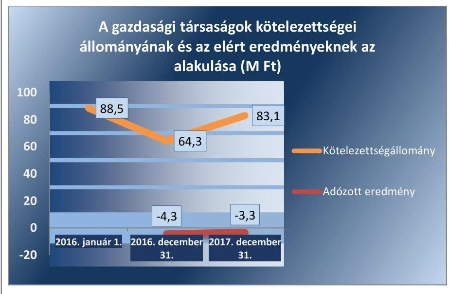

Forrás: Önkormányzatok beszámolói
Az gazdasági társaságok kötelezettségeinek állománya a 2016. évben jelentősen, 24,2 M Ft-tal csökkent, majd a 2017. évben már 18,8 M Ft-tal növekedett, az ellenőrzött időszakban összesen 2017. év végére 18,1%-kal csökkent a 2016. január 1-hez képest. A kötelezettség-állomány a gazdasági társaságok nem fizetése esetén az adott Önkormányzatra helytállási kötelezettséget terhelhet.

---

Az Önkormányzatok többségi tulajdonú gazdasági társaságainak adózott eredménye mindkét évben veszteség volt, de a veszteség a 2016. évről a 2017. évre -4,3 M Ft-ról -3,3 M Ft-ra csökkent. 2016. évben 5 társaság, a 2017. évben 7 társaság realizált veszteséget, a veszteséges gazdasági társasággal rendelkező önkormányzatok száma 4-ről 8-ra nőtt.

Az érintett önkormányzatoknak kellő figyelmet kell fordítaniuk a gazdasági társaságaik eladósodásának megszüntetésére. A gazdasági társaságok veszteséges működése kockázatot jelent stabil fenntartható gazdálkodásukra és ezáltal az általuk végzett közfeladat ellátásának biztosítására. Ez kockázatot hordoz az érintett önkormányzatok gazdálkodására, mert az önkormányzat a veszteséges gazdálkodás következtében fellépő likviditási problémák kezeléséhez, a közfeladat biztosítása érdekében pótlólagos erőforrásokat bocsát a társaság rendelkezésére.

Elemző eljárás
 keretében készített riport alapján (ÖKOMER), a 2016–2017. évekre vonatkozóan az ellenőrzött községi önkormányzatok azonosított kockázatait, azok összefoglaló értékelését az V. számú melléklet, az ellenőrzött községi önkormányzatok 2016–2017. évi mutatói és kockázatai értékelését pedig a VI. számú melléklet tartalmazza.

---

# MELLÉKLETEK 

- I. SZ. MELLÉKLET: FOGALOMTÁR
adósságszolgálat
belső eladósodás kockázatforrás
beruházás

CLF módszer
eladósodás kockázatforrás
eszközpótlási mutató
felhalmozási bevétel
felhalmozási kiadás
felhalmozási kiadások és finanszírozása kockázatforrás
felújítás
finanszírozás kockázatforrás
folyó bevétel
folyó kiadás
folyó költségvetés egyenlege

Az adósság tőkerészének és az esedékes kamat együttes összegének törlesztése. Kockázatforrást jelent, ha az értékcsökkenések kompenzálásaként a szükséges vagyonpótlás nem történt meg, ha romlott az eszközök állaga, mert az rejtett eladósodást jelent.
A tárgyi eszköz beszerzése, létesítése, saját vállalkozásban történő előállítása, a beszerzett tárgyi eszköz üzembe helyezése. A beruházás a meglévő tárgyi eszköz bővítését, rendeltetésének megváltoztatását, átalakítását, élettartamának, teljesítőképességének közvetlen növelését eredményező tevékenység. (Forrás: Számv. tv. ${ }^{4}$ 3. § (4) bekezdés 7. pontja)

Az önkormányzatok költségvetése elemzésének módszere, amely a pénzügyi kapacitás (nettó működési jövedelem) fogalmát helyezi a középpontba. A módszer következetesen elkülöníti a folyó és a felhalmozási költségvetés bevételeit és kiadásait, azok költségvetési egyenlegeit. Bizonyos mértékig a vállalati gazdálkodás logikai elemeit érvényesíti az önkormányzatok pénzügyi, jövedelmi helyzetének vizsgálata során.
Az államháztartás önkormányzati alrendszerében felhalmozott adósság állam részéről történő kiegyenlítését, illetve átvállalását követően az önkormányzatok kiemelt feladata, egyben felelőssége az adósságállomány újratermelődésének megakadályozása. Kockázatforrást jelent, ha az önkormányzat kötelezettségei emelkednek, a mérlegben az idegen források aránya nő, az adósságkonszolidációt – helyi önkormányzatok adósságának állam által történő átvállalása – követően a gazdálkodás újra eladósodási pályára áll. Az eladósodás a pénzügyi gazdálkodás egyenes következménye, ugyanakkor hatással is van rá a folyó adósságszolgálat teljesítésén keresztül.
A tárgyi eszközállomány elemzéséhez használt mutató, amely megmutatja, hogy az üzembe helyezett beruházások milyen hányadát képezi az elszámolt értékcsökkenésnek. Számításakor tárgyévben üzembe helyezett beruházások, felújítások értékét a tárgyi eszközök tárgyévben elszámolt értékcsökkenéséhez kell viszonyítani.
Az önkormányzatok tárgyévi felhalmozási célú költségvetési bevételei.
Az önkormányzatok tárgyévi felhalmozási célú költségvetési kiadásai.
Kockázatforrást jelent az erőn felüli beruházási aktivitás, illetve ha a folyamatban lévő felhalmozási feladatok finanszírozásához szükséges pénzügyi forrás nem áll az önkormányzat rendelkezésére.
Az elhasználódott tárgyi eszköz eredeti állaga (kapacitása, pontossága) helyreállítását szolgáló időszakonként visszatérő olyan tevékenység, melynek során az eszköz élettartama megnövekszik, minősége, használata jelentősen javul, így a pótlólagos ráfordításból a jövőben gazdasági előnyök származnak. (Forrás: Számv. tv. 3. § (4) bekezdés 8. pontja)
Kockázatforrást jelent, ha az önkormányzat nem rendelkezik megfelelő fedezettel a külső források adósságszolgálatának teljesítéséhez, ami hosszútávon vagyonfeléléshez vagy adósságspirálhoz vezethet.
Az önkormányzatok tárgyévi működési célú költségvetési bevételei.
Az önkormányzatok tárgyévi működési célú költségvetési kiadásai.
A folyó költségvetés egyenlege, azaz a működési jövedelem megmutatja, hogy az önkormányzat éves folyó bevétele fedezetet biztosít-e a kötelező és önként vállalt fel-

---

garancia- és kezességvállalás kockázatforrás
garanciavállalás
helyénvalósági ellenőrzés
kezességvállalás
kockázatforrás
koncessziós szerződés
közfeladat
közfeladatok finanszírozási struktúrája kockázatforrás
nettó működési jövedelem
adatellátáshoz kapcsolódó éves folyó kiadására. A működési jövedelem negatív értéke pénzügyileg fenntarthatatlan helyzetet jelez. A mutató pozitív értéke megtakarítást mutat, amely forrásul szolgálhat az önkormányzat fennálló kötelezettségei megfizetéséhez, valamint fejlesztéseihez.
Kockázatforrást jelent, ha a szerződés kötelezettje a szerződésben vállalt kötelezettségeit nem teljesíti a jogosultnak, mert azokért a kezes köteles helytállni. A garancia- és kezességvállalások függő kötelezettségként kockázatot jelentenek az önkormányzat költségvetésére, ezen keresztül a közfeladatok ellátására.
Olyan kötelezettségvállalás, ahol a garanciát vállaló valamely jövőbeni esemény bekövetkezésekor, a szerződésben meghatározott feltételek beálltakor a garancia kedvezményezettje számára meghatározott összegig, meghatározott időpontig, felszólításra azonnal fizet.
A helyénvalósági ellenőrzés a megfelelőségi ellenőrzés azon altípusa, amelyet azokban az esetekben kell alkalmazni, amelyekre jogszabályi előírások nem alkalmazhatóak, illetve amennyiben egyes kérdések megítélésénél nyilvánvaló jogszabályi hiányosságok vannak. Helyénvalósági ellenőrzés során a Számvevőszéknek a közszféra szilárd gazdálkodására és a köztisztviselők magatartására vonatkozó általános alapelvek mentén kell az ellenőrzést lefolytatni.
Szerződésben vállalt olyan kötelezettség, amelyben a kezes arra vállal kötelezettséget, hogy ha a szerződés kötelezettje nem teljesít a kezes maga fog helyette teljesíteni a jogosultnak. (Forrás: Ptk. 6:416.§).
A kockázatok kiváltó okait kockázatforrásnak nevezzük. Első lépésben azonosítjuk a nyomon követendő kockázatokat, majd a kockázatos területeket és a kiváltó okokat (kockázatforrásokat). Kockázatként azonosítjuk, ha az önkormányzat hosszú távon nem képes a törvényben meghatározott feladatait ellátni, költségvetése változatlan formában nem fenntartható. A kockázat értékelésének célja annak megállapítása, hogy a pénzügyi gazdálkodás, eladósodás, vagyongazdálkodás kockázati területek milyen mértékben befolyásolják, veszélyeztetik az önkormányzat működését, a közfeladatok ellátását. A három kockázati terület minősítéséhez összesen 10 kockázatforrást rendelünk.
Az állam, illetőleg az önkormányzat (önkormányzati társulás) kizárólagos tulajdonában lévő vagyontárgyak birtoklásának, használatának és hasznosításának, valamint a koncesszió-köteles tevékenységek gyakorlásának jogát, visszterhes szerződéssel, időlegesen úgy engedi át, hogy a jogosultnak részleges piaci monopóliumot biztosít.
A koncessziós szerződés olyan visszterhes szerződés, amelyben az állam vagy az önkormányzat a törvényben meghatározott tevékenységek gyakorlásának a jogát időlegesen úgy engedi át, hogy a jogosultnak részleges piaci monopóliumot biztosít.
A közfeladat a jogszabályban meghatározott állami vagy önkormányzati feladat. A közfeladatok ellátása költségvetési szervek alapításával és működtetésével vagy az azok ellátásához szükséges pénzügyi fedezet e törvényben (Áht.) meghatározott eszközökkel, részben vagy egészben történő biztosításával valósul meg. A közfeladatok ellátásában államháztartáson kívüli szervezet jogszabályban meghatározott rendben közreműködhet. (Forrás: Áht. 3/A. § (1)–(2) bekezdés, 2015. január 1-jétől)
Kockázatforrást jelent, ha az önkormányzat pénzügyi helyzete jelentős függőséget mutat a külső körülményektől (adóbevételektől, kiegészítő állami támogatásoktól). A közfeladatok finanszírozási struktúrája nem kielégítő, ha a működési bevételek nem fedezik teljes mértékben az ellátott közfeladatokat.
A nettó működési jövedelem a jövedelemtermelő képességet méri. Megmutatja a működési bevételekből a működési kiadások és a hitelek tőketörlesztésének kifizetése után fennmaradó jövedelmet.

---

önkormányzat
önkormányzat rendkívüli támogatása
pénzintézetek felé történő eladósodás kockázatforrás
szállítók felé történő eladósodás kockázatforrás
többségi önkormányzati tulajdonban lévő gazdasági társaságok kockázatforrás vagyongazdálkodás
vagyonváltozás kockázatforrás

A helyi önkormányzat jogi személy. Az önkormányzati feladatok ellátását a képviselőtestület és szervei biztosítják. A képviselőtestület szervei: a polgármester, a főpolgármester, a megyei közgyűlés elnöke, a képviselő-testület bizottságai, a részönkormányzat testülete, a polgármesteri hivatal, a megyei önkormányzati hivatal, a közös önkormányzati hivatal, a jegyző, továbbá a társulás. A képviselő-testület a feladatkörébe tartozó közszolgáltatások ellátására – jogszabályban meghatározottak szerint – költségvetési szervet, a Polgári perrendtartásról szóló 1952. évi III. törvény szerinti gazdálkodó szervezetet (a továbbiakban: gazdálkodó szervezet), nonprofit szervezetet és egyéb szervezetet (a továbbiakban együtt: intézmény) alapíthat, továbbá szerződést köthet természetes és jogi személlyel vagy jogi személyiséggel nem rendelkező szervezettel. (Forrás: Mötv. ${ }^{7}$ 41. § (1), (2), (6) bekezdései)
A 2015–2016. években a megyei önkormányzatok rendkívüli támogatása, a települési önkormányzatok rendkívüli támogatása és a tartósan fizetésképtelen helyzetbe került helyi önkormányzatok adósságrendezésére irányuló hitelfelvétel visszterhes kamattámogatása, a pénzügyi gondnok díja.
Kockázatforrásnak tekintettük, ha az önkormányzat (újból) adósságot keletkeztet, ami a kivételektől eltekintve a 2012. évtől kormányengedély-köteles. A pénzintézetekkel szemben fennálló kötelezettségek esetén olyan függőségi viszony jöhet létre, ahol az önkormányzat pénzügyi helyzete olyan külső körülmények hatására változhat, amely kizárólag a bank egyoldalú döntésén múlik.
Kockázatforrást jelent, ha az önkormányzat növeli a dologi, felújítási, beruházási kötelezettségeit (szállítókkal szemben fennálló tartozásait), ami burkolt hitelezésnek minősülhet, és az elismert kötelezettségeit átmenetileg vagy véglegesen nem tudja határidőre teljesíteni.
Kockázatforrást jelent, hogy az önkormányzati tulajdonban lévő gazdasági társaságok adósságállományáért a tulajdonos önkormányzatot helytállási kötelezettség terheli.

A nemzeti vagyongazdálkodás feladata a nemzeti vagyon rendeltetésének megfelelő, az állam, az önkormányzat mindenkori teherbíró képességéhez igazodó, elsődlegesen a közfeladatok ellátásához és a mindenkori társadalmi szükségletek kielégítéséhez szükséges, egységes elveken alapuló, átlátható, hatékony és költségtakarékos működtetése, értékének megőrzése, állagának védelme, értéknövelő használata, hasznosítása, gyarapítása, továbbá az állam vagy a helyi önkormányzat feladatának ellátása szempontjából feleslegessé váló vagyontárgyak elidegenítése. (Forrás: Nvtv. 7. § (2) bekezdése)

Kockázatforrásként értékeltük, ha csökken a nemzeti vagyon, ha az önkormányzatok a vagyonértékesítésből származó bevételeket nem beruházásokra, a vagyon pótlására fordítják.

---

# II. SZ. MELLÉKLET: AZ ELLENŐRZÉSI KRITÉRIUMOK MÓDSZERTANA ÉS ÉRTÉKELÉSE 

Az ellenőrzés tárgya: Az önkormányzati gazdálkodás fenntarthatósága, a törvényben előírt feladatok ellátása, az önkormányzatnál észlelt negatív tendenciák okainak feltárása, amely az ellenőrzési kritériumok alapján kerül értékelésre.
Az ellenőrzési kritériumok meghatározása során első lépésben azonosításra kerültek az önkormányzati gazdálkodás fenntarthatóságának, a törvényben előírt feladatok ellátásának kockázatos területei és a kiváltó okai (kockázatforrások), amelyekhez minden esetben mutatószám került hozzárendelésre. A mutatószámok között a viszonyszámok (relatív mutatószámok) és az abszolút adatok (abszolút mutatószámok) egyaránt megtalálhatóak, amelyekhez a Magyar Államkincstár által szolgáltatott adatállományok (költségvetési beszámolók, időközi költségvetési jelentések, mérlegjelentések adatait) kerültek felhasználásra.
Az egyes kockázati területek és kockázatforrások minősítése „pontozásos módszerrel” a mutatószámok értékelése alapján történt.

- Első lépésben a mutatószámok értékelésére és egy háromelemű skálán történő elhelyezésére került sor. Az értékelés (a kategória határok meghatározása) elsődlegesen a mutatószámok közgazdasági értelmezése alapján, az Állami Számvevőszék ellenőrzési tapasztalatait felhasználva történt. Az értékelések alapján egy-egy mutató alacsony besorolás esetén 0 pontot, közepes esetén 1 pontot, magas kockázatjelzés esetén 2 pontot kapott. (Pl.: ha a működési kiadások fedezettsége mutató 90% alatti volt, akkor magas kockázati besorolást, 2 pontot, ha 100% feletti volt akkor alacsony besorolást, 0 pontot kapott.) A %-ban kifejezett mutatók kockázati besorolására a pontos (több tizedes jegy) értékek alapján került sor, ugyanakkor az önkormányzati riport a mutatókat egy, illetve esetenként két tizedes számjegyig mutatja be.
- Annak érdekében, hogy a kockázatforrások minősítésénél a lényeges mutatók értéke legyen a meghatározó a jellegzetes mutatókéval szemben, a mutatószámok súlyozására került sor*. A súlyok mértékének megválasztásakor az elsődleges mutatókat középértéknek tekintve 1-es súly mellérendelése* történt. A főmutató súlya az elsődleges mutatók súlyának kétszeresében, míg a másodlagos mutatók súlya az elsődleges mutatók súlyának felében került meghatározásra. (Pl.: a kockázatforrás minősítéséhez a működési kiadások fedezettségét főmutatóként vették figyelembe, ezért 2-es súlyt rendeltek hozzá. Így ha a mutató kockázati besorolása magas volt, a magas kockázati besoroláshoz rendelt 2 pontot szorozták a főmutatóhoz rendelt 2-es súlyszámmal és az elért pontszám 4, míg alacsony besorolás esetén a besoroláshoz rendelt 0 pontot szorozva a főmutatóhoz rendelt 2-es súlyszámmal elért pontszám 0 volt.)
- Ezt követően került sor az önkormányzati gazdálkodás fenntarthatóságának, a törvényben előírt feladatok ellátásának kockázatához rendelt kockázati területek és kockázatforrások értékelési ponthatárainak meghatározására oly módon, hogy kockázatforrásonként a mutatószámok súlyozott értékelésével elérhető összes pontszám három egyenlő részre (alacsony, közepes, magas) osztása történt meg. (Pl.: A közfeladatok finanszírozási struktúrája kockázatforrás 1 db főmutató, 2 db elsődleges mutató és további 2 db másodlagos mutató alakulása alapján került értékelésre. A mutatók magas kockázati besorolása esetén – a súlyozást követően – elérhető legmagasabb pontszám 10 volt. Ezt három egyenlő részre osztva kerültek meghatározásra a közfeladatok finanszírozási struktúrájának értékelési ponthatárai, amely 0–3,32 pontig alacsony, 3,33–6,66 pontig közepes, 6,67–10 pont között magas kockázati minősítést kapott.)
- Az egyes kockázatforrások értékelésekor a kockázatforráshoz rendelt mutatószámok – súlyozással
 kapott - értékeinek összesítése és a kialakított értékelési ponthatárok szerinti minősítése történt meg. (PI.: egy önkormányzat minősítésekor a közfeladatok finanszírozási struktúrája kockázatforráshoz rendelt 5 db

[^0]
[^0]:    * A súlyozás kifejezi, hogy az alkalmazott mutatószámok egymáshoz képest milyen mértékben járulnak hozzá az adott kockázatforrás értékeléséhez.
    † Egy esetben a banki kötelezettségállomány mérlegfőösszeghez mért nagysága mutatónál a kockázatforrás kiegyensúlyozottabb megítélése érdekében az 1-es súlyozás helyett 1,5-ös súlyozás került alkalmazásra.

---

mutató - fentiekben bemutatott - értékelésével elért összes pontszám 7 volt, akkor a kockázatforrás a hármas skálán a 6,67-10 pont közé került, így magas minősítést kapott.)

- Az egyes kockázati területek minősítése hasonlóan történt. Az egyes kockázati területeket meghatározó kockázatforrások pontjainak aggregálását követően, a kockázati területen elérhető összes pont három egyenlő részre osztásával kialakított skálán történő értékelésére került sor. Ha azonban a kockázatforrások közül legalább egy magas kockázati besorolást ért el, akkor a pontozás szerinti értékeléstől eltérően, a kockázati terület besorolása közepes kockázati minősítésűre módosult.

Az ellenőrzés tárgyának, az önkormányzati gazdálkodás fenntarthatóságának, a törvényben előírt feladatok ellátásának értékelése:
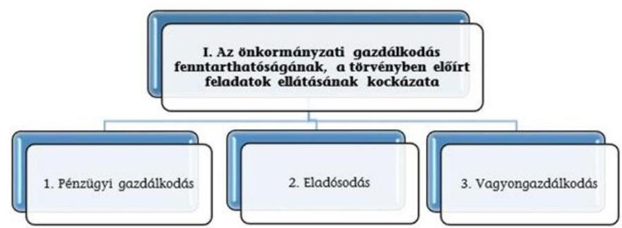

A három kockázati terület együttes értékelése alapján az alábbi mátrix segítségével kerül meghatározásra az önkormányzati gazdálkodás fenntarthatóságának, a törvényben előírt feladatok ellátásának értékelése a következők szerint:
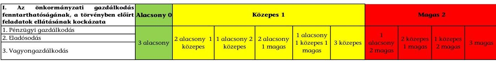

---

III. SZ. MELLÉKLET: AZ ESZKÖZÖK ÉS FORRÁSOK ALAKULÁSA KIEMELT MÉRLEGSORONKÉNT A 2016-2017. ÉVEKBEN (E FT) Az Önkormányzatok 2016-2017. évi mérlegeinek adatai

| Megnevezés | 2016. január 1. | 2016. december 31. | 2017. december 31. |
| :--: | :--: | :--: | :--: |
| Befektetett eszközök   /NEMZETI VAGYONBA TARTOZÓ BEFEK-   TETETT ESZKÖZÖK | 112666036 | 115639740 | 115598342 |
| NEMZETI VAGYONBA TARTOZÓ FORGÓ-   ESZKÖZÖK | 451494 | 773839 | 758161 |
| PÉNZESZKÖZÖK | 5575387 | 7761799 | 14397459 |
| KÖVETELÉSEK | 1614230 | 3379979 | 4105569 |
| EGYÉB SAJÁTOS ESZKÖZOLDALI ELSZÁ-   MOLÁSOK | 450679 | 89024 | 200238 |
| AKTÍV IDŐBELI ELHATÁROLÁSOK | 33315 | 8847 | 7537 |
| ESZKÖZÖK ÖSSZESEN | 120791144 | 127653228 | 135067305 |
| SAJÁT TÖKE | 113342450 | 118717998 | 122198132 |
| KÖTELEZETTSÉGEK | 1767318 | 1921185 | 2032978 |
| EGYÉB SAJÁTOS FORRÁSOLDALI ELSZÁ-   MOLÁSOK |  |  |  |
| PASSZÍV IDŐBELI ELHATÁROLÁSOK | 5681375 | 7014045 | 10836196 |
| FORRÁSOK ÖSSZESEN | 120791144 | 127653228 | 135067305 |

---

|  1. FOLYÓ KÖLTSÉGVETÉS | 2016. év | 2017. év | $\begin{gathered} \text { Változás } \\ {[\%]} \\ \text { (2017-2016)/ } \\ 2016 \end{gathered}$  |
| --- | --- | --- | --- |
|  1.1.1. Saját működési bevételek tulajdonosi bevételek nélkül | 7132790 | 7051541 | $-1,14 \%$  |
|  1.1.2. Költségvetési támogatások a működőképesség megőrzését szolgáló kiegészítő támogatások nélkül | 18711869 | 19824015 | $5,94 \%$  |
|  1.1.3. Átengedett bevételek | 497178 | 504863 | $1,55 \%$  |
|  1.1.4. Államháztartáson belülről kapott támogatások | 7599981 | 7703379 | $1,36 \%$  |
|  1.1.5. EU-tól és külföldről kapott bevételek | 7713 | 583 | $-92,44 \%$  |
|  1.1.6. Államháztartáson kívülről kapott bevételek | 97647 | 62105 | $-36,40 \%$  |
|  1.1.7. Hozam- és kamatbevételek (2014-ben a működési rész csak az önkormányzat nyilvántartása alapján pontosítható) | 19587 | 28852 | $47,30 \%$  |
|  1.1.8. Kölcsönök visszatérülése, igénybevétele | 46185 | 38632 | $-16,35 \%$  |
|  1.1.9. A működőképesség megőrzését szolgáló kiegészítő támogatások | 258219 | 170504 | $-33,97 \%$  |
|  1.1. Folyó bevételek
(1.1.1.+1.1.2.+1.1.3.+1.1.4.+1.1.5.+1.1.6.+1.1.7.+1.1.8.+1.1.9.) | 34371170 | 35384474 | 2,95\%  |
|  1.2.1. Működési kiadások kamatkiadások nélkül | 25344360 | 26126688 | $3,09 \%$  |
|  1.2.2. Államháztartáson belülre átadott pénzeszközök | 4551249 | 5007604 | $10,03 \%$  |
|  1.2.3.1. vállalkozásoknak | 283359 | 296442 | 4,62\%  |
|  1.2.3.2. EU-nak, illetve külföldre | 5188 | 1227 | $-76,35 \%$  |
|  1.2.3.3. magánszemélyeknek | 922124 | 906490 | $-1,70 \%$  |
|  1.2.3.4. non-profit szervezeteknek | 422996 | 430357 | $1,74 \%$  |
|  1.2.3. Transzferkiadások | 1633667 | 1634515 | $0,05 \%$  |
|  1.2.4. Kamatkiadások | 18592 | 6358 | $-65,80 \%$  |
|  1.2.5. Kölcsönök nyújtása, törlesztése | 49844 | 24911 | $-50,02 \%$  |
|  1.2. Folyó kiadások (1.2.1.+1.2.2.+1.2.3.+1.2.4.+1.2.5.) | 31597711 | 32800076 | 3,81\%  |
|  1.3. Folyó költségvetés egyenlege, működési jövedelem (1.1. - 1.2.) | 2773459 | 2584398 | $-6,82 \%$  |
|  2. FELHALMOZÁSI KÖLTSÉGVETÉS |  |  |   |
|  2.1.1. Saját tőkebevételek | 211400 | 280852 | $32,85 \%$  |
|  2.1.2. Költségvetési támogatások | 1740793 | 1422610 | $-18,28 \%$  |
|  2.1.3. Államháztartáson belülről kapott támogatások | 755513 | 7838744 | $937,54 \%$  |
|  2.1.4. EU-tól és külföldről kapott támogatások | 0 | 75071 | $+100 \%(!)$  |
|  2.1.5. Államháztartáson kívülről kapott bevételek | 60486 | 418231 | $591,46 \%$  |
|  2.1.6. Hozam- és kamatbevételek (2014-ben (02/196+02/200-ból a felhalmozási rész csak az önkormányzat nyilvántartása alapján pontosítható) | 0 | 0 | $0,00 \%$  |
|  2.1.7. Kölcsönök visszatérülése, igénybevétele | 72662 | 14186 | $-80,48 \%$  |
|  2.1. Felhalmozási bevételek
(2.1.1.+2.1.2+2.1.3+2.1.4.+2.1.5.+2.1.6.+2.1.7.) | 2840854 | 10049694 | 253,76\%  |
|  2.2.1. Saját beruházási kiadás áfával | 1813268 | 2768408 | $52,68 \%$  |
|  2.2.2. Saját felújítási kiadás áfával | 1309387 | 3013353 | $130,13 \%$  |
|  2.2.3. Államháztartáson belülre átadott pénzeszközök | 163688 | 17220 | $-89,48 \%$  |

---

|  2.2.4. EU-nak és külföldnek adott pénzeszközök | 756 | 0 | $-100,00 \%$ |
| :--: | :--: | :--: | :--: |
| 2.2.5. Államháztartáson kívülre adott pénzeszközök | 161507 | 99936 | $-38,12 \%$ |
| 2.2.6. Befektetéssel kapcsolatos kiadások | 4754 | 13307 | $179,90 \%$ |
| 2.2.7. Kamatkiadások (2014-ben 01/51+01/54-ből a felhalmozási rész csak az önkormányzat nyilvántartása alapján pontosítható) | 0 | 0 | $0,00 \%$ |
| 2.2.8. Kölcsönök nyújtása, törlesztése | 12376 | 7667 | $-38,05 \%$ |
| 2.2. Felhalmozási kiadások   (2.2.1.+2.2.2.+2.2.3.+2.2.4.+2.2.5.+2.2.6.+2.2.7.+2.2.8.) | 3465737 | 5919890 | 70,81\% |
| 2.3. Felhalmozási költségvetés egyenlege (2.1. - 2.2.) | $-624883$ | 4129803 | 760,89\% |
| 3. FINANSZÍROZÁSI MŰVELETEK NÉLKÜLI (GFS) POZÍCIÓ (1.3.+2.3.) | 2148576 | 6714201 | 212,50\% |
| 4. FINANSZÍROZÁSI MŰVELETEK |  |  |  |
| 4.1. Hitelfelvétel | 304855 | 392619 | 28,79\% |
| 4.2. Hiteltörlesztés | 392987 | 402966 | 2,54\% |
| 4.3. Forgatási és befektetési célú értékpapírok kibocsátása | 0 | 0 | $0,00 \%$ |
| 4.4. Forgatási és befektetési célú értékpapírok beváltása | 0 | 0 | $0,00 \%$ |
| 4.5. Forgatási és befektetési célú értékpapírok értékesítése | 758517 | 1271461 | $67,62 \%$ |
| 4.6. Forgatási és befektetési célú értékpapírok vásárlása | 1184481 | 1408208 | $18,89 \%$ |
| 4.7. Egyéb finanszírozási bevételek | 1408308 | 1315057 | $-6,62 \%$ |
| 4.8. Egyéb finanszírozási kiadások | 1316560 | 1238969 | $-5,89 \%$ |
| 4.9.Finanszírozási műveletek egyenlege (4.1.-4.2.+4.3.4.4.+4.5.-4.6.+4.7.-4.8.) | $-422349$ | $-71006$ | $83,19 \%$ |
| 5. TÁRGYÉVI PÉNZÜGYI POZÍCIÓ (1.3.+ 2.3.+4.9.) | 1726226 | 6643196 | 284,84\% |
| 6. NETTÓ MŰKÖDÉSI JÖVEDELEM (működési jövedelem (1.3.) - tőketörlesztés $(4.2+4.4))$ | 2380471 | 2181432 | $-8,36 \%$ |
| * Az önkormányzat bevételei nem tartalmazzák az előző évi pénzmaradvány igénybevételét. |  |  |  |
| Tájékoztató adat: Maradvány igénybevétele | 5556760 | 7303367 | 31,43\% |

---

# Összefoglaló értékelés 

| Azonosított kockázatok (értékelése: Magas=M / Közepes=K / Alacsony=A) | A kiválasztott önkormányzatok 2016. évi kockázati besorolása és pontozása | A kiválasztott önkormányzatok 2017. évi kockázati besorolása és pontozása |
| :--: | :--: | :--: |
| I. Az önkormányzati gazdálkodás fenntarthatóságának, a törvényben előírt feladatok ellátásának kockázata |  |  |
| 1. Pénzügyi gazdálkodás | A 5,0 | 5,0 |
| 1.1 Közfeladatok finanszírozási struktúrája | A 1,0 | 3,0 |
| 1.2 Felhalmozási kiadások és finanszírozása | M 4,0 | 0,0 |
| 1.3 Finanszírozás | A 0,0 | 2,0 |
| 2. Eladósodás | A 5,5 | 9,0 |
| 2.1 Adósságkonszolidációt követő időszakban bekövetkező eladósodás | A 2,0 | 2,0 |
| 2.2 Szállítók felé történő eladósodás | K 3,5 | 5,0 |
| 2.3 Pénzintézet felé történő eladósodás | A 0,0 | 0,0 |
| 2.4 Garancia- és kezességvállalás | A 0,0 | 2,0 |
| 3. Vagyongazdálkodás | K 9,0 | 12,5 |
| 3.1 Vagyonváltozás | A 1,0 | 0,0 |
| 3.2 Belső eladósodás | M 6,0 | 8,0 |
| 3.3 Többségi önkormányzati tulajdonban lévő gazdasági társaságok | A 2,0 | 4,5 |

---

| Kockázat/Kockázati területek /Kockázatforrások/Mutatók | Mutatók értéke 2016.12.31 | Kockázati besorolás 2016. | Mutatók értéke 2017.12.31 | Kockázati besorolás 2017. |
| :--: | :--: | :--: | :--: | :--: |
| I. Az önkormányzati gazdálkodás fenntarthatóságának, a törvényben előírt feladatok ellátásának kockázata |  | K |  | K |
| 1. Pénzügyi gazdálkodás |  | A |  | A |
| 1.1 Közfeladatok finanszírozási struktúrája |  | A |  | A |
| Működési kiadások fedezettsége | 108,8\% | A | 107,9\% | A |
| Önkormanyzati rendkívüli támogatás aránya | $0,75 \%$ | K | $0,48 \%$ | K |
| Adóbevételek működési bevételeken belüli arányának változása | - | - | $-0,65 \%$ | K |
| Adóbevételek állományának változása | - | - | $-1,9 \%$ | K |
| Helyi iparűzési adóbevételek állományának változása | - | - | $-1,6 \%$ | K |
| 1.2 Felhalmozási kiadások és finanszírozása |  | M |  | A |
| Felhalmozási kiadások fedezettsége | 82,0\% | M | 169,8\% | A |
| 1.3 Finanszírozás |  | A |  | A |
| Törlesztés fedezettségének aránya | $14,2 \%$ | A | $15,6 \%$ | A |
| Nettó működési jövedelem változása | - | - | $-8,4 \%$ | K |
| 2. Eladósodás |  | A |  | A |
| 2.1 Adósságkonszolidációt
 követő időszakban bekövetkező eladósodás |  | A |  | A |
| Eladósodási mutató | $1,5 \%$ | A | $1,5 \%$ | A |
| Eladósodási mutató változása | 0,04 | K | 0,00 | K |
| Tárgyévi pénzügyi pozíció változása | - | - | 284,8\% | A |
| 2.2 Szállítók felé történő eladósodás |  | K |  | K |
| Kötelezettségek dologi, felújítási beruházási kiadásokra állomány változása | $-9,9 \%$ | A | $-22,8 \%$ | A |
| 90 napon túli lejárt kötelezettségek állományának aránya (az összes kötelezettség állományból) | $0,2 \%$ | M | $0,1 \%$ | M |
| Lejárt dologi, felújítási beruházási kiadásokkal kapcsolatos kötelezettségek állomány aránya (az összes kötelezettség állományból) | $16,8 \%$ | K | $27,7 \%$ | M |
| Lejárt dologi, felújítási beruházási kiadásokkal kapcsolatos kötelezettségek állomány változása | $-18,6 \%$ | A | $27,6 \%$ | K |

---

| Lejárt dologi kiadásokkal kapcsolatos kötelezettségek állomány aránya a dologi kiadások egy havi átlagához viszonyítva | $8,3 \%$ | K | $10,7 \%$ | K |
| :--: | :--: | :--: | :--: | :--: |
| 2.3 Pénzintézet felé történő eladósodás |  | A |  | A |
| Banki kötelezettségállomány mérlegfőösszeghez mért nagysága | $0,020 \%$ | A | $0,015 \%$ | A |
| Banki kötelezettségek (rövid és hosszúlejáratú hitelek és kötvénykibocsátásból származó tartozások) állományának változása | $-78,5 \%$ | A | $-22,3 \%$ | A |
| Tárgyévben kormányzati jóváhagyással megkötött hosszú lejáratú adósságot keletkeztető ügyletek darabszáma | 0 | A | 0 | A |
| ...ügyletek értéke (E Ft) | 0 | A | 0 | A |
| Tárgyévben megkötött, kormányzati hozzájáruláshoz nem kötött, hosszúlejáratú adósságot keletkeztető ügyletek darabszáma | 0 | A | 0 | A |
| ... ügyletek értéke (E Ft) | 0 | A | 0 | A |
| 2.4 Garancia- és kezességvállalás |  | A |  | K |
| Garancia és kezességvállalások állománya (E Ft) | 0 | A | 53730 | K |
| 3. Vagyongazdálkodás |  | K |  | K |
| 3.1 Vagyonváltozás |  | A |  | A |
| Befektetett eszközök fedezettsége | $102,7 \%$ | A | $105,7 \%$ | A |
| Ingatlanok és kapcsolódó vagyoni értékű jogok állományának változása (E Ft) | +1784440 | A | +71446 | A |
| Koncesszióba, vagyonkezelésbe adott eszközök állományának változása (E Ft) | +2046019 | M | -876650 | A |
| 3.2 Belső eladósodás |  | M |  | M |
| Eszközpótlási mutató (tárgyi eszközök összesen) | $75,9 \%$ | M | $65,6 \%$ | M |
| Eszközpótlási mutató (ingatlanok és kapcsolódó vagyoni értékű jogokra) | $89,0 \%$ | K | $65,5 \%$ | K |
| 3.3 Többségi önkormányzati tulajdonban lévő gazdasági társaságok |  | A |  | K |
| Többségi önkormányzati tulajdonú gazdasági társaságok kötelezettségei állományának változása | $-27,39 \%$ | A | $+29,26 \%$ | K |
| ...gazdasági társaságok számának változása (db) | $+2$ | M | $+4$ | M |
| Tartós részesedések állományának változása | $-2,19 \%$ | A | $+3,79 \%$ | K |

---

|  sorszám | A település (községi önkormányzat) neve: | sorszám | A település (községi önkormányzat) neve:  |
| --- | --- | --- | --- |
|  1 | AGGTELEK KÖZSÉG ÖNKORMÁNYZATA | 45 | IKERVÁR KÖZSÉG ÖNKORMÁNYZATA  |
|  2 | ALSÓSZÖLNÖK KÖZSÉG ÖNKORMÁNYZATA | 46 | ILK KÖZSÉG ÖNKORMÁNYZATA  |
|  3 | BABÓCSA KÖZSÉG ÖNKORMÁNYZATA | 47 | IVÁN KÖZSÉGI ÖNKORMÁNYZAT  |
|  4 | BÁGYOGSZOVÁT KÖZSÉG ÖNKORMÁNYZATA | 48 | IVÁNC KÖZSÉG ÖNKORMÁNYZATA  |
|  5 | BAK KÖZSÉG ÖNKORMÁNYZATA | 49 | JUTA KÖZSÉG ÖNKORMÁNYZATA  |
|  6 | BAKONYSZENTKIRÁLY KÖZSÉGI ÖNKORMÁNYZAT | 50 | KAKASD KÖZSÉG ÖNKORMÁNYZATA  |
|  7 | BAKSA KÖZSÉG ÖNKORMÁNYZATA | 51 | KÁM KÖZSÉG ÖNKORMÁNYZATA  |
|  8 | BALATONSZENTGYÖRGY KÖZSÉGI ÖNKORMÁNYZAT | 52 | KAPOLY KÖZSÉG ÖNKORMÁNYZATA  |
|  9 | BALOGUNYOM KÖZSÉG ÖNKORMÁNYZATA | 53 | KEMENCE KÖZSÉG ÖNKORMÁNYZATA  |
|  10 | BÁNOKSZENTGYÖRGY KÖZSÉG ÖNKORMÁNYZATA | 54 | KENYERI KÖZSÉGI ÖNKORMÁNYZAT  |
|  11 | BATÉ KÖZSÉGI ÖNKORMÁNYZAT | 55 | KÉTBODONY KÖZSÉG ÖNKORMÁNYZATA  |
|  12 | BÁZAKERETTYE KÖZSÉG ÖNKORMÁNYZATA | 56 | KÉTÚJFALU KÖZSÉG ÖNKORMÁNYZAT  |
|  13 | BERCEL KÖZSÉG ÖNKORMÁNYZATA | 57 | KIRÁLYEGYHÁZA KÖZSÉGI ÖNKORMÁNYZAT  |
|  14 | BICSÉRD KÖZSÉG ÖNKORMÁNYZATA | 58 | KISHUTA KÖZSÉGI ÖNKORMÁNYZAT  |
|  15 | BODROGOLASZI KÖZSÉG ÖNKORMÁNYZATA | 59 | KÖNY KÖZSÉG ÖNKORMÁNYZATA  |
|  16 | BÓDVASZILAS KÖZSÉG ÖNKORMÁNYZATA | 60 | KOVÁCSHIDA KÖZSÉG ÖNKORMÁNYZAT  |
|  17 | BOGÁD KÖZSÉG ÖNKORMÁNYZATA | 61 | KÖLESD KÖZSÉGI ÖNKORMÁNYZAT  |
|  18 | BOLDOGKÖVÁRALIA KÖZSÉGI ÖNKORMÁNYZAT | 62 | KÖVÁGÖRS KÖZSÉG ÖNKORMÁNYZATA  |
|  19 | BORSODSZIRÁK KÖZSÉG ÖNKORMÁNYZATA | 63 | KRASZNOKVAJDA KÖZSÉG ÖNKORMÁNYZATA  |
|  20 | BÓ KÖZSÉGI ÖNKORMÁNYZAT | 64 | KUTAS KÖZSÉG ÖNKORMÁNYZATA  |
|  21 | CÉGÉNYDÁNYÁD KÖZSÉG ÖNKORMÁNYZATA | 65 | LÁBOD KÖZSÉG ÖNKORMÁNYZATA  |
|  22 | CSÁNYOSZRÓ KÖZSÉG ÖNKORMÁNYZATA | 66 | LÁNYCSÓK KÖZSÉGI ÖNKORMÁNYZAT  |
|  23 | CSARODA KÖZSÉG ÖNKORMÁNYZATA | 67 | LOVÁSZI KÖZSÉG ÖNKORMÁNYZATA  |
|  24 | CSESZTREG KÖZSÉG ÖNKORMÁNYZATA | 68 | LUCFALVA KÖZSÉG ÖNKORMÁNYZATA  |
|  25 | CSÖGLE KÖZSÉG ÖNKORMÁNYZATA | 69 | LUKÁCSHÁZA KÖZSÉG ÖNKORMÁNYZATA  |
|  26 | CSÖMÖDÉR KÖZSÉG ÖNKORMÁNYZATA | 70 | MAGYARNÁNDOR KÖZSÉG ÖNKORMÁNYZATA  |
|  27 | DARÁNY KÖZSÉG ÖNKORMÁNYZATA | 71 | MAGYARSZÉK KÖZSÉGI ÖNKORMÁNYZAT  |
|  28 | DARNÓZSELI KÖZSÉGI ÖNKORMÁNYZAT | 72 | MÁRIANOSZTRA KÖZSÉG ÖNKORMÁNYZAT  |
|  29 | DENCSHÁZA KÖZSÉGI ÖNKORMÁNYZAT | 73 | MÁTRASZŐLŐS KÖZSÉG ÖNKORMÁNYZATA  |
|  30 | DIÓSVISZLÓ KÖZSÉG ÖNKORMÁNYZATA | 74 | MÉHTELEK KÖZSÉG ÖNKORMÁNYZATA  |
|  31 | DRÉGELYPALÁNK KÖZSÉG ÖNKORMÁNYZATA | 75 | MERNYE KÖZSÉG ÖNKORMÁNYZATA  |
|  32 | ÉCS KÖZSÉGI ÖNKORMÁNYZAT | 76 | MESZTEGNYÓ KÖZSÉG ÖNKORMÁNYZATA  |
|  33 | EGYHÁZASKOZÁR KÖZSÉG ÖNKORMÁNYZAT | 77 | MIHÁLYI KÖZSÉG ÖNKORMÁNYZATA  |
|  34 | ERZSÉBET KÖZSÉG ÖNKORMÁNYZAT | 78 | MIKE KÖZSÉGI ÖNKORMÁNYZAT  |
|  35 | FELCSÚT KÖZSÉGI ÖNKORMÁNYZAT | 79 | MIKÖHÁZA KÖZSÉGI ÖNKORMÁNYZAT  |
|  36 | FELSŐRAJK KÖZSÉG ÖNKORMÁNYZATA | 80 | MINDSZENTGODISA KÖZSÉGI ÖNKORMÁNYZAT  |
|  37 | GELLÉNHÁZA KÖZSÉG ÖNKORMÁNYZATA | 81 | MOLNASZECSÓD KÖZSÉG ÖNKORMÁNYZATA  |
|  38 | GELSE KÖZSÉG ÖNKORMÁNYZATA | 82 | MONOSTORAPÁTI KÖZSÉG ÖNKORMÁNYZATA  |
|  39 | GÓGÁNFA KÖZSÉG ÖNKORMÁNYZATA | 83 | MOZSGÓ KÖZSÉGI ÖNKORMÁNYZAT  |
|  40 | GYARMAT KÖZSÉGI ÖNKORMÁNYZAT | 84 | NÁDASD KÖZSÉGI ÖNKORMÁNYZAT  |
|  41 | HAHÓT KÖZSÉG ÖNKORMÁNYZATA | 85 | NAGYDOBSZA KÖZSÉG ÖNKORMÁNYZATA  |
|  42 | HIMESHÁZA KÖZSÉG ÖNKORMÁNYZATA | 86 | NAGYHARSÁNY KÖZSÉGI ÖNKORMÁNYZAT  |
|  43 | HIRICS KÖZSÉGI ÖNKORMÁNYZAT | 87 | NAGYKAPORNAK KÖZSÉG ÖNKORMÁNYZATA  |
|  44 | HOMROGD KÖZSÉG ÖNKORMÁNYZATA | 88 | NAGYNYÁRÁD KÖZSÉG ÖNKORMÁNYZATA  |

---

|  sorszám | A település (községi önkormányzat) neve: | sorszám | A település (községi önkormányzat) neve:  |
| --- | --- | --- | --- |
|  89 | NAGYPÁLI KÖZSÉG ÖNKORMÁNYZATA | 133 | ÚJPETRE KÖZSÉG ÖNKORMÁNYZATA  |
|  90 | NAGYPETERD KÖZSÉG ÖNKORMÁNYZATA | 134 | URAIÚJFALU KÖZSÉGI ÖNKORMÁNYZAT  |
|  91 | NAGYRÉCSE KÖZSÉG ÖNKORMÁNYZATA | 135 | VASALIA KÖZSÉGI ÖNKORMÁNYZAT  |
|  92 | NAGYSZEKERES KÖZSÉG ÖNKORMÁNYZATA | 136 | VÁSÁROSDOMBÓ KÖZSÉG ÖNKORMÁNYZAT  |
|  93 | NEKÉZSENY KÖZSÉG ÖNKORMÁNYZATA | 137 | VASSZÉCSENY KÖZSÉG ÖNKORMÁNYZATA  |
|  94 | NEMESGÖRZSÖNY KÖZSÉG ÖNKORMÁNYZATA | 138 | ZALAAPÁTI KÖZSÉG ÖNKORMÁNYZATA  |
|  95 | NEMESSZALÓK KÖZSÉG ÖNKORMÁNYZATA | 139 | ZALABAKSA KÖZSÉG ÖNKORMÁNYZATA  |
|  96 | NOVAJIDRÁNY KÖZSÉG ÖNKORMÁNYZATA | 140 | ZALACSÁNY KÖZSÉG ÖNKORMÁNYZATA  |
|  97 | NYÖGÉR KÖZSÉG ÖNKORMÁNYZATA | 141 | ZALASZENTGYÖRGY KÖZSÉG ÖNKORMÁNYZATA  |
|  98 | ÖHÍD KÖZSÉG ÖNKORMÁNYZATA | 142 | ZALASZENTIVÁN KÖZSÉG ÖNKORMÁNYZATA  |
|  99 | ORFŰ KÖZSÉGI ÖNKORMÁNYZAT | 143 | ZALASZENTMIHÁLY KÖZSÉGI ÖNKORMÁNYZATA  |
|  100 | OSZKÓ KÖZSÉG ÖNKORMÁNYZATA | 144 | ZÁNKA KÖZSÉG ÖNKORMÁNYZATA  |
|  101 | PÁKA KÖZSÉG ÖNKORMÁNYZATA |  |   |
|  102 | PÁPAKOVÁCSI KÖZSÉG ÖNKORMÁNYZATA |  |   |
|  103 | PÉCSUDVARDI ÖNKORMÁNYZAT |  |   |
|  104 | PERKUPA KÖZSÉG ÖNKORMÁNYZATA |  |   |
|  105 | PÓKASZEPETEK KÖZSÉG ÖNKORMÁNYZATA |  |   |
|  106 | RÁBAHÍDVÉG KÖZSÉG ÖNKORMÁNYZATA |  |   |
|  107 | RAGÁLY KÖZSÉG ÖNKORMÁNYZATA |  |   |
|  108 | RÁTÓT KÖZSÉG ÖNKORMÁNYZATA |  |   |
|  109 | RÉDICS KÖZSÉG ÖNKORMÁNYZATA |  |   |
|  110 | ROZSÁLY KÖZSÉG ÖNKORMÁNYZATA |  |   |
|  111 | SELYEB KÖZSÉG ÖNKORMÁNYZATA |  |   |
|  112 | SIMONFA KÖZSÉGI ÖNKORMÁNYZAT |  |   |
|  113 | SOMLÓVÁSÁRHELY KÖZSÉG ÖNKORMÁNYZATA |  |   |
|  114 | SOMOGYZSITFA KÖZSÉGI ÖNKORMÁNYZAT |  |   |
|  115 | SOPRONHORPÁCS KÖZSÉG ÖNKORMÁNYZATA |  |   |
|  116 | SOPRONKÖVESD KÖZSÉGI ÖNKORMÁNYZAT |  |   |
|  117 | SÖJTÖR KÖZSÉG ÖNKORMÁNYZATA |  |   |
|  118 | SÖPTE KÖZSÉG ÖNKORMÁNYZATA |  |   |
|  119 | SZALASZEND KÖZSÉG ÖNKORMÁNYZATA |  |   |
|  120 | SZALONNA KÖZSÉG ÖNKORMÁNYZATA |  |   |
|  121 | SZEDERKÉNY KÖZSÉG ÖNKORMÁNYZATA |  |  |

 |
|  122 | SZENTLÁSZLÓ KÖZSÉGI ÖNKORMÁNYZAT |  |   |
|  123 | SZIGLIGET KÖZSÉG ÖNKORMÁNYZATA |  |   |
|  124 | SZIL KÖZSÉG ÖNKORMÁNYZATA |  |   |
|  125 | SZUHAKÁLLÓ KÖZSÉG ÖNKORMÁNYZATA |  |   |
|  126 | TELKIBÁNYA KÖZSÉG ÖNKORMÁNYZATA |  |   |
|  127 | TESKÁND KÖZSÉG ÖNKORMÁNYZATA |  |   |
|  128 | TIHANY KÖZSÉG ÖNKORMÁNYZATA |  |   |
|  129 | TISZAKERECSENY KÖZSÉG ÖNKORMÁNYZATA |  |   |
|  130 | TÖRÖKKOPPÁNY KÖZSÉG ÖNKORMÁNYZATA |  |   |
|  131 | TÜSKEVÁR KÖZSÉG ÖNKORMÁNYZATA |  |   |
|  132 | UGOD KÖZSÉG ÖNKORMÁNYZATA |  |   |

---

.

---

# FÜGGELÉKEK 

I. SZ. FÜGGELÉK: A JELENTÉSBEN BEAZONOSÍTOTT 2017. ÉVRE VONATKOZÓ KOCKÁZATOKKAL ÉRINTETT ÖNKORMÁNYZATOK

| Negatív működési jövedelem miatti kockázat | Rendkívüli támogatás igénybevétele nélkül negatív működési jövedelem miatti kockázata | A 90 napon túl fennálló tartozás miatt eladósodásra irányuló kockázat | Eladósodás kockázata a lejárt szállítói tartozás működési jövedelemhez viszonyított aránya miatt | Garancia- és kezességvállalások miatti kockázat |
| :--: | :--: | :--: | :--: | :--: |
| Bak Község Önkormányzata | Baksa Község Önkormányzata | Krasznokvajda Község Önkormányzata | Csaroda Község Önkormányzata | Rábahídvég Község Önkormányzata |
| Csaroda Község Önkormányzata | Cégénydányád Község Önkormányzata | Lukácsháza Község Önkormányzata | Felsőrajk Község Önkormányzata | Az érintett önkormányzatok száma: 1 |
| Csömödér Község Önkormányzata | Homrogd Község Önkormányzata | Az érintett önkormányzatok száma: 2 | Kakasd Község Önkormányzata |  |
| Dencsháza Községi Önkormányzat | Ivánc Község Önkormányzata |  | Lukácsháza Község Önkormányzata |  |
| Egyházaskozár Község Önkormányzat | Lábod Község Önkormányzata | Ebből 90 napon túl fennálló tartozás mellett 2017-ben 1 önkormányzat működési jövedelme negatív | Novajidrány Község Önkormányzata |  |
| Felcsút Községi Önkormányzat | Márianosztra Község Önkormányzat |  | Óhid Község Önkormányzata |  |
| Gellénháza Község Önkormányzata | Mátraszőlős Község Önkormányzata |  | Rozsály Község Önkormányzata |  |
| Hirics Községi Önkormányzat | Méhtelek Község Önkormányzata |  | Az érintett önkormányzatok száma: 7 |  |
| Iván Községi Önkormányzat | Mesztegnyő Község Önkormányzata |  |  |  |
| Ivánc Község Önkormányzata | Nagyharsány Községi Önkormányzat |  |  |  |
| Kakasd Község Önkormányzata | Novajidrány Község Önkormányzata |  |  |  |
| Kapoly Község Önkormányzata | Páka Község Önkormányzata |  |  |  |
| Kutas Község Önkormányzata | Söjtör Község Önkormányzata |  |  |  |
| Lukácsháza Község Önkormányzata | Szil Község Önkormányzata |  |  |  |
| Márianosztra Község Önkormányzat | Vásárosdombó Község Önkormányzat |  |  |  |
| Méhtelek Község Önkormányzata | Vasszécseny Község Önkormányzata |  |  |  |
| Mernye Község Önkormányzata | Zalaszentgyörgy Község Önkormányzata |  |  |  |
| Mesztegnyő Község Önkormányzata | Az érintett önkormányzatok száma: 17 |  |  |  |
| Mike Községi Önkormányzat |  |  |  |  |

---

| Negatív működési jövedelem miatti kockázat | Rendkívüli támogatás igénybevétele nélkül negatív működési jövedelem miatti kockázata | A 90 napon túl fennálló tartozás miatt eladósodásra irányuló kockázat | Eladósodás kockázata a lejárt szállítói tartozás működési jövedelemhez viszonyított aránya miatt | Garancia- és   kezességvállalások miatti kockázat |
| :--: | :--: | :--: | :--: | :--: |
| Nagyharsány Községi Önkormányzat |  |  |  |  |
| Óhid Község Önkormányzata |  |  |  |  |
| Oszkó Község Önkormányzata |  |  |  |  |
| Páka Község Önkormányzata |  |  |  |  |
| Pápakovácsi Község Önkormányzata |  |  |  |  |
| Rozsály Község Önkormányzata |  |  |  |  |
| Söjtör Község Önkormányzata |  |  |  |  |
| Tiszakerecseny Község Önkormányzata |  |  |  |  |
| Uraiújfalu Község Önkormányzat |  |  |  |  |
| Vasszécseny Község Önkormányzata |  |  |  |  |
| Zalaapáti Község Önkormányzata |  |  |  |  |
| Zalaszentgyörgy Község Önkormányzata |  |  |  |  |
| Az érintett önkormányzatok száma: 31 |  |  |  |  |
| Ebből mindkét évben negatív működési jövedelemmel rendelkező önkormányzatok száma: 4 |  |  |  |  |

---

A jelentéstervezetet a Számvevőszék 15 napos észrevételezésre megküldte az ellenőrzött szervezetek vezetőinek az ÁSZ tv. 29. § (1) bekezdése előírásának megfelelően.

A belügyminiszter a 2019. december 6-ai levelében jelezte, hogy a jelentéstervezetre nem tesz észrevételt.

* 29. § (1) Az Állami Számvevőszék az ellenőrzési megállapításait megküldi az ellenőrzött szervezet vezetőjének vagy az általa megbízott személynek, és annak, akinek személyes felelősségét állapította meg.
(2) Az ellenőrzött szervezet vezetője és a felelősként megjelölt személy az ellenőrzés megállapításaira tizenöt napon belül írásban észrevételt tehet.
(3) Az Állami Számvevőszék az észrevételre a beérkezésétől számított harminc napon belül írásban válaszol. A figyelembe nem vett észrevételeket köteles a jelentésben feltüntetni, és megindokolni, hogy azokat miért nem fogadta el.

---

.

---

# RÖVIDÍTÉSEK JEGYZÉKE 

${ }^{1}$ MÁK
${ }^{2}$ Önkormányzat
${ }^{3}$ 105/2015. (IV. 23.) Korm. rendelet
${ }^{4}$ M Ft
${ }^{5}$ ÁSZ SZMSZ
${ }^{6}$ Számv. tv.
${ }^{7}$ Mötv.
${ }^{8} \mathrm{E} \mathrm{Ft}$

Magyar Államkincstár
144 önkormányzat (öt vagy annál több önkormányzat alkotta közös önkormányzati hivatal székhely községi önkormányzatainak összessége), melyek község településtípushoz tartoznak. Az érintett 144 községi önkormányzat felsorolását a VII. számú melléklet tartalmazza.
a kedvezményezett települések besorolásáról és a besorolás feltételrendszeréről szóló 105/2015. (IV. 23.) Korm. rendelet utolsó időállapota millió Ft-ban
Az Állami Számvevőszék Szervezeti és Működési Szabályzata
2000. évi C. törvény a számvitelről (hatályos: 2001. január 1-jétől)
2011. évi CLXXXIX. törvény Magyarország helyi önkormányzatairól (hatályos: 2012. január 1-jétől)
ezer Ft-ban

---

# ÁLLAMI SZÁMVEVŐSZÉK 

1052 Budapest, Apáczai Csere János utca 10.
Levélcím: 1364 Budapest 4. Pf. 54
Telefon: +36 14849100 Telefax: +36 14849200
www.asz.hu

