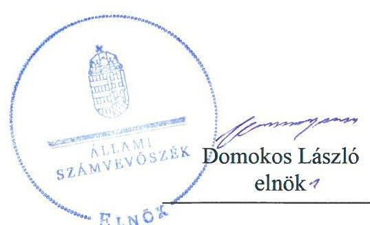
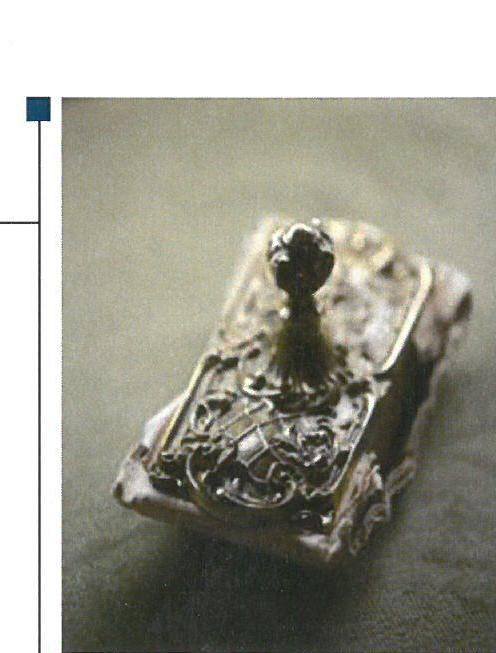
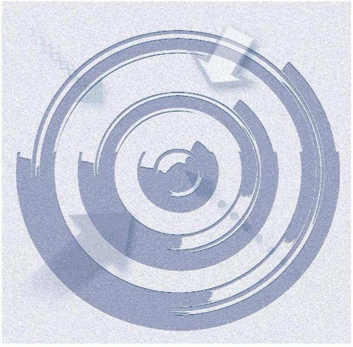
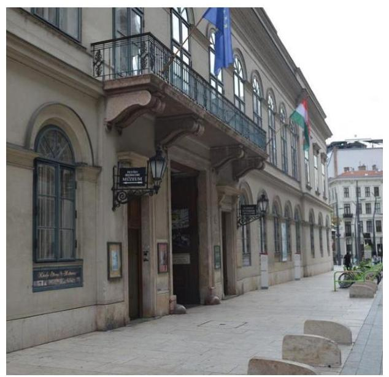

# Jelentés 

## Központi költségvetési szervek ellenőrzése

Petőfi Irodalmi Múzeum
2019.

---

# Jelenetés 

## Központi költségvetési szervek ellenőrzése

Petőfi Irodalmi Múzeum
2019. 12. hó 23. nap

---

# AZ ELLENŐRZÉST FELÜGYELTE:

DR. NAGY IMRE felügyeleti vezető

# AZ ELLENŐRZÉST VEZETTE ÉS A VÉGREHAJTÁSÁÉRT FELELŐS:

DR. KOVÁCS DIÁNA ellenőrzésvezető

# A PROGRAM ÖSSZEÁLLÍTÁSÁÉRT FELELŐS:

TÓTPÁL SZABOLCS osztályvezető

---

IKTATÓSZÁM: EL-2337-001/2019.

TÉMASZÁM: 2450

ELLENŐRZÉS-AZONOSÍTÓ SZÁM: V079136

---

Jelentéseink az Országgyűlés számítógépes hálózatán és az Interneta a www.asz.hu címen is olvashatóak.

---

# TARTALOMJEGYZÉK 

■ ÖSSZEGZÉS ..... 5
■ AZ ELLENŐRZÉS CÉLJA ..... 6
■ AZ ELLENŐRZÉS TERÜLETE ..... 7
■ AZ ELLENŐRZÉS HÁTTERE, INDOKOLTSÁGA ..... 8
■ A JELENTÉS LÉNYEGES KÉRDÉSKÖREI ..... 9
■ AZ ELLENŐRZÉS HATÓKÖRE ÉS MÓDSZEREI ..... 10
■ MEGÁLLAPÍTÁSOK ..... 12
■ JAVASLATOK ..... 17
■ MELLÉKLETEK ..... 21
I. sz. melléklet: Értelmező szótár ..... 21
■ FÜGGELÉKEK ..... 25
I. sz. függelék a jelentéshez ..... 25
II. sz. függelék: Észrevételek ..... 26
■ RÖVIDÍTÉSEK JEGYZÉKE ..... 27

---

.

---

# ÖSSZEGZÉS 

A Petőfi Irodalmi Múzeum belső kontrollrendszere, pénzügyi- és vagyongazdálkodása a 2015-2017. években nem biztositotta a közpénzek felhasználásának átláthatóságát és a nemzeti vagyon védelmét. A korrupciós kockázatokkal szembeni védelmet nem alakították ki.

## Az ellenőrzés társadalmi indokoltsága

Az Állami Számvevőszék ellenőrzi a költségvetési szervek gazdálkodását, működését, hogy megállapításaival támogassa az ellenőrzött szervezetek szabályszerű gazdálkodását, javaslataival elősegítse az Alaptörvényben ${ }^{1}$ megfogalmazott alapvetések érvényesülését a mindennapi életben a szervezetek szintjén. A központi költségvetés rendszerében zajló folyamatok holisztikus elemzései, a kockázatok folyamatos figyelemmel kísérésének módszerével, az így kiválasztott szervezetek célzott, hatékony ellenőrzéseivel az Állami Számvevőszék betölti a legfőbb gazdasági ellenőrző szerv küldetését. Az ellenőrzések megállapításaival és egy adott időszak ellenőrzési eredményeinek elemzésével az Állami Számvevőszék ráirányíthatja a jogalkotók figyelmét a központi alrendszerben vagy annak egy ágazatában esetlegesen felmerülő pénzügyi, szabályozási feszültségekre. Az elvégzett ellenőrzések során az Állami Számvevőszék „jó gyakorlatokat" is azonosíthat, melyeket tanácsadó funkciója keretében szélesebb körben is megismertethet az érintettekkel, ezáltal is hozzájárulva a költségvetési rendszer szabályozott, átlátható, kiegyensúlyozott és fenntartható működéséhez.

## Főbb megállapítások, következtetések, javaslatok

A Petőfi Irodalmi Múzeum belső kontrollrendszere nem biztosította a közpénzekkel való átlátható, szabályszerű, felelős gazdálkodást. A Múzeum a kockázatkezelési rendszert nem működtette, és az integrált kockázatkezelési rendszert nem alakította ki. A belső ellenőrzés nem múködött az ellenőrzött időszakban. Az integritás kontrollok kiépítése és múködtetése nem volt megfelelő, az nem biztosította a korrupció elleni védelmet.

A Múzeum pénzügyi gazdálkodása nem volt szabályszerű. A bevételi és a kiadási előirányzatok felhasználása során nem tartotta be a jogszabályi előírásokat. A gazdálkodási jogkörgyakorlás nem volt szabályszerű az ellenőrzött időszakban, aminek következtében nem volt biztosított, hogy a közpénz felhasználására a közfeladat ellátása érdekében került sor. A Múzeum a vagyonhasznosításból származó bevételek kezelésekor, valamint a kiadási előirányzatok felhasználása során nem tartotta be az átlátható szervezetekkel való szerződéskötésre vonatkozó jogszabályi előírásokat. A Múzeum az éves költségvetési maradvány megállapítása tekintetében nem a jogszabályi előírások szerint járt el.

A Múzeum vagyongazdálkodása nem volt szabályszerű, nem volt biztosított az állami vagyon védelme, mert a mérleg alátámasztására nem készült a jogszabályi előírások szerinti leltár.

A könyvvezetés, a kötelezettségvállalás-nyilvántartás, a maradvány megállapítás és a vagyongazdálkodás területén feltárt szabálytalanságok miatt a Múzeum beszámolója nem mutatott valós és megbízható képet a pénzügyi és vagyoni helyzetéről.

A Múzeumnál nem alakítottak ki a teljesítmény mérésére szolgáló követelményeket, a teljesítménymérés feltételei nem álltak fenn.

Az irányító szervi feladatellátás az EMMI részéről szabályszerű volt.
Az Állami Számvevőszék az intézkedések megtétele céljából a Petőfi Irodalmi Múzeum főigazgatója részére 16 javaslatot fogalmazott meg, melyre az érintettnek 30 napon belül intézkedési tervet kell készítenie.

---

# AZ ELLENŐRZÉS CÉLJA 

AZ ELLENŐRZÉS CÉLJA annak megállapítása volt, hogy a Petőfi Irodalmi Múzeumra² vonatkozó irányító szervi feladatellátás a jogszabályi előírások betartásával történt-e, a Múzeum belső kontrollrendszere bizto-sította-e az átlátható, szabályszerű, gazdaságos, hatékony és eredményes gazdálkodás feltételeit, szabályszerű volte a beszámolási és adatszolgáltatási kötelezettségek teljesítése, valamint az, hogy a Múzeum pénzügyi és vagyongazdálkodása megfelelt-e a jogszabályi előírásoknak és belső szabályzatainak, a költségvetési maradvány megállapítása szabályszerűen történt-e. Az ellenőrzés keretében értékeltük, hogy a Múzeumnál kiépítették és erősítették-e a korrupciós kockázatok kezelését szolgáló integritási kontrollokat, továbbá megteremtették-e a teljesítményellenőrzés feltételeit.

Az ellenőrzés célja volt továbbá annak értékelése, hogy az államháztartás központi alrendszerébe tartozó Múzeum gazdálkodása elszámoltatható-e és megfelelt-e annak az Alaptörvényben meghatározott alapvetésnek, hogy Magyarország a kiegyensúlyozott, átlátható és fenntartható költségvetési gazdálkodás elvét érvényesíti. Érvényesült-e a nemzeti vagyon kezelésének és védelmének célja, azaz a Múzeum vagyona a közérdeket szolgálja, a közös szükségletek kielégítése és a természeti erőforrások megóvása, valamint a jövő nemzedékek szükségleteinek figyelembevétele mellett.

---

# **AZ ELLENŐRZÉS TERÜLETE**

## **Petőfi Irodalmi Múzeum**

Az 1954-ben alapított budapesti Petőfi Irodalmi Múzeum gazdasági szervezettel rendelkező központi költségvetési szerv volt, irányító szerve az Emberi Erőforrások Minisztériuma³ volt.

A Múzeum közfeladatot ellátó szerv volt, fő tevékenysége az örökségvédelem, múzeumi tevékenység ellátása volt. Alaptevékenysége közé tartozott a gyűjtőkörébe tartozó muzeológiai forrásanyag felkutatása, gyűjtése, raktári megőrzése, műtárgyak kölcsönzése, visszasorolása, nyilvántartása, kezelése, revíziója, állagmegóvása és védelme, restaurálása, továbbá tudományos feldolgozása és rendezése, mindezek kiállításokon történő bemutatása, valamint a köz művelődésének segítése.

A Múzeum élén a Főigazgató⁴ állt, személye az ellenőrzött időszakban egyszer változott, 2017. január 1-jétől az ellenőrzött időszak végéig változás nem volt. Az ellenőrzött időszakot követően változott 2018 decemberében a Főigazgató személye. A jogszabályokban és az alapító okiratban megállapított feladatkörökben önállóan és egyszemélyi felelősséggel irányította a Múzeum tevékenységét. Feladatait a Főigazgató-helyettesek, a Tudományos titkár és a Gazdasági vezető⁵ támogatásával valósította meg. A gazdasági vezető személye az ellenőrzött időszakban nem változott, főigazgató-helyettes hatáskörrel rendelkezett.

A Múzeum mérleg szerinti vagyona a 2015. évben több mint 2,4 milliárd Ft, míg 2017. évben több mint 2,8 milliárd Ft volt.

A Múzeum átlagos statisztikai állományi létszáma a 2015. évi 123 főről 2017. évre 189 főre emelkedett.

Az ellenőrzött időszakban az Áht.⁶ 11. § szerinti átalakítás egyszer történt, 2017. február 1-jével az Országos Színháztörténeti Múzeum és Intézet a Múzeumba beolvadt.

---

# AZ ELLENŐRZÉS HÁTTERE, INDOKOLTSÁGA 

Az államháztartás központi alrendszerébe tartozó szervezet vagyona a nemzeti vagyon része, és az Alaptörvény is rögzíti, hogy a vagyonnal való gazdálkodás célja a közérdek szolgálata. Az ÁSZ ${ }^{7}$ ellenőrzi az éves költségvetési törvény végrehajtását, az ellenőrzés során feltárt kockázatok és a terület folyamatos kockázatelemzésével beazonosított kockázatok kezelése érdekében ráépülő ellenőrzésekkel ellenőrzi a költségvetési szervek gazdálkodását, múködését, hogy az ellenőrzések megállapításaival támogassa az ellenőrzött szervezetek szabályszerű gazdálkodását, javaslataival elősegítse az Alaptörvényben megfogalmazott alapvetések érvényesülését a mindennapi életben a szervezetek szintjén.

A belső kontrollrendszer kialakítása és múködtetése nélkül nem valósítható meg a közpénzek, a közvagyon átlátható, szabályos, gazdaságos, hatékony és eredményes felhasználása. A belső kontrollrendszer azt a célt szolgálja, hogy a költségvetési szervek múködésük és gazdálkodásuk során a tevékenységeket szabályszerűen hajtsák végre, teljesítsék elszámolási kötelezettségeiket és megvédjék az erőforrásokat a veszteségektől, a károktól és a nem rendeltetésszerű használattól. A belső kontrollrendszer magában foglalja mindazon elveket, eljárásokat és belső szabályzatokat, melyek biztosítják, hogy a költségvetési szerv valamennyi tevékenysége és célja összhangban legyen a szabályszerűséggel, szabályozottsággal, valamint a gazdaságosság, hatékonyság és eredményesség követelményeivel, az eszközökkel és forrásokkal való gazdálkodásban ne kerüljön sor pazarlásra, visszaélésre, rendeltetésellenes felhasználásra. Megfelelő, pontos és naprakész információk álljanak rendelkezésre a költségvetési szerv múködésével kapcsolatosan, és a belső kontrollrendszer harmonizációjára, öszszehangolására vonatkozó jogszabályok végrehajtásra kerüljenek. Az integritás kontrollok kiépítése, erősítése a szervezet korrupciós kockázatainak kezelését szolgálja. A teljesítménykövetelmények meghatározása és múködtetése megalapozhatja a központi költségvetési szervnél a teljesítményellenőrzés lefolytatását.

---

# A JELENTÉS LÉNYEGES KÉRDÉSKÖREI 

1. Az irányító szerv Múzeumra vonatkozó feladatellátása szabályszerű volt-e?
2. A Múzeum belső kontrollrendszerének kialakítása és müködtetése szabályszerű volt-e, az biztositotta-e a közpénzfelhasználás és az állami vagyonnal való gazdálkodás szabályozottságát?
3. A Múzeum pénzügyi gazdálkodása szabályszerű volt-e?
4. A költségvetési maradvány megállapítása szabályszerűen tör-tént-e?
5. A Múzeum vagyongazdálkodása szabályszerű volt-e?
6. A Múzeumnál alakítottak-e ki teljesítmény mérésére alkalmas követelményeket?

---

# AZ ELLENŐRZÉS HATÓKÖRE ÉS MÓDSZEREI 

## Az ellenőrzés típusa

Megfelelőségi ellenőrzés.

## Az ellenőrzött időszak

2015-2017. évek közötti időszak.

## Az ellenőrzés tárgya

A Múzeumra vonatkozó irányító szervi feladatok ellátása a 2015-2016. években. A Múzeum belső kontrollrendszerének kialakítása és működtetése 2015-2017-ben, valamint az integritás kontrollok kiépítettsége és a teljesítményellenőrzés feltételei a 2017. évben.

A Múzeum pénzügyi és vagyongazdálkodása a 2015-2016. években.
A 2017. évre vonatkozóan a Múzeum vagyongazdálkodási feltételeinek kialakítása, annak szabályszerűsége, az elszámoltathatóság biztosítása a szabályozás szintjén. A Múzeumnál hozott vagyonváltozást eredményező döntések, a vagyonban bekövetkezett változások végrehajtásának, nyilvántartásba vételének, elszámolásának szabályszerűsége. Az állami vagyon kimutatásának szabályszerűsége, ennek keretében az állami vagyonnal történő rendelkezés, a vagyonmozgások, a vagyonnyilvántartásba vétele, értékelése és a mérleg alátámasztás szabályszerűsége. A költségvetési maradvány megállapításának szabályszerűsége a 2017. év vonatkozásában.

## Az ellenőrzött szervezet

Petőfi Irodalmi Múzeum, Emberi Erőforrások Minisztériuma, mint irányító szerv.

## Az ellenőrzés jogalapja

Az ellenőrzés jogszabályi alapját az ÁSZ tv. ${ }^{8}$ 1. § (3) bekezdése, 5. § (2)-(3) bekezdései, (4) bekezdés a) pontja és (6) bekezdése, valamint az Áht. 61. § (2) bekezdésében foglalt előírások adták.

---

# Az ellenőrzés módszerei 

Az ÁSZ az ellenőrzést az ellenőrzési program szempontjai, az ellenőrzött időszakban hatályos jogszabályok, az ellenőrzés szakmai szabályai, a jelen ellenőrzésre irányadó ÁSZ módszertanok figyelembevételével hajtotta végre.

Az ellenőrzési kérdések megválaszolásához szükséges bizonyítékok megszerzése az ellenőrzött által rendelkezésre bocsátott dokumentumokra, adatokra alapozva megfigyelés, szemle (szemrevételezés), kérdésfeltevés (információkérés), mintavételezés, valamint elemző eljárás útján történt. Az ellenőrzési bizonyítékként felhasználható adatforrások közé tartoztak az ellenőrzési program részletes szempontjainál felsorolt adatforrások, valamint minden egyéb - az ellenőrzés folyamán feltárt, az ellenőrzés szempontjából információt tartalmazó - dokumentum.

Az ellenőrzés lefolytatásához az ellenőrzött szervezet az ÁSZ által kért dokumentumok megküldésével szolgáltatott adatokat, amelyek valódiságát és teljes körűségét az ellenőrzött szervezet vezetője által tett teljességi és hitelességi nyilatkozat igazolta. A rendelkezésre bocsátott adatok, információk kontrollja az ellenőrzés keretében történt.

A Múzeum belső kontrollrendszere egyes pilléreinek kialakítására és működtetésére vonatkozó értékelés:
$\longrightarrow$ „szabályszerü", amennyiben az értékelt területen az elért „igen" válaszok százalékban kifejezett, egész számra kerekített aránya legalább $85 \%$,
$\longrightarrow$ „nem szabályszerű", ha nem éri el a $85 \%$-ot.
A Múzeum belső kontrollrendszerének összesített értékelése az egyes részterületek esetében kapott megfelelőségi arányok számtani átlaga alapján történt és megegyezik a pillérenként (kontrollterületenként) alkalmazott százalékos értékelésekkel, a következő eltérésekkel: a kontrollrendszer egésze esetében a „szabályszerű" értékelésnek a százalékos értéken felül további feltétele, hogy egyik kontrollterület sem kaphat „nem szabályszerű" értékelést.

A kiadások ellenőrzésére a 2015-2017. évek, a bevételek ellenőrzésére a 2015-2016. évek esetében került sor. A kiadások (külső személyi juttatások, felhalmozási kiadások, dologi kiadások) és bevételek (értékesítésből és bérbeadásból származó bevételek) esetében az ellenőrzés azokra a legnagyobb értékű tételekre - a lényeges sokaságra - terjedt ki, melyek összértéke eléri a teljes sokaság összértékének 50\%-át.

A bevételek esetében a lényeges sokaság tételes ellenőrzésére került sor.

A kiadások elszámolásának szabályszerűsége a lényeges sokaságból véletlen mintavételi eljárással kiválasztott tételek alapján került ellenőrzésre. A kiadások esetében minden egyes tétel vonatkozásában az elszámolás szabályszerűségére vonatkozó kérdéseket tett fel az ÁSZ. Az ellenőrzött által rendelkezésre bocsájtott kiadási adatállományok hiányosságára tekintettel a kiadások esetében az ellenőrzött mintatételeket értékelte az ÁSZ.

Az ellenőrzés ideje alatt az ellenőrzött szervezettel történő kapcsolattartás az ÁSZ SZMSZ ${ }^{6}$-ének vonatkozó előírásai alapján volt biztosított.

---

# 1. Az irányító szerv Múzeumra vonatkozó feladatellátása szabályszerű volt-e? 

Összegző megállapítás Az irányító szerv feladatellátása a Múzeum vonatkozásában szabályszerű volt.

Az irányító szerv a Múzeummal kapcsolatos alapítói, egyéb irányítási, felügyeleti és ellenőrzési és munkáltatói jogosultságait szabályszerűen gyakorolta.

## 2. A Múzeum belső kontrollrendszerének kialakítása és müködtetése szabályszerű volt-e, az biztosította-e a közpénzfelhasználás és az állami vagyonnal való gazdálkodás szabályozottságát?

Összegző megállapítás

A Múzeum belső kontrollrendszerének kialakítása és müködtetése nem volt szabályszerű, az nem biztosította a közpénzfelhasználás és az állami vagyonnal való gazdálkodás szabályozottságát.

A KONTROLLKÖRNYEZET kialakítása nem volt szabályszerű. A Múzeumnál a vagyonnyilatkozat-tételi kötelezettséghez kapcsolódóan a vagyonnyilatkozat átadására, nyilvántartására, a vagyonnyilatkozatban foglalt személyes adatok védelmére és a meghallgatásra vonatkozó szabályokat a Vnytv. ${ }^{10} 11 . \S$ (6) bekezdése és a 14. § (3) bekezdés előírása ellenére nem szabályozták.

A Múzeum rendelkezett az Áht. és az Ávr. ${ }^{11}$ előírásainak megfelelően Alapító Okirat ${ }_{1-2}{ }^{12}$-vel, SZMSZ ${ }_{1-2}{ }^{13}$-vel és a gazdasági szervezetére vonatkozó szabályokat meghatározó Ügyrenddel ${ }^{14}$, a gazdálkodás részletes rendjét meghatározó Gazdálkodási szabályzattal ${ }^{15}$, Ellenőrzési nyomvonallal, számviteli szabályzatokkal.

A KOCKÁZATKEZELÉSI RENDSZERT 2016. szeptember 30-ig a Múzeum nem müködtette a Bkr. ${ }^{16}$ 7. § (2) bekezdése előírásai ellenére. A Főigazgató 2016. október 1-jétől az integrált kockázatkezelési rendszer kialakításáról nem gondoskodott a Bkr. 3. § b) pontjában foglaltak ellenére.

A KONTROLLTEVÉKENYSÉGEK gyakorlása nem volt szabályszerű a 2015-2017. években. A Múzeum a kiadási előirányzatai felhasználásáról a főkönyve alátámasztására a 2017. évben a Számv. tv. ${ }^{17} 161 . \S$ (3) bekezdésében és az Áhsz. ${ }^{18} 39 . \S$ (1) bekezdésében foglaltak ellenére

---

nem vezetett a valóságnak megfelelő, folyamatos, zárt rendszerú, áttekinthető részletező nyilvántartást. A nyilvántartás hiányában a 2017. évben nem biztosította a szabályszerű kontrolltevékenység gyakorlásának feltételeit.

A 2017. évben a kiadási előirányzatok felhasználása során az alábbi szabálytalanságokat tárta fel az ellenőrzés:
— az Áht. 37. § (1) bekezdésében előírtak ellenére nyolc esetben nem történt írásbeli kötelezettségvállalás;
— az Áht. 38. § (1) bekezdésének előírása ellenére tizennyolc esetben teljesítésigazolás nem történt;
— a Múzeum megsértette a Számv. tv. 165. § (2) bekezdése előírását, mert a számviteli nyilvántartásába egy esetben bizonylat hiányában jegyzett be adatokat.
A 2015-2016. évi kontrolltevékenység gyakorlására vonatkozó részletes megállapításokat a 3.1. pont tartalmazza.

# AZ INFORMÁCIÓS ÉS KOMMUNIKÁCIÓS RENDSZER működtetése nem volt szabályszerű. A Múzeum az Info. tv. ${ }^{19}$ 24. § (3) bekezdése ellenére nem rendelkezett adatvédelmi és adatbiztonsági szabályzattal. Az Ltv. ${ }^{20}$ 10. § (1) bekezdés a) pontjában foglaltakat megsértve a Múzeum nem rendelkezett az illetékes közlevéltárral egyetértésben kiadott iratkezelési szabályzattal. 

A MONITORING RENDSZER kialakítása és múködtetése nem volt szabályszerű. A Főigazgató: az Áht. 70. § (1) bekezdése előírása ellenére a 2017. évben nem gondoskodott a belső ellenőrzés kialakításáról. A 2016. évben a Múzeumnál a Bkr. 10. §-ában foglaltak ellenére a belső ellenőrzés nem múködött, mert a Múzeum nem rendelkezett a belső ellenőrzés múködéséhez a Bkr. 17. § (1) bekezdése és a 22. § (1) bekezdés a) pontja előírása ellenére belső ellenőrzési kézikönyvvel, továbbá a Bkr. 22. § (1) bekezdés b) pontja és a 31. §-a előírása ellenére jóváhagyott éves belső ellenőrzési tervvel.

A Főigazgató: a Bkr. 1. számú melléklete szerinti nyilatkozatban értékelte a költségvetési szerv belső kontrollrendszerének minőségét. Nyilatkozata szerint szabályszerű volt a belső kontrollrendszer kialakítása, múködtetése, amivel az ÁSZ megállapításai nem voltak összhangban.

A Bkr. 11. § (2) bekezdése előírása ellenére a Főigazgató: a Bkr. 1. számú melléklete szerinti nyilatkozatot a költségvetési beszámolóval egyidejúleg nem küldte meg az EMMI részére.

A jogszabályok által előírt kontrollok kiépítettségének szintje nem támogatta a Múzeum integritás elvű múködését, a Múzeum nem végzett kockázatelemzést. A Múzeum nem múködtetett integritást erősítő, nem kötelezően előírt kontrollokat.

---

# 3. A Múzeum pénzügyi gazdálkodása szabályszerű volt-e? 

## Összegző megállapítás

### 3.1. számú megállapítás

## A Múzeum pénzügyi gazdálkodása nem volt szabályszerű.

A bevételi és a kiadási előirányzatok tekintetében nem tartották be a jogszabályi előírásokat.

A bevételi előirányzatok kezelése a 2015-2016. években nem volt szabályszerű, mert a Múzeum a kapcsolódó szerződéskötések során nem rendelkezett az Nvtv. ${ }^{21} 11 . \S$ (10) bekezdésében, illetve a 3. § (2) bekezdésében foglaltak ellenére a szerződő fél nyilatkozatával arról, hogy az átlátható szervezetnek minősül.

A 2015-2016. években a kiadási előirányzatok felhasználása, valamint a kiadási előirányzatok felhasználása során a gazdálkodási jogkörgyakorlás nem volt szabályszerű. A Múzeum a kiadási előirányzatai felhasználásáról a főkönyve alátámasztására a 2015-2016. évben a Számv. tv. 161. § (3) bekezdésében és az Áhsz. 39. § (1) bekezdésében foglaltak ellenére nem vezetett a valóságnak megfelelő, folyamatos, zárt rendszerú, áttekinthető részletező nyilvántartást. A nyilvántartás hiányában a 2015-2016. évben nem biztosította a szabályszerű kontrolltevékenység gyakorlásának feltételeit. A 2015-2016. évben a kiadási előirányzatok felhasználása során az alábbi szabálytalanságokat tárta fel az ellenőrzés:
$\longrightarrow$ az Áht. 38. § (1) bekezdése előírását megsértve 48 esetben nem történt teljesítésigazolás;
$\longrightarrow$ az Áht. 37. § (1) bekezdésében előírtak ellenére három esetben nem történt írásbeli kötelezettségvállalás;
$\longrightarrow$ a Múzeum megsértette a Számv. tv. 165. § (2) bekezdése előírását, mert a számviteli nyilvántartásába három esetben bizonylat hiányában jegyzett be adatokat;
$\longrightarrow$ a Múzeum három, a nemzeti közbeszerzési értékhatárt meghaladó szerződést a Kbt. ${ }^{22}$ 5. § és 19. § (1) bekezdése, illetve Kbt. 2 4. § (1) bekezdése és 21. § (1) bekezdése előírását megsértve, közbeszerzési eljárás lefolytatása nélkül kötött meg.

## 3.2. számú megállapítás

A 2015-2016. évi előirányzat-maradvány megállapítása az azt alátámasztó nyilvántartás hiányosságai miatt nem volt szabályszerű.

A Múzeum nem rendelkezett a 2015. és a 2016. években az Áhsz. 39. § (3) bekezdésében foglaltak ellenére a 14. melléklet II. 4. a)-g) pontokban meghatározott minimum tartalomnak megfelelő, az előirányzat-maradvány szabályszerű megállapításához szükséges kötelezettségvállalások, más fizetési kötelezettségek részletező nyilvántartásával.

---

# 4. A költségvetési maradvány megállapítása szabályszerűen tör-tént-e? 

## Összegző megállapítás

A Múzeum 2017. évi költségvetési maradványának megállapítása nem szabályszerűen történt.

A Múzeum a maradvány kimutatást az Áhsz. 39. § (3) bekezdésében előírt, a 14. számú melléklet II. 4. a)-g) pontjaiban meghatározott minimum tartalomnak megfelelő részletező kötelezettségvállalások nyilvántartásával nem támasztotta alá.

## 5. A Múzeum vagyongazdálkodása szabályszerű volt-e?

## Összegző megállapítás

### 5.1. számú megállapítás

A Múzeum vagyongazdálkodása nem volt szabályszerű.
Az állami vagyon kimutatását nem szabályszerűen végezték, ezért annak valóságnak megfelelő nyilvántartása nem volt biztosított.

A Múzeum megsértette a Számv. tv. 23. § (2) bekezdésében leírtakat, mert olyan vagyont mutatott ki az éves beszámolók mérlegében, amire vonatkozóan - vagyonkezelői szerződés hiányában - nem rendelkezett kezelői joggal. Az állami vagyon használatát nem támasztotta alá a számviteli nyilvántartásba vételhez szükséges szabályszerűen kiállított bizonylattal, megsértve a Számv. tv. 165. § (1)-(2) bekezdésében foglaltakat.

A 2015-2017. években a Múzeum az Áhsz. 22. § (1) bekezdésében előírtak ellenére az éves költségvetési beszámoló elkészítéséhez, a mérleg tételeinek alátámasztásához nem állított össze leltárt. Ezért a 2015-2017. évi mérlege és beszámolója nem volt megalapozott.

### 5.2. számú megállapítás

A Múzeum által végzett beruházások, felújítások elszámolása nem volt szabályszerű.

A Múzeum a kiadási előirányzatai felhasználásáról a főkönyve alátámasztására a 2015-2016. évben a Számv. tv. 161. § (3) bekezdésében és az Áhsz. 39. § (1) bekezdésében foglaltak ellenére nem vezetett a valóságnak megfelelő, folyamatos, zárt rendszerú, áttekinthető részletező nyilvántartást. A 2015-2016. évben a beruházások, felújítások elszámolása során az alábbi szabálytalanságokat tárta fel az ellenőrzés:
az eszközök állományba vételének és üzembe helyezésének dokumentálására Számv. tv. 52. § (2) bekezdésében előírtak és a Számviteli politika ${ }_{1-2}{ }^{23}$-ban meghatározottak ellenére az ellenőrzött esetek egyikében sem került sor;
beruházások, felújítások elvégzéséhez a Vtvr. 9/A.§ (1) bekezdése a) pontja előírása ellenére az ellenőrzött esetek egyikében sem rendelkeztek a tulajdonosi joggyakorló írásbeli engedélyével.

---

# 6. A Múzeumnál alakítottak-e ki teljesítmény mérésére alkalmas követelményeket? 

Összegző megállapítás A Múzeumnál nem alakítottak ki a teljesítmény mérésére alkalmas követelményeket.

A Múzeum célok elérését szolgáló feladatok, folyamatok, tevékenységek mérését szolgáló indikátorokat, mérőszámokat, feladat-és teljesítménymutatókat nem képzett, a teljesítmény mérésének lehetőségét nem biztosította.

---

# JAVASLATOK 

Az ÁSZ tv. 33. § (1) bekezdésében foglaltak értelmében az ellenőrzött szervezet vezetője köteles a jelentésben foglalt megállapításokhoz kapcsolódó intézkedési tervet összeállítani és azt a jelentés kézhezvételétől számított 30 napon belül az ÁSZ részére megküldeni. Amennyiben az ellenőrzött szervezet vezetője nem küldi meg határidőben az intézkedési tervet, vagy továbbra sem elfogadható intézkedési tervet küld, az Állami Számvevőszék elnöke az ÁSZ tv. 33. § (3) bekezdése a) és b) pontjaiban foglaltakat érvényesítheti.

## Petőfi Irodalmi Múzeum föigazgatója részére

1. Intézkedjen a vagyonnyilatkozat-tételi kötelezettséghez kapcsolódóan a vagyonnyilatkozat átadására, nyilvántartására, a vagyonnyilatkozatban foglalt személyes adatok védelmére és a meghallgatásra vonatkozó szabályok szabályzatban történő megállapításról a jogszabályi előírásoknak megfelelően.
(2. sz. megállapítás 1. bekezdés 2. mondata alapján)
2. Intézkedjen az integrált kockázatkezelési rendszer kialakításáról és müködtetéséről a jogszabályi előírásnak megfelelően.
(2. sz. megállapítás 3. bekezdése alapján)
3. Intézkedjen a fökönyve alátámasztására valóságnak megfelelő, folyamatos, zárt rendszerü, áttekinthető részletező nyilvántartás vezetésére a jogszabályi előírásnak megfelelően.
(2. sz. megállapítás 4. bekezdés 2. mondata, 3.1. megállapítás 2. bekezdés 2. mondata, 5.2. megállapítás 1. mondata alapján)
4. Intézkedjen, hogy a kiadási előirányzatok felhasználása során minden esetben kerüljön sor írásbeli kötelezettségvállalásra a jogszabályi előírásnak megfelelően.
(2. sz. megállapítás 5. bekezdés 1. francia bekezdése, 3.1. megállapítás 2. bekezdés 2. francia bekezdése alapján)
5. Intézkedjen, hogy a kiadási előirányzatok felhasználása során minden esetben kerüljön sor teljesítésigazolásra a jogszabályi előírásnak megfelelően.
(2. sz. megállapítás 5. bekezdés 2. francia bekezdése és 3.1. megállapítás 2. bekezdés 1. francia bekezdése alapján)

---

6. Intézkedjen, hogy a számviteli nyilvántartásba történő bejegyzésre minden esetben szabályszerűen kiállított bizonylat alapján kerüljön sor.
(2. sz. megállapítás 5. bekezdés 3. francia bekezdése és 3.1. megállapítás 2. bekezdés 3. francia bekezdése alapján)
7. Intézkedjen az adatvédelmi és adatbiztonsági szabályzat kiadásáról a jogszabályi előírásnak megfelelően.
(2. sz. megállapítás 7. bekezdés 2. mondata alapján)
8. Intézkedjen az iratkezelési szabályzat kiadásáról a jogszabályi előírásnak megfelelően.
(2. sz. megállapítás 7. bekezdés 3. mondata alapján)
9. Intézkedjen a belső ellenőrzés kialakításáról a jogszabályi előírásoknak megfelelően.
(2. sz. megállapítás 8. bekezdés 2. mondata alapján)
10. Intézkedjen a belső kontrollrendszer minőségének értékeléséről szóló jogszabály szerinti nyilatkozat megküldéséről az irányító szerv részére a jogszabályi előírásnak megfelelően.
(2. sz. megállapítás 10. bekezdése alapján)
11. Intézkedjen, hogy a jogszabályban előírtak szerint rendelkezzen a szerződő felek nyilatkozatával arról, hogy átlátható szervezetnek minősülnek.
(3.1. sz. megállapítás 1. bekezdése alapján)
12. Intézkedjen a jövőben az előírt esetekben közbeszerzési eljárás lefolytatásáról a jogszabályi előírásnak megfelelően.
(3.1. sz. megállapítás 2. bekezdés 4. francia bekezdése alapján)
13. Intézkedjen a kötelezettségvállalások jogszabályban elöirt tartalmú nyilvántartásának vezetéséről.
(3.2. sz. megállapítás 1. bekezdése és 4. megállapítás 1. bekezdése alapján)
14. Intézkedjen jogszabályi előírás szerint leltár készítéséről.
(5.1. sz. megállapítás 2. bekezdés 1. mondata alapján)

---

15. Intézkedjen a jövőben az eszközök állományba vételének és üzembe helyezésének hitelt érdemlő dokumentálásáról a jogszabályi előirásnak megfelelően.
(5.2. sz. megállapítás 1. bekezdés 1. francia bekezdése alapján)
16. Intézkedjen a jövőben a jogszabályban elöirt esetekben a tulajdonosi joggyakorló írásbeli engedélyének kikéréséről a jogszabályi elöirásnak megfelelően.
(5.2. sz. megállapítás 1. bekezdés 2. francia bekezdése alapján)

---

.

---

# MELLÉKLETEK 

- I. SZ. MELLÉKLET: ÉRTELMEZŐ SZÓTÁR
állami vagyon
állami vagyonnak minősül:
a) az állam tulajdonában lévő dolog, valamint a dolog módjára hasznosítható természeti erő,
b) az a) pont hatálya alá nem tartozó mindazon vagyon, amely vonatkozásában törvény az állam kizárólagos tulajdonjogát nevesíti,
c) az állam tulajdonában lévő tagsági jogviszonyt megtestesítő értékpapír, illetve az államot megillető egyéb társasági részesedés,
d) az államot megillető olyan immateriális, vagyoni értékkel rendelkező jogosultság, amelyet jogszabály vagyoni értékű jogként nevesít. (Forrás: Vtv. 1. § (2) bekezdése)
állami vagyon értékesítése
állami vagyon használója
állami vagyon hasznosítása
állami vagyon hasznosítása kötött szerződés
állami vagyon kezelője /vagyonkezelő

ÁSZ Integritás Projekt

Állami vagyonnak minősül:
a) az állam tulajdonában lévő dolog, valamint a dolog módjára hasznosítható természeti erő,
b) az a) pont hatálya alá nem tartozó mindazon vagyon, amely vonatkozásában törvény az állam kizárólagos tulajdonjogát nevesíti,
c) az állam tulajdonában lévő tagsági jogviszonyt megtestesítő értékpapír, illetve az államot megillető egyéb társasági részesedés,
d) az államot megillető olyan immateriális, vagyoni értékkel rendelkező jogosultság, amelyet jogszabály vagyoni értékű jogként nevesít. (Forrás: Vtv. 1. § (2) bekezdése)
Állami vagyon tulajdonjogának bármely jogcímen történő, visszterhes átruházása. (Forrás: Vtvr. 1. § (7) bekezdés d) pontja)
Az a természetes vagy jogi személy, jogi személyiséggel nem rendelkező szervezet, aki, vagy amely törvény vagy szerződés alapján, bármely jogcímen (bérlet, haszonbérlet, használat stb.) állami vagyont birtokol, használ, szedi annak használt, hasznosít, ide nem értve a haszonélvezőt, a vagyonkezelőt és a tulajdonosi jogok gyakorlóját". (Forrás: Vtvr. 1. § (7) bekezdés a) pontja)
Az állami vagyont az MNV Zrt. maga kezeli, vagy szerződés - így különösen bérlet, haszonbérlet, megbízás - alapján központi költségvetési szervnek, természetes vagy jogi személynek, vagy jogi személyiséggel nem rendelkező gazdálkodó szervezetnek hasznosításra átengedi.
(Forrás: Vtv. 23. § (1) bekezdése, hatályos 2012. január 1-jétől)
Az állami vagyonnal a tulajdonosi joggyakorló maga gazdálkodik, vagy szerződés - így különösen bérlet, haszonbérlet, megbízás - alapján hasznosításra átengedi, illetőleg vagyonkezelésbe, haszonélvezetbe adja. (Forrás: Vtv. 23. § (1) bekezdése, hatályos 2013. június 28 -ától)
Az állami vagyon hasznosítására kötött szerződések elsődleges célja az állami vagyon hatékony működtetése, állagának védelme, értékének megőrzése, illetve gyarapítása, az állami és közfeladatok ellátásának elősegítése. (Forrás: Vtv. 23. § (2) bekezdése)
Az állami vagyont az MNV Zrt. maga kezeli, vagy szerződés - így különösen bérlet, haszonbérlet, megbízás - alapján központi költségvetési szervnek, természetes vagy jogi személynek, vagy jogi személyiséggel nem rendelkező gazdálkodó szervezetnek hasznosításra átengedi." Az állami vagyonra vonatkozóan az MNV Zrt. kizárólag az Nvtv-ben meghatározott személyekkel köthet vagyonkezelési szerződést. (Forrás: Vtv. 27. § (1) bekezdése, hatályos 2012. január 1-jétől)
Az Állami Számvevőszék 2009-ben indította el a „Korrupciós kockázatok feltérképezése - Integritás alapú közigazgatási kultúra terjesztése" című, európai uniós forrásból megvalósított kiemelt projektjét (Integritás Projekt). Az Integritás Projekt célja, hogy felmérje a közszféra intézményei korrupciós kockázatoknak való kitettségét, illetőleg az azok mérséklésére hivatott kontrollok szintjét. Az Állami Számvevőszék a projekt révén az integritás szemlélet minél szélesebb körrel történő megismertetését, gyakorlatba ültetését kívánja elérni. Az integritás követelményeinek megfelelő szervezeti múködést előnyben részesítő közigazgatási kultúra elterjesztését és a korrupció elleni fellépést az ÁSZ önmagára nézve is stratégiai jelentőségű célként fogalmazta meg. A projekt a felmérésben résztvevő intézmények számára helyzetükről

---

egyfajta „tükörképet" mutat be, ami alapot teremt a jövőbeni pozitív irányú elmozduláshoz. (Forrás: a http://integritas.asz.hu honlapon közzétett, a 2013. évi Integritás felmérés eredményeiről készült összefoglaló tanulmány)
belső ellenőrzés
belső kontrollrendszer
belső kontrollrendszer területei
felújítás
hasznosítás
információs és kommunikációs rendszer
integritás
irányító szerv
kincstári költségvetés
kockázat
Független, tárgyilagos bizonyosságot adó és tanácsadó tevékenység, amelynek célja, hogy az ellenőrzött szervezet múködését fejlessze és eredményességét növelje, az ellenőrzött szervezet céljai elérése érdekében rendszerszemléletű megközelítéssel és módszeresen értékeli, illetve fejleszti az ellenőrzött szervezet irányítási és belső kontrollrendszerének hatékonyságát. (Forrás: Bkr. 2. § b) pontja)
A belső kontrollrendszer a kockázatok kezelése és tárgyilagos bizonyosság megszerzése érdekében kialakított folyamatrendszer, amely azt a célt szolgálja, hogy a múködés és gazdálkodás során a tevékenységeket szabályszerűen, gazdaságosan, hatékonyan, eredményesen hajtsák végre, az elszámolási kötelezettségeket teljesítsék, megvédjék az erőforrásokat a veszteségektől, károktól és nem rendeltetésszerű használattól. (Forrás: Áht. 69. § (1) bekezdése)
A kontrollkörnyezet, a kockázatkezelési rendszer, a kontrolltevékenységek, az információs és kommunikációs rendszer, valamint a nyomon követési (monitoring) rendszer. (Forrás: Bkr. 3. §-a)
Az elhasználódott tárgyi eszköz eredeti állaga (kapacitása, pontossága) helyreállítását szolgáló időszakonként visszatérő olyan tevékenység, melynek során az eszköz élettartama megnövekszik, minősége, használata jelentősen javul, így a pótlólagos ráfordításból a jövőben gazdasági előnyök származnak. (Forrás: Számv. tv. 3. § (4) bekezdés 8. pontja)
A nemzeti vagyon birtoklásának, használatának, hasznok szedése jogának bármely a tulajdonjog átruházását nem eredményező - jogcímen történő átengedése, ide nem értve a vagyonkezelésbe adást, valamint a haszonélvezeti jog alapítását. (Forrás: Nvtv. 3. § (1) bekezdés 4. pontja)
A költségvetési szerv vezetője által kialakított és múködtetett olyan rendszer, mely biztosítja, hogy a megfelelő információk a megfelelő időben eljutnak az illetékes szervezethez, szervezeti egységhez, illetve személyhez. (Forrás: Bkr. 9. § (1) bekezdés)
Az integritás - egyik gyakran használt jelentése szerint - az elvek, értékek, cselekvések, módszerek, intézkedések konzisztenciáját jelenti, vagyis olyan magatartásmódot, amely meghatározott értékeknek megfelel. Integritás-irányítási rendszer bevezetése a szervezetben a szervezethez rendelt közfeladatok integritás szempontú ellátását, az érték alapú múködéssel (integritással) összefüggő szervezeti követelmények következetes érvényesítését jelenti. (Forrás: Nemzetgazdasági Minisztérium: Államháztartási Belső Kontroll Standardok és Gyakorlati Útmutató 1.6. Etikai értékek és integritás 46. oldal, 2017. szeptember)
A költségvetési szerv tekintetében az Áht-ban meghatározott irányítási hatáskört gyakorló szerv. (Forrás: Áht. 1. § 9. pontja)
A központi költségvetésről szóló törvény elfogadását követően a fejezetet irányító szerv az államháztartás központi alrendszerébe tartozó költségvetési szerv és a fejezeti kezelésű előirányzat kiemelt előirányzatait, valamint az elkülönített állami pénzalapok és a társadalombiztosítás pénzügyi alapjai jogszabályi előírás szerinti bevételeit és kiadásait kincstári költségvetés kiadásával állapítja meg. (Forrás: Áht. 28. § (2) bekezdés)
A kockázat annak a valószínűségét jelenti, hogy egy vagy több esemény vagy intézkedés nem kívánt módon befolyásolja a rendszer múködését, céljainak megvalósulását. (Forrás: Javaslatok a korrupciós kockázatok kezelésére - Kockázatkezelési és ellenőrzési módszertan 35. oldal, ÁSZ)

---

kockázatkezelési rendszer
integrált kockázatkezelési rendszer
kontrollkörnyezet
kontrolltevékenységek
kommunikáció
középirányító szerv
közfeladat
monitoring
monitoring-rendszer
tulajdonosi joggyakorló
vagyongazdálkodás

Olyan irányítási eszközök és módszerek összessége, melynek elemei a szervezeti célok elérését veszélyeztető tényezők (kockázatok) azonosítása, elemzése, csoportosítása, nyomon követése, valamint szükség esetén a kockázati kitettség mérséklése.(Forrás: Bkr. 2. § m) pontja)
Olyan folyamatalapú kockázatkezelési rendszer, amely a szervezet minden tevékenységére kiterjed, egységes módszertan és eljárások alkalmazásával, a szervezet célkitűzéseinek és értékeinek figyelembevételével biztosítja a szervezet kockázatainak teljes körű azonosítását, azok meghatározott kritériumok szerinti értékelését, valamint a kockázatok kezelésére vonatkozó intézkedési terv elkészítését és az abban foglaltak nyomon követését. (Forrás: Bkr. 2. § m) pontja, 2016. október 1-jétől)
A költségvetési szerv vezetője által kialakított olyan elvek, eljárások, belső szabályzatok összessége, amelyben világos a szervezeti struktúra, a folyamatok átláthatók, egyértelműek a felelősségi, hatásköri viszonyok és feladatok, meghatározottak, ismertek és elfogadottak az etikai elvárások a szervezet minden szintjén, átlátható a humánerőforrás-kezelés. (Forrás: Bkr. 6. § (1) bekezdés)
A költségvetési szerv vezetője által a szervezeten belül kialakított (kontroll) tevékenységek, melyek biztosítják a kockázatok kezelését, hozzájárulnak a szervezet céljainak eléréséhez és erősítik a szervezet integritását. (Forrás: Bkr. 8. § (1) bekezdés)
Az a tevékenység, melynek során információ továbbítása valósul meg. A kommunikációs folyamat résztvevői között tájékoztatás történik, mely során tényeket, ezek magyarázatát közlik.
A költségvetési szerv tekintetében törvény vagy kormányrendelet alapján meghatározott, átruházott irányítási hatásköröket gyakorló szerv. (Forrás: Áht. 9. § (4) bekezdés)
Jogszabályban meghatározott állami vagy önkormányzati feladat, amit az arra kötelezett közérdekből, a jogszabályban meghatározott követelményeknek és feltételeknek megfelelve végez, ideértve a lakosság közszolgáltatásokkal való ellátását, továbbá az állam nemzetközi szerződésekben vállalt kötelezettségeiből adódó közérdekű feladatokat, valamint e feladatok ellátásakor szükséges infrastruktúra biztosítását is. (Forrás: Nvtv. 3. § (1) bekezdés 7. pontja)
A monitoring általánosságban a különböző szintű szervezeti célok megvalósításának folyamatát kíséri figyelemmel, melynek során a releváns eseményekről és tevékenységekről (együtt: folyamatokról) rendszeres jelleggel, strukturált, döntéstámogató információkhoz jutnak a szervezet vezetői. (Forrás: NGM Útmutató a költségvetési szervek monitoring rendszeréhez 2011. november)
A költségvetési szerv vezetője köteles kialakítani a szervezet tevékenységének a célok megvalósításának nyomon követését biztosító rendszert, amely az operatív tevékenységek keretében megvalósuló folyamatos és eseti nyomon követésből, valamint az operatív tevékenységektől függetlenül működő belső ellenőrzésből áll. (Forrás: Bkr. 10. §)
Aki a nemzeti vagyon felett az államot vagy a helyi önkormányzatot megillető tulajdonosi jogok és kötelezettségek összességének gyakorlására jogosult. (Forrás: Nvtv. 3. § (1) bekezdés 17. pontja)

A nemzeti vagyongazdálkodás feladata a nemzeti vagyon rendeltetésének megfelelő, az állam, az önkormányzat mindenkori teherbíró képességéhez igazodó, elsődlegesen a közfeladatok ellátásához és a mindenkori társadalmi szükségletek kielégítéséhez szükséges, egységes elveken alapuló, átlátható, hatékony és költségtakarékos működtetése, értékének megőrzése, állagának védelme, értéknövelő használata, hasznosítása, gyarapítása, továbbá az állam vagy a helyi önkormányzat feladatának ellátása szempontjából feleslegessé váló vagyontárgyak elidegenítése. (Forrás: Nvtv. 7. § (2) bekezdése)

---

.

---

# FÜGGELÉKEK 

- I. SZ. FÜGGELÉK A JELENTÉSHEZ

Az Állami Számvevőszék az ellenőrzések során feltárt tényekhez kapcsolódó további körülmények tisztázására eszközrendszerrel nem rendelkezik. Amennyiben az ellenőrzésen túlmutatóan indokoltnak látszik az ellenőrzés során feltárt körülmények további vizsgálata, az Állami Számvevőszék törvényi felhatalmazás alapján az ellenőrzés által feltárt körülményeket továbbítja a hatáskörrel rendelkező szervnek a szükséges intézkedések megtétele, eljárások lefolytatása érdekében.

1. A Múzeum 2015-2017. években megsértette az Áht. 38. § (1) bekezdésében foglaltakat, mert úgy teljesített kifizetéseket az ellenőrzött időszakban, hogy nem került sor a teljesítés igazolására összesen 61.731.886,- Ft értékben.
2. A Múzeum 2015-2017. évben megsértette az Áht. 37. § (1) bekezdésben foglaltakat, mert kötelezettségvállalásra nem került sor összesen 12.831.134,- Ft értékben.
3. A Múzeum a kiadásait a 2015-2017. években 2.793.400,- Ft értékben nem támasztotta alá számviteli bizonylatokkal, megsértve ezzel a Számv. tv. 165. § (2) bekezdésében foglaltakat.
A gazdálkodási jogkörgyakorlás szabályainak megsértése miatt nem igazolt, hogy a kifizetések a Múzeum feladatellátását szolgálták, illetőleg, hogy azok valós teljesítésekhez kapcsolódtak, ezért felvetődik, hogy a Múzeumot vagyoni hátrány érte.
4. A Múzeum nem készítette el a 2015-2017. évi költségvetési beszámoló mérlegtételeit alátámasztó leltárát, megsértve az Áhsz. 5. § (1) bekezdésében, az Áhsz. 22. § (1)-(2) bekezdésében és a Számv. tv. 69. § (1) bekezdésében előírtakat.
A leltári alátámasztás hiányában nem igazolt, hogy a Múzeum beszámolója megbízható és valós összképet mutat és a beszámolóban szereplő tételek a valóságban is megtalálhatóak.
Az 1-4. pontokban bemutatott esetek konkrét körülményeinek felderítésére az ügyészség rendelkezik hatáskörrel.
A fenti tényálláshoz kapcsolódó egyéb könyvvezetési szabálytalanság, hogy a Múzeum a kötelezettségvállalással terhelt 2017. évi maradvány és a 2017. év végi kifizetetlen szállítói tartozások vonatkozásában valóságnak megfelelő nyilvántartással nem rendelkezett az Áhsz. 39. § (3) bekezdésének előírásai ellenére. A részletező nyilvántartások hiánya a nyilvántartási számlákon nem szereplő tételek későbbi beazonosítását és a szállítói tartozás rendezése vonatkozásában azok szükséges egyeztetését, ellenőrizhetőségét nem biztosítja.

---

A jelentéstervezetet a Számvevőszék 15 napos észrevételezésre megküldte az ellenőrzött szervezetek vezetőinek az ÁSZ tv. 29. §̊ (1) bekezdése előirásának megfelelően.

A Petőfi Irodalmi Múzeum és az Emberi Erőforrások Minisztériuma a jelentéstervezet megállapításaira nem tett észrevételt.

[^0]
[^0]:    * 29. § (1) Az Állami Számvevőszék az ellenőrzési megállapításait megküldi az ellenőrzött szervezet vezetőjének vagy az általa megbízott személynek, és annak, akinek személyes felelősségét állapította meg.
    (2) Az ellenőrzött szervezet vezetője és a felelősként megjelölt személy az ellenőrzés megállapításaira tizenöt napon belül írásban észrevételt tehet.
    (3) Az Állami Számvevőszék az észrevételre a beérkezésétől számított harminc napon belül írásban válaszol. A figyelembe nem vett észrevételeket köteles a jelentésben feltüntetni, és megindokolni, hogy azokat miért nem fogadta el.

---

# RÖVIDÍTÉSEK JEGYZÉKE 

${ }^{1}$ Alaptörvény
${ }^{2}$ Múzeum
${ }^{3}$ EMMI
${ }^{4}$ Főigazgató
${ }^{5}$ Gazdasági vezető
${ }^{6}$ Áht.
${ }^{7}$ ÁSZ
${ }^{8}$ ÁSZ tv.
${ }^{9}$ ÁSZ SZMSZ
${ }^{10}$ Vnytv.
${ }^{11}$ Ávr.
${ }^{12}$ Alapító Okirat ${ }_{1}$

Alapító Okirat ${ }_{2}$
${ }^{13}$ SZMSZ ${ }_{1}$

SZMSZ ${ }_{2}$
${ }^{14}$ Ügyrend
${ }^{15}$ Gazdálkodási szabályzat
${ }^{16}$ Bkr.
${ }^{17}$ Számv. tv.
${ }^{18}$ Áhsz.
${ }^{19}$ Info. tv.
${ }^{20}$ Ltv.
${ }^{21}$ Nvtv.
${ }^{22} \mathrm{Kbt} .{ }_{1}$

Kbt. 2

Magyarország Alaptörvénye (2011. április 25.)
Petőfi Irodalmi Múzeum
Emberi Erőforrások Minisztériuma
a Petőfi Irodalmi Múzeum főigazgatója 2016. december 31-ig, majd új Főigazgató 2017. január 1-jétől
a Petőfi Irodalmi Múzeum Gazdasági vezetője az ellenőrzött időszakban az államháztartásról szóló 2011. évi CXCV. törvény (hatályos: 2011. december 31-től)
Állami Számvevőszék
az Állami Számvevőszékről szóló 2011. évi LXVI. törvény (hatályos: 2011. július 1-jétől)
az Állami Számvevőszék szervezeti és működési szabályzata
2007. évi CLII. törvény egyes vagyonnyilatkozat-tételi kötelezettségekről az államháztartásról szóló törvény végrehajtásáról szóló 368/2011. (XII.31.) Korm. rendelet (hatályos: 2012. január 1-jétől)
Alapító okirat módosításokkal egységes szerkezetbe foglalva, okirat száma: 14225/2016., hatályos: 2016. május 19-től
Alapító okirat módosításokkal egységes szerkezetbe foglalva, okirat száma: 63335/2016., hatályos: 2017. február 1-jétől
A Petőfi Irodalmi Múzeum Szervezeti és Működési Szabályzata, hatályos: 2014. január 17-től
A Petőfi Irodalmi Múzeum Szervezeti és Működési Szabályzata, hatályos: 2017. november 16-tól
A Petőfi Irodalmi Múzeum főigazgatójának 66/13/2016. sz. utasítása a Gazdasági Igazgatóság ügyrendjéről, melléklete Gazdasági Igazgatóság ügyrendje, hatályos utasítás alapján 2016. augusztus 17-től (előírásait január 1-jétől kell alkalmazni)
A Petőfi Irodalmi Múzeum főigazgatójának 66/2/2016 számú utasítása a gazdálkodási rendjéről, melléklete a gazdálkodási szabályzat, hatályos utasítás alapján 2016. április 29-től
a költségvetési szervek belső kontrollrendszeréről és belső ellenőrzéséről szóló 370/2011. (XII. 31.) Korm. rendelet (hatályos: 2012. január 1-jétől)
a számvitelről szóló 2000. évi C. törvény (hatályos: 2001. január 1-jétől)
az államháztartás számviteléről szóló 4/2013. (I. 11.) Korm. rendelet (hatályos: 2014. január 1-jétől)
az információs önrendelkezési jogról és az információszabadságról szóló 2011. évi CXII. törvény (hatályos: 2011. július 27-től)
a köziratokról, a közlevéltárakról és a magánlevéltári anyag védelméről szóló 1995. évi LXVI. törvény (hatályos: 1996. január 1-jétől)
a nemzeti vagyonról szóló 2011. évi CXCVI. törvény (hatályos: 2011. december 31-től)
a közbeszerzésekről szóló 2011. évi CVIII. törvény (hatályos: 2011. augusztus 21. és 2015. október 31. között)
a közbeszerzésekről szóló 2015. évi CXLIII. törvény (hatályos: 2015. november 1-jétől)

---

${ }^{23}$ Számviteli politika: A Főigazgató: 123/2/2015 számú utasítása az Intézmény számviteli politikájáról, melléklete Számviteli politikai szabályzat
Számviteli politika: A Főigazgató: 66/9/2016 számú utasítása a számviteli politikájáról, melléklete Számviteli politika

---

# ÁLLAMI SZÁMVEVŐSZÉK 

1052 Budapest, Apáczai Csere János utca 10.
Levélcím: 1364 Budapest 4. Pf. 54
Telefon: +36 14849100 Telefax: +36 14849200
www.asz.hu