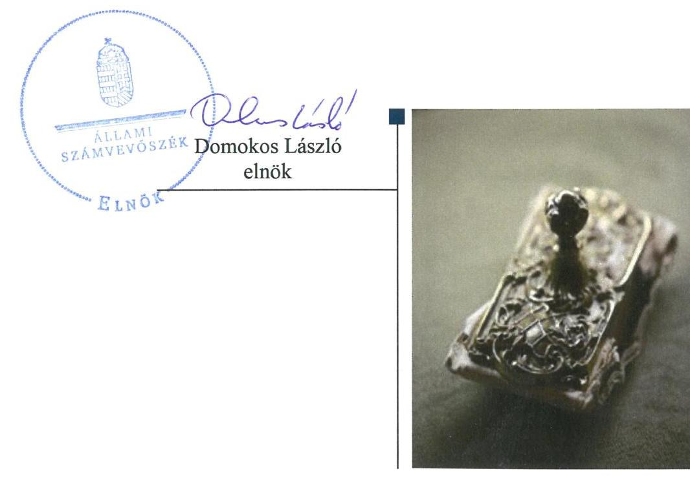

# Jelentés 

## Központi költségvetési szervek ellenőrzése

Bükki Nemzeti Park Igazgatóság 2019.

---

# Jelenetés 

## Központi költségvetési szervek ellenőrzése

Bükki Nemzeti Park Igazgatóság
2019. 12. hó 30. nap

---

# AZ ELLENŐRZÉST FELÜGYELTE: 

PETŐ KRISZTINA felügyeleti vezető

## AZ ELLENŐRZÉST VEZETTE ÉS A VÉGREHAJTÁSÁÉRT FELELŐS:

NEMESVÁRI-HORTHY ESZTER ellenőrzésvezető

## A PROGRAM ÖSSZEÁLLÍTÁSÁÉRT FELELŐS:

TÓTPÁL SZABOLCS osztályvezető

IKTATÓSZÁM: EL-2338-001/2019.
TÉMASZÁM: 2479

## ELLENŐRZÉS-AZONOSÍTÓ SZÁM: V079115

Jelentéseink az Országgyúlés számítógépes hálózatán és az Interneten a www.asz.hu címen is olvashatóak.

---

# TARTALOMJEGYZÉK 

■ ÖSSZEGZÉS ..... 5
■ AZ ELLENŐRZÉS CÉLJA ..... 6
■ AZ ELLENŐRZÉS TERÜLETE ..... 7
■ AZ ELLENŐRZÉS HÁTTERE, INDOKOLTSÁGA ..... 8
■ A JELENTÉS LÉNYEGES KÉRDÉSKÖREI ..... 10
■ AZ ELLENŐRZÉS HATÓKÖRE ÉS MÓDSZEREI ..... 11
■ MEGÁLLAPÍTÁSOK ..... 14
■ JAVASLATOK ..... 17
■ MELLÉKLETEK ..... 19
I. sz. melléklet: Értelmező szótár ..... 19
■ FÜGGELÉK: ÉSZREVÉTELEK ..... 23
■ RÖVIDÍTÉSEK JEGYZÉKE ..... 29

---

.

---

# ÖSSZEGZÉS 

Az egri székhelyű Bükki Nemzeti Park Igazgatóság belső kontrollrendszerét nem müködtette szabályszerűen, így nem volt biztosított a nemzeti vagyonnal való szabályszerű gazdálkodás. A pénzügyi-számviteli elektronikus információs rendszerből származó adatok megbizhatóságának hiányában az elszámoltathatóság feltételei nem voltak biztosítottak. Az integritás kontrollok kiépítettsége nem járult hozzá a korrupciós kockázatok mérsékléséhez.

## Az ellenőrzés társadalmi indokoltsága

A közpénzek felhasználásában és az állami vagyonnal való gazdálkodásban a központi költségvetési szervek meghatározó súlyt képviselnek. Ez indokolja, hogy az Állami Számvevőszék ellenőrzéseket folytasson a pénzügyi és vagyongazdálkodás területén. Az Állami Számvevőszék az ellenőrzései során értékeli a belső kontrollrendszer jogszabályi előírások szerinti kialakítását és működtetése szabályszerűségét, feltárja a gazdálkodás esetleges hiányosságait, rámutathat a vagyongazdálkodási tevékenység - ezen belül a tulajdonosi joggyakorlás és vagyonkezelés - esetleges szabálytalanságaira. Az Állami Számvevőszék az ellenőrzésével hozzá kíván járulni a központi intézmények pénzügyi helyzetének pontosabb megítéléséhez, a jó gyakorlat kialakításán és terjesztésén keresztül az ellenőrzések elősegíthetik a gazdálkodás szabályszerűségének javítását.

A Bükki Nemzeti Park Igazgatóság közfeladatot lát el, jelentős nagyságú természetvédelmi területet felügyel, állami vagyont kezel.

## Főbb megállapítások, következtetések, javaslatok

A Bükki Nemzeti Park Igazgatóság belső kontrollrendszere nem volt szabályszerű. A kontrollkörnyezet kialakítása szabályszerű volt, azonban a kockázatkezelési rendszert 2016. szeptember 30-ig, az integrált kockázatkezelési rendszert 2016. október 1-jétől nem alakították ki. A kontrolltevékenységek gyakorlása nem volt szabályszerű. Az információs és kommunikációs rendszer működtetése nem volt szabályszerű. A monitoring rendszer működtetése nem volt szabályszerű. A szervezet tevékenységének és a célok megvalósításának nyomon követését biztosító rendszert 2015. évben és 2016. szeptember 30-ig nem alakították ki. A belső ellenőrzés működése 2017-ben nem volt szabályszerű.

A Bükki Nemzeti Park Igazgatóság pénzügyi és vagyongazdálkodása az ellenőrzött években nem volt szabályszerű, mivel törvényi előírás ellenére a pénzügyi-gazdasági elektronikus információs rendszerek besorolása nem történt meg, amelynek következtében az azokban kezelt adatok megbízhatósága nem volt biztosított. A Bükki Nemzeti Park Igazgatóság 2015-2016. években a maradvány kimutatását jogszabályi előírás ellenére nem támasztotta alá a jogszabályban meghatározott tartalmú számviteli nyilvántartással. A 2015-2017. években a mérleg tételeit nem támasztotta alá leltárral, ezáltal az éves beszámolói nem voltak megbízhatóak.

A Bükki Nemzeti Park Igazgatóságnál a jogszabályok által előírt integritás kontrollok kiépítettségének szintje nem támogatta az integritás elvű működést, az integritást erősítő kontrollokat nem működtették. A Bükki Nemzeti Park Igazgatóság igazgatója a teljesítmény mérésére alkalmas követelményrendszer kiépítéséről nem gondoskodott, így nem biztosította a szervezet teljesítmény mérésének lehetőségét.

Az Állami Számvevőszék a jelentésében foglalt megállapítások alapján a Bükki Nemzeti Park Igazgatóság igazgatója részére hat javaslatot fogalmazott meg.

---

# AZ ELLENŐRZÉS CÉLJA 

AZ ELLENŐRZÉS CÉLJA annak megítélése volt, hogy az ellenőrzött intézményre vonatkozó irányító szervi feladatellátás a jogszabályi előírások betartásával történt-e; az intézménynél a belső kontrollrendszer kialakítása és múködtetése szabályszerű volt-e, biztosította-e az átlátható, szabályszerű, gazdaságos, hatékony és eredményes gazdálkodás feltételeit; az intézmény pénzügyi és vagyongazdálkodása megfelelt-e a jogszabályi előírásoknak és belső szabályzatainak. Érvényesült-e a nemzeti vagyon kezelésének és védelmének célja, azaz a szervezet vagyona a közérdeket szolgálta-e a közös szükségletek kielégítése és a természeti erőforrások megóvása, valamint a jövő nemzedékek szükségleteinek figyelembevétele mellett. Az ellenőrzés kiterjedt annak értékelésére is, hogy a központi költségvetési szervnél kiépítették és erősítették-e korrupciós kockázatok kezelését szolgáló integritás kontrollokat, megteremtették-e a teljesítményellenőrzés feltételeit, illetve, hogy az ellenőrzött szervezet gazdálkodása megfelelt-e annak az Alaptörvényben meghatározott alapvetésnek, hogy Magyarország a kiegyensúlyozott, átlátható és fenntartható költségvetési gazdálkodás elvét érvényesíti.

---

# **AZ ELLENŐRZÉS TERÜLETE**

## **Bükki Nemzeti Park Igazgatóság**

Az egri székhelyű BNPI1-t 1976. december 28-án alapították. Közfeladata természetvédelmi közszolgáltatás és jogszabályban meghatározott közhatalmi tevékenység. A BNPI fő tevékenysége a környezet- és természetvédelem. Működési köre Borsod-Abaúj-Zemplén megye területe (kivéve az Aggteleki és a Hortobágyi Nemzeti Park Igazgatóság működési területe), Heves megye (kivéve a Hortobágyi Nemzeti Park Igazgatóság működési területe), Nógrád megye (kivéve a Duna-Ipoly Nemzeti Park területe), Szabolcs-Szatmár-Bereg megye területén a Kesznyéteni Tájvédelmi Körzet területe Tiszadob településhatárban, Jász-Nagykun-Szolnok megye területén a Hevesi füves puszták Tájvédelmi Körzet területe Jászivány településhatárban.

A BNPI gazdasági szervezettel rendelkező, jogi személy központi államigazgatási szerv, amelynek irányítását és felügyeletét a Minisztérium2 látta el. A BNPI-nél a 2015-2016. években az Áht.3 szerinti átalakítás nem történt. A BNPI-t vezető Igazgató4 személye az ellenőrzött időszakban egy alkalommal, 2015. évben változott, a Gazdasági igazgatóhelyettes5 személyében változás nem történt.

A BNPI által elkészített éves költségvetési beszámolóinak adatai szerint a teljesített bevétele a 2015. és 2017. évben is megközelítették a 4,0 milliárd Ft-ot. A teljesített bevételből a finanszírozási bevétel 2015. évben meghaladta a 0,5 milliárd Ft-ot, 2017. évben a 2,0 milliárd Ft-ot. A teljesített költségvetési kiadások a 2015. évi 3,7 milliárd Ft-ról 2017. évre 2,2 milliárd Ft-ra csökkentek. A munkavállalók létszáma 2015-2017. években megközelítette a 300 főt. A BNPI vagyona a 2015. évi 7,2 milliárd Ft-ról, 2017. évre közel 9,4 milliárd Ft-ra nőtt.

---

# AZ ELLENŐRZÉS HÁTTERE, INDOKOLTSÁGA 

Az államháztartás központi alrendszerének közpénz felhasználása, az intézmények által ellátott közfeladatok sokrétúsége, valamint a feladatellátásához rendelt vagyon nagyságrendje indokolja, hogy az ÁSZ ${ }^{6}$ ellenőrzéseket folytasson a pénzügyi és vagyongazdálkodás területén. Az ÁSZ az ellenőrzései során feltárja a gazdálkodást, a központi alrendszer intézményei átalakulását, átszervezését érintő szabályozások esetleges hiányosságait, a szabályozással nem érintett gazdálkodási területeket, rámutathat a vagyongazdálkodási tevékenység - ezen belül a tulajdonosi joggyakorlás és vagyonkezelés - esetleges szabálytalanságaira, értékeli az állami vagyon nyilvántartására és elszámolására vonatkozó eljárásokat.

Az ellenőrzés várhatóan hozzájárul a központi intézmények pénzügyi helyzetének pontosabb megítéléséhez, és a jó gyakorlat kialakításán és terjesztésén keresztül az ellenőrzések elősegíthetik a gazdálkodás szabályszerűségének javítását.

Az ellenőrzések megállapításai támogathatják az ellenőrzött szervezetek szabályszerű gazdálkodását, javaslataival elősegítheti az Alaptörvényben megfogalmazott alapvetések érvényesülését a mindennapi életben a szervezetek szintjén. A központi költségvetés rendszerében zajló folyamatok holisztikus elemzései, a kockázatok folyamatos figyelemmel kísérésének módszerével, az így kiválasztott szervezetek célzott, hatékony ellenőrzéseivel az ÁSZ betölti a legfőbb gazdasági ellenőrző szerv küldetését.

Az ellenőrzés a szervezet kockázatértékelése alapján, az egyedi és lényeges jellemzők figyelembevételével, az ellenőrzésre kiválasztott modullal történt. Az integritás- és belső kontroll modul a központi költségvetési szerv működésének irányítottságát, korrupció elleni védettségét értékeli.

A belső kontrollrendszer kialakítása és működtetése nélkül nem valósítható meg a közpénzek, a közvagyon átlátható, szabályos, gazdaságos, hatékony és eredményes felhasználása. A belső kontrollrendszer azt a célt szolgálja, hogy a költségvetési szervek működésük és gazdálkodásuk során a tevékenységeket szabályszerűen hajtsák végre, teljesítsék elszámolási kötelezettségeiket és megvédjék az erőforrásokat a veszteségektől, a károktól és a nem rendeltetésszerű használattól. A belső kontrollrendszer magában foglalja mindazon elveket, eljárásokat és belső szabályzatokat, melyek biztosítják, hogy a költségvetési szerv valamennyi tevékenysége és célja összhangban legyen a szabályszerűséggel, szabályozottsággal, valamint a gazdaságosság, hatékonyság és eredményesség követelményeivel, az eszközökkel és forrásokkal való gazdálkodásban ne kerüljön sor pazarlásra, visszaélésre, rendeltetésellenes felhasználásra. Megfelelő, pontos és naprakész információk álljanak rendelkezésre a költségvetési szerv múködésével kapcsolatosan, és a belső kontrollrendszer harmonizációjára, öszszehangolására vonatkozó jogszabályok végrehajtásra kerüljenek. Az integritás kontrollok kiépítése, erősítése a szervezet korrupciós kockázatainak kezelését szolgálja. A teljesítménykövetelmények meghatározása és múködtetése megalapozhatja a központi költségvetési szervnél a teljesítményellenőrzés lefolytatását.

---

Az egyes ellenőrzések megállapításaival és egy időszak ellenőrzési eredményeinek elemzésével az ÁSZ ráirányíthatja a jogalkotók figyelmét a központi alrendszerben vagy annak egy ágazatában esetlegesen felmerülő pénzügyi, szabályozási feszültségekre. Az elvégzett ellenőrzések során az ÁSZ „jó gyakorlatokat" is azonosíthat, melyeket tanácsadó funkciója keretében szélesebb körben is megismertethet az érintettekkel, ezáltal is hozzájárulva a költségvetési rendszer szabályozott, átlátható, kiegyensúlyozott és fenntartható múködéséhez.

---

# A JELENTÉS LÉNYEGES KÉRDÉSKÖREI 

1.     - Szabályszerú volt-e az ellenőrzött központi költségvetési szervre vonatkozó irányító szervi feladatellátás?
2.     - A belső kontrollrendszer kialakítása és müködtetése szabályszerű volt-e, biztositotta-e a közpénzekkel és a nemzeti vagyonnal történő szabályszerű és átlátható gazdálkodást?
3.     - A központi költségvetési szerv pénzügyi és vagyongazdálkodása szabályszerű volt-e?
4.     - A központi költségvetési szervnél alakítottak-e ki a teljesítmény mérésére vonatkozó követelményeket?

---

# AZ ELLENŐRZÉS HATÓKÖRE ÉS MÓDSZEREI 

## Az ellenőrzés típusa

Megfelelőségi ellenőrzés.

## Az ellenőrzött időszak

2015 - 2017. évek

## Az ellenőrzés tárgya

A Bükki Nemzeti Park Igazgatóságra vonatkozó irányító szervi feladatok ellátása a 2015-2016. években.

A Bükki Nemzeti Park Igazgatóság belső kontrollrendszerének a kialakítása és múködtetése, valamint vagyongazdálkodása tekintetében 20152017. évek, a pénzügyi gazdálkodás tekintetében a 2015-2016. év, az integritáskontrollok kiépítettsége és a teljesítményellenőrzés feltételei a 2017. évben.

## Az ellenőrzött szervezet

Bükki Nemzeti Park Igazgatóság és az irányítószervi feladatellátás tekintetében az Agrárminisztérium.

## Az ellenőrzés jogalapja

Az ellenőrzés jogszabályi alapját az ÁSZ tv. ${ }^{7}$ 1. § (3) bekezdés, 5. § (2)-(4) és (6) bekezdései, valamint az Áht. 61. § (2) bekezdésének előírásai képezték.

## Az ellenőrzés módszerei

Az ellenőrzésre a szakmai program szempontjai, az ellenőrzött időszakban hatályos jogszabályok, az ellenőrzés szakmai szabályai, a jelen ellenőrzésre irányadó ÁSZ módszertanok figyelembevételével került sor.

Az ellenőrzés ideje alatt az ellenőrzött szervezetekkel történő kapcsolattartást az ÁSZ az ÁSZ SZMSZ ${ }^{8}$-ének vonatkozó előírásai alapján biztosította.

Az ellenőrzési kérdések megválaszolásához szükséges bizonyítékok megszerzése az ellenőrzött szervezetek által rendelkezésre bocsátott do-

---

kumentumokra, adatokra alapozva megfigyelés, szemle (szemrevételezés), kérdésfeltevés (információkérés), valamint elemző eljárás útján történik. Az ellenőrzési bizonyítékként felhasználható adatforrások közé tartoztak egyrészt a szakmai program részletes szempontjainál felsorolt adatforrások, másrészt minden egyéb - az ellenőrzés folyamán feltárt, az ellenőrzés szempontjából információt tartalmazó - dokumentum.

Az ellenőrzés lefolytatásához az ellenőrzött szervezetek a tanúsítványok kitöltésével, valamint az ÁSZ által kért dokumentumok megküldésével szolgáltattak adatokat, amelyek valódiságát és teljes körűségét az ellenőrzött szervezet vezetője által tett teljességi és hitelességi nyilatkozat igazolja.

Az ellenőrzés kiterjedt minden olyan körülményre és adatra, amely az ÁSZ jogszabályban meghatározott feladatainak teljesítéséhez, valamint a program végrehajtása folyamán felmerült újabb összefüggések feltárásához szükséges volt.

A számvevőszéki jelentésben foglalt megállapítások, következtetések alátámasztására, az elegendő és megfelelő bizonyíték megszerzése érdekében az ÁSZ - módszertani eljárásaiban foglaltaknak eleget téve - értékelte a megszerzett ellenőrzési bizonyítékok forrását és jellegét. Mérlegelte továbbá az ellenőrzési bizonyítékként felhasználandó információ relevanciáját és megbízhatóságát. Az ellenőrzöttek által rendelkezésre bocsátott adatok, információk megfelelőségének - vagyis tárgyhoz tartozóságának, helytállóságának és megbízhatóságának - kontrollja az ellenőrzés keretében történt.

A Bükki Nemzeti Park Igazgatóság pénzügyi-gazdasági elektronikus információs rendszereiben kezelt, az ellenőrzés rendelkezésére bocsátott adatok, információk megbízhatóságának kontrollja céljából az ÁSZ független hivatalos forrásból, a Nemzetbiztonsági Szakszolgálat Nemzeti Kibervédelmi Intézettől, mint a jogszabály által kijelölt hatóságtól kért adatokat. Az adatbekérés a Bükki Nemzeti Park Igazgatóság pénzügyi-gazdasági elektronikus információs rendszerei biztonsági osztályba sorolását tartalmazó és azt igazoló dokumentumokra terjedt ki.

Az állami és önkormányzati szervek elektronikus információbiztonságáról szóló 2013. évi L. törvény előírásai biztosítják az elektronikus információs rendszerekben kezelt adatok és információk bizalmasságának, sértetlenségének és rendelkezésre állásának, valamint ezek rendszerelemei sértetlenségének és rendelkezésre állásának zárt, teljes körű, folytonos és a kockázatokkal arányos védelmét. A kockázatokkal arányos védelmi szint kialakítása érdekében az elektronikus információs rendszereket biztonsági osztályba kell sorolni, amelyet az adott szerv vezetője hagy jóvá és az informatikai biztonsági szabályzatban kell rögzíteni, amelyet meg kell küldeni az NKI ${ }^{0}$ részére.

Az ellenőrzés során ezért az ÁSZ értékelte azt is, hogy biztosított volt-e az ellenőrzéshez rendelkezésre bocsátott adatok származási helyének, a pénzügyi-gazdasági elektronikus információs rendszer sértetlenségének alapfeltétele, annak biztonsági osztályba sorolása.

Amennyiben nem történt meg a pénzügyi-gazdasági elektronikus információs rendszer biztonsági osztályba sorolása, és ennek következményeként nem volt biztosított az abban kezelt adatok és információk sértetlenségének zárt, teljes körű, folytonos és a kockázatokkal arányos védelme, abban az esetben a megbízható adatok hiányával érintett területeket az

---

ÁSZ úgy értékelte, hogy nem állnak rendelkezésre az ellenőrzés részletes lefolytatásához a megfelelő ellenőrzési bizonyítékok.

A Bükki Nemzeti Park Igazgatóság belső kontrollrendszere jogszabályi előírások szerinti kialakítása és működtetése szabályszerűségének értékelése az erre irányuló kérdésekre adott válaszok összesítése alapján, évente pillérenként (kontrollterületenként) és összesítetten történt. A belső kontrollrendszer egyes pilléreinek kialakítása „szabályszerü", amennyiben az értékelt területen az „igen" válaszok százalékban kifejezett, egész számra kerekített aránya legalább 85\%, „nem szabályszerü", ha nem érte el a 85\%ot. A kontrollrendszer egésze esetében a „szabályszerü" értékelésnek a \%os értéken felül további feltétele volt, hogy egyik kontrollterület sem kaphatott „nem szabályszerü" értékelést.

---

# 1. Szabályszerú volt-e az ellenőrzött központi költségvetési szervre vonatkozó irányító szervi feladatellátás? 

Összegző megállapítás Az Irányító szervi feladatellátás 2015-2016. években szabályszerű volt.

A BNPI rendelkezett az Irányító szerv ${ }^{10}$ által az Áht. szerint kiadott, az Ávr. ${ }^{11}$ -ben meghatározott tartalmú alapító okirattal ${ }^{12}$, valamint az Áht. szerint az Irányító szerv által jóváhagyott SZMSZ ${ }^{13}$-szel.

Az Irányító szerv az Ávr. előírásai szerint a tervezett bevételek és kiadások megállapításához meghatározta a tervezési követelményeket, az Áht. és az Áhsz. ${ }^{14}$ előírásai alapján jóváhagyta a BNPI elemi költségvetéseit és éves költségvetési beszámolóit.

Munkáltatói jogait az Irányító szerv szabályszerűen gyakorolta. Az Igazgatót az Irányító szerv az Áht. szerint kinevezte, az Igazgató és a Gazdasági igazgatóhelyettes a jogszabályi előírások szerinti kinevezéssel rendelkezett 2015-2016. években.

## 2. A belső kontrollrendszer kialakítása és múködtetése szabályszerű volt-e, biztosította-e a közpénzekkel és a nemzeti vagyonnal történő szabályszerű és átlátható gazdálkodást?

Összegző megállapítás A BNPI belső kontrollrendszerének kialakítása és múködtetése 2015-2017. években nem volt szabályszerű, nem biztosította a közpénzekkel és a nemzeti vagyonnal történő szabályszerű és átlátható gazdálkodást.

A KONTROLLKÖRNYEZET kialakítása 2015-2017. években szabályszerű volt. A BNPI rendelkezett az Irányító szerv által az Áht. szerint jóváhagyott SZMSZ-szel, amelyben a Vnytv. ${ }^{15}$ előírásaival összhangban meghatározta a vagyonnyilatkozat-tételre kötelezett munkaköröket. A BNPI a gazdálkodására jellemző szabályokat, előírásokat - a Számv. tv. ${ }^{16}$ előírásainak eleget téve - számviteli politikában ${ }^{17}$ és annak keretében elkészített leltározási és leltárkészítési szabályzatban ${ }^{18}$, értékelési szabályzatban ${ }^{19}$ és pénzkezelési szabályzatban ${ }^{20}$ rögzítette. A gazdálkodási jogkörgyakorlásra jogosult személyek aláírás mintáit tartalmazó nyilvántartást az Ávr. előírásaival összhangban naprakészen vezette. A 2015-2017. években a BNPI az Ltv. ${ }^{21}$ 10. § (1) bekezdés b) pontjában rögzített előírások ellenére nem rendelkezett a Magyar Nemzeti Levéltár, az illetékes szaklevéltár és a miniszter egyetértésével kiadott iratkezelési szabályzattal. A BNPI a Bkr. ${ }^{22}$ 6. § (1) bekezdés c) pontja előírása ellenére nem alakított ki olyan kontroll-

---

környezetet, amelyben meghatározottak, ismertek és elfogadottak az etikai elvárások a szervezet minden szintjén, mert a munkavállalók esetében az etikai elvárásokat nem rögzítették.

A KOCKÁZATKEZELÉSI RENDSZER kialakításáról a BNPI-nél-a Bkr. 3. § b) pontja ellenére-2015. január 1-je és 2016. szeptember 30-a között nem gondoskodtak. Az integrált kockázatkezelési rendszert 2016. október 1-je és 2017. december 31-e között - a Bkr. 3. § b) pontja ellenére - nem alakították ki. A BNPI a Bkr. 6. § (4) bekezdése előírása ellenére nem rendelkezett az integrált kockázatkezelés eljárásrendjével.

A KONTROLLTEVÉKENYSÉGEK gyakorlása a 3. számú lényeges kérdéskörnél rögzített szabálytalanságok miatt 2015-2017. években nem volt szabályszerű.

# AZ INFORMÁCIÓS ÉS KOMMUNIKÁCIÓS RENDSZER működtetése 2015-2017. években nem volt szabályszerű. A BNPI- 

nél 2015-2016. években - a Bkr. 9. § (1) bekezdése ellenére - nem gondoskodtak olyan rendszer működtetéséről, amelyben a megfelelő információk a megfelelő időben eljutnak az illetékes szervezethez, szervezeti egységhez, illetve személyhez. A BNPI az Info tv. ${ }^{23}$ 37. § (1) bekezdése és 1. melléklete II/1. és III/1. pontja előírása ellenére (SZMSZ, adatvédelmi és adatbiztonsági szabályzat, 2015-2017. évi éves költségvetés és beszámoló) közzétételi kötelezettségének nem tett eleget.

A MONITORING RENDSZERT nem működtették szabályszerűen 2015-2017. években. A Bkr. 10. § előírása ellenére a BNPI-nél 2015. évben és 2016. szeptember 30-ig a szervezet tevékenységének, a célok megvalósításának nyomon követését biztosító rendszer kialakításáról nem gondoskodtak. A belső ellenőrzést a BNPI az Áht. előírásainak eleget téve 2015-2017. években kialakította, azonban a belső ellenőrzés 2017. évben nem működött szabályszerűen, mert a belső ellenőrzési vezető - a Bkr. 47. § (1) bekezdése előírása ellenére - éves bontásban nem vezetett nyilvántartást a belső ellenőrzési jelentésekben tett megállapítások, javaslatok, a vonatkozó intézkedési tervek és azok végrehajtásának nyomon követésére.

Az Igazgató a belső kontrollrendszer minőségét 2015-2017. években a Bkr. 1. melléklet szerinti nyilatkozatban értékelte. Az ÁSZ ellenőrzés megállapításai nem igazolták a nyilatkozataiban foglaltakat.

A BNPI-nél az integritás kontrollok kiépítettségének szintje nem támogatta az integritás elvű működést. A BNPI nem végzett kockázatelemzéseket, nem működtetett integritást erősítő kontrollokat.

---

# 3. A központi költségvetési szerv pénzügyi és vagyongazdálkodása szabályszerű volt-e? 

## Összegző megállapítás

A BNPI pénzügyi és vagyongazdálkodása az ellenőrzött években nem volt szabályszerű.

A BNPI-nél a pénzügyi-gazdasági elektronikus információs rendszereket az Ibtv. ${ }^{24} 7$. § (1) bekezdése előírása ellenére - nem sorolták be biztonsági osztályba a bizalmasság, a sértetlenség és a rendelkezésre állás szempontjából. Ennek követeztében a pénzügyi-gazdasági elektronikus információs rendszerek, valamint az azokban kezelt adatok kockázatokkal arányos védelme nem volt biztosított, amely miatt a pénzügyi-gazdasági elektronikus információs rendszerekben kezelt adatok nem voltak megbízhatóak.

A BNPI az éves költségvetési beszámoló részeként elkészített maradvány kimutatását a 2015-2016. években az Áhsz. 39. § (3) bekezdésében foglalt előírás ellenére a 14. melléklet II. 4. előírásai szerinti tartalmú kötelezettségvállalások nyilvántartásával nem támasztotta alá. A kötelezettségvállalások és más fizetési kötelezettségek nyilvántartása 2015. évben az Áhsz. 14. melléklet II. 4. a), d, és g) pontjaiban; 2016. évben az a), d), e) és g) pontjaiban foglalt tartalmi hiányosságok következtében nem volt szabályszerű. A BNPI - az Áhsz. 5. § (1), 22. § (1)-(2) bekezdései, valamint a Számv. tv. 69. § (1) bekezdése előírása ellenére - a 2015-2017. évi éves költségvetési beszámolói mérleg tételeit nem támasztotta alá leltárral.

## 4. A központi költségvetési szervnél alakítottak-e ki a teljesítmény mérésére vonatkozó követelményeket?

## Összegző megállapítás

A BNPI-nél nem alakítottak ki a teljesítmény mérésére vonatkozó követelményeket.

A BNPI nem képzett a szervezeti célok elérését szolgáló feladatok, folyamatok, tevékenységek mérését szolgáló indikátorokat, mérőszámokat, fel-adat- és teljesítménymutatókat, így nem biztosította a teljesítménymérés lehetőségét.

---

# JAVASLATOK 

Az ÁSZ tv. 33. § (1) bekezdésében foglaltak értelmében az ellenőrzött szervezet vezetője köteles a jelentésben foglalt megállapításokhoz kapcsolódó intézkedési tervet összeállítani és azt a jelentés kézhezvételétől számított 30 napon belül az ÁSZ részére megküldeni. Amennyiben az ellenőrzött szervezet vezetője nem küldi meg határidőben az intézkedési tervet, vagy továbbra sem elfogadható intézkedési tervet küld, az Állami Számvevőszék elnöke az ÁSZ tv. 33. § (3) bekezdése a) és b) pontjaiban foglaltakat érvényesítheti.

## A Bükki Nemzeti Park Igazgatóság igazgatójának

1. Intézkedjen a jogszabályi előírás szerinti iratkezelési szabályzat kiadásáról.
(2. összegző megállapítás 1. bekezdésének 5. mondata alapján)
2. Intézkedjen olyan kontrollkörnyezet kialakításáról, amelyben meghatározottak, ismertek és elfogadottak az etikai elvárások a szervezet minden szintjén.
(2. összegző megállapítás 1. bekezdésének 6. mondata alapján)
3. Intézkedjen az integrált kockázatkezelési eljárásrend jogszabály szerinti szabályozásáról.
(2. összegző megállapítás 2. bekezdésének 3. mondata alapján)
4. Intézkedjen arról, hogy a belső ellenőrzési vezető az elvégzett belső ellenőrzésekről a Bkr. szerinti nyilvántartást vezesse.
(2. összegző megállapítás 5. bekezdésének 3. mondata alapján)
5. Intézkedjen a pénzügyi-gazdasági elektronikus információs rendszerek jogszabályban elöirt biztonsági osztályba sorolásáról.
(3. összegző megállapítás 1. bekezdésének 1. mondata alapján)
6. Intézkedjen az éves költségvetési beszámoló elkészitéséhez, a mérlegtételeinek alátámasztásához a jogszabályi előírásnak megfelelő leltár összeállításáról.
(3. összegző megállapítás 2. bekezdésének 3. mondata alapján)

---

.

---

# MELLÉKLETEK 

- I. SZ. MELLÉKLET: ÉRTELMEZŐ SZÓTÁR
állami vagyon
állami vagyonnas minősül:
a) az állam tulajdonában lévő dolog, valamint a dolog módjára hasznosítható természeti erő,
b) az a) pont hatálya alá nem tartozó mindazon vagyon, amely vonatkozásában törvény az állam kizárólagos tulajdonjogát nevesíti,
c) az állam tulajdonában lévő tagsági jogviszonyt megtestesítő értékpapír, illetve az államot megillető egyéb társasági részesedés,
d) az államot megillető olyan immateriális, vagyoni értékkel rendelkező jogosultság, amelyet jogszabály vagyoni értékű jogként nevesít. (Forrás: Vtv. ${ }^{25}$ 1. § (2) bekezdése)
állami vagyon használója Az a természetes vagy jogi személy, jogi személyiséggel nem rendelkező szervezet, aki, vagy amely törvény vagy szerződés alapján, bármely jogcímen (bérlet, haszonbérlet, használat stb.) állami vagyont birtokol, használ, szedi annak hasznait, hasznosít, ide nem értve a haszonélvezőt, a vagyonkezelőt és a tulajdonosi jogok gyakorlóját. (Forrás: Vtvr. ${ }^{26}$ 1. § (7) bekezdés a) pontja)
állami vagyon hasznosítása Az állami vagyont az MNV Zrt. ${ }^{27}$ maga kezeli, vagy szerződés - így különösen bérlet, haszonbérlet, megbízás - alapján központi költségvetési szervnek, természetes vagy jogi személynek, vagy jogi személyiséggel nem rendelkező gazdálkodó szervezetnek hasznosításra átengedi.
(Forrás: Vtv. 23. § (1) bekezdése, hatályos 2012. január 1-jétől)
Az állami vagyonnal a tulajdonosi joggyakorló maga gazdálkodik, vagy szerződés így különösen bérlet, haszonbérlet, megbízás - alapján hasznosításra átengedi, illetőleg vagyonkezelésbe, haszonélvezetbe adja. (Forrás: Vtv. 23. § (1) bekezdése, hatályos 2013. június 28 -ától)
Az állami vagyont az MNV Zrt. maga kezeli, vagy szerződés - így különösen bérlet, haszonbérlet, megbízás - alapján központi költségvetési szervnek, természetes vagy jogi személynek, vagy jogi személyiséggel nem rendelkező gazdálkodó szervezetnek hasznosításra átengedi." Az állami vagyonra vonatkozóan az MNV Zrt. kizárólag az Nvtv. ${ }^{28}$-ben meghatározott személyekkel köthet vagyonkezelési szerződést. (Forrás: Vtv. 27. § (1) bekezdése, hatályos 2012. január 1-jétől)
ÁSZ Integritás Projekt Az ÁSZ 2011-ben indította el a közintézmények integritását vizsgáló és fejlesztő kérdőíves kutatását, melynek hétéves felmérési időszaka 2017. évben zárult le. Az ÁSZ az Integritás felmérés keretében 2017. évben hetedik alkalommal értékelte a közszféra intézményeinek korrupciós kockázatait, illetve a korrupció ellen védelmet biztosító kontrollok kiépítettségét. (Forrás: https://asz.hu/tanulmanyok-2017-ev Elemzés a közszféra integritás helyzetéről 2017. Vezetői összefoglaló 4. oldal)
átalakítás
belső ellenőrzés

A költségvetési szerv általános jogutódlással történő megszüntetése átalakítással történhet. Az átalakítás lehet egyesítés vagy különválás. Az egyesítés lehet beolvadás vagy összeolvadás. (2014. december 31-ig, Áht. 9/A. § (3) és (4) bekezdés, 2015. január 1-jétől Áht. 11. § (2) bekezdés)
Független, tárgyilagos bizonyosságot adó és tanácsadó tevékenység, amelynek célja, hogy az ellenőrzött szervezet működését fejlessze és eredményességét növelje, az ellenőrzött szervezet céljai elérése érdekében rendszerszemléletű megközelítéssel és módszeresen értékeli, illetve fejleszti az ellenőrzött szervezet irányítási és belső kontrollrendszerének hatékonyságát. (Forrás: Bkr. 2. § b) pontja)

---

belső kontrollrendszer

Belső kontrollrendszer területei
ellenőrzési nyomvonal
hasznosítás
információs és kommunikációs rendszer
integritás
integrált kockázatkezelési rendszer
irányító szerv/felügyeleti szerv
kockázat
kockázatkezelési rendszer
kontrollkörnyezet

A belső kontrollrendszer a kockázatok kezelése és tárgyilagos bizonyosság megszerzése érdekében kialakított folyamatrendszer, amely azt a célt szolgálja, hogy a múködés és gazdálkodás során a tevékenységeket szabályszerűen, gazdaságosan, hatékonyan, eredményesen hajtsák végre, az elszámolási kötelezettségeket teljesítsék, megvédjék az erőforrásokat a veszteségektől, károktól és nem rendeltetésszerű használattól. (Forrás: Áht. 69. § (1) bekezdése)
A kontrollkörnyezet, a kockázatkezelési rendszer, a kontrolltevékenységek, az információs és kommunikációs rendszer, valamint a nyomon követési (monitoring) rendszer. (Forrás: Bkr. 3. §-a)
Az ellenőrzési nyomvonal a költségvetési szerv működési folyamatainak szöveges, táblázatokkal vagy folyamatábrákkal szemléltetett leírása, amely tartalmazza különösen a felelősségi és információs szinteket és kapcsolatokat, irányítási és ellenőrzési folyamatokat, lehetővé téve azok nyomon követését és utólagos ellenőrzését. (Forrás: Bkr. 6. § (3) bekezdés)
A nemzeti vagyon birtoklásának, használatának, hasznok szedése jogának bármely a tulajdonjog átruházását nem eredményező - jogcímen történő átengedése, ide nem értve a vagyonkezelésbe adást, valamint a haszonélvezeti jog alapítását. (Forrás: Nvtv. 3. § (1) bekezdés 4. pontja)
A költségvetési szerv vezetője által kialakított és múködtetett olyan rendszer, mely biztosítja, hogy a megfelelő információk a megfelelő időben eljutnak az illetékes szervezethez, szervezeti egységhez, illetve személyhez. (Forrás: Bkr. 9. § (1) bekezdés)
Az integritás - egyik gyakran használt jelentése szerint - az elvek, értékek, cselekvések, módszerek, intézkedések konzisztenciáját jelenti, vagyis olyan magatartásmódot, amely meghatározott értékeknek megfelel. Integritás-irányítási rendszer bevezetése a szervezetben a szervezethez rendelt közfeladatok integritás szempontú ellátását, az érték alapú múködéssel (integritással) összefüggő szervezeti követelmények következetes érvényesítését jelenti. (Forrás: Nemzetgazdasági Minisztérium: Államháztartási Belső Kontroll Standardok és Gyakorlati Útmutató 1.6. Etikai értékek és integritás 46. oldal, 2017. szeptember)
Olyan folyamatalapú kockázatkezelési rendszer, amely a szervezet minden tevékenységére kiterjed, egységes módszertan és eljárások alkalmazásával, a szervezet célkitűzéseinek és értékeinek figyelembevételével biztosítja a szervezet kockázatainak teljes körű azonosítását, azok meghatározott kritériumok szerinti értékelését, valamint a kockázatok kezelésére vonatkozó intézkedési terv elkészítését és az abban foglaltak nyomon követését. (Forrás: Bkr. 2. § m) pontja, 2016. október 1-jétől) A költségvetési szerv tekintetében az Áht.-ban meghatározott irányítási hatáskört gyakorló szerv. (Forrás: Áht. 1. § 9. pontja)
A kockázat annak a valószínűségét jelenti, hogy egy vagy több esemény vagy intézkedés nem kívánt módon befolyásolja a rendszer múködését, céljainak megvalósulását. (Forrás: Javaslatok a korrupciós kockázatok kezelésére - Kockázatkezelési és ellenőrzési módszertan 35. oldal, ÁSZ)
Olyan irányítási eszközök és módszerek összessége, melynek elemei a szervezeti célok elérését veszélyeztető tényezők (kockázatok) azonosítása, elemzése, csoportosítása, nyomon követése, valamint szükség esetén a kockázati kitettség mérséklése.(Forrás: Bkr. 2. § m) pontja)
A költségvetési szerv vezetője által kialakított olyan elvek, eljárások, belső szabályzatok összessége, amelyben világos a szervezeti struktúra, a folyamatok átláthatók, egyértelműek a felelősségi, hatásköri viszonyok és feladatok, meghatározottak, ismertek és elfogadottak az etikai elvárások a szervezet minden szintjén, átlátható a humánerőforrás-kezelés. (Forrás: Bkr. 6. § (1) bekezdés)

---

kontrolltevékenységek

közfeladat
maradvány
nyomon követési rendszer (monitoring)
tulajdonosi joggyakorló
vagyongazdálkodás

A költségvetési szerv vezetője által a szervezeten belül kialakított (kontroll) tevékenységek, melyek biztosítják a kockázatok kezelését, hozzájárulnak a szervezet céljainak eléréséhez és erősítik a szervezet integritását. (Forrás: Bkr. 8. § (1) bekezdés) Jogszabályban meghatározott állami vagy önkormányzati feladat, amit az arra kötelezett közérdekből, a jogszabályban meghatározott követelményeknek és feltételeknek megfelelve végez, ideértve a lakosság közszolgáltatásokkal való ellátását, továbbá az állam nemzetközi szerződésekben vállalt kötelezettségeiből adódó közérdekű feladatokat, valamint e feladatok ellátásakor szükséges infrastruktúra biztosítását is. (Forrás: Nvtv. 3. § (1) bekezdés 7. pontja)
A költségvetési év során a bevételek és kiadások különbözete, amely az alaptevékenység bevételei és kiadásai tekintetében a költségvetési maradvány, a vállalkozási tevékenység bevételei és kiadásai tekintetében a vállalkozási maradvány. (Forrás: Áht. 1. § 17. pont)
A költségvetési szerv vezetője köteles kialakítani a szervezet tevékenységének a célok megvalósításának nyomon követését biztosító rendszert, amely az operatív tevékenységek keretében megvalósuló folyamatos és eseti nyomon követésből, valamint az operatív tevékenységektől függetlenül múködő belső ellenőrzésből áll. (Forrás: Bkr. 10. §)
Aki a nemzeti vagyon felett az államot vagy a helyi önkormányzatot megillető tulajdonosi jogok és kötelezettségek összességének gyakorlására jogosult. (Forrás: Nvtv. 3. § (1) bekezdés 17. pontja)

A nemzeti vagyongazdálkodás feladata a nemzeti vagyon rendeltetésének megfelelő, az állam, az önkormányzat mindenkori teherbíró képességéhez igazodó, elsődlegesen a közfeladatok ellátásához és a mindenkori társadalmi szükségletek kielégítéséhez szükséges, egységes elveken alapuló, átlátható, hatékony és költségtakarékos múködtetése, értékének megőrzése, állagának védelme, értéknövelő használata, hasznosítása, gyarapítása, továbbá az állam vagy a helyi önkormányzat feladatának ellátása szempontjából feleslegessé váló vagyontárgyak elidegenítése. (Forrás: Nvtv. 7. § (2) bekezdése)

---

.

---

# FÜGGELÉK: ÉSZREVÉTELEK 

A jelentéstervezetet a Számvevőszék 15 napos észrevételezésre megküldte az ellenőrzött szervezet vezetőjének az ÁSZ tv. 29. §* (1) bekezdése előírásának megfelelően.

A Bükki Nemzeti Park Igazgatóság igazgatója a jelentéstervezet megállapításaira írásban észrevételt tett.
Az ÁSZ tv. 29. § (3) bekezdésével összhangban az ÁSZ a Függelékben feltünteti az ellenőrzés megállapításaival kapcsolatban tett, figyelembe nem vett észrevételeket, és megindokolja, hogy azokat miért nem fogadta el.

Az Állami Számvevőszék (továbbiakban: ÁSZ) az ellenőrzési megállapításait az ellenőrzött időszakban hatályos jogszabályok és az ellenőrzött szervezet közreműködési kötelezettsége keretében, az ellenőrzött szervezet által rendelkezésre bocsátott, Teljességi és hitelességi nyilatkozattal alátámasztott dokumentumokra alapozva fogalmazta meg. A Bükki Nemzeti Park Igazgatóság (továbbiakban: BNPI) igazgatója (illetve az igazgatóhelyettese) által aláírt Teljességi és hitelességi nyilatkozatokban foglaltak szerint az átadott dokumentumok, adatok megbízhatóak, az ÁSZ által bekért adatokra, dokumentumokra vonatkozóan teljes körű információt tartalmaznak. Az igazgató (és az igazgatóhelyettes) az átadott dokumentumok, adatok hitelességéért, valódiságáért, hiánytalanságáért teljes felelősséget vállalt. Így a 15 napos észrevételezés keretében megküldött adatok, dokumentumok az észrevételre adott válasznál nem kerültek figyelembevételre.

1) „Az ellenőrzés területe" részhez tett 1. sz. észrevételt az ÁSZ nem veszi figyelembe.

Az igazgató észrevételében a jelentéstervezet „Az ellenőrzés területe" részének kiegészítését kérte, tekintettel a bevételeket jelentősen megemelő nemzetközi és hazai pályázatok lebonyolítására.
Az ÁSZ tv. 29. § (2) bekezdése alapján az ellenőrzött szervezet vezetője és a felelősként megjelölt személy az ellenőrzés megállapításaira tehet észrevételt. A jelentéstervezet „Az ellenőrzés területe" rész az ellenőrzési dokumentumok alapján az ellenőrzött szervezet bemutatása céljából tartalmaz adatokat. A BNPI éves költségvetési beszámolójában szereplő adatok alakulására ható tényezők elemzése nem képezte az ellenőrzés tárgyát, erre vonatkozóan adatbekérés sem történt, így szerepeltetése nem indokolt.

[^0]
[^0]:    * 29. § (1) Az Állami Számvevőszék az ellenőrzési megállapításait megküldi az ellenőrzött szervezet vezetőjének vagy az általa megbízott személynek, és annak, akinek személyes felelősségét állapította meg.
    (2) Az ellenőrzött szervezet vezetője és a felelősként megjelölt személy az ellenőrzés megállapításaira tizenöt napon belül írásban észrevételt tehet.
    (3) Az Állami Számvevőszék az észrevételre a beérkezésétől számított harminc napon belül írásban válaszol. A figyelembe nem vett észrevételeket köteles a jelentésben feltüntetni, és megindokolni, hogy azokat miért nem fogadta el.

---

# 2) A 4. számú megállapításhoz tett 2. sz. és 14. sz. észrevételt az ÁSZ nem veszi figyelembe. 

Az igazgató észrevételében jelezte, hogy míg az irányítószervi szervi (Agrárminisztérium) feladatellátásra vonatkozóan a jelentéstervezet szabályszerű minősítést tartalmaz, addig a BNPI esetében a teljesítmény mérésére vonatkozó követelmények kialakítása nem került elfogadásra.

Az észrevételben hivatkozott, a jelentéstervezet 1. számú megállapítás 3. bekezdés utolsó mondata szerint az irányító szerv a közszolgálati egyéni teljesítményértékelésről szóló 10/2013. (I. 21.) Korm. rendelet előírásai szerint az igazgató esetében a teljesítménykövetelményeket meghatározta, a teljesítmény értékelését elvégezte. A BNPI esetében a jelentéstervezet 4. sz. megállapítása azonban nem az egyéni teljesítményértékelésre vonatkozik, hanem arra, hogy a BNPI nem képzett a szervezeti célok elérését szolgáló feladatok, folyamatok, tevékenységek mérését szolgáló indikátorokat, mérőszámokat, feladat- és teljesítménymutatókat. Az egyéni teljesítményértékelés a szervezeti célok elérését szolgáló feladatok, folyamatok, tevékenységek mérésének szükséges, de nem elégséges részét képezi. A BNPI az EL-0909-003/2019. ikt.sz. adatbekérő levél 2. sz. melléklet (Dokumentumjegyzék) V. 7. pontjában meghatározott dokumentumok tekintetében egyéni teljesítményértékelésre vonatkozó nyilatkozatokat bocsátott az ellenőrzés rendelkezésére, a szervezeti célok elérését szolgáló feladatok, folyamatok, tevékenységek mérését szolgáló indikátorok, mérőszámok, feladat- és teljesítménymutatók kialakítását dokumentumokkal nem támasztotta alá. Az igazgató „05_7_2_teljmmunkakóri.pdf" elnevezésű dokumentumban foglalt nyilatkozata szerint „a Bükki Nemzeti Park Igazgatóságon teljesítménymutatókkal, referencia értékekkel kapcsolatos feladatok nem kerültek meghatározásra, így e feladatkörben érintett munkavállalók nincsenek." Fentiek alapján a 4. számú megállapítás módosítása nem indokolt.

## 3) A 2. számú megállapítás 1. bekezdés 5. mondatához tett 3. sz. észrevételt az ÁSZ nem veszi figyelembe.

Az észrevétel szerint a BNPI központi hivatal területi szerve, ezért az Ltv. 10. § (1) bekezdés a) pontjának hatálya alá tartozik, ennek megfelelően a BNPI a Magyar Nemzeti Levéltár Heves Megyei Levéltára által jóváhagyott Iratkezelési Szabályzattal rendelkezik.

Az Ltv. 10. § (1) bekezdés a) pontja azt rögzíti, hogy a közfeladatot ellátó szerv - e törvényben foglalt kivételekkel az illetékes közlevéltárral egyetértésben egyedi iratkezelési szabályzatot ad ki. A környezetvédelmi és természetvédelmi hatósági és igazgatási feladatokat ellátó szervek kijelöléséről szóló 71/2015. (III. 30.) Korm. rendelet 6. § (1) bekezdése szerint a nemzeti park igazgatóságok központi hivatalként működő költségvetési szervek. A központi államigazgatási szervekről, valamint a Kormány tagjai és az államtitkárok jogállásáról szóló 2010. évi XLIII. törvény (Ksztv.) ellenőrzött időszakban hatályos 1. § (2) bekezdése szerint a központi hivatal központi államigazgatási szerv. A 2019. január 1-jétől hatályos kormányzati igazgatásról szóló 2018. évi CXXV. törvény (Kit.) 2. § (2) bekezdés e) pontja alapján a központi hivatal központi kormányzati igazgatási szerv, amely a Ksztv. jelenleg hatályos 1. § (2) bekezdése alapján központi államigazgatási szerv. Erre tekintettel a BNPI vonatkozásában az Ltv. 10. § (1) bekezdés a) pontjában foglalt kivételi szabály alkalmazandó, vagyis az ÁSZ a megállapítását az Ltv. 10. § (1) bekezdés b) pontja alapján fogalmazta meg, amely rögzíti, hogy a központi államigazgatási szerv a Magyar Nemzeti Levéltárral, az illetékes szaklevéltárral és a köziratok kezelésének szakmai irányításáért felelős miniszterrel egyetértésben adja ki az egyedi iratkezelési szabályzatot. Az „5-5/1/2015. (II.23.) Igazgatói Utasítás a Bükki Nemzeti Park Iratkezelési Szabályzatáról" és az „5-18/1/2016. (XI.28.) Igazgatói Utasítás a Bükki Nemzeti Park Iratkezelési Szabályzatáról" dokumentumok a Magyar Nemzeti Levéltár, az illetékes szaklevéltár és a köziratok kezelésének szakmai irányításáért felelős miniszter egyetértését nem tartalmazták, ezért a BNPI az Ltv. 10. § (1) bekezdés b) pontja szerinti iratkezelési szabályzattal nem rendelkezett. Fentiek alapján a 2. számú megállapítás 1. bekezdés 5. mondatának módosítása nem indokolt.

## 4) A 2. számú megállapítás 1. bekezdés 6. mondatához tett 4. sz. észrevételt az ÁSZ nem veszi figyelembe.

Az észrevétel szerint a BNPI az etikai elvárásokat a szervezet minden szintjén meghatározta, a 2016. évi Közszolgálati Szabályzatban meghatározott munkaköri leírás minta már tartalmazta a Magyar Kormánytisztviselői Kar Hivatásetikai Kódexében megfogalmazottaknak a kormánytisztviselőkre kötelező érvényét.

Az ellenőrzött időszakban hatályos Alapító Okirat 5.2. pontja szerint a BNPI munkavállalói a közszolgálati tisztviselőkről szóló 2011. évi CXCIX. törvény (továbbiakban: Kttv.) alá hatálya alá tartozó kormánytisztviselők, a munka törvénykönyvéről szóló 2012. törvény (továbbiakban: Mt.) hatálya alá tartozó munkavállalók, illetve a

---

közfoglalkoztatásról és a közfoglalkoztatáshoz kapcsolódó, valamint egyéb törvények módosításáról szóló 2011. évi CVI. törvény alapján közfoglalkoztatási jogviszonyban állók voltak. A BNPI 2015-2017. évi éves költségvetési beszámolói alapján a BNPI-nél az Mt. hatálya alá tartozó munkavállalók száma a 2015. évben 201 fő, a 2016. évben 230 fő, a 2017. évben pedig 208 fő volt. A 2016. szeptember 19-től hatályos 5-15/1/2016. (IX.16.) Igazgatói Utasítás a Bükki Nemzeti Park Igazgatóság Közszolgálati Szabályzatáról (továbbiakban: közszolgálati szabályzat) I/4. sz. melléklet Munkaköri leírás Munkaköri feladatok 6. pontja tartalmazta, hogy a „kormánytisztviselő a Magyar Kormánytisztviselői Kar Hivatásetikai Kódexében megfogalmazottakat magára nézve kötelezőnek tekinti". A közszolgálati szabályzat 1. § (1) bekezdése értelmében a közszolgálati szabályzat hatálya a BNPI-nél foglalkoztatott kormánytisztviselők kormányzati szolgálati jogviszonyára terjedt ki. A BNPI a nem kormánytisztviselői jogviszonyban foglalkoztatott munkavállalókra vonatkozóan azonban az etikai elvárások meghatározását dokumentumokkal nem támasztotta alá. Fentiek alapján a BNPI-nél az etikai elvárásokat nem rögzítették a szervezet minden szintjén, a kormánytisztviselőkre vonatkozóan 2016. szeptember 18-ig, a nem kormánytisztviselői jogviszonyban álló munkavállalók esetében pedig a teljes ellenőrzött időszakban. Fentiekre tekintettel a 2. számú megállapítás 1. bekezdés 6 . mondatának módosítása nem indokolt.

# 5) A 2. számú megállapítás 2. bekezdéséhez tett 5. sz. észrevételt az ÁSZ nem veszi figyelembe. 

Az észrevétel szerint a BNPI 2016. szeptember 30-ig rendelkezett kockázatkezelési szabályzattal, 2016. október 1jétől integrált kockázatkezelési szabályzattal.
Az ellenőrzési dokumentumok között megtalálható „04_2_1_2015_kockazatkezeles.pdf", „04_2_1_2016_kockazatkezeles.pdf" és „05_1_28_2017_kockazatkezeles.pdf" fájlok mindegyike a 2014. szeptember 26-tól hatályos 5-21/2014. számú igazgatói utasítás a Bükki Nemzeti Park Igazgatóság Kockázatkezelési szabályzatáról első oldalát tartalmazták, azonban a 2-12. oldalai tartalmilag a szabálytalanságok kezelésének szabályzatához tartoztak, így nem a tárgyhoz tartozó ellenőrzési bizonyítékként nem értékelhetők. Megbízhatónak tekinti az ÁSZ az ellenőrzés szempontjából azon bizonyítékot, amely kétséget kizáróan bizonyítja a benne foglaltakat. Az ÁSZ részére átadott dokumentumok alapján nem ítélhető meg, hogy a BNPI gondoskodott 2015. január 1-je és 2016. szeptember 30-a között a kockázatkezelési rendszer, 2016. október 1-je és 2017. december 31-e között az integrált kockázatkezelési rendszernek a Bkr. 3. § b) pontja szerinti kialakításáról. A BNPI a fentiek miatt a kockázatkezelési rendszer kialakítását az ellenőrzött időszakra vonatkozóan dokumentumokkal nem támasztotta alá. A fentiek alapján a 2. számú megállapítás 2. bekezdés megállapításának módosítása nem indokolt.
6) A 2. számú megállapítás 3. bekezdéséhez tett 6. sz. észrevétel és a 3. számú megállapítás 1. bekezdéséhez tett 11. sz. észrevételt az ÁSZ nem veszi figyelembe.

Az észrevétel szerint a kontrolltevékenységek gyakorlása szabályszerű, az adatok megbízhatóak voltak. Az igazgató jelezte, hogy a BNPI 2014. február 3-tól rendelkezett Informatikai Biztonsági Szabályzattal (továbbiakban: IBSZ), továbbá tájékoztatást adott a BNPI-nek az Ibtv. 7. § (1) bekezdése alapján történő biztonsági osztályba sorolásáról és az alkalmazott szoftverről.
Az ellenőrzési dokumentumok között megtalálható „04_4_7_2015_IBSZ.pdf" és „04_4_7_2016_IBSZ.pdf" megnevezésű fájlok a BNPI 2014. február 3-tól hatályos IBSZ-t tartalmazták. Az IBSZ 14. oldalán tartalmazta a BNPI, mint szervezet biztonsági szintbe sorolását. Az IBSZ „16. Melléklet 16.1 Informatikai rendszerek védelmi igényei" című része (25-26. oldal) tartalmazott a biztonsági osztályra vonatkozó minimális védelmi igényeket. A BNPI elektronikus információs rendszereinek megnevezését, ezen belül a pénzügyi-gazdasági elektronikus információs rendszereinek megnevezését és Ibtv. 7. § (2)-(3) szerinti biztonsági osztályba sorolását az IBSZ nem rögzítette. A „05_4_7_2017_IBSZ.pdf" megnevezésű fájl a BNPI 2017. december 1-jétől hatályos Nemzeti Park Szintű Informatikai Biztonsági Szabályzatát tartalmazta, amely a 44. oldalon az alkalmazott könyvviteli szoftvert úgynevezett „kiemelt biztonsági osztályba" sorolta, azonban ez nem felel meg az Ibtv. 7. § (1) bekezdésében előírt biztonsági osztályba sorolásnak.
A BNPI pénzügyi-gazdasági elektronikus információs rendszereiben kezelt, az ÁSZ ellenőrzés rendelkezésére bocsátott adatok, információk megbízhatóságának kontrollja céljából az ÁSZ a Nemzetbiztonsági Szakszolgálat Nemzeti Kibervédelmi Intézettől, mint a jogszabály által kijelölt hatóságtól kért adatokat. A független, hivatalos forrásból bekért adatok kiértékelése alapján az ÁSZ megállapította, hogy a BNPI-nél a pénzügyi-gazdasági elektronikus információs rendszereket - az Ibtv. 7. § (1) bekezdése előírása ellenére - nem sorolták be biztonsági

---

osztályba a bizalmasság, a sértetlenség és a rendelkezésre állás szempontjából. Ennek követeztében a pénzügyigazdasági elektronikus információs rendszerek megbízható múködése, zártsága, valamint az azokban kezelt adatok sértetlensége, a kockázatokkal arányos védelme nem volt biztosított, amely miatt a pénzügyi-gazdasági elektronikus információs rendszerekben kezelt adatok nem voltak megbízhatóak.

Az ellenőrzés módszerei között a jelentéstervezetben rögzítésre került, hogy „Amennyiben nem történt meg a pénzügyi-gazdasági elektronikus információs rendszer biztonsági osztályba sorolása, és ennek következményeként nem volt biztosított az abban kezelt adatok és információk sértetlenségének zárt, teljes körű, folytonos és a kockázatokkal arányos védelme, abban az esetben a megbízható adatok hiányával érintett területeket az ÁSZ úgy értékelte, hogy nem állnak rendelkezésre az ellenőrzés részletes lefolytatásához a megfelelő ellenőrzési bizonyítékok." Fentiek miatt a 2. számú megállapítás 3. bekezdés megállapításának módosítása nem indokolt.

# 7) A 2. számú megállapítás 4. bekezdés 2-3. mondataihoz tett 7. sz. észrevételt az ÁSZ nem veszi figyelembe. 

Az észrevétel szerint a közzétételi kötelezettséggel kapcsolatban az Info. tv. 37. § (1) bekezdése és 1. melléklete II/1. és III/1. pontja előírásai alapján az aktuális adatok a honlapon megjelenítésre kerültek. Az igazgató tájékoztatást adott továbbá a BNPI honlapjának 2018. évben történt arculatváltozásáról. Az észrevétel szerint a BNPI gondoskodott olyan rendszer múködtetéséről, amelyben a megfelelő információk a megfelelő időben eljutnak az illetékes szervezethez, szervezeti egységhez, illetve személyhez.

Az ÁSZ az EL-0909-003/2018. iktatószámú adatbekérő levél 2. sz. melléklet (Dokumentumok jegyzéke) IV.4.3. pontjában a 2015-2016. évekre, az V.4.10. pontjában a 2017. évre vonatkozóan a közzétételi kötelezettség teljesítésének dokumentumait kérte megküldeni. Az igazgató 2018. július 23-án kelt nyilatkozataiban foglaltak szerint a 2015-2017. évekre vonatkozóan a közzétételi kötelezettségének eleget tett, azonban ennek teljesítését igazoló dokumentumokkal a BNPI nem rendelkezik. Az észrevételben hivatkozott „04_4_3_2015_kozadat_2.pdf", „04_4_3_2016 Kozadat_2.pdf", „04_4_3_2016_kozadat_1.pdf" és „04_4_3_2015_kozadat_1.pdf" fájlok a BNPI 2012. június 12-től, 2015. június 12-től és 2016. június 28-tól hatályos, a közérdekú adatok megismerésének rendjét rögzítő szabályzatait tartalmazták. Fentiek alapján a BNPI a közzétételi kötelezettség teljesítését dokumentumokkal (pl. honlapon történő megjelenítés naplózása) nem támasztotta alá, ezért a megállapítás módosítása nem indokolt.

## 8) A 2. számú megállapítás 5. bekezdés 2. mondatához tett 8. sz. észrevételt az ÁSZ nem veszi figyelembe.

A 2015. január 1. és 2016. szeptember 30-ig terjedő időszakra vonatkozó ellenőrzési megállapítás vonatkozásában az igazgató jelezte, hogy a BNPI rendelkezett kockázatkezelési szabályzattal, gondoskodtak a belső kontrollrendszer múködtetéséről és a belső ellenőrzésről a Bkr. előírásai szerint.

Az ÁSZ az EL-0909-003/2018. iktatószámú adatbekérő levél 2. sz. melléklet (Dokumentumok jegyzéke) IV5.3. pontjában a 2015-2016. évekre vonatkozóan a folyamatos- és eseti nyomon követést biztosító operatív monitoring feladatok meghatározását tartalmazó dokumentumokat és a monitoring tevékenység eredményeként keletkezett dokumentumokat kérte megküldeni. Az ellenőrzési dokumentumok között megtalálható „4 53 2015-koc elemz.pdf" és „4 53 2016-kock elemz.pdf" fájlok a 2016-2017. évi belső ellenőrzési tervek összeállításához elvégzett kockázatelemzéseket tartalmazták, amelyek a szervezet tevékenységének, a célok megvalósításának nyomon követését (monitoring) biztosító rendszer kialakítását a 2015-2016. évekre vonatkozóan nem támasztják alá. A Bkr. 3. § e) pontja alapján a belső kontrollrendszer részét képező nyomon követési rendszer (monitoring) kialakításának és múködtetésének hiánya a belső kontrollrendszer kialakításának és múködtetésének hiányosságát eredményezi. A Bkr. 3. § b) pontja alapján a belső kontrollrendszer részét képező kockázatkezelési rendszer vonatkozásában az ellenőrzés megállapította, hogy annak kialakításáról a BNPI a 2015-2016. években nem gondoskodott, az 5. sz. észrevételre adott válaszban foglaltak szerint. A jelentéstervezet 2. számú megállapítás 5. bekezdés 3. mondatában foglaltak szerint az ellenőrzés megállapította, hogy a BNPI a belső ellenőrzést az Áht. előírásainak eleget téve 20152017. években kialakította, így az észrevétel belső ellenőrzésre vonatkozó részének figyelembe vétele nem indokolt. Az észrevételben hivatkozott „02_3_vezetői_nyilatkozat.pdf" fájl a 2017. évre vonatkozóan tartalmazza a szervezet vezetőjének a belső kontrollrendszer kialakítására és múködtetésére vonatkozó, Bkr. 1. melléklete szerinti nyilatkozatát, így az észrevétel a 2015. január 1. és 2016. szeptember 30-ig terjedő időszakra vonatkozó ellenőrzési megállapítást nem érinti.

---

9) A 2. számú megállapítás 5. bekezdés 3. mondat 2. részéhez tett 9. sz. észrevételt az ÁSZ nem veszi figyelembe.

Az észrevétel szerint a BNPI a Bkr. 47. § (1) bekezdése előírása alapján éves bontásban a 2017. évre is vezetett nyilvántartást a belső ellenőrzési jelentésekben tett megállapítások, javaslatok, a vonatkozó intézkedési tervek és azok végrehajtásának nyomon követésére, azonban ilyen tárgyú adatbekérés nem érkezett az ellenőrzés alatt.
Az ÁSZ az EL-0909-003/2018. iktatószámú adatbekérő levél 2. sz. melléklet (Dokumentumok jegyzéke) V.5.13. pontjában kérte a belső ellenőrzési jelentésekben tett megállapításokat, javaslatokat, a vonatkozó intézkedési terveket és azok nyomon követését tartalmazó nyilvántartás megküldését, ezért az észrevétel nem megalapozott. A BNPI a Bkr. 47. § (1) bekezdése előírása alapján vezetett nyilvántartás vezetését a 2017. évre vonatkozóan dokumentumokkal nem támasztotta alá, ezért a 2. számú megállapítás 5. bekezdés 3. mondata megállapításának módosítása nem indokolt.

# 10) A 2. számú megállapítás 7. bekezdéséhez tett 10. sz. észrevételt az ÁSZ nem veszi figyelembe. 

Az észrevétel szerint a BNPI minden évben a szabályzataiban előírt formában készít kockázatelemzést és ez a belső ellenőrzési terv készítésének is a kötelező eleme, alapja. Az igazgató jelezte, hogy a kockázatelemzések a IV.6. pontokban feltöltésre kerültek az adatszolgáltatás során.

A Bkr. 7. § (1)-(2) bekezdésében foglaltak szerint a költségvetési szerv vezetője köteles integrált kockázatkezelési rendszert működtetni, amelynek során fel kell mérni és meg kell állapítani a költségvetési szerv tevékenységében rejlő és szervezeti célokkal összefüggő kockázatokat, valamint meg kell határozni az egyes kockázatokkal kapcsolatban szükséges intézkedéseket, valamint azok teljesítésének folyamatos nyomon követésének módját. A Bkr. hivatkozott rendelkezésében meghatározott, a költségvetési szerv vezetőjének felelősségi körébe tartozó kockázatelemzési tevékenység nem azonos a Bkr. 22. § (1) bekezdés b) pontjában meghatározott kötelezettséggel, amely szerint a belső ellenőrzési vezető feladata a kockázatelemzéssel alátámasztott stratégiai és éves ellenőrzési tervek összeállítása, a költségvetési szerv vezetőjének jóváhagyása után a tervek végrehajtása, valamint azok megvalósításának nyomon követése. Az észrevételben is hivatkozott ellenőrzési dokumentumok a 2016. és 2017. évéi belső ellenőrzési tervek alátámasztására a belső ellenőr által készített kockázatelemzések voltak. Az ÁSZ az integritás kontrollok kiépítettségét az EL-0909-003/2018. iktatószámú adatbekérő levél 2. sz. melléklet (Dokumentumok jegyzéke) V.6.1-16. pontjaiban kért dokumentumok alapján értékelte. Fentiek alapján a 2. számú megállapítás 7. bekezdés megállapításának módosítása nem indokolt.

## 11) A 3. számú megállapítás 2. bekezdés 1-2. mondataihoz tett 12. sz. észrevételt az ÁSZ nem veszi figyelembe.

Az észrevétel szerint a BNPI minden évben az Áhsz.-ben foglaltak szerint elkészítette a maradvány kimutatását, és minden évben alátámasztotta a kötelezettségek nyilvántartásával. Az igazgató észrevételében jelezte, hogy az ellenőrzés során bekért adatok IV.7.11. pontja a költségvetési maradvány levezetésének, megállapításának dokumentumaira vonatkoztak, további adatbekérés nem érkezett. Az észrevétel szerint a korábban feltöltött „04_10_3_1_2016_kv.xls", „04_10_3_1_2015_kv.xlsx" és „05_09_03_2017évikötváll.xlsx" adatok a BNPI-nél rendelkezésre állnak.

Az éves költségvetési beszámolókban a BNPI a 2015. évben 233,9 millió forint, a 2016. évben 1525,5 millió forint kötelezettségvállalással terhelt maradványt mutatott ki. Az igazgató észrevételében megerősítette, hogy az ÁSZ az EL-0909-003/2018. iktatószámú adatbekérő levél 2. sz. melléklet (Dokumentumok jegyzéke) IV.7.11. pontjában a költségvetési maradvány levezetésének, megállapításának dokumentumait kérte megküldeni. Az ellenőrzési dokumentumok között megtalálható „06_07_11_2015_maradvány.xls" és „06_07_11_2016_maradvány.xls" elnevezésű fájlok ugyanakkor kizárólag az éves költségvetési beszámolókban szereplő összegeket, 1-1 összesítő sort tartalmaztak mindkét dokumentumban, következésképpen az éves költségvetési beszámolókban szereplő összegek levezetését, megállapítását a BNPI analitikával nem támasztotta alá. A kötelezettségvállalások és más fizetési kötelezettségek nyilvántartására vonatkozóan az ÁSZ az észrevételben hivatkozott, az adatszolgáltatás során rendelkezésre bocsátott dokumentumok alapján fogalmazta meg a megállapítását. Az ellenőrzés megállapította, hogy a megküldött nyilvántartások az Áhsz. 14. melléklet II. 4. pontjában meghatározott tartalmi elemeket nem tartalmazták, így a 3. számú megállapítás 2. bekezdés 1-2. mondatai megállapításának módosítása nem indokolt.

---

12) A 3. számú megállapítás 2. bekezdés 3. mondatához tett 13. sz. észrevételt az ÁSZ nem veszi figyelembe.

Az észrevétel szerint a BNPI az Áhsz. és a számvitelről szóló 2000. évi C. törvény (továbbiakban: Számv. tv.) előírásaiban foglaltaknak eleget tett azzal, hogy a költségvetési beszámolói mérleg tételeit alátámasztotta tételes leltárral. Észrevételében az igazgató az adatszolgáltatás során feltöltött leltározási dokumentumokra hivatkozott.

A Számv. tv. 69. § (1) bekezdése értelmében a könyvek üzleti év végi zárásához, a beszámoló elkészítéséhez, a mérleg tételeinek alátámasztásához olyan leltárt kell összeállítani és e törvény előírásai szerint megőrizni, amely tételesen, ellenőrizhető módon tartalmazza a mérleg fordulónapján meglévő eszközöket és forrásokat mennyiségben és értékben. A BNPI éves költségvetési beszámolóinak mérlegei és az adatszolgáltatás során rendelkezésre bocsátott dokumentumok tételes egyeztetése alapján a 2015. évben BNPI az eszköz oldalon csak a devizaszámlákat, a követelés jellegű sajátos elszámolásokat, az egyéb sajátos eszköz oldali elszámolásokat és az aktív időbeli elhatárolásokat, a forrás oldalon a passzív időbeli elhatárolásokat támasztottak alá tételes leltárral. A 2016. évben az eszköz oldalon csak a tárgyi eszközök értékhelyesbítése, a pénzeszközök, a követelés jellegű sajátos elszámolások, az egyéb sajátos eszköz oldali elszámolások és az aktív időbeli elhatárolások, a forrás oldalon a nemzeti vagyon változásai, a kötelezettségjellegű sajátos elszámolások és a passzív időbeli elhatárolások voltak leltárral alátámasztva. A BNPI a 2017. évben a mérleg eszköz oldalán a készleteket, forrás oldalán a nemzeti vagyon induláskori értékét és az eszközök induláskori értéke és változása mérlegsorokat nem támasztotta alá leltárral. Fentiek alapján a BNPI nem tett eleget a Számv. tv. 69. § (1) bekezdésében és az Áhsz. 5. § (1), 22. § (1)-(2) bekezdéseiben előírt kötelezettségének, ezért a 3. számú megállapítás 2. bekezdés 3. mondata megállapításának módosítása nem indokolt.

Ezen túlmenően az igazgató észrevételét tartalmazó levél II. Részletes megállapítások rész első és második bekezdésében leírtakat az ÁSZ nem tekinti észrevételnek, mivel abban az igazgató a BNPI adatszolgáltatása tárgykörében történtekről ad tájékoztatást.

---

# RÖVIDÍTÉSEK JEGYZÉKE 

${ }^{1}$ BNPI
${ }^{2}$ Minisztérium
${ }^{3}$ Áht.
${ }^{4}$ Igazgató
${ }^{5}$ Gazdasági igazgatóhelyettes
${ }^{6}$ ÁSZ
${ }^{7}$ ÁSZ tv.
${ }^{8}$ ÁSZ SZMSZ
${ }^{9}$ NKI
${ }^{10}$ Irányító szerv
${ }^{11}$ Ávr.
${ }^{12}$ alapító okirat
${ }^{13}$ SZMSZ
${ }^{14}$ Áhsz.
${ }^{15}$ Vnytv.
${ }^{16}$ Számv. tv.
${ }^{17}$ számviteli politika
${ }^{18}$ leltározási és leltárkészítési szabályzat
${ }^{19}$ értékelési szabályzat
${ }^{20}$ pénzkezelési szabályzat
${ }^{21}$ Ltv.
${ }^{22}$ Bkr.
${ }^{23}$ Info tv.
${ }^{24}$ Ibtv.
${ }^{25}$ Vtv.
${ }^{26} \mathrm{Vtvr}$.
${ }^{27}$ MNV Zrt.
${ }^{28} \mathrm{Nvtv}$.

Bükki Nemzeti Park Igazgatóság
Földművelésügyi Minisztérium, amelynek elnevezése 2018. május 18-tól Agrárminisztériumra változott.
2011. évi CXCV. törvény az államháztartásról (hatályos 2012. január 1-jétől)

BNPI igazgatója
BNPI gazdasági igazgatóhelyettese
Állami Számvevőszék
2011. évi LXVI. törvény az Állami Számvevőszékről (hatályos 2011. július 1-jétől)

Az Állami Számvevőszék Szervezeti és Működési Szabályzata
Nemzetbiztonsági Szakszolgálat Nemzeti Kibervédelmi Intézet
Földművelésügyi Minisztérium, 2018. május 18-ától Agrárminisztérium
az államháztartásról szóló törvény végrehajtásáról szóló 368/2011. (XII. 31.) Korm. rendelet (hatályos: 2012. január 1-jétől)
Bükki Nemzeti Park Igazgatóság ellenőrzött időszakban hatályos alapító okirata (hatályos 2012. július 4.-étől, 2015. december 16-tól).
Bükki Nemzeti Park Igazgatóság Szervezeti és Működési Szabályzata (hatályos: 2012. december 20-ától, 2016. május 25-től).
az államháztartás számviteléről szóló 4/2013. (I. 11.) Korm. rendelet (hatályos 2014. január 1-jétől)
2007. évi CLII. törvény az egyes vagyonnyilatkozat-tételi kötelezettségekről (hatályos 2007. december 7-től)
2000. évi C. törvény a számvitelről (hatályos 2001. január 1-jétől)

Bükki Nemzeti Park Igazgatóság számviteli politikája (hatályos: 2015. január 1-jétől, 2017. január 1-jétől)
Bükki Nemzeti Park Igazgatóság leltározási és leltárkészítés szabályzata (hatályos: 2014. október 1-jétől, 2016. november 7-től)

Bükki Nemzeti Park Igazgatóság értékelési szabályzata (hatályos 2013. április 1-jétől, 2017. január 1-jétől)
Bükki Nemzeti Park Igazgatóság pénzkezelési szabályzata (hatályos 2014. augusztus 1-jétől, 2015. június 1-jétől, 2017. szeptember 1-jétől)
a köziratokról, a közlevéltárakról és a magánlevéltári anyag védelméről szóló 1995. évi LXVI. törvény
a költségvetési szervek belső kontrollrendszeréről és belső ellenőrzésről szóló 370/2011. (XII. 31.) Korm. rendelet (hatályos 2012. január 1-jétől)
2011. év CXII. törvény az információs önrendelkezési jogról és az információszabadságról (hatályos: 2012. január 1-jétől)
2013. évi L. törvény az állami és önkormányzati szervek elektronikus információbiztonságáról (hatályos 2013. július 1-jétől)
2007. évi CVI. törvény az állami vagyonról (hatályos 2007. szeptember 25-től) az állami vagyonnal való gazdálkodásról szóló 254/2007. (X. 4.) Korm. rendelet (hatályos 2007. október 4-étől)
Magyar Nemzeti Vagyonkezelő Zrt.
2011. évi CXCVI. törvény a nemzeti vagyonról (hatályos 2012. január 1-jétől)

---

# ÁLLAMI SZÁMVEVŐSZÉK 

1052 Budapest, Apáczai Csere János utca 10.
Levélcím: 1364 Budapest 4. Pf. 54
Telefon: +36 14849100 Telefax: +36 14849200
www.asz.hu