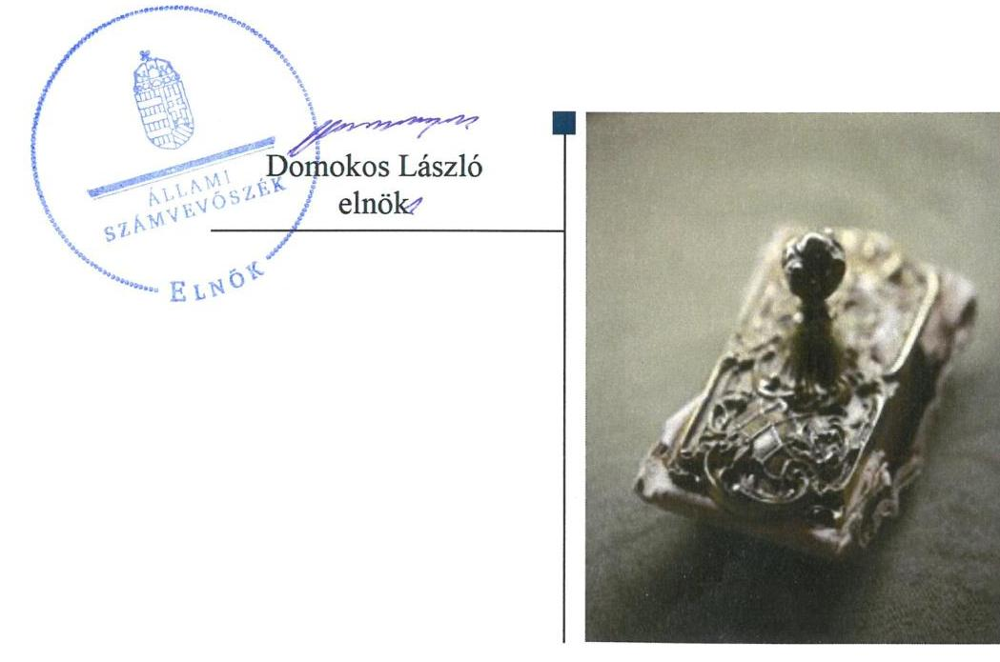
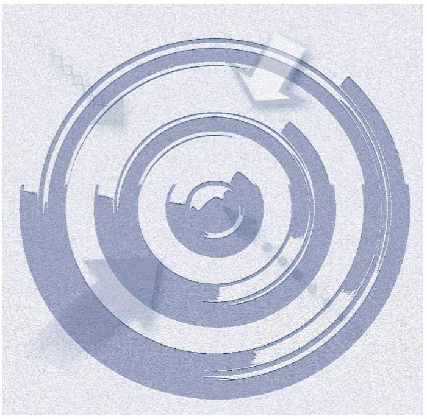
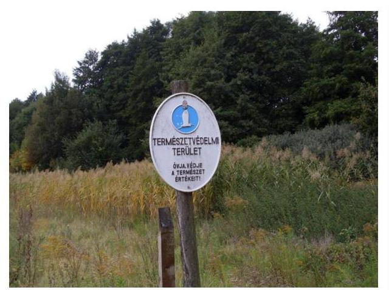

# Jelenetés 

## Központi költségvetési szervek ellenőrzése

Körös-Maros Nemzeti Park Igazgatóság 2019.

---

# Jelenetés 

## Központi költségvetési szervek ellenőrzése

Körös-Maros Nemzeti Park Igazgatóság
2019. 12. hó 20. nap

---

# AZ ELLENŐRZÉST FELÜGYELTE:

- PETŐ KRISZTINA felügyeleti vezető
- AZ ELLENŐRZÉST VEZETTE ÉS A VÉGREHAJTÁSÁÉRT FELELŐS:
  - KISS ISTVÁN GYÖRGY ellenőrzésvezető
  - DR. GÁL NÓRA ellenőrzésvezető
- A PROGRAM ÖSSZEÁLLÍTÁSÁÉRT FELELŐS:
  - TÓTPÁL SZABOLCS osztályvezető

**IKTATÓSZÁM:** EL-2339-001/2019

**TÉMASZÁM:** 2450

**ELLENŐRZÉS-AZONOSÍTÓ SZÁM:** V079123

Jelentéseink az Országgyűlés számítógépes hálózatán és az Interneten a www.asz.hu címen is olvashatóak.

---

# TARTALOMJEGYZÉK 

■ ÖSSZEGZÉS ..... 5
■ AZ ELLENŐRZÉS CÉLJA ..... 6
■ AZ ELLENŐRZÉS TERÜLETE ..... 7
■ AZ ELLENŐRZÉS HÁTTERE, INDOKOLTSÁGA ..... 8
■ A JELENTÉS LÉNYEGES KÉRDÉSKÖREI ..... 9
■ AZ ELLENŐRZÉS HATÓKÖRE ÉS MÓDSZEREI ..... 10
■ MEGÁLLAPÍTÁSOK ..... 13
■ JAVASLATOK ..... 16
■ MELLÉKLETEK ..... 17
I. sz. melléklet: Értelmező szótár ..... 17
■ FÜGGELÉK: ÉSZREVÉTELEK ..... 21
■ RÖVIDÍTÉSEK JEGYZÉKE ..... 27

---

.

---

# ÖSSZEGZÉS 

A szarvasi székhelyű Körös-Maros Nemzeti Park Igazgatóság pénzügyi és vagyongazdálkodása elszámoltathatóságának feltételei nem voltak biztosítottak. A belső kontrollrendszer müködtetése nem biztosította a közpénzekkel és a nemzeti vagyonnal történő szabályszerű gazdálkodást.

## Az ellenőrzés társadalmi indokoltsága

Az államháztartás központi alrendszerének közpénz felhasználása, az intézmények által ellátott közfeladatok sokrétűsége, valamint a feladatellátásához rendelt vagyon nagyságrendje indokolja, hogy az Állami Számvevőszék ellenőrzéseket folytasson a pénzügyi és vagyongazdálkodás területén. Az Állami Számvevőszék az ellenőrzései során feltárja a gazdálkodás esetleges hiányosságait, értékeli a belső kontrollrendszer kialakítása és működtetése szabályszerűségét, rámutathat a vagyongazdálkodási tevékenység - ezen belül a tulajdonosi joggyakorlás és vagyonkezelés - esetleges szabálytalanságaira, értékeli az állami vagyon nyilvántartására és elszámolására vonatkozó eljárásokat. Az ellenőrzés hozzájárulhat a központi intézmények pénzügyi helyzetének pontosabb megítéléséhez, a jó gyakorlat kialakításán és terjesztésén keresztül az ellenőrzéseink elősegíthetik a gazdálkodás szabályszerűségének javítását.

## Főbb megállapítások, következtetések, javaslatok

A Körös-Maros Nemzeti Park Igazgatóságnál a pénzügyi és vagyongazdálkodás az ellenőrzött években nem volt szabályszerű, mivel a könyvvezetés és a beszámoló készítés adatainak sértetlenségét és zártságát nem biztosították.

A Nemzeti Park a 2016. évi mérleg tételeinek alátámasztásához nem állított össze leltárt, ezért a költségvetési beszámoló nem adott megbízható és valós összképet a Nemzeti Park vagyonáról, eszközeiről és forrásairól, pénzügyi helyzetéről és tevékenysége eredményéről.

Az igazgató nem működtette a kockázatkezelési, majd 2016. október 1-jétől az integrált kockázatkezelési rendszert, nem gondoskodott a Körös-Maros Nemzeti Park Igazgatóság tevékenységében rejlő kockázatok felméréséről és az ezek mérséklésére irányuló intézkedések meghozataláról.

A kontrolltevékenységek gyakorlása a 2015-2017. években nem volt szabályszerű. A Nemzeti Parknál elmaradt a pénzügyi-gazdasági elektronikus információs rendszer biztonsági osztályba sorolása, így a könyvvezetés és a beszámoló adatainak megbízhatósága nem volt biztosított.

Az információs és kommunikációs rendszer működtetése a 2017. évben nem volt szabályszerű, mert az igazgató nem teljesítette az államháztartás információs rendszerébe történő adatszolgáltatást.

A Körös-Maros Nemzeti Park Igazgatóság igazgatója vezetői nyilatkozatának tartalmát, mely szerint gondoskodott a belső kontrollrendszer kiépítéséről és működtetéséről, az Állami Számvevőszék által az ellenőrzés során feltártak nem igazolták.

A Körös-Maros Nemzeti Park Igazgatóságnál a teljesítménymérésre alkalmas követelményeket nem alakították ki.
Az Állami Számvevőszék a Körös-Maros Nemzeti Park Igazgatóság igazgatójának hat javaslatot fogalmazott meg.

---

# AZ ELLENŐRZÉS CÉLJA 

AZ ELLENŐRZÉS CÉLJA annak megítélése, hogy az ellenőrzött intézményre vonatkozó irányítószervi feladatellátás a jogszabályi előírások betartásával történte; az intézménynél a belső kontrollrendszer kialakítása és múködtetése szabályszerű volt-e; az intézmény pénzügyi és vagyongazdálkodása megfelelt-e a jogszabályi előírásoknak és belső szabályzatainak; az intézmény átalakításának vagy átszervezésének lebonyolítása szabályszerűen történt-e.

Az ellenőrzés célja továbbá annak megállapítása, hogy a központi költségvetési szerv belső kontrollrendszere biz-tosította-e az átlátható, szabályszerű, gazdaságos, hatékony és eredményes gazdálkodás feltételeit; gazdálkodása során elszámoltatható és megfelel-e annak az Alaptörvényben meghatározott alapvetésnek, hogy Magyarország a kiegyensúlyozott, átlátható és fenntartható költségvetési gazdálkodás elvét érvényesíti. Érvényesül-e a nemzeti vagyon kezelésének és védelmének célja, azaz a szervezet vagyona a közérdeket szolgálja, a közös szükségletek kielégítése és a természeti erőforrások megóvása, valamint a jövő nemzedékek szükségleteinek figyelembevétele mellett.

Az ellenőrzés keretében értékeljük, hogy a központi költségvetési szervnél kiépítették és erősítették-e a korrupciós kockázatok kezelését szolgáló integritási kontrollokat, az integritás szemlélet érvényesülését, továbbá megteremtették-e a teljesítményellenőrzés feltételeit.

---

# AZ ELLENŐRZÉS TERÜLETE 

## Körös-Maros Nemzeti Park Igazgatóság

A Körös-Maros Nemzeti Park Igazgatóságot 1994. május 21-én alapították a Dél-Tiszántúl természeti és táji értékeinek megőrzése érdekében. A Nemzeti Park² székhelye Szarvas város. A Nemzeti Park jogi személy, előirányzatai felett teljes jogkörrel rendelkező költségvetési szerv. Az Áht. ${ }^{2}$ szerinti átalakításra 2015-2017. között nem került sor. Közfeladata a természetvédelmi közszolgáltatás és jogszabályban meghatározott közhatalmi tevékenység. A Nemzeti Park múködési területe mintegy 800000 hektár, ami magába foglalja Békés megyét, Csongrád megye Tiszától keletre eső felét, valamint a Körös-ártér és a Dévaványai-Ecsegi puszták területi egységek Jász-NagykunSzolnok megyébe átnyúló részeit.

A Nemzeti Park feletti irányítószervi feladatokat 2015. január 1-jétől a Földművelésügyi Minisztérium, 2018. május 18-ától az Agrárminisztérium látta el.

Az igazgató ${ }^{3}$ személye az ellenőrzési időszakban nem változott. A gazdasági vezető ${ }^{4}$ személyében az ellenőrzött időszakban egyszer történt változás. A Nemzeti Park rendelkezett gazdasági szervezettel, a belső ellenőrzési tevékenységet vállalkozási szerződés keretében külső szolgáltató látta el.

A Nemzeti Park által kimutatott, 2017. évben teljesített költségvetési bevétel közel 4000 millió Ft, míg a teljesített költségvetési kiadása meghaladta a 1800 millió Ft-ot.

---

# AZ ELLENŐRZÉS HÁTTERE, INDOKOLTSÁGA 

Az államháztartás központi alrendszerének közpénz felhasználása, az intézmények által ellátott közfeladatok sokrétűsége, valamint a feladatellátásához rendelt vagyon nagyságrendje indokolja, hogy az ÁSZ ${ }^{5}$ ellenőrzéseket folytasson a pénzügyi és vagyongazdálkodás területén.

Az ÁSZ az ellenőrzései során feltárja a gazdálkodást, a központi alrendszer intézményei átalakulását, átszervezését érintő szabályozások esetleges hiányosságait, a szabályozással nem érintett gazdálkodási területeket, rámutathat a vagyongazdálkodási tevékenység - ezen belül a tulajdonosi joggyakorlás és vagyonkezelés - esetleges szabálytalanságaira, értékeli az állami vagyon nyilvántartására és elszámolására vonatkozó eljárásokat.

Az ellenőrzés várhatóan hozzájárul a központi intézmények pénzügyi helyzetének pontosabb megítéléséhez, és a jó gyakorlat kialakításán és terjesztésén keresztül az ellenőrzések elősegíthetik a gazdálkodás szabályszerűségének javítását.

---

# A JELENTÉS LÉNYEGES KÉRDÉSKÖREI 

1. A Nemzeti Parkra vonatkozóan az irányítószervi feladatellátás a jogszabályi előírások betartásával történt-e?
2. A Nemzeti Parknál a belső kontrollrendszer kialakítása és müködtetése szabályszerű volt-e, biztositotta-e a közpénzekkel és a nemzeti vagyonnal történő átlátható, szabályszerű gazdálkodást?
3. A Nemzeti Park pénzügyi és vagyongazdálkodása szabályszerű volt-e?
4. A Nemzeti Parknál alakítottak-e ki a teljesítmény mérésére alkalmas követelményeket?

---

# AZ ELLENŐRZÉS HATÓKÖRE ÉS MÓDSZEREI 

## Az ellenőrzés típusa

Megfelelőségi ellenőrzés.

## Az ellenőrzött időszak

Az ellenőrzött időszak a 2015-2017. évek.

## Az ellenőrzés tárgya

Az ellenőrzött szervezetre vonatkozó irányítószervi feladatok ellátása a 2015-2016. években. A központi költségvetési szerv belső kontroll rendszerének kialakítása, múködtetése és vagyongazdálkodása a 2015-2017. években, a központi költségvetési szerv pénzügyi gazdálkodása a 20152016. években. A központi költségvetési szervnél az integritáskontrollok kiépítettsége, az integritás szemlélet érvényesülése, a teljesítményellenőrzés feltételei a 2017. évben.

A központi költségvetési szerv vagyongazdálkodási feltételeinek kialakítása, annak szabályszerűsége, az elszámoltathatóság biztosítása a szabályozás szintjén. Az intézménynél hozott vagyonváltozást eredményező döntések, a vagyonban bekövetkezett változások végrehajtásának, nyilvántartásba vételének, elszámolásának szabályszerűsége. Az intézmény könyveiben, mérlegében kimutatott állami vagyon szabályszerűsége, ennek keretében az állami vagyonnal történő rendelkezés, a vagyonmozgások, a vagyon nyilvántartásba vétele, értékelése és a mérleg alátámasztás szabályszerűsége.

## Az ellenőrzött szervezet

A Körös-Maros Nemzeti Park Igazgatóság, valamint az irányítószervi feladatokat ellátó Agrárminisztérium.

## Az ellenőrzés jogalapja

Az ellenőrzés jogszabályi alapját az ÁSZ tv. ${ }^{6}$ 1. § (3) bekezdés, 5. § (2)-(4) és (6) bekezdései, valamint az Áht. 61. § (2) bekezdésének előírásai képezik.

---

# Az ellenőrzés módszerei 

Az ellenőrzést az ÁSZ a szakmai program szempontjai, az ellenőrzött időszakban hatályos jogszabályok, az ellenőrzés szakmai szabályai, a jelen ellenőrzésre irányadó ÁSZ módszertanok figyelembevételével végezte.

Az ÁSZ az ellenőrzés ideje alatt az ellenőrzött szervezettel történő kapcsolattartást az ÁSZ SZMSZ²-ének vonatkozó előírásai alapján biztosította.

Az ellenőrzési kérdések megválaszolásához szükséges bizonyítékok megszerzése a Nemzeti Park és az Irányító szerv által rendelkezésre bocsátott dokumentumokra, adatokra alapozva megfigyelés, szemle (szemrevételezés), kérdésfeltevés (információkérés), valamint elemző eljárás útján történt. Az ellenőrzési bizonyítékként felhasználható adatforrások közé tartoztak egyrészt a szakmai program részletes szempontjainál felsorolt adatforrások, másrészt minden egyéb - az ellenőrzés folyamán feltárt, az ellenőrzés szempontjából információt tartalmazó - dokumentum.

Az ellenőrzés lefolytatásához a Nemzeti Park a tanúsítványok kitöltésével, valamint az ÁSZ által kért dokumentumok megküldésével, az Irányító szerv az ÁSZ által kért dokumentumok megküldésével szolgáltatott adatokat, amelyek valódiságát és teljes körűségét az ellenőrzött szervezet vezetője által tett teljességi és hitelességi nyilatkozat igazolta.

Az ellenőrzött szervezet belső kontrollrendszer jogszabályi előírások szerinti kialakítása és múködtetése értékelésére az erre irányuló kérdésekre adott válaszok összesítése alapján, évente pillérenként (kontrollkörnyezet, kockázatkezelési rendszer, kontrolltevékenységek, információs és kommunikációs rendszer, monitoring rendszer) és összesítetten történt. A belső kontrollrendszer pilléreinek kialakítása szabályszerű volt, amennyiben az értékelt területen az elért „igen" válaszok százalékban kifejezett, egész számra kerekített aránya legalább 85\%, nem szabályszerű, ha nem érte el a 85\%-ot. A belső kontrollrendszer összesített értékelése az egyes részterületek esetében kapott megfelelőségi arányok számtani átlaga alapján történt és megegyezett a pillérenként (kontrollterületenként) alkalmazott százalékos értékelésekkel, azzal az eltérésekkel: hogy a kontrollrendszer egésze esetében a „szabályszerű" értékelésnek a százalékos értéken felül további feltétele, hogy egyik kontrollterület sem kaphat „nem szabályszerű" értékelést.

Amennyiben az ellenőrzött szervezet gazdálkodását alapvetően meghatározó dokumentum hiánya miatt valamely lényeges kérdéskörre vonatkozóan az ÁSZ megállapítást tett, további ellenőrzési tevékenységek az adott kérdéskörrel és az azzal szoros logikai kapcsolatban lévő kérdéskörökkel - ráépülő jelleggel - nem kerültek végrehajtásra.

Az ellenőrzés kiterjedt minden olyan körülményre és adatra, amely az ÁSZ jogszabályban meghatározott feladatainak teljesítéséhez, valamint a program végrehajtása folyamán felmerült újabb összefüggések feltárásához szükséges volt.

A számvevőszéki jelentésben foglalt megállapítások, következtetések alátámasztására, az elegendő és megfelelő bizonyíték megszerzése érdekében az ÁSZ - módszertani eljárásaiban foglaltaknak eleget téve - értékelte a megszerzett ellenőrzési bizonyítékok forrását és jellegét. Mérlegelte továbbá az ellenőrzési bizonyítékként felhasználandó információ re-

---

levanciáját és megbízhatóságát. Az ellenőrzöttek által rendelkezésre bocsátott adatok, információk megfelelőségének - vagyis tárgyhoz tartozóságának, helytállóságának és megbízhatóságának - kontrollja az ellenőrzés keretében történt.

A nemzeti park igazgatóságok pénzügyi-gazdasági elektronikus információs rendszereiben kezelt, az ellenőrzés rendelkezésére bocsátott adatok, információk megbízhatóságának kontrollja céljából az ÁSZ független hivatalos forrásból, a Nemzetbiztonsági Szakszolgálat Nemzeti Kibervédelmi Intézettől, mint a jogszabály által kijelölt hatóságtól kért adatokat. Az adatbekérés a Nemzeti Park Igazgatóságok pénzügyi-gazdasági elektronikus információs rendszerei biztonsági osztályba sorolását tartalmazó és azt igazoló dokumentumokra terjedt ki.

Az állami és önkormányzati szervek elektronikus információbiztonságáról szóló 2013. évi L. törvény előírásai biztosítják az elektronikus információs rendszerekben kezelt adatok és információk bizalmasságának, sértetlenségének és rendelkezésre állásának, valamint ezek rendszerelemei sértetlenségének és rendelkezésre állásának zárt, teljes körű, folytonos és a kockázatokkal arányos védelmét. A kockázatokkal arányos védelmi szint kialakítása érdekében az elektronikus információs rendszereket biztonsági osztályba kell sorolni, amelyet az adott szerv vezetője hagy jóvá és az informatikai biztonsági szabályzatban kell rögzíteni, amelyet meg kell küldeni az NKI részére.

Az ellenőrzés során ezért az ÁSZ értékelte azt is, hogy biztosított volt-e az ellenőrzéshez rendelkezésre bocsátott adatok származási helyének, a pénzügyi-gazdasági elektronikus információs rendszer sértetlenségének alapfeltétele, annak biztonsági osztályba sorolása.

Amennyiben nem történt meg a pénzügyi-gazdasági elektronikus információs rendszer biztonsági osztályba sorolása, és ennek következményeként nem volt biztosított az abban kezelt adatok és információk sértetlenségének zárt, teljes körű, folytonos és a kockázatokkal arányos védelme, abban az esetben a megbízható adatok hiányával érintett területeket az ÁSZ úgy értékelte, hogy nem állnak rendelkezésre az ellenőrzés részletes lefolytatásához a megfelelő ellenőrzési bizonyítékok.

---

# 1. A Nemzeti Parkra vonatkozóan az irányítószervi feladatellátás a jogszabályi előírások betartásával történt-e? 

Összegző megállapítás Az Irányító szerv Nemzeti Parkra vonatkozó feladatellátása a 2015-2016-os években nem volt szabályszerű.
Az Irányító szerv ${ }^{8}$ munkáltatói jogosultságát nem szabályszerűen gyakorolta. A 10/2013. (I. 21.) Korm. rendelet ${ }^{9}$ 6. § (1)-(2) bekezdésének előírása ellenére az Értékelő vezető ${ }^{10}$ nem határozta meg félévente az igazgató egyéni teljesítménykövetelményeit, és a 12. § (1) bekezdésben foglalt előírással ellentétesen nem értékelte félévente az igazgató teljesítményét. Így nem valósult meg a Kttv. ${ }^{11}$ 130. § (1) bekezdésében, valamint a 10/2013. (I. 21.) Korm. rendelet 4. § I) pontjában meghatározott ismétlődő vezetői tevékenység, a teljesítményértékelés.

Az Irányító szerv a Nemzeti Park Alapító Okiratát ${ }^{12}$ az Ávr. ${ }^{13}$ 5. §-ban meghatározott tartalommal adta ki. Az irányítási jogosultság keretében a Nemzeti Park SZMSZ ${ }^{14}$-ét az Áht. ${ }^{15}$ és az Ávr. előírásai szerint, az éves beszámolókat az Ávr. előírása szerint jóváhagyta.

## 2. A Nemzeti Parknál a belső kontrollrendszer kialakítása és müködtetése szabályszerű volt-e, biztosította-e a közpénzekkel és a nemzeti vagyonnal történő átlátható, szabályszerű gazdálkodást?

Összegző megállapítás

A Nemzeti Park belső kontrollrendszerének kialakítása és müködtetése a 2015-2017. években nem volt szabályszerű, nem biztosította a közpénzekkel és a nemzeti vagyonnal történő szabályszerű gazdálkodást.
2.1. számú megállapítás

A kontrollkörnyezet kialakítása a 2015-2017. években szabályszerű volt.

A Nemzeti Park szervezeti kereteit meghatározó SZMSZ tartalma összhangban volt az Ávr. előírásaival, továbbá a Vnytv. ${ }^{16}$ előírásai szerint szabályozta a vagyonnyilatkozat-tételi kötelezettséget.

A számviteli szabályzatokkal a Nemzeti Park a Számv. tv. ${ }^{17}$ és az Áhsz. előírásai szerint rendelkezett.

A kötelezettségvállalás, pénzügyi ellenjegyzés, teljesítésigazolás, érvényesítés és utalványozás gyakorlásának módját, az eljárási és dokumentációs részletszabályokat tartalmazó Gazdálkodási Szabályzattal ${ }_{1,2,3}{ }^{18}$ a Nemzeti Park az Ávr. előírásai szerint rendelkezett.

---

A gazdálkodási jogkör gyakorlására jogosult személyekről és aláírásmintájukról az Ávr. előírásai szerint nyilvántartást vezettek.

Az információs és kommunikációs folyamatok kialakítása körében az Info tv. ${ }^{19}$ előírásaival összhangban szabályozták a kötelezően közzéteendő adatok nyilvánosságra hozatalának és a közérdekú adatok megismerésére irányuló igények teljesítésének rendjét.

A belső kontrollrendszer kialakítása keretében az igazgató a költségvetési szerv ellenőrzési nyomvonalát a Bkr. ${ }^{20}$ 6. § (3) bekezdésben foglaltak ellenére nem készítette el. A Bkr. 6. § (1) bekezdés c) pontjában foglaltak ellenére az igazgató nem határozta meg az etikai elvárásokat a költségvetési szervezet minden szintjén.

# 2.2. számú megállapítás 

## A kockázatkezelési, integrált kockázatkezelési rendszert a 20152017. évben nem múködtették.

A kockázatkezelési rendszert, majd 2016. október 1-jétől az integrált kockázatkezelési rendszert a Bkr. 7. § (1) bekezdésben foglaltakkal ellentétben az igazgató nem múködtette. A Bkr. 7. § (2) bekezdésben foglaltak ellenére nem határozta meg az egyes kockázatokkal kapcsolatban szükséges intézkedéseket, valamint azok folyamatos nyomon követésének módját.
2016. október 1-jétől a Bkr. 7. § (2) bekezdésében foglalt előírás ellenére a szervezeti célokkal összefüggő kockázatok felmérése során nem végezte el a Bkr. 2. § m) pontjában foglaltak alapján a kockázatok meghatározott kritériumok szerinti értékelését.
Az integrált kockázatkezelési rendszer koordinálására az igazgató 2016. október 1-jétől a Bkr. 7. §. (4) bekezdésében foglaltak ellenére nem jelölt ki szervezeti felelőst.

## 2.3. számú megállapítás

## A kontrolltevékenységek gyakorlása a 2015-2017. években nem volt szabályszerű.

A kontrolltevékenységek gyakorlása a pénzügyi és vagyongazdálkodásra vonatkozó fejezetben szereplő, az adatok megbízhatóságának hiányára vonatkozó megállapítások alapján nem volt szabályszerű.

## 2.4. számú megállapítás

## Az információs és kommunikációs rendszer múködtetése a 20152016. évben szabályszerű volt, a 2017. évben nem volt szabályszerű.

Az Info tv. 37. §. (1) bekezdése és az 1. melléklet II/1. pontjában foglaltak ellenére az igazgató a 2016-2017-es években nem intézkedett az Adatvédelmi és adatbiztonsági szabályzat ${ }_{1,2,3,4}{ }^{21}$ közzétételéről.

Az igazgató 2017-ben nem teljesítette az államháztartás információs rendszerébe történő adatszolgáltatást. Ezzel megsértette a 2017. évi elemi költségvetés vonatkozásában az Áht. 108. § (1) bekezdésének a) pontjában, az időközi költségvetési jelentés vonatkozásában az Ávr. 169. § (2) bekezdésében és az időközi mérlegjelentés vonatkozásában az Ávr. 170. § (2) bekezdésében foglalt előírásokat.

---

# 2.5. számú megállapítás 

A tevékenységek és célok nyomon követését biztosító rendszer múködtetése a 2015. évben nem volt szabályszerű, 2016-2017. években szabályszerű volt.

2015-ben a Nemzeti Park nem rendelkezett a Bkr. 17. § (1) bekezdésében előírt belső ellenőrzési kézikönyvvel. A 2015. évre vonatkozó ellenőrzési tervben szereplő humán erőforrás gazdálkodáshoz kapcsolódó ellenőrzésről nem készült jelentés a Bkr. 39. § (1) bekezdésében foglaltakkal ellentétesen.

2016-2017-ben az igazgató a Bkr. rendelkezéseivel összhangban gondoskodott a nyomon követési rendszer és a belső ellenőrzés működtetéséről.

A Nemzeti Parknál a belső ellenőrzés szervezeti és funkcionális függetlensége a Bkr. 18. §-19. §-ban előírtak szerint biztosított volt.

A Nemzeti Park igazgatója 2015-2017. években minden évében értékelte a Bkr. 11. § (1) bekezdés és a Bkr. 1. melléklet szerinti Vezetői nyilatkozatban a belső kontrollrendszer minőségét, amely értékeléseket a jelen ellenőrzés során feltártak nem igazoltak.

A Nemzeti Parknál az integritás kontrollok kiépítése megfelelő volt.

## 3. A Nemzeti Park pénzügyi és vagyongazdálkodása szabályszerű volt-e?

## Összegző megállapítás

## A pénzügyi és vagyongazdálkodás az ellenőrzött években nem volt szabályszerű.

A Nemzeti Parknál - az Ibtv. 7. § (1) bekezdésében foglaltak ellenére - a pénzügyi-gazdasági elektronikus információs rendszer biztonsági osztályba sorolása elmaradt. Ezért nem volt biztosított a pénzügyi-gazdasági elektronikus információs rendszerekben kezelt adatok és információk sértetlenségének zárt, teljes körű, folytonos és kockázatokkal arányos védelme. Ennek hiányában nem igazolt, hogy a Nemzeti Park könyveléséből kinyert, beszámoló alapját képező adatok, információk megbízhatóak.

A 2015-2016. évben az éves költségvetési beszámoló elkészítéséhez és a mérleg tételeinek alátámasztásához nem állítottak össze leltárt, amely az Áhsz. 22. (1) bekezdésben foglalt előírás szerint tételesen, ellenőrizhető módon tartalmazza a mérlegben szereplő eszközöket és forrásokat.

## 4. A Nemzeti Parknál alakítottak-e ki a teljesítmény mérésére alkalmas követelményeket?

## Összegző megállapítás

A Nemzeti Parknál nem alakítottak ki a teljesítmény mérésére alkalmas követelményeket 2017-ben.

A célok elérését szolgáló feladatok, folyamatok, tevékenységek mérésére szolgáló indikátorokat, feladat-és teljesítménymutatókat 2017-ben az igazgató nem alakította ki, így nem biztosította a teljesítménymérés feltételeit.

---

# JAVASLATOK 

Az ÁSZ tv. 33. § (1) bekezdésében foglaltak értelmében az ellenőrzött szervezet vezetője köteles a jelentésben foglalt megállapításokhoz kapcsolódó intézkedési tervet összeállítani és azt a jelentés kézhezvételétől számított 30 napon belül az ÁSZ részére megküldeni. Amennyiben az ellenőrzött szervezet vezetője nem küldi meg határidőben az intézkedési tervet, vagy továbbra sem elfogadható intézkedési tervet küld, az Állami Számvevőszék elnöke az ÁSZ tv. 33. § (3) bekezdése a) és b) pontjaiban foglaltakat érvényesítheti.

## a Körös-Maros Nemzeti Park Igazgatósága igazgatójának:

1. Intézkedjen a Bkr. előirása szerinti ellenőrzési nyomvonal elkészitéséről.
(2.1. sz. megállapítás 6. bekezdésének 1. mondata alapján)
2. Intézkedjen a Bkr. előirása szerint az etikai elvárásoknak a szervezet minden szintjén történő meghatározásáról.
(2.1. sz. megállapítás 6. bekezdésének 2. mondata alapján)
3. Intézkedjen a Bkr. előirása szerinti integrált kockázatkezelési rendszer müködtetéséről, továbbá e tevékenység során az egyes kockázatokkal kapcsolatban szükséges intézkedések, valamint azok folyamatos nyomon követése módjának meghatározásáról, valamint a kockázatok meghatározott kritériumok szerinti értékeléséről.
(2.2. sz. megállapítás 1-2. bekezdései alapján)
4. Intézkedjen a Bkr. előirása szerint az integrált kockázatkezelési rendszer koordinálására szervezeti felelős kijelöléséről.
(2.2. sz. megállapítás 3. bekezdése alapján)
5. Intézkedjen a pénzügyi-gazdasági elektronikus információs rendszer jogszabályban elöirt biztonsági osztályba sorolásáról.
(3. összegző megállapítás 1. bekezdésének 1. mondata alapján)
6. Intézkedjen a jogszabályban elöirt adatszolgáltatási kötelezettség teljesitéséről.
(2.4. sz. megállapítás 2. bekezdése alapján)

---

# MELLÉKLETEK 

- I. SZ. MELLÉKLET: ÉRTELMEZŐ SZÓTÁR
állami vagyon
állami vagyonnak minősül:
a) az állam tulajdonában lévő dolog, valamint a dolog módjára hasznosítható természeti erő,
b) az a) pont hatálya alá nem tartozó mindazon vagyon, amely vonatkozásában törvény az állam kizárólagos tulajdonjogát nevesíti,
c) az állam tulajdonában lévő tagsági jogviszonyt megtestesítő értékpapír, illetve az államot megillető egyéb társasági részesedés,
d) az államot megillető olyan immateriális, vagyoni értékkel rendelkező jogosultság, amelyet jogszabály vagyoni értékű jogként nevesít. (Forrás: Vtv. 1. § (2) bekezdése)
állami vagyon használója Az természetes vagy jogi személy, jogi személyiséggel nem rendelkező szervezet, aki, vagy amely törvény vagy szerződés alapján, bármely jogcímen (bérlet, haszonbérlet, használat stb.) állami vagyont birtokol, használ, szedi annak hasznait, hasznosít, ide nem értve a haszonélvezőt, a vagyonkezelőt és a tulajdonosi jogok gyakorlóját". (Forrás: Vtvr. 1. § (7) bekezdés a) pontja)
állami vagyon hasznosítása Az állami vagyont az MNV Zrt. maga kezeli, vagy szerződés - így különösen bérlet, haszonbérlet, megbízás - alapján központi Nemzeti Parknek, természetes vagy jogi személynek, vagy jogi személyiséggel nem rendelkező gazdálkodó szervezetnek hasznosításra átengedi. (Forrás: Vtv. 23. § (1) bekezdése, hatályos 2012. január 1-jétől)

Az állami vagyonnal a tulajdonosi joggyakorló maga gazdálkodik, vagy szerződés - így különösen bérlet, haszonbérlet, megbízás - alapján hasznosításra átengedi, illetőleg vagyonkezelésbe, haszonélvezetbe adja. (Forrás: Vtv. 23. § (1) bekezdése, hatályos 2013. június 28-ától)
állami vagyon kezelője /vagyonkezelő

ÁSZ Integritás Projekt

Az állami vagyont az MNV Zrt. maga kezeli, vagy szerződés - így különösen bérlet, haszonbérlet, megbízás - alapján központi Nemzeti Parknek, természetes vagy jogi személynek, vagy jogi személyiséggel nem rendelkező gazdálkodó szervezetnek hasznosításra átengedi." Az állami vagyonra vonatkozóan az MNV Zrt. kizárólag az Nvtv-ben meghatározott személyekkel köthet vagyonkezelési szerződést. (Forrás: Vtv. 27. § (1) bekezdése, hatályos 2012. január 1-jétől)
Az Állami Számvevőszék 2009-ben indította el a „Korrupciós kockázatok feltérképezése - Integritás alapú közigazgatási kultúra terjesztése" című, európai uniós forrásból megvalósított kiemelt projektjét (Integritás Projekt). Az Integritás Projekt célja, hogy felmérje a közszféra intézményei korrupciós kockázatoknak való kitettségét, illetőleg az azok mérséklésére hivatott kontrollok szintjét. Az Állami Számvevőszék a projekt révén az integritás szemlélet minél szélesebb körrel történő megismertetését, gyakorlatba ültetését kívánja elérni. Az integritás követelményeinek megfelelő szervezeti működést előnyben részesítő közigazgatási kultúra elterjesztését és a korrupció elleni fellépést az ÁSZ önmagára nézve is stratégiai jelentőségű célként fogalmazta meg. A projekt a felmérésben résztvevő intézmények számára helyzetükről egyfajta „tükörképet" mutat be, ami alapot teremt a jövőbeni pozitív irányú elmozduláshoz. (Forrás: a http://integritas.asz.hu honlapon közzétett, a 2013. évi Integritás felmérés eredményeiről készült összefoglaló tanulmány)

---

belső ellenőrzés
belső kontrollrendszer
belső kontrollrendszer területei
ellenőrzési nyomvonal
hasznosítás
információs és kommunikációs rendszer
integrált kockázatkezelési rendszer
integritás
irányító szerv/felügyeleti szerv
kockázat
kockázatkezelési rendszer

Független, tárgyilagos bizonyosságot adó és tanácsadó tevékenység, amelynek célja, hogy az ellenőrzött szervezet működését fejlessze és eredményességét növelje, az ellenőrzött szervezet céljai elérése érdekében rendszerszemléletű megközelítéssel és módszeresen értékeli, illetve fejleszti az ellenőrzött szervezet irányítási és belső kontrollrendszerének hatékonyságát. (Forrás: Bkr. 2. § b) pontja)
A belső kontrollrendszer a kockázatok kezelése és tárgyilagos bizonyosság megszerzése érdekében kialakított folyamatrendszer, amely azt a célt szolgálja, hogy a müködés és gazdálkodás során a tevékenységeket szabályszerűen, gazdaságosan, hatékonyan, eredményesen hajtsák végre, az elszámolási kötelezettségeket teljesítsék, megvédjék az erőforrásokat a veszteségektől, károktól és nem rendeltetésszerű használattól. (Forrás: Áht. 69. § (1) bekezdése)
A kontrollkörnyezet, a kockázatkezelési rendszer, a kontrolltevékenységek, az információs és kommunikációs rendszer, valamint a nyomon követési (monitoring) rendszer. (Forrás: Bkr. 3. §-a)
Az ellenőrzési nyomvonal a költségvetési szerv működési folyamatainak szöveges, táblázatokkal vagy folyamatábrákkal szemléltetett leírása, amely tartalmazza különösen a felelősségi és információs szinteket és kapcsolatokat, irányítási és ellenőrzési folyamatokat, lehetővé téve azok nyomon követését és utólagos ellenőrzését. (Forrás: Bkr. 6. § (3) bekezdés)
A nemzeti vagyon birtoklásának, használatának, hasznok szedése jogának bármely - a tulajdonjog átruházását nem eredményező - jogcímen történő átengedése, ide nem értve a vagyonkezelésbe adást, valamint a haszonélvezeti jog alapítását. (Forrás: Nvtv. 3. § (1) bekezdés 4. pontja)
A költségvetési szerv vezetője által kialakított és működtetett olyan rendszer, mely biztosítja, hogy a megfelelő információk a megfelelő időben eljutnak az illetékes szervezethez, szervezeti egységhez, illetve személyhez. (Forrás: Bkr. 9. $\S$ (1) bekezdés)
Olyan folyamatalapú kockázatkezelési rendszer, amely a szervezet minden tevékenységére kiterjed, egységes módszertan és eljárások alkalmazásával, a szervezet célkitűzéseinek és értékeinek figyelembevételével biztosítja a szervezet kockázatainak teljes körű azonosítását, azok meghatározott kritériumok szerinti értékelését, valamint a kockázatok kezelésére vonatkozó intézkedési terv elkészítését és az abban foglaltak nyomon követését. (Forrás: Bkr. 2. § m) pontja, 2016. október 1-jétől)
Az integritás az elvek, értékek, cselekvések, módszerek, intézkedések konzisztenciáját jelenti, vagyis olyan magatartásmódot, amely meghatározott értékeknek megfelel. (Forrás: Nemzetgazdasági Minisztérium: Magyarországi államháztartási belső kontroll standardok Útmutató 1.6.1. pontja, 2012. december)
A Nemzeti Park tekintetében az Áht-ban meghatározott irányítási hatáskört gyakorló szerv. (Forrás: Áht. 1. § 9. pontja)
A kockázat annak a valószínűségét jelenti, hogy egy vagy több esemény vagy intézkedés nem kívánt módon befolyásolja a rendszer működését, céljainak megvalósulását. (Forrás: Javaslatok a korrupciós kockázatok kezelésére - Kockázatkezelési és ellenőrzési módszertan 35. oldal, ÁSZ)
Olyan irányítási eszközök és módszerek összessége, melynek elemei a szervezeti célok elérését veszélyeztető tényezők (kockázatok) azonosítása, elemzése, csoportosítása, nyomon követése, valamint szükség esetén a kockázati kitettség mérséklése. (Forrás: Bkr. 2. § m) pontja)

---

kontrollkörnyezet

A Nemzeti Park vezetője által kialakított olyan elvek, eljárások, belső szabályzatok összessége, amelyben világos a szervezeti struktúra, a folyamatok átláthatók, egyértelműek a felelősségi, hatásköri viszonyok és feladatok, meghatározottak, ismertek és elfogadottak az etikai elvárások a szervezet minden szintjén, átlátható a humánerőforrás-kezelés. (Forrás: Bkr. 6. § (1) bekezdés)
kontrolltevékenységek
közfeladat
A Nemzeti Park vezetője által a szervezeten belül kialakított (kontroll) tevékenységek, melyek biztosítják a kockázatok kezelését, hozzájárulnak a szervezet céljainak eléréséhez és erősítik a szervezet integritását. (Forrás: Bkr. 8. § (1) bekezdés)
hazerdek
Jogszabályban meghatározott állami vagy önkormányzati feladat, amit az arra kötelezett közérdekből, a jogszabályban meghatározott követelményeknek és feltételeknek megfelelve végez, ideértve a lakosság közszolgáltatásokkal való ellátását, továbbá az állam nemzetközi szerződésekben vállalt kötelezettségeiből adódó közérdekű feladatokat, valamint e feladatok ellátásakor szükséges infrastruktúra biztosítását is. (Forrás: Nvtv. 3. § (1) bekezdés 7. pontja)
maradvány
nyomonkövetési rendszer (monitoring)
tulajdonosi joggyakorló
vagyongazdálkodás

A költségvetési év során a bevételek és kiadások különbözete, amely az alaptevékenység bevételei és kiadásai tekintetében a költségvetési maradvány, a vállalkozási tevékenység bevételei és kiadásai tekintetében a vállalkozási maradvány. (Forrás: Áht. 1. § 17. pont)
A Nemzeti Park vezetője köteles kialakítani a szervezet tevékenységének a célok megvalósításának nyomon követését biztosító rendszert, amely az operatív tevékenységek keretében megvalósuló folyamatos és eseti nyomon követésből, valamint az operatív tevékenységektől függetlenül működő belső ellenőrzésből áll. (Forrás: Bkr. 10. §)
Aki a nemzeti vagyon felett az államot vagy a helyi önkormányzatot megillető tulajdonosi jogok és kötelezettségek összességének gyakorlására jogosult. (Forrás: Nvtv. 3. § (1) bekezdés 17. pontja)
A nemzeti vagyongazdálkodás feladata a nemzeti vagyon rendeltetésének megfelelő, az állam, az önkormányzat mindenkori teherbíró képességéhez igazodó, elsődlegesen a közfeladatok ellátásához és a mindenkori társadalmi szükségletek kielégítéséhez szükséges, egységes elveken alapuló, átlátható, hatékony és költségtakarékos működtetése, értékének megőrzése, állagának védelme, értéknövelő használata, hasznosítása, gyarapítása, továbbá az állam vagy a helyi önkormányzat feladatának ellátása szempontjából feleslegessé váló vagyontárgyak elidegenítése. (Forrás: Nvtv. 7. § (2) bekezdése)

---

.

---

# FÜGGELÉK: ÉSZREVÉTELEK 

A jelentéstervezetet a Számvevőszék 15 napos észrevételezésre megküldte az ellenőrzött szervezetek vezetőinek az ÁSZ tv. 29. §* (1) bekezdése előírásának megfelelően.

Az agrárminiszter és a Körös-Maros Nemzeti Park Igazgatóság igazgatója a jelentéstervezet megállapításaira írásban észrevételt tett.
Az ÁSZ tv. 29. § (3) bekezdésével összhangban az ÁSZ a Függelékben feltünteti az ellenőrzés megállapításaival kapcsolatban tett, figyelembe nem vett észrevételeket, és megindokolja, hogy azokat miért nem fogadta el.
Az ÁSZ az ellenőrzési megállapításait az ellenőrzött időszakban hatályos jogszabályok és az ellenőrzött szervezet közreműködési kötelezettsége keretében, az ellenőrzött szervezet által rendelkezésre bocsátott, Teljességi és hitelességi nyilatkozattal alátámasztott dokumentumokra alapozva fogalmazta meg. A teljességi és hitelességi nyilatkozatok szerint az ÁSZ részére átadott dokumentumok, adatok megbízhatóak, és a bekért adatokra, dokumentumokra vonatkozóan teljes körű információt tartalmaznak. Az észrevételhez mellékletként csatolt, az ÁSZ részére az adatszolgáltatásra biztosított törvényi határidőn kívül megküldött, utólag rendelkezésre bocsátott dokumentumokat az ÁSZ nem értékelte.

## AGRÁRMINISZTÉRIUM

A miniszter észrevételében jelezte, hogy a minisztérium, mint a nemzeti park igazgatóságok irányító szerve, a 10/2013. (I.21.) Korm. rendelet előírásai szerint minden nemzeti park igazgatóság vezetője esetében meghatározta a teljesítménykövetelményeket, elvégezte a teljesítményértékelést.
Az észrevételt az ÁSZ nem veszi figyelembe. Az ÁSZ rendelkezésre bocsátott ellenőrzési dokumentumok ismételt felülvizsgálata alapján megállapítást nyert, hogy a Körös-Maros Nemzeti Park Igazgatóság (továbbiakban: KMNPI) esetében dokumentumok az igazgató teljesítményének értékelését a 2015. második félévre vonatkozóan, az igazgató egyéni teljesítménykövetelményeinek meghatározását pedig 2015. első félévére és 2016. első félévére vonatkozóan nem támasztották alá.

[^0]
[^0]:    * 29. § (1) Az Állami Számvevőszék az ellenőrzési megállapításait megküldi az ellenőrzött szervezet vezetőjének vagy az általa megbízott személynek, és annak, akinek személyes felelősségét állapította meg.
    (2) Az ellenőrzött szervezet vezetője és a felelősként megjelölt személy az ellenőrzés megállapításaira tizenöt napon belül írásban észrevételt tehet.
    (3) Az Állami Számvevőszék az észrevételre a beérkezésétől számított harminc napon belül írásban válaszol. A figyelembe nem vett észrevételeket köteles a jelentésben feltüntetni, és megindokolni, hogy azokat miért nem fogadta el.

---

# KÖRÖS-MAROS NEMZETI PARK IGAZGATÓSÁG 

1) A jelentéstervezet 2.1. számú megállapítás 6. bekezdés 1. mondatához tett 1. sz. észrevételt az ÁSZ nem veszi figyelembe.
Az észrevételében foglaltak szerint a KMNPI elkészítette és rendelkezett az ellenőrzött időszakban a folyamatleírásokat, konkrét feladatokat, felelősöket és kontrollokat tartalmazó ellenőrzési nyomvonallal.
A Bkr. 6. § (3) bekezdése alapján a költségvetési szerv vezetője köteles elkészíteni és rendszeresen aktualizálni a költségvetési szerv ellenőrzési nyomvonalát. Az észrevételben hivatkozott, az adatszolgáltatás során az ÁSZ rendelkezésére bocsátott ellenőrzési nyomvonalakat tartalmazó dokumentumok nem tartalmazzák a szervezet és/vagy érintett szervezeti egységeinek megnevezését, a dokumentumok keletkezési idejét, alkalmazásának időbeli hatályát, a jóváhagyó/kiadmányozó aláírását, így ellenőrzési bizonyítékként nem értékelhetők. Megbízhatónak tekinti az ÁSZ az ellenőrzés szempontjából azon bizonyítékot, amely kétséget kizáróan bizonyítja a benne foglaltakat. Fentiek alapján a KMNPI igazgatója a belső kontrollrendszer kialakítása keretében a Bkr. 6. § (3) bekezdés szerinti ellenőrzési nyomvonalat nem készítette el. Fentiekre tekintettel a 2.1. számú megállapítás 6. bekezdés 1. mondatának módosítása nem indokolt.
2) A jelentéstervezet 2.1. számú megállapítás 6. bekezdés 2. mondatához tett 2. sz. észrevételt az ÁSZ nem veszi figyelembe.
Az észrevétel szerint a KMNPI rendelkezik olyan, minden vezető és munkatárs számára megismerhető etikai szabályzattal, amely pontosan körülhatárolja az etikus magatartással kapcsolatos elvárásokat. Hivatásetikai kérdésekben az integritás tanácsadó áll rendelkezésre.
A KMNPI igazgatójának 2018. július 30-án kelt nyilatkozata szerint a KMNPI-nél a 2015-2016. években az etikai elvárásokat meghatározó külön szabályozás nem készült, a Magyar Kormánytiszviselői Kar Hivatásetikai Kódexét a munkaköri leírásban a kormánytisztviselő magára nézve kötelezőnek ismeri el. A KMNPI 2015. december 16-tól hatályos (azonosító: IfPF/965/4/2015.) Alapító Okiratának 5.2. pontja szerint a KMNPI munkavállalói a Kttv. hatálya alá tartozó kormánytisztviselők, a munka törvénykönyvéről szóló 2012. törvény (továbbiakban: Mt.) hatálya alá tartozó munkavállalók, illetve a közfoglalkoztatásról és a közfoglalkoztatáshoz kapcsolódó, valamint egyéb törvények módosításáról szóló 2011. évi CVI. törvény alapján közfoglalkoztatási jogviszonyban állók voltak. A KMNPI 2015-2017. évi éves költségvetési beszámolói alapján a KMNPI tárgyévi december 31-i munkajogi záró létszáma a kormánytisztviselők mellett az Mt. hatálya alá tartozó foglalkoztatottak létszámadataiból tevődött össze. A KMNPInél a 2015. évben 111 fő, a 2016. évben 122 fő, a 2017. évben pedig 104 fő Mt. hatály alá tartozó munkavállaló volt foglalkoztatotti jogviszonyban. A KMNPI a nem kormánytisztviselői jogviszonyban foglalkoztatott munkavállalókra vonatkozóan az etikai elvárásokat nem határozta meg, a munkavállalók esetében a Bkr. 6. § (1) bekezdés c) pontjában foglaltak ellenére a szervezet minden szintjén az etikai elvárásokat nem rögzítették. Fentiek alapján a 2.1. számú megállapítás 6. bekezdés 2. mondatának módosítása nem indokolt.
3) A jelentéstervezet 2.2. számú megállapítás 1-2. bekezdéseihez tett 3. sz. észrevételt az ÁSZ nem veszi figyelembe.

Az észrevétel szerint a KMNPI a kockázatkezelési tevékenység megfelelő működtetéséhez az integritási tanácsadóból, folyamatgazdákból és a belső ellenőrből álló munkacsoportot hozott létre, amely elvégzi a kockázatok felmérését.
A KMNPI által az ÁSZ rendelkezésére bocsátott - észrevételben is hivatkozott - dokumentumok a kockázatkezelési és az integrált kockázatkezelési szabályzatokat, a lehetséges kockázatok felmérését, felsorolását, a 2016. évi integritás kérdőívet, megbízásokat, folyamatleírásokat és az egyes tevékenységeken belül a feladatokhoz tartozó felelősöket és kontrollokat, továbbá a belső ellenőr által a 2015. és 2016. évi az éves ellenőrzési terv összeállításhoz készített kockázatelemzéseket tartalmazták. A szervezet tevékenységében rejlő kockázatok felmérése azonban önmagában nem elegendő a kockázatkezelési/integrált kockázatkezelési rendszernek a Bkr. 7. § (2) bekezdésében meghatározottak szerinti működtetéséhez. A kockázatok felmérése és értékelése szükséges előfeltétele annak, hogy a szervezet a lehetséges kockázatok kezelésére (azok kivédésére, hatásaik csökkentésére) a lehetséges és/vagy megfelelő válaszlépéseket meghatározza, továbbá a megtett intézkedések nyomon követésével a szervezet vezetése számára is rendelkezésre álljanak a megfelelő, pontos és naprakész információk a költségvetési szerv működésével kapcsolatosan.

---

A Bkr. 7. § (2) bekezdésében meghatározott, a költségvetési szerv vezetőjének felelősségi körébe tartozó kockázatelemzési tevékenység nem azonos a Bkr. 22. § (1) bekezdés b) pontjában meghatározott kötelezettséggel, amely szerint a belső ellenőrzési vezető feladata a kockázatelemzéssel alátámasztott stratégiai és éves ellenőrzési tervek összeállítása, a tervek végrehajtása, valamint azok megvalósításának nyomon követése. Az észrevételben is hivatkozott ellenőrzési dokumentumok a 2015. és 2016. évi belső ellenőrzési tervek alátámasztására a belső ellenőr által készített kockázatelemzések voltak. Az ellenőrzési dokumentumok alapján a KMNPI igazgatója a kockázatkezelési rendszer, majd 2016. október 1-jétől az integrált kockázatkezelési rendszer működtetése keretében csak a költségvetési szerv tevékenységében rejlő kockázatok felmérését végezte el, azonban nem határozta meg az egyes kockázatokkal kapcsolatban szükséges intézkedéseket, valamint azok folyamatos nyomon követésének módját, továbbá a 2016. október 1-jétől a szervezeti célokkal összefüggő kockázatok felmérése során nem végezte el a kockázatok meghatározott kritériumok szerinti értékelését. Fentiek alapján a 2.2. számú megállapítás 1-2. bekezdés módosítása nem indokolt.
4) A jelentéstervezet 2.2. számú megállapítás 3. bekezdéséhez tett 4. sz. észrevételt az ÁSZ nem veszi figyelembe.

Az észrevétel szerint az integrált kockázatkezelési rendszer koordinálására 2014. december 19-én, 2015. január 1-jei hatállyal kijelölésre került a felelős személy.

Az ellenőrzési dokumentumok alapján a KMNPI igazgatója 2014. december 19-én, 2015. január 1-jei hatállyal kijelölte a kockázatkezelési rendszer koordinálásáért felelős személyt, amely kijelölésre az igazgató észrevételében is hivatkozott. Az integrált kockázatkezelési rendszer koordinálására szervezeti felelős személy kijelöléséről a Bkr. 2016. október 1-jétől hatályos 7. § (4) bekezdése rendelkezik. Tekintettel arra, hogy az integrált kockázatkezelési rendszer koordinálásért felelős személy kijelölésére vonatkozó jogszabályi előírás 2016. október 1-jétől hatályos, a felelős személy kijelölésére is csak ezen időpontot követően kerülhetett sor. A KMNPI igazgatója a jogszabályi változást követően, 2016. október 1-jétől a kijelölésről nem rendelkezett.
5) A jelentéstervezet 2.3. számú megállapítás 1. bekezdéséhez tett 5. sz. észrevétel és a jelentéstervezet 3. számú megállapítás 1. bekezdés 1. mondatához tett 10. sz. észrevételt az ÁSZ nem veszi figyelembe.
Az észrevétel szerint a KMNPI-nél megvalósul a „négy szem elve", amely az iratok, a pénzügyi dokumentumok, beszámolók, jelentések és állásfoglalások tekintetében legalább két ember általi áttekintés és a folyamatba épített ellenőrzés keretében, dokumentáltan valósul meg. Az igazgató az észrevételében jelezte továbbá, hogy a KMNPI pénzügyi-gazdasági elektronikus információ rendszereire vonatkozó biztonsági besorolást tartalmazó dokumentum hiánya - álláspontja szerint - nem befolyásolja az adatok rendelkezésre állását, gazdálkodás nem szabályszerűségét, az elektronikus információs rendszerben kezelt információk sértetlenségét, zártkörűségét, védelmét.
A KMNPI pénzügyi-gazdasági elektronikus információs rendszereiben kezelt, az ÁSZ ellenőrzés rendelkezésére bocsátott adatok, információk megbízhatóságának kontrollja céljából az ÁSZ a Nemzetbiztonsági Szakszolgálat Nemzeti Kibervédelmi Intézettől, mint a jogszabály által kijelölt hatóságtól kért adatokat. A független, hivatalos forrásból bekért adatok kiértékelése alapján az ÁSZ megállapította, hogy a KMNPI-nél a pénzügyi-gazdasági elektronikus információs rendszereket - az Ibtv. 7. § (1) bekezdése előírása ellenére - nem sorolták be biztonsági osztályba a bizalmasság, a sértetlenség és a rendelkezésre állás szempontjából. Ennek követeztében a pénzügyigazdasági elektronikus információs rendszerek megbízható működése, zártsága, valamint az azokban kezelt adatok sértetlensége, a kockázatokkal arányos védelme nem volt biztosított, amely miatt a pénzügyi-gazdasági elektronikus információs rendszerekben kezelt adatok nem voltak megbízhatóak.
Az ellenőrzés módszerei között a jelentéstervezetben rögzítésre került, hogy „Amennyiben nem történt meg a pénzügyi-gazdasági elektronikus információs rendszer biztonsági osztályba sorolása, és ennek következményeként nem volt biztosított az abban kezelt adatok és információk sértetlenségének zárt, teljes körű, folytonos és a kockázatokkal arányos védelme, abban az esetben a megbízható adatok hiányával érintett területeket az ÁSZ úgy értékelte, hogy nem állnak rendelkezésre az ellenőrzés részletes lefolytatásához a megfelelő ellenőrzési bizonyítékok."

Az ÁSZ a kontrolltevékenységek gyakorlására vonatkozóan az ellenőrzött időszakban hatályos jogszabályok, a rendelkezésre álló ellenőrzési dokumentumok alapján a jelentéstervezetben rögzített módszertan szerint tette meg a megállapításait, vonta le következtetéseit. Tekintettel arra, hogy a jelentéstervezet a kontrolltevékenységek gyakorlása keretében megvalósuló „négyszem-elvének" alkalmazására vonatkozóan nem tartalmaz megállapításokat, az erre vonatkozóan tett észrevétel figyelembe vétele nem indokolt. Fentiek alapján a 2.3. számú

---

megállapítás 1. bekezdés és a 3. számú megállapítás 1. bekezdés 1. mondatának módosítása nem indokolt. Ugyanakkor a 2.3. számú megállapítás 1. bekezdése alapján megfogalmazott 5. sz. számvevőszéki javaslatot töröljük, tekintettel arra, hogy a megállapítás a 3. számú megállapítás 1. bekezdésében foglaltakkal és az annak alapján megfogalmazott 6. sz. javaslattal áll összefüggésben.
6) A jelentéstervezet 2.4. számú megállapítás 1. bekezdéséhez tett 6. sz. észrevétel észrevételt az ÁSZ nem veszi figyelembe.
Az észrevétel szerint a közszolgálati adatvédelmi és az informatikai biztonsági szabályzatokat az adatszolgáltatás keretében megküldte az ÁSZ részére. Az igazgató jelezte, hogy a hivatkozott szabályzatok megismerési záradékkal ellátottak, a közzététel pedig a szervezeti egységek vezetőin keresztül teljesül a középvezetők alatti operatív szinteken.

Az ÁSZ az EL-0992-001/2018. iktatószámú adatbekérő levél 2. sz. melléklet (Dokumentumok jegyzéke) IV.4.3. pontjában a 2015-2016. évekre, az V.4.10. pontjában a 2017. évre vonatkozóan a közzétételi kötelezettség teljesítésének dokumentumait kérte megküldeni. A „Közzétételi kötelezettség teljesítésének dokumentumai.pdf" elnevezésű dokumentumban foglaltak alapján a KMNPI saját honlapján a 2015-2017. évi elemi költségvetések és költségvetési beszámolók az Info. tv. 37. § (1) bekezdése szerinti közzétételéről gondoskodott, azonban az adatvédelmi és adatbiztonsági szabályzat közzétételi kötelezettség teljesítését dokumentumokkal (pl. honlapon történő megjelenítés naplózása) nem támasztotta alá. Az észrevételben hivatkozott dokumentumok a KMNPI közszolgálati adatvédelmi szabályzatait és az informatikai biztonsági szabályzatát tartalmazták. Az igazgató az észrevételében a szabályzatok szervezeten belüli megismerési útvonalára hivatkozott, azonban ez nem azonos az Info. tv. 33. § (1) bekezdésében meghatározott elektronikus közzétételi kötelezettséggel, amely szerint a törvény alapján kötelezően közzéteendő közérdekű adatokat internetes honlapon, digitális formában, bárki számára, személyazonosítás nélkül, korlátozástól mentesen, kinyomtatható és részleteiben is adatvesztés és -torzulás nélkül kimásolható módon, a betekintés, a letöltés, a nyomtatás, a kimásolás és a hálózati adatátvitel szempontjából is díjmentesen kell hozzáférhetővé tenni. Fentiek alapján a KMNPI a közzétételi kötelezettségének nem tett eleget. Fentiekre tekintettel a 2.4. számú megállapítás 1. bekezdés módosítása nem indokolt.
7) A jelentéstervezet 2.4. számú megállapítás 2. bekezdéséhez tett 7. sz. észrevételt az ÁSZ nem veszi figyelembe.

Az észrevétel szerint az elemi költségvetés, az időközi költségvetési jelentések és az időközi mérlegjelentések a Magyar Államkincstár által működtetett elektronikus adatszolgáltatási rendszerbe feltöltésre kerültek.
Az Áht. 108. § (1) bekezdése a) pontjában foglaltak szerint az elemi költségvetésről az államháztartás információs rendszere keretében adatszolgáltatást kell teljesíteni. Az Ávr. 32. § (1) bekezdése értelmében az államháztartás központi alrendszerébe tartozó költségvetési szerv az elemi költségvetést a fejezetet irányító szervnek küldi meg a fejezetet irányító szerv által meghatározott időpontig. A KMNPI az elemi költségvetés fejezetet irányító szerv felé történő megküldését dokumentumokkal nem igazolta. Az ÁSZ az EL-0992-001/2018. ikt.sz. adatbekérő levél 2. melléklet (Dokumentumjegyzék) levél V.4.9. pontjában a Magyar Államkincstár, illetve az irányító szerv felé történő adatszolgáltatási kötelezettség teljesítésének dokumentumait kérte megküldeni. Az ellenőrzési dokumentumok között megtalálható a KMNPI részéről keltezéssel és aláírással ellátott 2017. évi elemi költségvetés. A dokumentum a kincstári adatszolgáltatási rendszerből 2016. november 28-ai dátummal kelt kinyomtatásra. A dokumentum az irányító szerv részéről történő jóváhagyást nem tartalmazta, így nem ítélhető meg egyértelműen, hogy az elemi költségvetést a KMNPI az irányító szerv felé megküldte.
Az ellenőrzési dokumentumok között megtalálható időközi költségvetési jelentések és időközi mérlegjelentések a kincstári elektronikus rendszerből nyomtatott dokumentumok voltak, azonban keltezést és aláírásokat nem tartalmaztak, ezért ellenőrzési bizonyítékként nem voltak értékelhetők. Megbízhatónak tekinti az ÁSZ az ellenőrzés szempontjából azon bizonyítékot, amely kétséget kizáróan bizonyítja a benne foglaltakat. Fentiek alapján a 2.4. számú megállapítás 2 . bekezdés módosítása nem indokolt.
8) A jelentéstervezet 2.5. számú megállapítás 1. bekezdés 2. mondatához tett 8. sz. észrevételt az ÁSZ nem veszi figyelembe.
Az észrevétel szerint a humán erőforrás gazdálkodáshoz kapcsolódó - ellenőrzési tervben szereplő - ellenőrzésről készült jelentés megküldése kimaradt az adatszolgáltatásból. Észrevételében az igazgató elismerte az

---

adatszolgáltatás hiányosságát. Az ÁSZ az adatszolgáltatáson kívül megküldött, utólag rendelkezésre bocsátott dokumentumokat nem veszi figyelembe.
9) A jelentéstervezet 3. számú megállapítás 2. bekezdéséhez tett 9. sz. észrevételt az ÁSZ nem veszi figyelembe.

Az észrevétel szerint a 2015. és 2016. évi mérlegtételek alátámasztására a leltár összeállítása megtörtént. A leltározás során a KMNPI minden évben elvégzi a kezelésében, tartós használatban lévő eszközök és források értékének megállapítását, a vagyonelemek teljes körére.

Az ellenőrzési dokumentumok ismételt felülvizsgálata során megállapítást nyert, hogy a 2015-2016. évben a leltározás összesített kiértékelését, a mérlegsorokat alátámasztó leltár egyeztetéseket a KMNPI dokumentumokkal nem támasztotta alá.

A KMNPI a 2015. évben az immateriális javak, a befektetett eszközök, az egyéb eszközoldali elszámolások, a saját tőke, a kötelezettségek, és a passzív időbeli elhatárolások mérlegsorokat támasztotta alá leltárral. A készletek esetében az egyeztetés dokumentuma kézírással korrigált összeget tartalmaz, a javítás okát, idejét és a javító személy aláírását nem tartalmazta. A pénzeszközök esetében a mérlegsor összegét az ellenőrzés rendelkezésére álló dokumentumok összegszerűen nem támasztották alá. Az aktív időbeli elhatárolások mérlegsorokat leltározás dokumentumával nem támasztották alá. A leltározási jegyzőkönyvek szerint a 2015. évben a több telephelyen (pl. Bihari Madárvárta, Köröshegyi látogatóközpont területi egység) a készletleltár során eltérés volt tapasztalható. A jegyzőkönyvek tartalmazták, hogy „a felmerült eltérések rendező tételei a leltár kiértékelésekor bevételezésre, kompenzálásra, illetve megfizetésre kerülnek", valamint hogy „a 2015. december 31-i főkönyvi kivonat adatai megegyeznek a könyvelést alátámasztó leltározási bizonylatokkal", az eltérésekkel érintett eszközöket, az eltérések okát és számszerű adatait, a konkrét megtett intézkedéseket a jegyzőkönyvek nem tartalmazták. A dokumentumok alapján nem állapítható meg, hogy a KMNPI leltárában az eltérések vonatkozásában történtek-e intézkedések, mert a kiértékelésről összesítő dokumentumokat a KMNPI nem küldött az ÁSZ részére.

A KMNPI a 2016. évben a vagyoni értékű jogok, a pénzeszközök, a saját tőke, a kötelezettségek és a passzív időbeli elhatárolások mérlegsorokat támasztotta alá leltárral. A szellemi termékek mérlegsorok egyeztetéssel történő leltározását dokumentum nem támasztotta alá. A befektetett eszközök esetében az összesítéseket tartalmazó dokumentum alapján a szervezet nem azonosítható, továbbá a dokumentum keletkezésének időpontja nem állapítható meg, ezért az ellenőrzési bizonyítékként nem értékelhető. A készletek esetében az egyeztetés dokumentuma kézírással korrigált összeget tartalmaz, a javítás okát, idejét és a javító személy aláírását nem tartalmazta. A követelések, az egyéb sajátos elszámolások és az aktív időbeli elhatárolások mérlegsorokat a leltározás dokumentumával nem támasztották alá. Fentiek alapján a 2015-2016. évekre vonatkozóan a KMNPI a vagyonelemek teljes körére a Számv. tv. 69. § (1) bekezdésében és az az államháztartás számviteléről szóló 4/2013. (I. 11.) Korm. rendelet § (1), 22. § (1)-(2) bekezdéseiben előírt leltárt nem állított össze. Fentiek alapján a 3. számú megállapítás 2. bekezdés módosítása nem indokolt.

# 10)A jelentéstervezet 4. számú megállapításhoz tett 11. sz. észrevétel: 

Az észrevétel szerint a kormánytisztviselőktől elvárt feladatellátást és követelményeket a munkaköri leírások tartalmazzák. A fejlesztési irányokat, célokat a fejlesztési terv foglalja össze, amely alapján az osztályvezetők határozzák meg a követelményeket. A KMNPI teljesítményértékelési rendszert működtet a kormánytisztviselő részére.

A jelentéstervezet 4. sz. megállapítása nem az egyéni teljesítményértékelésre vonatkozik, hanem arra, hogy a KMNPI nem képzett a szervezeti célok elérését szolgáló feladatok, folyamatok, tevékenységek mérését szolgáló indikátorokat, mérőszámokat, feladat- és teljesítménymutatókat. Az egyéni teljesítményértékelés a szervezeti célok elérését szolgáló feladatok, folyamatok, tevékenységek mérésének szükséges, de nem elégséges részét képezi. A KMNPI az EL-0992-001/2019. ikt.sz. adatbekérő levél V. 7. pontjában meghatározott dokumentumokat nem bocsátott az ellenőrzés rendelkezésére, a szervezeti célok elérését szolgáló feladatok, folyamatok, tevékenységek mérését szolgáló indikátorok, mérőszámok, feladat- és teljesítménymutatók kialakítását dokumentumokkal nem támasztotta alá. Az igazgató 2018. július 30-án kelt „V. 7. 1. nyilatkozat.pdf" és „V. 7. 2. nyilatkozat.pdf" elnevezésű dokumentumban foglalt nyilatkozatai szerint „Körös-Maros Nemzeti Park Igazgatóság valamennyi kormánytisztviselő tekintetében egyéni teljesítménykövetelményeket szab; teljesítménymérést a KMNPI nem alkalmaz." Fentiek alapján a 4. számú megállapítás módosítása nem indokolt.

---

.

---

# RÖVIDÍTÉSEK JEGYZÉKE 

${ }^{1}$ Nemzeti Park
${ }^{2}$ Áht.
${ }^{3}$ igazgató
${ }^{4}$ gazdasági vezető
${ }^{5}$ ÁSZ
${ }^{6}$ ÁSZ tv.
${ }^{7}$ ÁSZ SZMSZ
${ }^{8}$ Irányító szerv
${ }^{9}$ 10/2013. (I.21.) Korm. rendelet
${ }^{10}$ Értékelő vezető
${ }^{11}$ Kttv.
${ }^{12}$ Alapító Okirat ${ }_{1}$
Alapító Okirat ${ }_{2}$
${ }^{13}$ Ávr.
${ }^{14}$ SZMSZ
${ }^{15}$ Áht
${ }^{16}$ Vnytv.
${ }^{17}$ Számv. tv.
${ }^{18}$ Gazdálkodási Szabályzat ${ }_{1}$

Gazdálkodási Szabályzat ${ }_{2}$
Gazdálkodási Szabályzat ${ }_{3}$
${ }^{19}$ Info tv.
${ }^{20}$ Bkr.
${ }^{21}$ Adatvédelmi és adatbiztonsági szabályzat ${ }_{1}$

Körös-Maros Nemzeti Park Igazgatóság
2011. évi CXCV. törvény az államháztartásról
Körös-Maros Nemzeti Park Igazgatóság igazgatója
A Körös-Maros Nemzeti Park Igazgatóság gazdasági vezetője
Állami Számvevőszék
2011. évi LXVI. törvény az Állami Számvevőszékről
Állami Számvevőszék Szervezeti Múködési Szabályzata, hatályos 2017. december 29-től
2015. január 1-től a Földművelésügyi Minisztérium, 2018. május 18-ától az Agrárminisztérium
a közszolgálati egyéni teljesítményértékelésről
Agrárminisztérium személyi teljesítmények értékeléséért felelős vezetője 2011. évi CXCIX. törvény a közszolgálati tisztviselőkről

A Körös-Maros Nemzeti Park Igazgatóság Alapító Okirata, kiadva 2012. 06.26-án A Körös-Maros Nemzeti Park Igazgatóság Alapító okirata, kiadva 2015. 12. 09-én 368/2011. (XII. 31.) Korm. rendelet az államháztartásról szóló törvény végrehajtásáról
Körös-Maros Nemzeti Park Igazgatóság Szervezeti Múködési Szabályzata (hatályos 2012. december 7-től)
2011. évi CXCV. törvény az államháztartásról
2007. évi CLII. törvény az egyes vagyonnyilatkozat-tételi kötelezettségekről 2000. évi C. törvény a számvitelről

A Körös-Maros Nemzeti Park Igazgatóság Gazdálkodási Szabályzata (hatályos 2015. január 1-jétől)

A Körös-Maros Nemzeti Park Igazgatóság Gazdálkodási Szabályzata (hatályos 2015. szeptember 1-jétől)

A Körös-Maros Nemzeti Park Igazgatóság Gazdálkodási Szabályzata (hatályos 2016. január 1-jétől)
2011. évi CXII. törvény az információs önrendelkezési jogról és az információszabadságról
370/2011. (XII.31.) Korm. rendelet a költségvetési szervek belső kontrollrendszeréről és belső ellenőrzéséről
A Körös-Maros Nemzeti Park Igazgatóság Informatikai biztonsági szabályzata (hatályos: 2015. február 1-től)
A Körös-Maros Nemzeti Park Igazgatóság Közszolgálati adatvédelmi szabályzata (hatályos: 2017.január 1-től)
Adatvédelmi és adatbiztonsági szabályzat ${ }_{3}$ (hatályos: 2017. május 1-től)
Adatvédelmi és adatbiztonsági szabályzat ${ }_{4}$ (hatályos: 2017. október 31-től)

---

# ÁLLAMI SZÁMVEVŐSZÉK 

1052 Budapest, Apáczai Csere János utca 10.
Levélcím: 1364 Budapest 4. Pf. 54
Telefon: +36 14849100 Telefax: +36 14849200
www.asz.hu