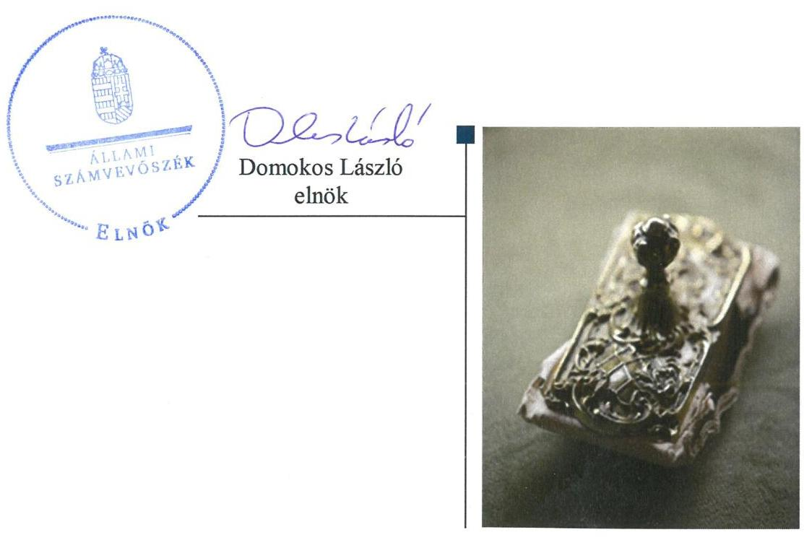
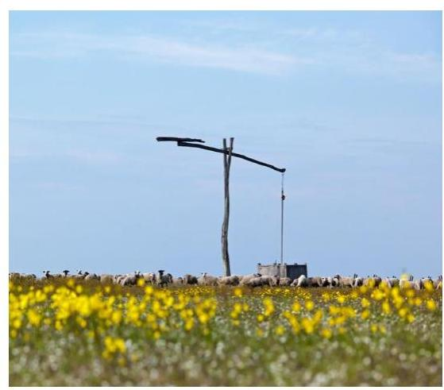

ÁLLAMI
SZÁMVEVŐSZÉK

# Jelentés 

## Központi költségvetési szervek ellenőrzése

Hortobágyi Nemzeti Park Igazgatóság 2019.

---

# Jelenetés 

## Központi költségvetési szervek ellenőrzése

Hortobágyi Nemzeti Park Igazgatóság
2019. 12. hó 20. nap

---

# AZ ELLENŐRZÉST FELÜGYELTE:

- **SALAMON ILDIKÓ** felügyeleti vezető

- **AZ ELLENŐRZÉST VEZETTE ÉS A VÉGREHAJTÁSÁÉRT FELELŐS:**

  - **PETŐ KRISZTINA** ellenőrzésvezető
  - **A PROGRAM ÖSSZEÁLLÍTÁSÁÉRT FELELŐS:**

    - **TÓTPÁL SZABOLCS** osztályvezető

    - **IKTATÓSZÁM:** EL-2340-001/2019.
    - **TÉMASZÁM:** 2479
    - **ELLENŐRZÉS-AZONOSÍTÓ SZÁM:** V079121

Jelentéseink az Országgyűlés számítógépes hálózatán és az Interneta a www.asz.hu címen is olvashatóak.

---

# TARTALOMJEGYZÉK 

■ ÖSSZEGZÉS ..... 5
■ AZ ELLENŐRZÉS CÉLJA ..... 6
■ AZ ELLENŐRZÉS TERÜLETE ..... 7
■ AZ ELLENŐRZÉS HÁTTERE, INDOKOLTSÁGA ..... 8
■ A JELENTÉS LÉNYEGES KÉRDÉSKÖREI ..... 9
■ AZ ELLENŐRZÉS HATÓKÖRE ÉS MÓDSZEREI ..... 10
■ MEGÁLLAPÍTÁSOK ..... 13
■ JAVASLATOK ..... 16
■ MELLÉKLETEK ..... 19
I. sz. melléklet: Értelmező szótár ..... 19
■ FÜGGELÉK: ÉSZREVÉTELEK ..... 23
■ RÖVIDÍTÉSEK JEGYZÉKE ..... 29

---

.

---

# ÖSSZEGZÉS 

A debreceni székhelyű Hortobágyi Nemzeti Park Igazgatóság belső kontrollrendszere nem biztositotta a közpénzekkel és a nemzeti vagyonnal való szabályszerű gazdálkodást. A pénz-ügyi-számviteli elektronikus információs rendszerből származó adatok megbizhatóságának hiányában az elszámoltathatóság feltételei nem voltak biztositottak. A korrupciós kockázatokkal szembeni védelmet sem biztositották.

## Az ellenőrzés társadalmi indokoltsága

Az államháztartás központi alrendszerének közpénz felhasználása, az intézmények által ellátott közfeladatok sokrétűsége, valamint a feladatellátásához rendelt vagyon nagyságrendje indokolja, hogy az Állami Számvevőszék ellenőrzéseket folytasson a pénzügyi és vagyongazdálkodás területén. Az Állami Számvevőszék az ellenőrzései során feltárja a gazdálkodás esetleges hiányosságait, értékeli a belső kontrollrendszer kialakítása és működtetése szabályszerűségét, rámutathat a vagyongazdálkodási tevékenység - ezen belül a tulajdonosi joggyakorlás és vagyonkezelés - esetleges szabálytalanságaira, értékeli az állami vagyon nyilvántartására és elszámolására vonatkozó eljárásokat. Az ellenőrzés hozzájárulhat a központi intézmények pénzügyi helyzetének pontosabb megítéléséhez, a jó gyakorlat kialakításán és terjesztésén keresztül az ellenőrzéseink elősegíthetik a gazdálkodás szabályszerűségének javítását.

## Főbb megállapítások, következtetések, javaslatok

A Hortobágyi Nemzeti Park Igazgatóságnál a kontrollkörnyezet kialakítása nem volt szabályszerű, így az igazgató nem teremtette meg a szabályszerű gazdálkodás és közpénzfelhasználás feltételeit. Nem működtettek integrált kockázatkezelési rendszert, így nem gondoskodtak a Nemzeti Park tevékenységében, gazdálkodásában rejlő kockázatok felméréséről és ezekhez kapcsolódó intézkedések meghatározásáról. A Nemzeti Park igazgatója nem működtette az információs és kommunikációs rendszert, ezzel nem biztosította, hogy a megfelelő információk a megfelelő időben eljussanak az illetékes szervezethez, szervezeti egységhez, illetve személyhez. A közpénzek védelmét biztosító első védelmi vonalhoz tartozó belső ellenőrzés működtetése sem volt szabályszerű.

A Nemzeti Park a 2015-2017. évi mérleg tételeinek alátámasztásához nem állított össze leltárt. Mindezek alapján a 2015-2017. évi költségvetési beszámolók nem adtak megbízható és valós összképet a Nemzeti Park vagyonáról, eszközeiről és forrásairól, pénzügyi helyzetéről és tevékenysége eredményéről. A számviteli beszámoló adatait magában foglaló pénzügyi-gazdasági elektronikus információs rendszer biztonsági osztályba sorolásának hiánya következtében nem történt meg a rendszer kockázatokkal arányos védelméről való gondoskodás, így nem volt biztosított annak megbízható működése és zártsága, valamint az azokban tárolt adatok védelme, megbízhatósága. Ennek következtében a pénzügyi-gazdasági elektronikus információs rendszerből kinyert adatok nem alkalmasak megbízható és valós összképet biztosító tájékoztatás nyújtására a Nemzeti Park gazdálkodására vonatkozóan. Mindezek alapján nem volt biztosított a pénzügyi- és a vagyongazdálkodás elszámoltathatóságának feltételei.

A Nemzeti Parknál az integritás elvű működést támogató kontrollok nem kerültek kialakításra, így nem volt biztosított a korrupciós kockázatokkal szembeni védelem. A Hortobágyi Nemzeti Park Igazgatóság igazgatója a teljesítmény mérésére alkalmas követelményrendszer kiépítéséről nem gondoskodott, így nem biztosította a szervezet teljesítmény mérésének lehetőségét.

Az Állami Számvevőszék az agrárminiszternek egy, a Hortobágyi Nemzeti Park Igazgatóság igazgatójának 10 javaslatot fogalmazott meg.

---

# AZ ELLENŐRZÉS CÉLJA 

AZ ELLENŐRZÉS CÉLJA annak megítélése volt, hogy a Hortobágyi Nemzeti Park Igazgatóságra vonatkozó irányító szervi feladatellátás a jogszabályi előírások betartásával történt-e; az intézménynél a belső kontrollrendszer kialakítása és múködtetése szabályszerű volte, biztosította-e az átlátható, szabályszerű, gazdaságos, hatékony és eredményes gazdálkodás feltételeit; az intézmény pénzügyi és vagyongazdálkodása megfelelt-e a jogszabályi előírásoknak és belső szabályzatainak. Érvényesült-e a nemzeti vagyon kezelésének és védelmének célja, azaz a szervezet vagyona a közérdeket szolgálta-e a közös szükségletek kielégítése és a természeti erőforrások megóvása, valamint a jövő nemzedékek szükségleteinek figyelembevétele mellett. Az ellenőrzés kiterjedt annak értékelésére is, hogy a központi költségvetési szervnél kiépítették és erősítették-e korrupciós kockázatok kezelését szolgáló integritás kontrollokat, megteremtették-e a teljesítményellenőrzés feltételeit, illetve, hogy az ellenőrzött szervezet gazdálkodása megfelelt-e annak az Alaptörvényben meghatározott alapvetésnek, hogy Magyarország a kiegyensúlyozott, átlátható és fenntartható költségvetési gazdálkodás elvét érvényesíti.

---

# **Hortobágyi Nemzeti Park Igazgatóság**

A debreceni székhelyű Nemzeti Parkot 1973. január 1-jén alapították. Közfeladata természetvédelmi közszolgáltatás és jogszabályban meghatározott közhatalmi tevékenység, fő tevékenysége a környezet- és a természetvédelem. Működési területe Szabolcs-Szatmár-Bereg, Jász-Nagykun-Szolnok és Hajdú-Bihar megyéket, valamint Heves megye Tisza-tavi kis szeletét foglalja magába.

A Nemzeti Park az ellenőrzött időszakban gazdasági szervezettel rendelkező költségvetési szerv volt. Az alapítói, fenntartói és irányítói jogokat a Földművelésügyi Minisztérium, 2018. május 17-től az Agrárminisztérium gyakorolta. A Nemzeti Parkot vezető igazgató és a gazdasági vezető személye az ellenőrzött időszakban a 2015. évben változott. A Nemzeti Parkban dolgozók átlagos statisztikai állományi létszáma a 2015. évben 260 fő volt, ami 2017. évre 261 főre emelkedett. A Nemzeti Park által kimutatott 2017. évben teljesített összes bevétel meghaladta a 7500,0 millió forint volt, míg a teljesített összes kiadás meghaladta a 3700,0 millió forintot. A Nemzeti Park által kimutatott vagyon a 2017. év végére több mint 40 000,0 millió forint volt.

A Nemzeti Parknál a 2015-2017. években szervezeti, szerkezeti átalakítás nem történt.

---

# AZ ELLENŐRZÉS HÁTTERE, INDOKOLTSÁGA 

Az államháztartás központi alrendszerének közpénz felhasználása, az intézmények által ellátott közfeladatok sokrétűsége, valamint a feladatellátásához rendelt vagyon nagyságrendje indokolja, hogy az ÁSZ² ellenőrzéseket folytasson a pénzügyi és vagyongazdálkodás területén.

Az ÁSZ az ellenőrzései során feltárja a gazdálkodást, a központi alrendszer intézményei átalakulását, átszervezését érintő szabályozások esetleges hiányosságait, a szabályozással nem érintett gazdálkodási területeket, rámutathat a vagyongazdálkodási tevékenység - ezen belül a tulajdonosi joggyakorlás és vagyonkezelés - esetleges szabálytalanságaira, értékeli az állami vagyon nyilvántartására és elszámolására vonatkozó eljárásokat.

Az ellenőrzés várhatóan hozzájárul a központi intézmények pénzügyi helyzetének pontosabb megítéléséhez, és a jó gyakorlat kialakításán és terjesztésén keresztül az ellenőrzések elősegíthetik a gazdálkodás szabályszerűségének javítását.

---

# A JELENTÉS LÉNYEGES KÉRDÉSKÖREI 

1. A Nemzeti Parkra vonatkozó irányító szervi feladatellátás szabályszerű volt-e?
2. A Nemzeti Parknál a belső kontrollrendszer kialakítása és müködtetése szabályszerű volt-e?
3. A Nemzeti Park pénzügyi és vagyongazdálkodása szabályszerű volt-e?
4. A Nemzeti Parknál kialakították-e a teljesítmény mérésére alkalmas követelményeket?

---

# AZ ELLENŐRZÉS HATÓKÖRE ÉS MÓDSZEREI 

## Az ellenőrzés típusa

Megfelelőségi ellenőrzés.

## Az ellenőrzött időszak

Az ellenőrzött időszak a 2015-2017. évek.

## Az ellenőrzés tárgya

Az ellenőrzött szervezetre vonatkozó irányító szervi feladatok ellátása a 2015-2016. években. A központi költségvetési szerv belső kontrollrendszerének kialakítása és működtetése és vagyongazdálkodása a 2015-2017. években. A központi költségvetési szerv pénzügyi gazdálkodása a 20152016. években. A központi költségvetési szervnél az integritáskontrollok kiépítettsége, az integritás szemlélet érvényesülése, a teljesítményellenőrzés feltételei a 2017. évben.

A központi költségvetési szerv vagyongazdálkodási feltételeinek kialakítása, annak szabályszerűsége, az elszámoltathatóság biztosítása a szabályozás szintjén. Az intézménynél hozott vagyonváltozást eredményező döntések, a vagyonban bekövetkezett változások végrehajtásának, nyilvántartásba vételének, elszámolásának szabályszerűsége. Az intézmény könyveiben, mérlegében kimutatott állami vagyon szabályszerűsége, ennek keretében az állami vagyonnal történő rendelkezés, a vagyonmozgások, a vagyon nyilvántartásba vétele, értékelése és a mérleg alátámasztás szabályszerűsége.

## Az ellenőrzött szervezet

Hortobágyi Nemzeti Park Igazgatóság és az irányító szervi feladatokat ellátó Agrárminisztérium.

## Az ellenőrzés jogalapja

Az ellenőrzés jogszabályi alapját az ÁSZ tv. ${ }^{3} 1$. § (3) bekezdés, 5. § (2)-(4) és (6) bekezdései, valamint az Áht. ${ }^{4} 61 . \S$ (2) bekezdésének előírásai képezték.

---

# Az ellenőrzés módszerei 

Az ÁSZ az ellenőrzést a szakmai program szempontjai, az ellenőrzött időszakban hatályos jogszabályok, az ellenőrzés szakmai szabályai, a jelen ellenőrzésre irányadó ÁSZ módszertanok figyelembevételével végezte.

Az ÁSZ az ellenőrzés ideje alatt a Nemzeti Parkkal és az Irányító szervvel ${ }^{5}$ történő kapcsolattartást az ÁSZ SZMSZ ${ }^{6}$-ének vonatkozó előírásai alapján biztosította.

Az ellenőrzési kérdések megválaszolásához szükséges bizonyítékok megszerzése a Nemzeti Park és az Irányító szerv által rendelkezésre bocsátott dokumentumokra, adatokra alapozva megfigyelés, szemle (szemrevételezés), kérdésfeltevés (információkérés), valamint elemző eljárás útján történt. Az ellenőrzési bizonyítékként felhasználható adatforrások közé tartozott egyrészt a szakmai program részletes szempontjainál felsorolt adatforrások, másrészt minden egyéb - az ellenőrzés folyamán feltárt, az ellenőrzés szempontjából információt tartalmazó - dokumentum.

Az ellenőrzés lefolytatásához a Nemzeti Park a tanúsítványok kitöltésével, valamint az ÁSZ által kért dokumentumok megküldésével, az Irányító szerv az ÁSZ által kért dokumentumok megküldésével szolgáltatott adatokat, amelyek valódiságát és teljes körűségét az ellenőrzött szervezet vezetője által tett teljességi és hitelességi nyilatkozat igazolta.

Az ellenőrzés kiterjedt minden olyan körülményre és adatra, amely az ÁSZ jogszabályban meghatározott feladatainak teljesítéséhez, valamint a program végrehajtása folyamán felmerült újabb összefüggések feltárásához szükséges volt.

A számvevőszéki jelentésben foglalt megállapítások, következtetések alátámasztására, az elegendő és megfelelő bizonyíték megszerzése érdekében az ÁSZ - módszertani eljárásaiban foglaltaknak eleget téve - értékelte a megszerzett ellenőrzési bizonyítékok forrását és jellegét. Mérlegelte továbbá az ellenőrzési bizonyítékként felhasználandó információ relevanciáját és megbízhatóságát. Az ellenőrzöttek által rendelkezésre bocsátott adatok, információk megfelelőségének - vagyis tárgyhoz tartozóságának, helytállóságának és megbízhatóságának - kontrollja az ellenőrzés keretében történt.

A nemzeti park igazgatóságok pénzügyi-gazdasági elektronikus információs rendszereiben kezelt, az ellenőrzés rendelkezésére bocsátott adatok, információk megbízhatóságának kontrollja céljából az ÁSZ független hivatalos forrásból, a Nemzetbiztonsági Szakszolgálat Nemzeti Kibervédelmi Intézettől, mint a jogszabály által kijelölt hatóságtól kért adatokat. Az adatbekérés a nemzeti park igazgatóságok pénzügyi-gazdasági elektronikus információs rendszerei biztonsági osztályba sorolását tartalmazó és azt igazoló dokumentumokra terjedt ki.

Az állami és önkormányzati szervek elektronikus információbiztonságáról szóló 2013. évi L. törvény előírásai biztosítják az elektronikus információs rendszerekben kezelt adatok és információk bizalmasságának, sértetlenségének és rendelkezésre állásának, valamint ezek rendszerelemei sértetlenségének és rendelkezésre állásának zárt, teljes körű, folytonos és a kockázatokkal arányos védelmét. A kockázatokkal arányos védelmi szint kialakítása érdekében az elektronikus információs rendszereket biztonsági

---

osztályba kell sorolni, amelyet az adott szerv vezetője hagy jóvá és az informatikai biztonsági szabályzatban kell rögzíteni, amelyet meg kell küldeni az NKI ${ }^{2}$ részére.

Az ellenőrzés során ezért az ÁSZ értékelte azt is, hogy biztosított volt-e az ellenőrzéshez rendelkezésre bocsátott adatok származási helyének, a pénzügyi-gazdasági elektronikus információs rendszer sértetlenségének alapfeltétele, annak biztonsági osztályba sorolása.

Amennyiben nem történt meg a pénzügyi-gazdasági elektronikus információs rendszer biztonsági osztályba sorolása, és ennek következményeként nem volt biztosított az abban kezelt adatok és információk sértetlenségének zárt, teljes körű, folytonos és a kockázatokkal arányos védelme, abban az esetben a megbízható adatok hiányával érintett területeket az ÁSZ úgy értékelte, hogy nem állnak rendelkezésre az ellenőrzés részletes lefolytatásához a megfelelő ellenőrzési bizonyítékok

A Nemzeti Park belső kontrollrendszere jogszabályi előírások szerinti kialakítása és működtetése szabályszerűségének értékelése az erre irányuló kérdésekre adott válaszok összesítése alapján, évente pillérenként (kontrollterületenként) és összesítetten történt. A belső kontrollrendszer egyes pilléreinek kialakítása „szabályszerü", amennyiben az értékelt területen az „igen" válaszok százalékban kifejezett, egész számra kerekített aránya legalább 85\%, „nem szabályszerű", ha nem érte el a 85\%-ot. A kontrollrendszer egésze esetében a „szabályszerü" értékelésnek a \%-os értéken felül további feltétele volt, hogy egyik kontrollterület sem kaphatott „nem szabályszerű" értékelést.

---

# 1. A Nemzeti Parkra vonatkozó irányító szervi feladatellátás szabályszerű volt-e? 

## Összegző megállapítás

A Nemzeti Parkra vonatkozó irányító szervi feladatellátás a 2015-2016. években nem volt szabályszerű.

Az Irányító szerv munkáltatói jogosultságát nem szabályszerűen gyakorolta. Az Értékelő vezető ${ }^{8}$ - a 10/2013. (I. 21.) Korm. rendelet ${ }^{9}$ 6. § (1) bekezdésének a) pontjának és (2) bekezdésének előírása ellenére - nem határozta meg félévente az igazgató egyéni teljesítménykövetelményeit. Továbbá az Értékelő vezető a 10/2013. (I. 21.) Korm. rendelet 12. § (1) bekezdésben foglalt előírások ellenére nem értékelte félévente az igazgató teljesítményét.

Az Ávr. ${ }^{10}$ 153. § (4) bekezdésének előírása ellenére az Irányító szerv nem gondoskodott a Nemzeti Park költségvetési maradványának megállapításáról.

## 2. A Nemzeti Parknál a belső kontrollrendszer kialakítása és müködtetése szabályszerű volt-e?

## Összegző megállapítás

2.1. számú megállapítás

A Nemzeti Park belső kontrollrendszerének kialakítása és müködtetése a 2015-2017. években nem volt szabályszerű.

A kontrollkörnyezet kialakítása 2015-2017. években nem volt szabályszerű.

A Nemzeti Park igazgatója 2016. október 1-jétől 2017. év végéig - a Bkr. ${ }^{11}$ 6. § (4) bekezdés előírása ellenére - nem szabályozta az integrált kockázatkezelés eljárásrendjét, valamint a szervezeti integritást sértő események kezelésének eljárásrendjét.

A 2015-2016. években a Nemzeti Park nem rendelkezett - az Áhsz. 39. § (1) bekezdésében és a 14. melléklet II. 4. pontjában foglalt előírások ellenére - kötelezettségvállalások nyilvántartásával.

Az igazgató 2015-2016. években - az Info tv. ${ }^{12}$ 30. § (6) bekezdésében, illetve az Ávr. 13. § (2) bekezdés h) pontjában foglaltak ellenére - nem szabályozta a közérdekú adatok megismerésére irányuló igények teljesítésének rendjét. Az igazgató 2015-2017. szeptember 30. között nem szabályozta továbbá az Ávr. 13. § (2) bekezdés h) pontjában foglaltak ellenére a kötelezően közzéteendő adatok nyilvánosságra hozatalának rendjét. Ezt követően a szabályozás megtörtént.

A 2015-2017. években a Nemzeti Park az Ltv. ${ }^{13}$ 10. § (1) bekezdés b) pontjában rögzítettek ellenére az ellenőrzött időszakban nem rendelkezett

---

a Magyar Nemzeti Levéltár, az illetékes szaklevéltár és a miniszter egyetértésével kiadott iratkezelési szabályzattal.

A Nemzeti Park igazgatója nem alakított ki olyan kontrollkörnyezetet a Bkr. 6. § (1) bekezdés c) pontjában foglaltak ellenére, amelyben meghatározottak az etikai elvárások a szervezet minden szintjén.

A Nemzeti Park rendelkezett a jogszabály szerinti Alapító Okirat ${ }_{1,2}$-vel ${ }^{14}$ és SZMSZ-szel ${ }^{15}$. A szervezeti kereteket meghatározó SZMSZ a Vnytv. ${ }^{16}$ előírásai szerint feltüntette a vagyonnyilatkozat-tételi kötelezettséggel járó munkaköröket.
2.2. számú megállapítás

# A kockázatkezelési, integrált kockázatkezelési rendszert 20152017. években nem múködtették. 

A Nemzeti Park igazgatója a Bkr. 7. § (1) bekezdése ellenére nem múködtette 2015. január 1-jétől a kockázatkezelési rendszert, 2016. október 1jétől 2017. év végéig az integrált kockázatkezelési rendszert.

## 2.3. számú megállapítás

## A kontrolltevékenység gyakorlása a 2015-2017. években nem volt szabályszerű.

A kontrolltevékenységek gyakorlása a pénzügyi és vagyongazdálkodás fejezetben szereplő, az adatok megbízhatóságára vonatkozó megállapítások alapján nem volt szabályszerű.

## Az információs és kommunikációs rendszert a 2015-2017. években nem múködtették.

A Nemzeti Park igazgatója a Bkr. 9. § (1) bekezdésben foglaltak ellenére az információs és kommunikációs rendszert nem múködtette.

## A monitoring rendszer múködtetése a 2015-2017. években nem volt szabályszerű.

A Nemzeti Park igazgatója a Bkr. 10. §-ban rögzítettek ellenére 2016. szeptember végéig nem alakította ki a szervezet tevékenységének, a célok megvalósításának nyomon követését biztosító rendszert. 2016 októberétől az igazgató a Bkr. 10. §-ban foglaltak ellenére nem alakított ki az operatív tevékenységek keretében megvalósuló folyamatos és eseti nyomon követést, illetve a kialakított belső ellenőrzéssel nem biztosította a szervezet tevékenységének, a célok megvalósításának nyomon követését.

A belső ellenőrzési vezető a Bkr. 50. § (1) bekezdése előírásai ellenére az elvégzett belső ellenőrzésekről nyilvántartást a 2015-2016. években nem vezetett. 2017-ben a Nemzeti Park igazgatója nem gondoskodott a külső ellenőrzések Bkr. 14. § (1) bekezdése által előírt nyilvántartásáról.

A Nemzeti Park igazgatója az ellenőrzött időszak minden évében értékelte a Bkr. 11. § (1) bekezdés és a Bkr. 1. melléklet szerinti vezetői nyilatkozatban a belső kontrollrendszer minőségét, amely értékeléseket a jelen ellenőrzés során feltártak nem igazoltak. Az igazgató nem küldte meg a vezetői nyilatkozatokat - a Bkr. 11. § (2) bekezdésében foglaltak ellenére az ellenőrzött években az éves költségvetési beszámolókkal egyidejűleg az Irányító szervnek.

A Nemzeti Parknál az integritás kontrollok kiépítése és múködtetése nem volt szabályszerű. A Nemzeti Parknál rendszerszerű kockázatelemzést

---

nem végeztek, a szervezeten kívülről érkező panaszokat és közérdekű bejelentéseket kezelő rendszert, valamint egyéni teljesítményértékelési rendszert nem működtettek. Nem működtettek integritást erősítő kontrollokat.

# 3. A Nemzeti Park pénzügyi és vagyongazdálkodása szabályszerű volt-e? 

## Összegző megállapítás A pénzügyi- és vagyongazdálkodás nem volt szabályszerű.

A Nemzeti Park - a Számv. tv. 69. § (1) bekezdésében és az Áhsz. 22. § (1) bekezdésében foglaltak ellenére - a 2015-2017. évi mérleg tételeinek alátámasztásához nem állított össze leltárt, amely tételesen, ellenőrizhető módon tartalmazza a mérleg fordulónapján meglévő eszközeit és forrásait mennyiségben és értékben.

A Nemzeti Park az ellenőrzött időszakban - az Ibtv. ${ }^{17}$ 7. § (1) bekezdés és 7. § (11) bekezdés f) pontban foglaltak ellenére - nem rendelkezett informatikai biztonsági szabályzattal, továbbá nem végezték el a pénzügyigazdasági elektronikus információs rendszer biztonsági osztályba sorolását. Az Ibtv.-ben előírt biztonsági osztályba sorolás elmaradásával nem biztosították a pénzügyi-gazdasági elektronikus információs rendszerben tárolt adatok megbízhatóságát. Az Ibtv.-ben előírt biztonsági osztályba sorolás elmaradása miatt nem volt biztosított a pénzügyi-gazdasági elektronikus információs rendszerben tárolt és az abból kinyert adatok megbízhatósága.

## 4. A Nemzeti Parknál kialakították-e a teljesítmény mérésére alkalmas követelményeket?

Összegző megállapítás A Nemzeti Park igazgatója nem alakította ki a teljesítmény mérésére alkalmas követelményeket 2017-ben.

Az igazgató nem alakította ki 2017-ben a szervezeti célok elérését szolgáló feladatok, folyamatok, tevékenységek mérésére szolgáló indikátorokat, mérőszámokat, feladat- és teljesítménymutatókat.

---

# JAVASLATOK 

Az ÁSZ tv. 33. § (1) bekezdésében foglaltak értelmében az ellenőrzött szervezet vezetője köteles a jelentésben foglalt megállapításokhoz kapcsolódó intézkedési tervet összeállítani és azt a jelentés kézhezvételétől számított 30 napon belül az ÁSZ részére megküldeni. Amennyiben az ellenőrzött szervezet vezetője nem küldi meg határidőben az intézkedési tervet, vagy továbbra sem elfogadható intézkedési tervet küld, az Állami Számvevőszék elnöke az ÁSZ tv. 33. § (3) bekezdése a) és b) pontjaiban foglaltakat érvényesítheti.

## az agrárminiszternek

1. Tegyen intézkedéseket a feltárt hiányosságok és/vagy szabálytalanságok tekintetében a munkajogi felelősség tisztázására irányuló eljárás megindításáról, és ennek eredménye ismeretében tegye meg a szükséges intézkedéseket.
(2.1. sz. megállapítás 1, 4-5. bekezdése, 2.2. sz. megállapítás, 2.5. sz. megállapítás 3. bekezdése, 3. sz. megállapítás alapján)

## a Hortobágyi Nemzeti Park Igazgatóság igazgatójának

1. Intézkedjen a jogszabályi előirásoknak megfelelően az integrált kockázatkezelés eljárásrendjének, valamint a szervezeti integritást sértő események kezelése eljárásrendjének szabályozására.
(2.1. sz. megállapítás 1. bekezdése alapján)
2. Intézkedjen a jogszabály szerinti iratkezelési szabályzat kiadásáról.
(2.1. sz. megállapítás 4. bekezdése alapján)
3. Intézkedjen a jogszabályi előirásoknak megfelelően olyan kontrollkörnyezet kialakítására, amelyben meghatározottak, ismertek és elfogadottak az etikai elvárások a szervezet minden szintjén.
(2.1. sz. megállapítás 5. bekezdése alapján)
4. Intézkedjen a jogszabályi előirásoknak megfelelően az integrált kockázatkezelési rendszer müködtetésére.
(2.2. sz. megállapítás alapján)

---

5. Intézkedjen a jogszabályi előírásoknak megfelelően az információs és kommunikációs rendszer müködtetésére.
(2.4. sz. megállapítás alapján)
6. Intézkedjen a szervezet tevékenységének, a célok megvalósításának nyomon követésére.
(2.5. sz. megállapítás 1. bekezdés 2. mondata alapján)
7. Gondoskodjon a Bkr. szerinti nyilvántartás vezetéséről.
(2.5. sz. megállapítás 2. bekezdés 2. mondata alapján)
8. Intézkedjen a Bkr.-ben foglalt előírásnak megfelelően a belső kontrollrendszer minőségének értékeléséről szóló vezetői nyilatkozat éves költségvetési beszámolóval együtt történő megküldéséről az irányítószerv részére.
(2.5. sz. megállapítás 3. bekezdés 2. mondata alapján)
9. Intézkedjen a jogszabályi előírásoknak megfelelő leltár összeállitására.
(3. sz. megállapítás 1. bekezdése alapján)
10. Intézkedjen a jogszabályi előírásoknak megfelelően
a) informatikai biztonsági szabályzat elkészitésére;
b) a pénzügyi-gazdasági elektronikus információs rendszer biztonsági osztályba sorolásáról.
(3. sz. megállapítás 2. bekezdése alapján)

---

.

---

# MELLÉKLETEK 

- I. SZ. MELLÉKLET: ÉRTELMEZŐ SZÓTÁR
állami vagyon
állami vagyonnak minősül:
a) az állam tulajdonában lévő dolog, valamint a dolog módjára hasznosítható természeti erő,
b) az a) pont hatálya alá nem tartozó mindazon vagyon, amely vonatkozásában törvény az állam kizárólagos tulajdonjogát nevesíti,
c) az állam tulajdonában lévő tagsági jogviszonyt megtestesítő értékpapír, illetve az államot megillető egyéb társasági részesedés,
d) az államot megillető olyan immateriális, vagyoni értékkel rendelkező jogosultság, amelyet jogszabály vagyoni értékű jogként nevesít. (Forrás: Vtv. 1. § (2) bekezdése)
állami vagyon használója Az a természetes vagy jogi személy, jogi személyiséggel nem rendelkező szervezet, aki, vagy amely törvény vagy szerződés alapján, bármely jogcímen (bérlet, haszonbérlet, használat stb.) állami vagyont birtokol, használ, szedi annak hasznait, hasznosít, ide nem értve a haszonélvezőt, a vagyonkezelőt és a tulajdonosi jogok gyakorlóját. (Forrás: Vtv. ${ }^{18}$ 1. § (7) bekezdés a) pontja)
állami vagyon hasznosítása Az állami vagyont az MNV Zrt. maga kezeli, vagy szerződés - így különösen bérlet, haszonbérlet, megbízás - alapján központi költségvetési szervnek, természetes vagy jogi személynek, vagy jogi személyiséggel nem rendelkező gazdálkodó szervezetnek hasznosításra átengedi.
(Forrás: Vtv. 23. § (1) bekezdése, hatályos 2012. január 1-jétől)
Az állami vagyonnal a tulajdonosi joggyakorló maga gazdálkodik, vagy szerződés így különösen bérlet, haszonbérlet, megbízás - alapján hasznosításra átengedi, illetőleg vagyonkezelésbe, haszonélvezetbe adja. (Forrás: Vtv. 23. § (1) bekezdése, hatályos 2013. június 28 -ától)
Az állami vagyont az MNV Zrt. maga kezeli, vagy szerződés - így különösen bérlet, haszonbérlet, megbízás - alapján központi költségvetési szervnek, természetes vagy jogi személynek, vagy jogi személyiséggel nem rendelkező gazdálkodó szervezetnek hasznosításra átengedi." Az állami vagyonra vonatkozóan az MNV Zrt. kizárólag az Nvtv.-ben meghatározott személyekkel köthet vagyonkezelési szerződést. (Forrás: Vtv. 27. § (1) bekezdése, hatályos 2012. január 1-jétől)
Az ÁSZ 2011-ben indította el a közintézmények integritását vizsgáló és fejlesztő kérdőíves kutatását, melynek hétéves felmérési időszaka 2017. évben zárult le. Az ÁSZ az Integritás felmérés keretében 2017. évben hetedik alkalommal értékelte a közszféra intézményeinek korrupciós kockázatait, illetve a korrupció ellen védelmet biztosító kontrollok kiépítettségét. (Forrás: https://asz.hu/tanulmanyok-2017-ev Elemzés a közszféra integritás helyzetéről 2017. Vezetői összefoglaló 4. oldal)
ÁSZ Integritás Projekt
átalakítás
belső ellenőrzés

A költségvetési szerv általános jogutódlással történő megszüntetése átalakítással történhet. Az átalakítás lehet egyesítés vagy különválás. Az egyesítés lehet beolvadás vagy összeolvadás. (2014. december 31-ig, Áht. 9/A. § (3) és (4) bekezdés, 2015. január 1-jétől Áht. 11. § (2) bekezdés)
Független, tárgyilagos bizonyosságot adó és tanácsadó tevékenység, amelynek célja, hogy az ellenőrzött szervezet működését fejlessze és eredményességét növelje, az ellenőrzött szervezet céljai elérése érdekében rendszerszemléletű megközelítéssel és módszeresen értékeli, illetve fejleszti az ellenőrzött szervezet irányítási és belső kontrollrendszerének hatékonyságát. (Forrás: Bkr. 2. § b) pontja)

---

belső kontrollrendszer

Belső kontrollrendszer területei
ellenőrzési nyomvonal
hasznosítás
információs és kommunikációs rendszer
integritás
integrált kockázatkezelési rendszer
irányító szerv/felügyeleti szerv
kockázat
kockázatkezelési rendszer
kontrollkörnyezet

A belső kontrollrendszer a kockázatok kezelése és tárgyilagos bizonyosság megszerzése érdekében kialakított folyamatrendszer, amely azt a célt szolgálja, hogy a múködés és gazdálkodás során a tevékenységeket szabályszerűen, gazdaságosan, hatékonyan, eredményesen hajtsák végre, az elszámolási kötelezettségeket teljesítsék, megvédjék az erőforrásokat a veszteségektől, károktól és nem rendeltetésszerű használattól. (Forrás: Áht. 69. § (1) bekezdése)
A kontrollkörnyezet, a kockázatkezelési rendszer, a kontrolltevékenységek, az információs és kommunikációs rendszer, valamint a nyomon követési (monitoring) rendszer. (Forrás: Bkr. 3. §-a)
Az ellenőrzési nyomvonal a költségvetési szerv működési folyamatainak szöveges, táblázatokkal vagy folyamatábrákkal szemléltetett leírása, amely tartalmazza különösen a felelősségi és információs szinteket és kapcsolatokat, irányítási és ellenőrzési folyamatokat, lehetővé téve azok nyomon követését és utólagos ellenőrzését. (Forrás: Bkr. 6. § (3) bekezdés)
A nemzeti vagyon birtoklásának, használatának, hasznok szedése jogának bármely a tulajdonjog átruházását nem eredményező - jogcímen történő átengedése, ide nem értve a vagyonkezelésbe adást, valamint a haszonélvezeti jog alapítását. (Forrás: Nvtv. 3. § (1) bekezdés 4. pontja)
A költségvetési szerv vezetője által kialakított és múködtetett olyan rendszer, mely biztosítja, hogy a megfelelő információk a megfelelő időben eljutnak az illetékes szervezethez, szervezeti egységhez, illetve személyhez. (Forrás: Bkr. 9. § (1) bekezdés)
Az integritás - egyik gyakran használt jelentése szerint - az elvek, értékek, cselekvések, módszerek, intézkedések konzisztenciáját jelenti, vagyis olyan magatartásmódot, amely meghatározott értékeknek megfelel. Integritás-irányítási rendszer bevezetése a szervezetben a szervezethez rendelt közfeladatok integritás szempontú ellátását, az érték alapú múködéssel (integritással) összefüggő szervezeti követelmények következetes érvényesítését jelenti. (Forrás: Nemzetgazdasági Minisztérium: Államháztartási Belső Kontroll Standardok és Gyakorlati Útmutató 1.6. Etikai értékek és integritás 46. oldal, 2017. szeptember)
Olyan folyamatalapú kockázatkezelési rendszer, amely a szervezet minden tevékenységére kiterjed, egységes módszertan és eljárások alkalmazásával, a szervezet célkitűzéseinek és értékeinek figyelembevételével biztosítja a szervezet kockázatainak teljes körű azonosítását, azok meghatározott kritériumok szerinti értékelését, valamint a kockázatok kezelésére vonatkozó intézkedési terv elkészítését és az abban foglaltak nyomon követését. (Forrás: Bkr. 2. § m) pontja, 2016. október 1-jétől) A költségvetési szerv tekintetében az Áht.-ban meghatározott irányítási hatáskört gyakorló szerv. (Forrás: Áht. 1. § 9. pontja)
A kockázat annak a valószínűségét jelenti, hogy egy vagy több esemény vagy intézkedés nem kívánt módon befolyásolja a rendszer múködését, céljainak megvalósulását. (Forrás: Javaslatok a korrupciós kockázatok kezelésére - Kockázatkezelési és ellenőrzési módszertan 35. oldal, ÁSZ)
Olyan irányítási eszközök és módszerek összessége, melynek elemei a szervezeti célok elérését veszélyeztető tényezők (kockázatok) azonosítása, elemzése, csoportosítása, nyomon követése, valamint szükség esetén a kockázati kitettség mérséklése.(Forrás: Bkr. 2. § m) pontja)
A költségvetési szerv vezetője által kialakított olyan elvek, eljárások, belső szabályzatok összessége, amelyben világos a szervezeti struktúra, a folyamatok átláthatók, egyértelműek a felelősségi, hatásköri viszonyok és feladatok, meghatározottak, ismertek és elfogadottak az etikai elvárások a szervezet minden szintjén, átlátható a humánerőforrás-kezelés. (Forrás: Bkr. 6. § (1) bekezdés)

---

kontrolltevékenységek

közfeladat
maradvány
nyomon követési rendszer (monitoring)
tulajdonosi joggyakorló
vagyongazdálkodás

A költségvetési szerv vezetője által a szervezeten belül kialakított (kontroll) tevékenységek, melyek biztosítják a kockázatok kezelését, hozzájárulnak a szervezet céljainak eléréséhez és erősítik a szervezet integritását. (Forrás: Bkr. 8. § (1) bekezdés) Jogszabályban meghatározott állami vagy önkormányzati feladat, amit az arra kötelezett közérdekből, a jogszabályban meghatározott követelményeknek és feltételeknek megfelelve végez, ideértve a lakosság közszolgáltatásokkal való ellátását, továbbá az állam nemzetközi szerződésekben vállalt kötelezettségeiből adódó közérdekű feladatokat, valamint e feladatok ellátásakor szükséges infrastruktúra biztosítását is. (Forrás: Nvtv. 3. § (1) bekezdés 7. pontja)
A költségvetési év során a bevételek és kiadások különbözete, amely az alaptevékenység bevételei és kiadásai tekintetében a költségvetési maradvány, a vállalkozási tevékenység bevételei és kiadásai tekintetében a vállalkozási maradvány. (Forrás: Áht. 1. § 17. pont)
A költségvetési szerv vezetője köteles kialakítani a szervezet tevékenységének a célok megvalósításának nyomon követését biztosító rendszert, amely az operatív tevékenységek keretében megvalósuló folyamatos és eseti nyomon követésből, valamint az operatív tevékenységektől függetlenül múködő belső ellenőrzésből áll. (Forrás: Bkr. 10. §)
Aki a nemzeti vagyon felett az államot vagy a helyi önkormányzatot megillető tulajdonosi jogok és kötelezettségek összességének gyakorlására jogosult. (Forrás: Nvtv. 3. § (1) bekezdés 17. pontja)

A nemzeti vagyongazdálkodás feladata a nemzeti vagyon rendeltetésének megfelelő, az állam, az önkormányzat mindenkori teherbíró képességéhez igazodó, elsődlegesen a közfeladatok ellátásához és a mindenkori társadalmi szükségletek kielégítéséhez szükséges, egységes elveken alapuló, átlátható, hatékony és költségtakarékos múködtetése, értékének megőrzése, állagának védelme, értéknövelő használata, hasznosítása, gyarapítása, továbbá az állam vagy a helyi önkormányzat feladatának ellátása szempontjából feleslegessé váló vagyontárgyak elidegenítése. (Forrás: Nvtv. 7. § (2) bekezdése)

---

.

---

# FÜGGELÉK: ÉSZREVÉTELEK 

A jelentéstervezetet a Számvevőszék 15 napos észrevételezésre megküldte az ellenőrzött szervezetek vezetőinek az ÁSZ tv. 29. §* (1) bekezdése előírásának megfelelően.

Az agrárminiszter és a Hortobágyi Nemzeti Park Igazgatóság igazgatója a jelentéstervezet megállapításaira írásban észrevételt tett.
Az ÁSZ tv. 29. § (3) bekezdésével összhangban az ÁSZ a Függelékben feltünteti az ellenőrzés megállapításaival kapcsolatban tett, figyelembe nem vett észrevételeket, és megindokolja, hogy azokat miért nem fogadta el.

Az ÁSZ az ellenőrzési megállapításait az ellenőrzött időszakban hatályos jogszabályok és az ellenőrzött szervezet közreműködési kötelezettsége keretében, az ellenőrzött szervezet által rendelkezésre bocsátott, Teljességi és hitelességi nyilatkozattal alátámasztott dokumentumokra alapozva fogalmazta meg. A teljességi és hitelességi nyilatkozatok szerint az ÁSZ részére átadott dokumentumok, adatok megbízhatóak, és a bekért adatokra, dokumentumokra vonatkozóan teljes körű információt tartalmaznak. Az észrevételhez mellékletként csatolt, az ÁSZ részére az adatszolgáltatásra biztosított törvényi határidőn kívül megküldött, utólag rendelkezésre bocsátott dokumentumokat az ÁSZ nem értékelte.

## AGRÁRMINISZTÉRIUM

1) A miniszter észrevételében jelezte, hogy a minisztérium, mint a nemzeti park igazgatóságok irányító szerve, a 10/2013. (I. 21.) Korm. rendelet előírásai szerint minden nemzeti park igazgatóság vezetője esetében meghatározta a teljesítménykövetelményeket, elvégezte a teljesítményértékelést.
Az észrevételt nem fogadtuk el. Az ÁSZ rendelkezésére bocsátott ellenőrzési dokumentumok ismételt felülvizsgálata alapján megállapítást nyert, hogy a Hortobágyi Nemzeti Park Igazgatóság (továbbiakban: HNPI) esetében a dokumentumok az igazgató teljesítményének értékelését a 2015. évre vonatkozóan, az igazgató egyéni teljesítménykövetelményeinek meghatározását pedig a 2015. évre és a 2016. első félévére vonatkozóan nem támasztották alá.
2) A miniszter észrevételében jelezte, hogy a minisztérium gazdasági ügyekért felelős államtitkára a Kormány döntését követően hivatalos ügyiratban minden évben kiértesítette az intézményeket az adott évi kötelezettségvállalással terhelt és a kötelezettségvállalással nem terhelt maradványok nagyságáról.
Az észrevételt nem fogadtuk el. Az ÁSZ rendelkezésére bocsátott ellenőrzési dokumentumok ismételt felülvizsgálata alapján megállapítást nyert, hogy a dokumentumok a HNPI 2015. és 2016. évi maradványának
[^0]
[^0]:    * 29. § (1) Az Állami Számvevőszék az ellenőrzési megállapításait megküldi az ellenőrzött szervezet vezetőjének vagy az általa megbízott személynek, és annak, akinek személyes felelősségét állapította meg.
    (2) Az ellenőrzött szervezet vezetője és a felelősként megjelölt személy az ellenőrzés megállapításaira tizenöt napon belül írásban észrevételt tehet.
    (3) Az Állami Számvevőszék az észrevételre a beérkezésétől számított harminc napon belül írásban válaszol. A figyelembe nem vett észrevételeket köteles a jelentésben feltüntetni, és megindokolni, hogy azokat miért nem fogadta el.

---

megállapítását nem támasztották alá. Az adatszolgáltatás során feltöltött dokumentumok a 2015. és a 2016. évre vonatkozóan egy-egy előadói ívvel ellátott levélminták, amelyeknek tárgya „az FM intézményeinek értesítése a 2015. évi/2016. évi maradványok jóváhagyásáról" volt.

A levélmintákban intézményként nem a HNPI, hanem iskolák szerepeltek, a maradvány összegek helye kipontozásra került, így azok ellenőrzési bizonyítékként nem értékelhetők. Megbízhatónak tekinti az ÁSZ az ellenőrzés szempontjából azon bizonyítékot, amely kétséget kizáróan bizonyítja a benne foglaltakat. Fentiek alapján a jelentéstervezet megállapításának módosítása nem indokolt.

# HORTOBÁGYI NEMZETI PARK IGAZGATÓSÁG 

## 1) A 2.1. számú megállapítás 1. bekezdésére vonatkozó észrevétel:

Az észrevétel szerint a HNPI belső ellenőre vizsgálta a belső kontrollrendszerre vonatkozó szabályok érvényesülését, a szabályzó rendszer megfelelőségét, és megállapításai alapján a hiányosságok megszüntetésére az intézkedéseket megkezdték. Az igazgató tájékoztatást adott továbbá arról, hogy 2018. július 19. napján az Integritást sértő események kezelésének eljárásrendje, 2018. július 20. napján pedig Integrált kockázatkezelési szabályzat került megalkotásra.
Az észrevétel megerősítette a 2016. október 1-től a 2017. év végéig tartó időszakra vonatkozó ellenőrzési megállapításokat, mivel a költségvetési szervek belső kontrollrendszeréről és belső ellenőrzéséről szóló 370/2011. (XII. 31.) Korm. rendelet (továbbiakban: Bkr.) 2016. október 1-től hatályos 6. § (4) bekezdés előírását követően az igazgató csak 2018. július 19-től szabályozta az Integritást sértő események kezelésének eljárásrendjét és 2018. július 20-tól az Integrált Kockázatkezelési Szabályzat című dokumentumban az integrált kockázatkezelés eljárásrendjét. Az ellenőrzött időszakot követően megtett intézkedések a jelentéstervezet ellenőrzött időszakra megtett megállapítását nem befolyásolja.

## 2) A 2.1. számú megállapítás 2. bekezdésére vonatkozó észrevétel:

Az észrevétel szerint az alkalmazott ügyviteli szoftverrendszer a mellékelt tanúsítványnak megfelelően maradéktalanul megfelel a vonatkozó jogszabályi előírásoknak, így a kötelezettségvállalások nyilvántartása is a jogszabályoknak megfelelő tartalommal történik a rendszerben.

Az ellenőrzéshez a HNPI által rendelkezésre bocsátott 2015-2016. évi nyilvántartás egyik évben sem felelt meg az Áhsz. 14. melléklet II. 4. a), c), e) és g) pontjaiban előírtaknak, mivel azok az a) pontban leírtakkal ellentétesen nem tartalmazták a kötelezettségvállalás, más fizetési kötelezettség sorszámát, az azt tanúsító dokumentum megnevezését, annak keltét és iktatószámát, a pénzügyi ellenjegyzésre vonatkozó adatokat, valamint a c) pontban írtakkal ellentétben nem tartalmazzák a jogosult azonosításához szükséges adatokat. Továbbá az Áhsz. 14. melléklet II. 4 e) pontban leírtakkal ellentétben nem tartalmazták a költségvetési évben a pénzügyi teljesítési határidőket dátum szerint. A nyilvántartások a g) pontban leírtaknak sem tettek eleget, mivel nem tartalmazták az utalványozás Ávr. 59. § (2) bekezdése szerinti dokumentumának azonosításához szükséges adatokat. A megállapítást megerősítette az igazgató 2018. július 23-án tett nyilatkozata, amely szerint a kötelezettségvállalások nyilvántartását a 2018. évben újra szabályozták. A fent leírtak alapján a jelentéstervezet módosítása nem indokolt.

## 3) A 2.1. számú megállapítás 3. bekezdésére vonatkozó észrevétel:

Az észrevétel szerint a HNPI a mindenkor hatályos jogszabályok szerint teljesíti a közérdekű adatigényléseket, továbbá a közérdekű adatigénylések teljesítésének rendjeként 2017. augusztus 1-jén eljárásrend került megalkotásra. Az észrevétel megerősítette a jelentéstervezet közérdekű adatok megismerésére irányuló igények teljesítésének rendje 2015-2016. évek közötti szabályozásának hiányára vonatkozó megállapítását, így a 2.1. számú megállapítás 3. bekezdés 1. mondatának módosítása nem indokolt.

Az észrevétel szerint a HNPI a kötelezően közzéteendő adatokat a hatályos jogszabályok szerint teszi közzé, és aktualizálja, továbbá a kötelezően közzéteendő adatok nyilvánosságra hozataláról az eljárásrend 2017. október 1jei keltezéssel került megalkotásra, amely 2018. június 25. napjával módosításra került. A dokumentumok felülvizsgálata alapján a 2.1. számú megállapítás 3. bekezdés 2. mondatának megállapítását módosítjuk. A 2018. június 26-i keltezésű „Kötelezően közzéteendő adatok rendje_20180626.pdf" elnevezésű dokumentum az

---

ellenőrzött időszakot követően került kiadmányozásra, így a tárgyi ellenőrzés során azt az ÁSZ nem vette figyelembe.

# 4) A 2.1. számú megállapítás 4. bekezdésére vonatkozó észrevétel: 

Az észrevétel szerint a „nemzeti park igazgatóságok nem minősülnek központi államigazgatási szervnek", így azokra nem Ltv. 10. § (1) bekezdés b) pontja, hanem az a) pontja vonatkozik.

Az észrevételt nem fogadtuk el. A környezetvédelmi és természetvédelmi hatósági és igazgatási feladatokat ellátó szervek kijelöléséről szóló 71/2015. (III. 30.) Korm. rendelet 6. § (1) bekezdése szerint a nemzeti park igazgatóságok szervezetrendszere központi hivatalként működő központi költségvetési szerv. A központi államigazgatási szervekről, valamint a Kormány tagjai és az államtitkárok jogállásáról szóló, az ellenőrzött időszakban hatályos 2010. évi XLIII. törvény (továbbiakban: Ksztv.) 1. § (2) bekezdése szerint a központi hivatal központi államigazgatási szerv. A jelenleg hatályos Ksztv. 1. § (2) bekezdés a) pontja alapján a kormányzati igazgatásról szóló 2018. évi CXXV. törvény 2. § (2) bekezdés e) pontja szerint központi államigazgatási szerv a központi hivatal. A Kormány tagjainak feladat- és hatásköréről szóló, 2018. május 21-ig hatályos 152/2014. (VI. 6.) Korm. rendelet 1. melléklet D) pontja, a 2018. május 22-től hatályos 94/2018. (V. 22.) Korm. rendelet 1. melléklet G) pontja a központi államigazgatási szervek között sorolja fel a Nemzeti park igazgatóságokat. Erre tekintettel a HNPI vonatkozásában az Ltv. 10. § (1) bekezdés a) pontjában foglalt kivételi szabály alkalmazandó, vagyis rá a 10. § (1) bekezdés b) pontja alapján fogalmazta meg az ÁSZ a megállapítását.
A HNPI által az ÁSZ részére beküldött 1/2002. számú Igazgatói Utasítás „a Hortobágyi Nemzeti Park Iratkezelési Szabályzata" című dokumentum, valamint a 2015. január 20-i keltezésű dokumentum „a Hortobágyi Nemzeti Park Igazgatóság Egyedi Iratkezelési Szabályzata" az Ltv.) 10. § (1) bekezdés b) pont előírásai ellenére nem tartalmazzák a Magyar Nemzeti Levéltár, az illetékes szaklevéltár és a köziratok kezelésének szakmai irányításáért felelős miniszter egyetértését. A fent leírtak alapján a 2.1. számú megállapítás 4. bekezdés módosítása nem indokolt.

## 5) A 2.1. számú megállapítás 5. bekezdésére vonatkozó észrevétel:

Az észrevétel szerint „...igazgatói intézkedés által 2017. november 01. napján Belső kontrollrendszer kézikönyv és monitoring ellenőrzési terv_2018-2020 és 2018. július 19. napján Etikai Kódex (csatolva) került kibocsátásra."

A HNPI által az ellenőrzés rendelkezésére bocsátott 2017.november 1-jei keltezésű „Belső Kontrollrendszer kézikönyv és monitoring ellenőrzési terv 2018-2020" című dokumentum 3.2. része tartalmaz hivatkozást az Etikai Kódex céljáról, azonban az Etikai kódex 2018. július 23-án, az ellenőrzött időszakot követően került kiadmányozásra („Hortobágyi Nemzeti Park Igazgatóság Etikai Kódex pdf"), így tárgyi ellenőrzés keretében nem lehet bizonyítékként figyelembe venni. A fent leírtak alapján a 2.1. számú megállapítás 5. bekezdés módosítása nem indokolt.

## 6) A 2.2 számú megállapítására vonatkozó észrevétel:

Az észrevétel szerint az Integrált kockázatkezelési szabályzat megalkotásra került, a szabályzat hatályba lépésére tekintettel 2019-ben a kockázatkezelés immár formálisan is szabályozott rendszerét bevezették.

Az ÁSZ az EL-0990-001/2018. iktatószámú adatbekérő levél IV/2./2.2 pontjában a kockázatkezeléssel kapcsolatos dokumentumok a 2015-2016. években, továbbá a V.2.1 pontjában az integrált kockázatkezelési rendszer működtetését igazoló, alátámasztó dokumentumokat a 2017. évre vonatkozóan kérte beküldeni. A HNPI a kockázatkezelési/integrált kockázatkezelési rendszer ellenőrzött időszakra vonatkozó működtetését igazoló dokumentumot az ÁSZ részére nem küldött. Az igazgató 2018. július 25-i keltezésű, nyilatkozata szerint a HNPI belső ellenőre vizsgálta a belső kontrollrendszerre vonatkozó szabályok érvényesülését, és megállapításai alapján a hiányosságok megszüntetésére az intézkedéseket megkezdték, 2018. július 20. napján (az ellenőrzött időszakot követően) pedig Integrált kockázatkezelési szabályzat került megalkotásra. Az ellenőrzési bizonyítékok alapján, a 2.2 számú megállapítás módosítása nem indokolt.

## 7) A 2.3 számú megállapítására vonatkozó észrevétel:

A jelentéstervezet Megállapítások fejezet 2.3. számú megállapítására vonatkozó észrevételt a 3. számú megállapítás 2. bekezdésére vonatkozó észrevétellel együtt kezeljük, tekintettel a számvevőszéki jelentéstervezet 2.3. megállapításában leírtakra, amely szerint a kontrolltevékenységek gyakorlása a pénzügyi és vagyongazdálkodási fejezetben szereplő megállapításokon alapul.

---

# 8) A 2.4 számú megállapítására vonatkozó észrevétel: 

Az észrevételben az igazgató jelezte, hogy a HNPI-nél „az információáramlás rendszerének az alapja a Szervezeti és Müködési Szabályzat. Annak IV. fejezetében rögzítve van, hogy a szervezeti egységek milyen időközönként tartanak - kötelezően - értekezletet. Ezek közül kiemelendő az osztályvezetői értekezletek rendje, az igazgatói értekezletek rendje, és az évente legalább egy alkalommal megtartandó állománygyülések ..." Az igazgató ezt követően részletes tájékoztatást adott az információs rendszer működéséről.
Az ÁSZ az EL-0990-001/2018. iktatószámú adatbekérő levél IV./4./4.2. pontjában a 2015-2016. évekre, továbbá a V./4./2. pontjában a 2017. évre vonatkozó, az információ áramlás rendszere müködtetését igazoló dokumentumokat kérte megküldeni. Az észrevételben hivatkozott 2012. december 20. napjától hatályos „Hortobágyi Nemzeti Park Igazgatóság Szervezeti és Müködési Szabályzata" (továbbiakban: SZMSZ) IV. fejezete a HNPI müködésére vonatkozó eljárási szabályokat határozza meg, a HNPI információs és kommunikációs rendszere 2015-2017. évi müködését nem támasztja alá. A HNPI az információ áramlás rendszere ellenőrzött időszakra vonatkozó működtetését igazoló dokumentumokat az ÁSZ részére nem küldött. Az igazgató 2018. július 24-i keltezésű, nyilatkozata mindössze a HNPI információ áramlás rendszere működtetésére vonatkozó belső szabályzatok elkészítését mutatja be. A tárgyi nyilatkozat 3. oldalán található képernyőkép melléklet a HNPI 20112018. évek közötti vezetői emlékeztetők évenkénti mappa szerkezetét mutatja be, amelyből azonban nem állapítható meg a müködtetés ténye. Mindezek alapján a 2.4. számú megállapítás módosítása nem indokolt.

## 9) A 2.5. számú megállapítás 1. bekezdésére vonatkozó észrevétel:

Az észrevétel szerint „Igazgatóságunk 2016. évben helyezte új rendszerbe és alapokra a szervezet belső ellenőrzését, egy fő külső megbízott révén. A belső ellenőrzés müködését szabályozó Belső Ellenőrzési Kézikönyv felülvizsgálatra került 2016-ban, és 2017-ben is. A rendszer kialakítása a belső kontrollrendszer teljes felülvizsgálatával indult, mely tartalmazta a belső szabályozórendszer felülvizsgálatát is..."

Az ÁSZ az EL-0990-001/2018. iktatószámú adatbekérő levél IV./5./5.4 pontjában a 2015-2016. évekre, továbbá a V./5./2. pontjában a 2017. évre vonatkozó, a szervezeti célok elérését szolgáló követelmények, a folyamatos és eseti nyomon követést biztosító operatív monitoring-feladatok meghatározását tartalmazó dokumentumok, valamint a források szabályszerű, gazdaságos, hatékony és eredményes felhasználását biztosító követelményeket tartalmazó dokumentumokat kérte megküldeni. A dokumentumok felülvizsgálata során az ÁSZ megállapította, hogy az igazgató a szervezet tevékenységének, a célok megvalósításának nyomon követését biztosító rendszer kialakításáról az ellenőrzött időszakban nem gondoskodott, mert erre vonatkozó dokumentumot nem csatolt, csak 2018. július 25-i keltezésű, „NYILATKOZAT az Állami Számvevőszék EL-0990-001/2018. ikt.sz. ellenőrzéséhez kapcsolódó adatbekérési lista IV.5.4. pontjához" című nyilatkozatát. A nyilatkozatban hivatkozott SZMSZ III. fejezete az Igazgatóság vezetőinek és munkatársainak jogállását, IV. fejezete az Igazgatóság működését, V. fejezete az ügyintézés általános szabályait, míg a VI. fejezet a szervezeti egységek feladatát és ügyrendjét mutatja be, amely nem azonos a Bkr. 10. § előírása szerinti követelmények kialakításával. Az észrevételben hivatkozott, a szabályzatok aktualizálását a kontrollkörnyezet értékelésénél, a 2.1. számú megállapítás során figyelembe vettük. A fent leírtak alapján a 2.5. számú megállapítás 1. bekezdés módosítása nem indokolt.

## 10) A 2.5. számú megállapítás 2. bekezdésére vonatkozó észrevétel:

Az észrevétel szerint a HNPI mind az elvégzett belső ellenőrzésekről 2015-2016. években, mind 2017-ben a külső ellenőrzésekről rendelkezett Bkr. 14. § (1) bekezdése által előírt nyilvántartásáról.

A dokumentumok felülvizsgálata alapján, a HNPI által megküldött „2015. évi belső ellenőrzések nyilvántartása pdf." irat a Bkr. 50. § (2) bekezdés d) pontjával ellentétesen nem tartalmazza az ellenőrzés lezárásának időpontját, e) pontjával ellentétben nem tartalmazza az ellenőrzés lefolytatásában részt vett belső ellenőr nevét, továbbá g) pontja ellenére nem tartalmazta, hogy az ellenőrzés esetén felmerült-e az intézkedési terv készítésének szükségessége. A HNPI által megküldött „belső ellenőrzésekkel kapcsolatos int. nyilv.2016.pdf"irat a Bkr. 50. § (2) bekezdés d) pontjával ellentétesen nem tartalmazza az ellenőrzés kezdetének és lezárásának időpontját, e) pontjával ellentétben nem tartalmazza az ellenőrzés lefolytatásában részt vett belső ellenőr nevét, f) pontjával ellentétben a vizsgált időszakot.

---

A HNPI által beküldött „külső ellenőrzések nyilvántartása _2017.pdf" elnevezésű dokumentum nem tartalmazza a 3. tanúsítványon szereplő több, az Európai Támogatásokat Auditáló Főigazgatóság Infrastrukturális Programokat Ellenőrző Igazgatóság ellenőrzését, amelyekre javaslatok is születtek, és intézkedések is történtek. Mindezek alapján a 2.5. számú megállapítás 2. bekezdés módosítása nem indokolt.

# 11) A 2.5. számú megállapítás 3. bekezdésére vonatkozó észrevétel: 

Az észrevétel szerint a Bkr. 11. § (1) bekezdése szerinti vezetői nyilatkozatok minden évben megküldték az Irányító szervnek az éves beszámolókkal egyidejűleg.

Az ellenőrzés rendelkezésére bocsátott dokumentumok szerint az igazgató a Bkr. 11. § (1) bekezdése szerinti nyilatkozatát a Bkr. 11. § (2) bekezdésében foglaltak ellenére az Áhsz. 32. § (1) bekezdésében meghatározott költségvetési évet követő év február 28-i - határidőt követően 2016. április 22-én, 2017. április 20-án, valamint 2018. április 23-án küldte meg az irányító szervnek. Mindezek alapján 2.5. számú megállapítás 3. bekezdés módosítása nem indokolt.

## 12) A jelentéstervezet 2.5. számú megállapítás 4. bekezdésére vonatkozó észrevétel:

Az észrevétel szerint a beérkező panaszok és közérdekű bejelentések kezelésére vonatkozó eljárásrendet a hatályos Szervezeti és Működési Szabályzatunk V. fejezet 17. pontja szabályozza. Az észrevétel hivatkozik továbbá az egyéni teljesítményértékelési rendszer működtetésére, valamint az Integrált kockázatkezelési szabályzat - ellenőrzött időszakon túli - megalkotására.

A dokumentumok felülvizsgálata alapján, a HNPI az ellenőrzött időszakban rendszerszerű kockázatelemzést, kockázatkezelési tevékenységet nem végzett, kockázatkezelési rendszert - a Bkr . 7. § (1)-(2) bekezdésben előírtak ellenére - nem működtetett. Ezt támasztja alá az igazgató 2018. július 25-i keltezésű nyilatkozata, amely szerint az ellenőrzött időszakot követően, 2018. július 19-én került sor a 22/2018. számú utasításában az „Integritást sértő események kezelésének eljárásrendje" című szabályzat kihirdetésére. Az észrevételben hivatkozott, az SZMSZ V. fejezet 17. pontja általános rendelkezéseket tartalmaz. Nem szabályozott a közérdekű bejelentés előterjesztésének, fogadásának, továbbításának, a bejelentő védelmének, a bejelentést követő intézkedés, a beérkezett dokumentumok kezelésének eljárásrendje. A HNPI által beküldött „Nyil_V.6.6..pdf" fájl az igazgató 2018. július 23i keltezésű nyilatkozata a HNPI teljesítményértékelési rendszere időbeli folyamatának bemutatását tartalmazza. A HNPI az egyéni teljesítményértékelési rendszer működtetésről dokumentumokat az ÁSZ részére az adatszolgáltatásra biztosított törvényi határidőben nem küldött be. Mindezek alapján a jelentéstervezet módosítása nem indokolt.

## 13) A 3. számú megállapítás 1. bekezdésére vonatkozó észrevétel:

Az észrevétel szerint a HNPI 2015- 2017. évi mérlegtételeinek alátámasztására leltárt állított össze, amely tételesen és ellenőrizhető módon tartalmazta a mérleg fordulónapján meglévő eszközöket és forrásait mind mennyiségben, mind értékben.

Az ellenőrzés rendelkezésére bocsátott dokumentumok szerint nem készültek mérlegtételeket alátámasztó leltárak a pénzeszközökről, az aktív időbeli elhatárolásokról, az egyéb sajátos eszközoldali elszámolásokról. A HNPI nem készített leltárt a mérleg főösszeg 4,7-5,2 \%-át kitevő passzív időbeli elhatárolásokról sem, amelyek értéke az éves költségvetési beszámolókban 2015. évben 1,6 Mrd Ft, 2016. évben 2,2 Mrd Ft, 2017. évben 2,1 Mrd Ft volt. Fentiek alapján a HNPI nem bocsátott olyan leltár dokumentumot az ÁSZ rendelkezésére, amely az Áhsz. 5. § (1), 22. § (1)(2) bekezdései, valamint a Számv. tv. 69. § (1) bekezdésének megfelelően a mérlegtételeket tételesen, ellenőrizhető módon mennyiségben és értékben alátámasztja. Mindezek alapján a 3. számú megállapítás 1. bekezdés módosítása nem indokolt.

## 14) A 3. számú megállapítás 2. bekezdésére vonatkozó észrevétel:

Az észrevétel szerint HNPI a pénzügyi-gazdasági elektronikus információs rendszerei biztonsági besorolását tartalmazó dokumentumot nem küldte meg a Nemzetbiztonsági Szakszolgálat Nemzeti Kibervédelmi Intézetének, azonban ez nem alapozza meg azt az állítást, hogy az adatok nem állnak rendelkezésre, és a gazdálkodás nem volt szabályszerű. Az észrevétel hivatkozik továbbá a 2013 óta foglalkoztatott kiberbiztonsági felelősre és a 2018-ban kihirdetett Informatikai biztonsági szabályzatra.

---

A HNPI pénzügyi-gazdasági elektronikus információs rendszereiben kezelt, az ÁSZ ellenőrzés rendelkezésére bocsátott adatok, információk megbízhatóságának kontrollja céljából az ÁSZ a Nemzetbiztonsági Szakszolgálat Nemzeti Kibervédelmi Intézettől, mint a jogszabály által kijelölt hatóságtól kért adatokat. A független, hivatalos forrásból bekért adatok kiértékelése alapján az ÁSZ megállapította, hogy a HNPI-nél a pénzügyi-gazdasági elektronikus információs rendszereket - az állami és önkormányzati szervek elektronikus információbiztonságáról szóló 2013. évi L. törvény (továbbiakban: Ibtv.) 7. § (1) bekezdése előírása ellenére - nem sorolták be biztonsági osztályba a bizalmasság, a sértetlenség és a rendelkezésre állás szempontjából. Ennek követeztében a pénzügyigazdasági elektronikus információs rendszerek megbízható működése, zártsága, valamint az azokban kezelt adatok sértetlensége, a kockázatokkal arányos védelme nem volt biztosított, amely miatt a pénzügyi-gazdasági elektronikus információs rendszerekben kezelt adatok nem voltak megbízhatóak.

Az ellenőrzés módszerei között a jelentéstervezetben rögzítésre került, hogy „Amennyiben nem történt meg a pénzügyi-gazdasági elektronikus információs rendszer biztonsági osztályba sorolása, és ennek következményeként nem volt biztosított az abban kezelt adatok és információk sértetlenségének zárt, teljes körű, folytonos és a kockázatokkal arányos védelme, abban az esetben a megbízható adatok hiányával érintett területeket az ÁSZ úgy értékelte, hogy nem állnak rendelkezésre az ellenőrzés részletes lefolytatásához a megfelelő ellenőrzési bizonyítékok." Az ellenőrzés részletes lefolytatásához szükséges bizonyítékok hiánya alapján az értékelendő terület nem szabályszerű minősítést kap.

Az igazgató észrevételében elismerte, hogy a biztonsági besorolást tartalmazó dokumentumot nem küldték meg a Nemzeti Kibervédelmi Intézetnek, továbbá a besorolást - az Ibtv. 7. § (3) bekezdése által előírtak szerint tartalmazó Informatikai biztonsági szabályzatot az ellenőrzött időszakot követően, 2018-ban hirdették ki. Mindezek következtében a 3. számú megállapítás 2. bekezdés módosítása nem indokolt.

# 15) A 4. számú megállapítására vonatkozó észrevétel: 

Az észrevétel szerint a HNPI jogszabályban meghatározott előírások, valamint a belső szabályzatai alapján teljesítménykövetelményi rendszert működtet a kormánytisztviselői tekintetében, továbbá a rendszerben vezetői szintű követelmény-meghatározás zajlik, mely félévente értékelésre kerül, kötött formában működő dokumentálás mellett.

A HNPI adatszolgáltatásában a munkavállalók minősítését összesítő TÉR statisztikai jelentést küldött meg az ellenőrzés részére. Az 1. sz. Tanúsítvány szintén az egyéni teljesítményértékelési rendszer keretében az egyéni kormánytisztviselői követelmények meghatározására, valamint a földhaszonbérlők helyszíni ellenőrzéséről készített jegyzőkönyvre hivatkozik. A HNPI az adatszolgáltatásra biztosított határidőben az ÁSZ részére nem küldött be olyan dokumentumokat, amelyekből megállapítható, hogy 2017-ben kialakította a szervezeti célok elérését szolgáló feladatok, folyamatok, tevékenységek mérésére szolgáló indikátorokat, mérőszámokat, feladat és teljesítménymutatókat. Ennek következtében a 4. számú megállapítás módosítása nem indokolt.

---

# RÖVIDÍTÉSEK JEGYZÉKE 

${ }^{1}$ Nemzeti Park
${ }^{2}$ ÁSZ
${ }^{3}$ ÁSZ tv.
${ }^{4}$ Áht.
${ }^{5}$ Irányító szerv
${ }^{6}$ ÁSZ SZMSZ
${ }^{7}$ NKI
${ }^{8}$ Értékelő vezető
${ }^{9}$ 10/2013. (I. 21.) Korm. rendelet
${ }^{10}$ Ávr.
${ }^{11}$ Bkr.
${ }^{12}$ Info tv.
${ }^{13}$ Ltv.
${ }^{14}$ Alapító Okirat ${ }_{1,2}$
${ }^{15}$ SZMSZ
${ }^{16}$ Vnytv.
${ }^{17}$ Ibtv.
${ }^{18} \mathrm{Vtv}$.

Hortobágyi Nemzeti Park Igazgatóság
Állami Számvevőszék
az Állami Számvevőszékről szóló 2011. évi LXVI. törvény
az államháztartásról szóló 2011. évi CXCV. törvény
Földművelésügyi Minisztérium
az Állami Számvevőszék Szervezeti és Múködési Szabályzata
Nemzetbiztonsági Szakszolgálat Nemzeti Kibervédelmi Intézet
Földművelésügyi Minisztérium személyi teljesítmények értékeléséért felelős vezetője
10/2013. (I. 21.) Korm. rendelet a közszolgálati egyéni teljesítményértékelésről
368/2011. (XII. 31.) Korm. rendelet az államháztartásról szóló törvény végrehajtásáról
370/2011. (XII. 31.) Korm. rendelet a költségvetési szervek belső kontrollrendszeréről és belső ellenőrzéséről
az információs önrendelkezési jogról és az
információszabadságról szóló 2011. évi CXII. törvény
a köziratokról, a közlevéltárakról és a magánlevéltári anyag védelméről szóló 1995. évi LXVI. törvény
Alapító Okirat1: A Hortobágyi Nemzeti Park Igazgatóság Alapító Okirata (hatályos: 2013. június 4-től, kiegészítés hatályos: 2014. január 1-jétől)

Alapító Okirat2: A Hortobágyi Nemzeti Park Igazgatóság Alapító Okirata (hatályos: 2015. december 16-tól)
Hortobágyi Nemzeti Park Igazgatóság Szervezeti Múködési Szabályzata (hatályos: 2012. december 20-tól)
az egyes vagyonnyilatkozat-tételi kötelezettségekről szóló 2007. évi CLII. törvény
az állami és önkormányzati szervek elektronikus információbiztonságáról szóló 2013. évi L. törvény
az állami vagyonról szóló 2007. évi CVI. törvény

---

# ÁLLAMI SZÁMVEVŐSZÉK 

1052 Budapest, Apáczai Csere János utca 10.
Levélcím: 1364 Budapest 4. Pf. 54
Telefon: +36 14849100 Telefax: +36 14849200
www.asz.hu