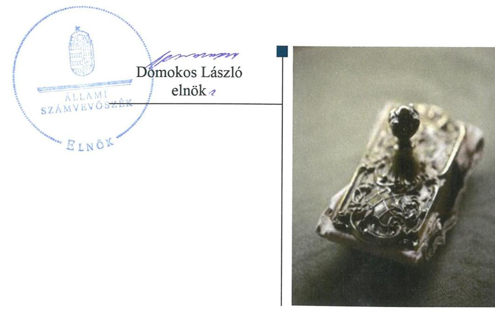
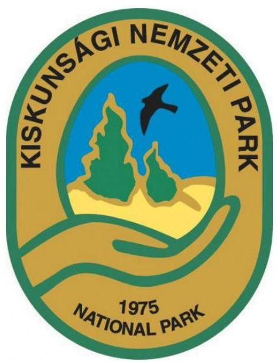

# Jelentés 

## Központi költségvetési szervek ellenőrzése

Kiskunsági Nemzeti Park Igazgatóság 2019.

---

# Jelentés 

## Központi költségvetési szervek ellenőrzése

Kiskunsági Nemzeti Park Igazgatóság
2019. 12. hó 20. nap

---

|  AZ ELLENŐRZÉST FELÜGYELTE: |  |  |  |  |   |
| --- | --- | --- | --- | --- | --- |
|   |  |  |  |  | DR. BENEDEK MÁRIA felügyeleti vezető  |
|   |  |  |  |  | AZ ELLENŐRZÉST VEZETTE ÉS A VÉGREHAJTÁSÁÉRT FELELŐS:  |
|   |  |  |  |  | DR. KOVÁCS DIÁNA ellenőrzésvezető  |
|   |  |  |  |  | A PROGRAM ÖSSZEÁLLÍTÁSÁÉRT FELELŐS:  |
|   |  |  |  |  | TÓTPÁL SZABOLCS osztályvezető  |
|   |  |  |  |  | A TÉMÁHOZ KAPCSOLÓDÓ KORÁBBI SZÁMVEVŐSZÉKI JELENTÉSEK:  |
|   |  |  |  |  | - címe: Jelentés a nemzeti park igazgatóságok feladatellátásának és vagyonkezelésének ellenőrzéséről  |
|   |  |  |  |  | - sorszáma: 12106  |
|  Jelentéseink az Országgyűlés számítógépes hálózatán és az Interneten a www.asz.hu címen is olvashatóak. |  |  |  |  | IKTATÓSZÁM: EL-2362-001/2019  |
|   |  |  |  |  | TÉMASZÁM: 2450  |
|   |  |  |  |  | ELLENŐRZÉS-AZONOSÍTÓ SZÁM: V079117  |

---

# TARTALOMJEGYZÉK 

■ ÖSSZEGZÉS ..... 5
■ AZ ELLENŐRZÉS CÉLJA ..... 7
■ AZ ELLENŐRZÉS TERÜLETE ..... 8
■ AZ ELLENŐRZÉS HÁTTERE, INDOKOLTSÁGA ..... 9
■ A JELENTÉS LÉNYEGES KÉRDÉSKÖREI ..... 11
■ AZ ELLENŐRZÉS HATÓKÖRE ÉS MÓDSZEREI ..... 12
■ MEGÁLLAPÍTÁSOK ..... 15
■ JAVASLATOK ..... 18
■ MELLÉKLETEK ..... 21
I. sz. melléklet: Értelmező szótár ..... 21
■ FÜGGELÉK: ÉSZREVÉTELEK ..... 25
■ RÖVIDÍTÉSEK JEGYZÉKE ..... 33

---

.

---

# ÖSSZEGZÉS 

A Kiskunsági Nemzeti Park Igazgatóság belső kontrollrendszerét nem működtette szabályszerűen, így nem volt biztosított a közpénzekkel, a nemzeti vagyonnal való szabályszerű gazdálkodás. A pénzügyi-számviteli elektronikus információs rendszerből származó adatok megbízhatóságának hiányában az elszámoltathatóság, átláthatóság feltételei nem voltak biztosítottak. Az integritási kontrollok kiépítettsége nem járult hozzá a korrupció kockázatának mérsékléséhez.

## Az ellenőrzés társadalmi indokoltsága

Az Állami Számvevőszék ellenőrzi a költségvetési szervek gazdálkodását, működését, hogy megállapításaival támogassa az ellenőrzött szervezetek szabályszerű gazdálkodását, javaslataival elősegítse az Alaptörvényben ${ }^{1}$ megfogalmazott alapvetések érvényesülését a mindennapi életben a szervezetek szintjén. A központi költségvetés rendszerében zajló folyamatok holisztikus elemzései, a kockázatok folyamatos figyelemmel kísérésének módszerével, az így kiválasztott szervezetek célzott, hatékony ellenőrzéseivel az Állami Számvevőszék betölti a legfőbb gazdasági ellenőrző szerv küldetését. Az ellenőrzések megállapításaival és egy adott időszak ellenőrzési eredményeinek elemzésével az Állami Számvevőszék ráirányíthatja a jogalkotók figyelmét a központi alrendszerben vagy annak egy ágazatában esetlegesen felmerülő pénzügyi, szabályozási hiányosságokra. Az elvégzett ellenőrzések során az Állami Számvevőszék „jó gyakorlatokat" is azonosíthat, melyeket tanácsadó funkciója keretében szélesebb körben is megismertethet az érintettekkel, ezáltal is hozzájárulva a költségvetési rendszer szabályozott, átlátható, kiegyensúlyozott és fenntartható működéséhez.

A Kiskunsági Nemzeti Park Igazgatóság közfeladatot lát el és jelentős területet magában foglaló természetvédelmi területet felügyel, ezáltal állami vagyont kezel. A terület nagysága és kiemelt védettsége a társadalom széles körét érinti, ezért kiemelt fontosságú a szervezet által kezelt nemzeti vagyon, és annak megőrzése.

## Főbb megállapítások, következtetések, javaslatok

A Kiskunsági Nemzeti Park Igazgatóságnál a kockázatkezelési rendszer, illetve 2016. október 1-jétől az integrált kockázatkezelési rendszer terén megállapított szabálytalanságok miatt a belső kontrollrendszer kialakítása és működtetése nem volt szabályszerű, így nem biztosította a közpénzek, a közvagyon szabályos felhasználását.

A Kiskunsági Nemzeti Park Igazgatóság pénzügyi és vagyongazdálkodása az ellenőrzött években nem volt szabályszerű. A 2015-2017. évi mérleg tételeinek alátámasztásához nem állított össze leltárt. Mindezek alapján a 2015-2017. évi költségvetési beszámolók nem adtak megbízható és valós összképet a Kiskunsági Nemzeti Park Igazgatóság vagyonáról, eszközeiről és forrásairól, azok alakulásáról. A számviteli beszámoló adatait magában foglaló pénzügyi-gazdasági elektronikus információs rendszer biztonsági osztályba sorolásának hiánya következtében nem volt biztosított a rendszer kockázatokkal arányos védelme, annak megbízható működése és zártsága, valamint az azokban tárolt adatok védelme, megbízhatósága. Az ellenőrzött években a pénzügyi-gazdasági elektronikus információs rendszerből kinyert adatok ennek következtében nem alkalmasak megbízható és valós összképet biztosító tájékoztatás nyújtására a gazdálkodásra vonatkozóan, így nem voltak biztosítottak a pénzügyi- és a vagyongazdálkodás elszámoltathatóságának a feltételei.

A Nemzeti Park az integritás elvű működést támogató kontrollokat nem a kockázatokkal arányosan alakította ki. Az integritást erősítő kontrollokat alacsony szinten működtette.

A Kiskunsági Nemzeti Park Igazgatóság igazgatója a teljesítmény mérésére alkalmas követelményeket nem alakított ki, a szervezeti célok elérését szolgáló feladatokat nem határozta meg.

---

Az Állami Számvevőszék az intézkedések megtétele céljából az irányítószerv vezetőjeként az agrárminiszter részére egy, a Kiskunsági Nemzeti Park Igazgatóság igazgatója részére nyolc javaslatot fogalmazott meg.

---

# AZ ELLENŐRZÉS CÉLJA

**AZ ELLENŐRZÉS CÉLJA** annak megállapítása volt, hogy a Kiskunsági Nemzeti Park Igazgatóságra vonatkozó irányító szervi feladatellátás a jogszabályi előírások betartásával történt-e, a Kiskunsági Nemzeti Park Igazgatóság belső kontrollrendszere biztosította-e az átlátható, szabályszerű, gazdaságos, hatékony és eredményes gazdálkodás feltételeit, szabályszerű volt-e a beszámolási és adatszolgáltatási kötelezettségek teljesítése, valamint az, hogy a Kiskunsági Nemzeti Park Igazgatóság pénzügyi és vagyongazdálkodása megfelelte-e a jogszabályi előírásoknak és belső szabályzatainak. Az ellenőrzés keretében értékelte az ÁSZ², hogy a Kiskunsági Nemzeti Park Igazgatóságnál kiépítették és erősítették-e a korrupciós kockázatok kezelését szolgáló integritási kontrollokat, továbbá megteremtették-e a teljesítményellenőrzés feltételeit.

Az ellenőrzés célja volt továbbá annak értékelése, hogy az államháztartás központi alrendszerébe tartozó Kiskunsági Nemzeti Park Igazgatóság gazdálkodása elszámoltatható-e és megfelelte-e annak az Alaptörvényben meghatározott alapvetésnek, hogy Magyarország a kiegyensúlyozott, átlátható és fenntartható költségvetési gazdálkodás elvét érvényesíti. Érvényesült-e a nemzeti vagyon kezelésének és védelmének célja, azaz a Kiskunsági Nemzeti Park Igazgatóság vagyona a közérdeket szolgálja, a közös szükségletek kielégítése és a természeti erőforrások megóvása, valamint a jövő nemzedékek szükségleteinek figyelembevétele mellett.

---

# AZ ELLENŐRZÉS TERÜLETE 

## Kiskunsági Nemzeti Park Igazgatóság

A Kiskunsági Nemzeti Park Igazgatóság az ellenőrzött időszakban önálló jogi személy volt, saját gazdasági szervezettel rendelkező, központi hivatalként működő központi költségvetési szerv, amelyre a költségvetési gazdálkodás rendje volt irányadó.

Az ellenőrzött időszakban a Kiskunsági Nemzeti Park Igazgatóság irányító szerve a Minisztérium ${ }^{3}$ volt.

A Kiskunsági Nemzeti Park Igazgatóság közfeladata természetvédelmi közszolgáltatás és jogszabályban meghatározott közhatalmi tevékenység volt. A Kiskunsági Nemzeti Park Igazgatóság alaptevékenységei természettudományi, műszaki alapkutatás, génmegőrzés, fajtavédelem, természetvédelem és tájvédelem igazgatása, támogatása, védett természeti területek és természeti értékek bemutatása, megőrzése, fenntartása, kiadói tevékenység, valamint egyéb szabadidős szolgáltatások voltak.

A Kiskunsági Nemzeti Park Igazgatóság működési területe a 71/2015. (III.30.) Korm. rendelet ${ }^{4}$ alapján Bács-Kiskun megye, Csongrád megye, Jász-Nagykun-Szolnok megye és Pest megye meghatározott része.

A Kiskunsági Nemzeti Park Igazgatóságot az ellenőrzött időszakban az Igazgató ${ }^{5}$ vezette, munkáját a Gazdasági vezető ${ }^{6}$ támogatta. Az Igazgató 2015. március 11. óta látta el feladatait. A Gazdasági vezető személye az ellenőrzött időszakban nem változott. A Kiskunsági Nemzeti Park Igazgatóságnál átalakítás, átszervezés a 2015-2016. években nem volt.

A Kiskunsági Nemzeti Park Igazgatóság átlagos statisztikai állományi létszáma 2015-ben 223 fő volt, ami 2017. évre 213 főre csökkent.

A Kiskunsági Nemzeti Park Igazgatóság 2015. évben több mint 12 milliárd Ft, 2017. évben több mint 15 milliárd feletti eszközállomány felett rendelkezett az éves költségvetési beszámolója alapján. A 2015. évi költségvetési bevétele 2 milliárd Ft felett volt, ami 2017. évben nem haladta meg a másfél milliárd Ft-ot.

A költségvetési támogatáson kívüli bevétel állattartásból, agrártámogatásból, haszonbérleti díjakból, a Kiskunsági Nemzeti Park Igazgatóság ellenőrzési, szakértői tevékenységéből, idegenforgalomból származott az éves költségvetési beszámolója szerint.

---

# AZ ELLENŐRZÉS HÁTTERE, INDOKOLTSÁGA 

Az államháztartás központi alrendszerének közpénz felhasználása, az intézmények által ellátott közfeladatok sokrétűsége, valamint a feladatellátásához rendelt vagyon nagyságrendje indokolja, hogy az ÁSZ ellenőrzéseket folytasson a pénzügyi és vagyongazdálkodás területén. Az ÁSZ az ellenőrzései során feltárja a gazdálkodást, a központi alrendszer intézményei átalakulását, átszervezését érintő szabályozások esetleges hiányosságait, a szabályozással nem érintett gazdálkodási területeket, rámutathat a vagyongazdálkodási tevékenység - ezen belül a tulajdonosi joggyakorlás és vagyonkezelés - esetleges szabálytalanságaira, értékeli az állami vagyon nyilvántartására és elszámolására vonatkozó eljárásokat.

Az ellenőrzés várhatóan hozzájárul a központi intézmények pénzügyi helyzetének pontosabb megítéléséhez, és a jó gyakorlat kialakításán és terjesztésén keresztül az ellenőrzések elősegíthetik a gazdálkodás szabályszerűségének javítását.

Az ellenőrzések megállapításai támogathatják az ellenőrzött szervezetek szabályszerű gazdálkodását, javaslataival elősegítheti az Alaptörvényben megfogalmazott alapvetések érvényesülését a mindennapi életben a szervezetek szintjén.

Az ellenőrzés a szervezet kockázatértékelése alapján, az egyedi és lényeges jellemzők figyelembevételével, az ellenőrzésre kiválasztott modullal történt. Az integritás- és belső kontroll modul a központi költségvetési szerv működésének irányítottságát, korrupció elleni védettségét értékeli.

A belső kontrollrendszer kialakítása és működtetése nélkül nem valósítható meg a közpénzek, a közvagyon átlátható, szabályos, gazdaságos, hatékony és eredményes felhasználása. A belső kontrollrendszer azt a célt szolgálja, hogy a költségvetési szervek működésük és gazdálkodásuk során a tevékenységeket szabályszerűen hajtsák végre, teljesítsék elszámolási kötelezettségeiket és megvédjék az erőforrásokat a veszteségektől, a károktól és a nem rendeltetésszerű használattól. A belső kontrollrendszer magában foglalja mindazon elveket, eljárásokat és belső szabályzatokat, melyek biztosítják, hogy a költségvetési szerv valamennyi tevékenysége és célja összhangban legyen a szabályszerűséggel, szabályozottsággal, valamint a gazdaságosság, hatékonyság és eredményesség követelményeivel, az eszközökkel és forrásokkal való gazdálkodásban ne kerüljön sor pazarlásra, visszaélésre, rendeltetésellenes felhasználásra. Megfelelő, pontos és naprakész információk álljanak rendelkezésre a költségvetési szerv működésével kapcsolatosan, és a belső kontrollrendszer harmonizációjára, összehangolására vonatkozó jogszabályok végrehajtásra kerüljenek. Az integritás kontrollok kiépítése, erősítése a szervezet korrupciós kockázatainak kezelését szolgálja. A teljesítménykövetelmények meghatározása és működtetése megalapozhatja a központi költségvetési szervnél a teljesítményellenőrzés lefolytatását.

Az egyes ellenőrzések megállapításaival és egy időszak ellenőrzési eredményeinek elemzésével az ÁSZ ráirányíthatja a jogalkotók figyelmét a központi alrendszerben vagy annak egy ágazatában esetlegesen felmerülő pénzügyi, szabályozási feszültségekre. Az elvégzett ellenőrzések során az

---

ÁSZ „jó gyakorlatokat" is azonosíthat, melyeket tanácsadó funkciója keretében szélesebb körben is megismertethet az érintettekkel, ezáltal is hozzájárulva a költségvetési rendszer szabályozott, átlátható, kiegyensúlyozott és fenntartható működéséhez.

---

# A JELENTÉS LÉNYEGES KÉRDÉSKÖREI 

1. A Kiskunsági Nemzeti Park Igazgatóságra vonatkozó irányító szervi feladatellátás szabályszerű volt-e?
2. A belső kontrollrendszer kialakítása és működtetése biztosította-e a közpénzekkel és a nemzeti vagyonnal történő szabályszerű gazdálkodást?
3. A Kiskunsági Nemzeti Park Igazgatóság pénzügyi- és vagyongazdálkodása szabályszerű volt-e?
4. A Kiskunsági Nemzeti Park Igazgatóságnál kialakították-e a teljesítmény mérésére alkalmas követelményeket?

---

# AZ ELLENŐRZÉS
 HATÓKÖRE ÉS MÓDSZEREI 

## Az ellenőrzés típusa

Megfelelőségi ellenőrzés.

## Az ellenőrzött időszak

2015-2017. évek

## Az ellenőrzés tárgya

A Kiskunsági Nemzeti Park Igazgatóságra vonatkozó irányító szervi feladatok ellátása a 2015-2016. évben.

A Kiskunsági Nemzeti Park Igazgatóság belső kontrollrendszerének a kialakítása és működtetése, valamint vagyongazdálkodása tekintetében 2015-2017. évek, a pénzügyi gazdálkodás tekintetében a 2015-2016. év, az integritáskontrollok kiépítettsége és a teljesítményellenőrzés feltételei a 2017. évben.

## Az ellenőrzött szervezet

Kiskunsági Nemzeti Park Igazgatóság és az irányító szervi feladatellátás tekintetében az Agrárminisztérium.

## Az ellenőrzés jogalapja

Az ellenőrzés jogszabályi alapját az ÁSZ tv. ${ }^{7}$ 1. § (3) bekezdése, 5. § (2)-(3) bekezdései, (4) bekezdés a) pontja és (6) bekezdése, valamint az Áht. ${ }^{8} 61. §$ (2) bekezdésében foglalt előírások adták.

## Az ellenőrzés módszerei

Az ÁSZ az ellenőrzést az ellenőrzési program szempontjai, az ellenőrzött időszakban hatályos jogszabályok, az ellenőrzés szakmai szabályai, a jelen ellenőrzésre irányadó ÁSZ módszertanok figyelembevételével hajtotta végre.

Az ellenőrzési kérdések megválaszolásához szükséges bizonyítékok megszerzése az ellenőrzött által rendelkezésre bocsátott dokumentumokra, adatokra alapozva megfigyelés, szemle (szemrevételezés), kérdés-

---

feltevés (információkérés), valamint elemző eljárás útján történt. Az ellenőrzési bizonyítékként felhasználható adatforrások közé tartoztak az ellenőrzési program részletes szempontjainál felsorolt adatforrások, valamint minden egyéb - az ellenőrzés folyamán feltárt, az ellenőrzés szempontjából információt tartalmazó - dokumentum.

Az ellenőrzés lefolytatásához az ellenőrzött szervezet az ÁSZ által kért dokumentumok megküldésével szolgáltatott adatokat, amelyek valódiságát és teljes körűségét az ellenőrzött szervezet vezetője által tett teljességi és hitelességi nyilatkozat igazolta. A rendelkezésre bocsátott adatok, információk kontrollja az ellenőrzés keretében történt.

A Kiskunsági Nemzeti Park Igazgatóság belső kontrollrendszere egyes pilléreinek kialakítására és működtetésére vonatkozó értékelés:
$\longrightarrow$ „szabályszerű", amennyiben az értékelt területen az elért „igen" válaszok százalékban kifejezett, egész számra kerekített aránya legalább $85 \%$,
$\longrightarrow$ „nem szabályszerű", ha nem éri el a $85 \%$-ot.
A Kiskunsági Nemzeti Park Igazgatóság belső kontrollrendszerének összesített értékelése az egyes részterületek esetében kapott megfelelőségi arányok számtani átlaga alapján történt és megegyezik a pillérenként (kontrollterületenként) alkalmazott százalékos értékelésekkel, a következő eltérésekkel: a kontrollrendszer egésze esetében a „szabályszerű" értékelésnek a százalékos értéken felül további feltétele, hogy egyik kontrollterület sem kaphat „nem szabályszerű" értékelést.

Az ellenőrzés kiterjedt minden olyan körülményre és adatra, amely az ÁSZ jogszabályban meghatározott feladatainak teljesítéséhez, valamint a program végrehajtása folyamán felmerült újabb összefüggések feltárásához szükséges volt.

A számvevőszéki jelentésben foglalt megállapítások, következtetések alátámasztására, az elegendő és megfelelő bizonyíték megszerzése érdekében az ÁSZ - módszertani eljárásaiban foglaltaknak eleget téve - értékelte a megszerzett ellenőrzési bizonyítékok forrását és jellegét. Mérlegelte továbbá az ellenőrzési bizonyítékként felhasználandó információ relevanciáját és megbízhatóságát. Az ellenőrzöttek által rendelkezésre bocsátott adatok, információk megfelelőségének - vagyis tárgyhoz tartozóságának, helytállóságának és megbízhatóságának - kontrollja az ellenőrzés keretében történt.

A nemzeti park igazgatóságok pénzügyi-gazdasági elektronikus információs rendszereiben kezelt, az ellenőrzés rendelkezésére bocsátott adatok, információk megbízhatóságának kontrollja céljából az ÁSZ független hivatalos forrásból, a Nemzetbiztonsági Szakszolgálat Nemzeti Kibervédelmi Intézettől${ }^{9}$ mint a jogszabály által kijelölt hatóságtól kért adatokat. Az adatbekérés a Nemzeti Park Igazgatóságok pénzügyi-gazdasági elektronikus információs rendszerei biztonsági osztályba sorolását tartalmazó és azt igazoló dokumentumokra terjedt ki.

Az állami és önkormányzati szervek elektronikus információbiztonságáról szóló 2013. évi L. törvény előírásai biztosítják az elektronikus információs rendszerekben kezelt adatok és információk bizalmasságának, sértetlenségének és rendelkezésre állásának, valamint ezek rendszerelemei sértetlenségének és rendelkezésre állásának zárt, teljes körű, folytonos és a

---

kockázatokkal arányos védelmét. A kockázatokkal arányos védelmi szint kialakítása érdekében az elektronikus információs rendszereket biztonsági osztályba kell sorolni, amelyet az adott szerv vezetője hagy jóvá és az informatikai biztonsági szabályzatban kell rögzíteni, amelyet meg kell küldeni az NKI részére.

Az ellenőrzés során ezért az ÁSZ értékelte azt is, hogy biztosított volt-e az ellenőrzéshez rendelkezésre bocsátott adatok származási helyének, a pénzügyi-gazdasági elektronikus információs rendszer sértetlenségének alapfeltétele, annak biztonsági osztályba sorolása.

Amennyiben nem történt meg a pénzügyi-gazdasági elektronikus információs rendszer biztonsági osztályba sorolása, és ennek következményeként nem volt biztosított az abban kezelt adatok és információk sértetlenségének zárt, teljes körű, folytonos és a kockázatokkal arányos védelme, abban az esetben a megbízható adatok hiányával érintett területeket az ÁSZ úgy értékelte, hogy nem állnak rendelkezésre az ellenőrzés részletes lefolytatásához a megfelelő ellenőrzési bizonyítékok.

Az ellenőrzés ideje alatt az ellenőrzött szervezettel történő kapcsolattartás az ÁSZ SZMSZ-ének vonatkozó előírásai alapján volt biztosított.

---

# 1. A Kiskunsági Nemzeti Park Igazgatóságra vonatkozó irányító szervi feladatellátás szabályszerű volt-e? 

Összegző megállapítás Az irányító szerv feladatellátása a Nemzeti Park ${ }^{10}$ vonatkozásában szabályszerű volt a 2015-2016. években.

Az Irányító szerv az Áht.-ben és az Ávr. ${ }^{11}$-ben előírtakkal összhangban gyakorolta az alapítással kapcsolatos jogosultságait, szabályszerűen járt el a tervezési követelmények meghatározásakor, bevételi és kiadási előirányzatokkal való gazdálkodás figyelemmel kísérésekor, a Nemzeti Park költségvetésének, valamint az éves beszámolójának jóváhagyásakor. Az irányító szerv munkáltatói jogkörgyakorlása szabályszerű volt, az Áht. és a Kttv. ${ }^{12}$ előírásai szerint történt.

## 2. A belső kontrollrendszer kialakítása és működtetése biztosította-e a közpénzekkel és a nemzeti vagyonnal történő szabályszerű gazdálkodást?

Összegző megállapítás

A Nemzeti Park belső kontrollrendszerének kialakítása és működtetése a 2015-2017. években nem volt szabályszerű, az nem biztosította a közpénzekkel és a nemzeti vagyonnal történő szabályszerű gazdálkodást.

A KONTROLLKÖRNYEZET kialakítása szabályszerű volt. A Nemzeti Park rendelkezett az Áht. és Ávr. előírásai szerinti SZMSZ ${ }^{13}$-szel és ügyrend ${ }^{14}$-del. Az Áhsz. ${ }^{15}$ a Számv. tv. ${ }^{16}$ alapján a Nemzeti Park rendelkezett számviteli politiká ${ }^{17}$-val és az annak keretében készítendő leltározási szabályzat ${ }^{18}$-tal, értékelési szabályzat ${ }^{19}$-tal, pénzkezelési szabályzat ${ }^{20}$-tal és számlarend ${ }^{21}$-del. A gazdálkodás rendjét a Nemzeti Park az Ávr.-ben foglaltakkal összhangban az SZMSZ-ben és az ügyrendben meghatározta, a Vnytv. ${ }^{22}$ szerinti vagyonnyilatkozat-tételi kötelezettséggel kapcsolatos szabályokat az SZMSZ-ben, továbbá önálló igazgatói utasítás ${ }^{23}$-ban rögzítette.

A Nemzeti Park gazdálkodási jogkör gyakorlására jogosult személyekről és aláírás mintájukról az Ávr. 60. § (3) bekezdése ellenére nem vezetett naprakész nyilvántartást a 2015-2017. években.

A KOCKÁZATKEZELÉSI RENDSZER, az integrált kockázatkezelési rendszer működtetése nem volt szabályszerű. Az Igazgató a Bkr. ${ }^{24}$ 7. § (1)-(2) bekezdéseiben foglaltak ellenére a kockázatkezelési rendszert 2015. január 1. és 2016. szeptember 30. között, 2016. október 1-jétől az integrált kockázatkezelési rendszert nem működtette, mert nem mérte fel és azonosította be a tevékenységekben rejlő kockázatokat, nem végezte

---

el a szervezet kockázatainak teljes körű azonosítását, azok meghatározott kritériumok szerinti értékelését, nem határozta meg az egyes kockázatokkal kapcsolatos intézkedéseket, továbbá nem határozta meg az intézkedések teljesítésének folyamatos nyomon követésének módját.

A KONTROLLTEVÉKENYSÉGEK gyakorlása a 3., pénzügyi és vagyongazdálkodás fejezetben szereplő, az adatok megbízhatóságára vonatkozó megállapítások alapján nem volt szabályszerű.

# AZ INFORMÁCIÓS ÉS KOMMUNIKÁCIÓS RENDSZER kialakítása és működtetése szabályszerű volt. Az információ kezelésre vonatkozó előírásokat az SZMSZ-ben, az ügyrendben és Belső kontrollrendszer szabályzatá ${ }^{25}$-ban rögzítették. 

Az Igazgató az Ltv. ${ }^{26}$ 10. § (1) bekezdés b) pontjában ellenére Iratkezelési szabályzatot - a Magyar Nemzeti Levéltárral, az illetékes szaklevéltárral és a köziratok kezelésének szakmai irányításáért felelős miniszterrel egyetértésben - nem adott ki.

A MONITORING RENDSZER keretében az Igazgató kialakította a tevékenységek és a szervezeti célok megvalósításának folyamatos és eseti nyomon követését biztosító rendszerét, amelynek működtetése nem volt szabályszerű. A belső ellenőrzésről külső szakértő megbízásával gondoskodott a Nemzeti Park.

A belső ellenőrzés működtetése nem volt szabályszerű. A Nemzeti Parknál a belső ellenőrzési vezető a 2016. és 2017. évekre vonatkozóan nem vezetett nyilvántartást a Bkr. 50. § (1) bekezdésében foglaltak ellenére az elvégzett belső ellenőrzésekről. A belső ellenőrzési vezető 2016-2017. években a Bkr. 47. § (1) bekezdésében előírtak ellenére nem vezetett a belső ellenőrzési jelentésekben tett megállapítások, javaslatok, a vonatkozó intézkedési tervek és azok végrehajtásának nyomon követésére szolgáló nyilvántartást.

Az Igazgató a Bkr. 1. mellékletében foglaltak alapján nyilatkozott arról, hogy az ellenőrzött években gondoskodott a költségvetési szerv belső kontrollrendszerének kiépítéséről és működtetéséről. Az ÁSZ ellenőrzés megállapításai nem igazolták a nyilatkozatban foglaltakat.

A Nemzeti Park a Bkr. 11. § (2) bekezdésében foglaltak ellenére a vezetői nyilatkozatot az irányító szerv részére nem küldte meg.

A Nemzeti Park az integritás elvű működést támogató kontrollokat nem a kockázatokkal arányosan alakította ki. Az integritást erősítő kontrollokat alacsony szinten működtette.

## 3. A Kiskunsági Nemzeti Park Igazgatóság pénzügyi- és vagyongazdálkodása szabályszerű volt-e?

Összegző megállapítás A Nemzeti Park pénzügyi és vagyongazdálkodása az ellenőrzött években nem volt szabályszerű.

A Nemzeti Parknál a pénzügyi-gazdasági elektronikus információs rendszereket - az Ibtv. ${ }^{27}$ 7. § (1) bekezdésében foglalt előírások ellenére - nem

---

sorolták be biztonsági osztályba a bizalmasság, a sértetlenség és a rendelkezésre állás szempontjából. Ennek következtében a pénzügyi-gazdasági elektronikus információs rendszerek megbízható működése, zártsága, valamint az azokban kezelt adatok sértetlensége, a kockázatokkal arányos védelme nem volt biztosított, amely miatt a pénzügyi-gazdasági elektronikus információs rendszerben tárolt és az abból kinyert adatok nem voltak megbízhatóak.

A Nemzeti Park - az Áhsz. 39. § (3) bekezdésében foglaltak ellenére - a 2015-2016. években az éves költségvetési beszámoló részeként elkészített maradvány kimutatását alátámasztó, az Áhsz. 14. mellékletének II. 4. pontjában előírt tartalmú kötelezettségvállalások és más fizetési kötelezettségek nyilvántartásával nem rendelkezett.

A Nemzeti Park - az Áhsz. 5. § (1), 22. § (1) bekezdése, valamint a Számv. tv. 69. § (1) bekezdése előírása ellenére - a 2015-2017. évi éves költségvetési beszámolói mérlegtételeit nem támasztotta alá leltárral.

# 4. A Kiskunsági Nemzeti Park Igazgatóságnál kialakították-e a teljesítmény mérésére alkalmas követelményeket? 

## Összegző megállapítás

A Nemzeti Park Igazgatója nem alakított ki teljesítmény mérésére alkalmas követelményeket a 2017. évben.

A Nemzeti Park a célok elérését szolgáló feladatok, folyamatok, tevékenységek mérését szolgáló indikátorokat, mérőszámokat, feladat-és teljesítménymutatókat nem képezett, a teljesítmény mérésének lehetőségét nem biztosította.

---

# JAVASLATOK 

Az ÁSZ tv. 33. § (1) bekezdésében foglaltak értelmében az ellenőrzött szervezet vezetője köteles a jelentésben foglalt megállapításokhoz kapcsolódó intézkedési tervet összeállítani és azt a jelentés kézhezvételétől számított 30 napon belül az ÁSZ részére megküldeni. Amennyiben az ellenőrzött szervezet vezetője nem küldi meg határidőben az intézkedési tervet, vagy továbbra sem elfogadható intézkedési tervet küld, az Állami Számvevőszék elnöke az ÁSZ tv. 33. § (3) bekezdés a) és b) pontjaiban foglaltakat érvényesítheti.

## az agrárminiszternek

1. Tegyen intézkedéseket a feltárt hiányosságok és/vagy szabálytalanságok tekintetében a munkajogi felelősség tisztázására irányuló eljárás megindításáról, és ennek eredménye ismeretében tegye meg a szükséges intézkedéseket.
(2. megállapítás 2. bekezdés, 3. bekezdés 2. mondata, 6. bekezdése, 8. bekezdés 2-3. mondata, 10. bekezdés; 3. megállapítás 1. és 3. bekezdése alapján)

## a Nemzeti Park igazgatójának

1. Intézkedjen az Ávr. előírásainak megfelelően a gazdálkodási jogkör gyakorlására jogosult személyekről és aláírás mintájukról naprakész nyilvántartás vezetéséről.
(2. megállapítás 2. bekezdés
 alapján)
2. Intézkedjen a Bkr. előírásának megfelelően az integrált kockázatkezelési rendszer működtetéséről.
(2. megállapítás 3. bekezdés 2. mondata alapján)
3. Intézkedjen az Ltv. előírásának megfelelően az egyedi iratkezelési szabályzat - a Magyar Nemzeti Levéltárral, az illetékes szaklevéltárral és a köziratok kezelésének szakmai irányításáért felelős miniszterrel egyetértésben történő - kiadásáról.
(2. megállapítás 6. bekezdése alapján)

---

4. Intézkedjen, hogy a Bkr. előírásának megfelelően az elvégzett belső ellenőrzésekről a belső ellenőrzési vezető nyilvántartást vezessen.
(2. megállapítás 8. bekezdés 2. mondata alapján)
5. Intézkedjen, hogy a Bkr. előírásának megfelelően a belső ellenőrzési vezető éves bontásban nyilvántartást vezessen a belső ellenőrzési jelentésekben tett megállapításoknak, javaslatoknak, a vonatkozó intézkedési terveknek és azok végrehajtásának nyomonkövetéséről.
(2. megállapítás 8. bekezdés 3. mondata alapján)
6. Küldje meg a Bkr. előírásának megfelelően a Bkr. 1. melléklete szerinti vezetői nyilatkozatot az irányító szerv részére.
(2. megállapítás 10. bekezdés alapján)
7. Gondoskodjon az Ibtv.-ben foglalt előírásoknak megfelelően a pénzügyi-gazdasági elektronikus információs rendszerek és az azokban kezelt adatok biztonsági osztályba sorolásáról.
(3. megállapítás 1. bekezdése alapján)
8. Intézkedjen a jogszabályi előírásoknak megfelelően a beszámoló elkészítéséhez, a mérleg tételeinek alátámasztásához olyan leltár összeállításáról, amely tételesen, ellenőrizhető módon tartalmazza a Nemzeti Park mérleg fordulónapján meglévő eszközeit és forrásait mennyiségben és értékben.
(3. megállapítás 3. bekezdése alapján)

---

.

---

# MELLÉKLETEK 

- I. SZ. MELLÉKLET: ÉRTELMEZŐ SZÓTÁR
állami vagyon
állami vagyonnak minősül:
a) az állam tulajdonában lévő dolog, valamint a dolog módjára hasznosítható természeti erő,
b) az a) pont hatálya alá nem tartozó mindazon vagyon, amely vonatkozásában törvény az állam kizárólagos tulajdonjogát nevesíti,
c) az állam tulajdonában lévő tagsági jogviszonyt megtestesítő értékpapír, illetve az államot megillető egyéb társasági részesedés,
d) az államot megillető olyan immateriális, vagyoni értékkel rendelkező jogosultság, amelyet jogszabály vagyoni értékű jogként nevesít. (Forrás: Vtv. 1. § (2) bekezdése)
állami vagyon értékesítése
állami vagyon használója
állami vagyon hasznosítása
állami vagyon hasznosításra kötött szerződés
állami vagyon kezelője /vagyonkezelő
a) az államot, vagyoni értékű jogként nevesít. (Forrás: Vtv. 1. § (2) bekezdése)
b) az állami vagyont az MNV Zrt. maga kezeli, vagy szerződés - így különösen bérlet, haszonbérlet, megbízás - alapján központi költségvetési szervnek, természetes vagy jogi személynek, vagy jogi személyiséggel nem rendelkező gazdálkodó szervezetnek hasznosításra átengedi.
(Forrás: Vtv. 23. § (1) bekezdése, hatályos 2012. január 1-jétől)
Az állami vagyonnal a tulajdonosi joggyakorló maga gazdálkodik, vagy szerződés így különösen bérlet, haszonbérlet, megbízás - alapján hasznosításra átengedi, illetőleg vagyonkezelésbe, haszonélvezetbe adja. (Forrás: Vtv. 23. § (1) bekezdése, hatályos 2013. június 28-ától)
Az állami vagyon hasznosítására kötött szerződések elsődleges célja az állami vagyon hatékony működtetése, állagának védelme, értékének megőrzése, illetve gyarapítása, az állami és közfeladatok ellátásának elősegítése. (Forrás: Vtv. 23. § (2) bekezdése)
Az állami vagyont az MNV Zrt. maga kezeli, vagy szerződés - így különösen bérlet, haszonbérlet, megbízás - alapján központi költségvetési szervnek, természetes vagy jogi személynek, vagy jogi személyiséggel nem rendelkező gazdálkodó szervezetnek hasznosításra átengedi." Az állami vagyonra vonatkozóan az MNV Zrt. kizárólag az Nvtv-ben meghatározott személyekkel köthet vagyonkezelési szerződést. (Forrás: Vtv. 27. § (1) bekezdése, hatályos 2012. január 1-jétől)

---

| ÁSZ Integritás Projekt | Az Állami Számvevőszék 2009-ben indította el a „Korrupciós kockázatok feltérképe- |
| :--: | :--: |
|  | zése - Integritás alapú közigazgatási kultúra terjesztése" című, európai uniós forrás- |
|  | ból megvalósított kiemelt projektjét (Integritás Projekt). Az Integritás Projekt célja, hogy felmérje a közszféra intézményei korrupciós kockázatoknak való kitettségét, illetőleg az azok mérséklésére hivatott kontrollok szintjét. Az Állami Számvevőszék a projekt révén az integritás szemlélet minél szélesebb körrel történő megismerteté- |
|  | sét, gyakorlatba ültetését kívánja elérni. Az integritás követelményeinek megfelelő szervezeti működést előnyben részesítő közigazgatási kultúra elterjesztését és a korrupció elleni fellépést az ÁSZ önmagára nézve is stratégiai jelentőségű célként fogalmazta meg. A projekt a felmérésben résztvevő intézmények számára helyzetükről egyfajta „tükörképet" mutat be, ami alapot teremt a jövőbeni pozitív irányú elmozduláshoz. (Forrás: a http://integritas.asz.hu honlapon közzétett, a 2013. évi Integritás felmérés eredményeiről készült összefoglaló tanulmány) |
| belső ellenőrzés | Független, tárgyilagos bizonyosságot adó és tanácsadó tevékenység, amelynek célja, hogy az ellenőrzött szervezet működését fejlessze és eredményességét növelje, az ellenőrzött szervezet céljai elérése érdekében rendszerszemléletű megközelítéssel és módszeresen értékeli, illetve fejleszti az ellenőrzött szervezet irányítási és belső kontrollrendszerének hatékonyságát. (Forrás: Bkr. 2. § b) pontja) |
| belső kontrollrendszer | A belső kontrollrendszer a kockázatok kezelése és tárgyilagos bizonyosság megszerzése érdekében kialakított folyamatrendszer, amely azt a célt szolgálja, hogy a működés és gazdálkodás során a tevékenységeket szabályszerűen, gazdaságosan, hatékonyan, eredményesen hajtsák végre, az elszámolási kötelezettségeket teljesítsék, megvédjék az erőforrásokat a veszteségektől, károktól és nem rendeltetésszerű használattól. (Forrás: Áht. 69. § (1) bekezdése) |
| belső kontrollrendszer területei | A kontrollkörnyezet, a kockázatkezelési rendszer, a kontrolltevékenységek, az információs és kommunikációs rendszer, valamint a nyomon követési (monitoring) rendszer. (Forrás: Bkr. 3. §-a) |
| felújítás | Az elhasználódott tárgyi eszköz eredeti állaga (kapacitása, pontossága) helyreállítását szolgáló időszakonként visszatérő olyan tevékenység, melynek során az eszköz élettartama megnövekszik, minősége, használata jelentősen javul, így a pótlólagos ráfordításból a jövőben gazdasági előnyök származnak. (Forrás: Számv. tv. 3. § (4) bekezdés 8. pontja) |
| hasznosítás | A nemzeti vagyon birtoklásának, használatának, hasznok szedése jogának bármely a tulajdonjog átruházását nem eredményező jogcímen történő átengedése, ide nem értve a vagyonkezelésbe adást, valamint a haszonélvezeti jog alapítását. (Forrás: Nvtv. 3. § (1) bekezdés 4. pontja) |
| információs és kommunikációs rendszer | A költségvetési szerv vezetője által kialakított és működtetett olyan rendszer, mely biztosítja, hogy a megfelelő információk a megfelelő időben eljutnak az illetékes szervezethez, szervezeti egységhez, illetve személyhez. (Forrás: Bkr. 9. § (1) bekezdés) |
| integritás | Az integritás - egyik gyakran használt jelentése szerint - az elvek, értékek, cselekvések, módszerek, intézkedések konzisztenciáját jelenti, vagyis olyan magatartásmódot, amely meghatározott értékeknek megfelel. Integritás-irányítási rendszer bevezetése a szervezetben a szervezethez rendelt közfeladatok integritás szempontú ellátását, az érték alapú működéssel (integritással) összefüggő szervezeti követelmények következetes érvényesítését jelenti. (Forrás: Nemzetgazdasági Minisztérium: Államháztartási Belső Kontroll Standardok és Gyakorlati Útmutató 1.6. Etikai értékek és integritás 46. oldal, 2017. szeptember) |
| irányító szerv | A költségvetési szerv tekintetében az Áht-ban meghatározott irányítási hatáskört gyakorló szerv. (Forrás: Áht. 1. § 9. pontja) |

---

kincstári költségvetés
kockázat
kockázatkezelési rendszer
integrált kockázatkezelési rendszer
kontrollkörnyezet
kontrolltevékenységek
kommunikáció
középirányító szerv
közfeladat
monitoring
monitoring-rendszer

A központi költségvetésről szóló törvény elfogadását követően a fejezetet irányító szerv az államháztartás központi alrendszerébe tartozó költségvetési szerv és a fejezeti kezelésű előirányzat kiemelt előirányzatait, valamint az elkülönített állami pénzalapok és a társadalombiztosítás pénzügyi alapjai jogszabályi előírás szerinti bevételeit és kiadásait kincstári költségvetés kiadásával állapítja meg. (Forrás: Áht. 28. § (2) bekezdés)
A kockázat annak a valószínűségét jelenti, hogy egy vagy több esemény vagy intézkedés nem kívánt módon befolyásolja a rendszer működését, céljainak megvalósulását. (Forrás: Javaslatok a korrupciós kockázatok kezelésére - Kockázatkezelési és ellenőrzési módszertan 35. oldal, ÁSZ)
Olyan irányítási eszközök és módszerek összessége, melynek elemei a szervezeti célok elérését veszélyeztető tényezők (kockázatok) azonosítása, elemzése, csoportosítása, nyomon követése, valamint szükség esetén a kockázati kitettség mérséklése.(Forrás: Bkr. 2. § m) pontja)
Olyan folyamatalapú kockázatkezelési rendszer, amely a szervezet minden tevékenységére kiterjed, egységes módszertan és eljárások alkalmazásával, a szervezet célkitűzéseinek és értékeinek figyelembevételével biztosítja a szervezet kockázatainak teljes körű azonosítását, azok meghatározott kritériumok szerinti értékelését, valamint a kockázatok kezelésére vonatkozó intézkedési terv elkészítését és az abban foglaltak nyomon követését. (Forrás: Bkr. 2. § m) pontja, 2016. október 1-jétől)
A költségvetési szerv vezetője által kialakított olyan elvek, eljárások, belső szabályzatok összessége, amelyben világos a szervezeti struktúra, a folyamatok átláthatók, egyértelműek a felelősségi, hatásköri viszonyok és feladatok, meghatározottak, ismertek és elfogadottak az etikai elvárások a szervezet minden szintjén, átlátható a humánerőforrás-kezelés. (Forrás: Bkr. 6. § (1) bekezdés)
A költségvetési szerv vezetője által a szervezeten belül kialakított (kontroll) tevékenységek, melyek biztosítják a kockázatok kezelését, hozzájárulnak a szervezet céljainak eléréséhez és erősítik a szervezet integritását. (Forrás: Bkr. 8. § (1) bekezdés)
Az a tevékenység, melynek során információ továbbítása valósul meg. A kommunikációs folyamat résztvevői között tájékoztatás történik, mely során tényeket, ezek magyarázatát közlik.
A költségvetési szerv tekintetében törvény vagy kormányrendelet alapján meghatározott, átruházott irányítási hatásköröket gyakorló szerv. (Forrás: Áht. 9. § (4) bekezdés)
Jogszabályban meghatározott állami vagy önkormányzati feladat, amit az arra kötelezett közérdekből, a jogszabályban meghatározott követelményeknek és feltételeknek megfelelve végez, ideértve a lakosság közszolgáltatásokkal való ellátását, továbbá az állam nemzetközi szerződésekben vállalt kötelezettségeiből adódó közérdekű feladatokat, valamint e feladatok ellátásakor szükséges infrastruktúra biztosítását is. (Forrás: Nvtv. 3. § (1) bekezdés 7. pontja)
A monitoring általánosságban a különböző szintű szervezeti célok megvalósításának folyamatát kíséri figyelemmel, melynek során a releváns eseményekről és tevékenységekről (együtt: folyamatokról) rendszeres jelleggel, strukturált, döntéstámogató információkhoz jutnak a szervezet vezetői. (Forrás: NGM Útmutató a költségvetési szervek monitoring rendszeréhez 2011. november)
A költségvetési szerv vezetője köteles kialakítani a szervezet tevékenységének a célok megvalósításának nyomon követését biztosító rendszert, amely az operatív tevékenységek keretében megvalósuló folyamatos és eseti nyomon követésből, valamint az operatív tevékenységektől függetlenül működő belső ellenőrzésből áll. (Forrás: Bkr. 10. §)

---

tulajdonosi joggyakorló vagyongazdálkodás

Aki a nemzeti vagyon felett az államot vagy a helyi önkormányzatot megillető tulajdonosi jogok és kötelezettségek összességének gyakorlására jogosult. (Forrás: Nvtv. 3. § (1) bekezdés 17. pontja)

A nemzeti vagyongazdálkodás feladata a nemzeti vagyon rendeltetésének megfelelő, az állam, az önkormányzat mindenkori teherbíró képességéhez igazodó, elsődlegesen a közfeladatok ellátásához és a mindenkori társadalmi szükségletek kielégítéséhez szükséges, egységes elveken alapuló, átlátható, hatékony és költségtakarékos működtetése, értékének megőrzése, állagának védelme, értéknövelő használata, hasznosítása, gyarapítása, továbbá az állam vagy a helyi önkormányzat feladatának ellátása szempontjából feleslegessé váló vagyontárgyak elidegenítése. (Forrás: Nvtv. 7. § (2) bekezdése)

---

# FÜGGELÉK: ÉSZREVÉTELEK 

A jelentéstervezetet a Számvevőszék 15 napos észrevételezésre megküldte az ellenőrzött szervezetek vezetőinek az ÁSZ tv. 29. § (1) bekezdése előírásának megfelelően.

A Kiskunsági Nemzeti Park Igazgatóság igazgatója a jelentéstervezet megállapításaira írásban észrevételt tett.
Az ÁSZ tv. 29. § (3) bekezdésével összhangban az ÁSZ a Függelékben feltünteti az ellenőrzés megállapításaival kapcsolatban tett, figyelembe nem vett észrevételeket, és megindokolja, hogy azokat miért nem fogadta el.

Az igazgató észrevétele 1. oldalán, továbbá a 2. oldal 1-2. bekezdéseiben leírtakat az ÁSZ nem tekinti észrevételnek, mivel abban az igazgató a Nemzeti Parknál az ellenőrzés ideje alatti személyzeti, és adatközlési anomáliákat mutatja be, továbbá az ÁSZ megkeresése alapján történt Nemzeti Adó- és Vámhivatal (továbbiakban: NAV) ellenőrzéséről tájékoztat.

1) Az Összegzés fejezet, Főbb megállapítások, következtetések, javaslatok bekezdésére vonatkozó észrevétel:

Az észrevétel szerint a Nemzeti Parknál a belső kontrollrendszer kialakítása megtörtént, ezt igazolja a jelentéstervezet is, hiszen a 15. oldalon kiemelésre került, hogy a belső kontrollrendszer egyik
 pillére a kontrollkörnyezet kialakítása szabályszerű volt. Az észrevétel hivatkozik továbbá az integritási kontrollok kiépítettségére, az ÁSZ jelzése alapján a NAV ellenőrzésre, pénzügyi-gazdasági információs rendszer üzemeltetésére, valamint a Nemzeti Park vagyonkezelési tervében szereplő, elvégzendő feladatokra.
A belső kontrollrendszer értékelésére vonatkozóan az EL-0911-068/2019. iktatószámú számvevőszéki jelentéstervezet Ellenőrzés módszerei részében rögzítésre került a belső kontrollrendszer pillérenkénti értékelésére, továbbá a belső kontrollrendszer egészének értékelésére vonatkozó ÁSZ módszertan (továbbiakban: módszertan). A jelentéstervezet részletes megállapításai a belső kontrollrendszer mind az öt pillérére vonatkozóan tartalmazzák a megállapításokat külön-külön. A jelentéstervezet tartalmazza továbbá az öt pillér együttes értékelésének eredményeként a belső kontrollrendszer minősítését. A Nemzeti Park belső kontrollrendszeréből három pillér (integrált kockázatkezelési rendszer, kontrolltevékenységek, monitoring rendszer) nem volt szabályszerű, így az ÁSZ módszertan alapján a belső kontrollrendszer működése nem volt szabályszerű. Az Ellenőrzés módszerei részében rögzítésre kerültek továbbá a pénzügyi-gazdasági elektronikus információs rendszerek osztályba sorolásával kapcsolatos ellenőrzési módszerek. A módszertani előírásokban meghatározottak szerint a külső, független forrásból megszerzett ellenőrzési bizonyítékok alapján az ÁSZ ellenőrzése azt állapította meg, hogy az Igazgatóság a pénzügyi-gazdasági elektronikus információs rendszereit az állami és önkormányzati szervek elektronikus információszabadságáról szóló 2013. évi L. tv.(továbbiakban: Ibtv.) 7. § (1) bekezdése ellenére nem sorolta be, ezért nem volt biztosított az abban kezelt adatok

[^0]
[^0]:    * 29. § (1) Az Állami Számvevőszék az ellenőrzési megállapításait megküldi az ellenőrzött szervezet vezetőjének vagy az általa megbízott személynek, és annak, akinek személyes felelősségét állapította meg.
    (2) Az ellenőrzött szervezet vezetője és a felelősként megjelölt személy az ellenőrzés megállapításaira tizenöt napon belül írásban észrevételt tehet.
    (3) Az Állami Számvevőszék az észrevételre a beérkezésétől számított harminc napon belül írásban válaszol. A figyelembe nem vett észrevételeket köteles a jelentésben feltüntetni, és megindokolni, hogy azokat miért nem fogadta el.

---

és információk sértetlenségének zárt, teljes körű, folytonos és a kockázatokkal arányos védelme. A kontrolltevékenységek gyakorlásának értékeléséhez, az ellenőrzés részletes lefolytatásához nem álltak rendelkezésre a megfelelő ellenőrzési bizonyítékok, tekintettel arra, hogy a kontrolltevékenységek gyakorlásának értékelése azon pénzügyi-gazdasági elektronikus információs rendszerből kiválasztott mintatételek alapján lett volna elvégezhető, amely információs rendszer biztonsági osztályba sorolásáról nem gondoskodtak. Ennek következtében a kontrolltevékenységek gyakorlását az ÁSZ ellenőrzése nem szabályszerűnek minősítette. Az ÁSZ integritás projektje keretében az integritás kérdőívek kitöltése önkéntes, önbevalláson alapuló kérdőív. Az ÁSZ adatbekérésére a kitöltött integritás kérdőívek megküldésre kerültek az Igazgatóság részére. Az ÁSZ a szervezeti integritást nem az önkéntesen kitöltött kérdőívekben rögzített válaszok, hanem az ellenőrzési bizonyítékok alapján értékelte és minősítette a jelentéstervezetben.
Az igazgató észrevételének 2-3. oldalán lévő táblázat harmadik és ötödik sorában idézett ÁSZ ellenőrzési megállapításait jelen észrevételek kezeléséről szóló tájékoztatás 12-13. pontjaiban leírt tények és indokolások alapján a Nemzeti Park által az adatszolgáltatás során a részére törvényi határidőben rendelkezésre bocsátott dokumentumokra alapozva tette meg.
A fent leírtak alapján az ÁSZ az igazgató észrevételét nem veszi figyelembe, a számvevőszéki jelentéstervezetben szereplő Főbb megállapítások, következtetések, javaslatok rész módosítása nem indokolt.

# 2) A 2. számú megállapítás 2. bekezdésére vonatkozó észrevétel: 

Az észrevétel szerint a jogosult személyekről és az aláírásmintájukról a nyilvántartás feltöltésre került az ÁSZ ellenőrzés során az 1/4. ponthoz, azonban az a kötelezettségvállalási szabályzatunk melléklete volt, így a szabályzat végén található meg.
Az ÁSZ az EL-0911-003/2018. iktatószámú adatbekérő levél 2. számú melléklet I./4. pontjában a 2015-2016. években, II./2. pontjában a 2017. évben hatályos, a kötelezettségvállalásra, pénzügyi ellenjegyzésre, teljesítés igazolására, érvényesítésre, utalványozásra jogosult személyekről és aláírás mintájukról vezetett nyilvántartást, továbbá IV/1.9. pontjában a 2015-2016. évekre, a V/3/1 pontjában a 2017. évre a pénzügyi ellenjegyzésre és az érvényesítésre feljogosított személyek szakképzettségét igazoló dokumentumokat kérte az ellenőrzés részére beküldeni.
Az ÁSZ részére az adatszolgáltatásra biztosított törvényi határidőben megküldött dokumentumok felülvizsgálata során az ÁSZ megállapította, hogy a Nemzeti Park által az ÁSZ részére beküldött kötelezettségvállalási szabályzatok „Kötelezettségvállalási szabályzat 2013.pdf", valamint a „Kötelezettségvállalási szabályzat 2016.pdf." 6. számú melléklete a kötelezettségvállalás pénzügyi ellenjegyzésére feljogosított személyekről vezetett nyilvántartás. Az igazgató észrevételében hivatkozott Adatbekérő rendszer nyilvántartás IV/1.2., továbbá a IV/1.11. pontjai is fent hivatkozott szabályzatokat és mellékleteiket tartalmazzák.
A Nemzeti Park a 6. számú mellékletekben megjelölt személyek közül a számviteli ügyintéző szakképzettségét igazoló dokumentumot az ÁSZ részére nem küldött, így nem megállapítható, hogy a 2015-2017. évek között az Ávr. 55. § (3) bekezdésének előírása szerinti végzettséggel, képesítéssel a számviteli ügyintéző rendelkezett-e. A gazdasági vezető (gazdasági igazgatóhelyettes), vagy az általa írásban kijelölt, a költségvetési szerv alkalmazásában álló személy az Ávr. 55. § (2) bekezdés a) pontja szerinti pénzügyi ellenjegyzésre jogosult, azonban a 6. számú mellékletekben megjelölt pénzügyi ellenjegyzésre további személyek nem rendelkeztek a gazdasági vezető által írásban adott, az ellenjegyzésre szóló kijelöléssel.
A dokumentumok felülvizsgálata során az ÁSZ megállapította, hogy a Nemzeti Park által az ÁSZ részére beküldött kötelezettségvállalási szabályzatok „Kötelezettségvállalási szabályzat 2013.pdf", valamint a „Kötelezettségvállalási szabályzat 2016.pdf.pdf" 4. számú melléklete az érvényesítésre jogosult személyekről vezetett nyilvántartás. A Nemzeti Park a 4. számú mellékletekben megjelölt személyek közül a számviteli ügyintéző és a pénzügyi ügyintéző szakképzettségét igazoló dokumentumot az ÁSZ részére nem küldött, így nem megállapítható, hogy a 2015-2017. évek között az Ávr. 55. § (3) bekezdésének előírása szerinti végzettséggel, képesítéssel rendelkeztek-e. A számviteli ügyintéző és a pénzügyi ügyintéző a gazdasági vezető által érvényesítésre írásban történt kijelöléssel - az Ávr. 58. § (4) bekezdése és az Ávr. 55. § (2) bekezdés a) pontja előírása ellenére - nem rendelkeztek.
A fent leírtak alapján az ÁSZ igazgató észrevételét nem veszi figyelembe, a számvevőszéki jelentéstervezetben szereplő 2. számú megállapítás 2. bekezdés módosítása nem indokolt.

---

# 3) A 2. számú megállapítás 3. bekezdés 2. mondatára vonatkozó észrevétel: 

Az észrevétel szerint a kockázatkezelési rendszerre vonatkozó, rendelkezésre álló anyagok feltöltésre kerültek a IV/2.1 és a IV/2.2 pontok alatt az ÁSZ ellenőrzés folyamán. Ez alapján a megállapítás pontosítását kérik, előadják, hogy a kockázatok beazonosítása megtörtént, a gyorsan változó kockázattípusok esetében a kockázatelemzés évente elkészült. Az integritási és korrupciós kockázatok felmérése minden évben megtörtént, melyről az integritásjelentésekben számot adtak, mint ahogyan a belső ellenőrzési terv elkészültét is minden évben kockázatelemzés előzte meg.
Az ÁSZ az EL-0911-003/2018. iktatószámú adatbekérő levél IV/2./2.2 pontjában a kockázatkezeléssel kapcsolatos dokumentumokat a 2015-2016. évekre, továbbá a V./2./1. pontjában az integrált kockázatkezelési rendszer működtetését igazoló, alátámasztó dokumentumokat a 2017. évre kérte beküldeni.
Az ÁSZ részére az adatszolgáltatásra biztosított törvényi határidőben megküldött dokumentumok felülvizsgálata során az ÁSZ megállapította, hogy az igazgató észrevételében hivatkozott, a Nemzeti Park által az ÁSZ részére beküldött dokumentumok az alábbiak voltak: „Belső kontrollrendszer_2012.pdf" dokumentum a 2012. augusztus 1-től hatályos Belső kontrollrendszer szabályzat, valamint „Integritási szabályzat_2014.pdf" dokumentum a 2014. február 3-től hatályos szabályzat, amelyek a kockázatkezelési, integrált kockázatkezelési rendszer működtetését a Nemzeti Parknál nem igazolják. Továbbá az „Integritási és Korrupciós Kockázatok Felmérése_2015.pdf", dokumentum a 2015. december 8-i keltezésű Nemzeti Park Integritási és Korrupciós Kockázatainak felmérése, továbbá a 2015. decemberi keltezésű „Korrupciómegelőzési Intézkedési Terv.pdf" a Nemzeti Park korrupció megelőzési intézkedési terve a 2015. évre, valamint a 2015. december 18-i keltezésű „Nemzeti Park 2015. évi Integritás jelentése". A dokumentumok a Nemzeti Park integritás és korrupciós kockázatai felmérésének módszerét, valamint a Nemzeti Park 2015. évre vonatkozó korrupció megelőzési intézkedési tervét mutatják be. A Bkr. 7. §. (2) bekezdésében foglaltak ellenére sem a tárgyi dokumentumok, sem az Igazgató úr észrevételében hivatkozott belső ellenőrzési tervek nem tartalmazzák a teljes ellenőrzött időszak vonatkozásában valamennyi, a Nemzeti Park tevékenységében rejlő és szervezeti célokkal összefüggő kockázatokat, valamint nem határozzák meg az egyes kockázatokkal kapcsolatban szükséges 2016-2017. évi intézkedéseket, valamint azok teljesítésének folyamatos nyomon követésének módját.
A fent leírtak alapján az ÁSZ az igazgató észrevételét nem veszi figyelembe, a számvevőszéki jelentéstervezetben szereplő 2. számú megállapítás 3. bekezdés 2. mondata módosítása nem indokolt.

## 4) A 2. számú megállapítás 4. bekezdésére vonatkozó észrevétel:

Az igazgató a jelentéstervezet Megállapítások fejezet 2. megállapítás 4. bekezdésére vonatkozó észrevételét a 3. számú megállapítás 1. bekezdésére vonatkozó észrevételénél kezeljük, tekintettel a számvevőszéki jelentéstervezet 2. megállapítás 4. bekezdésében leírtakra, amely a kontrolltevékenységek gyakorlása a pénzügyi és vagyongazdálkodási fejezetben szereplő megállapításokra hivatkozik.

## 5) A 2. számú megállapítás 6. bekezdésére vonatkozó észrevétel:

Az észrevétel szerint a nemzeti park igazgatóságok nem minősülnek központi államigazgatási szervnek.
Az ÁSZ az EL-0911-003/2018. iktatószámú adatbekérő levél IV/4./4.8 pontjában a 2015-2016. években, továbbá a V./1./32 pontjában a 2017. évben hatályos iratkezelési szabályzatot kérte beküldeni. Az ÁSZ részére az adatszolgáltatásra biztosított törvényi határidőben megküldött dokumentumok felülvizsgálata során az ÁSZ megállapította, hogy a részére beküldött „Iratkezelési szabályzat_2008.pdf." dokumentum a Nemzeti Park 2008. szeptember 1-jei keltezésű Iratkezelési szabályzata, amely nem tartalmazta az Ltv. 10. § (1) bekezdés b) pontja előírása szerint a Magyar Nemzeti Levéltár, az illetékes szaklevéltár és a köziratok kezelésének szakmai irányításáért felelős miniszter egyetértését.
A közokiratokról, a közlevéltárakról és a magánlevéltári anyag védelméről szóló 1995. évi LXVI. törvény (továbbiakban: Ltv.) 10. § (1) bekezdés a) pontja azt rögzíti, hogy a közfeladatot ellátó szerv az illetékes közlevéltárral egyetértésben egyedi iratkezelési szabályzatot ad ki. A Nemzeti Park ugyan közfeladatot ellátó szerv, azonban a hivatkozott előírás azt is rögzíti, hogy az a törvényben rögzített kivételekkel alkalmazandó a közfeladatot ellátó szervekre. Az Ltv. 10. § (1) bekezdés b) pontja rögzíti, hogy a központi államigazgatási szerv a Magyar Nemzeti Levéltárral, az illetékes szaklevéltárral és a köziratok kezelésének szakmai irányításáért felelős miniszterrel egyetértésben adja ki az egyedi iratkezelési szabályzatot. A környezetvédelmi és természetvédelmi hatósági és igazgatási feladatokat ellátó szervek kijelöléséről szóló 71/2015. (XI. 30.) Korm. rendelet 6. § (1) bekezdése szerint a nemzeti park igazgatóságok központi hivatalként működő költségvetési szervek. Igazgató úr észrevételében hivatkozott, a központi államigazgatási szervekről, valamint a Kormány tagjai és az államtitkárok jogállásáról szóló, az ellenőrzött időszakban hatályos 2010. évi

---

XLIII. törvény (továbbiakban: Ksztv.) 1. § (2) bekezdése szerint a központi hivatal központi államigazgatási szerv. A jelenleg hatályos Ksztv. 1. § (2) bekezdés a) pontja és a kormányzati igazgatásról szóló 2018. évi CXXV. törvény 2. § (2) bekezdés e) pontja szerint központi államigazgatási szerv a központi hivatal. Erre tekintettel a Nemzeti Park vonatkozásában az Ltv. 10. § (1) bekezdés a) pontjában foglalt kivételi szabály alkalmazandó, vagyis a 10. § (1) bekezdés b) pontja alapján fogalmazta meg az ÁSZ a megállapítását.

Az igazgató észrevételében tájékoztat továbbá, hogy a vizsgált időszakot érintően az ÁSZ jelentés tervezet kézhezvételét megelőzően az Országos Vízügyi Főigazgatóság Környezetvédelmi és Vízügyi Levéltára által levéltári ellenőrzés is folyt az
 ellenőrzöttnél, melyről a jegyzőkönyvet 27-es szervdosszié számmal vették fel. A levéltári ellenőrzés elmarasztaló ténymegállapítás nélkül zárult. A dokumentumok felülvizsgálata során az ÁSZ megállapította, hogy a Nemzeti Park által az adatszolgáltatásra biztosított törvényi határidőben a levéltári ellenőrzésről dokumentumot az ÁSZ rendelkezésére nem bocsátott.

A fent leírtak alapján az ÁSZ az igazgató észrevételét nem veszi figyelembe, a számvevőszéki jelentéstervezetben szereplő 2. számú megállapítás 6. bekezdés módosítása nem indokolt.

# 6) A 2. számú megállapítás 8. bekezdés 2-3. mondatra vonatkozó észrevétel: 

Az észrevétel szerint a függetlenített belső ellenőrzés a vizsgált időszakban működött, az ellenőrzési tervek végrehajtásra kerültek, az ellenőrzési jelentés tapasztalatai hasznosultak, készültek intézkedési tervek és az intézkedések végrehajtásra kerültek, mindössze a belső ellenőrzési vezető által készítendő, és a felsoroltak nyomonkövetését segítő papíralapú nyilvántartások hiányoztak, ez azonban semmiképpen sem eredményezte az ellenőrzési rendszer alacsonyabb szintű működtetését.
Az Állami Számvevőszék az EL-0911-003/2018. iktatószámú adatbekérő levél IV/6/ 6.7 és 6.8 pontjaiban, a 2015–2016. években, továbbá a V.5.13 pontjában a 2017. évben az elvégzett belső ellenőrzésekről vezetett nyilvántartást éves bontásban, valamint a belső ellenőrzési jelentésekben tett megállapításokat, javaslatokat, a vonatkozó intézkedési terveket és azok nyomon követését tartalmazó nyilvántartást éves bontásban kérte beküldeni.
Az ÁSZ részére az adatszolgáltatásra biztosított törvényi határidőben megküldött dokumentumok felülvizsgálata során az ÁSZ megállapította, hogy a Nemzeti Park által beküldött „Nyilvántartás belső ellenőrzésekről.pdf" továbbá a „Nyilvántartás nyomonkövetésről.pdf" dokumentumok tartalmukban azonosak, azok a Nemzeti Park ellenőrzési nyilvántartása a 2015. évre.
Az ÁSZ az ellenőrzési megállapításait az ellenőrzéshez kapcsolódó adatszolgáltatás során a részére törvényi határidőben rendelkezésre bocsátott dokumentumokra alapozva teszi meg. A Nemzeti Park az ellenőrzések nyilvántartásáról, valamint a belső ellenőrzési jelentések tett megállapításokat, javaslatokat, a vonatkozó intézkedési terveket és azok nyomon követését tartalmazó nyilvántartást éves bontásban az ellenőrzött időszakra vonatkozóan az ÁSZ részére sem papír alapon sem az Igazgató által hivatkozott elektronikus nyilvántartás formájában nem küldött.
Az igazgató észrevétele, mely szerint „A hiányosságot az ellenőrzött maga is észlelte, a belső ellenőrzési vezető a vizsgált időszakot követően leváltásra került...." nem vitatta, hanem megerősítette a számvevőszéki jelentéstervezet Nemzeti Park belső ellenőrzési vezetője belső ellenőrzésekre vonatkozó, valamint az intézkedési tervekre vonatkozó nyilvántartás vezetési kötelezettsége hiányosságát.
A fent leírtak alapján az ÁSZ Igazgató észrevételét nem veszi figyelembe, a számvevőszéki jelentéstervezetben szereplő 2. számú megállapítás 8. bekezdés 2-3. mondat módosítása nem indokolt.

## 7) A 2. számú megállapítás 9. bekezdésére vonatkozó észrevétel:

Az észrevétel szerint az ÁSZ az előzőekben azt állapította meg, hogy a belső ellenőrzési vezető nem vezetett egyes nyilvántartásokat. Az igazgató kéri az állítás megfogalmazásánál annak figyelembevételét, hogy az ÁSZ által feltárt hiányosság nem lényegi hiányosság.
Az ÁSZ az EL-0911-003/2018. iktatószámú adatbekérő levél I/.2. pontjában a 2015–2016. évekre, továbbá a II./3. pontjában a 2017. évre vonatkozó, a belső kontrollrendszer minőségéről szóló vezetői nyilatkozatot kérte beküldeni. Az ÁSZ részére az adatszolgáltatásra biztosított törvényi határidőben megküldött dokumentumok felülvizsgálata során az ÁSZ megállapította, hogy az igazgató az ellenőrzött időszakban a Bkr. 1. melléklete szerint nyilatkozatban évente értékelte a Nemzeti Park belső kontrollrendszerének minőségét. Az igazgató a belső kontrollrendszer nyilatkozatában többek között nyilatkozott arról, hogy gondoskodott a Nemzeti Park belső kontrollrendszere kialakításáról, valamint szabályszerű, eredményes, gazdaságos és hatékony működéséről. A jelentéstervezet tartalmazza az öt pillér együttes értékelésének eredményeként a belső kontrollrendszer minősítését. A Nemzeti Park belső kontrollrendszeréből három pillér értékelése (integrált kockázatkezelési rendszer, kontrolltevékenységek, monitoring rendszer) nem volt szabályszerű, így az ÁSZ módszertan alapján a belső kontrollrendszer működése nem szabályszerű értékelést kapott. Az ellenőrzés megállapításai - kiemelten a belső kontrollrendszerre, annak nem szabályszerű minősítésére vonatkozó megállapítás - nem igazolták az Igazgató nyilatkozataiban foglaltakat.
A fent leírtak alapján az ÁSZ az igazgató észrevételét nem veszi figyelembe, a számvevőszéki jelentéstervezetben szereplő 2. számú megállapítás 9. bekezdés módosítása nem indokolt.

# 8) A 2. számú megállapítás 10. bekezdésére vonatkozó észrevétel: 

A vezetői nyilatkozat irányító szerv részére történő megküldésével kapcsolatban az igazgató észrevételében jelezte, hogy az ÁSZ az EL-0911-003/2019. iktatószámú megkeresésének 2. számú mellékletében I.2. pontjában a bekérendő dokumentumok meghatározásából nem következik, hogy a nyilatkozat mellé a megküldés igazolásául annak kísérő levelét és a feladóvevényt is mellékelni kellett volna. A vezetői nyilatkozatot a belső kontrollrendszer működéséről a beszámolóval együtt minden évben megküldték az irányító szerv részére.
Az Állami Számvevőszék az EL-0911-003/2018. iktatószámú adatbekérő levél IV./6./11. pontjában a 2015–2016. évekre, továbbá az V./5./15. pontjában a 2017. évre vonatkozó, a költségvetési szerv belső kontrollrendszerének értékelését tartalmazó dokumentum irányító szerv részére történő megküldését alátámasztó dokumentumokat kérte beküldeni. Az igazgató észrevételében hivatkozott Adatbekérő rendszer I.2. pontjában, továbbá V.5.12. pontjában a 2015–2016. évi, Bkr. 1. melléklet szerinti vezetői nyilatkozatok, valamint a Földművelésügyi Minisztérium Ellenőrzési Főosztálya részére készített beszámoló található. Az ÁSZ részére az adatszolgáltatásra biztosított törvényi határidőben megküldött dokumentumok felülvizsgálata során az ÁSZ megállapította, hogy a Nemzeti Park a költségvetési szerv belső kontrollrendszerének minőségét értékelő, a Bkr. 1. melléklet szerinti nyilatkozatnak az irányító szerv részére történő megküldését alátámasztó dokumentumokat az ÁSZ részére nem küldött.
A Nemzeti Park által beküldött 2018. augusztus 29-i keltezésű „Teljességi és Hitelességi Nyilatkozat a bekért adatokra vonatkozóan" (továbbiakban: THNY) adatbekérő levél IV./6./11. pontjára, továbbá az V./5./15. pontjára vonatkozóan adatot nem tartalmaz, ezáltal a Nemzeti Park dokumentummal nem igazolta a költségvetési szerv belső kontrollrendszerének értékelését tartalmazó dokumentum irányító szerv részére történő megküldését.
A fent leírtak alapján az ÁSZ az igazgató észrevételét nem veszi figyelembe, a számvevőszéki jelentéstervezetben szereplő 2. számú megállapítás 10. bekezdésére vonatkozó észrevétel módosítása nem indokolt.

## 9) A 2. számú megállapítás 11. bekezdésére vonatkozó észrevétel:

Az integritás elvű működésre vonatkozó ÁSZ megállapításra tett észrevétel szerint „a vizsgált időszakban volt az igazgatóságnál kijelölt integritás tanácsadó; évente készült kockázatértékelés; évente készült integritásjelentés; az ÁSZ felkérésére minden évben elkészítik az Integritás felmérését; az ezzel kapcsolatos dokumentumokat az ÁSZ rendelkezésére bocsátották.
Az EL-0911-003/2018. iktatószámú adatbekérő levél IV/2 pontjában az ÁSZ Integritás projektje keretében az intézmény által kitöltött kérdőívet, kapcsolódó adatszolgáltatást, továbbá a V./6. pontjában a Nemzeti Park Integritás kontrollrendszere dokumentumait kérte beküldeni az ÁSZ részére. Az ÁSZ részére az adatszolgáltatásra biztosított törvényi határidőben megküldött dokumentumok felülvizsgálata során az ÁSZ megállapította, hogy a Nemzeti Park által az adatszolgáltatásra biztosított törvényi határidőben az ÁSZ rendelkezésére bocsátott dokumentumokkal azt igazolta, hogy az integritás elvű működést támogató kontrollokat nem a kockázatokkal arányosan alakította ki, az egyéb integritást erősítő kontrollokat csak alacsony szinten működtette, mivel többek között az új munkatársak kiválasztásakor nem alkalmaztak állásinterjút, továbbá nem működött a munkahelyi rotáció.
A fent leírtak alapján az ÁSZ Igazgató észrevételét nem veszi figyelembe, a számvevőszéki jelentéstervezetben szereplő 2. számú megállapítás 11. bekezdés módosítása nem indokolt.
10) A 2. számú megállapítás 4. bekezdésére, a 3. számú megállapítás 1. bekezdésére vonatkozó észrevétel:

Az észrevétel szerint a KNPI a pénzügyi-gazdasági információs rendszerét a vizsgált időszakban „Központi alkalmazásüzemeltetési szolgáltatás"-sal együtt rendelte meg, amely szolgáltatás sajátossága, hogy az információs rendszer telepítése és üzemeltetése a Magyar Államkincstár kezelésében lévő szerverparkban történik, így a KNPI nem üzemelteti a hivatkozott rendszert, ezért a biztonsági osztályba sorolás sem feladata az Ibtv. alapján.
A Nemzeti Park pénzügyi-gazdasági elektronikus információs rendszereiben kezelt, az ÁSZ ellenőrzés rendelkezésére bocsátott adatok, információk megbízhatóságának kontrollja céljából az ÁSZ a Nemzetbiztonsági Szakszolgálat Nemzeti Kibervédelmi Intézettől, mint a jogszabály által kijelölt hatóságtól kért adatokat. A független, hivatalos forrásból bekért adatok kiértékelése alapján az ÁSZ megállapította, hogy a Nemzeti Parknál a pénzügyi-gazdasági elektronikus információs rendszereket - az Ibtv. 7. § (1) bekezdése előírása ellenére - nem sorolták be biztonsági osztályba a bizalmasság, a sértetlenség és a rendelkezésre állás szempontjából. Ennek következtében a pénzügyi-gazdasági elektronikus információs rendszerek megbízható működése, zártsága, valamint az azokban kezelt adatok sértetlensége, a kockázatokkal arányos védelme nem volt biztosított, amely miatt a pénzügyi-gazdasági elektronikus információs rendszerekben kezelt adatok nem voltak megbízhatóak. A kontrolltevékenységek gyakorlása az adatok megbízhatóságára vonatkozó megállapítások alapján nem volt szabályszerű.
Az ellenőrzés módszerei között a jelentéstervezetben rögzítésre került, hogy „...A Kiskunsági Nemzeti Park Igazgatóság pénzügyi-gazdasági elektronikus információs rendszereiben kezelt, az ellenőrzés rendelkezésére bocsátott adatok, információk megbízhatóságának kontrollja céljából az ÁSZ független hivatalos forrásból, a Nemzetbiztonsági Szakszolgálat Nemzeti Kibervédelmi Intézettől, mint a jogszabály által kijelölt hatóságtól kért adatokat. Az adatbekérés a Kiskunsági Nemzeti Park Igazgatóság pénzügyi-gazdasági elektronikus információs rendszerei biztonsági osztályba sorolását tartalmazó és azt igazoló dokumentumokra terjedt ki....Amennyiben nem történt meg a pénzügyigazdasági elektronikus információs rendszer biztonsági osztályba sorolása, és ennek következményeként nem volt biztosított az abban kezelt adatok és információk sértetlenségének zárt, teljes körű, folytonos és a kockázatokkal arányos védelme, abban az esetben a megbízható adatok hiányával érintett területeket az ÁSZ úgy értékelte, hogy nem állnak rendelkezésre az ellenőrzés részletes lefolytatásához a megfelelő ellenőrzési bizonyítékok.".
A fent leírtak alapján az ÁSZ az Igazgató észrevételét nem veszi figyelembe, a számvevőszéki jelentéstervezetben szereplő 3. számú megállapítás 1. bekezdés módosítása nem indokolt.

# 11) A 3. számú megállapítás 2. bekezdésére vonatkozó észrevétel: 

A kötelezettségvállalások és más fizetési kötelezettségekre vonatkozó ÁSZ megállapításra tett észrevétel szerint az ÁSZ EL-0911-003/2018. iktatószámú megkeresés 2. számú mellékletének IV.8. pontjában leírt adatkérésben nem szerepel a jelen megállapításban hivatkozott jogszabályhely, ezért az ellenőrzés során egy csökkentett adattartalmú, de nem egészében a jelentésben hivatkozott jogszabályhely szerinti nyilvántartás került feltöltésre. A feltöltött adatszolgáltatás az adatkérésnek megfelel.
Az ÁSZ az EL-0911-003/2018. iktatószámú adatbekérő levél I/.6. pontjában a 2015–2016. évekre vonatkozó kötelezettségvállalások nyilvántartását kérte beküldeni.
Az ÁSZ részére az adatszolgáltatásra biztosított törvényi határidőben megküldött dokumentumok felülvizsgálata során az ÁSZ megállapította, hogy a Nemzeti Park által az ÁSZ részére beküldött 2015–2016. évi kötelezettségvállalások nyilvántartása egyik ellenőrzött évben sem felel meg az államháztartás számviteléről szóló 4/2013. (I.11.) Korm. rendelet (továbbiakban: Áhsz.) 14. melléklet II. 4. b), d), és f)–g) pontokban előírtaknak, mivel nem tartalmazta a kötelezettségvállalást, más fizetési kötelezettséget tanúsító dokumentum megnevezését, a pénzügyi ellenjegyzésre vonatkozó adatokat, az egységes rovatrend szerinti besorolást, illetve a kötelezettségvállalás, más fizetési kötelezettség módosulásait.
A fent leírtak alapján az ÁSZ Igazgató észrevételét nem veszi figyelembe, a számvevőszéki jelentéstervezetben szereplő 3. számú megállapítás 2. bekezdés módosítása nem indokolt.

## 12) A jelentéstervezet 3. számú megállapítás 3. bekezdésére vonatkozó észrevétel:

Az észrevétel szerint az ÁSZ az EL-0911-003/2018. iktatószámú megkeresésének 2. számú mellékletében a III. 1. és IV.8. pontjaiban a bekérendő dokumentum meghatározásnak megfelelően az adott pont alatt a 2015–2016. évekre vonatkozó beszámoló sorait alátámasztó dokumentumokat, záró jegyzőkönyveket, egyeztetéseket feltöltöttük. A 2017. évre vonatkozó mérleg sorokat alátámasztó leltárt III. pont alatt feltöltöttük, ily módon a 2015–2017. évi beszámolókat alátámasztó leltár
 dokumentumok hiánytalanul az ellenőrzés rendelkezésére álltak.
Az Állami Számvevőszék az EL-0911-003/2018. iktatószámú adatbekérő levél IV./8./8.1 és 8.2 pontjaiban a 2015–2016. évekre a mérlegsorokat alátámasztó leltár egyeztetések, valamint az év végi értékeléshez kapcsolódó dokumentumokat, III./1. pontjában a 2017. évre vonatkozó, mérlegadatokat alátámasztó leltárösszesítő kimutatást, leltári különbözetek elszámolásáról szóló dokumentumot, amennyiben leltárkülönbözet nem volt, az erről szóló nyilatkozatot kérte beküldeni.
Az ÁSZ részére az adatszolgáltatásra biztosított törvényi határidőben megküldött dokumentumok felülvizsgálata során az ÁSZ megállapította, hogy a Nemzeti Park a 2015–2017. évi költségvetési beszámolók – az államháztartás számviteléről szóló 4/2013. (I.11.) Korm. rendelet (továbbiakban: Áhsz.) 5. § (1) bekezdése, a 22. § (1)–(2) bekezdései, valamint a számvitelről szóló 2000. évi C. törvény (továbbiakban: Számv.tv.) 69. § (1) bekezdése ellenére – mérlegtételeinek leltárral történő alátámasztását nem igazolta az alábbiak miatt:

---

A Nemzeti Park a 2015–2016. évi mérlegben szereplő eszközök és kötelezettségek év végi értékelését dokumentumokkal nem támasztotta alá. A leltározási dokumentációk főkönyvi számlánként összesített adatokat tartalmaznak. A Nemzeti Park a Számv. tv. 69. § (1) bekezdésében és az Áhsz. 22. § (1) bekezdésében foglalt előírások ellenére a 2017. évi költségvetési beszámoló forgóeszközök, pénzeszközök, követelések, egyéb sajátos elszámolások, aktív időbeli elhatárolások mérlegsorok és a források valamennyi mérlegsorainak alátámasztásához nem állított össze olyan leltárt, amely tételesen, ellenőrizhető módon tartalmazza a mérleg fordulónapján meglévő eszközöket és forrásokat. mennyiségben és értékben.
A fent leírtak alapján az ÁSZ az Igazgató észrevételét nem veszi figyelembe, a számvevőszéki jelentéstervezetben szereplő 3. számú megállapítás 3. bekezdés módosítása nem indokolt.

# 13) A 4. számú megállapítás 1. bekezdésére vonatkozó észrevétel: 

Az észrevétel szerint a Kiskunsági Nemzeti Park Igazgatóság részére minden évben az éves jelentésében és a vagyonkezelési tervében meghatározásra kerülnek az elvégzendő feladatok, melyek teljesülése a következő évben ellenőrzésre is kerül.
Az ÁSZ az EL-0911-003/2018. iktatószámú adatbekérő levél V./7. pontjában a teljesítmény-mutatók, a referencia értékek felülvizsgálatát, módosítását alátámasztó dokumentumok, a teljesítmény-követelmények teljesülésének helyzetéről készített beszámolókat, valamint a teljesítmény-mutatókkal kapcsolatos feladatokban érintett dolgozók munkaköri leírását kérte beküldeni.
Az ÁSZ részére az adatszolgáltatásra biztosított törvényi határidőben megküldött dokumentumok felülvizsgálata során az ÁSZ megállapította, hogy a Nemzeti Park a teljesítmény mérésre vonatkozó dokumentumokat az ÁSZ részére nem küldött. A Nemzeti Park által beküldött 2018. augusztus 29-i keltezésű „Teljességi és Hitelességi Nyilatkozat a bekért adatokra vonatkozóan" (továbbiakban: THNY) adatbekérő levél V./7./ pontjára vonatkozóan adatot nem tartalmaz, ezáltal a Nemzeti Park dokumentummal nem igazolta, hogy a Nemzeti Park a célok elérését szolgáló feladatok, folyamatok, tevékenységek mérését szolgáló indikátorokat, mérőszámokat, feladat-és teljesítménymutatókat képzett volna, a teljesítmény mérésének lehetőségét biztosította volna.
A fent leírtak alapján az ÁSZ az Igazgató észrevételét nem veszi figyelembe, a számvevőszéki jelentéstervezetben szereplő 4. számú megállapítás 1. bekezdésére vonatkozó észrevétel módosítása nem indokolt.

---

.

---

# RÖVIDÍTÉSEK JEGYZÉKE 

${ }^{1}$ Alaptörvény
${ }^{2}$ ÁSZ
${ }^{3}$ Minisztérium
${ }^{4}$ 71/2015. (III.30.) Korm. rendelet
${ }^{5}$ Igazgató
${ }^{6}$ Gazdasági vezető
${ }^{7}$ ÁSZ tv.
${ }^{8}$ Áht.
${ }^{9} \mathrm{NKI}$
${ }^{10}$ Nemzeti Park
${ }^{11}$ Ávr.
${ }^{12}$ Kttv.
${ }^{13}$ SZMSZ
${ }^{14}$ Ügyrend
${ }^{15}$ Áhsz.
${ }^{16}$ Számv. tv.
${ }^{17}$ számviteli politika
${ }^{18}$ leltározási szabályzat
${ }^{19}$ értékelési szabályzat
${ }^{20}$ pénzkezelési szabályzat
${ }^{21}$ számlarend
${ }^{22}$ Vnytv.
${ }^{23}$ igazgatói utasítás

Magyarország Alaptörvénye (2011. április 25.)
Állami Számvevőszék
2018. május 21-ig a Földművelésügyi Minisztérium, 2018. május 22-től az Agrárminisztérium
a környezetvédelmi és természetvédelmi hatósági és igazgatási feladatokat ellátó szervek kijelöléséről szóló 71/2015. (III.30.) Korm. rendelet (hatályos: 2015. április 1-jétől)
a Kiskunsági Nemzeti Park Igazgatóság igazgatója
a Kiskunsági Nemzeti Park Igazgatóság Gazdasági vezetője
az Állami Számvevőszékről szóló 2011. évi LXVI. törvény (hatályos: 2011. július 1-jétől)
az államháztartásról szóló 2011. évi CXCV. törvény (hatályos: 2012. január 1-jétől)
Nemzetbiztonsági Szakszolgálat Nemzeti Kibervédelmi Intézet
Kiskunsági Nemzeti Park Igazgatóság
az államháztartásról szóló törvény végrehajtásáról szóló 368/2011. (XII.31.) Korm. rendelet (hatályos: 2012. január 1-jétől)
a közszolgálati tisztviselőkről szóló 2011. évi CXCIX. törvény (hatályos: 2012. március 1-jétől)
Kiskunsági Nemzeti Park Igazgatóság Szervezeti és Működési Szabályzata (hatályos: 2012. december 20-tól)
Kiskunsági Nemzeti Park Igazgatósága Gazdasági ügyrendje (hatályos: 2014. 01.01-től)
az államháztartás számviteléről szóló 4/2013. (I. 11.) Korm. rendelet (hatályos: 2014. január 1-jétől)
a számvitelről szóló 2000. évi C. törvény (hatályos: 2001. január 1-jétől)
Kiskunsági Nemzeti Park Igazgatósága Számviteli politikája (hatályos 2014. 01.01-től

Kiskunsági Nemzeti Park Igazgatóság Eszközök és források leltárkészítési szabályzata (hatályos:2012.01.01-től)
Kiskunsági Nemzeti Park Igazgatósága Eszközök és források értékelési szabályzata (hatályos: 2015.01.01-től),
Kiskunsági Nemzeti Park Igazgatósága Pénz és értékkezelési szabályzata (hatályos: 2016. 07.01-től)
Kiskunsági Nemzeti Park Igazgatósága Pénz és értékkezelési szabályzata új egybeszerkesztett módosítása (hatályos:2014.01.01-től 2016. 07.01-ig),
Kiskunsági Nemzeti Park Igazgatósága Pénz és értékkezelési szabályzata (hatályos: 2016. 07.01-től)
Kiskunsági Nemzeti Park Igazgatóság Számlarendje (hatályos: 2014. 01.01-től) egyes vagyonnyilatkozat-tételi kötelezettségekről szóló 2007. évi CLII. törvény (hatályos: 2007. december 7-étől)
1/2012. sz. Igazgatói utasítás a Kiskunsági Nemzeti Park Igazgatóság munkatársainak vagyonnyilatkozat-tételi kötelezettségéről (hatályos: 2012. május 28-tól)

---

${ }^{24}$ Bkr.
${ }^{25}$ Belső kontrollrendszer szabályzata
${ }^{26}$ Ltv.
${ }^{27}$ Ibtv.
a költségvetési szervek belső kontrollrendszeréről és belső ellenőrzéséről szóló 370/2011. (XII. 31.) Korm. rendelet (hatályos: 2012. január 1-jétől)
Kiskunsági Nemzeti Park Igazgatóság Belső kontroll rendszere (hatályos: 2012. augusztus 1-jétől)
a köziratokról, a közlevéltárakról és a magánlevéltári anyag védelméről szóló 1995. évi LXVI. törvény
az állami és önkormányzati szervek elektronikus információbiztonságáról szóló 2013. évi L. törvény (hatályos 2013. július 1-jétől)

---

# ÁLLAMI SZÁMVEVŐSZÉK 

1052 Budapest, Apáczai Csere János utca 10.
Levélcím: 1364 Budapest 4. Pf. 54
Telefon: +36 14849100 Telefax: +36 14849200
www.asz.hu
