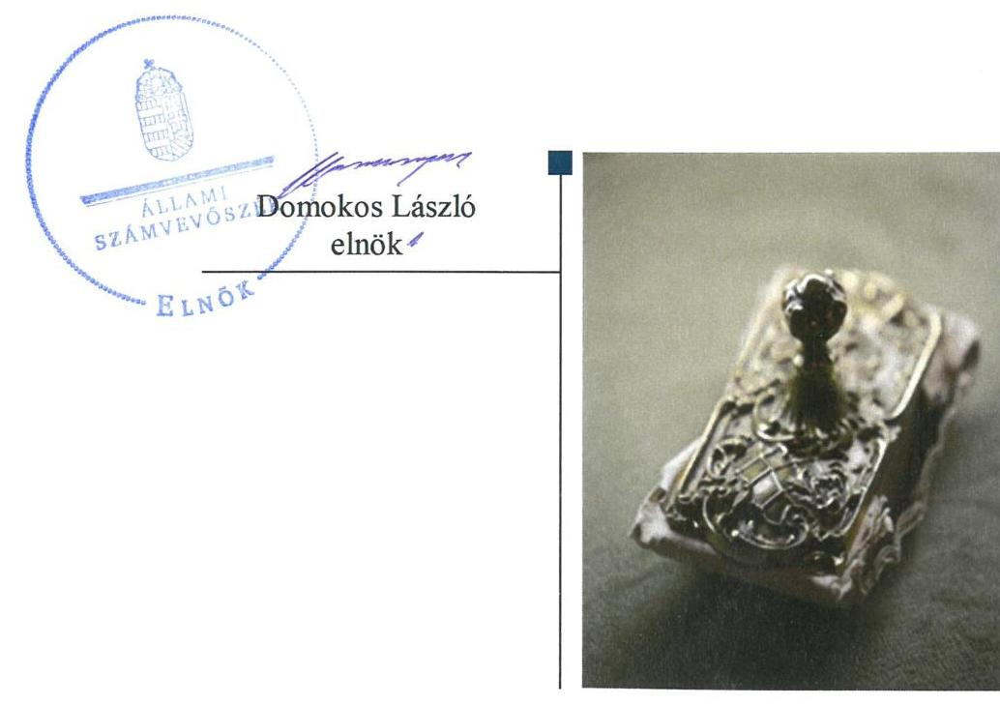

# Jelenetés 

## Központi költségvetési szervek ellenőrzése

Fertő-Hanság Nemzeti Park Igazgatóság 2019.

---

# Jelenetés 

## Központi költségvetési szervek ellenőrzése

Fertő-Hanság Nemzeti Park Igazgatóság
2019. 12. hó 20. nap

---

# AZ ELLENŐRZÉST FELÜGYELTE: 

PETŐ KRISZTINA felügyeleti vezető

## AZ ELLENŐRZÉST VEZETTE ÉS A VÉGREHAJTÁSÁÉRT FELELŐS:

DR. GYŐRI GABRIELLA ellenőrzésvezető

## A PROGRAM ÖSSZEÁLLÍTÁSÁÉRT FELELŐS:

TÓTPÁL SZABOLCS osztályvezető

IKTATÓSZÁM: EL-2355-001/2019.
TÉMASZÁM: 2450
ELLENŐRZÉS-AZONOSÍTÓ SZÁM: V079116

---

# TARTALOMJEGYZÉK 

■ ÖSSZEGZÉS ..... 5
■ AZ ELLENŐRZÉS CÉLJA ..... 6
■ AZ ELLENŐRZÉS TERÜLETE ..... 7
■ AZ ELLENŐRZÉS HÁTTERE, INDOKOLTSÁGA ..... 8
■ A JELENTÉS LÉNYEGES KÉRDÉSKÖREI ..... 10
■ AZ ELLENŐRZÉS HATÓKÖRE ÉS MÓDSZEREI ..... 11
■ MEGÁLLAPÍTÁSOK ..... 14
■ JAVASLATOK ..... 17
■ MELLÉKLETEK ..... 21
I. sz. melléklet: Értelmező szótár ..... 21
■ FÜGGELÉK: ÉSZREVÉTELEK ..... 25
■ RÖVIDÍTÉSEK JEGYZÉKE ..... 27

---

.

---

# ÖSSZEGZÉS 

A sarródi székhelyű Fertő-Hanság Nemzeti Park Igazgatóság belső kontrollrendszerét nem müködtette szabályszerűen, így nem volt biztositott a nemzeti vagyonnal való szabályszerű gazdálkodás. A pénzügyi-számviteli elektronikus információs rendszerből származó adatok megbizhatóságának hiányában az elszámoltathatóság feltételei nem voltak biztositottak. Az integritást támogató kontrollok kiépitettségének hiánya nem járult hozzá a korrupciós kockázatok mérsékléséhez.

## Az ellenőrzés társadalmi indokoltsága

A központi alrendszer részét képező intézmények alapvető rendeltetése a közfeladatok ellátásának biztosítása. A közpénzek felhasználásában meghatározó, központi alrendszerbe tartozó intézmények pénzügyi és vagyongazdálkodási tevékenységük és/vagy feladatellátásuk súlya miatt jelentős hatást gyakorolhatnak a költségvetés egyensúlyának fenntartására. Hatással vannak továbbá az állami vagyonnal való gazdálkodás minőségére, a kormányzati (szak)politikák végrehajtására, illetve közfeladat ellátásuk vonatkozásában az állampolgárok életminőségére, jogaik és kötelezettségeik gyakorlására. Indokolt ezért, hogy az Állami Számvevőszék ezen intézmények pénzügyi és vagyongazdálkodását, az esetleges átalakulások szabályszerűségét rendszeresen ellenőrizze.

## Főbb megállapítások, következtetések, javaslatok

A Fertő-Hanság Nemzeti Park Igazgatóság belső kontrollrendszerének kialakítása és működtetése nem volt szabályszerű. A kontrollkörnyezet kialakítása nem volt szabályszerű, mert a múködés és gazdálkodás alapvető előírásait nem a jogszabályi előírásoknak megfelelően határozták meg. A 2016-2017. években nem mérték fel és azonosították be a tevékenységekben rejlő kockázatokat, nem határozták meg az egyes kockázatokkal kapcsolatban szükséges intézkedéseket. A Fertő-Hanság Nemzeti Park Igazgatóság igazgatója 2016. október 1-jétől nem jelölte ki az integrált kockázatkezelési rendszer koordinálásának szervezeti felelősét. A kontrolltevékenység gyakorlása nem volt szabályszerű. Az információs és kommunikációs folyamatok kialakítása és működtetése 2015-2017. években nem volt szabályszerű. A belső ellenőrzés működtetése a 2015-2017. években nem volt szabályszerű.

A Fertő-Hanság Nemzeti Park Igazgatóság igazgatója az ellenőrzött időszakban nyilatkozatban értékelte a szervezet belső kontrollrendszerének minőségét, amely nem volt összhangban a jelen ellenőrzés során tapasztaltakkal. A Fertő-Hanság Nemzeti Park Igazgatóságnál nem alakítottak ki a teljesítmény mérésére alkalmas követelményeket.

A pénzügyi és vagyongazdálkodás az ellenőrzött időszakban nem volt szabályszerű. A jogszabályi előírásban foglaltak ellenére a Fertő-Hanság Nemzeti Park Igazgatóság nem állított össze a mérleg fordulónapján meglévő eszközeit és forrásait mennyiségben és értékben, tételesen, ellenőrizhető módon tartalmazó leltárt, emiatt a 2015-2017. évi számviteli beszámolók nem mutattak megbízható és valós képet a gazdálkodásáról. A jogszabályi előírás ellenére nem került sor a pénzügyi-gazdasági elektronikus információs rendszer biztonsági osztályba sorolásának elvégzésére. A pénzügyi-gazdasági elektronikus információs rendszer biztonsági osztályba sorolásának elmaradása miatt nem igazolt az abban kezelt adatok sértetlenségének-, rendelkezésre állásának-, teljes körű és kockázatokkal arányos védelmének biztosítása. A hiányosság miatt nem volt biztosítva a bevételi és kiadási előirányzatok alakulásának, a követelések, kötelezettségvállalások és ezek teljesítésének, a vagyon és annak összetétele valóságnak megfelelő, zárt rendszerú nyilvántartása, valamint a pénzügyi és vagyongazdálkodás elszámoltathatósága.

Az integritást támogató kontrollokat nem építették ki és nem működtették a Fertő-Hanság Nemzeti Park Igazgatóságnál.

Az Állami Számvevőszék a Fertő-Hanság Nemzeti Park Igazgatóság igazgatójának 17 javaslatot fogalmazott meg.

---

# AZ ELLENŐRZÉS CÉLJA 

AZ ELLENŐRZÉS CÉLJA annak megítélése volt, hogy az ellenőrzött intézményre vonatkozó irányító szervi feladatellátás a jogszabályi előírások betartásával történt-e; az intézménynél a belső kontrollrendszer kialakítása és múködtetése szabályszerű volt-e, biztosította-e az átlátható, szabályszerű, gazdaságos, hatékony és eredményes gazdálkodás feltételeit; az intézmény pénzügyi és vagyongazdálkodása megfelelt-e a jogszabályi előírásoknak és belső szabályzatainak. Az ellenőrzés keretében az ÁSZ ${ }^{1}$ értékelte az intézmény korrupciós kockázatainak kezelését szolgáló integritás kontrollok kiépítettségét és az integritás szemlélet érvényesülését, illetve, hogy az államháztartás központi alrendszerébe tartozó szervezet gazdálkodása során elszámoltatható volt és megfelelt-e annak az Alaptörvényben² meghatározott alapvetésnek, hogy Magyarország a kiegyensúlyozott, átlátható és fenntartható költségvetési gazdálkodás elvét érvényesíti. Az ÁSZ értékelte, hogy a központi költségvetési szervnél megteremtették-e a teljesítményellenőrzés feltételeit. Érvényesült-e a nemzeti vagyon kezelésének és védelmének célja, azaz a szervezet vagyona a közérdeket szolgálta, a közös szükségletek kielégítése és a természeti erőforrások megóvása, valamint a jövő nemzedékek szükségleteinek figyelembevétele mellett.

---

# **AZ ELLENŐRZÉS TERÜLETE**

## **Fertő–Hanság Nemzeti Park Igazgatóság**

A Fertő–Hanság Nemzeti Park Igazgatóság megalapítására 1990. december 1-jén került sor a 3/1990. (XI. 27.) KTM rend.3 alapján. Az FHNPI4 székhelye a Győr–Moson–Sopron megyei Sarródon található. Az FHNPI központi költségvetési intézmény, amely az ellenőrzött időszakban az 1996. évi LIII. törvény5, a 481/2013. (XII.17.) Korm. rend.6, illetve a 71/2015. (III. 30.) Korm. rend.7 alapján a természetvédelem területi igazgatása körébe tartozó közfeladatokat látott el. Alaptevékenységét a természettudományi, műszaki alapkutatás, a génmegőrzés, fajtavédelem, a természetvédelem és tájvédelem igazgatása és támogatása, a védett természeti területek és természeti értékek bemutatása, megőrzése és fenntartása, a könyvés egyéb kiadással, valamint a szabadidős szolgáltatással kapcsolatos feladatok képezték. Az FHNPI működési területe Győr–Moson–Sopron megye, Komárom–Esztergom és Vas megye területére terjedt ki. Az FHNPI az Nvtv.8, az NFA tv.9 és a Vtvr.10 előírásai alapján rendelkezett vagyonkezelési szerződésekkel11.

Az FHNPI irányító szerve 2015. január 1. és 2017. december 31. között a Földművelésügyi Minisztérium volt (2018. május 18-ától Agrárminisztérium). Az FHNPI önálló jogi személy, gazdasági szervezettel rendelkezett. Az Áht.12 rendelkezése szerinti átalakításra az ellenőrzött időszakban nem került sor. Az FHNPI az ellenőrzött időszakban vállalkozási tevékenységet nem végzett.

Az FHNPI által kimutatott, teljesített összes bevétel 2017. évben 3760,1 M Ft, teljesített összes kiadás 1143,1 M Ft, vagyona 7288 M Ft nagyságú volt.

Az FHNPI-t igazgató13 vezette, aki felett az irányító szervet vezető miniszter gyakorolta a kinevezési és munkáltatói jogokat. Az igazgató és a gazdasági vezető személyében 2015. év és 2017. év között nem történt változás.

Az FHNPI alkalmazásában álló személyek foglalkoztatása kormányzati szolgálati jogviszonyban, munkaviszonyban, illetve közfoglalkoztatási jogviszonyban történt. Az FHNPI foglalkoztatottjai felett a munkáltatói jogokat az igazgató gyakorolta.

---

# AZ ELLENŐRZÉS HÁTTERE, INDOKOLTSÁGA 

Az államháztartás központi alrendszerének közpénz felhasználása, az intézmények által ellátott közfeladatok sokrétűsége, valamint a feladatellátásához rendelt vagyon nagyságrendje indokolja, hogy az ÁSZ ellenőrzéseket folytasson a pénzügyi és vagyongazdálkodás területén. Az ÁSZ az ellenőrzései során feltárja a gazdálkodást, a központi alrendszer intézményei átalakulását, átszervezését érintő szabályozások esetleges hiányosságait, a szabályozással nem érintett gazdálkodási területeket, rámutathat a vagyongazdálkodási tevékenység - ezen belül a tulajdonosi joggyakorlás és vagyonkezelés - esetleges szabálytalanságaira, értékeli az állami vagyon nyilvántartására és elszámolására vonatkozó eljárásokat.

Az államháztartás központi alrendszerébe tartozó szervezet vagyona a nemzeti vagyon része és az Alaptörvény is rögzíti, hogy a vagyonnal való gazdálkodás célja a közérdek szolgálata. Az ÁSZ ellenőrzi az éves költségvetési törvény végrehajtását, az ellenőrzés során feltárt kockázatok és a terület folyamatos kockázatelemzésével beazonosított kockázatok kezelése érdekében ráépülő ellenőrzésekkel ellenőrzi a költségvetési szervek gazdálkodását, múködését, hogy az ellenőrzések megállapításaival támogassa az ellenőrzött szervezetek szabályszerű gazdálkodását, javaslataival elősegítse az Alaptörvényben megfogalmazott alapvetések érvényesülését a mindennapi életben a szervezetek szintjén. A központi költségvetés rendszerében zajló folyamatok holisztikus elemzései, a kockázatok folyamatos figyelemmel kísérésének módszerével, az így kiválasztott szervezetek célzott, hatékony ellenőrzéseivel az ÁSZ betölti a legfőbb gazdasági ellenőrző szerv küldetését.

Az ellenőrzés várhatóan hozzájárul a központi intézmények pénzügyi helyzetének pontosabb megítéléséhez, és a jó gyakorlat kialakításán és terjesztésén keresztül az ellenőrzések elősegíthetik a gazdálkodás szabályszerűségének javítását.

A belső kontrollrendszer kialakítása és múködtetése nélkül nem valósítható meg a közpénzek, a közvagyon átlátható, szabályos, gazdaságos, hatékony és eredményes felhasználása. A belső kontrollrendszer azt a célt szolgálja, hogy a költségvetési szervek működésük és gazdálkodásuk során a tevékenységeket szabályszerűen hajtsák végre, teljesítsék elszámolási kötelezettségeiket és megvédjék az erőforrásokat a veszteségektől, a károktól és a nem rendeltetésszerű használattól. A belső kontrollrendszer magában foglalja mindazon elveket, eljárásokat és belső szabályzatokat, melyek biztosítják, hogy a költségvetési szerv valamennyi tevékenysége és célja összhangban legyen a szabályszerűséggel, szabályozottsággal, valamint a gazdaságosság, hatékonyság és eredményesség követelményeivel, az eszközökkel és forrásokkal való gazdálkodásban ne kerüljön sor pazarlásra, visszaélésre, rendeltetésellenes felhasználásra. Megfelelő, pontos és naprakész információk álljanak rendelkezésre a költségvetési szerv múködésével kapcsolatosan, és a belső kontrollrendszer harmonizációjára, öszszehangolására vonatkozó jogszabályok végrehajtásra kerüljenek. Az integritás kontrollok kiépítése, erősítése a szervezet korrupciós kockázatainak

---

kezelését szolgálja. A teljesítménykövetelmények meghatározása és múködtetése megalapozhatja a központi költségvetési szervnél a teljesítményellenőrzés lefolytatását.

Az egyes ellenőrzések megállapításaival és egy időszak ellenőrzési eredményeinek elemzésével az ÁSZ ráirányíthatja a jogalkotók figyelmét a központi alrendszerben vagy annak egy ágazatában esetlegesen felmerülő pénzügyi, szabályozási feszültségekre. Az elvégzett ellenőrzések során az ÁSZ „jó gyakorlatokat" is azonosíthat, melyeket tanácsadó funkciója keretében szélesebb körben is megismertethet az érintettekkel, ezáltal is hozzájárulva a költségvetési rendszer szabályozott, átlátható, kiegyensúlyozott és fenntartható múködéséhez.

Az ellenőrzés a szervezet kockázatértékelése alapján, az egyedi és lényeges jellemzők figyelembevételével történt.

---

# A JELENTÉS LÉNYEGES KÉRDÉSKÖREI 

1.     - Az irányító szerv ellenőrzött költségvetési szervre vonatkozó feladatellátása szabályszerű volt-e?
2.     - A belső kontrollrendszer kialakítása és müködtetése biztosi-totta-e a közpénzekkel és a nemzeti vagyonnal történő szabályszerű gazdálkodást?
3.     - A költségvetési szerv pénzügyi és vagyongazdálkodása szabályszerű volt-e?
4.     - A költségvetési szervnél alakítottak-e ki a teljesítmény mérésére alkalmas követelményeket?

---

# AZ ELLENŐRZÉS HATÓKÖRE ÉS MÓDSZEREI 

## Az ellenőrzés típusa

Megfelelőségi ellenőrzés.

## Az ellenőrzött időszak

2015-2017. évek

## Az ellenőrzés tárgya

Az FHNPI-re vonatkozó 2015-2016. évi irányító szervi feladatok ellátása. Az FHNPI 2015-2017. évi belső kontrollrendszerének kialakítása és müködtetése, valamint az integritás kontrollok kiépítettsége 2017. évben és a teljesítmény ellenőrzés feltételei 2017. évben. Az FHNPI pénzügyi és vagyongazdálkodása a 2015-2016. években. A 2017. évre vonatkozóan az FHNPI vagyongazdálkodási feltételeinek kialakítása, annak szabályszerűsége, az elszámoltathatóság biztosítása a szabályozás szintjén. Az FHNPI-nél hozott vagyonváltozást eredményező döntések, a vagyonban bekövetkezett változások végrehajtásának, nyilvántartásba vételének, elszámolásának szabályszerűsége. Az FHNPI könyveiben, mérlegében az állami vagyon kimutatásának szabályszerűsége, ennek keretében az állami vagyonnal történő rendelkezés, a vagyonmozgások, a vagyon nyilvántartásba vétele, értékelése és a mérleg alátámasztás szabályszerűsége.

## Az ellenőrzött szervezet

Fertő-Hanság Nemzeti Park Igazgatóság, valamint az Agrárminisztérium.

## Az ellenőrzés jogalapja

Az ellenőrzés jogszabályi alapját az ÁSZ tv. ${ }^{14}$ 1. § (3) bekezdés, 5. § (2)-(4) és (6) bekezdései, valamint az Áht. 61. § (2) bekezdésének előírásai képezték.

## Az ellenőrzés módszerei

Az ellenőrzésre a szakmai program szempontjai, az ellenőrzött időszakban hatályos jogszabályok, az ellenőrzés szakmai szabályai, a jelen ellenőrzésre irányadó ÁSZ módszertanok figyelembevételével került sor.

---

Az ellenőrzés ideje alatt az ellenőrzött szervezetekkel a kapcsolattartást az ÁSZ SZMSZ ${ }^{15}$-ének vonatkozó előírásai alapján biztosította az ÁSZ.

Az ellenőrzési kérdések megválaszolásához szükséges bizonyítékok megszerzése az ellenőrzött szervezetek által rendelkezésre bocsátott dokumentumokra, adatokra alapozva megfigyelés, szemle (szemrevételezés), kérdésfeltevés (információkérés), valamint elemző eljárás útján történt.

Az ellenőrzési bizonyítékként felhasználható adatforrások közé tartoztak egyrészt a szakmai program részletes szempontjainál felsorolt adatforrások, másrészt minden egyéb - az ellenőrzés folyamán feltárt, az ellenőrzés szempontjából információt tartalmazó - dokumentum.

Az ellenőrzés lefolytatásához az ellenőrzött szervezetek a tanúsítványok kitöltésével, valamint az ÁSZ által kért dokumentumok megküldésével szolgáltattak adatokat, amelyek valódiságát és teljes körűségét az ellenőrzött szervezet vezetője által tett teljességi és hitelességi nyilatkozat igazolta.

Az ellenőrzés kiterjedt minden olyan körülményre és adatra, amely az ÁSZ jogszabályban meghatározott feladatainak teljesítéséhez, valamint a program végrehajtása folyamán felmerült újabb összefüggések feltárásához szükséges volt.

A számvevőszéki jelentésben foglalt megállapítások, következtetések alátámasztására, az elegendő és megfelelő bizonyíték megszerzése érdekében az ÁSZ - módszertani eljárásaiban foglaltaknak eleget téve - értékelte a megszerzett ellenőrzési bizonyítékok forrását és jellegét. Mérlegelte továbbá az ellenőrzési bizonyítékként felhasználandó információ relevanciáját és megbízhatóságát. Az ellenőrzöttek által rendelkezésre bocsátott adatok, információk megfelelőségének - vagyis tárgyhoz tartozóságának, helytállóságának és megbízhatóságának - kontrollja az ellenőrzés keretében történt.

Az FHNPI pénzügyi-gazdasági elektronikus információs rendszereiben kezelt, az ellenőrzés rendelkezésére bocsátott adatok, információk megbízhatóságának kontrollja céljából az ÁSZ független hivatalos forrásból, a Nemzetbiztonsági Szakszolgálat Nemzeti Kibervédelmi Intézettől, mint a jogszabály által kijelölt hatóságtól kért adatokat. Az adatbekérés az FHNPI pénzügyi-gazdasági elektronikus információs rendszerei biztonsági osztályba sorolását tartalmazó és azt igazoló dokumentumokra terjedt ki.

Az állami és önkormányzati szervek elektronikus információbiztonságáról szóló 2013. évi L. törvény előírásai biztosítják az elektronikus információs rendszerekben kezelt adatok és információk bizalmasságának, sértetlenségének és rendelkezésre állásának, valamint ezek rendszerelemei sértetlenségének és rendelkezésre állásának zárt, teljes körű, folytonos és a kockázatokkal arányos védelmét. A kockázatokkal arányos védelmi szint kialakítása érdekében az elektronikus információs rendszereket biztonsági osztályba kell sorolni, amelyet az adott szerv vezetője hagy jóvá és az informatikai biztonsági szabályzatban kell rögzíteni, amelyet meg kell küldeni az $\mathrm{NKI}^{16}$ részére.

Az ellenőrzés során ezért az ÁSZ értékelte azt is, hogy biztosított volt-e az ellenőrzéshez rendelkezésre bocsátott adatok származási helyének, a pénzügyi-gazdasági elektronikus információs rendszer sértetlenségének alapfeltétele, annak biztonsági osztályba sorolása.

---

Amennyiben nem történt meg a pénzügyi-gazdasági elektronikus információs rendszer biztonsági osztályba sorolása, és ennek következményeként nem volt biztosított az abban kezelt adatok és információk sértetlenségének zárt, teljes körű, folytonos és a kockázatokkal arányos védelme, abban az esetben a megbízható adatok hiányával érintett területeket az ÁSZ úgy értékelte, hogy nem állnak rendelkezésre az ellenőrzés részletes lefolytatásához a megfelelő ellenőrzési bizonyítékok.

Az FHNPI belső kontrollrendszere jogszabályi előírások szerinti kialakítása és működtetése szabályszerűségének értékelése az erre irányuló kérdésekre adott válaszok összesítése alapján, évente pillérenként (kontrollterületenként) és összesítetten történt. A belső kontrollrendszer egyes pilléreinek kialakítása „szabályszerü", amennyiben az értékelt területen az „igen" válaszok százalékban kifejezett, egész számra kerekített aránya legalább 85\%, „nem szabályszerű", ha nem érte el a 85\%-ot. A kontrollrendszer egésze esetében a „szabályszerü" értékelésnek a \%-os értéken felül további feltétele volt, hogy egyik kontrollterület sem kaphatott „nem szabályszerű" értékelést.

---

# 1. Az irányító szerv ellenőrzött költségvetési szervre vonatkozó feladatellátása szabályszerű volt-e 

Összegző megállapítás Az irányító szerv ${ }^{17}$ FHNPI-re vonatkozó feladatellátása nem volt szabályszerű a 2015-2016. években.

Az irányító szerv az FHNPI alapító okiratát ${ }^{18}$ az Ávr. ${ }^{19}$-ben foglaltakkal összhangban adta ki. Az irányítási jogosultságok keretében az irányító szerv az FHNPI SZMSZ ${ }^{20}$-ét az Áht. és az Ávr. alapján jóváhagyta. Az FHNPI részére az irányító szerv nem állapította meg a 2015-2016. évi maradványát, figyelmen kívül hagyva az Ávr. 153. § (4) bekezdésében foglaltakat. A 10/2013. (I. 21.) Korm. rend. ${ }^{21}$ 12. § (1) bekezdés b) pontjában foglaltak ellenére nem került sor 2015. II. félévében az egyéni teljesítmény követelmények értékelésére és nem határozták meg az egyéni teljesítmény követelményeket - a 10/2013. (I. 21.) Korm. rend. 6. § (1) bekezdés a) pontjában foglaltak ellenére - a 2016. évre vonatkozóan.

## 2. A belső kontrollrendszer kialakítása és múködtetése biztosí-totta-e a közpénzekkel és a nemzeti vagyonnal történő szabályszerű gazdálkodást?

## Összegző megállapítás

Az FHNPI belső kontrollrendszerének kialakítása és múködtetése 2015-2017. években nem volt szabályszerű, nem biztosította a közpénzekkel és a nemzeti vagyonnal történő szabályszerű gazdálkodást.

A KONTROLLKÖRNYEZET kialakítása 2015-2017. években nem volt szabályszerű. A számlarend ${ }^{22}$ a 2015-2017. években a Számv. tv. ${ }^{23}$ 161. § (2) bekezdés c) pontjában előírtak ellenére nem tartalmazta a főkönyvi számla és az analitikus nyilvántartások kapcsolatát. Az Áhsz. ${ }^{24}$ 51. § (3) bekezdésében előírtak ellenére a számlarend nem tartalmazta a részletező nyilvántartások kapcsolódó könyvviteli és nyilvántartási számlákkal való egyeztetését, annak dokumentálását, valamint a feladások elkészítésének rendjét.

A Vnytv. ${ }^{25}$ 11. § (6) bekezdésében előírtak ellenére nem állapították meg szabályzatban a 2015-2017. években a vagyonnyilatkozatok átadására és nyilvántartására, továbbá a vagyonnyilatkozatban foglalt személyes adatok védelmére vonatkozó szabályokat. Az FHNPI 2015-2017. években a Bkr. ${ }^{26}$ 6. § (1) bekezdés c) pontjában foglaltak ellenére nem határozta meg az etikai elvárásokat a költségvetési szerv minden szintjén. Az Ávr. 13. § (2) bekezdés h) pontjában előírtak ellenére a 2015-2017. években az FHNPI igazgatója nem szabályozta a közérdekú adatok megismerésére irányuló

---

kérelmek intézésének rendjét, valamint a kötelezően közzéteendő adatok nyilvánosságra hozatalának rendjét. A Bkr. 7. § (4) bekezdésének 2016. október 1-jétől hatályos előírása ellenére az FHNPI igazgatója nem jelölte ki az integrált kockázatkezelési rendszer koordinálásának szervezeti felelősét.

Az FHNPI 2015-2016-ban az Áhsz. 39. § (3) bekezdésének előírása ellenére nem vezette az Áhsz. 14. melléklet II. 4. pontja szerinti kötelezettségvállalások nyilvántartását.

Az FHNPI az ellenőrzött időszakban rendelkezett alapító okirattal, SZMSZ-szel, számviteli politikával és az annak keretében elkészítendő szabályzatokkal, továbbá a gazdálkodási jogkörgyakorlásra jogosult személyek aláírás mintáit tartalmazó naprakész nyilvántartással.

A KOCKÁZATKEZELÉSI RENDSZER működtetése 2015. évben szabályszerű volt, 2016. január 1-jétől szeptember 30-ig, az integrált kockázatkezelési rendszer működtetése 2016. október 1-jétől nem volt szabályszerű. A működtetés 2016-2017-ben nem felelt meg a Bkr. 2. § m) pontjában és a Bkr. 7. § (1)-(2) bekezdésében előírtaknak. Hiányosság volt 2016-2017-ben, hogy nem mérték fel és azonosították be a tevékenységekben rejlő kockázatokat, nem határozták meg az egyes kockázatokkal kapcsolatban szükséges intézkedéseket.

A KONTROLLTEVÉKENYSÉGEK gyakorlása a pénzügyi és vagyongazdálkodás fejezetben szereplő, az adatok megbízhatóságára vonatkozó megállapítások alapján nem volt szabályszerű.

AZ INFORMÁCIÓS ÉS KOMMUNIKÁCIÓS folyamatok kialakítása és működtetése a 2015-2017. években nem volt szabályszerű. Az FHNPI igazgatója 2015-2017-ben a Bkr. 3. § d) pontjában és 9. § (1)-(2) bekezdésében foglaltak ellenére az információs és kommunikációs rendszert nem alakította ki és nem működtette. 2017. évben az Áht. 108. § (1) bekezdés a) pontjának, valamint az Áhsz. 32. § (1) bekezdésének előírása ellenére az FHNPI nem teljesítette az éves költségvetési beszámolójáról a költségvetési évet követő február 28-ig az adatszolgáltatási kötelezettségét az államháztartás információs rendszerébe.

A MONITORING RENDSZER működtetése a 2015-2017. években nem volt szabályszerű. Az operatív tevékenységek keretében megvalósuló folyamatos és eseti nyomon követés működtetéséről az FHNPI igazgatója az ellenőrzött időszakban a Bkr. 3. § e) pontjában és 10. §-ában foglaltak ellenére nem gondoskodott. A belső ellenőrzés működtetése során 2015-2017. években a Bkr. 28. § c) pontjában foglaltak ellenére az ellenőrzött egységek vezetői nem gondoskodtak intézkedési terv készítéséről. A 2015-2017. években a belső ellenőrzési vezető a Bkr. 47. § (1)-(2) bekezdésében előírt nyilvántartást nem vezette. A 2015-2017. években a Bkr. 14. § (1) bekezdésében foglaltak ellenére a külső ellenőrzések javaslatai alapján készített intézkedési tervek végrehajtásáról szóló nyilvántartás vezetéséről az FHNPI igazgatója nem gondoskodott.

Az FHNPI igazgatója az ellenőrzött időszakban a Bkr. 1. melléklete szerinti nyilatkozatban értékelte az FHNPI belső kontrollrendszerének minőségét, mely nem volt összhangban a jelen ellenőrzés során tapasztaltakkal.

---

A nyilatkozatot az FHNPI igazgatója 2015-2017. években a Bkr. 11. § (2) bekezdésében foglaltak ellenére nem küldte meg költségvetési beszámolójával egyidejűleg az irányító szerv részére.

Az FHNPI-nél az integritás kontrollokat nem építették ki és nem működtették, mert nem gondoskodtak az integrált kockázatkezelési rendszer szabályszerű működtetéséről, illetve a belső ellenőrzés szabályszerű működtetéséről sem.

# 3. A költségvetési szerv pénzügyi és vagyongazdálkodása szabályszerű volt-e? 

## Összegző megállapítás

Az FHNPI pénzügyi és vagyongazdálkodása az ellenőrzött időszakban nem volt szabályszerű.

Az Áhsz. 22. § (1) bekezdésében és a Számv. tv. 69. § (1) bekezdésében foglaltak ellenére a 2015-2017. évi mérleg tételeit az FHNPI nem támasztotta alá leltárral. A 2015-2016. években - az Áhsz. 22. § (1) bekezdésében, a Számv. tv. 69. § (1) bekezdésében, a leltározási szabályzat ${ }^{27}$ I. 5. pontjában és a 2015-2016. évre vonatkozó leltározási utasítás 2. oldalán előírtak ellenére - nem végezték el a pénzeszközök, a követelések, a saját tőke, a kötelezettségek, a növendék állatok és az időbeli elhatárolások leltározását. A 2017. évben nem végezték el a növendék állatok mennyiségi leltározását az Áhsz. 22. § (1) bekezdésében, a leltározási szabályzat A. pontjában és a 2017. évi leltározási utasítás 1. oldalán előírtak ellenére.

Az FHNPI rendelkezett IBSZ ${ }^{28}$-szel, azonban a szervezet biztonsági szintbe sorolására és a pénzügyi-gazdasági elektronikus információs rendszer biztonsági osztályának besorolására - az ellenőrzött időszakban - az Ibtv. ${ }^{29}$ 9. § (1) bekezdésében és 7. § (1) és (3) bekezdésében foglaltak ellenére nem került sor. A biztonsági osztályba sorolás hiányában nem határozták meg az Ibtv. 1. § 12. pontjában foglalt pénzügyi-gazdasági elektronikus információs rendszer védelmének elvárt erősségét. Az FHNPI-nél a pénzügyi-gazdasági elektronikus információs rendszer besorolásának hiányában nem volt biztosítva az abban kezelt adatok - Ibtv. 1. § 39. pontjában előírt - sértetlensége, hitelessége és megbízhatósága.

## 4. A költségvetési szervnél alakítottak-e ki a teljesítmény mérésére alkalmas követelményeket?

A teljesítmény mérésére alkalmas követelményeket az FHNPI 2017. évben nem alakított ki.

---

# JAVASLATOK 

Az ÁSZ tv. 33. § (1) bekezdésében foglaltak értelmében az ellenőrzött szervezet vezetője köteles a jelentésben foglalt megállapításokhoz kapcsolódó intézkedési tervet összeállítani és azt a jelentés kézhezvételétől számított 30 napon belül az ÁSZ részére megküldeni. Amennyiben az ellenőrzött szervezet vezetője nem küldi meg határidőben az intézkedési tervet, vagy továbbra sem elfogadható intézkedési tervet küld, az Állami Számvevőszék elnöke az ÁSZ tv. 33. § (3) bekezdése a) és b) pontjaiban foglaltakat érvényesítheti.

## a Fertő-Hanság Nemzeti Park Igazgatóság igazgatójának

1. Intézkedjen, hogy a számlarend megfeleljen a jogszabályi előírásoknak.
(2. összegző megállapítás 1. bekezdésének 2-3. mondata alapján)
2. Intézkedjen a vagyonnyilatkozatok átadása, nyilvántartása, továbbá a vagyonnyilatkozatban foglalt személyes adatok védelmére vonatkozó szabályok szabályzatban történő megállapításáról.
(2. összegző megállapítás 2. bekezdésének 1. mondata alapján)
3. Intézkedjen olyan kontrollkörnyezet kialakításáról, amelyben meghatározottak, ismertek és elfogadottak az etikai elvárások a szervezet minden szintjén.
(2. összegző megállapítás 2. bekezdésének 2. mondata alapján)
4. Intézkedjen a közérdekü adatok megismerésére irányuló kérelmek intézése, továbbá a kötelezően közzéteendő adatok nyilvánosságra hozatala rendjének szabályozásáról.
(2. összegző megállapítás 2. bekezdésének 3. mondata alapján)
5. Intézkedjen az integrált kockázatkezelési rendszer koordinálásának szervezeti felelősének kijelöléséről.
(2. összegző megállapítás 2. bekezdésének 4. mondata alapján)
6. Intézkedjen a kötelezettségvállalásokról a jogszabályban elöirt nyilvántartás vezetéséről.
(2. összegző megállapítás 3. bekezdése alapján)

---

7. Intézkedjen az integrált kockázatkezelési rendszer jogszabályban előirtak szerinti müködtetéséről.
(2. összegző megállapítás 5. bekezdése alapján)
8. Intézkedjen a szervezet információs és kommunikációs rendszerének kialakításáról és müködtetéséről.
(2. összegző megállapítás 7. bekezdésének 1-2. mondata alapján)
9. Intézkedjen a jogszabályban elöirt adatszolgáltatási kötelezettség teljesitéséről.
(2. összegző megállapítás 7. bekezdésének 3. mondata alapján)
10. Intézkedjen az operativ tevékenységek keretében megvalósuló folyamatos és eseti nyomon követés müködtetéséről.
(2. összegző megállapítás 8. bekezdésének 2. mondata alapján)
11. Gondoskodjon arról, hogy a belső ellenőrzés megállapításai és javaslatai alapján intézkedési terv készüljön.
(2. összegző megállapítás 8. bekezdésének 3. mondata alapján)
12. Intézkedjen a Bkr. szerinti nyilvántartás vezetéséről.
(2. összegző megállapítás 8. bekezdésének 4. mondata alapján)
13. Intézkedjen a külső ellenőrzések javaslatai alapján készült intézkedési tervek végrehajtásának éves bontásban történő nyilvántartásának vezetéséről.
(2. összegző megállapítás 8. bekezdésének 5. mondata alapján)
14. Intézkedjen a Bkr.-ben foglalt elöírásoknak megfelelően a belső kontrollrendszer minőségének értékeléséről szóló vezetői nyilatkozat éves költségvetési beszámolóval együtt történő megküldéséről az irányító szerv részére.
(2. összegző megállapítás 9. bekezdésének 2. mondata alapján)
15. Intézkedjen az éves költségvetési beszámoló mérleg tételeinek alátámasztásához leltár összeállításáról, amely tételesen, ellenőrizhető módon tartalmazza a mérlegben szereplő eszközöket és forrásokat.
(3. összegző megállapítás 1. bekezdésének 1. mondata alapján)

---

16. Intézkedjen a növendék állatok jogszabályban, valamint a leltározási és leltárkészitési szabályzatban meghatározott módon történő leltározásáról.
(3. összegző megállapítás 1. bekezdésének 3. mondata alapján)
17. Intézkedjen a jogszabályi előírásokkal összhangban a szervezet biztonsági szintbe, valamint a pénzügyi-gazdasági elektronikus információs rendszer biztonsági osztályba sorolásáról.
(3. összegző megállapítás 2. bekezdésének 1. mondata alapján)

---

.

---

# MELLÉKLETEK 

- I. SZ. MELLÉKLET: ÉRTELMEZŐ SZÓTÁR
állami vagyon
állami vagyonnak minősül:
a) az állam tulajdonában lévő dolog, valamint a dolog módjára hasznosítható természeti erő,
b) az a) pont hatálya alá nem tartozó mindazon vagyon, amely vonatkozásában törvény az állam kizárólagos tulajdonjogát nevesíti,
c) az állam tulajdonában lévő tagsági jogviszonyt megtestesítő értékpapír, illetve az államot megillető egyéb társasági részesedés,
d) az államot megillető olyan immateriális, vagyoni értékkel rendelkező jogosultság, amelyet jogszabály vagyoni értékű jogként nevesít. (Forrás: Vtv. 1. § (2) bekezdése)
állami vagyon használója Az a természetes vagy jogi személy, jogi személyiséggel nem rendelkező szervezet, aki, vagy amely törvény vagy szerződés alapján, bármely jogcímen (bérlet, haszonbérlet, használat stb.) állami vagyont birtokol, használ, szedi annak hasznait, hasznosít, ide nem értve a haszonélvezőt, a vagyonkezelőt és a tulajdonosi jogok gyakorlóját. (Forrás: Vtvr. 1. § (7) bekezdés a) pontja)
állami vagyon hasznosítása Az állami vagyont az MNV Zrt. maga kezeli, vagy szerződés - így különösen bérlet, haszonbérlet, megbízás - alapján központi költségvetési szervnek, természetes vagy jogi személynek, vagy jogi személyiséggel nem rendelkező gazdálkodó szervezetnek hasznosításra átengedi.
(Forrás: Vtv. 23. § (1) bekezdése, hatályos 2012. január 1-jétől)
Az állami vagyonnal a tulajdonosi joggyakorló maga gazdálkodik, vagy szerződés - így különösen bérlet, haszonbérlet, megbízás - alapján hasznosításra átengedi, illetőleg vagyonkezelésbe, haszonélvezetbe adja. (Forrás: Vtv. 23. § (1) bekezdése, hatályos 2013. június 28 -ától)
az állami vagyont az MNV Zrt. maga kezeli, vagy szerződés - így különösen bérlet, haszonbérlet, megbízás - alapján központi költségvetési szervnek, természetes vagy jogi személynek, vagy jogi személyiséggel nem rendelkező gazdálkodó szervezetnek hasznosításra átengedi." Az állami vagyonra vonatkozóan az MNV Zrt. kizárólag az Nvtv.-ben meghatározott személyekkel köthet vagyonkezelési szerződést. (Forrás: Vtv. 27. § (1) bekezdése, hatályos 2012. január 1-jétől)
belső ellenőrzés
belső kontrollrendszer
belső kontrollrendszer területei

Független, tárgyilagos bizonyosságot adó és tanácsadó tevékenység, amelynek célja, hogy az ellenőrzött szervezet működését fejlessze és eredményességét növelje, az ellenőrzött szervezet céljai elérése érdekében rendszerszemléletű megközelítéssel és módszeresen értékeli, illetve fejleszti az ellenőrzött szervezet irányítási és belső kontrollrendszerének hatékonyságát. (Forrás: Bkr. 2. § b) pontja)
A belső kontrollrendszer a kockázatok kezelése és tárgyilagos bizonyosság megszerzése érdekében kialakított folyamatrendszer, amely azt a célt szolgálja, hogy a müködés és gazdálkodás során a tevékenységeket szabályszerűen, gazdaságosan, hatékonyan, eredményesen hajtsák végre, az elszámolási kötelezettségeket teljesítsék, megvédjék az erőforrásokat a veszteségektől, károktól és nem rendeltetésszerű használattól. (Forrás: Áht. 69. § (1) bekezdése)
A kontrollkörnyezet, a kockázatkezelési rendszer, a kontrolltevékenységek, az információs és kommunikációs rendszer, valamint a nyomon követési (monitoring) rendszer. (Forrás: Bkr. 3. §-a)

---

információs és kommunikációs rendszer
integritás
integrált kockázatkezelési rendszer
irányító szerv/felügyeleti szerv
kockázat
kockázatkezelési rendszer
kontrollkörnyezet
kontrolltevékenységek
közfeladat
maradvány
nyomon követési rendszer (monitoring)

A költségvetési szerv vezetője által kialakított és működtetett olyan rendszer, mely biztosítja, hogy a megfelelő információk a megfelelő időben eljutnak az illetékes szervezethez, szervezeti egységhez, illetve személyhez. (Forrás: Bkr. 9. § (1) bekezdés)
Az integritás - egyik gyakran használt jelentése szerint - az elvek, értékek, cselekvések, módszerek, intézkedések konzisztenciáját jelenti, vagyis olyan magatartásmódot, amely meghatározott értékeknek megfelel. Integritás-irányítási rendszer bevezetése a szervezetben a szervezethez rendelt közfeladatok integritás szempontú ellátását, az érték alapú múködéssel (integritással) összefüggő szervezeti követelmények következetes érvényesítését jelenti. (Forrás: Nemzetgazdasági Minisztérium: Államháztartási Belső Kontroll Standardok és Gyakorlati Útmutató 1.6. Etikai értékek és integritás 46. oldal, 2017. szeptember)
Olyan folyamatalapú kockázatkezelési rendszer, amely a szervezet minden tevékenységére kiterjed, egységes módszertan és eljárások alkalmazásával, a szervezet célkitűzéseinek és értékeinek figyelembevételével biztosítja a szervezet kockázatainak teljes körű azonosítását, azok meghatározott kritériumok szerinti értékelését, valamint a kockázatok kezelésére vonatkozó intézkedési terv elkészítését és az abban foglaltak nyomon követését. (Forrás: Bkr. 2. § m) pontja, 2016. október 1-jétől)
A költségvetési szerv tekintetében az Áht.-ban meghatározott irányítási hatáskört gyakorló szerv. (Forrás: Áht. 1. § 9. pontja)
A kockázat annak a valószínűségét jelenti, hogy egy vagy több esemény vagy intézkedés nem kívánt módon befolyásolja a rendszer múködését, céljainak megvalósulását. (Forrás: Javaslatok a korrupciós kockázatok kezelésére - Kockázatkezelési és ellenőrzési módszertan 35. oldal, ÁSZ)
Olyan irányítási eszközök és módszerek összessége, melynek elemei a szervezeti célok elérését veszélyeztető tényezők (kockázatok) azonosítása, elemzése, csoportosítása, nyomon követése, valamint szükség esetén a kockázati kitettség mérséklése.(Forrás: Bkr. 2. § m) pontja)
A költségvetési szerv vezetője által kialakított olyan elvek, eljárások, belső szabályzatok összessége, amelyben világos a szervezeti struktúra, a folyamatok átláthatók, egyértelmúek a felelősségi, hatásköri viszonyok és feladatok, meghatározottak, ismertek és elfogadottak az etikai elvárások a szervezet minden szintjén, átlátható a humán-erőforrás-kezelés. (Forrás: Bkr. 6. § (1) bekezdés)
A költségvetési szerv vezetője által a szervezeten belül kialakított (kontroll) tevékenységek, melyek biztosítják a kockázatok kezelését, hozzájárulnak a szervezet céljainak eléréséhez és erősítik a szervezet integritását. (Forrás: Bkr. 8. § (1) bekezdés)
Jogszabályban meghatározott állami vagy önkormányzati feladat, amit az arra kötelezett közérdekből, a jogszabályban meghatározott követelményeknek és feltételeknek megfelelve végez, ideértve a lakosság közszolgáltatásokkal való ellátását, továbbá az állam nemzetközi szerződésekben vállalt kötelezettségeiből adódó közérdekű feladatokat, valamint e feladatok ellátásakor szükséges infrastruktúra biztosítását is. (Forrás: Nvtv. 3. § (1) bekezdés 7. pontja)
A költségvetési év során a bevételek és kiadások különbözete, amely az alaptevékenység bevételei és kiadásai tekintetében a költségvetési maradvány, a vállalkozási tevékenység bevételei és kiadásai tekintetében a vállalkozási maradvány. (Forrás: Áht. 1. § 17. pont)
A költségvetési szerv vezetője köteles kialakítani a szervezet tevékenységének a célok megvalósításának nyomon követését biztosító rendszert, amely az operatív tevékenységek keretében megvalósuló folyamatos és eseti nyomon követésből, valamint az operatív tevékenységektől függetlenül múködő belső ellenőrzésből áll. (Forrás: Bkr. 10. §)

---

vagyongazdálkodás

A nemzeti vagyongazdálkodás feladata a nemzeti vagyon rendeltetésének megfelelő, az állam, az önkormányzat mindenkori teherbíró képességéhez igazodó, elsődlegesen a közfeladatok ellátásához és a mindenkori társadalmi szükségletek kielégítéséhez szükséges, egységes elveken alapuló, átlátható, hatékony és költségtakarékos múködtetése, értékének megőrzése, állagának védelme, értéknövelő használata, hasznosítása, gyarapítása, továbbá az állam vagy a helyi önkormányzat feladatának ellátása szempontjából feleslegessé váló vagyontárgyak elidegenítése. (Forrás: Nvtv. 7. § (2) bekezdése)

---

.

---

# FÜGGELÉK: ÉSZREVÉTELEK 

A jelentéstervezetet a Számvevőszék 15 napos észrevételezésre megküldte az ellenőrzött szervezet vezetőjének az ÁSZ tv. 29. §* (1) bekezdése előírásának megfelelően.

A jelentéstervezet megállapításaira a FHNPI igazgatója észrevételt tett, az Agrárminisztérium minisztere nem tett észrevételt.
Az ÁSZ tv. 29. § (3) bekezdésével összhangban az ÁSZ a Függelékben feltünteti az ellenőrzés megállapításaival kapcsolatban tett, figyelembe nem vett észrevételeket, és megindokolja, hogy azokat miért nem fogadta el.

## 1. A jelentéstervezet 2. számú megállapítás 7. bekezdésének 3. mondatával kapcsolatos észrevétel

Az igazgató észrevételében jelezte, hogy az éves költségvetési adatszolgáltatási kötelezettség mulasztására vonatkozó megállapítás nem állja meg a helyét, mert az adatok határidőre feltöltésre kerültek a rendszerbe.
Az ÁSZ az ellenőrzési megállapításait az adatszolgáltatás során a részére törvényi határidőben rendelkezésre bocsátott dokumentumokra alapozva fogalmazza meg. A FHNPI teljességi és hitelességi nyilatkozata szerint az ÁSZ részére átadott dokumentumok, adatok megbízhatóak, és a bekért adatokra, dokumentumokra vonatkozóan teljes körű információt tartalmaznak. A teljességi és hitelességi nyilatkozat alapján a FHNPI az adatszolgáltatás során az éves költségvetési beszámolójával kapcsolatos adatszolgáltatási kötelezettség költségvetési évet követő február 28-ig történő teljesítésére vonatkozó dokumentumot nem bocsátott az ellenőrzés rendelkezésére. Az ellenőrzés rendelkezésére bocsátott "Adatszolgáltatási kötelezettség teljesítésének dokumentuma - Kincstár - KGR-K11 alapján" című dokumentumon a 2017. évi Éves költségvetési beszámoló publikálásának 2017.06.23-i és utolsó módosításának 2018.07.11-i dátuma szerepel. A dokumentumon szereplő dátumok nem igazolják az adatszolgáltatási kötelezettség költségvetési évet követő február 28-ig történő teljesítését. Az előbbiekre tekintettel az észrevételt nem fogadjuk el, a jelentéstervezet módosítása nem indokolt.

## 2. A jelentéstervezet Főbb megállapítások, következtetések, javaslatok 3. bekezdésével, valamint a jelentéstervezet 3. számú megállapítás 2. bekezdésével kapcsolatos észrevétel

Az igazgató észrevételében jelezte, hogy a pénzügyi-gazdasági elektronikus információs rendszer biztonsági osztályba sorolásának hiánya nem róható fel a FHNPI-nek. A FHNPI által használt szoftverek minden tekintetben megfelelnek az informatikai biztonsági előírásoknak. Az adat tárolást a Magyar Államkincstár végzi, a szoftver a ForrásSQL programot használva az Agrárminisztérium utasításának megfelelően működik. A rendszer sajátosságai megfelelnek a szigorú nyilvántartás és biztonság követelményeinek.

[^0]
[^0]:    * 29. § (1) Az Állami Számvevőszék az ellenőrzési megállapításait megküldi az ellenőrzött szervezet vezetőjének vagy az általa megbízott személynek, és annak, akinek személyes felelősségét állapította meg.
    (2) Az ellenőrzött szervezet vezetője és a felelősként megjelölt személy az ellenőrzés megállapításaira tizenöt napon belül írásban észrevételt tehet.
    (3) Az Állami Számvevőszék az észrevételre a beérkezésétől számított harminc napon belül írásban válaszol. A figyelembe nem vett észrevételeket köteles a jelentésben feltüntetni, és megindokolni, hogy azokat miért nem fogadta el.

---

A FHNPI pénzügyi-gazdasági elektronikus információs rendszereiben kezelt, az ÁSZ ellenőrzés rendelkezésére bocsátott adatok, információk megbízhatóságának kontrollja céljából az ÁSZ a Nemzetbiztonsági Szakszolgálat Nemzeti Kibervédelmi Intézettől, mint a jogszabály által kijelölt hatóságtól kért adatokat. A független, hivatalos forrásból bekért adatok kiértékelése alapján az ÁSZ megállapította, hogy az FHNPI rendelkezett Informatikai biztonsági szabályzattal, azonban a szervezet biztonsági szintbe sorolására és a pénzügyi-gazdasági elektronikus információs rendszer biztonsági osztályának besorolására - az ellenőrzött időszakban - az Ibtv. 9. § (1) bekezdésében és 7. § (1) és (3) bekezdésében foglaltak ellenére nem került sor. Ennek követeztében a pénzügyi-gazdasági elektronikus információs rendszerek megbízható működése, zártsága, valamint az azokban kezelt adatok sértetlensége, a kockázatokkal arányos védelme nem volt biztosított, amely miatt a pénzügyi-gazdasági elektronikus információs rendszerekben kezelt adatok nem voltak megbízhatóak.

Az ellenőrzés módszerei között a jelentéstervezetben rögzítésre került, hogy „Amennyiben nem történt meg a pénzügyi-gazdasági elektronikus információs rendszer biztonsági osztályba sorolása, és ennek következményeként nem volt biztosított az abban kezelt adatok és információk sértetlenségének zárt, teljes körű, folytonos és a kockázatokkal arányos védelme, abban az esetben a megbízható adatok hiányával érintett területeket az ÁSZ úgy értékelte, hogy nem állnak rendelkezésre az ellenőrzés részletes lefolytatásához a megfelelő ellenőrzési bizonyítékok." Az ellenőrzés részletes lefolytatásához szükséges bizonyítékok hiánya alapján az értékelendő terület nem szabályszerű minősítést kapott.

A szervezet biztonsági szintbe sorolására és a pénzügyi-gazdasági elektronikus információs rendszer biztonsági osztályának besorolására vonatkozó dokumentum a Nemzeti Kibervédelmi Intézetnél - amely hatóság az adatok, és az információk megbízhatóságának kontrollját biztosítja - nem áll rendelkezésre.

A fentiekre tekintettel az észrevételben rögzítettek, miszerint a FHNPI által használt szoftverek megfelelnek az informatikai biztonsági előírásoknak dokumentumokkal nem alátámasztottak, ezért észrevételét nem fogadjuk el, a jelentéstervezet módosítása nem indokolt.

---

# RÖVIDÍTÉSEK JEGYZÉKE 

${ }^{1}$ ÁSZ
${ }^{2}$ Alaptörvény
${ }^{3}$ 3/1990. (XI. 27.) KTM rend.
${ }^{4}$ FHNPI
${ }^{5}$ 1996. évi LIII. törvény
${ }^{6}$ 481/2013. (XII. 17.) Korm. rend.
${ }^{7}$ 71/2015. (III. 30.) Korm. rend.
${ }^{8}$ Nvtv.
${ }^{9}$ NFA tv.
${ }^{10}$ Vtvr.
${ }^{11}$ vagyonkezelési szerződés
${ }^{12}$ Áht.
${ }^{13}$ igazgató
${ }^{14}$ ÁSZ tv.
${ }^{15}$ ÁSZ SZMSZ
${ }^{16} \mathrm{NKI}$
${ }^{17}$ irányító szerv
${ }^{18}$ alapító okirat
${ }^{19}$ Ávr.
${ }^{20}$ SZMSZ
${ }^{21}$ 10/2013. (I.21.) Korm. rend.
${ }^{22}$ számlarend
${ }^{23}$ Számv. tv.

Állami Számvevőszék
Magyarország Alaptörvénye
a nemzeti park igazgatóságokról és a természetvédelmi igazgatóságokról szóló 3/1990. (XI. 27.) KTM rendelet (hatályos: 1997. december 3-ig)
Fertő-Hanság Nemzeti Park Igazgatóság
a természet védelméről szóló 1996. évi LIII. törvény
(hatályos: 1997. január 1-jétől)
a környezetvédelmi, természetvédelmi, vízvédelmi hatósági és igazgatási feladatokat ellátó szervek kijelöléséről szóló 481/2013. (XII. 17.) Korm. rendelet (hatályos: 2015. április 1-jéig)
a környezetvédelmi és természetvédelmi hatósági és igazgatási feladatokat ellátó szervek kijelöléséről szóló 71/2015. (III. 30.) Korm. rendelet (hatályos: 2015. április 1-jétől)
a nemzeti vagyonról szóló 2011. évi CXCVI. törvény (hatályos: 2012. január 1-jétől)
a Nemzeti Földalapról szóló 2010. évi LXXXVII. törvény (hatályos: 2010. szeptember 1-jétől)
az állami vagyonnal való gazdálkodásról szóló 254/2007. (X. 4.) Korm. rendelet (hatályos: 2007. október 4-től)
Az MNV Zrt. és az FHNPI között 2014. február 10-én megkötött és módosított SZT-42098 számú vagyonkezelési szerződés (hatályos 2014. február 10-től); A Nemzeti Földalapkezelő Szervezet és az FHNPI között 2016. november 17-én VK2016/2013 szám alatt létrejött természetvédelmi célú egységes szerkezetbe foglalt vagyonkezelési szerződés
az államháztartásról szóló 2011. évi CXCV. törvény (hatályos: 2011. december 31-jétől)
Fertő-Hanság Nemzeti Park Igazgatóság igazgatója
az Állami Számvevőszékről szóló 2011. évi LXVI. törvény (hatályos: 2011. július 1-jétől)
Állami Számvevőszék Szervezeti és Működési Szabályzata
Nemzetbiztonsági Szakszolgálat Nemzeti Kibervédelmi Intézet
az ellenőrzött időszakban a Földművelésügyi Minisztérium
KGF/406/2014. számú alapító okirat, módosításokkal egységes szerkezetbe foglalva IfPF/945/4/2015. számú alapító okiratban (hatályos: 2014. február 25-étől)
az államháztartásról szóló törvény végrehajtásáról szóló 368/2011. (XII. 31.) Korm. rendelet (hatályos: 2012. január 1-jétől)
Fertő-Hanság Nemzeti Park Igazgatóság Szervezeti és Működési Szabályzata (hatályos: 2012. december 20-ától)
a közszolgálati egyéni teljesítményértékelésről szóló 10/2013. (I.21.) Korm. rendelet (hatályos: 2013. július 1-jétől)
Fertő-Hanság Nemzeti Park Igazgatóság Számlarendje (hatályos: 2014. január 1-jétől)
a számvitelről szóló 2000. évi C. törvény (hatályos: 2001. január 1-jétől)

---

${ }^{24}$ Áhsz.
${ }^{25}$ Vnytv.
${ }^{26} \mathrm{Bkr}$.
${ }^{27}$ leltározási szabályzat
${ }^{28}$ IBSZ
${ }^{29}$ Ibtv.
az államháztartás számviteléről szóló 4/2013. (I. 11.) Korm. rendelet (hatályos: 2014. január 1-jétől)
az egyes vagyonnyilatkozat-tételi kötelezettségekről szóló 2007. évi CLII. törvény (hatályos: 2008. január 1-jétől)
a költségvetési szervek belső kontrollrendszeréről és belső ellenőrzéséről szóló 370/2011. (XII. 31.) Korm. rendelet (hatályos: 2012. január 1-jétől)
Fertő-Hanság Nemzeti Park Igazgatóság Eszközök és források leltárkészítési és leltározási szabályzata (hatályos: 2014. január 1-jétől)
Fertő-Hanság Nemzeti Park Igazgatóság Informatikai fejlesztési-, üzemeltetési és biztonsági szabályzat (hatályos: 2014. február 20-tól)
az állami és önkormányzati szervek elektronikus információbiztonságáról szóló 2013. évi L. törvény (hatályos: 2013. július 1-jétől)

---

# ÁLLAMI SZÁMVEVŐSZÉK 

1052 Budapest, Apáczai Csere János utca 10.
Levélcím: 1364 Budapest 4. Pf. 54
Telefon: +36 14849100 Telefax: +36 14849200
www.asz.hu