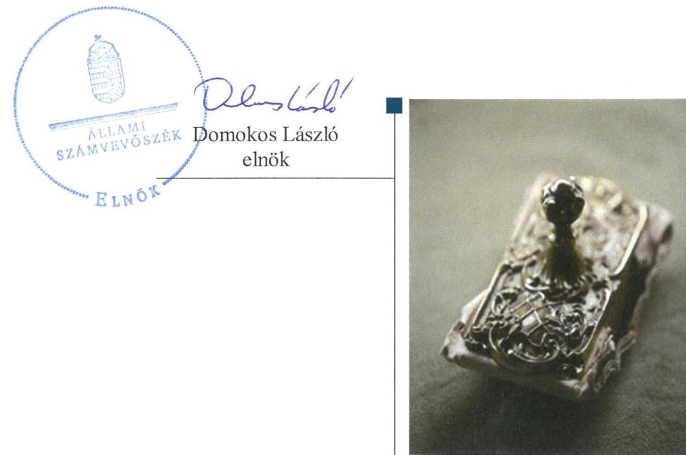
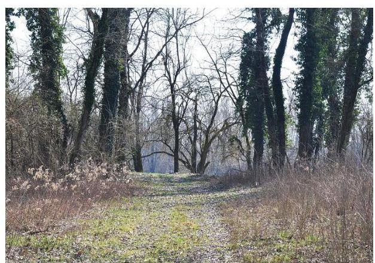

# Jelenetés 

## Központi költségvetési szervek ellenőrzése

Duna-Dráva Nemzeti Park Igazgatóság 2019.

---

# Jelenetés 

## Központi költségvetési szervek ellenőrzése

Duna-Dráva Nemzeti Park Igazgatóság 2019. 12. hó 30. nap

---

# AZ ELLENŐRZÉST FELÜGYELTE:

- **SALAMON ILDIKÓ** felügyeleti vezető

- **AZ ELLENŐRZÉST VEZETTE ÉS A VÉGREHAJTÁSÁÉRT FELELŐS:**
  - **DR. BENEDEK MÁRIA** ellenőrzésvezető
  - **A PROGRAM ÖSSZEÁLLÍTÁSÁÉRT FELELŐS:**
    - **TÓTPÁL SZABOLCS** osztályvezető

**IKTATÓSZÁM:** EL-2356-001/2019.

**TÉMASZÁM:** 2450

**ELLENŐRZÉS-AZONOSÍTÓ SZÁM:** V079118

---

Jelentéseink az Országgyűlés számítógépes hálózatán és az Interneta a www.asz.hu címen is olvashatóak.

---

# TARTALOMJEGYZÉK 

■ ÖSSZEGZÉS ..... 5
■ AZ ELLENŐRZÉS CÉLJA ..... 6
■ AZ ELLENŐRZÉS TERÜLETE ..... 7
■ AZ ELLENŐRZÉS HÁTTERE, INDOKOLTSÁGA ..... 8
■ A JELENTÉS LÉNYEGES KÉRDÉSKÖREI ..... 10
■ AZ ELLENŐRZÉS HATÓKÖRE ÉS MÓDSZEREI ..... 11
■ MEGÁLLAPÍTÁSOK ..... 14
■ JAVASLATOK ..... 17
■ MELLÉKLETEK ..... 19
I. sz. melléklet: Értelmező szótár ..... 19
■ FÜGGELÉK: ÉSZREVÉTELEK ..... 23
■ RÖVIDÍTÉSEK JEGYZÉKE ..... 29

---

.

---

# ÖSSZEGZÉS 

A Duna-Dráva Nemzeti Park Igazgatóság belső kontrollrendszerét nem müködtette szabályszerűen, így nem volt biztositott a közpénzekkel, a nemzeti vagyonnal való szabályszerű gazdálkodás. A pénzügyi-számviteli elektronikus információs rendszerből származó adatok megbizhatóságának hiányában az elszámoltathatóság, átláthatóság feltételei nem voltak biztositottak. A korrupciós kockázatokkal arányos kontrollokat nem alakították ki.

## Az ellenőrzés társadalmi indokoltsága

A központi alrendszer részét képező intézmények alapvető rendeltetése a közfeladatok ellátásának biztosítása. A közpénzek felhasználásában meghatározó, központi alrendszerbe tartozó intézmények pénzügyi és vagyongazdálkodási tevékenységük és/vagy feladatellátásuk súlya miatt jelentős hatást gyakorolhatnak a költségvetés egyensúlyának fenntartására. Hatással vannak továbbá az állami vagyonnal való gazdálkodás minőségére, a kormányzati (szak)politikák végrehajtására, illetve közfeladat ellátásuk vonatkozásában az állampolgárok életminőségére, jogaik és kötelezettségeik gyakorlására. Indokolt ezért, hogy az Állami Számvevőszék ezen intézmények pénzügyi és vagyongazdálkodását, az esetleges átalakulások szabályszerűségét rendszeresen ellenőrizze.

A Duna-Dráva Nemzeti Park Igazgatóság közfeladatot lát el és jelentős területet magában foglaló természetvédelmi területet felügyel, ezáltal állami vagyont kezel. A terület nagysága és kiemelt védettsége a társadalom széles körét érinti, így mindannyiunk számára kiemelt fontosságú a szervezet által kezelt nemzeti vagyon, és annak megőrzése.

## Főbb megállapítások, következtetések, javaslatok

A Duna-Dráva Nemzeti Park Igazgatóságnál a kockázatkezelési rendszer múködtetése, a kontrolltevékenységek gyakorlása, az információs és kommunikációs rendszer kialakítása és múködtetése, valamint a monitoring rendszer múködtetése terén megállapított szabálytalanságok miatt a belső kontrollrendszer kialakítása és múködtetése nem volt szabályszerű, így nem biztosította a közpénzek, a közvagyon szabályos felhasználását.

A Duna-Dráva Nemzeti Park Igazgatóság pénzügyi és vagyongazdálkodása az ellenőrzött években nem volt szabályszerű. A 2015-2016. évi mérleg tételeinek alátámasztásához nem állított össze leltárt. Mindezek alapján a 20152016. évi költségvetési beszámolók nem adtak megbízható és valós összképet a Duna-Dráva Nemzeti Park Igazgatóság vagyonáról, eszközeiről és forrásairól, azok alakulásáról. A számviteli beszámoló adatait magában foglaló pénzügyi-gazdasági elektronikus információs rendszer biztonsági osztályba sorolásának hiánya következtében nem volt biztosított a rendszer kockázatokkal arányos védelme, annak megbízható múködése és zártsága, valamint az azokban tárolt adatok védelme, megbízhatósága. Az ellenőrzött években a pénzügyi-gazdasági elektronikus információs rendszerből kinyert adatok ennek következtében nem alkalmasak megbízható és valós összképet biztosító tájékoztatás nyújtására a gazdálkodásra vonatkozóan, így nem voltak biztosítottak a pénzügyi- és a vagyongazdálkodás elszámoltathatóságának a feltételei.

A Duna-Dráva Nemzeti Park Igazgatóság múködése során a korrupciós kockázatok kezelése nem valósult meg az azzal arányos kontrollok kiépítésének hiányában.

A Duna-Dráva Nemzeti Park Igazgatóság igazgatója teljesítmény mérésére alkalmas követelményeket nem alakított ki, a szervezeti célok elérését szolgáló feladatokat nem határozott meg.

Az Állami Számvevőszék az intézkedések megtétele céljából az irányítószerv vezetőjeként az agrárminiszter részére egy a Duna-Dráva Nemzeti Park Igazgatóság igazgatója részére hét javaslatot fogalmazott meg.

---

# AZ ELLENŐRZÉS CÉLJA 

AZ ELLENŐRZÉS CÉLJA annak megítélése volt, hogy az ellenőrzött intézményre vonatkozó irányító szervi feladatellátás a jogszabályi előírások betartásával történt-e; az intézménynél a belső kontrollrendszer kialakítása és múködtetése szabályszerű volt-e, biztosította-e az átlátható, szabályszerű, gazdaságos, hatékony és eredményes gazdálkodás feltételeit; az intézmény pénzügyi és vagyongazdálkodása megfelelt-e a jogszabályi előírásoknak és belső szabályzatainak. Érvényesült-e a nemzeti vagyon kezelésének és védelmének célja, azaz a szervezet vagyona a közérdeket szolgálta-e a közös szükségletek kielégítése és a természeti erőforrások megóvása, valamint a jövő nemzedékek szükségleteinek figyelembevétele mellett. Az ellenőrzés kiterjedt annak értékelésére is, hogy a központi költségvetési szervnél kiépítették és erősítették-e korrupciós kockázatok kezelését szolgáló integritás kontrollokat, megteremtették-e a teljesítményellenőrzés feltételeit, illetve, hogy az ellenőrzött szervezet gazdálkodása megfelelt-e annak az Alaptörvényben meghatározott alapvetésnek, hogy Magyarország a kiegyensúlyozott, átlátható és fenntartható költségvetési gazdálkodás elvét érvényesíti.

---

# **AZ ELLENŐRZÉS TERÜLETE**

## **Duna-Dráva Nemzeti Park Igazgatóság**

A Duna-Dráva Nemzeti Park Igazgatóságot a környezetvédelmi és területfejlesztési miniszter rendelettel¹, 1990-ben alapította.

A Duna-Dráva Nemzeti Park Igazgatóság pécsi székhelyű központi költségvetési intézmény, amely a 2015-2017. években a természetvédelem területi igazgatása körébe tartozó közfeladatokat látott el. Tevékenysége többek között a területek védetté nyilvánítására, a védett és fokozottan védett területek, természeti értékek természetvédelmi kezelésére, körzeti erdő- és vadgazdálkodási tervezés-előkészítésre, állami vagyon kezelésével kapcsolatos feladatokra, természetvédelmi bemutató, ismeretterjesztő, oktatási célú, valamint ökoturisztikai létesítmények működtetésével kapcsolatos tevékenységre terjed ki.

A Duna-Dráva Nemzeti Park Igazgatóság irányító szerve 2015. január 1. és 2017. december 31. között a Földművelésügyi Minisztérium (jelenleg Agrárminisztérium) volt. A Duna-Dráva Nemzeti Park Igazgatóság önálló jogi személy. Az Áht.² alapján szervezeti átalakításra a 2015-2017. években nem került sor. A Duna-Dráva Nemzeti Park Igazgatóság rendelkezett gazdasági szervezettel, a gazdálkodással kapcsolatos feladatokat a gazdasági igazgatóhelyettes (gazdasági vezető) irányítása alatt álló szervezeti egységek látták el. A gazdasági vezető személyében a 2015-2017. években nem történt változás.

A Duna-Dráva Nemzeti Park Igazgatóság éves költségvetési beszámolói alapján a mérleg szerinti vagyona 2015. december 31-én meghaladta a 7 000 millió Ft-ot, ami 2017. december 31-ére több, mint 9 000 millió Ft-ra nőtt. Az éves költségvetési beszámolói alapján a teljesített összes bevétele a 2015. évi közel 2 000 millió Ft-ról a 2017. évre több, mint 3 000 millió Ft-ra emelkedett, a teljesített összes kiadása a 2015. évi több, mint 1 700 millió Ft-ról a 2017. évre közel 1 500 millió Ft-ra csökkent.

A Duna-Dráva Nemzeti Park Igazgatóság alkalmazásában álló személyek foglalkoztatása kormányzati szolgálati jogviszonyban, illetve közfoglalkoztatási jogviszonyban történt. Az átlagos statisztikai állományi létszám a 2015. évi 188 főről 2017. évre 202 főre, 7,4%-kal emelkedett. A munkáltatói jogokat az igazgató gyakorolta, akinek személyében a 2015-2017. években nem történt változás.

---

# AZ ELLENŐRZÉS HÁTTERE, INDOKOLTSÁGA 

Az államháztartás központi alrendszerének közpénz felhasználása, az intézmények által ellátott közfeladatok sokrétúsége, valamint a feladatellátásához rendelt vagyon nagyságrendje indokolja, hogy az ÁSZ ellenőrzéseket folytasson a pénzügyi és vagyongazdálkodás területén. Az ÁSZ az ellenőrzései során feltárja a gazdálkodást, a központi alrendszer intézményei átalakulását, átszervezését érintő szabályozások esetleges hiányosságait, a szabályozással nem érintett gazdálkodási területeket, rámutathat a vagyongazdálkodási tevékenység - ezen belül a tulajdonosi joggyakorlás és vagyonkezelés - esetleges szabálytalanságaira, értékeli az állami vagyon nyilvántartására és elszámolására vonatkozó eljárásokat.

Az ellenőrzés várhatóan hozzájárul a központi intézmények pénzügyi helyzetének pontosabb megítéléséhez, és a jó gyakorlat kialakításán és terjesztésén keresztül az ellenőrzések elősegíthetik a gazdálkodás szabályszerűségének javítását.

Az ellenőrzések megállapításai támogathatják az ellenőrzött szervezetek szabályszerű gazdálkodását, javaslataival elősegítheti az Alaptörvényben megfogalmazott alapvetések érvényesülését a mindennapi életben a szervezetek szintjén.

Az ellenőrzés a szervezet kockázatértékelése alapján, az egyedi és lényeges jellemzők figyelembevételével, az ellenőrzésre kiválasztott modullal történt. Az integritás- és belső kontroll modul a központi költségvetési szerv működésének irányítottságát, korrupció elleni védettségét értékeli.

A belső kontrollrendszer kialakítása és működtetése nélkül nem valósítható meg a közpénzek, a közvagyon átlátható, szabályos, gazdaságos, hatékony és eredményes felhasználása. A belső kontrollrendszer azt a célt szolgálja, hogy a költségvetési szervek működésük és gazdálkodásuk során a tevékenységeket szabályszerűen hajtsák végre, teljesítsék elszámolási kötelezettségeiket és megvédjék az erőforrásokat a veszteségektől, a károktól és a nem rendeltetésszerű használattól. A belső kontrollrendszer magában foglalja mindazon elveket, eljárásokat és belső szabályzatokat, melyek biztosítják, hogy a költségvetési szerv valamennyi tevékenysége és célja összhangban legyen a szabályszerűséggel, szabályozottsággal, valamint a gazdaságosság, hatékonyság és eredményesség követelményeivel, az eszközökkel és forrásokkal való gazdálkodásban ne kerüljön sor pazarlásra, visszaélésre, rendeltetésellenes felhasználásra. Megfelelő, pontos és naprakész információk álljanak rendelkezésre a költségvetési szerv múködésével kapcsolatosan, és a belső kontrollrendszer harmonizációjára, öszszehangolására vonatkozó jogszabályok végrehajtásra kerüljenek. Az integritás kontrollok kiépítése, erősítése a szervezet korrupciós kockázatainak kezelését szolgálja. A teljesítménykövetelmények meghatározása és múködtetése megalapozhatja a központi költségvetési szervnél a teljesítményellenőrzés lefolytatását.

Az egyes ellenőrzések megállapításaival és egy időszak ellenőrzési eredményeinek elemzésével az ÁSZ ráirányíthatja a jogalkotók figyelmét a központi alrendszerben vagy annak egy ágazatában esetlegesen felmerülő pénzügyi, szabályozási feszültségekre. Az elvégzett ellenőrzések során az

---

ÁSZ „jó gyakorlatokat" is azonosíthat, melyeket tanácsadó funkciója keretében szélesebb körben is megismertethet az érintettekkel, ezáltal is hozzájárulva a költségvetési rendszer szabályozott, átlátható, kiegyensúlyozott és fenntartható múködéséhez.

---

# A JELENTÉS LÉNYEGES KÉRDÉSKÖREI 

1.     - A Duna-Dráva Nemzeti Park Igazgatóságra vonatkozó irányító szervi feladatellátás szabályszerű volt-e?
2.     - A belső kontrollrendszer kialakítása és müködtetése biztosi-totta-e a közpénzekkel és a nemzeti vagyonnal történő szabályszerű gazdálkodást?
3.     - A Duna-Dráva Nemzeti Park Igazgatóság pénzügyi és vagyongazdálkodása szabályszerű volt-e?
4.     - A Duna-Dráva Nemzeti Park Igazgatóságnál kialakították-e a teljesítmény mérésére alkalmas követelményeket?

---

# AZ ELLENŐRZÉS HATÓKÖRE ÉS MÓDSZEREI 

## Az ellenőrzés típusa

Megfelelőségi ellenőrzés.

## Az ellenőrzött időszak

A 2015-2017. évek.

## Az ellenőrzés tárgya

A Duna-Dráva Nemzeti Park Igazgatóságra vonatkozó irányító szervi feladatok ellátása a 2015-2016. évben.

A belső kontrollrendszerének a kialakítása és múködtetése, valamint vagyongazdálkodása tekintetében 2015-2017. évek, a pénzügyi gazdálkodás tekintetében a 2015-2016. év, az integritáskontrollok kiépítettsége és a teljesítményellenőrzés feltételei a 2017. évben.

Az ellenőrzés kiterjedt minden olyan körülményre és adatra, amely az ÁSZ jogszabályban meghatározott feladatainak teljesítéséhez, valamint a program végrehajtása folyamán felmerült újabb összefüggések feltárásához szükséges.

## Az ellenőrzött szervezet

Duna-Dráva Nemzeti Park Igazgatóság,
Agrárminisztérium, mint irányító szerv.

## Az ellenőrzés jogalapja

Az ellenőrzés jogszabályi alapját az ÁSZ tv. ${ }^{5} 1$. § (3) bekezdés, 5. § (2)-(4) és (6) bekezdései, valamint az Áht. 61. § (2) bekezdésének előírásai képezték.

## Az ellenőrzés módszerei

Az ellenőrzésre a szakmai program szempontjai, az ellenőrzött időszakban hatályos jogszabályok, az ellenőrzés szakmai szabályai, a jelen ellenőrzésre irányadó ÁSZ módszertanok figyelembevételével került sor.

---

Az ÁSZ az ellenőrzés ideje alatt a Duna-Dráva Nemzeti Park Igazgatósággal és az Agrárminisztériummal a kapcsolattartást az ÁSZ SZMSZ4-ének vonatkozó előírásai alapján biztosította.

Az ellenőrzési kérdések megválaszolásához szükséges bizonyítékok megszerzése a Duna-Dráva Nemzeti Park Igazgatóság és az Irányító szerv által rendelkezésre bocsátott dokumentumokra, adatokra alapozva megfigyelés, kérdésfeltevés (információkérés), valamint elemző eljárás útján történt.

Az ellenőrzési bizonyítékként felhasználható adatforrások közé tartoztak egyrészt a szakmai program részletes szempontjainál felsorolt adatforrások, másrészt minden egyéb - az ellenőrzés folyamán feltárt, az ellenőrzés szempontjából információt tartalmazó - dokumentum.

Az ellenőrzés lefolytatásához az ellenőrzött szervezet a tanúsítványok kitöltésével, valamint az ÁSZ által kért dokumentumok megküldésével szolgáltatott adatokat, amelyek valódiságát és teljes körűségét az ellenőrzött szervezet vezetője által tett teljességi és hitelességi nyilatkozat igazolta. Az így rendelkezésre bocsátott adatok, információk kontrollja az ellenőrzés keretében történt.

Az ellenőrzés kiterjedt minden olyan körülményre és adatra, amely az ÁSZ jogszabályban meghatározott feladatainak teljesítéséhez, valamint a program végrehajtása folyamán felmerült újabb összefüggések feltárásához szükséges volt.

A számvevőszéki jelentésben foglalt megállapítások, következtetések alátámasztására, az elegendő és megfelelő bizonyíték megszerzése érdekében az ÁSZ - módszertani eljárásaiban foglaltaknak eleget téve - értékelte a megszerzett ellenőrzési bizonyítékok forrását és jellegét. Mérlegelte továbbá az ellenőrzési bizonyítékként felhasználandó információ relevanciáját és megbízhatóságát. Az ellenőrzöttek által rendelkezésre bocsátott adatok, információk megfelelőségének - vagyis tárgyhoz tartozóságának, helytállóságának és megbízhatóságának - kontrollja az ellenőrzés keretében történt.

A Duna-Dráva Nemzeti Park Igazgatóság pénzügyi-gazdasági elektronikus információs rendszereiben kezelt, az ellenőrzés rendelkezésére bocsátott adatok, információk megbízhatóságának kontrollja céljából az ÁSZ független hivatalos forrásból, a Nemzetbiztonsági Szakszolgálat Nemzeti Kibervédelmi Intézettől, mint a jogszabály által kijelölt hatóságtól kért adatokat. Az adatbekérés a Duna-Dráva Nemzeti Park Igazgatóság pénzügyigazdasági elektronikus információs rendszerei biztonsági osztályba sorolását tartalmazó és azt igazoló dokumentumokra terjedt ki.

Az állami és önkormányzati szervek elektronikus információbiztonságáról szóló 2013. évi L. törvény előírásai biztosítják az elektronikus információs rendszerekben kezelt adatok és információk bizalmasságának, sértetlenségének és rendelkezésre állásának, valamint ezek rendszerelemei sértetlenségének és rendelkezésre állásának zárt, teljes körű, folytonos és a kockázatokkal arányos védelmét. A kockázatokkal arányos védelmi szint kialakítása érdekében az elektronikus információs rendszereket biztonsági osztályba kell sorolni, amelyet az adott szerv vezetője hagy jóvá és az informatikai biztonsági szabályzatban kell rögzíteni, amelyet meg kell küldeni az NKI5 részére.

Az ellenőrzés során ezért az ÁSZ értékelte azt is, hogy biztosított volt-e az ellenőrzéshez rendelkezésre bocsátott adatok származási helyének, a

---

pénzügyi-gazdasági elektronikus információs rendszer sértetlenségének alapfeltétele, annak biztonsági osztályba sorolása.

Amennyiben nem történt meg a pénzügyi-gazdasági elektronikus információs rendszer biztonsági osztályba sorolása, és ennek következményeként nem volt biztosított az abban kezelt adatok és információk sértetlenségének zárt, teljes körű, folytonos és a kockázatokkal arányos védelme, abban az esetben a megbízható adatok hiányával érintett területeket az ÁSZ úgy értékelte, hogy nem állnak rendelkezésre az ellenőrzés részletes lefolytatásához a megfelelő ellenőrzési bizonyítékok.

A központi költségvetési szerv belső kontrollrendszere egyes pilléreinek kialakítására és múködtetésére vonatkozó értékelés:
$\longrightarrow$ „szabályszerű", amennyiben az értékelt területen az elért „igen" válaszok százalékban kifejezett, egész számra kerekített aránya legalább $85 \%$,
$\longrightarrow$ „nem szabályszerű", ha nem éri el a 85\%-ot,
A központi költségvetési szerv belső kontrollrendszerének összesített értékelése az egyes részterületek esetében kapott megfelelőségi arányok számtani átlaga alapján történt és megegyezett a pillérenként (kontrollterületenként) alkalmazott százalékos értékelésekkel, a következő eltérésekkel: a kontrollrendszer egésze esetében a „szabályszerű" értékelésnek a százalékos értéken felül további feltétele, hogy egyik kontrollterület sem kaphat „nem szabályszerű" értékelést.

---

# 1. A Duna-Dráva Nemzeti Park Igazgatóságra vonatkozó irányító szervi feladatellátás szabályszerű volt-e? 

Összegző megállapítás Az Irányító szerv ${ }^{6}$ DDNPI $^{7}$-re vonatkozó feladatellátása a 20152016. években szabályszerű volt.

Az Alapító okiratról ${ }^{8}$ az Irányító szerv az Ávr. ${ }^{9}$-ben előírtakkal összhangban gondoskodott.

Az Irányító szerv az Áht.-ban foglaltak alapján jóváhagyta a DDNPI SZMSZ-ét ${ }^{10}$.

Az elemi költségvetés bevételek és kiadások megállapításához a tervezési követelményeket az Ávr. alapján az Irányító szerv meghatározta, az Áht. és az Áhsz. ${ }^{11}$ előírásai alapján jóváhagyta a DDNPI éves költségvetési beszámolóit, elemi költségvetéseit.

## 2. A belső kontrollrendszer kialakítása és múködtetése biztosította-e a közpénzekkel és a nemzeti vagyonnal történő szabályszerű gazdálkodást?

Összegző megállapítás A DDNPI belső kontrollrendszerének kialakítása és múködtetése nem biztosította a közpénzekkel és a nemzeti vagyonnal történő megbízható és szabályszerű gazdálkodást a 20152017. években.

A KONTROLLKÖRNYEZET kialakítása szabályszerű volt. A DDNPI rendelkezett az Áht., Ávr. előírása szerinti SZMSZ-szel és Ügyrend ${ }^{12}$ -del. A DDNPI a Bkr. ${ }^{13}$ alapján meghatározta az Integritási szabályzatban ${ }^{14}$ és a Belső kontrollrendszer szabályzatban ${ }^{15}$ a szervezeti integritást sértő események kezelésének eljárásrendjét.

A Számv. tv. ${ }^{16}$ és az Áhsz. alapján a DDNPI rendelkezett Számviteli Politikával ${ }^{17}$ és az annak keretében készítendő Leltározási szabályzattal ${ }^{18}$, Értékelési szabályzattal ${ }^{19}$, Pénzkezelési szabályzattal és Számlarenddel ${ }^{20}$. A gazdálkodás rendjét a DDNPI az Ávr.-ben foglaltakkal összhangban a Kötelezettségvállalási szabályzatban ${ }^{21}$, a Vnytv. ${ }^{22}$ szerinti vagyonnyilatkozat-tételi kötelezettséggel kapcsolatos szabályokat az SZMSZ-ben és a Közszolgálati szabályzat ${ }^{23}$-ban meghatározta. Az Ávr. szerint a gazdálkodási jogkör gyakorlására jogosult személyekről és aláírás-mintájukról nyilvántartást vezettek.

A KOCKÁZATKEZELÉSI RENDSZER működtetése 2015. január 1-től 2016. szeptember 30-ig, az integrált kockázatkezelési rendszer

---

múködtetése 2017. január 2-ától 2017. december 31-ig nem volt szabályszerű, mert a Bkr. 7. § (2) bekezdésében foglalt előírás ellenére az Igazgató nem határozta meg az egyes kockázatokkal kapcsolatban szükséges intézkedések teljesítésének folyamatos nyomon követési módját.

Integrált kockázatkezelési rendszert az Igazgató a Bkr. 7. § (1) bekezdésében foglaltak ellenére 2016. október 1-től 2017. január 1-ig nem múködtetett.

A KONTROLLTEVÉKENYSÉG gyakorlása a 3. pénzügyi és vagyongazdálkodás fejezetben szereplő, az adatok megbízhatóságára vonatkozó megállapítások alapján nem volt szabályszerű.

# AZ INFORMÁCIÓS ÉS KOMMUNIKÁCIÓS RENDSZER kialakítása, múködtetése nem volt szabályszerű. 

Az Igazgató a 2015-2017. években az Ávr. 13. § (2) bekezdés h) pontjában előírtak ellenére belső szabályzatban nem rendezte a kötelezően közzéteendő adatok nyilvánosságra hozatalának rendjét.

Az Igazgató az Ltv. ${ }^{24}$ 10. § (1) bekezdés b) pontjában foglaltak ellenére Iratkezelési szabályzatot - a Magyar Nemzeti Levéltárral, az illetékes szaklevéltárral és a köziratok kezelésének szakmai irányításáért felelős miniszterrel egyetértésben - nem adott ki.

A MONITORING RENDSZER múködtetése nem volt szabályszerű.

Az Igazgató a 2017. évi külső ellenőrzések javaslatai alapján készült intézkedési tervek végrehajtásáról a Bkr. 14. § (2) bekezdésében foglaltak ellenére nem számolt be az fejezetet irányító szerv vezetőjének és a fejezetet irányító szerv belső ellenőrzési vezetőjének.

Az Igazgató a 2015-2017. években a Bkr. 11. § (2) bekezdésében foglaltak ellenére a belső kontrollrendszer minőségének értékelését tartalmazó nyilatkozatát nem küldte meg az Irányító szerv vezetőjének.

A DDNPI a Bkr. előírásának megfelelően belső ellenőrzés kialakításáról gondoskodott. Az Igazgató a Bkr. 45. § (4) bekezdésében előírtak ellenére a 2015-2016. években nem, a 2017. évben döntött a belső ellenőrzési jelentésekben foglaltak alapján készített intézkedési tervek jóváhagyásáról.

Az Igazgató 2015-2017. években a Bkr. 1. mellékletében foglaltak alapján nyilatkozott arról, hogy gondoskodott a DDNPI belső kontrollrendszere kialakításáról, valamint szabályszerű, eredményes és hatékony működésről. Az ÁSZ ellenőrzés megállapításai nem igazolták a nyilatkozatban foglaltakat.

A múködés során a korrupciós kockázatok kezelése nem valósult meg az azzal arányos kontrollok kiépítésének hiányában.

---

# 3. A Duna-Dráva Nemzeti Park Igazgatóság pénzügyi és vagyongazdálkodása szabályszerű volt-e? 

## Összegző megállapítás

A DDNPI pénzügyi és vagyongazdálkodása az ellenőrzött években nem volt szabályszerű.

A DDNPI-nél a pénzügyi-gazdasági elektronikus információs rendszereket - az Ibtv. ${ }^{25} 7 . \S$ (1) bekezdésében foglalt előírások ellenére - nem sorolták be biztonsági osztályba a bizalmasság, a sértetlenség és a rendelkezésre állás szempontjából. Ennek követeztében a pénzügyi-gazdasági elektronikus információs rendszerek megbízható múködése, zártsága, valamint az azokban kezelt adatok sértetlensége, a kockázatokkal arányos védelme nem volt biztosított, amely miatt a pénzügyi-gazdasági elektronikus információs rendszerben tárolt és az abból kinyert adatok nem voltak megbízhatóak.

A DDNPI a 2015-2016. években az éves költségvetési beszámoló részeként elkészített maradvány kimutatását alátámasztó - az Áhsz. 39. § (3) bekezdésében foglaltak ellenére a 14. melléklet II. 4. pontjában előírt tartalmú - kötelezettségvállalások és más fizetési kötelezettségek nyilvántartásával nem rendelkezett.

A DDNPI - az Áhsz. 5. § (1), 22. § (1)-(2) bekezdései, valamint a Számv. tv. 69. § (1) bekezdése előírása ellenére - a 2015-2016. évi éves költségvetési beszámolói mérlegtételeit nem támasztotta alá leltárral.

## 4. A Duna-Dráva Nemzeti Park Igazgatóságnál kialakították-e a teljesítmény mérésére alkalmas követelményeket?

Összegző megállapítás A DDNPI igazgatója nem alakította ki a teljesítmény mérésére alkalmas követelményeket 2017-ben.

A DDNPI-nél nem alakítottak ki a teljesítmény mérésre alkalmas követelményeket. A szervezeti célok elérését szolgáló feladatok, folyamatok tevékenységek mérését szolgáló indikátorokat, mérőszámokat, feladat- és teljesítménymutatókat a DDNPI nem képzett, így nem biztosította a teljesítménymérés lehetőségét.

---

# JAVASLATOK 

Az ÁSZ tv. 33. § (1) bekezdésében foglaltak értelmében az ellenőrzött szervezet vezetője köteles a jelentésben foglalt megállapításokhoz kapcsolódó intézkedési tervet összeállítani és azt a jelentés kézhezvételétől számított 30 napon belül az ÁSZ részére megküldeni. Amennyiben az ellenőrzött szervezet vezetője nem küldi meg határidőben az intézkedési tervet, vagy továbbra sem elfogadható intézkedési tervet küld, az Állami Számvevőszék elnöke az ÁSZ tv. 33. § (3) bekezdése a) és b) pontjaiban foglaltakat érvényesítheti.

## az agrárminiszternek

1. Tegyen intézkedéseket a feltárt hiányosságok és/vagy szabálytalanságok tekintetében a munkajogi felelősség tisztázására irányuló eljárás megindításáról, és ennek eredménye ismeretében tegye meg a szükséges intézkedéseket.
(2. sz. megállapítás 3., 8., és 10-11. bekezdése, 3. sz. megállapítás 1. és 3. bekezdése alapján)

## a Duna-Dráva Nemzeti Park Igazgatóság igazgatójának

1. Intézkedjen a Bkr. előírásának megfelelően az integrált kockázatkezelési rendszer müködtetése során az egyes kockázatokkal kapcsolatban szükséges intézkedések teljesítésének folyamatos nyomon követési módjának meghatározásáról.
(2. sz. megállapítás 3. bekezdése alapján)
2. Rendezve az Ávr. előírásának megfelelően belső szabályzatban a kötelezően közzéteendő adatok nyilvánosságra hozatalának rendjét.
(2. sz. megállapítás 7. bekezdése alapján)
3. Intézkedjen az Ltv. előírásának megfelelően az egyedi iratkezelési szabályzat - a Magyar Nemzeti Levéltárral, az illetékes szaklevéltárral és a köziratok kezelésének szakmai irányításáért felelős miniszterrel egyetértésben - történő kiadásáról.
(2. sz. megállapítás 8. bekezdése alapján)

---

4. Számoljon be a Bkr.-ben foglalt határidőben a külső ellenőrzések javaslatai alapján készült intézkedési tervek végrehajtásáról éves bontásban vezetett nyilvántartás alapján a fejezetet irányító szerv vezetőjének és a fejezetet irányító szerv belső ellenőrzési vezetőjének.
(2. sz. megállapítás 10. bekezdése alapján)
5. Intézkedjen a Bkr.-ben foglalt előírásnak megfelelően a DDNPI belső kontrollrendszere minőségének értékeléséről szóló vezetői nyilatkozat éves költségvetési beszámolóval együtt történő megküldéséről az irányító szerv vezetője részére.
(2. sz. megállapítás 11. bekezdése alapján)
6. Intézkedjen a jogszabályi előírásoknak megfelelően a pénzügyi-gazdasági elektronikus információs rendszer biztonsági osztályba sorolásáról.
(3. sz. megállapítás 1. bekezdése alapján)
7. Intézkedjen a jogszabályi előírásoknak megfelelő leltár összeállítására.
(3. sz. megállapítás 3. bekezdése alapján)

---

# MELLÉKLETEK 

- I. SZ. MELLÉKLET: ÉRTELMEZŐ SZÓTÁR
állami vagyon
állami vagyonnak minősül:
a) az állam tulajdonában lévő dolog, valamint a dolog módjára hasznosítható természeti erő,
b) az a) pont hatálya alá nem tartozó mindazon vagyon, amely vonatkozásában törvény az állam kizárólagos tulajdonjogát nevesíti,
c) az állam tulajdonában lévő tagsági jogviszonyt megtestesítő értékpapír, illetve az államot megillető egyéb társasági részesedés,
d) az államot megillető olyan immateriális, vagyoni értékkel rendelkező jogosultság, amelyet jogszabály vagyoni értékű jogként nevesít. (Forrás: Vtv. 1. § (2) bekezdése)
állami vagyon használója Az a természetes vagy jogi személy, jogi személyiséggel nem rendelkező szervezet, aki, vagy amely törvény vagy szerződés alapján, bármely jogcímen (bérlet, haszonbérlet, használat stb.) állami vagyont birtokol, használ, szedi annak hasznait, hasznosít, ide nem értve a haszonélvezőt, a vagyonkezelőt és a tulajdonosi jogok gyakorlóját. (Forrás: Vtvr. 1. § (7) bekezdés a) pontja)
állami vagyon hasznosítása Az állami vagyont az MNV Zrt. maga kezeli, vagy szerződés - így különösen bérlet, haszonbérlet, megbízás - alapján központi költségvetési szervnek, természetes vagy jogi személynek, vagy jogi személyiséggel nem rendelkező gazdálkodó szervezetnek hasznosításra átengedi.
(Forrás: Vtv. 23. § (1) bekezdése, hatályos 2012. január 1-jétől)
Az állami vagyonnal a tulajdonosi joggyakorló maga gazdálkodik, vagy szerződés - így különösen bérlet, haszonbérlet, megbízás - alapján hasznosításra átengedi, illetőleg vagyonkezelésbe, haszonélvezetbe adja. (Forrás: Vtv. 23. § (1) bekezdése, hatályos 2013. június 28 -ától)
Az állami vagyont az MNV Zrt. maga kezeli, vagy szerződés - így különösen bérlet, haszonbérlet, megbízás - alapján központi költségvetési szervnek, természetes vagy jogi személynek, vagy jogi személyiséggel nem rendelkező gazdálkodó szervezetnek hasznosításra átengedi." Az állami vagyonra vonatkozóan az MNV Zrt. kizárólag az Nvtv.-ben meghatározott személyekkel köthet vagyonkezelési szerződést. (Forrás: Vtv. 27. § (1) bekezdése, hatályos 2012. január 1-jétől)
Az ÁSZ 2011-ben indította el a közintézmények integritását vizsgáló és fejlesztő kérdőíves kutatását, melynek hétéves felmérési időszaka 2017. évben zárult le. Az ÁSZ az Integritás felmérés keretében 2017. évben hetedik alkalommal értékelte a közszféra intézményeinek korrupciós kockázatait, illetve a korrupció ellen védelmet biztosító kontrollok kiépítettségét. (Forrás: https://asz.hu/tanulmanyok-2017-ev Elemzés a közszféra integritás helyzetéről 2017. Vezetői összefoglaló 4. oldal)
ÁSZ Integritás Projekt
átalakítás
belső ellenőrzés

A költségvetési szerv általános jogutódlással történő megszüntetése átalakítással történhet. Az átalakítás lehet egyesítés vagy különválás. Az egyesítés lehet beolvadás vagy összeolvadás. (2014. december 31-ig, Áht. 9/A. § (3) és (4) bekezdés, 2015. január 1-jétől Áht. 11. § (2) bekezdés)
Független, tárgyilagos bizonyosságot adó és tanácsadó tevékenység, amelynek célja, hogy az ellenőrzött szervezet működését fejlessze és eredményességét növelje, az ellenőrzött szervezet céljai elérése érdekében rendszerszemléletű megközelítéssel és módszeresen értékeli, illetve fejleszti az ellenőrzött szervezet irányítási és belső kontrollrendszerének hatékonyságát. (Forrás: Bkr. 2. § b) pontja)

---

belső kontrollrendszer

Belső kontrollrendszer területei
ellenőrzési nyomvonal
hasznosítás
információs és kommunikációs rendszer
integritás
irányító szerv/felügyeleti szerv
kockázat
kockázatkezelési rendszer
kontrollkörnyezet

A belső kontrollrendszer a kockázatok kezelése és tárgyilagos bizonyosság megszerzése érdekében kialakított folyamatrendszer, amely azt a célt szolgálja, hogy a múködés és gazdálkodás során a tevékenységeket szabályszerűen, gazdaságosan, hatékonyan, eredményesen hajtsák végre, az elszámolási kötelezettségeket teljesítsék, megvédjék az erőforrásokat a veszteségektől, károktól és nem rendeltetésszerű használattól. (Forrás: Áht. 69. § (1) bekezdése)
A kontrollkörnyezet, a kockázatkezelési rendszer, a kontrolltevékenységek, az információs és kommunikációs rendszer, valamint a nyomon követési (monitoring) rendszer. (Forrás: Bkr. 3. §-a)
Az ellenőrzési nyomvonal a költségvetési szerv működési folyamatainak szöveges, táblázatokkal vagy folyamatábrákkal szemléltetett leírása, amely tartalmazza különösen a felelősségi és információs szinteket és kapcsolatokat, irányítási és ellenőrzési folyamatokat, lehetővé téve azok nyomon követését és utólagos ellenőrzését. (Forrás: Bkr. 6. § (3) bekezdés)
A nemzeti vagyon birtoklásának, használatának, hasznok szedése jogának bármely a tulajdonjog átruházását nem eredményező - jogcímen történő átengedése, ide nem értve a vagyonkezelésbe adást, valamint a haszonélvezeti jog alapítását. (Forrás: Nvtv. 3. § (1) bekezdés 4. pontja)
A költségvetési szerv vezetője által kialakított és működtetett olyan rendszer, mely biztosítja, hogy a megfelelő információk a megfelelő időben eljutnak az illetékes szervezethez, szervezeti egységhez, illetve személyhez. (Forrás: Bkr. 9. § (1) bekezdés)
Az integritás - egyik gyakran használt jelentése szerint - az elvek, értékek, cselekvések, módszerek, intézkedések konzisztenciáját jelenti, vagyis olyan magatartásmódot, amely meghatározott értékeknek megfelel. Integritás-irányítási rendszer bevezetése a szervezetben a szervezethez rendelt közfeladatok integritás szempontú ellátását, az érték alapú múködéssel (integritással) összefüggő szervezeti követelmények következetes érvényesítését jelenti. (Forrás: Nemzetgazdasági Minisztérium: Államháztartási Belső Kontroll Standardok és Gyakorlati Útmutató 1.6. Etikai értékek és integritás 46. oldal, 2017. szeptember)
Olyan folyamatalapú kockázatkezelési rendszer, amely a szervezet minden tevékenységére kiterjed, egységes módszertan és eljárások alkalmazásával, a szervezet célkitűzéseinek és értékeinek figyelembevételével biztosítja a szervezet kockázatainak teljes körű azonosítását, azok meghatározott kritériumok szerinti értékelését, valamint a kockázatok kezelésére vonatkozó intézkedési terv elkészítését és az abban foglaltak nyomon követését. (Forrás: Bkr. 2. § m) pontja, 2016. október 1-jétől)
A költségvetési szerv tekintetében az Áht.-ban meghatározott irányítási hatáskört gyakorló szerv. (Forrás: Áht. 1. § 9. pontja)
A kockázat annak a valószínűségét jelenti, hogy egy vagy több esemény vagy intézkedés nem kívánt módon befolyásolja a rendszer múködését, céljainak megvalósulását. (Forrás: Javaslatok a korrupciós kockázatok kezelésére - Kockázatkezelési és ellenőrzési módszertan 35. oldal, ÁSZ)
Olyan irányítási eszközök és módszerek összessége, melynek elemei a szervezeti célok elérését veszélyeztető tényezők (kockázatok) azonosítása, elemzése, csoportosítása, nyomon követése, valamint szükség esetén a kockázati kitettség mérséklése.(Forrás: Bkr. 2. § m) pontja)
A költségvetési szerv vezetője által kialakított olyan elvek, eljárások, belső szabályzatok összessége, amelyben világos a szervezeti struktúra, a folyamatok átláthatók, egyértelműek a felelősségi, hatásköri viszonyok és feladatok, meghatározottak, ismertek és elfogadottak az etikai elvárások a szervezet minden szintjén, átlátható a humán-erőforrás-kezelés. (Forrás: Bkr. 6. § (1) bekezdés)

---

kontrolltevékenységek

közfeladat
maradvány
nyomon követési rendszer (monitoring)
tulajdonosi joggyakorló
vagyongazdálkodás

A költségvetési szerv vezetője által a szervezeten belül kialakított (kontroll) tevékenységek, melyek biztosítják a kockázatok kezelését, hozzájárulnak a szervezet céljainak eléréséhez és erősítik a szervezet integritását. (Forrás: Bkr. 8. § (1) bekezdés)
Jogszabályban meghatározott állami vagy önkormányzati feladat, amit az arra kötelezett közérdekből, a jogszabályban meghatározott követelményeknek és feltételeknek megfelelve végez, ideértve a lakosság közszolgáltatásokkal való ellátását, továbbá az állam nemzetközi szerződésekben vállalt kötelezettségeiből adódó közérdekű feladatokat, valamint e feladatok ellátásakor szükséges infrastruktúra biztosítását is. (Forrás: Nvtv. 3. § (1) bekezdés 7. pontja)
A költségvetési év során a bevételek és kiadások különbözete, amely az alaptevékenység bevételei és kiadásai tekintetében a költségvetési maradvány, a vállalkozási tevékenység bevételei és kiadásai tekintetében a vállalkozási maradvány. (Forrás: Áht. 1. § 17. pont)
A költségvetési szerv vezetője köteles kialakítani a szervezet tevékenységének a célok megvalósításának nyomon követését biztosító rendszert, amely az operatív tevékenységek keretében megvalósuló folyamatos és eseti nyomon követésből, valamint az operatív tevékenységektől függetlenül működő belső ellenőrzésből áll. (Forrás: Bkr. 10. §)

Aki a nemzeti vagyon felett az államot vagy a helyi önkormányzatot megillető tulajdonosi jogok és kötelezettségek összességének gyakorlására jogosult. (Forrás: Nvtv. 3. § (1) bekezdés 17. pontja)

A nemzeti vagyongazdálkodás feladata a nemzeti vagyon rendeltetésének megfelelő, az állam, az önkormányzat mindenkori teherbíró képességéhez igazodó, elsődlegesen a közfeladatok ellátásához és a mindenkori társadalmi szükségletek kielégítéséhez szükséges, egységes elveken alapuló, átlátható, hatékony és költségtakarékos működtetése, értékének megőrzése, állagának védelme, értéknövelő használata, hasznosítása, gyarapítása, továbbá az állam vagy a helyi önkormányzat feladatának ellátása szempontjából feleslegessé váló vagyontárgyak elidegenítése. (Forrás: Nvtv. 7. § (2) bekezdése)

---

.

---

# FÜGGELÉK: ÉSZREVÉTELEK 

A jelentéstervezetet a Számvevőszék 15 napos észrevételezésre megküldte az ellenőrzött szervezetek vezetőinek az ÁSZ tv. 29. $\left.\S^{*} \text { (1) bekezdése elöirásának }\right.$ megfelelően.

A jelentéstervezet megállapításaira a DDNPI igazgatója észrevételt tett, az agrárminiszter nem tett észrevételt.
Az ÁSZ tv. 29. § (3) bekezdésével összhangban az ÁSZ a Függelékben feltünteti az ellenőrzés megállapításaival kapcsolatban tett, figyelembe nem vett észrevételeket, és megindokolja, hogy azokat miért nem fogadta el.

## A DDNPI igazgatója által tett, el nem fogadott észrevételek indokolása:

1. A jelentéstervezet Főbb megállapítások, következtetések, javaslatok 2. bekezdésével, valamint a jelentéstervezet 3. számú megállapítás 1. és 3. bekezdésével kapcsolatos észrevétel
Az igazgató észrevételében jelezte, hogy a mérleg tételei leltárral vannak alátámasztva minden évben, amelynek dokumentumait az adatszolgáltatás során az ellenőrzés rendelkezésére bocsátották.
Az igazgató észrevételében jelezte továbbá, hogy a pénzügyi-gazdasági elektronikus információs rendszer biztonsági osztályba sorolása 2014. 06. 25-én megtörtént az irányító szerv útmutatása alapján. A pénzügyigazdasági elektronikus információs rendszerük megbízható működését, zártságát, és a kezelt adatok sértetlenségét a szoftver üzemeltetője és a DDNPI belső eljárásrendje biztosítja. A rendszer megfelelőségére vonatkozó gyártói tanúsítványt az észrevétel mellékleteként megküldték. Az igazgató a besorolás hiányára alapozott következtetéssel, miszerint a DDNPI számviteli programjából származó adatok azok biztonsági osztályba sorolásának hiánya miatt nem megbízhatók, nem ért egyet.
Az észrevételben hivatkozott 2018. 07. 24-i keltezésű teljességi és hitelességi nyilatkozat alapján az ellenőrzés rendelkezésére bocsátott leltár dokumentumok nem felelnek meg a Számv. tv. 69. § (1) bekezdésben előírtaknak, mivel azok nem támasztják alá a mérleg valamennyi tételét mennyiségben és értékben. Az előbbiekre tekintettel a leltárra vonatkozó észrevételét nem fogadjuk el, a jelentéstervezet módosítása nem indokolt.

A DDNPI pénzügyi-gazdasági elektronikus információs rendszereiben kezelt, az Állami Számvevőszék ellenőrzése rendelkezésére bocsátott adatok, információk megbízhatóságának kontrollja céljából az ÁSZ a Nemzetbiztonsági Szakszolgálat Nemzeti Kibervédelmi Intézettől, mint a jogszabály által kijelölt hatóságtól

[^0]
[^0]:    * 29. § (1) Az Állami Számvevőszék az ellenőrzési megállapításait megküldi az ellenőrzött szervezet vezetőjének vagy az általa megbízott személynek, és annak, akinek személyes felelősségét állapította meg.
    (2) Az ellenőrzött szervezet vezetője és a felelősként megjelölt személy az ellenőrzés megállapításaira tizenöt napon belül írásban észrevételt tehet.
    (3) Az Állami Számvevőszék az észrevételre a beérkezésétől számított harminc napon belül írásban válaszol. A figyelembe nem vett észrevételeket köteles a jelentésben feltüntetni, és megindokolni, hogy azokat miért nem fogadta el.

---

kért adatokat. A független, hivatalos forrásból bekért adatok kiértékelése alapján az ÁSZ megállapította, hogy a Nemzeti Parknál a pénzügyi-gazdasági elektronikus információs rendszereket - az Ibtv. 7. § (1) bekezdése előírása ellenére - nem sorolták be biztonsági osztályba a bizalmasság, a sértetlenség és a rendelkezésre állás szempontjából. Ennek követeztében a pénzügyi-gazdasági elektronikus információs rendszerek megbízható működése, zártsága, valamint az azokban kezelt adatok sértetlensége, a kockázatokkal arányos védelme nem volt biztosított, amely miatt a pénzügyi-gazdasági elektronikus információs rendszerekben kezelt adatok nem voltak megbízhatóak.
Az ellenőrzés módszerei között a jelentéstervezetben rögzítésre került, hogy „Amennyiben nem történt meg a pénzügyi-gazdasági elektronikus információs rendszer biztonsági osztályba sorolása, és ennek következményeként nem volt biztosított az abban kezelt adatok és információk sértetlenségének zárt, teljes körű, folytonos és a kockázatokkal arányos védelme, abban az esetben a megbízható adatok hiányával érintett területeket az ÁSZ úgy értékelte, hogy nem állnak rendelkezésre az ellenőrzés részletes lefolytatásához a megfelelő ellenőrzési bizonyítékok." Az ellenőrzés részletes lefolytatásához szükséges bizonyítékok hiánya alapján az értékelendő terület nem szabályszerű minősítést kapott.
Az Ibtv. 15. § (1) bekezdésének d) pontja szerint a hatóság nyilvántartja és kezeli a szervezet informatikai biztonsági szabályzatát. A Nemzeti Kibervédelmi Intézet az ellenőrzés rendelkezésére bocsátotta „A DunaDráva Nemzeti Park Igazgatóság Szabályzata az Informatikai Biztonsági Szabályokról" (továbbiakban: Informatikai Biztonsági Szabályzat) című szabályzatot. A Nemzeti Kibervédelmi Intézetnél rendelkezésre álló Informatikai Biztonsági Szabályzathoz mellékletek nem kapcsolódnak, tehát a pénzügyi-gazdasági elektronikus információs rendszer biztonsági osztályának besorolására vonatkozó mellékletet sem tartalmaz. A biztonsági besorolást tartalmazó dokumentum a Nemzeti Kibervédelmi Intézetnél - amely hatóság az adatok, és az információk megbízhatóságának kontrollját biztosítja - nem áll rendelkezésre, így az nem támasztja alá az észrevételben foglaltakat. Ezért az észrevételéhez mellékletként csatolt dokumentumot az ÁSZ nem értékelte.

A fentiekre tekintettel a biztonsági osztályba sorolásra vonatkozó észrevételét nem fogadjuk el, a jelentéstervezet módosítása nem indokolt.

# 2. A jelentéstervezet Főbb megállapítások, következtetések, javaslatok 2. bekezdésével és a jelentéstervezet 2. számú megállapítás 14. bekezdésével kapcsolatos észrevétel 

Az igazgató észrevételében jelezte, hogy a jelentéstervezet megállapítása szerint a kontrollkörnyezet kialakítása szabályszerű volt. Észrevételében jelezte továbbá, hogy a korrupciós kockázatokat meghatározták, az azzal arányos kontrollok kiépítésre kerültek, amelyek szabályait a DDNPI gazdálkodására és ügymenetére vonatkozó szabályzatai részletesen tartalmaznak. A folyamatba épített kontrollok, a vezetői-, belső- és külső ellenőrzések a korrupciós kockázatot minimálisra csökkentik. A szabályzatok a jogszabályi előírásokat tartalmazzák. Az igazgató tájékoztatást adott arról, hogy a DDNPI jelentős számú uniós projektet bonyolított le, amelyek átfogó ellenőrzésen mentek keresztül. Az Európai Támogatásokat Auditáló Főigazgatóság ellenőrzése szabálytalanságot nem állapított meg.
Az ellenőrzés rendelkezésére bocsátott, 2016. július 1-jétől hatályos Integritás szabályzat a Bkr. 6. § (4a) bekezdés a) pontja ellenére nem tartalmazta a bejelentett kockázatok és események előzetes értékelésének módszertanát. Az adatszolgáltatás során a kockázatelemzés elvégzését igazoló dokumentumot nem bocsátottak az ellenőrzés rendelkezésére. Az előbbiekre alapozva levonható a következtetés miszerint a működés során a korrupciós kockázatok kezelése az azzal arányos kontrollok kiépítésének hiányában nem valósult meg.
A DDNPI-t érintő ellenőrzésekre vonatkozó beszámolójával kapcsolatban tájékoztatom, hogy az ÁSZ a jogszabályban, illetve belső szabályzatban foglaltak betartását ellenőrzi az ellenőrzés rendelkezésére bocsátott dokumentumokra alapozva. Megállapításait erre alapozva teszi meg, abban más ellenőrzést végző személy/szervezet véleményét nem szerepelteti.

---

A fentiekre tekintettel az észrevételt nem fogadjuk el, a jelentéstervezet módosítása nem indokolt.

# 3. A jelentéstervezet Főbb megállapítások, következtetések, javaslatok 4. bekezdésével és a jelentéstervezet 4. számú megállapítás 1. bekezdésével kapcsolatos észrevétel 

Az igazgató észrevételében jelezte, hogy a DDNPI feladatait jogszabály, alapító okirat részletesen szabályozza, és fejlesztési terv foglalja össze a fejlesztési irányokat, célokat. A kormánytisztviselőktől elvárt feladatellátást és követelményeket a munkaköri leírások tartalmazzák. A szakmai feladatokat minden évben tervezik, és jóváhagyás céljából megküldik az irányító szerv részére. Ezek alapján igazgatói utasításra az osztályvezetők meghatározzák a követelményeket. A DDNPI TÉR rendszert működtet, amelyben a kormánytisztviselők részére félévente követelményeket állapít meg a felettes vezető és értékeli azok telesítését.

Az észrevétel jelen pontjához kapcsolódó ellenőrzési megállapítás a szervezeti teljesítmény mérésére alkalmas követelményrendszer kialakítására vonatkozik, nem az egyéni teljesítménymérés követelményrendszerére. A kormánytisztviselőtől elvárt feladatellátás és követelmények meghatározása, szakmai feladatok tervezése, TÉR rendszer működtetése az egyéni teljesítményméréshez kapcsolódó tevékenységek, folyamatok.

A jogszabályban és az alapító okiratban foglaltak a DDNPI tevékenységeit határozzák meg, a fejlesztési terv az észrevételben rögzítettek alapján a tervezett fejlesztési irányokat és célokat tartalmazza. Az ellenőrzés megállapítása nem a DDNPI tevékenységei meghatározásának, és a szervezeti célok meglétének hiányát rögzíti. Az észrevételben hivatkozott dokumentumok a szervezeti célok elérését szolgáló feladatok, folyamatok tevékenységek mérését szolgáló indikátorokat, mérőszámokat, feladat- és teljesítménymutatókat amelynek hiányára az ellenőrzési megállapítás vonatkozik - nem tartalmaznak, így megállapítható, hogy a teljesítménymérés lehetősége nem volt biztosított, teljesítmény mérésre alkalmas követelményeket nem alakítottak ki.

A fentiekre tekintettel az észrevételt nem fogadjuk el, a jelentéstervezet módosítása nem indokolt.

## 4. A jelentéstervezet 2. számú megállapítás 3-4. bekezdésével kapcsolatos észrevétel

Az igazgató észrevételében jelezte, hogy az ellenőrzött időszakban kockázatkezelési rendszer, majd integrált kockázatkezelési rendszer működött a DDNPI-nél, amelyről a megküldött szabályzatok tanúskodnak.

Az ellenőrzés rendelkezésére bocsátott kockázatkezelési, illetve integrált kockázatkezelési rendszerhez kapcsolódó szabályzatok a kockázatkezelési, illetve az integrált kockázatkezelési rendszer kialakítását igazolják. Az ÁSZ ellenőrzés a kockázatkezelési, illetve integrált kockázatkezelési rendszer múködetésében, nem pedig kialakításában tárt fel hiányosságokat. A megküldött szabályzatok a Bkr. 7. § (1)-(2) bekezdésében foglaltak ellenére a kockázatkezelési, illetve az integrált kockázatkezelési rendszer működtetése során az egyes kockázatokkal kapcsolatban szükséges intézkedések teljesítésének folyamatos nyomon követési módjának meghatározását nem igazolják. Az előbbiekre tekintettel az észrevételt nem fogadjuk el, a jelentéstervezet módosítása nem indokolt.

## 5. A jelentéstervezet 2. számú megállapítás 5. bekezdésével kapcsolatos észrevétel

Az igazgató tájékoztatást adott arról, hogy a pénzügyi-gazdasági elektronikus információs rendszerrel kapcsolatos észrevételét levele 1. pontjában ismertette.

Az észrevétel elutasításával kapcsolatos indoklást az 1. pontban kifejtettek tartalmazzák.

## 6. A jelentéstervezet 2. számú megállapítás 7. bekezdésével kapcsolatos észrevétel

Az igazgató idézte az Ávr. 13. § (2) bekezdését, amely szerint a költségvetési szerv vezetője belső szabályzatban rendezi a működéséhez kapcsolódó, a költségvetési szerv előirányzatait terhelő pénzügyi kihatással bíró, jogszabályban nem szabályozott kérdéseket. Álláspontja szerint az Ávr. 168. §-a meghatározza a 6. sz. mellékletében, továbbá a 2011. évi CXII. törvény 1. mellékletében a kötelezően közzéteendő közérdekű

---

adatokat, így erre vonatkozó, ettől eltérő szabályzat készítése nem indokolható. Ezen túlmenően több ágazati jogszabály kitér a közzéteendő adatok nyilvánosságra hozatalának rendjére.
Az Ávr. észrevételben hivatkozott 13. § (2) bekezdése szó szerint a következőkről rendelkezik, „A költségvetési szerv vezetője belső szabályzatban rendezi a müködéséhez kapcsolódó, a költségvetési szerv előirányzatait terhelő pénzügyi kihatással bíró, jogszabályban nem szabályozott kérdéseket, így különösen...". Az Ávr. 13. § (2) bekezdés a)-h) pontjai felsorolják, hogy a költségvetési szerv vezetője mely kérdéseket köteles belső szabályzatban rögzíteni. Az Ávr. 13. § (2) bekezdés h) pontja egyértelműen rögzíti a közérdekú adatok megismerésére irányuló kérelmek intézése, továbbá a kötelezően közzéteendő adatok nyilvánosságra hozatalának rendje kérdésének belső szabályzatban történő rendezési kötelezettségét. Az előbbiekre tekintettel az észrevételt nem fogadjuk el, a jelentéstervezet módosítása nem indokolt.

# 7. A jelentéstervezet 2. számú megállapítás 8 . bekezdésével kapcsolatos észrevétel 

Az igazgató észrevételében jelezte, hogy a DDNPI az Ltv. 10. § (1) bekezdés a) pontjának hatálya alá tartozó szervezet. Az igazgató tájékoztatást adott továbbá arról, hogy az ellenőrzött időszakban egységes iratkezelési szabályzat kialakítása volt folyamatban. A 2015-2017. időszakban a 2010. március 1-jén kiadott 10491/2010. számú iratkezelési szabályzat szerint járt el.

Az észrevételben hivatkozott, Ltv. 10. § (1) bekezdés a) pontja szerint a közfeladatot ellátó szerv - a törvényben rögzített kivételekkel - az illetékes közlevéltárral egyetértésben egyedi iratkezelési szabályzatot ad ki. A DDNPI ugyan közfeladatot ellátó szerv, rá azonban a törvényben rögzített kivételek alkalmazandók, a következők szerint. A környezetvédelmi és természetvédelmi hatósági és igazgatási feladatokat ellátó szervek kijelöléséről szóló 71/2015. (III. 30.) Korm. rendelet 6. § (1) bekezdése szerint a nemzeti park igazgatóságok szervezetrendszere központi hivatalként működő központi költségvetési szerv. A központi államigazgatási szervekről, valamint a Kormány tagjai és az államtitkárok jogállásáról szóló 2010. évi XLIII. törvény (továbbiakban: Ksztv.) 1. § (2) bekezdése ellenőrzött időszakban hatályos rendelkezése szerint a központi hivatal központi államigazgatási szerv. A jelenleg hatályos Ksztv. 1. § (2) bekezdés a) pontja alapján a kormányzati igazgatásról szóló 2018. évi CXXV. törvény 2. § (2) bekezdés e) pontja szerint központi államigazgatási szerv a központi hivatal. A Kormány tagjainak feladat- és hatásköréről szóló, 2018. május 21-ig hatályos 152/2014. (VI. 6.) Korm. rendelet 1. melléklet D) pontja, a 2018. május 22-től hatályos 94/2018. (V. 22.) Korm. rendelet 1. melléklet G) pontja a központi államigazgatási szervek között sorolja fel a Nemzeti park igazgatóságokat. Az előbbiek alapján a DDNPI esetében az Ltv. 10. § (1) bekezdés a) pontjában foglalt kivételi szabály alkalmazandó, vagyis rá a 10. § (1) bekezdés b) pontja alapján fogalmazta meg az ÁSZ a megállapítását.

Az adatszolgáltatás során 2007. január 1-jétől hatályos Iratkezelési szabályzat dokumentumot bocsátottak az ellenőrzés rendelkezésére, amely nem minősül a Ltv. 10. § (1) bekezdés b) pontjában szabályozott iratkezelési szabályzatnak. Köszönettel vettük az egységes iratkezelési szabályzat kiadásáról szóló tájékoztatását, az ellenőrzési megállapításokban azonban azt az ÁSZ nem vette figyelembe, az ellenőrzési megállapításokat az ellenőrzött időszakban hatályban lévő szabályzatokra alapozta. Az észrevételéhez mellékletként csatolt, az adatszolgáltatásra biztosított határidőn kívül utólag megküldött dokumentumot az ÁSZ nem értékeli. Az előbbiekre tekintettel az észrevételt nem fogadjuk el, a jelentéstervezet módosítása nem indokolt.

## 8. A jelentéstervezet 2. számú megállapítás 10. bekezdésével kapcsolatos észrevétel

Az igazgató észrevételében jelezte, hogy a külső ellenőrzésekről szóló nyilvántartást minden évben bekéri a fejezetet irányító szerv, amelyre a DDNPI határidőben adatszolgáltatást küld. Ez így történt a 2017. évben is. Az észrevétel szerint az ÁSZ adatbekérő levelében csak a „külső ellenőrzések nyilvántartása, beszámoló az ellenőrzésekről" szerepelt, az irányító szerv részére történő megküldését igazoló dokumentum nem.
Az EL-0912-003/2018. iktatószámú adatbekérő levél 2. számú melléklet V. 5. 14. pontjában szerepel a

---

„külső ellenőrzések nyilvántartása, beszámoló az ellenőrzésekről" dokumentumok bekérése. A Bkr. 14. § (2) bekezdésében foglaltak szerint a költségvetési szerv vezetője a Bkr. 14. § (1) bekezdésben meghatározott nyilvántartás alapján a tárgyévet követő év január 31-ig beszámol a fejezetet irányító szerv vezetőjének és a fejezetet irányító szerv belső ellenőrzési vezetőjének. Az ÁSZ ezért nem az észrevételben rögzített, irányító szerv részére történő megküldését igazoló dokumentumát kérte az adatbekérés során, hanem a jogszabályi előírással összhangban a beszámolót. A jelentéstervezet megállapítása is a beszámolási kötelezettség elmaradását rögzíti.
Az ÁSZ az ellenőrzési megállapításait az adatszolgáltatás során a részére törvényi határidőben rendelkezésre bocsátott dokumentumokra alapozva fogalmazza meg. A teljességi és hitelességi nyilatkozatuk szerint az ÁSZ részére átadott dokumentumok, adatok megbízhatóak, és a bekért adatokra, dokumentumokra vonatkozóan teljes körű információt tartalmaznak. A teljességi és hitelességi nyilatkozat alapján a DDNPI az adatszolgáltatás során 2017. évi külső ellenőrzések javaslatai alapján készült intézkedési tervek végrehajtásáról készült beszámolót nem bocsátott az ellenőrzés rendelkezésére. Az észrevételben hivatkozott, 2018. 07. 24-i keltezésú teljességi és hitelességi nyilatkozat 212. tétele a 2017. évi Külső ellenőrzésekhez kapcsolódó intézkedések nyilvántartását, nem pedig az intézkedési tervek végrehajtásáról szóló beszámolás dokumentumát tartalmazza. Az észrevételéhez mellékletként csatolt, az adatszolgáltatásra biztosított határidőn kívül utólag megküldött dokumentumot az ÁSZ nem értékeli. Az előbbiekre tekintettel az észrevételt nem fogadjuk el, a jelentéstervezet módosítása nem indokolt.

# 9. A jelentéstervezet 2. számú megállapítás 11. bekezdésével kapcsolatos észrevétel 

Az igazgató észrevételében jelezte, hogy a nyilatkozat a beszámolóval együtt az irányító szerv részére minden évben megküldésre került, amelyet az adatszolgáltatás során az ellenőrzés rendelkezésére bocsátottak.

Az ÁSZ az ellenőrzési megállapításait az adatszolgáltatás során a részére törvényi határidőben rendelkezésre bocsátott dokumentumokra alapozva fogalmazza meg. A teljességi és hitelességi nyilatkozatuk szerint az ÁSZ részére átadott dokumentumok, adatok megbízhatóak, és a bekért adatokra, dokumentumokra vonatkozóan teljes körű információt tartalmaznak. A teljességi és hitelességi nyilatkozat alapján a DDNPI az adatszolgáltatás során a 2015-2017. évek tekintetében a belső kontrollrendszer minőségének értékelését tartalmazó nyilatkozat irányító szerv részére történő megküldésének dokumentumát nem bocsátotta az ellenőrzés rendelkezésére. Az észrevételében hivatkozott három dokumentum az éves költségvetési beszámoló megküldését igazolja, a nyilatkozat megküldését nem, mivel a dokumentumok a nyilatkozat megküldésére vonatkozó utalást nem tartalmaznak. Az előbbiekre tekintettel az észrevételt nem fogadjuk el, a jelentéstervezet módosítása nem indokolt.

## 10. A jelentéstervezet 2. számú megállapítás 12. bekezdésével kapcsolatos észrevétel

Az igazgató észrevételében jelezte, hogy az intézkedési tervek jóváhagyása a 2015-2016. években is megtörtént, azonban az adatszolgáltatás során feltöltésük tévedésből kimaradt.
Az ÁSZ az ellenőrzési megállapításait az adatszolgáltatás során a részére törvényi határidőben rendelkezésre bocsátott dokumentumokra alapozva fogalmazza meg. A teljességi és hitelességi nyilatkozatuk szerint az ÁSZ részére átadott dokumentumok, adatok megbízhatóak, és a bekért adatokra, dokumentumokra vonatkozóan teljes körű információt tartalmaznak. A teljességi és hitelességi nyilatkozat alapján a DDNPI az adatszolgáltatás során a 2015-2016. évekre vonatkozó intézkedési tervek jóváhagyási dokumentumát nem bocsátotta az ellenőrzés rendelkezésére. Az észrevételéhez mellékletként csatolt, az adatszolgáltatásra biztosított határidőn kívül utólag megküldött dokumentumot az ÁSZ nem értékeli. Az előbbiekre tekintettel az észrevételt nem fogadjuk el, a jelentéstervezet módosítása nem indokolt.

---

# 11. A jelentéstervezet 2. számú megállapítás 13. bekezdésével kapcsolatos észrevétel 

Az igazgató észrevételében jelezte, hogy a DDNPI a nyilatkozattal foglaltakkal összhangban alakította ki belső kontrollrendszerét, amelyek álláspontjuk szerint garantálják a szabályszerű, eredményes és hatékony működést, ezt eredményeik és a belső, illetve külső ellenőrzések is alátámasztják.
Az ÁSZ az adatszolgáltatás során a részére törvényi határidőben rendelkezésre bocsátott dokumentumokra alapozva megállapította, hogy a DDNPI belső kontrollrendszerének kialakítása és működtetése nem biztosította a közpénzekkel és a nemzeti vagyonnal történő megbízható és szabályszerű gazdálkodást a 20152017. években. Igazgató úr arról nyilatkozott, hogy gondoskodott a DDNPI belső kontrollrendszere kialakításáról, valamint szabályszerű, eredményes és hatékony működésről. Igazgató úr nyilatkozatában foglaltak nem igazolták az ÁSZ ellenőrzés megállapításait, ezért az észrevételt nem fogadjuk el, a jelentéstervezet módosítása nem indokolt.

## 12. A jelentéstervezet 3. számú megállapítás 2. bekezdésével kapcsolatos észrevétel

Az igazgató észrevételében jelezte, hogy a DDNPI rendelkezett az Áhsz. által előírt tartalmú nyilvántartással, amelyet az ellenőrzés rendelkezésére bocsátott.

Az adatszolgáltatás során az ellenőrzés rendelkezésére bocsátott 2015. és 2016. évi kötelezettségvállalások nyilvántartása című táblázat nem tartalmaz valamennyi, az Áhsz. 14. melléklet II. 4. pontjában előírt kötelező tartalmi elemet. A 2015. és 2016. évi kötelezettségvállalások nyilvántartása az Áhsz. 14. melléklet II. 4. a) pontjában foglaltak ellenére a pénzügyi ellenjegyzésre vonatkozó adatokat, az a) és b) pontjában foglaltak ellenére a kötelezettségvállalás, más fizetési kötelezettséget tanúsító dokumentum keltét, az e) pontjában foglaltak ellenére a pénzügyi teljesítési határidőket, a g) pontjában foglaltak ellenére a pénzügyi teljesítések dátumát, az utalványozás Ávr. 59. § (2) bekezdése szerinti dokumentumának azonosításához szükséges adatokat, valamint a h) pontjában foglaltak ellenére a pénzügyi teljesítési adatok könyiviteli számlákon történő elszámolásának időpontjait és a könyiviteli számlák megnevezését nem tartalmazta.
Az előbbiekre tekintettel az észrevételt nem fogadjuk el, a jelentéstervezet módosítása nem indokolt.

---

# RÖVIDÍTÉSEK JEGYZÉKE 

${ }^{1}$ rendelet
${ }^{2}$ Áht.
${ }^{3}$ ÁSZ tv.
${ }^{4}$ ÁSZ SZMSZ
${ }^{5}$ NKI
${ }^{6}$ Irányító szerv
${ }^{7}$ DDNPI
${ }^{8}$ Alapító okirat
${ }^{9}$ Ávr.
${ }^{10}$ SZMSZ
${ }^{11}$ Áhsz.
${ }^{12}$ Ügyrend
${ }^{13}$ Bkr.
${ }^{14}$ Integritási szabályzat
${ }^{15}$ Belső kontrollrendszer szabályzat
${ }^{16}$ Számv. tv.
${ }^{17}$ Számviteli politika
${ }^{18}$ Leltározási szabályzat
${ }^{19}$ Értékelési szabályzat
${ }^{20}$ Számlarend
${ }^{21}$ Kötelezettségvállalási szabályzat
a nemzeti park igazgatóságokról és a természetvédelmi igazgatóságokról szóló 3/1990. (XI.27) KTM rendelet (hatályos: 1990. december 1-jétől)
az államháztartásról szóló 2011. évi CXCV. törvény
(hatályos: 2012. január 1-jétől)
az Állami Számvevőszékről szóló 2011. évi LXVI. törvény
(hatályos: 2011. július 1-jétől)
Állami Számvevőszék Szervezeti és Működési Szabályzata
Nemzeti Kibervédelmi Intézet
Agrárminisztérium
Duna-Dráva Nemzet Park Igazgatóság
a Duna-Dráva Nemzet Park Igazgatóság alapító okirata
(KGF/733/2/2012. számú hatályos: 2012. július 4-étől;
KGF/406/2014. számú hatályos: 2014. január 1-jétől;
IfPF/965/4/2015. számú hatályos: 2015. december 16-ától)
az államháztartásról szóló törvény végrehajtásáról szóló 368/2011. (XII. 31.) Korm. rendelet (hatályos: 2012. január 1-jétől)
a Duna-Dráva Nemzeti Park Igazgatóság Szervezeti és működési szabályzata, (hatályos: 2012. december 20-ától)
az államháztartás számviteléről szóló 4/2013. (I. 11.) Korm. rendelet (hatályos: 2014. január 1-jétől)
Ügyrend a Duna-Dráva Nemzeti Park Igazgatóság gazdasági szervezetének gazdálkodással összefüggő feladataira,
(hatályos:450-4/2015. 2015. január 2-ától, 418-4/2016. 2016. január 2-ától)
a költségvetési szervek belső kontrollrendszeréről és belső ellenőrzéséről szóló 370/2011. (XII. 31.) Korm. rendelet (hatályos: 2012. január 1-jétől)
1/2016. Igazgatói utasítás Duna-Dráva Nemzeti Park Igazgatóság integritási szabályzatáról (hatályos: 2016. július 1-étől)
a Duna-Dráva Nemzeti Park Igazgatóság belső kontrollrendszer szabályozása (hatályos: 450-17/2015. 2015. január 2-ától, 388-23/2017. 2017. január 2-ától)
a számvitelről szóló 2001. évi C. törvény (hatályos: 2001. január 1-jétől)
a Duna-Dráva Nemzeti Park Igazgatóság Számviteli politikája
(hatályos: 450-5/2015. 2015. január 14-étől, 418-5/2016. 2016. január 25-étől, 388-15/2017. 2017. január 9-étől)
a Duna-Dráva Nemzeti Park Igazgatóság Leltározási. Leltárkészítési Szabályzata (hatályos: 450-11/2015. 2015. január 02-től, 418-10/2016. 2016. január 02-től)
a Duna-Dráva Nemzeti Park Igazgatóság Eszközök és források értékelési és elhatárolási szabályzata (hatályos: 450-9/2015. 2015. január 02-től, 418-9/2016. 2016. január 02-től)
Duna-Dráva Nemzeti Park Igazgatóság Számlarendjének Szabályzata (hatályos: 450-6/2015. 2015. január 15-étől, 418-6/2016. 2016. január 12-étől, 388-14/2017. 2017. január 9-étől
a Duna-Dráva Nemzeti Park Igazgatóság kötelezettségvállalás, ellenjegyzés, érvényesítés, szakmai teljesítés igazolás, utalványozás rendjéről, valamint a szerződéskötések rendjéről szóló szabályzata
(hatályos: 450-3/2015. 2015. január 2-ától, 418-3/2016. 2016. január 2-ától, 388-11/2017. 2017. január 2-ától)

---

${ }^{22}$ Vnytv.
${ }^{23}$ Közszolgálati szabályzat
${ }^{24}$ Ltv.
${ }^{25}$ Ibtv.
egyes vagyonnyilatkozat-tételi kötelezettségekről szóló 2007. évi CLII. törvény (hatályos: 2007. december 07-től)
a Duna-Dráva Nemzeti Park Igazgatóság Közszolgálati szabályzata (hatályos: 2014. január 06-tól)
a köziratokról, a közlevéltárakról és a magánlevéltári anyagok védelméről szóló 1995. évi LXVI törvény (hatályos: 1991. január 1-jétől)
az állami és önkormányzati szervek elektronikus információbiztonságáról szóló 2013. évi L. törvény (hatályos: 2013. július 1-től)

---

# ÁLLAMI SZÁMVEVŐSZÉK 

1052 Budapest, Apáczai Csere János utca 10.
Levélcím: 1364 Budapest 4. Pf. 54
Telefon: +36 14849100 Telefax: +36 14849200
www.asz.hu