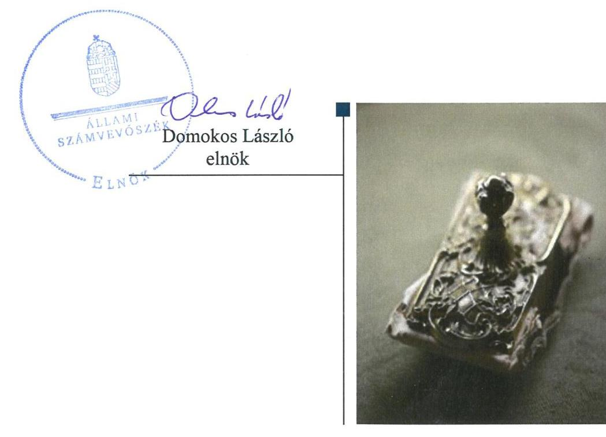

# Jelenetés 

## Központi költségvetési szervek ellenőrzése

Balaton-felvidéki Nemzeti Park Igazgatóság 2019. 12. hó 30. nap

---

# AZ ELLENŐRZÉST FELÜGYELTE:

DR. BENEDEK MÁRIA felügyeleti vezető

## AZ ELLENŐRZÉST VEZETTE ÉS A VÉGREHAJTÁSÁÉRT FELELŐS:

NEMESVÁRI-HORTHY ESZTER ellenőrzésvezető

## A PROGRAM ÖSSZEÁLLÍTÁSÁÉRT FELELŐS:

TÓTPÁL SZABOLCS osztályvezető

IKTATÓSZÁM: EL-2363-001/2019.

TÉMASZÁM: 2450

ELLENŐRZÉS-AZONOSÍTÓ SZÁM: V079120

Jelentéseink az Országgyűlés számítógépes hálózatán és az Interneten a www.asz.hu címen is olvashatóak.

---

# TARTALOMJEGYZÉK 

■ ÖSSZEGZÉS ..... 5
■ AZ ELLENŐRZÉS CÉLJA ..... 7
■ AZ ELLENŐRZÉS TERÜLETE ..... 8
■ AZ ELLENŐRZÉS HÁTTERE, INDOKOLTSÁGA ..... 9
■ A JELENTÉS LÉNYEGES KÉRDÉSKÖREI ..... 11
■ AZ ELLENŐRZÉS HATÓKÖRE ÉS MÓDSZEREI ..... 12
■ MEGÁLLAPÍTÁSOK ..... 15
■ JAVASLATOK ..... 18
■ MELLÉKLETEK ..... 21
I. sz. melléklet: Értelmező szótár ..... 21
■ FÜGGELÉK: ÉSZREVÉTELEK ..... 25
■ RÖVIDÍTÉSEK JEGYZÉKE ..... 33

---

.

---

# ÖSSZEGZÉS 

A csopaki székhelyű Balaton-felvidéki Nemzeti Park Igazgatóság belső kontrollrendszerét nem működtette szabályszerűen, így nem volt biztosított a közpénzekkel, a nemzeti vagyonnal való szabályszerű gazdálkodás. A pénzügyi-számviteli elektronikus információs rendszerből származó adatok megbízhatóságának hiányában az elszámoltathatóság, átláthatóság feltételei nem voltak biztosítottak. Az integritás kontrollok kiépítettsége nem járult hozzá a korrupciós kockázatok mérsékléséhez.

## Az ellenőrzés társadalmi indokoltsága

A közpénzek felhasználásában és az állami vagyonnal való gazdálkodásban a központi költségvetési szervek meghatározó súlyt képviselnek. Ez indokolja, hogy az Állami Számvevőszék ellenőrzéseket folytasson a pénzügyi és vagyongazdálkodás területén. Az Állami Számvevőszék az ellenőrzései során értékeli a belső kontrollrendszer jogszabályi előírások szerinti kialakítását és működtetésének szabályszerűségét, feltárja a gazdálkodás esetleges hiányosságait, rámutathat a vagyongazdálkodási tevékenység - ezen belül a tulajdonosi joggyakorlás és vagyonkezelés - esetleges szabálytalanságaira. Az Állami Számvevőszék az ellenőrzésével hozzá kíván járulni a központi intézmények pénzügyi helyzetének pontosabb megítéléséhez, a jó gyakorlat kialakításán és terjesztésén keresztül az ellenőrzések elősegíthetik a gazdálkodás szabályszerűségének javítását.

A Balaton-felvidéki Nemzeti Park Igazgatóság közfeladatot lát el, jelentős nagyságú természetvédelmi területet felügyel, állami vagyont kezel.

## Főbb megállapítások, következtetések, javaslatok

A Balaton-felvidéki Nemzeti Park Igazgatóságnál a kontrollkörnyezet kialakítása szabályszerű volt, a kockázatkezelési és integrált kockázatkezelési rendszert működtették. A kontrolltevékenységek gyakorlása, az információs és kommunikációs rendszer kialakítása és működtetése nem volt szabályszerű. A monitoring rendszert nem működtették. Ezen hiányosságok következtében a Balaton-felvidéki Nemzeti Park Igazgatóság belső kontrollrendszerének kialakítása és működtetése nem volt szabályszerű, így nem biztosította a közpénzek, a közvagyon szabályos felhasználását.

A Balaton-felvidéki Nemzeti Park Igazgatóság pénzügyi és vagyongazdálkodása az ellenőrzött években nem volt szabályszerű. A 2015-2017. évi mérleg tételeinek alátámasztásához nem állított össze leltárt. Mindezek alapján a 2015-2017. évi költségvetési beszámolók nem adtak megbízható és valós összképet a Balaton-felvidéki Nemzeti Park Igazgatóság vagyonáról, eszközeiről és forrásairól, azok alakulásáról. Nem gondoskodott a számviteli beszámoló adatait magában foglaló a pénzügyi gazdasági elektronikus információs rendszereknek, valamint az azokban kezelt adatoknak a kockázatokkal arányos védelme érdekében egy-egy biztonsági osztályba sorolásáról, ezáltal nem biztosította az azokban kezelt adatoknak a megbízhatóságát. A pénzügyi-gazdasági elektronikus információs rendszerek, az azokban kezelt adatok védettsége és sértetlensége, valamint a számviteli előírások szerinti, valóságnak megfelelő, zárt rendszerű nyilvántartás vezetés követelményének való megfeleltetés nem érvényesült. A pénzügyi-gazdasági elektronikus információs rendszerből kinyert adatok ennek következtében nem alkalmasak megbízható és valós összképet biztosító tájékoztatás nyújtására a gazdálkodásra vonatkozóan, így nem voltak biztosítottak a pénzügyi- és a vagyongazdálkodás elszámoltathatóságának a feltételei.

A Balaton-felvidéki Nemzeti Park Igazgatóságnál a jogszabályok által előírt kontrollok kiépítettségének szintje nem támogatta az integritás elvű működést. Az integritást erősítő kontrollokat alacsony szinten működtette. A Balatonfelvidéki Nemzeti Park Igazgatóság igazgatója a teljesítmény mérésére alkalmas követelményrendszer kiépítéséről nem gondoskodott, így nem biztosította a szervezet teljesítmény mérésének lehetőségét.

---

Az Állami Számvevőszék a jelentésében foglalt megállapítások alapján a Balaton-felvidéki Nemzeti Park Igazgatóság igazgatója részére hét, az agrárminiszter részére egy javaslatot fogalmazott meg.

---

# AZ ELLENŐRZÉS CÉLJA 

AZ ELLENŐRZÉS CÉLJA annak megítélése volt, hogy az ellenőrzött intézményre vonatkozó irányító szervi feladatellátás a jogszabályi előírások betartásával történt-e; az intézménynél a belső kontrollrendszer kialakítása és működtetése szabályszerű volt-e, biztosította-e az átlátható, szabályszerű, gazdaságos, hatékony és eredményes gazdálkodás feltételeit; az intézmény pénzügyi és vagyongazdálkodása megfelelt-e a jogszabályi előírásoknak és belső szabályzatainak. Érvényesült-e a nemzeti vagyon kezelésének és védelmének célja, azaz a szervezet vagyona a közérdeket szolgálta-e a közös szükségletek kielégítése és a természeti erőforrások megóvása, valamint a jövő nemzedékek szükségleteinek figyelembevétele mellett. Az ellenőrzés kiterjedt annak értékelésére is, hogy a központi költségvetési szervnél kiépítették és erősítették-e korrupciós kockázatok kezelését szolgáló integritás kontrollokat, megteremtették-e a teljesítményellenőrzés feltételeit, illetve, hogy az ellenőrzött szervezet gazdálkodása megfelelt-e annak az Alaptörvényben meghatározott alapvetésnek, hogy Magyarország a kiegyensúlyozott, átlátható és fenntartható költségvetési gazdálkodás elvét érvényesíti.

---

# **AZ ELLENŐRZÉS TERÜLETE**

## **Balaton-felvidéki Nemzeti Park Igazgatóság**

A csopaki székhelyű Balaton-felvidéki Nemzeti Park Igazgatóság 1997. szeptember 23-ától a Közép-dunántúli Természetvédelmi Igazgatóság jogutódjaként jött létre. Közfeladata természetvédelmi közszolgáltatás és jogszabályban meghatározott közhatalmi tevékenység. Fő tevékenysége a környezet- és természetvédelem. A működési területe kiterjed Veszprém- és Zala megye területére, Győr-Moson-Sopron megyében 6 település közigazgatási területére, Somogy megye területén 5 település közigazgatási területére, valamint a Balaton Kiemelt Üdülőkörzetbe tartozó településekre, kivéve Marcali település teljes közigazgatási területére.

A Balaton-felvidéki Nemzeti Park Igazgatóság gazdasági szervezettel rendelkező, központi államigazgatási szerv, amelynek irányítását a Minisztérium1 látta el. A 2015-2016. években az Áht.2 szerinti átalakítás nem történt. A Balaton-felvidéki Nemzeti Park Igazgatóságot vezető Igazgató3 és a Gazdasági igazgató4 személye az ellenőrzött időszakban nem változott.

A Balaton-felvidéki Nemzeti Park Igazgatóság éves költségvetési beszámolók adatai szerint a teljesített bevétele a 2015. évi 1581,3 millió Ft-ról 2017. évre 5480,3 millió Ft-ra, csaknem 3,5-szeresére növekedett. Bevételeiből a finanszírozási bevétel 2015-ben 338,4 millió Ft volt, 2017-ben 4292,1 millió Ft. A teljesített kiadása a 2015. évi 1436,2 millió Ft-ról 2162,6 millió Ft-ra, 1,5-szeresére növekedett. A munkavállalók létszáma a 2015. évi 185 főről 2017. évre 187 főre változott.

---

# AZ ELLENŐRZÉS HÁTTERE, INDOKOLTSÁGA 

Az államháztartás központi alrendszerének közpénz felhasználása, az intézmények által ellátott közfeladatok sokrétűsége, valamint a feladatellátásához rendelt vagyon nagyságrendje indokolja, hogy az ÁSZ ${ }^{5}$ ellenőrzéseket folytasson a pénzügyi és vagyongazdálkodás területén. Az ÁSZ az ellenőrzései során feltárja a gazdálkodást, a központi alrendszer intézményei átalakulását, átszervezését érintő szabályozások esetleges hiányosságait, a szabályozással nem érintett gazdálkodási területeket, rámutathat a vagyongazdálkodási tevékenység - ezen belül a tulajdonosi joggyakorlás és vagyonkezelés - esetleges szabálytalanságaira, értékeli az állami vagyon nyilvántartására és elszámolására vonatkozó eljárásokat.

Az ellenőrzés várhatóan hozzájárul a központi intézmények pénzügyi helyzetének pontosabb megítéléséhez, és a jó gyakorlat kialakításán és terjesztésén keresztül az ellenőrzések elősegíthetik a gazdálkodás szabályszerűségének javítását.

Az ellenőrzések megállapításai támogathatják az ellenőrzött szervezetek szabályszerű gazdálkodását, javaslataival elősegítheti az Alaptörvényben megfogalmazott alapvetések érvényesülését a mindennapi életben a szervezetek szintjén. A központi költségvetés rendszerében zajló folyamatok holisztikus elemzései, a kockázatok folyamatos figyelemmel kísérésének módszerével, az így kiválasztott szervezetek célzott, hatékony ellenőrzéseivel az ÁSZ betölti a legfőbb gazdasági ellenőrző szerv küldetését.

Az ellenőrzés a szervezet kockázatértékelése alapján, az egyedi és lényeges jellemzők figyelembevételével, az ellenőrzésre kiválasztott modullal történt. Az integritás- és belső kontroll modul a központi költségvetési szerv működésének irányítottságát, korrupció elleni védettségét értékeli.

A belső kontrollrendszer kialakítása és működtetése nélkül nem valósítható meg a közpénzek, a közvagyon átlátható, szabályos, gazdaságos, hatékony és eredményes felhasználása. A belső kontrollrendszer azt a célt szolgálja, hogy a költségvetési szervek működésük és gazdálkodásuk során a tevékenységeket szabályszerűen hajtsák végre, teljesítsék elszámolási kötelezettségeiket és megvédjék az erőforrásokat a veszteségektől, a károktól és a nem rendeltetésszerű használattól. A belső kontrollrendszer magában foglalja mindazon elveket, eljárásokat és belső szabályzatokat, melyek biztosítják, hogy a költségvetési szerv valamennyi tevékenysége és célja összhangban legyen a szabályszerűséggel, szabályozottsággal, valamint a gazdaságosság, hatékonyság és eredményesség követelményeivel, az eszközökkel és forrásokkal való gazdálkodásban ne kerüljön sor pazarlásra, visszaélésre, rendeltetésellenes felhasználásra. Megfelelő, pontos és naprakész információk álljanak rendelkezésre a költségvetési szerv működésével kapcsolatosan, és a belső kontrollrendszer harmonizációjára, összehangolására vonatkozó jogszabályok végrehajtásra kerüljenek. Az integritás kontrollok kiépítése, erősítése a szervezet korrupciós kockázatainak kezelését szolgálja. A teljesítménykövetelmények meghatározása és működtetése megalapozhatja a központi költségvetési szervnél a teljesítményellenőrzés lefolytatását.

---

Az egyes ellenőrzések megállapításaival és egy időszak ellenőrzési eredményeinek elemzésével az ÁSZ ráirányíthatja a jogalkotók figyelmét a központi alrendszerben vagy annak egy ágazatában esetlegesen felmerülő pénzügyi, szabályozási feszültségekre. Az elvégzett ellenőrzések során az ÁSZ „jó gyakorlatokat" is azonosíthat, melyeket tanácsadó funkciója keretében szélesebb körben is megismertethet az érintettekkel, ezáltal is hozzájárulva a költségvetési rendszer szabályozott, átlátható, kiegyensúlyozott és fenntartható működéséhez.

---

# A JELENTÉS LÉNYEGES KÉRDÉSKÖREI 

1. Szabályszerű volt-e az ellenőrzött központi költségvetési szervre vonatkozó irányító szervi feladatellátás?
2. A belső kontrollrendszer kialakítása és működtetése szabályszerű volt-e, biztosította-e a közpénzekkel és a nemzeti vagyonnal történő szabályszerű és átlátható gazdálkodást?
3. A központi költségvetési szerv pénzügyi és vagyongazdálkodása szabályszerű volt-e?
4. A központi költségvetési szervnél alakítottak-e ki a teljesítmény mérésére vonatkozó követelményeket?

---

# AZ ELLENŐRZÉS HATÓKÖRE ÉS MÓDSZEREI 

## Az ellenőrzés típusa

Megfelelőségi ellenőrzés.

## Az ellenőrzött időszak

2015-2017. évek

## Az ellenőrzés tárgya

A Balaton-felvidéki Nemzeti Park Igazgatóságra vonatkozó irányító szervi feladatok ellátása a 2015-2016. évben.

A Balaton-felvidéki Nemzeti Park Igazgatóság belső kontrollrendszerének a kialakítása és működtetése, valamint vagyongazdálkodása tekintetében 2015-2017. évek, a pénzügyi gazdálkodás tekintetében a 2015-2016. év, az integritáskontrollok kiépítettsége és a teljesítményellenőrzés feltételei a 2017. évben.

## Az ellenőrzött szervezet

Balaton-felvidéki Nemzeti Park Igazgatóság és az irányítószervi feladatellátás tekintetében az Agrárminisztérium.

## Az ellenőrzés jogalapja

Az ellenőrzés jogszabályi alapját az ÁSZ tv. 1. § (3) bekezdés, 5. § (2)-(4) és (6) bekezdései, valamint az Áht. 61. § (2) bekezdésének előírásai képezték.

## Az ellenőrzés módszerei

Az ellenőrzésre a szakmai program szempontjai, az ellenőrzött időszakban hatályos jogszabályok, az ellenőrzés szakmai szabályai, a jelen ellenőrzésre irányadó ÁSZ módszertanok figyelembevételével került sor.

Az ellenőrzés ideje alatt az ellenőrzött szervezetekkel történő kapcsolattartást az ÁSZ az ÁSZ SZMSZ ${ }^{\circledR}$-ének vonatkozó előírásai alapján biztosította.

Az ellenőrzési kérdések megválaszolásához szükséges bizonyítékok megszerzése az ellenőrzött szervezetek által rendelkezésre bocsátott dokumentumokra, adatokra alapozva megfigyelés, szemle (szemrevételezés), kérdésfeltevés (információkérés), valamint elemző eljárás útján történik. Az ellenőrzési bizonyítékként felhasználható adatforrások közé tartoztak egyrészt a szakmai program részletes szempontjainál felsorolt adatforrások, másrészt minden egyéb - az ellenőrzés folyamán feltárt, az ellenőrzés szempontjából információt tartalmazó - dokumentum.

Az ellenőrzés lefolytatásához az ellenőrzött szervezetek a tanúsítványok kitöltésével, valamint az ÁSZ által kért dokumentumok megküldésével szolgáltattak adatokat, amelyek valódiságát és teljes körűségét az ellenőrzött szervezet vezetője által tett teljességi és hitelességi nyilatkozat igazolja. A rendelkezésre bocsátott adatok, információk kontrollja az ellenőrzés keretében történt.

Az ellenőrzés kiterjedt minden olyan körülményre és adatra, amely az ÁSZ jogszabályban meghatározott feladatainak teljesítéséhez, valamint a program végrehajtása folyamán felmerült újabb összefüggések feltárásához szükséges volt.

A számvevőszéki jelentésben
 foglalt megállapítások, következtetések alátámasztására, az elegendő és megfelelő bizonyíték megszerzése érdekében az ÁSZ módszertani eljárásaiban foglaltaknak eleget téve - értékelte a megszerzett ellenőrzési bizonyítékok forrását és jellegét. Mérlegelte továbbá az ellenőrzési bizonyítékként felhasználandó információ relevanciáját és megbízhatóságát. Az ellenőrzöttek által rendelkezésre bocsátott adatok, információk megfelelőségének - vagyis tárgyhoz tartozóságának, helytállóságának és megbízhatóságának - kontrollja az ellenőrzés keretében történt.

A Balaton-felvidéki Nemzeti Park Igazgatóság pénzügyi-gazdasági elektronikus információs rendszereiben kezelt, az ellenőrzés rendelkezésére bocsátott adatok, információk megbízhatóságának kontrollja céljából az ÁSZ független hivatalos forrásból, a Nemzetbiztonsági Szakszolgálat Nemzeti Kibervédelmi Intézettől, mint a jogszabály által kijelölt hatóságtól kért adatokat. Az adatbekérés a Balaton-felvidéki Nemzeti Park Igazgatóság pénzügyi-gazdasági elektronikus információs rendszerei biztonsági osztályba sorolását tartalmazó és azt igazoló dokumentumokra terjedt ki.

Az állami és önkormányzati szervek elektronikus információbiztonságáról szóló 2013. évi L. törvény előírásai biztosítják az elektronikus információs rendszerekben kezelt adatok és információk bizalmasságának, sértetlenségének és rendelkezésre állásának, valamint ezek rendszerelemei sértetlenségének és rendelkezésre állásának zárt, teljes körű, folytonos és a kockázatokkal arányos védelmét. A kockázatokkal arányos védelmi szint kialakítása érdekében az elektronikus információs rendszereket biztonsági osztályba kell sorolni, amelyet az adott szerv vezetője hagy jóvá és az informatikai biztonsági szabályzatban kell rögzíteni, amelyet meg kell küldeni az NKI ${ }^{7}$ részére.

Az ellenőrzés során ezért az ÁSZ értékelte azt is, hogy biztosított volt-e az ellenőrzéshez rendelkezésre bocsátott adatok származási helyének, a pénzügyi-gazdasági elektronikus információs rendszer sértetlenségének alapfeltétele, annak biztonsági osztályba sorolása.

Amennyiben nem történt meg a pénzügyi-gazdasági elektronikus információs rendszer biztonsági osztályba sorolása, és ennek következményeként nem volt biztosított az abban kezelt adatok és információk sértetlenségének zárt, teljes körű, folytonos és a kockázatokkal arányos védelme,

---

abban az esetben a megbízható adatok hiányával érintett területeket az ÁSZ úgy értékelte, hogy nem állnak rendelkezésre az ellenőrzés részletes lefolytatásához a megfelelő ellenőrzési bizonyítékok.

A Balaton-felvidéki Nemzeti Park Igazgatóság belső kontrollrendszere jogszabályi előírások szerinti kialakítása és működtetése szabályszerűségének értékelése az erre irányuló kérdésekre adott válaszok összesítése alapján, évente pillérenként (kontrollterületenként) és összesítetten történt. A belső kontrollrendszer egyes pilléreinek kialakítása „szabályszerű”, amennyiben az értékelt területen az „igen” válaszok százalékban kifejezett, egész számra kerekített aránya legalább 85%, „nem szabályszerű”, ha nem érte el a 85%-ot. A kontrollrendszer egésze esetében a „szabályszerű” értékelésnek a %-os értéken felül további feltétele volt, hogy egyik kontrollterület sem kaphatott „nem szabályszerű” értékelést.

---

# 1. Szabályszerű volt-e az ellenőrzött központi költségvetési szervre vonatkozó irányító szervi feladatellátás? 

Összegző megállapítás Az irányító szervi feladatellátás 2015-2016. években szabályszerű volt.

A BFNPI ${ }^{8}$ rendelkezett az Irányító szerv ${ }^{9}$ által az Áht. szerint kiadott, az Ávr. ${ }^{10}$-ben meghatározott tartalmú alapító okirattal ${ }^{11}$. A BFNPI rendelkezett az Áht. szerint az Irányító szerv által jóváhagyott SZMSZ ${ }^{12}$-el.

Az Irányító szerv az Ávr. előírásai szerint a tervezett bevételek és kiadások megállapításához meghatározta a tervezési követelményeket, az Áht. és az Áhsz. ${ }^{13}$ előírásai alapján jóváhagyta a BFNPI elemi költségvetéseit és éves költségvetési beszámolóit.

Munkáltatói jogait az Irányító szerv szabályszerűen gyakorolta. Az Igazgató és a Gazdasági igazgató a jogszabályi előírások szerinti kinevezéssel rendelkezett 2015-2016. években.

## 2. A belső kontrollrendszer kialakítása és működtetése szabályszerű volt-e, biztosította-e a közpénzekkel és a nemzeti vagyonnal történő szabályszerű és átlátható gazdálkodást?

Összegző megállapítás

A BFNPI belső kontrollrendszerének kialakítása és működtetése 2015-2017. években nem volt szabályszerű, nem biztosította a közpénzekkel és a nemzeti vagyonnal történő szabályszerű és átlátható gazdálkodást.

A KONTROLLKÖRNYEZET kialakítása 2015-2017. években szabályszerű volt. A BFNPI rendelkezett az Irányító szerv által az Áht. szerint jóváhagyott SZMSZ-el, amelyben a Vnytv. ${ }^{14}$ előírásaival összhangban meghatározta a vagyonnyilatkozat-tételre kötelezett munkaköröket. A BFNPI a gazdálkodására jellemző szabályokat, előírásokat - a Számv. tv. ${ }^{15}$ előírásainak eleget téve - számviteli politikában ${ }^{16}$ és annak keretében elkészített leltározási és leltárkészítési szabályzatban ${ }^{17}$, értékelési szabályzatban ${ }^{18}$ és pénzkezelési szabályzatban ${ }^{19}$ rögzítette. A gazdálkodási jogkörgyakorlásra jogosult személyek aláírás mintáit tartalmazó nyilvántartást az Ávr. előírásaival összhangban naprakészen vezette.

A BFNPI a Bkr. ${ }^{20}$ 6. § (1) bekezdés c) pontjában foglalt előírás ellenére nem alakított ki olyan kontrollkörnyezetet, amelyben meghatározottak, ismertek és elfogadottak az etikai elvárások a szervezet minden szintjén.

A KOCKÁZATKEZELÉSI RENDSZER kialakítása és működtetése 2015. január 1-jétől 2016. szeptember 30-ig szabályszerű volt. Az

---

integrált kockázatkezelési rendszer kialakítása 2016. október 1-jétől 2016. december 31-ig nem volt szabályszerű, mert a BFNPI a Bkr. 6. § (4) bekezdése előírása ellenére nem szabályozta az integrált kockázatkezelés eljárásrendjét. Az integrált kockázatkezelési rendszer kialakítása és működtetése 2017. évben szabályszerű volt. A BFNPI a Bkr. előírásaival összhangban elkészítette a Belső kontrollrendszer szabályzatban ${ }^{21}$ az integrált kockázatkezelésre vonatkozó eljárásrendjét és felmérte, megállapította a tevékenységében rejlő kockázatokat, meghatározta az egyes kockázatokkal kapcsolatban szükséges intézkedéseket, valamint azok teljesítésének folyamatos nyomon követésének módját.

A KONTROLLTEVÉKENYSÉGEK GYAKORLÁSA a 3. a pénzügyi és vagyongazdálkodás fejezetben szereplő, az adatok megbízhatóságára vonatkozó megállapítások alapján nem volt szabályszerű.

# AZ INFORMÁCIÓS ÉS KOMMUNIKÁCIÓS RENDSZER kialakítása és működtetése 2015-2017. években nem volt szabályszerű. 

A BFNPI az Ltv. ${ }^{22}$ 10. § (1) bekezdés b) pontja előírása ellenére nem rendelkezett a Magyar Nemzeti Levéltár, az illetékes szaklevéltár és a miniszter egyetértésével kiadott iratkezelési szabályzattal. A BFNPI az Info tv. ${ }^{23}$ 37. § (1) bekezdés előírása és 1. melléklete II./1. és III./1. pontja előírásai ellenére (SZMSZ, 2015-2017. évi éves költségvetés és beszámoló) közzétételi kötelezettségének 2015-2017. években nem tett eleget.

A MONITORING RENDSZER működtetése nem volt szabályszerű 2015-2017. években. A BFNPI a szervezet minden szintjét érvényesülő, megfelelő monitoring rendszert kialakította, azonban - a Bkr. 3. § e) pontjában előírtak ellenére -azt nem működtette. A belső ellenőrzést a BFNPI az Áht. és a Bkr. előírásai szerint kialakította és működtette 2015-2017. években.

Az Igazgató a belső kontrollrendszer minőségét 2015-2017. években a Bkr. 1. melléklete szerinti nyilatkozatban értékelte. Az ÁSZ ellenőrzés megállapításai nem igazolták a nyilatkozataiban foglaltakat.

A BFNPI-nél a jogszabályok által előírt kontrollok kiépítettségének szintje nem támogatta az integritás elvű működést. A BFNPI rendszeresen végzett kockázatelemzést, amelynek része volt a korrupciós kockázatok elemzése is. A BFNPI az integritást támogató kontrollokat működtette, de az egyéb az integritást erősítő kontrollokat csak alacsony szinten működtette.

## 3. A központi költségvetési szerv pénzügyi és vagyongazdálkodása szabályszerű volt-e?

## Összegző megállapítás

A BFNPI pénzügyi és vagyongazdálkodása az ellenőrzött években nem volt szabályszerű.

A BFNPI-nél a pénzügyi-gazdasági elektronikus információs rendszereket az Ibtv. ${ }^{24}$ 7. § (1) bekezdése előírása ellenére - nem sorolták be biztonsági

---

osztályba a bizalmasság, a sértetlenség és a rendelkezésre állás szempontjából. Ennek következtében a pénzügyi-gazdasági elektronikus információs rendszerek megbízható működése, zártsága, valamint az azokban kezelt adatok sértetlensége, a kockázatokkal arányos védelme nem volt biztosított, amely miatt a pénzügyi-gazdasági elektronikus információs rendszerekben kezelt adatok nem voltak megbízhatóak.

A BFNPI az éves költségvetési beszámoló részeként elkészített maradvány kimutatását a 2015-2016. években az Áhsz. 39. § (3) bekezdésében foglalt előírás ellenére a 14. melléklet II. 4. előírásai szerinti tartalmú kötelezettségvállalások nyilvántartásával nem támasztotta alá. A kötelezettségvállalások és más fizetési kötelezettségek nyilvántartása 2015-2016. években az Áhsz. 14. melléklet II. 4. a)-c), e), és g) pontjaiban foglalt tartalmi hiányosságok következtében nem volt szabályszerű.

A BFNPI a 2017. évi éves költségvetési beszámolójában a dologi és felhalmozási kiadásokat - az Áhsz. 5. § (1) bekezdése előírása ellenére - nem támasztotta alá főkönyvi kivonattal.

A BFNPI - az Áhsz. 5. § (1), 22. § (1)-(2) bekezdései, valamint a Számv. tv. 69. § (1) bekezdése előírása ellenére - a 2015-2017. évi éves költségvetési beszámolói mérleg tételeit nem támasztotta alá leltárral.

# 4. A központi költségvetési szervnél alakítottak-e ki a teljesítmény mérésére vonatkozó követelményeket? 

## Összegző megállapítás

A BFNPI-nél nem alakítottak ki a teljesítmény mérésére vonatkozó követelményeket.

A BFNPI nem képzett a szervezeti célok elérését szolgáló feladatok, folyamatok, tevékenységek mérését szolgáló indikátorokat, mérőszámokat, feladat- és teljesítménymutatókat, így nem biztosította a teljesítménymérés lehetőségét.

---

# JAVASLATOK 

Az ÁSZ tv. 33. § (1) bekezdésében foglaltak értelmében az ellenőrzött szervezet vezetője köteles a jelentésben foglalt megállapításokhoz kapcsolódó intézkedési tervet összeállítani és azt a jelentés kézhezvételétől számított 30 napon belül az ÁSZ részére megküldeni. Amennyiben az ellenőrzött szervezet vezetője nem küldi meg határidőben az intézkedési tervet, vagy továbbra sem elfogadható intézkedési tervet küld, az Állami Számvevőszék elnöke az ÁSZ tv. 33. § (3) bekezdés a) és b) pontjaiban foglaltakat érvényesítheti.

## az agrárminiszternek

1. Intézkedjen az Állami Számvevőszék ellenőrzése során feltárt hiányosságok és/vagy szabálytalanságok tekintetében a munkajogi felelősség tisztázására irányuló eljárás megindításáról, és ennek eredménye ismeretében tegye meg a szükséges intézkedéseket.
(a 2. megállapítás 2. bekezdés, 6. bekezdés 1-2. mondata, 7. bekezdés 2. mondat 2. tagmondata, valamint a 3. megállapítás 1., 3. és 4. bekezdése alapján)

## a BFNPI igazgatójának

1. Intézkedjen a Bkr. előírásának megfelelően olyan kontrollkörnyezet kialakításáról, amelyben meghatározottak, ismertek és elfogadottak az etikai elvárások a szervezet minden szintjén.
(2. megállapítás 2. bekezdés alapján)
2. Intézkedjen az Ltv. előírásának megfelelően az egyedi iratkezelési szabályzat - a Magyar Nemzeti Levéltárral, az illetékes szaklevéltárral és a köziratok kezelésének szakmai irányításáért felelős miniszterrel egyetértésben - történő kiadásáról.
(2. megállapítás 6. bekezdés 1. mondata alapján)
3. Intézkedjen az Info tv. 1. melléklete szerinti általános közzétételi lista II/1. és III/1. pontjában meghatározott adatok közül az SZMSZ, éves költségvetés és beszámoló jogszabályi előírásoknak megfelelő közzétételéről.
(2. megállapítás 6. bekezdés 2. mondata alapján)

---

4. Intézkedjen a Bkr. előírásának megfelelően a nyomon követési rendszer (monitoring) működtetéséről.
(2. megállapítás 7. bekezdés 2. mondat 2. tagmondata alapján)
5. Gondoskodjon az Ibtv.-ben foglalt előírásoknak megfelelően a pénzügyi-gazdasági elektronikus információs rendszerek és az azokban kezelt adatok biztonsági osztályba sorolásáról.
(3. megállapítás 1. bekezdése alapján)
6. Intézkedjen az Áhsz. előírásának megfelelően az éves költségvetési beszámolóban a dologi és felhalmozási kiadások főkönyvi kivonattal történő alátámasztásáról.
(3. megállapítás 3. bekezdése alapján)
7. Intézkedjen a Számv. tv. és az Áhsz. előírásának megfelelően a beszámoló elkészítéséhez, a mérleg tételeinek alátámasztásához olyan leltár összeállításáról, amely tételesen, ellenőrizhető módon tartalmazza az BFNPI mérleg fordulónapján meglévő eszközeit és forrásait mennyiségben és értékben.
(3. megállapítás 4. bekezdése alapján)

---

.

---

# MELLÉKLETEK 

- I. SZ. MELLÉKLET: ÉRTELMEZŐ SZÓTÁR
állami vagyon
állami vagyonnak minősül:
a) az állam tulajdonában lévő dolog, valamint a dolog módjára hasznosítható természeti erő,
b) az a) pont hatálya alá nem tartozó mindazon vagyon, amely vonatkozásában törvény az állam kizárólagos tulajdonjogát nevesíti,
c) az állam tulajdonában lévő tagsági jogviszonyt megtestesítő értékpapír, illetve az államot megillető egyéb társasági részesedés,
d) az államot megillető olyan immateriális, vagyoni értékkel rendelkező jogosultság, amelyet jogszabály vagyoni értékű jogként nevesít. (Forrás: Vtv. ${ }^{25}$)
 1. § (2) bekezdése)
állami vagyon használója Az a természetes vagy jogi személy, jogi személyiséggel nem rendelkező szervezet, aki, vagy amely törvény vagy szerződés alapján, bármely jogcímen (bérlet, haszonbérlet, használat stb.) állami vagyont birtokol, használ, szedi annak hasznait, hasznosít, ide nem értve a haszonélvezőt, a vagyonkezelőt és a tulajdonosi jogok gyakorlóját. (Forrás: Vtvr. ${ }^{26}$ 1. § (7) bekezdés a) pontja)
állami vagyon hasznosítása Az állami vagyont az MNV Zrt. ${ }^{27}$ maga kezeli, vagy szerződés - így különösen bérlet, haszonbérlet, megbízás - alapján központi költségvetési szervnek, természetes vagy jogi személynek, vagy jogi személyiséggel nem rendelkező gazdálkodó szervezetnek hasznosításra átengedi.
(Forrás: Vtv. 23. § (1) bekezdése, hatályos 2012. január 1-jétől)
Az állami vagyonnal a tulajdonosi joggyakorló maga gazdálkodik, vagy szerződés így különösen bérlet, haszonbérlet, megbízás - alapján hasznosításra átengedi, illetőleg vagyonkezelésbe, haszonélvezetbe adja. (Forrás: Vtv. 23. § (1) bekezdése, hatályos 2013. június 28-ától)
Az állami vagyont az MNV Zrt. maga kezeli, vagy szerződés - így különösen bérlet, haszonbérlet, megbízás - alapján központi költségvetési szervnek, természetes vagy jogi személynek, vagy jogi személyiséggel nem rendelkező gazdálkodó szervezetnek hasznosításra átengedi. Az állami vagyonra vonatkozóan az MNV Zrt. kizárólag az Nvtv. ${ }^{28}$-ben meghatározott személyekkel köthet vagyonkezelési szerződést. (Forrás: Vtv. 27. § (1) bekezdése, hatályos 2012. január 1-jétől)
ÁSZ Integritás Projekt Az ÁSZ 2011-ben indította el a közintézmények integritását vizsgáló és fejlesztő kérdőíves kutatását, melynek hétéves felmérési időszaka 2017. évben zárult le. Az ÁSZ az Integritás felmérés keretében 2017. évben hetedik alkalommal értékelte a közszféra intézményeinek korrupciós kockázatait, illetve a korrupció ellen védelmet biztosító kontrollok kiépítettségét. (Forrás: https://asz.hu/tanulmanyok-2017-ev Elemzés a közszféra integritás helyzetéről 2017. Vezetői összefoglaló 4. oldal)
átalakítás
belső ellenőrzés

A költségvetési szerv általános jogutódlással történő megszüntetése átalakítással történhet. Az átalakítás lehet egyesítés vagy különválás. Az egyesítés lehet beolvadás vagy összeolvadás. (2014. december 31-ig, Áht. 9/A. § (3) és (4) bekezdés, 2015. január 1-jétől Áht. 11. § (2) bekezdés)
Független, tárgyilagos bizonyosságot adó és tanácsadó tevékenység, amelynek célja, hogy az ellenőrzött szervezet működését fejlessze és eredményességét növelje, az ellenőrzött szervezet céljai elérése érdekében rendszerszemléletű megközelítéssel és módszeresen értékeli, illetve fejleszti az ellenőrzött szervezet irányítási és belső kontrollrendszerének hatékonyságát. (Forrás: Bkr. 2. § b) pontja)

---

belső kontrollrendszer

Belső kontrollrendszer területei
ellenőrzési nyomvonal
hasznosítás
információs és kommunikációs rendszer
integritás
irányító szerv/felügyeleti szerv
kockázat
kockázatkezelési rendszer
kontrollkörnyezet

A belső kontrollrendszer a kockázatok kezelése és tárgyilagos bizonyosság megszerzése érdekében kialakított folyamatrendszer, amely azt a célt szolgálja, hogy a működés és gazdálkodás során a tevékenységeket szabályszerűen, gazdaságosan, hatékonyan, eredményesen hajtsák végre, az elszámolási kötelezettségeket teljesítsék, megvédjék az erőforrásokat a veszteségektől, károktól és nem rendeltetésszerű használattól. (Forrás: Áht. 69. § (1) bekezdése)
A kontrollkörnyezet, a kockázatkezelési rendszer, a kontrolltevékenységek, az információs és kommunikációs rendszer, valamint a nyomon követési (monitoring) rendszer. (Forrás: Bkr. 3. §-a)
Az ellenőrzési nyomvonal a költségvetési szerv működési folyamatainak szöveges, táblázatokkal vagy folyamatábrákkal szemléltetett leírása, amely tartalmazza különösen a felelősségi és információs szinteket és kapcsolatokat, irányítási és ellenőrzési folyamatokat, lehetővé téve azok nyomon követését és utólagos ellenőrzését. (Forrás: Bkr. 6. § (3) bekezdés)
A nemzeti vagyon birtoklásának, használatának, hasznok szedése jogának bármely a tulajdonjog átruházását nem eredményező jogcímen történő átengedése, ide nem értve a vagyonkezelésbe adást, valamint a haszonélvezeti jog alapítását. (Forrás: Nvtv. 3. § (1) bekezdés 4. pontja)
A költségvetési szerv vezetője által kialakított és működtetett olyan rendszer, mely biztosítja, hogy a megfelelő információk a megfelelő időben eljutnak az illetékes szervezethez, szervezeti egységhez, illetve személyhez. (Forrás: Bkr. 9. § (1) bekezdés)
Az integritás - egyik gyakran használt jelentése szerint - az elvek, értékek, cselekvések, módszerek, intézkedések konzisztenciáját jelenti, vagyis olyan magatartásmódot, amely meghatározott értékeknek megfelel. Integritás-irányítási rendszer bevezetése a szervezetben a szervezethez rendelt közfeladatok integritás szempontú ellátását, az érték alapú működéssel (integritással) összefüggő szervezeti követelmények következetes érvényesítését jelenti. (Forrás: Nemzetgazdasági Minisztérium: Államháztartási Belső Kontroll Standardok és Gyakorlati Útmutató 1.6. Etikai értékek és integritás 46. oldal, 2017. szeptember)
Olyan folyamatalapú kockázatkezelési rendszer, amely a szervezet minden tevékenységére kiterjed, egységes módszertan és eljárások alkalmazásával, a szervezet célkitűzéseinek és értékeinek figyelembevételével biztosítja a szervezet kockázatainak teljes körű azonosítását, azok meghatározott kritériumok szerinti értékelését, valamint a kockázatok kezelésére vonatkozó intézkedési terv elkészítését és az abban foglaltak nyomon követését. (Forrás: Bkr. 2. § m) pontja, 2016. október 1-jétől)
A költségvetési szerv tekintetében az Áht.-ban meghatározott irányítási hatáskört gyakorló szerv. (Forrás: Áht. 1. § 9. pontja)
A kockázat annak a valószínűségét jelenti, hogy egy vagy több esemény vagy intézkedés nem kívánt módon befolyásolja a rendszer működését, céljainak megvalósulását. (Forrás: Javaslatok a korrupciós kockázatok kezelésére - Kockázatkezelési és ellenőrzési módszertan 35. oldal, ÁSZ)
Olyan irányítási eszközök és módszerek összessége, melynek elemei a szervezeti célok elérését veszélyeztető tényezők (kockázatok) azonosítása, elemzése, csoportosítása, nyomon követése, valamint szükség esetén a kockázati kitettség mérséklése. (Forrás: Bkr. 2. § m) pontja)
A költségvetési szerv vezetője által kialakított olyan elvek, eljárások, belső szabályzatok összessége, amelyben világos a szervezeti struktúra, a folyamatok átláthatók, egyértelműek a felelősségi, hatásköri viszonyok és feladatok, meghatározottak, ismertek és elfogadottak az etikai elvárások a szervezet minden szintjén, átlátható a humán-erőforrás-kezelés. (Forrás: Bkr. 6. § (1) bekezdés)

---

kontrolltevékenységek

közfeladat
maradvány
nyomon követési rendszer (monitoring)
tulajdonosi joggyakorló
vagyongazdálkodás

A költségvetési szerv vezetője által a szervezeten belül kialakított (kontroll) tevékenységek, melyek biztosítják a kockázatok kezelését, hozzájárulnak a szervezet céljainak eléréséhez és erősítik a szervezet integritását. (Forrás: Bkr. 8. § (1) bekezdés)
Jogszabályban meghatározott állami vagy önkormányzati feladat, amit az arra kötelezett közérdekből, a jogszabályban meghatározott követelményeknek és feltételeknek megfelelve végez, ideértve a lakosság közszolgáltatásokkal való ellátását, továbbá az állam nemzetközi szerződésekben vállalt kötelezettségeiből adódó közérdekű feladatokat, valamint e feladatok ellátásakor szükséges infrastruktúra biztosítását is. (Forrás: Nvtv. 3. § (1) bekezdés 7. pontja)
A költségvetési év során a bevételek és kiadások különbözete, amely az alaptevékenység bevételei és kiadásai tekintetében a költségvetési maradvány, a vállalkozási tevékenység bevételei és kiadásai tekintetében a vállalkozási maradvány. (Forrás: Áht. 1. § 17. pont)
A költségvetési szerv vezetője köteles kialakítani a szervezet tevékenységének a célok megvalósításának nyomon követését biztosító rendszert, amely az operatív tevékenységek keretében megvalósuló folyamatos és eseti nyomon követésből, valamint az operatív tevékenységektől függetlenül működő belső ellenőrzésből áll. (Forrás: Bkr. 10. §)

Aki a nemzeti vagyon felett az államot vagy a helyi önkormányzatot megillető tulajdonosi jogok és kötelezettségek összességének gyakorlására jogosult. (Forrás: Nvtv. 3. § (1) bekezdés 17. pontja)

A nemzeti vagyongazdálkodás feladata a nemzeti vagyon rendeltetésének megfelelő, az állam, az önkormányzat mindenkori teherbíró képességéhez igazodó, elsődlegesen a közfeladatok ellátásához és a mindenkori társadalmi szükségletek kielégítéséhez szükséges, egységes elveken alapuló, átlátható, hatékony és költségtakarékos működtetése, értékének megőrzése, állagának védelme, értéknövelő használata, hasznosítása, gyarapítása, továbbá az állam vagy a helyi önkormányzat feladatának ellátása szempontjából feleslegessé váló vagyontárgyak elidegenítése. (Forrás: Nvtv. 7. § (2) bekezdése)

---

.

---

# FÜGGELÉK: ÉSZREVÉTELEK 

A jelentéstervezetet a Számvevőszék 15 napos észrevételezésre megküldte az ellenőrzött szervezetek vezetőinek az ÁSZ tv. 29. § (1) bekezdése előírásának megfelelően.

A Balaton-felvidéki Nemzeti Park Igazgatóság igazgatója a jelentéstervezet megállapításaira írásban észrevételt tett.
Az ÁSZ tv. 29. § (3) bekezdésével összhangban az ÁSZ a Függelékben feltünteti az ellenőrzés megállapításaival kapcsolatban tett, figyelembe nem vett észrevételeket, és megindokolja, hogy azokat miért nem fogadta el.

## 1) Az Összegzés fejezet 1. bekezdésére vonatkozó észrevétel:

Az igazgató észrevétele szerint az összegző megállapításban foglaltakat megcáfolják a jelentés részletes megállapításai. Az igazgató észrevételében ezt követően a Bkr. 3. § (1) bekezdése szerinti belső kontrollrendszer öt pillére működését vetíti ki a BFNPI működésére vonatkoztatva, végül az ÁSZ Integritás felmérésben 2012. óta történő közreműködésről tájékoztat.
Az ÁSZ az Összegzés fejezet 1. bekezdésében leírt ellenőrzési megállapításokat jelen észrevételek kezeléséről szóló tájékoztatás 2-13. pontjaiban leírt tények és indokolások alapján, továbbá a BFNPI által az adatszolgáltatás során a részére törvényi határidőben rendelkezésre bocsátott dokumentumokra alapozva tette meg.
A fent leírtak alapján az Összegző megállapítás 1. bekezdés módosítása nem indokolt.

## 2) A 2. számú megállapítás 2. bekezdésére vonatkozó észrevétel:

Az észrevétel szerint a BFNPI-nál az ellenőrzött időszakban meghatározottak, ismertek és elfogadottak voltak az etikai elvárások.
Az ÁSZ az EL-0914-003/2018. iktatószámú adatbekérő levél IV/1./ 1.10 pontjában, a 2015-2016. években, továbbá a V.1.12 pontjában a 2017. évben hatályos etikai elvárást meghatározó dokumentumokat (Etikai Kódex/hivatásetikai szabályozás) kérte beküldeni.
Az ÁSZ részére az adatszolgáltatás során a törvényi határidőben megküldött dokumentumok felülvizsgálata során az ÁSZ megállapította, hogy a BFNPI által beküldött, 2013. június 21.-i keltezésű, a „Magyar Kormánytisztviselői Kar Országos Közgyűlésének határozata a Magyar Kormánytisztviselői Kar Hivatásetikai Kódexéről" című dokumentum nem hiteles, nem tartalmaz aláírást, így azt az ÁSZ nem tekinti hiteles dokumentumnak, bizonyítéknak. A BFNPI 2015-2017. évekre vonatkozó Éves költségvetési beszámolók „09/A létszám funkciócsoportonkénti megoszlása" című űrlapok szerint a BFNPI tárgyévi december 31-i munkajogi záró létszáma a kormánytisztviselők mellett a Munka Törvénykönyve hatálya alá tartozó foglalkoztatotti létszámokat is tartalmaznak. A BFNPI a nem kormánytisztviselők részére vonatkozóan, az etikai elvárásokat tartalmazó dokumentumokat nem küldött be az ÁSZ részére.

[^0]
[^0]:    * 29. § (1) Az Állami Számvevőszék az ellenőrzési megállapításait megküldi az ellenőrzött szervezet vezetőjének vagy az általa megbízott személynek, és annak, akinek személyes felelősségét állapította meg.
    (2) Az ellenőrzött szervezet vezetője és a felelősként megjelölt személy az ellenőrzés megállapításaira tizenöt napon belül írásban észrevételt tehet.
    (3) Az Állami Számvevőszék az észrevételre a beérkezésétől számított harminc napon belül írásban válaszol. A figyelembe nem vett észrevételeket köteles a jelentésben feltüntetni, és megindokolni, hogy azokat miért nem fogadta el.

---

Észrevételében az igazgató azt is leírta, hogy a BFNPI a vizsgált időszakban (2015-2017. év) a hivatásetikai alapelvekre és részletszabályokra is kitérő, az integritás témakörével kapcsolatos belső képzéseket valósított meg a munkatársak nagyarányú részvételével. Az ÁSZ részére az adatszolgáltatás során a törvényi határidőben megküldött dokumentumok felülvizsgálata során az ÁSZ megállapította, hogy az előbb idézett tárgykörben leírtakat a BFNPI dokumentumokkal nem támasztotta alá az ÁSZ felé.
Az ÁSZ az ellenőrzési megállapításait az ellenőrzéshez kapcsolódó adatszolgáltatás során a részére törvényi határidőben rendelkezésre bocsátott dokumentumokra alapozva teszi meg. Az észrevételhez mellékletként csatolt, az ÁSZ részére az adatszolgáltatásra biztosított határidőn kívül megküldött, utólag rendelkezésre bocsátott dokumentumot az ÁSZ nem értékeli.
A fent leírtak alapján a 2. számú megállapítás 2. bekezdés módosítása nem indokolt.

# 3) A 2. számú megállapítás 3. bekezdés 2. mondatára vonatkozó észrevétel: 

Az észrevétel szerint a BFNPI már az NGM útmutató közzétételét (2017.09.18) megelőzően megkezdte és be is fejezte belső szabályzatainak a Bkr. 2016. október 1-i változásának megfelelően szükséges aktualizálását. A 2016. október 1én bekövetkezett jogszabályváltozás jelentős
 mértékű módosítást tette indokolttá korábbi belső szabályzataikban, a felülvizsgálati folyamat, az új szabályzatok megalkotása jelentős időigénnyel és munkateherrel járt. A felülvizsgálati, szabályzat-alkotási és jóváhagyási folyamat eredményeképpen 2017. január 1-jén hatályba lépett BFNPI Belső kontrollrendszer szabályzata, amely tartalmazza az integrált kockázatkezelés eljárásrendjét.
Az ÁSZ az EL-0914-003/2018. iktatószámú adatbekérő levél IV/2./2.1. pontjában, a 2015-2016. években hatályos kockázatkezelési szabályzatot, vagy azzal egyenértékű dokumentumot kérte az ellenőrzés részére beküldeni.
Az ÁSZ részére az adatszolgáltatás során a törvényi határidőben megküldött dokumentumok felülvizsgálata során az ÁSZ megállapította, hogy a költségvetési szervek belső kontrollrendszeréről és belső ellenőrzéséről szóló 370/2011. (XII.31.) Korm. rendelet (továbbiakban: Bkr.) 2016. október 1-től hatályos 6. §. (4) bekezdés előírása ellenére az igazgató a Bkr. hatályba lépését követően csak 2017. január 1-jétől az 1104-40/2016. számú Igazgatói Utasítás „A Balaton-felvidéki Nemzeti Park Igazgatóság Belső Kontrollrendszeréről" című dokumentumban szabályozta az integrált kockázatkezelés eljárásrendjét.
Az igazgató észrevétele, mely szerint „A felülvizsgálati, szabályzatalkotási és jóváhagyási folyamat eredményeképpen 2017. január 1-jén hatályba lépett BFNPI Belső kontrollrendszer szabályzata, amely tartalmazza az integrált kockázatkezelés eljárásrendjét." megerősítette a számvevőszéki jelentéstervezet integrált kockázatkezelési eljárásrend 2016. október 1-2016. december 31. közötti szabályozásának hiányára vonatkozó megállapítását.
A fent leírtak alapján az ÁSZ az igazgató észrevételét nem veszi figyelembe, a számvevőszéki jelentéstervezetben szereplő 2. számú megállapítás 3. bekezdés 2. mondata módosítása nem indokolt.

## 4) A 2. számú megállapítás 6. bekezdés 1. mondatra vonatkozó észrevétel:

Az igazgató észrevétele szerint a BFNPI a köziratokról, a közlevéltárakról és a magánlevéltári anyag védelméről szóló 1995. évi LXVI. törvény (továbbiakban: Ltv.) 10. § (1) bekezdés a) pontjának hatálya alá tartozik.

Az ÁSZ az EL-0914-003/2018. iktatószámú adatbekérő levél IV/4./ 4.8. pontjában a 2015-2016. években, továbbá a V.1.32. pontjában a 2017. évben hatályos iratkezelési szabályzatot kérte beküldeni.

Az ÁSZ részére az adatszolgáltatás során a törvényi határidőben megküldött dokumentumok felülvizsgálata során az ÁSZ megállapította, hogy a 7-45/2005. számú Igazgatói Utasítás "a Balatoni Nemzeti Park Igazgatóság Iratkezelési Szabályzatáról (a módosításokkal egységes szerkezetbe foglalt szöveg)" című dokumentum egy hiányos, csak páros oldalakat tartalmazó irat, ezért az szabályzat dokumentumként nem fogadható el.
Az igazgató észrevételében hivatkozott Ltv. 10. § (1) bekezdés a) pontja azt rögzíti, hogy a közfeladatot ellátó szerv az illetékes közlevéltárral egyetértésben egyedi iratkezelési szabályzatot ad ki. A BFNPI ugyan közfeladatot ellátó szerv, azonban a hivatkozott előírás azt is rögzíti, hogy az a törvényben rögzített kivételekkel alkalmazandó a közfeladatot ellátó szervekre. Az Ltv. 10. § (1) bekezdés b) pontja rögzíti, hogy a központi államigazgatási szerv a Magyar Nemzeti Levéltárral, az illetékes szaklevéltárral és a köziratok kezelésének szakmai irányításáért felelős miniszterrel egyetértésben adja ki az egyedi iratkezelési szabályzatot. A környezetvédelmi és természetvédelmi hatósági és igazgatási feladatokat ellátó szervek kijelöléséről szóló 71/2015. (XI. 30.) Korm. rendelet 6. § (1) bekezdése szerint a nemzeti park igazgatóságok központi hivatalként működő költségvetési szervek. A központi államigazgatási szervekről, valamint a Kormány tagjai és az államtitkárok jogállásáról szóló, az ellenőrzött időszakban hatályos 2010. évi XLIII. törvény (továbbiakban: Ksztv.) 1. § (2) bekezdése szerint a központi hivatal központi államigazgatási szerv. A jelenleg hatályos Ksztv. 1. § (2) bekezdés a) pontja alapján a kormányzati igazgatásról szóló 2018. évi CXXV. törvény 2. § (2) bekezdés e) pontja szerint központi államigazgatási szerv a központi hivatal. Erre tekintettel a BFNPI vonatkozásában az Ltv. 10. § (1) bekezdés a) pontjában foglalt kivételi szabály alkalmazandó, vagyis a 10. § (1) bekezdés b) pontja alapján fogalmazta meg az ÁSZ a megállapítását. Az ÁSZ az ellenőrzési megállapításait az ellenőrzéshez kapcsolódó adatszolgáltatás során a részére törvényi határidőben rendelkezésre bocsátott dokumentumokra alapozva teszi meg. Igazgató úr észrevételéhez mellékletként csatolt, az adatszolgáltatásra biztosított határidőn kívül megküldött, utólag rendelkezésre bocsátott dokumentumot az ÁSZ nem értékeli.
A fent leírtak alapján az ÁSZ igazgató úr észrevételét nem veszi figyelembe, a számvevőszéki jelentéstervezetben szereplő 2. számú megállapítás 6. bekezdés 1. mondat módosítása nem indokolt.

# 5) A 2. számú megállapítás 6. bekezdés 2. mondatra vonatkozó észrevétel: 

Az észrevétel szerint „Az adatbekérés IV. modul 4.3. pontjához, valamint V. modul 4.10. pontjához kérték a közzétételi kötelezettség naplózásának feltöltését, melyet teljesíteni ilyen formában nem tud a BFNPI, figyelemmel arra, hogy az adatbekérés 5 napja alatt a honlap karbantartást, feltöltést végző külső megbízott a megadott határidőn belül nem állt rendelkezésre."
Az ÁSZ az EL-0914-003/2018. iktatószámú adatbekérő levél IV/4./ 4.8.3. pontjában, a 2015-2016. években, továbbá a V.4.10. pontjában a 2017. évben a közzétételi kötelezettség teljesítésének dokumentumait (honlapon történő megjelenítés naplózását) kérte beküldeni.
Az ÁSZ részére az adatszolgáltatás során a törvényi határidőben megküldött dokumentumok felülvizsgálata során az ÁSZ megállapította, hogy a BFNPI a közzétételi kötelezettség igazolására dokumentumokat nem küldött az ÁSZ részére, csak az igazgató 2018. július 23-i keltezésű nyilatkozatát, a honlapon történő megjelenítés naplózása ÁSZ részére történő akadályoztatásáról. A BFNPI által beküldött közzétételi listák és linkhivatkozások alapján nem állapítható meg, hogy az ellenőrzött időszakban az Info tv. 37. § (1) bekezdése, valamint 1. melléklete II/1. és III/1. pontja előírásai szerinti közzétételi kötelezettségét teljesítette a BFNPI.
Az ÁSZ az ellenőrzési megállapításait az ellenőrzéshez kapcsolódó adatszolgáltatás során a részére törvényi határidőben rendelkezésre bocsátott dokumentumokra alapozva teszi meg. Az igazgató észrevételéhez mellékletként csatolt, az adatszolgáltatásra biztosított határidőn kívül megküldött, utólag rendelkezésre bocsátott dokumentumot az ÁSZ nem értékeli.
A fent leírtak alapján az ÁSZ az igazgató észrevételét nem veszi figyelembe, a számvevőszéki jelentéstervezetben szereplő 2. számú megállapítás 6. bekezdés 2. mondat módosítása nem indokolt.

## 6) A 2. számú megállapítás 7. bekezdés 2. mondatra vonatkozó észrevétel:

Az észrevétel szerint a BFNPI a monitoring stratégia keretében részletesen, az egész Igazgatóságra kiterjedő indikátor rendszert, mérőszámokat, feladat- és teljesítménymutatókat határozott meg, melyet évről évre értékeltek.
Az ÁSZ az EL-0914-003/2018. iktatószámú adatbekérő levél IV/5./ 5.3. pontjában a 2015-2016. években, továbbá a V.5.3)a pontjában a 2017. évben a monitoring tevékenység eredményeként keletkezett dokumentumokat kérte beküldeni.
Az ÁSZ részére az adatszolgáltatás során a törvényi határidőben megküldött dokumentumok felülvizsgálata során az ÁSZ megállapította, hogy a BFNPI a 2015-2016. évekre a 2015. január 5-től hatályos „Monitoring stratégia" nevű, az igazgató által kiadott szabályzatot küldött meg, amely tartalmilag nem igazolja az eseti és folyamatos nyomon követés működtetését.
A BFNPI 2017. évre a folyamatos és eseti nyomon követést biztosító operatív monitoring-feladatok kapcsán a meghatározott indikátorokkal kapcsolatban a folyamatos nyomon követés, a gyűjtött adatok, információk elemzése, értékelése, a kockázatok észlelésének jelzése, az eltérések okainak felderítése, a feltárt eltérések mérséklésére, megszüntetésére vonatkozó intézkedések igazolására pedig a 2017. január 5-től hatályos „Monitoring stratégia" szabályzatot, valamint az integrált kockázatkezelési rendszer működését igazoló dokumentumokat (kockázatelemzés, kockázatok felülvizsgálata), továbbá a gazdasági igazgatóhelyettes belső kontrollrendszer egyes pilléreire vonatkozó monitoring jelentését küldte meg. A 2017. évre az ÁSZ részére beküldött dokumentumok a meghatározott indikátorokkal kapcsolatos folyamatos nyomon követést, a gyűjtött adatok, információk elemzésének, értékelésének elvégzését, a kockázatok észlelésének jelzését, az eltérések okainak felderítését, a feltárt eltérések mérséklésére, megszüntetésére vonatkozó intézkedéseket nem igazolják.
Az ÁSZ az ellenőrzési megállapításait az ellenőrzéshez kapcsolódó adatszolgáltatás során a részére törvényi határidőben rendelkezésre bocsátott dokumentumokra alapozva teszi meg. Az igazgató észrevételéhez mellékletként csatolt, az adatszolgáltatásra biztosított határidőn kívül megküldött, utólag rendelkezésre bocsátott dokumentumot az ÁSZ nem értékeli.
A fent leírtak alapján az ÁSZ az igazgató észrevételét nem veszi figyelembe, a számvevőszéki jelentéstervezetben szereplő 2. számú megállapítás 7. bekezdés 2. mondat módosítása nem indokolt.

# 7) A 2. számú megállapítás 8. bekezdésére vonatkozó észrevétel: 

Az észrevétel szerint „... Igazgatóságunk részéről a nyilatkozat aláírása nem formai aktus, hanem tartalmi kérdés volt. Abban arról nyilatkoztam, hogy a megfelelő kontrollkörnyezetet kialakítottam... Biztosítottuk a szervezeten belüli (és a szükséges külső) információáramlást, valamint minden folyamatra vonatkozóan biztosítottuk a nyomon követhetőséget, felülvizsgálatot, visszacsatolást."
Az ÁSZ az EL-0914-003/2018. iktatószámú adatbekérő levél I./2. pontjában a 2015-2016. évekre, továbbá a II./3. pontjában a 2017. évre vonatkozó, a belső kontrollrendszer minőségéről szóló vezetői nyilatkozatot kérte beküldeni. Az ÁSZ részére az adatszolgáltatás során a törvényi határidőben megküldött dokumentumok felülvizsgálata során az ÁSZ megállapította, hogy az igazgató az ellenőrzött időszakban a Bkr. 1. melléklete szerint nyilatkozatban évente értékelte a BFNPI belső kontrollrendszerének minőségét. Az igazgató a belső kontrollrendszer nyilatkozatában többek között nyilatkozott arról, hogy gondoskodott a BFNPI belső kontrollrendszere kialakításáról, valamint szabályszerű, eredményes, gazdaságos és hatékony működéséről. A jelentéstervezet tartalmazza az öt pillér együttes értékelésének eredményeként a belső kontrollrendszer minősítését. A BFNPI belső kontrollrendszeréből három pillér (kontrolltevékenységek, információs és kommunikációs rendszer, monitoring rendszer) nem volt szabályszerű, így az ÁSZ ellenőrzési módszertana alapján a belső kontrollrendszer működése nem szabályszerű értékelést kapott. Az ellenőrzés megállapításai - kiemelten a belső kontrollrendszerre, annak nem szabályszerű minősítésére vonatkozó megállapítás - nem igazolták az igazgató nyilatkozataiban foglaltakat.
A fent leírtak alapján az ÁSZ az igazgató észrevételét nem veszi figyelembe, a számvevőszéki jelentéstervezetben szereplő 2. számú megállapítás 8. bekezdés módosítása nem indokolt.
8) A 2. számú megállapítás 9. bekezdés 3. mondatára vonatkozó észrevétel:

Az észrevételben az igazgató jelezte, hogy a BFNPI 2012. évtől kezdve önkéntesen és folyamatosan részt vett az ÁSZ Integritás projektben: minden évben kitöltötte és beküldte az adott évi Integritás Kérdőívet. A jelen ellenőrzési programhoz becsatolásra került az ÁSZ Integritás projekt keretében BFNPI által 2015., 2016., 2017. években kitöltött és beküldött ÁSZ Integritás Kérdőív: IV.2.5. ponthoz a 2015. és 2016. évi, V.2.8. ponthoz a 2017. évi kérdőív és a sikeres beküldést igazoló dokumentum került feltöltésre. A BFNPI integritás tanácsadóval rendelkezik és integritás-irányítási rendszert működtet a vonatkozó jogszabályoknak megfelelően jelenleg és a vizsgált időszakban (2015-2017. év) egyaránt, valamint már azt megelőzően, 2014. évben is így járt el. A BFNPI a Bkr. szerinti integrált kockázatkezelést alakította ki és működtette, az integritás erősítése céljából „kemény" és „puha" kontrollokat egyaránt alkalmazott. A BFNPI által alkalmazott egyéb („puha") integritást erősítő kontrollok pl. a munkatársak rendszeres és nagy arányú képzése, tájékoztatása, BFNPI honlapján integritás témában elhelyezett tájékoztató anyagok, új belépő munkatársak írásos tájékoztatása az integritás és hivatásetika témában.
Az ÁSZ az EL-0914-003/2018. iktatószámú adatbekérő levél IV/2. pontjában az ÁSZ Integritás projektje keretében az intézmény által kitöltött kérdőívet, kapcsolódó adatszolgáltatást, továbbá a V./6. pontjában a BFNPI Integritás kontrollrendszere dokumentumait kérte beküldeni az ÁSZ részére.
Az ÁSZ részére az adatszolgáltatás során a törvényi határidőben megküldött dokumentumok felülvizsgálata során az ÁSZ megállapította, hogy a BFNPI által az adatszolgáltatásra biztosított törvényi határidőben az ÁSZ rendelkezésére bocsátott dokumentumokkal azt igazolta, hogy az egyéb integritást erősítő kontrollokat csak alacsony szinten működtette, mivel nem szabályozták többek között a külső szakértők alkalmazásának feltételeit, az új
 munkatársak kiválasztásakor nem alkalmaztak pszichológiai és tudás-felmérő tesztet, nem működött a munkahelyi rotáció.
Az igazgató észrevételéhez mellékletként csatolt, az adatszolgáltatásra biztosított határidőn kívül megküldött, utólag rendelkezésre bocsátott dokumentumot az ÁSZ nem értékeli.
A fent leírtak alapján az ÁSZ az igazgató észrevételét nem veszi figyelembe, a számvevőszéki jelentéstervezetben szereplő 2. számú megállapítás 9. bekezdés 3. mondat módosítása nem indokolt.

## 9) A 3. számú megállapítás 1. bekezdésére vonatkozó észrevétel:

Az észrevétel szerint Miniszteri utasítás alapján valamennyi nemzeti park igazgatóságnál az IT biztonságáért felelős intézményként a Nemzeti Környezetügyi Intézet (jogutódlással beolvadt a Herman Ottó Intézetbe) került kijelölésre. Az IT biztonságáért felelős feladatellátásával kapcsolatos dokumentumok, ill. az általuk lejelentett adatszolgáltatások,

---

ill. elvégzett biztonsági osztályba sorolásunk nem állnak rendelkezésünkre. Az IT felelős feladatainak ellátására vonatkozó külső szakértő igénybevételére (beszerzésére) minisztériumi tiltás volt érvényben a vizsgált időszakban. A beszerzésre irányuló tiltást 2019-ben oldották fel.
A tiltás feloldását követően jelenleg folyik egy megfelelő végzettséggel, képzettséggel és felhatalmazással rendelkező szakértő beszerzésére irányuló eljárás annak érdekében, hogy az Ibtv-ben meghatározott feltételeknek a BFNPI maradéktalanul megfeleljen.
A BFNPI pénzügyi-gazdasági elektronikus információs rendszereiben kezelt, az ÁSZ ellenőrzés rendelkezésére bocsátott adatok, információk megbízhatóságának kontrollja céljából az ÁSZ a Nemzetbiztonsági Szakszolgálat Nemzeti Kibervédelmi Intézettől, mint a jogszabály által kijelölt hatóságtól kért adatokat. A független, hivatalos forrásból bekért adatok kiértékelése alapján az ÁSZ megállapította, hogy a BFNPI-nél a pénzügyi-gazdasági elektronikus információs rendszereket - az Ibtv. 7. § (1) bekezdése előírása ellenére - nem sorolták be biztonsági osztályba a bizalmasság, a sértetlenség és a rendelkezésre állás szempontjából. Ennek következtében a pénzügyi-gazdasági elektronikus információs rendszerek megbízható működése, zártsága, valamint az azokban kezelt adatok sértetlensége, a kockázatokkal arányos védelme nem volt biztosított, amely miatt a pénzügyi-gazdasági elektronikus információs rendszerekben kezelt adatok nem voltak megbízhatóak.
Az ellenőrzés módszerei között a jelentéstervezetben rögzítésre került, hogy „...A Balaton-felvidéki Nemzeti Park Igazgatóság pénzügyi-gazdasági elektronikus információs rendszereiben kezelt, az ellenőrzés rendelkezésére bocsátott adatok, információk megbízhatóságának kontrollja céljából az ÁSZ független hivatalos forrásból, a Nemzetbiztonsági Szakszolgálat Nemzeti Kibervédelmi Intézettől, mint a jogszabály által kijelölt hatóságtól kért adatokat. Az adatbekérés a Balaton-felvidéki Nemzeti Park Igazgatóság pénzügyi-gazdasági elektronikus információs rendszerei biztonsági osztályba sorolását tartalmazó és azt igazoló dokumentumokra terjedt ki....Amennyiben nem történt meg a pénzügyi-gazdasági elektronikus információs rendszer biztonsági osztályba sorolása, és ennek következményeként nem volt biztosított az abban kezelt adatok és információk sértetlenségének zárt, teljes körű, folytonos és a kockázatokkal arányos védelme, abban az esetben a megbízható adatok hiányával érintett területeket az ÁSZ úgy értékelte, hogy nem állnak rendelkezésre az ellenőrzés részletes lefolytatásához a megfelelő ellenőrzési bizonyítékok."
Az igazgató észrevételéhez mellékletként csatolt, az adatszolgáltatásra biztosított határidőn kívül megküldött, utólag rendelkezésre bocsátott dokumentumot az ÁSZ nem értékeli.
A fent leírtak alapján az ÁSZ az igazgató észrevételét nem veszi figyelembe, a számvevőszéki jelentéstervezetben szereplő 3. számú megállapítás 1. bekezdés módosítása nem indokolt.

# 10) A 3. számú megállapítás 2. bekezdésére vonatkozó észrevétel: 

Az igazgató észrevételében leírta, hogy „A kötelezettségvállalások a Forrás Integrált Rendszerben (lsd.9.pont) kerülnek rögzítésre, ...A Forrás Integrált Rendszer kötelezettségvállalás moduljában történő rögzítés megfelel az Áhsz. 14. mellékletében foglaltaknak. Tehát a nyilvántartás teljeskörűen tartalmazza Kormányrendeletben előírt adatokat, azonban az ellenőrzéshez valóban egy szűkebb adattartalmú analitika került beküldésre."
Az ÁSZ az EL-0914-003/2018. iktatószámú adatbekérő levél I/.6. pontjában a 2015-2016. évekre vonatkozó kötelezettségvállalások nyilvántartását kérte beküldeni.
Az ÁSZ részére az adatszolgáltatás során a törvényi határidőben megküldött dokumentumok felülvizsgálata során az ÁSZ megállapította, hogy a BFNPI által az ÁSZ részére beküldött 2015-2016. évi kötelezettségvállalások nyilvántartása egyik ellenőrzött évben sem felel meg az államháztartás számviteléről szóló 4/2013. (I.11.) Korm. rendelet (továbbiakban: Áhsz.) 14. melléklet II. 4. a-c), e, és g) pontokban előírtaknak, mivel azok az a) pontban leírtakkal ellentétesen nem tartalmazzák a kötelezettségvállalás, más fizetési kötelezettség sorszámát, az azt tanúsító dokumentum megnevezését, iktatószámát, a pénzügyi ellenjegyzésre vonatkozó adatokat, valamint a b) pontban írtakkal ellentétben nem tartalmazzák a kötelezettségvállalást, más fizetési kötelezettséget tanúsító dokumentum megnevezését, iktató- vagy érkeztető számát. Továbbá az Áhsz. 14. melléklet II. 4 c) pontban leírtakkal ellentétben a 2015-2016. évi kötelezettségvállalások nyilvántartása nem tartalmazzák a jogosult azonosításához és a pénzügyi teljesítéshez szükséges adatokat. A Kötelezettségvállalások nyilvántartásai az e) pontban leírtaknak sem tesznek eleget, mivel nem tartalmazzák a kötelezettségvállalás, más fizetési kötelezettség évek szerinti megoszlását, a költségvetési évben a pénzügyi teljesítési határidőket dátum szerint, valamint a g) pontban meghatározottaknak sem tesznek eleget, mert nem tartalmazzák a pénzügyi teljesítések dátumát illetve az utalványozás Ávr. 59. § (2) bekezdése szerinti dokumentumának azonosításához szükséges adatokat.
A fent leírtak alapján az ÁSZ az igazgató észrevételét nem veszi figyelembe, a számvevőszéki jelentéstervezetben szereplő 3. számú megállapítás 2. bekezdés módosítása nem indokolt.

---

# 11) A 3. számú megállapítás 3. bekezdésére vonatkozó észrevétel: 

Az észrevétel szerint „Az ellenőrzéshez tévedésből rossz főkönyvi kivonat került feltöltésre, melyben duplikálva szerepelnek teljesítési tételek ...."
Az ÁSZ az EL-0914-003/2018. iktatószámú adatbekérő levél VI./2./2. pontjában a 2017. évre vonatkozó, költségvetési beszámolót alátámasztó zárás előtti és zárás utáni főkönyvi kivonatokat kérte beküldeni.
Az ÁSZ részére az adatszolgáltatás során a törvényi határidőben megküldött dokumentumok felülvizsgálata során az ÁSZ megállapította, hogy a BFNPI 2017. évi zárás előtti főkönyvi kivonata és a beszámolójában szereplő dologi és felhalmozási kiadások összege között eltérés található.
A 2017. évi költségvetési beszámolóban a dologi kiadások esetében a szakmai anyagok beszerzése, üzemeltetési anyagok beszerzése, árubeszerzés, egyéb kommunikációs szolgáltatások közüzemi díja, karbantartási, kisjavítási szolgáltatások, szakmai tevékenységet segítő szolgáltatások, kiküldetési kiadások, reklám- és propagandakiadások, egyéb dologi kiadások teljesítése az éves költségvetési beszámoló adatai szerint 351,4 millió Ft volt, a zárás előtti főkönyvi kivonatban azonban 702,8 millió Ft szerepelt, melyek alapján az eltérés 351,4 millió Ft. A 2017. évi költségvetési beszámoló felhalmozási kiadásai esetében az immateriális javak beszerzése, létesítése, egyéb tárgyi eszközök beszerzése létesítése, ingatlanok felújítása teljesítése az éves költségvetési beszámoló adatai szerint 123,9 millió Ft volt, a zárás előtti főkönyvi kivonatban 247,9 millió Ft szerepelt, így az eltérés összege 123,9 millió Ft.
Fenti eltérések alapján megállapítható, hogy a BFNPI 2017. évi költségvetési beszámolójában a dologi és felhalmozási kiadásokat - az Áhsz. 5. § (1) bekezdése előírása ellenére - nem támasztotta alá főkönyvi kivonattal.
Az igazgató észrevételéhez mellékletként csatolt, az adatszolgáltatásra biztosított határidőn kívül megküldött, utólag rendelkezésre bocsátott dokumentumot az ÁSZ nem értékeli.
A fent leírtak alapján az ÁSZ az igazgató észrevételét nem veszi figyelembe, a számvevőszéki jelentéstervezetben szereplő 3. számú megállapítás 3. bekezdés módosítása nem indokolt.
12) A jelentéstervezet 3. számú megállapítás 4. bekezdésére vonatkozó észrevétel:

Az észrevétel szerint a költségvetési beszámolókat minden évben tételes leltárral támasztották alá.
Az ÁSZ az EL-0914-003/2018. iktatószámú adatbekérő levél IV./8./8.1 pontjában a 2015-2016. évekre, továbbá a III./1. pontjában a 2017. évre vonatkozó, mérlegadatokat alátámasztó leltárösszesítő kimutatást, leltári különbözetek elszámolásáról szóló dokumentumot, amennyiben leltárkülönbözet nem volt, az erről szóló nyilatkozatot kérte beküldeni.
Az ÁSZ részére az adatszolgáltatás során a törvényi határidőben megküldött dokumentumok felülvizsgálata során az ÁSZ megállapította, hogy a BFNPI a mérlegtételek leltárral való alátámasztására, a 2015-2017. évekre az elvégzett leltározások jegyzőkönyveit küldte meg, amelyet évente az egyes telephelyeken elvégeztek (eszközökre, készletekre). A leltározás elvégzését igazoló jegyzőkönyvek a leltározás végrehajtását támasztják alá. A BFNPI nem bocsátott olyan leltár dokumentumot az ÁSZ rendelkezésére, amely az Áhsz. 5. § (1), 22. § (1)-(2) bekezdései, valamint a számvitelről szóló 2000. évi C. tv. 69. § (1) bekezdésének megfelelően a mérlegtételeket tételesen, ellenőrizhető módon mennyiségben és értékben alátámasztja.
A fent leírtak alapján az ÁSZ az igazgató észrevételét nem veszi figyelembe, a számvevőszéki jelentéstervezetben szereplő 3. számú megállapítás 4. bekezdés módosítása nem indokolt.

## 13) A 4. számú megállapításra vonatkozó észrevétel:

Az észrevétel szerint a BFNPI a monitoring stratégia keretében részletesen, az egész Igazgatóságra kiterjedő indikátor rendszert, mérőszámokat, feladat-és teljesítménymutatókat határozott meg.
Az ÁSZ az EL-0914-003/2018. iktatószámú adatbekérő levél V./7. pontjában a teljesítmény-mutatók, a referencia értékek felülvizsgálatát, módosítását alátámasztó dokumentumok, a teljesítmény-követelmények teljesülésének helyzetéről készített beszámolókat, valamint a teljesítmény-mutatókkal kapcsolatos feladatokban érintett dolgozók munkaköri leírását kérte beküldeni.
Az ÁSZ részére az adatszolgáltatás során a törvényi határidőben megküldött dokumentumok felülvizsgálata során az ÁSZ megállapította, hogy a BFNPI a 2012. január 1-jétől hatályos Szervezeti és Működési Szabályzatát, valamint keltezést és a kiadmányozó aláírását nem tartalmazó, a munkavállalók minősítését összesítő TÉR statisztikai jelentést, valamint 11 fő munkaköri leírását küldte meg az ellenőrzés részére. A beküldött dokumentumok alapján az ÁSZ megállapította, a BFNPI azt igazolta dokumentumokkal, hogy a gazdaságos, hatékony és eredményes feladatellátás érdekében olyan teljesítmény-követelményeket, indikátorokat nem határozott meg, amelyek biztosították volna a teljesítménymérés lehetőségét.

---

A fent leírtak alapján az ÁSZ az Igazgató észrevételét nem veszi figyelembe, a számvevőszéki jelentéstervezetben szereplő 4. számú megállapítás 1. bekezdés módosítása nem indokolt.
14) Az igazgató észrevétele 20-21. oldalán leírtakat az ÁSZ nem tekinti észrevételnek, mivel abban az igazgató kronológiai sorrendben felsorolja az ÁSZ ellenőrzéshez kapcsolódóan az EL-0914-001/2019. iktatószámú kiértesítő levél átvételétől az EL-0914-073/2019. iktatószámú nem nyilvános számvevőszéki jelentéstervezet átvételéig terjedő időszakot.

---

.

---

# RÖVIDÍTÉSEK JEGYZÉKE 

${ }^{1}$ Minisztérium
${ }^{2}$ Áht.
${ }^{3}$ Igazgató
${ }^{4}$ Gazdasági igazgató
${ }^{5}$ ÁSZ
${ }^{6}$ ÁSZ SZMSZ
${ }^{7}$ NKI
${ }^{8}$ BFNPI
${ }^{9}$ Irányító szerv
${ }^{10}$ Ávr.
${ }^{11}$ alapító okirat
${ }^{12}$ SZMSZ
${ }^{13}$ Áhsz.
${ }^{14}$ Vnytv.
${ }^{15}$ Számv. tv.
${ }^{16}$ számviteli politika
${ }^{17}$ leltározási és leltárkészítési szabályzat
${ }^{18}$ értékelési szabályzat
${ }^{19}$ pénzkezelési szabályzat
${ }^{20}$ Bkr.
${ }^{21}$ Belső kontrollrendszer szabályzat
${ }^{22}$ Ltv.
${ }^{23}$ Info tv.
${ }^{24}$ Ibtv.
${ }^{25} \mathrm{Vtv}$.

Földművelésügyi Minisztérium, amelynek elnevezése 2018. május 18-tól Agrárminisztériumra változott.
2011. évi CXCV. törvény az államháztartásról (hatályos 2012. január 1-jétől)

Balaton-felvidéki Nemzeti Park Igazgatóság igazgatója
Balaton-felvidéki Nemzeti Park Igazgatóság gazdasági igazgató
Állami Számvevőszék
Az Állami Számvevőszék Szervezeti és Működési Szabályzata
Nemzetbiztonsági Szakszolgálat Nemzeti Kibervédelmi Intézet
Balaton-felvidéki Nemzeti Park Igazgatóság
Földművelésügyi Minisztérium, 2018. május 18-ától Agrárminisztérium
az államháztartásról szóló törvény végrehajtásáról szóló 368/2011. (XII. 31.) Korm. rendelet (hatályos: 2012. január 1-jétől)
Balaton-felvidéki Nemzeti Park Igazgatóság ellenőrzött időszakban hatályos alapító okirata (hatályos 2012. július 4-étől, 2015. december 16-tól).
Balaton-felvidéki Nemzeti Park Igazgatóság 2015-2016. években hatályos Szervezeti és Működési Szabályzatai, hatályos: 2012 december 20-tól).
az államháztartás számviteléről szóló 4/2013. (I. 11.) Korm. rendelet (hatályos 2014. január 1-jétől)
2007. évi CLII. törvény az egyes vagyonnyilatkozat-tételi kötelezettségekről (hatályos 2007. december 7-től)
2000. évi C. törvény a számvitelről (hatályos 2001. január 1-jétől)

Balaton-felvidéki Nemzeti Park Igazgatóság számviteli politikája (hatályos: 2014. március 31-től, 2015. március 30-tól, 2016. szeptember 15-től, 2017. április 30-tól)
Balaton-felvidéki Nemzeti Park Igazgatóság leltározási és leltárkészítési szabályzata (hatályos: 2014. szeptember 1-jétől, 2015. október 1-jétől, 2016. szeptember 1-jétől, 2017. szeptember 1-jétől)
Balaton-felvidéki Nemzeti Park Igazgatóság értékelési szabályzata (hatályos 2014. december 1-jétől, 2015. március 30-tól,
 2016. március 30-tól)
Balaton-felvidéki Nemzeti Park Igazgatóság pénzkezelési szabályzata (hatályos 2014. március 31-től, 2015. június 1-jétől, 2016. szeptember 1-jétől, 2017. január 1-jétől)
a költségvetési szervek belső kontrollrendszeréről és belső ellenőrzéséről szóló 370/2011. (XII. 31.) Korm. rendelet (hatályos 2012. január 1-jétől)
Balaton-felvidéki Nemzeti Park Igazgatóság belső kontrollrendszeréről (hatályos 2017. január 1-jétől).
1995. évi LXVI. törvény a köziratokról, a közlevéltárakról és a magánlevéltári anyag védelméről (hatályos: 1996. január 1-jétől)
2011. évi CXII. törvény az információs önrendelkezési jogról és az információszabadságról (hatályos 2012. július 27-től)
2013. évi L. törvény az állami és önkormányzati szervek elektronikus információbiztonságáról (hatályos 2013. július 1-jétől)
2007. évi CVI. törvény az állami vagyonról (hatályos 2007. szeptember 25-től)

---

${ }^{26}$ Vtvr.
${ }^{27}$ MNV Zrt.
${ }^{28} \mathrm{Nvtv}$.
az állami vagyonnal való gazdálkodásról szóló 254/2007. (X. 4.) Korm. rendelet (hatályos 2007. október 4-étől)
Magyar Nemzeti Vagyonkezelő Zrt.
2011. évi CXCVI. törvény a nemzeti vagyonról (hatályos 2012. január 1-jétől)

---

# ÁLLAMI SZÁMVEVŐSZÉK 

1052 Budapest, Apáczai Csere János utca 10.
Levélcím: 1364 Budapest 4. Pf. 54
Telefon: +36 14849100 Telefax: +36 14849200
www.asz.hu
