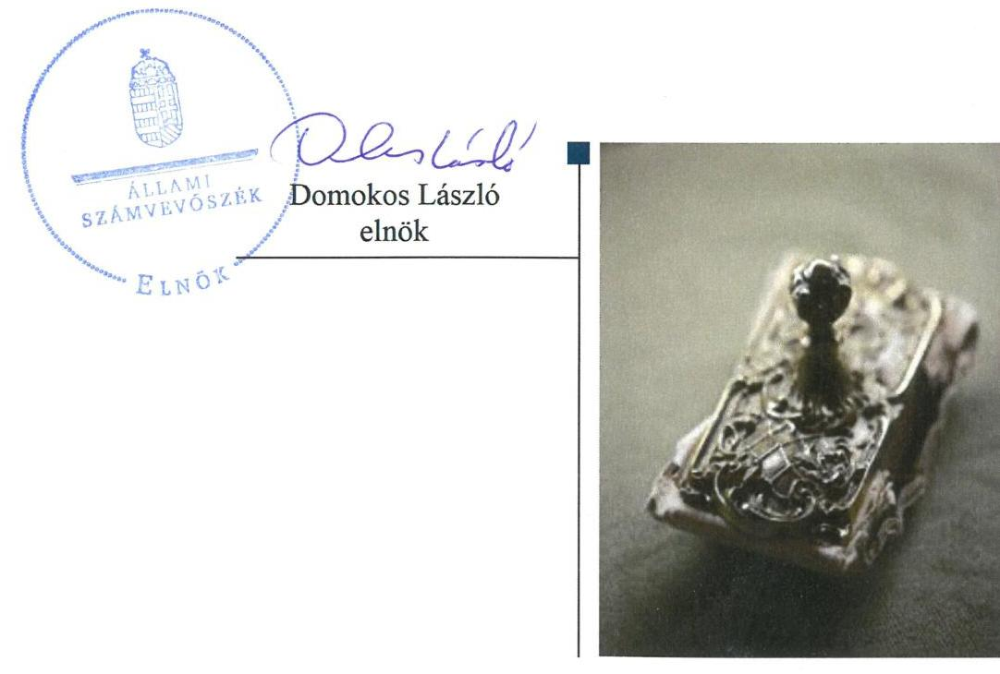

# Jelentés 

## Központi költségvetési szervek ellenőrzése

Duna-Ipoly Nemzeti Park Igazgatóság 2019.

---

# Jelenetés 

## Központi költségvetési szervek ellenőrzése

Duna-Ipoly Nemzeti Park Igazgatóság
2019. 12. hó 30. nap

---

# AZ ELLENŐRZÉST FELÜGYELTE: 

PETŐ KRISZTINA felügyeleti vezető

## AZ ELLENŐRZÉST VEZETTE ÉS A VÉGREHAJTÁSÁÉRT FELELŐS:

DR. GYŐRI GABRIELLA ellenőrzésvezető

## A PROGRAM ÖSSZEÁLLÍTÁSÁÉRT FELELŐS:

TÓTPÁL SZABOLCS osztályvezető

IKTATÓSZÁM: EL-2351-001/2019.
TÉMASZÁM: 2450

## ELLENŐRZÉS-AZONOSÍTÓ SZÁM: V079122

Jelentéseink az Országgyúlés számítógépes hálózatán és az Interneten a www.asz.hu címen is olvashatóak.

---

# TARTALOMJEGYZÉK 

■ ÖSSZEGZÉS ..... 5
■ AZ ELLENŐRZÉS CÉLJA ..... 6
■ AZ ELLENŐRZÉS TERÜLETE ..... 7
■ AZ ELLENŐRZÉS HÁTTERE, INDOKOLTSÁGA ..... 8
■ A JELENTÉS LÉNYEGES KÉRDÉSKÖREI ..... 10
■ AZ ELLENŐRZÉS HATÓKÖRE ÉS MÓDSZEREI ..... 11
■ MEGÁLLAPÍTÁSOK ..... 14
■ JAVASLATOK ..... 17
■ MELLÉKLETEK ..... 19
I. sz. melléklet: Értelmező szótár ..... 19
■ FÜGGELÉK: ÉSZREVÉTELEK ..... 23
■ RÖVIDÍTÉSEK JEGYZÉKE ..... 27

---

.

---

# ÖSSZEGZÉS 

Az esztergomi székhelyű Duna-Ipoly Nemzeti Park Igazgatóság belső kontrollrendszerét nem müködtette szabályszerűen, így nem volt biztositott a nemzeti vagyonnal való szabályszerű gazdálkodás. A pénzügyi-számviteli elektronikus információs rendszerből származó adatok megbizhatóságának hiányában az elszámoltathatóság feltételei nem voltak biztositottak. Az integritást támogató kontrollok kiépitettségének hiánya nem járult hozzá a korrupciós kockázatok mérsékléséhez.

## Az ellenőrzés társadalmi indokoltsága

A központi alrendszer részét képező intézmények alapvető rendeltetése a közfeladatok ellátásának biztosítása. A közpénzek felhasználásában meghatározó, központi alrendszerbe tartozó intézmények pénzügyi és vagyongazdálkodási tevékenységük és/vagy feladatellátásuk súlya miatt jelentős hatást gyakorolhatnak a költségvetés egyensúlyának fenntartására. Hatással vannak továbbá az állami vagyonnal való gazdálkodás minőségére, a kormányzati (szak)politikák végrehajtására, illetve közfeladat ellátásuk vonatkozásában az állampolgárok életminőségére, jogaik és kötelezettségeik gyakorlására. Indokolt ezért, hogy az Állami Számvevőszék ezen intézmények pénzügyi és vagyongazdálkodását, az esetleges átalakulások szabályszerűségét rendszeresen ellenőrizze.

## Főbb megállapítások, következtetések, javaslatok

A Duna-Ipoly Nemzeti Park Igazgatóság belső kontrollrendszerének kialakítása és múködtetése nem volt szabályszerű. Nem gondoskodtak a szabályszerű kontrollkörnyezet kialakításáról, ezáltal nem teremtették meg a szabályszerű közpénzfelhasználás feltételeit. A kontrolltevékenység gyakorlása nem volt szabályszerű. A belső ellenőrzés működése nem volt szabályszerű, mert 2015-2016. években nem készült intézkedési terv, illetve 2017. évben nem vezettek az intézkedési terv alapján végrehajtott intézkedésekről szabályszerű nyilvántartást.

A Duna-Ipoly Nemzeti Park Igazgatóság igazgatója az ellenőrzött időszakban nyilatkozatban értékelte a szervezet belső kontrollrendszerének minőségét, amely nem volt összhangban a jelen ellenőrzés során tapasztaltakkal. A DunaIpoly Nemzeti Park Igazgatóságnál nem alakítottak ki a teljesítmény mérésére alkalmas követelményeket.

A pénzügyi és vagyongazdálkodás az ellenőrzött időszakban nem volt szabályszerű. A jogszabályi előírásban foglaltak ellenére a Duna-Ipoly Nemzeti Park Igazgatóság nem állított össze a mérleg fordulónapján meglévő eszközeit és forrásait mennyiségben és értékben, tételesen, ellenőrizhető módon tartalmazó leltárt, emiatt a 2015-2017. évi számviteli beszámolók nem mutattak megbízható és valós képet a gazdálkodásáról. A jogszabályi előírás ellenére nem került sor a pénzügyi-gazdasági elektronikus információs rendszer biztonsági osztályba sorolásának elvégzésére. A pénzügyi-gazdasági elektronikus információs rendszer biztonsági osztályba sorolásának elmaradása miatt nem igazolt az abban kezelt adatok sértetlenségének-, rendelkezésre állásának-, teljes körű és kockázatokkal arányos védelmének biztosítása. A hiányosság miatt nem volt biztosítva a bevételi és kiadási előirányzatok alakulásának, a követelések, kötelezettségvállalások és ezek teljesítésének, a vagyon és annak összetétele valóságnak megfelelő, zárt rendszerú nyilvántartása, valamint a pénzügyi és vagyongazdálkodás elszámoltathatósága.

Az integritást támogató kontrollokat nem építették ki és nem múködtették a Duna-Ipoly Nemzeti Park Igazgatóságnál.

Az Állami Számvevőszék a Duna-Ipoly Nemzeti Park Igazgatóság igazgatójának 12 javaslatot fogalmazott meg.

---

# AZ ELLENŐRZÉS CÉLJA 

AZ ELLENŐRZÉS CÉLJA annak megítélése volt, hogy az ellenőrzött intézményre vonatkozó irányító szervi feladatellátás a jogszabályi előírások betartásával történt-e; az intézménynél a belső kontrollrendszer kialakítása és múködtetése szabályszerű volt-e, biztosította-e az átlátható, szabályszerű, gazdaságos, hatékony és eredményes gazdálkodás feltételeit; az intézmény pénzügyi és vagyongazdálkodása megfelelt-e a jogszabályi előírásoknak és belső szabályzatainak. Az ellenőrzés keretében az ÁSZ ${ }^{1}$ értékelte az intézmény korrupciós kockázatainak kezelését szolgáló integritás kontrollok kiépítettségét és az integritás szemlélet érvényesülését, illetve, hogy az államháztartás központi alrendszerébe tartozó szervezet gazdálkodása során elszámoltatható volt és megfelelt-e annak az Alaptörvényben² meghatározott alapvetésnek, hogy Magyarország a kiegyensúlyozott, átlátható és fenntartható költségvetési gazdálkodás elvét érvényesíti. Az ÁSZ értékelte, hogy a központi költségvetési szervnél megteremtették-e a teljesítményellenőrzés feltételeit. Érvényesült-e a nemzeti vagyon kezelésének és védelmének célja, azaz a szervezet vagyona a közérdeket szolgálta, a közös szükségletek kielégítése és a természeti erőforrások megóvása, valamint a jövő nemzedékek szükségleteinek figyelembevétele mellett.

---

# AZ ELLENŐRZÉS TERÜLETE 

## Duna-Ipoly Nemzeti Park Igazgatóság

A Duna-Ipoly Nemzeti Park Igazgatóság megalapítására 1990. december 1-jén került sor a 3/1990. (XI. 27.) KTM rend. ${ }^{3}$ alapján. A DINPI ${ }^{4}$ esztergomi székhelyú központi költségvetési intézmény, amely az ellenőrzött időszakban az 1996. évi LIII. törvény ${ }^{5}$, a 481/2013. (XII. 17.) Korm. rend. ${ }^{6}$, illetve a 71/2015. (III. 30.) Korm. rend. ${ }^{7}$ alapján a természetvédelem területi igazgatása körébe tartozó közfeladatokat látott el. Alaptevékenységét a természettudományi, múszaki alapkutatás, a génmegőrzés, fajtavédelem, a természetvédelem és tájvédelem igazgatása és támogatása, a védett természeti területek és természeti értékek bemutatása, megőrzése és fenntartása, a könyvtárral, múzeummal, a növény- és állatkertek múködtetésével, a könyv- és egyéb kiadással, valamint a szabadidős szolgáltatással kapcsolatos feladatok képezték. A DINPI múködési területe Komárom-Esztergom megye, Fejér megye és Pest megye területére terjedt ki. A DINPI az Nvtv. ${ }^{8}$, az NFA tv. ${ }^{9}$ és a Vtvr. ${ }^{10}$ előírásai alapján rendelkezett vagyonkezelési szerződéssel ${ }^{11}$.

A DINPI irányító szerve ${ }^{12}$ 2015. január 1. és 2017. december 31. között a Földművelésügyi Minisztérium volt (2018. május 18-ától Agrárminisztérium). A DINPI önálló jogi személy, gazdasági szervezettel rendelkezett. Az Áht. ${ }^{13}$ rendelkezése szerinti átalakításra az ellenőrzött időszakban nem került sor. A DINPI az ellenőrzött időszakban vállalkozási tevékenységet nem végzett.

A DINPI által kimutatott teljesített összes bevétel 2017. évben 3777,4 M Ft, teljesített összes kiadás 1871,1 M Ft, vagyon 8995,7 M Ft nagyságú volt.

A DINPI-t igazgató ${ }^{14}$ vezette, aki felett az irányító szervet vezető miniszter gyakorolta a kinevezési és munkáltatói jogokat. Az igazgató és a gazdasági vezető személyében 2015. év és 2017. év között nem történt változás.

A DINPI alkalmazásában álló személyek foglalkoztatása kormányzati szolgálati jogviszonyban, munkajogviszonyban, illetve közfoglalkoztatási jogviszonyban történt. A DINPI foglalkoztatottjai felett a munkáltatói jogokat az igazgató gyakorolta.

---

# AZ ELLENŐRZÉS HÁTTERE, INDOKOLTSÁGA 

Az államháztartás központi alrendszerének közpénz felhasználása, az intézmények által ellátott közfeladatok sokrétűsége, valamint a feladatellátásához rendelt vagyon nagyságrendje indokolja, hogy az ÁSZ ellenőrzéseket folytasson a pénzügyi és vagyongazdálkodás területén. Az ÁSZ az ellenőrzései során feltárja a gazdálkodást, a központi alrendszer intézményei átalakulását, átszervezését érintő szabályozások esetleges hiányosságait, a szabályozással nem érintett gazdálkodási területeket, rámutathat a vagyongazdálkodási tevékenység - ezen belül a tulajdonosi joggyakorlás és vagyonkezelés - esetleges szabálytalanságaira, értékeli az állami vagyon nyilvántartására és elszámolására vonatkozó eljárásokat.

Az államháztartás központi alrendszerébe tartozó szervezet vagyona a nemzeti vagyon része és az Alaptörvény is rögzíti, hogy a vagyonnal való gazdálkodás célja a közérdek szolgálata. Az ÁSZ ellenőrzi az éves költségvetési törvény végrehajtását, az ellenőrzés során feltárt kockázatok és a terület folyamatos kockázatelemzésével beazonosított kockázatok kezelése érdekében ráépülő ellenőrzésekkel ellenőrzi a költségvetési szervek gazdálkodását, múködését, hogy az ellenőrzések megállapításaival támogassa az ellenőrzött szervezetek szabályszerű gazdálkodását, javaslataival elősegítse az Alaptörvényben megfogalmazott alapvetések érvényesülését a mindennapi életben a szervezetek szintjén. A központi költségvetés rendszerében zajló folyamatok holisztikus elemzései, a kockázatok folyamatos figyelemmel kísérésének módszerével, az így kiválasztott szervezetek célzott, hatékony ellenőrzéseivel az ÁSZ betölti a legfőbb gazdasági ellenőrző szerv küldetését.

Az ellenőrzés várhatóan hozzájárul a központi intézmények pénzügyi helyzetének pontosabb megítéléséhez, és a jó gyakorlat kialakításán és terjesztésén keresztül az ellenőrzések elősegíthetik a gazdálkodás szabályszerűségének javítását.

A belső kontrollrendszer kialakítása és múködtetése nélkül nem valósítható meg a közpénzek, a közvagyon átlátható, szabályos, gazdaságos, hatékony és eredményes felhasználása. A belső kontrollrendszer azt a célt szolgálja, hogy a költségvetési szervek működésük és gazdálkodásuk során a tevékenységeket szabályszerűen hajtsák végre, teljesítsék elszámolási kötelezettségeiket és megvédjék az erőforrásokat a veszteségektől, a károktól és a nem rendeltetésszerű használattól. A belső kontrollrendszer magában foglalja mindazon elveket, eljárásokat és belső szabályzatokat, melyek biztosítják, hogy a költségvetési szerv valamennyi tevékenysége és célja összhangban legyen a szabályszerűséggel, szabályozottsággal, valamint a gazdaságosság, hatékonyság és eredményesség követelményeivel, az eszközökkel és forrásokkal való gazdálkodásban ne kerüljön sor pazarlásra, visszaélésre, rendeltetésellenes felhasználásra. Megfelelő, pontos és naprakész információk álljanak rendelkezésre a költségvetési szerv múködésével kapcsolatosan, és a belső kontrollrendszer harmonizációjára, öszszehangolására vonatkozó jogszabályok végrehajtásra kerüljenek. Az integritás kontrollok kiépítése, erősítése a szervezet korrupciós kockázatainak

---

kezelését szolgálja. A teljesítménykövetelmények meghatározása és múködtetése megalapozhatja a központi költségvetési szervnél a teljesítményellenőrzés lefolytatását.

Az egyes ellenőrzések megállapításaival és egy időszak ellenőrzési eredményeinek elemzésével az ÁSZ ráirányíthatja a jogalkotók figyelmét a központi alrendszerben vagy annak egy ágazatában esetlegesen felmerülő pénzügyi, szabályozási feszültségekre. Az elvégzett ellenőrzések során az ÁSZ „jó gyakorlatokat" is azonosíthat, melyeket tanácsadó funkciója keretében szélesebb körben is megismertethet az érintettekkel, ezáltal is hozzájárulva a költségvetési rendszer szabályozott, átlátható, kiegyensúlyozott és fenntartható múködéséhez.

Az ellenőrzés a szervezet kockázatértékelése alapján, az egyedi és lényeges jellemzők figyelembevételével történt.

---

# A JELENTÉS LÉNYEGES KÉRDÉSKÖREI 

1.     - Az irányító szerv ellenőrzött költségvetési szervre vonatkozó feladatellátása szabályszerű volt-e?
2.     - A belső kontrollrendszer kialakítása és müködtetése biztosította-e a közpénzekkel és a nemzeti vagyonnal történő szabályszerű gazdálkodást?
3.     - A költségvetési szerv pénzügyi és vagyongazdálkodása szabályszerű volt-e?
4.     - A költségvetési szervnél alakítottak-e ki a teljesítmény mérésére alkalmas követelményeket?

---

# AZ ELLENŐRZÉS HATÓKÖRE ÉS MÓDSZEREI 

## Az ellenőrzés típusa

Megfelelőségi ellenőrzés.

## Az ellenőrzött időszak

2015-2017. évek

## Az ellenőrzés tárgya

A DINPI-re vonatkozó 2015-2016. évi irányító szervi feladatok ellátása. A DINPI 2015-2017. évi belső kontrollrendszerének kialakítása és müködtetése, valamint az integritás kontrollok kiépítettsége 2017. évben és a teljesítmény ellenőrzés feltételei 2017. évben. A DINPI pénzügyi és vagyongazdálkodása a 2015-2016. években. A 2017. évre vonatkozóan a DINPI vagyongazdálkodási feltételeinek kialakítása, annak szabályszerűsége, az elszámoltathatóság biztosítása a szabályozás szintjén. A DINPI-nél hozott vagyonváltozást eredményező döntések, a vagyonban bekövetkezett változások végrehajtásának, nyilvántartásba vételének, elszámolásának szabályszerűsége. A DINPI könyveiben, mérlegében az állami vagyon kimutatásának szabályszerűsége, ennek keretében az állami vagyonnal történő rendelkezés, a vagyonmozgások, a vagyon nyilvántartásba vétele, értékelése és a mérleg alátámasztás szabályszerűsége.

## Az ellenőrzött szervezet

Duna-Ipoly Nemzeti Park Igazgatóság, valamint az Agrárminisztérium.

## Az ellenőrzés jogalapja

Az ellenőrzés jogszabályi alapját az ÁSZ tv. ${ }^{15}$ 1. § (3) bekezdés, 5. § (2)-(4) és (6) bekezdései, valamint az Áht. 61. § (2) bekezdésének előírásai képezték.

## Az ellenőrzés módszerei

Az ellenőrzésre a szakmai program szempontjai, az ellenőrzött időszakban hatályos jogszabályok, az ellenőrzés szakmai szabályai, a jelen ellenőrzésre irányadó ÁSZ módszertanok figyelembevételével került sor.

---

Az ellenőrzés ideje alatt az ellenőrzött szervezetekkel a kapcsolattartást az ÁSZ SZMSZ ${ }^{16}$-ének vonatkozó előírásai alapján biztosította az ÁSZ.

Az ellenőrzési kérdések megválaszolásához szükséges bizonyítékok megszerzése az ellenőrzött szervezetek által rendelkezésre bocsátott dokumentumokra, adatokra alapozva megfigyelés, szemle (szemrevételezés), kérdésfeltevés (információkérés), valamint elemző eljárás útján történt.

Az ellenőrzési bizonyítékként felhasználható adatforrások közé tartoztak egyrészt a szakmai program részletes szempontjainál felsorolt adatforrások, másrészt minden egyéb - az ellenőrzés folyamán feltárt, az ellenőrzés szempontjából információt tartalmazó - dokumentum.

Az ellenőrzés lefolytatásához az ellenőrzött szervezetek a tanúsítványok kitöltésével, valamint az ÁSZ által kért dokumentumok megküldésével szolgáltattak adatokat, amelyek valódiságát és teljes körűségét az ellenőrzött szervezet vezetője által tett teljességi és hitelességi nyilatkozat igazolta.

Az ellenőrzés kiterjedt minden olyan körülményre és adatra, amely az ÁSZ jogszabályban meghatározott feladatainak teljesítéséhez, valamint a program végrehajtása folyamán felmerült újabb összefüggések feltárásához szükséges volt.

A számvevőszéki jelentésben foglalt megállapítások, következtetések alátámasztására, az elegendő és megfelelő bizonyíték megszerzése érdekében az ÁSZ - módszertani eljárásaiban foglaltaknak eleget téve - értékelte a megszerzett ellenőrzési bizonyítékok forrását és jellegét. Mérlegelte továbbá az ellenőrzési bizonyítékként felhasználandó információ relevanciáját és megbízhatóságát. Az ellenőrzöttek által rendelkezésre bocsátott adatok, információk megfelelőségének - vagyis tárgyhoz tartozóságának, helytállóságának és megbízhatóságának - kontrollja az ellenőrzés keretében történt.

A DINPI pénzügyi-gazdasági elektronikus információs rendszereiben kezelt, az ellenőrzés rendelkezésére bocsátott adatok, információk megbízhatóságának kontrollja céljából az ÁSZ független hivatalos forrásból, a Nemzetbiztonsági Szakszolgálat Nemzeti Kibervédelmi Intézettől, mint a jogszabály által kijelölt hatóságtól kért adatokat. Az adatbekérés a DINPI pénzügyi-gazdasági elektronikus információs rendszerei biztonsági osztályba sorolását tartalmazó és azt igazoló dokumentumokra terjedt ki.

Az állami és önkormányzati szervek elektronikus információbiztonságáról szóló 2013. évi L. törvény előírásai biztosítják az elektronikus információs rendszerekben kezelt adatok és információk bizalmasságának, sértetlenségének és rendelkezésre állásának, valamint ezek rendszerelemei sértetlenségének és rendelkezésre állásának zárt, teljes körű, folytonos és a kockázatokkal arányos védelmét. A kockázatokkal arányos védelmi szint kialakítása érdekében az elektronikus információs rendszereket biztonsági osztályba kell sorolni, amelyet az adott szerv vezetője hagy jóvá és az informatikai biztonsági szabályzatban kell rögzíteni, amelyet meg kell küldeni az $\mathrm{NKI}^{17}$ részére.

Az ellenőrzés során ezért az ÁSZ értékelte azt is, hogy biztosított volt-e az ellenőrzéshez rendelkezésre bocsátott adatok származási helyének, a pénzügyi-gazdasági elektronikus információs rendszer sértetlenségének alapfeltétele, annak biztonsági osztályba sorolása.

---

Amennyiben nem történt meg a pénzügyi-gazdasági elektronikus információs rendszer biztonsági osztályba sorolása, és ennek következményeként nem volt biztosított az abban kezelt adatok és információk sértetlenségének zárt, teljes körű, folytonos és a kockázatokkal arányos védelme, abban az esetben a megbízható adatok hiányával érintett területeket az ÁSZ úgy értékelte, hogy nem állnak rendelkezésre az ellenőrzés részletes lefolytatásához a megfelelő ellenőrzési bizonyítékok.

A DINPI belső kontrollrendszere jogszabályi előírások szerinti kialakítása és működtetése szabályszerűségének értékelése az erre irányuló kérdésekre adott válaszok összesítése alapján, évente pillérenként (kontrollterületenként) és összesítetten történt. A belső kontrollrendszer egyes pilléreinek kialakítása „szabályszerü", amennyiben az értékelt területen az „igen" válaszok százalékban kifejezett, egész számra kerekített aránya legalább 85\%, „nem szabályszerű", ha nem érte el a 85\%-ot. A kontrollrendszer egésze esetében a „szabályszerü" értékelésnek a \%-os értéken felül további feltétele volt, hogy egyik kontrollterület sem kaphatott „nem szabályszerű" értékelést.

---

# 1. Az irányító szerv ellenőrzött költségvetési szervre vonatkozó feladatellátása szabályszerű volt-e? 

Összegző megállapítás

Az irányító szerv DINPI-re vonatkozó feladatellátása szabályszerű volt 2015. évben, nem volt szabályszerű 2016. évben.

Az irányító szerv a DINPI alapító okirat ${ }_{1,2}{ }^{18}$-t az Ávr. ${ }^{19}$-ben foglaltakkal összhangban adta ki. Az irányítási jogosultságok keretében az irányító szerv a DINPI SZMSZ ${ }^{20}$-ét az Áht. és az Ávr. alapján jóváhagyta. A DINPI részére az irányító szerv nem állapította meg a 2016. évi maradványát, figyelmen kívül hagyva az Ávr. 153. § (4) bekezdésében foglaltakat. A 10/2013. (I. 21.) Korm. rend. ${ }^{21}$ 6. § (2) bekezdésében foglaltak ellenére nem határozta meg a DINPI igazgatója részére a 2016. I. féléves munkaköri egyéni teljesítmény követelményeket, a 10/2013. (I. 21.) Korm. rend. 12. §. (1) bekezdés b) pontjában foglaltak ellenére nem gondoskodott a 2015. II. félévre meghatározott teljesítmény követelmények értékeléséről.

## 2. A belső kontrollrendszer kialakítása és múködtetése biztosí-totta-e a közpénzekkel és a nemzeti vagyonnal történő szabályszerű gazdálkodást?

Összegző megállapítás

A DINPI belső kontrollrendszerének kialakítása és múködtetése 2015-2017. években nem volt szabályszerű, nem biztosította a közpénzekkel és a nemzeti vagyonnal történő szabályszerű gazdálkodást.

A KONTROLLKÖRNYEZET kialakítása 2015-2017. években nem volt szabályszerű. A DINPI a 2015-2017. években - a Számv. tv. ${ }^{22}$ 161. § (1) bekezdésében és az Áhsz. ${ }^{23}$ 51. § (2) bekezdésében foglaltak ellenére - nem rendelkezett számlarenddel. A Vnytv. ${ }^{24}$ 11. § (6) bekezdésében előírtak ellenére nem állapították meg szabályzatban a 2015-2017. években a vagyonnyilatkozatok nyilvántartásának rendjét, továbbá a vagyonnyilatkozatban foglalt személyes adatok védelmére vonatkozó szabályokat. A DINPI 2015-2017. években a Bkr. ${ }^{25}$ 17. § (1) bekezdésében foglaltak ellenére nem rendelkezett belső ellenőrzési kézikönyvvel.

Az Ávr. 60. § (3) bekezdésének előírása ellenére 2015-2017. években nem vezettek naprakész nyilvántartást a kötelezettségvállalás és a teljesítésigazolás gyakorlására jogosult személyek aláírás mintáiról. A DINPI 2015-2016-ban az Áhsz. 39. § (3) bekezdésének előírása ellenére nem vezette az Áhsz. 14. melléklet II. 4. pontja szerinti kötelezettségvállalások nyilvántartását.

---

A DINPI rendelkezett az ellenőrzött időszakban alapító okirat ${ }_{1,2}$-vel, SZMSZ-szel és a Számv. tv. rendelkezéseivel összhangban elkészített számviteli politika ${ }^{26}{ }_{1-2}$-vel és az annak keretében elkészítendő szabályzatokkal.

A KOCKÁZATKEZELÉSI RENDSZER, illetve 2016. október 1-jétől az integrált kockázatkezelési rendszer működtetése az ellenőrzött időszakban szabályszerű volt. A Bkr.-ben foglaltak alapján azonosították és értékelték a gazdálkodásban/tevékenységben rejlő, szervezeti célokkal összefüggő kockázatokat és kijelölték a kockázatkezelési rendszer koordinálásának szervezeti felelősét.

A KONTROLLTEVÉKENYSÉGEK gyakorlása a pénzügyi és vagyongazdálkodás fejezetben szereplő, az adatok megbízhatóságára vonatkozó megállapítások alapján nem volt szabályszerű.

AZ INFORMÁCIÓS ÉS KOMMUNIKÁCIÓS folyamatok működtetése 2015-2017. években szabályszerű volt.

A MONITORING RENDSZER működtetése a 2015-2017. években nem volt szabályszerű. Az operatív tevékenységek keretében megvalósuló folyamatos és eseti nyomon követés működtetéséről a DINPI igazgatója az ellenőrzött időszakban a Bkr. 3. § e) pontjában és 10. §-ában foglaltak ellenére nem gondoskodott. A belső ellenőrzés működtetése során a 2015-2016. években a Bkr. 28. § c) pontjában foglaltak ellenére nem készült intézkedési terv. A 2015-2017. években a DINPI igazgatója a Bkr. 32. § (2) bekezdésében foglaltak ellenére az éves ellenőrzési tervet nem küldte meg az irányító szerv belső ellenőrzési vezetője részére. A Bkr. 47. § (2) bekezdésében foglaltak ellenére a 2017. évben vezetett éves nyilvántartás nem tartalmazta az intézkedési terv alapján végrehajtott intézkedések rövid leírását és a végre nem hajtott intézkedések okát.

A DINPI igazgatója az ellenőrzött időszakban a Bkr. 1. melléklete szerinti nyilatkozatban értékelte a DINPI belső kontrollrendszerének minőségét, amely nem volt összhangban a jelen ellenőrzés során tapasztaltakkal. A nyilatkozatot a DINPI igazgatója 2015-2017. években a Bkr. 11. § (2) bekezdésében foglaltak ellenére nem küldte meg költségvetési beszámolójával egyidejűleg az irányító szerv részére.

A DINPI-nél az integritás kontrollokat nem építették ki és nem működtették, mert nem gondoskodtak szabályszerű kontrollkörnyezet kialakításáról, illetve a belső ellenőrzés szabályszerű működtetéséről sem.

# 3. A költségvetési szerv pénzügyi és vagyongazdálkodása szabályszerű volt-e? 

## Összegző megállapítás

A DINPI pénzügyi és vagyongazdálkodása az ellenőrzött időszakban nem volt szabályszerű.

Az Áhsz. 22. § (1) bekezdésében és a Számv. tv. 69. § (1) bekezdésében foglaltak ellenére a 2015-2017. évi mérleg tételeit a DINPI nem támasztotta alá leltárral. A leltározási szabályzat ${ }^{27}$ I. fejezet 2. és 4.1. pontjában és az Áhsz. 22. § (2) bekezdés b) pontjában foglaltak ellenére a használt, de a

---

mérlegben értékkel nem szereplő eszközöket 2015-2017. években nem leltározták. 2015-ben a készletek, 2016-ban az immateriális javak, 2017-ben a pénztár leltározását sem végezték el a Számv. tv. 69. § (3) bekezdésében foglaltak ellenére.

A DINPI rendelkezett IBSZ ${ }^{28}$-szel, azonban a szervezet biztonsági szintbe sorolására és a pénzügyi-gazdasági elektronikus információs rendszer biztonsági osztályának besorolására - az ellenőrzött időszakban - az Ibtv. ${ }^{29}$ 9. § (1) bekezdésében és 7. § (1) és (3) bekezdésében foglaltak ellenére nem került sor. A biztonsági osztályba sorolás hiányában nem határozták meg az Ibtv. 1. § 12. pontjában foglalt pénzügyi-gazdasági elektronikus információs rendszer védelmének elvárt erősségét. A DINPI-nél a pénzügyi gazdasági elektronikus információs rendszer besorolásának hiányában nem volt biztosítva az abban kezelt adatok - Ibtv. 1. § 39. pontjában előírt - sértetlensége, hitelessége és megbízhatósága.

# 4. A költségvetési szervnél alakítottak-e ki a teljesítmény mérésére alkalmas követelményeket? 

A teljesítmény mérésére alkalmas követelményeket a DINPI 2017. évben nem alakított ki.

---

# JAVASLATOK 

Az ÁSZ tv. 33. § (1) bekezdésében foglaltak értelmében az ellenőrzött szervezet vezetője köteles a jelentésben foglalt megállapításokhoz kapcsolódó intézkedési tervet összeállítani és azt a jelentés kézhezvételétől számított 30 napon belül az ÁSZ részére megküldeni. Amennyiben az ellenőrzött szervezet vezetője nem küldi meg határidőben az intézkedési tervet, vagy továbbra sem elfogadható intézkedési tervet küld, az Állami Számvevőszék elnöke az ÁSZ tv. 33. § (3) bekezdése a) és b) pontjaiban foglaltakat érvényesítheti.

## a Duna-Ipoly Nemzeti Park Igazgatóság igazgatójának

1. Intézkedjen a jogszabályi előirások szerinti számlarend elkészitése érdekében.
(2. összegző megállapítás 1. bekezdésének 2. mondata alapján)
2. Intézkedjen a vagyonnyilatkozat nyilvántartására és a vagyonnyilatkozatban foglalt személyes adatok védelmére vonatkozó további szabályok szabályzatban történő megállapítása érdekében.
(2. összegző megállapítás 1. bekezdésének 3. mondata alapján)
3. Intézkedjen a belső ellenőrzési kézikönyv elkészitése érdekében.
(2. összegző megállapítás 1. bekezdésének 4. mondata alapján)
4. Intézkedjen a kötelezettségvállalásra és a teljesités igazolására jogosult személyek aláírás-mintájáról naprakész nyilvántartás vezetéséről.
(2. összegző megállapítás 2. bekezdésének 1. mondata alapján)
5. Intézkedjen a jogszabályban elöirt kötelezettségvállalások nyilvántartása vezetéséről.
(2. összegző megállapítás 2. bekezdésének 2. mondata alapján)
6. Intézkedjen az operatív tevékenység keretében megvalósuló folyamatos és eseti nyomon követés müködtetéséről.
(2. összegző megállapítás 7. bekezdésének 2. mondata alapján)
7. Intézkedjen az éves ellenőrzési terv fejezetet irányitó szerv belső ellenőrzési vezetője részére történő megküldése érdekében.
(2. összegző megállapítás 7. bekezdésének 4. mondata alapján)

---

8. Intézkedjen, hogy az éves nyilvántartás tartalmazza az intézkedési terv alapján végrehajtott intézkedések rövid leírását, és a végre nem hajtott intézkedések okát.
(2. összegző megállapítás 7. bekezdésének 5. mondata alapján)
9. Intézkedjen a Bkr.-ben foglalt előírásnak megfelelően a belső kontrollrendszer minőségének értékeléséről szóló vezetői nyilatkozat éves költségvetési beszámolóval együtt történő megküldéséről az irányító szerv részére.
(2. összegző megállapítás 8. bekezdésének 2. mondata alapján)
10. Intézkedjen az éves költségvetési beszámoló mérleg tételeinek alátámasztásához leltár összeállításáról, amely tételesen, ellenőrizhető módon tartalmazza a mérlegben szereplő eszközöket és forrásokat.
(3. összegző megállapítás 1. bekezdésének 1. mondata alapján)
11. Intézkedjen a használt, de a mérlegben értékkel nem szereplő eszközök és a pénztár jogszabályokban, valamint a leltározási és leltárkészítési szabályzatban meghatározott módon történő leltározásáról.
(3. összegző megállapítás 1. bekezdésének 2-3. mondatai alapján)
12. Intézkedjen a jogszabályi előírásokkal összhangban a szervezet biztonsági szintbe, valamint a pénzügyi-gazdasági elektronikus információs rendszer biztonsági osztályba sorolásáról.
(3. összegző megállapítás 2. bekezdésének 1. mondata alapján)

---

# MELLÉKLETEK 

- I. SZ. MELLÉKLET: ÉRTELMEZŐ SZÓTÁR
állami vagyon
állami vagyonnak minősül:
a) az állam tulajdonában lévő dolog, valamint a dolog módjára hasznosítható természeti erő,
b) az a) pont hatálya alá nem tartozó mindazon vagyon, amely vonatkozásában törvény az állam kizárólagos tulajdonjogát nevesíti,
c) az állam tulajdonában lévő tagsági jogviszonyt megtestesítő értékpapír, illetve az államot megillető egyéb társasági részesedés,
d) az államot megillető olyan immateriális, vagyoni értékkel rendelkező jogosultság, amelyet jogszabály vagyoni értékű jogként nevesít. (Forrás: Vtv. 1. § (2) bekezdése)
állami vagyon használója Az a természetes vagy jogi személy, jogi személyiséggel nem rendelkező szervezet, aki, vagy amely törvény vagy szerződés alapján, bármely jogcímen (bérlet, haszonbérlet, használat stb.) állami vagyont birtokol, használ, szedi annak hasznait, hasznosít, ide nem értve a haszonélvezőt, a vagyonkezelőt és a tulajdonosi jogok gyakorlóját. (Forrás: Vtvr. 1. § (7) bekezdés a) pontja)
állami vagyon hasznosítása Az állami vagyont az MNV Zrt. maga kezeli, vagy szerződés - így különösen bérlet, haszonbérlet, megbízás - alapján központi költségvetési szervnek, természetes vagy jogi személynek, vagy jogi személyiséggel nem rendelkező gazdálkodó szervezetnek hasznosításra átengedi.
(Forrás: Vtv. 23. § (1) bekezdése, hatályos 2012. január 1-jétől)
Az állami vagyonnal a tulajdonosi joggyakorló maga gazdálkodik, vagy szerződés - így különösen bérlet, haszonbérlet, megbízás - alapján hasznosításra átengedi, illetőleg vagyonkezelésbe, haszonélvezetbe adja. (Forrás: Vtv. 23. § (1) bekezdése, hatályos 2013. június 28 -ától)
az állami vagyont az MNV Zrt. maga kezeli, vagy szerződés - így különösen bérlet, haszonbérlet, megbízás - alapján központi költségvetési szervnek, természetes vagy jogi személynek, vagy jogi személyiséggel nem rendelkező gazdálkodó szervezetnek hasznosításra átengedi." Az állami vagyonra vonatkozóan az MNV Zrt. kizárólag az Nvtv.-ben meghatározott személyekkel köthet vagyonkezelési szerződést. (Forrás: Vtv. 27. § (1) bekezdése, hatályos 2012. január 1-jétől)
belső ellenőrzés
belső kontrollrendszer
belső kontrollrendszer területei

Független, tárgyilagos bizonyosságot adó és tanácsadó tevékenység, amelynek célja, hogy az ellenőrzött szervezet működését fejlessze és eredményességét növelje, az ellenőrzött szervezet céljai elérése érdekében rendszerszemléletű megközelítéssel és módszeresen értékeli, illetve fejleszti az ellenőrzött szervezet irányítási és belső kontrollrendszerének hatékonyságát. (Forrás: Bkr. 2. § b) pontja)
A belső kontrollrendszer a kockázatok kezelése és tárgyilagos bizonyosság megszerzése érdekében kialakított folyamatrendszer, amely azt a célt szolgálja, hogy a múködés és gazdálkodás során a tevékenységeket szabályszerűen, gazdaságosan, hatékonyan, eredményesen hajtsák végre, az elszámolási kötelezettségeket teljesítsék, megvédjék az erőforrásokat a veszteségektől, károktól és nem rendeltetésszerű használattól. (Forrás: Áht. 69. § (1) bekezdése)
A kontrollkörnyezet, a kockázatkezelési rendszer, a kontrolltevékenységek, az információs és kommunikációs rendszer, valamint a nyomon követési (monitoring) rendszer. (Forrás: Bkr. 3. §-a)

---

információs és kommunikációs rendszer
integritás
integrált kockázatkezelési rendszer
irányító szerv/felügyeleti szerv
kockázat
kockázatkezelési rendszer
kontrollkörnyezet
kontrolltevékenységek
közfeladat
maradvány
nyomon követési rendszer (monitoring)

A költségvetési szerv vezetője által kialakított és működtetett olyan rendszer, mely biztosítja, hogy a megfelelő információk a megfelelő időben eljutnak az illetékes szervezethez, szervezeti egységhez, illetve személyhez. (Forrás: Bkr. 9. § (1) bekezdés)
Az integritás - egyik gyakran használt jelentése szerint - az elvek, értékek, cselekvések, módszerek, intézkedések konzisztenciáját jelenti, vagyis olyan magatartásmódot, amely meghatározott értékeknek megfelel. Integritás-irányítási rendszer bevezetése a szervezetben a szervezethez rendelt közfeladatok integritás szempontú ellátását, az érték alapú múködéssel (integritással) összefüggő szervezeti követelmények következetes érvényesítését jelenti. (Forrás: Nemzetgazdasági Minisztérium: Államháztartási Belső Kontroll Standardok és Gyakorlati Útmutató 1.6. Etikai értékek és integritás 46. oldal, 2017. szeptember)
Olyan folyamatalapú kockázatkezelési rendszer, amely a szervezet minden tevékenységére kiterjed, egységes módszertan és eljárások alkalmazásával, a szervezet célkitűzéseinek és értékeinek figyelembevételével biztosítja a szervezet kockázatainak teljes körű azonosítását, azok meghatározott kritériumok szerinti értékelését, valamint a kockázatok kezelésére vonatkozó intézkedési terv elkészítését és az abban foglaltak nyomon követését. (Forrás: Bkr. 2. § m) pontja, 2016. október 1-jétől)
A költségvetési szerv tekintetében az Áht.-ban meghatározott irányítási hatáskört gyakorló szerv. (Forrás: Áht. 1. § 9. pontja)
A kockázat annak a valószínűségét jelenti, hogy egy vagy több esemény vagy intézkedés nem kívánt módon befolyásolja a rendszer múködését, céljainak megvalósulását. (Forrás: Javaslatok a korrupciós kockázatok kezelésére - Kockázatkezelési és ellenőrzési módszertan 35. oldal, ÁSZ)
Olyan irányítási eszközök és módszerek összessége, melynek elemei a szervezeti célok elérését veszélyeztető tényezők (kockázatok) azonosítása, elemzése, csoportosítása, nyomon követése, valamint szükség esetén a kockázati kitettség mérséklése.(Forrás: Bkr. 2. § m) pontja)
A költségvetési szerv vezetője által kialakított olyan elvek, eljárások, belső szabályzatok összessége, amelyben világos a szervezeti struktúra, a folyamatok átláthatók, egyértelmúek a felelősségi, hatásköri viszonyok és feladatok, meghatározottak, ismertek és elfogadottak az etikai elvárások a szervezet minden szintjén, átlátható a humán-erőforrás-kezelés. (Forrás: Bkr. 6. § (1) bekezdés)
A költségvetési szerv vezetője által a szervezeten belül kialakított (kontroll) tevékenységek, melyek biztosítják a kockázatok kezelését, hozzájárulnak a szervezet céljainak eléréséhez és erősítik a szervezet integritását. (Forrás: Bkr. 8. § (1) bekezdés)
Jogszabályban meghatározott állami vagy önkormányzati feladat, amit az arra kötelezett közérdekből, a jogszabályban meghatározott követelményeknek és feltételeknek megfelelve végez, ideértve a lakosság közszolgáltatásokkal való ellátását, továbbá az állam nemzetközi szerződésekben vállalt kötelezettségeiből adódó közérdekű feladatokat, valamint e feladatok ellátásakor szükséges infrastruktúra biztosítását is. (Forrás: Nvtv. 3. § (1) bekezdés 7. pontja)
A költségvetési év során a bevételek és kiadások különbözete, amely az alaptevékenység bevételei és kiadásai tekintetében a költségvetési maradvány, a vállalkozási tevékenység bevételei és kiadásai tekintetében a vállalkozási maradvány. (Forrás: Áht. 1. § 17. pont)
A költségvetési szerv vezetője köteles kialakítani a szervezet tevékenységének a célok megvalósításának nyomon követését biztosító rendszert, amely az operatív tevékenységek keretében megvalósuló folyamatos és eseti nyomon követésből, valamint az operatív tevékenységektől függetlenül múködő belső ellenőrzésből áll. (Forrás: Bkr. 10. §)

---

vagyongazdálkodás

A nemzeti vagyongazdálkodás feladata a nemzeti vagyon rendeltetésének megfelelő, az állam, az önkormányzat mindenkori teherbíró képességéhez igazodó, elsődlegesen a közfeladatok ellátásához és a mindenkori társadalmi szükségletek kielégítéséhez szükséges, egységes elveken alapuló, átlátható, hatékony és költségtakarékos múködtetése, értékének megőrzése, állagának védelme, értéknövelő használata, hasznosítása, gyarapítása, továbbá az állam vagy a helyi önkormányzat feladatának ellátása szempontjából feleslegessé váló vagyontárgyak elidegenítése. (Forrás: Nvtv. 7. § (2) bekezdése)

---

.

---

# FÜGGELÉK: ÉSZREVÉTELEK 

A jelentéstervezetet a Számvevőszék 15 napos észrevételezésre megküldte az ellenőrzött szervezet vezetőjének az ÁSZ tv. 29. §* (1) bekezdése előírásának megfelelően.

Az agrárminiszter és a Duna-Ipoly Nemzeti Park Igazgatóság igazgatója a jelentéstervezet megállapításaira írásban észrevételt tett.
Az ÁSZ tv. 29. § (3) bekezdésével összhangban az ÁSZ a Függelékben feltünteti az ellenőrzés megállapításaival kapcsolatban tett, figyelembe nem vett észrevételeket, és megindokolja, hogy azokat miért nem fogadta el.

Az ÁSZ az ellenőrzési megállapításait az ellenőrzött időszakban hatályos jogszabályok és az ellenőrzött szervezet közreműködési kötelezettsége keretében, az ellenőrzött szervezet által rendelkezésre bocsátott, Teljességi és hitelességi nyilatkozattal alátámasztott dokumentumokra alapozva fogalmazta meg. A teljességi és hitelességi nyilatkozatok szerint az ÁSZ részére átadott dokumentumok, adatok megbízhatóak, és a bekért adatokra, dokumentumokra vonatkozóan teljes körű információt tartalmaznak. Az észrevételhez mellékletként csatolt, az ÁSZ részére az adatszolgáltatásra biztosított törvényi határidőn kívül megküldött, utólag rendelkezésre bocsátott dokumentumokat az ÁSZ nem értékelte.

## AGRÁRMINISZTÉRIUM

1) A miniszter észrevételében jelezte, hogy a minisztérium, mint a nemzeti park igazgatóságok irányító szerve, a 10/2013. (I.21.) Korm. rendelet előírásai szerint minden nemzeti park igazgatóság vezetője esetében meghatározta a teljesítménykövetelményeket, elvégezte a teljesítményértékelést.
Az észrevételt az ÁSZ nem veszi figyelembe. Az ÁSZ rendelkezésre bocsátott ellenőrzési dokumentumok ismételt felülvizsgálata alapján megállapítást nyert, hogy a Duna-Ipoly Nemzeti Park Igazgatóság (továbbiakban: DINPI) esetében dokumentumok az igazgató teljesítményének értékelését a 2015. második félévre vonatkozóan, az igazgató egyéni teljesítménykövetelményeinek meghatározását pedig 2016. első félévére vonatkozóan nem támasztották alá.
2) A miniszter észrevételében jelezte, hogy a minisztérium gazdasági ügyekért felelő államtitkára a Kormány döntését követően hivatalos ügyiratban minden évben kiértesítette az intézményeket az adott évi kötelezettségvállalással terhelt és a kötelezettségvállalással nem terhelt maradványok nagyságáról.
Az észrevételt az ÁSZ nem veszi figyelembe. Az ÁSZ rendelkezésre bocsátott ellenőrzési dokumentumok ismételt felülvizsgálata alapján megállapítást nyert, hogy a DINPI 2016. évi maradványának megállapítását a
[^0]
[^0]:    * 29. § (1) Az Állami Számvevőszék az ellenőrzési megállapításait megküldi az ellenőrzött szervezet vezetőjének vagy az általa megbízott személynek, és annak, akinek személyes felelősségét állapította meg.
    (2) Az ellenőrzött szervezet vezetője és a felelősként megjelölt személy az ellenőrzés megállapításaira tizenöt napon belül írásban észrevételt tehet.
    (3) Az Állami Számvevőszék az észrevételre a beérkezésétől számított harminc napon belül írásban válaszol. A figyelembe nem vett észrevételeket köteles a jelentésben feltüntetni, és megindokolni, hogy azokat miért nem fogadta el.

---

dokumentumok nem támasztották alá. Az adatszolgáltatás során feltöltött dokumentum a 2016. évre vonatkozóan egy előadói ívvel ellátott levélminta, amelyek tárgya „az FM intézmények értesítése a 2016. évi maradványok jóváhagyásáról" volt. A minta levélben azonban intézményként iskolák szerepeltek, a jóváhagyott maradvány összegek nem szerepeltek (a maradvány összegek kipontozva szerepeltek a levélben), így ellenőrzési bizonyítékként nem voltak értékelhetők. Megbízhatónak tekinti az ÁSZ az ellenőrzés szempontjából azon bizonyítékot, amely kétséget kizáróan bizonyítja a benne foglaltakat. Fentiek alapján az 1. számú megállapítás 1. bekezdésének módosítása nem indokolt.

# DUNA-IPOLY NEMZETI PARK IGAZGATÓSÁG 

1) A 2. számú megállapítás 1. bekezdés 3. mondatához tett 2. sz. észrevételt az ÁSZ nem veszi figyelembe.

Az észrevétel szerint a DINPI-n igazgatói utasítás melléklete tartalmazza a vagyonnyilvántartások rendjét és a vagyonnyilatkozatban foglalt személyes adatok védelméről szóló szabályokat. Az igazgató jelezte, hogy a szóban forgó szabályzat az adatszolgáltatás során nem került megküldésre, tekintettel arra, hogy az adatbekérés során nem volt egyértelmű a szabályzat megküldésének szükségessége.
Az ÁSZ a 2018. szeptember 5-én kelt EL-0991-001/2018. ikt.sz. adatbekérő levél I.5. és V.1.11. pontjaiban a vagyonnyilatkozat-tételi kötelezettség szabályozására vonatkozó dokumentumokat kérte megküldeni. Az adatszolgáltatás során rendelkezésre bocsátott, 2012. december 20-án jóváhagyott Szervezeti és Működési Szabályzat (továbbiakban: SZMSZ) 5.2. pontja továbbá 5. sz. melléklete a vagyonnyilatkozatra kötelezettek körét és a vagyonnyilatkozatok kezelésére vonatkozó szabályokat tartalmazta. Az SZMSZ 5.2. pontja tartalmazta, hogy a vagyonnyilat-tétellel kapcsolatos részletszabályokra az egyes vagyonnyilatkozat-tételi kötelezettségekről szóló 2007. évi CLII. törvény rendelkezései és a Közszolgálati szabályzatban foglaltak az irányadók. Az ellenőrzési dokumentumok között megtalálható 2013. évi 5. sz. igazgatói utasítás a DINPI Közszolgálati Szabályzatáról a vagyonnyilatkozat-tételi kötelezettségre vonatkozóan részletszabályokat nem tartalmazott. Az igazgató észrevételében elismerte, hogy a vagyonnyilatkozat-tételi kötelezettségre vonatkozó külön szabályozást nem bocsátott az ÁSZ rendelkezésére. Fentiek alapján helytálló az ellenőrzés megállapítása, amely szerint a 2015-2017. években nem állapították meg szabályzatban a vagyonnyilatkozatok nyilvántartásának rendjét, továbbá a vagyonnyilatkozatban foglalt személyes adatok védelmére vonatkozó szabályokat. A fentiek alapján a 2. számú megállapítás 1. bekezdés 3. mondatának módosítása nem indokolt.
2) A 2. számú megállapítás 1. bekezdés 4. mondatához tett 3. sz. észrevételt az ÁSZ nem veszi figyelembe.

Az észrevétel szerint a DINPI a 2015-2017. években rendelkezett belső ellenőrzési kézikönyvvel. Az adatszolgáltatás során rendelkezésre bocsátott - észrevételben hivatkozott - „BEK_2014.pdf" és „BEK_2016.pdf" elnevezésű dokumentumok azonban csak egy-egy címlapot tartalmaztak, az ellenőrzési kézikönyveket nem, így ellenőrzési bizonyítékként nem értékelhetők. Megbízhatónak tekinti az ÁSZ az ellenőrzés szempontjából azon bizonyítékot, amely kétséget kizáróan bizonyítja a benne foglaltakat. Az előzőek alapján a 2. számú megállapítás 1. bekezdés 4. mondatának megállapítását módosítani nem indokolt.
3) A 2. számú megállapítás 2. bekezdés 2. mondatához tett 5. sz. észrevételt az ÁSZ nem veszi figyelembe.

Az észrevétel szerint a DINPI a 2015-2017. évekre vonatkozóan rendelkezett a kötelezettségvállalások nyilvántartásával. A DINPI által használt ügyviteli szoftver az igazgató álláspontja szerint megfelel a jogszabályi előírásoknak.

Az ÁSZ hivatkozott megállapítása a 2015-2016. évekre vonatkozott, így a 2017. évre vonatkozó észrevétel figyelembe vétele nem indokolt. Az Áhsz. 14. melléklet II. 4. pontja taxatíve tartalmazza a kötelezettségvállalások, más fizetési kötelezettségek nyilvántartásának kötelező tartalmi elemeit. Az ellenőrzés rendelkezésére bocsátott dokumentumok nem tartalmazták a kötelezettségvállalás, más fizetési kötelezettség sorszámát, a pénzügyi ellenjegyzésre vonatkozó adatokat; a kötelezettségvállalás, más fizetési kötelezettség tárgyát, összegét (értékét) az egységes rovatrend rovatai szerint; a pénzügyi teljesítések dátumát, összegét, egységes rovatrend szerint besorolását, az utalványozás Ávr. 59. § (2) bekezdése szerinti dokumentumának azonosításához szükséges adatokat; a pénzügyi teljesítési adatok könyoviteli számlákon történő elszámolásának időpontjait és a könyiviteli számlák megnevezését. Fentiek alapján a DINPI által megküldött nyilvántartások az Áhsz. 14. melléklet II. 4. pontjában meghatározott előírásoknak nem feleltek meg,

---

ezért a - 2015-2016. évekre vonatkozó - 2. számú megállapítás 2. bekezdés 5. mondata megállapításának módosítása nem indokolt.
4) A 2. számú megállapítás 7. bekezdés 3. mondatához tett 6. sz. észrevételt az ÁSZ nem veszi figyelembe.

Az észrevétel szerint a DINPI a belső ellenőrzés során keletkezett intézkedési terveket a 2015-2016. évekre vonatkozóan megküldte az ÁSZ részére.

Az ÁSZ a 2018. szeptember 5-én kelt EL-0991-001/2018. ikt.sz. adatbekérő levél IV.6.6. pontjában a belső ellenőrzési jelentéseket és az arra készített intézkedési terveket (a jóváhagyó dokumentumokkal együtt) kérte megküldeni. A rendelkezésre álló dokumentumok között megtalálható, 2015. február 16-ai és március 26-ai, valamint a 2016. január 21-ei, március 10-ei, május 24-ei, június 22-ei, augusztus 29-ei, szeptember 22-ei, október 24-ei és december 5-ei belső ellenőrzési jelentések tartalmaztak javaslatokat megalapozó megállapításokat. A DINPI azonban az azokra vonatkozóan elkészített intézkedési terveket dokumentumokkal nem igazolta, intézkedési terveket az ÁSZ rendelkezésére bocsátott dokumentumok nem tartalmaztak. Az előzőek alapján a 2. számú megállapítás 7. bekezdés 3. mondata megállapításának módosítása nem indokolt.
5) A 2. számú megállapítás 7. bekezdés 4. mondatához tett 9. sz. észrevétel az ÁSZ nem veszi figyelembe.

Az észrevétel szerint a DINPI igazgatója a 2015-2017. években az éves ellenőrzési tervet megküldte az irányító szerv belső ellenőrzési vezetője részére. A kézbesítés személyesen történik, az átvételt a másolatra rávezetett aláírás és az átvétel dátuma igazolja.

Az ellenőrzési dokumentumok között megtalálható 2015. évi belső ellenőrzési terv az észrevételben hivatkozott, az átvételt igazoló aláírást nem tartalmazta. A DINPI igazgatójának 2018. július 31-én kelt nyilatkozata 4. pontja szerint a 2015. évi belső ellenőrzési tervet az irányító szervnek személyesen adták át. A 2016. évi belső ellenőrzési terv vonatkozásában a megküldés igazolására csatolt dokumentum csak a Földművelésügyi Minisztérium Ellenőrzési Főosztály főosztályvezetője részére történő címzést, aláírást és egy „postázva 2015. nov.13." rájegyzést tartalmaz, azonban a postai megküldést, illetve az átvételt (tértivevény) dokumentumok nem támasztják alá. A 2017. évi belső ellenőrzési terv dokumentumán az átvevő aláírása és az átvétel dátuma szerepel, azonban nem igazolt, hogy az átvevő személy az irányító szervhez, annak illetékes ellenőrzési főosztályához köthető-e, ezért ellenőrzési bizonyítékként nem volt értékelhető. Megbízhatónak tekinti az ÁSZ az ellenőrzés szempontjából azon bizonyítékot, amely kétséget kizáróan bizonyítja a benne foglaltakat. Fentiek miatt a 2. számú megállapítás 7. bekezdés 4. mondata megállapításának megállapítás módosítása nem indokolt.
6) A 2. számú megállapítás 8. bekezdés 2. mondatához tett 10. sz. észrevételt az ÁSZ nem veszi figyelembe.

Az észrevétel szerint a DINPI igazgatója a Bkr. 11. § (1) bekezdése szerinti, a belső kontrollrendszer minőségének értékeléséről szóló vezetői nyilatkozatot az éves költségvetési beszámolóval egyidejűleg megküldte az irányító szerv részére. Az igazgató jelezte, hogy a megküldés nem a beszámolóval „összecsatolva", hanem külön dokumentumként, személyes kézbesítéssel történt.

Az igazgató 2018. július 31-én kelt nyilatkozata 6. pontja szerint a belső kontrollrendszer értékeléséről szóló nyilatkozatot az irányító szerv részére „az éves költségvetési beszámolóval együtt történt meg", ezt azonban az ellenőrzési dokumentumok nem támasztják alá. Az igazgató észrevételében is elismerte, hogy a vezetői nyilatkozatot nem az éves beszámolóval, hanem külön dokumentumként, személyesen kézbesítették az irányító szerv részére. Az ellenőrzési dokumentumok között megtalálhatók a vezetői nyilatkozatok, azonban azok - irányító szerv általi átvételét igazoló dokumentumokat a DINPI nem bocsátott az ellenőrzés rendelkezésére, amelyre tekintettel a 2. számú megállapítás 8. bekezdés 2. mondata megállapításának módosítása nem indokolt.
7) A 3. számú megállapítás 1. bekezdés 1. mondatához tett 11-12 sz. észrevételeket az ÁSZ nem veszi figyelembe.

Az észrevétel szerint a DINPI rendelkezett a mérleget alátámasztó leltárral, amelyet az ellenőrzés rendelkezésére bocsátottak.

Az ellenőrzési dokumentumok ismételt felülvizsgálata során megállapítást nyert, hogy a 2015-2017. években a leltározás összesített kiértékelését, a mérlegsorokat alátámasztó leltár egyeztetéseket a DINPI dokumentumokkal nem támasztotta alá. Az ellenőrzési dokumentumok között megtalálható „leltar_egyezteto_jkv_2015.pdf",

---

„leltar_egyezteto_jkv_2016.pdf" és „leltar_egyezteto_jkv_2017.pdf" elnevezésű fájlok a tárgyi eszközök főkönyv szerinti bruttó értékének és az analitikus nyilvántartás szerinti bruttó értékének egyezőségét tartalmazták.

A „2015_evi_leltar.pdf" elnevezésű dokumentum alapján a DINPI a 2015. évben csak az immateriális javak és tárgyi eszközök, követelésjellegú sajátos elszámolások, saját tőke, aktív és passzív időbeli elhatárolások, költségvetési évet követően esedékes követelések, költségvetési évben esedékes kötelezettségek, költségvetési évet követően esedékes kötelezettségek mérlegsorokat támasztotta alá leltárral. A „Bankszamla_2015_ev_vegi_zaro_allapot.pdf" fájlban található dokumentumok a pénzeszközök mérlegsort nem támasztották alá.

A DINPI a 2016. évben csak a készletek, költségvetési évet követően esedékes követelések, költségvetési évet követően esedékes kötelezettségek, aktív és passzív időbeli elhatárolások mérlegsorok voltak leltárral alátámasztva. A „Bankszamla_2016_ev_vegi_zaro_allapot.pdf fájlban található dokumentumok a pénzeszközök mérlegsort nem támasztották alá.

A „2017_Leltar_osszesito_kimutatas.pdf" című dokumentum alapján az immateriális javak, tárgyi eszközök, devizaszámlák, a készletek, aktív és passzív időbeli elhatárolások, saját tőke, költségvetési évet követően esedékes kötelezettségek mérlegsorokat támasztották alá. A „Bankszamlak_2017_evi_zaro_allomanya.pdf" fájlban található dokumentumok a pénzeszközök mérlegsort nem támasztották alá.

Fentiek alapján a 2015-2017. évekre vonatkozóan a DINPI a vagyonelemek teljes körére a Számv. tv. 69. § (1) bekezdésében és az Áhsz. 5. § (1), 22. § (1)-(2) bekezdéseiben előírt leltárt nem állított össze, ezért a 3. számú megállapítás 1. bekezdés 1. mondata megállapításának módosítása nem indokolt.

# 8) A 4. számú megállapítás 1. bekezdéséhez tett észrevételt az ÁSZ nem veszi figyelembe. 

Az észrevétel szerint a DINPI feladatait a jogszabályok és az alapító okirat mellett a fejlesztési tervek és a munkaköri leírások tartalmazzák.

Az ÁSZ a 2018. szeptember 5-én kelt EL-0991-001/2018. ikt.sz. adatbekérő levél V.7.1. pontjában a teljesítménymutatók, a referencia értékek felülvizsgálatát, módosítását alátámasztó dokumentumokat, a teljesítménykövetelmények teljesülésének helyzetéről készített beszámolókat kérte megküldeni. A DINPI a „Statisztikai adatszolgáltatás táblázat 2017.xlsx" fájlban a közszolgálati egyéni teljesítményértékelés alkalmazásáról szóló statisztikai adatokat küldte meg az ÁSZ részére. A jelentéstervezet 4. sz. megállapítása nem az egyéni teljesítményértékelésre vonatkozik, hanem a szervezeti célok elérését szolgáló feladatok, folyamatok, tevékenységek mérésére. Az egyéni teljesítményértékelés a szervezeti célok elérését szolgáló feladatok, folyamatok, tevékenységek mérésének szükséges, de nem elégséges részét képezi. A DINPI az adatszolgáltatás során kért, az adatbekérő levélben meghatározott dokumentumokat nem bocsátott az ellenőrzés rendelkezésére, a teljesítmény mérésére alkalmas követelményeket kialakítását dokumentumokkal nem támasztotta alá. Fentiek alapján a 4. számú megállapítás 1. bekezdés megállapításának módosítása nem indokolt.

Ezen túlmenően az igazgató észrevételét tartalmazó levél utolsó előtti három bekezdésében leírtakat az ÁSZ nem tekinti észrevételnek, mivel abban az igazgató a 2015-2017. éveket, mint ellenőrzött időszakot követően megtett intézkedésekről adott tájékoztatást. A megtett, vagy tervezett intézkedésekről az ellenőrzési megállapításait tartalmazó kiadmányozott jelentést követően az ÁSZ tv. 33. § (1) bekezdésében foglaltak alapján összeállított intézkedési tervben indokolt számot adni.

---

# RÖVIDÍTÉSEK JEGYZÉKE 

${ }^{1}$ ÁSZ
${ }^{2}$ Alaptörvény
${ }^{3}$ 3/1990. (XI. 27.) KTM rend.
${ }^{4}$ DINPI
${ }^{5}$ 1996. évi LIII. törvény
${ }^{6}$ 481/2013. (XII. 17.) Korm. rend
${ }^{7}$ 71/2015. (III. 30.) Korm. rend.
${ }^{8}$ Nvtv.
${ }^{9}$ NFA tv.
${ }^{10}$ Vtvr.
${ }^{11}$ vagyonkezelési szerződés
${ }^{12}$ irányító szerv
${ }^{13}$ Áht.
${ }^{14}$ igazgató
${ }^{15}$ ÁSZ tv.
${ }^{16}$ ÁSZ SZMSZ
${ }^{17}$ NKI
${ }^{18}$ alapító okirat1
alapító okirat2
${ }^{19}$ Ávr.
${ }^{20}$ SZMSZ
${ }^{21}$ 10/2013. (I. 21.) Korm. rend.
${ }^{22}$ Számv. tv.
${ }^{23}$ Áhsz.

Állami Számvevőszék
Magyarország Alaptörvénye
a nemzeti park igazgatóságokról és a természetvédelmi igazgatóságokról szóló 3/1990. (XI. 27.) KTM rendelet (hatályos: 1997. december 3-áig)
Duna-Ipoly Nemzeti Park Igazgatóság
a természet védelméről szóló 1996. évi LIII. törvény
(hatályos: 1997. január 1-jétől)
a környezetvédelmi, természetvédelmi, vízvédelmi hatósági és igazgatási feladatokat ellátó szervek kijelöléséről szóló 481/2013. (XII. 17.) Korm. rendelet (hatályos: 2015. április 1-jéig)
a környezetvédelmi és természetvédelmi hatósági és igazgatási feladatokat ellátó szervek kijelöléséről szóló 71/2015. (III. 30.) Korm. rendelet (hatályos: 2015. április 1-jétől)
a nemzeti vagyonról szóló 2011. évi CXCVI. törvény (hatályos: 2012. január 1-jétől)
a Nemzeti Földalapról szóló 2010. évi LXXXVII. törvény (hatályos: 2010. szeptember 1-jétől)
254/2007. (X. 4.) Korm. rendelet az állami vagyonnal való gazdálkodásról (hatályos: 2007. október 4-étől)
KVI-vel 1998. április 9-én kötött vagyonkezelési szerződés (többször módosítva a KVI, illetve az MNV Zrt. által) NFA-val 2013. július 10-én kötött vagyonkezelési szerződés (többször módosítva)
az ellenőrzött időszakban a Földművelésügyi Minisztérium
az államháztartásról szóló 2011. évi CXCV. törvény
(hatályos: 2011. december 31-étől)
Duna-Ipoly Nemzeti Park Igazgatóság igazgatója
az Állami Számvevőszékről szóló 2011. évi LXVI. törvény
(hatályos: 2011. július 1-jétől)
Állami Számvevőszék Szervezeti és Működési Szabályzata
Nemzetbiztonsági Szakszolgálat Nemzeti Kibervédelmi Intézet
a Duna-Ipoly Nemzeti Park Igazgatóság KGF/867/2012. iktatószámú, módosításokkal egységes szerkezetbe foglalt alapító okirata (hatályos: 2015. december 15-éig)
a Duna-Ipoly Nemzeti Park Igazgatóság IfPF/965/4/2015. iktatószámú, módosításokkal egységes szerkezetbe foglalt alapító okirata (hatályos: 2015. december 16-ától)
az államháztartásról szóló törvény végrehajtásáról szóló 368/2011. (XII. 31.) Korm. rendelet (hatályos: 2012. január 1-jétől)
Duna-Ipoly Nemzeti Park Igazgatóság Szervezeti és Működési Szabályzata (hatályos: 2012. december 20-ától)
a közszolgálati egyéni teljesítményértékelésről szóló 10/2013. (I. 21.) Korm. rendelet (hatályos: 2013. július 1-jétől)
a számvitelről szóló 2000. évi C. törvény (hatályos: 2001. január 1-jétől)
az államháztartás számviteléről szóló 4/2013. (I. 11.) Korm. rendelet (hatályos: 2014. január 1-jétől)

---

${ }^{24}$ Vnytv.
${ }^{25}$ Bkr.
${ }^{26}$ számviteli politika ${ }_{1}$
számviteli politika ${ }_{2}$
${ }^{27}$ leltározási szabályzat
${ }^{28}$ IBSZ
${ }^{29}$ Ibtv.
az egyes vagyonnyilatkozat-tételi kötelezettségekről szóló 2007. évi CLII. törvény (hatályos: 2007. december 7-étől)
a költségvetési szervek belső kontrollrendszeréről és belső ellenőrzéséről szóló 370/2011. (XII. 31.) Korm. rendelet (hatályos: 2012. január 1-jétől)
Duna-Ipoly Nemzeti Park Igazgatóság Számviteli Politikája (hatályos: 2014. január 1-jétől 2016. január 1-jéig)
Duna-Ipoly Nemzeti Park Igazgatóság Számviteli Politikája (hatályos: 2016. január 1-jétől)
Duna-Ipoly Nemzeti Park Igazgatóság Eszközök és források leltározási és leltárkészítési szabályzata (hatályos: 2015. március 1-jétől)
Duna-Ipoly Nemzeti Park Igazgatóság Informatikai Biztonsági Szabályzat (hatályos: 2010. május 21-től)
az állami és önkormányzati szervek elektronikus információbiztonságáról szóló 2013. évi L. törvény (hatályos: 2013. július 1-jétől)

---

# ÁLLAMI SZÁMVEVŐSZÉK 

1052 Budapest, Apáczai Csere János utca 10.
Levélcím: 1364 Budapest 4. Pf. 54
Telefon: +36 14849100 Telefax: +36 14849200
www.asz.hu