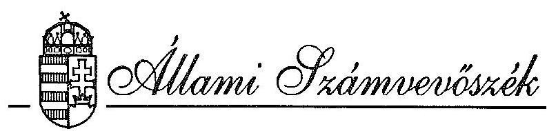
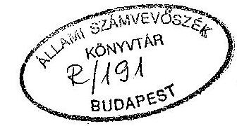
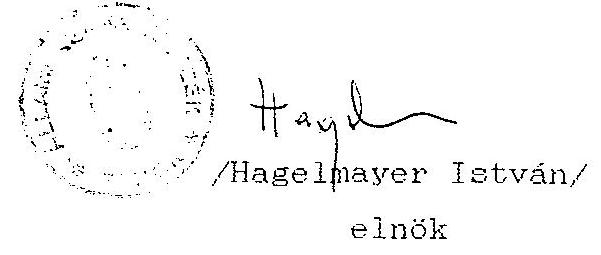

# JELENTÉS 

a Magyarországi Cigányok Igazság Szövetsége
1992. évi állami költségvetési támogatás felhasználásának ellenőrzéséről

---

A vizsgálatot vezette:

Dr. Elek János
osztályvezető főtanácsos

A vizsgálatot végezte:

Hoffmann István
Dr. Dotterweich Antal
Berzétey Attiláné
számvevö
számvevö tanácsos
számvevő tanácsos

---

# Allami Számvevõszék 

$\mathrm{V}-1020-7 / 1993-94$.

## J E L K N T E S

## a Magyarországí Cigányok Igazság Szövetsége   1992. évi állami költségvetési támogatás felhasználásának ellenôrzésérôl

## I.

Az ellenõrzés körülményei, célja és módszere

A társadalmi szervezeteknél - az Állami Számvevõszékrõl szóló törvény értelmében - az Állami Számvevõszék (továbbiakban: ASZ) ellenőrzi az állami költségvetésböl juttatott támogatás felhasználását. Az Országgyülés a 20/1992. (V. 26.) OGY határozatában döntött a nemzeti és etnikai kisebbségi szervezetek 1992. évi költségvetési támogatásáról, amelyben az ASZ ellenőrzési jogosultságát is megismételte. E határozat a cigányszervezetek részére 1992. évre 90 millió Ft költségvetési támogatást biztosított, amelyböl a felosztás során a Magyarországí Cigányok Igazság Szövetsége (továbbiakban: Szövetség) 4 millió Ft-tal részesedett. E jogszabályok figyelembevételével az ASZ 1993. II. félévi ellenőrzési terve alapján került sor az ellenőrzés végrehajtására.

---

A Szövetség a hozzátartozó regionális szervezeteivel egyetértésben úgy döntött, hogy együttesen fordulnak állami költségvetési támogatási kérelemmel az Országgyülés Emberi jogi, kisebbségi és vallásügyi bizottságához, mivel tagjai önálló bírósági bejegyzéssel nem rendelkező szervezetek, és a kapott támogatás felhasználásáról pedig közösen döntenek.

Erre való tekintettel az ASZ a szervezetek részére 1992. évre jóváhagyott állami költségvetési támogatás felhasználását a Szövetség központjában ellenőrizte.

Az ellenőrzés célja annak értékelése volt, hogy a Szövetség az állami költségvetési támogatást - az Országgyülés határozatában foglaltakra is figyelemmel - az alapszabályában megfogalmazott tevékenységi célok megvalósítása érdekében használta-e fel; továbbá a kitűzött célokat a költségek lehető legkisebb szintre való szorításával, minimális ráfordítással érte-e el. Ugyanakkor az ellenőrzés során arra is figyelemmel kellett lenni, hogy a nemzeti és etnikai szervezet müködése alapvetően politikai döntési folyamatok által determinált. Ebből kifolyólag pénzügyi kihatású intézkedéseik tervezése, végrehajtása is döntörészben behatárolt.

A Szövetség szervezetére és müködésére vonatkozó fontosabb információkat az 1. sz. melléklet tartalmazza.

Az ellenőrzés a lezárt 1992. gazdálkodási évre terjedt ki. Az ASZ a Szövetség, valamint tagjait képező regionális érdekképviseleti szervezetei pénzfelhasználását - utóbbit a Szövetséghez beküldött iratanyagok alapján - a Szövetség központjában vizsgálta. A helyszíni ellenőrzés 1993. november 17-töl 1993. november 30 -ig tartott.

---

# II. 

## Az 1992. évi tényleges pénzfelhasználás ellenőrzési tapasztalatai

## 1. A Szövetség 1992. évi tényleges pénzfelhasználásának értékelése

1. 2. A Szövetség 1992. január 3-án nyújtotta be költségvetési támogatási igényét az Országgyülés Emberi jogi, kisebbségi és vallásügyi bizottságához, 20 tételt tartalmazó költségvetésben, 9678 e Ft végösszegben. Ezen támogatási kérelem az elöirányzott kiadási tételekhez szöveges indoklást nem tartalmazott.

Az Országgyülés a Szövetségnek a 20/1992. (V. 26.) OGY határozatával 4000 e Ft öszzegü állami költségvetési támogatás szavazott meg.

A Szövetség 1992. évi költségvetését - az Országgyülés határozatának ismeretében - nem a Választmány hagyta jóvá, hanem - az alapszabálytól eltérően - 1992. június 20-án megtartott elnökségi ülés. Hiányosságként állapítja meg az ellenőrzés, hogy sem az alapszabály, sem a szervezeti és müködési szabályzat nem tartalmazza a pályázatokon elnyert pénzeszközök további felhasználása fölötti rendelkezést.

1. 2. A Szövetség elnöksége az alapszabályban megfogalmazott célok elérésére a 4000 e Ft költségvetési támogatáson kivül 208 e Ft öszzegben egyéb bevételt, a kiadási oldalon egyezően a bevétellel - összesen 4208 e Ft-ot tervezett.

---

A költségvetés tervezése áttekinthető, ugyanis naplófőkönyvből és bázisidőszaki alapon nyugvó adatkigyűjtéssel történt.

A Szövetségnek 1992. évben a tervezettet meghaladó bevételt sikerült elérnie, azaz végsősoron 4797 e Ft összegu forrással rendelkezett (a tervezettel szembeni növekedés oka túlnyomórészt pályázati úton elért többletbevétel másrészt pedig az Adóhivataltól visszaigényelt előzetesen felszámított forgalmi adó).

A Szövetség gazdálkodását és pénzfelhasználását 1992. évben a takarékosság és a célszerüség jellemezte.

Főbb költségnemekben a tényleges kiadások a következök szerint alakultak:

Kszközbeszerzés címen 400 e Ft kiadást irányoztak elõ (fénymásoló, telefax, irodabútor vásárlása), amelyek nem valósultak meg. Helyette - és ez nem volt elöirányozva - a központ irodahelyiségét újították fel 432 e Ft értékben. A tulajdonossal megkötött bérleti szerződésben foglaltak szerint a belsõ felújítások, karbantartási munkálatok költségei a bérlőt terhelik. Az ellenőrzés megitélése szerint a közel félmillió Ft összegu felújítás nagyságrendjére, benne egy-egy munkálat jellegére tekintettel (pl. mennyezet megerősités) a szükséges felújítást a tulajdonosnak kellett volna finansziroznia.

Bérköltségek címen 1010 e Ft-ot terveztek, amely az éves kiadások 24 \%-át jelentette, felölelve a Szövetség köz-

---

pontjában alkalmazottként foglalkoztatottak munkabérét, TB járulékát és munkanélküli járadékát. Ez összesen 4 föt érintett; az elnök, elnökhelyettes (utóbbinak évközben megszünt a foglalkoztatása), a takarító és a gyors- gépiró adminisztrátor munkabérét és járulékait. Ténylegesen 1102 e Ft-ot fizettek ki, amellyel a tervezettet 9,1 \%-kal haladták meg.

Bérjellegũ költségek címén 680 e Ft összeguu kiadást terveztek be, ténylegesen 587 e Ft-ot fizettek ki, 93 e Ft megtakarítást elérve. Ez összesen 7 föt érintett; jogtanácsost vettek igénybe, aki jogsegély szolgálatot teljesített, résztvett a szabályzatok elkészítésében; könyvszaKértőt kértek fel vizsgálat elvégzésére könyvelőt alkalmaztak stb. Végsõsoron a tényleges bérköltségek és bérjellegũ kifizetések együttesen 1689 e Ft-ot képviseltek, az éves tényleges kiadások $39,7 \%$-át. E kiadások a szervezet müködése, és nem kiserészben szabályozottsága érdekében merültek fel.

Anyag és egyéb jellegũ költségek cimen 180 e Ft összeget terveztek, amely ténylegesen 274 e Ft-ra alakult, 52,2 \%-kal meghaladva az elöirányzatot. A túllépésben döntöen egyéb költségek között elszámolt - be nem tervezett - felújítási anyagok stb. szerepelnek.

Utiköltségek és személygépkocsi használat címén elöirányoztak 422 e Ft kiadást, amely 446 e Ft-ra teljesült, némi túllépést eredményezve. Ezen összeget a Szövetség céljainak és feladatainak megvalósitása érdekében használta fel a Szövetség, utazások és kiküldetések költségeire, amelyek nagyrészt személygépkocsi és kisebbrészt tömegköz-

---

lekedési eszközök igénybevétele révén merültek fel, ülések és szervezések kapcsán.

Reprezentáció címen terveztek 28 e Ft-ot, ténylegesen 14 e Ft-ot költöttek el.

Helyiségbérleti díj és annak biztosítási díja címén 334 e Ft-ot terveztek kiadásként, amely ténylegesen 282 e Ft-ot jelentett, 52 e Ft megtakarítást eredményezve. (Bérleti dij emelésére számítva a tervezésnél, amely nem következett be.)

Szolgáltatások (áram- és fütési dij, telefon- és postaköltség stb.) címen 168 e Ft kiadást terveztek, amelyet 116 e Ft-ra teljesítettek. A megtakarítás mértéke 52 e Ft-ot képvisel.

Bankköltségek, bírságok címen 53 e Ft kiadást irányoztak elö, amely ténylegesen - némileg túllépve a tervezettet 60 e Ft-ra alakult. (A bírság betervezésénél, melyet egyébként nem szokás tervezni, a bírság-kiszabás megtörtént.)

Kulturális célokra (kiállítás, tánccsoport költségei, cigány műalkotás megvásárlása) 60 e Ft kiadást terveztek a költségvetésben, amelyet 49 e Ft-ban teljesítettek, 11 e Ft-ot megtakarítva.

Segélyek címén a tervezett 25 e Ft-tal szemben 22 e Ft összeget fizettek ki, összesen hét alkalommal, öt család részére. A segélyek 3000 és 5000 ezer Ft között mozogtak, halmozottan hátrányos helyzetü családoknak juttatva.

---

Tagszervezetek részére költségvetési támogatás címen az éves költségvetésbe 850 e Ft-ot állítottak be, amely ténylegesen 868 e Ft összegben realizálódott. Ez az összeg differenciáltan a Szövetség 38 tagszervezetének müködési támogatását és az etnikai kultúra, oktatás és hagyományőrzö tevékenység elősegítését szolgálta. Az ellenőrzés megállapítása szerint a differenciált pénzfelosztás az alapszabály rendelkezésétől eltérően történt, mivel nem a Választmány, hanem az Elnökség döntött a felosztás módjáról, figyelembe véve a szervezeti egységek taglétszámát, fennállásának idejét, kulturális tevékenységét. Megállapítható, hogy a 868 e Ft támogatás 12 megyei szervezetet, ezen belül 38 alapszervezetet érintett.

A tagszervezetek pénzfelhasználásának ellenőrzése a Szövetség központjában történt, a beküldött dokumentumok alapján. Annak ellenére, hogy a Szövetség elnöke a regionális szervezeteket több ízben szólította fel - írásban és szóban egyaránt - a kapott támogatás elszámolására, mindössze csak 6 vezető küldött - különbözö színvonalú, nem minden esetben dokumentumokkal alátámasztott - beszámolót. Ezek tanúsága szerint a 868 e Ft kapott támogatásból mindössze 336 e Ft-tal számoltak el, azaz 39 \%-kal. Ezekből azonban az alapszervezeteknek továbbadott támogatás összege nem állapítható meg. A kapott összegeket a vezetők általában az előzőekben részletezett tevékenységi célok megvalósítása érdekében használták fel. Hiányosság, hogy a beküldött hat beszámolóból kettőhöz semmiféle alapbizonylatot nem mellékeltek, a többinél pedig a saját gépkocsi üzemanyagfelhasználás elszámolása nem megfelelő.

---

Az elnök által megjelölt felhasználási céloktól eltérően egy szervezet - a kapott 50 e Ft támogatásból - 21200 öszzegben gitárt, mikrofont stb vásárolt.

Osszegezve a vizsgálati tapasztalatokat megállapítható, hogy a Szövetség a rendelkezésére álló 4797 e Ft-ból 4 252 e Ft-ot használt fel, amelybôl saját müködésére 47,5 \%-ot, az alapszabályában megfogalmazott feladatainak és céljainak megvalósítására $32,1 \%$-ot, tagszervezeteinek müködésére, azok tevékenységi céljainak elérésére pedig 20,4 \%-ot fordított. A takarékos gazdálkodást húzza alá az a tény is, hogy a pénzforrásokból megtakarított, fel nem használt 545 e Ft összeget a következõ - 1993. évre - vitték át.
2. A pénzfelhasználás törvényességével kapcsolatos megállapítások
2. 1. A Szövetség gazdálkodásának alapvetô rendjét az alapszabály és a szervezeti-müködési szabályzat rögzíti. Ezek a szabályzatok összességükben megfelelőek, egyes kérdéseket azonban nem tartalmaznak, így a

- pályázat útján kapott pénzeszközök további felhasználásában való illetékességi döntéskört,
- a költségtérítésben résztvevők (gépjármúhasználat stb.) körét és mértékét.

A pénzkezelésről és a szigorú számadási kötelezettség alá tartozó nyomtatványok kijelöléséről, nyilvántartásáról a házipénztár pénzkezelési szabályzat rendelkezik megfelelő módon.

---

2. 2. A Szövetség gazdasági eseményeinek rögzitésére 1992. évben az egyszeres könyvvitel vezetését (egyszerüsített mérleg készitését) választotta. Könyvviteli nyilvántartási kötelezettségének naplófôkönyv és pénztárkönyv vezetésével tett eleget, az ehhez szükséges kiegészitő és analitikus nyilvántartások felfektetésével, melyek egyes tételeit 1992. december 31-én felvett leltárral támasztotta alá. A naplófôkönyvi elszámolások számszakilag hibátlanok, azok a mérleggel egyezőek. A beszámoló készítési kötelezettségét a Szövetség nem a 157/1992. (XII. 4.) Korm. rendelet 4. sz. melléklete szerinti tartalommal, hanem 1991. évig hatályban volt mérlegbeszámoló táblázatainak kitöltésével teljesítette, ezzel a beszámolóval a számviteli törvényben elôírt következetesség, valódiság és folytonosság elvét sértették meg.

A Szövetség pénzügyi nyilvántartásait folyamatosan (SZJA köteles kifizetések, hivatali gépjármú használat, TB befizetési kötelezettségek, szigorú számadási kötelezettség alá tartozó bizonylatok) vezeti, egy-egy elszámolási hiányosság kivételével könyvelése szabályszerű bizonylatokon nyugszik.
2. 3. Ezek a hiányosságok a következôk:

- Hivatali gépjármú használatát és üzemanyag felhasználásának elszámolását, valamint költségtéritését nem a 17/1990. (V. 14.) KOHSM, illetve a 9/1991. (VI. 6.) KHVM rendeletben foglaltak szerint eszközölték, mivel útvonalnyilvántartás céljára használt menetleveleket az elöírásoktól eltérően vezették.

---

- Gépkocsivezetési pótlék címén kifizetett 9 e Ft összeget költségtérítésként számoltak el, amelyet a hatályos jogszabályok nem tesznek lehetővé, s kifizetésére a Szövetség belső döntést nem hozott.
- Az Adóhivataltól 153561 Ft előzetesen felszámított forgalmi adót igényeltek vissza, holott erre a Szövetség nem jogosult. A társadalmi szervezetek - hasonlóan a nonprofit szervezetekhez - adót viselnek, a tevékenység fenntartása érdekében történő beszerzések AFA-ját, mint tárgyi adómentes tevékenységet illetőt nem igényelhetik vissza. Adóalanyként csak akkor jelentkezhetnek be, ha az alaptevékenységen kívül kiegészítő jelleggel más gazdasági tevékenységet is folytatnak, amelynek AFA tömege éves színten a 300000 Ft-ot meghaladja.
- A Szövetség alapszabályában foglalt célkitűzésekkel ellentétes az a gyakorlat, hogy két fő helyett 10 ezer Ft összegben a hatóságnak szabálysértési bírságot fizettek be.

2. 4. A Szövetség a személyi jövedelemadó-köteles kifizetésekről nyilvántartást vezetett, adóbevallás és befizetési kötelezettségét időben teljesítette. A társadalombiztosítással kapcsolatos nyilvántartások és elszámolások színten rendben voltak.
3. 5. A Szövetség elnöke 1992. októberében okleveles könyvszakértőt bízott meg azzal, hogy a Szövetség Ellenőrző Bizottságával együtt végezzen vizsgálatot a Szövetség 1991. évi, illetve 1992. I - III. negyedévi gazdálkodásáról, azaz a pénzügyi támogatások felhasználásáról, a bizonylati

---

rendről és fegyelemről, az esetleges visszaélési lehetőségekről.

A vizsgálatról készített jelentés szerint - néhány hiányosság mellett - a Szövetség gazdasági-pénzügyi helyzete és müködése megfelelő (a feltárt hiányosságok megszüntetésére az elnök 1993. évben intézkedéseket tett).

# III. 

## Osszefoglalás, javaslatok

A Szövetség 1992. évben 4797 e Ft felhasználható pénzforrással rendelkezett, amelyböl 4000 e Ft-ot, azaz 83,4\%-t képviselt az Országgyülési határozattal odaitélt állami költségvetési támogatás. A pályázati úton elnyert támogatások összegét is figyelembevéve, hiszen azok is költségvetési támogatásból származnak, a juttatott támogatások részaránya $91,7 \%$-ot jelentett. Következésképpen az ellenőrzés során a teljes pénzfelhasználást kellett áttekinteni.

A Szövetség a rendelkezésére álló forrásokat alapvetően müködésére, tevékenységi céljainak elérésére használta fel, amelynek során a takarékosság és célszerűség szempontjai érvényesültek. Egybevetve az alapszabályban kitüzött tevékenységi célokat a megvalósultakkal megállapítható az is, hogy a Szövetség egészében tekintve eredményesen gazdálkodott, illetve müködött. (Nem mondható el ez a tagszervezeteiről, ahol a hiányos dokumentumok mellett a juttatások $39 \%$-ról adtak csak számot.)

---

A gazdálkodás, továbbá az azzal kapcsolatos könyvvitel elöírásait a Szövetség - összességében tekintve - betartotta.

Az ellenörzés a jelentésben felsorolt tapasztalatok alapján javasolja, hogy:

- a költségvetés elfogadását az alapszabályban megfogalmazottaknak megfelelően a Választmány hagyja jóvá és ne az elnökség;
- a szabályzatokat egészítsék ki a személygépkocsi használat költségtérítése, pályázati juttatások felhasználása, segélyek folyósitása tekintetében;
- utólag a 157/1992. (XII. 4.) Korm. rendelet 4. sz. melléklete alapján készítse el a Szövetség az 1992. évre vonatkozó mérlegbeszámoló táblázatait;
- önrevízió keretében rendezze a Szövetség a visszaigényelt 153 e Ft öszzegü AFA-t az Adóhivatallal, azaz fizesse be.

Budapest, 1994. február 14.

Melléklet: 1 db

---

# A Magyarországí Cigányok Igazság Szövetsége szervezete felépítésének rövidített ismertetése 

A Szövetség a Magyar Köztársaság Alkotmányában, valamint az egyesülési jogról szóló 1989. évi II. törvényben biztosított lehetöség alapján 1990. évben alakult meg.

A Szövetség céljait és feladatait tartalmazó alapszabályt, valamint a szervezeti és müködési szabályzatát 1991. novemberében országos közgyülés hagyta jóvá, amelyekben meghatározták, hogy a Szövetség célja:

- a cigány etnikum politikai, gazdasági és kulturális érdekeinek érvényesítése, képviselete;
- az általános társadalmi követelmények közvetítése a cigányság felé;
- az ifjúság felkészítése a társadalmi életre; a társadalom iránti felelősségük felkeltése és elmélyítése;
- a cigányság felemelkedésének összekapcsolása a demokrácia intézményrendszerének kiépítésében való részvétellel.

Feladata pedig: az elöbb felsorolt céloknak a területileg illetékes hatóságoknál - a lehetőségek határain belüli - érvényesítése.

A Szövetség szervezeti felépítésében az Országos Közgyülés a legfőbb döntést hozó fórum, amely négyévente ülésezik, és kizárólagos hatáskörébe tartozik az alapszabály megalkotása és módosítása, elnök és alelnök, továbbá az Országos Ugyvivő Testület és Ellenőrzö Bizottság megválasztása.

---

A Választmány az Országos Közgyülés ülései közötti idôszakban a Szövetség vezető szerve; irányítja és ellenőrzi az alapszervezetek és az Ugyvivő testület munkáját, feladatát képezi többek között a költségvetés meghatározása, az alapszervek tevékenységével kapcsolatos stratégiai, politikai, kulturális és gazdasági kérdések eldöntése.

Az országos Közgyülés által négy évre megválasztott Ellenőrzo Bizottság feladata az alapszabályban rögzített célokra a Szövetség jog- és alapszabályszerü müködésének és gazdálkodásának ellenőrzése. Ellenőrzéseit legalább félévenként tartja és ezek eredményéről írásban a Közgyülésnek beszámol.

A tisztségviselők közül a Szövetség elnöke, mint alkalmazott, felelős a testületi döntések végrehajtásáért, felel a központi szervezet vagyonáért és munkáltatói jogokat gyakorol.

A Szövetség és a hozzátartozó szervezetek közötti információcsere írásban, esetenként szóbeli megbeszélés útján történik. A Szövetséghez tartozó regionális szervezetek száma 1992. évben 12, amelyek hatáskörében több alapszervezet müködik. A regionális szervezetek müködését a Szövetség az állami költségvetés által juttatott támogatásból finanszirozza, az alapszabályban rögzített célokra tekintettel, lényegében létszámarányosan.

A regionális szervezete - az alapszabály szerint - származtatott jogi személyek, gazdasági-pénzügyi tevékenységükért maguk felelnek, de a Szövetségnek elszámolási kötelezettséggel tartoznak.

Budapest, 1993. december 13.