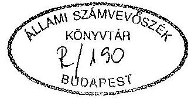
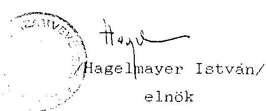

# Állami Számvevőszék 

## JELENTÉS

a Magyarországi Románok Szövetsége
1992. évi állami költségvetési támogatás felhasználásának ellenőrzéséről

---

A vizsgálatot vezette:
Dr. Elek János
osztályvezető főtanácsos

A vizsgálatot végezte:
Tóth István
számvevő tanácsos
Écsy Lajosné
számvevő

---

# Állami Számvevőszék 

$\mathrm{V}-1021-8 / 1993-94$.

## JELENTÉS

a Magyarországi Románok Szövetsége
1992. évi állami költségvetési támogatás
felhasználásának ellenőrzéséről

## I.

A vizsgálat körülményei, célja, módszere

Az Állami Számvevőszékről szóló törvény értelmében az Állami Számvevőszék (továbbiakban: ASZ) ellenőrzi az állami költségvetésből juttatott támogatás felhasználását a társadalmi szervezeteknél. Az Országgyűlés a 20/1992. (V. 26.) határozatában döntött a nemzetiségi és etnikai kisebbségi szervezetek 1992. évi állami költségvetési támogatásáról, amely egyben megismételte az ASZ ellenőrzési jogosultságát. E jogszabályok figyelembevételével az ASZ 1993. II. félévi ellenőrzési terve alapján került sor az ellenőrzés lefolytatására.

Az önálló bírósági bejegyzéssel rendelkező helyi román szervezetek - melyek valamennyien a Magyarországi Románok Szövetsége tagszervezetei - úgy döntöttek, hogy nem önállóan fordulnak állami költségvetési támogatási kérelemmel az Országgyűlés Emberi jogi, kisebbségi és vallásügyi bizottságához, hanem közösen a

---

Szövetség keretében. A kapott támogatás felhasználásáról pedig közösen döntenek.

Ennek figyelembevételével az ASZ a román szervezetek részére 1992. évre jóváhagyott állami költségvetési támogatás felhasználását a Magyarországi Románok Szövetségénél (továbbiakban: Szövetség) ellenőrizte.

Az ellenőrzés célja annak értékelése volt, hogy a Szövetség az állami költségvetési támogatást - az Országgyűlés határozatában foglaltakra is figyelemmel - az alapszabályában megfogalmazott tevékenységi célnak megfelelően használta-e fel és ezt a célt a lehető legkisebb eszköz- illetve pénzfelhasználással valósította-e meg.

Az ellenőrzés során figyelemmel kellett lenni arra, hogy a nemzetiségi és etnikai szervezetek tevékenysége jelentős mértékben politikai döntési folyamatok által formált. Ebből adódóan pénzügyi kihatású intézkedések tervezése, végrehajtása is túlnyomórészt meghatározott.

A Szövetség szervezetére és működésére vonatkozó fontosabb információkat az 1. sz. melléklet tartalmazza.

A vizsgálat a lezárt 1992. gazdálkodási évre terjedt ki. Az ASZ a pénzfelhasználást a Szövetség Titkárságán található dokumentumok alapján vizsgálta. A helyszíni ellenőrzés 1993. november 4-től 1993. november 23-ig tartott.

---

# II. 

## Az 1992. évi tényleges pénzfelhasználás ellenőrzési tapasztalatai

## 1. A Szövetség 1992. évi tényleges pénzfelhasználásának értékelése

a. A Szövetség 1992. február 20-án kelt levelében 5 nagyobb feladatcsoport megjelölésével 20500 e Ft költségvetési támogatási igényt nyújtott be az Országgyűlés Emberi jogi, kisebbségi és vallásügyi bizottságához.

Az igénylésben a működésükhöz felhasználható egyéb forrásokról nem adtak jelzést. A támogatási kérelem az egyes feladatcsoportokban értelmezett kiadásokhoz rövid szöveges indoklást is tartalmazott.

Az Országgyűlés 20/1992. (V. 26.) OGY határozatában 14500 e Ft állami költségvetési támogatást szavazott meg a Szövetségnek.

A Szövetség elnöksége a költségvetési támogatás ismeretében készítette el az 1992. évi költségvetését. Az ellenőrzés a Szövetség gazdálkodását ezen költségvetéshez viszonyítva vizsgálta.
b. A Szövetség elnöksége 18581 e Ft tervezett forrás ismeretében 16561 e Ft kiadást tervezett. A költségvetési terv tehát 1992. év végén 2020 e Ft pénzmaradvánnyal számolt.

---

A költségvetés tervezése áttekinthető, ugyanis az a könyvelési rendszerrel összhangban a főkönyvi számlák szerint készült. Ez a tervezési gyakorlat a terv és a tényleges teljesítés könnyű és gyors összehasonlítását teszi lehetővé.

A Szövetségnek 1992. évben a tervezetet meghaladó bevételekre sikerült szert tennie. Így 1992-ben a Szövetség rendelkezésére álló pénzforrás 21002 e Ft volt, ami 13%-kal haladja meg a tervezetet.

Az éves gazdálkodás és a pénzfelhasználás során a Szövetséget a körültekintés és a takarékosság vezette. Ennek a takarékosságnak köszönhető, hogy bár a szervezeteknek adott támogatás 37,1%-kal meghaladta a tervezettet, a Szövetség összes kiadása csak 96,2%-a a tervezettnek.

Az egyes fő költségnemek szerint a tényleges kiadások a következők szerint alakultak:

Anyag és anyagjellegű költségek címén 670 e Ft kiadást terveztek. Ezek a költségek gyakorlatilag teljes egészében a szervezet alapvető működési kiadásait tartalmazzák. A tényleges költségek azonban (582 e Ft) a tervezettnek csak 86,9%-át érték el. Ez a takarékos eszközbeszerzésnek köszönhető.

Bérköltségek címén 3610 e Ft-ot terveztek a költségvetésbe. Ebből 2850 e Ft a titkárságon foglalkoztatottak bérköltsége, 760 e Ft pedig a szervezet nemzetiségi hagyományőrző feladata érdekében a néptánc és ének tanítását végző külső megbízottak megbízási díjait tartalmazza. A felhasználás (3182 e Ft) a tervezettnek 88,2%-át tette ki. Ez elsősorban a teljes munkaidőben foglalkoztatottak bérének és jutalmának a tervezetthez

---

képest 547 e Ft-os megtakarításának eredménye. Ugyanakkor a nemzetiségi kultúra ápolásával összefüggő megbízási díjak összege 151 e Ft-tal meghaladta a tervezettet, ami több tánccsoport tevékenységének segítését eredményezte.

Költségvetési befizetés címén 1589 e Ft-ot terveztek, ami a bérköltségek tervezett TB járulék vonzata. A tényleges befizetések összege 1241 e Ft a tervezett 78%-a. Ez összhangban van a tervezettnél alacsonyabb bérköltség szinttel.

A Bérjellegű költségek címén tervezett 2625 e Ft-ból nagyobb hányadot - 1800 e Ft-ot - tett ki a Szövetség feladatainak megvalósítása érdekében tervezett bel- és külföldi (romániai) kiküldetések és az önálló kiadási tevékenységhez kapcsolódó honorárium költsége. A tényleges költségek a tervezettnél 30,2%-kal alacsonyabban alakultak (1833 e Ft). Ez elsősorban a tervezettnél lényegesen alacsonyabb - a feladatokkal összefüggő - bel- és külföldi kiküldetési költség és honoráriumdíj kifizetések következménye. Ezen a három területen a tervhez képest összesen 820 e Ft-ot takarítottak meg. A tervezett reprezentációs költségekhez (70 e Ft) képest is 57,3%-os megtakarítást értek el. Ugyanakkor az egyéb bérjellegű kifizetéseknél a tervhez (40 e Ft) képest 121 e Ft-os túlteljesítés tapasztalható. Ez abból adódik, hogy a költségvetés alakulásának tapasztalatai alapján az elnökségi tagok részére az Elnökség munkájuk elismeréseként 10 e Ft tiszteletdíjat szavazott meg.

Szolgáltatások címén 2300 e Ft kiadást terveztek. Ebből az összegből 1580 e Ft-ot tett ki a Szövetség céljainak és feladatainak megvalósítása érdekében a nemzeti kultúra ápolására tervezett 790 e Ft támogatás és az önálló kiadási tevékenységgel összefüggő 790 e Ft nyomdaköltség.

A költségek a tervezett 93,7%-át érték el (2156 e Ft) úgy, hogy a különböző külső szervezeteknek a nemzetiségi oktatás és hagyományápolás céljára a tervezettnél 23%-kal magasabb összegű (971 e Ft) támogatást adtak. A postaköltségek (143,2%) és az egyéb szolgáltatások költsége (122,5%) is jelentősen meghaladta a tervezettet. Ugyanakkor a szakértői díjak (77%), eszközkarbantartás (69%), nyomdaköltségek (55,7%), közműdíjak (82%) terén jelentős megtakarítást értek el.

Bankköltségek és biztosítási díjak címén egyaránt 50-50 e Ft-ot terveztek. A bankköltségek a tervezettnél alacsonyabb (70%), a biztosítási díjak annál magasabb (154%) szinten alakultak.

ÁFA befizetés címén a költségvetés 150 e Ft kiadást tartalmaz. Munkaadói járulékot 140 e Ft összegben terveztek. Az ÁFA befizetések a tervezett kiadásnak csupán 64,7%-át érték el (97 e Ft). A munkaadói járulék kismértékben meghaladta a tervezettet (105,7%).

Egyesületek támogatására 1600 e Ft-ot terveztek. Ez az összeg magában foglalta a Szövetség tagegyesületeinek működési támogatását és a nemzetiségi kultúra, oktatás és hagyományőrző tevékenységének támogatását is.

Az egyesületek támogatására a tervezett összeg 136,2%-át, 2179 e Ft-ot fordítottak. Ezt a nagymértékű többletkiadást a korábbi költségvetési címeknél elért megtakarítás tette lehetővé.

---

A Magyarországi Román Kultúráért Alapítvány javára, amit a Szövetség alapított 1000 e Ft befizetést terveztek.

Az Alapítvány javára 1992. augusztus 10-én a tervezett 1000 e Ft összeget fizették be. Ezt az alapítványi befizetést az ellenőrzés azért nem kifogásolja, mivel a Szövetség ezzel saját maga és tagszervezetei feladata és célja megvalósításához szükséges kedvezőbb forrásgyűjtési lehetőséget teremtett magán- és jogi személyek részére azzal, hogy egy olyan alapítványt hozott létre, melybe történő befizetés az adóalapból levonható. A Szövetség döntésének helyességét bizonyítja, hogy az alapítvány számláján elhelyezett összeg 1992. dec. 31-ig 1337 e Ft-ra növekedett.

Szerkesztőségi kiadások címén 2777 e Ft beruházási kiadást terveztek. Ezt az összeget még 1991-ben a fenti célok megvalósítása érdekében céltámogatásként kapták.

A kiadások a tervezett szinten alakultak. Itt a takarékosság abban valósult meg, hogy a Szövetség 4 különböző árajánlat közül választotta ki a számára legkedvezőbbet, amely a feladat teljesítése mellett a legteljeskörűbb felszereltséget biztosította. A pénz felhasználásáról a céltámogatást nyújtó szervezet felé elszámoltak.

A költségvetési terv cél szerinti összetételét vizsgálva megállapítható, hogy a tervezett 16561 e Ft kiadás 40,40%-át (6692 e Ft) tervezték működési kiadásokra, 39,72%-át (6479 e Ft) az alapszabályban meghatározott célok és feladatok megvalósítására, 19,88%-át (3390 e Ft-ot) pedig különböző szervezetek támogatására kívánták fordítani. Ugyan-

---

akkor megállapítható, hogy a 15929 e Ft kiadás 37,8%-át (6020 e Ft) működési kiadásokra, 33%-át (5263 e Ft) feladatok és célok megvalósítására, 29,2%-át (4646 e Ft) pedig különböző szervezetek támogatására fordítottak. A támogatások odaítéléséről minden esetben az 1. sz. mellékletben szereplő pénzelosztó bizottság döntött. Döntések meghozatalánál a jegyzőkönyvek tanúsága szerint a célszerűség és az eredményesség volt a meghatározó szempont.

A takarékos gazdálkodás, valamint egyes céltámogatással támogatott feladat nem teljeskörű megvalósulásának eredményeként 5058 e Ft pénzmaradványa volt a Szövetségnek. Ebből az összegből 4028 e Ft az állami költségvetésből nyújtott működési támogatás pénzmaradványa (az összes támogatás 27,8%-a). Tekintettel az Országgyűlés költségvetési támogatás odaítélési gyakorlatára - hogy a folyó évi támogatásról általában május hónapban döntenek -, a pénzmaradvány az előrelátó gazdálkodásra utal. Ennek hiányában ugyanis a következő támogatásig a Szövetség működését a pénzhiány akadályozta volna.
2. A pénzfelhasználás törvényességével kapcsolatos megállapítások
a. A Szövetség gazdálkodásának alapvető rendjét az alapszabály és a szervezeti működési szabályzat tartalmazza. Ezek a szabályzatok rendelkeznek a költségvetés elfogadására jogosult szervezetről, az utalványozásra jogosult munkakörökről, a könyvvitel módjáról, a támogatások odaítélésének rendjéről.

---

A házipénztári pénzkezelésről és a szigorú számadású nyomtatványok kijelöléséről és kezelésük módjáról a házipénztári pénzkezelési szabályzat rendelkezik.
b. A Szövetség gazdasági eseményeinek rögzítésére a kettős könyvvitelt választotta. A könyvvezetés szabályozására a számviteli törvény előírásainak megfelelő tartalmú számlarendet készítettek.

A számlarend a főkönyvi számlákra vonatkozó előírásokon túlmenően rendelkezik a kötelező analitikák fajtájáról és vezetési módjairól.

Kötelező analitikus nyilvántartásként vezetik a szállítói követelések, az SZJA kötelező kifizetések, a hivatali gépjármű használat, a TB befizetési kötelezettségek, a szigorú számadású bizonylatok, az állóeszközök egyedi nyilvántartását.

A házipénztár pénzkezelési szabályzat a szigorú számadású bizonylatok közé sorolja a:

- készpénzfizetési és elszámolási utalványt;
- bevételi és kiadási pénztárbizonylatot;
- a menetlevél és kiküldetési rendelvény tömböt.

A Szövetség beszámolási kötelezettségének a 157/1992. (XII. 4.) Korm. rendelet 4. sz. melléklete szerinti egyszerűsített mérleg elkészítésével tett eleget. A mérleg elkészítésekor és a könyvvezetés során a számviteli törvényben előírt alapelveket megfelelően érvényesítették.

---

c. A pénztári be- és kifizetéseket, valamint a banki átutalásokat minden esetben az annak alapjául szolgáló bizonylat alapján eszközlik. A bizonylatok kiállításánál betartják az alaki és tartalmi követelményeket. A könyvviteli hivatkozási számok alapján az alapbizonylatok könnyen, gyorsan visszakereshetők.

A más szervezeteknek adott támogatásoknál előírták az elszámolási kötelezettséget. Az 1992. évi támogatás felhasználásáról valamennyi szervezet elszámolt. Ahol pénzmaradványt
 jeleztek, ott annak elszámolását az 1993. évi támogatás odaítélésénél figyelembe veszik.

Az általuk céltámogatásként kapott összegek felhasználásáról a támogatást nyújtó felé előírás szerint elszámoltak.
d. A Szövetség külföldi kiküldetéssel összefüggő költségeinek fedezésére összesen 1160 e Ft értékben vásárolhatott volna valutát, a 36/1991. (XII. 23.) PM rendelet előírása szerint. Azonban ennél kevesebb, mindössze 142 e Ft értékben vásárolt a Szövetség konvertibilis valutát.

A konvertibilis valuta felhasználása és a vele való elszámolás során alapvetően betartották a 30/1992. (II. 13.) Korm. rendelet előírásait. A felhasználás során a rendelet mellékletében szereplő napidíj tételeket alkalmazták a Romániában történt kiutazások során.

Hiányosság ugyanakkor, hogy a rendelet 7. paragrafusában előírt módon nem szabályozták a devizaellátmány alkalmazásának rendjét, eseteit, a differenciálás elvét és mértékét.

---

e. A hivatali gépjármű használatát és üzemanyag felhasználásának elszámolását, a magántulajdonú gépjármű használatát, üzemanyag felhasználását és költségtérítését útnyilvántartás alapján a 17/1990. (V. 14.) KOHSM, illetve a 9/1991. (VI. 6.) KHVM rendelet előírásai szerint végezték.
f. A személyi jövedelemadóköteles kifizetések nyilvántartásával, bevallásával és befizetésével kapcsolatos kötelezettségének a Szövetség az előírásoknak megfelelően eleget tett. Ugyancsak rendbenlévőnek találta az ellenőrzés a társadalombiztosítással kapcsolatos nyilvántartásokat és elszámolásokat.

# III. 

## Összefoglalás, javaslatok

A Szövetség 1992-ben 21002 e Ft felhasználható pénzforrással rendelkezett. Ebből az összegből 69%-ot tett ki az Országgyűlés által 1992-ben odaítélt állami költségvetési támogatás, 28% pedig a különböző pályázatok alapján elnyert céltámogatás és az előző évi támogatás maradványa. Így a valamilyen módon költségvetésből származó összeg eléri a forrás 97%-át, ezért az ellenőrzés a teljes pénzfelhasználást áttekintette.

A Szövetség a felhasznált forrásokat 37,8%-ban saját működésére, 33%-ban feladatainak és céljainak megvalósítására, 29,2%-ban pedig tagszervezeteinek, illetve céljai megvalósításában közreműködő szervezetek támogatására fordította. A Szövetség saját felhasználása és a támogatás odaítélése során az eredményorientáltság és a takarékos felhasználás maradéktalanul érvényesült. Nem

---

tartja azonban az ellenőrzés szerencsésnek azt a gyakorlatot, hogy a Szövetség költségvetését az az elnökség fogadja el, amelynek tagjai tiszteletdíjban részesülnek.

A gazdálkodás, valamint az azzal kapcsolatos könyvvitel szabályait a Szövetség a pénzfelhasználás során alapvetően betartotta. Hiányosság ugyanakkor, hogy az ideiglenes külföldi kiküldetést teljesítők devizaellátmányáról szóló 30/1992. (II. 13.) Korm. rendelet 7. paragrafusában előírtak ellenére a Szövetség nem szabályozta az ellátmány alkalmazásának formáját, eseteit, a differenciálás elvét és mértékét.

A jelentésben megfogalmazott tapasztalatok alapján javasolja az ellenőrzés, hogy:

- az alapszabály módosításával a költségvetés és a zárszámadás elfogadása az elnökség hatásköréből kerüljön át az évente ülésező küldöttgyűlés hatáskörébe, elkerülendő, hogy az elnökség tagjai saját tiszteletdíjukról döntsenek:
- a Szövetség munkaügyi szabályzatában szabályozza a külföldi kiküldetést teljesítők devizaellátmányának alkalmazási formáját, eseteit, a differenciálás elvét és mértékét.

Budapest. 1994. február 14.

Melléklet: 1 db

---

# A Magyarországi Románok Szövetségének 

## szervezete

A Magyarországi Románok Szövetsége (továbbiakban: Szövetség) 1990. novemberében a Magyarországi Románok Demokratikus Szövetségének jogutódjaként jött létre.

Az alakuló kongresszus elfogadta a Szövetség alapszabályát, valamint megválasztotta az ügyintéző és képviselő szerveket és tisztségviselőket.

A Szövetség alapvető célja:

1. Irányítja a románság nyelvének, hagyományainak megőrzését, fejlesztését, az önazonosság erősítését, a közösségi élet fejlesztését.
2. A román kulturális örökség feltárása, őrzése fejlesztése.

A Szövetség feladata:

1. Támogatja a helyi szervezetek politikai és gazdasági érdekképviseleti, kulturális tevékenységét.
2. Önálló kiadási tevékenység folytatása.
3. Gyakorolja a jogszabályban biztosított jogokat a közoktatási, kulturális intézmények vezetőinek kinevezése esetén.
4. Véleményt nyilvánít, intézkedést kezdeményez, érvényt szerez a románokat érintő döntések előkészítése és végrehajtása során az alkotmány és az egyéb jogszabályok előírásainak.

A Szövetség ügyintéző és képviselő szervei a következők:

- Küldöttgyűlés: amely évente ülésezik. Irányítja a Szövetség működését, elfogadja az elnökség beszámolóját.

---

- Elnökség: amely a két küldöttgyűlés között irányítja a Szövetség működését és gazdálkodását, elfogadja annak költségvetését és zárszámadását. Az elnökség tagjai megbízatásukat társadalmi munkában látják el.
- Titkárság: amely végzi a Szövetség működésével kapcsolatos adminisztrációs és szervezési ügyeket, intézi annak gazdálkodási és könyvelési feladatait. A titkárság munkatársai feladatukat munkaviszony keretében látják el.

# A Szövetség tisztségviselői: 

- Elnök: a Szövetség legfőbb tisztségviselője és képviselője. Kizárólagos hatásköréhez tartozik az elnökségi tagok és titkársági alkalmazottak külföldi kiküldetésének engedélyezése.
- Elnökségi tagok: egyetemleges hatáskörébe tartozik a költségvetési keretek között a bérfejlesztés, bérmegállapítás, egyéb juttatások feletti rendelkezés, utalványozás.
- Titkárok: gondoskodnak a szakterületükre biztosított pénzeszközök rendeltetésszerű felhasználásáról. A gazdasági vezetővel együtt utalványozási jogkört gyakorolnak.

A Szövetség gazdálkodását, pénzügyeinek vitelét a titkárság látja el. A Szövetség teljes pénzforgalma itt bonyolódik. A Szövetség 13 tagszervezete önálló bírósági bejegyzéssel rendelkező önálló jogi személy. A részükre átadandó támogatás nagyságáról 16 tagú pénzelosztó bizottság dönt, melyben a szervezeteket 1-1 fő, a Szövetséget 3 fő képviseli, minden bizottsági tagnak 1 szavazati joga van.
