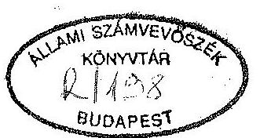
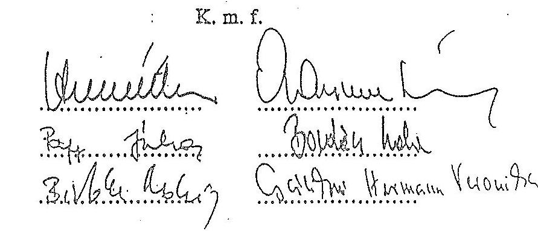
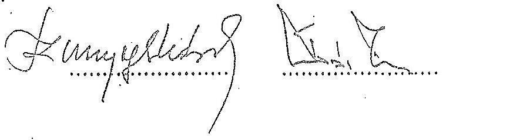
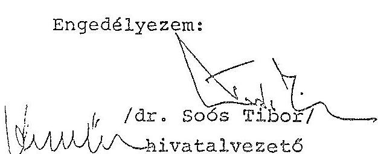

# Sillami Sramverössék 

## JELENTÉS

a Köztársasági Elnökség fejezet pénzügyi-gazdasági ellenőrzéséröl

---

Az ellenőrzést vezette:

Nagy Ákosné
fötanácsos

Az ellenőrzést végezték:

Csóry Györgyné
Szíjártó Károly
számvevö tanácsos
számvevő tanácsos

---

# JELENTÉS 

## a Köztársasági Elnökség fejezet pénzügyi-gazdasági ellenőrzéséről

A Köztársasági Elnökség 1991. évtől jelent meg mint fejezet a központi költségvetés szerkezeti rendjében. Ezt megelőzően a Köztársasági Elnöki Hivatal az Országgyűlés fejezethez tartozott és az Országgyűlés Hivatala (OGYH) részben önálló költségvetési szerveként funkcionált. A Köztársasági Elnökséget (KE) a Köztársasági Elnöki Hivatal (KEH) önállóan gazdálkodó, és a Köztársasági Elnök Katonai Irodája (KIR) részben önállóan gazdálkodó intézmények alkotják.
A KE fejezethez 1993-ban 3 cím tartozott (KEH, fejezeti kezelésű előirányzatok, ágazati célkeret).

A KE fejezeti önállóságához szükséges, de létrehozásakor még hiányzó személyi és tárgyi feltételek megteremtésének - a vizsgálat idején sem lezáruló - folyamata a költségvetési előirányzatok alakulásában is kifejezésre jutott.
A költségvetési előirányzat 1990. és 1993. évek összehasonlításában 69\%-kal - 109,7 M Ft-ról 185,8 M Ft-ra - emelkedett. A realizált bevétel az 1990. évi 51,6 M Ft-ról 1992-ben 205 M Ft-ra, a tényleges kiadások 46,5 M Ft-ról 196 M Ft-ra nőttek. A foglalkoztatottak létszáma ugyanezen időszakban 21 fơről 39 fôre emelkedett. A feladatok ellátásához 1990-ben 51,6 M Ft, 1992-ben 159 M Ft költségvetési támogatásban részesültek.

Az ellenőrzés célja annak értékelése volt, hogy a fejezeti tevékenységhez, a gazdálkodási önállósághoz mennyiben teremtették meg a szükséges személyi és tárgyi feltételeket, a fejezet költségvetési gazdálkodásában a törvényességi, a célszerűségi és eredményességi szempontok hogyan érvényesültek.

Az ellenőrzött időszak 1990-1993. I. félévre terjedt ki.

---

# I. 

## Következtetések, javaslatok

A vizsgált időszakban létrehozott KE fejezet az e besorolással járó követelményeknek még nem felelt meg.

A köztársasági elnök közjogi méltósághoz tartozó - az előző államfői teendőkhöz képest - újszerű és bővülő feladatrendszer intézményi háttere szakaszosan fejlődött, folyamatát az útkeresés jellemezte. A feladatok, a szervezet és a gazdálkodás feltételeinek összhangja kezdetben hiányzott, és a vizsgálat befejezéséig sem vált teljessé. A KEH alapítására nem született semmilyen jogszabály, vagy határozat. A tapasztalt ellentmondások, hiányosságok és szabálytalanságok meghatározó forrása volt ezért, hogy a megváltozott államfői feladatrendszer a régi alapokon jött létre, továbbá a gazdálkodási jogkör fejezeti szintre emelésével egyidejűleg nem történt változás a gazdálkodás szervezésének módjában.

A KE fejezeti besorolása 1991-ben formális volt, mivel nem rendelkezett a kapcsolatos jogosítványok gyakorlásához szükséges személyi, tárgyi és finanszírozási feltételekkel: pénzügyi-gazdasági szervezete nem volt, sőt még önálló bankszámlája sem. Az önálló fejezeti, illetve intézményi szintű gazdálkodás feltételeinek megteremtése - az előírásokhoz képest is - késedelmesen történt.

A KE szervezete nem igazodik megfelelően a feladatokhoz. Az elméletileg konstruált szervezet struktúrájában célszerütlenül túltagolt és nem konform a tevékenységgel, egyes vonatkozásban szűkebb, más vonatkozásban bővebb annál. Az apparátus kiépítettsége ugyanakkor lényegesen elmaradt a meghatározott lehetőségektől. A gazdálkodás szempontjából kulcsfontosságú pénzügyi szervezet személyi feltételeinek hiánya a pénzügyi-gazdasági feladatok ellátásának rovására ment. A szervezési, szabályozási és személyi feltételek hiányossága miatt a fejezeti és intézményi gazdálkodási feladatok összemosódtak.

A KE intézményeinek tevékenysége a múködésük kereteinek (alapító okirat, SZMSZ) rögzítése révén behatároltabbá vált, de még nem kellően szabályozoti. A feladat-, hatáskör, felelősség meghatározása, illetve elhatárolása nem megfelelő, többek között hiányzik a pénzügyi-gazdasági folyamatok szabályozása.

---

A feladatok és a hozzájuk rendelt pénzügyi keretek közötti összhang javult. A fejezeti költségvetés nagyságrendje a végrehajtott fedezet átcsoportosítások eredményeként arányosabban igazodott a tevékenység ráfordítás szükségletéhez. Az OGYH és a KEH közötti elszámolás módjával összefüggésben a költségvetés belső szerkezetében nem tükrözte reálisan a múködési költségeket.

A vizsgált években a fejezet költségvetése a feladatellátás pénzügyi szükségleteit maradéktalanul biztosította. A költségvetési tervező munkát az óvatosság és a biztonságra törekvés jellemezte, az előirányzatokat szükségletek felmérésével, számításokkal nem mindig támasztották alá, illetve dokumentáltságuk hiányos volt. A bázisszemléletű tervezés következtében a feladattartalmat meghaladó mértékben igényelt és juttatott - meghatározóan az állami kitüntetések céljára szolgáló pénzügyi keretek miatt egyes években jelentős pénzmaradványok képződtek, melyeket részben felajánlottak, részben elvontak.

A fejezetek közötti előirányzat átcsoportosítás megfelelt a törvényi előírásoknak, a fejezeten belüli előirányzat átcsoportosítás nem volt minden esetben dokumentált.

A fejezet költségvetési gazdálkodása kiegyensúlyozott, feszültségektől mentes volt. A részben önállóan gazdálkodó intézményi besorolás miatt folyamatosan csak a létszám- és bérelőirányzat felett döntöttek önállóan.

A folytatott létszám- és bérgazdálkodás következtében jelentős volt a tartósan üres álláshelyek száma. Ennek bérfedezetét - részben a többletfeladatokhoz kapcsolódóan, esetenként szabálytalanul - jutalmazási célokra fordították.

Az állami kitüntetésekre adott előirányzat vizsgálata céltól eltérő felhasználást nem tárt fel.

A pénzügyi és számviteli feladatokat 1992-ig teljeskörűen az OGYH végezte részükre. Az önálló gazdálkodási feltételek létrejöttét követően nem határolták be megfelelően - különböző gazdálkodási jogállású - KEH és KIR közötti, illetve a saját és a szolgáltatásként igénybe vett pénzügyi-gazdasági kapcsolatokat. Ennek következményeként az 1992. éves, és 1993. évközi beszámolók egyes adatai nem kellően megalapozottak, illetve nem feleltek meg teljes mértékben a számviteli előírásoknak.

A pénzügyi és bizonylati fegyelem nem érvényesült maradéktalanul.
Az ellenőrzési tevékenység rendszerében nem, csak egyes elemeiben kiépített, így

---

nem segítette megfelelően a vezetés munkáját, a gazdasági pénzügyi folyamatok szabályos vitelét.

# Az ellenőrzés megállapításai alapján javasoljuk, hogy a KE 

1. A szervezet korszerűsítése és racionalizálása érdekében tekintse át a feladatés szervezetrendszerét és figyelemmel az ellenőrzés megállapításaira
— törekedjen a főosztályi struktúra tagoltságának csökkentésére, a kapcsolódó feladatok célszerű összerendezésével;
— határozza meg a feladatvégzéshez szükséges létszámot és intézkedjen az üres álláshelyek betöltéséről;
— gondoskodjon a gazdasági apparátus megszervezéséről, ennek keretében intézkedjen felelős pénzügyi vezető kinevezésével a pénzügyi-gazdasági szervezet kiépítéséről.

## 2. A múködés rendje, szabályozottsága érdekében

— gondoskodjon az intézmények alapító okiratának, szervezeti, működési szabályzatainak kiegészítéséről, illetve korszerűsítéséről, a főosztályi ügyrendek, munkaköri leírások elkészítéséről;
—a pénzügyi-gazdasági folyamatokat - az OGYH, illetve a KEH és KIR közötti feladatmegosztás és kapcsolatrendszer figyelembevételével - szabályozza, készítsék el a számlarendet.
3. Gondoskodjon az intézményi belső ellenőrzés rendszerének teljeskörű kiépítéséről és megfelelő működtetéséről.
4. Vizsgálja felül az OGYH-val a feladatmegosztásra és a kapcsolódó pénzügyi fedezetre kötött megállapodást és a célszerűség követelményének érvényesítése alapján
— részletesen határozza meg, illetve pontosítsa az OGYH és a KEH közötti feladatmegosztást;
—intézkedjen a működés mérhető költségeinek saját gazdálkodási körébe vonásáról.

---

5. Gondoskodjon a költségvetése terhére beszerzett eszközök saját vagyonként való kimutatásához a feltételek megteremtéséről.
6. Szervezze meg az állami kitüntetések pénzeszközei felhasználásának nyilvántartási rendszerét.

# II. 

## Részletes megállapítások

## 1. A feladatok, a szervezeti rendszer és a gazdálkodási feltételek összhangja

Az Alkotmányt módosító 1989. évi XXXI. tv. hatálybalépését követően a köztársasági elnök közjogi méltósággal együttjáró feladat- és hatásköröknek megfelelő, ugyanakkor az állami intézményrendszerbe illeszkedő hivatali szervezet és a gazdálkodási önállóság több fokozatban alakult ki. E folyamat - különösen a gazdálkodást érintően - hiányosságokkal és ellentmondásokkal terhelten ment végbe. A feladatok, a szervezet és a gazdálkodás feltételeinek összhangja a megalakuláskor hiányzott, s a vizsgálat idején sem volt teljes. Ebben az átfogó helyzetelemzésen alapuló koncepció hiányán túl közrejátszott az is, hogy hagyományokra csak korlátozottan lehetett támaszkodni.

A KEH alapítására nem született jogszabály, vagy határozat, pusztán az Alkotmánynak a köztársasági elnökre vonatkozó szabályai voltak fellelhetők. A KEH a Népköztársaság Elnöki Tanácsa (NET) hivatali és költségvetési bázisán jött létre, ugyanakkor attól feladatköre és annak ráfordítás igénye alapvetően eltért.

Nem történt változás a gazdálkodás szervezésének módjában: a KEH - mint korábban a NET Titkársága - az Országgyúlés (OGY) fejezetbe tartozóan az OGYH részben önálló költségvetési szerveként múködött.

Az önálló megjelenítés céljából az 1990. évi CIV. törvény a központi költségvetés szerkezetén belül a Köztársasági Elnökséget fejezetként elkülönítette.

A KE fejezet létrehozása 1991-ben a törvényi előírás szerint is formális volt. A KE nem rendelkezett a fejezeti jogok, kötelezettségek gyakorlásához szükséges

---

személyi, tárgyi és finanszírozási feltételekkel, sőt az intézményi szintű önálló költségvetési gazdálkodáshoz szükséges kritériumokkal sem.

Az 1990. évi CIV. törvény 22. §-a szerint a fejezeti besorolás nem érintette a költségvetési szervek törzskönyvi nyilvántartását, bankszámlarendjét, bankszámla számait, azon 1991-ben változtatni nem kellett. Így a KE fejezet továbbra is az OGYH részben önállóan gazdálkodó szerveként, annak beszámolási rendszerében jelent meg.

Az önálló, fejezeti gazdálkodás megszervezése, feltételeinek kialakítása - a jogszabályi előírásokhoz képest is - késedelmesen történt. Az 1991. évi XCI. törvény hatálybalépésével 1992-től a fejezeti szintű gazdálkodás kritériumainak megléte alóli felmentés megszűnt, ugyanakkor a szükséges feltételek megteremtésére nem született meg időben az intézkedés.

Az önálló gazdálkodás feltételeinek megteremtését az OGYH és a KEH vezetője közös előterjesztésben 1992. jún. 23-án kelt levélben kezdeményezte a Pénzügyminisztériumnál. Ebben kérték - többek között - a hozzájárulást: a KE fejezet és a KEH intézmény részére 1992. jül. 1-jével a bankszámlák megnyitásához; az OGYH, a KE és a KEH pénzellátási feladatainak visszamenőleges rendezéséhez; 1992. jan. 1-i időponttal a KEH önállóan gazdálkodó költségvetési szerv alapításához.

Az 1992. novemberében keltezett válasz értelmében az intézkedésekre 1993. jan. 1-től kerülhetett sor.

A célszerűség, takarékosság jegyében a gazdasági műszaki feladatok meghatározott részét - a közös elhelyezés, az azonos rendszerben szervezett pénzügyi-gazdasági folyamatok előnyeit kamatoztatva - az önálló költségvetési gazdálkodás finanszírozási feltételeinek létrejöttét követően is az OGYH végzi. A költségvetési gazdálkodás jelenlegi feltételei ennek ellenére nem felelnek meg a követelményeknek. A fejezeti szintű költségvetési gazdálkodáshoz kapcsolódó jogosítványok - tervezési, előirányzat módosítási, pénzügyi ellenőrzési, stb. teendők - telepítése ugyanis nem rendezett egyértelműen. A fejezeti és intézményi gazdálkodási feladatok összemosódnak. Hiányzik a felelős vezető irányításával működő pénzügyi apparátus.

Az 1992. évi költségvetésben tervezett és elfogadott 3 fős pénzügyi és számviteli osztály nem épült ki.
A gazdálkodási feladatokat a fejezet és a KEH intézmény szintjén 1993. január 1-től látja el egy számviteli főelőadó, akinek a szervezeti hovatartozása nem megoldott. Ez az önálló fejezetté válás kritériumrendszerével össze nem egyeztethető állapot, a helyettesítés megoldatlanságán túl, felveti a kontroll teljes hiányát.

---

A pénzügyi, gazdasági feladatok újraszervezése az OGYH-nál is csak 1992. második felében kezdődött el.

A részben önállóan gazdálkodó KIR pénzügyi-gazdasági feladatkapcsolódásai nem a legésszerűbbek.

A KIR a főkönyvelőségén (1 fő részmunkaidős állás) keresztül részben önállóan, részben a KEH-el közösen látja el a gazdálkodási feladatokat. Tekintve, hogy ezeknek egy részét a KEH számára az OGYH végzi, a feladatellátásban többszörös az áttétel.
Ezen túlmenően a KIR és a Magyar Honvédség Parancsnoksága között is vannak átfedések a gazdálkodási feladatokban.

A KE munkaszervezete célszerűtlenül elaprózódott, főosztályi struktúrája létszámához képest túltagolttá vált. Ebben közrejátszott az, hogy a központi államhatalmi apparátus - társadalmi presztízséből következő - besorolási igénye nem illeszthető maradéktalanul a köztisztviselői törvény előírásaihoz. Ezért a beosztás rangját, a kvalifikáltságot a vezetői besorolással kívánták elismerni.

Az 58 álláshellyel rendelkező KEH egymás mellé rendelt szervezeti egységeinek száma az SZMSZ szerint 9. A főosztályok kétharmadának státusza 3-6 fő (pl. az Alkotmányügyi Főosztály, a Panaszügyi és Levelezési Főosztály 3-3 álláshellyel rendelkezik).

A KIR 4 szervezeti egységre tagolódik, az apparátus ugyanakkor mindössze 1-1 föt jelent. Így a feladatellátás a gyakorlatban nem szervezeti elkülönülésben, hanem a feladatoknak az adott létszámra telepítésében jelenik meg.

A foglalkoztatottak 45\%-a vezetői besorolású.
A KE munkaszervezete nem igazodik kellően a feladatokhoz. A szervezeti keretek meghatározása, biztosítása esetileg megelőzte a tevékenység tényleges változását. Ugyanakkor az apparátus kiépítettsége a költségvetésben meghatározott lehetőségektől - részben objektív okokra visszavezethetően - lényegesen elmaradt.

Az 1993. évre jóváhagyott 60 fős apparátus csak 65\%-ban feltöltött.
A KEH-nél a kegyelmi ügyekkel kapcsolatos feladatok teljeskörü átadását az Igazságügyi Minisztérium kezdeményezte 1991-ben. Az előterjesztést, a költségvetési keretek biztosítását követően - alkotmánymódosítási kötelezettségekre hivatkozással - a miniszter mindezt visszavonta. Így az e feladat ellátásához szükséges szervezeti egység felállítása elmaradt.
Nem jött létre még a köztársasági meghízottakkal kapcsolatos feladatok ellátására tervbe vett önálló részleg.

---

Ugyanakkor létrejött a külügyi és a sajtó fóosztály, bővült a levelezési főosztály. Emellett a köztársasági elnök közéleti szerepének növekedésével szükségszerűen és lényegesen megnőtt a különböző hivatali egységek feladatainak mennyisége és igényessége.

Nincs betöltve több fontos munkakör (elnöki titkár, stb.). Hiányzik a szervezet kiegészítése, a feladat ellátásához minimálisan szükségesnek ítélt további részegységgel (pl. társadalompolitikai osztály, protokoll osztály, stb.).
Ezeket a feladatokat az egyes meglévő szakterületek dolgozói látják el. (Pl. minden fóosztály a munkaterülete szerinti, - egyes részlegeknél naponta jelentkező - protokoll és szervezési tennivalókat.)

A szervezet nemzetközi és hazai összehasonlításban is szerénynek minősül és - a jelenlegi létszámfeltöltöttség mellett - erősen túlterhelt. Az apparátus a feladatokhoz képest mértéktartó.

A feladatok és a hozzájuk rendelt költségvetési keretek összhangja az egyes években fokozatosan javult, de az aránytalanságokat, átfedéseket még nem számolták fel teljesen.

A KE költségvetésében 1991-ig csak a müködés szorosan vett közvetlen kiadásai (bér, társadalombiztosítási járulék, reprezentáció, kitüntetési anyagok) szerepeltek.
Az OGY fejezettől 1992-tól átcsoportosítottak a KEH müködésével összefüggő - s addig ott előirányzott - ráfordítások (közüzemi díjak, energia, stb.) fedezetére $58,4 \mathrm{M} \mathrm{Ft}$ költségvetési támogatást. Az előirányzat átcsoportosítás mértékét arányosítással határozták meg. Realitásának ellenőrzése, valorizációja elmaradt.

A KIR feladataival kapcsolatos kiadások 1991-ig nem, s az 1992. évi 5,6 M Ft előirányzat átcsoportosítást követően sem teljeskörűen jelentek meg a fejezet költségvetésében. A Magyar Honvédség Parancsnoksága viseli továbbra is a kötelékébe tartozó, de a KIR-hez kivezényelt hivatásos állománnyal kapcsolatos költségvetési terheket, az összráfordítás mintegy kétharmadát.

A KE, illetve intézményei tevékenysége a vizsgált időszak második felére, a szervezet és müködés kereteinek meghatározásával szabályozottabbá vált.

A KEH és KIR alapító okíratát 1993. január 1-jével kiadták és ezzel egyidejülcg hatályba lépett a Szervezeti és Müködési Szabályzatuk.

A tevékenység regulációja azonban még nem megfelelő. Az alapító okiratok tartalma nem felel meg teljeskörüen a 4/1991. (II.13.) PM rendeletben, illetve a 137/1993. (X.12.) Korm. rendeletben előírt követelményeknek.

---

A KIR alapító okirata gazdálkodási jogkörét részben önálló, bankszámlával rendelkező költségvetési szervként jelöli meg. Ugyanakkor e besorolással egyidejűleg nem rögzítették az önálló költségvetési szervhez tartozását, kapcsolatait.

Az SZMSZ-ok néhány vonatkozásban kiegészítésre, pontosításra szorulnak. A hivatali apparátus tevékenysége a feladat-, hatáskör és felelősség vonatkozásában ugyanis nem megfelelően rögzített. Mind a fejezeti szintű, mind az intézményi költségvetési gazdálkodás súlyának megfelelő kezelése a szabályozás oldaláról sem biztosított megfelelően.

Mindkét SZMSZ szakszerűtlenül és pontatlanul, egyetlen mondatba tömöríti a gazdálkodási teendőket. Eszerint a KEH-nél, a gyakorlatban nem is létező üzemeltetési csoport, a KIR-nél a fökönyvelóség "ellátja azokat a feladatokat, amelyek költségvetési szerveknél a fejezet gazdálkodásával kapcsolatban a gazdasági hivatalra tartoznak".

A fejezet és az intézmények, valamint az OGYH kapcsolata ugyancsak nem rendezett. Az OGYH és a KEH közötti feladatmegosztást 1993. január 1-i hatállyal emlékeztetőben rögzítették. Ez a dokumentum azonban nagyon szűkszavúan, felsorolásszerűen rendezi a felek közötti viszonyt.

A szabályozás nem teljeskörü. A főosztályi ügyrendek, a munkaköri leírások még nem készültek el. Alapvető hiányosság továbbá - az átfogó pénzügyi szabályozás hiányán kívül - az is, hogy a KEH-nek nincs érvényes számlarendje.

Az azonos időpontban kelt különböző, hatályos szabályzatok nem mindig konformak egymással.

A KEH Szervezeti és Müködési Szabályzata említést sem tesz főkönyvelői státuszról, az összes többi szabályzat viszont konzekvensen a "főkönyvelőre" címzetten határoz meg feladatokat, pl. a kötelezettségvállalás, érvényesítés, utalványozás rendjéről szóló szabályzat szerint: "a köztársasági elnök intézkedéseit haladéktalanul végre kell hajtani, miután azt a Hivatal vezetője vagy pénzügyi helyettese (továbbiakban főkönyvelő) ellenjegyezte".

A gazdálkodás irányítási, döntési rendszeréhez a szervezett és folyamatos információ szolgáltatás szűkkörű, nem teszi lehetővé a gazdálkodás átfogó értékelését. Vezetői értekezletek napirendjéről a gazdálkodási témák általában hiányoznak.

A jelenlegi adatkezelési-gyűjtési rendszer nem alkalmas arra, hogy direkt módon, egyértelműen megállapítható legyen, hogy az állami kitüntetések fel-

---

adata (pénzjutalommal, dologi kiadásokkal, reprezentációval, stb. együtt) öszszességében mibe kerül.

Az OGYH-val kötött megállapodásban nem rögzítették az adatszolgáltatás rendjét, így az esetleges.

# 2. A költségvetési tervezési és finanszírozási rendszer értékelése 

A KE költségvetési előirányzata a vizsgált időszakban - meghatározóan a feladataihoz kapcsolódó pénzügyi előirányzatok más fejezetektől való átcsoportosítása, kisebb mértékben a feladatváltozás révén - közel kétszeresére nőtt. A költségvetési kiadások nagysága szerint a fejezetek sorrendjében a KE költségvetése változatlanul a legkisebbek közé tartozik.

Az ellenőrzött időszakban az éves költségvetési javaslatok kimunkálása az OGY fejezet tervezési folyamatába illeszkedett és - önálló bankszámla hiányában - a kiemelt előirányzatok elszámolással való elkülönítésére alapozódott. A KEH - illetve 1991-től a KE - és OGY fejezet közötti kapcsolatot a tervezési munkában nem mindig dokumentálták külön. Ezért a költségvetési javaslatok alapdokumentumai nem álltak teljeskörűen az ellenőrzés rendelkezésére. Így az 1990. és 1991. évekre a bázis- és alapelőirányzatok levezetése nem volt dokumentált. Ezt követő időszakra az éves költségvetési javaslatok kiemelt előirányzatainak kidolgozásánál a vizsgálat szabálytalanságot nem tárt fel.

A tervézés - a fejezeti költségvetés tartalmához igazodóan, - csak néhány előirányzat: a működési ráfordítások közül meghatározóan a bér és járulékai, valamint a kitüntetésekkel kapcsolatos fejezeti kezelésű előirányzatok megállapítására irányult.

Az OGYH által végzett műszaki, gazdasági feladatok fedezetéül szolgáló előirányzatot 1992-től egy összegben és lényegében változatlanul szerepeltették a költségvetésben.

A tervezési munkában sem érvényesült maradéktalanul a feladat és a hozzárendelt pénzügyi keretek összhangja. A kiadások tervezését az óvatosság, a biztonságra törekvés jellemezte. Az előirányzatokat ugyanakkor esetenként nem alapozták meg a szükségletek konkrét felmérésével. A fejezeti kezelésű - az állami kitüntetések céljára szolgáló - pénzügyi keretekkel a feladattartalom nem volt mindig arányban.

---

A KEH az állami kitüntetési célt szolgáló pénzeszközöket a miniszterelnök javaslata, illetve előterjesztése alapján használta fel. A feladat időbeni ismeretének hiányában ezért az állami kitüntetések pénzügyi előirányzatának tervezése bázisszemléletủ volt. A kitüntetésekkel kapcsolatos ráfordítás általában jelentősen kisebb volt, mint a javasolt és jóváhagyott előirányzat.

A fejlesztési többletek alapvetően a hivatali szervezet kiépítésére irányultak. Ezeket a feladatok és a létszám komplex elemzésével nem, a kapcsolódó kiadásokat számításokkal csak részben támasztották alá. Így azok indokoltsága a végrehajtás tükrében nem volt megfelelően nyomonkövethető.

Az 1992. évi 20 M Ft-os fejlesztési többlet indokoltságát megfelelő számítási anyag nem igazolta, a végrehajtás tükrében mértéke részben túlzott volt. Ezt részben az Igazságügyi Minisztériumtól tervbe vett feladatátvétel elmaradása okozta.

A költségvetési előirányzat módosítása nem volt gyakori, s általában mértékében sem volt jelentős. Jellemzésül: a jóváhagyotthoz képest 1990-ben és 1993. első félévében nem változott, 1991-ben $6 \%$-kal, 1992-ben $11 \%$-kal nőtt a fejezet módosított költségvetése. Pótelőirányzatot feladataikhoz nem igényeltek. Kormányhatáskörben a központi költségvetés deficitcsökkentését célzó zárolás, pénzmaradvány elvonás, saját hatáskörben a pénzmaradvány igénybevétele volt a módosítás indoka. A fejezeten belül - címek között - előirányzat átcsoportosítás a fejezeti kezelésű pénzeszközök (állami kitüntetések) felhasználásával - mely a KEH költségvetési keretei között történik - függött össze.

Az előirányzat módosítások dokumentáltsága nem minden esetben volt megfelelő.
Az előirányzat módosításokkal kapcsolatos ügyiratokból utólag nem minden esetben állapítható meg közvetlenül azok indokoltsága, feladatorientáltsága, forrása.

Az 1991. évi pénzmaradványból visszahagyott 216,2 E Ft-os saját hatáskörü előirányzat módosítás nem volt dokumentált.

A fejezeti kezelésű állami kitüntetési pénzeszközök KEH-hez történő átcsoportosítása a vizsgált években számvitelileg nem volt nyomonkövethetö. Az 1992. évi átcsoportosítást a lebontás mikéntjét levezető, a hivatalos formaságokat nélkülöző bizonylat deklarálta.

A fejezetek között az előirányzat átcsoportosítás a törvényi előírások megtartásával történt.

---

A müködési kiadások fedezetére az OGY fejezettől átvett 58,4 M Ft előirányzatot az 1991. évi XCI. törvény hagyta jóvá.

A KIR feladatainak részbeni fedezetére a HM fejezettől az előirányzat átcsoportosítása az 1991. évi XCI. törvény 41. § (4) bek. a. pontja alapján történt. Az előirányzatot a tényleges ráfordítások alapján határozták meg, s rögzítették azon belül a kiemelt (bér, TB járulék, dologi) előirányzatokat.

A pénzellátás általában kiegyensúlyozott volt, pénzügyi feszültségek lényegében nem keletkeztek.

A fejezet költségvetési támogatását 1992. évvel bezárólag az OGY fejezeti számláin keresztül folyóstották, ami 1992-ben már nem felelt meg a pénzellátás szabályạinak. A fejezet pénzellátását, a finanszírozási tevékenységet ezért kellően megítélni csak 1993-tól - az önálló bankszámlák megnyitásától kezdődően lehetett.
A pénzellátás a jogszabályi előírások szerinti ütemezéssel történt, de nem mindig igazodott a finanszírozási szükséglethez. Előfordult ugyanis, hogy a kiadások kiegyenlítési igénye késve követte az előirányzat átcsoportosítást.

A KIR feladataival kapcsolatos kiadásokat 1992-ben - az elöirányzat átcsoportosítást követöen is - a Magyar Honvédség Parancsnoksága saját költségvetési elöirányzata terhére finanszírozta, s a pénzügyi rendezést csak 1993-ban végezték el.

Az átmenetileg szabad pénzeszközök hasznosítását - az önálló fejezetté válást megelőzően - az OGY fejezet végezte. A pénzeszközök elkülönített kezelésének hiányábân az ebből eredő kamat összeg KEH-re eső hányada nem volt megállapítható. Az ideiglenesen lekötött pénzeszközök kamatából elért többletbevétel 1992ben 22 E Ft volt.

1993-ban a fejezet pénzellátási számlájáról közvetlenül nem eszközöltek befektetéseket, szabad pénzeszközök hasznosítására intézményi szinten sem történt intézkedés.

A vizsgált időszakban folyamatosan változó, esetenként a költségvetés nagyságrendjéhez képest jelentős összegű pénzmaradványok képződtek, melyek forrása döntően a kiadási - meghatározóan a kitüntetésekre szolgáló - előirányzat megtakarítás volt.
Az OGY fejezettel közösen kezelt pénzeszközökből 1992-ig arányosítással - a kiemelt tételek maradványösszegének kimutatásával - állapították meg a pénzma-

---

radvány összegét. Az elszámolások dokumentációja teljeskörűen csak 1991-től állt rendelkezésre.

Az 1991-ben 20,2 M Ft, 1992-ben 9 M Ft pénzmaradvány képződött.
A pénzmaradvány megállapítása 1991-92. évben szabályosan történt. Önrevízióval csak 1991-ben tártak fel 19,2 M Ft befizetési kötelezettséget az állami kitüntetések keretmaradványaként. Ugyanekkor a Kormány 3490/1992. sz. határozata alapján további 3,2 M Ft-tal csökkentették a fejezet felhasználható pénzmaradványát.
A szabad felhasználású pénzmaradvány 1992. év végén 9,3 M Ft volt, a költségvetés több mint $5 \%$-a.
A pénzmaradvány felhasználás 1991-ben 5,1 M Ft, 1992-ben 1,2 M Ft volt, ebből a bérmaradványt jutalmazás céljára fordították.

# 3. A költségvetés végrehajtása 

A fejezet a vizsgált években rendelkezett a feladatellátáshoz szükséges pénzügyi fedezettel, gazdálkodása kiegyensúlyozott, mértéktartó volt.

A ténylegesen realizált - pénzmaradvány elvonás nélkül - bevétele az 1990. évi 51,6 M Ft-ról folyamatosan, 1992-ben 160,2 M Ft-ra ( $210 \%$-kal) emelkedett. Forrása a központi költségvetés volt (3. sz. melléklet).

A feladatok jellege miatt a fejezet, illetve intézményei alaptevékenységéhez nem kapcsolódik rendszeres saját bevétel, vállalkozási tevékenységet nem folytattak. A költségvetési támogatást a vizsgált időszak egyes éveiben csak a mértékében hullámzó, de nem számottevő pénzmaradvány felhasználás egészítette ki.

A teljesített kiadások összege ugyanezen időszakban megháromszorozódott: 1990ben $46,5 \mathrm{M} \mathrm{Ft}, 1992$-ben $151,5 \mathrm{M}$ Ft volt. Növekedésében a feladatbővülés, az inflációs hatás mellett a feladatokhoz tartozó fedezet átcsoportosítás volt a meghatározó tényező (4. sz. melléklet).

A kiadások szerkezete az egyes években - elszámolás technikai okok miatt - eltérő tartalmú volt. A fejezetté válást követően is előfordult, hogy különbözött a ráfordítások kimutatásának elve. Lényegében a vizsgálat idejére sem alakult ki olyan elszámolási rend, ami megfelelően alkalmas a kiadások valós bemutatására.

---

Az OGY-től a KEH feladatai fedezetéül átcsoportositott kiadási elöirányzatot (bér, Tb. járulék, közlizemi díjak, felújitás, anyagbeszerzés, stb.) több jogcímen határozták meg (1. sz. melléklet).

Az 1992. évi költségvetésben ugyanakkor azt egy összegben, szolgáltatásként tervezték meg, a tárgyévi beszámolóban azonban fejezetek közötti pénzátadásként jelenítették meg. (1993-tól egységesen ez utóbbi megoldást alkalmazták.)

A működési kiadások az elszámolás módjából következően az OGY által végzett szolgáltatás kiadásait nem tartalmazzák.

A műszaki, gazdasági feladatokra az OGYH-nak átadott keret tartalmában több olyan közvetlenül mérhető kiadási tételt is magában foglal, amely az előirányzattal való gazdálkodás követelménye, a felhasználás kimutatásának egységessége szempontjából a KE fejezetnél indokolt (pl. eszközbeszerzés).

A KE fejezet költségvetési gazdálkodása tehát folyamatosan csak néhány kiadási jogcímre és esetenként azoknál sem az előirányzat egészére terjedt ki. Az előirányzatok felhasználásánál a takarékosság követelményét általában érvényesítették.

A kimutatott müködési ráfordítások több mint felét a béralap és járuléka képezte, további jelentős tétel a bérjellegủ kiadások voltak. Ezek alkotják a költségcsoport több mint $80 \%$-át.

A létszám- és bérelöirányzatokkal a vizsgált időszak egészében a KE önállóan gazdálkódott.
A KE-nél foglalkoztatottak állományi átlaglétszáma az 1990. évi 28 fơről, 1992-ben 40 före, $42 \%$-kal emelkedett. A költségvetésben előirányzottat az álláshelyek betöltése jelentős elmaradással követte: 1992-ben és - időarányosan 1993-ban - 67-65\% volt a létszámfeltöltöttség aránya.
A tervezetthez képest az állománycsoportonkénti foglalkoztatás jól dokumentálja az intézmények szervezeti kiépítésének túlzottan lassú folyamatát.

A betöltetlen álláshelyek 45\%-a a vezetői, egyharmada az ügyviteli állománycsoportban alakult ki.

Az üres álláshelyek jelentős száma és aránya részben a munkakör betöltéséhez füzött magas követelményrendszerrel függ össze, ugyanakkor következtetni enged tervezési lazaságra, illetve a létszám- és bérgazdálkodás hiányosságaira.

---

A teljes munkaidőben való foglalkoztatási forma volt a meghatározó. Emellett emelkedő számban alkalmaztak nyugdíjasokat, létszámarányuk mintegy 20\%. A részmunkaidőben való foglalkoztatás nem volt jellemző.

A feladatok ellátására növekvő mértékben adtak megbízást szakértők részére, ennek ellenére az állományon kívüli bérfelhasználás továbbra sem számottevó.

Az állományon kívüli bérkiadás 1991-ben $0,1 \mathrm{M}$ Ft, 1992-ben $1,7 \mathrm{M}$ Ft volt.
A bérkiadások a tényleges foglalkoztatást meghaladó mértékben nőttek. Az e jogcímen eszközölt kifizetések 1990-1992. között 9,4 M Ft-ról 33,9 M Ft-ra, $260 \%$-kal emelkedtek.

A béralap felhasználás növekedésében 1991-ben jelentős tényező volt a létszámbővülés.

A foglalkoztatott 9 fős többletlétszám a béralap $8,8 \mathrm{M}$ Ft-os növekedésének egyharmadát fedte le.

A béralap szerkezetében növekvő mértékben az alapbér volt a meghatározó (62-74\%), ugyanakkor nőtt a terhére fizetett jutalom is.

A béralapból fizetett jutalom 1990-1992. között 3.860 E Ft-ról 8.038 E Ft-ra, $108 \%$-kal nőtt, aránya a bérköltségen belül $41 \%$-ról $24 \%$-ra változott.

Az üres álláshelyek bérmegtakarításának jelentős részét ugyanis jutalmazásra használták fel, amit csak részben indokolt - a betöltetlen álláshelyek miatti intenzívebb munkaterhelés anyagi elismerése. Az eddigiekben folytatott létszámés bérgazdálkodás következményeiben az álláshelyek feltöltése ellen hat. A túlóra és pótlék címen a béralap felhasználás mértéke nem volt jelentős.

Túlórára 1990-ben 361 E Ft-ot, 1992-ben 211 E Ft-ot fordítottak, ugyanakkor a pótlék kifizetés 245 E Ft-ról 496 E Ft-ra emelkedett.

A végrehajtott létszám- és bérfejlesztések együttes hatására az 1 főre jutó átlagbér a vizsgált időszakban fejezeti szinten $65 \%$-kal nőtt, állománycsoportonként jelentős szórással.

A köztisztviselők jogállásáról szóló 1992. évi XXIII. törvényben előírt átsorolásokat elvégezték. A bérbeállási mutatók néhány esetben elérték, illetve meghaladják a törvényben meghatározott szintet.

---

Jogszabályi bizonytalanságból adódóan szabadság megváltás címén 1992-ben olyan kifizetéseket (összesen 305 E Ft-ot) eszközöltek, melyek nem sorolhatók egyértelműen a vonatkozó hatályos rendelkezések által megengedett esetek közé.

A bérjellegű kiadások volumene tendenciájában csökkent.
A kiadások összege 1990-ben 31,4 M Ft-ot, 1992-ben 30,7 M Ft-ot tett ki.
A költségcsoporton belül meghatározott tétel az állami kitüntetésekkel járó és itt elszámolt díj (részaránya közel 90\%) .

A kiadások jogcím szerinti ellenőrzése során megállapítást nyert, hogy a bérjellegủ előirányzatok terhére rendszeresen fizettek, illetve számoltak el, az előírásokhoz nem illeszthető körben állományon kívüliek részére jutalmat.

Az állományon kívüliek részére fizetett jutalom, 1993. első felében $1,5 \mathrm{M} \mathrm{Ft}$ volt, melyből 1 M Ft-ot az OGY 62 dolgozójának juttattak.

A végzett feladatok ellenértékének kiegyenlítése mellett az adott külön jutalom indokoltsága vitatható.

A reprezentációra költött - és a működési kiadások között fejezeti szinten kimutatott - ráfordítások 1990-1992. évek viszonylatában 1,8 M Ft-ról 3,8 M Ft-ra - 111\%-kal - emelkedtek. Az 1993. első félévi 1,5 M Ft-os teljesítés időarányos volt.
A repré́zentációs kiadások 1992-ben a módosított előirányzatot 27 E Ft-tal meghaladó mértékben nőttek. A kiadások emelkedésében az állami kitüntetések átadásá́ál kapcsolatos fogadások költségei jelentős szerepet játszottak.

Az egyéni, az állami ünnepekhez, egyéb eseményekhez kötődően átadott kitüntetések száma évente 600-700.

A reprezentáció mértéktartónak minősíthető. A felhasználás dokumentálása ugyanakkor többször hiányos volt.

A bizonylatokból nem mindig állapítható meg, hogy a vendéglátásra milyen alkalomból került sor, azon hány fő vett részt. Eseti, hogy jelentős értékủ (57 E Ft) ajándéktárgy átvételc aláirással nem volt igazolt.

---

A kimutatott felhasználás ugyanakkor 1992-ig nem volt teljes, mivel az OGY-nek müködésre átadott pénzeszköz is tartalmazott ilyen jogcímen fedezetet (évi 300 E Ft-ot).

Bel- és külföldi kiküldetés címen a kiadások hiánya, vagy nagyságrendjének csekély volta miatt, nem mutattak ki felhasználást 1991-től. (Külföldi kiküldetés céljára például 1993. első félévében 20 E Ft-ot fordítottak.)

A munkavállalók részére fizetett költségtérítés növekedésében a ruházati költségtérítés és az üdülési hozzájárulás volt a meghatározó. Az adott költségtérítés, illetve hozzájárulás mindkét jogcím esetében a vonatkozó 170/1992. (XII.22.) Korm. rendelet előírásainak megfelelő, mértéke az adható maximum.

A ruházati költségtérítés mértéke 27 E Ft/fő. Az üdülési hozzájárulás mértéke 18 E Ft/fő volt 1993-ban, így az e jogcímeken teljesített kiadás $2,8 \mathrm{M} \mathrm{Ft}$ volt.

Eszközgazdálkodást gyakorlatilag nem folytatnak, a kitüntetésekkel kapcsolatos beszerzéseken, készletezésen kívül. Tárgyi eszközállomány nyilvántartásukban nem szerepel.

Állami kitüntetések céljára fejezeti kezelésű előirányzatként 1991-ben 50 M Ft-ot, 1992-ben 49 M Ft-ot, 1993-ban 37 M Ft-ot hagytak jóvá költségvetésükben. E pénzeszköz felhasználásában túlfeszítés nem mutatkozott.

Az 1990-91. években a még meglévő régi kitüntetési formák lehetővé tették a régi készletek felhasználását. Az új megrendelés, készletfeltöltés elmaradása is szerepet játszott az előirányzathoz képest mutatkozó mintegy $50 \%$ körüli teljesítésben ( 28,4 , illetve $19,7 \mathrm{MFt}$ ).

Az 1992. évi módosított előirányzattal megegyező teljesítést ( $43,2 \mathrm{M} \mathrm{Ft}$ ) követően az 1993-ra tervezett - az előző évinél 6 M Ft-tal alacsonyabb költségvetés az inflációs rátával nem számolt. (A Kossuth díjjal együttjáró pénzjutalom rendeletileg a bérből és fizetésből élők - évente változó - átlagjövedelmének ötszörösc.) Az 1993-ban évesen tervezett 37 M Ft-ot év közben csaknem teljes egészében felhasználták.

# 4. Számviteli rend, bizonylati fegyelem 

A KEH költségvetési beszámolási kötelezettségének 1992-ig az OGYH pénzügyi és számviteli rendszere keretében tett eleget. Az 1992-ben az éves önálló

---

intézményi beszámoló adatainak helyessége, megalapozottsága, a mérlegvalódiság érvényesülése külön nem volt ellenőrizhető.

A költségvetési előirányzatokat és azok felhasználását elszámolás alapján bontották meg, a közös bankszámla beszámolóban feltüntetett egyenlegeinek szétválasztása technikai volt.

Megállapítást nyert ugyanakkor, hogy az 1992. éves mérleg nyitóadatai nem voltak teljesek, hiányzott a készletadatok leltárral való alátámasztása.

Az analitikus nyilvántartás szerint 309 E Ft ajándékkészlet a nyitómérlegből hiányzott. A zárómérlegben kimutatott állománya ugyanakkor egyezett az értékben és mennyiségben vezetett analitikus nyilvántartással.

A KEH 1993. évi évközi beszámolójában kimutatott bérkiadások adatai nem egyeztek a kapcsolódó analitikus nyilvántartás adataival.

Az 1993. VI. 15 -én lista szerint kifizetett $4,4 \mathrm{M}$ Ft jutalom a féléves beszámolóban nem szerepelt.

A vagyonkezelés, nyilvántartás rendje a vagyonvédelmi követelményekhez igazodott, de nem felelt meg a számviteli elöírásoknak. A KEH önállóan gazdálkodó intézményi besorolását követően vagyonmegosztás nem volt. A tárgyi eszközök és készletek teljes köre az OGYH vagyonnyilvántartásában szerepel, arra hivatkozással, hogy a KEH-nél azok elkülönített gazdálkodásának nincsenek meg a feltételei. A $\mathrm{KEH}_{2}$, javára és költségvetése terhére beszerzett eszközök elszámolásának, nyilvántartásának módja nem felel meg a számviteli előírásoknak.

PI. a KEH költségvetés terhére 1992-ben beszerzett 944 E Ft összegủ eszköz nem szerepelt az intézmény vagyonában.

Az idegen helyen tárolt, illetve idegen tulajdonú eszközök elhatárolásával a vagyonkezelés nyilvántartási feltételei megoldhatók.

A pénzügyi fegyelem, pénzkezelés ellenőrzése határidőn túli előleg elszámolásokat, esetenként a követelés késedelmes kiegyenlítését tárta fel.

Beszerzésre 1993. febr. 2-án felvett előleggel ápr. 19-én számoltak el, a csatolt bizonylatokból a beszerzés tárgya, összege nem volt megállapítható.

---

# 5. Ellenőrzési tevékenység értékelése 

A gazdálkodás belső rendjét és fegyelmét sem fejezeti, sem intézményi szinten nem segítette kellően az ellenőrzés. Felügyeleti jellegű költségvetési ellenőrzés nem funkcionált, azt a gazdálkodás szervezésének módja sem igényelte.

A belső ellenőrzés rendszerét nem építették ki teljeskörűen. A függetlenített belső ellenőrzés választható formái (fő-, vagy részfoglalkoztatás, egyéb jogviszony) közül egyiket sem alkalmazták.

A munkafolyamatba épített ellenőrzés hatékony működését a gazdasági folyamatokra jellemző szabályozatlanság, a hatás- és feladatkörök meghatározásának, elhatárolásának jelzett problémái akadályozták.

A kívántnál szűkebb körű volt a vezetői ellenőrzés is. Módszerei közül elsődlegesen az aláírási jogkörök gyakorlását érvényesítették.

Budapest, 1994. február
Melléklet: 8 lap

---

# EMLÉKEZTETO 

az Országgyưlés Hivatala és a Köztársasági Elnök Hivatala közötti feladatmegosztásról

Készült 1993. január 14-én és 20-án az Országgyűlés hívatali helyiségében.
Jelen vannak:

- Köztársasági Elnők Hivatala részéről

Gálikné Hermann Veronika
főelőadó/gazdasági referens/

- az Országgyưlés Hivatala részéről

Horváth Tibor főkönyvelő
Papp Julianna számviteli osztályvezető
Gaylhoffer Károly eszközgazdálkodási osztályvezető
Bordács Csaba pénzügyi osztályvezető
Birtók Mária költségvetési osztályvezető
1./ Megállapodás született, hogy a két hivatal viszonyát részletes megállapodásban rögzítik, mely 1993. január 1-i hatályu lesz.
2./ Szétválasztásra került múszaki-gazdasági feladatok közül az Országgyưlés Hivatala által - utólagos térítés mellett - ellátandó és a Köztársasági Elnők Hivatala által közvetlenül ellátandó terület.

Országgyưlés Hivatala feladatai és azok elszámolása:

- a Parlament épületének múködtetése
$=$ energia, közmú, takarítás, ơrzés, stb. szolgáltatás
/alapterület alapján/,
$=$ épületkarbantartás /étterhelése átalányösszeggel/,
$=$ épületfelújítás /külön megrendelés alapján, tételes elszámolással/
- a tárgyi eszközök beszerzése, üzemeltetése, stb.

A tárgyieszközök az Országgyülés tulajdonát
képezik, az Országgyülés mérlegében szerepelnek, de
rendelkezésre tartja a KEH részére.
A tárgyieszköz állomány kezelése a Köztársasági
Elnök Hivatala részére azzal, hogy az eszközök
selejtezésére, értékesítésére utasíthatja.

---

/a KEH esetleges kiköltözésekor könyvjóváirással átadandó/
$=$ irodagép és eszköz beszerzése, állománybevétele, nyilvántartása, leltározása, üzemeltetése, karbantartása, stb. /tételes elszámolással/, $=$ butorbeszerzés, pótlás, állománybavétel, leltározás, stb. /az ugynevezett "parlamenti butorokat" az épület tartozékának minősítettük, kiköltözés esetén nem adandó át/ /tételes elszámolással/, $=$ gépjármú beszerzése, állománybavétele, nyilvántartása /tételes elszámolással/,

- anyagbeszerzés, irodaszerellátás beszerzéssel, raktári kivéttel; /tételes elszámolás alapján/
- munkaruhaellátás, nyilvántartás /tételes elszámolással/
- egyéb anyagjellegú szolgáltatások
$=$ telefonszolgáltatás biztosítása /házivonalhasználat átalányjelleggel, városi vonal használat tényleges költség átterhelés mellett/, $=$ szállítás / beszerzéshez kapcsolódó szállítás; tételes elszámolás alapján/
- bérjellegú szolgáltatás
$=$ külföldi kiküldetések devizáltan felmerülő pénzellátása, elszámolása Ft térítéssel
- műszaki, kisegítői és ügyviteli szolgáltatás /átalányösszeggel/, $=$ hivatalsegédi feladatok ellátása a pénzügyi szolgáltatásokhoz,
$=$ segédmunka,
$=$ bér-TB-adó ügyintézés,
$=$ pénztári szolgálat,
= számviteli nyilvántartás, adatszolgáltatás a fenti pontokban felsorolt feladatokról az elszámolás érdekében.

A Köztársasági Elnök Hivatala részére átadandó feladatok:

- a költségvetés /fejezeti, intézményi/ tervezése, finanszirozása és a beszámolás
- bérgazdálkodás
- bérjellegú kifizetések lebonyolítása, nyilvántartása
$=$ reprezentáció elszámolása, keretfigyelése,
$=$ étkezési hozzájárulás,
$=$ belföldi kiküldetés,
$=$ külföldi kiküldetés /Ft költségek erejéig/, $=$ személyi költségtérítés, /pl. formaruha, utiköltség térítés, stb./,

---

$=$ kitüntetések pénzügyi lebonyolítása

- anyagjellegú szolgáltatások
$=$ gépjármúüzemeltetés, gépjármú bérlet,
$=$ postai szolgáltatás,
$=$ könyv-, hirlap-, folyóiratrendelés és pénzügyi rendezése,
$=$ szállítás /személy és egyéb/,
$=$ kitüntetések technikai lebonyolítása /beszerzés, raktározás, rendezvényszolgálat, stb./
- ügyvitel, számvitel
$=$ a fent felsorolt feladatok szervezése, pénzügyi lebonyolítása, számviteli elszámolása,
$=$ pénztárellenőrzés, stb.

A résztvevők az állami költségvetés által biztosított költségvetési támogatás Országgyưlésnek térítendő összegét ( 58,4 millió Ft) a feladatelosztás alapján felülvizsgálták. 1993. január 20 -án megállapodtak, hogy az Országgyúlés kezelésében 54 millió Ft marad, míg a Köztársasági Elnök Hivatalához 4, 4millió Ft-nyi feladat és támogatás kerül át.

Az 1993. évi finanszirozás a KEH részére átadott feladatok esetében közvetlenül a KEH költségvetéséből, az OGY által ellátott feladatok esetében az 54 millió Ft havi egyenlő részletekben 4 , 5 millió Ft átutalásával történik.

Az 1993. év első félévi tényleges könyvelési adatok alapján a támogatás összegének megosztását az 1994. évi költségvetés tervezésekor véglegesítjük.

Egyetértek:

---

Országgyülés Hivatala
Fökönyvelóség
$S 7 / 4-10 / 2 / 16 \theta 2$

B e l s 6 b i z o n y l a t
az Országgyülés intézmény 1993. évi költségvetési tervéhez

Az 1992. évi tervezés során az Országgyülés igazgatása címbo̊l a Köztársasági Elnöki Hivatal kiválása miatt a következõ elöirányzat zárolást hajtottuk végre:

| Teljes munkaidóben foglalkoztatottak bére | $4.440 \mathrm{eFt}$ |
| :--: | :--: |
| Belföldi kiküldetés | 150eFt |
| Külföldi kiküldetés | 44 eFt |
| Reprezentáció | 300eFt |
| Tüzelö-, hajtó- és kenбanyag | 45 eFt |
| Irodaszer, nyomtatvány | 1.100eFt |
| Könyv, folyóirat, napilap | 380eFt |
| Egyéb készletbeszerzés | 1.700eFt |
| Távhó,- góz-, gáz-, villamosenergia | 3.200eFt |
| Közmüdij | 198eFt |
| Postai szolgáltatás | 1.700eFt |
| Tárgyi esz. karbantartás | 1.600eFt |
| Különbféle egyéb szolgáltatás | 655eFt |
| Tb-járulék | 1.908 eFt |
| Felujitás | 24.980eFt |
| Tárgyi eszk. felhalmozás | 5.600eFt |
|  | 48.000eFt |
| AFA | 10.413 eFt |
| Kiadás összesen: | 58.413 eFt |
| Felügyeleti szervtól kapott támogatás: | 58.413 eFt |

---

Az 1992. évi gazdálkodás tapasztalata alapján a zárolás olyan rovatokat is érintett, amely a KEH-nek szolgáltatott és általa megtéritett, de az Országgyülésnél felmerült, mint bevétellel fedezett kiadás. /energia, készletbeszerzés, bér, Tb., beruházás/ A többletbevétel többletmunka ráfordítását igényelte, melynek 4.400 eFt bérvonzata is volt. Mivel a KEH-tól 1992ben származó többletbevétel elóre látható és tervezheto, igy az 1993. évi tervünkbe beépítjuk azzal, hogy a bevétellel fedezett kiadásokat is megtervezzük. Az elóirányzatmódosítást a következôk szerint hajtjuk végre:
Béralap
Tb
Dologi kiadások
Felujitás
Müködési kiadás összesen:
Saját bevétel

Budapest, 1992. julius 24.

/Bordács Csaba/ osztályvezetó

---

# BELSO BIZONYLAT 

A 02 fejezet 02 cím /Országgyülés igazgatása/ számvitelében a következő módosítást vezetjük át:

- Szóbeli megállapodás alapján a Köztársasági Elnöki Hivatalnál megtervezett 58,4 millió Ft szolgáltatási elóirányzat terhére az Országgyưlés igazgatása cím bevételi elóirányzatait ugyanezen összegygei megemeljük
- a többletbevétel az I.félévi tapasztalati adatok alapján a következó kiadási elóirányzatokhoz nyújt fedezetet:

Teljes munkaidóben fogl.bére
Belföldi kiküldetés
Külföldi kiküldetés
Reprezentáció
Tüzeló-, hajtó- és kenóanyag
Irodaszer,nyomtatvány
Könyv, folyóirat, napilap
Egyéb készletbeszerzés
Távhó-, góz-, gáz-,villamosenergia
Közmüdij
Postai szolgáltatás
Különféle egyéb szolg. /gk.üzemelt/
Társadalom biztosítási járulék
Tárgyi eszk.felhalmozás
Felújítás
ÁFA

Összesen:
/a többletbevétel többletmunka tartalma a következó:

- rendezvényfelügyelet, rendezvényelőkészítés
- karbantartási túlóra
- számviteli nyilvántartás
- pénzügyi rendezés, lebonyolitás
- beruházási bonyolitás/

Az előirányzatmódosítás 1992. évben egyszeri jellegü.
Megállapodás alapján 1993 évtól beépítjük az éves költségvetési
tervbe.
A szolgáltatás térítése a IV.negyedévben elszámolás alapján történik.

Budapest, 1992.09.29.
Engedélyezem:
dr. Soós Tibor
hivatalvezetó

Bordács Csaba
pü. oszt.vez.

---

# Fejezet

Bevételek alakulása 1990-1993. év

|  MEGNEVEZES | 1990. év |  |  |  | 1991. év |  |  |  | 1992. év |  |  |  | 1993. év |  |  |   |
| --- | --- | --- | --- | --- | --- | --- | --- | --- | --- | --- | --- | --- | --- | --- | --- | --- |
|   | Ered.
előir. | Módositott előir. | Telj.
mód.
\%-ban | Ered.
előir. | Mód.
előir. | Telj.
mód.
\%-ban | Ered.
előir. | Mód.
előir. | Telj.
mód.
\%-ban | Ered.
előir. | Mód.
előir. | Telj.
mód.
\%-ban | Ered.
előir. | Mód.
előir. | Telj.
várh. | $\begin{aligned} & \text { V. telj } \ & \text { a mód. } \ & \text { előir. } \ & \text { mód. } \% \text {-ában } \end{aligned}$  |
|  Saját bev.
(müködési
ár és dijk.) |  |  |  |  |  |  |  |  |  |  |  |  |  |  |  |   |
|  Költségve-
tési terv. | 109.7 | 109.7 | 51.6 | 47.0 | 30.7 | 80.7 | 80.7 | 100.0 | 164.8 | 159.0 | 159.0 | 100.0 | 185.8 | 201.5 | 200.0 | 99.2  |
|  Atvett pénzeszk. |  |  |  |  |  |  |  |  |  |  |  |  |  |  |  |   |
|  Előző évi pénzmar. igénybev |  |  |  |  |  | 5.1 | 5.1 | 100.0 |  | 23.8 | $\begin{gathered} \text { xx } \ 23.8 \end{gathered}$ | 99.2 |  |  |  |   |
|  Egyéb bevétel |  |  |  |  |  |  |  |  |  |  |  |  |  |  |  |   |
|  Bevételek Összesen | 109.7 | 109.7 | 51.6 | 47.0 | 30.7 | 85.8 | 85.8 | 100.0 | 164.8 | 182.8 | 205.0 | 112.1 | 185.8 | 201.5 | 200.0 | 99.2  |

## Megjegyzés:

(x)a pénzmaradvány igénybevételből 22.4 M Ft a központi költségvetést megillető elvonás, elszámolástechnikai duplázódása miatt lett 205 M Ft a bevétel (xx)

---

|  MEGNEVEZES | 1990. évi | 1991. évi | Ered. előir. | Mód. előir. | 1992. teljesítés | 1992. feljesítés a mód. | 1993. évi | 1993. évi | 1994. évi | 1994. évi | 1995. évi | 1996. évi | 1997. évi | 1998. felj. | 1999. évi | 2000. évi | 2001. évi | 2002. évi | 2003. évi | 2004. évi | 2005. évi  |
| --- | --- | --- | --- | --- | --- | --- | --- | --- | --- | --- | --- | --- | --- | --- | --- | --- | --- | --- | --- | --- | --- |
|  Béralap | 9.4 | 18.2 | 33.2 | 36.0 | 33.9 | 94.2 | 360.6 | 156.3 | 36.0 | 43.8 | 42.5 | 97.0 | 42.5 | 42.5 | 42.5 | 42.5 | 42.5 | 42.5 | 42.5 | 42.5 | 42.5  |
|  Bérjellegű kiadás | 31.4 | 27.8 | 4.0 | 30.3 | 30.7 | 101.3 | 97.8 | 110.4 | 6.2 | 48.0 | 43.7 | 91.0 | 93.3 | 91.0 | 93.3 | 93.3 | 93.3 | 93.3 | 93.3 | 93.3 | 93.3  |
|  Ebből: belf. kiküld. | 0.1 |  |  |  |  |  |  |  | 0.3 | 0.1 |  |  |  |  |  |  |  |  |  |  |   |
|  külf. kiküld. | 0.1 |  |  |  |  |  |  |  | 1.0 | 1.2 | 0.9 | 79.0 | 20.0 | 20.0 | 20.0 | 20.0 | 20.0 | 20.0 | 20.0 | 20.0 | 20.0  |
|  kereset és költség tér. |  |  |  |  |  |  |  |  |  |  |  |  |  |  |  |  |  |  |  |  |   |
|  reprezentáció | 1.8 | 2.7 | 2.4 | 3.8 | 3.8 | 100.0 | 211.1 | 140.7 | 2.8 | 4.6 | 4.6 | 100.0 | 53.5 | 53.5 | 53.5 | 53.5 | 53.5 | 53.5 | 53.5 | 53.5 | 53.5  |
|  Készletbeszerzés | 2.2 | 8.5 | 3.8 | 9.8 | 10.4 | 106.1 | 520.0 | 122.4 | 5.0 | 4.7 | 9.4 | 125.3 | 65.9 | 65.9 | 65.9 | 65.9 | 65.9 | 65.9 | 65.9 | 65.9 | 65.9  |
|  Ebből: tüzelő, hajtó és kenőanyag |  |  |  |  |  |  |  |  | 0.5 | 1.2 | 1.2 | 100.0 | 20.0 | 20.0 | 20.0 | 20.0 | 20.0 | 20.0 | 20.0 | 20.0 | 20.0  |
|  irodaszer, nyomt. | 0.1 |  |  |  |  |  |  |  | 0.1 | 0.1 | 0.1 | 100.0 |  |  |  |  |  |  |  |  |   |
|  könyv, folyói, napilap | 0.1 |  |  |  |  |  |  |  | 0.1 | 1.9 | 1.9 | 100.0 |  |  |  |  |  |  |  |  |   |
|  egyéb készí. besz. | 2.0 | 8.5 | 3.8 | 9.8 | 10.4 | 106.1 | 520.0 | 122.4 | 4.3 | 4.1 | 5.9 | 143.9 | 60.0 | 60.0 | 60.0 | 60.0 | 60.0 | 60.0 | 60.0 | 60.0 | 60.0  |
|  Szolgáltatás | 1.3 | 0.1 | 58.4 | 4.6 | 0.3 | 6.5 | 23.1 | 300.0 | 0.4 | 2.9 | 3.2 | 110.3 | 300.0 | 300.0 | 300.0 | 300.0 | 300.0 | 300.0 | 300.0 | 300.0 | 300.0  |
|  Ebből: postai szolg. |  |  |  |  |  |  |  |  | 0.1 | 0.8 | 0.9 | 112.5 | 300.0 | 300.0 | 300.0 | 300.0 | 300.0 | 300.0 | 300.0 | 300.0 | 300.0  |
|  nagyért. tárgyi eszk. karbantartása | 1.0 |  |  |  |  |  |  |  | 0.3 | 1.3 | 1.4 | 107.7 | 266.6 | 266.6 | 266.6 | 266.6 | 266.6 | 266.6 | 266.6 | 266.6 | 266.6  |
|  szállítás |  |  |  |  |  |  |  |  |  |  |  |  |  |  |  |  |  |  |  |  |   |
|  egyéb szolg. | 0.3 | 0.1 |  | 4.6 | 0.3 | 6.5 | 100.0 | 300.0 |  | 0.7 | 0.8 | 114.2 |  |  |  |  |  |  |  |  |   |
|  Különféle kiad. és befiz. | 2.2 | 10.9 | 15.9 | 19.4 | 16.7 | 86.1 | 759.1 | 153.2 | 17.7 | 21.6 | 23.4 | 108.3 | 44.1 | 44.1 | 44.1 | 44.1 | 44.1 | 44.1 | 44.1 | 44.1 | 44.1 | 44.1  |
|  Ebből: TB járulék | 1.4 | 8.9 | 14.5 | 16.0 | 14.1 | 85.1 | 100.1 | 158.4 | 16.0 | 19.9 | 19.9 | 100.0 | 41.9 | 41.9 | 41.9 | 41.9 | 41.9 | 41.9 | 41.9 | 41.9 | 41.9 | 41.9  |
|  vásárolt term. AFA | 0.8 | 2.0 | 1.4 | 3.4 | 2.6 | 76.5 | 325.0 | 130.0 | 1.7 | 1.7 | 3.0 | 176.4 | 58.8 | 58.8 | 58.8 | 58.8 | 58.8 | 58.8 | 58.8 | 58.8 | 58.8 | 58.8  |
|  Kamatízetések |  |  |  |  |  |  |  |  |  |  |  |  |  |  |  |  |  |  |  |  |   |
|  Felhalm. és tőkés kiad. |  |  |  |  |  |  |  |  |  | 0.8 | 0.8 | 100.0 | 100.0 | 100.0 | 100.0 | 100.0 | 100.0 | 100.0 | 100.0 | 100.0 | 100.0 | 100.0  |
|  Ebből: felújítás |  |  |  |  |  |  |  |  |  |  |  |  |  |  |  |  |  |  |  |  |   |
|  ebből: kiemelt felúj. |  |  |  |  |  |  |  |  |  |  |  |  |  |  |  |  |  |  |  |  |   |
|  tárgyi e. föld, immat. javak. egyéb folyó átut |  |  |  |  |  |  |  |  |  | 0.8 | 0.8 | 100.0 | 100.0 | 100.0 | 100.0 | 100.0 | 100.0 | 100.0 | 100.0 | 100.0 | 100.0 | 100.0  |
|  Támogatások, elvonások |  |  | 0.5 | 82.5 | 104.0 | 126.1 |  |  | 58.4 | 76.9 | 77.0 | 100.1 | 55.8 | 55.8 | 55.8 | 55.8 | 55.8 | 55.8 | 55.8 | 55.8 | 55.8 | 55.8  |
|  Ebből: átadott pénzek |  |  |  |  |  |  |  |  | 58.4 | 74.3 | 74.3 | 100.0 | 55.8 | 55.8 | 55.8 | 55.8 | 55.8 | 55.8 | 55.8 | 55.8 | 55.8 | 55.8  |
|  Pénzforgalom nélküli kiad. |  |  | 49.0 | 0.2 |  |  |  |  | 62.1 | 25.0 |  |  |  |  |  |  |  |  |  |  |  |   |
|  Ebből: tartalék |  |  |  |  |  |  |  |  | 62.1 | 25.0 |  |  |  |  |  |  |  |  |  |  |  |   |
|  Működési célú hitelköt. visszafizetése |  |  |  |  |  |  |  |  |  |  |  |  |  |  |  |  |  |  |  |  |  |   |
|  Fejlesztési célú hitelköt. visszafizetése |  |  |  |  |  |  |  |  |  |  |  |  |  |  |  |  |  |  |  |  |  |   |
|  Kiadások összesen (kiegyenülő, függő, átfutó és letéti nélkül) | 46.5 | 65.5 | 164.8 | 182.8 | 196.0 | 107.2 | 421.5 | 299.2 | 185.8 | 201.5 | 200.0 | 99.2 | 54.2 | 54.2 | 54.2 | 54.2 | 54.2 | 54.2 | 54.2 | 54.2 | 54.2 | 54.2 | 54.2  |

** A pénzmaradvány központi költségvetést megilletó elvonásával.**