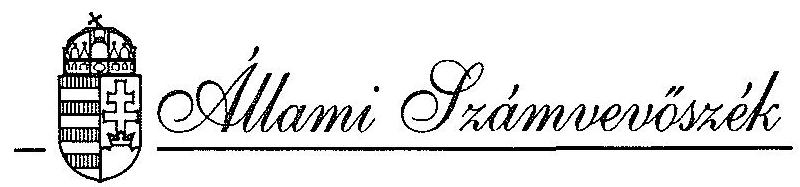
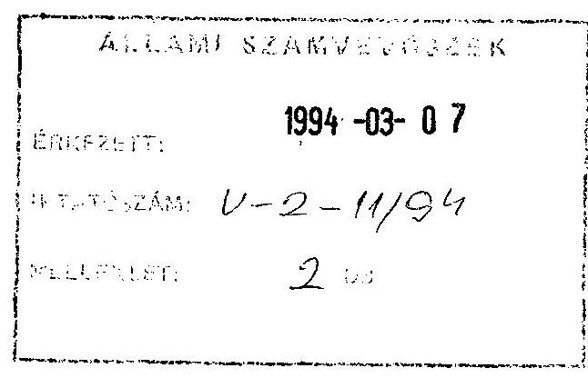
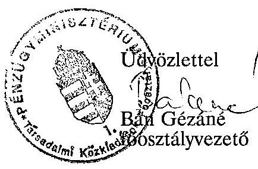

# VÉLEMÉNY 

a társadalombiztosítás pénzügyi alapjainak
1994. évi működési költségvetéséről

---

A vizsgálatot vezette:
dr. Csépán Magdolna
osztályvezető főtanácsos

A vizsgálatot végezték:

Balla Józsefné
Hajagos Józsefné
Hegyesné dr. Solymosi Mária
dr. Kurucz István
Molnár Istvánné
Szendrődi Józsefné
számvevő tanácsos
számvevő tanácsos
számvevő tanácsos
számvevő tanácsos
számvevő

---

# ÁLLAMI SZÁMVEVŐSZÉK   IV. VAGYONELLENŐRZÉSI IGAZGATÓSÁG   V-2-14/1994. 

## VÉLEMÉNY

a társadalombiztosítás pénzügyi alapjainak
1994. évi működési költségvetéséről

Az Állami Számvevőszék kötelezettsége, hogy véleményezze a társadalombiztosítási alapok költségvetési előirányzatait. Ennek megfelelően feladata, hogy véleményét csatolja az alapok 1994. évi működési kiadásairól készített előterjesztéshez is.

## A VÉLEMÉNY ELKÉSZÍTÉSÉNEK ELŐZMÉNYEI ÉS KÖRÜLMÉNYEI

A társadalombiztosítás pénzügyi alapjainak 1994. évi költségvetéséről szóló 1993. évi CXV. törvény az alapkezelők működési költségvetését csupán "keret-jelleggel" állapította meg. Eszerint a működési kiadások fedezetéül 1994-ben összességében 14.568 millió forint szolgál, amiből 7.551 millió forint a Nyugdíjbiztosítási Alap, 7.017 millió forint pedig az Egészségbiztosítási Alap hozzájárulása.

A költségvetési törvény 16. §-a ugyanakkor előírta, hogy az alapok részletes működési költségvetését törvény határozza meg, amelyet 60 napon belül kell az Országgyűlés elé terjeszteni.

---

Az alapok működési költségvetéséhez készített ÁSZ véleményt megalapozó vizsgálatokat a vonatkozó törvényjavaslat benyújtása előtt kellett elvégezni. E vizsgálatok elsősorban annak megállapítására irányultak, hogy az önkormányzatok részére benyújtott és elfogadott dokumentumok megalapozottsága milyen, s azok szabályszerűségi és tartalmi szempontból alkalmasak-e arra, hogy az Országgyűlés felelős döntést hozzon. Az ÁSZ arról igyekezett meggyőződni, hogy a korábban jóváhagyott keretösszeget milyen elvek alapján osztották meg a két biztosítási ág között és miként ítélhető meg a két működési költségvetés adattartalma, a tervezési munka megalapozottsága.

Az ÁSZ véleménye az előkészítés különböző munkafázisaiban nyert információkon, végső soron a biztosítási önkormányzatok által jóváhagyott és a Pénzügyminisztériumnak átadott dokumentumok ismeretén alapul.

Az ÁSZ munkáját nagymértékben nehezítette, hogy az alapok szétválása és önálló működésének megindulása a vélemény készítésének időszakára koncentrálódott. A kapott adatokban nagyfokú volt a bizonytalanság, egyes információk megszerzése vagy a szükséges kontroll számítások elvégzése nehézségekbe ütközött, még akkor is, ha a költségvetési tervezetek kimunkálói megfelelő együttműködési készséget, segítőkészséget tanúsítottak.

---

# MEGÁLLAPÍTÁSOK 

## 1./ A működési költségvetésről készített törvényjavaslat

A társadalombiztosítási alapok 1994. évi költségvetéséről szóló 1993. évi CXV. törvénynek az elkészítendő működési költségvetési törvényre vonatkozó egyes előírásai (16., 20. és 21. §-ok) alkalmazásával kapcsolatban az ÁSZ munkatársai a Pénzügyminisztérium illetékes főosztályának állásfoglalását kérték (1. sz. melléklet).

A Pénzügyminisztérium válasza (2. sz. melléklet) minden felvetett kérdésre nem ad egyértelmű eligazítást. Így továbbra sem világos, hogy (formailag és tartalmilag) mit jelent "az államháztartás információs rendszerének megfelelő struktúra", amely szerint a működési költségvetést össze kell állítani. Az államháztartási törvény életbelépésekor ennek még csupán a jövőbeni kialakításáról volt szó és a végrehajtására megjelent 139/1993. (X. 12.) Kormányrendelet sem fogalmaz konkrétan. A társadalombiztosítási alapok kezelőinek bármiféle adatszolgáltatása csak a PM és az önkormányzatok megállapodásán alapulhat. Ilyenről pedig az ÁSZ-nak nincs tudomása. Ezt a működési költségvetéstől függetlenül is gondnak érezzük.

Az elkészített törvényjavaslat szerint az Országgyűlés a társadalombiztosítási alapok működési költségvetését az 1993. évi CXV. törvény módosításával és számszaki mellékleteinek kiegészítésével hagyja jóvá. A két önkormányzatnál és

---

igazgatási szerveinél az állami költségvetés szerkezeti rendjének "mintájára" (fejezet, cím, alcím, előirányzatcsoport és kiemelt előirányzatok) határozták meg az adatokat. Ezáltal a költségvetés áttekinthetőbbé, kezelhetőbbé vált.

A javaslat 1. §-a az igazgatási szervezetek (Országos Nyugdíjbiztosítási Főigazgatóság és Országos Egészségbiztosítási Pénztár, továbbiakban ONYF és OEP) az egymás számára kölcsönösen megvalósítandó feladatokhoz történő hozzájárulás - erről részletesebben a 3. pont szól - összegét nettó módon határozza meg, úgy, hogy 1994-re vonatkozóan a nyugdíjbiztosítási ág (a február 14-én kötött megállapodás alapján) 2.121 millió forintot ad át az egészségbiztosítási ág részére.

Ezáltal a működési kiadásokra fordítható összeg:

- a Nyugdíjbiztosítási Önkormányzatnál és igazgatási szerveinél 5.430 millió forint,
- az Egészségbiztosítási Önkormányzatnál és igazgatási szerveinél 9.138 millió forint.

A törvényjavaslatban foglaltakkal kapcsolatosan két igen lényeges témát kell kiemelni.

A társadalombiztosítás pénzügyi alapjairól és azok 1993. évi költségvetéséről szóló 1992. évi LXXXIV. törvény egyszeri informatikai fejlesztésekre 1.279 millió forintot irányzott elő, azzal a megkötéssel, hogy az úgynevezett egyszeri fejlesztési célokhoz az Alapok "csak az év során ténylegesen megvalósult összeghez igazodó mértékben" járulhattak hozzá. Már a múlt év végén látható volt, hogy a jelzett fejlesztések előirányzata nem teljesül. Ez azonban a vonatkozó tiltó szabály miatt nem jelenthet tartalékolást, megtakarítást. Már csak azért sem, mivel a fel nem használt összeg nem is vált a működési költségvetés részévé.

A jelen törvényjavaslat 4. §-ában foglaltakkal az 1993-ban elmaradt nyugdíjmegállapítási programrendszer fejlesztési fedezetét (188 millió forintot) ez évre kívánják biztosítani. Az ÁSZ nem kívánja minősíteni az említett fejlesztési cél létjogosultságát. Úgy látja azonban, hogy a programrendszer fejlesztési fedezete az érvényes előírásokat betartva (az 1993. évi egységes működési költségvetés többletbevételéből, illetőleg pénzmaradványából) is biztosítható. Nincs szükség az alapok hiányának növelésére. Különösen zavaró, hogy egy 1994-re szóló törvény, a még hónapok múlva esedékes zárszámadási törvényre, mintegy "előre" hozzon szabályokat.

A javaslat 5. §-a a biztosítási önkormányzatok előirányzat-átcsoportosítási jogkörét érinti. Az átcsoportosítás lehetősége a törvényben egyébként jóváhagyott előirányzatok teljes körére terjedne ki. Az ÁSZ nem vállalkozik annak megítélésére, hogy a társadalombiztosítási önkormányzatok gazdálkodási önállósága - és maga az "önkormányzatiság" - e tekintetben milyen jogosítványokat indokol. Csupán arra kívánja felhívni a figyelmet, hogy az előirányzatok közötti szabad átjárhatóság a központi költségvetési gyakorlatban nem megengedett, a hatásköri korlátok pedig egyértelműen meghatározottak.

---

A központi költségvetést illetően a költségvetési törvényben meghatározott bevételeket és kiadásokat fejezetenként és címenként, ezen belül elkülönítetten a bér, a tb. járulék, a dologi kiadások, a célfeladat, a beruházási és felújítási előirányzatokat az Országgyűlés határozza meg. Fejezetek között átcsoportosításokat csak az OGY eszközölhet, sőt meghatározott címek, alcímek stb. tekintetében is fenntarthatja magának ezt a jogot. Fejezeten belül, címek közötti átcsoportosítást pedig a Kormány engedélyezhet (a társadalombiztosítással kapcsolatosan erre természetesen nem illetékes). Egyébként az előirányzatok csak a meghatározott célra használhatók fel, túl nem léphetők.

Ilyen kötöttségek mellett a biztosítási önkormányzatoknak (amelyek mint kvázi-fejezetek jelennek meg) a törvényjavaslatban megfogalmazott teljes döntési szabadsága az ÁSZ által megismert formában nehezen kezelhető. Elfogadása esetén a működési kiadások törvényben való szabályozása meglehetősen formálisnak látszik. Ilyen megközelítésben már az alapok ellátási kiadásokra jóváhagyott előirányzatai közötti szabad átcsoportosítás lehetősége is felvethető lehet.

Kétségtelen ugyanakkor, hogy a társadalombiztosítás esetében a központi költségvetéssel való összehasonlítás éppen úgy "erőltetett", mint a sokkal nagyobb önállósággal bíró települési önkormányzatokkal.

Mindezek visszavezethetőek ahhoz - az ÁSZ által már számos alkalommal felvetett - problémához, hogy a társadalombiztosítás működési, gazdálkodási rendje, irányítása, kapcsolatrendszere jogilag nem rendezett, nem szabályozott. Maga az államháztartási törvény is a társadalombiztosítást alrendszerként meghatározza, de részletszabályok nélkül.

---

2. / A társadalombiztosítás igazgatási szervezetének átalakítása

A társadalombiztosítás önkormányzati irányításáról szóló 1991. évi LXXXIV. törvény meghatározta az önkormányzatok igazgatási szerveit is, de nem rendelkezett arról, hogy létrehozásuk kinek a feladata. Emiatt az önkormányzatok megalakulásáig ennek érdekében nem történt intézkedés.

A 91/1993. (VI. 9.) Kormányrendelet formálisan ugyan létrehozta az ONYF-et és az OEP-t, valamint ezek igazgatási szerveit, de a tényleges átalakulás csak 1993. II. félévében kezdődött meg. Az említett kormányrendelet a két biztosítási ágnál jelentkező, úgynevezett közös feladatokat "mesterségesen" szétosztotta a két szervezet között.

Az ÁSZ a társadalombiztosítás 1992. évi zárszámadásához kapcsolódó jelentésében már jelezte, hogy ez a megoldás nem tekinthető véglegesnek, mert mindkét önkormányzat (de különösen a nyugdíjágazat) törekedni fog a saját különálló apparátus kialakítására. Az ÁSZ már akkor utalt arra, hogy ez az egyébként természetes igény viszont párhuzamosságot eredményezhet, s főleg a működési kiadások tetemes növekedését okozhatja. A tapasztalatok a korábbi feltételezést igazolták.

Az igazgatási szervek szétválasztása az OEP bázisán ment végbe, különösen megyei szinten. Az egészségbiztosítás központi és megyei szervei mintegy, a volt OTF jogutódjaként tevékenykedtek. A szétválás folyamatát bizonyos értelemben az ONYF "kiválásaként" kezelték. Ez esetenként feszültségek forrásává is vált (a dologi eszközök, az infrastruktúra megosztása, az elhelyezés során), ami kihatott az 1994. évi működési keretösszeg megosztására is.

---

Meg kell említeni, hogy jelenleg még sem az ONYF, sem az OEP nem rendelkezik jóváhagyott Szervezeti és Működési Szabályzattal, ami a kapcsolódó belső szabályzatok létét is megkérdőjelezi.

Mindezek is erősítették a Nyugdíjbiztosítási Önkormányzat és az ONYF főigazgatójának álláspontját, mely az ágazat gazdálkodási önállóságát csak a szinte teljes szervezeti elkülönülés mellett látta biztosítottnak. Távlatilag is az egyik szervezet által ellátandó közös feladatként csak a járulék- és folyószámla szakterület, illetve az úgynevezett szakellenőrzés maradt meg (előbbi az OEP-nél, utóbbi az ONYF-nél).

Ezek a feladatok egyébként szorosan összefüggőek, egyáltalán nem biztos, hogy a szervezeti elkülönülés a jobb feladatelátást eredményezi. E téren még az együttműködés rendje sem alakult ki.

A pénzügyi és számviteli feladatok közös ellátásának lehetőségét valójában egyik ágazat sem kezelte alternatívaként. Az az álláspont nem vitatható, hogy a tényleges önállóság elemi követelménye a nyugdíjbiztosítás központi pénzügyi-számviteli rendszerének kiépítése. Tény azonban, hogy az önállóság előnyeivel szemben a feladatok megkettőződésével együttjáró többletkiadásokat nem mérlegelték. Ez elsőként a létszám további növelésének igényeként jelentkezett és a működési költségvetés egészére való távlati hatás ma még nem is számszerűsíthető.

Az önálló költségvetési szervként gazdálkodó megyei nyugdíjbiztosítási igazgatóságok kialakítása mintegy 300-350 fő többletlétszámot igényelt.

---

Lényeges átalakulás ment (megy) végbe az Országos Egészségbiztosítási Pénztárnál is. Új szervezeti egységeket (főosztályokat) hoztak létre. A Fejlesztési Iroda - mint önálló gazdálkodási egység, megszűnt, az informatikai osztályok az egyes szakterületekhez kerültek. A távlati fejlesztésekkel a Világbanki Programiroda foglalkozik.

A megyei egészségbiztosítási pénztárak szervezeti átalakítása egységes modell szerint történik, távlatilag a normatív finanszírozás feltételeit kívánják megvalósítani. A szétválással egyidejűleg az OEP-nél is jelentkezik létszámnövekedés. Egyes szakterületeken valóban érzékelhetők feszültségek, amit meg kell oldani. Az egész szervezet tevékenységét áttekintő, racionalizálási törekvéseket tartalmazó programmal jelenleg azonban az OEP sem rendelkezik.
3. / A feladatmegosztás és szervezeti szétválás kifejeződése az 1994. évi működési költségvetés megosztásában

Az 1993. évi CXV. törvényben működési célra meghatározott 7.017 és 7.551 millió forintos összeg az Egészségbiztosítási és a Nyugdíjbiztosítási Alap bevételi főösszegeinek arányát tükrözte. Ez értelemszerűen korrekcióra szorult a feladatelátásra, a szervezetépítésre vonatkozó döntések, továbbá a másik ágazat számára végzett szolgáltatások működési költségvonzata egymásnak való megtérítése miatt. A korrekció végeredményben a nyugdíjágazatból 2.121 millió forint átcsoportosítását jelenti az egészségbiztosításhoz. Ennek kölcsönös elfogadása hosszú egyeztetési folyamat után, komoly kompromisszumok mellett történt meg. A számítások alapja minden változatban a létszám volt - beleértve a tervezett fejlesztéseket is. A létszám meghatározásánál pedig (mint azt az előzőekben már említettük) a minél nagyobb önállóságra való törekvés az egyéb szempontokat háttérbe szorította.

---

Az egymás számára végzett feladatok finanszírozásában végül is úgy állapodtak meg, hogy a működés pénzügyi feltételeit a feladatelátás helye szerint kell
 biztosítani.

A költségmegosztás pontos számításaira (hogyan jött ki a 2.121 millió forint) vonatkozó adatokat az ÁSZ nem kapott, így azok megbízhatóságáról sem győződhetett meg. Az egymás számára kölcsönösen tett engedmények ugyanakkor valószínűsítik, hogy az alapelőirányzatok és a fejlesztési források mellett főleg a tartalékok megosztása volt nehéz. (A járulékbevételi többletből, az önkormányzatok megalakulását követően az OGY által felszabadított keretösszegből, a saját tevékenység bevételéből eredő tartalékok meglétére a két szervezet közötti megállapodás egyértelműen utal!) A tervezési dokumentumokból ezek nagyságrendjére nem lehet következtetni és a vizsgálat idején az 1993. évi költségvetési beszámoló még nem készült el. Kétségtelen, hogy mindezek miatt a működési költségvetésről kötött megállapodás csak 1994-re lehet érvényes.

# 4. / A működési költségvetés egyes előirányzatai 

A működési költségvetés törvényben megjelenő részének és a háttérinformációk szerkezetét és tartalmát a Pénzügyminisztérium határozta meg. Az ONYF és az OEP által összeállított és az önkormányzati jóváhagyásokhoz felhasznált táblázatok adattartalma azonban ennek ellenére sem volt egységes, összehasonlítható, illetve esetenként ellentmondó számokat tartalmazott. A Pénzügyminisztérium által közös dokumentumba foglalt tervezet volt hivatva arra - kiegészítő információk bekérése után - hogy ezeket az ellentmondásokat kiküszöbölje.

---

Az ÁSZ helyszíni vizsgálata a költségvetési tervezetek főbb előirányzataira (3. és 4. sz. mellékletek) terjedt ki. Az ellenőrzés kiemelt figyelmet fordított a béralap előirányzatra, s ezzel összefüggésben (is) az igazgatási apparátus létszám alakulására. A Nyugdíjbiztosítási Alap 5430 millió forintos működési előirányzatából a béralap 1567, a kapcsolódó járulék pedig 736 millió forint, ami összességében az előirányzat 42,4 %-át teszi ki. A teljes ágazat 4109 fős tervezett átlaglétszámát alapul véve a nyugdíjbiztosítás területén dolgozók egy főre jutó béralapja 32 ezer forint, a központi apparátusban pedig 46 ezer forint körül alakul.

Az egészségbiztosításnál országos szinten 3411 millió forint béralappal és 6727 fő létszámmal az egy főre jutó béralap 42 ezer forint, az OEP központban - az egyéb foglalkoztatottaknak fizetendő összeg nélkül - 66 ezer forint. A lényegesen kedvezőbb bérpozíciót a dolgozók eltérő szakmai összetétele csak részben indokolhatja.

Az átlagos alapilletmény lényegesen alacsonyabb az egy főre jutó béralapnál.

Az egészségbiztosítási béralap 281,7 millió forintot tartalmaz "egyéb foglalkoztatottaknak" fizetendő megbízási díj, jutalom és egyéb jogcímen. Ezen összeg pontos rendeltetésére az OEP nem adott egyértelmű magyarázatot.

Mint látható a két ágazat tervezett átlagos létszáma együttesen (5. sz. melléklet) már 10836 főre emelkedik, ami 2838 fővel (35,5 %-kal) több mint 1992-ben volt. A központi apparátus létszáma 511 főről 820 főre nő (amiből 239 fő az

---

ONYF-nél és 581 fő az OEP-nél jelentkezik). Elfogadva, hogy a létszámfejlesztéseket elsősorban az ONYF és az OEP különválásával járó - részben objektívnak tekinthető - következmények okozták, meg kell jegyezni, hogy a feladatokra alapozó létszámtervezés és fejlesztés háttérben maradt.

A társadalombiztosítás igazgatási apparátusának éves tervezett létszámát 1989 óta gyakorlatilag nem hagyta jóvá "felügyeleti szerv". A költségvetésben meghatározott béralap függvényében maga az OTF határozta meg a foglalkoztatni kívánt létszámot. Mivel a működési költségvetés pénzügyi keretei nem szabtak gátat a feladatellátás szempontjából kifejezetten extenzív fejlesztésnek, a létszámnövekedés folyamata évek óta tart (az önállósulás óta csaknem megkétszereződött). Ma már az önkormányzatok vizsgálhatják az igazgatási szervek létszámgazdálkodását is.
A tapasztalatok alapján az ÁSZ - az önkormányzatok önállóságát messzemenően tiszteletben tartva - egy ilyen áttekintést megfontolandónak tart.

Ez annál inkább is indokolt, mert 1995-től el kell érni a köztisztviselői törvényben előírt illetményeket, amihez képest információink szerint az egyes ügyintézői kategóriákban még jelentős az elmaradás. A vezető beosztású dolgozók esetében ugyanakkor már 1993. óta a köztisztviselői törvényben előírt illetményeket alkalmazzák. Ez abból a szempontból jelent gondot, hogy olyan munkatársak töltenek be vezető beosztást, akiket a törvény csak középiskolai végzettségűeknek ismer el. Az érintettek nagy aránya (60-65 %) miatt a vezetői megbízatásokat nem módosították. E tényre az ÁSZ 1992. évi zárszámadási jelentése is felhívta a figyelmet.

---

A folyó működéshez kapcsolódó dologi kiadások előirányzata a nyugdíjbiztosítási ágnál 1669 millió forint, az egészségbiztosításnál pedig 2306 millió forint. Meghatározásuk egyfelől a létszám arányában, másfelől a "maradványelv" alapján történt.

Nem lehet megítélni, hogy az előirányzatok szükségesek-e, illetve biztosítják-e ágazatonként a folyamatos működést. A működési költségvetés megosztásáról kötött megállapodás rögzíti, hogy az alapfeladatok ellátására fordítható összegeket komplex módon felülvizsgálják. A szervezeti önállósulással, illetőleg a nagy létszámemelkedéssel összefüggően nem tekinthető megoldottnak az apparátus elhelyezése sem. Az OEP központjában dolgozókat a nemrég átadott új irodaházban sem lehetett elhelyezni, a régi Váci úti székházban nem fér el a NYUFIG apparátusa, így a korábbi bérlemények egy részét fenn kell tartani. Hasonló a helyzet a budapesti és a megyei igazgatóságokon is. Az önkormányzatok az ingyenes vagyonjuttatás keretében szeretnének irodaépülethez jutni. A társadalombiztosítás törvényben előírt 300 milliárd forintos ingyenes vagyonjuttatása gyakorlatilag zátonyra futott, így az sem valószínű, hogy irodaépületeket kapnak. Ez egyébként a vagyonjuttatás eredeti szándékával sincs összhangban.

Külön tételként szerepelnek az úgynevezett központosított előirányzatok és a célfeladatok, amelyek az önálló ágazati működés tárgyi feltételeinek megteremtését, az önálló igazgatási szervek elhelyezését, a világbanki projekt megvalósításával kapcsolatos feladatok ellátását, az ezzel összefüggő informatikai fejlesztéseket tartalmazzák mindkét biztosítási

---

ágban. Eszközberuházásra összesen 102 millió forintot irányoztak elő 50-50 %-os megosztás mellett, ami a legtöbb esetben nem fejlesztést jelent, hanem a szétválással függ össze. Az épületberuházások nagyobb részben a megyei szervek megnövekedett elhelyezési igényeit szolgálják (amiben az ingyenes vagyonjuttatásra is számítanak). A tervezett összeg együttesen 1313 millió forint, amiből 500 millió forint a korábbi évekről keletkezett kötelezettség.

A világbanki hitelből megvalósuló fejlesztések saját kiadásaira együttesen 250 millió forint szolgál, ami a projekt működési kiadásain túlmenően különféle adók, illetékek, vámok fedezetét hivatott biztosítani. Mivel ezt az összeget az ágazatonként elkészítendő stratégiai rendszerterv hiányában (ami a kölcsön feltétele) határozták meg, a tartalmi megalapozottság megkérdőjelezhető.

Az informatikai fejlesztések keretében az egészségbiztosítási ágazat hardver beszerzését és telepítését, telekommunikációs fejlesztéseket, a meglévő rendszerek karbantartását tervezi. A nyugdíjbiztosítás legjelentősebb fejlesztése a nyugdíj megállapítási rendszer decentralizálását célzó IBM AS/400 gépcsalád országos telepítése és üzembehelyezése. Az informatikai fejlesztéseknél gondnak tartjuk, hogy annak a világbanki projekttel nincs igazán kapcsolata, az összehangolt fejlesztés előnyeit nem igyekeztek jobban kihasználni.
5. / A társadalombiztosítási önkormányzatok saját működési költségvetése

Az 1993. évi CXV. törvény az Alapok működési költségvetésének részletezését az alap kezelőre és az igazgatási szervekre bontva írja elő. Mindkét biztosítási önkormányzat külön alcímen tünteti fel a saját működési kiadásait. Arra, hogy

---

ebbe mi tartozik egyértelműen bele, nincs jogszabályi előírás, ezt végül is maguk az önkormányzatok döntötték el. Abban egységes volt az álláspont, hogy az önkormányzatok működését kiszolgáló titkárságok bérkiadásai és járulékterhei a megfelelő központi szervezetnél jelenjenek meg, de a dologi kiadásokat már nem azonos módon vették számításba. Így az önkormányzatok költségvetései eltérő tartalmúak.

Az Egészségbiztosítási Önkormányzat 94,8 millió forintos költségvetése csak az alapszabályban rögzített "személyhez kötődő" dologi kiadásokat tartalmazza. A 74,9 millió forintos dologi előirányzatból 55,5 millió forint bérjellegű kiadás (tisztelet-, megbízási, szakértői díj stb.).

A Nyugdíjbiztosítási Önkormányzat költségvetése 71 millió forint, ami a testület és a titkárság valamennyi dologi kiadását tartalmazza.

Mindkét előirányzat több mint az 1993. évi szintre hozott bázis összege, amit tovább növel a múlt évben működésre jóváhagyott 60-60 millió forint pénzmaradványa is (kb. 20-20 millió forint). A költségvetés megalapozottsága azonban igazán majd csak az 1994. évi tényadatok alapján ítélhető meg (például, hogy a megbízási, szakértői díjak, honoráriumok mögött milyen teljesítmény áll, hogyan segítették elő a szakszerű döntéselőkészítést stb.)

---

# ÖSSZEFOGLALÁS ÉS AJÁNLÁS 

Az ÁSZ véleményének kialakítása során abból indult ki, hogy a működési költségvetés hagyományos bázisalapú tervezéssel kialakított, közel 14,6 milliárd forintos keretösszegét az Országgyűlés már jóváhagyta. Így alapvetően már behatárolta a társadalombiztosítási alapok kezelőinek (és igazgatási szerveinek) 1994. évi pénzügyi mozgásterét.

A társadalombiztosítás 1994. évi költségvetéséhez 14304. számon benyújtott számvevőszéki vélemény a működési költségvetés tervezését részletes adatok, megalapozó számítások hiányában nem értékelhette. Korábbi tapasztalatai alapján azonban úgy ítélte meg, hogy - az indulásnál - az önkormányzatok létrejöttével együttjáró szervezeti változások lebonyolításához a szükséges források biztosítottnak látszanak.

Összességében a működési költségvetés törvényben történő szabályozásának előírása pozitívan ítélhető meg. Főként azért, mert felgyorsította a szervezeti átalakulást, mintegy "kikényszerítette" a pénzeszközök megosztását, ami egyébként akár egész évben is elhúzódhatott volna. Nem megnyugtató ugyanakkor, hogy a folyó költségvetés megosztása nem járt együtt a működési vagyon megosztásával, amit a két főigazgató által kötött megállapodás alapján az év végéig kialakuló létszámarányok figyelembevételével kívánnak elvégezni. A létszámhelyzet nehezen áttekinthető és későbbi viták forrásává válhat.

---

A társadalombiztosítás igazgatási szerveinek szétválása jelentős létszámbővítéssel, egyes tevékenységek megkettőzödésével megy végbe, esetenként a feladatellátás szükségleteinek sokoldalú tisztázását mellőzve. A nehézségek és az adott körülmények szorítását elismerve mellett is meg kell jegyeznünk, hogy bármilyen szervezési elv alkalmazásával ennek ellenkezőjét kellett volna megvalósítani, azaz először a feladatokat teljeskörűen és részleteiben is meghatározva, majd ahhoz rendelni a szervezeti egységeket és a szükséges létszámot. Így például nem javultak a társadalombiztosítási ellenőrzés - mindkét ágazatot érintő szervezeti és személyi feltételei, az egészségügyfinanszírozás rendszerének változásával, a járulék és folyószámla szakterülettel összefüggő többletfeladatok ellátásának adottságai.

Bár a szervezeti elkülönüléssel és az önállóság megteremtésével járó kiadások egy része "egyszeri", ugyanakkor azonban később "működési vonzattal" jár és éppen ezért nem zárható ki a működési kiadások 1995-ben folytatódó jelentős emelkedése sem. A megnövelt létszámhoz tartozó bérkiadások és a járulékok esetében (a köztisztviselői törvény előírásaira is figyelemmel) szintén további növekedésre kell számítani. A működési költségvetés 1994-re elfogadott megosztása alkufolyamat eredménye. Számításokkal kellően alá nem támasztott. Lényegében csak a jelenlegi állapotnak felel meg.

Az Állami Számvevőszék ennek megfelelően, amikor a törvényjavaslatról véleményt mond, ajánlja az Országgyűlésnek, hogy:

- a költségvetési gyakorlat alapján, a társadalombiztosítási önkormányzatok önállóságát is mérlegelve döntsön a működési költségvetés törvényben jóváhagyott előirányzatai közötti részleges (pl. címek közötti) vagy teljes átcsoportosítási jogkörről;

---

- a társadalombiztosítás 1993. évi működési költségvetésében egyszeri fejlesztésekre jóváhagyott keretösszeg felhasználási szabályainak utólagos módosítását - az 1992. évi LXXXIV. törvény szándéka alapján - fontolja meg;
- kérje fel a társadalombiztosítási önkormányzatok testületeit és az igazgatási szervek vezetését arra, hogy mielőbb tekintsék át az apparátus feladatkörét, a feladatellátás tárgyi, technikai, pénzügyi és személyi feltételeit, vizsgálják meg a létszám- és bérgazdálkodás helyzetét.

Budapest, 1994. március 17.

Mellékletek: 8 lap

---

1. sz. melléklet
a V-2-14/1994. sz. véleményhez

---

Budapest, 1994. február 4. $\mathrm{V}-2-1 / 1994$

BÁNGÉZÁNÉ asszony
főosztályvezető
Pénzügyminisztérium
Társadalmi Közköltségvetési Főosztálya

# BUDAPEST 

Tisztelt Főosztályvezető Asszony!

A társadalombiztosítás pénzügyi alapjainak 1994. évi költségvetéséről szóló 1993. évi CXV. törvény 16. §-a előírja, hogy a biztosítási alapok működési költségvetését törvény határozza meg. Az erről készített
 törvényjavaslatot az alapok költségvetési törvényének elfogadását követő 60 napon belül kell az Országgyűlés elé terjeszteni. A törvényjavaslat véleményezése az államháztartási törvény értelmében az Állami Számvevőszék kötelezettsége.

A feladatra történő felkészülés során több olyan jogértelmezési probléma merült fel, amelynek tisztázásában úgy érezzük, nem nélkülözhető a Pénzügyminisztérium véleménye, állásfoglalása.

Gondjaink elsősorban a már említett 1994. évre vonatkozó társadalombiztosítási költségvetési törvény egyes előírásainak helyes értelmezésével függnek össze.

---

1. A törvény (16. §. 2. bekezdése) értelmében az Alapok működési költségvetésének részletezését az államháztartás információs rendszerének megfelelő struktúrában, az Alap kezelőjére és igazgatási szerveire elkülönített bontásban kell meghatározni.
Ezzel kapcsolatban több kérdés is felvetődik. Így:

- A társadalombiztosítás működési költségvetése esetében konkrétan mit kell érteni „az államháztartás információs rendszerének megfelelő struktúrán?” Az államháztartási törvény megjelenésekor ennek még csak a jövőbeni kialakításáról volt szó. Ezt a 139/1993. X. 12. Kormányrendeletből sem tudjuk kikövetkeztetni.
- Az „Alap kezelője” alatt pontosan mely szervet (szerveket) kell érteni? A különböző jogszabályi előírásokból számunkra az következik, hogy az alapokat a két biztosítási önkormányzat kezeli. Ennek megfelelően kérdéses, hogy a működési költségvetésben, hogyan kell az önkormányzatra vonatkozó adatokat elkülönítetten megjeleníteni? Az önkormányzatokra is a költségvetési gazdálkodás szabályai érvényesek, de nem tekinthetők önállóan gazdálkodó költségvetési szervnek (ennek nem is lenne létjogosultsága). Eközben viszont irányítják - felügyelik - a 91/1993. Kormányrendelet szerint központi, közigazgatási, önállóan gazdálkodó központi költségvetési szervnek minősülő igazgatási szerveiket, az Országos Nyugdíjbiztosítási Főigazgatóságot és az Országos Egészségbiztosítási Pénztárt.

2. A költségvetési törvény 20. §-a úgy rendelkezik, hogy a működési kiadásokról elkészítendő költségvetést a törvény elfogadását követő 60 napon belül kell az Országgyűlés elé terjeszteni. Mint ismeretes a törvényt 1993. december 22-én fogadták el, de az csak a Magyar Közlöny december 31-i számában, januárban jelent meg, vált nyilvánossá. Hogyan kell tehát a 60 napos időkeretet érteni?

---

Ugyanitt nem világos az az előírás, mely szerint a működési költségvetést az Alapok vagyonkimutatásával együtt kell az Országgyűlésnek benyújtani. Mi a vagyonkimutatás tartalma, annak részét képezi-e a működési költségvetéshez egyébként logikusan kapcsolódó működési vagyon? Amennyiben igen, elvárható-e, illetve megkövetelhető-e ebben az időszakban a működési vagyon két biztosítási ág közötti megosztása. Ennek az 1993. évi költségvetési beszámoló elkészítése szempontjából is komoly jelentősége van. Idekapcsolódó kérdés, hogy az államháztartási törvény 116. §-ában is említett vagyonkimutatásnak leltáron (vagyonleltáron) kell-e alapulnia?
3. Szintén a 20. §. mondja ki, hogy az igazgatási szervek a „működési törvény” benyújtásáig nem hajthatnak végre 1994-ben bérfejlesztést, nem kerülhet sor jutalom kifizetésére és a folyamatos működéssel összefüggő dologi kiadások nem haladhatják meg a hasonló 1993. évi kiadások 1/12-ed részét. Ez azt jelenti-e, hogy a benyújtás után - függetlenül a törvény elfogadásának időpontjától - ezek a kötöttségek automatikusan feloldódnak?

Munkánkban, különösen a törvény előkészítésére és a véleményezésre fordítható rövid időre tekintettel, nagy segítséget jelentene, ha az előzőekben feltett kérdéseinkre mielőbb választ kapnánk. Kérem szíves tájékoztatását, esetleges konzultációs igényük esetén munkatársam dr. Csépán Magdolna osztályvezető főtanácsos úrhölgy szívesen áll rendelkezésükre.

Segítségét előre is köszönöm.

---

2. sz. melléklet
a V-2-14/1994. sz. véleményhez

---

# 2. sz. melléklet 

PÉNZÜGYMINISZTÉRIUM
$33.112 / 94$.

Állami Számvevőszék
Dr. Kovács Árpád úrnak
számvevő-igazgató

Budapest

Tisztelt Igazgató Úr!

A társadalombiztosítás pénzügyi alapjainak 1994. évi működési költségvetése törvényjavaslatával kapcsolatos átiratára, az abban feltett kérdésekre munkatársaival folytatott megbeszélést is figyelembe véve - az alábbiakban válaszolok:

1. A társadalombiztosítás pénzügyi alapjainak 1994. évi költségvetéséről szóló 1993. évi CXV. tv. 16.§ (2) bekezdése értelmében az Alapok működési költségvetésének részletezését az államháztartás információs rendszerének megfelelő struktúrában, az Alap kezelőjére és igazgatási szerveire elkülönített bontásban kell meghatározni.

- Az államháztartás információs rendszeréről az államháztartásról szóló 1992. évi XXXVIII. törvény XI. fejezete rendelkezik, végrehajtási szabályait a 139/1993. (X.12.) Korm. rendelet II. fejezete tartalmazza.
- A társadalombiztosítás önkormányzati igazgatásáról szóló 1991. évi LXXXIV. tv. szerint a társadalombiztosítás irányítását a biztosítási önkormányzatok és szerveik látják el. A biztosítási önkormányzat igazgatási feladatait és a biztosítási ágba tartozó hatósági ügyintézést a közgyűlés irányítása alatt álló hivatali szervezet végzi. Az önkormányzat a közgyűlésen keresztül gondoskodik a biztosítási alap kezeléséről.

2. Az 1993. CXV. tv. 20.§-a úgy rendelkezik, hogy a működési kiadásokról elkészítendő költségvetést a törvény elfogadását követő 60 napon belül kell az Országgyűlés elé terjeszteni. A törvényt XII. 22-én fogadták el és a Magyar Közlöny XII. 31.-i számában jelent meg.

A hivatkozott törvény 20. §-a előírja, hogy a működési költségvetést az Alapok vagyonkimutatásával együtt kell az Országgyűlésnek benyújtani. Az AHT 116.§-a alapján ennek vagyonleltáron kell alapulnia.

Információink szerint a vagyonleltár elkészült, a vagyonkimutatás II. 28-ig, a két alap közötti un. ágazati megosztás pedig III. 10-ig készül el. Ezért a működési költségvetés mellékletét képező vagyonkimutatás várhatóan azonos lesz a már 1993. december 3-án háttérinformációként a Parlament Szociális-Egészségügyi és Családvédelmi Bizottságához benyújtottal.

---

3. Szintén a 20. § mondja ki, hogy az igazgatási szervek a „működési törvény” benyújtásáig nem hajthatnak végre 1994-ben bérfejlesztést, nem kerülhet sor jutalom kifizetésére és a folyamatos működéssel összefüggő dologi kiadások sem haladhatják meg a hasonló 1993. évi kiadások 1/12-ed részét.

Véleményünk szerint a „benyújtás” időpontja a mérvadó az időpont eldöntésére, elfogadást nem kíván meg e rendelkezés.
4. Az Ön munkatársaival folytatott megbeszélés során egyetértettünk abban a kérdésben, hogy az Alapok működési költségvetését a költségvetési szervekre előírt törvényi kötelezettségek figyelembevételével, annak megfelelő szerkezeti és tartalmi előírások betartásával kell elkészíteni. Háttéranyagként pedig minden olyan tájékoztató jellegű melléklet csatolása célszerű, melyek információ tartalma mind a Bizottság, mind a Parlament döntését elősegíti. Ennek megfelelő tartalmú levelet küldtünk mindkét önkormányzat vezetőjének, amelyet másolatban csatoltan az Ön számára is megküldünk.

Budapest, 1994. február 18.

Melléklet

---

3. sz. melléklet
a V-2-14/1994. sz. véleményhez

---

A Nyugdíjbiztosítási Alap 1994. évi működési költségvetése

|  költségvetési  | Előirányzat |  |  |  |  | összesen  |
|---|---|---|---|---|---|---|
|  alcimek | béralap | tb. jár. | dologi kiad. | felújítások | beruházások |   |
|  önkormányzat | 7 | 11 | 53 | - | - | 71  |
|  Országos Nyugdíjbiztosítási Főigazgatóság | 133 | 59 | 332 | - | - | 524  |
|  megyei igazgatóságok | 926 | 432 | 693 | - | - | 2051  |
|  Nyugdíjfolyósítási Ig. | 464 | 218 | 458 | - | - | 1140  |
|  központosított előirányzatok | 37 | 16 | 133 | 232 | 1226 | 1644  |
|  összesen: | 1567 | 736 | 1669 | 232 | 1226 | 5430  |

---

4. sz. melléklet
a V-2-14/1994. sz. véleményhez

---

Az Egészségbiztosítási Alap 1994. évi működési költségvetése

|  költségvetési  | Előirányzat |  |  |  |  | összesen  |
|---|---|---|---|---|---|---|
|  alcimek | béralap | tb. jár. | dologi kiad. | felújítások | beruházások |   |
|  önkormányzat | 8 | 12 | 75 | - | - | 95  |
|  Országos Egészségbiztosítási Pénztár | 609 | 300 | 702 | - | - | 1611  |
|  megyei pénztárak | 2322 | 1187 | 1198 | - | 51 | 4758  |
|  Országos Orvosszakértői |  |  |  |  |  |   |
|  Intézet | 330 | 168 | 72 | - | - | 570  |
|  központosított intézet |  |  |  |  |  |   |
|  előirányzatok | 100 | 51 | 149 | 216 | 913 | 2104  |
|  egészségbiztosítási |  |  |  |  |  |   |
|  célfeladatok | 42 | 21 | 110 | - | 502 | 675  |
|  összesen: | 3411 | 1739 | 2306 | 216 | 1466 | 9138  |

---

5. sz. melléklet
a V-2-14/1994. sz. véleményhez

---

5. sz. melléklet

A társadalombiztosítás igazgatási apparátusának létszámhelyzete

|  Megnevezés | 1992. évi átlag létszám (még OTF) | 1993. állapot | 1994. szerint | 1995. | 1996. | 1997. | 1998. | 1999.  |
|---|---|---|---|---|---|---|---|---|
|  Egészségbiztosítás |  |  |  |  |  |  |  |   |
|  összesen: |  |  | 5812* |  | 6190 |  |  | 6727  |
|  ebből: OEP kp. ír. |  |  | 504 |  | 521 |  |  | 581  |
|  Nyugdíjbiztosítás |  |  |  |  |  |  |  |   |
|  összesen: |  |  | 3572 |  | 4039 |  |  | 4109  |
|  ebből: ONYF kp. ír. |  |  | 154 |  | 189 |  |  | 239  |
|  együtt: | 7998 |  | 9384 |  | 10229 |  |  | 10836  |
|  ebből: központi ír. | 511 |  | 658 |  | 710 |  |  | 820  |
|   |  |  |  |  |  |  |  | + 309  |

- Megjegyzés: Az OEP 1993. évi létszámadata nem megbízható, más adatközlés szerint a létszám 5619, illetve 6129 fő volt.

1994. március
