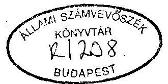
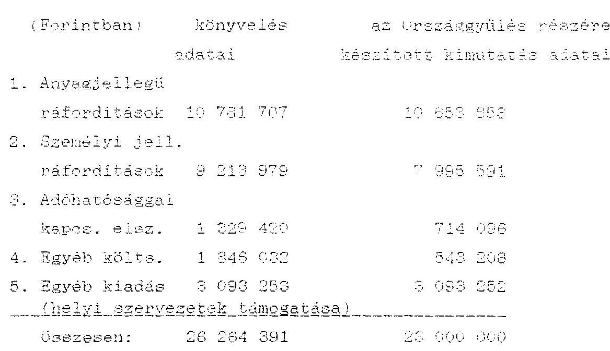

# JELENTÉS 

a Magyarországi Horvátok Szövetsége
1993. évi állami költségvetési támogatás felhasználásának ellenőrzéséről

---

A vizsgálatot vezette:

Dr. Elek János
osztályvezető főtanácsos

A vizsgálatot végezte:

| dr. Szávai Tamás | számvevő tanácsos |
| :-- | :-- |
| Écsy Lajosné | számvevő |
| Tóth István | számvevő tanácsos |

---

# ÁLLAMI SZÁMVEVŐSZÉK 

$\mathrm{V}-1004-12 / 1994$.
Témaszám: 209.

## JELENTÉS

## a Magyarországi Horvátok Szövetsége   1993. évi állami költségvetési támogatás felhasználásának ellenőrzéséről

I.

Az ellenőrzés körülményei, célja és módszere

Az Állami Számvevőszékről szóló, többször módosított 1909. évi XXXVIII. törvény 2. § (5) bekezdése értelmében az Állami Számvevőszék (továbbiakban: ASZ) ellenőrzi az állami költségvetési támogatás felhasználását a társadalmi szervezeteknél. Az Országgyűlés a 28/1993. (IV. 9.) OGY határozatában döntött a nemzeti etnikai kisebbségi szervezetek 1993. évi támogatásáról, meghatározva, hogy a támogatás a szervezeti és működési költségek fedezésére szolgál. E jogszabályok figyelembevételével az ASZ 1994. évi ellenőrzési terve alapján került sor az ellenőrzés lefolytatására.

A Magyarországi Horvátok Szövetsége 1993-ban gyakorlatilag képviselte a Magyarországon élő horvátság egészét. Az ASZ a horvát szervezetek részére 1993. évben jóváhagyott állami költségvetési

---

támogatás felhasználását a Magyarországi Horvátok Szövetségénél (továbbiakban: Szövetség) ellenőrizte.

Az ellenőrzés célja annak értékelése volt, hogy a Szövetség a kapott állami költségvetési támogatást - az Országgyűlés határozatában foglaltakra is figyelemmel - az alapszabályban megfogalmazott tevékenységi célnak megfelelően használta-e fel, ezt a célt a legkisebb eszköz-, illetve pénzfelhasználással valósította-e meg, illetve a gazdálkodásra, nyilvántartásra és beszámolásra vonatkozó jogszabályokat hogyan tartotta be.

A vizsgálat a főkönyvi könyvelés még teljesen le nem zárt 1993. évre vonatkozó adataira terjedt ki. Az ASZ a pénzfelhasználást a Szövetség Titkárságán található dokumentumok alapján vizsgálta. A helyszíni ellenőrzés 1994. január 17-től ... 11-18-ig tartott.

# II. 

Az 1993. évi pénzfelhasználás ellenőrzési tapasztalatai

1. Az állami költségvetési támogatás felhasználásának ellenőrzése
1.1. A Szövetség 1993. évben az Országgyűlés részéről 23 millió Ft állami költségvetési támogatásban részesült. A Szövetség a célja szerinti tevékenység körében látja el a Horvát glasnik hetilap megjelentetésével kapcsolatos feladatokat is. A Szövetség az általa működtetett, jogi személyiség nélküli lapkiadó intézmény eszközeit és forrásait, bevételeit és ráfordításait számviteli nyilvántartásaiban elkülönítetten mutatja ki. Az ellenőrzés a lapkiadó bevételeit és ezek felhasználását nem vizsgálta, mivel ezek függetlenek a Szövetségnek nyújtott állami költségvetési támogatástól.

A Szövetség elnöksége a költségvetési támogatás ismeretében készítette el az 1993. évi költségvetését, amelyet az Országos Választmány 1993. június 19-i ülésén fogadott el. Ennek során - 1100 ezer Ft saját bevétel figyelembevételével - 24100 ezer Ft bevételt és 23085 ezer Ft kiadást terveztek.

A költségvetésben a bevételeket és a kiadásokat a főkönyvi könyveléssel részben azonos jogcímeken részletezték. A tervezett kiadások között költségnemenként nem tüntették fel a régiók részére tervezett támogatások 7 millió Ft összegét.

A Szövetség az Országgyűlés Emberi jogi, kisebbségi és vallásügyi bizottsága részére elkészítette az 1993. évi költségvetési támogatás jogcímenkénti felhasználásának elszámolását. Az ellenőrzés ennek alapján, a könyvelési adatok egybevetésével vizsgálta a Szövetség 1993. évi pénzfelhasználását. A költségvetés szerinti tervszámokkal való összehasonlításra azonban - a korábban említett - szerkezeti eltérések miatt nem volt lehetőség.
1.2. A Szövetség 1993. évi tényleges bevétele 26343539 Ft volt, 3343539 Ft-tal magasabb a tervezetnél. A 3343539 Ft összegű többletbevétel forrása főleg az egyéb bevételek között nem tervezett céltámogatásból, gépkocsi kártérítésből és értékesítésből származó bevételek összege.

---

Az összes bevételből az állami költségvetési támogatás mértéke $23000000 \mathrm{Ft}(87.5 \%)$, az egyéb bevételeké pedig 3343539 Ft ( $12.7 \%$ ) volt.

Az egyéb bevételeket az alábbi jogcímeken képezték:

- állami feladatellátás
címén kapott céltámogatás
1428000 Ft
- bérleti díjak
752580 Ft
- gépkocsi kártérítés
429568 Ft
- könyv- és lapkiadás
71600 Ft
- gépkocsi értékesítés
181000 Ft
- kamatbevétel
841014 Ft
összesen:
3343539 Ft

Az ellenőrzés megállapítása szerint a bevételek összege pontatlan, mert az egyéb bevételek között 1371048 Ft összegű költségtérítést szerepeltettek.
1.3. A 23 millió Ft költségvetési támogatás jogcímenkénti felhasználásáról számítási anyagot nem tudtak bemutatni az ellenőrzésnek, és a számviteli nyilvántartásokban sem különböztették meg az ebből történő pénzfelhasználást. Ezért az  (A szövegben itt egy hosszú, értelmetlen számsor található, amit nem lehet kijavítani, mert nem OCR hiba.)

---

A könyvelési adatok 3264391 Ft-tal több kiadást tartalmaznak, mivel azok az állami támogatáson kívüli saját bevétel - 3343539 Ft - összegéből fedezett kiadásokat is magában foglalják.

Az ellenőrzés megállapítása szerint a Szövetség a 23 millió Ft összegű állami költségvetési támogatást az alapszabályban meghatározott célok megvalósítása érdekében teljes egészében felhasználta.
2. A pénzfelhasználás törvényességével kapcsolatos megállapítások

A Szövetség a számvitelről szóló 1991. évi KVIII. törvény (a továbbiakban: Sz.t.) és a 157/1992. (XII. 4.) Korm. rendelet által előírt beszámolókészítési és könyvvezetési kötelezettségének - saját döntése alapján - egyszerűsített éves beszámoló készítésével és kettős könyvvitel vezetésével tesz eleget.

---

Számviteli rendszerüket túlnyomórészt, - de nem teljeskörűen - szabályozták. A felkért könyvvizsgáló által elkészített szabályzat tartalmazza a Szövetség számlarendjét és számviteli politikáját. A nem önálló jogi személyiségű régiók, illetve helyi szervezetek gazdálkodásának könyvvezetési rendszerét, a Szövetségtől kapott ellátmányok elszámolási kötelezettségeinek módját, határidejét azonban nem szabályozták.

A számviteli rendszer kialakításával kapcsolatos hiányosság továbbá, hogy nem határozták meg a számviteli nyilvántartások céljára és a beszámoló alátámasztására szolgáló bizonylatok körét és azok legfontosabb tartalmi és alaki kellékeit.

A Szövetség jelenlegi gazdasági szervezetében főállású munkaviszonyban foglalkoztatott dolgozók egyike sem rendelkezik a 10/1993. (IV. 9.) PM sz. rendelet 2. § (2) bekezdés b. pontjában előírt képesítéssel.

A könyvvezetési kötelezettség teljesítésének ellenőrzése során a vizsgálat az alábbi észrevételeket tette:

Az belföldi utazási és kiküldetési költségek elnevezésű főkönyvi számlán nem csak a főkönyvi számla címében meghatározott kiadásokat könyvelték el. Az 1993-ban elkönyvelt 3018 ezer Ft összegű kiadás túlnyomórészt rendezvények magas étkezési, élelmezési költségeit és reprezentációs kiadásokat tartalmaz. A költségvetésben tervezett 200 ezer Ft összegű kiküldetési költséggel szembeni jelentős mértékű eltérés is mutatja a nem megfelelő jogcímen történt könyve-

---

lést, valamint a költségek túlzott mértékét is, mivel reprezentáció címén csak 100 ezer Ft kiadást irányoztak elő.

A régiók pénzforgalmi és vagyonnyilvántartási rendszere áttekinthetetlen. A vizsgálat rendelkezésére bocsátott adatokból az 1993. évi tényleges és teljeskörű bevételi és kiadási pénzforgalmat nem lehetett megállapítani. A 4 vidéki régió önálló bankszámlával rendelkezik, de banknyilvántartást nem vezet, bankkivonatait nem küldi meg a központba.  Elnökségi határozat szerint a régiókban pénztárkönyvet kell vezetni. A 4 régió közül csak egy vezet pénztárkönyvet, azt sem időrendben és nem szabályosan.

A rendelkezésre álló adatokból megállapítható, hogy az 1993. december 31-i tényleges pénzkészlet legalább 570 745,60 Ft-tal több a könyvszerinti készletnél, ami számviteli és nyilvántartási hiányosságok következménye. A régiók például ellátmányon kívül az egyéb bevételekről nem szolgáltattak adatot.

A régiók, bár folyamatosan végeznek tartósnak minősíthető eszközbeszerzést, azokról naprakész nyilvántartást, év végén pedig leltárt nem készítenek, így a szövetségi tulajdon megőrzése nem biztosított.

A Szövetség gazdálkodásának alapvető rendjét az Alapszabály és a Szervezeti és Működési Szabályzat tartalmazza. Ezek a szabályzatok rendelkeznek a költségvetés elfogadására jogosult szervezetről, az utalványozásra jogosultak köréről.

A Szövetség titkárságának házipénztári pénzkezeléséről a pénztár szabályzat rendelkezik. A szabályzat azonban nem

---

rendelkezik a szigorú számadású nyomtatványok kijelöléséről, a pénztári kiadások és bevételek bizonylatolására használt nyomtatványokról. A Szövetség titkárságán teljeskörű nyilvántartást vezetnek a helyben használt pénztári bizonylatokról.

A pénztári be- és kifizetéseket, valamint a banki átutalásokat a titkárság az annak alapjául szolgáló bizonylatok alapján végzi. A pénztári pénzmozgásokról minden esetben pénztárbizonylatot állítanak ki. A bizonylatok azonban csak részben felelnek meg a számviteli törvény által előírt tartalmi és alaki követelményeknek. Így például a gazdasági műveletet elrendelő és végrehajtó személy aláírása túlnyomórészt hiányzik a bizonylatokról.

A Szövetség 1993. március 19-20-án - 220 fő részvételével rendezett kongresszusán felmerült étkezési költség címén 50000 Ft előleget és 465700 Ft összegű végszámlát fizetett ki egy cégnek. A bizonylatok tanúsága szerint az 50000 Ft előleg a végszámlából nem került levonásra. A bizonylatokról a kifizetés jogosságának, az összeg helyességének igazolása és az utalványozási záradék is hiányzik.

A régiók kifizetéseiről és bevételeiről egyáltalán nem állítanak ki pénztárbizonylatot. A kifizetéseket csak készpénz fizetési számlakkal bizonylatolják. Ezekről a számla(k)ról azonban hiányzik a pénzt kifizető személy neve, a kifizetés időpontja, a pénzt felvevő személy neve, és aláírása, a kifizetés utalványozása.

---

A régiók - a Drávamenti kivételével - kiadási bizonylataikat rendezetlenül, előjegyzés, darabszám, és végösszeg feltüntetése nélkül adják át a titkárság részére könyvelésre.

Gyakran olyan számlát nyújtanak be elszámolásra, amelyen nem a Szövetség, vagy annak valamelyik szervezeti egysége van vevőként feltüntetve, hanem egy harmadik jogi személy (pl. általános iskolák, művelődési házak, könyvtárak, önkormányzatok, alapítványok stb.).

A Drávamenti régió 24 bizonylat esetében nem eredeti, hanem sokszorosított másolati példányt csatolt az elszámolásokhoz. További 2 db számla könyvelésre alkalmatlan, mert a legfontosabb tartalmi és alaki előírásokkal sem tartalmazzák.

Mindezek miatt a régiók által elszámolásra és könyvelésre a titkárságnak átadott bizonylatok nem felelnek meg a számviteli törvény előírásainak. Azok alapján hitelesen könyvelni nem lehet.

A Szövetség külföldi kiküldetéssel összefüggő költségeinek fedezetére összesen 1840 ezer Ft értékben vásárolhatott volna konvertibilis valutát a 36/1991. (XII. 25.) FM rendelet előírásai szerint. Az Országos Választmány által elfogadott költségvetésben külföldi kiküldetési költségeire 400 ezer Ft-ot irányoztak elő. Ténylegesen 683474 Ft értékben vásárolt a Szövetség valutát.

A konvertibilis valuta felhasználása és a vele való elszámolás során nem tartották be a 50/1992. (II. 13.) Korm. rendelet előírásait, mert

---

- a napidíjak kifizetésére minden esetben a kiküldetés teljesítése után került sor;
- a kiküldetési költségek elszámolásánál túlnyomórészt nem tartották be a hazatérést követő 5 napon belüli elszámolási időt;
- a kiküldetési rendelvények nem a kiutazás megkezdése előtt kerültek kiállításra, hanem többnyire a valuta kifizetés napján. A kiküldetések elrendelése a kifizetés napján utólag történt;
- a rendelet 7. §-ában előírtaktól eltérően a devizaellátmány alkalmazásának formáját, eseteit, a differenciálás elvét és mértékét nem szabályozták;
- olyan rendezvényen való részvételére is teljes napidíjakat adtak, ahol a dokumentum alapján megállapítható az érkezés és szállás a program részét képezi;
- az önálló bírósági bejegyzésű Gradišće Horvát Egyesület hivatalos útjával összefüggésben a kifizettek napidíjat valutában.

A hivatali gépjármű használatát és üzemanyag-felhasználásának elszámolását a BLZ 479 rendszámú OPEL CADET gépkocsi kivételével a 17/1990. (IV. 14.) KHEM rendelet előírásai szerint végezték. A fenti rendszámú gépkocsi esetében, melyet a Baranya megyei régió használtak - útnyilvántartás helyett - szabálytalanul benzinszámla alapján számoltak el az üzemanyag felhasználását.

A magántulajdonú gépjármű hivatalos célú használata során az üzemanyag felhasználását és költségtérítését minden esetben útnyilvántartás alapján a 6/1991. (V. 16.) KHVM rendelet előírásai szerint végezték.

---

A személyi jövedelemadó-köteles kifizetések nyilvántartásával, bevallásával és befizetésével kapcsolatos kötelezettségének a Szövetség az előírásoknak megfelelően eleget tett. Ugyancsak rendben lévőnek találta az ellenőrzés a társadalombiztosítással kapcsolatos nyilvántartásokat és elszámolásokat.

A múlt év közepén a kongresszus megválasztotta az új Számvizsgáló Bizottságot. A számvizsgáló Bizottságban minden régió képviselettel rendelkezik. A Bizottság egyelőre a múltat vizsgálta, tevékenysége még nem terjedt ki az
 1993-as évre, illetve a folyamatban lévő gazdasági események ellenőrzésére.

A folyamatba épített ellenőrzési pontok, az ellenőrzést végző személyek, valamint az ellenőrzések gyakorisága teljeskörűen még nem kerültek kijelölésre. Ennek hiánya különösen a régiók pénzkezelésénél és elszámoltatásánál okozza a legnagyobb problémát. A régiókban nem működik a folyamatban a pénztárellenőrzés és az utalványozás funkciója, és az időszaki elszámolások előzetes ellenőrzése.

# III. 

## Összefoglalás, javaslatok

A Szövetség 1993-ban 26 343 ezer Ft bevétellel rendelkezett. Ebből az összegből 23 000 ezer Ft (37,3%) volt az Országgyűlés által odaítélt állami költségvetési támogatás összege.

---

Az ellenőrzés a teljeskörű – 26 264 ezer Ft összegű – pénzfelhasználást áttekintette és megállapította, hogy a Szövetség az 1993. évben kapott állami költségvetési támogatást az alapszabályban meghatározott célok megvalósítása érdekében használta fel.

A Szövetség gazdálkodásával kapcsolatos számviteli rendszer túlnyomórészt, de nem teljeskörűen szabályozott. A helyi szervezetek könyvvezetését és elszámolási kötelezettségét nem alakították ki. A bizonylati rend követelményeit nem határozták meg.

A könyvvezetés és a pénzfelhasználás során nem minden esetben érvényesítették a kötelező előírásokat.

A jelentésben foglalt megállapítások alapján javasolja az ellenőrzés, hogy:

- A Szövetség jelölje ki a gazdálkodás teljeskörű megszervezéséért, szabályszerű működéséért és ellenőrzéséért felelős – az előírt számviteli képesítéssel rendelkező – személyt.
- A számvitelről szóló 1991. évi XVIII. tv. előírásainak megfelelően a jelenleginél részletesebben, a régiókra is kiterjedően kell kialakítani a Szövetség számviteli, elszámolási, nyilvántartási, pénzkezelési, utalványozási és leszámolási rendjét. Érvényt kell szerezni a gazdálkodásra vonatkozó egyéb jogszabályok előírásainak.
- A rendezvények szervezése során törekedjenek a költségvetésben meghatározott keretek betartására, az ésszerű takarékosságra.

---

- Tisztázni szükséges az egyes tagszervezetek kapcsolódási módját a Szövetséghez. Meg kell határozni, hogy melyek azok a tagszervezetek, amelyek önálló bírósági bejegyzéssel rendelkeznek. Ezeknek az önálló jogi személyiséggel rendelkező tagszervezeteknek juttatott támogatást más szervnek adott támogatásként kell kezelni.
- Intézkedni kell, hogy a régiók 1993. évi pénzforgalmukról teljeskörű – hiteles bizonylatokkal alátámasztott – elszámolást készítsenek, melynek alapján az 1993. december 31-i tényleges záró pénzállomány megállapítható.
- A Szövetség tisztázza, hogy a jelentés 8. oldalán észrevételezett 50 000 Ft kongresszusi étkeztetési előleggel összefüggésben a végszámla elfogadása során történt-e mulasztás. Ezek alapján a szükséges intézkedéseket tegye meg.
- Biztosítani kell, hogy minden kifizetést megfelelő számviteli bizonylattal támasztanak alá.
- A vizsgálat tapasztalatai alapján szükség szerint ki kell egészíteni, illetve módosítani a Szövetség Alapszabályát, illetve Szervezeti és Működési Szabályzatát.
- Meg kell szervezni a gazdálkodás folyamatába épített belső ellenőrzést.

Budapest, 1994. június

