# JELENTÉS 

a Volánbusz, az Alba, a Kisalföldi, és a Vértes Volán vállalatoknál az országos menetrend szerinti személyszállításra rendelt állami vagyonnal való gazdálkodásról - az 1993-ban végzett számvevöszéki vizsgálatok összefoglaló tapasztalatai -
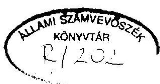

---

# T A R T A L O M J E G Y Z É K 

1. BEVEZETÉS
11. FÖBB MEGÁLLAPÍTÁSOK ÉS JAVASLATOK
1. A közhasznú közúti személyszállítás általános, a vizsgálatok irányultságát meghatározó feltételei
2. A területi feltételek és feladatok rövid összefoglalása
3. A vagyongazdálkodás vizsgálatának általánositható tapasztalatai
4. A közhasznú közúti személyszállítás ellátása 9 - 13.
5. A vizsgálatok alapján tett ÁSZ ajánlások és javaslatok

13 - 15 .
III. A VIZSGÁLATSOROZAT LEGFONTOSABB TANULSÁGAI

---

# ÁLLAMI SZÁMVEVÖSZÉK 

V-10-44/1993-1994.
Témaszám: 173.

## J E L E N T É S

a Volánbusz, a Kisalföld, a Vasi, a Vértes és az Alba Volán vállalatoknál az országos mentrend szerinti személyszál lításra rendelt állami vagyonnal való gazdálkodásáról

- az 1993-ban végzett számvevöszéki vizsgálatok összefoglaló tapasztalatai -

## I.

## B EVEZETÉS

A Volánbusz, a Kisalföld, a Vasi, a Vértes és az Alba Volán vállalatok vizsgálatát az Állami Számvevőszék törvėnyi felhatalmazás alapján végezte. Az ellenőrzések területileg egymással érintkező megyékben müködő Volán Vállalatoknál folytak és a menetrend szerinti személyszállitásra, a szolgáltatási összefüggésekre mint rendszerre irányultak. Az ellenőrzések a Volán autóbuszközlekedési vállalatokban müködő 15,4 milliárd Ft értékủ állami vagyonnak az egynegyedére (3,8 Mrd Ft-ra) terjedtek ki, és a vagyon hasznosulását az autóbuszhálózat hosszabbtávú müködőképessége szempontjából közel itették meg. E vállalatok a menetrend szerinti személyszállitást 2073 autóbusszal, 1005 településen, 30 városban végezték el. A vizsgálatsorozat megkezdésekor a vállalatok államigazgatási felügyelet alatt álló állami vállalatok voltak, amelyek 1993. január 1-jétől részvénytársasággá alakultak át.

Az öt megyében lefolytatott vizsgálat az 1991-1992. és részben 1993. évek eredményeit, gondjait fogta át.

---

# FÖBB MEGÁLLAPÍTÁSOK ÉS JAVASLATOK 

1. A közhasznú közúti személyszállítás általános, a vizsgálatok irányultságát meghatározó feltételei

Magyarország autóbuszhalózata sürü, kiterjedt, európai viszonylatban is jónak minősül. A korábbi évtizedekben az iparosítás következtében 1,2 millió dolgozó naponta ingázott, szállításukat napi 12 ezer autóbuszjárat szolgálta. Az elmúlt években számos változás történt, melyek az ellenőrzést időszerűvé tették. Ezek közül három tényezőről kell kiemelten szólni.

A közlekedési tárca 1992-ben decentralizációs ágazati stratégiát hirdetett meg a Volán vállalatokra vonatkozóan. Ez azt jelentette, hogy a korábban megyei szinten szervezett 19 (vegyesprofilú személy- és teherfuvarozó) vállalatnál megszüntették a nem személyszállitási tevékenységeket.

A veszteségessé vált, piacot veszitett teherfuvarozást, gépjármũjavitást Kft.-kbe vitték 1992-ben. Az állami feladat vállalás szűkítésével összhangban megteremtődött a feltétele, hogy tiszta profilú személyszállító részvénytársaságokat hozzanak létre 1993. január 1-jétől. A gazdasági és szervezeti változás nagyságrendjét érzékelteti, hogy az egyes vállalatok árbevételének mintegy fele és a létszámnak 25-30 \%-a került Kft-kbe. A cégek felaprózódtak, 20 Volán Vállalatból 55 cég jött létre. Ezek közül 29 cég (rt., kft.) személyszállító.

A közúti személyszállítással kapcsolatban további fontos tényező, hogy müködése az ország lakosságának életkörülményeit jelentősen meghatározza. Az országos autóbusz hálózat

---

müködőképességének biztosítása a megváltozott feltételek között is elsődleges érdek. A nehezebb anyagi és korlátozott támogatási feltételek visszahatnak magára a szolgáltatást végző állomány állapotára is. A körülmények romlottak.

A nemzetgazdaság változásai (gazdasági recesszió, munkanélküliség) térségenként eltérő mértékben, de mindenütt jelentősen befolyásolták a személyszállítással szembeni igényeket és a közlekedés gazdaságosságát.

A személyszállításban az utasok számát és az utasáramlás irányait, csúcs időpontjait napszakonként befolyásolják a megváltozott körülmények: a bányászat és ipar termelésének csökkenése, cégek megszűnése, a munkanélküliség növekedése, a tanuló ifjúság, a nyugdíjas korú lakosság számának, demográfiai összetételének alakulása (szociálpolitikai tarifa kedvezmények, állami támogatások összefüggései miatt).
1.1. Megnőtt a súlya annak, hogy a közszolgáltatást végző vállalatok kellő mértékben alkalmazkodjanak az új igényekhez, illetőleg ha ez nem következett be, akkor fel kellett tárni, hogy annak mi az akadálya. A gyors változások, összetett hatások nehezen tekinthetők át. Mindeme1lett fontos, hogy az államnak a közszolgálatra rendelt vagyona kielégítően szolgálja az állampolgárokat.

Az Állami Számvevőszék ellenőrzése során megvizsgálta, hogy a vállalatok

- a kezelésükben lévő állami vagyonnal hogyan gazdálkodtak,
- a közszolgáltatási tevékenységet megfelelően látták-e e1,
- a menetrendszerü autóbusz személyszállítás színvonala milyennek minősíthető,

---

- az átalakulás részvénytársaságokká a törvényeknek és a gazdasági racionalitásoknak megfelelően történt-e,
- a környezetvédelmi jogszabályokat betartották-e a vállalatok tevékenységük során.
1.2. Az ellenőrzött vállalatok mindegyike más típusú problémakört reprezentál. Müködési területükön: három nagy ipari agglomeráció van (a fővárosi, a györi és a székesfehérvári), egy hanyatló bányavidék (Tatabánya), valamint szórt kis települések, távol az országos főútvonalaktól, ahonnan a lakosság naponta ingázva utazott munkahelyére. Az öt megyében 2,4 millió ember él. Ebből naponta ingázott 1990. évben 454 ezer ember.

A regisztrált munkanélküliek száma az 1990. évi 12 ezer föröl 1992. év végére 132 ezer före nött, azaz több mint megtizszereződött. Az autóbusszal utazók számának csökkenésében tehát mindenképpen jelentös hányadot képeznek a munkanélkül ive váltak, akik már nem utaznak a napi hivatásforgalomban. Közvetett hatása is volt a munkanélküliségnek, ugyanis az autóbusz közlekedést nem kora reggel, hanem későbbi napszakban igénylik. Ezt a menetrendekkel is követni kellett.
2. A területi feltételek és feladatok rövid összefoglalása

A Vasi Volán területén számos kis település van, ahol minimális a közlekedési ellátás, naponta két-három járatpár érinti a falvakat. A települések mintegy $30 \%$-a nem frekventált főútvonal mellett van, ezért más megyékböl átjáró volán autóbuszjáratok nem haladnak át rajtuk. Közlekedésük a Vasi Volántól függ. Az Rt. nehéz gazdasági helyzetben

---

van. Különösen a szórt, kis településeken áthaladó autóbuszvonalak gazdaságtalanok, de nem szüntethetők meg, mert egyenértékủ más közlekedési lehetősége nincs a lakosságnak. A lakosok 4,5 \%-a munkanélküli.

A Kisalföld Volán látja el Győr-Moson-Sopron megyét. Területén van Győr ipari agglomerációja. Gazdasági adottságait tekintve a vizsgált vállalatok között a legjobb helyzetü. De a térség lakosságának 4,3 százaléka munkanélküli, a jövedelmek mérséklödése ezzel szorosan összefügg.

A VOLÁNBUSZ (korábban MAVART = MÁVAUT) a legrégebbi, 1909 óta folyamatosan müködő autóbuszvállalat. El1átja Pest megye, benne a budapesti agglomeráció helyi és távolsági közlekedését, valamint belföldön és külföldön a távolsági menetrend szerinti autóbusz személyszállitást. A Vállalat nyeresége több éve minimális, de müködési területén jó közlekedési ellátást nyújtott. Pest megyében a lakosság 5,3 \%-a volt munkanélküli, emiatt folyamatosan csökken a teljesáru menetjegy eladások száma.

Az Alba Volán Székesfehérvár, az ipari agglomeráció és Fejér megye helyi és helyközi (távolsági) menetrend szerinti autóbusz személyszállitását biztosítja. A Vállalat 1991-ben egyszerre került eladósodási és likviditási csödbe, de túlélte. Gazdasági helyzete az Rt.-vé alakulást követöen is nehéz. A térségben lakók 6,3 \%-a munkanélküli. Az Rt. rendkívül takarékos gazdálkodásra kényszerült. Ennek egyik következménye volt, hogy 1993. év végére az autóbuszvezetők körében sztrájkhangulat alakult ki. Egyébként a felhalmozódott müszaki gondok és gazdasági feszültségek veszélyeztetik a cég hosszútávú müködését annak ellenére, hogy a vezetés a korábbi évek veszteségeit kigazdálkodta.

---

A Vértes Volán szolgáltatja Tatabánya és a tatai bányavidék, valamint Komárom-Esztergom megye helyi és távolsági menetrend szerinti autóbusz közlekedését. A vállalat 1991-ben csődhelyzetben volt. A gazdasági egyensúly helyreállítása az Rt.-vé alakulást követöen is folyamatos erőfeszítéseket igényel. A lakosság 7,4 \%-a munkanélküli a térségben. A teljesáru viteldijért utazók száma jelentősen csökkent, a közlekedési ellátást azonban nem lehet ezzel arányosan mérsékelni, sem megszüntetni.
3. A vagyongazdálkodás vizsgálatának általánosítható tapasztalatai
3.1. A Volánok akkor kényszerültek - a piacát veszitett teherárufuvarozásból, javítólparból és egyéb tevékenységeikböl - Kft-ket alapítani, amikor maguk is forgótöke hiánnyal küzdöttek. Elvileg egy évi müködéshez elegendő álló és forgó tökével célszerũ egy vállalkozást megalapítani. A privatizáció a korábbi tehergépjármüfuvarozás népgazdasági szakágazatot képező tel jes jármüállományra, valamint a teljes személyi állományra kiterjedt. Az érintettek széles köre és a tárgyi eszköz állomány nagysága miatt az elöirt határidöre csak a privatizáció jogi aktusai voltak lezárhatók, gyakorlatban a gazdasági következmények áthúzódtak 1993. évre.

A Volánoknál a 100 \%-ban állami tulajdonú, zárt végủ részvénytársasággá alakulás likvid töke bevonása nélkül történt, arra nem is volt ajánlat. A gazdálkodást, valamint a piaci viszonyokhoz alkalmazkodást a sikeres túlélési törekvések határozták meg.

Az átalakulások gondjait vizsgálva tünt ki, hogy az állam vállalatokra bizott vagyonának véde1méről szóló 1990 . évi

---

VIII. törvény a nem nevesített szerződések esetén nem gátolja meg a korábban jelzáloggal terhelt vagyonrészek elidegenitését. A helyzet úgy jött létre, hogy a hitelezö, számlavezető Bank kényszerértékesitést irt elő nem fizetés esetére. Az óvadéki szerződésekre a vagyonvédelmi törvény nem vonatkozik, mert azok az értékhatárt nem érték el. Ez a lehetőség ma is fennáll.

A jövedelmezőséget az Rt-kben a személyszállítási tarifákban elismert tényezők határozzák meg. A KHVM a távolsági és az önkormányzatok a helyi autóbuszközlekedési tarifákban a folyó müködés ráfordításait ismerik el. Így az Rt-knél minimális nyereség képződik, de beruházni nem képesek. Az átalakuláskor megőrizték tárgyi vagyonukat, de megújítani nem képesek.
3.2. A vagyonnal történt gazdálkodásról általános érvényü tapasztalata az ellenőrzésnek az, hogy a korlátolt felelősségü társaságokba kivitt állami vagyon nem haladta meg az állam vállalatokra bizott vagyonának védelméről szóló törvényben elöirt értéket, illetőleg az ehhez szükséges engedélyeket az Állami Vagyonügynökségtöl, majd a Közlekedési Hírközlési és Vizügyi Minisztériumtól - az ügylet időszakában volt tulajdonostól - szabályosan megkérték.

A Volánok által alapított Kft-kben müködtetett (egykori állami) vagyon üzletrészek formájában megmaradt. A lecsökkent fuvarpiac következtében a Kft-k kevéssé nyereségesek (egy részük felszámolódott, vagy vegetál) ennélfogva a tőlük származó osztalék kevés. Az Rt-k számára sokkal jelentősebb a tölük bérelt eszközök után befolyó bérleti, vagy lízing díjak összege. Volt arra is példa, hogy az Rt. nem élt kellően az alapításkor jogi és gazdasági elönyei érvényesítésének lehetőségével. Ez megnyil-

---

vánult abban, hogy nem a tulajdoni részaránynak megfelelően rögzítette szavazati jogát a szerződésben. További gazdasági hátránnyal járt, hogy a permanens átalakulás sorozat alatt a vállalatok szervezete is folyton változott, emiatt nem került egy kézbe az üzletrészek, befektetések kezelése.

Az Országgyülés 1 milliárd Ft költségvetési támogatást és 5 milliárd Ft hitelt biztosított az autóbuszállomány rekonstrukciós céljaira az 1994. évi költségvetésben. Ez kiegészülhet a menetrend szerinti személyszállítást végző Volánok évi 1 milliárd Ft körüli amortizációjából képződő beruházási pénzzel. Vannak olyan Volánok, amelyek korábbi terheik törlesztése miatt nem tudnak pályázni a kormánygaranciával nyújtandó rekonstrukciós hitelre. Ezeket segítené a területi közszolgáltatási szükséglethez rendelt költségvetési támogatás. A mobilizálható összeg arra elég, hogy rövid távon lassítsa az autóbuszállomány romlását.

Egy középtávú időszakon belül évente az országosan 7000 db-os Volán autóbuszállomány $10 \%$-át kellene kicserélni ahhoz, hogy kielégítő korösszetételű és megfelelő müszaki állagú autóbuszpark jöjjön létre. Az ehhez közelítő feltételeket tehát hosszabb távon, a gazdasági törvényekben szükséges biztosítani. Az autóbuszok árainak inflációs emelkedése ismételten devalvàlja a beszerzéskori ár után képződő amortizációs forrásokat. Az autóbusz tarifákban a jármúvek utánpótlási árának érvényesítése drasztikus áremelést követelne meg.

Emíitést érdeme1, hogy sajátos következménye a volt néhai NDK-ban zajló autóbuszrekonstrukciónak, hogy a Volán vállalatok az ott leselejtezett 8-9 éves autóbuszok megvá-

---

sárlásával segitik a még elöregedettebb - 14 éves - magyar jármüvek cseréjét. De hosszú távon ez nem megoldás.
4. A közhasznú közúti személyszállítás ellátása

Az autóbusz közlekedés minöségének fontos jellemzöje a hálózati szintü müködés. Megállapítható, hogy az öt vállalat által müködtetett autóbuszvonalak az országos közlekedési hálózatnak ma is szerves részét képezik. Müködésük biztosíték arra, hogy az utas a célállomásig elöre megtervezheti utazását a meghirdetett menetrendek alapján, amelyek a vasúti és más Volán vállalatok menetrendjével koordináltak. Az ellenörzés tehát nemcsak az egyes vállalatok területi müködését, hanem összefüggö hálózatkénti funkcionálását is minösítette.
4.1. Az autóbusz személyszállítás minöségét illetően a következő tapasztalatokról számolhatunk be

A közszolgáltatást (a menetrend szerinti helyi és helyközi autóbusz személyszállítást) illetően általános érvényüen megállapítható, hogy a vizsgált öt vállalatnál az elmúlt három évben fokozatosan csökkent az utasok száma, de a közlekedési ellátást a Volánok fenntartották müködési területükön, közlekedési szolgáltatásból kizárt, ellátatlan terület nem keletkezett.

Ez azt jelenti, hogy a budapesti, a györi és a székesfehérvári ipari agglomeráció hivatásforgalmát (a napi munkába járási, tanintézetekbe járási utazási szükségleteket) kiszolgálják. A menetrendek koordináltak a Volánok között és a MÁV-val is. A változó igényeket általában követik. A menetrendiség biztosítja az utazások megtervezhetőségét az országban. Fel kell azonban hívni a figyelmet arra, hogy a magán autóbuszjáratokat nem koordinálják

---

sem az országos, sem a helyi autóbuszhálózat közlekedéséhez. Ez hiba, mert az utas nem számíthat elöre az átszállásos utazásnál a hálózat idöbeni kapcsolatára.

A kis településeken is napi két-három járat pár biztosított, a csekély utasforgalom mellett. A járatok egyirányú kihasználtsága következtében a szórt kistelepüléseket érintö autóbusz vonalakon relatíve drága és bevétellel nem mindig fedezett az autóbuszközlekedés.

Az autóbusz közlekedési ellátást azonban nem lehet kizárólagosan csak gazdasági kérdések alapján eldönteni. A lakosság számára ugyanis az nem nélkülözhetö. Ennek egyik oka, hogy az alternativ közlekedést jelentö vasutat is csak autóbusszal, vagy több kilométeres gyalogúttal lehet elérni, mert vasútállomás nincs mindenütt. Magyarország 3108 települését ugyanis 1217 vasútállomás szolgálja ki. A másik ok az, hogy az elmúlt évtizedben több centralizációs államigazgatási intézkedés történt: az iskolákat körzetesítették, az egészségügyet és a közigazgatást centralizálták. Mindez utazási kényszert váltott ki.

Ezen intézkedések helyretétele néhol megkezdödött, de nem kiterjedt folyamat. Emiatt továbbra is arra kényszerül a vidéki lakosság, hogy $30-40 \mathrm{~km}$-t utazzon, annak érdekében, hogy hozzájusson azokhoz a közösségi ellátásokhoz amit a városlakók helyben megkapnak. (Iskola, vegyes bolt, postahivatal, orvos, gyógyszertár, hatósági engedélyek, igazolványok).

Megjegyzendö és figyelemre méltó, hogy a lakossági bejelentésekröl a KHVM részére kötelezöen elöírt statisztikai kimutatást készítenek a részvénytársaságok, amelyhez szöveges beszámoló is készül. Sem a számszerü statisztika, sem a szöveges tájékoztatás nem nyújt érdemi értékelést,

---

minősítést a tömegközlekedésben tapasztalt kifogásokról. A személyszálítás jobbításához intézkedésre alkalmas jelentések, beszámolók konkrét segítséget nyújthatnának.
4.2. A teljesáru viteldíjak drágák a kistelepülésen élő családoknak. Mérhető a jegyeladások alapján, hogy a kedvezményes utazásra jogosult családtagokra - tanulókra, nyugdíjasokra - hárítják az utazást igénylő hivatalos ügyintézést, vásárlást. A munkanélküliség is elsősorban az ingázókat sújtja. A kevéssé gazdaságos autóbusz járatok, vonalak üzemeltetése azonban a Volán vállalatok számára is egyre nagyobb teher. Ezt a feszültséget meg kell oldani. Több okozati összefüggést tisztázni kell. Jelenleg a menetrend szerinti autóbusz személyszálítás minimálisan kötelező mértéke nincs meghatározva, sem a helyi sem a távolsági autóbusz közlekedésben.

A lakosság érzékeny a tarifaemelésre. Ezt mutatja, hogy tarifaemelések után csökkent az utasszám. Két tarifa hatóság müködik. Az önkormányzat állapítja meg a helyi tarifákat, a KHVM a távolsági tarifákat. Mindkét tarifa hatóság csak a folyó müködés költségeit biztosító viteldíjakat állapítja meg. Következésképpen az autóbusz hálózat bővítésére, új autóbuszok beszerzésére nem képződik fedezet. Az elhasznált jármüvek sem pótolhatók emiatt. Ahhoz, hogy megállapítható legyen a valós és szükséges pénzügyi fedezet, meg kellene határozni, hogy mi az a minimális, ha úgy tetszik alapellátás, amit a Volán vállalatoknak müködési területükön biztosítani kell. Jelenleg ez nincs meghatározva, a hagyományosan kialakult vonalak, a menetrend az ellátottság viszonyítási alapja. Az autóbuszállomány mindenütt elhasznált, öreg. Új, korszerű, környezetkímélő járművekre nincs pénzük a vállalatoknak. A korszerű autóbuszok drágák. Amortizációjuk is több, költségük

---

növelné az autóbusz tarifákat. A lakosság fizetőképessége pedig romlik. A költségvetés teherbíróképessége is véges. Ez összetett gond. Többirányú intézkedés szükséges.
4.3. A vizsgált időszakban a Volán Rt.-k ben a környezetterhelést a szennyezési határérték alatti szinten tartották. A jármütelepeken a szennyvizeket tisztítják, a káros anyagokat összegyüjtik és általában az elöírások szerint kezelik. Erre utal az, hogy környezetvédelmi bírságolás ritkán történt, illetve azt követően a cégek érdemben intézkedtek az okok megszüntetéséröl.

Meg kell említeni, hogy a jármütelepek és javítóüzemek, zömében az elmúlt 20 évben épültek az akkori környezetvédelmi szabványoknak megfelelően. Elönyös, hogy kijelölésük a lakott területek határán történt. Korszerüsitésük azonban csak a legszükségesebb mértékre korlátozódott. Az Rt-k számára állandó gondot okoz a veszélyes hulladékok tárolására, megsemmisitésére jogosult vállalkozások felkutatása. Különösen nagy tömegü és terjedelmes a használt gumiköpeny és gumitömlö hulladék (egy-egy cégnél évi 120-140 tonna keletkezik).. Hazánkban egyébként ezt a hulladékot fôként tárolják, mert nem semmisíthető meg (kevés az égető) és a gumi utófeIdolgozása nincs megoldva. A tehergépkocsikat 1992. évben a Volánok által alapított Kft-kbe vitték ki.Ezek egy részét az "anya" vállalattól bérelt, vagy apportként bevitt jármütelepen, telephelyen tárolták, ezért környezetvédelmi ellenőrzésük folyamatos és megoldott.

Magánszemélyek vették meg az eladott tehergépjármüveknek mintegy 10-12 \%-át. Ezek a gépjármüvek kikerültek a környezetvédelmi ellenőrzés alól. (Csak az égéstermék kibocsátást ellenőrzik). A magánszemélyekhez került nagy

---

teherbírású ( 10 tonnás és a feletti) gépjármüvek összes többi veszélyes, környezetkárosító hatását csak becsülni lehet, de nagyságrendje miatt mértékadó lehet a közúti közlekedésben.

Az autóbuszok zaját, füstgázait azonban csak akkor lehet érdemlegesen csökkenteni, ha végrehajtják az autóbuszállomány cseréjét. Új, környezetbarát motorokkal ellátott jármüveket szükséges üzembe állítani. Ez azonban nem a vállalatok szándékán, hanem pénzügyi feltételek hiányán múlik.
5. A vizsgálatok alapján tett ÁSZ ajánlások és javaslatok
5.1. Az Állami Számvevõszék ajánlást tett a Közlekedési, Hírközlési és Vízügyi Minisztériumnak, hogy határozza meg a menetrend szerinti autóbuszközlekedésben az ország valamennyi lakott településén kötelezo ellátás minimumát, annak paramétereit, a színvonalat minösitö követelményrendszert valamennyi e tevékenységet végzöre nézve annak érdekében, hogy az indokolt és szükséges anyagi fedezetet ebből kiindulva meg lehessen állapítani. A gazdálkodó szervezeteknek pedig a nyújtandó közszolgáltatást legalább az alapellátás normáinak megfelelően kell teljesíteniük. Az ajánlással a közlekedési és a pénzügyminiszter egyetértett.

A számvevőszék ajánlotta a tárcának azt is, hogy az általa megszabott területi közszolgáltatási szükségletekhez a vonatkozó kormányhatározat alapján dolgozza ki és határozza meg a támogatás differenciált feltételeit a tömegközlekedés jármüveinek 1994. évben megkezdödö rekonstrukciójára.

---

Az Állami Számvevőszék Elnöke felhívta az Országgyűlés figyelmét arra, hogy az 1994. évi költségvetésben biztosított állami támogatás a közhasználatú autóbusz személyszállítás jármüállományának további romlását lassítja. Hosszútávra van szükség olyan beruházási forrásképzést biztosító gazdasági törvényekre, amelyek ezen nem profit jellegú közszolgáltatás müködöképességét megtartják. Elsősorban a társasági adó alóli mentesítés mérlegelendő, a tárgyi eszközök utánpótlását megoldó valorizációs forrásképzés érdekében.

A vizsgált vállalatoknak is javítanluk kell tevékenységüket. A részvénytársaságoknak ki kell építeniük - az átalakulás folyamán megszűnt - munkafolyamatba épített belsö ellenőrzési rendszerüket. Így

- biztosítaniuk kell az elrendelt intézkedések végrehajtásának egységes, szabályozott, áttekinthető, visszajelzésre kötelezett, zárt szervezeti rendszerét;
- a vagyonmegosztást követően rendezniük kell a földhivataloknál egyes ingatlanok tulajdoni bejegyzését;
- fokozni kell az ellenőrzést az autóbuszokon a jegyné1kül utazók (bliccelők) csökkentése érdekében, továbbá a garázdák megfékezésére, akik jelentős károkat okoznak az autóbuszokban, pályaudvarokon, kiépített utasvárókban;
- javítani kell az indokolt utaspanaszok érdemi elintézését. Különösen elmarasztalást érdemlő autóbuszvezetői magatartás a helyközi forgalomban, ha az úgynevezett "betérőbe" nem megy be az autóbusz és az utas ott marad, mert a következő járat csak órák múlva esedékes. Mindent meg kell tenni azért, hogy ilyen esetek ne forduljanak elö;

---

- megalapozott lakossági kérelemre, a vasútállomásokra gyorsvonathoz csatlakozó "ráhordó autóbuszjáratot" kell biztosítania a Volán vállalatnak.

A felsorolt intézkedések a vizsgált vállalatok saját hatáskörében megtehetők. Jelezhető ezen túlmenően, hogy csúcsidőszakokban egyes járatok zsúfoltsága miatt nagy szükség lenne azonos időpontban a menetrend szerintivel együtt kisegítő autóbuszok indítására. Ehhez tartalék autóbuszokra lenne szükség. A vállalatok szerint azonban ez gazdasági okokból nem kivitelezhető. Az autóbusz állomány mintegy 9-10 \%-át az elhasználtság miatt gyakran elromló autóbuszok helyettesítésére használják, vagyis a menetrend szerinti forgalmat így képesek fenntartani.

Az ÁSZ felhívta az érintettek figyelmét, hogy a befektetések, üzletrészek védelmében jobban érvényesítsék a még meglévő társaságokban érdekeiket. Ehhez egy szakképzett, áttekintési lehetőséggel rendelkező ember kezébe kell kerülni a befektetéseknek. Továbbá meg kell szervezni az információs rendszert. A helyes döntéshez ugyanis a dokumentumoknak időrendben és tel jeskörűen rendelkezésre kell állniuk ezen gazdasági folyamatokról.

# III. 

## A VI ZSGÁLATSOROZAT LEGFONTOSABB TANULSÁGAI

A Volán vállalatok átalakulása részvénytársasággá a hatályos törvények betartásával történt. Tőkenővelésre nem került sor. Az Rt.-k hosszútávú müködőképességéhez szükséges feltételek nem javultak, mindenütt likviditási gond és beruházási forráshilány van.

---

A részvénytársaságok megörizték az autóbusz személyszál1itásra rendelt állami vagyont. Az átalakulás során felértékelték az eszközöket. Szerény mértékben nőtt 1992-ben a vagyon a tárgyévi nyereségből. A Kft-kbe kivitt állami vagyon (tehergépjármüvek, javítóüzemek) felélése folyik. A Kft-ktől befolyt lizing díjakat, bérleti díjakat az autóbuszok fenntartására fordítják. Ezek a források azonban elégtelenek az elhasznált autóbuszok kicseréléséhez. Törvényi szintű intézkedés szükséges a helyzet tartós javítása érdekében.

A romló feltételek, változások közepette az autóbusz közlekedési hálózat még müködik, de az utas az egyre drágább viteldijért nem kap sem jobb, sem több szolgáltatást. Ebbe beleértendő lenne az alapellátás kellő járatszáma, célállomásra eljutás idejének csökkentése, a menetrendiség, utastájékoztatás, a jármüvek tisztasága is. A közlekedési szolgáltatások szinvonaláról azonban kevés szó esett a Volánok részvénytársasággá alakulását eldöntő privatizációs stratégiában és az átalakulási tervekben. Azóta a gazdasági érdek oda hat, hogy az Rt-k a fizetőképes utasszám csökkenésének hatására a nem teli járatokat átmenetileg, vagy végleg leállítsák. A lakossági panaszokból kitünik, hogy ezt egyértelmüen szinvonal rontásnak tartják.

Budapest, 1994. április "T".
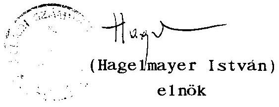

---

Az Allami Számvevöszék vizsgálati száma: V-10-16/1993. témaszáma : 173

# I. MELLEKLET 

a volán vállalatok 1991-1992. évi
gazdálkodási és vagyon adatairól
az országos közhasználatú autóbusz személyszállitásra rendelt állami vagyon ellenörzéséhez

Osszeállította:
a VOLAN ELEKTRONIKA RT. MIKRO VOLAN ELEKTRONIKA Kft

---

# Tartalomjegyzék 

Oldalszám
I. Bevezetö
II. Gazdálkodási. szállítási adatok
ALBA VOLAN RT : Vagyoni, pénzügyi adatok ..... 4
Létszám. bér. beruházási adatok ..... 5
Szállítási teljesítmények ..... 6
Személyesállítás üzemi mutatói ..... 7
KISALFOLD VOLAN RT : Vagyoni. pénzügyi adatok ..... 8
Létszám. bér. beruházási adatok ..... 9
Szállítási teljesítmények ..... 10
Személyesállítás üzemi mutatói ..... 11
VASI VOLAN RT : Vagyoni. pénzügyi adatok ..... 12
Létszám. bér. beruházási adatok ..... 13
Szállítási teljesítmények ..... 14
Személyesállítás üzemi mutatói ..... 15
VERTES VOLAN RT : Vagyoni. pénzügyi adatok ..... 16
Létszám. bér. beruházási adatok ..... 17
Szállítási teljesítmények ..... 18
Személyesállítás üzemi mutatói ..... 19
VOLANBUSZ RT : Vagyoni. pénzügyi adatok ..... 20
Létszám. bér. beruházási adatok ..... 21
Szállítási teljesítmények ..... 22
Személyesállítás üzemi mutatói ..... 23
ZALA VOLAN RT : Vagyoni. pénzügyi adatok ..... 24
Létszám. bér. beruházási adatok ..... 25
Szállítási teljesítmények ..... 26
Személyesállítás üzemi mutatói ..... 27
A vizsgált 6 volán
szervezet összesen : Vagyoni. pénzügyi adatok ..... 28
Létszám. bér. beruházási adatok ..... 29
Szállítási teljesítmények ..... 30
Személyesállítás üzemi mutatói ..... 31
összes volán
szervezet : Vagyoni. pénzügyi adatok ..... 32
Létszám. bér. beruházási adatok ..... 33
Szállítási teljesítmények ..... 34

---

III. Mèrleg adatok
ALBA VOLAN RT ..... 37
KISALFOLD VOLAN RT ..... 40
VASI VOLAN RT ..... 43
VERTES VOLAN RT ..... 46
VOLANBUSZ RT ..... 49
ZALA VOLAN RT ..... 52
A vizsgált 6 volán szervezet Sszzesen ..... 55
IV. Záradékok
ALBA VOLAN RT ..... 59
KISALFOLD VOLAN RT ..... 60
VASI VOLAN RT ..... 61
VERTES VOLAN RT ..... 62
VOLANBUSZ RT ..... 63
ZALA VOLAN RT ..... 64

---

# BEVEZETO 

Az ALLAMI SZAMVEVOSZEK és a KHVM felkérésére összeállitottuk a kijelölt volán szervezetek vizsgálati anyagának mellékletét képező közgazdasági elemzésekhez szükséges adatokat.

Az adatokat a cégek bocsátották rendelkezésünkre. és az összeállítás elkészitése után ellenörizték is.

Az összes volán szervezetre (a mellékelt lista szerint) vonatkozóan az adatokat a rendelkezésünkre álló elözetes információkból állítottuk össze.

---

II. Gazdálkodási szállítási adatok

---

Gazdálkodó szervezet megnevezése: ALBA VOLAN RT
Vagyoni, pénzügyi adatok

| Megnevezés | 1991 | 1992 | 1992. év | Volán összesen |  |
| :-- | :-- | :-- | :-- | :-- | :-- |
|  | millió | Ft | 1991. év | százalékában |  |
|  |  |  | $\%$-ában | 1991 | 1992 |

A vagyon alakulása

| Saját toke | 584,8 | 595,7 | 101,9 | 3,1 | 3,4 |
| :-- | --: | --: | --: | --: | --: |
| Jegyzett toke | 638,9 | 638,9 | 100,0 | 4,1 | 4,3 |
| ebböl: külföldi | - | - | - | - | - |
| Allami vagyon | 638,9 | 638,9 | 100,0 | $\ldots$ | $\ldots$ |

Az árbévétel és az eredmény alakulása

| Ert.nettó árbevétele | 1929,9 | 2156,8 | 111,8 | 5,1 | 5,7 |
| :-- | --: | --: | --: | --: | --: |
| ebböl: export tev. | 442,9 | 420,7 | 95,0 | 9,3 | 13,4 |
| Alaptevékenység nettó |  |  |  |  |  |
| árbevétele | 1603,8 | 1900,0 | 118,5 | 5,1 | 6,5 |
| ebböl:személyszállitás | 1134,2 | 1424,8 | 125,6 | 5,7 | 5,8 |
| áruiszállitás | 469,6 | 475,2 | 101,2 | 4,5 | 9,6 |
| Eredmény |  |  |  |  |  |
| azemi | 90,7 | 66,5 | 73,3 |  |  |
| mérleg szerinti | 32,2 | 10,5 | 32,6 |  |  |

A költségek alakulása

| Osszes ráforditás | 1930,3 | 2137,2 | 110,7 | 5,0 | 5,6 |
| :-- | --: | --: | --: | --: | --: |
| Osszes költség | 1826,6 | 2025,2 | 110,9 | 4,8 | 5,4 |
| ebböl: |  |  |  |  |  |
| Nettó anyagköltség | 659,6 | 841,8 | 127,6 | 5,1 | 6,4 |
| ebböl: energia | 498,7 | 518,9 | 104,1 | 5,4 | 6,5 |
| Bérköltség | 357,0 | 433,6 | 121,5 | 4,7 | 5,6 |
| TB járulék | 153,6 | 195,1 | 127,0 | 4,6 | 6,0 |
| Ertékcsökkenési leírás | 110,1 | 110,3 | 100,2 | 6,0 | 5,2 |

A támogatás alakulása

| Költségvetési támogatás | 303,8 | 469,6 | 154,6 | 5,7 | 5,8 |
| :-- | --: | --: | --: | --: | --: |
| Ebböl: fogyasztói árkieg. | 296,2 | 457,1 | 154,3 | 5,6 | 5,6 |
| Egyéb támogatás | - | 1,0 | - | - | 0,7 |
| Támogatás összesen | 303,8 | 470,6 | 154,9 | 5,6 | 5,7 |

---

Gazdálkodó szervezet megnevezése:ALBA VOLAN RT
Létszám, bér, beruházási adatok
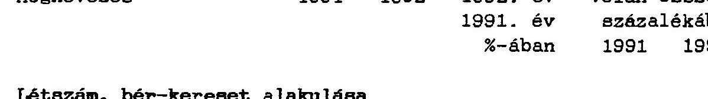

# Létszám, bér-kereset alakulása 

Teljes munkaidöben foglakoztatottak átlagos
létszáma, f8
$1991 \quad 1853$
$93,1 \quad 4,7 \quad 6,2$

Atlagos havi bruttó
munkabér, Ft/f8
$14405 \quad 18280$
$126,9 \quad 98,8 \quad 94,0$

Beruházás alakulása

Beruházás telj. értéke
ebbbl: építés
gép
ebb8l: jármú
Az összes beruházásból:
saját forrás
$1992 \quad$ Volán összesen
millió Ft
százalékában
1992
49,0
2,5
2,3
1,4
45,2
2,5
32,9
2,5

49,0
2,5

---

Gazdálkodó szervezet megnevezése: ALBA VOLAN RT
Szállitási teljesítmények

| Megnevezés | 1991 | 1992 | 1992. év 1991. év $\%$-ában | Volán összesen   százalékában 1991 |  |
| :--: | :--: | :--: | :--: | :--: | :--: |
| SZEMGLYSZALLITAS |  |  |  |  |  |
| Szállított utasok, millió fó |  |  |  |  |  |
| Helyi forgalomban | 54.6 | 48.4 | 88.6 | 5.6 | 5.4 |
| Helyközi forgalomban | 27.8 | 25.8 | 92.8 | 5.8 | 5.8 |
| Oszzesen | 82.4 | 74.2 | 90.0 | 5.6 | 5.6 |
| Utaskilométer teljesítmény, millio |  |  |  |  |  |
| Helyi forgalomban | 203.8 | 180.8 | 88.7 | 5.8 | 5.6 |
| Helyközi forgalomban | 538.4 | 476.1 | 88.4 | 6.1 | 6.4 |
| Oszzesen | 742.2 | 656.9 | 88.5 | 6.0 | 6.2 |
| Atlagos utazási távolság |  |  |  | Eltérés az átlagtól |  |
| Helyi forgalomban | 3.7 | 3.7 | 100.0 | 0.1 | 0.1 |
| Helyközi forgalomban | 19.4 | 18.5 | 95.4 | 1.1 | 1.7 |

# ARUSZALLITAS 

Szállított áruk tömege, ezer t

| Belföldi forgalomban | 412 | 2 | 0.5 | 1.1 | 0.0 |
| :-- | --: | --: | --: | --: | --: |
| Nemzetközi forgalomban | 78 | 73 | 93.6 | 5.4 | 16.2 |
| Oszzesen | 490 | 75 | 15.3 | 1.3 | 0.6 |

Arutonnakilométer, millió

| Belföldi forgalomban | 7.9 | 0 | - | 1.0 | - |
| :-- | --: | --: | --: | --: | --: |
| Nemzetközi forgalomban | 113.9 | 105.9 | 93.0 | 13.2 | 24.9 |
| Oszzesen | 121.8 | 105.9 | 86.9 | 7.2 | 16.2 |

---

Gazdálkodó szervezet megnevezése: ALBA VOLAN Rt
Személyazállítás üzemi mutatói

|  | 1991 | 1992 | $\begin{aligned} & 1992 / \\ & 1991 . \text { év } \% \end{aligned}$ |
| :--: | :--: | :--: | :--: |
| Autóbuszállomány az év végén, db | 362 | 342 | 94.5 |
| Ebböl: a nullára futott állomány | 224 | 214 | 95.5 |
| Uzembehelyezett autóbuszok az év folyamán, db | 5 | 8 | 160.0 |
| Ebböl: az új autóbuszok száma | 2 | 1 | 50.0 |
| Kocsikilométer teljesítmény, ezer km | 25070 | 23702 | 94.5 |
| Ebböl: helyi | 5777 | 5642 | 97.7 |
| helyközi menetrendszerü | 15850 | 15570 | 99.5 |
| Féröhelykilométer, millió km | 2102 | 1983 | 94.3 |
| Ebböl: helyi | 660 | 637 | 96.5 |
| helyközi menetrendszerü | 1195 | 1175 | 98.3 |
| Helyi vonalhálózat, km | 151 | 159 | 105.3 |
| Helyi viszonylatok hossza, km | 402 | 411 | 102.2 |
| Helyi viszonylatok száma, db | 53 | 53 | 100.0 |
| Bekapcsolt helységek száma | 10 | 9 | 90.0 |
| Ebböl: városok | 5 | 5 | 100.0 |
| Helyi forgalomban közlekedett autóbuszok átlagos száma, db | 93 | 92 | 98.9 |
| Helyközi menetrendszerü vonal-hálózat, km | 1216 | 1222 | 100.5 |
| Helyközi viszonylatok hossza, km | 5309 | 5309 | 100.0 |
| Helyközi viszonylatok száma, db | 116 | 116 | 100.0 |
| Bekapcsolt helységek száma, db | 100 | 100 | 100.0 |
| Gépkocsinapok száma összesen, ezer | 128 | 123 | 96.1 |
| Ebböl: fuvarban | 98 | 92 | 93.9 |

---

Gazdálkodó szervezet megnevezése: KISALFOLD VOLAN RT
Vagyoni, pénzügyi adatok

| Megnevezés | 1991 1992 |  | 1992. év | Volán összesen |  |
| :-- | :--: | :--: | :--: | :--: | :--: |
|  | millió Ft |  | 1991. év   \%-ában | százalékában |  |
| A vagyon alakulása |  |  |  |  |  |
| Saját toke | 884,7 | 862,7 | 97,5 | 4,6 | 4,9 |
| Jegyzett toke | 704,5 | 704,5 | 100,0 | 4,6 | 4,8 |
| ebbol: külföldi | - | - | - | - | - |
| Allami vagyon | 704,5 | 704,5 | 100,0 |  |  |

Az ábevetel és az eredmény alakulása

| Ert.nettó árbevétele | 1891.4 | 2114.4 | 111,8 | 5.0 | 5.6 |
| :-- | --: | --: | --: | --: | --: |
| ebbol: export tev. | 145,8 | 117,2 | 80,4 | 3,1 | 3,7 |
| Alaptevékenység nettó |  |  |  |  |  |
| árbevétele | 1700,9 | 1750,2 | 102,9 | 5,4 | 6,0 |
| ebbol:személyszállitás | 1177,3 | 1606,7 | 136,5 | 5,9 | 6,6 |
| árúszállitás | 523,6 | 143,5 | 27,4 | 5,0 | 2,9 |
| Eredmény |  |  |  |  |  |
| $\quad$ üzemi | 38,2 | 121,8 | 318,8 | $\ldots$ | $\ldots$ |
| mérleg szerinti | 2,3 | 1,2 | 52,2 | $\ldots$ | $\ldots$ |

A költségek alakulása

| Osszes ráfordítás | 1896.1 | 2066.5 | 109.0 | 4,9 | 5.4 |
| :-- | --: | --: | --: | --: | --: |
| Osszes költség | 1876.5 | 2006,8 | 106,9 | 5,0 | 5,3 |
| ebbol: |  |  |  |  |  |
| Nettó anyagköltség | 759,0 | 873,2 | 115,0 | 5,8 | 6,7 |
| ebböl: energia | 530,9 | 509,7 | 96,0 | 5,7 | 6,4 |
| Bérköltség | 406,8 | 415,4 | 102,1 | 5,3 | 5,4 |
| TB járulék | 174,2 | 178,6 | 102,5 | 5,2 | 5,5 |
| Ertékcsökkenési leírás | 103,9 | 137,1 | 132,0 | 5,6 | 6,5 |

A támogatás alakulása

| Költségvetési támogatás | 367,6 | 542,6 | 147,6 | 6,9 | 6,6 |
| :-- | --: | --: | --: | --: | --: |
| Ebböl:fogyasztói árkieg. | 367,6 | 542,6 | 147,6 | 6,9 | 6,7 |
| Egyéb támogatás | - | 0,4 | - | - | 0,3 |
| Támogatás összesen | 367,6 | 543,0 | 147,7 | 6,8 | 6,5 |

---

Gazdálkodó szervezet:KISALFOLD VOLAN RT
Létszám, bér, beruházási adatok

| Megnevezés | 1991 | 1992 | 1992. év | Volán összesen |  |
| :-- | :-- | :-- | :-- | :-- | :-- |
|  |  |  | 1991. év | százalékában |  |
|  |  |  | $\%$-ában | 1991 | 1992 |

Létszám, bér-kereset alakulása
Teljes munkaidöben foglakoztatottak átlagos
létszáma, fö $2513 \quad 1977$
$78,7 \quad 5,9 \quad 6,7$
Atlagos havi bruttó munkabér, Ft/fö $13280 \quad 16858$
$126,9 \quad 91,1 \quad 86,7$

Beruházás alakulása

| Megnevezés | 1992   millió Ft | Volán összesen   százalékában |
| :-- | :--: | :--: |
|  |  |  |
| Beruházás telj. értéke | 92,0 | 4,6 |
| ebböl: építés | 5,8 | 3,6 |
| gép | 86,2 | 4,8 |
| ebböl:jármü | 74,0 | 5,7 |

Az összes beruházásból: saját forrás
92,0
4,6

---

Gazdálkodó szervezet megnevezése: KISALFOLD VOLAN RT
Szállítási teljesítmények

| Megnevezés | 1991 | 1992 | 1992. év | Volán összesen |  |
| :-- | :-- | :-- | :-- | :-- | :-- |
|  |  |  | 1991. év | százalékában |  |
|  |  |  | $\%$-ában | 1991 | 1992 |

# SZEMGLYSZALLITAS 

Szállitott utasok, millió fö

| Helyi forgalomban | 86,0 | 83,9 | 97,6 | 8,8 | 9,4 |
| :-- | --: | --: | --: | --: | --: |
| Helyközi forgalomban | 26,6 | 27,6 | 103,8 | 5,5 | 6,3 |
| összesen | 112,6 | 111,5 | 99,0 | 7,7 | 8,4 |

Utaskilométer teljesítmény, millió

| Helyi forgalomban | 299,1 | 291,9 | 97,6 | 8,5 | 9,1 |
| :-- | --: | --: | --: | --: | --: |
| Helyközi forgalomban | 470,2 | 492,6 | 104,8 | 5,3 | 6,6 |
| összesen | 769,3 | 784,5 | 102,0 | 6,2 | 7,4 |

Atlagos utazási távolság, km
Eltérés az átlagtól
km
Helyi forgalomban $\quad 3,5 \quad 3,5 \quad 100.0 \quad-0,1-0,1$
Helyközi forgalomban $\quad 17,7 \quad 17,9 \quad 101,1 \quad-0,6 \quad 1,1$

## ARUSZALLITAS

Szállított áruk tömege, ezer $\mathbf{t}$

| Belföldi forgalomban | 3010 | 1155 | 38,4 | 8,1 | 9,9 |
| :-- | --: | --: | --: | --: | --: |
| Nemzetközi forgalomban | 42 | 29 | 69,0 | 2,9 | 6,4 |
| összesen | 3052 | 1184 | 38,8 | 8,0 | 9,8 |

Arutonnakilométer, millió

| Belföldi forgalomban | 67,9 | 23,3 | 34,3 | 8,3 | 10,2 |
| :-- | --: | --: | --: | --: | --: |
| Nemzetközi forgalomban | 34,1 | 20,1 | 58,9 | 4,0 | 4,7 |
| összesen | 102,0 | 43,4 | 42,5 | 6,1 | 6,6 |

---

Gazdálkodó szervezet megnevezése: KISALFOLD VOLAN RT
Személyezállitás üzemi mutatói

|  | 1991 | 1992 | 1992/1991   év \%-ában |
| :--: | :--: | :--: | :--: |
| Autóbuszállomány az év végén, db | 367 | 358 | 97.5 |
| Ebbol: a nullára futott állomány | 192 | 226 | 117.7 |
| Uzembehelyezett autóbuszok az év folyamán, db | 4 | 10 | 250.0 |
| Ebböl: az új autóbuszok száma | 4 | 1 | 25.0 |
| Kocsikilométer teljesítmény, ezer km | 24681 | 25982 | 105.3 |
| Ebböl: helyi | 8049 | 7603 | 94.5 |
| helyközi menetrendszerü | 14807 | 16314 | 110.2 |
| Féröhelykilométer, millió km | 2001 | 2121 | 106.0 |
| Ebböl: helyi | 759 | 786 | 103.6 |
| helyközi menetrendszerü | 1145 | 1260 | 110.0 |
| Helyi vonalhálózat, km | 240 | 290 | 120.8 |
| Helyi viszonylatok hossza, km | 531 | 531 | 100.0 |
| Helyi viszonylatok száma, db | 83 | 81 | 97.6 |
| Bekapcsolt helységek száma | 10 | 10 | 100.0 |
| Ebböl: városok | 5 | 5 | 100.0 |
| Helyi forgalomban közlekedett autóbuszok átlagos száma, db | 137 | 139 | 101.5 |
| Helyközi menetrendszerü vonalhálózat, km | 1169 | 1202 | 102.8 |
| Helyközi viszonylatok hossza, km | 4045 | 5076 | 125.5 |
| Helyközi viszonylatok száma, db | 105 | 105 | 100.0 |
| Bekapcsolt helységek száma, db | 347 | 347 | 100.0 |
| Gépkocsinapok száma összesen, ezer | 137 | 134 | 97.8 |
| Ebböl: fuvarban | 100 | .. | .. |
| Lizingelt autóbusz | 9 | 19 | 211.1 |
| Bérelt autóbusz | 1 | 3 | 300.0 |

---

Gazdálkodó szervezet megnevezése:VASI VOLAN RT
Vagyoni, pénzügyi adatok

| Megnevezés | 1991 | 1992 | 1992. év | Volán összesen |  |
| :-- | :-- | :-- | :-- | :-- | :-- |
|  | millió | Ft | 1991. év | százalékában |  |
|  |  |  | $\%$-ában | 1991 | 1992 |

A vagyon alakulása

| Saját toke | 485,0 | 487,7 | 100,6 | 2,5 | 2,8 |
| :-- | --: | --: | --: | --: | --: |
| Jegyzett toke | 423,4 | 423,4 | 100,0 | 2,7 | 2,9 |
| ebbol: külföldi | - | - | - | - | - |
| Allami vagyon | 423,4 | 423,4 | 100,0 | $\ldots$ | $\ldots$ |

Az árbévétel és az eredmény alakulása

| Ert. nettó árbevétele | 1226,3 | 897,1 | 73,2 | 3,3 | 2,4 |
| :-- | --: | --: | --: | --: | --: |
| ebbol: export tev. | 147,1 | 36,0 | 24,5 | 3,1 | 1,1 |
| Alaptevékenység nettó |  |  |  |  |  |
| árbevétele | 1021,4 | 704,9 | 69,0 | 3,3 | 2,4 |
| ebbol:személyszállitás | 521,5 | 636,8 | 122,1 | 2,6 | 2,6 |
| árúszállitás | 499,9 | 68,1 | 13,6 | 4,8 | 1,4 |
| Eredmény |  |  |  |  |  |
| azemi | 3,6 | 13,6 | 377,8 |  |  |
| mérleg szerinti | $-1,1$ | 0,5 |  |  |  |

A költségek alakulása

| Osszes ráforditás | 1239,3 | 937,0 | 75,6 | 3,2 | 2,4 |
| :-- | --: | --: | --: | --: | --: |
| Osszes költség | 1220,4 | 886,8 | 72,7 | 3,2 | 2,4 |
| ebböl: |  |  |  |  |  |
| Nettó anyagköltség | 495,1 | 348,2 | 70,3 | 3,8 | 2,7 |
| ebbol: energia | 314,5 | 202,3 | 64,3 | 3,4 | 2,5 |
| Bérköltség | 268,4 | 201,4 | 75,0 | 3,5 | 2,6 |
| TB járulék | 115,3 | 89,9 | 78,0 | 3,5 | 2,8 |
| Ertékcsökkenési leírás | 46,7 | 48,4 | 103,6 | 2,5 | 2,3 |

A támogatás alakulása

| Költségvetési támogatás | 138,1 | 199,4 | 144,4 | 2,6 | 2,4 |
| :-- | --: | --: | --: | --: | --: |
| Ebbol:fogyasztói árkieg. | 138,1 | 199,4 | 144,4 | 2,6 | 2,4 |
| Egyéb támogatás | - | 10,0 | - | - | 6,8 |
| Támogatás összesen | 138,1 | 209,4 | 151,6 | 2,5 | 2,5 |

---

Gazdálkodó szervezet megnevezése:VASI VOLAN RT
Létszám, bér, beruházási adatok
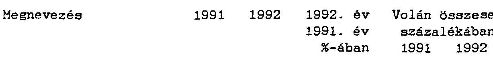

# Létszám, bér-kereset alakulása 

Teljes munkaidöben foglakoztatottak átlagos
létszáma, fö
$1580 \quad 820$
$51,9 \quad 3,7 \quad 2,8$
Atlagos havi bruttó munkabér, Ft/fö
$13852 \quad 19933$
$143,9 \quad 95,0 \quad 102,5$

Beruházás alakulása

Beruházás telj. értéke ebböl: építés
gép
ebbol: jármú
Az összes beruházásból:
saját forrás
$17,7 \quad 0,9$
11,4
7,0
6,3
0,4
1,8
0,1
17,7
0,9

---

Gazdálkodó szervezet megnevezése: VASI VOLAN RT
Szállitási teljesitmények

| Megnevezés | 1991 | 1992 | 1992. év 1991. év $\%$-ában | Volán összesen   százalékában 1991 |  |
| :--: | :--: | :--: | :--: | :--: | :--: |
| SZEMBLYSZALIITAS |  |  |  |  |  |
| Szállított utasok, millió fó |  |  |  |  |  |
| Helyi forgalomban | 26.9 | 22.0 | 81.8 | 2.8 | 2.5 |
| Helyközi forgalomban | 18.2 | 16.8 | 92.2 | 3.8 | 3.8 |
| összesen | 45.1 | 38.8 | 86.0 | 3.1 | 2.9 |

Utaskilométer teljesítmény, millió

| Helyi forgalomban | 91.9 | 74.8 | 81.4 | 2.6 | 2.3 |
| :-- | :--: | :--: | :--: | :--: | :--: |
| Helyközi forgalomban | 242.7 | 208.1 | 85.7 | 2.7 | 2.8 |
| összesen | 334.6 | 282.9 | 84.5 | 2.7 | 2.7 |

Atlagos utazási távolság, km
Eltérés az átlagtól
km
Helyi forgalomban $\quad 3.4 \quad 3.4 \quad 100.0 \quad-0.2-0.2$
Helyközi forgalomban $\quad 13.3 \quad 12.4 \quad 93.2 \quad-5.0-4.4$

# ARUSZALLITAS 

Szállított áruk tömege, ezer $t$

| Belföldi forgalomban | 1049 | 47 | 4.5 | 2.8 | 0.4 |
| :-- | --: | --: | --: | --: | --: |
| Nemzetközi forgalomban | 53 | 5 | 9.4 | 3.7 | 1.1 |
| összesen | 1102 | 52 | 4.7 | 2.9 | 0.4 |

Arutonnakilométer, millió

| Belföldi forgalomban | 59.3 | 2.7 | 4.6 | 7.2 | 1.2 |
| :-- | --: | --: | --: | --: | --: |
| Nemzetközi forgalomban | 39.5 | 1.8 | 4.6 | 4.6 | 0.4 |
| összesen | 98.8 | 4.5 | 4.6 | 5.9 | 0.7 |

---

Gazdálkodó szervezet megnevezése: VASI VOLAN RT
Személyszállitás üzemi mutatói

|  | 1991 | 1992 | 1992/1991   év \%-ában |
| :--: | :--: | :--: | :--: |
| Autóbuszállomány az év végén, db | 219 | 199 | 90,9 |
| Ebböl: a nullára futott állomány | 153 | 134 | 87,6 |
| Ozembehelyezett autóbuszok az év folyamán, db | - | - | - |
| Ebböl: az új autóbuszok száma | - | - | - |
| Kocsikilométer teljesítmény, ezer km | 11847 | 11359 | 95,9 |
| Ebböl: helyi | 2439 | 2344 | 96,1 |
| helyközi menetrendszeru | 9408 | 9015 | 95,8 |
| Féröhelykilométer, millió km | 885 | 851 | 96.2 |
| Ebböl: helyi | 234 | 225 | 96.2 |
| helyközi menetrendszeru | 651 | 626 | 96,2 |
| Helyi vonalhálózat, km | 94 | 94 | 100.0 |
| Helyi viszonylatok hossza, km | 227 | 227 | 100.0 |
| Helyi viszonylatok száma, db | 46 | 46 | 100.0 |
| Bekapcsolt helységek száma | 5 | 5 | 100.0 |
| Ebböl: városok | 4 | 4 | 100.0 |
| Helyi forgalomban közlekedett autóbuszok átlagos száma, db | 59 | 57 | 96,6 |
| Helyközi menetrendszeru vonalhálózat, km | 1226 | 1226 | 100.0 |
| Helyközi viszonylatok hossza, km | 2933 | 3014 | 102.8 |
| Helyközi viszonylatok száma, db | 94 | 95 | 101,1 |
| Bekapcsolt helységek száma, db | 254 | 254 | 100.0 |
| Gépkocsinapok száma összesen, ezer | 80 | 73 | 91,3 |
| Ebböl: fuvarban | 53 | 53 | 100.0 |

---

Gazdálkodó szervezet megnevezése:VERTES VOLAN RT
Vagyoni, pénzügyi adatok

| Megnevezés | 1991 1992 |  | 1992. év | Volán összesen |  |
| :-- | :--: | :--: | :--: | :--: | :--: |
|  | millió Ft |  | 1991. év   \%-ában | százalékában |  |
| A vagyon alakulása |  |  |  |  |  |
| Saját tőke | 525,5 | 510,2 | 97,1 | 2,8 | 2,9 |
| Jegyzett toke | 637,6 | 637,6 | 100,0 | 4,1 | 4,3 |
| ebböl: külföldi | - | - | - | - | - |
| Allami vagyon | 637,6 | 637,6 | 100,0 | .. | .. |

Az árbevétel és az eredmény alakulása

| Ert.nettó árbevétele | 1227,5 | 1398,7 | 113,9 | 3,3 | 3,7 |
| :--: | :--: | :--: | :--: | :--: | :--: |
| ebböl: export tev. | 130,5 | 6,1 | 4,7 | 2,7 | 0,2 |
| Alaptevékenység nettó |  |  |  |  |  |
| árbevétele | 1043,2 | 1068,3 | 102,4 | 3,3 | 3,6 |
| ebböl:személyszállitás | 881,7 | 1068,3 | 121,2 | 4,4 | 4,4 |
| árúszállitás | 151,5 | - | - | 1,5 | - |
| Eredmény |  |  |  |  |  |
| azemi | 53,5 | 1,1 | 2,1 |  |  |
| mérleg szerinti | $-59,9$ | $-10,7$ |  |  |  |

A költségek alakulása

| Osszes ráforditás | 1237,9 | 1460,5 | 118,0 | 3,1 | 3,8 |
| :--: | :--: | :--: | :--: | :--: | :--: |
| Osszes költség | 1195,4 | 1358,8 | 113,7 | 3,2 | 3,6 |
| ebbol: |  |  |  |  |  |
| Nettó anyagköltség | 473,8 | 506,4 | 106,9 | 3,6 | 3,9 |
| ebböl: energia | 326,4 | 332,1 | 101,7 | 3,5 | 4,2 |
| Bérköltség | 282,8 | 290,1 | 102,6 | 3,7 | 3,8 |
| TB járulék | 121,3 | 135,2 | 111,5 | 3,7 | 4,2 |
| Ertékcsökkenési leírás | 60,3 | 87,9 | 145,8 | 3,3 | 4,2 |

A támogatás alakulása

| Költségvetési támogatás | 283,8 | 396,4 | 139,7 | 5,3 | 4,9 |
| :--: | :--: | :--: | :--: | :--: | :--: |
| Ebböl:fogyasztói árkieg. | 281,7 | 394,1 | 139,9 | 5,3 | 4,8 |
| Egyéb támogatás | - | - | - | - | - |
| Támogatás összesen | 283,8 | 396,4 | 139,7 | 5,2 | 4,8 |

---

Gazdálkodó szervezet megnevezése:VERTES VOLAN RT
Létszám, bér, beruházási adatok
Megnevezés
19911992 1992. év Volán összesen
1991. év százalékában
$\%$-ában 19911992
Létszám, bér-kereset alakulása
Teljes munkaidöben fog-
lakoztatottak átlagos
létszáma, fö
13491174 87.0
$3,2 \quad 4,0$
Atlagos havi bruttó
munkabér, Ft/fö
1618519604 121.1 111.0 100.8

Beruházás alakulása

Beruházás telj. értéke
ebből: építés
gép
ebből: jármú
Az összes beruházásból:
saját forrás
1992
1992. Ft
Volán összesen
százalékában 1992
43,9
0,4
43,5
27,0
Az összes beruházásból:
saját forrás
43,9
2,2
0,3
2,4
2,1
2,2

---

Gazdalkodó szervezet megnevezése:VERTES VOLAN RT
Szállitási teljesítmények

| Megnevezés | 1991 | 1992 | 1992. év 1991. év $\%$-ában | Volán összesen   százalékában 1991 | összesen 1992 |
| :--: | :--: | :--: | :--: | :--: | :--: |

# SZKMALYSZALLITAS 

Szállitott utasok, millió fo

| Helyi forgalomban | 53.4 | 47.7 | 89.3 | 5.5 | 5.4 |
| Helyközi forgalomban | 23.6 | 23.1 | 97.9 | 4.9 | 5.2 |
| összesen | 77.0 | 70.8 | 91.9 | 5.3 | 5.3 |

Utaskilométer teljesítmény, millió

| Helyi forgalomban | 212.6 | 190.4 | 89.6 | 6.0 | 5.9 |
| :-- | :-- | :-- | :-- | :-- | :-- |
| Helyközi forgalomban | 414.9 | 367.2 | 88.5 | 4.7 | 4.9 |
| összesen | 627.5 | 557.6 | 88.9 | 5.1 | 5.2 |

Atlagos utazási távolság
Eltérés az átlagtól
km
Helyi forgalomban 4.0 4.0 100.0 0.4 0.4
Helyközi forgalomban 17.6 15.9 90.3 -0.7 -0.9

## ARUSZALLITAS

Szállitott áruk tömege, ezer $t$

| Belföldi forgalomban | 78 | 24 | 30.8 | 0.2 | 0.2 |
| :-- | :-- | :-- | :-- | :-- | :-- |
| Nemzetközi forgalomban | 22 | - | - | 1.5 | - |
| összesen | 100 | 24 | 24.0 | 0.3 | 0.2 |

Arutonnakilométer, millió

| Belföldi forgalomban | 4.6 | 0.7 | 15.2 | 0.6 | 0.3 |
| :-- | :-- | :-- | :-- | :-- | :-- |
| Nemzetközi forgalomban | 25.0 | - | - | 2.9 | - |
| összesen | 29.6 | 0.7 | 2.4 | 1.8 | 0.1 |

---

Gazdálkodó szervezet megnevezése:VáRTES VOLAN Rt
Személyesállitás üzeni mutatói

|  | 1991 | 1992 | $\begin{gathered} 1992 / \\ 1991 . \text { év \% } \end{gathered}$ |
| :--: | :--: | :--: | :--: |
| Autóbuszállomány az év végén, db | 314 | 336 | 107.0 |
| Ebböl: a nullára futott állomány | 215 | 238 | 110.7 |
| Üzembehelyezett autóbuszok az év folyamán, db | 2 | 25 | $\begin{gathered} 12.5- \\ \text { szeres } \end{gathered}$ |
| Ebböl: az új autóbuszok száma | - | - | - |
| Kocsikilométer teljesítmény, ezer km Ebböl: helyi helyközi menetrendszerü | $\begin{array}{r} 18854 \\ 5524 \\ 10019 \end{array}$ | $\begin{array}{r} 17926 \\ 5049 \\ 10144 \end{array}$ | $\begin{array}{r} 95.1 \\ 91.4 \\ 101.2 \end{array}$ |
| Féröhelykilométer, millió km Ebböl: helyi helyközi menetrendszerü | $\begin{array}{r} 1600 \\ 607 \\ 765 \end{array}$ | $\begin{array}{r} 1365 \\ 455 \\ 726 \end{array}$ | $\begin{array}{r} 85.3 \\ 75.0 \\ 94.9 \end{array}$ |
| Helyi vonalhálózat, km Helyi viszonylatok hossza, km Helyi viszonylatok száma, db | $\begin{array}{r} 174 \\ 367 \\ 44 \end{array}$ | $\begin{array}{r} 180 \\ 373 \\ 46 \end{array}$ | $\begin{array}{r} 103.4 \\ 101.6 \\ 104.5 \end{array}$ |
| Bekapcsolt helységek száma Ebböl: városok | $\begin{array}{r} 8 \\ 6 \end{array}$ | $\begin{array}{r} 10 \\ 6 \end{array}$ | $\begin{array}{r} 125.0 \\ 100.0 \end{array}$ |
| Helyi forgalomban közlekedett autóbuszok átlagos száma, db | 57 | 55 | 96.5 |
| Helyközi menetrendszerü vonalhálózat, km | 873 | 891 | 102.1 |
| Helyközi viszonylatok hossza, km | 2787 | 3118 | 111.9 |
| Helyközi viszonylatok száma, db | 72 | 75 | 104.2 |
| Bekapcsolt helységek száma, db | 102 | 106 | 103.9 |
| Gépkocsinapok száma összesen, ezer Ebböl: fuvarban | $\begin{array}{r} 114 \\ 85 \end{array}$ | $\begin{array}{r} 121 \\ 83 \end{array}$ | $\begin{array}{r} 106.1 \\ 97.6 \end{array}$ |

---

Gazdálkodó szervezet megnevezése: VOLANEUSZ RT
Vagyoni, pénzügyi adatok

| Megnevezés | $1991 \quad 1992$   millió Ft |  | 1992. év   1991. év   \%-ában | Volán összesen   százalékában   1991 |  |
| :-- | :--: | :--: | :--: | :--: | :--: |
| A vagyon alakulása |  |  |  |  |  |
| Saját tőke | 1692,2 | 1707,9 | 100,9 | 8,9 | 9,7 |
| Jegyzett tőke   ebböl: külföldi | 1400,1 | 1400,1 | 100,0 | 9,1 | 9,5 |
| Allami vagyon | 1400,1 | 1400,1 | 100,0 | $\ldots$ | $\ldots$ |

Az árbévétel és az eredmény alakulása

| ért. nettó árbevétele | 3337,8 | 3964,3 | 118,8 | 8,9 | 10,5 |
| :-- | :-- | :-- | :-- | :-- | --: |
| ebböl: export tev. | 191,8 | 186,9 | 97,4 | 4,0 | 6,0 |
| Alaptevékenység nettó |  |  |  |  |  |
| árbevétele | 2835,0 | 3681,2 | 129,8 | 9,0 | 12,6 |
| ebböl:személyszállítás | 2835,0 | 3681,2 | 129,8 | 14,3 | 15,1 |
| árászállítás | - | - | - | - | - |
| Eredmény |  |  |  |  |  |
| üzemi | 64,4 | 36,3 | 56,4 |  |  |
| mérleg szerinti | 33,6 | 17,7 | 52,7 |  |  |

# A költségek alakulása 

| Osszes ráfordítás | 3504,9 | 3954,5 | 112,8 | 9,0 | 10,2 |
| :-- | :-- | :-- | :-- | :-- | --: |
| Osszes költség | 3387,9 | 3857,4 | 113,9 | 9,0 | 10,3 |
| ebböl: |  |  |  |  |  |
| Nettó anyagköltség | 1582,8 | 1649,1 | 104,2 | 12,1 | 12,6 |
| ebböl: energia | 883,3 | 1005,1 | 113,8 | 9,5 | 12,7 |
| Bérköltség | 844,4 | 931,6 | 110,3 | 11,0 | 12,1 |
| TB járulék | 361,8 | 420,2 | 116,1 | 10,9 | 12,9 |
| Értékcsökkenési leírás | 204,5 | 241,3 | 118,0 | 11,1 | 11,4 |

A támogatás alakulása

| Költségvetési támogatás | 635,7 | 1074,3 | 169,0 | 11,9 | 13,2 |
| :--: | :--: | :--: | :--: | :--: | :--: |
| Ebböl: fogyasztói árkieg. | 635,7 | 1074,3 | 169,0 | 11,9 | 13,2 |
| Egyéb támogatás | 4,4 | - | - | 5,3 | - |
| Támogatás összesen | 640,1 | 1074,3 | 167,8 | 11,8 | 12,9 |

---

Gazdálkodó szervezet:VOLANBUSZ RT
Létszám, bér, beruházási adatok
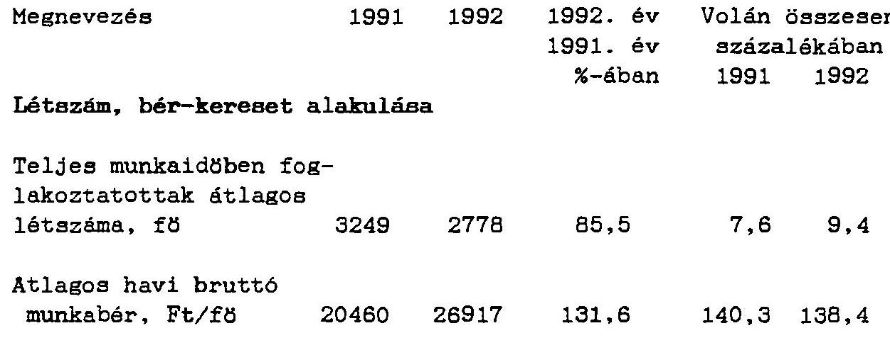

Beruházás alakulása

| Megnevezés | 1992   millió Ft | Volán összesen   százalékában |
| :-- | :--: | :--: |
| Beruházás telj. értéke | 293,7 | 14,7 |
| ebböl: épités | 67,7 | 41,8 |
| gép | 208,0 | 10,6 |
| ebböl:jármú | 165,0 | 12,7 |

Az összes beruházásból:
saját forrás
14,8

---

Gazdálkodó szervezet megnevezése:VOLANBUSZ RT
Szállítási teljesítmények

| Megnevezés | 1991 | 1992 | 1992. év 1991. év $\%$-ában | Volán összesen   azázalékában 1991 |  |
| :--: | :--: | :--: | :--: | :--: | :--: |
| SZEMBLYSZALLITAS |  |  |  |  |  |
| Szállitott utasok, millió fő |  |  |  |  |  |
| Helyi forgalomban | 32,6 | 27,3 | 83,7 | 3,3 | 3,1 |
| Helyközi forgalomban | 75,0 | 72,3 | 96,4 | 15,5 | 16,4 |
| Osszesen | 107,6 | 99,6 | 92,6 | 7,4 | 7,5 |

Utaskilométer teljesítmény, millió

| Helyi forgalomban | 123,0 | 100,5 | 81,7 | 3,5 | 3,1 |
| :-- | :--: | :--: | :--: | :--: | :--: |
| Helyközi forgalomban | 1609,7 | 1545,6 | 96,0 | 18,2 | 20,8 |
| Osszesen | 1732,7 | 1646,1 | 95,0 | 14,0 | 15,5 |

| Atlagos utazási távolság, km | Eltérés az átlagtól |
| :-- | :-- |
| Helyi forgalomban | 3,8 3,7 97,4 0,2 0,1 |
| Helyközi forgalomban | 21,5 21,4 99,5 3,2 4,6 |

# ABUSZALLITAS 

Szállított áruk tömege, ezer t
Belföldi forgalomban
Nemzetközi forgalomban
Oszesen

Aratonnakilométer, millió
Belföldi forgalomban
Nemzetközi forgalomban
Oszzesen

---

Gazdálkodó szervezet megnevezése: VOLANBUSZ RT
Személyszállitás

|  | 1991 | 1992 | 1992/1991   év \%-ában |
| :--: | :--: | :--: | :--: |
| Autóbuszállomány az év végén, db | 876 | 838 | 95,7 |
| Ebböl: a nullára futott állomány | 587 | 603 | 102,7 |
| Üzembehelyezett autóbuszok az év folyamán, db | 18 | $35 *$ | 194,4 |
| Ebböl: az új autóbuszok száma | 15 | $7 *$ | 46,7 |
| Kocsikilométer teljesítmény, ezer km | 63831 | 66527 | 104,2 |
| Ebböl: helyi | 3618 | 2917 | 80,6 |
| helyközi menetrendszerü | 50855 | 56656 | 111,4 |
| Féröhelykilométer, millió km | 4539 | 4719 | 104,0 |
| Ebböl: helyi | 258 | 229 | 88,8 |
| helyközi menetrendszerü | 3709 | 4086 | 110,2 |
| Helyi vonalhálózat, km | 409 | ... | ... |
| Helyi viszonylatok hossza, km | 596 | 315 | 52,9 |
| Helyi viszonylatok száma, db | 104 | 87 | 83,7 |
| Bekapcsolt helységek száma | 37 | 28 | 75,7 |
| Ebböl: városok | 12 | 10 | 83,3 |
| Helyi forgalomban közlekedett autóbuszok átlagos száma, db | 71 | 70 | 98,6 |
| Helyközi menetrendszerü vonalhálózat, km | 5371 | 5371 | 100,0 |
| Helyközi viszonylatok hossza, km | .. | .. | .. |
| Helyközi viszonylatok száma, db | 246 | 270 | 109,8 |
| Bekapcsolt helységek száma, db** | 176 | 176 | 100,0 |
| Gépkocsinapok száma összesen, ezer | 322 | 318 | 98,8 |
| Ebböl: fuvarban | 236 | 219 | 92,8 |

* Ebböl: lízingelt 20 db , ebböl új 2 db.
** Megyei adat.

---

Gazdálkodó szervezet megnevezése:ZALA VOLAN RT
Vagyoni, pénzügyi adatok

| Megnevezés | 1991 1992 |  | 1992. év | Volán összesen |  |
| :-- | :--: | :--: | :--: | :--: | :--: |
|  | millió Ft |  | 1991. év | százalékában |  |
|  |  |  | $\%$-ában | 1991 | 1992 |
| A vagyon alakulása |  |  |  |  |  |
| Saját tőke | 1048,3 | 1065,1 | 101,6 | 5,5 | 6,0 |
| Jegyzett tőke | 439,6 | 439,6 | 100,0 | 2,9 | 3,0 |
| ebböl: külföldi | - | - | - | - | - |
| Allami vagyon | 439,6 | 439,6 | 100,0 | .. | .. |

Az árbévétel és az eredmény alakulása

| Ert.nettó árbevétele | 2098,7 | 1593,0 | 75,9 | 5,6 | 4,2 |
| :-- | :--: | :--: | :--: | :--: | :--: |
| ebböl: export tev. | - | - | - | - | - |
| Alaptevékenyśég nettó |  |  |  |  |  |
| árbevétele | 911,2 | 1540,4 | 169,1 | 2,9 | 5,3 |
| ebböl:személyszállitás | 885,8 | 1128,9 | 127,4 | 4,5 | 4,6 |
| árúszállitás | 25,4 | 411,5 | 16-szoros | 0,2 | 8,2 |
| Eredmény |  |  |  |  |  |
| azemi | -23,6 | 13,3 |  |  |  |
| mérleg szerinti | 2,7 | 14,8 | 548,1 |  |  |

A költségek alakulása

| Osszes ráfordítás | 2125,1 | 1837,6 | 86,5 | 5,4 | 4,8 |
| :-- | :--: | :--: | :--: | :--: | :--: |
| Osszes költség | 2075,6 | 1989,5 | 95,9 | 5,5 | 5,3 |
| ebböl: |  |  |  |  |  |
| Nettó anyagköltség | 474,7 | 669,4 | 141,0 | 3,6 | 5,1 |
| ebböl: energia | 299,7 | 376,4 | 125,6 | 3,2 | 4,7 |
| Bérköltség | 285,6 | 360,6 | 126,3 | 3,7 | 4,7 |
| TB járulék | 122,2 | 160,4 | 131,3 | 3,7 | 4,9 |
| Ertékcsökkenési leírás | 133,1 | 126,1 | 94,7 | 7,2 | 6,0 |

A támogatás alakulása

| Költségvetési támogatás | 237,9 | 363,1 | 152,6 | 4,5 | 4,4 |
| :-- | :--: | :--: | :--: | :--: | :--: |
| Ebböl:fogyasztói árkieg. | 235,9 | 363,1 | 153,9 | 4,4 | 4,5 |
| Egyéb támogatás | 2,0 | - | - | 2,4 | - |
| Támogatás összesen | 237,9 | 363,1 | 152,6 | 4,4 | 4,4 |

---

Gazdálkodó szervezet megnevezése:ZALA VOLAN RT
Létszám, bér, beruházási adatok
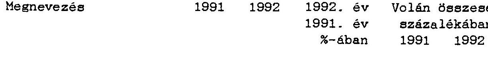

# Létszám, bér-kereset alakulása 

Teljes munkaidöben foglakoztatottak átlagos
létszáma, f8
$1594 \quad 1547$
$97,1 \quad 3,7 \quad 5,2$

Atlagos havi bruttó munkabér, Ft/f8
$11962 \quad 18821$
$157,3 \quad 82,0 \quad 96,8$

## Beruházás alakulása

|  | 1992   millió Ft | Volán összesen   százalékában |
| :-- | :--: | :--: |
| Beruházás telj. értéke   ebbol: építés   gép   ebbol: jármú | 90,4   1,5   74,5   67,3 | 4,5   0,9   4,1   5,2 |
| Az összes beruházásból:   saját forrás | 90,4 | 4,6 |

---

Gazdálkodó szervezet megnevezése: ZALA VOLAN RT
Szállitási teljesitmények

| Megnevezés | 1991 | 1992 | 1992. év | Volán összesen |  |
| :-- | :-- | :-- | :-- | :-- | :-- |
|  |  |  | 1991. év | százalékában |  |
|  |  |  | \%-ában | 1991 | 1992 |

# SZEMBLYSZALLITAS 

Szállitott utasok, millió fő

| Helyi forgalomban | 45,9 | 42,5 | 92,6 | 4,7 | 4,8 |
| :-- | :-- | :-- | :-- | :-- | :-- |
| Helyközi forgalomban | 23,4 | 23,8 | 101,7 | 4,8 | 5,4 |
| összesen | 69,3 | 66,3 | 95,7 | 4,7 | 5,0 |

Utaskilométer teljesítmény, millió

| Helyi forgalomban | 130,3 | 121,4 | 93,2 | 3,7 | 3,8 |
| :-- | :-- | :-- | :-- | :-- | :-- |
| Helyközi forgalomban | 464,2 | 401,7 | 86,5 | 5,3 | 5,4 |
| összesen | 594,5 | 523,1 | 88,0 | 4,8 | 4,9 |

Atlagos utazási távolság, km
Eltérés az átlagtól
km
Helyi forgalomban 2,8 2,9 103,6 $-0,8 \quad-0,7$
Helyközi forgalomban 19,8 16,9 85,4 1,5 0,1

## ARUSZALLITAS

Szállitott áruk tömege, ezer $t$

| Belföldi forgalomban | 73 | 133 | 182,2 | 0,2 | 1.1 |
| :-- | --: | --: | --: | --: | --: |
| Nemzetközi forgalomban | 6 | - | - | 0,4 | - |
| összesen | 79 | 133 | 168,4 | 0,2 | 1.1 |

Arutonnakilométer, millió

| Belföldi forgalomban | 7,0 | 14,0 | 200,0 | 0,9 | 6,1 |
| :-- | --: | --: | --: | --: | --: |
| Nemzetközi forgalomban | 1,0 | - | - | 0,1 | - |
| összesen | 8,0 | 14,0 | 175,0 | 0,5 | 2,1 |

---

Gazdálkodó szervezet megnevezése: ZALA VOLAN RT
Személyesállitás azemi mutatói

|  | 1991 | 1992 | $\begin{aligned} & 1992 / 1991 \\ & \text { év \%-ában } \end{aligned}$ |
| :--: | :--: | :--: | :--: |
| Autóbuszállomány az év végén, db | 316 | 312 | 98.7 |
| Ebböl: a nullára futott állomány | 34 | 62 | 182.4 |
| Uzembehelyezett autóbuszok az év folyamán, db | 5 | 11 | 220.0 |
| Ebböl: az új autóbuszok száma | - | 8 | - |
| Kocsikilométer teljesítmény, ezer km | 20804 | 20976 | 100.8 |
| Ebböl: helyi | 3478 | 3497 | 100.5 |
| helyközi menetrendszeru | 16289 | 16914 | 103.8 |
| Féröhelykilométer, millió km | 1505 | 1468 | 97.5 |
| Ebböl: helyi | 338 | 337 | 99.7 |
| helyközi menetrendszeru | 1018 | 1036 | 101.8 |
| Helyi vonalhálózat, km | 177 | 177 | 100.0 |
| Helyi viszonylatok hossza, km | 434 | 431 | 99.3 |
| Helyi viszonylatok száma, db | 76 | 76 | 100.0 |
| Bekapcsolt helységek száma | 5 | 5 | 100.0 |
| Ebböl: városok | 5 | 5 | 100.0 |
| Helyi forgalomban közlekedett autóbuszok átlagos száma, db | 75 | 75 | 100.0 |
| Helyközi menetrendszeru vonalhálózat, km | 2141 | 2600 | 121.4 |
| Helyközi viszonylatok hossza, km | .. | .. | .. |
| Helyközi viszonylatok száma, db | .. | .. | .. |
| Bekapcsolt helységek száma, db | 255 | 255 | 100.0 |
| Gépkocsinapok száma összesen, ezer | 119 | 114 | 95.8 |
| Ebböl: fuvarban | 86 | 82 | 95.3 |

---

Gazdálkodó szervezet megnevezése:A VIZSGALT 6 VOLAN SZERVEZET OSSZESEN
Vagyoni, pénzügyi adatok

| Megnevezés | 19911992 |  | 1992. év | Volán összesen |  |
| :-- | :--: | :--: | :--: | :--: | :--: |
|  | millió Ft |  | 1991. év | százalékában |  |
|  |  |  | \%-ában | 1991 | 1992 |

A vagyon alakulása

| Saját toke | 5220,5 | 5229,3 | 100,2 | 27,3 | 29,7 |
| :-- | --: | --: | --: | --: | --: |
| Jegyzett toke | 4244,1 | 4244,1 | 100,0 | 27,5 | 28,7 |
| ebbol: külföldi | - | - | - | - | - |
| Allami vagyon | 4244,1 | 4244,1 | 100,0 | $\ldots$ | $\ldots$ |

Az ábevétel és az eredmény alakulása

| Ert.nettó árbevétele | 11711,6 | 12124,3 | 103,5 | 31,2 | 32,0 |
| :-- | --: | --: | --: | --: | --: |
| ebböl: export tev. | 1058,1 | 766,9 | 72,5 | 22,2 | 24,5 |
| Alaptevékenység nettó |  |  |  |  |  |
| árbevétele | 9115,5 | 10645,0 | 116,8 | 29,0 | 36,3 |
| ebböl:személyszállitás | 7435,5 | 9546,7 | 128,4 | 37,4 | 39,2 |
| árúszállitás | 1670,0 | 1098,3 | 65,8 | 16,0 | 22,2 |
| Eredmény |  |  |  |  |  |
| üzemi | 226,8 | 252,6 | 111,4 |  |  |
| mérleg szerinti | 9,8 | 34,0 | 346,9 |  |  |

A költségek alakulása

| Osszes ráforditás | 11933,6 | 12393,3 | 103,9 | 30,6 | 32,3 |
| :-- | --: | --: | --: | --: | --: |
| Osszes költség | 11582,5 | 12124,5 | 104,7 | 30,6 | 32,3 |
| ebböl: | 4445,0 | 4888,1 | 110,0 | 34,1 | 37,4 |
| Nettó anyagköltség | 2853,5 | 2944,5 | 103,2 | 30,7 | 37,1 |
| ebböl: energia | 2445,0 | 2632,7 | 107,7 | 31,9 | 34,3 |
| Bérköltség | 1048,4 | 1179,4 | 112,5 | 31,6 | 36,3 |
| TB járulék | 658,5 | 751,1 | 114,0 | 35,7 | 35,6 |
| Ertékcsökkenési leírás |  |  |  |  |  |

A támogatás alakulása

| Költségvetési támogatás | 1966,8 | 3045,4 | 154,8 | 36,9 | 37,3 |
| :-- | --: | --: | --: | --: | --: |
| ebböl:fogyasztói árkieg. | 1955,2 | 3030,6 | 155,0 | 36,6 | 37,2 |
| Egyéb támogatás | 6,4 | 11,4 | 178,1 | 7,8 | 7,7 |
| Támogatás összesen | 1971,3 | 3056,8 | 155,1 | 36,4 | 36,8 |

---

Gazdálkodó szervezet megnevezése:A VIZSGALT 6 VOLAN SZERVEZET OSSZESER

Létszám, bér, beruházási adatok
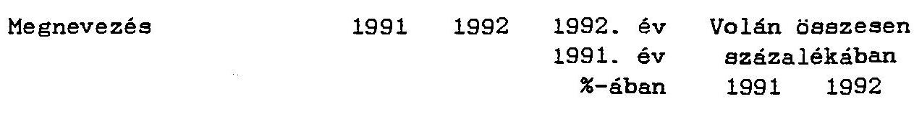

Létszám, bér-kereset alakulása
Teljes munkaidöben foglakoztatottak átlagos
létszáma, fo
$12276 \quad 10149$
$82,7 \quad 28,8 \quad 34,2$
Atlagos havi bruttó munkabér, Ft/fö
$15584 \quad 20735$
$133,1 \quad 109,4 \quad 106,5$

Beruházás alakulása

Beruházás telj. értéke ebbol: építés
gép
ebbol:jármü
Az összes beruházásból:
saját forrás
$1992$
millió Ft
937.4
92.4
829.1
494.6
$1992$
Volán összesen
százalékában
1992
$46,9$
$57,1$
$46,1$
38.1

937,4
$47,3$

---

Gazdálkodó szervezet megnevezése:A VIZSGALT 6 VOLAN SZERVEZET OSSZESEN
Szállítási teljesítmények

| Megnevezés | 1991 | 1992 | 1992. év 1991. év $\%$-ában | Volán összesen   százalékában 1991 |  |
| :--: | :--: | :--: | :--: | :--: | :--: |
| SZEMBLYSZALLITAS |  |  |  |  |  |
| Szállított utasok, millió fô |  |  |  |  |  |
| Helyi forgalomban | 299.4 | 271.8 | 90.8 | 30.7 | 30.5 |
| Helyközi forgalomban | 194.6 | 189.4 | 97.3 | 40.3 | 42.9 |
| Oszesen | 494.0 | 461.2 | 93.4 | 33.9 | 34.6 |

Utaskilométer teljesítmény, millió

| Helyi forgalomban | 1060.7 | 959.8 | 90.5 | 30.0 | 29.9 |
| :-- | :-- | :-- | :-- | :-- | :-- |
| Helyközi forgalomban | 3740.1 | 3491.3 | 93.3 | 42.3 | 47.0 |
| Oszesen | 4800.8 | 4451.1 | 92.7 | 38.8 | 41.9 |

Atlagos utazási távolság
Eltérés az átlagtól
km
Helyi forgalomban $\quad 3.5 \quad 3.5 \quad 100.0 \quad-0.1-0.1$
Helyközi forgalomban $\quad 18.2 \quad 17.2 \quad 94.5 \quad-0.1 \quad 0.4$

# ARUSZALLITAS 

Szállított áruk tömege, ezer $t$

| Belföldi forgalomban | 4622 | 1361 | 29.4 | 12.5 | 11.6 |
| :-- | --: | --: | --: | --: | --: |
| Nemzetközi forgalomban | 201 | 107 | 53.2 | 13.9 | 23.8 |
| Oszesen | 4823 | 1468 | 30.4 | 12.7 | 12.1 |

Arutonnakilométer, millió

| Belföldi forgalomban | 146.7 | 40.7 | 27.7 | 17.8 | 17.9 |
| :-- | --: | --: | --: | --: | --: |
| Nemzetközi forgalomban | 213.5 | 127.8 | 59.9 | 24.8 | 30.0 |
| Oszesen | 360.2 | 168.5 | 46.8 | 21.4 | 25.8 |

---

Gazdálkodó szervezet megnevezése:A VIZSGALT 6 VOLAN SZERVEZET OSSZESEN

# Személyszállitás üzeni mutatói 

|  | 1991 | 1992 | $\begin{aligned} & 1992 / 1991 \\ & \text { év \%-ában } \end{aligned}$ |
| :--: | :--: | :--: | :--: |
| Autóbuszállomány az év végén, db | 2454 | 2385 | 97,2 |
| Ebböl: a nullára futott állomány | 1405 | 1477 | 105,1 |
| Uzembehelyezett autóbuszok az év folyamán, db | 34 | 89 | 261,8 |
| Ebböl: az új autóbuszok száma | 21 | 17 | 81,0 |
| Kocsikilométer teljesítmény, ezer km | 165087 | 166472 | 100,8 |
| Ebböl: helyi | 28885 | 27052 | 93,7 |
| helyközi menetrendszeru | 117028 | 124613 | 106,5 |
| Féröhelykilométer, millió km | 12632 | 12507 | 99,0 |
| Ebböl: helyi | 2856 | 2669 | 93,5 |
| helyközi menetrendszeru | 8483 | 8909 | 105,0 |
| Helyi vonalhálózat, km | 1245 | 900 | 72,3 |
| Helyi viszonylatok hossza, km | 2557 | 2288 | 89,5 |
| Helyi viszonylatok száma, db | 406 | 389 | 95,8 |
| Bekapcsolt helységek száma | 75 | 67 | 89,3 |
| Ebböl: városok | 37 | 35 | 94,6 |
| Helyi forgalomban közlekedett autóbuszok átlagos száma, db | 492 | 488 | 99,2 |
| Helyközi menetrendszerü vonal-hálózat, km | 11996 | 12512 | 104,3 |
| Helyközi viszonylatok hossza, km | .. | .. | .. |
| Helyközi viszonylatok száma, db | .. | .. | .. |
| Bekapcsolt helységek száma, db | 1234 | 1238 | 100,3 |
| Gépkocsinapok száma összesen, ezer | 900 | 883 | 98.1 |
| Ebböl: fuvarban | 658 | 529 | 80,4 |

---

Gazdálkodó szervezet megnevezése:OSSZES VOLAN SZERVEZET
(a mellékelt névsor szerint)
Vagyoni, pénzügyi adatok (előzetes adatok)

| Megnevezés | 1991 | 1992 | 1992. év |
| :-- | :-- | :-- | :-- |
|  | millió | Ft | 1991. év |
| A vagyon alakulása |  |  |  |
| Saját tőke | 19095.7 | 17632.6 | 92.3 |
| Jegyzett tőke | 15424.3 | 14770.9 | 95.8 |
| ebbol: külföldi | - | 40.0 | - |
| Allami vagyon | $\ldots$ | $\ldots$ | $\ldots$ |

Az ábevetel és az eredmény alakulása

| Ert.nettó árbevétele | 37581.2 | 37892.0 | 100.8 |
| :-- | --: | --: | --: |
| ebbol: export tev. | 4759.4 | 3130.7 | 65.9 |
| Alaptevékenység nettó |  |  |  |
| árbevétele | 31410.4 | 29327.1 | 93.4 |
| ebbol:személyszállitás | 19865.8 | 24368.8 | 122.7 |
| áraszállitás | 10416.6 | 4958.3 | 47.6 |
| Eredmény |  |  |  |
| azemi | 71.8 | -25.4 |  |
| mérleg szerinti | -554.9 | -397.3 |  |
| A költségek alakulása |  |  |  |
| összes ráforditás | 38984.6 | 38367.1 | 98.6 |
| összes költség | 37794.8 | 37585.2 | 99.4 |
| ebbol: |  |  |  |
| Nettó anyagköltség | 13047.9 | 13083.5 | 100.3 |
| ebbol: energia | 9284.2 | 7934.8 | 85.5 |
| Bérköltség | 7664.9 | 7677.5 | 100.2 |
| TB járulék | 3320.3 | 3250.7 | 97.9 |
| Ertékcsökkenési leírás | 1843.7 | 2112.0 | 114.6 |
| A támogatás alakulása |  |  |  |
| Költségvetési támogatás | 5336.4 | 8165.7 | 153.0 |
| ebböl:fogyasztói árkieg. | 5336.4 | 8137.6 | 153.0 |
| Egyéb támogatás | 82.4 | 147.1 | 178.5 |
| Támogatás összesen | 5418.8 | 8312.8 | 153.4 |

---

Gazdálkodó szervezet megnevezése: VOLAN SZERVEZET OSSZRSKK
(a mellékelt névsor szerint)
Létszám, bér, beruházási adatok(elözetes adatok)
Megnevezés
$1991 \quad 1992 \quad 1992$. év
$1991 . \dot{\text { év }}$
$\%$-ában
Létszám, bér-kereset alakulása
Teljes munkaidöben foglakoztatottak átlagos
létszáma, f8
$42650 \quad 29698 \quad 69,6$
Atlagos havi bruttó
munkabér, Ft/f8
$14584 \quad 19446 \quad 133,3$

Beruházás alakulása

Beruházás telj. értéke
ebből: építés
gép
ebből:jármú
Az összes beruházásból:
saját forrás
$1997,2$
161,9
$1798,8 \quad \cdots$
$1295,6 \quad \cdots$
1979,9

---

Gazdálkodó szervezet megnevezése: OSSZRS VOLAN SZERVEZET
(a mellékelt névsor szerint)
Szállítási teljesítmények

Megnevezés
$1991 \quad 1992 \quad 1992$. év
$1991 . \quad$ év
$\%$-ában

# SZEMBLYSZALLITAS 

Szállitott utasok, millio fo

| Helyi forgalomban | 976.2 | 890.0 | 91.2 |
| :-- | --: | --: | --: |
| Helykठzi forgalomban | 483.0 | 441.6 | 91.4 |
| Oszzesen | 1459.2 | 1331.6 | 91.3 |

Utaskilométer teljesítmény, millio

| Helyi forgalomban | 3530.0 | 3209.8 | 90.9 |
| :-- | --: | --: | --: |
| Helykठzi forgalomban | 8838.5 | 7425.4 | 84.0 |
| Oszzesen | 12368.5 | 10635.2 | 86.0 |

Atlagos utazási távolság, km

| Helyi forgalomban | 3.6 | 3.6 | 100.0 |
| :-- | --: | --: | --: |
| Helykठzi forgalomban | 18.3 | 16.8 | 91.8 |

## ARUSZALLITAS

Szállított áruk tömege, ezer t

| Belföldi forgalomban | 36936 | 11683 | 31.6 |
| :-- | --: | --: | --: |
| Nemzetközi forgalomban | 1444 | 450 | 31.2 |
| Oszzesen | 38080 | 12133 | 31.9 |

Arutonnakilométer, millió

| Belföldi forgalomban | 822 | 228 | 27.7 |
| :-- | --: | --: | --: |
| Nemzetközi forgalomban | 862 | 426 | 49.4 |
| Oszzesen | 1684 | 654 | 38.8 |

---

Az összesitésben szerepl8 Volán vállalatok:
Agria Volán
Ajkai Volán
Alba Volán
Balaton Volán
Balatonfüredi Volán
Bács Volán
Betvol Trans Kft.
Borsod Volán
Dudari Volán
Gemenc Volán
Hajdú Volán
Hatvani Volán
Jászkun Volán
Kapos Volán
Kisalföld Volán
Körös Volán
Kunság Volán
Mátra Volán
Nógrád Volán
Pannon Volán
Pannsped Kft.
Pápai Volán
Sumegi Volán
Szabolcs Volán
Tapolcai Volán
Tisza Volán
Transtank Kft.
Vasi Volán
Várpalotai Volán
Vértes Volán
Volánbusz
Volán-Metál Kanizsatrans Kft.
Volán Tefu Rt.
Volán Tömegaru
Zala Volán
Zala Volán Epkersped Kft.
Zala Volán Intertrans Kft.

---

| 1 |
| :-- | :-- |
| 1 |
| 1 |
| 1 |
| 1 |
| 1 |
| 1 |
| 1 |
| 1 |
| 1 |
| 1 |
| 1 |
| 1 |
| 1 |
| 1 |
| 1 |
| 1 |
| 1 |
| 1 |

III. Mérleg adatok
I
I
I
I
I
I
I
I
I
I
I
I

---

Alba Volán

|  Mérleg eszközök, források |  |  |  |  |  | (eszer Ft)  |
| --- | --- | --- | --- | --- | --- | --- |
|  Sor. | Megnevezés | 1991. | 1991. cég- | 1992. | 1992. vagyonmérleg | 1992. cég-  |
|   |  | rendező | bírósági | adómérleg | könyvit, átért. | bírósági  |
|   |  | mérleg | letéti a. |  | érték | letéti a.  |
|  1 | A. Befektetett eszközök | 696860 | 696860 | 628939 | 628939 | 1335626  |
|  2 | I. IMMATERIALIS JAVÁK | 4382 | 4382 | 5972 | 5972 | 5758  |
|  3 | Vagyoni értékű jogok | 0 | 0 | 0 | 0 | 0  |
|  4 | Özleti értékủ jogok | 0 | 0 | 0 | 0 | 0  |
|  5 | Szellemi termékek | 4382 | 4382 | 2472 | 2472 | 2258  |
|  6 | Elzérleti fejlesztés aktivált értéke | 0 | 0 | 0 | 0 | 0  |
|  7 | Alapítás-átsszervesés aktivált értéke | 0 | 0 | 3500 | 3500 | 3500  |
|  8 | II. TÁRGTI KSIKOSOK | 579185 | 579195 | 515837 | 515837 | 1244568  |
|  9 | Ingatlanok | 273152 | 273152 | 268917 | 268917 | 878578  |
|  10 | Műszaki berendesések, gépek, jármóvek | 264080 | 264080 | 214884 | 214884 | 319583  |
|  11 | Egyéb berendesések, felzszerelések, jármóvek | 40346 | 40346 | 28563 | 28563 | 42944  |
|  12 | Beruházások | 1617 | 1617 | 1036 | 1036 | 1036  |
|  13 | Beruházásokra adott előlegek | 0 | 0 | 2437 | 2437 | 2437  |
|  14 | III. BEFEKTETETT PERSZOTT KSIKOSOK | 107283 | 107283 | 107130 | 107130 | 85280  |
|  15 | Részesedések | 69684 | 69684 | 67984 | 67984 | 47634  |
|  16 | Értékpapírok | 155 | 155 | 146 | 146 | 146  |
|  17 | Adott kölcsönök | 37444 | 37444 | 39000 | 39000 | 37500  |
|  18 | Hosszú lejáratú bankbetétek | 0 | 0 | 0 | 0 | 0  |
|  19 | B. Forgóeszközök | 384334 | 384334 | 330499 | 330499 | 238831  |
|  20 | I. KASZLATKK | 122208 | 122208 | 98271 | 98271 | 94470  |
|  21 | Anyagok | 118365 | 118365 | 95824 | 95824 | 92023  |
|  22 | Aruk | 83 | 83 | 50 | 50 | 50  |
|  23 | Készletekre adott előlegek | 3059 | 3059 | 1696 | 1696 | 1696  |
|  24 | Állatok | 701 | 701 | 701 | 701 | 701  |
|  25 | Befejesetlen termelés és félkész termékek | 0 | 0 | 0 | 0 | 0  |
|  26 | Késztermékek | 0 | 0 | 0 | 0 | 0  |
|  27 | II. KÖVETELÉSEK | 243735 | 243735 | 226711 | 226711 | 198844  |
|  28 | Követelések áruszállításból és szolgáltatásokból(verők) | 155481 | 155481 | 171142 | 171142 | 149178  |
|  29 | Váltókövetelések | 0 | 0 | 0 | 0 | 0  |
|  30 | Jegyzett, de még be nem fizetett tőke | 0 | 0 | 0 | 0 | 0  |
|  31 | Alapítókkal azemberi követelések | 0 | 0 | 0 | 0 | 0  |
|  32 | Egyéb követelések | 88254 | 88254 | 55569 | 55569 | 49666  |
|  33 | III. KETEZPAPIROK | 0 | 0 | 0 | 0 | 0  |
|  34 | Eladásra vásárolt kötvények | 0 | 0 | 0 | 0 | 0  |
|  35 | Saját részvények, üzletrészek, eladásra vásárolt kötvények | 0 | 0 | 0 | 0 | 0  |
|  36 | Egyéb értékpapírok | 0 | 0 | 0 | 0 | 0  |
|  37 | IV. PENZKSIKOSOK | 18391 | 18391 | 5517 | 5517 | 5517  |
|  38 | Fénztár, cseékek | 2726 | 2726 | 3459 | 3459 | 3459  |
|  39 | Bankbetétek | 15665 | 15665 | 2058 | 2058 | 2058  |
|  40 | C. Aktív időbeli albatárolások | 0 | 0 | 4847 | 4847 | 4847  |
|  41 | KSIKOSOK (AKTYVÁK) OSSZÉSEK | 1075194 | 1075194 | 964285 | 964285 | 1639304  |

---

Alba Volán

Bérleg eszközök, források

|  Sor. | Segnevezés | 1991. | 1991. cég | 1992. | 1992. vagyon | 1992. cég  |
| --- | --- | --- | --- | --- | --- | --- |
|   |  | rendező | bírósági | adómérleg | könyvit. | átért.  |
|   |  | mérleg | letéti m. |  | érték |   |
|  42 | D. Saját tőke | 584789 | 584789 | 595706 | 595706 | 1270725  |
|  43 | I. JEGTZKYT TÖKE | 638899 | 638899 | 638899 | 638899 | 700000  |
|  44 | II. TÖKKYARTALAK | 68094 | 68094 | 68495 | 68495 | 570725  |
|  45 | III. EKKUMENYTARTALAK | -124437 | -124437 | -111688 | -111688 | 0  |
|  46 | IV. KLOZO AVKK ATHOZOTY VESZTESÉGE | -30000 | -30000 | 0 | 0 | 0  |
|  47 | V. MARLEG GZERINYI EKKUMENY | 32233 | 32233 | 0 | 0 | 0  |
|  48 | E. CÉltartalékok | 0 | 0 | 15495 | 15495 | 15495  |
|  49 | 1. CÉltartalék a várható veszteségekre | 0 | 0 | 15495 | 15495 | 15495  |
|  50 | 2. CÉltartalék a várható kötelezettségekre | 0 | 0 | 0 | 0 | 0  |
|  51 | 3. Egyéb céltartalék | 0 | 0 | 0 | 0 | 0  |
|  52 | F. Kötelezettségek | 480195 | 480195 | 322310 | 322310 | 322310  |
|  53 | I. HOSZGÁ LAJARATÓ KÖTELEZETTSÉGKK | 100813 | 100813 | 28800 | 28800 | 28800  |
|  54 | Bérhásaini és fejlesztési hitelsk | 49600 | 49600 | 18800 | 18800 | 18800  |
|  55 | Egyéb hosszú lejáratú hitelsk | 0 | 0 | 0 | 0 | 0  |
|  56 | Hosszú lejáratra kapott kölcsönök | 1775 | 1775 | 0 | 0 | 0  |
|  57 | Tartozások kötvénykibocsátásból | 25000 | 25000 | 10000 | 10000 | 10000  |
|  58 | Alapítékkal szembeni kötelezettségek | 0 | 0 | 0 | 0 | 0  |
|  59 | Egyéb hosszú lejáratú kötelezettségek | 24438 | 24438 | 0 | 0 | 0  |
|  60 | II. KÖVID LAJARATÓ KÖTELEZETTSÉGEK | 379382 | 379382 | 293510 | 293510 | 293510  |
|  61 | Vevőtől kapott előlegek | 31 | 31 | 3008 | 3008 | 3008  |
|  62 | Kötelezettségek áruszállitásból és szolgáltatásnából (száll) | 194867 | 194867 | 100337 | 100337 | 100337  |
|  63 | Váltótartozások | 0 | 0 | 0 | 0 | 0  |
|  64 | Kövité lejáratú hitelsk | 67600 | 67600 | 78128 | 78128 | 78128  |
|  65 | Kövité lejáratú kölcsönök | 31971 | 31971 | 28520 | 28520 | 28520  |
|  66 | Egyéb rövid lejáratú kötelezettségek | 84913 | 84913 | 83517 | 83517 | 83517  |
|  67 | G. Panszív időbeli elhatárolások | 10210 | 10210 | 30774 | 30774 | 30774  |
|  82 | FORRASOK (PASSELYKK) OGGKESZEN | 1075194 | 1075194 | 964285 | 964285 | 1639304  |

-38-

---

Alba Volán

'B' eredménykimutatás

Sor. Megnevezés

|  01 | Belföldi értékesítés nettó árbevétele | 1487018 | 1487018 | 1736071 | 0 | 0 | 1736071  |
| --- | --- | --- | --- | --- | --- | --- | --- |
|  02 | Export értékesítés nettó árbevétele | 442919 | 442919 | 420713 | 0 | 0 | 420713  |
|  I | Ertékesítés nettó árbevétele | 1929937 | 1929937 | 2156784 | 0 | 0 | 2156784  |
|  II | Egyéb bevételek | 91048 | 91048 | 46966 | 0 | 0 | 46966  |
|  03 | Ertékesítés elszámolt közvetlen önböltsége | 1233630 | 1233630 | 1358960 | 0 | 0 | 1358960  |
|  04 | Eladott áruk beszerzési értéke, alvállalkozói teljesítmény | 136984 | 136984 | 79047 | 0 | 0 | 79047  |
|  III | Az értékesítés közvetlen költségei | 1370614 | 1370614 | 1438007 | 0 | 0 | 1438007  |
|  05 | Ertékesítés költsége | 151640 | 151640 | 289666 | 0 | 0 | 289666  |
|  06 | Igazgatási költségek | 255050 | 255050 | 261722 | 0 | 0 | 261722  |
|  07 | Egyéb általános költségek | 49297 | 49297 | 35824 | 0 | 0 | 35824  |
|  IV | Az értékesítés közvetett költségei | 455987 | 455987 | 587212 | 0 | 0 | 587212  |
|  V | Egyéb ráfordítások | 103677 | 103677 | 111982 | 0 | 0 | 111982  |
|  A | OZEM (OZLETI) TETELEKTÖRGEK EKEMMENTE | 90707 | 90707 | 66549 | 0 | 0 | 66549  |
|  08 | Kapott kamatok és kamatjellegű bevételek | 9576 | 9576 | 7842 | 0 | 0 | 7842  |
|  09 | Kapott osztalék és részesedés | 9662 | 9662 | 4285 | 0 | 0 | 4285  |
|  10 | Pénzügyi adveletek egyéb bevételei | 3407 | 3407 | 2447 | 0 | 0 | 2447  |
|  VI | Pénzügyi adveletek bevételei | 22645 | 22645 | 14574 | 0 | 0 | 14574  |
|  11 | Fizetett kamatok és kamatjellegű kifizetések | 74004 | 74004 | 57530 | 0 | 0 | 57530  |
|  12 | Pénzügyi befektetések leírása | 0 | 0 | 1800 | 0 | 0 | 1800  |
|  13 | Pénzügyi adveletek egyéb ráfordításai | 4 | 4 | 642 | 0 | 0 | 642  |
|  VII | Pénzügyi adveletek ráfordításai | 74008 | 74008 | 59972 | 0 | 0 | 59972  |
|  B | PENZGUTI HUVELATEK EKEMMENTE | -51363 | -51363 | -45398 | 0 | 0 | -45398  |
|  C | SZOKASOS VALLALGUSASI EKEMMENT | 39344 | 39344 | 21151 | 0 | 0 | 21151  |
|  VIII | Rendkivüli bevételek | 7571 | 7571 | 636 | 0 | 0 | 636  |
|  II | Rendkivüli ráfordítások | 12577 | 12577 | 8103 | 0 | 0 | 8103  |
|  D | RENDKIVULI EKEMMENT | -5006 | -5006 | -7467 | 0 | 0 | -7467  |
|  I | ADASAS ELOTTI EKEMMENT | 34338 | 34338 | 13684 | 0 | 0 | 13684  |
|  I | Addifizetési kötelezettség | 0 | 0 | 0 | 0 | 0 | 0  |
|  V | ADASOTT EKEMMENT | 34338 | 34338 | 13684 | 0 | 0 | 13684  |
|  14 | Eredményszatalék igénybevétele osztalékra, részesedésre | 0 | 0 | 0 | 0 | 0 | 0  |
|  15 | Fizetett (jóváhagyott) osztalék, részesedés | -2105 | -2105 | 3168 | 0 | 0 | 3168  |
|  G | MERLEG SEXEINTI EKEMMENT | 32233 | 32233 | 10518 | 0 | 0 | 10518  |

-39-

---

|  Sor. | Megnevezés | 1991. | 1991. cég | 1992. | 1992. vagyon | 1992. cég  |
| --- | --- | --- | --- | --- | --- | --- |
|   |  |  |  |  |  | birósiagi  |
|   |  |  |  |  |  | letéti a.  |
|  1 | A. Befektetett eszközök | 677754 | 677754 | 684886 | 684886 | 1049693  |
|  2 | I. IMMATERIALIS JAVAK | 1877 | 1877 | 3886 | 3886 | 2250  |
|  3 | Vagyoni értékú jogok | 1300 | 1300 | 1083 | 1083 | 500  |
|  4 | Azleti értékú jogok | 0 | 0 | 0 | 0 | 0  |
|  5 | Szellemi termékek | 577 | 577 | 2803 | 2803 | 1750  |
|  6 | Elmérésti fejlesztés aktivált értéke | 0 | 0 | 0 | 0 | 0  |
|  7 | Alapítás-áteszervezés aktivált értéke | 0 | 0 | 0 | 0 | 0  |
|  8 | II. YABOTI ESZKOSOK | 615995 | 615995 | 522233 | 522233 | 904356  |
|  9 | Ingatlanok | 265431 | 265431 | 257952 | 257952 | 509156  |
|  10 | Minzaki berendezések, gépek, járnűvek | 274468 | 274468 | 192688 | 192688 | 323515  |
|  11 | Egyéb berendezések, felszerelezék, járnűvek | 55892 | 55892 | 29772 | 29772 | 29864  |
|  12 | Beruházások | 20164 | 20164 | 22693 | 22693 | 22693  |
|  13 | Beruházásokra adott előlegek | 0 | 0 | 19128 | 19128 | 19128  |
|  14 | III. BEFEKTETETT PENZOGTI ESZKOSOK | 59882 | 59882 | 158767 | 158767 | 143087  |
|  15 | Bészességének | 28467 | 28467 | 136772 | 136772 | 121092  |
|  16 | Artékpapírok | 9766 | 9766 | 524 | 524 | 524  |
|  17 | Adott kölcsönök | 21649 | 21649 | 21471 | 21471 | 21471  |
|  18 | Bosszú lejáratú bankbetétek | 0 | 0 | 0 | 0 | 0  |
|  19 | B. Forgóeszközök | 423288 | 423288 | 395068 | 395068 | 344397  |
|  20 | I. LEGELETEK | 148866 | 148866 | 141300 | 141300 | 102426  |
|  21 | Anyagok | 142897 | 142897 | 135855 | 135855 | 97927  |
|  22 | Arok | 0 | 0 | 0 | 0 | 0  |
|  23 | Készletekre adott előlegek | 3285 | 3285 | 4499 | 4499 | 4499  |
|  24 | Allatok | 0 | 0 | 946 | 0 | 0  |
|  25 | Befeljesztlen termelés és fellezés termének | 2684 | 2684 | 0 | 946 | 0  |
|  26 | Készletmések | 0 | 0 | 0 | 0 | 0  |
|  27 | II. KÖVETELÉSEK | 228020 | 228020 | 203904 | 203904 | 192107  |
|  28 | Követelések árcszaállitásból és szolgáltatásokból (verők) | 168876 | 168876 | 82752 | 82752 | 70955  |
|  29 | Váltókövetelések | 0 | 0 | 0 | 0 | 0  |
|  30 | Jegyzett, de még be nem fizetett tőke | 0 | 0 | 0 | 0 | 0  |
|  31 | Alapítókkal azesbeni követelések | 0 | 0 | 0 | 0 | 0  |
|  32 | Egyéb követelések | 59144 | 59144 | 121152 | 121152 | 121152  |
|  33 | III. ARTEMPAPIROK | 3890 | 3890 | 0 | 0 | 0  |
|  34 | Kiadásra vásárolt kötvények | 0 | 0 | 0 | 0 | 0  |
|  35 | Saját részvények, üzletrészek, eladásra vásárolt kötvények | 3890 | 3890 | 0 | 0 | 0  |
|  36 | Egyéb értékpapírok | 0 | 0 | 0 | 0 | 0  |
|  37 | IV. PENZESZKOSOK | 42512 | 42512 | 49864 | 49864 | 49864  |
|  38 | Pénztár, csekélek | 3920 | 3920 | 3695 | 3695 | 3695  |
|  39 | Bankbetétek | 38592 | 38592 | 46169 | 46169 | 46169  |
|  40 | C. Aktív időbeli elhatárolások | 1207 | 1207 | 8000 | 8000 | 8000  |
|  41 | ESZKOSOK (AATIVAK) OGSZESZŐ | 1102249 | 1102249 | 1087954 | 1087954 | 1402090  |

---

|  |   |   |   |   |   |   |   |   |   |   |   |   |   |   |   |   |   |   |   |   |   |   |   |   |
| --- | --- | --- | --- | --- | --- | --- | --- | --- | --- | --- | --- | --- | --- | --- | --- | --- | --- | --- | --- | --- | --- | --- | --- | --- |
|  42 | D. Saját tőke | 884671 | 884671 | 862731 | 862731 | 1165070 | 862731 |  |  |  |  |  |  |  |  |  |  |  |  |  |  |  |  |   |
|  43 | I. JESTEETT TÖKE | 704546 | 704546 | 704546 | 704546 | 699770 | 704546 |  |  |  |  |  |  |  |  |  |  |  |  |  |  |  |  |   |
|  44 | II. TÖKETARTALAK | 68872 | 68872 | 52764 | 52764 | 465300 | 52764 |  |  |  |  |  |  |  |  |  |  |  |  |  |  |  |  |   |
|  45 | III. KEKOMENTTARTALAK | 108911 | 108911 | 104189 | 104189 | 0 | 104189 |  |  |  |  |  |  |  |  |  |  |  |  |  |  |  |  |   |
|  46 | IV. KLOZO AYEK ATNOSTOT VESZTESZEK | 0 | 0 | 0 | 0 | 0 | 0 | 0 |  |  |  |  |  |  |  |  |  |  |  |  |  |  |  |   |
|  47 | V. MERLÓG CSERINTI KERUMANY | 2342 | 2342 | 1232 | 1232 | 0 | 1232 |  |  |  |  |  |  |  |  |  |  |  |  |  |  |  |  |   |
|  48 | I. CÉltartalékok | 0 | 0 | 0 | 0 | 11797 | 0 |  |  |  |  |  |  |  |  |  |  |  |  |  |  |  |  |   |
|  49 | 1. CÉltartalék a várható veszteségekre | 0 | 0 | 0 | 0 | 0 | 0 | 0 |  |  |  |  |  |  |  |  |  |  |  |  |  |  |  |   |
|  50 | 2. CÉltartalék a várható kötelezettségekre | 0 | 0 | 0 | 0 | 11797 | 0 |  |  |  |  |  |  |  |  |  |  |  |  |  |  |  |  |   |
|  51 | 3. Egyéb céltartalék | 0 | 0 | 0 | 0 | 0 | 0 | 0 |  |  |  |  |  |  |  |  |  |  |  |  |  |  |  |   |
|  52 | F. Kötelezettségek | 215811 | 215811 | 205243 | 205243 | 205243 | 205243 |  |  |  |  |  |  |  |  |  |  |  |  |  |  |  |  |   |
|  53 | I. HOSZTÓ LEJARATÓ KÖTELEZETTSÉGEK | 3000 | 3000 | 0 | 0 | 0 | 0 | 0 |  |  |  |  |  |  |  |  |  |  |  |  |  |  |  |   |
|  54 | Beruházási és fejlesztési hitelék | 3000 | 3000 | 0 | 0 | 0 | 0 | 0 |  |  |  |  |  |  |  |  |  |  |  |  |  |  |  |   |
|  55 | Egyéb hosszú lejáratú hitelék | 0 | 0 | 0 | 0 | 0 | 0 | 0 |  |  |  |  |  |  |  |  |  |  |  |  |  |  |  |   |
|  56 | Hosszú lejáratra kapott kölcsönök | 0 | 0 | 0 | 0 | 0 | 0 | 0 |  |  |  |  |  |  |  |  |  |  |  |  |  |  |  |   |
|  57 | Tartozások kötvénykibocsátásból | 0 | 0 | 0 | 0 | 0 | 0 | 0 |  |  |  |  |  |  |  |  |  |  |  |  |  |  |  |   |
|  58 | Alapítókkal aszabeni kötelezettségek | 0 | 0 | 0 | 0 | 0 | 0 | 0 |  |  |  |  |  |  |  |  |  |  |  |  |  |  |  |   |
|  59 | Egyéb hosszú lejáratú kötelezettségek | 0 | 0 | 0 | 0 | 0 | 0 | 0 |  |  |  |  |  |  |  |  |  |  |  |  |  |  |  |   |
|  60 | II. KÖVID LEJARATÓ KÖTELEZETTSÉGEL | 212811 | 212811 | 205243 | 205243 | 205243 | 205243 |  |  |  |  |  |  |  |  |  |  |  |  |  |  |  |  |   |
|  61 | Vevőtől kapott előlegek | 1343 | 1343 | 0 | 0 | 0 | 0 | 0 |  |  |  |  |  |  |  |  |  |  |  |  |  |  |  |   |
|  62 | Kötelezettségek áruszállitásból és szolgáltatásokból (száll) | 93169 | 93169 | 69035 | 69035 | 69035 | 69035 |  |  |  |  |  |  |  |  |  |  |  |  |  |  |  |  |   |
|  63 | Váltótartozások | 0 | 0 | 22632 | 22632 | 22632 | 22632 |  |  |  |  |  |  |  |  |  |  |  |  |  |  |  |  |   |
|  64 | Rövid lejáratú hitelék | 33000 | 33000 | 53000 | 53000 | 53000 | 53000 |  |  |  |  |  |  |  |  |  |  |  |  |  |  |  |  |   |
|  65 | Rövid lejáratú kölcsönök | 22000 | 22000 | 6000 | 6000 | 6000 | 6000 |  |  |  |  |  |  |  |  |  |  |  |  |  |  |  |  |   |
|  66 | Egyéb rövid lejáratú kötelezettségek | 63299 | 63299 | 54576 | 54576 | 54576 | 54576 |  |  |  |  |  |  |  |  |  |  |  |  |  |  |  |  |   |
|  67 | G. Panszív időbeli elhatárolások | 1767 | 1767 | 19980 | 19980 | 19980 | 19980 |  |  |  |  |  |  |  |  |  |  |  |  |  |  |  |  |   |
|  82 | FORRASOK (PASZZIVAK) OSSZEGEK | 1102249 | 1102249 | 1087954 | 1087954 | 1402090 | 1087954 |  |  |  |  |  |  |  |  |  |  |  |  |  |  |  |  |   |

---

|  (ezer 8t) |  |  |  |  |  |  |  |  |  |  |  |  |  |  |  |  |  |   |
| --- | --- | --- | --- | --- | --- | --- | --- | --- | --- | --- | --- | --- | --- | --- | --- | --- | --- | --- |
|  1992. |  |  |  |  |  |  |  |  |  |  |  |  |  |  |  |  |  |   |
|  1992. |  |  |  |  |  |  |  |  |  |  |  |  |  |  |  |  |  |   |
|  1992. |  |  |  |  |  |  |  |  |  |  |  |  |  |  |  |  |  |   |
|  1992. |  |  |  |  |  |  |  |  |  |  |  |  |  |  |  |  |  |   |
|  1992. |  |  |  |  |  |  |  |  |  |  |  |  |  |  |  |  |  |   |
|  1992. |  |  |  |  |  |  |  |  |  |  |  |  |  |  |  |  |  |   |
|  1992. |  |  |  |  |  |  |  |  |  |  |  |  |  |  |  |  |  |   |
|  1992. |  |  |  |  |  |  |  |  |  |  |  |  |  |  |  |  |  |   |
|  1992. |  |  |  |  |  |  |  |  |  |  |  |  |  |  |  |  |  |   |
|  1992. |  |  |  |  |  |  |  |  |  |  |  |  |  |  |  |  |  |   |
|  1992. |  |  |  |  |  |  |  |  |  |  |  |  |  |  |  |  |  |   |
|  1992. |  |  |  |  |  |  |  |  |  |  |  |  |  |  |  |  |  |   |
|  1992. |  |  |  |  |  |  |  |  |  |  |  |  |  |  |  |  |  |   |
|  1992. |  |  |  |  |  |  |  |  |  |  |  |  |  |  |  |  |  |   |
|  1992. |  |  |  |  |  |  |  |  |  |  |  |  |  |  |  |  |  |   |
|  1992. |  |  |  |  |  |  |  |  |  |  |  |  |  |  |  |  |  |   |
|  1992. |  |  |  |  |  |  |  |  |  |  |  |  |  |  |  |  |  |   |
|  1992. |  |  |  |  |  |  |  |  |  |  |  |  |  |  |  |  |  |   |
|  1992. |  |  |  |  |  |  |  |  |  |  |  |  |  |  |  |  |  |   |
|  1992. |  |  |  |  |  |  |  |  |  |  |  |  |  |  |  |  |  |   |
|  1992. |  |  |  |  |  |  |  |  |  |  |  |  |  |  |  |  |  |   |
|  1992. |  |  |  |  |  |  |  |  |  |  |  |  |  |  |  |  |  |   |
|  1992. |  |  |  |  |  |  |  |  |  |  |  |  |  |  |  |  |  |   |
|  1992. |  |  |  |  |  |  |  |  |  |  |  |  |  |  |  |  |  |   |
|  1992. |  |  |  |  |  |  |  |  |  |  |  |  |  |  |  |  |  |   |
|  1992. |  |  |  |  |  |  |  |  |  |  |  |  |  |  |  |  |  |   |
|  1992. |  |  |  |  |  |  |  |  |  |  |  |  |  |  |  |  |  |   |
|  1992. |  |  |  |  |  |  |  |  |  |  |  |  |  |  |  |  |  |   |
|  1992. |  |  |  |  |  |  |  |  |  |  |  |  |  |  |  |  |  |   |
|  1992. |  |  |  |  |  |  |  |  |  |  |  |  |  |  |  |  |  |   |
|  1992. |  |  |  |  |  |  |  |  |  |  |  |  |  |  |  |  |  |   |
|  

---

|  Sor. | Megnevezés | 1991. | 1991. | 1992. | 1992. | 1992. | 1992.  |
| --- | --- | --- | --- | --- | --- | --- | --- |
|   |  | rendeső |  |  |  |  |   |
|   |  | mérleg |  |  |  |  |   |
|  1 | A. Befektetett eszközök | 398493 | 398493 | 388130 | 365855 | 601816 | 365855  |
|  2 | I. IMMATERIALIS JAVIS | 1038 | 1038 | 4234 | 4234 | 4234 | 4234  |
|  3 | Vagyoni értékű jogok | 0 | 0 | 100 | 100 | 100 | 100  |
|  4 | Azotti értékủ jogok | 0 | 0 | 0 | 0 | 0 | 0  |
|  5 | Szellemi termékek | 1038 | 1038 | 264 | 264 | 264 | 264  |
|  6 | Elnérleti fejlesztés aktivált értéke | 0 | 0 | 0 | 0 | 0 | 0  |
|  7 | Alapítás-átsszerveses aktivált értéke | 0 | 0 | 3870 | 3870 | 3870 | 3870  |
|  8 | II. TAKOTI KOSZKODA | 359554 | 359554 | 325854 | 326353 | 580781 | 326353  |
|  9 | Ingatlanok | 215569 | 215569 | 210909 | 210909 | 451342 | 210909  |
|  10 | Műszaki berendezések, gépek, jármóvek | 114155 | 114155 | 94195 | 94194 | 116354 | 94194  |
|  11 | Egyéb berendezések, felzszerelések, jármóvek | 24625 | 24625 | 17112 | 17112 | 8947 | 17112  |
|  12 | Beruházások | 5205 | 5205 | 3638 | 4138 | 4138 | 4138  |
|  13 | Beruházásokra adott előlegek | 0 | 0 | 0 | 0 | 0 | 0  |
|  14 | III. REFEKTETETT PERSOGTI KOSZKODA | 37901 | 37901 | 36042 | 35268 | 16801 | 35268  |
|  15 | Készesedések | 29671 | 29671 | 28488 | 28488 | 12105 | 28488  |
|  16 | Értékpapírok | 590 | 590 | 470 | 470 | 470 | 470  |
|  17 | Adott kölcsönök | 7640 | 7640 | 7084 | 6310 | 4226 | 6310  |
|  18 | Hosszú lejáratú bankbetétek | 0 | 0 | 0 | 0 | 0 | 0  |
|  19 | 8. Forgieszközök | 288220 | 288220 | 206796 | 217329 | 138436 | 217329  |
|  20 | I. ESSZLETTE | 70300 | 70300 | 44944 | 45481 | 33172 | 45481  |
|  21 | Anyagok | 65834 | 65834 | 44376 | 44378 | 33084 | 44378  |
|  22 | Árok | 1741 | 1741 | 160 | 160 | 83 | 160  |
|  23 | Készletekre adott előlegek | 157 | 157 | 0 | 0 | 0 | 0  |
|  24 | Allatok | 5 | 5 | 5 | 5 | 5 | 5  |
|  25 | Befeljesztlen termelés és félkész termékek | 2355 | 2355 | -497 | 938 | 0 | 938  |
|  26 | Késztermekek | 208 | 208 | 0 | 0 | 0 | 0  |
|  27 | II. KÖVETELÉSEK | 208020 | 208020 | 147244 | 162387 | 95803 | 162387  |
|  28 | Követelések áruszállításból és szolgáltatásokból (verek) | 141059 | 141059 | 63492 | 64386 | 39876 | 64386  |
|  29 | Táltáskövetelések | 4500 | 4500 | 0 | 0 | 0 | 0  |
|  30 | Segyzett, de még be nem fizetett tőke | 0 | 0 | 0 | 0 | 0 | 0  |
|  31 | Alapítókkal szembeni követelések | 0 | 0 | 0 | 0 | 0 | 0  |
|  32 | Egyéb követelések | 63361 | 63361 | 83752 | 98001 | 55927 | 98001  |
|  33 | III. KETEZPAPIROK | 0 | 0 | 0 | 0 | 0 | 0  |
|  34 | Kiadásra vásárolt kötvények | 0 | 0 | 0 | 0 | 0 | 0  |
|  35 | Saját részvények, üzletrészek, kiadásra vásárolt kötvények | 0 | 0 | 0 | 0 | 0 | 0  |
|  36 | Egyéb értékpapírok | 0 | 0 | 0 | 0 | 0 | 0  |
|  37 | IV. PERSOZKOSOK | 9019 | 9019 | 9508 | 9461 | 9461 | 9461  |
|  38 | Pénztár, csekélek | 4142 | 4142 | 4717 | 4717 | 4717 | 4717  |
|  39 | Bankbetétek | 4877 | 4877 | 4791 | 4744 | 4744 | 4744  |
|  40 | C. Aktív időbeli elhatárolások | 3045 | 3045 | 705 | 1825 | 1977 | 1825  |
|  41 | KOSKODA (AETIFAK) ODDZESZ | 689777 | 689777 | 567631 | 585009 | 742229 | 585009  |

---

|  Sor. | Negarvezés | 1991. | 1991. cég | 1992. | 1992. vagyon | 1992. cég  |
| --- | --- | --- | --- | --- | --- | --- |
|   |  | rendező | bírónági | adómérleg | könyvit. | átért.  |
|   |  | mérleg | letéti a. |  | érték |   |
|  42 | D. Saját tőke | 485049 | 485049 | 492344 | 487744 | 644964  |
|  43 | I. JEGTZETT TÖKE | 423436 | 423436 | 423436 | 423436 | 403080  |
|  44 | II. TÖKETARTALAK | 2119 | 2119 | 4306 | 4306 | 241884  |
|  45 | III. KEKOMANTTARTALAK | 73641 | 73641 | 66494 | 66494 | 0  |
|  46 | IV. KLOZO AVEX ATHOSOTT VEGETKOSOK | -13000 | -13000 | -7000 | -7000 | 0  |
|  47 | V. MABLAS GZERINTI KEKOMANT | -1147 | -1147 | 5108 | 508 | 0  |
|  48 | X. CÉltartalékok | 0 | 0 | 0 | 7008 | 7008  |
|  49 | 1. CÉltartalék a várható veszteségekre | 0 | 0 | 0 | 7008 | 7008  |
|  50 | 2. CÉltartalék a várható kötelezettségekre | 0 | 0 | 0 | 0 | 0  |
|  51 | 3. Egyéb céltartalék | 0 | 0 | 0 | 0 | 0  |
|  52 | V. Kötelezettségek | 197791 | 197791 | 67265 | 81642 | 81642  |
|  53 | I. BOSSEG LAJARATO KÖTELEZETTSEGEK | 0 | 0 | 0 | 0 | 0  |
|  54 | Beruházási és fejlesztési hitelek | 0 | 0 | 0 | 0 | 0  |
|  55 | Egyéb bosszú lejáratú hitelek | 0 | 0 | 8 | 0 | 0  |
|  56 | Bosszú lejáratra kapott kölcsönök | 0 | 0 | 0 | 0 | 0  |
|  57 | Tartozások kötvénykibocsátásból | 0 | 0 | 0 | 0 | 0  |
|  58 | Alapítókkal szembeni kötelezettségek | 0 | 0 | 0 | 0 | 0  |
|  59 | Egyéb bosszú lejáratú kötelezettségek | 0 | 0 | 0 | 0 | 0  |
|  60 | II. BOVIO LAJARATO KÖTELEZETTSEGEK | 197791 | 197791 | 67265 | 81642 | 81642  |
|  61 | Vevőtől kapott előlegek | 1908 | 1908 | -388 | 1002 | 1002  |
|  62 | Kötelezettségek áruszállításból és szolgáltatásokból (száll) | 58147 | 58147 | 25060 | 24356 | 24356  |
|  63 | Váltótartozások | 0 | 0 | 0 | 0 | 0  |
|  64 | Rövid lejáratú hitelek | 58000 | 58000 | 22276 | 21500 | 21500  |
|  65 | Rövid lejáratú kölcsönök | 21980 | 21980 | 2000 | 2000 | 2000  |
|  66 | Egyéb rövid lejáratú kötelezettségek | 57756 | 57756 | 18317 | 32784 | 32784  |
|  67 | G. Pasazyv időbeli elhatárolások | 6937 | 6937 | 8022 | 8615 | 8615  |
|  82 | FONRASOK (PASSEIVAK) OSSZESZK | 689777 | 689777 | 567631 | 585009 | 742229  |

---

|  Sor. | Megnevezés | 1991. | 1991. cég | 1992. | 1992. vagyon | 1992. cég  |
| --- | --- | --- | --- | --- | --- | --- |
|   |  | rendező | bírósági | adómérelg | könyvt. | átért.  |
|   |  | mérleg | letéti a. |  | érték | letéti a.  |
|  01 | Selföldi értékesítés nettó árbevétele | 1070210 | 1079210 | 818953 | 861106 | 0  |
|  02 | Export értékesítés nettó árbevétele | 147109 | 147109 | 76781 | 36012 | 0  |
|  I | Értékesítés nettó árbevétele | 1226319 | 1226319 | 895734 | 897118 | 0  |
|  II | Egyéb bevételek | 16517 | 16517 | 51681 | 53518 | 0  |
|  03 | Értékesítés elszámolt közvetlen ősköltsége | 861744 | 861744 | 615413 | 614673 | 0  |
|  04 | Eladott áruk beszerzési értéke, alvállalkozói teljesítményért. | 78821 | 78821 | 42685 | 42822 | 0  |
|  III | Az értékesítés közvetlen költségei | 940565 | 940565 | 658098 | 657495 | 0  |
|  05 | Értékesítés költsége | 55366 | 55366 | 51534 | 51537 | 0  |
|  06 | Igazgatási költségek | 137277 | 137277 | 123211 | 123220 | 0  |
|  07 | Egyéb általános költségek | 87218 | 87218 | 54402 | 54501 | 0  |
|  IV | Az értékesítés közvetett költségei | 279861 | 279861 | 229147 | 229258 | 0  |
|  V | Egyéb ráfordítások | 18832 | 18832 | 42150 | 50252 | 0  |
|  A | ÜZEM (ÜZLETI) TÉVELENTÉGÉGE EKEUMÁNYE | 3578 | 3578 | 18020 | 13631 | 0  |
|  08 | Kapott kamatok és kamatjellegű bevételek | 2745 | 2745 | 1589 | 1628 | 0  |
|  09 | Kapott osztalék és részesedés | -633 | -633 | 104 | 103 | 0  |
|  10 | Pénzügyi növeletek egyéb bevételei | 699 | 699 | 744 | 573 | 0  |
|  VI | Pénzügyi növeletek bevételei | 2811 | 2811 | 2437 | 2304 | 0  |
|  11 | Fizetett kamatok és kamatjellegű kifizetések | 20315 | 20315 | 20458 | 20458 | 0  |
|  12 | Pénzügyi befektetések leírása | 0 | 0 | 0 | 0 | 0  |
|  13 | Pénzügyi növeletek egyéb ráfordításai | 0 | 0 | 850 | 838 | 0  |
|  VII | Pénzügyi növeletek ráfordításai | 20315 | 20315 | 21308 | 21296 | 0  |
|  B | PÉRZÜGYI NÖVELETÉE EKEUMÁNYE | -17504 | -17504 | -18871 | -18992 | 0  |
|  C | SZOKÁSOS VILLALÁGÚLASI EKEUMÁNY | -13926 | -13926 | -851 | -5361 | 0  |
|  VIII | Rendevői bevételek | 29378 | 29378 | 17990 | 17990 | 0  |
|  IX | Rendevői ráfordítások | 16498 | 16498 | 12031 | 12031 | 0  |
|  D | RENDEIVŐLI EKEUMÁNY | 12880 | 12880 | 5959 | 5959 | 0  |
|  X | ADOLÁS ELŐTYI EKEUMÁNY | -1046 | -1046 | 5108 | 598 | 0  |
|  X | Adófilzetési kötelezettség | 101 | 101 | 0 | 0 | 0  |
|  Y | ADÓZOTT EKEUMÁNY | -1147 | -1147 | 5108 | 598 | 0  |
|  14 | Eredménytartalék (génebevétele osztalékra, részesedésre | 1238 | 1238 | 0 | 0 | 0  |
|  15 | Fizetett (jóváhagyott) osztalék, részesedés | 1238 | 1238 | 0 | 90 | 0  |
|  0 | HARLÁS SZERÍGYI EKEUMÁNY | -1147 | -1147 | 5108 | 568 | 0  |

---

|  S |  |  |  |  |  |  |  |  |  |  |  |  |  |   |
| --- | --- | --- | --- | --- | --- | --- | --- | --- | --- | --- | --- | --- | --- | --- |
|  Sor. |  |  |  |  |  |  |  |  |  |  |  |  |  |   |
|  1 |  |  |  |  |  |  |  |  |  |  |  |  |  |   |
|  1 |  |  |  |  |  |  |  |  |  |  |  |  |  |   |
|  1 |  |  |  |  |  |  |  |  |  |  |  |  |  |   |
|  1 |  |  |  |  |  |  |  |  |  |  |  |  |  |   |
|  2 |  |  |  |  |  |  |  |  |  |  |  |  |  |   |
|  3 |  |  |  |  |  |  |  |  |  |  |  |  |  |   |
|  4 |  |  |  |  |  |  |  |  |  |  |  |  |  |   |
|  5 |  |  |  |  |  |  |  |  |  |  |  |  |  |   |
|  6 |  |  |  |  |  |  |  |  |  |  |  |  |  |   |
|  7 |  |  |  |  |  |  |  |  |  |  |  |  |  |   |
|  8 |  |  |  |  |  |  |  |  |  |  |  |  |  |   |
|  9 |  |  |  |  |  |  |  |  |  |  |  |  |  |   |
|  10 |  |  |  |  |  |  |  |  |  |  |  |  |  |   |
|  11 |  |  |  |  |  |  |  |  |  |  |  |  |  |   |
|  12 |  |  |  |  |  |  |  |  |  |  |  |  |  |   |
|  13 |  |  |  |  |  |  |  |  |  |  |  |  |  |   |
|  14 |  |  |  |  |  |  |  |  |  |  |  |  |  |   |
|  15 |  |  |  |  |  |  |  |  |  |  |  |  |  |   |
|  16 |  |  |  |  |  |  |  |  |  |  |  |  |  |   |
|  17 |  |  |  |  |  |  |  |  |  |  |  |  |  |   |
|  18 |  |  |  |  |  |  |  |  |  |  |  |  |  |   |
|  19 |  |  |  |  |  |  |  |  |  |  |  |  |  |   |
|  20 |  |  |  |  |  |  |  |  |  |  |  |  |  |   |
|  21 |  |  |  |  |  |  |  |  |  |  |  |  |  |   |
|  22 |  |  |  |  |  |  |  |  |  |  |  |  |  |   |
|  23 |  |  |  |  |  |  |  |  |  |  |  |  |  |   |
|  24 |  |  |  |  |  |  |  |  |  |  |  |  |  |   |
|  25 |  |  |  |  |  |  |  |  |  |  |  |  |  |   |
|  26 |  |  |  |  |  |  |  |  |  |  |  |  |  |   |
|  27 |  |  |  |  |  |  |  |  |  |  |  |  |  |   |
|  28 |  |  |  |  |  |  |  |  |  |  |  |  |  |   |
|  29 |  |  |  |  |  |  |  |  |  |  |  |  |  |   |
|  30 |  |  |  |  |  |  |  |  |  |  |  |  |  |   |
|  31 |  |  |  |  |  |  |  |  |  |  |  |  |  |   |
|  32 |  |  |  |  |  |  |  |  |  |  |  |  |  |   |
|  33 |  |  |  |  |  |  |  |  |  |  |  |  |  |   |
|  34 |  |  |  |  |  |  |  |  |  |  |  |  |  |   |
|  35 |  |  |  |  |  |  |  |  |  |  |  |  |  |   |
|  36 |  |  |  |  |  |  |  |  |  |  |  |  |  |   |
|  37 |  |  |  |  |  |  |  |  |  |  |  |  |  |   |
|  38 |  |  |  |  |  |  |  |  |  |  |  |  |  |   |
|  39 |  |  |  |  |  |  |  |  |  |  |  |  |  |   |
|  40 |  |  |  |  |  |  |  |  |  |  |  |  |  |   |
|  41 |  |  |  |  |  |  |  |  |  |  |  |  |  |   |

(ezar Ft) 1992. cég- 1992 1992. vagyonérleg 1992. cég- 1992. cég- 1992. cég- 1992. 1992. cég- bírósági letéti n.

|  559408 | 481337 | 478019 | 917860 | 478019  |
| --- | --- | --- | --- | --- |
|  811 | 811 | 985 | 985 | 908  |
|  0 | 0 | 0 | 0 | 0  |
|  0 | 0 | 0 | 0 | 0  |
|  811 | 811 | 985 | 985 | 908  |
|  0 | 0 | 0 | 0 | 0  |
|  0 | 0 | 0 | 0 | 0  |
|  470583 | 413821 | 414602 | 885821 | 414602  |
|  321053 | 321053 | 311199 | 626907 | 311199  |
|  117981 | 117981 | 85392 | 86805 | 239534  |
|  20812 | 20812 | 15709 | 15642 | 17632  |
|  2737 | 2737 | 1521 | 956 | 1748  |
|  0 | 0 | 0 | 0 | 0  |
|  88014 | 88014 | 60531 | 62432 | 31131  |
|  58510 | 58510 | 35080 | 35080 | 15302  |
|  9621 | 9621 | 7483 | 7483 | 6000  |
|  19883 | 19883 | 23968 | 19869 | 9829  |
|  0 | 0 | 0 | 0 | 0  |
|  339621 | 339621 | 281604 | 305448 | 210638  |
|  74958 | 74958 | 48938 | 54929 | 54929  |
|  73913 | 73913 | 46957 | 43686 | 43686  |
|  1045 | 1045 | 757 | 757 | 757  |
|  0 | 0 | 324 | 9586 | 9586  |
|  0 | 0 | 0 | 0 | 0  |
|  0 | 0 | 0 | 0 | 0  |
|  226058 | 175998 | 193771 | 98961 | 193771  |
|  108210 | 108210 | 138182 | 141218 | 48592  |
|  1500 | 1500 | 0 | 0 | 0  |
|  0 | 0 | 0 | 0 | 0  |
|  0 | 0 | 0 | 0 | 0  |
|  36348 | 36348 | 37816 | 52553 | 50369  |
|  0 | 0 | 0 | 0 | 0  |
|  0 | 0 | 0 | 0 | 0  |
|  0 | 0 | 0 | 0 | 0  |
|  0 | 0 | 0 | 0 | 0  |
|  1165 | 1165 | 991 | 991 | 991  |
|  37440 | 37440 | 56577 | 56657 | 56657  |
|  288 | 288 | 9536 | 8391 | 8391  |
|  899317 | 899317 | 772477 | 791858 | 1136889  |

---

|  Sor. | Segrevezés | 1991. | 1991. | 1992. | 1992. | 1992. | 1992.  |
| --- | --- | --- | --- | --- | --- | --- | --- |
|   |  |  |  |  |  |  | 1992.  |
|   |  |  |  |  |  |  | 1992.  |
|   |  |  |  |  |  |  | 1992.  |
|  42 | D. Saját tőke | 525542 | 525542 | 524857 | 510226 | 862510 | 510226  |
|  43 | I. JEGTZETT TŐEK | 637611 | 637611 | 637611 | 637611 | 430000 | 637611  |
|  44 | II. TŐKETARTALAK | 0 | 0 | 0 | 0 | 432510 | 0  |
|  45 | III. EXZIMENTTARTALAK | -62210 | -52210 | -116604 | -116645 | 0 | -116645  |
|  46 | IV. KLOSÓ AYEX ATHOSOTT VESZTESZEK | 0 | 0 | 0 | 0 | 0 | 0  |
|  47 | V. MARLÁG SZKRIKTI EXZIMENT | -59859 | -59859 | 3850 | -10740 | 0 | -10740  |
|  48 | E. CÉltartalékok | 0 | 0 | 4250 | 4250 | 0 | 4250  |
|  49 | 1. CÉltartalék a várható veszteségekre | 0 | 0 | 4250 | 4250 | 0 | 4250  |
|  50 | 2. CÉltartalék a várható kötelezettségekre | 0 | 0 | 0 | 0 | 0 | 0  |
|  51 | 3. Egyéb célitartalék | 0 | 0 | 0 | 0 | 0 | 0  |
|  52 | F. Kötelezettségek | 373775 | 373775 | 243820 | 271721 | 268716 | 271721  |
|  53 | I. HOSZTÓ LEJÁRATÓ KÖTELEZETTSÉGÉK | 23005 | 23005 | 0 | 0 | 0 | 0  |
|  54 | Beruházási és fejlesztési hitelsk | 0 | 0 | 0 | 0 | 0 | 0  |
|  55 | Egyéb hosszú lejáratú hitelsk | 0 | 0 | 0 | 0 | 0 | 0  |
|  56 | Hosszú lejáratra kapott kölcsönök | 0 | 0 | 0 | 0 | 0 | 0  |
|  57 | Tartozások kötvényklibocsátásból | 23000 | 23000 | 0 | 0 | 0 | 0  |
|  58 | Alapítákkal szembeni kötelezettségek | 0 | 0 | 0 | 0 | 0 | 0  |
|  59 | Egyéb hosszú lejáratú kötelezettségek | 5 | 5 | 0 | 0 | 0 | 0  |
|  60 | II. KÖVID LEJÁRATÚ KÖTELEZETTSÉGÉK | 350770 | 350770 | 242820 | 271721 | 268716 | 271721  |
|  61 | Vevőtől kapott előlegek | 0 | 0 | 405 | 405 | 405 | 405  |
|  62 | Kötelezettségek árcszállitásból és szolgáltatásokból (száll) | 118404 | 118404 | 32166 | 36801 | 33798 | 36801  |
|  63 | Váltótartozások | 0 | 0 | 0 | 0 | 0 | 0  |
|  64 | Kövid lejáratú hitelsk | 0 | 0 | 0 | 0 | 0 | 0  |
|  65 | Kövid lejáratú kölcsönök | 0 | 0 | 3000 | 3000 | 3000 | 3000  |
|  66 | Egyéb rövid lejáratú kötelezettségek | 232366 | 232366 | 207249 | 231515 | 231515 | 231515  |
|  67 | G. Puszszir időbeli elhatárolások | 0 | 0 | 550 | 5661 | 5661 | 5661  |
|  62 | FORMÁSOK (PÁSZSÍVÁK) OSSZKOK | 899317 | 899317 | 772477 | 791858 | 1136889 | 791858  |

---

|  (ezer ft) |  |  |  |  |  |  |  |  |  |  |  |  |  |  |  |   |
| --- | --- | --- | --- | --- | --- | --- | --- | --- | --- | --- | --- | --- | --- | --- | --- | --- |
|  (ezer ft) |  |  |  |  |  |  |  |  |  |  |  |  |  |  |  |   |
|  Sor. |  |  |  |  |  |  |  |  |  |  |  |  |  |  |  |   |
|  1991. |  |  |  |  |  |  |  |  |  |  |  |  |  |  |  |   |
|  1992. |  |  |  |  |  |  |  |  |  |  |  |  |  |  |  |   |
|  1992. |  |  |  |  |  |  |  |  |  |  |  |  |  |  |  |   |
|  1992. |  |  |  |  |  |  |  |  |  |  |  |  |  |  |  |   |
|  1992. |  |  |  |  |  |  |  |  |  |  |  |  |  |  |  |   |
|  1992. |  |  |  |  |  |  |  |  |  |  |  |  |  |  |  |   |
|  1992. |  |  |  |  |  |  |  |  |  |  |  |  |  |  |  |   |
|  1992. |  |  |  |  |  |  |  |  |  |  |  |  |  |  |  |   |
|  1992. |  |  |  |  |  |  |  |  |  |  |  |  |  |  |  |   |
|  1992. |  |  |  |  |  |  |  |  |  |  |  |  |  |  |  |   |
|  1992. |  |  |  |  |  |  |  |  |  |  |  |  |  |  |  |   |
|  1992. |  |  |  |  |  |  |  |  |  |  |  |  |  |  |  |   |
|  1992. |  |  |  |  |  |  |  |  |  |  |  |  |  |  |  |   |
|  1992. |  |  |  |  |  |  |  |  |  |  |  |  |  |  |  |   |
|  1992. |  |  |  |  |  |  |  |  |  |  |  |  |  |  |  |   |
|  1992. |  |  |  |  |  |  |  |  |  |  |  |  |  |  |  |   |
|  1992. |  |  |  |  |  |  |  |  |  |  |  |  |  |  |  |   |
|  1992. |  |  |  |  |  |  |  |  |  |  |  |  |  |  |  |   |
|  1992. |  |  |  |  |  |  |  |  |  |  |  |  |  |  |  |   |
|  1992. |  |  |  |  |  |  |  |  |  |  |  |  |  |  |  |   |
|  1992. |  |  |  |  |  |  |  |  |  |  |  |  |  |  |  |   |
|  1992. |  |  |  |  |  |  |  |  |  |  |  |  |  |  |  |   |
|  1992. |  |  |  |  |  |  |  |  |  |  |  |  |  |  |  |   |
|  1992. |  |  |  |  |  |  |  |  |  |  |  |  |  |  |  |   |
|  1992. |  |  |  |  |  |  |  |  |  |  |  |  |  |  |  |   |
|  1992. |  |  |  |  |  |  |  |  |  |  |  |  |  |  |  |   |
|  1992. |  |  |  |  |  |  |  |  |  |  |  |  |  |  |  |   |
|  1992. |  |  |  |  |  |  |  |  |  |  |  |  |  |  |  |   |
|  1992. |  |  |  |  |  |  |  |  |  |  |  |  |  |  |  |   |
|  1992. |  |  |  |  |  |  |  |  |  |  |  |  |  |  |  |   |
|  1992. |  |  |  |  |  |  |  |  |  |  |  |  |  |  |  |   |
|  1992. |  |  |  |  |  |  |  |  |  |  |  |  |  |  |  |   |
|  

---

| Sor. | Begsevezés | 1991. | 1991. cég- 1992 |  | 1992. vagromérleg |  |
| :--: | :--: | :--: | :--: | :--: | :--: | :--: |
|  |  | rendesú | birósági | adomérleg | kúayvit. | alárt. |
|  |  | mérleg | letéti $n$. |  | érték | letéti $n$. |
| 1 | A. Befektetett eszközök | 1572834 | 1572834 | 1620817 | 1620817 | 4013304 |
| 2 | I. UMATKKLILIS JAFAK | 871 | 871 | 1475 | 1475 | 1475 |
| 3 | Vagroni értékú jogok | 8 | 0 | 8 | 8 | 0 |
| 4 | Szleti értékú jogok | 8 | 0 | 8 | 0 | 0 |
| 5 | Szellemi termékek | 871 | 871 | 1475 | 1475 | 1475 |
| 6 | Kísérleti fejlenztés aktívált értéke | 0 | 0 | 0 | 0 | 8 |
| 7 | Alapítás-áteszervezés aktíviált értéke | 8 | 0 | 0 | 0 | 8 |
| 8 | II. TAKOTI KOSZOZOK | 1292826 | 1292826 | 1309111 | 1309111 | 3750648 |
| 9 | Ingatlanok | 731372 | 731372 | 791251 | 791251 | 2843974 |
| 10 | Mészaki berendezések, gépek, járnóvek | 371984 | 371984 | 367764 | 367764 | 1541569 |
| 11 | Egyéb berendezések, felzszerelések, Jarmóvek | 87676 | 87676 | 77378 | 77378 | 92387 |
| 12 | Beruházások | 101623 | 101623 | 71218 | 71218 | 71218 |
| 13 | Beruházásokra adott előlegek | 171 | 171 | 1500 | 1500 | 1500 |
| 14 | III. BEFEKTETKIT PERSOGTI KOSZOZOK | 279137 | 279137 | 310231 | 310231 | 261181 |
| 15 | Bészesedések | 230481 | 230481 | 252600 | 252600 | 235280 |
| 16 | Értékpapírok | 12715 | 12715 | 22660 | 22660 | 12140 |
| 17 | Adott kölcsönök | 35941 | 35941 | 34971 | 34971 | 13761 |
| 18 | Hosszú lejáratú bankbetétek | 0 | 0 | 8 | 0 | 0 |
| 19 | B. Forgóeszközök | 513375 | 513375 | 431804 | 431804 | 411692 |
| 20 | I. LESSLATEK | 143980 | 143980 | 110379 | 110379 | 105745 |
| 21 | Asyagok | 127609 | 127609 | 118379 | 118379 | 105745 |
| 22 | Árok | 8 | 0 | 8 | 0 | 0 |
| 23 | Készletekre adott elölegek | 843 | 843 | 0 | 0 | 0 |
| 24 | Allatok | 0 | 8 | 8 | 0 | 0 |
| 25 | Befejezetlen termelés és félkész termékek | 15528 | 15528 | 0 | 0 | 0 |
| 26 | Késztemékek | 0 | 0 | 0 | 0 | 0 |
| 27 | II. KOTETKLASZK | 348455 | 348455 | 310063 | 310063 | 294585 |
| 28 | Követelések áraszállitásból és szolgáltatásokból(verők) | 181059 | 181059 | 97245 | 97245 | 46838 |
| 29 | Vállókövetelések | 0 | 0 | 0 | 0 | 0 |
| 30 | Jegyzett, de még be sem fizetett tőke | 0 | 0 | 8 | 0 | 0 |
| 31 | Alapítákkal szembeni követelések | 0 | 0 | 0 | 0 | 0 |
| 32 | Egyéb követelések | 167396 | 167396 | 212818 | 212818 | 247747 |
| 33 | III. AKTELPAPINOK | 0 | 0 | 0 | 0 | 0 |
| 34 | Aladásra vánárolt kötvények | 8 | 0 | 0 | 0 | 0 |
| 35 | Saját részvények, üzletrészek, eladásra vánárolt kötvények | 8 | 0 | 0 | 0 | 0 |
| 36 | Egyéb értékpapírok | 8 | 0 | 0 | 0 | 0 |
| 37 | IV. PERSZOSZOZOK | 20940 | 20940 | 11362 | 11362 | 11362 |
| 38 | Pénstár, csekkok | 1648 | 1648 | 1909 | 1909 | 1909 |
| 39 | Bankbetétek | 19292 | 19292 | 9453 | 9453 | 9453 |
| 40 | C. Aktív időbeli elhatárolások | 1971 | 1971 | 37943 | 37943 | 0 |
| 41 | KOSZOZOK (AKTIVAK) GOSZKSEN | 2088180 | 2088180 | 2090564 | 2090564 | 4424956 |

---

|  Sor. | Megnevezés | 1991. | 1991. | 1992. | 1992. | 1992. | 1992. | 1992.  |
| --- | --- | --- | --- | --- | --- | --- | --- | --- |
|   |  |  |  |  |  |  |  | 1992. cég-  |
|   |  |  |  |  |  |  |  | bírósági  |
|   |  |  |  |  |  |  |  | letráti  |
|  42 | D. Saját tőke | 1692193 | 1692193 | 1707924 | 1707924 | 4042356 | 1707924 |   |
|  43 | I. JEKTLETT TÖKE | 1400075 | 1400075 | 1400075 | 1400075 | 1400075 | 1400075 |   |
|  44 | II. TÖKETARTALAK | 253568 | 253568 | 251622 | 251622 | 2586054 | 251622 |   |
|  45 | III. KEZOMENTTARTALAK | 4910 | 4910 | 38550 | 38550 | 38550 | 38550 |   |
|  46 | IV. ELOSO AVZE ÁTÖGSOFT VEGATKONCE | 0 | 0 | 0 | 0 | 0 | 0 | 0  |
|  47 | V. MARLEG SZERINTI KEZOMENT | 33640 | 33640 | 17677 | 17677 | 17677 | 17677 |   |
|  48 | E. Céltartalékok | 0 | 0 | 0 | 0 | 0 | 0 | 0  |
|  49 | 1. Céltartalék a várható vezetőségekre | 0 | 0 | 0 | 0 | 0 | 0 | 0  |
|  50 | 2. Céltartalék a várható kötelesettségekre | 0 | 0 | 0 | 0 | 0 | 0 | 0  |
|  51 | 3. Egyéb céltartalék | 0 | 0 | 0 | 0 | 0 | 0 | 0  |
|  52 | 7. Kötelesettségek | 379249 | 379249 | 352183 | 352183 | 382640 | 352183 |   |
|  53 | I. HOROSZG LEJERATG KÖTELEZETTSÉGÉK | 0 | 0 | 0 | 0 | 0 | 0 | 0  |
|  54 | Beruházási és fejlesztési kitelek | 0 | 0 | 0 | 0 | 0 | 0 | 0  |
|  55 | Egyéb hosszú lejáratú kitelek | 0 | 0 | 0 | 0 | 0 | 0 | 0  |
|  56 | Hosszú lejáratra kapott kölcsönök | 0 | 0 | 0 | 0 | 0 | 0 | 0  |
|  57 | Tartozások kötvénykibocsátásból | 0 | 0 | 0 | 0 | 0 | 0 | 0  |
|  58 | Alapítákkal szembeni kötelesettségek | 0 | 0 | 0 | 0 | 0 | 0 | 0  |
|  59 | Egyéb hosszú lejáratú kötelesettségek | 0 | 0 | 0 | 0 | 0 | 0 | 0  |
|  60 | II. HÖVID LEJERATG KÖTELEZETTSÉGÉK | 379249 | 379249 | 352183 | 352183 | 382640 | 352183 |   |
|  61 | Vevőtől kapott előlegek | 5983 | 5983 | 2872 | 2872 | 3646 | 2872 |   |
|  62 | Kötelesettségek árusxállításból és szolgáltatásokból (száll) | 84376 | 84376 | 117740 | 117740 | 134341 | 117740 |   |
|  63 | Váltótartozások | 0 | 0 | 0 | 0 | 0 | 0 | 0  |
|  64 | Rövid lejáratú kitelek | 88373 | 88373 | 40394 | 40394 | 40394 | 40394 |   |
|  65 | Rövid lejáratú kölcsönök | 0 | 0 | 0 | 0 | 0 | 0 | 0  |
|  66 | Egyéb rövid lejáratú kötelesettségek | 200517 | 200517 | 191177 | 191177 | 204259 | 191177 |   |
|  67 | 6. Pánszív időbeli elhatárolások | 16738 | 16738 | 30457 | 30457 | 0 | 30457 |   |
|  82 | FORBASOK (PÁSSZIVÁK) GOSZÉGEN | 2088180 | 2088180 | 2090564 | 2090564 | 4424996 | 2090564 |   |

---

|  (osar Pt) |  |  |  |  |  |  |  |  |  |  |  |  |  |  |  |   |
| --- | --- | --- | --- | --- | --- | --- | --- | --- | --- | --- | --- | --- | --- | --- | --- | --- |
|  Sor. |  |  |  |  |  |  |  |  |  |  |  |  |  |  |  |   |
|  01 | Selföldi értékesítés nettó árbevétele |  |  |  |  |  |  |  |  |  |  |  |  |  |  | 1992. cég-  |
|  02 | Export értékesítés nettó árbevétele |  |  |  |  |  |  |  |  |  |  |  |  |  |  | 1992. vagyonmérleg  |
|  03 | Iztékesítés nettó árbevétele |  |  |  |  |  |  |  |  |  |  |  |  |  |  | 1992. cég-  |
|  04 | Száldíj tervelég és az alvó ágyú ágyú ágyú ágyú ágyú ágyú ágyú ágyú ágyú ágyú ágyú ágyú ágyú ágyú ágyú ágyú ágyú ágyú ágyú ágyú ágyú ágyú ágyú ágyú ágyú ágyú ágyú ágyú ágyú ágyú ágyú ágyú ágyú ágyú ágyú ágyú ágyú ágyú ágyú ágyú ágyú ágyú ágyú ágyú ágyú ágyú ágyú ágyú ágyú ágyú ágyú ágyú ágyú ágyú ágyú ágyú ágyú ágyú ágyú ágyú ágyú ágyú ágyú ágyú ágyú ágyú ágyú á

---

Sor. Megnevezés
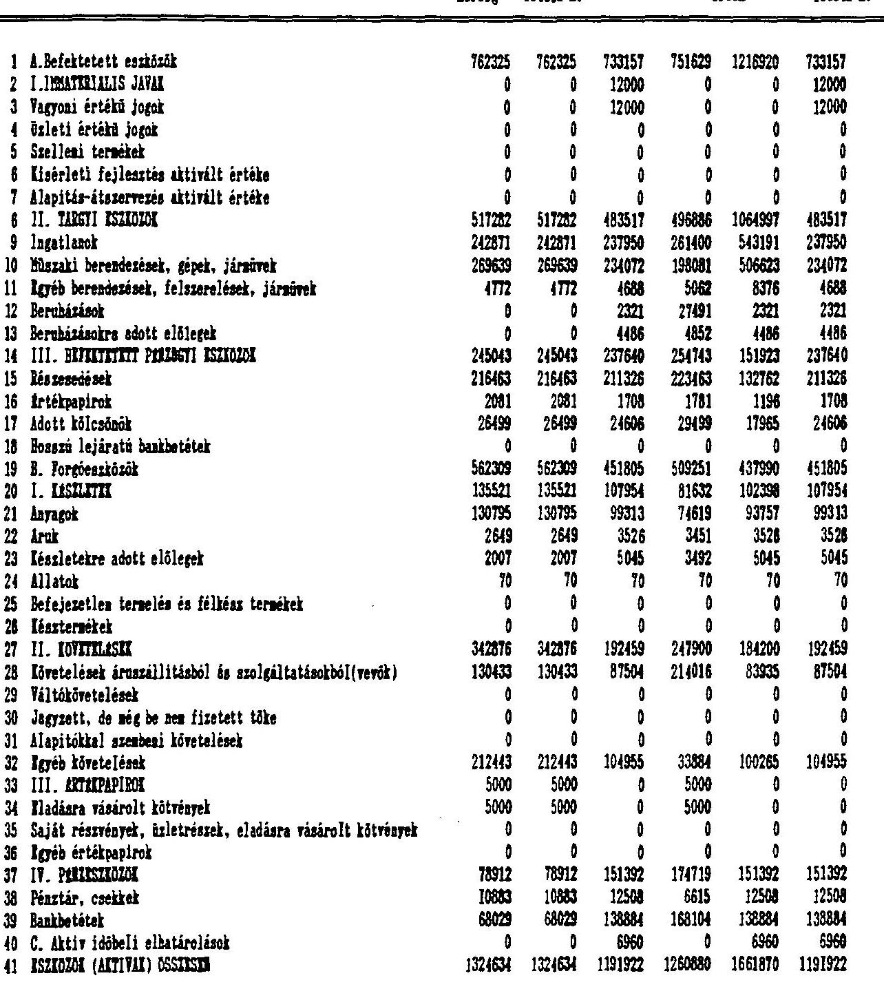

---

Sor. Megnevezés
Sor. Megnevezés
Sor. 1991. 1991. cég- 1992 1992. vagyonmérleg 1992. cég-
rendezó birósági adómérleg könyvit. átért. birósági
mérleg letéti m. érték
letéti m.
12 D. Saját tőke
1048317 1048317 1065050 1088041 1510524 1065050
13 I. JEGTEKTT TOLK
439620 439620 439620 439620 709000 439620
14 II. TOKETARTALAK
26748 26748 42106 42106 801524 42106
15 III. XXKUMENTTARTALAK
579253 579253 588681 585933 0 588681
16 IV. ELOSO AVKK ATNOSOTT VESZTESKEK
0 0 -20120 0 0 -20120
17 V. MARLEG GZERINTI YRKUMANT
2696 2696 14763 20382 0 14763
18 K. Cőltartalékok
0 0 8363 0 32837 8363
19 1. Cőltartalék a várható veszteségekre
0 0 8 0 32837 0
50 2. Cőltartalék a várható kötelezettségekre
0 0 8363 0 0 8363
51 3. Egyéb cőltartalék
0 0 0 0 0 0
52 V. Kötelezettségek
276317 276317 108505 172839 108505 108505
53 I. HOSZGU LAJARATU KOTYLEZETTSEGEK
13000 13000 7385 35719 7385 7385
54 Beruházási és fejlesztési hitelek
13000 13000 0 13000 0 0
55 Egyéb hosszú lejáratú hitelek
0 0 7385 0 7385 7385
56 Hosszú lejáratra kapott kölcsönök
0 0 0 8056 0 0
57 Tartozások kötvénykibocsátásból
8 0 0 14663 0 0
58 Alapítókkal eszebeni kötelezettségek
0 0 0 0 0 0
59 Egyéb hosszú lejáratú kötelezettségek
0 0 0 0 0 0 0
60 II. ROVID LAJARATU KOTYLEZETTSEGEK
263317 263317 101120 137120 101120 101120
61 Tevőtől kapott előlegek
-15474 -15474 900 12074 900 900
62 Kötelezettségek áruszállitásból és szolgáltatásokból (száll)
106660 106660 66566 72260 66566 66566
63 Váltótartozások
0 0 0 0 0 0
64 Rövid lejáratú hitelek
71000 71000 13000 15530 13000 13000
65 Rövid lejáratú kölcsönök
31915 31915 8 0 0 0
66 Egyéb rövid lejáratú kötelezettségek
69216 69216 20654 36256 20654 20654
67 G. Panaziv időbeli elhatárolások
0 0 10004 0 10004 10004
82 PORRASOK (PASSZIVAR) OSSZECKK
1324634 1324634 1191922 1260880 1661870 1191922

---

#### Lala Volán

|  "B" eredménykizotatás |  |  |  |  | (szer /t) |  |   |
| --- | --- | --- | --- | --- | --- | --- | --- |
|  Sor. | Megnevezés | 1991. | 1991. cég- | 1992. | 1992. | vagyonmérleg | 1992. cég-  |
|   |  | rendeső | bírósági | odómérleg | könyvit. | átért. | bírósági  |
|   |  | mérleg | letéti a. |  | érték |  | letéti a.  |
|  01 | Belföldi értékesítés nettó árbevétele | 2098708 | 2098708 | 1592971 | 0 | 0 | 1592971  |
|  02 | Export értékesítés nettó árbevétele | 0 | 0 | 0 | 0 | 0 | 0  |
|  I | Ertékesítés nettó árbevétele | 2098708 | 2098708 | 1592971 | 0 | 0 | 1592971  |
|  II | Egyéb bevételek | 2865 | 2865 | 257918 | 0 | 0 | 257918  |
|  03 | Ertékesítés elszámolt közvetlen ősköltsége | 1043673 | 1043673 | 1010423 | 0 | 0 | 1010423  |
|  04 | Eladott áruk beszerzési értéke, alvállalkozói teljesítve, ért. | 558769 | 558769 | 489486 | 0 | 0 | 489486  |
|  III | Az értékesítés közvetlen költségei | 1602442 | 1602442 | 1499909 | 0 | 0 | 1499909  |
|  05 | Ertékesítés költsége | 0 | 0 | 34015 | 0 | 0 | 34015  |
|  06 | Igazgatási költségek | 332783 | 332783 | 423552 | 0 | 0 | 423552  |
|  07 | Egyéb általános költségek | 149664 | 149664 | 32000 | 0 | 0 | 32000  |
|  IV | Az értékesítés közvetett költségei | 473447 | 473447 | 489567 | 0 | 0 | 489567  |
|  V | Egyéb ráfordítások | 49264 | 49264 | -151910 | 0 | 0 | -151910  |
|  A | HIZZI (OSLATTI) TEYELENTGEGEZ EKEUMENTE | -23580 | -23580 | 13323 | 0 | 0 | 13323  |
|  08 | Kapott kamatok és kamatjellegű bevételek | 29737 | 29737 | 26370 | 0 | 0 | 26370  |
|  09 | Kapott osztalék és részesedés | 5133 | 5133 | 17934 | 0 | 0 | 17934  |
|  10 | Pénzügyi adveletek egyéb bevételei | 0 | 0 | 2705 | 0 | 0 | 2705  |
|  VI | Pénzügyi adveletek bevételei | 34870 | 34870 | 47009 | 0 | 0 | 47009  |
|  11 | Fizetett kamatok és kamatjellegű kifizetések | 3473 | 3473 | 15682 | 0 | 0 | 15682  |
|  12 | Pénzügyi befektetések leírása | 0 | 0 | 22600 | 0 | 0 | 22600  |
|  13 | Pénzügyi adveletek egyéb ráfordításai | 2865 | 2865 | 3499 | 0 | 0 | 3499  |
|  VII | Pénzügyi adveletek ráfordításai | 6338 | 6338 | 41781 | 0 | 0 | 41781  |
|  B | PÉREZGYT! HUVELETTE EKEUMENTE | 28532 | 28532 | 5228 | 0 | 0 | 5228  |
|  C | SZOKÁSOS VÁLLALEGZÁSI EKEUMENT | 4952 | 4952 | 18551 | 0 | 0 | 18551  |
|  VIII | Rendkívüli bevételek | 16000 | 16000 | 14139 | 0 | 0 | 14139  |
|  IX | Rendkívüli ráfordítások | 5077 | 5077 | 13006 | 0 | 0 | 13006  |
|  D | RENDEKIVOLI EKEUMENT | 10923 | 10923 | 1133 | 0 | 0 | 1133  |
|  E | ADASAS ELŐTTI EKEUMENT | 15875 | 15875 | 19684 | 0 | 0 | 19684  |
|  X | Ádófizetési kötelezettség | 4276 | 4276 | 0 | 0 | 0 | 0  |
|  F | ADASOTT EKEUMENT | 11599 | 11599 | 19684 | 0 | 0 | 19684  |
|  14 | Eredményártaiak igénybevétele osztalékra, részesedésre | 0 | 0 | 0 | 0 | 0 | 0  |
|  15 | Fizetett (jóváhagyott) osztalék, részesedés | 8903 | 8903 | 4921 | 0 | 0 | 4921  |
|  G | MÁRLÉG SZESÍRTI EKEUMENT | 2696 | 2696 | 14763 | 0 | 0 | 14763  |

---

| Sor. | Megnevezés | 1991. | 1991. cég | 1992. | 1992. vagyonmérleg | 1992. cég |
|--------|-----------------|---------|---------|---------|-----------------|---------|
| 1. A. Befektetett eszközök | 4661674 | 4661674 | 4515266 | 4530145 | 9135219 | 4511673 |
| 2. I. Inwartenialis javak | 8979 | 8979 | 28552 | 16552 | 14625 | 28552 |
| 3. Tegyoni értékủ jogok | 1300 | 1300 | 13183 | 1183 | 600 | 13183 |
| 4. Össleti értékủ jogok | 0 | 0 | 0 | 0 | 0 | 0 |
| 5. Gszellemi termékek | 7679 | 7679 | 7999 | 7999 | 6655 | 7999 |
| 6. Elsérleti fejlesztés aktivált értéke | 0 | 0 | 0 | 0 | 0 | 0 |
| 7. Alapítás-élszervesén aktivált értéke | 0 | 0 | 0 | 7370 | 7370 | 7370 |
| 8. II. TAKOTI ESZKÖZÖK | 3835435 | 3835435 | 3570373 | 3585022 | 8431191 | 3571653 |
| 9. Ingatlanok | 2049448 | 2049448 | 2078178 | 2101628 | 5053148 | 2078178 |
| 10. Muszali berendezések, gépek, jármúvek | 1412327 | 1412327 | 1188995 | 1154416 | 3047188 | 1190407 |
| 11. Egyéb berendezések, felszerelések, jármúvek | 242123 | 242123 | 173222 | 173529 | 200150 | 173155 |
| 12. Beraházások | 131366 | 131366 | 102427 | 127532 | 103154 | 102382 |
| 13. Beraházásokra adott előlegek | 171 | 171 | 27551 | 27917 | 27551 | 27551 |
| 14. III. BEVEKETETTE PENZOOTI ESZKÖZÖK | 817260 | 817260 | 916341 | 928571 | 689403 | 911468 |
| 15. Részesedések | 633276 | 633276 | 732250 | 744387 | 564175 | 732250 |
| 16. Értékpapírok | 34928 | 34928 | 32991 | 33064 | 20476 | 32991 |
| 17. Adott kölcsönök | 149056 | 149056 | 151100 | 151120 | 104752 | 146227 |
| 18. Bonzai lejáratú bankbetétek | 0 | 0 | 0 | 0 | 0 | 0 |
| 19. B. Forgóeszközök | 2511166 | 2511166 | 2091576 | 2189399 | 1941984 | 2131953 |
| 20. I. ESSZLATTEK | 695833 | 695833 | 549986 | 531092 | 492240 | 557414 |
| 21. Anyagok | 659413 | 659413 | 532704 | 504741 | 466222 | 529435 |
| 22. Arub | 5518 | 5518 | 4493 | 4418 | 4418 | 4493 |
| 23. Készletekre adott előlegek | 9351 | 9351 | 11564 | 19273 | 20826 | 20826 |
| 24. Allatok | 776 | 776 | 1722 | 776 | 776 | 1722 |
| 25. Befeljesztlen termelen és félkész termékek | 20567 | 20567 | -497 | 1884 | 0 | 938 |
| 26. Résztermékek | 208 | 208 | 0 | 0 | 0 | 0 |
| 27. II. KÖVETELÉSEK | 1598064 | 1598064 | 1256379 | 1344736 | 1064500 | 1289295 |
| 28. Követelések áruszállításból és szolgáltatásokból (vevők) | 965118 | 965118 | 640317 | 770759 | 439374 | 644247 |
| 29. Váltókövetelések | 6000 | 6000 | 0 | 0 | 0 | 0 |
| 30. Jegyzett, de még be nem fizetett tőke | 0 | 0 | 0 | 0 | 0 | 0 |
| 31. Alapítókkal szembeni követelések | 0 | 0 | 0 | 0 | 0 | 0 |
| 32. Egyéb követelések | 626946 | 626946 | 616062 | 573977 | 625128 | 645048 |
| 33. III. ARTEKPAPÍROK | 8890 | 8890 | 0 | 5900 | 0 | 0 |
| 34. Eladásra visárolt kötvények | 5000 | 5000 | 0 | 5000 | 0 | 0 |
| 35. Saját részvények, üzletrészek, eladásra visárolt kötvények | 3890 | 3890 | 0 | 0 | 0 | 0 |
| 36. Egyéb értékpapírok | 0 | 0 | 0 | 0 | 0 | 0 |
| 37. IV. PENZESSZÖZÖK | 208379 | 208379 | 285211 | 308571 | 285244 | 285244 |
| 38. Pénztár, csatáak | 24484 | 24484 | 27279 | 21386 | 27279 | 27279 |
| 39. Bankbetétek | 183895 | 183895 | 257932 | 287185 | 257965 | 257965 |
| 40. C. Aktív időbeli elhatárolások | 6511 | 6511 | 67991 | 61906 | 30175 | 67966 |
| 41. ESZKÖZÖK (AKTIVAK) GÖZTÉSEK | 7179351 | 7179351 | 6674833 | 6780550 | 11007378 | 6711592 |

---

As Alba, a Eixalíold, a Vaxi, a Fértes és a Zala Volán valamint a Volánbus összesen.
Hérleg eszközök, források
Sor. Hegnevezés

1991. 1991. cég- 1992
rendezó
mérleg
1992. vargromérleg
kötétt u.
1992. vagyomérleg
átért.
érték
1992. cég-
bírósági
letéti u.

42 D. Saját tőke
43 I. JEOTZETT TÖKE
44 II. TÖKETARTALAK
45 III. EKEUMENTTARTALAK
46 IV. KLOZO EVEK ATMOSZTT VESZTESZGE
47 V. MARLEG SZERINTI EKEUMENT
48 K. CÉltartalékok
49 1. Céltartalék a várható veszteségekre
50 2. Céltartalék a várható kötelessettségekre
51 3. Egyéb céltartalék
5220561 5220561 5248612 5252372 9496149 5229381
4244187 4244187 4244187 4244187 4341925 4244187
419401 419401 419293 419293 5097997 419293
590068 590068 569622 566833 38550 569581
-43000 -43000 -27120 -7000 0 -27120
9905 9905 42630 29059 17677 23440
0 0 28108 26753 67137 35116
0 0 19745 26753 55340 26753
0 0 8363 0 11797 8363
0 0 0 0 0 0 0
1923138 1923138 1298326 1405938 1369058 1341604
139818 139818 36185 64519 36185 36185
65600 65600 18800 31800 18800 18800
55 Egyéb hossza lejáratú hitelek
0 0 7385 0 7385
56 Hossza lejáratra kapott kölcsönök
1775 1775 0 8056 0 0
57 Tartozások kötvénykibocsátásból
48000 48000 10000 24663 10000 10000
58 Alapítókkal szembeni kötelessettségek
0 0 0 0 0 0
59 Egyéb hossza lejáratú kötelessettségek
24443 24443 0 0 0 0
00 II. BOVID LAJARATH KOTKLEZETTSEGEK
1763320 1763320 1262141 1341419 1332873 1305419
01 Fevőtől kapott előlegek
-6209 -6209 6797 19361 8961 6187
62 Kötelesettségek áruszállitásból és szolgáltatásokból (száll)
655623 655623 410904 421529 428433 414835
63 Féltótartozások
0 0 22632 22632 22632 22632
64 Rövid lejáratú hitelek
317973 317973 206798 208552 206022 206022
65 Rövid lejáratú kölcsönök
107866 107866 39520 39520 39520 39520
66 Egyéb rövid lejáratú kötelessettségek
708067 708067 575490 629825 627305 614223
67 G. Panszív időbeli elhatárolások
35652 35652 99787 95487 75034 105491
82 FORRASOK (PASSZÍVAK) OSSZKSEN
7179351 7179351 6674833 6780550 11007378 6711592

---

As Alba, a Lisalföld, a Vasl, a Vértes és a Zala Volán összesen.
"B" eredménykimutatás
Sor. Megnevezés
(ezar /t)
1991. cég- 1992 1992. vagyonmérleg 1992. cég-
rendezó birósági adómérleg könyvit. átért. birósági
mérleg letéti n.
1991. cég- 1992 1992. vagyonmérleg 1992. cég-
rendezó birósági adómérleg könyvit. átért. birósági
mérleg letéti n.

01 Belföldi értékesítés nettó árbevétele 7507407 7507407 7538389 861106 0 7579938
02 Export értékesítés nettó árbevétele 866386 866386 620750 36012 0 579981
I értékesítés nettó árbevétele 8373793 8373793 8159139 897118 0 8159919
II Egyéb bevételek 217243 217243 490431 53518 0 495265
03 Ertékesítés elszámolt közvetlen önköltsége 5164315 5164315 5009441 614673 0 5011935
04 Eladott áruk benzerzési értéke, alvállalkozói teljesítu.ért. 925903 925903 914281 42822 0 914560
III Az értékesítés közvetlen költségei 6090218 6090218 5923722 657495 0 5926495
05 Ertékesítés költsége 459042 459042 923839 51537 0 922700
06 Igazgatási költségek 1327872 1327872 1235649 123220 0 1244863
07 Egyéb általános költségek 317975 317975 172890 54501 0 172988
IV Az értékesítés közvetett költségei 2104689 2104689 2332578 229258 0 2340551
V Egyéb ráfordítások 233737 233737 164461 50252 0 171762
A UZEMÍ (OZLETI) TEVELENTÖRGEK EREUMENTE 162392 162392 228809 13631 0 216376
08 Kapott kamatok és kamatjellegá bevételek 52478 52478 58055 1628 0 63527
09 Kapott osztalék és részenedés 21430 21430 26118 103 0 28117
10 Pénzügyi műveletek egyéb bevételei 6342 6342 7729 573 0 7558
VI Pénzügyi műveletek bevételei 80250 80250 91902 2304 0 97202
11 Fizetett kamatok és kamatjellegá kifizetések 128258 128258 119608 20458 0 110557
12 Pénzügyi befektetések leírása 0 0 25544 0 0 25530
13 Pénzügyi műveletek egyéb ráfordításai 3601 3601 10913 838 0 10901
VII Pénzügyi műveletek ráfordításai 131859 131859 147165 21296 0 146988
B PENZOGYI MÚVELATTEK EREUMENTE -51609 -51609 -55283 -16992 0 -49786
C SZOKASOS VALLAZADZASI EREUMENT 110783 110783 173546 -5361 0 166590
VIII Rendkívüli bevételek 55284 55284 110775 17990 0 110944
IX Rendkívüli ráfordítások 167327 167327 207862 12031 0 207862
D RENDKIVOLI EREUMENT -112043 -112043 -97087 5959 0 -96918
E ADOSAS ELŐTTI EREUMENT -1260 -1260 76459 598 0 69663
X Adófizetési kötelezettség 8328 8328 29648 0 0 29735
F ADOSOTT EREUMENT -9568 -9568 46611 598 0 39928
14 Eredménytartalék igénybevétele osztalékra, részenedésre 1256 1256 0 0 0 0
15 Fizetett (járábagyott) osztalék, részenedés 11235 11235 23568 90 0 23658
G MARLEG SZERINTI EREUMENT -23735 -23735 23043 508 0 16279

-57-

---

I
I
I
I
I
I
I
I
IV. Záradékok
I
I
I
I
I

---

Cég megnevezése: VASI VOLAN Rt.
Címe: Szombathely, Körmendi út 92.

# ZARADÉK 

A folyamatos egyeztetés eredményoként kialakult cégemre vonatkozó adatokat, valamint a mérlegek adataiként ki. mutatott értékcket aláirásommal pontosnak és valósnak is. merem el.

Szombathely, 1993. július 7.
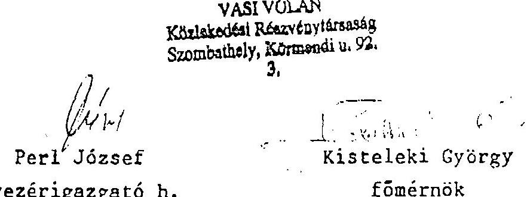

---

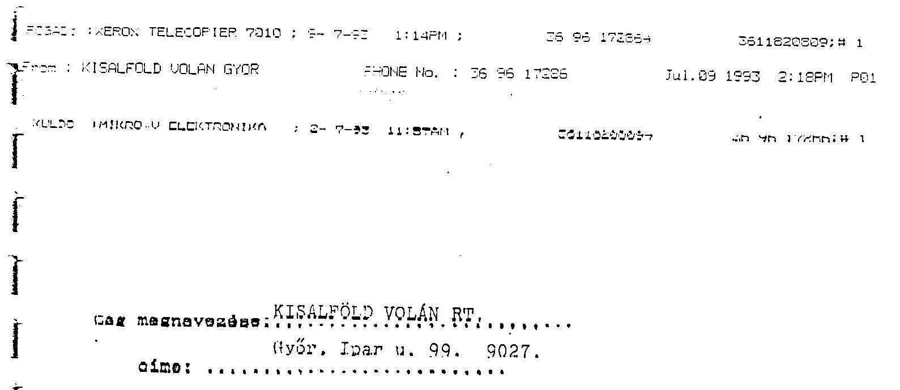

# EI 

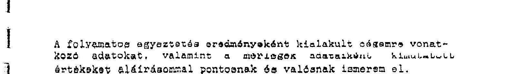
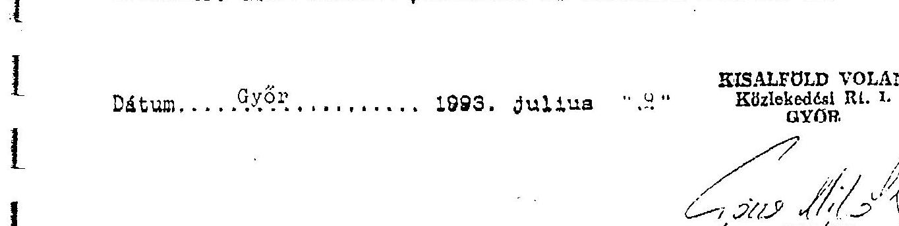

---

# VERTES VOLAN Rt 

## Iatabanya

## ZARADFK

A folyamatos egyeztetés eredményoként kialakult cégemle vonatkozn adatokat, valamint a mérlegek adataiként kimutatull értékeket alárásommal pontnanak és valósnak ismerem cl.

Tatabánya, 1993, túlius 9.
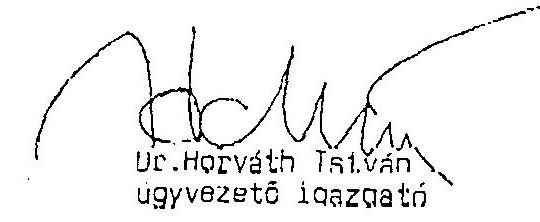

VERTES VOLAN
Tatabanya I., Csaba utca 19.

---

-56-1-149-8766 VOLANBUSZ RT. .EZ. 1GM 235 P01 03.07.93 12:21

Gugle. 18.1/92

|  |   |
| --- | --- |
|  LULDO | : : IKRO-U ELEKTRONIKA : 2- 7-93 9:20AM : 3611823809+ +36 : 149 8766;# 1  |
|  |   |
|  Ceg megnevezese: . . . VOLÁNBUSZ RT. |   |
|  cime: . . Budapest, XIII. Szabolcs u.17. 1134. |   |
|  |   |
|  ZARADAK |   |
|  |   |
|  A folyamatod egyeztetés eredményeként kialakult oégemre vonat- |   |
|  kozó adatokat, valamint a mérlegék adataiként kimutatott |   |
|  értékeket aláírásommal pontosnak és valósnak ismerem el. |   |
|  |   |
|  Dátum. 1993. Julius ". |   |
|  |   |
|  VOLÁNBUSZ Rt. |   |
|  (14.) |   |
|  / Fola Gyula / / dr. Pengrácz Bárbara |   |
|  vezérigazkatéhelyezze | fékényveje  |
|  |   |
|  |   |
|  |   |
|  |   |
|  |   |
|  |   |
|  |   |
|  |   |
|  |   |
|  |   |
|  |   |
|  |   |
|  |   |
|  |   |
|  |   |
|  |   |
|  |   |
|  |   |
|  |   |
|  |   |
|  |   |
|  |   |
|  |   |
|  |   |
|  |   |
|  |   |
|  |   |
|  |   |
|  |   |
|  |   |
|  |   |
|  |   |
|  |   |
|  |   |
|  |   |
|  |   |
|  |   |
|  |   |
|  |   |
|  |   |

---

Dr. Zombori Györgyné
$1 n 20-809$
részére

Cég megnevezése: Zala Volán Köztukcećzi Kőszvénytársaság Cime:

8900 Zalaegerszeg, Gasparich u. 16.

# Z A R A П E K 

A folyamatos egyeztotés eredménycként kialakult, cégemre vonatkozó adatokat, valamint a mérleget adataiként kimutatott értékeket alárásommal pontosnak és valóznak ismerem el.

Zalacgcrszeg, 1993. július 7.

Zala Volán Kïalekedési Ht.
Zalacgcrszcéc. Gasparich u. 16.
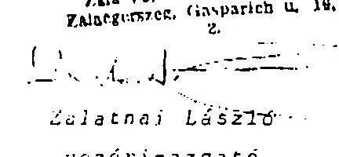

---

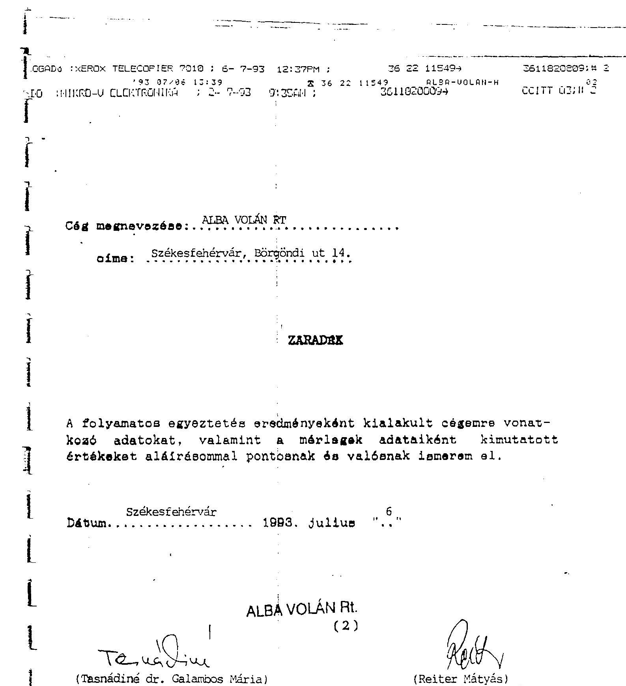

# ALBA VOLÁN RI. 

## (2)

(Tasnádiné dr. Galambos Mária)
gazdasági igazgatóhelyettes

## (Reiter Mátyás)

ügyvezető igazgató